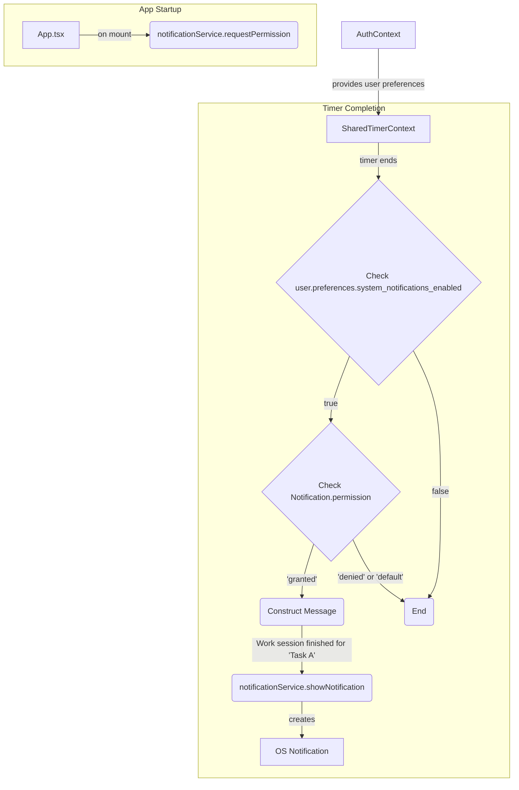

## Context
This feature will provide operating system-level notifications for completed Pomodoro timers and breaks. This will alert users of a completed timer even if the application window is not in focus. The notification will include the name of the task that was just being worked on, if applicable. This feature is contingent on both user preferences within the application (`system_notifications_enabled`) and browser-level notification permissions.

## Structure
The solution will introduce a new, dedicated `NotificationService` to abstract the browser's Web Notification API. The `SharedTimerContext` will be the primary consumer of this service.

### Key Components
1.  **`NotificationService` (New, Planned)**
    -   **Responsibility:** To encapsulate all interactions with the browser's Web Notification API.
    -   **Functions:** `requestPermission()`, `showNotification(title, options)`.
    -   **Reference:** `ARCH-service-notification`

2.  **`SharedTimerContext.tsx` (Modification)**
    -   **Responsibility:** To orchestrate the notification logic at the correct time.
    -   **Changes:** It will be modified to import `useAuth` and the new `NotificationService`.

3.  **`App.tsx` (Modification)**
    -   **Responsibility:** To ensure notification permissions are requested early in the user session.
    -   **Changes:** A `useEffect` hook will be added to call `notificationService.requestPermission()` on component mount.

### Architectural Flow

## Behavior
Upon application startup, a permission request for notifications will be triggered. When a timer in `SharedTimerContext` completes, the context will check if the user has enabled system notifications via their preferences (`useAuth`). If enabled, and if browser permission has been granted, the context will call the `NotificationService` to display a message. The message will be context-aware, indicating whether a work or break session has finished and mentioning the task name if applicable.

The `NotificationService` will be built to fail gracefully if the user denies permissions or the browser does not support the Notification API.

## Evolution
### Historical
- v1: Initial plan to implement OS-level notifications.
