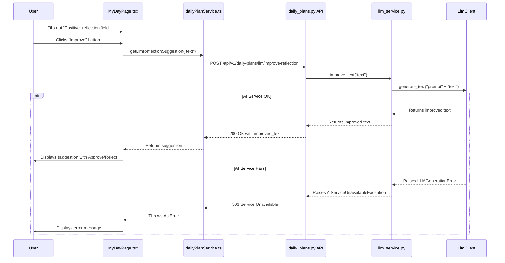

## Context
This feature is planned to replace the existing free-text `reflection_content` field in the Daily Plan with a more structured dictionary containing `positive`, `negative`, and `follow_up_notes` fields. The goal is to provide users with a guided and more actionable reflection experience, enhanced with LLM-powered text improvement capabilities for each field.

## Structure
The implementation will be a vertical slice of changes across the full stack, from the database model to the frontend UI components.

### Key Components
-   **`SelfReflection` (Backend Model):** A new `odmantic.EmbeddedModel` with `positive`, `negative`, and `follow_up_notes` fields. See `ARCH-data-daily-plan-self-reflection`.
-   **`/daily-plans/llm/improve-reflection` (Backend Endpoint):** A new API endpoint to handle generic text improvement for reflection notes. See `ARCH-api-improve-reflection`.
-   **`AIServiceUnavailableException` (Backend Exception):** A new custom exception for handling LLM service failures gracefully.
-   **`SelfReflectionComponent` (Frontend Component):** A new component on `MyDayPage.tsx` to manage the three new reflection fields and their LLM enhancement UIs. See `ARCH-ui-self-reflection-component`.

### Architectural Flow
The planned interaction for the LLM-powered text improvement is as follows:

## Behavior
A user will be able to fill out the three structured reflection fields on the "My Day" page. For each field, they can click an "Improve" button to get an LLM-generated suggestion. They can then approve the suggestion to replace their text or reject it to keep their original text. The entire reflection object is saved as part of the `DailyPlan`.

## Evolution
### Planned
- v1: Initial implementation of the three-field reflection UI with LLM integration.
