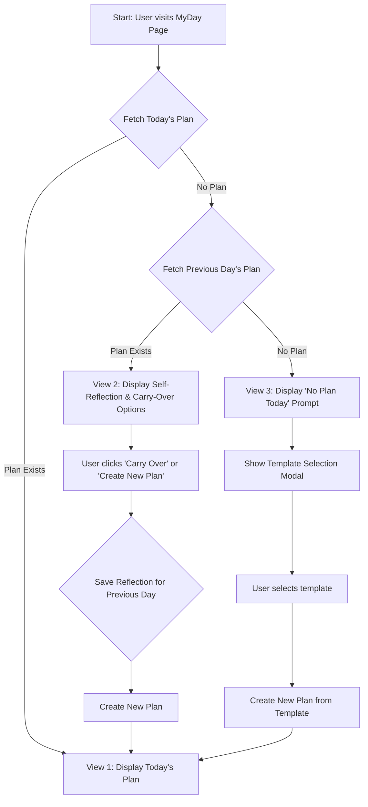

## Context
This feature refactors the `MyDay` page to be a state-driven component that conditionally renders one of three views based on the user's daily plan data. This provides a more guided and context-aware user experience for daily planning and reflection.

## Structure
The `MyDayPage.tsx` component will be refactored to implement a state machine logic. It will fetch data for today's plan and, if not present, for the previous day's plan. The view will change based on the results.

### Architectural Flow

## Behavior
1.  **View 1 (Today's Plan):** If a plan for today exists, it is displayed for editing.
2.  **View 2 (Previous Day Review):** If no plan exists for today but one exists for the previous day, a panel is shown for self-reflection and options to "Carry over" unfinished tasks or "Create new plan". Both actions will first save the reflection for the previous day.
3.  **View 3 (New Plan Prompt):** If no plan exists for today or the previous day, a prompt to create a new plan is shown, leading to the template selection flow.

## Evolution
### Planned
- v1: Initial implementation of the three-view state machine.
