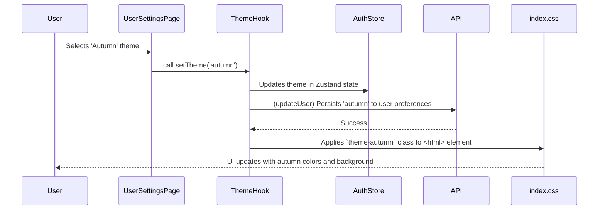

# Refactoring/Design Plan: UI Theming System

## 1. Executive Summary & Goals
This plan outlines the necessary backend and frontend changes to implement a user-selectable UI theming system. The initial implementation will support a default "Summer" theme and a new "Autumn" theme, with the ability to switch between them in the user's profile settings.

- **Primary Objective:** Enable users to personalize their UI experience by choosing a visual theme.
- **Key Goals:**
    1.  Store and manage the user's theme preference in the backend.
    2.  Implement a scalable, CSS-variable-based theming architecture in the frontend.
    3.  Create a theme selector UI in the User Settings page.

## 2. Current Situation Analysis
The system currently has a single, hardcoded "summer" theme characterized by green colors defined in the `tailwind.config.js` file. The user's preferences are stored in the `User` model on the backend, but there is no field for theme selection. To add theme switching, we must introduce a mechanism to store this preference and dynamically apply styles on the frontend.

**Key Areas for Improvement:**
-   **Backend:** The `User` model lacks a field to store theme preference.
-   **Frontend:** Colors in `tailwind.config.js` are static values, preventing dynamic theming. There is no UI for theme selection or a system to apply different style sets globally.

## 3. Proposed Solution / Refactoring Strategy
### 3.1. High-Level Design / Architectural Overview
We will adopt a full-stack approach. The backend will store the user's selected theme as a preference. The frontend will use a CSS variable-driven theming system, controlled by a class applied to the root `<html>` element. The user's preference will be fetched upon login, stored globally (in Zustand), and applied on application load to prevent flashing of the default theme.

**Frontend Theming Flow:**


### 3.2. Key Components / Modules
-   **`User` Model & Schemas (Backend):** To be modified to include a `theme` preference. An `Enum` will define available themes.
-   **`UserService` (Backend):** To be updated to handle the modification of the user's theme preference.
-   **`index.css` (Frontend):** Will contain the root definitions for CSS variables for each theme (e.g., `html.theme-summer`, `html.theme-autumn`).
-   **`tailwind.config.js` (Frontend):** To be refactored to use the CSS variables defined in `index.css` for themeable properties like colors and backgrounds.
-   **`useTheme` Hook (Frontend - New):** A new hook to manage the current theme, apply it to the DOM, and interact with the `authStore`.
-   **`authStore.ts` (Frontend):** The Zustand store will be updated to manage the user's theme preference globally. The `persist` middleware will ensure the theme is loaded instantly from `localStorage`.
-   **`UserSettingsPage.tsx` (Frontend):** Will contain the new UI for theme selection.

### 3.3. Detailed Action Plan / Phases
#### Phase 1: Backend Foundation
-   **Objective(s):** Persist and expose the user's theme preference.
-   **Priority:** High

-   **Task 1.1:** Create a `ThemeEnum`.
    -   **Rationale/Goal:** To define and validate the available themes ("summer", "autumn") in a structured way.
    -   **Estimated Effort (Optional):** S
    -   **Deliverable/Criteria for Completion:** A new `ThemeEnum` is created in `flocus/backend/app/core/enums.py`. It should contain `SUMMER = "summer"` and `AUTUMN = "autumn"`.

-   **Task 1.2:** Update the `User` model to include the theme preference.
    -   **Rationale/Goal:** Add a field to the database to store the selected theme for each user.
    -   **Estimated Effort (Optional):** S
    -   **Deliverable/Criteria for Completion:** The `UserPreferences` embedded model in `flocus/backend/app/db/models/user.py` has a new field: `theme: str = ODMField(default="summer")`.

-   **Task 1.3:** Update API schemas for user preferences.
    -   **Rationale/Goal:** Expose the `theme` in API responses and allow it to be updated.
    -   **Estimated Effort (Optional):** S
    -   **Deliverable/Criteria for Completion:**
        -   In `flocus/backend/app/api/schemas/user.py`, add `theme: str` to `UserPreferencesSchema`.
        -   In the same file, add `theme: Optional[str] = None` to `UserPreferencesUpdateSchema`.

-   **Task 1.4:** Verify `UserService` and `UserMapper`.
    -   **Rationale/Goal:** Ensure the existing service and mapper logic correctly handles the update of the new `theme` field within the `preferences` object.
    -   **Estimated Effort (Optional):** S
    -   **Deliverable/Criteria for Completion:** No code changes are expected, but a manual code review of `UserService.update_user_by_id` and `UserMapper.apply_update_to_model` confirms that the new `preferences.theme` field is handled correctly. Add a new test case for updating the theme.
-   **Task 1.5:** Update existing tests for backend and add new (if needed)

#### Phase 2: Frontend Theming Infrastructure
-   **Objective(s):** Refactor the frontend to support dynamic themes using CSS variables.
-   **Priority:** High

-   **Task 2.1:** Define theme variables in `index.css`.
    -   **Rationale/Goal:** Establish the color palettes and background images for the "summer" and "autumn" themes.
    -   **Estimated Effort (Optional):** M
    -   **Deliverable/Criteria for Completion:** The file `flocus/frontend/src/styles/index.css` is updated. Add the following CSS variable definitions.
        ```css
        @layer base {
          /* Summer Theme (Default) */
          :root, html.theme-summer {
            --background-image-url: url('/backgrounds/summer-1.jpg');
            --color-background-default: #E6F5E6; /* existing background.DEFAULT */
            --color-background-card: #F0FFF0; /* existing background.card */
            --color-text-default: #1F2937; /* existing text.DEFAULT */
            --color-text-secondary: #4B5563; /* existing text.secondary */
            --color-border-default: #E5E7EB; /* existing border.DEFAULT */
          }

          /* Autumn Theme */
          html.theme-autumn {
            --background-image-url: url('/backgrounds/autumn.jpg');
            --color-background-default: #FEFCE8; /* A very light beige/cream */
            --color-background-card: #FEF9C3; /* A slightly darker cream */
            --color-text-default: #422006; /* A dark brown */
            --color-text-secondary: #78350F; /* A warm, medium brown */
            --color-border-default: #E7E5E4; /* A light, warm gray */
          }

          body {
            /* ... existing body styles ... */
            background-image: var(--background-image-url);
          }
        }
        ```

-   **Task 2.2:** Update `tailwind.config.js` to use CSS variables.
    -   **Rationale/Goal:** Decouple the Tailwind configuration from static color values, making it theme-aware.
    -   **Estimated Effort (Optional):** M
    -   **Deliverable/Criteria for Completion:** The `tailwind.config.js` file is modified. The `colors` section for `background`, `text`, and `border` now reference the new CSS variables. The main app container will need to use `bg-theme-background` and `bg-cover`.
        ```javascript
        // tailwind.config.js (excerpt)
        // ...
        extend: {
          colors: {
            background: {
              DEFAULT: 'var(--color-background-default)',
              card: 'var(--color-background-card)',
            },
            text: {
              DEFAULT: 'var(--color-text-default)',
              secondary: 'var(--color-text-secondary)',
              // ... other text colors if they should be themed
            },
            border: {
              DEFAULT: 'var(--color-border-default)',
              // ... other border colors if they should be themed
            },
            // ... keep other colors like primary, accent, etc. if they are not meant to be themed yet
          },
          backgroundImage: {
            'theme-background': 'var(--background-image-url)',
          },
          // ... rest of extend
        }
        // ...
        ```

-   **Task 2.3:** Create a `useTheme` hook.
    -   **Rationale/Goal:** Centralize the logic for applying the current theme and handling theme changes.
    -   **Estimated Effort (Optional):** M
    -   **Deliverable/Criteria for Completion:** A new file `flocus/frontend/src/hooks/useTheme.ts` is created. It will read the theme from the `authStore`, apply the correct class (`theme-summer` or `theme-autumn`) to the `<html>` element, and provide a `setTheme` function.
    - `useTheme.ts` should be overed with unit tests.

-   **Task 2.4:** Integrate theme preference into `authStore`.
    -   **Rationale/Goal:** Store the user's theme globally and persist it to `localStorage` for instant application on page load.
    -   **Estimated Effort (Optional):** S
    -   **Deliverable/Criteria for Completion:** The `authStore.ts` is updated. The user object within the store will now include the `theme`. The `persist` middleware will be configured to also save the `user.preferences.theme` to `localStorage` for instant application.
    - Update existing tests and add new (if needed)

#### Phase 3: UI Implementation
-   **Objective(s):** Implement the user-facing theme selector.
-   **Priority:** Medium

-   **Task 3.1:** Add theme selector to `UserSettingsPage.tsx`.
    -   **Rationale/Goal:** Create the UI for users to change their theme.
    -   **Estimated Effort (Optional):** M
    -   **Deliverable/Criteria for Completion:** The `UserSettingsPage.tsx` file is updated with a new "Appearance" or "Theme" section containing a dropdown menu to select "Summer" or "Autumn".

-   **Task 3.2:** Connect theme selector to the `useTheme` hook and backend.
    -   **Rationale/Goal:** Make the UI functional, allowing theme changes to be applied and persisted.
    -   **Estimated Effort (Optional):** M
    -   **Deliverable/Criteria for Completion:** When a user selects a new theme in `UserSettingsPage.tsx`, the `setTheme` function from the `useTheme` hook is called. This triggers a backend API call via the `useUpdateUser` mutation to save the preference.

-   **Task 3.3:** Ensure the application's root component applies the theme on load.
    -   **Rationale/Goal:** The selected theme must be applied globally as soon as the app loads.
    -   **Estimated Effort (Optional):** S
    -   **Deliverable/Criteria for Completion:** The `App.tsx` component (or a similar root component) calls the `useTheme` hook to ensure the theme class is applied to the `<html>` element on initial render.
-   **Task 3.4:** Update existing tests and add new (if needed) for all changes done in Phase 3

### 3.4. Data Model Changes
-   **`UserPreferences` Embedded Model (`backend/app/db/models/user.py`):**
    -   Add `theme: str = ODMField(default="summer")`

### 3.5. API Design / Interface Changes
-   **`UserPreferencesSchema` (`backend/app/api/schemas/user.py`):**
    -   Add `theme: str`
-   **`UserPreferencesUpdateSchema` (`backend/app/api/schemas/user.py`):**
    -   Add `theme: Optional[str] = None`
-   **API Endpoint:** No new endpoints are needed. The existing `PUT /api/v1/users/{user_id}` will handle the update via the modified `UserUpdateRequest` schema.

## 4. Key Considerations & Risk Mitigation
### 4.1. Technical Risks & Challenges
-   **Risk:** A flash of the default (summer) theme before the user's preferred theme is loaded from `localStorage`.
    -   **Mitigation:** The `useTheme` hook will be designed to read from `localStorage` synchronously on initialization and apply the theme class immediately, minimizing any potential flash. The `authStore`'s `persist` middleware should handle this effectively.
-   **Risk:** Some UI components might have hardcoded colors that are not covered by the Tailwind theme variables.
    -   **Mitigation:** A thorough review of frontend components will be necessary during Phase 2. The plan focuses on refactoring `tailwind.config.js`, which is the primary source of colors, but a global search for color codes (e.g., `#`, `rgb(`, `bg-green-500`) is recommended.

### 4.2. Dependencies
-   **Internal:** Frontend work (Phase 2 & 3) is dependent on the completion of the Backend Foundation (Phase 1).
-   **External:** The user will provide the "autumn" background image at `frontend/public/backgrounds/autumn.jpg`. A placeholder will be used until the final asset is available.

### 4.3. Non-Functional Requirements (NFRs) Addressed
-   **Usability:** The core goal is to improve usability and user satisfaction by allowing personalization.
-   **Maintainability:** Using CSS variables creates a centralized and easily extensible theming system. Adding new themes in the future will only require adding a new CSS class definition and updating the backend `ThemeEnum`.
-   **Performance:** The theme is applied via a single class on the `<html>` element, which is highly performant. Loading the preference from `localStorage` ensures a fast initial render with the correct theme.

## 5. Success Metrics / Validation Criteria
-   **Backend:** Unit and integration tests pass for updating and retrieving a user's theme preference.
-   **Frontend:**
    1.  The UI correctly displays the "Summer" theme by default for new users.
    2.  Selecting "Autumn" in User Settings successfully changes the application's color scheme and background.
    3.  The selected theme persists across page reloads and new login sessions.
    4.  No "flash of unthemed content" is visible on initial load.

## 6. Assumptions Made
-   The current green-based color scheme will be codified as the "summer" theme.
-   The "autumn" theme color palette has been defined within this plan.
-   The "autumn" background image will be available at `frontend/public/backgrounds/autumn.jpg`.
-   The theming system should not interfere with any potential future dark mode functionality.

## 7. Open Questions / Areas for Further Investigation
-   All initial questions have been resolved.
