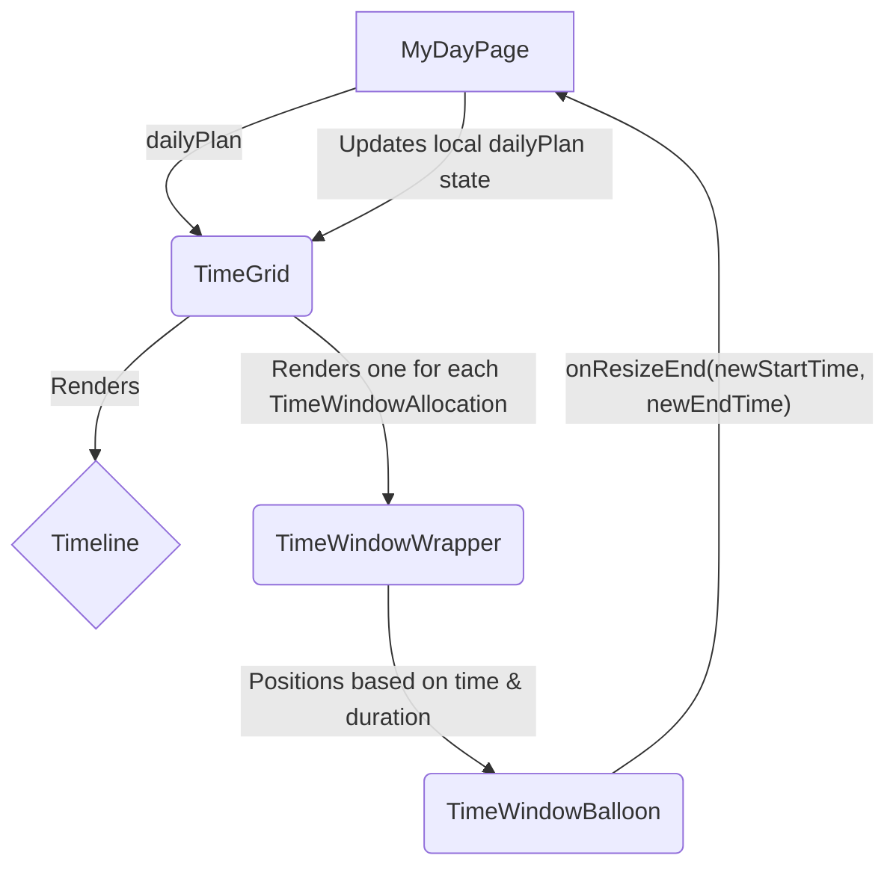

# Refactoring Plan: Implement Resizable Time Windows

## 1. Executive Summary & Goals
This plan outlines the strategy for implementing a drag-to-resize functionality for Time Window components on the "My Day" page. The current layout is not suitable for this feature, so a foundational refactoring of the page's structure is required before implementing the resizing logic itself.

-   **Primary Objective:** Enable users to intuitively adjust the start and end times of their daily time windows by dragging the top and bottom borders of the component.
-   **Key Goals:**
    1.  Refactor the `MyDayPage` to use an absolutely positioned layout for time windows, accurately reflecting their time and duration.
    2.  Implement a robust and user-friendly drag-to-resize mechanism on the `TimeWindowBalloon` component.
    3.  Ensure all changes are state-managed, with validation to prevent overlapping time windows, and are persisted via the existing "Save" functionality.

## 2. Current Situation Analysis
-   **Component:** `frontend/src/pages/MyDayPage.tsx` currently renders `TimeWindowBalloon` components in a simple vertical list (`<section className="flex-1 space-y-4">`).
-   **Limitation:** This flow-based layout prevents visual resizing and correct vertical positioning based on time. The component's on-screen position does not correlate with its `start_time`, and its height does not represent its duration.
-   **Data Flow:** The page fetches the daily plan using `useTodayDailyPlan` and stores it in a local state variable `dailyPlan`, which is appropriate for making local modifications before saving. The `handleSaveDailyPlan` function correctly triggers an API call to persist changes.
-   **Pain Point:** The core architecture of the `MyDayPage` layout is incompatible with the requested feature. A direct implementation is not possible without refactoring this layout first.

## 3. Proposed Solution / Refactoring Strategy
### 3.1. High-Level Design / Architectural Overview
The solution is a three-phase approach. First, we will refactor the `MyDayPage` to render time windows on a vertically-scaled timeline grid. Second, we will add the UI handles and encapsulated resizing logic to the `TimeWindowBalloon` component. Finally, we will connect the component's resize events to the page's state management, including validation and persistence.

A new component, `TimeGrid`, will be introduced to manage the positioned layout, abstracting this complexity from `MyDayPage`.

### 3.2. Key Components / Modules
-   **`MyDayPage.tsx` (Modified):**
    -   Will be simplified to delegate the rendering of the schedule to the new `TimeGrid` component.
    -   Will host the `handleResizeEnd` callback function to update its local `dailyPlan` state.
    -   Will manage opening/closing the `EditDailyPlanTimeWindowModal`.
-   **`TimeGrid.tsx` (New Component):**
    -   **Responsibility:** To create a container that represents a 24-hour day. It will render the `Timeline` and iterate over `TimeWindowAllocation`s.
    -   For each time window, it will render a positioned wrapper (`TimeWindowWrapper`) that calculates and applies the `top` and `height` styles.
-   **`TimeWindowBalloon.tsx` (Modified):**
    -   **Responsibility:** To display time window information and handle user interactions.
    -   Will be enhanced with top and bottom resize "handles".
    -   Will contain the `onMouseDown` logic for initiating a resize.
    -   Will trigger an `onResizeEnd` prop callback with the new start/end times when the user releases the mouse.
-   **`useResizable.ts` (New Hook):**
    -   **Responsibility:** To encapsulate the complex logic of a resize drag interaction (mouse events, calculating new dimensions, and handling boundary constraints). This promotes reusability and cleans up the component logic.
-   **`utils.ts` (Modified):**
    -   New helper functions will be added to convert pixel offsets to time (minutes) and vice-versa, based on a defined scale.

### 3.3. Detailed Action Plan / Phases

#### Phase 1: Foundational Layout Refactoring
-   **Objective(s):** Rearchitect the `MyDayPage` to support a time-based positional layout for time windows.
-   **Priority:** High (Blocker)

-   **Task 1.1: Create `TimeGrid` Component**
    -   **Rationale/Goal:** Abstract the complex schedule layout logic out of `MyDayPage`.
    -   **Estimated Effort:** M
    -   **Deliverable/Criteria for Completion:**
        -   Create `frontend/src/components/TimeGrid.tsx`.
        -   The component accepts `timeWindows: TimeWindowAllocation[]` and an `onTimeWindowUpdate` callback prop.
        -   It renders a main container with `position: relative`.
        -   The `Timeline` component is rendered inside it.

-   **Task 1.2: Implement Positional Rendering in `TimeGrid`**
    -   **Rationale/Goal:** Display time windows visually according to their start time and duration.
    -   **Estimated Effort:** M
    -   **Deliverable/Criteria for Completion:**
        -   Define a scale constant (e.g., `PIXELS_PER_MINUTE = 2`).
        -   The `TimeGrid` component maps over its `timeWindows` prop.
        -   For each time window, it renders a wrapper `div` with `position: absolute`.
        -   The wrapper's `top` and `height` are calculated based on the time window's `start_time`, `end_time`, and the scale constant.
        -   The `TimeWindowBalloon` is rendered inside this positioned wrapper.

-   **Task 1.3: Integrate `TimeGrid` into `MyDayPage`**
    -   **Rationale/Goal:** Replace the old layout with the new time-based grid.
    -   **Estimated Effort:** S
    -   **Deliverable/Criteria for Completion:**
        -   In `MyDayPage.tsx`, remove the existing `<section>` that maps over time windows.
        -   Render the new `<TimeGrid />` component, passing the `dailyPlan.time_windows` and the state update handler (`setDailyPlan`) to it.
        -   The page should now visually represent the time windows on a scalable timeline.

#### Phase 2: Implement Component-Level Resizing Logic
-   **Objective(s):** Add resize handles and interaction logic to the `TimeWindowBalloon`.
-   **Priority:** High

-   **Task 2.1: Add Resize Handles to `TimeWindowBalloon`**
    -   **Rationale/Goal:** Provide visual cues and interactive elements for resizing.
    -   **Estimated Effort:** S
    -   **Deliverable/Criteria for Completion:**
        -   In `TimeWindowBalloon.tsx`, add two `div` elements for the top and bottom handles.
        -   Style them to appear on hover and have a `cursor: ns-resize` property.
        -   Attach `onMouseDown` event handlers to these handles.

-   **Task 2.2: Create `useResizable` Hook**
    -   **Rationale/Goal:** Encapsulate drag-to-resize logic for reusability and separation of concerns.
    -   **Estimated Effort:** L
    -   **Deliverable/Criteria for Completion:**
        -   Create `frontend/src/hooks/useResizable.ts`.
        -   The hook will manage `onMouseDown`, `onMouseMove`, and `onMouseUp` listeners on the window.
        -   It will calculate the new dimensions based on `event.clientY` movement.
        -   It will accept callbacks for `onResize` (during drag) and `onResizeEnd` (on mouse up).

-   **Task 2.3: Integrate `useResizable` into `TimeWindowBalloon`**
    -   **Rationale/Goal:** Make the time window component visually resizable during a drag operation.
    -   **Estimated Effort:** M
    -   **Deliverable/Criteria for Completion:**
        -   Call `useResizable` from `TimeWindowBalloon`.
        -   The `onMouseDown` handlers on the resize handles will now trigger the hook.
        -   The component's wrapper `div` will dynamically update its height and/or top position based on the values returned from the hook during a resize.

#### Phase 3: Connect State and Add Validation
-   **Objective(s):** Update the application state upon resize completion, with validation.
-   **Priority:** Medium

-   **Task 3.1: Implement `handleResizeEnd` on `MyDayPage`**
    -   **Rationale/Goal:** To process the resize event and update the central `dailyPlan` state.
    -   **Estimated Effort:** M
    -   **Deliverable/Criteria for Completion:**
        -   The `TimeGrid` component will bubble up the resize event from the `TimeWindowBalloon` to a prop `onTimeWindowUpdate`.
        -   `MyDayPage` will implement the handler for this prop.
        -   The handler will receive the time window ID and the new pixel-based top/height. It will convert these pixels back into `start_time` and `end_time` minutes.
        -   It will implement "snapping" by rounding the calculated minutes to the nearest 15-minute interval.

-   **Task 3.2: Add Overlap Validation**
    -   **Rationale/Goal:** Prevent users from creating invalid schedules.
    -   **Estimated Effort:** S
    -   **Deliverable/Criteria for Completion:**
        -   In `handleResizeEnd`, before setting the new state, use `checkTimeWindowOverlap` from `utils.ts` to validate the new time slot against all other time windows in the plan.
        -   If an overlap is detected, show an error message using `useMessage` and do not update the state.

-   **Task 3.3: Update State and Persist**
    -   **Rationale/Goal:** Finalize the resize operation by updating the state, which enables the "Save" button.
    -   **Estimated Effort:** S
    -   **Deliverable/Criteria for Completion:**
        -   If validation passes, update the `dailyPlan` state with the new time window data using `setDailyPlan`.
        -   The UI will re-render to reflect the new state.
        -   The existing "Save" button on `MyDayPage` will now be enabled (due to state change) and will persist the new times when clicked. No changes to the save button itself are needed.

### 3.4. Data Model Changes
No changes to the backend data models are required. The changes are purely client-side state management, interacting with the existing `DailyPlanUpdateRequest` structure.

### 3.5. API Design / Interface Changes
No changes to the API are required. The existing `PUT /daily-plans/{planId}` endpoint is sufficient for saving the modified `time_windows` array.

## 4. Key Considerations & Risk Mitigation
### 4.1. Technical Risks & Challenges
-   **Risk:** Performance degradation from excessive re-renders during `mousemove`.
    -   **Mitigation:** The `useResizable` hook will only update local visual state during the drag. The main application state in `MyDayPage` will only be updated once on `onResizeEnd` (`mouseup`), triggering a single re-render of the grid.
-   **Risk:** Complex calculations for converting pixels to time and handling edge cases (e.g., resizing past midnight, minimum duration).
    -   **Mitigation:** Encapsulate all conversion logic in `utils.ts` and `useResizable.ts` with dedicated unit tests. Define and enforce a minimum time window duration (e.g., 15 minutes).
-   **Risk:** The layout refactoring could introduce visual bugs or affect responsiveness.
    -   **Mitigation:** The work will be done in a dedicated `TimeGrid` component to isolate the impact. Manual testing across different screen sizes will be crucial.

### 4.2. Dependencies
-   The successful completion of **Phase 1** is a mandatory prerequisite for starting **Phase 2**.
-   The functionality relies on the existing `updateDailyPlan` service and API endpoint working as expected.

### 4.3. Non-Functional Requirements (NFRs) Addressed
-   **Usability:** The new feature will be highly intuitive, mirroring standard calendar application interactions. Snapping to 15-minute intervals will prevent frustrating precision issues.
-   **Performance:** The design avoids updating the global state during drag operations, ensuring a smooth and responsive user experience.
-   **Maintainability:** By creating a `TimeGrid` component and a `useResizable` hook, we isolate complex logic, making the `MyDayPage` component cleaner and the new functionality easier to maintain or extend in the future.

## 5. Success Metrics / Validation Criteria
-   Users can successfully resize a `TimeWindowBalloon` on the `MyDayPage` by dragging its top or bottom handles.
-   The component's height and position update visually and accurately in real-time during the drag.
-   The resize action snaps to the nearest 15-minute interval.
-   On release, the time window's `start_time` and `end_time` are correctly updated in the application's state.
-   Users are prevented from resizing a time window such that it overlaps with another.
-   The changes can be successfully persisted by clicking the "Save" button.

## 6. Assumptions Made
-   A pixel-to-minute scale (e.g., 2px per minute) will provide an adequate and usable interface on typical screen sizes.
-   The `checkTimeWindowOverlap` utility is robust and can be leveraged for this new functionality.
-   The existing `@dnd-kit/core` library is not suitable for this specific resizing interaction, justifying a custom hook (`useResizable`).

## 7. Open Questions / Areas for Further Investigation
-   Should there be a minimum duration for a time window (e.g., 15 minutes)? (Assumption: Yes, this should be enforced in the resize logic).
-   How should the UI respond if a user tries to resize a window that contains tasks? For this implementation, we will assume resizing is allowed, but this could be a point for future enhancement.
