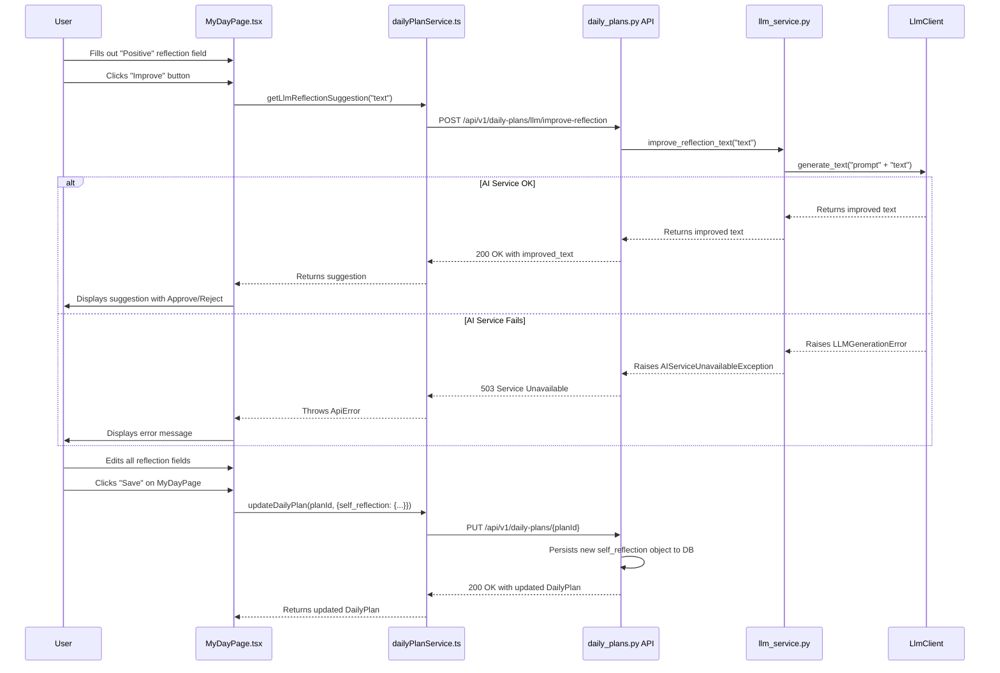
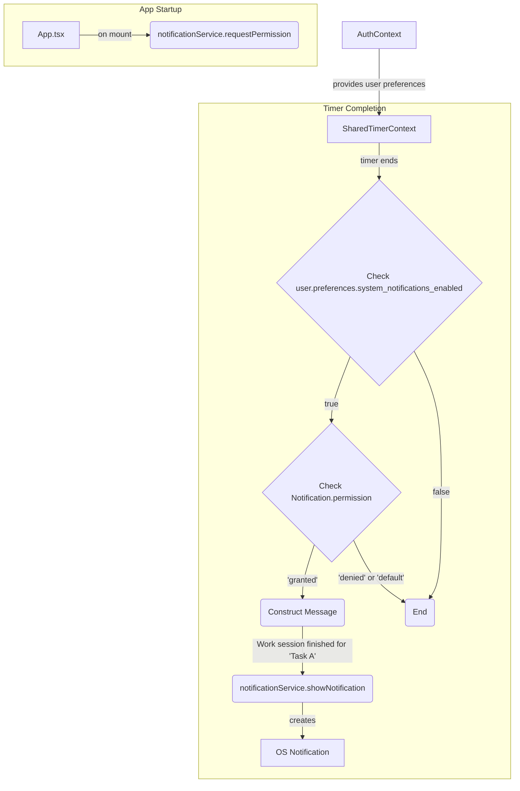

## ROLE & PRIMARY GOAL:
You are an "AI Documentation Architect & Synchronizer". Your mission is to meticulously analyze the provided project's code, its existing documentation, and the user's request. Based on this analysis, you must generate a `git diff` that updates ONLY the documentation files (within `architecture/` and `tasks/` directories, and their respective `index.md` files) to:
1.  Accurately reflect the current state of the codebase.
2.  Present an up-to-date architecture description.
3.  Formulate an up-to-date task tree that aligns with the implemented features and current system state.
You must strictly adhere to `Guiding Principles`, `User Rules`, and the `Documentation System Concept`. Your *sole and exclusive output* must be a single `git diff` formatted text. Zero tolerance for any deviation from the specified output format. **Absolutely no changes to source code files or any files outside the specified documentation directories are permitted.**

---

## INPUT SECTIONS OVERVIEW (Order is Critical):
1.  `User Task`: The user's objective for documentation synchronization.
2.  `User Rules`: Task-specific constraints from the user, overriding `Guiding Principles` and `Documentation System Concept` in case of conflict.
3.  `Current Date`: The current date to be used for `updated` fields and `audit_log`.
4.  `Documentation System Concept`: The rules and structure for the text-oriented documentation system.
5.  `Guiding Principles`: Your core operational directives.
6.  `Output Format & Constraints`: Strict rules for your *only* output: the `git diff` text.
7.  `File Structure Format Description`: How the provided project files are structured in the `File Structure` section.
8.  `File Structure`: The current state of the project's code and documentation files (this section will be very large and comes last before processing).

---

## 1. User Task
# Refactoring Plan: Self-Reflection Feature

## 1. Executive Summary & Goals
This plan outlines the full-stack implementation of a structured "Self Reflection" feature. The primary objective is to replace the existing free-text `reflection_content` field in the Daily Plan with a dictionary containing `positive`, `negative`, and `follow_up_notes` fields. This change aims to provide users with a more guided and actionable reflection experience. The plan also includes adding LLM-powered text improvement capabilities for these new fields to enhance UX.

- **Goal 1:** Refactor the `DailyPlan` data model on the backend and frontend to support the new structured `self_reflection` field.
- **Goal 2:** Implement a seamless user interface on the "My Day" page for inputting the three reflection components.
- **Goal 3:** Integrate an LLM-based text improvement feature with a clear approve/reject workflow for each reflection field.
- **Goal 4:** Ensure robust error handling for cases where the external AI service is unavailable.

## 2. Current Situation Analysis
The current system uses a single, optional string field, `reflection_content`, within the `DailyPlan` model. This provides a simple note-taking capability but lacks structure, which can limit its utility for guided daily reviews. The frontend `MyDayPage` likely has a single textarea for this field. The existing LLM service is tailored specifically for task titles and descriptions, and a more generic text-improvement capability is needed.

Key areas for improvement:
- **Data Model:** The unstructured `reflection_content` string is not ideal for targeted reflections.
- **User Experience:** A single text box offers no guidance. Adding LLM suggestions can reduce friction and improve the quality of user input.
- **Backend Service:** The LLM service needs to be generalized to handle arbitrary text improvement requests.
- **Error Handling:** No specific exception exists for AI service failures, which could lead to unhandled 500 errors.

## 3. Proposed Solution / Refactoring Strategy
### 3.1. High-Level Design / Architectural Overview
The solution involves a vertical slice of changes, from the database model up to the frontend UI components. We will introduce a new embedded document `SelfReflection` in the `DailyPlan` model. A new, generic LLM endpoint will be added to the `daily_plans` router to handle text improvement requests for the reflection fields. On the frontend, the `MyDayPage` will be updated with a dedicated component to manage the three new reflection fields and their respective LLM enhancement UIs.



### 3.2. Key Components / Modules
- **`SelfReflection` (Backend Model):** A new `odmantic.EmbeddedModel` with `positive`, `negative`, `follow_up_notes` fields, each with a 1000-character limit.
- **`SelfReflectionSchema` (Backend Schema):** A new `pydantic.BaseModel` mirroring the model for API validation and serialization.
- **`/daily-plans/llm/improve-reflection` (Backend Endpoint):** A new API endpoint to handle generic text improvement for reflection notes.
- **`AIServiceUnavailableException` (Backend Exception):** A new custom exception for handling LLM service failures gracefully.
- **`SelfReflectionComponent` (Frontend Component):** A new component on `MyDayPage.tsx` containing three text areas and the logic for LLM suggestions.
- **`SuggestionBox` (Frontend Component):** A reusable UI element to display LLM suggestions with approve/reject buttons.
- **`useGenericLlmSuggestion` (Frontend Hook):** A new reusable hook to encapsulate the logic of fetching, displaying, and applying LLM suggestions for a text field.

### 3.3. Detailed Action Plan / Phases

#### Phase 1: Backend Core Refactoring
-   **Objective(s):** Update the database and API contract to support the new structured `self_reflection` field.
-   **Priority:** High

-   **Task 1.1: Update `DailyPlan` Model**
    -   **Rationale/Goal:** Establish the new data structure in the database.
    -   **Estimated Effort:** S
    -   **Deliverable/Criteria for Completion:**
        -   In `backend/app/db/models/daily_plan.py`, create a new `SelfReflection(EmbeddedModel)` with `positive`, `negative`, `follow_up_notes` fields. Each field is an `Optional[str]` with `Field(max_length=1000)`.
        -   In the `DailyPlan(Model)`, replace `reflection_content: Optional[str]` with `self_reflection: Optional[SelfReflection] = None`.

-   **Task 1.2: Update Pydantic Schemas for `DailyPlan`**
    -   **Rationale/Goal:** Align API request/response schemas with the new database model.
    -   **Estimated Effort:** S
    -   **Deliverable/Criteria for Completion:**
        -   In `backend/app/api/schemas/daily_plan.py`, create `SelfReflectionSchema(BaseModel)` and `SelfReflectionUpdateRequest(BaseModel)` (all fields optional).
        -   Remove `reflection_content` from `DailyPlanBase`.
        -   Add `self_reflection: Optional[SelfReflectionSchema] = None` to `DailyPlanResponse`.
        -   Add `self_reflection: Optional[SelfReflectionUpdateRequest] = None` to `DailyPlanUpdateRequest`.

-   **Task 1.3: Update Mappers and Services**
    -   **Rationale/Goal:** Ensure business logic and data mapping handle the new nested structure correctly.
    -   **Estimated Effort:** M
    -   **Deliverable/Criteria for Completion:**
        -   Update `backend/mappers/daily_plan_mapper.py` to correctly map the `self_reflection` object between the model and schemas.
        -   In `backend/app/services/daily_plan_service.py`, modify `update_daily_plan` to handle updates to the nested `self_reflection` object.

-   **Task 1.4: Update Backend Tests**
    -   **Rationale/Goal:** Verify the new data structure is correctly handled by the API.
    -   **Estimated Effort:** M
    -   **Deliverable/Criteria for Completion:**
        -   Update tests in `backend/tests/api/endpoints/test_daily_plans.py` to create and update daily plans with the `self_reflection` object and assert its presence and structure in responses.

#### Phase 2: Backend LLM Integration
-   **Objective(s):** Create a generic LLM text improvement endpoint and add robust error handling.
-   **Priority:** High

-   **Task 2.1: Create `AIServiceUnavailableException`**
    -   **Rationale/Goal:** Define a specific exception for AI service failures to provide clear client feedback.
    -   **Estimated Effort:** S
    -   **Deliverable/Criteria for Completion:**
        -   In `backend/app/core/exceptions.py`, add `class AIServiceUnavailableException(HTTPException)` with `status_code=503`.
        -   In `backend/app/core/middleware.py`, add a handler for this new exception to return a JSON response with the 503 status.

-   **Task 2.2: Generalize `LLMService`**
    -   **Rationale/Goal:** Create a reusable method for improving text that can be used for reflections.
    -   **Estimated Effort:** S
    -   **Deliverable/Criteria for Completion:**
        -   In `backend/app/services/llm_service.py`, add a new method `async def improve_text(self, text: str, prompt: str) -> str`.
        -   This method will call the LLM client and wrap exceptions (e.g., `LLMGenerationError`) in the new `AIServiceUnavailableException`.

-   **Task 2.3: Implement New LLM Endpoint for Reflections**
    -   **Rationale/Goal:** Expose the new generic LLM capability for the frontend to use.
    -   **Estimated Effort:** M
    -   **Deliverable/Criteria for Completion:**
        -   In `backend/app/api/endpoints/daily_plans.py`, add a `POST /llm/improve-reflection` endpoint.
        -   It will accept a payload `{ "text": "..." }`.
        -   It will call the new `llm_service.improve_text` method with a generic prompt.

-   **Task 2.4: Add LLM Endpoint Tests**
    -   **Rationale/Goal:** Ensure the new LLM endpoint and exception handling work correctly.
    -   **Estimated Effort:** M
    -   **Deliverable/Criteria for Completion:**
        -   Add tests for the `POST /llm/improve-reflection` endpoint in `test_daily_plans.py`, covering success and AI service failure (503) cases.

#### Phase 3: Frontend Data and Service Layer
-   **Objective(s):** Align frontend data structures and services with the new backend API.
-   **Priority:** Medium

-   **Task 3.1: Update Frontend Types**
    -   **Rationale/Goal:** Ensure type safety for the new `self_reflection` data structure.
    -   **Estimated Effort:** S
    -   **Deliverable/Criteria for Completion:**
        -   In `frontend/src/types/dailyPlan.ts`, define a `SelfReflection` interface with `positive`, `negative`, and `follow_up_notes` string fields.
        -   Update the `DailyPlanResponse` interface to replace `reflection_content` with `self_reflection: SelfReflection | null;`.

-   **Task 3.2: Update Frontend Services**
    -   **Rationale/Goal:** Implement the client-side logic to communicate with the new backend endpoints.
    -   **Estimated Effort:** S
    -   **Deliverable/Criteria for Completion:**
        -   In `frontend/src/services/dailyPlanService.ts`, ensure `updateDailyPlan` correctly sends the `self_reflection` object in its payload.
        -   Add a new function `getLlmReflectionSuggestion(text: string): Promise<{improved_text: string}>` to call the `POST /llm/improve-reflection` endpoint.

#### Phase 4: Frontend UI Implementation
-   **Objective(s):** Build the new UI on the "My Day" page for the self-reflection feature.
-   **Priority:** High

-   **Task 4.1: Create `SuggestionBox` Component**
    -   **Rationale/Goal:** A reusable component to display LLM suggestions and handle user actions.
    -   **Estimated Effort:** S
    -   **Deliverable/Criteria for Completion:**
        -   New file `frontend/src/components/common/SuggestionBox.tsx`.
        -   Component accepts `suggestion: string`, `onApprove: () => void`, `onReject: () => void` as props.
        -   Renders the suggestion text with "Approve" and "Reject" buttons.

-   **Task 4.2: Create Reusable `useGenericLlmSuggestion` Hook**
    -   **Rationale/Goal:** Abstract the state management for fetching and applying LLM suggestions.
    -   **Estimated Effort:** M
    -   **Deliverable/Criteria for Completion:**
        -   New file `frontend/src/hooks/useGenericLlmSuggestion.ts`.
        -   The hook manages `suggestion`, `isLoading`, and `error` states.
        -   Exposes functions to fetch, apply, and reject suggestions.

-   **Task 4.3: Implement `SelfReflectionComponent`**
    -   **Rationale/Goal:** Create the main UI for the three new reflection fields and their LLM integration.
    -   **Estimated Effort:** L
    -   **Deliverable/Criteria for Completion:**
        -   New file `frontend/src/components/MyDay/SelfReflection.tsx`.
        -   Renders three `textarea` elements, one for each reflection field, with a 1000-character limit.
        -   Each `textarea` has an associated "Improve" button.
        -   Uses the `useGenericLlmSuggestion` hook for each field.
        -   Conditionally renders the `SuggestionBox` component when a suggestion is available for a field.
        -   Manages the local state of the reflection text fields.

-   **Task 4.4: Integrate into `MyDayPage`**
    -   **Rationale/Goal:** Replace the old reflection UI with the new component and wire up data flow.
    -   **Estimated Effort:** M
    -   **Deliverable/Criteria for Completion:**
        -   Modify `frontend/src/pages/MyDayPage.tsx`.
        -   Remove the old reflection textarea.
        -   Render the new `SelfReflectionComponent`.
        -   Pass the `self_reflection` data from the fetched `dailyPlan` to the component.
        -   Ensure the `handleSaveDailyPlan` function correctly reads the updated `self_reflection` state and includes it in the API payload.

-   **Task 4.5: Update `MyDayPage` Tests**
    -   **Rationale/Goal:** Ensure the new UI and data flow are correctly tested.
    -   **Estimated Effort:** M
    -   **Deliverable/Criteria for Completion:**
        -   Update tests in `frontend/src/pages/MyDayPage.test.tsx`.
        -   Verify that the three new text areas are rendered correctly.
        -   Test that the "Save" functionality sends the correct payload with the nested `self_reflection` object.

### 3.4. Data Model Changes
- **`DailyPlan` Model (`backend/app/db/models/daily_plan.py`):**
    - Remove: `reflection_content: Optional[str] = None`
    - Add: `self_reflection: Optional[SelfReflection] = None`
- **New `SelfReflection` Embedded Model (`backend/app/db/models/daily_plan.py`):**
    ```python
    class SelfReflection(EmbeddedModel):
        positive: Optional[str] = Field(None, max_length=1000)
        negative: Optional[str] = Field(None, max_length=1000)
        follow_up_notes: Optional[str] = Field(None, max_length=1000)
    ```

### 3.5. API Design / Interface Changes
- **`PUT /api/v1/daily-plans/{plan_id}`:** The request body will now accept a `self_reflection` object instead of `reflection_content`.
    - `DailyPlanUpdateRequest` schema will contain `self_reflection: Optional[SelfReflectionUpdateRequest] = None`.
- **`GET /api/v1/daily-plans/*`:** All endpoints returning a `DailyPlanResponse` will now include the `self_reflection` object.
- **`POST /api/v1/daily-plans/llm/improve-reflection` (New Endpoint):**
    - **Request Body:** `{ "text": "string" }`
    - **Success Response (200):** `{ "improved_text": "string" }`
    - **Failure Response (503):** `{ "detail": "AI service is currently unavailable." }`

## 4. Key Considerations & Risk Mitigation
### 4.1. Technical Risks & Challenges
-   **Risk:** Increased complexity on the `MyDayPage` frontend due to managing three separate states for LLM suggestions.
    -   **Mitigation:** Encapsulate the logic in a reusable `useGenericLlmSuggestion` hook to keep the main page component clean and manageable.
-   **Risk:** Latency from the external LLM service could impact user experience.
    -   **Mitigation:** Implement clear loading indicators on the frontend ("Improving...") so the user knows the system is working. The backend will use a 10-second timeout for API calls.
-   **Risk:** The new AI service exception could be misconfigured in the middleware.
    -   **Mitigation:** Add a specific backend test case that mocks an LLM client failure and asserts that a 503 status code is returned to the client.

### 4.2. Dependencies
-   The frontend UI work (Phase 4) is dependent on the completion of the backend changes (Phases 1 & 2).
-   The feature relies on the availability of an external LLM service (OpenAI or Google Gemini) and a configured API key.

### 4.3. Non-Functional Requirements (NFRs) Addressed
-   **Usability:** The new structured fields and LLM suggestions provide a more guided and user-friendly reflection experience.
-   **Reliability:** The new `AIServiceUnavailableException` ensures that failures in the external AI service do not crash the application and are communicated gracefully to the user.
-   **Maintainability:** Creating reusable components (`SelfReflectionComponent`, `SuggestionBox`) and a hook (`useGenericLlmSuggestion`) on the frontend promotes a more modular and maintainable codebase.

## 5. Success Metrics / Validation Criteria
-   **Functional:** Users can successfully create, view, and update their daily self-reflection across the three new fields on the "My Day" page.
-   **Functional:** The "Improve" button for each reflection field successfully triggers an LLM call and displays a suggestion.
-   **Functional:** The approve/reject buttons for suggestions correctly update the text field or discard the suggestion.
-   **Technical:** All new and updated unit and integration tests (backend and frontend) pass.
-   **NFR:** When the LLM service is down (simulated), the frontend displays an appropriate error message instead of a generic failure.

## 6. Assumptions Made
-   The existing LLM client infrastructure (`LLMClient`, `OpenAIClient`, `GoogleGeminiClient`) is sufficient and only requires the addition of a new service method.
-   The generic prompt `"Improve/proofread text of self-reflection"` is adequate for the initial implementation.
-   The frontend state management for the `MyDayPage` can accommodate the new nested `self_reflection` object without a major overhaul.

## 7. Open Questions / Areas for Further Investigation
-   Should the "Improve" button be disabled if the corresponding text area is empty? (Decision: Yes, for `positive` and `negative`. For `follow_up_notes` it could potentially generate notes based on the other two fields, but this is out of scope for now. We will disable it if the field is empty).
-   What is the desired UX for displaying an error if the LLM suggestion fails? (Decision: A temporary error message will be shown near the "Improve" button, which disappears after a few seconds).

---

## 2. User Rules
- The fewer lines of code, the better.
- Do not include comments explaining code changes.
- Use full words for naming; avoid abbreviations.
- If information is missing, ask questions until you can complete the task.
- Answer as briefly as possible without losing meaning.
- Do not remove comments during refactoring.
- When adding a new test, follow the same path structure as the tested code.
- Don’t clutter the root conftest.py, only add global fixtures or mocks.
- Don't use relative imports.
*(These are user-provided, project-specific rules or task constraints. They take precedence over `Guiding Principles` and `Documentation System Concept` in case of direct conflict. For example, if a file is normally considered auto-generated and not to be touched by the AI, a User Rule can explicitly permit or require its modification.)*

---

## 3. Current Date
2025-07-15
*(Use this date (e.g., YYYY-MM-DD) for all `updated` fields in YAML frontmatter and for new entries in `audit_log`.)*

---

## 4. Documentation System Concept
(The description of your task and architecture management system, which you provided, starting with "## Text-Oriented System Concept...", will be inserted here)

### 1. General Principles
*   **One repository — one source of truth**: both code and documentation are versioned together.
*   **Plain-text first**: Markdown + YAML metadata, no binary formats.
*   **Small files**: each document ≤ 1000 lines, so diffs remain manageable.
*   **Semantic filenames**:
    *   `ARCH-UI-print-receipt-v1.md`
    *   `TASK-2025-001-print-receipt-pdf.md`
    Structure: `<ID>-<kebab-case-slug>.md`. `ARCH` files can have a version `vX`.
*   **Two-level knowledge**
    *   *Architecture* — "how it is" and "how it will be" (for this prompt, the focus is on "how it is").
    *   *Tasks* — "what has already been changed" and "what we will change" (for this prompt, the focus is on "what has already been changed" and bringing statuses up to date).

### 2. Repository Structure (target)
```
repo-root/
  architecture/
    index.md                 # root overview
    app/
      ui/
        ARCH-UI-print-receipt-v1.md
      service/
        pdf/
          ARCH-service-pdf-v1.md
    dependency-graph.json    # dependency graph
  tasks/
    index.md                 # task dashboard
    2025-Q2/
      TASK-2025-001-print-receipt-pdf.md
      # ...
```
*Important: The LLM must only create/modify `.md` files in `architecture/` and `tasks/`. The files `architecture/index.md`, `tasks/index.md`, and `architecture/dependency-graph.json` are by default considered managed by external scripts or manually. The LLM **must not** modify them, **UNLESS** there is an explicit instruction in `User Task` or `User Rules` for their modification. In such a case, the LLM must follow these instructions.*

### 3. Architecture Documents (`ARCH-*.md`)
**YAML frontmatter:**
```yaml
---
id: ARCH-UI-print-receipt # Unique identifier without version
title: "UI. Print Receipt Button"
type: feature # feature | component | service | data_model | etc.
layer: presentation # presentation | application | domain | infrastructure | etc.
owner: @team-or-person
version: v1 # v1, v2, etc.
status: current # current | planned | deprecated
created: YYYY-MM-DD # File creation date. For new files - 2025-07-15. For existing files - do not change.
updated: 2025-07-15 # Date of last file update (use the provided 2025-07-15)
tags: [ui, pdf]
depends_on: [ARCH-service-pdf] # List of IDs of other ARCH documents (without version)
referenced_by: [] # DO NOT FILL. This field is managed by an external script, unless otherwise specified in User Rules.
---
```
**Markdown sections:**
```markdown
## Context
Brief description of the purpose and role of this architectural component in the system.

## Structure
Description of the component's internal structure: subcomponents, classes, modules, main code files to which it relates.

## Behavior
Main usage scenarios, interactions with other components (`depends_on`), key algorithms, limitations.

## Evolution
### Planned
— What is planned to be changed (if applicable, otherwise can be omitted or left empty).
### Historical
— Brief chronology of significant version changes (e.g., "v1: Initial design").
```

### 4. Task Documents (`TASK-*.md`)
**YAML frontmatter:**
```yaml
---
id: TASK-2025-001 # Unique task ID
title: "Print PDF Receipts"
status: in_progress # backlog | ready | in_progress | review | done | blocked
priority: high # low | medium | high
type: feature # feature | bug | tech_debt | spike | question | chore
estimate: 5h # Approximate estimate
assignee: @username
created: YYYY-MM-DD # Keep the existing creation date if the file already exists. For new files - 2025-07-15.
due: YYYY-MM-DD # (optional)
updated: 2025-07-15 # Date of last task file update (use the provided 2025-07-15)
parents: [TASK-ID-parent] # (optional)
children: [TASK-ID-child] # (optional)
arch_refs: [ARCH-UI-print-receipt, ARCH-service-pdf] # Links to IDs of architecture documents (without version)
risk: medium # (optional)
benefit: "Will reduce manual time by 80%" # (optional)
audit_log:
  - {date: YYYY-MM-DD, user: "@some-user", action: "created with status backlog"} # Example of an existing entry
  - {date: 2025-07-15, user: "@AI-DocArchitect", action: "status → in_progress"}
  # LLM must add an entry to audit_log when `status` changes.
  # Also add an entry for significant changes: `assignee`, `priority`, `due_date`, `estimate`, `arch_refs`.
  # For new task files, the first entry must be: {date: 2025-07-15, user: "@AI-DocArchitect", action: "created with status <initial_status>"}.
  # Example: {date: 2025-07-15, user: "@AI-DocArchitect", action: "priority: low → high"}
---
```
**Markdown sections:**
```markdown
## Description
Brief description of the task from a business or technical necessity perspective. If the task reflects work already done, describe what was done.

## Acceptance Criteria
Clear criteria by which task completion can be judged. For tasks reflecting work already done, this is a description of how the functionality works.

## Definition of Done
Conditions under which the task is considered fully completed (e.g., code written, tests passed, documentation updated). For "done" tasks, this must be fulfilled.

## Notes
Any important details, discussions, links to PRs (if applicable), conclusions.
```

### 5. Quality Policy (for LLM)
*   **Focus on actualization**: The main goal is to bring the documentation into compliance with the *existing* code provided in `FILE_STRUCTURE`.
*   **Creating new**: If the code contains significant components/features not described in `architecture/` or `tasks/`, the LLM must create corresponding `.md` files for them.
    *   For new `ARCH-*.md` files, `status` must be `current`, `version` `v1` (unless there is a reason for another). `created` and `updated` are set to `2025-07-15`. `id` must be unique.
    *   For new `TASK-*.md` files reflecting already existing functionality, `status` will most likely be `done`. `created` and `updated` are set to `2025-07-15`. `id` (e.g., `TASK-YYYY-NNN`) must be unique; try to determine the next available sequential number `NNN` for the given `YYYY` based on existing tasks. If this is not possible, use the format `TASK-YYYY-NEW-1`, `TASK-YYYY-NEW-2`, etc. The first entry in `audit_log` must be: `{date: 2025-07-15, user: "@AI-DocArchitect", action: "created with status <initial_status>"}`.
*   **Updating `updated`**: Upon any change to a documentation file, the `updated` field in the YAML frontmatter must be set to `2025-07-15`.
*   **`audit_log` for tasks**: When changing the task `status`, add an entry to `audit_log`. Also add entries for changes to `assignee`, `priority`, `due_date`, `estimate`, `arch_refs`. Use `2025-07-15` and user `@AI-DocArchitect`.
*   **Semantic IDs and filenames**: Follow templates. For new files, generate meaningful `kebab-case-slug` and unique `id`s.
*   **Constraints**: Adhere to "≤ 1000 lines per file".
*   **Files managed by scripts/manually**: The LLM **must not** modify `architecture/index.md`, `tasks/index.md`, `architecture/dependency-graph.json`, or the `referenced_by` field in `ARCH-*.md`, **UNLESS** `User Task` or `User Rules` explicitly permit or require it. In such cases, the LLM must follow these explicit instructions. By default, the LLM ensures the correctness of data in the source `.md` files, based on which these aggregates/fields can be built.
*   **Code priority:** If `User Task` contains instructions for changing documentation that contradict the current state of the code, priority is given to updating the documentation according to the code. However, if possible, an attempt should be made to accommodate the intent of the `User Task` without creating contradictions with the code (e.g., by creating a new `planned` architecture or a `backlog` type task).

---

## 5. Guiding Principles (Your AI Documentation Architect Logic)

### A. Core Processing Steps (Internal Thought Process - Do NOT output this part, but follow it rigorously):
1.  **Understand Inputs:**
    *   Thoroughly analyze `User Task`, `User Rules`, and `Documentation System Concept`. Note the `2025-07-15`. Identify any explicit permissions/instructions in `User Rules` or `User Task` to modify normally restricted files (e.g., `index.md`, `dependency-graph.json`).
2.  **Analyze Codebase (`FILE_STRUCTURE` - code files):**
    *   Parse and comprehend the provided source code files.
    *   Identify key modules, components, classes, functions, services, their interactions, data flow, and primary functionalities.
3.  **Analyze Existing Documentation (`FILE_STRUCTURE` - documentation files):**
    *   Parse and comprehend existing `architecture/**/*.md` and `tasks/**/*.md` files, including `architecture/index.md`, `tasks/index.md`, and `architecture/dependency-graph.json` if present.
    *   Pay close attention to YAML frontmatter and Markdown content as defined in `Documentation System Concept`.
4.  **Identify Discrepancies & Gaps:**
    *   Compare the understood codebase structure/functionality against existing documentation.
    *   Note: outdated descriptions, missing docs for existing code, incorrect dependencies (`depends_on`), tasks not reflecting implemented features (e.g., `status` mismatch), `Acceptance Criteria` not matching implementation, missing `ARCH-*.md` for significant code components, YAML inconsistencies.
5.  **Plan Documentation Changes:** Based on discrepancies and `User Task`, plan specific modifications to existing documentation files or creation of new ones, strictly adhering to `Documentation System Concept` and `User Rules`. This includes:
    *   Updating YAML frontmatter (e.g., `status`, `version`, `depends_on`, `arch_refs`). Always set `updated: 2025-07-15`. For new files, set `created: 2025-07-15`.
    *   Updating Markdown content.
    *   Creating new `ARCH-*.md` files for undocumented major components (inferring `Context`, `Structure`, `Behavior`; set `status: current`, `version: v1`, `created: 2025-07-15`, `updated: 2025-07-15`). Ensure unique `id`.
    *   Updating/Creating `TASK-*.md` files: mark tasks `done` for implemented features, update `Description`/`Acceptance Criteria`, create new `done` tasks for undocumented implemented features. Set `created: 2025-07-15` (for new), `updated: 2025-07-15`. Add entries to `audit_log` (including initial "created" entry for new tasks) using `2025-07-15` and user `@AI-DocArchitect`. Ensure unique `id` and attempt sequential numbering.
6.  **Synthesize Actual Architecture & Task Tree:**
    *   Ensure `ARCH-*.md` files collectively represent the actual architecture.
    *   Ensure `TASK-*.md` files reflect development history and current state.
    *   If modification of `architecture/index.md`, `tasks/index.md`, or `architecture/dependency-graph.json` is explicitly permitted by `User Task` or `User Rules`, update them as instructed. Otherwise, do not touch them.
7.  **Generate Diff:** Construct the `git diff` according to `Output Format & Constraints`.

### B. Documentation Generation Standards:
*   **Adherence to System Concept:** Strictly follow all rules in `Documentation System Concept`.
*   **Accuracy & Code-Truthfulness:** Generated/updated documentation *must* accurately reflect the codebase in `FILE_STRUCTURE`.
*   **Clarity & Conciseness:** Write clear, unambiguous, concise documentation. Adhere to "≤ 1000 lines per file".
*   **Consistency:** Maintain consistency in terminology, formatting, and level of detail.
*   **YAML Integrity:** Ensure valid YAML, complete required fields, use `2025-07-15` for `updated` (and `created` for new files). Ensure all `id` fields are unique within their type (ARCH or TASK).
*   **Cross-Referencing:** Meticulously update `depends_on` (for ARCH), `arch_refs` (for TASK), `parents`/`children` (for TASK). Do NOT populate `referenced_by` in `ARCH-*.md` unless explicitly instructed by `User Rules`.
*   **File Naming and Placement:** Use specified conventions (`ARCH-...vX.md`, `TASK-YYYY-NNN-...md`) in correct subdirectories. Generate unique IDs and meaningful slugs.
*   **Minimal Diff:** Generate the smallest valid set of changes required to meet the objectives.
*   **Documentation Only:** The `git diff` must *only* contain changes to files within `architecture/` and `tasks/` (and their root `index.md` or `architecture/dependency-graph.json` *if and only if* explicitly permitted by `User Task` or `User Rules`). **Absolutely no changes to source code files or any other files.**
*   **Self-Correction/Verification:** Before outputting, internally verify that the generated diff:
    *   Only modifies files explicitly allowed by these instructions.
    *   Strictly adheres to the `git diff` format specified.
    *   Correctly uses `2025-07-15` for all `updated` fields, `created` fields (for new files), and `audit_log` entries.
    *   Follows all rules in `Documentation System Concept` and `Guiding Principles`.

---

## 6. Output Format & Constraints (MANDATORY & STRICT)

Your **ONLY** output will be a single, valid `git diff` formatted text, specifically in the **unified diff format**. No other text, explanations, apologies, or introductory/concluding remarks are permitted. The diff should only apply to files within the `architecture/` and `tasks/` directories. Files like `architecture/index.md`, `tasks/index.md`, or `architecture/dependency-graph.json` can only be included in the diff if their modification is explicitly permitted by `User Task` or `User Rules`.

### Git Diff Format Structure:
*   If no changes are required to documentation files, output an empty string.
*   For each modified, newly created, or deleted documentation file, include a diff block. Multiple file diffs are concatenated directly.

### File Diff Block Structure:
```diff
diff --git a/path/to/doc/file.md b/path/to/doc/file.md
index <hash_old>..<hash_new> <mode>
--- a/path/to/doc/file.md
+++ b/path/to/doc/file.md
@@ -START_OLD,LINES_OLD +START_NEW,LINES_NEW @@
 context line (unchanged)
-old line to be removed
+new line to be added
 another context line (unchanged)
```

*   **`diff --git a/path b/path` line:**
    *   Paths are project-root-relative (e.g., `architecture/app/ui/ARCH-UI-something-v1.md`).
*   **`index <hash_old>..<hash_new> <mode>` line (Optional Detail):**
    *   Use placeholder values (e.g., `index 0000000..0000000 100644`) if precise hashes/modes are complex to compute. Critical parts are `---`, `+++`, `@@`.
*   **`--- a/path/to/doc/file.md` line:**
    *   Original file. For **newly created files**, this must be `--- /dev/null`.
*   **`+++ b/path/to/doc/file.md` line:**
    *   New file. For **deleted files**, this must be `+++ /dev/null`.
*   **Hunk Header (`@@ -START_OLD,LINES_OLD +START_NEW,LINES_NEW @@`):**
    *   Correctly specify line numbers and counts.
    *   For **newly created files**: `@@ -0,0 +1,LINES_IN_NEW_FILE @@`.
    *   For **deleted files**: `@@ -1,LINES_IN_OLD_FILE +0,0 @@`.
*   **Hunk Content:**
    *   ` ` (space) for context, `-` for removal, `+` for addition.
    *   Include at least 3 lines of context where available.

### Specific Cases:
*   **Newly Created Documentation Files:**
    ```diff
    diff --git a/architecture/path/to/new_ARCH-doc-v1.md b/architecture/path/to/new_ARCH-doc-v1.md
    new file mode 100644
    index 0000000..abcdef0
    --- /dev/null
    +++ b/architecture/path/to/new_ARCH-doc-v1.md
    @@ -0,0 +1,LINES_IN_NEW_FILE @@
    +---
    +id: ARCH-...
    +title: "..."
    +created: 2025-07-15 # Example: 2024-07-28
    +updated: 2025-07-15 # Example: 2024-07-28
    +# ... other YAML fields ...
    +---
    +## Context
    +...
    ```

*   **Deleted Documentation Files:**
    ```diff
    diff --git a/tasks/some-quarter/TASK-ID-old.md b/tasks/some-quarter/TASK-ID-old.md
    deleted file mode 100644
    index abcdef0..0000000
    --- a/tasks/some-quarter/TASK-ID-old.md
    +++ /dev/null
    @@ -1,LINES_IN_OLD_FILE +0,0 @@
    -... old content ...
    ```

*   **Untouched Documentation Files:** Do NOT include any diff output for documentation files that have no changes.
*   **Source Code Files & Other Restricted Files:** Do NOT include any diff output for files outside the specified documentation directories, or for files like `index.md` / `dependency-graph.json` unless modification is explicitly permitted by `User Task` or `User Rules`.

---

## 7. File Structure Format Description
The `File Structure` (provided in the next section) is formatted as follows:
1.  An initial project directory tree structure (e.g., generated by `tree` or similar). This is for overview only.
2.  Followed by the content of each file, using an XML-like structure:
    <file path="RELATIVE/PATH/TO/FILE">
    (File content here)
    </file>
    The `path` attribute contains the project-root-relative path, using forward slashes (`/`).
    File content is the raw text of the file. Each file block is separated by a newline.
    This section will contain BOTH source code files AND existing documentation files. You must parse this structure to access file contents.

---

## 8. File Structure
flocus/
├── architecture
│   └── app
│       ├── api
│       │   └── ARCH-api-user-daily-stats-v1.md
│       ├── data
│       │   └── ARCH-data-user-daily-stats-v1.md
│       ├── feature
│       │   ├── ARCH-feature-os-notifications-v1.md
│       │   ├── ARCH-feature-task-time-tracking-v1.md
│       │   └── ARCH-feature-user-preferences-v1.md
│       ├── service
│       │   ├── ARCH-service-notification-v1.md
│       │   └── ARCH-service-user-daily-stats-v1.md
│       └── ui
│           └── ARCH-ui-assigned-task-balloon-v1.md
├── backend
│   ├── app
│   │   ├── api
│   │   │   ├── endpoints
│   │   │   │   ├── __init__.py
│   │   │   │   ├── categories.py
│   │   │   │   ├── daily_plans.py
│   │   │   │   ├── day_templates.py
│   │   │   │   ├── tasks.py
│   │   │   │   ├── user_daily_stats.py
│   │   │   │   └── users.py
│   │   │   ├── schemas
│   │   │   │   ├── category.py
│   │   │   │   ├── daily_plan.py
│   │   │   │   ├── day_template.py
│   │   │   │   ├── llm.py
│   │   │   │   ├── task.py
│   │   │   │   ├── time_window.py
│   │   │   │   ├── user.py
│   │   │   │   ├── user_daily_stats.py
│   │   │   │   └── utils.py
│   │   │   └── __init__.py
│   │   ├── clients
│   │   │   └── llm
│   │   │       ├── base.py
│   │   │       ├── google_gemini.py
│   │   │       └── openai.py
│   │   ├── core
│   │   │   ├── __init__.py
│   │   │   ├── config.py
│   │   │   ├── dependencies.py
│   │   │   ├── enums.py
│   │   │   ├── exceptions.py
│   │   │   ├── logging_config.py
│   │   │   ├── middleware.py
│   │   │   └── security.py
│   │   ├── db
│   │   │   ├── models
│   │   │   │   ├── __init__.py
│   │   │   │   ├── category.py
│   │   │   │   ├── daily_plan.py
│   │   │   │   ├── day_template.py
│   │   │   │   ├── task.py
│   │   │   │   ├── user.py
│   │   │   │   └── user_daily_stats.py
│   │   │   ├── __init__.py
│   │   │   └── connection.py
│   │   ├── mappers
│   │   │   ├── __init__.py
│   │   │   ├── base_mapper.py
│   │   │   ├── category_mapper.py
│   │   │   ├── daily_plan_mapper.py
│   │   │   ├── day_template_mapper.py
│   │   │   ├── README.md
│   │   │   ├── task_mapper.py
│   │   │   └── user_mapper.py
│   │   ├── services
│   │   │   ├── __init__.py
│   │   │   ├── category_service.py
│   │   │   ├── daily_plan_service.py
│   │   │   ├── day_template_service.py
│   │   │   ├── llm_service.py
│   │   │   ├── task_service.py
│   │   │   ├── user_daily_stats_service.py
│   │   │   └── user_service.py
│   │   ├── __init__.py
│   │   ├── main.py
│   │   └── mcp_server.py
│   ├── scripts
│   │   ├── __init__.py
│   │   └── backup_database.py
│   ├── tests
│   │   ├── api
│   │   │   ├── endpoints
│   │   │   │   ├── conftest.py
│   │   │   │   ├── test_categories.py
│   │   │   │   ├── test_daily_plans.py
│   │   │   │   ├── test_day_templates.py
│   │   │   │   ├── test_tasks.py
│   │   │   │   ├── test_user_daily_stats.py
│   │   │   │   └── test_users.py
│   │   │   └── schemas
│   │   │       ├── __init__.py
│   │   │       ├── test_day_template.py
│   │   │       ├── test_task_schema.py
│   │   │       └── test_utils.py
│   │   ├── clients
│   │   │   └── llm
│   │   │       ├── __init__.py
│   │   │       └── test_llm_clients.py
│   │   ├── mappers
│   │   │   ├── __init__.py
│   │   │   ├── test_daily_plan_mapper.py
│   │   │   ├── test_day_template_mapper.py
│   │   │   ├── test_task_mapper.py
│   │   │   └── test_user_mapper.py
│   │   ├── scripts
│   │   │   ├── __init__.py
│   │   │   └── test_backup_database.py
│   │   ├── services
│   │   │   ├── conftest.py
│   │   │   ├── test_category_service.py
│   │   │   ├── test_llm_service.py
│   │   │   ├── test_task_service.py
│   │   │   └── test_user_daily_stats_service.py
│   │   └── conftest.py
│   ├── .env.example
│   ├── .flake8
│   ├── .pre-commit-config.yaml
│   ├── pyproject.toml
│   ├── README.md
│   └── uv.lock
├── frontend
│   ├── __mocks__
│   │   └── react-dom.js
│   ├── public
│   │   ├── backgrounds
│   │   ├── sounds
│   │   ├── index.html
│   │   ├── manifest.json
│   │   └── robots.txt
│   ├── src
│   │   ├── assets
│   │   ├── components
│   │   │   ├── layout
│   │   │   │   ├── Sidebar.test.tsx
│   │   │   │   └── Sidebar.tsx
│   │   │   ├── magicui
│   │   │   │   └── RetroGrid.tsx
│   │   │   ├── modals
│   │   │   │   ├── CreateCategoryModal.test.tsx
│   │   │   │   ├── CreateCategoryModal.tsx
│   │   │   │   ├── CreateTaskModal.test.tsx
│   │   │   │   ├── CreateTaskModal.tsx
│   │   │   │   ├── CreateTemplateTimeWindowModal.test.tsx
│   │   │   │   ├── CreateTemplateTimeWindowModal.tsx
│   │   │   │   ├── CreateTimeWindowModal.test.tsx
│   │   │   │   ├── CreateTimeWindowModal.tsx
│   │   │   │   ├── EditDailyPlanTimeWindowModal.test.tsx
│   │   │   │   ├── EditDailyPlanTimeWindowModal.tsx
│   │   │   │   ├── Modal.test.tsx
│   │   │   │   ├── Modal.tsx
│   │   │   │   ├── TaskStatisticsModal.test.tsx
│   │   │   │   ├── TaskStatisticsModal.tsx
│   │   │   │   └── TimeWindowForm.tsx
│   │   │   ├── AssignedTaskBalloon.test.tsx
│   │   │   ├── AssignedTaskBalloon.tsx
│   │   │   ├── Button.test.tsx
│   │   │   ├── Button.tsx
│   │   │   ├── CurrentTasks.test.tsx
│   │   │   ├── CurrentTasks.tsx
│   │   │   ├── DailyStats.test.tsx
│   │   │   ├── DailyStats.tsx
│   │   │   ├── Input.test.tsx
│   │   │   ├── Input.tsx
│   │   │   ├── MessageBalloon.test.tsx
│   │   │   ├── MessageBalloon.tsx
│   │   │   ├── PomodoroTimer.test.tsx
│   │   │   ├── PomodoroTimer.tsx
│   │   │   ├── TaskItem.test.tsx
│   │   │   ├── TaskItem.tsx
│   │   │   ├── TaskPicker.test.tsx
│   │   │   ├── TaskPicker.tsx
│   │   │   ├── Timeline.test.tsx
│   │   │   ├── Timeline.tsx
│   │   │   ├── TimeWindowBalloon.test.tsx
│   │   │   └── TimeWindowBalloon.tsx
│   │   ├── constants
│   │   │   ├── apiEndpoints.ts
│   │   │   └── colors.ts
│   │   ├── context
│   │   │   ├── AuthContext.test.tsx
│   │   │   ├── AuthContext.tsx
│   │   │   ├── MessageContext.tsx
│   │   │   ├── SharedTimerContext.test.tsx
│   │   │   └── SharedTimerContext.tsx
│   │   ├── hooks
│   │   │   ├── useCategories.test.tsx
│   │   │   ├── useCategories.ts
│   │   │   ├── useCurrentTimeWindow.test.ts
│   │   │   ├── useCurrentTimeWindow.ts
│   │   │   ├── useDailyPlan.test.tsx
│   │   │   ├── useDailyPlan.ts
│   │   │   ├── useDailyStats.ts
│   │   │   ├── useLlmSuggestions.test.ts
│   │   │   ├── useLlmSuggestions.ts
│   │   │   ├── useMenuState.test.ts
│   │   │   ├── useMenuState.ts
│   │   │   ├── useTasks.test.tsx
│   │   │   ├── useTasks.ts
│   │   │   ├── useTemplates.test.tsx
│   │   │   └── useTemplates.ts
│   │   ├── lib
│   │   │   ├── errors.test.ts
│   │   │   ├── errors.ts
│   │   │   ├── utils.test.ts
│   │   │   └── utils.ts
│   │   ├── pages
│   │   │   ├── CategoriesPage.test.tsx
│   │   │   ├── CategoriesPage.tsx
│   │   │   ├── DashboardPage.test.tsx
│   │   │   ├── DashboardPage.tsx
│   │   │   ├── EditTemplatePage.test.tsx
│   │   │   ├── EditTemplatePage.tsx
│   │   │   ├── LoginPage.test.tsx
│   │   │   ├── LoginPage.tsx
│   │   │   ├── MyDayPage.test.tsx
│   │   │   ├── MyDayPage.tsx
│   │   │   ├── RegisterPage.test.tsx
│   │   │   ├── RegisterPage.tsx
│   │   │   ├── TasksPage.test.tsx
│   │   │   ├── TasksPage.tsx
│   │   │   ├── TemplatesPage.test.tsx
│   │   │   ├── TemplatesPage.tsx
│   │   │   ├── UserSettingsPage.test.tsx
│   │   │   └── UserSettingsPage.tsx
│   │   ├── services
│   │   │   ├── api.ts
│   │   │   ├── authService.test.ts
│   │   │   ├── authService.ts
│   │   │   ├── categoryService.test.ts
│   │   │   ├── categoryService.ts
│   │   │   ├── dailyPlanService.test.ts
│   │   │   ├── dailyPlanService.ts
│   │   │   ├── dayTemplateService.test.ts
│   │   │   ├── dayTemplateService.ts
│   │   │   ├── notificationService.test.ts
│   │   │   ├── notificationService.ts
│   │   │   ├── taskService.test.ts
│   │   │   ├── taskService.ts
│   │   │   ├── timeWindowService.test.ts
│   │   │   ├── timeWindowService.ts
│   │   │   ├── userDailyStatsService.test.ts
│   │   │   ├── userDailyStatsService.ts
│   │   │   ├── userService.test.ts
│   │   │   └── userService.ts
│   │   ├── styles
│   │   │   └── index.css
│   │   ├── types
│   │   │   ├── category.ts
│   │   │   ├── dailyPlan.ts
│   │   │   ├── dayTemplate.ts
│   │   │   ├── task.ts
│   │   │   ├── timeWindow.ts
│   │   │   ├── user.ts
│   │   │   └── userDailyStats.ts
│   │   ├── App.test.tsx
│   │   ├── App.tsx
│   │   ├── config.ts
│   │   ├── index.tsx
│   │   ├── react-app-env.d.ts
│   │   ├── reportWebVitals.ts
│   │   └── setupTests.ts
│   ├── .env.example
│   ├── .gitignore
│   ├── craco.config.js
│   ├── package-lock.json
│   ├── package.json
│   ├── postcss.config.js
│   ├── README.md
│   ├── tailwind.config.js
│   ├── TESTING.md
│   └── tsconfig.json
└── tasks
    └── 2025-Q3
        ├── TASK-2025-011-ui-task-status-icons.md
        ├── TASK-2025-012-feature-user-preferences-page.md
        ├── TASK-2025-013-backend-user-preferences.md
        ├── TASK-2025-014-frontend-user-preferences-ui.md
        ├── TASK-2025-015-feature-os-notifications.md
        ├── TASK-2025-016-service-create-notification-service.md
        ├── TASK-2025-017-service-add-notification-service-tests.md
        ├── TASK-2025-018-integrate-request-permission-on-load.md
        ├── TASK-2025-019-integrate-notification-trigger.md
        └── TASK-2025-020-integrate-update-timer-context-tests.md

<file path="architecture/app/api/ARCH-api-user-daily-stats-v1.md">
---
id: ARCH-api-user-daily-stats
title: "API. User Daily Statistics Endpoints"
type: component
layer: presentation
owner: '@backend-team'
version: v1
status: current
created: 2025-07-04
updated: 2025-07-08
tags: [statistics, backend, api]
depends_on: [ARCH-service-user-daily-stats]
referenced_by: []
---
## Context
These API endpoints expose the user's daily statistical data to the frontend. This allows tracking and displaying metrics such as total daily active time and completed pomodoros, which are independent of specific tasks.

## Structure
A new FastAPI router will be added at `/api/v1/daily-stats`. It will provide endpoints for fetching and incrementing daily statistics for the authenticated user.

The router will define the following API schemas:
*   `UserDailyStatsResponse`: The main response body for retrieving daily stats.
*   `IncrementTimeRequest`: The request body for adding seconds to the daily time spent.

## Behavior
The API will expose the following endpoints:

*   **`GET /today`**
    *   **Description:** Get the daily statistics for the currently authenticated user for today.
    *   **Response Body:** `UserDailyStatsResponse`
        ```json
        {
          "date": "2023-10-27T00:00:00Z",
          "total_seconds_spent": 3600,
          "pomodoros_completed": 4
        }
        ```

*   **`POST /today/increment-time`**
    *   **Description:** Add a number of seconds to the user's total time spent for the day.
    *   **Request Body:** `IncrementTimeRequest`
    *   **Response:** `204 No Content`

*   **`POST /today/increment-pomodoro`**
    *   **Description:** Increment the user's completed pomodoros for the day by one.
    *   **Request Body:** (empty)
    *   **Response:** `204 No Content`

## Evolution
### Historical
- v1: Initial implementation as described.

</file>
<file path="architecture/app/data/ARCH-data-user-daily-stats-v1.md">
---
id: ARCH-data-user-daily-stats
title: "Data Model. User Daily Statistics"
type: data_model
layer: infrastructure
owner: '@backend-team'
version: v1
status: current
created: 2025-07-04
updated: 2025-07-08
tags: [statistics, backend, data_model]
depends_on: []
referenced_by: [ARCH-service-user-daily-stats]
---
## Context
To support aggregated daily statistics for users, a dedicated data model is required. This model decouples daily activity metrics (like total time spent or Pomodoros completed) from task-specific data and daily plans. This ensures that statistics can be recorded even if a user does not create a daily plan and provides a scalable foundation for future metrics.

## Structure
A new collection `user_daily_stats` will be created in MongoDB, represented by the `UserDailyStats` ODMantic model.

```python
from datetime import datetime, timezone

from odmantic import Field, Index, Model, ObjectId

class UserDailyStats(Model):
    user_id: ObjectId
    date: datetime  # Represents the specific day (time part should be zeroed)
    total_seconds_spent: int = Field(default=0)
    pomodoros_completed: int = Field(default=0)

    model_config = {
        "collection": "user_daily_stats",
        "indexes": lambda: [
            Index(UserDailyStats.user_id, UserDailyStats.date, unique=True)
        ],
    }
```

## Behavior
The model includes a unique compound index on `(user_id, date)` to ensure that there is only one statistics document per user per day. The `date` field will store the beginning of the day in UTC.

## Evolution
### Historical
- v1: Initial design for daily time and Pomodoro tracking.

</file>
<file path="architecture/app/feature/ARCH-feature-os-notifications-v1.md">
---
id: ARCH-feature-os-notifications
title: "Feature. OS-Level Timer Notifications"
type: feature
layer: presentation
owner: '@frontend-team'
version: v1
status: current
created: 2025-07-13
updated: 2025-07-13
tags: [notifications, timer, feature]
depends_on: [ARCH-feature-user-preferences]
referenced_by: []
---
## Context
This feature will provide operating system-level notifications for completed Pomodoro timers and breaks. This will alert users of a completed timer even if the application window is not in focus. The notification will include the name of the task that was just being worked on, if applicable. This feature is contingent on both user preferences within the application (`system_notifications_enabled`) and browser-level notification permissions.

## Structure
The solution will introduce a new, dedicated `NotificationService` to abstract the browser's Web Notification API. The `SharedTimerContext` will be the primary consumer of this service.

### Key Components
1.  **`NotificationService` (New, Planned)**
    -   **Responsibility:** To encapsulate all interactions with the browser's Web Notification API.
    -   **Functions:** `requestPermission()`, `showNotification(title, options)`.
    -   **Reference:** `ARCH-service-notification`

2.  **`SharedTimerContext.tsx` (Modification)**
    -   **Responsibility:** To orchestrate the notification logic at the correct time.
    -   **Changes:** It will be modified to import `useAuth` and the new `NotificationService`.

3.  **`App.tsx` (Modification)**
    -   **Responsibility:** To ensure notification permissions are requested early in the user session.
    -   **Changes:** A `useEffect` hook will be added to call `notificationService.requestPermission()` on component mount.

### Architectural Flow


## Behavior
Upon application startup, a permission request for notifications will be triggered. When a timer in `SharedTimerContext` completes, the context will check if the user has enabled system notifications via their preferences (`useAuth`). If enabled, and if browser permission has been granted, the context will call the `NotificationService` to display a message. The message will be context-aware, indicating whether a work or break session has finished and mentioning the task name if applicable.

The `NotificationService` will be built to fail gracefully if the user denies permissions or the browser does not support the Notification API.

## Evolution
### Historical
- v1: Initial plan to implement OS-level notifications.

</file>
<file path="architecture/app/feature/ARCH-feature-task-time-tracking-v1.md">
---
id: ARCH-feature-task-time-tracking
title: "Feature. Task Time Tracking"
type: feature
layer: application
owner: '@backend-team'
version: v1
status: current
created: 2025-07-04
updated: 2025-07-04
tags: [tasks, statistics, backend]
depends_on: []
referenced_by: []
---
## Context
This feature provides the functionality to track the total time a user has actively worked on a specific task. This is a core metric for understanding personal productivity and task effort.

## Structure
The time tracking is implemented within the `Task` model and managed by the `TaskService`.
-   `Task` model (`backend/app/db/models/task.py`): Contains an embedded `TaskStatistics` document.
-   `TaskStatistics` embedded model: Contains the `lasts_min` field, which stores the total accumulated time in minutes. It also contains timestamps like `was_taken_at` and `was_stopped_at` to facilitate calculation.
-   `TaskService` (`backend/app/services/task_service.py`): The `update_task` method contains the logic to calculate and update the time spent.

## Behavior
When the status of a task is updated from `in_progress` to any other status (e.g., `pending`, `done`), the service calculates the time elapsed since the task was last marked as `in_progress` (using the `was_taken_at` timestamp). This duration is converted to minutes and added to the `lasts_min` field, accumulating the total time spent on the task. The `was_stopped_at` timestamp is also updated.

## Evolution
### Historical
- v1: Initial implementation as described. This functionality was confirmed to meet requirements during the "Backend Statistics Extension" planning.

</file>
<file path="architecture/app/feature/ARCH-feature-user-preferences-v1.md">
---
id: ARCH-feature-user-preferences
title: "Feature. User Preferences"
type: feature
layer: application
owner: '@fullstack-team'
version: v1.1
status: current
created: 2025-07-09
updated: 2025-07-09
tags: [user, settings, preferences]
depends_on: []
referenced_by: []
---
## Context
This document outlines the planned architecture for storing and managing user-specific preferences, such as Pomodoro timeouts and system notification settings. The goal is to provide a persistent, centralized storage mechanism for these settings.

## Structure
The implementation will involve changes across the full stack:

- **Data Model (`backend/db/models/user.py`):**
  - A new `UserPreferences` embedded model will be introduced to hold user-specific settings.
  - The `User` model will be updated with a new `preferences: UserPreferences` field, with a default factory to ensure backward compatibility.

- **API Schemas (`backend/app/api/schemas/user.py`):**
  - A `UserPreferencesSchema` will be created to define the data contract for API requests.
  - `UserUpdateRequest` and `UserResponse` schemas will be updated to include the new `preferences` object.

- **Backend Service (`backend/app/services/user_service.py`):**
  - The `update_user_by_id` method will be modified to handle the logic of updating the nested `preferences` object within the `User` model.

- **Frontend Types (`frontend/src/types/user.ts`):**
  - A new `UserPreferences` interface will mirror the backend schema.
  - The main `User` interface will be updated to include the `preferences` field.

- **Frontend Component (`frontend/src/pages/UserSettingsPage.tsx`):**
  - The settings page will be refactored to remove hardcoded, deprecated settings ("Dark Mode", "Default View").
  - New form elements for "Pomodoro timeout" and "System notifications" will be added, managed by `react-hook-form`.

## Behavior
The system will follow this sequence to update user preferences:

1.  A user modifies settings on the `/settings` page in the frontend.
2.  The `UserSettingsPage` component dispatches an update action with the new preferences payload.
3.  The frontend `userService` sends a `PUT /api/v1/users/{id}` request to the backend.
4.  The backend `UserService` receives the request and updates the nested `preferences` sub-document for the specified user in the MongoDB `users` collection.
5.  The updated `User` object, including the new preferences, is returned to the frontend and reflected in the application's state.

## Evolution
### Planned
- v1: Initial implementation of Pomodoro timeout and system notification preferences.

</file>
<file path="architecture/app/service/ARCH-service-notification-v1.md">
---
id: ARCH-service-notification
title: "Service. Notification Service"
type: service
layer: presentation
owner: '@frontend-team'
version: v1
status: current
created: 2025-07-13
updated: 2025-07-13
tags: [notifications, service]
depends_on: []
referenced_by: []
---
## Context
This service encapsulates all interactions with the browser's Web Notification API. It provides a clean, reusable, and testable interface for other parts of the application to send OS-level notifications, abstracting away the browser-specific implementation details.

## Structure
The service will be implemented as a new file: `frontend/src/services/notificationService.ts`.

It will expose the following functions:

*   **`requestPermission()`**
    *   **Description:** Checks the current permission status for notifications. If the status is `default`, it will prompt the user to grant permission. This function is intended to be called once at application startup. It handles all three permission states ('granted', 'denied', 'default') gracefully.

*   **`showNotification(title, options)`**
    *   **Description:** Displays a notification if permission has been granted. It will accept a `title` (string) and an `options` object.
    *   **Options:** The `options` object can contain a `body` (string for the main message) and an `icon` (URL to an image, e.g., `/favicon.png`).

## Behavior
The `requestPermission` function will check for the existence of the `Notification` object on the `window` to ensure browser support before proceeding.

The `showNotification` function will first verify that `Notification.permission` is `'granted'` before attempting to create and display a `new Notification()`. This prevents errors if the user has denied permission. It will be designed to fail silently if notifications cannot be shown for any reason.

## Evolution
### Historical
- v1: Initial plan for a dedicated notification service.

</file>
<file path="architecture/app/service/ARCH-service-user-daily-stats-v1.md">
---
id: ARCH-service-user-daily-stats
title: "Service. User Daily Statistics"
type: service
layer: application
owner: '@backend-team'
version: v1
status: current
created: 2025-07-04
updated: 2025-07-08
tags: [statistics, backend, service]
depends_on: [ARCH-data-user-daily-stats]
referenced_by: [ARCH-api-user-daily-stats]
---
## Context
This service encapsulates all business logic for managing daily user statistics. It provides a clear separation of concerns, keeping statistical logic out of other services like `UserService` or `DailyPlanService`.

## Structure
A new service class `UserDailyStatsService` will be created in `backend/app/services/user_daily_stats_service.py`. It will contain methods for creating, updating, and retrieving daily statistics for a user.

Key methods include:
- `get_or_create_today(user_id)`: A helper that finds or creates (upserts) the statistics document for the user for the current day.
- `increment_time(user_id, seconds)`: Adds a specified number of seconds to the user's `total_seconds_spent` for the day.
- `increment_pomodoros(user_id)`: Increments the `pomodoros_completed` counter by one for the day.
- `get_today_stats(user_id)`: Retrieves the statistics document for the user for the current day.

## Behavior
The service will use an `upsert` pattern (via `get_or_create_today`) to ensure that a user's daily statistics document is automatically created on the first relevant event of the day (e.g., first time increment). Subsequent updates will use MongoDB's efficient `$inc` operator to increment counters, ensuring high performance and atomicity.

## Evolution
### Historical
- v1: Initial implementation.

</file>
<file path="architecture/app/ui/ARCH-ui-assigned-task-balloon-v1.md">
---
id: ARCH-ui-assigned-task-balloon
title: "UI. Assigned Task Balloon"
type: component
layer: presentation
owner: '@frontend-team'
version: v1
status: done
created: 2025-07-08
updated: 2025-07-08
tags: [ui, task, my-day, daily-plan]
depends_on: []
referenced_by: []
---
## Context
The `AssignedTaskBalloon` component is a small, self-contained UI element used on the "My Day" page within a `TimeWindowBalloon`. Its purpose is to provide a concise visual representation of a single task that has been assigned to that time window.

## Structure
The component is implemented in `frontend/src/components/AssignedTaskBalloon.tsx`. It receives a `task` object as a prop and renders its title and status.

It contains a dedicated internal component, `TaskStatusIcon`, which is responsible for mapping a `TaskStatus` enum to a specific icon from the `lucide-react` library.

### Icon Mapping
- `done`: `CheckCircle` (green)
- `in_progress`: `LoaderCircle` (blue, spinning)
- `blocked`: `XCircle` (red)
- `pending`: `Circle` (slate)

## Behavior
The component displays a status icon, followed by the task's title. The title will truncate if space is limited.

If an `onUnassign` callback function is provided, a small "unassign" button (a minus-circle icon) is displayed at the end of the balloon. Clicking this button triggers the callback with the task's ID.

The status icon includes a `title` attribute for accessibility, providing a tooltip on hover with the name of the status (e.g., "In Progress").

## Evolution
### Historical
- v1: Initial implementation displaying the task status icon, title, and an optional unassign button. This provides at-a-glance information about task progress on the daily plan.

</file>
<file path="backend/app/api/endpoints/__init__.py">

</file>
<file path="backend/app/api/endpoints/categories.py">
from typing import List

from fastapi import APIRouter, Depends, Path, status
from odmantic import ObjectId

from app.api.schemas.category import CategoryCreateRequest, CategoryResponse, CategoryUpdateRequest
from app.core.dependencies import get_current_active_user_id
from app.services.category_service import CategoryService

router = APIRouter()


@router.post(
    "",
    response_model=CategoryResponse,
    status_code=status.HTTP_201_CREATED,
    summary="Create a new Category",
)
async def create_category(
    category_data: CategoryCreateRequest,
    service: CategoryService = Depends(CategoryService),
    current_user_id: ObjectId = Depends(get_current_active_user_id),
):
    return await service.create_category(category_data=category_data, current_user_id=current_user_id)


@router.get(
    "",
    response_model=List[CategoryResponse],
    summary="Get all Categories for the current user",
)
async def get_all_categories(
    service: CategoryService = Depends(CategoryService),
    current_user_id: ObjectId = Depends(get_current_active_user_id),
):
    return await service.get_all_categories(current_user_id=current_user_id)


@router.get(
    "/{category_id}",
    response_model=CategoryResponse,
    summary="Get a specific Category by ID",
)
async def get_category_by_id(
    category_id: ObjectId = Path(..., description="The ID of the category to retrieve"),
    service: CategoryService = Depends(CategoryService),
    current_user_id: ObjectId = Depends(get_current_active_user_id),
):
    return await service.get_category_by_id(category_id=category_id, current_user_id=current_user_id)


@router.patch(
    "/{category_id}",
    response_model=CategoryResponse,
    summary="Update a Category",
)
async def update_category(
    category_data: CategoryUpdateRequest,
    category_id: ObjectId = Path(..., description="The ID of the category to update"),
    service: CategoryService = Depends(CategoryService),
    current_user_id: ObjectId = Depends(get_current_active_user_id),
):
    return await service.update_category(
        category_id=category_id, category_data=category_data, current_user_id=current_user_id
    )


@router.delete(
    "/{category_id}",
    status_code=status.HTTP_204_NO_CONTENT,
    summary="Delete a Category",
)
async def delete_category(
    category_id: ObjectId = Path(..., description="The ID of the category to delete"),
    service: CategoryService = Depends(CategoryService),
    current_user_id: ObjectId = Depends(get_current_active_user_id),
):
    await service.delete_category(category_id=category_id, current_user_id=current_user_id)
    return None

</file>
<file path="backend/app/api/endpoints/daily_plans.py">
import logging  # Added import for logging
from datetime import datetime
from typing import Optional

from fastapi import APIRouter, Depends, Path, status
from odmantic import ObjectId

from app.api.schemas.daily_plan import DailyPlanCreateRequest, DailyPlanResponse, DailyPlanUpdateRequest
from app.core.dependencies import get_current_active_user_id
from app.services.daily_plan_service import DailyPlanService

router = APIRouter()

logger = logging.getLogger(__name__)  # Initialize logger


@router.post(
    "",
    response_model=DailyPlanResponse,
    status_code=status.HTTP_201_CREATED,
    summary="Create a new Daily Plan",
    description="Creates a new daily plan for the current user with optional time windows.",
)
async def create_daily_plan(
    daily_plan_request: DailyPlanCreateRequest,
    service: DailyPlanService = Depends(DailyPlanService),
    current_user_id: ObjectId = Depends(get_current_active_user_id),
):
    return await service.create_daily_plan(daily_plan_request, current_user_id)


# Specific string routes should come before parameterized routes
@router.get(
    "/prev-day",
    response_model=Optional[DailyPlanResponse],
    summary="Get the last working day's Daily Plan",
    description="Retrieves the daily plan for the user's last recorded day prior to today, for review purposes.",
)
async def get_prev_day_daily_plan(
    service: DailyPlanService = Depends(DailyPlanService),
    current_user_id: ObjectId = Depends(get_current_active_user_id),
):
    return await service.get_prev_day_daily_plan(current_user_id=current_user_id) or None


@router.get(
    "/today",
    response_model=Optional[DailyPlanResponse],
    summary="Get today's Daily Plan",
    description="Retrieves the daily plan for the current day.",
)
async def get_today_daily_plan(
    service: DailyPlanService = Depends(DailyPlanService),
    current_user_id: ObjectId = Depends(get_current_active_user_id),
):
    return await service.get_today_daily_plan(current_user_id=current_user_id) or None


@router.get(
    "/id/{plan_id}",
    response_model=Optional[DailyPlanResponse],
    summary="Get Daily Plan by ID",
    description="Retrieves a specific daily plan by its ID.",
)
async def get_daily_plan_by_id(
    plan_id: ObjectId = Path(..., description="The ID of the daily plan to retrieve"),
    service: DailyPlanService = Depends(DailyPlanService),
    current_user_id: ObjectId = Depends(get_current_active_user_id),
):

    return await service.get_daily_plan_by_id(plan_id=plan_id, current_user_id=current_user_id) or None


# Parameterized routes after specific ones
@router.get(
    "/{plan_date}",
    response_model=Optional[DailyPlanResponse],
    summary="Get Daily Plan by date",
    description="Retrieves a specific daily plan for the current user by its date.",
)
async def get_daily_plan_by_date(
    plan_date: datetime,
    service: DailyPlanService = Depends(DailyPlanService),
    current_user_id: ObjectId = Depends(get_current_active_user_id),
):
    return await service.get_daily_plan_by_date(plan_date, current_user_id) or None


@router.put(
    "/{plan_id}",
    response_model=DailyPlanResponse,
    summary="Update a Daily Plan by date",
    description="Updates an existing daily plan for the user, identified by date. "
    "If time windows are updated, validates that tasks assigned to a time window "
    "share the same category as the time window. "
    "Raises a 400 error if a category mismatch is detected.",
)
async def update_daily_plan(
    daily_plan_update_request: DailyPlanUpdateRequest,
    plan_id: ObjectId = Path(..., description="The ID of the daily plan to update"),
    service: DailyPlanService = Depends(DailyPlanService),
    current_user_id: ObjectId = Depends(get_current_active_user_id),
):
    logger.info(f"Received update request for plan_id: {plan_id}")  # Log incoming plan_id
    logger.info(f"Update payload: {daily_plan_update_request.model_dump_json()}")  # Log update payload
    return await service.update_daily_plan(
        plan_id=plan_id,
        daily_plan_update_request=daily_plan_update_request,
        current_user_id=current_user_id,
    )

</file>
<file path="backend/app/api/endpoints/day_templates.py">
from typing import List

from fastapi import APIRouter, Depends, status
from odmantic import ObjectId

from app.api.schemas.day_template import DayTemplateCreateRequest, DayTemplateResponse, DayTemplateUpdateRequest
from app.core.dependencies import get_current_active_user_id
from app.services.day_template_service import DayTemplateService

router = APIRouter()


@router.post(
    "",
    response_model=DayTemplateResponse,
    status_code=status.HTTP_201_CREATED,
    summary="Create a new Day Template",
)
async def create_day_template(
    template_data: DayTemplateCreateRequest,
    service: DayTemplateService = Depends(DayTemplateService),
    current_user_id: ObjectId = Depends(get_current_active_user_id),
):
    """
    Creates a new day template associated with the current user.
    Requires authentication.
    """
    created_template = await service.create_day_template(template_data=template_data, current_user_id=current_user_id)
    return created_template


@router.get(
    "",
    response_model=List[DayTemplateResponse],
    summary="Get all Day Templates",
)
async def get_all_day_templates(
    current_user_id: ObjectId = Depends(get_current_active_user_id),
    service: DayTemplateService = Depends(DayTemplateService),
):
    """
    Retrieves a list of all day templates.
    Requires authentication.
    """
    # Fetches templates only for the current authenticated user.
    templates = await service.get_all_day_templates(current_user_id=current_user_id)
    return templates


@router.get(
    "/{template_id}",
    response_model=DayTemplateResponse,
    summary="Get a specific Day Template by ID",
)
async def get_day_template_by_id(
    template_id: ObjectId,
    service: DayTemplateService = Depends(DayTemplateService),
    current_user_id: ObjectId = Depends(get_current_active_user_id),
):
    """
    Retrieves a specific day template by its unique ID.
    Requires authentication.
    """
    # Service method includes ownership check.
    template = await service.get_day_template_by_id(template_id=template_id, current_user_id=current_user_id)
    return template


@router.patch(
    "/{template_id}",
    response_model=DayTemplateResponse,
    summary="Update a Day Template",
)
async def update_day_template(
    template_id: ObjectId,
    template_data: DayTemplateUpdateRequest,
    service: DayTemplateService = Depends(DayTemplateService),
    current_user_id: ObjectId = Depends(get_current_active_user_id),
):
    """
    Updates an existing day template.
    Requires authentication. Allows partial updates.
    """
    # Service method includes ownership check.
    updated_template = await service.update_day_template(
        template_id=template_id,
        template_data=template_data,
        current_user_id=current_user_id,
    )
    return updated_template


@router.delete(
    "/{template_id}",
    status_code=status.HTTP_204_NO_CONTENT,
    summary="Delete a Day Template",
)
async def delete_day_template(
    template_id: ObjectId,
    service: DayTemplateService = Depends(DayTemplateService),
    current_user_id: ObjectId = Depends(get_current_active_user_id),
):
    """
    Deletes a day template by its unique ID.
    Requires authentication.
    """
    # Service method includes ownership check.
    await service.delete_day_template(template_id=template_id, current_user_id=current_user_id)
    return None  # No content response

</file>
<file path="backend/app/api/endpoints/tasks.py">
from typing import List, Optional

from fastapi import APIRouter, Depends, Path, Query, status
from odmantic import ObjectId

from app.api.schemas.llm import LLMImprovementRequest, LLMImprovementResponse
from app.api.schemas.task import TaskCreateRequest, TaskPriority, TaskResponse, TaskStatus, TaskUpdateRequest
from app.core.dependencies import get_current_active_user_id, get_llm_service
from app.services.llm_service import LLMService
from app.services.task_service import TaskService

router = APIRouter()


@router.post(
    "",
    response_model=TaskResponse,
    status_code=status.HTTP_201_CREATED,
    summary="Create a new Task",
)
async def create_task(
    task_data: TaskCreateRequest,
    service: TaskService = Depends(TaskService),
    current_user_id: ObjectId = Depends(get_current_active_user_id),
):
    return await service.create_task(task_data=task_data, current_user_id=current_user_id)


@router.get(
    "",
    response_model=List[TaskResponse],
    summary="Get all Tasks for the current user",
)
async def get_all_tasks(
    status_filter: Optional[TaskStatus] = Query(None, alias="status", description="Filter tasks by status"),
    priority_filter: Optional[TaskPriority] = Query(None, alias="priority", description="Filter tasks by priority"),
    category_id_filter: Optional[ObjectId] = Query(None, alias="categoryId", description="Filter tasks by category ID"),
    sort_by: Optional[str] = Query(
        "due_date", description="Field to sort by (e.g., 'due_date', 'priority', 'created_at')"
    ),
    sort_order: Optional[str] = Query("asc", description="Sort order ('asc' or 'desc')"),
    service: TaskService = Depends(TaskService),
    current_user_id: ObjectId = Depends(get_current_active_user_id),
):
    return await service.get_all_tasks(
        current_user_id=current_user_id,
        status_filter=status_filter,
        priority_filter=priority_filter,
        category_id_filter=category_id_filter,
        sort_by=sort_by,
        sort_order=sort_order,
    )


@router.get(
    "/{task_id}",
    response_model=TaskResponse,
    summary="Get a specific Task by ID",
)
async def get_task_by_id(
    task_id: ObjectId = Path(..., description="The ID of the task to retrieve"),
    service: TaskService = Depends(TaskService),
    current_user_id: ObjectId = Depends(get_current_active_user_id),
):
    return await service.get_task_by_id(task_id=task_id, current_user_id=current_user_id)


@router.post(
    "/llm/improve-text",
    response_model=LLMImprovementResponse,
    summary="Improve text using LLM",
    status_code=status.HTTP_200_OK,
)
async def improve_text_with_llm(
    request: LLMImprovementRequest,
    llm_service: LLMService = Depends(get_llm_service),
    current_user_id: ObjectId = Depends(get_current_active_user_id),
):
    """
    Receives text and an action, and returns an LLM-generated improvement.
    This is a stateless endpoint that does not interact with any specific task in the database.
    """
    return await llm_service.process_llm_action(
        action=request.action, title=request.title, description=request.description
    )


@router.get(
    "/batch/",
    response_model=List[TaskResponse],
    summary="Get multiple Tasks by a list of IDs",
)
async def get_tasks_by_ids(
    task_ids: List[ObjectId] = Query(..., alias="ids", description="List of task IDs to retrieve"),
    service: TaskService = Depends(TaskService),
    current_user_id: ObjectId = Depends(get_current_active_user_id),
):
    return await service.get_tasks_by_ids(task_ids=task_ids, current_user_id=current_user_id)


@router.patch(
    "/{task_id}",
    response_model=TaskResponse,
    summary="Update a Task",
)
async def update_task(
    task_data: TaskUpdateRequest,
    task_id: ObjectId = Path(..., description="The ID of the task to update"),
    service: TaskService = Depends(TaskService),
    current_user_id: ObjectId = Depends(get_current_active_user_id),
):
    return await service.update_task(task_id=task_id, task_data=task_data, current_user_id=current_user_id)


@router.delete(
    "/{task_id}",
    status_code=status.HTTP_204_NO_CONTENT,
    summary="Delete a Task",
)
async def delete_task(
    task_id: ObjectId = Path(..., description="The ID of the task to delete"),
    service: TaskService = Depends(TaskService),
    current_user_id: ObjectId = Depends(get_current_active_user_id),
):
    await service.delete_task(task_id=task_id, current_user_id=current_user_id)
    return None

</file>
<file path="backend/app/api/endpoints/user_daily_stats.py">
from fastapi import APIRouter, Depends, Response, status
from odmantic import ObjectId

from app.api.schemas.user_daily_stats import IncrementTimeRequest, UserDailyStatsResponse
from app.core.dependencies import get_current_active_user_id
from app.services.user_daily_stats_service import UserDailyStatsService

router = APIRouter()


@router.get(
    "/",
    response_model=UserDailyStatsResponse,
    summary="Get today's daily statistics",
)
async def get_today_stats(
    user_id: ObjectId = Depends(get_current_active_user_id),
    service: UserDailyStatsService = Depends(UserDailyStatsService),
):
    stats = await service.get_today_stats(user_id)
    return stats


@router.post(
    "/increment-time",
    status_code=status.HTTP_204_NO_CONTENT,
    summary="Increment total time spent today",
)
async def increment_time_spent(
    request: IncrementTimeRequest,
    user_id: ObjectId = Depends(get_current_active_user_id),
    service: UserDailyStatsService = Depends(UserDailyStatsService),
):
    await service.increment_time(user_id, request.seconds)
    return Response(status_code=status.HTTP_204_NO_CONTENT)


@router.post(
    "/increment-pomodoro",
    status_code=status.HTTP_204_NO_CONTENT,
    summary="Increment completed Pomodoros today",
)
async def increment_pomodoros_completed(
    user_id: ObjectId = Depends(get_current_active_user_id),
    service: UserDailyStatsService = Depends(UserDailyStatsService),
):
    await service.increment_pomodoro(user_id)
    return Response(status_code=status.HTTP_204_NO_CONTENT)

</file>
<file path="backend/app/api/endpoints/users.py">
from bson import ObjectId
from fastapi import APIRouter, Depends, status
from fastapi.security import OAuth2PasswordBearer, OAuth2PasswordRequestForm

from app.api.schemas.user import UserCreateRequest, UserResponse, UserUpdateRequest
from app.core.config import settings
from app.core.dependencies import get_current_active_user_id, get_current_user, get_validated_user_id
from app.services.user_service import UserService

router = APIRouter()
oauth2_scheme = OAuth2PasswordBearer(tokenUrl=f"{settings.API_V1_STR}/users/login")


@router.post("/register", status_code=status.HTTP_201_CREATED, response_model=UserResponse)
async def register(
    user_data: UserCreateRequest,
    user_service: UserService = Depends(UserService),
):
    created_user: UserResponse = await user_service.register_user(user_data=user_data)
    return created_user


@router.post("/login", response_model=dict)  # response_model can be more specific if a schema exists
async def login(
    form_data: OAuth2PasswordRequestForm = Depends(),
    user_service: UserService = Depends(UserService),
):
    access_token = await user_service.login_user(username=form_data.username, password=form_data.password)
    return {"access_token": access_token, "token_type": "bearer"}


@router.get("/me", response_model=UserResponse)
async def get_current_user(
    current_user: UserResponse = Depends(get_current_user),
):
    return current_user


@router.get("/{user_id}", response_model=UserResponse)
async def get_user(
    user_id: ObjectId = Depends(get_validated_user_id),
    user_service: UserService = Depends(UserService),
):
    user: UserResponse = await user_service.get_user_by_id(user_id=user_id)
    return user


@router.put("/{user_id}", response_model=UserResponse)
async def update_user(
    user_data: UserUpdateRequest,
    user_id: ObjectId = Depends(get_validated_user_id),
    current_user_id: ObjectId = Depends(get_current_active_user_id),
    user_service: UserService = Depends(UserService),
):
    updated_user: UserResponse = await user_service.update_user_by_id(
        user_id=user_id, user_data=user_data, current_user_id=current_user_id
    )
    return updated_user


@router.delete("/{user_id}", status_code=status.HTTP_204_NO_CONTENT)
async def delete_user(
    user_id: ObjectId = Depends(get_validated_user_id),
    current_user_id: ObjectId = Depends(get_current_active_user_id),
    user_service: UserService = Depends(UserService),
):
    await user_service.delete_user_by_id(user_id=user_id, current_user_id=current_user_id)
    return None  # For 204 No Content

</file>
<file path="backend/app/api/schemas/category.py">
from typing import Optional

from odmantic import ObjectId
from pydantic import BaseModel, ConfigDict, Field


class CategoryBase(BaseModel):
    name: str = Field(..., min_length=1, max_length=100)
    description: Optional[str] = Field(None, max_length=255)
    color: Optional[str] = Field(None, max_length=7)  # e.g., #RRGGBB
    # user field will be added to specific request/response schemas


class CategoryCreateRequest(CategoryBase):
    # user: ObjectId # This field is implicitly handled by the service layer using current_user
    pass


class CategoryUpdateRequest(BaseModel):  # Allow partial updates for all fields
    name: Optional[str] = Field(None, min_length=1, max_length=100)
    description: Optional[str] = Field(None, max_length=255)
    color: Optional[str] = Field(None, max_length=7)
    # user: Optional[ObjectId] = None # User of a category is not typically updatable


class CategoryResponse(CategoryBase):
    id: ObjectId  # Use ObjectId for the ID
    user_id: ObjectId = Field(..., alias="user")
    is_deleted: bool = False

    model_config = ConfigDict(from_attributes=True, arbitrary_types_allowed=True)

</file>
<file path="backend/app/api/schemas/daily_plan.py">
from datetime import datetime, timezone
from typing import List, Optional

from odmantic import ObjectId
from pydantic import BaseModel, ConfigDict, Field, field_validator, model_validator

from app.api.schemas.task import TaskResponse
from app.api.schemas.utils import ensure_time_windows_do_not_overlap
# Import the TimeWindowResponse from the other module and alias it to avoid name collision
from app.api.schemas.time_window import TimeWindowResponse as ImportedTimeWindowResponse


# Schema for creating a time window, typically used in request bodies
class TimeWindowCreateRequest(BaseModel):
    description: Optional[str] = Field(None, max_length=100, description="Description of the time window.")
    category_id: ObjectId = Field(..., description="Category ID for the time window.")
    start_time: int = Field(..., description="Start time in minutes since midnight.")
    end_time: int = Field(..., description="End time in minutes since midnight.")
    task_ids: List[ObjectId] = Field(
        default_factory=list, description="The IDs of the Tasks allocated to the TimeWindow."
    )

    model_config = ConfigDict(populate_by_name=True, arbitrary_types_allowed=True)

    @field_validator("start_time", "end_time")
    @classmethod
    def validate_time_in_minutes(cls, value: int) -> int:
        if not (0 <= value < 24 * 60):
            raise ValueError("Time must be between 0 and 1439 minutes (inclusive).")
        return value

    @model_validator(mode="after")
    def check_end_time_greater_than_start_time(cls, values: "TimeWindowCreateRequest") -> "TimeWindowCreateRequest":
        if values.start_time is not None and values.end_time is not None and values.end_time <= values.start_time:
            raise ValueError("end_time must be greater than start_time")
        return values


# Wrapper schema for responses, including the detailed time window and associated tasks
class PopulatedTimeWindowResponse(BaseModel):
    time_window: ImportedTimeWindowResponse  # Uses the imported schema
    tasks: List[TaskResponse] = Field(default_factory=list)

    model_config = ConfigDict(from_attributes=True, arbitrary_types_allowed=True)


class DailyPlanBase(BaseModel):
    plan_date: datetime = Field(
        default_factory=lambda: datetime.now(timezone.utc),
        description="The specific date and time for this daily plan.",
    )
    reflection_content: Optional[str] = Field(None, description="User's reflection for the day.")
    notes_content: Optional[str] = Field(None, description="User's notes for the day.")

    @field_validator("plan_date")
    @classmethod
    def validate_and_convert_plan_date(cls, value: datetime) -> datetime:
        if value.tzinfo is None or value.tzinfo.utcoffset(value) is None:
            raise ValueError("plan_date must be timezone-aware.")
        return value.astimezone(timezone.utc)


class DailyPlanCreateRequest(DailyPlanBase):
    time_windows: List[TimeWindowCreateRequest] = Field(
        default_factory=list, description="List of time windows and their allocated tasks."
    )
    # reflection_content and notes_content are optional on creation, inherited from DailyPlanBase


class DailyPlanUpdateRequest(BaseModel):
    time_windows: Optional[List[TimeWindowCreateRequest]] = Field(
        None, description="Updated list of time windows and their allocated tasks. Replaces existing time windows."
    )
    reflection_content: Optional[str] = Field(None, description="Updated user's reflection for the day.")
    notes_content: Optional[str] = Field(None, description="Updated user's notes for the day.")
    reviewed: Optional[bool] = Field(None, description="Whether the daily plan has been reviewed.")
    model_config = ConfigDict(extra="forbid")

    @model_validator(mode="after")
    def check_time_windows_overlap(self) -> "DailyPlanUpdateRequest":
        if self.time_windows is not None:
            ensure_time_windows_do_not_overlap(self.time_windows)
        return self


class DailyPlanResponse(DailyPlanBase):
    id: ObjectId
    user_id: ObjectId
    time_windows: List[PopulatedTimeWindowResponse] = []
    reviewed: bool

    model_config = ConfigDict(from_attributes=True, arbitrary_types_allowed=True)

</file>
<file path="backend/app/api/schemas/day_template.py">
from typing import List, Optional

from odmantic import ObjectId
from pydantic import BaseModel, ConfigDict, Field, model_validator

from app.api.schemas.time_window import TimeWindowInputSchema, TimeWindowResponse
from app.api.schemas.utils import ensure_time_windows_do_not_overlap


class DayTemplateBase(BaseModel):
    name: str = Field(..., min_length=1, max_length=100)
    description: Optional[str] = Field(None, max_length=255)


class DayTemplateCreateRequest(DayTemplateBase):
    time_windows: List[TimeWindowInputSchema] = Field(default_factory=list)

    @model_validator(mode="after")
    def check_time_windows_do_not_overlap(self) -> "DayTemplateCreateRequest":
        ensure_time_windows_do_not_overlap(self.time_windows)
        return self


class DayTemplateUpdateRequest(BaseModel):  # Allow partial updates
    name: Optional[str] = Field(None, min_length=1, max_length=100)
    description: Optional[str] = Field(None, max_length=255)
    time_windows: Optional[List[TimeWindowInputSchema]] = None  # Replace entire list of time windows

    @model_validator(mode="after")
    def check_time_windows_do_not_overlap(self) -> "DayTemplateUpdateRequest":
        if self.time_windows is not None:
            ensure_time_windows_do_not_overlap(self.time_windows)
        return self


class DayTemplateResponse(DayTemplateBase):
    id: ObjectId
    user_id: ObjectId  # Changed from user: UserResponse
    time_windows: List[TimeWindowResponse] = []

    # @computed_field removed as user_id is now a direct field

    model_config = ConfigDict(
        from_attributes=True,  # Will pick up template.user.id if template.user is a User model
        arbitrary_types_allowed=True,
    )

</file>
<file path="backend/app/api/schemas/llm.py">
from typing import Optional

from pydantic import BaseModel, Field

from app.core.enums import LLMActionType


class LLMImprovementRequest(BaseModel):
    action: LLMActionType
    title: Optional[str] = Field(None, min_length=1)
    description: Optional[str] = Field(None)


class LLMImprovementResponse(BaseModel):
    improved_title: Optional[str] = None
    improved_description: Optional[str] = None

</file>
<file path="backend/app/api/schemas/task.py">
from datetime import datetime, timezone
from enum import Enum
from typing import Optional

from odmantic import ObjectId
from pydantic import BaseModel, ConfigDict, Field, field_serializer

from app.api.schemas.category import CategoryResponse


# Module-level helper function for consistent datetime serialization
def _serialize_datetime_to_iso_z(dt: datetime) -> str:
    # Odmantic provides naive datetimes from DB (representing UTC).
    # We explicitly treat them as UTC and format with 'Z'.
    if dt.tzinfo is not None:
        # If somehow it's already aware, ensure it's UTC then format
        dt_utc = dt.astimezone(timezone.utc)
    else:
        # If naive, assume it's UTC and make it aware
        dt_utc = dt.replace(tzinfo=timezone.utc)

    # Format to ISO string with 'Z' for UTC, keeping milliseconds
    return dt_utc.strftime("%Y-%m-%dT%H:%M:%S.%f")[:-3] + "Z"


class TaskStatus(str, Enum):
    PENDING = "pending"
    IN_PROGRESS = "in_progress"
    DONE = "done"
    BLOCKED = "blocked"


class TaskPriority(str, Enum):
    LOW = "low"
    MEDIUM = "medium"
    HIGH = "high"
    URGENT = "urgent"


class TaskBase(BaseModel):
    title: str = Field(..., min_length=1, max_length=100)
    description: Optional[str] = Field(None, max_length=500)
    status: TaskStatus = Field(default=TaskStatus.PENDING)
    priority: Optional[TaskPriority] = Field(default=TaskPriority.MEDIUM)  # Made Optional
    due_date: Optional[datetime] = None  # This will also use the encoder
    category_id: Optional[ObjectId] = None


class TaskCreateRequest(TaskBase):
    pass


class TaskStatisticsSchema(BaseModel):
    was_started_at: Optional[datetime] = None
    was_taken_at: Optional[datetime] = None
    was_stopped_at: Optional[datetime] = None
    lasts_min: Optional[int] = Field(default=0)

    model_config = ConfigDict(from_attributes=True)

    @field_serializer("was_started_at", "was_taken_at", "was_stopped_at")
    def serialize_datetimes(self, dt: Optional[datetime]) -> Optional[str]:
        if dt:
            return _serialize_datetime_to_iso_z(dt)
        return None


class TaskUpdateRequest(BaseModel):
    title: Optional[str] = Field(None, min_length=1, max_length=100)
    description: Optional[str] = Field(None, max_length=500)
    status: Optional[TaskStatus] = None
    priority: Optional[TaskPriority] = None
    due_date: Optional[datetime] = None  # This will also use the encoder
    category_id: Optional[ObjectId] = None


class TaskResponse(TaskBase):
    id: ObjectId
    user_id: ObjectId
    category: Optional[CategoryResponse] = None
    is_deleted: bool = False
    created_at: datetime  # This will also use the encoder
    updated_at: datetime  # This will also use the encoder
    statistics: Optional[TaskStatisticsSchema] = None

    model_config = ConfigDict(
        from_attributes=True,
        arbitrary_types_allowed=True,
        use_enum_values=True,
    )

    @field_serializer("created_at", "updated_at", "due_date")
    def serialize_datetimes(self, dt: Optional[datetime]) -> Optional[str]:
        if dt:
            return _serialize_datetime_to_iso_z(dt)
        return None

</file>
<file path="backend/app/api/schemas/time_window.py">
from typing import Optional

from odmantic import ObjectId
from pydantic import BaseModel, ConfigDict, Field, field_validator, model_validator

from app.api.schemas.category import CategoryResponse


class TimeWindowInputSchema(BaseModel):
    """
    Schema for providing TimeWindow data when creating or updating a DayTemplate.
    Input fields (start_time, end_time) are integers representing minutes since midnight (0-1439).
    These will be validated to be within the correct range.
    """

    description: Optional[str] = Field(None, max_length=100)
    category_id: ObjectId
    start_time: int
    end_time: int

    model_config = ConfigDict(populate_by_name=True, arbitrary_types_allowed=True)

    @field_validator("start_time", "end_time")
    @classmethod
    def validate_time_in_minutes(cls, value: int) -> int:
        if not (0 <= value < 24 * 60):
            raise ValueError("Time must be between 0 and 1439 minutes (inclusive).")
        return value

    @model_validator(mode="after")
    def check_end_time_greater_than_start_time(cls, values: "TimeWindowInputSchema") -> "TimeWindowInputSchema":
        # Pydantic v2: model_validator receives the model instance (or dict if from_attributes=False)
        # For Pydantic v2, it's better to access attributes directly from `values` (which is the model instance here)
        # if values.start_time is not None and values.end_time is not None and values.end_time <= values.start_time:
        # However, the PRD implies this is for Pydantic v1 style `data` argument. Let's try to keep it if it works.
        # Rechecking Pydantic docs, for `mode="after"`, the first arg is the model instance itself.
        # So, `data.start_time` and `data.end_time` should work assuming `data` is the model instance.
        if values.start_time is not None and values.end_time is not None and values.end_time <= values.start_time:
            raise ValueError("end_time must be greater than start_time")
        return values


class TimeWindowResponse(BaseModel):
    """
    Schema for representing a TimeWindow when included in a DayTemplateResponse.
    """

    id: ObjectId  # Added for frontend identification
    description: Optional[str]
    start_time: int
    end_time: int
    category: CategoryResponse

    model_config = ConfigDict(from_attributes=True, arbitrary_types_allowed=True)

</file>
<file path="backend/app/api/schemas/user.py">
from typing import Optional

from bson import ObjectId
from pydantic import BaseModel, ConfigDict, EmailStr
from pydantic import Field as PydanticField
from pydantic import field_serializer


class UserBase(BaseModel):
    """Base schema for user data shared between requests and responses"""

    email: EmailStr = PydanticField(..., description="User's email address")
    first_name: str = PydanticField(..., min_length=1, description="User's first name")
    last_name: str = PydanticField(..., min_length=1, description="User's last name")


class UserPreferencesSchema(BaseModel):
    pomodoro_timeout_minutes: int
    pomodoro_long_timeout_minutes: int
    pomodoro_working_interval: int
    system_notifications_enabled: bool
    pomodoro_timer_sound: str

    model_config = ConfigDict(from_attributes=True)


class UserCreateRequest(UserBase):
    """Schema for user creation requests"""

    username: str = PydanticField(..., min_length=3, description="Unique username")
    password: str = PydanticField(..., min_length=8, description="User's password")

    @field_serializer("email")
    def serialize_email_to_lower(self, value: str, info) -> str:
        return value.lower()


class UserPreferencesUpdateSchema(BaseModel):
    pomodoro_timeout_minutes: Optional[int] = None
    pomodoro_long_timeout_minutes: Optional[int] = None
    pomodoro_working_interval: Optional[int] = None
    system_notifications_enabled: Optional[bool] = None
    pomodoro_timer_sound: Optional[str] = None


class UserUpdateRequest(BaseModel):
    """Schema for user update requests"""

    email: Optional[EmailStr] = None
    first_name: Optional[str] = PydanticField(None, min_length=1)
    last_name: Optional[str] = PydanticField(None, min_length=1)
    password: Optional[str] = PydanticField(None, min_length=8)
    preferences: Optional[UserPreferencesUpdateSchema] = None

    @field_serializer("email")
    def serialize_email_to_lower(self, value: Optional[EmailStr], info) -> Optional[EmailStr]:
        if value:
            return value.lower()
        return value


class UserResponse(UserBase):
    """Schema for user responses"""

    id: ObjectId
    username: str
    preferences: UserPreferencesSchema

    @field_serializer("id")
    def serialize_id_to_string(self, id_value: ObjectId, info) -> str:
        """Convert ObjectId to string for serialization."""
        return str(id_value)

    model_config = ConfigDict(
        from_attributes=True,
        arbitrary_types_allowed=True,
    )

</file>
<file path="backend/app/api/schemas/user_daily_stats.py">
from datetime import datetime

from pydantic import BaseModel, ConfigDict, Field


class UserDailyStatsResponse(BaseModel):
    date: datetime
    total_seconds_spent: int
    pomodoros_completed: int

    model_config = ConfigDict(from_attributes=True, arbitrary_types_allowed=True)


class IncrementTimeRequest(BaseModel):
    seconds: int = Field(..., gt=0, description="Number of seconds to add to the daily total.")

</file>
<file path="backend/app/api/schemas/utils.py">
from typing import List, Any
from pydantic import BaseModel

# Define a protocol or base class for objects that have start_time and end_time
class HasTimeWindow(BaseModel):
    start_time: int
    end_time: int

def ensure_time_windows_do_not_overlap(time_windows_list: List[HasTimeWindow]) -> None:
    """Checks if any time windows in the list overlap. Raises ValueError if they do."""
    if not time_windows_list or len(time_windows_list) < 2:
        return  # No overlap possible with 0 or 1 window

    # Sort by start_time to check adjacent windows
    sorted_windows = sorted(time_windows_list, key=lambda tw: tw.start_time)

    for i in range(len(sorted_windows) - 1):
        current_window = sorted_windows[i]
        next_window = sorted_windows[i + 1]
        # Check for overlap: next window starts before current one ends
        if next_window.start_time < current_window.end_time:
            raise ValueError(
                f"Time windows overlap: ({current_window.start_time}-{current_window.end_time}) and "
                f"({next_window.start_time}-{next_window.end_time})"
            )

</file>
<file path="backend/app/api/__init__.py">
# Empty file to mark directory as Python package

</file>
<file path="backend/app/clients/llm/base.py">
from abc import ABC, abstractmethod


class LLMClient(ABC):
    @abstractmethod
    async def generate_text(self, prompt: str) -> str:
        pass

</file>
<file path="backend/app/clients/llm/google_gemini.py">
import google.generativeai as genai

from app.clients.llm.base import LLMClient
from app.core.config import settings
from app.core.exceptions import LLMAPIKeyNotConfiguredError, LLMGenerationError


class GoogleGeminiClient(LLMClient):
    def __init__(self):
        if not settings.LLM_API_KEY:
            raise LLMAPIKeyNotConfiguredError()
        genai.configure(api_key=settings.LLM_API_KEY)
        self.model_name = settings.LLM_MODEL_NAME if settings.LLM_MODEL_NAME else "gemini-2.5-flash-lite-preview-06-17"
        self.model = genai.GenerativeModel(self.model_name)

    async def generate_text(self, prompt: str) -> str:
        try:
            response = await self.model.generate_content_async(prompt)
            if response.text:
                suggestion = response.text.strip()
                if suggestion.startswith("Error:"):
                    raise LLMGenerationError(detail=suggestion)
                return suggestion
            else:
                raise LLMGenerationError(detail="GoogleGemini API call failed to return valid text.")
        except (genai.types.BlockedPromptException, genai.types.StopCandidateException) as e:
            raise LLMGenerationError(detail=f"Google Gemini API error: {str(e)}")
        except Exception as e:
            raise LLMGenerationError(detail=f"An unexpected error occurred with Google Gemini: {str(e)}")

</file>
<file path="backend/app/clients/llm/openai.py">
import openai

from app.clients.llm.base import LLMClient
from app.core.config import settings
from app.core.exceptions import LLMAPIKeyNotConfiguredError, LLMGenerationError


class OpenAIClient(LLMClient):
    def __init__(self):
        if not settings.LLM_API_KEY:
            raise LLMAPIKeyNotConfiguredError()
        self.client = openai.AsyncOpenAI(api_key=settings.LLM_API_KEY)
        self.model_name = settings.LLM_MODEL_NAME if settings.LLM_MODEL_NAME else "gpt-4.1-nano"

    async def generate_text(self, prompt: str) -> str:
        try:
            response = await self.client.chat.completions.create(
                model=self.model_name, messages=[{"role": "user", "content": prompt}]
            )
            if response.choices and response.choices[0].message and response.choices[0].message.content:
                suggestion = response.choices[0].message.content.strip()
                if suggestion.startswith("Error:"):
                    raise LLMGenerationError(detail=suggestion)
                return suggestion
            else:
                raise LLMGenerationError(detail="OpenAI API call failed to return a valid response.")
        except openai.APIError as e:
            raise LLMGenerationError(detail=f"OpenAI API error: {str(e)}")
        except Exception as e:
            raise LLMGenerationError(detail=f"An unexpected error occurred with OpenAI: {str(e)}")

</file>
<file path="backend/app/core/__init__.py">
# Empty file to mark directory as Python package

</file>
<file path="backend/app/core/config.py">
from pydantic import field_validator
from pydantic_settings import BaseSettings, SettingsConfigDict

from app.core.enums import LLMProvider


class Settings(BaseSettings):
    MONGODB_URL: str = "mongodb://localhost:27017"
    MONGODB_DATABASE_NAME: str = "flocus"
    API_V1_STR: str = "/api/v1"
    SECRET_KEY: str
    ALGORITHM: str = "HS256"  # Added algorithm for JWT
    react_app_api_base_url: str = "https://api.example.com"
    ACCESS_TOKEN_EXPIRE_MINUTES: int = 60 * 24 * 7  # 1 week
    LOG_LEVEL: str = "INFO"  # Default log level
    ALLOWED_ORIGINS: list[str] = ["http://localhost:3000", "http://127.0.0.1:3000"]  # Default development origins
    BACKUP_DIRECTORY: str = "./backups"

    # LLM Settings
    LLM_PROVIDER: str = "OpenAI"
    LLM_API_KEY: str = ""
    LLM_TEXT_IMPROVEMENT_PROMPT: str = "Improve the following text:"
    LLM_MODEL_NAME: str = ""  # Optional: Specify a model name, e.g., "gpt-4", "gemini-1.5-pro-latest"

    @field_validator("LLM_PROVIDER")
    def validate_llm_provider(cls, v: str) -> str:
        if v not in [provider.value for provider in LLMProvider]:
            raise ValueError("LLM_PROVIDER must be 'OpenAI' or 'GoogleGemini'")
        return v

    model_config = SettingsConfigDict(
        env_file=".env",
        env_file_encoding="utf-8",
        extra="ignore",
    )


settings = Settings()

</file>
<file path="backend/app/core/dependencies.py">
from bson import ObjectId
from bson.errors import InvalidId
from fastapi import Depends, HTTPException, Path
from fastapi.security import OAuth2PasswordBearer

from app.api.schemas.user import UserResponse
from app.clients.llm.base import LLMClient
from app.clients.llm.google_gemini import GoogleGeminiClient
from app.clients.llm.openai import OpenAIClient
from app.core.config import settings
from app.core.enums import LLMProvider
from app.core.exceptions import LLMServiceError
from app.services.llm_service import LLMService
from app.services.user_service import UserService

oauth2_scheme = OAuth2PasswordBearer(tokenUrl="/api/v1/users/login")


async def get_current_user(
    token: str = Depends(oauth2_scheme), user_service: UserService = Depends(UserService)
) -> UserResponse:
    """
    Dependency to get the current authenticated user from a token.
    """
    return await user_service.get_current_user_from_token(token)


async def get_current_active_user_id(current_user: UserResponse = Depends(get_current_user)) -> ObjectId:
    """
    Dependency to get the ID of the current authenticated and active user.
    Placeholder for active check if needed in future.
    """
    return current_user.id


def validate_object_id(id_value: str) -> ObjectId:
    """
    Validates if a string is a valid MongoDB ObjectId and returns it.

    Args:
        id_value: The string value to validate.

    Raises:
        HTTPException (400): If the id_value is not a valid ObjectId format.

    Returns:
        The validated ObjectId instance.
    """
    try:
        return ObjectId(id_value)
    except InvalidId:
        raise HTTPException(
            status_code=400,
            detail=f"Invalid ID format: '{id_value}'. ID must be a 24-character hexadecimal string.",
        )


def get_validated_user_id(
    user_id: str = Path(..., alias="user_id", description="The ID of the user to retrieve.")
) -> ObjectId:
    """Dependency function to get and validate a user_id from a path parameter."""
    return validate_object_id(user_id)


def get_llm_client() -> LLMClient:
    if settings.LLM_PROVIDER == str(LLMProvider.OPENAI):
        return OpenAIClient()
    elif settings.LLM_PROVIDER == str(LLMProvider.GOOGLE_GEMINI):
        return GoogleGeminiClient()
    else:
        raise LLMServiceError(status_code=500, detail=f"Unknown LLM_PROVIDER: {settings.LLM_PROVIDER}")


def get_llm_service(llm_client: LLMClient = Depends(get_llm_client)) -> LLMService:
    return LLMService(llm_client)

</file>
<file path="backend/app/core/enums.py">
from enum import Enum


class LLMActionType(str, Enum):
    """
    Defines the types of actions that can be performed by the LLM service
    for or on a task.
    """

    IMPROVE_TITLE = "improve_title"
    IMPROVE_DESCRIPTION = "improve_description"
    GENERATE_DESCRIPTION_FROM_TITLE = "generate_description_from_title"

    def __str__(self):
        return self.value


class LLMProvider(str, Enum):
    """
    Defines the supported LLM providers.
    """

    OPENAI = "OpenAI"
    GOOGLE_GEMINI = "GoogleGemini"

    def __str__(self):
        return self.value

</file>
<file path="backend/app/core/exceptions.py">
from datetime import date
from typing import Optional  # Added date

from fastapi import HTTPException, status
from odmantic import ObjectId


class UserServiceException(HTTPException):
    """Base exception for user service related errors"""

    pass


class UserNotFoundException(UserServiceException):
    def __init__(self, detail: str = "User not found"):
        super().__init__(
            status_code=status.HTTP_404_NOT_FOUND,
            detail=detail,
        )


class EmailAlreadyExistsException(UserServiceException):
    def __init__(self, email: str):
        super().__init__(
            status_code=status.HTTP_400_BAD_REQUEST,
            detail=f"User with email {email} already exists",
        )


class InvalidCredentialsException(UserServiceException):
    def __init__(self):
        super().__init__(
            status_code=status.HTTP_401_UNAUTHORIZED,
            detail="Incorrect username or password",
            headers={"WWW-Authenticate": "Bearer"},
        )


class NotAuthenticatedException(UserServiceException):
    def __init__(self):
        super().__init__(
            status_code=status.HTTP_401_UNAUTHORIZED,
            detail="Not authenticated",
            headers={"WWW-Authenticate": "Bearer"},
        )


class ForbiddenException(UserServiceException):
    def __init__(self, detail: str = "The user doesn't have enough privileges"):
        super().__init__(
            status_code=status.HTTP_403_FORBIDDEN,
            detail=detail,
        )


class UnprocessableEntityException(UserServiceException):
    def __init__(self, detail: str = "Unprocessable Entity"):
        super().__init__(
            status_code=status.HTTP_422_UNPROCESSABLE_ENTITY,
            detail=detail,
        )


class UsernameAlreadyExistsException(UserServiceException):
    def __init__(self, username: str):
        super().__init__(
            status_code=status.HTTP_400_BAD_REQUEST,
            detail=f"User with username {username} already exists",
        )


class InvalidTokenException(UserServiceException):
    def __init__(self, detail: str = "Invalid token"):
        super().__init__(
            status_code=status.HTTP_401_UNAUTHORIZED,
            detail=detail,
            headers={"WWW-Authenticate": "Bearer"},
        )


# --- Resource Access Exceptions ---


class ResourceAccessException(HTTPException):
    """Base exception for resource access related errors"""

    pass


class NotOwnerException(ResourceAccessException):
    def __init__(self, resource: str = "resource", detail_override: Optional[str] = None):
        detail_to_use = detail_override if detail_override is not None else f"Not authorized to access this {resource}"
        super().__init__(
            status_code=status.HTTP_403_FORBIDDEN,
            detail=detail_to_use,
        )


# --- Day Template Service Exceptions ---


class DayTemplateServiceException(HTTPException):
    """Base exception for day template service related errors"""

    pass


class DayTemplateNameExistsException(DayTemplateServiceException):
    def __init__(self, name: str):
        super().__init__(
            status_code=status.HTTP_400_BAD_REQUEST,
            detail=f"Day template with name '{name}' already exists for this user",
        )


class TimeWindowNotFoundException(DayTemplateServiceException):
    def __init__(self, time_window_id: ObjectId | str):
        super().__init__(
            status_code=status.HTTP_404_NOT_FOUND,
            detail=f"Time window with ID '{time_window_id}' not found",
        )


class DayTemplateNotFoundException(DayTemplateServiceException):
    def __init__(self, template_id: ObjectId | str):
        super().__init__(
            status_code=status.HTTP_404_NOT_FOUND,
            detail=f"Day template with ID '{template_id}' not found",
        )


class CategoryNotFoundException(DayTemplateServiceException):
    def __init__(self, category_id: Optional[ObjectId | str] = None, detail: Optional[str] = None):
        if detail is None:
            detail = f"Category with ID '{category_id}' not found" if category_id else "Category not found"
        super().__init__(
            status_code=status.HTTP_404_NOT_FOUND,
            detail=detail,
        )


class TimeWindowNameExistsException(DayTemplateServiceException):
    def __init__(self, name: str):
        super().__init__(
            status_code=status.HTTP_400_BAD_REQUEST,
            detail=f"Active time window with name '{name}' already exists for this user.",
        )


class InvalidTimeWindowTimesException(DayTemplateServiceException):
    def __init__(self, detail: str = "end_time must be greater than start_time"):
        super().__init__(
            status_code=status.HTTP_400_BAD_REQUEST,
            detail=detail,
        )


# --- Category Service Exceptions ---


class CategoryServiceException(HTTPException):
    """Base exception for category service related errors"""

    pass


class CategoryNameExistsException(CategoryServiceException):
    def __init__(self, name: str):
        super().__init__(
            status_code=status.HTTP_400_BAD_REQUEST, detail=f"Category with name '{name}' already exists for this user"
        )


# --- Task Service Exceptions ---


class TaskServiceException(HTTPException):
    """Base exception for task service related errors"""

    pass


class TaskNotFoundException(TaskServiceException):
    """
    Exception raised when a task is not found.

    The `detail` message can be overridden. For instance, when a task
    is soft-deleted, the `TaskService` raises this exception with the
    detail message "Task has been deleted."
    """

    def __init__(self, task_id: Optional[ObjectId | str] = None, detail: Optional[str] = None):
        if detail is None:
            if task_id:
                detail = f"Task with ID '{task_id}' not found"
            else:
                detail = "Task not found"
        super().__init__(
            status_code=status.HTTP_404_NOT_FOUND,
            detail=detail,
        )


class TaskTitleExistsException(TaskServiceException):
    def __init__(self, title: str):
        super().__init__(
            status_code=status.HTTP_400_BAD_REQUEST,
            detail=f"An active task with title '{title}' already exists for this user",
        )


# --- Daily Plan Service Exceptions ---


class DailyPlanServiceException(HTTPException):
    """Base exception for daily plan service related errors"""

    pass


class DailyPlanNotFoundException(DailyPlanServiceException):
    def __init__(self, plan_date: Optional[date] = None, plan_id: Optional[ObjectId | str] = None):
        detail = "Daily plan not found"
        if plan_date:
            detail = f"Daily plan for date '{plan_date.isoformat()}' not found"
        elif plan_id:
            detail = f"Daily plan with ID '{str(plan_id)}' not found"
        super().__init__(
            status_code=status.HTTP_404_NOT_FOUND,
            detail=detail,
        )


class DailyPlanExistsException(DailyPlanServiceException):
    def __init__(self, date_value: date):  # Renamed date to date_value to avoid conflict
        super().__init__(
            status_code=status.HTTP_409_CONFLICT,
            detail=f"Daily plan for date '{date_value.isoformat()}' already exists for this user",
        )


class TaskCategoryMismatchException(DailyPlanServiceException):
    """Raised when a task's category does not match the category of its assigned time window."""

    def __init__(self, detail: str = "Task category does not match Time Window category."):
        super().__init__(status_code=status.HTTP_400_BAD_REQUEST, detail=detail)


# --- Mapper Exceptions ---


class MapperException(Exception):
    """Base exception for data mapping errors that indicate an internal inconsistency."""

    pass


class MissingCategoryInMappingError(MapperException):
    def __init__(self, category_id: ObjectId, template_id: ObjectId):
        super().__init__(
            f"Category with ID '{category_id}' was not found in the provided categories map "
            f"during mapping for DayTemplate ID '{template_id}'. "
            "This indicates an internal inconsistency, as the service layer should pre-fetch all necessary categories."
        )


# --- LLM Service Exceptions ---


class LLMServiceError(HTTPException):
    """Base exception for LLM service related errors"""

    def __init__(self, status_code: int, detail: str):
        super().__init__(status_code=status_code, detail=detail)


class TaskDataMissingError(LLMServiceError):
    """Raised when required task data (e.g., title for generation) is missing for an LLM action."""

    def __init__(self, detail: str = "Required task data is missing for LLM action."):
        super().__init__(status_code=status.HTTP_400_BAD_REQUEST, detail=detail)


class LLMGenerationError(LLMServiceError):
    """Raised when an error occurs during the LLM text generation/improvement process itself."""

    def __init__(self, detail: str = "Error during LLM text generation."):
        # This could be a 500 if it's an unexpected LLM provider error,
        # or a 502/503 if it's a gateway/service unavailable issue from the LLM provider.
        # For simplicity, using 500 for now, but can be refined.
        super().__init__(status_code=status.HTTP_500_INTERNAL_SERVER_ERROR, detail=detail)


class LLMAPIKeyNotConfiguredError(LLMServiceError):
    """Raised when the LLM API key is not configured."""

    def __init__(self, detail: str = "LLM API key is not configured."):
        super().__init__(status_code=status.HTTP_500_INTERNAL_SERVER_ERROR, detail=detail)


class LLMInputValidationError(LLMServiceError):
    """Raised when input validation for an LLM action fails."""

    def __init__(self, detail: str):
        super().__init__(status_code=status.HTTP_400_BAD_REQUEST, detail=detail)

</file>
<file path="backend/app/core/logging_config.py">
import logging
import sys
from logging.handlers import RotatingFileHandler
from typing import Optional

from app.core.config import settings


def setup_logging(log_file: Optional[str] = None) -> None:
    """
    Configure the root logger with appropriate level, format, and handlers.

    Args:
        log_file: Optional path to a log file. If provided, logs will be written to this file
                 in addition to the console.
    """
    # Get log level from settings
    log_level = getattr(logging, settings.LOG_LEVEL.upper(), logging.INFO)

    # Create a formatter for structured logs
    formatter = logging.Formatter("%(asctime)s - %(name)s - %(levelname)s - %(message)s", datefmt="%Y-%m-%d %H:%M:%S")

    # Configure root logger
    root_logger = logging.getLogger()
    root_logger.setLevel(log_level)

    # Remove any existing handlers to avoid duplicate logs
    for handler in root_logger.handlers[:]:
        root_logger.removeHandler(handler)

    # Add console handler
    console_handler = logging.StreamHandler(sys.stdout)
    console_handler.setFormatter(formatter)
    root_logger.addHandler(console_handler)

    # Add file handler if log_file is provided
    if log_file:
        file_handler = RotatingFileHandler(log_file, maxBytes=10 * 1024 * 1024, backupCount=5)  # 10 MB
        file_handler.setFormatter(formatter)
        root_logger.addHandler(file_handler)

    # Log startup message
    logging.info(f"Logging configured with level: {settings.LOG_LEVEL}")

</file>
<file path="backend/app/core/middleware.py">
import logging
import traceback

from fastapi import Request, status
from fastapi.responses import JSONResponse

from app.core.exceptions import (
    EmailAlreadyExistsException,
    ForbiddenException,
    InvalidCredentialsException,
    InvalidTokenException,
    LLMAPIKeyNotConfiguredError,
    LLMGenerationError,
    LLMInputValidationError,
    LLMServiceError,
    TaskCategoryMismatchException,
    TaskDataMissingError,
    UsernameAlreadyExistsException,
    UserNotFoundException,
    UserServiceException,
)

logger = logging.getLogger(__name__)


async def error_handling_middleware(request: Request, call_next):
    try:
        return await call_next(request)
    except UserNotFoundException as e:
        logger.info(f"UserNotFoundException: {e.detail}")
        return JSONResponse(
            status_code=status.HTTP_404_NOT_FOUND,
            content={"detail": e.detail},
        )
    except (UsernameAlreadyExistsException, EmailAlreadyExistsException) as e:
        logger.info(f"{e.__class__.__name__}: {e.detail}")
        return JSONResponse(
            status_code=status.HTTP_400_BAD_REQUEST,
            content={"detail": e.detail},
        )
    except (InvalidTokenException, InvalidCredentialsException) as e:
        logger.info(f"{e.__class__.__name__}: {e.detail}")
        return JSONResponse(
            status_code=status.HTTP_401_UNAUTHORIZED,
            content={"detail": e.detail},
            headers={"WWW-Authenticate": "Bearer"},
        )
    except ForbiddenException as e:
        logger.info(f"ForbiddenException: {e.detail}")
        return JSONResponse(
            status_code=status.HTTP_403_FORBIDDEN,
            content={"detail": e.detail},
        )
    except TaskCategoryMismatchException as e:
        logger.info(f"TaskCategoryMismatchException: {e.detail}")
        return JSONResponse(
            status_code=status.HTTP_400_BAD_REQUEST,
            content={"detail": e.detail},
        )
    except UserServiceException as e:
        logger.error(f"Unhandled UserServiceException: {e.detail}")
        logger.error(traceback.format_exc())
        return JSONResponse(
            status_code=status.HTTP_400_BAD_REQUEST,
            content={"detail": e.detail},
        )
    except TaskDataMissingError as e:
        logger.error(f"TaskDataMissingError: {e.detail}")
        return JSONResponse(
            status_code=status.HTTP_400_BAD_REQUEST,
            content={"detail": e.detail},
        )
    except LLMInputValidationError as e:
        logger.info(f"LLMInputValidationError: {e.detail}")
        return JSONResponse(
            status_code=status.HTTP_400_BAD_REQUEST,
            content={"detail": e.detail},
        )
    except LLMAPIKeyNotConfiguredError as e:
        logger.error(f"LLMAPIKeyNotConfiguredError: {e.detail}")
        return JSONResponse(
            status_code=status.HTTP_500_INTERNAL_SERVER_ERROR,
            content={"detail": e.detail},
        )
    except LLMGenerationError as e:
        logger.error(f"LLMGenerationError: {e.detail}")
        return JSONResponse(
            status_code=status.HTTP_500_INTERNAL_SERVER_ERROR,
            content={"detail": e.detail},
        )
    except LLMServiceError as e:
        logger.error(f"LLMServiceError: {e.detail}")
        return JSONResponse(
            status_code=e.status_code,
            content={"detail": e.detail},
        )
    except Exception as e:
        logger.error(f"Unhandled error processing request: {str(e)}")
        logger.error(traceback.format_exc())
        return JSONResponse(
            status_code=status.HTTP_500_INTERNAL_SERVER_ERROR,
            content={"detail": "Internal Server Error"},
        )

</file>
<file path="backend/app/core/security.py">
from datetime import UTC, datetime, timedelta
from typing import Optional

from jose import jwt
from passlib.context import CryptContext

from app.core.config import settings

pwd_context = CryptContext(schemes=["bcrypt"], deprecated="auto")


def verify_password(plain_password: str, hashed_password: str) -> bool:
    return pwd_context.verify(plain_password, hashed_password)


def hash_password(password: str) -> str:
    return pwd_context.hash(password)


def create_access_token(data: dict, expires_delta: Optional[timedelta] = None):
    to_encode = data.copy()
    if expires_delta:
        expire = datetime.now(UTC) + expires_delta
    else:
        expire = datetime.now(UTC) + timedelta(minutes=settings.ACCESS_TOKEN_EXPIRE_MINUTES)
    to_encode.update({"exp": expire})
    encoded_jwt = jwt.encode(to_encode, settings.SECRET_KEY, algorithm=settings.ALGORITHM)
    return encoded_jwt

</file>
<file path="backend/app/db/models/__init__.py">

</file>
<file path="backend/app/db/models/category.py">
from typing import Optional

from bson import ObjectId
from odmantic import Index, Model  # Added Index import


class Category(Model):
    """Database model for Categories"""

    name: str
    description: Optional[str] = None
    color: Optional[str] = None  # e.g., #RRGGBB
    user: ObjectId
    is_deleted: bool = False

    model_config = {
        "collection": "categories",
        "indexes": lambda: [
            Index(Category.user, Category.name, Category.is_deleted, unique=True),
            Index(Category.user, Category.is_deleted),
        ],
    }

</file>
<file path="backend/app/db/models/daily_plan.py">
from datetime import datetime
from typing import List, Optional

from odmantic import EmbeddedModel, Field, Index, Model, ObjectId


class TimeWindow(EmbeddedModel):
    description: Optional[str] = None
    category_id: ObjectId
    start_time: int
    end_time: int
    task_ids: List[ObjectId] = Field(default_factory=list)


class DailyPlan(Model):
    plan_date: datetime
    user_id: ObjectId
    time_windows: List[TimeWindow] = Field(default_factory=list)
    reflection_content: Optional[str] = None
    notes_content: Optional[str] = None
    reviewed: bool = Field(default=False)

    model_config = {
        "collection": "daily_plans",
        "indexes": lambda: [
            Index(DailyPlan.user_id, DailyPlan.plan_date, unique=True),
        ],
    }

</file>
<file path="backend/app/db/models/day_template.py">
from typing import List, Optional

from odmantic import EmbeddedModel, Field, Model, ObjectId  # Changed import
from pydantic import field_validator, model_validator  # Removed PydanticBaseModel import


class EmbeddedTimeWindowSchema(EmbeddedModel):  # Changed base class
    id: ObjectId = Field(default_factory=ObjectId)
    description: Optional[str] = Field(None, max_length=100)
    start_time: int  # minutes since midnight
    end_time: int  # minutes since midnight
    category_id: ObjectId

    @field_validator("start_time", "end_time")
    @classmethod
    def validate_time_in_minutes(cls, value: int) -> int:
        if not (0 <= value < 24 * 60):
            raise ValueError("Time must be between 0 and 1439 minutes (inclusive).")
        return value

    @model_validator(mode="after")
    def check_end_time_greater_than_start_time(cls, values: "EmbeddedTimeWindowSchema") -> "EmbeddedTimeWindowSchema":
        if values.start_time is not None and values.end_time is not None and values.end_time <= values.start_time:
            raise ValueError("end_time must be greater than start_time")
        return values


class DayTemplate(Model):
    name: str
    description: Optional[str] = None
    user_id: ObjectId  # Owner of the template
    time_windows: List[EmbeddedTimeWindowSchema] = Field(default_factory=list)

    model_config = {
        "collection": "day_templates",
    }

</file>
<file path="backend/app/db/models/task.py">
from datetime import UTC, datetime
from typing import Optional

from odmantic import EmbeddedModel, Field, Index, Model, ObjectId

from app.api.schemas.task import TaskPriority, TaskStatus


class TaskStatistics(EmbeddedModel):
    was_started_at: Optional[datetime] = None
    was_taken_at: Optional[datetime] = None
    was_stopped_at: Optional[datetime] = None
    lasts_min: int = Field(default=0)

    model_config = {"extra": "ignore"}  # Or "forbid" if you want to be strict


class Task(Model):
    title: str
    description: Optional[str] = None
    status: TaskStatus = Field(default=TaskStatus.PENDING)
    priority: TaskPriority = Field(default=TaskPriority.MEDIUM)
    due_date: Optional[datetime] = None
    category_id: Optional[ObjectId] = None
    user_id: ObjectId
    is_deleted: bool = Field(default=False)
    statistics: TaskStatistics = Field(default_factory=TaskStatistics)
    created_at: datetime = Field(default_factory=lambda: datetime.now(UTC))
    updated_at: datetime = Field(default_factory=lambda: datetime.now(UTC))

    model_config = {
        "collection": "tasks",
        "indexes": lambda: [
            Index(
                Task.user_id,
                Task.title,
                name="user_title_unique_idx",
                unique=True,
                partialFilterExpression={"is_deleted": False},
            ),
            Index(Task.user_id, Task.status, Task.is_deleted, name="user_status_deleted_idx"),
            Index(Task.user_id, Task.priority, Task.is_deleted, name="user_priority_deleted_idx"),
            Index(Task.user_id, Task.due_date, Task.is_deleted, name="user_due_date_deleted_idx"),
            Index(Task.user_id, Task.category_id, Task.is_deleted, name="user_category_deleted_idx"),
            Index(Task.user_id, Task.is_deleted, name="user_deleted_idx"),
        ],
    }

</file>
<file path="backend/app/db/models/user.py">
from odmantic import EmbeddedModel
from odmantic import Field as ODMField
from odmantic import Model
from pydantic import ConfigDict, EmailStr


class UserPreferences(EmbeddedModel):
    """User-specific preferences"""

    pomodoro_timeout_minutes: int = ODMField(default=5)
    pomodoro_long_timeout_minutes: int = ODMField(default=15)
    pomodoro_working_interval: int = ODMField(default=25)
    system_notifications_enabled: bool = ODMField(default=True)
    pomodoro_timer_sound: str = ODMField(default="none")


class User(Model):
    """Database model for users"""

    username: str = ODMField(unique=True)
    email: EmailStr = ODMField(unique=True)
    preferences: UserPreferences = ODMField(default_factory=UserPreferences)
    first_name: str
    last_name: str
    hashed_password: str
    is_active: bool = ODMField(default=True)
    is_verified: bool = ODMField(default=False)

    model_config = ConfigDict(collection="users")

</file>
<file path="backend/app/db/models/user_daily_stats.py">
from datetime import datetime

from odmantic import Field, Index, Model, ObjectId


class UserDailyStats(Model):
    user_id: ObjectId
    date: datetime  # Represents the specific day (time part should be zeroed)
    total_seconds_spent: int = Field(default=0)
    pomodoros_completed: int = Field(default=0)

    model_config = {
        "collection": "user_daily_stats",
        "indexes": lambda: [Index(UserDailyStats.user_id, UserDailyStats.date, unique=True)],
    }

</file>
<file path="backend/app/db/__init__.py">
# Empty file to mark directory as Python package

</file>
<file path="backend/app/db/connection.py">
from typing import Optional

from fastapi import Request  # Added
from odmantic import AIOEngine

_test_engine: Optional[AIOEngine] = None


def set_test_engine(engine: Optional[AIOEngine]) -> None:
    global _test_engine
    _test_engine = engine


async def get_database(request: Request) -> AIOEngine:
    global _test_engine

    if _test_engine is not None:
        return _test_engine

    return request.app.state.engine

</file>
<file path="backend/app/mappers/__init__.py">

</file>
<file path="backend/app/mappers/base_mapper.py">
from typing import ClassVar, Optional, Set, Type

from odmantic import Model


class BaseMapper:
    _model_class: ClassVar[Optional[Type[Model]]] = None
    _nullable_fields: ClassVar[Set[str]] = set()
    _non_nullable_fields: ClassVar[Set[str]] = set()

    def __init_subclass__(cls) -> None:
        """Initialize field classifications when the mapper class is created."""
        super().__init_subclass__()
        if not cls._model_class:
            raise ValueError("_model_class must be set in child mapper class")

        model_fields = cls._model_class.model_fields

        for field_name, field in model_fields.items():
            if field.is_required:
                cls._non_nullable_fields.add(field_name)
            else:
                cls._nullable_fields.add(field_name)

</file>
<file path="backend/app/mappers/category_mapper.py">
from odmantic import ObjectId

from app.api.schemas.category import CategoryCreateRequest, CategoryResponse
from app.db.models.category import Category


class CategoryMapper:
    @staticmethod
    def to_response(category: Category) -> CategoryResponse:
        """
        Maps a Category model to a CategoryResponse schema.
        """
        # For Category, the model fields align well with the response schema.
        # Pydantic's model_validate can handle this directly.
        return CategoryResponse.model_validate(category)

    @staticmethod
    def to_model_for_create(schema: CategoryCreateRequest, user_id: ObjectId) -> Category:
        """
        Maps a CategoryCreateRequest schema to a Category model instance
        for creation. The returned model is not yet saved to the database.
        """
        return Category(
            name=schema.name,
            description=schema.description,
            color=schema.color,
            user=user_id,
            is_deleted=False,  # Default for new categories
        )

</file>
<file path="backend/app/mappers/daily_plan_mapper.py">
from typing import List

from odmantic import ObjectId

from app.api.schemas.daily_plan import (
    DailyPlanCreateRequest,      # Flat input schema for creating a daily plan
    DailyPlanResponse,           # Response schema for a full daily plan
    PopulatedTimeWindowResponse, # Wrapper schema for a time window within a daily plan response (contains detailed TW and tasks)
    TimeWindowCreateRequest,     # Flat input schema for creating a single time window
)
from app.api.schemas.task import TaskResponse
from app.api.schemas.time_window import TimeWindowResponse as TimeWindowModelResponse # Detailed response for a single TW from its own schema file
from app.db.models.daily_plan import DailyPlan, TimeWindow


class DailyPlanMapper:
    @staticmethod
    def time_windows_request_to_models(time_window_data: List[TimeWindowCreateRequest]) -> List[TimeWindow]:
        return [
            TimeWindow(
                description=tw.description,
                category_id=tw.category_id,
                start_time=tw.start_time,
                end_time=tw.end_time,
                task_ids=tw.task_ids,
            )
            for tw in time_window_data
        ]

    @staticmethod
    def to_time_window_response(
        time_window_response: TimeWindowModelResponse, task_responses: List[TaskResponse]
    ) -> PopulatedTimeWindowResponse:  # Return the wrapper PopulatedTimeWindowResponse
        # This method constructs the PopulatedTimeWindowResponse (wrapper).
        # The 'time_window' field of this wrapper expects a TimeWindowModelResponse (ImportedTimeWindowResponse).
        # The original 'flat_time_window_data' logic was trying to create a *flat* schema
        # from the TimeWindowModelResponse, which is not what the wrapper PopulatedTimeWindowResponse needs
        # for its 'time_window' field. It needs the TimeWindowModelResponse directly.

        # The internal structure of PopulatedTimeWindowResponse is:
        #   time_window: ImportedTimeWindowResponse  (this is TimeWindowModelResponse)
        #   tasks: List[TaskResponse]

        # Therefore, we directly pass the time_window_response (which is a TimeWindowModelResponse)
        # to the 'time_window' field of PopulatedTimeWindowResponse.
        return PopulatedTimeWindowResponse(time_window=time_window_response, tasks=task_responses)

    @staticmethod
    def to_response(
        daily_plan_model: DailyPlan, populated_time_window_responses: List[PopulatedTimeWindowResponse]
    ) -> DailyPlanResponse:
        return DailyPlanResponse(
            id=daily_plan_model.id,
            user_id=daily_plan_model.user_id,
            plan_date=daily_plan_model.plan_date,
            time_windows=populated_time_window_responses,
            reflection_content=daily_plan_model.reflection_content,
            notes_content=daily_plan_model.notes_content,
            reviewed=daily_plan_model.reviewed,
        )

    @staticmethod
    def to_model_for_create(schema: DailyPlanCreateRequest, user_id: ObjectId) -> DailyPlan:
        time_window_models = DailyPlanMapper.time_windows_request_to_models(schema.time_windows)
        return DailyPlan(
            user_id=user_id,
            plan_date=schema.plan_date,
            time_windows=time_window_models,
            reflection_content=schema.reflection_content,
            notes_content=schema.notes_content,
        )

</file>
<file path="backend/app/mappers/day_template_mapper.py">
from typing import Dict, List

from odmantic import ObjectId

from app.api.schemas.category import CategoryResponse
from app.api.schemas.day_template import DayTemplateCreateRequest, DayTemplateResponse
from app.api.schemas.time_window import TimeWindowResponse
from app.core.exceptions import MissingCategoryInMappingError  # Added import
from app.db.models.day_template import DayTemplate, EmbeddedTimeWindowSchema


class DayTemplateMapper:
    @staticmethod
    def to_response(
        template_model: DayTemplate, categories_map: Dict[ObjectId, CategoryResponse]
    ) -> DayTemplateResponse:
        """
        Maps a DayTemplate model and a pre-fetched map of its relevant categories
        to a DayTemplateResponse schema.
        Raises MissingCategoryInMappingError if a category_id from an embedded time window
        is not found in the provided categories_map, as this indicates an internal inconsistency.
        """
        time_window_responses: List[TimeWindowResponse] = []
        for embedded_tw in template_model.time_windows:
            category_resp = categories_map.get(embedded_tw.category_id)
            if not category_resp:
                # This case implies an issue upstream (service layer should ensure categories are provided)
                # or data inconsistency. Raising an error as this should ideally not happen.
                raise MissingCategoryInMappingError(category_id=embedded_tw.category_id, template_id=template_model.id)

            time_window_responses.append(
                TimeWindowResponse(
                    id=embedded_tw.id,  # Map the ID
                    description=embedded_tw.description,
                    start_time=embedded_tw.start_time,
                    end_time=embedded_tw.end_time,
                    category=category_resp,
                )
            )

        return DayTemplateResponse(
            id=template_model.id,
            name=template_model.name,
            description=template_model.description,
            user_id=template_model.user_id,
            time_windows=time_window_responses,
        )

    @staticmethod
    def to_response_list(
        templates: List[DayTemplate], all_categories_map: Dict[ObjectId, CategoryResponse]
    ) -> List[DayTemplateResponse]:
        """
        Maps a list of DayTemplate models to a list of DayTemplateResponse schemas,
        using a pre-fetched map of all relevant categories.
        """
        # This simplified version assumes all_categories_map contains all categories
        # for all time windows in all templates. A more granular approach might be needed
        # if categories are specific per template and not globally available.
        # For this example, we pass the full map to each to_response call.
        return [DayTemplateMapper.to_response(template, all_categories_map) for template in templates]

    @staticmethod
    def to_model_for_create(schema: DayTemplateCreateRequest, user_id: ObjectId) -> DayTemplate:
        """
        Maps a DayTemplateCreateRequest schema to a DayTemplate model instance
        ready for creation. Assumes category_ids in schema.time_windows are validated
        by the service layer.
        """
        embedded_time_windows: List[EmbeddedTimeWindowSchema] = []
        for tw_input_schema in schema.time_windows:
            embedded_time_windows.append(
                EmbeddedTimeWindowSchema(
                    description=tw_input_schema.description,
                    start_time=tw_input_schema.start_time,
                    end_time=tw_input_schema.end_time,
                    category_id=tw_input_schema.category_id,
                )
            )

        return DayTemplate(
            name=schema.name,
            description=schema.description,
            user_id=user_id,
            time_windows=embedded_time_windows,
        )

</file>
<file path="backend/app/mappers/README.md">
# Mapper Layer Conventions

This directory contains mappers responsible for transforming data between database models and API response schemas, or from API request schemas to database models.

## Core Principles

1.  **Pure Data Transformation:** Mappers are solely for data transformation of already loaded objects. They **must not** perform I/O operations (e.g., database queries, external API calls).
2.  **Stateless:** Mappers should be stateless. Their output must depend only on their input arguments.
3.  **Service Layer Responsibility for Data Fetching:** The service layer is responsible for fetching all necessary data (main entities and any related entities) *before* calling a mapper.

## Structure and Naming

1.  **Directory:** All mappers reside in `backend/app/mappers/`.
2.  **File Naming:** Each primary entity should have its own mapper file, named `[EntityName]Mapper.py` (e.g., `CategoryMapper.py`, `DailyPlanMapper.py`).
3.  **Class Structure:** Mappers are implemented as classes containing only static methods.

    ```python
    # Example: backend/app/mappers/category_mapper.py
    from app.db.models.category import Category
    from app.api.schemas.category import CategoryResponse, CategoryCreateRequest
    from odmantic import ObjectId

    class CategoryMapper:
        @staticmethod
        def to_response(category: Category) -> CategoryResponse:
            # ... mapping logic ...
            return CategoryResponse.model_validate(category) # Or manual mapping

        @staticmethod
        def to_model_for_create(schema: CategoryCreateRequest, user_id: ObjectId) -> Category:
            # ... mapping logic ...
            # Ensure all required fields for the Category model are populated
            return Category(**schema.model_dump(), user=user_id, is_deleted=False) # Example
    ```

## Method Signatures and Usage

1.  **Model to Response Schema (`to_response`)**:
    *   Signature: `def to_response(model: ModelType, related_model_1: Optional[RelatedModel1Type] = None, related_model_2: Optional[RelatedModel2Type] = None, ..., **kwargs) -> ResponseSchemaType:`
    *   `model`: The primary database model instance to map.
    *   `related_model_1`, `related_model_2`, etc.: Optional, specifically named arguments for pre-fetched related model instances needed to populate the response schema. The service layer is responsible for fetching and passing this data. The exact names and types depend on the specific mapper and the data it needs.
        *   Example: `TaskMapper.to_response(task_model: Task, category_model: Optional[Category]) -> TaskResponse:`
        *   Example: `TimeWindowMapper.to_response(time_window_model: TimeWindow, category_model: Category) -> TimeWindowResponse:`
    *   `**kwargs`: For any other necessary parameters not covered by specific related model arguments.

2.  **Request Schema to Model (`to_model_for_create` / `to_model_for_update`)**:
    *   Signature: `def to_model_for_create(schema: RequestSchemaType, **kwargs) -> ModelType:`
    *   `schema`: The Pydantic request schema instance.
    *   `**kwargs`: Used to pass additional data required to construct the model instance that is not present in the schema itself (e.g., `user_id`, default values for new records).
    *   These methods return an unsaved model instance. The service layer is responsible for persisting it.

## Handling Missing or Optional Data

*   **Service Responsibility:** If a related model required for a response schema is optional and not found (or not applicable), the service layer should pass `None` for that specific named argument to the mapper.
*   **Mapper Responsibility:** The mapper, upon receiving `None` for an expected related model argument, should ensure the corresponding field in the response schema is also set to `None` (or its default if appropriate, as defined by the Pydantic schema). Mappers should not attempt to fetch missing data.

## Example Workflow (Service using Mapper)

```python
# In a service method (e.g., DailyPlanService)

# 1. Fetch all necessary data
main_model = await self.engine.find_one(...)
related_model_1 = await self.engine.find_one(...) # if needed for main_model's response
# ... fetch other related data ...

# 2. Fetch related models (if any)
# Example:
# task_category_model = await self.engine.find_one(Category, Category.id == task_model.category_id)

# 3. Call the mapper, passing related models as named arguments
# Example for TaskMapper:
# task_response = TaskMapper.to_response(task_model, category_model=task_category_model)

# Example for a hypothetical mapper requiring two related models:
# other_related_model = await self.engine.find_one(...)
# response_schema = SomeEntityMapper.to_response(
#     main_model,
#     related_model_foo=related_model_1,
#     related_model_bar=other_related_model
# )

return response_schema # or task_response in the example above

</file>
<file path="backend/app/mappers/task_mapper.py">
from datetime import UTC, datetime
from typing import Optional

from odmantic import ObjectId

from app.api.schemas.category import CategoryResponse
from app.api.schemas.task import TaskCreateRequest, TaskResponse, TaskStatisticsSchema, TaskUpdateRequest
from app.db.models.category import Category
from app.db.models.task import Task, TaskStatistics
from app.mappers.base_mapper import BaseMapper


class TaskMapper(BaseMapper):
    _model_class = Task

    @staticmethod
    def to_response(task: Task, category_model: Optional[Category]) -> TaskResponse:
        category_response: Optional[CategoryResponse] = None
        if category_model:
            category_response = CategoryResponse.model_validate(category_model)

        statistics_response: Optional[TaskStatisticsSchema] = None
        if task.statistics:  # Should always be true due to default_factory
            statistics_response = TaskStatisticsSchema.model_validate(task.statistics.model_dump())

        return TaskResponse(
            id=task.id,
            title=task.title,
            description=task.description,
            status=task.status,
            priority=task.priority,
            due_date=task.due_date,
            category_id=task.category_id,
            user_id=task.user_id,
            category=category_response,
            is_deleted=task.is_deleted,
            created_at=task.created_at,
            updated_at=task.updated_at,
            statistics=statistics_response,
        )

    @staticmethod
    def to_model_for_create(schema: TaskCreateRequest, user_id: ObjectId) -> Task:
        now_utc = datetime.now(UTC)
        task_data = schema.model_dump()
        return Task(
            **task_data,
            user_id=user_id,
            is_deleted=False,
            created_at=now_utc,
            updated_at=now_utc,
            statistics=TaskStatistics(),
        )

    @classmethod
    def to_model_for_update(cls, task: Task, schema: TaskUpdateRequest) -> Task:
        """Updates a Task model with data from an update request schema.

        Args:
            task: The existing Task model to update
            schema: The update request containing new values

        Returns:
            The updated Task model
        """
        update_data = schema.model_dump(exclude_unset=True)

        for field, value in update_data.items():
            if field in cls._nullable_fields or (field in cls._non_nullable_fields and value is not None):
                setattr(task, field, value)

        return task

</file>
<file path="backend/app/mappers/user_mapper.py">
from app.api.schemas.user import UserCreateRequest, UserResponse, UserUpdateRequest
from app.db.models.user import User
from app.mappers.base_mapper import BaseMapper


class UserMapper(BaseMapper):
    _model_class = User

    @staticmethod
    def to_response(user: User) -> UserResponse:
        """Maps a User model to a UserResponse schema."""
        return UserResponse.model_validate(user)

    @staticmethod
    def to_model_for_create(schema: UserCreateRequest) -> User:
        """
        Maps a UserCreateRequest schema to a User model instance for creation.
        The service is responsible for hashing the password.
        """
        user_dict = schema.model_dump()
        # The service will overwrite this with the real hash
        user_dict["hashed_password"] = user_dict.pop("password")
        return User(**user_dict)

    @classmethod
    def apply_update_to_model(cls, user: User, schema: UserUpdateRequest) -> User:
        """Applies fields from a UserUpdateRequest to an existing User model."""
        update_data = schema.model_dump(exclude_unset=True)

        for field_name, value in update_data.items():
            if field_name in cls._nullable_fields or field_name in cls._non_nullable_fields:
                if field_name == "preferences":
                    # Handle preferences separately to merge updates
                    if schema.preferences:
                        prefs_update_data = schema.preferences.model_dump(exclude_unset=True)
                        for key, val in prefs_update_data.items():
                            setattr(user.preferences, key, val)
                else:
                    setattr(user, field_name, value)

        return user

</file>
<file path="backend/app/services/__init__.py">

</file>
<file path="backend/app/services/category_service.py">
from typing import List

from fastapi import Depends
from odmantic import AIOEngine, ObjectId

from app.api.schemas.category import CategoryCreateRequest, CategoryResponse, CategoryUpdateRequest
from app.core.exceptions import CategoryNameExistsException, CategoryNotFoundException, NotOwnerException
from app.db.connection import get_database
from app.db.models.category import Category
from app.mappers.category_mapper import CategoryMapper


class CategoryService:
    def __init__(self, engine: AIOEngine = Depends(get_database)):
        self.engine = engine

    async def create_category(
        self, category_data: CategoryCreateRequest, current_user_id: ObjectId
    ) -> CategoryResponse:
        existing_category = await self.engine.find_one(
            Category,
            Category.name == category_data.name,
            Category.user == current_user_id,
            Category.is_deleted == False,  # noqa: E712
        )
        if existing_category:
            raise CategoryNameExistsException(name=category_data.name)

        category = CategoryMapper.to_model_for_create(schema=category_data, user_id=current_user_id)
        await self.engine.save(category)
        return CategoryMapper.to_response(category)

    async def get_category_by_id(self, category_id: ObjectId, current_user_id: ObjectId) -> CategoryResponse:
        category = await self.engine.find_one(Category, Category.id == category_id)
        if not category:
            raise CategoryNotFoundException(category_id=str(category_id))

        if category.user != current_user_id:
            raise NotOwnerException(resource="category", detail_override="Not authorized to access this category")

        return CategoryMapper.to_response(category)

    async def get_all_categories(self, current_user_id: ObjectId) -> List[CategoryResponse]:
        categories = await self.engine.find(
            Category,
            Category.user == current_user_id,
            Category.is_deleted == False,  # noqa: E712
        )
        return [CategoryMapper.to_response(category) for category in categories]

    async def get_categories_by_ids(
        self, category_ids: List[ObjectId], current_user_id: ObjectId, include_deleted: bool = False
    ) -> List[CategoryResponse]:

        if not category_ids:
            return []

        # Remove duplicates while preserving order
        unique_category_ids = list(dict.fromkeys(category_ids))

        # Build query conditions
        query_conditions = [
            Category.id.in_(unique_category_ids),
            Category.user == current_user_id,
        ]

        if not include_deleted:
            query_conditions.append(Category.is_deleted == False)  # noqa: E712

        # Fetch categories
        categories = await self.engine.find(Category, *query_conditions)

        # Validate all requested categories were found
        found_ids = {category.id for category in categories}
        missing_ids = set(unique_category_ids) - found_ids

        if missing_ids:
            raise CategoryNotFoundException(
                f"Categories not found or not accessible: {[str(id) for id in missing_ids]}"
            )

        # Convert to response objects
        return [CategoryMapper.to_response(category) for category in categories]

    async def update_category(
        self, category_id: ObjectId, category_data: CategoryUpdateRequest, current_user_id: ObjectId
    ) -> CategoryResponse:
        category = await self.engine.find_one(
            Category,
            Category.id == category_id,
            Category.is_deleted == False,  # noqa: E712
        )
        if not category:
            raise CategoryNotFoundException(category_id=str(category_id))

        if category.user != current_user_id:
            raise NotOwnerException(resource="category", detail_override="Not authorized to update this category")

        update_data = category_data.model_dump(exclude_none=True)  # Use exclude_none for Pydantic v2

        if "name" in update_data and update_data["name"] != category.name:
            name_conflict_check = await self.engine.find_one(
                Category,
                Category.name == update_data["name"],
                Category.user == current_user_id,
                Category.id != category_id,
                Category.is_deleted == False,  # noqa: E712
            )
            if name_conflict_check:
                raise CategoryNameExistsException(name=update_data["name"])

        for field, value in update_data.items():
            setattr(category, field, value)

        await self.engine.save(category)
        return CategoryMapper.to_response(category)

    async def delete_category(self, category_id: ObjectId, current_user_id: ObjectId) -> bool:
        category = await self.engine.find_one(Category, Category.id == category_id)
        if not category:
            raise CategoryNotFoundException(category_id=str(category_id))

        if category.user != current_user_id:
            raise NotOwnerException(resource="category", detail_override="Not authorized to delete this category")

        if not category.is_deleted:
            category.is_deleted = True
            await self.engine.save(category)
        return True

</file>
<file path="backend/app/services/daily_plan_service.py">
from datetime import datetime, timezone
from typing import Dict, List, Optional

from fastapi import Depends, HTTPException, status
from odmantic import AIOEngine, ObjectId, query

from app.api.schemas.daily_plan import DailyPlanCreateRequest  # Takes TimeWindowCreateRequest
from app.api.schemas.daily_plan import DailyPlanUpdateRequest  # Takes TimeWindowCreateRequest
from app.api.schemas.daily_plan import PopulatedTimeWindowResponse  # Wrapper response schema for a time window item
from app.api.schemas.daily_plan import TimeWindowCreateRequest  # Flat input schema for a time window
from app.api.schemas.daily_plan import DailyPlanResponse
from app.api.schemas.task import TaskResponse
from app.api.schemas.time_window import TimeWindowResponse as TimeWindowModelResponse
from app.core.exceptions import TaskCategoryMismatchException
from app.db.connection import get_database
from app.db.models.category import Category
from app.db.models.daily_plan import DailyPlan
from app.db.models.task import Task
from app.mappers.category_mapper import CategoryMapper
from app.mappers.daily_plan_mapper import DailyPlanMapper
from app.mappers.task_mapper import TaskMapper
from app.services.category_service import CategoryService
from app.services.task_service import TaskService
from app.services.user_daily_stats_service import get_utc_today_start


class DailyPlanService:
    def __init__(
        self,
        engine: AIOEngine = Depends(get_database),
        task_service: TaskService = Depends(TaskService),
        task_mapper: TaskMapper = Depends(TaskMapper),
        category_service: CategoryService = Depends(CategoryService),
    ):
        self.engine = engine
        self.task_service = task_service
        self.task_mapper = task_mapper
        self.category_service = category_service

    async def _validate_time_window_categories(
        self,
        time_windows_data: List[TimeWindowCreateRequest],
        current_user_id: ObjectId,
    ):
        """
        Validates that all categories referenced in time windows exist and belong to the current user.
        Relies on CategoryService to raise appropriate exceptions (NotFound, NotOwner).
        """
        if not time_windows_data:
            return
        for time_window_data in time_windows_data:
            # This will raise CategoryNotFoundException or NotOwnerException if applicable
            await self.category_service.get_category_by_id(time_window_data.category_id, current_user_id)

    async def _validate_task_categories_for_time_windows(
        self,
        time_windows_data: List[TimeWindowCreateRequest],
        current_user_id: ObjectId,
    ):
        for time_window_data in time_windows_data:
            if not time_window_data.task_ids:
                continue

            tasks = await self.task_service.get_tasks_by_ids(
                task_ids=time_window_data.task_ids, current_user_id=current_user_id
            )
            tasks_dict = {task.id: task for task in tasks}

            for task_id in time_window_data.task_ids:
                task = tasks_dict.get(task_id)
                if not task:
                    # This implies a data integrity issue or task not found,
                    # which should be handled by get_tasks_by_ids or is a different error.
                    # For category validation, we assume task exists if ID is provided.
                    raise HTTPException(
                        status_code=status.HTTP_404_NOT_FOUND,
                        detail=f"Task with ID {task_id} not found for user.",
                    )

                if task.category_id is not None and task.category_id != time_window_data.category_id:
                    raise TaskCategoryMismatchException(detail="Task category does not match Time Window category.")

    async def _map_plan_to_response(self, plan: DailyPlan, current_user_id: ObjectId) -> DailyPlanResponse:
        # 1. Gather all unique IDs from the plan
        tw_category_ids = set()
        all_task_ids = set()
        for tw in plan.time_windows:
            tw_category_ids.add(tw.category_id)
            all_task_ids.update(tw.task_ids)

        # 2. Batch fetch all tasks
        task_models: List[Task] = []
        if all_task_ids:
            task_models = await self.engine.find(
                Task,
                Task.id.in_(list(all_task_ids)),
                Task.user_id == current_user_id,
                Task.is_deleted == False,  # noqa: E712
            )
        task_category_ids = {task.category_id for task in task_models if task.category_id}

        # 3. Batch fetch all categories (for time windows and tasks)
        all_category_ids = tw_category_ids.union(task_category_ids)
        category_models: List[Category] = []
        if all_category_ids:
            category_models = await self.engine.find(
                Category, Category.id.in_(list(all_category_ids)), Category.user == current_user_id
            )

        # 4. Create in-memory maps for efficient lookup
        tasks_map: Dict[ObjectId, Task] = {task.id: task for task in task_models}
        categories_map: Dict[ObjectId, Category] = {cat.id: cat for cat in category_models}

        # 5. Build the response DTO using the maps
        response_time_windows: List[PopulatedTimeWindowResponse] = []
        for time_window_db in plan.time_windows:
            category_model = categories_map.get(time_window_db.category_id)
            if not category_model:
                # This indicates an orphaned or inaccessible category_id.
                # The old implementation would raise a 404/403 via get_category_by_id.
                # We will raise a generic error to signal a data integrity issue.
                raise HTTPException(
                    status_code=status.HTTP_404_NOT_FOUND,
                    detail=f"Category with ID {time_window_db.category_id} not found or not accessible.",
                )

            category_resp = CategoryMapper.to_response(category_model)

            time_window_resp = TimeWindowModelResponse(
                id=ObjectId(),  # Placeholder ID for ad-hoc time window
                description=time_window_db.description,
                start_time=time_window_db.start_time,
                end_time=time_window_db.end_time,
                category=category_resp,
            )

            tasks_resp: List[TaskResponse] = []
            for task_id in time_window_db.task_ids:
                task_model = tasks_map.get(task_id)
                if task_model:
                    task_category_model = categories_map.get(task_model.category_id) if task_model.category_id else None
                    tasks_resp.append(self.task_mapper.to_response(task_model, task_category_model))

            final_time_window_resp = DailyPlanMapper.to_time_window_response(
                time_window_response=time_window_resp, task_responses=tasks_resp
            )
            response_time_windows.append(final_time_window_resp)

        # Ensure plan_date is timezone-aware (UTC) before mapping to response
        if plan.plan_date.tzinfo is None or plan.plan_date.tzinfo.utcoffset(plan.plan_date) is None:
            plan.plan_date = plan.plan_date.replace(tzinfo=timezone.utc)

        return DailyPlanMapper.to_response(daily_plan_model=plan, populated_time_window_responses=response_time_windows)

    async def create_daily_plan(
        self, plan_data: DailyPlanCreateRequest, current_user_id: ObjectId
    ) -> DailyPlanResponse:
        plan_date = plan_data.plan_date
        normalized_date_for_storage = datetime(
            plan_date.year, plan_date.month, plan_date.day, 0, 0, 0, tzinfo=timezone.utc
        )

        # Check for existing plan for the same date (normalized) and user
        existing_plan = await self.engine.find_one(
            DailyPlan, (DailyPlan.plan_date == normalized_date_for_storage) & (DailyPlan.user_id == current_user_id)
        )
        if existing_plan:
            raise HTTPException(
                status_code=status.HTTP_400_BAD_REQUEST,
                detail="A daily plan for this date already exists.",
            )

        if plan_data.time_windows:
            await self._validate_time_window_categories(plan_data.time_windows, current_user_id)
            await self._validate_task_categories_for_time_windows(plan_data.time_windows, current_user_id)

        daily_plan_model = DailyPlanMapper.to_model_for_create(plan_data, current_user_id)
        daily_plan_model.plan_date = normalized_date_for_storage  # Ensure stored date is normalized UTC midnight

        await self.engine.save(daily_plan_model)
        return await self._map_plan_to_response(daily_plan_model, current_user_id)

    async def update_daily_plan(
        self, plan_id: ObjectId, daily_plan_update_request: DailyPlanUpdateRequest, current_user_id: ObjectId
    ) -> DailyPlanResponse:
        daily_plan = await self.engine.find_one(
            DailyPlan, (DailyPlan.id == plan_id) & (DailyPlan.user_id == current_user_id)
        )
        if not daily_plan:
            raise HTTPException(status_code=status.HTTP_404_NOT_FOUND, detail="Daily plan not found")

        update_data = daily_plan_update_request.model_dump(exclude_unset=True)

        if "time_windows" in update_data:
            if daily_plan_update_request.time_windows is not None:
                await self._validate_time_window_categories(daily_plan_update_request.time_windows, current_user_id)
                await self._validate_task_categories_for_time_windows(
                    daily_plan_update_request.time_windows, current_user_id
                )
                daily_plan.time_windows = DailyPlanMapper.time_windows_request_to_models(
                    daily_plan_update_request.time_windows
                )
            else:
                daily_plan.time_windows = []

        if "reflection_content" in update_data:
            daily_plan.reflection_content = daily_plan_update_request.reflection_content
        if "notes_content" in update_data:
            daily_plan.notes_content = daily_plan_update_request.notes_content
        if "reviewed" in update_data:
            # Only update if the value is explicitly True or False, not None
            if daily_plan_update_request.reviewed is not None:
                daily_plan.reviewed = daily_plan_update_request.reviewed

        await self.engine.save(daily_plan)

        return await self._map_plan_to_response(daily_plan, current_user_id)

    async def get_daily_plan_by_date_internal(
        self, plan_date: datetime, current_user_id: ObjectId
    ) -> Optional[DailyPlan]:
        start_of_day = datetime(plan_date.year, plan_date.month, plan_date.day, 0, 0, 0, tzinfo=timezone.utc)
        end_of_day = datetime(plan_date.year, plan_date.month, plan_date.day, 23, 59, 59, 999999, tzinfo=timezone.utc)

        return await self.engine.find_one(
            DailyPlan,
            (DailyPlan.plan_date >= start_of_day)
            & (DailyPlan.plan_date <= end_of_day)
            & (DailyPlan.user_id == current_user_id),
        )

    async def get_daily_plan_by_id(self, plan_id: ObjectId, current_user_id: ObjectId) -> DailyPlanResponse:
        plan = await self.engine.find_one(DailyPlan, (DailyPlan.id == plan_id) & (DailyPlan.user_id == current_user_id))
        if not plan:
            raise HTTPException(status_code=status.HTTP_404_NOT_FOUND, detail="Daily plan not found by ID.")
        return await self._map_plan_to_response(plan, current_user_id)

    async def get_daily_plan_by_date(
        self, plan_date: datetime, current_user_id: ObjectId
    ) -> Optional[DailyPlanResponse]:
        plan = await self.get_daily_plan_by_date_internal(plan_date, current_user_id)
        return await self._map_plan_to_response(plan, current_user_id) if plan else None

    async def get_prev_day_daily_plan(self, current_user_id: ObjectId) -> Optional[DailyPlanResponse]:
        today_start_utc = get_utc_today_start()
        plan = await self.engine.find_one(
            DailyPlan,
            DailyPlan.user_id == current_user_id,
            DailyPlan.plan_date < today_start_utc,
            sort=query.desc(DailyPlan.plan_date),
        )
        return await self._map_plan_to_response(plan, current_user_id) if plan else None

    async def get_today_daily_plan(self, current_user_id: ObjectId) -> Optional[DailyPlanResponse]:
        today_date = datetime.now(timezone.utc).date()
        # Convert date object to datetime for internal method
        today_datetime = datetime(today_date.year, today_date.month, today_date.day, 0, 0, 0, tzinfo=timezone.utc)

        plan = await self.get_daily_plan_by_date_internal(today_datetime, current_user_id)
        return await self._map_plan_to_response(plan, current_user_id) if plan else None

</file>
<file path="backend/app/services/day_template_service.py">
from typing import Dict, List, Set

from fastapi import Depends, HTTPException, status
from odmantic import AIOEngine, ObjectId

from app.api.schemas.category import CategoryResponse
from app.api.schemas.day_template import DayTemplateCreateRequest, DayTemplateResponse, DayTemplateUpdateRequest
from app.db.connection import get_database
from app.db.models.day_template import DayTemplate, EmbeddedTimeWindowSchema

# from app.db.models.category import Category # No longer needed as CategoryService returns CategoryResponse
from app.mappers.day_template_mapper import DayTemplateMapper
from app.services.category_service import CategoryService


class DayTemplateService:
    def __init__(
        self,
        engine: AIOEngine = Depends(get_database),
        category_service: CategoryService = Depends(CategoryService),
    ):
        self.engine = engine
        self.category_service = category_service

    async def _fetch_and_map_categories(
        self, category_ids: Set[ObjectId], current_user_id: ObjectId, include_deleted: bool = False
    ) -> Dict[ObjectId, CategoryResponse]:
        """
        Fetches categories by a set of IDs and returns a map of ObjectId to CategoryResponse.
        Ensures all requested categories are found and belong to the user.
        """
        if not category_ids:
            return {}

        category_list_ids = list(category_ids)
        fetched_category_responses = await self.category_service.get_categories_by_ids(
            category_ids=category_list_ids, current_user_id=current_user_id, include_deleted=include_deleted
        )

        # Validate that all requested categories were found
        if len(fetched_category_responses) != len(category_list_ids):
            found_ids = {cat.id for cat in fetched_category_responses}
            missing_ids = category_ids - found_ids
            raise HTTPException(
                status_code=status.HTTP_400_BAD_REQUEST,
                detail=f"One or more categories not found or not accessible: {missing_ids}.",
            )

        return {cat.id: cat for cat in fetched_category_responses}

    async def create_day_template(
        self, template_data: DayTemplateCreateRequest, current_user_id: ObjectId
    ) -> DayTemplateResponse:
        # Check for existing template with the same name for this user
        existing_template_with_name = await self.engine.find_one(
            DayTemplate,
            DayTemplate.name == template_data.name,
            DayTemplate.user_id == current_user_id,
        )
        if existing_template_with_name:
            raise HTTPException(
                status_code=status.HTTP_400_BAD_REQUEST,
                detail=f"A day template with the name '{template_data.name}' already exists.",
            )

        category_ids_in_request: Set[ObjectId] = {tw.category_id for tw in template_data.time_windows if tw.category_id}

        categories_map: Dict[ObjectId, CategoryResponse] = {}
        if category_ids_in_request:
            categories_map = await self._fetch_and_map_categories(category_ids_in_request, current_user_id)
            # _fetch_and_map_categories handles validation of existence and accessibility

        day_template_model = DayTemplateMapper.to_model_for_create(template_data, current_user_id)
        await self.engine.save(day_template_model)

        # The categories_map already contains all necessary CategoryResponse objects
        return DayTemplateMapper.to_response(day_template_model, categories_map)

    async def get_day_template_by_id_internal(
        self,
        template_id: ObjectId,
        current_user_id: ObjectId,
    ) -> DayTemplate:
        day_template = await self.engine.find_one(
            DayTemplate, DayTemplate.id == template_id, DayTemplate.user_id == current_user_id
        )
        if day_template is None:
            raise HTTPException(status_code=status.HTTP_404_NOT_FOUND, detail="DayTemplate not found")
        return day_template

    async def get_day_template_by_id(self, template_id: ObjectId, current_user_id: ObjectId) -> DayTemplateResponse:
        day_template_model = await self.get_day_template_by_id_internal(template_id, current_user_id)

        category_ids_in_template: Set[ObjectId] = {
            tw.category_id for tw in day_template_model.time_windows if tw.category_id
        }

        categories_map = await self._fetch_and_map_categories(
            category_ids_in_template, current_user_id, include_deleted=True
        )
        return DayTemplateMapper.to_response(day_template_model, categories_map)

    async def get_all_day_templates(self, current_user_id: ObjectId) -> List[DayTemplateResponse]:
        day_templates_models = await self.engine.find(DayTemplate, DayTemplate.user_id == current_user_id)
        if not day_templates_models:
            return []

        all_category_ids: Set[ObjectId] = set()
        for template in day_templates_models:
            for tw in template.time_windows:
                if tw.category_id:
                    all_category_ids.add(tw.category_id)

        all_categories_map = await self._fetch_and_map_categories(
            all_category_ids, current_user_id, include_deleted=True
        )
        return DayTemplateMapper.to_response_list(day_templates_models, all_categories_map)

    async def update_day_template(
        self, template_id: ObjectId, template_data: DayTemplateUpdateRequest, current_user_id: ObjectId
    ) -> DayTemplateResponse:
        day_template_model = await self.get_day_template_by_id_internal(template_id, current_user_id)
        update_fields = template_data.model_dump(exclude_unset=True)
        categories_map_for_response: Dict[ObjectId, CategoryResponse] = {}

        if "name" in update_fields:
            new_name = update_fields["name"]
            if new_name != day_template_model.name:  # Check if name is actually changing
                # Check for existing template with the new name for this user
                existing_template_with_name = await self.engine.find_one(
                    DayTemplate,
                    DayTemplate.name == new_name,
                    DayTemplate.user_id == current_user_id,
                    DayTemplate.id != template_id,  # Exclude the current template
                )
                if existing_template_with_name:
                    raise HTTPException(
                        status_code=status.HTTP_400_BAD_REQUEST,
                        detail=f"A day template with the name '{new_name}' already exists.",
                    )
            day_template_model.name = new_name
        if "description" in update_fields:
            day_template_model.description = update_fields["description"]

        if "time_windows" in update_fields and update_fields["time_windows"] is not None:
            new_time_window_schemas: List[EmbeddedTimeWindowSchema] = []
            category_ids_in_update_payload: Set[ObjectId] = {
                ObjectId(tw_input_data["category_id"])  # Ensure ObjectId
                for tw_input_data in update_fields["time_windows"]
                if tw_input_data.get("category_id")
            }

            if category_ids_in_update_payload:
                # Fetch and validate categories from the update payload ONCE.
                # This map will be used for the response.
                categories_map_for_response = await self._fetch_and_map_categories(
                    category_ids_in_update_payload, current_user_id
                )  # This call also validates existence and accessibility

            # Construct new time windows using the (now validated) category IDs
            for tw_input_data in update_fields["time_windows"]:
                if (
                    "category_id" in tw_input_data
                ):  # Should always be true if category_ids_in_update_payload was populated
                    # We trust _fetch_and_map_categories to have validated these IDs
                    new_time_window_schemas.append(EmbeddedTimeWindowSchema(**tw_input_data))
            day_template_model.time_windows = new_time_window_schemas
        else:
            # Time windows are not being updated, so we need to fetch categories
            # for the existing time windows to populate the response.
            existing_category_ids: Set[ObjectId] = {
                tw.category_id for tw in day_template_model.time_windows if tw.category_id
            }
            if existing_category_ids:
                categories_map_for_response = await self._fetch_and_map_categories(
                    existing_category_ids, current_user_id
                )

        await self.engine.save(day_template_model)

        return DayTemplateMapper.to_response(day_template_model, categories_map_for_response)

    async def delete_day_template(self, template_id: ObjectId, current_user_id: ObjectId) -> None:
        day_template = await self.get_day_template_by_id_internal(template_id, current_user_id)
        await self.engine.delete(day_template)

</file>
<file path="backend/app/services/llm_service.py">
from typing import Optional

from app.api.schemas.llm import LLMImprovementResponse
from app.clients.llm.base import LLMClient
from app.core.config import settings
from app.core.enums import LLMActionType
from app.core.exceptions import LLMGenerationError, LLMInputValidationError, LLMServiceError


class LLMService:
    def __init__(self, llm_client: LLMClient):
        self.llm_client = llm_client

    async def process_llm_action(
        self, action: LLMActionType, title: Optional[str] = None, description: Optional[str] = None
    ) -> LLMImprovementResponse:
        text_to_improve = ""
        base_prompt_override = None
        response = LLMImprovementResponse()

        match action:
            case LLMActionType.IMPROVE_TITLE:
                if not title:
                    raise LLMInputValidationError("Title is required for 'improve_title' action.")
                text_to_improve = title
                base_prompt_override = "Improve the following task title to make it more concise and informative:"
                improved_text = await self.improve_text(text_to_improve, base_prompt_override)
                response.improved_title = improved_text
            case LLMActionType.IMPROVE_DESCRIPTION:
                if description is None:
                    raise LLMInputValidationError("Description is required for 'improve_description' action.")
                text_to_improve = description
                base_prompt_override = (
                    "Improve the following task description to make it more concise and informative. "
                    "Ensure the output is in markdown format, preserving any existing markdown links or formatting."
                )
                improved_text = await self.improve_text(text_to_improve, base_prompt_override)
                response.improved_description = improved_text
            case LLMActionType.GENERATE_DESCRIPTION_FROM_TITLE:
                if not title:
                    raise LLMInputValidationError("Title is required for 'generate_description_from_title' action.")
                text_to_improve = f"Task Title: {title}"
                base_prompt_override = (
                    "Based on the following task title, generate a concise and informative task description. "
                    "Ensure the output is in markdown format, including any relevant links or formatting."
                )
                improved_text = await self.improve_text(text_to_improve, base_prompt_override)
                response.improved_description = improved_text
            case _:
                raise LLMServiceError(status_code=400, detail=f"Unknown or unsupported LLM action: {action}")

        return response

    async def improve_text(self, text_to_process: str, base_prompt_override: Optional[str] = None) -> str:
        prompt_to_use = base_prompt_override or settings.LLM_TEXT_IMPROVEMENT_PROMPT
        full_prompt_for_llm = f"{prompt_to_use}\n\n---\n\n{text_to_process}"

        try:
            return await self.llm_client.generate_text(full_prompt_for_llm)
        except LLMGenerationError as e:
            raise e
        except Exception as e:
            raise LLMServiceError(
                status_code=500, detail=f"An unexpected error occurred while contacting the LLM provider: {str(e)}"
            )

</file>
<file path="backend/app/services/task_service.py">
from datetime import datetime, timezone
from typing import Dict, List, Optional

from fastapi import Depends
from odmantic import AIOEngine, ObjectId, query

from app.api.schemas.task import TaskCreateRequest, TaskPriority, TaskResponse, TaskStatus, TaskUpdateRequest
from app.core.exceptions import (
    CategoryNotFoundException,
    NotOwnerException,
    TaskNotFoundException,
    TaskTitleExistsException,
)
from app.db.connection import get_database
from app.db.models.category import Category
from app.db.models.task import Task, TaskStatistics
from app.mappers.task_mapper import TaskMapper
from app.services.user_daily_stats_service import UserDailyStatsService

UTC = timezone.utc


class TaskService:
    def __init__(
        self,
        engine: AIOEngine = Depends(get_database),
        user_daily_stats_service: UserDailyStatsService = Depends(UserDailyStatsService),
    ):
        self.engine = engine
        self.user_daily_stats_service = user_daily_stats_service

    async def _fetch_tasks_with_categories(
        self, tasks_models: List[Task], current_user_id: ObjectId
    ) -> List[TaskResponse]:
        category_ids = {task.category_id for task in tasks_models if task.category_id}
        categories_model_map: Dict[ObjectId, Category] = {}
        if category_ids:
            category_models = await self.engine.find(
                Category,
                Category.id.in_(list(category_ids)),
                Category.user == current_user_id,
                Category.is_deleted == False,  # noqa: E712
            )
            categories_model_map = {cat.id: cat for cat in category_models}

        task_responses = []
        for task_model in tasks_models:
            category_model_for_task = (
                categories_model_map.get(task_model.category_id) if task_model.category_id else None
            )
            task_responses.append(TaskMapper.to_response(task_model, category_model_for_task))

        return task_responses

    async def create_task(self, task_data: TaskCreateRequest, current_user_id: ObjectId) -> TaskResponse:
        existing_task_title = await self.engine.find_one(
            Task,
            Task.title == task_data.title,
            Task.user_id == current_user_id,
            Task.is_deleted == False,  # noqa: E712
        )
        if existing_task_title:
            raise TaskTitleExistsException(title=task_data.title)

        category_for_task_creation: Optional[Category] = None
        if task_data.category_id:
            category_for_task_creation = await self.engine.find_one(
                Category,
                Category.id == task_data.category_id,
                Category.user == current_user_id,
                Category.is_deleted == False,  # noqa: E712
            )
            if not category_for_task_creation:
                raise CategoryNotFoundException(
                    category_id=str(task_data.category_id), detail="Active category not found or not owned by user."
                )

        task = TaskMapper.to_model_for_create(schema=task_data, user_id=current_user_id)

        if task.status == TaskStatus.IN_PROGRESS:
            now = datetime.now(UTC)
            task.statistics.was_started_at = now
            task.statistics.was_taken_at = now

        await self.engine.save(task)

        # category_for_task_creation was fetched if task_data.category_id was provided
        return TaskMapper.to_response(task, category_for_task_creation)

    async def get_task_by_id(self, task_id: ObjectId, current_user_id: ObjectId) -> TaskResponse:
        task = await self.engine.find_one(Task, Task.id == task_id)
        if not task:
            raise TaskNotFoundException(task_id=str(task_id))
        if task.user_id != current_user_id:
            raise NotOwnerException(resource="task", detail_override="Not authorized to access this task")
        if task.is_deleted:  # Soft-deleted tasks are not accessible by default
            raise TaskNotFoundException(task_id=str(task_id), detail="Task has been deleted.")

        category_model: Optional[Category] = None
        if task.category_id:
            category_model = await self.engine.find_one(
                Category,
                Category.id == task.category_id,
                Category.user == current_user_id,
                Category.is_deleted == False,  # noqa: E712
            )
            # If category_model is None here, it implies a data integrity issue or
            # the category was deleted after task assignment.

        return TaskMapper.to_response(task, category_model)

    def _sort_tasks_by_due_date(self, tasks: List[TaskResponse], sort_order: str) -> List[TaskResponse]:
        is_desc = sort_order == "desc"

        def due_date_key(t: TaskResponse):
            if t.due_date is None:
                return datetime.max.replace(tzinfo=UTC) if not is_desc else datetime.min.replace(tzinfo=UTC)
            return t.due_date.replace(tzinfo=UTC) if t.due_date.tzinfo is None else t.due_date

        tasks.sort(key=due_date_key, reverse=is_desc)
        return tasks

    def _sort_tasks_by_priority(self, tasks: List[TaskResponse], sort_order: str) -> List[TaskResponse]:
        if sort_order == "desc":
            priority_map = {"urgent": 0, "high": 1, "medium": 2, "low": 3}
            default_value = 100  # Unknowns last
        else:  # asc
            priority_map = {"low": 0, "medium": 1, "high": 2, "urgent": 3}
            default_value = -1  # Unknowns first

        tasks.sort(key=lambda t: (priority_map.get(t.priority, default_value), str(t.id)))
        return tasks

    async def get_all_tasks(
        self,
        current_user_id: ObjectId,
        status_filter: Optional[TaskStatus] = None,
        priority_filter: Optional[TaskPriority] = None,
        category_id_filter: Optional[ObjectId] = None,
        sort_by: Optional[str] = "due_date",
        sort_order: Optional[str] = "asc",
    ) -> List[TaskResponse]:
        query_conditions = [Task.user_id == current_user_id, Task.is_deleted == False]  # noqa: E712
        if status_filter:
            query_conditions.append(Task.status == status_filter)
        if priority_filter:
            query_conditions.append(Task.priority == priority_filter)
        if category_id_filter:
            query_conditions.append(Task.category_id == category_id_filter)

        sort_expression = None
        sort_field = {
            "created_at": Task.created_at,
            "title": Task.title,
        }.get(sort_by)

        if sort_field:
            # Apply sorting directly in the database query for certain cases
            sort_expression = query.desc(sort_field) if sort_order == "desc" else query.asc(sort_field)

        tasks_models = await self.engine.find(Task, *query_conditions, sort=sort_expression)

        task_responses = await self._fetch_tasks_with_categories(tasks_models, current_user_id)

        # Apply Python-side sorting for due_date and priority to match test expectations
        if sort_by == "due_date":
            task_responses = self._sort_tasks_by_due_date(task_responses, sort_order)
        elif sort_by == "priority":
            task_responses = self._sort_tasks_by_priority(task_responses, sort_order)

        return task_responses

    async def get_tasks_by_ids(self, task_ids: List[ObjectId], current_user_id: ObjectId) -> List[TaskResponse]:
        if not task_ids:
            return []

        query_conditions = [
            Task.id.in_(task_ids),
            Task.user_id == current_user_id,
            Task.is_deleted == False,  # noqa: E712
        ]
        tasks_models = await self.engine.find(Task, *query_conditions)

        return await self._fetch_tasks_with_categories(tasks_models, current_user_id)

    async def update_task(
        self, task_id: ObjectId, task_data: TaskUpdateRequest, current_user_id: ObjectId
    ) -> TaskResponse:
        task = await self.engine.find_one(Task, Task.id == task_id)
        if not task:
            raise TaskNotFoundException(task_id=str(task_id))
        if task.user_id != current_user_id:
            raise NotOwnerException(resource="task", detail_override="Not authorized to update this task")
        if task.is_deleted:
            raise TaskNotFoundException(task_id=str(task_id), detail="Cannot update a deleted task.")

        update_payload = task_data.model_dump(exclude_unset=True)

        # Check if title is being updated and verify it's unique
        if "title" in update_payload and update_payload["title"] != task.title:
            existing_task_title = await self.engine.find_one(
                Task,
                Task.title == update_payload["title"],
                Task.user_id == current_user_id,
                Task.id != task_id,
                Task.is_deleted == False,  # noqa: E712
            )
            if existing_task_title:
                raise TaskTitleExistsException(title=update_payload["title"])

        # Validate category if it's being updated
        category_model_for_response: Optional[Category] = None
        if "category_id" in update_payload and update_payload["category_id"] is not None:
            category_model_for_response = await self.engine.find_one(
                Category, Category.id == update_payload["category_id"], Category.user == current_user_id
            )
            if not category_model_for_response or category_model_for_response.is_deleted:
                raise CategoryNotFoundException(
                    category_id=str(update_payload["category_id"]),
                    detail="Active category not found or not owned by user.",
                )

        # Statistics logic needs the status before update
        old_status = task.status

        # Update task using mapper
        task = TaskMapper.to_model_for_update(task, task_data)

        # Statistics logic
        if task.statistics is None:  # Should not happen with default_factory
            task.statistics = TaskStatistics()

        new_status = task.status

        if new_status is not None and new_status != old_status:
            now = datetime.now(UTC)  # Use timezone-aware datetime
            if new_status == TaskStatus.IN_PROGRESS:
                if task.statistics.was_started_at is None:
                    task.statistics.was_started_at = now
                task.statistics.was_taken_at = now
            elif old_status == TaskStatus.IN_PROGRESS and new_status != TaskStatus.IN_PROGRESS:  # Task was stopped
                time_started_in_progress = (
                    task.updated_at.replace(tzinfo=UTC) if task.updated_at.tzinfo is None else task.updated_at
                )
                duration_seconds = (now - time_started_in_progress).total_seconds()
                if duration_seconds > 0:
                    await self.user_daily_stats_service.increment_time(current_user_id, int(duration_seconds))

                task.statistics.was_stopped_at = now
                if task.statistics.was_taken_at:
                    # Ensure was_taken_at is timezone-aware for correct calculation
                    was_taken_at_aware = task.statistics.was_taken_at
                    if was_taken_at_aware and was_taken_at_aware.tzinfo is None:
                        was_taken_at_aware = was_taken_at_aware.replace(tzinfo=UTC)

                    if was_taken_at_aware:  # Recalculate duration with aware times
                        duration = task.statistics.was_stopped_at - was_taken_at_aware
                        task.statistics.lasts_min += int(duration.total_seconds() / 60)

        task.updated_at = datetime.now(UTC)

        await self.engine.save(task)

        # Fetch category for response if not already fetched or if it changed
        if not category_model_for_response and task.category_id:
            category_model_for_response = await self.engine.find_one(
                Category,
                Category.id == task.category_id,
                Category.user == current_user_id,
                Category.is_deleted == False,  # noqa: E712
            )

        return TaskMapper.to_response(task, category_model_for_response)

    async def delete_task(self, task_id: ObjectId, current_user_id: ObjectId) -> bool:
        task = await self.engine.find_one(Task, Task.id == task_id)
        if not task:
            raise TaskNotFoundException(task_id=str(task_id))
        if task.user_id != current_user_id:
            raise NotOwnerException(resource="task", detail_override="Not authorized to delete this task")

        if not task.is_deleted:
            task.is_deleted = True
            task.updated_at = datetime.now(UTC)
            await self.engine.save(task)
        return True

</file>
<file path="backend/app/services/user_daily_stats_service.py">
from datetime import datetime, timezone

from fastapi import Depends
from odmantic import AIOEngine, ObjectId

from app.db.connection import get_database
from app.db.models.user_daily_stats import UserDailyStats


def get_utc_today_start() -> datetime:
    """Returns the start of today in UTC."""
    now_utc = datetime.now(timezone.utc)
    return datetime(now_utc.year, now_utc.month, now_utc.day, tzinfo=timezone.utc)


class UserDailyStatsService:
    def __init__(self, engine: AIOEngine = Depends(get_database)):
        self.engine = engine

    async def get_or_create_today(self, user_id: ObjectId) -> UserDailyStats:
        """
        Retrieves today's stats document for a user, creating it if it doesn't exist.
        This is an "upsert" like operation.
        """
        today_start_utc = get_utc_today_start()
        stats = await self.engine.find_one(
            UserDailyStats,
            (UserDailyStats.user_id == user_id) & (UserDailyStats.date == today_start_utc),
        )

        if stats is None:
            stats = UserDailyStats(user_id=user_id, date=today_start_utc)
            await self.engine.save(stats)

        return stats

    async def increment_time(self, user_id: ObjectId, seconds: int):
        """Increments the total time spent for a user for the current day."""
        stats = await self.get_or_create_today(user_id)
        stats.total_seconds_spent += seconds
        await self.engine.save(stats)

    async def increment_pomodoro(self, user_id: ObjectId):
        """Increments the pomodoros completed for a user for the current day."""
        stats = await self.get_or_create_today(user_id)
        stats.pomodoros_completed += 1
        await self.engine.save(stats)

    async def get_today_stats(self, user_id: ObjectId) -> UserDailyStats:
        """Retrieves today's statistics for a user, creating it if it doesn't exist."""
        return await self.get_or_create_today(user_id)

</file>
<file path="backend/app/services/user_service.py">
from datetime import timedelta
from typing import Optional

from bson import ObjectId
from fastapi import Depends  # Removed HTTPException, status
from jose import jwt
from odmantic import AIOEngine

from app.api.schemas.user import UserCreateRequest, UserResponse, UserUpdateRequest
from app.core.config import settings
from app.core.exceptions import ForbiddenException  # Renamed from AuthorizationException
from app.core.exceptions import InvalidCredentialsException  # Renamed from AuthenticationException
from app.core.exceptions import (
    EmailAlreadyExistsException,
    InvalidTokenException,
    UsernameAlreadyExistsException,
    UserNotFoundException,
)
from app.core.security import create_access_token, hash_password, verify_password
from app.db.connection import get_database
from app.db.models.user import User
from app.mappers.user_mapper import UserMapper


class UserService:
    def __init__(self, db: AIOEngine = Depends(get_database)):
        self.db = db

    async def register_user(self, user_data: UserCreateRequest) -> UserResponse:
        existing_user = await self.db.find_one(User, User.username == user_data.username)
        if existing_user:
            raise UsernameAlreadyExistsException(username=user_data.username)

        existing_user_email = await self.db.find_one(User, User.email == user_data.email)
        if existing_user_email:
            raise EmailAlreadyExistsException(email=user_data.email)

        user = UserMapper.to_model_for_create(user_data)
        user.hashed_password = hash_password(user.hashed_password)  # it was plain text before
        created_user = await self.db.save(user)
        return UserMapper.to_response(created_user)

    async def login_user(self, username: str, password: str) -> str:  # Return type changed to str
        user = await self.db.find_one(User, User.username == username)
        if not user or not verify_password(password, user.hashed_password):
            raise InvalidCredentialsException()  # Use default detail

        access_token_expires = timedelta(minutes=settings.ACCESS_TOKEN_EXPIRE_MINUTES)
        access_token = create_access_token(data={"sub": user.username}, expires_delta=access_token_expires)
        return access_token  # Return only the token

    async def get_current_user_from_token(self, token: str) -> UserResponse:  # Return type changed to User
        try:
            payload = jwt.decode(token, settings.SECRET_KEY, algorithms=[settings.ALGORITHM])
            username: Optional[str] = payload.get("sub")
            if username is None:
                raise InvalidTokenException(detail="Could not validate credentials (username missing in token)")
        except jwt.ExpiredSignatureError:
            raise InvalidTokenException(detail="Token has expired")
        except jwt.JWTError:
            raise InvalidTokenException(detail="Could not validate credentials (JWTError)")

        user = await self.db.find_one(User, User.username == username)
        if user is None:
            raise UserNotFoundException(detail="User not found (from token)")
        return UserMapper.to_response(user)

    async def get_user_by_id(self, user_id: ObjectId) -> UserResponse:  # Return type changed to User
        user = await self.db.find_one(User, User.id == user_id)
        if user is None:
            raise UserNotFoundException(detail="User not found")
        return UserMapper.to_response(user)

    async def update_user_by_id(
        self, user_id: ObjectId, user_data: UserUpdateRequest, current_user_id: ObjectId
    ) -> UserResponse:  # Return type changed to User
        existing_user = await self.db.find_one(User, User.id == user_id)
        if existing_user is None:
            raise UserNotFoundException(detail="User not found for update")

        if existing_user.id != current_user_id:
            raise ForbiddenException(detail="Not authorized to update this user")

        if user_data.email and user_data.email != existing_user.email:
            # Check if the new email is taken by another user
            email_taken_by_other_user = await self.db.find_one(
                User, (User.email == user_data.email) & (User.id != user_id)
            )
            if email_taken_by_other_user:
                raise EmailAlreadyExistsException(email=user_data.email)
            existing_user.email = user_data.email

        existing_user = UserMapper.apply_update_to_model(existing_user, user_data)
        if user_data.password:
            existing_user.hashed_password = hash_password(user_data.password)

        updated_user = await self.db.save(existing_user)
        return updated_user

    async def delete_user_by_id(
        self, user_id: ObjectId, current_user_id: ObjectId
    ) -> None:  # Return type changed to None
        user_to_delete = await self.db.find_one(User, User.id == user_id)
        if user_to_delete is None:
            raise UserNotFoundException(detail="User not found for deletion")

        if user_to_delete.id != current_user_id:
            raise ForbiddenException(detail="Not authorized to delete this user")

        await self.db.delete(user_to_delete)
        # No return value needed, controller will return 204 No Content or a success message

</file>
<file path="backend/app/__init__.py">
# Empty file to mark directory as Python package

</file>
<file path="backend/app/main.py">
from contextlib import asynccontextmanager

from fastapi import FastAPI
from fastapi.middleware.cors import CORSMiddleware
from motor.motor_asyncio import AsyncIOMotorClient
from odmantic import AIOEngine

from app.api.endpoints import categories, daily_plans, day_templates, tasks, user_daily_stats, users
from app.core.config import settings
from app.core.logging_config import setup_logging
from app.core.middleware import error_handling_middleware


@asynccontextmanager
async def lifespan(app: FastAPI):
    setup_logging()
    app.state.motor_client = AsyncIOMotorClient(settings.MONGODB_URL)
    app.state.engine = AIOEngine(client=app.state.motor_client, database=settings.MONGODB_DATABASE_NAME)
    yield
    app.state.motor_client.close()


app = FastAPI(lifespan=lifespan)

app.add_middleware(
    CORSMiddleware,
    allow_origins=settings.ALLOWED_ORIGINS,
    allow_credentials=True,
    allow_methods=["GET", "POST", "PUT", "DELETE", "OPTIONS", "PATCH"],
    allow_headers=["Content-Type", "Authorization", "X-Requested-With"],
)

app.middleware("http")(error_handling_middleware)

app.include_router(user_daily_stats.router, prefix=f"{settings.API_V1_STR}/daily-stats", tags=["daily-stats"])
app.include_router(users.router, prefix=f"{settings.API_V1_STR}/users", tags=["users"])
app.include_router(day_templates.router, prefix=f"{settings.API_V1_STR}/day-templates", tags=["day-templates"])
app.include_router(categories.router, prefix=f"{settings.API_V1_STR}/categories", tags=["categories"])
app.include_router(tasks.router, prefix=f"{settings.API_V1_STR}/tasks", tags=["tasks"])
app.include_router(daily_plans.router, prefix=f"{settings.API_V1_STR}/daily-plans", tags=["daily-plans"])

</file>
<file path="backend/app/mcp_server.py">
import os
from typing import List, Optional

from fastmcp import FastMCP
from motor.motor_asyncio import AsyncIOMotorClient
from odmantic import AIOEngine, ObjectId
from pydantic import Field

from app.api.schemas.category import CategoryCreateRequest, CategoryResponse, CategoryUpdateRequest
from app.api.schemas.task import TaskCreateRequest, TaskPriority, TaskResponse, TaskStatus, TaskUpdateRequest
from app.core.config import settings
from app.services.category_service import CategoryService
from app.services.task_service import TaskService
from app.services.user_daily_stats_service import UserDailyStatsService

# TODO: Implement proper user authentication for MCP tools.
MCP_USER_ID = os.getenv("MCP_USER_ID")
USER_ID = ObjectId(MCP_USER_ID)

# Initialize FastMCP server
server = FastMCP("Flocus Backend MCP Server")

motor_client = AsyncIOMotorClient(settings.MONGODB_URL)
engine = AIOEngine(client=motor_client, database=settings.MONGODB_DATABASE_NAME)

task_service = TaskService(engine=engine, user_daily_stats_service=UserDailyStatsService(engine=engine))
category_service = CategoryService(engine=engine)


@server.tool
async def create_category(
    name: str = Field(..., description="Name of the category"),
    description: Optional[str] = Field(None, description="Description of the category"),
    color: Optional[str] = Field(None, description="Color of the category (e.g., #RRGGBB or color name)"),
) -> CategoryResponse:
    """Create a new category."""
    category_data = CategoryCreateRequest(name=name, description=description, color=color)
    return await category_service.create_category(category_data=category_data, current_user_id=USER_ID)


@server.tool
async def get_category_by_id(
    category_id: str = Field(..., description="ID of the category to retrieve"),
) -> CategoryResponse:
    """Get a specific category by ID."""
    return await category_service.get_category_by_id(category_id=ObjectId(category_id), current_user_id=USER_ID)


@server.tool
async def get_all_categories() -> List[CategoryResponse]:
    """Get all categories for the current user."""
    return await category_service.get_all_categories(current_user_id=USER_ID)


@server.tool
async def update_category(
    category_id: str = Field(..., description="ID of the category to update"),
    name: Optional[str] = Field(None, description="New name for the category"),
    description: Optional[str] = Field(None, description="New description for the category"),
) -> CategoryResponse:
    """Update an existing category."""
    category_data = CategoryUpdateRequest(name=name, description=description)
    return await category_service.update_category(
        category_id=ObjectId(category_id), category_data=category_data, current_user_id=USER_ID
    )


@server.tool
async def delete_category(
    category_id: str = Field(..., description="ID of the category to delete"),
) -> bool:
    """Delete a category."""
    return await category_service.delete_category(category_id=ObjectId(category_id), current_user_id=USER_ID)


@server.tool
async def create_task(
    title: str = Field(..., description="Title of the task"),
    description: Optional[str] = Field(None, description="Description of the task"),
    status: Optional[TaskStatus] = Field(None, description="Status of the task"),
    priority: Optional[TaskPriority] = Field(None, description="Priority of the task"),
    due_date: Optional[str] = Field(None, description="Due date of the task (ISO format)"),
    category_id: Optional[str] = Field(None, description="ID of the category for the task"),
) -> TaskResponse:
    """Create a new task."""
    task_data = TaskCreateRequest(
        title=title,
        description=description,
        status=status,
        priority=priority,
        due_date=due_date,
        category_id=ObjectId(category_id) if category_id else None,
    )
    return await task_service.create_task(task_data=task_data, current_user_id=USER_ID)


@server.tool
async def get_task_by_id(
    task_id: str = Field(..., description="ID of the task to retrieve"),
) -> TaskResponse:
    """Get a specific task by ID."""
    return await task_service.get_task_by_id(task_id=ObjectId(task_id), current_user_id=USER_ID)


@server.tool
async def get_all_tasks(
    status_filter: Optional[TaskStatus] = Field(None, description="Filter tasks by status"),
    priority_filter: Optional[TaskPriority] = Field(None, description="Filter tasks by priority"),
    category_id_filter: Optional[str] = Field(None, description="Filter tasks by category ID"),
    sort_by: Optional[str] = Field(
        "due_date", description="Field to sort by (e.g., 'due_date', 'priority', 'created_at')"
    ),
    sort_order: Optional[str] = Field("asc", description="Sort order ('asc' or 'desc')"),
) -> List[TaskResponse]:
    """Get all tasks for the current user with optional filters and sorting."""
    return await task_service.get_all_tasks(
        current_user_id=USER_ID,
        status_filter=status_filter,
        priority_filter=priority_filter,
        category_id_filter=ObjectId(category_id_filter) if category_id_filter else None,
        sort_by=sort_by,
        sort_order=sort_order,
    )


@server.tool
async def update_task(
    task_id: str = Field(..., description="ID of the task to update"),
    title: Optional[str] = Field(None, description="New title for the task"),
    description: Optional[str] = Field(None, description="New description for the task"),
    status: Optional[TaskStatus] = Field(None, description="New status for the task"),
    priority: Optional[TaskPriority] = Field(None, description="New priority for the task"),
    due_date: Optional[str] = Field(None, description="New due date for the task (ISO format)"),
    category_id: Optional[str] = Field(None, description="New category ID for the task"),
) -> TaskResponse:
    """Update an existing task."""
    task_data = TaskUpdateRequest(
        title=title,
        description=description,
        status=status,
        priority=priority,
        due_date=due_date,
        category_id=ObjectId(category_id) if category_id else None,
    )
    return await task_service.update_task(task_id=ObjectId(task_id), task_data=task_data, current_user_id=USER_ID)


@server.tool
async def delete_task(
    task_id: str = Field(..., description="ID of the task to delete"),
) -> bool:
    """Delete a task."""
    return await task_service.delete_task(task_id=ObjectId(task_id), current_user_id=USER_ID)


if __name__ == "__main__":
    server.run()

</file>
<file path="backend/scripts/__init__.py">

</file>
<file path="backend/scripts/backup_database.py">
import json
import logging
import os
from datetime import datetime

from bson import ObjectId
from pymongo import MongoClient

# Configure logging
logging.basicConfig(level=logging.INFO, format="%(asctime)s - %(levelname)s - %(message)s")
logger = logging.getLogger(__name__)

# Load settings from config.py (assuming it's in a parent directory or accessible via PYTHONPATH)
try:
    from app.core.config import settings
except ImportError:
    logger.error("Could not import settings. Make sure 'app.core.config' is accessible.")
    exit(1)


class CustomEncoder(json.JSONEncoder):
    def default(self, obj):
        if isinstance(obj, ObjectId):
            return str(obj)
        if isinstance(obj, datetime):
            return obj.isoformat()
        return json.JSONEncoder.default(self, obj)


def backup_database():
    backup_dir = settings.BACKUP_DIRECTORY
    os.makedirs(backup_dir, exist_ok=True)
    timestamp = datetime.now().strftime("%Y%m%d_%H%M%S")

    collections_to_backup = ["users", "tasks", "categories", "day_templates", "daily_plans"]

    try:
        logger.info(f"MongoClient type: {type(MongoClient)}")  # Debugging line
        client = MongoClient(settings.MONGODB_URL)
        db = client[settings.MONGODB_DATABASE_NAME]
        logger.info(f"Connected to MongoDB database: {settings.MONGODB_DATABASE_NAME}")

        for collection_name in collections_to_backup:
            output_file = os.path.join(backup_dir, f"{collection_name}_{timestamp}.jsonl")
            try:
                collection = db[collection_name]
                count = 0
                with open(output_file, "w") as f:
                    for document in collection.find():
                        f.write(json.dumps(document, cls=CustomEncoder) + "\n")
                        count += 1
                logger.info(f"Successfully backed up {count} documents from '{collection_name}' to {output_file}")
            except Exception as e:
                logger.error(f"Error backing up collection '{collection_name}': {e}")

        client.close()
        logger.info("Database backup completed.")

    except Exception as e:
        logger.error(f"Database backup failed: {e}")


if __name__ == "__main__":
    backup_database()

</file>
<file path="backend/tests/api/endpoints/conftest.py">
import datetime
import uuid

import pytest

from app.core.security import create_access_token
from app.db.models.category import Category
from app.db.models.day_template import DayTemplate

# TimeWindow model is removed, its data is embedded in DayTemplate
from app.db.models.task import Task as TaskModel
from app.db.models.user import User
from app.services.user_service import UserService


@pytest.fixture(scope="module")
async def test_user_one(test_db):
    """Create test user one."""
    user_service = UserService(test_db)
    user_in_data = {
        "username": f"testuser1_{uuid.uuid4()}",
        "email": f"testuser1_email_{uuid.uuid4()}@example.com",
        "password": "password123",
        "first_name": "Test",
        "last_name": "UserOne",
    }
    # Convert dict to UserCreateRequest model
    from app.api.schemas.user import UserCreateRequest

    user_create_request = UserCreateRequest(**user_in_data)
    user = await user_service.register_user(user_create_request)
    return user


@pytest.fixture(scope="module")
async def test_user_two(test_db):
    """Create test user two."""
    user_service = UserService(test_db)
    user_in_data = {
        "username": f"testuser2_{uuid.uuid4()}",
        "email": f"testuser2_email_{uuid.uuid4()}@example.com",
        "password": "password456",
        "first_name": "Test",
        "last_name": "UserTwo",
    }
    # Convert dict to UserCreateRequest model
    from app.api.schemas.user import UserCreateRequest

    user_create_request = UserCreateRequest(**user_in_data)
    user = await user_service.register_user(user_create_request)
    return user


@pytest.fixture(scope="module")
async def auth_headers_user_one(test_user_one: User):  # Added User type hint
    """Get auth headers for test user one."""
    access_token = create_access_token(data={"sub": test_user_one.username})  # Use username for sub
    return {"Authorization": f"Bearer {access_token}"}


@pytest.fixture(scope="module")
async def auth_headers_user_two(test_user_two: User):  # Added User type hint
    """Get auth headers for test user two."""
    access_token = create_access_token(data={"sub": test_user_two.username})  # Use username for sub
    return {"Authorization": f"Bearer {access_token}"}


@pytest.fixture
async def user_one_category(test_db, test_user_one):
    """Create a category for test user one."""
    category = Category(
        name=f"Category_{uuid.uuid4()}",
        description="Test category for user one",
        color="#FF0000",
        user=test_user_one.id,  # Changed to ObjectId
    )
    await test_db.save(category)
    return category


# user_one_time_window fixture is removed as TimeWindow model is gone.
# Time windows are now embedded in DayTemplate.
# The user_one_day_template_model fixture will be updated to include embedded time windows.


@pytest.fixture
async def user_two_category(test_db, test_user_two):
    """Create a category for test user two."""
    category = Category(
        name=f"Category_UserTwo_{uuid.uuid4()}",
        description="Test category for user two",
        color="#00FF00",
        user=test_user_two.id,  # Changed to ObjectId
    )
    await test_db.save(category)
    return category


# user_two_time_window fixture is removed.


@pytest.fixture
async def user_one_day_template_model(test_db, test_user_one: User, user_one_category: Category):
    """
    Create a DayTemplate model instance for test user one,
    with one embedded time window.
    """
    embedded_tw_data = {
        # "id": uuid.uuid4(), # Let default_factory in EmbeddedTimeWindowSchema handle this
        "description": "Fixture Morning Routine",
        "start_time": 9 * 60,
        "end_time": 10 * 60,
        "category_id": user_one_category.id,
        # user_id for embedded TW might be implicit from parent DayTemplate
    }
    day_template = DayTemplate(
        name=f"DT_With_Embedded_TW_{uuid.uuid4()}",
        user_id=test_user_one.id,  # Changed from 'user' to 'user_id'
        description="Day Template with an embedded Time Window",
        time_windows=[embedded_tw_data],  # Store as a list of dicts
    )
    await test_db.save(day_template)
    return day_template


@pytest.fixture
async def user_one_task_model(test_db, test_user_one: User, user_one_category: Category) -> TaskModel:
    """Create a Task model instance for test user one, associated with their category."""
    task = TaskModel(
        title=f"UserOne_Task_{uuid.uuid4()}",
        description="Test task for user one",
        user_id=test_user_one.id,
        category_id=user_one_category.id,
        due_date=datetime.datetime.now(datetime.UTC) + datetime.timedelta(days=1),
        priority="medium",
        status="pending",  # Changed from "todo"
    )
    await test_db.save(task)
    return task


@pytest.fixture
async def user_two_task_model(test_db, test_user_two: User, user_two_category: Category) -> TaskModel:
    """Create a Task model instance for test user two, associated with their category."""
    task = TaskModel(
        title=f"UserTwo_Task_{uuid.uuid4()}",
        description="Test task for user two",
        user_id=test_user_two.id,
        category_id=user_two_category.id,
        due_date=datetime.datetime.now(datetime.UTC) + datetime.timedelta(days=2),
        status="pending",  # Added default status
        priority="medium",  # Added default priority
    )
    await test_db.save(task)
    return task


@pytest.fixture
async def user_two_day_template_model(test_db, test_user_two: User, user_two_category: Category):
    """
    Create a DayTemplate model instance for test user two,
    with one embedded time window.
    """
    embedded_tw_data = {
        # "id": uuid.uuid4(), # Let default_factory in EmbeddedTimeWindowSchema handle this
        "description": "Fixture UserTwo TW",
        "start_time": 14 * 60,
        "end_time": 15 * 60,
        "category_id": user_two_category.id,
    }
    day_template = DayTemplate(
        name=f"DT_UserTwo_With_Embedded_TW_{uuid.uuid4()}",
        user_id=test_user_two.id,  # Changed from 'user' to 'user_id'
        description="Day Template for Time Window tests (User Two)",
        time_windows=[embedded_tw_data],
    )
    await test_db.save(day_template)
    return day_template

</file>
<file path="backend/tests/api/endpoints/test_categories.py">
import pytest
from httpx import AsyncClient
from odmantic import ObjectId

from app.api.schemas.category import CategoryCreateRequest, CategoryResponse, CategoryUpdateRequest
from app.core.config import settings
from app.core.exceptions import NotOwnerException
from app.db.models.category import Category as CategoryModel
from app.db.models.user import User

API_V1_STR = settings.API_V1_STR
CATEGORIES_ENDPOINT = f"{API_V1_STR}/categories"

pytestmark = pytest.mark.asyncio


async def test_create_category_success(
    async_client: AsyncClient, auth_headers_user_one: dict[str, str], test_user_one: User
):
    category_data = CategoryCreateRequest(name="Work", description="Work related tasks", color="#FF0000")
    response = await async_client.post(
        CATEGORIES_ENDPOINT, headers=auth_headers_user_one, json=category_data.model_dump(mode="json")
    )
    assert response.status_code == 201
    created_category = CategoryResponse(**response.json())
    assert created_category.name == category_data.name
    assert created_category.description == category_data.description
    assert created_category.color == category_data.color
    assert created_category.user_id == test_user_one.id
    assert created_category.is_deleted is False


async def test_create_category_name_conflict(
    async_client: AsyncClient, auth_headers_user_one: dict[str, str], test_db, test_user_one: User
):
    category_data = CategoryCreateRequest(name="UniqueName")
    await async_client.post(
        CATEGORIES_ENDPOINT, headers=auth_headers_user_one, json=category_data.model_dump(mode="json")
    )  # First creation
    response = await async_client.post(
        CATEGORIES_ENDPOINT, headers=auth_headers_user_one, json=category_data.model_dump(mode="json")
    )  # Second attempt
    assert response.status_code == 400
    assert "already exists for this user" in response.json()["detail"]


async def test_get_all_categories_success_and_excludes_soft_deleted(
    async_client: AsyncClient, auth_headers_user_one: dict[str, str], test_db, test_user_one: User
):
    # Ensure no categories exist for the user initially or clear them
    await test_db.get_collection(CategoryModel).delete_many({"user": test_user_one.id})

    cat1_data = CategoryCreateRequest(name="ActiveCat1")
    cat2_data = CategoryCreateRequest(name="ActiveCat2")
    cat_to_delete_data = CategoryCreateRequest(name="ToDeleteCat")

    cat1_resp = await async_client.post(
        CATEGORIES_ENDPOINT, headers=auth_headers_user_one, json=cat1_data.model_dump(mode="json")
    )
    await async_client.post(CATEGORIES_ENDPOINT, headers=auth_headers_user_one, json=cat2_data.model_dump(mode="json"))
    cat_to_delete_resp = await async_client.post(
        CATEGORIES_ENDPOINT, headers=auth_headers_user_one, json=cat_to_delete_data.model_dump(mode="json")
    )
    assert cat1_resp.status_code == 201
    assert cat_to_delete_resp.status_code == 201
    cat_to_delete_id = cat_to_delete_resp.json()["id"]

    # Soft delete one category
    delete_resp = await async_client.delete(f"{CATEGORIES_ENDPOINT}/{cat_to_delete_id}", headers=auth_headers_user_one)
    assert delete_resp.status_code == 204  # Assuming endpoint is 204 for delete

    response = await async_client.get(CATEGORIES_ENDPOINT, headers=auth_headers_user_one)
    assert response.status_code == 200
    categories = [CategoryResponse(**item) for item in response.json()]
    assert len(categories) == 2
    active_category_names = {cat.name for cat in categories}
    assert active_category_names == {"ActiveCat1", "ActiveCat2"}
    for cat in categories:
        assert cat.is_deleted is False


async def test_get_all_categories_empty(
    async_client: AsyncClient, auth_headers_user_one: dict[str, str], test_db, test_user_one: User
):
    await test_db.get_collection(CategoryModel).delete_many({"user": test_user_one.id})
    response = await async_client.get(CATEGORIES_ENDPOINT, headers=auth_headers_user_one)
    assert response.status_code == 200
    assert response.json() == []


async def test_get_category_by_id_success(
    async_client: AsyncClient, auth_headers_user_one: dict[str, str], test_user_one: User
):
    category_data = CategoryCreateRequest(name="FetchTest")
    create_response = await async_client.post(
        CATEGORIES_ENDPOINT, headers=auth_headers_user_one, json=category_data.model_dump(mode="json")
    )
    created_category_id = create_response.json()["id"]

    response = await async_client.get(f"{CATEGORIES_ENDPOINT}/{created_category_id}", headers=auth_headers_user_one)
    assert response.status_code == 200
    fetched_category = CategoryResponse(**response.json())
    assert str(fetched_category.id) == created_category_id
    assert fetched_category.name == "FetchTest"
    assert fetched_category.is_deleted is False


async def test_get_category_by_id_not_found(async_client: AsyncClient, auth_headers_user_one: dict[str, str]):
    non_existent_id = ObjectId()
    response = await async_client.get(f"{CATEGORIES_ENDPOINT}/{non_existent_id}", headers=auth_headers_user_one)
    assert response.status_code == 404


async def test_get_category_by_id_not_owner(
    async_client: AsyncClient,
    auth_headers_user_one: dict[str, str],
    auth_headers_user_two: dict[str, str],
    test_user_one: User,
):
    category_data = CategoryCreateRequest(name="UserOneCategory")
    create_response = await async_client.post(
        CATEGORIES_ENDPOINT, headers=auth_headers_user_one, json=category_data.model_dump(mode="json")
    )
    category_id = create_response.json()["id"]

    # User two tries to access user one's category
    response = await async_client.get(f"{CATEGORIES_ENDPOINT}/{category_id}", headers=auth_headers_user_two)
    assert response.status_code == 403


async def test_update_category_success(
    async_client: AsyncClient, auth_headers_user_one: dict[str, str], test_user_one: User
):
    category_data = CategoryCreateRequest(name="ToUpdate")
    create_response = await async_client.post(
        CATEGORIES_ENDPOINT, headers=auth_headers_user_one, json=category_data.model_dump(mode="json")
    )
    category_id = create_response.json()["id"]

    update_data = CategoryUpdateRequest(name="UpdatedName", color="#0000FF")
    response = await async_client.patch(
        f"{CATEGORIES_ENDPOINT}/{category_id}", headers=auth_headers_user_one, json=update_data.model_dump(mode="json")
    )
    assert response.status_code == 200
    updated_category = CategoryResponse(**response.json())
    assert updated_category.name == "UpdatedName"
    assert updated_category.color == "#0000FF"
    assert updated_category.is_deleted is False


async def test_update_category_name_conflict(
    async_client: AsyncClient, auth_headers_user_one: dict[str, str], test_user_one: User
):
    # Create two categories
    cat1_data = CategoryCreateRequest(name="CatOriginal1")
    cat1_resp = await async_client.post(
        CATEGORIES_ENDPOINT, headers=auth_headers_user_one, json=cat1_data.model_dump(mode="json")
    )
    cat1_id = cat1_resp.json()["id"]

    cat2_data = CategoryCreateRequest(name="CatOriginal2")
    await async_client.post(CATEGORIES_ENDPOINT, headers=auth_headers_user_one, json=cat2_data.model_dump(mode="json"))

    # Try to update cat1 to have the name of cat2 (or any existing name for that user)
    update_data = CategoryUpdateRequest(name="CatOriginal2")
    response = await async_client.patch(
        f"{CATEGORIES_ENDPOINT}/{cat1_id}", headers=auth_headers_user_one, json=update_data.model_dump(mode="json")
    )
    assert response.status_code == 400
    assert "already exists for this user" in response.json()["detail"]


async def test_update_category_not_found(async_client: AsyncClient, auth_headers_user_one: dict[str, str]):
    non_existent_id = ObjectId()
    update_data = CategoryUpdateRequest(name="NoCategory")
    response = await async_client.patch(
        f"{CATEGORIES_ENDPOINT}/{non_existent_id}",
        headers=auth_headers_user_one,
        json=update_data.model_dump(mode="json"),
    )
    assert response.status_code == 404


async def test_update_category_not_owner(
    async_client: AsyncClient,
    auth_headers_user_one: dict[str, str],
    auth_headers_user_two: dict[str, str],
    test_user_one: User,
):
    category_data = CategoryCreateRequest(name="UserOneCategoryUpdate")
    create_response = await async_client.post(
        CATEGORIES_ENDPOINT, headers=auth_headers_user_one, json=category_data.model_dump(mode="json")
    )
    category_id = create_response.json()["id"]

    update_data = CategoryUpdateRequest(name="AttemptedUpdateByTwo")
    response = await async_client.patch(
        f"{CATEGORIES_ENDPOINT}/{category_id}", headers=auth_headers_user_two, json=update_data.model_dump(mode="json")
    )
    assert response.status_code == 403


async def test_delete_category_success(
    async_client: AsyncClient, auth_headers_user_one: dict[str, str], test_user_one: User
):
    category_data = CategoryCreateRequest(name="ToDelete")
    create_response = await async_client.post(
        CATEGORIES_ENDPOINT, headers=auth_headers_user_one, json=category_data.model_dump(mode="json")
    )
    category_id = create_response.json()["id"]

    delete_response = await async_client.delete(f"{CATEGORIES_ENDPOINT}/{category_id}", headers=auth_headers_user_one)
    assert delete_response.status_code == 204  # Assuming endpoint is 204 for delete

    # Check if the category is marked as deleted when fetched by ID
    get_response = await async_client.get(f"{CATEGORIES_ENDPOINT}/{category_id}", headers=auth_headers_user_one)
    assert get_response.status_code == 200
    deleted_category_data = CategoryResponse(**get_response.json())
    assert deleted_category_data.id == ObjectId(category_id)
    assert deleted_category_data.is_deleted is True

    # Check if it's excluded from all categories list
    all_categories_response = await async_client.get(CATEGORIES_ENDPOINT, headers=auth_headers_user_one)
    assert all_categories_response.status_code == 200
    all_categories = [CategoryResponse(**item) for item in all_categories_response.json()]
    assert ObjectId(category_id) not in [cat.id for cat in all_categories]


async def test_delete_category_not_found(async_client: AsyncClient, auth_headers_user_one: dict[str, str]):
    non_existent_id = ObjectId()
    response = await async_client.delete(f"{CATEGORIES_ENDPOINT}/{non_existent_id}", headers=auth_headers_user_one)
    assert response.status_code == 404


async def test_delete_category_not_owner(
    async_client: AsyncClient,
    auth_headers_user_one: dict[str, str],
    auth_headers_user_two: dict[str, str],
    test_user_one: User,
):
    category_data = CategoryCreateRequest(name="UserOneCategoryDelete")
    create_response = await async_client.post(
        CATEGORIES_ENDPOINT, headers=auth_headers_user_one, json=category_data.model_dump(mode="json")
    )
    category_id = create_response.json()["id"]

    response = await async_client.delete(f"{CATEGORIES_ENDPOINT}/{category_id}", headers=auth_headers_user_two)
    assert response.status_code == 403


async def test_create_category_with_same_name_as_soft_deleted_succeeds(
    async_client: AsyncClient, auth_headers_user_one: dict[str, str], test_user_one: User
):
    category_name = "SharedNameCategory"
    original_category_data = CategoryCreateRequest(name=category_name, description="Original")
    create_resp = await async_client.post(
        CATEGORIES_ENDPOINT, headers=auth_headers_user_one, json=original_category_data.model_dump(mode="json")
    )
    assert create_resp.status_code == 201
    original_category_id = create_resp.json()["id"]

    # Soft delete the original category
    delete_resp = await async_client.delete(
        f"{CATEGORIES_ENDPOINT}/{original_category_id}", headers=auth_headers_user_one
    )
    assert delete_resp.status_code == 204

    # Attempt to create a new category with the same name
    new_category_data = CategoryCreateRequest(name=category_name, description="New one after soft delete")
    new_create_resp = await async_client.post(
        CATEGORIES_ENDPOINT, headers=auth_headers_user_one, json=new_category_data.model_dump(mode="json")
    )
    assert new_create_resp.status_code == 201
    new_category = CategoryResponse(**new_create_resp.json())
    assert new_category.name == category_name
    assert new_category.is_deleted is False
    assert new_category.id != ObjectId(original_category_id)


async def test_get_soft_deleted_category_by_id_success(
    async_client: AsyncClient, auth_headers_user_one: dict[str, str], test_user_one: User
):
    category_data = CategoryCreateRequest(name="ToBeSoftDeletedAndFetched")
    create_response = await async_client.post(
        CATEGORIES_ENDPOINT, headers=auth_headers_user_one, json=category_data.model_dump(mode="json")
    )
    assert create_response.status_code == 201
    category_id = create_response.json()["id"]

    # Soft delete the category
    delete_resp = await async_client.delete(f"{CATEGORIES_ENDPOINT}/{category_id}", headers=auth_headers_user_one)
    assert delete_resp.status_code == 204

    # Fetch the soft-deleted category by ID
    response = await async_client.get(f"{CATEGORIES_ENDPOINT}/{category_id}", headers=auth_headers_user_one)
    assert response.status_code == 200
    fetched_category = CategoryResponse(**response.json())
    assert str(fetched_category.id) == category_id
    assert fetched_category.name == category_data.name
    assert fetched_category.is_deleted is True


async def test_update_category_name_to_match_soft_deleted_succeeds(
    async_client: AsyncClient, auth_headers_user_one: dict[str, str], test_user_one: User
):
    # Create a category that will be soft-deleted
    soft_deleted_name = "OldNameSoftDeleted"
    cat_to_delete_data = CategoryCreateRequest(name=soft_deleted_name)
    create_del_resp = await async_client.post(
        CATEGORIES_ENDPOINT, headers=auth_headers_user_one, json=cat_to_delete_data.model_dump(mode="json")
    )
    assert create_del_resp.status_code == 201
    soft_deleted_cat_id = create_del_resp.json()["id"]
    delete_resp = await async_client.delete(
        f"{CATEGORIES_ENDPOINT}/{soft_deleted_cat_id}", headers=auth_headers_user_one
    )
    assert delete_resp.status_code == 204

    # Create an active category to be updated
    active_cat_data = CategoryCreateRequest(name="ActiveCategoryToUpdate")
    create_active_resp = await async_client.post(
        CATEGORIES_ENDPOINT, headers=auth_headers_user_one, json=active_cat_data.model_dump(mode="json")
    )
    assert create_active_resp.status_code == 201
    active_cat_id = create_active_resp.json()["id"]

    # Update active category's name to the soft-deleted name
    update_data = CategoryUpdateRequest(name=soft_deleted_name)
    response = await async_client.patch(
        f"{CATEGORIES_ENDPOINT}/{active_cat_id}",
        headers=auth_headers_user_one,
        json=update_data.model_dump(mode="json"),
    )
    assert response.status_code == 200
    updated_category = CategoryResponse(**response.json())
    assert updated_category.name == soft_deleted_name
    assert updated_category.is_deleted is False


async def test_update_soft_deleted_category_fails_not_found(
    async_client: AsyncClient, auth_headers_user_one: dict[str, str], test_user_one: User
):
    category_data = CategoryCreateRequest(name="WillBeSoftDeletedThenUpdateAttempt")
    create_response = await async_client.post(
        CATEGORIES_ENDPOINT, headers=auth_headers_user_one, json=category_data.model_dump(mode="json")
    )
    assert create_response.status_code == 201
    category_id = create_response.json()["id"]

    # Soft delete the category
    delete_resp = await async_client.delete(f"{CATEGORIES_ENDPOINT}/{category_id}", headers=auth_headers_user_one)
    assert delete_resp.status_code == 204

    # Attempt to update the soft-deleted category
    update_data = CategoryUpdateRequest(name="NewNameForSoftDeleted")
    response = await async_client.patch(
        f"{CATEGORIES_ENDPOINT}/{category_id}", headers=auth_headers_user_one, json=update_data.model_dump(mode="json")
    )
    assert response.status_code == 404  # Service tries to find active category for update


async def test_delete_already_soft_deleted_category_succeeds(
    async_client: AsyncClient, auth_headers_user_one: dict[str, str], test_user_one: User
):
    category_data = CategoryCreateRequest(name="DeleteMultipleTimes")
    create_response = await async_client.post(
        CATEGORIES_ENDPOINT, headers=auth_headers_user_one, json=category_data.model_dump(mode="json")
    )
    assert create_response.status_code == 201
    category_id = create_response.json()["id"]

    # First delete
    delete_resp1 = await async_client.delete(f"{CATEGORIES_ENDPOINT}/{category_id}", headers=auth_headers_user_one)
    assert delete_resp1.status_code == 204

    # Second delete
    delete_resp2 = await async_client.delete(f"{CATEGORIES_ENDPOINT}/{category_id}", headers=auth_headers_user_one)
    assert delete_resp2.status_code == 204  # Should still succeed (idempotent from client view)

    # Verify it's still soft-deleted
    get_response = await async_client.get(f"{CATEGORIES_ENDPOINT}/{category_id}", headers=auth_headers_user_one)
    assert get_response.status_code == 200
    fetched_category = CategoryResponse(**get_response.json())
    assert fetched_category.is_deleted is True


async def test_get_category_not_owner_exception_detail(
    async_client: AsyncClient,
    auth_headers_user_one: dict[str, str],
    auth_headers_user_two: dict[str, str],
    test_user_one: User,
):
    # Create a category by user one
    category_data = CategoryCreateRequest(name="UserOneCategoryForNotOwnerTest")
    create_response = await async_client.post(
        CATEGORIES_ENDPOINT, headers=auth_headers_user_one, json=category_data.model_dump(mode="json")
    )
    assert create_response.status_code == 201
    category_id = create_response.json()["id"]

    # User two tries to access user one's category
    response = await async_client.get(f"{CATEGORIES_ENDPOINT}/{category_id}", headers=auth_headers_user_two)
    assert response.status_code == NotOwnerException().status_code
    assert response.json()["detail"] == NotOwnerException(resource="category").detail


async def test_update_category_not_owner_exception_detail(
    async_client: AsyncClient,
    auth_headers_user_one: dict[str, str],
    auth_headers_user_two: dict[str, str],
    test_user_one: User,
):
    # Create a category by user one
    category_data = CategoryCreateRequest(name="UserOneCategoryUpdateForNotOwnerTest")
    create_response = await async_client.post(
        CATEGORIES_ENDPOINT, headers=auth_headers_user_one, json=category_data.model_dump(mode="json")
    )
    assert create_response.status_code == 201
    category_id = create_response.json()["id"]

    # User two tries to update user one's category
    update_data = CategoryUpdateRequest(name="AttemptedUpdateByTwo")
    response = await async_client.patch(
        f"{CATEGORIES_ENDPOINT}/{category_id}", headers=auth_headers_user_two, json=update_data.model_dump(mode="json")
    )
    assert response.status_code == NotOwnerException().status_code
    assert (
        response.json()["detail"]
        == NotOwnerException(resource="category", detail_override="Not authorized to update this category").detail
    )


async def test_delete_category_not_owner_exception_detail(
    async_client: AsyncClient,
    auth_headers_user_one: dict[str, str],
    auth_headers_user_two: dict[str, str],
    test_user_one: User,
):
    # Create a category by user one
    category_data = CategoryCreateRequest(name="UserOneCategoryDeleteForNotOwnerTest")
    create_response = await async_client.post(
        CATEGORIES_ENDPOINT, headers=auth_headers_user_one, json=category_data.model_dump(mode="json")
    )
    assert create_response.status_code == 201
    category_id = create_response.json()["id"]

    # User two tries to delete user one's category
    response = await async_client.delete(f"{CATEGORIES_ENDPOINT}/{category_id}", headers=auth_headers_user_two)
    assert response.status_code == NotOwnerException().status_code
    assert (
        response.json()["detail"]
        == NotOwnerException(resource="category", detail_override="Not authorized to delete this category").detail
    )

</file>
<file path="backend/tests/api/endpoints/test_daily_plans.py">
import random
import uuid
from datetime import date, datetime, timedelta, timezone  # Added timezone
from typing import List, Optional

import pytest
from httpx import AsyncClient
from odmantic import ObjectId

from app.api.schemas.daily_plan import TimeWindowCreateRequest  # Flat for request
from app.api.schemas.daily_plan import DailyPlanCreateRequest, DailyPlanResponse, DailyPlanUpdateRequest
from app.api.schemas.task import TaskPriority, TaskStatus
from app.core.config import settings
from app.db.models.category import Category as CategoryModel
from app.db.models.daily_plan import DailyPlan as DailyPlanModel  # Added import

# from app.db.models.day_template import DayTemplate as DayTemplateModel
from app.db.models.task import Task as TaskModel
from app.db.models.user import User as UserModel

API_V1_STR = settings.API_V1_STR
DAILY_PLANS_ENDPOINT = f"{API_V1_STR}/daily-plans"

pytestmark = pytest.mark.asyncio


@pytest.fixture
async def user_one_task_alt(test_db, test_user_one: UserModel, user_one_category: CategoryModel) -> TaskModel:
    task_data = {
        "title": f"UserOne_Task_Alt_{uuid.uuid4()}",
        "user_id": test_user_one.id,
        "category_id": user_one_category.id,
        "priority": TaskPriority.LOW,
        "status": TaskStatus.PENDING,
    }
    instance = TaskModel(**task_data)
    await test_db.save(instance)
    return instance


@pytest.fixture
async def user_one_category_alt(test_db, test_user_one: UserModel) -> CategoryModel:
    category_data = {
        "name": f"UserOne_Category_Alt_{uuid.uuid4()}",
        "user": test_user_one.id,
        "color": "#FF00AA",  # Different color
        "icon": "settings_alt",  # Different icon
        "is_default": False,
    }
    instance = CategoryModel(**category_data)
    await test_db.save(instance)
    return instance


@pytest.fixture
async def user_one_task_no_category_model(test_db, test_user_one: UserModel) -> TaskModel:
    task_data = {
        "title": f"UserOne_Task_NoCat_{uuid.uuid4()}",
        "user_id": test_user_one.id,
        "category_id": None,  # Explicitly None
        "priority": TaskPriority.MEDIUM,
        "status": TaskStatus.PENDING,
        "description": "A task without a category",
    }
    instance = TaskModel(**task_data)
    await test_db.save(instance)
    return instance


@pytest.fixture
async def unique_date() -> datetime:
    # Return a datetime object, for example, at the beginning of a unique future day
    unique_future_date = date.today() + timedelta(days=random.randint(100, 10000))
    return datetime.combine(unique_future_date, datetime.min.time()).replace(
        tzinfo=timezone.utc
    )  # Ensure it's UTC aware


def create_time_window_payload(
    description: Optional[str], category_id: ObjectId, start_time: int, end_time: int, task_ids: List[ObjectId]
) -> TimeWindowCreateRequest:  # Changed return type
    return TimeWindowCreateRequest(  # Changed instantiation
        description=description,
        category_id=category_id,
        start_time=start_time,
        end_time=end_time,
        task_ids=task_ids,
    )


async def test_create_daily_plan_success_with_allocations(
    async_client: AsyncClient,
    auth_headers_user_one: dict[str, str],
    test_user_one: UserModel,
    user_one_category: CategoryModel,
    user_one_task_model: TaskModel,
    unique_date: datetime,
):
    plan_date = unique_date
    time_windows = [
        create_time_window_payload(
            description="Morning Focus",
            category_id=user_one_category.id,
            start_time=540,
            end_time=720,
            task_ids=[user_one_task_model.id],
        )
    ]
    payload = DailyPlanCreateRequest(plan_date=plan_date, time_windows=time_windows)
    response = await async_client.post(
        DAILY_PLANS_ENDPOINT, headers=auth_headers_user_one, json=payload.model_dump(mode="json")
    )
    assert response.status_code == 201
    created_plan = DailyPlanResponse(**response.json())
    assert created_plan.plan_date == plan_date.replace(tzinfo=timezone.utc)  # Make expected date UTC aware
    assert created_plan.user_id == test_user_one.id
    assert len(created_plan.time_windows) == 1
    time_window_resp = created_plan.time_windows[0]
    assert time_window_resp.time_window.description == "Morning Focus"
    assert time_window_resp.time_window.start_time == 540
    assert time_window_resp.time_window.end_time == 720
    assert time_window_resp.time_window.category.id == user_one_category.id
    assert len(time_window_resp.tasks) == 1
    assert time_window_resp.tasks[0].id == user_one_task_model.id
    assert time_window_resp.tasks[0].category.id == user_one_task_model.category_id


async def test_create_daily_plan_success_empty_allocations(
    async_client: AsyncClient, auth_headers_user_one: dict[str, str], test_user_one: UserModel, unique_date: datetime
):
    plan_date = unique_date
    payload = DailyPlanCreateRequest(plan_date=plan_date, time_windows=[])
    response = await async_client.post(
        DAILY_PLANS_ENDPOINT, headers=auth_headers_user_one, json=payload.model_dump(mode="json")
    )
    assert response.status_code == 201
    created_plan = DailyPlanResponse(**response.json())
    assert created_plan.plan_date == plan_date.replace(tzinfo=timezone.utc)  # Make expected date UTC aware
    assert created_plan.user_id == test_user_one.id
    assert len(created_plan.time_windows) == 0


async def test_create_daily_plan_duplicate_date_fails(
    async_client: AsyncClient, auth_headers_user_one: dict[str, str], unique_date: datetime
):
    plan_date = unique_date
    payload = DailyPlanCreateRequest(plan_date=plan_date, time_windows=[])
    await async_client.post(DAILY_PLANS_ENDPOINT, headers=auth_headers_user_one, json=payload.model_dump(mode="json"))
    response = await async_client.post(
        DAILY_PLANS_ENDPOINT, headers=auth_headers_user_one, json=payload.model_dump(mode="json")
    )
    assert response.status_code == 400  # Service explicitly checks and raises 400
    assert response.json()["detail"] == "A daily plan for this date already exists."


async def test_create_daily_plan_invalid_embedded_time_window_data_fails(
    async_client: AsyncClient,
    auth_headers_user_one: dict[str, str],
    user_one_category: CategoryModel,
    user_one_task_model: TaskModel,
    unique_date: datetime,
):
    # Send raw dict to bypass client-side Pydantic validation and test server-side
    raw_time_windows_payload = [
        {
            "description": "Invalid TW",
            "category_id": str(user_one_category.id),  # Convert ObjectId to str for JSON
            "start_time": 720,  # 12:00
            "end_time": 540,  # 09:00 (invalid)
            "task_ids": [str(user_one_task_model.id)],  # Convert ObjectId to str for JSON
        }
    ]
    raw_payload = {"plan_date": unique_date.isoformat(), "time_windows": raw_time_windows_payload}

    response = await async_client.post(
        DAILY_PLANS_ENDPOINT, headers=auth_headers_user_one, json=raw_payload  # Send raw dict
    )
    assert response.status_code == 422
    assert "end_time must be greater than start_time" in response.text


async def test_create_daily_plan_non_existent_category_for_tw_fails(
    async_client: AsyncClient,
    auth_headers_user_one: dict[str, str],
    user_one_task_model: TaskModel,
    unique_date: datetime,
):
    non_existent_category_id = ObjectId()
    time_windows = [
        create_time_window_payload(
            description="Test TW",
            category_id=non_existent_category_id,
            start_time=600,
            end_time=660,
            task_ids=[user_one_task_model.id],
        )
    ]
    payload = DailyPlanCreateRequest(plan_date=unique_date, time_windows=time_windows)
    response = await async_client.post(
        DAILY_PLANS_ENDPOINT, headers=auth_headers_user_one, json=payload.model_dump(mode="json")
    )
    assert response.status_code == 404
    assert f"Category with ID '{non_existent_category_id}' not found" in response.json()["detail"]


async def test_create_daily_plan_unowned_category_for_tw_fails(
    async_client: AsyncClient,
    auth_headers_user_one: dict[str, str],
    user_two_category: CategoryModel,
    user_one_task_model: TaskModel,
    unique_date: datetime,
):
    time_windows = [
        create_time_window_payload(
            description="Unowned Cat TW",
            category_id=user_two_category.id,
            start_time=600,
            end_time=660,
            task_ids=[user_one_task_model.id],
        )
    ]
    payload = DailyPlanCreateRequest(plan_date=unique_date, time_windows=time_windows)
    response = await async_client.post(
        DAILY_PLANS_ENDPOINT, headers=auth_headers_user_one, json=payload.model_dump(mode="json")
    )
    assert response.status_code == 403  # NotOwnerException from CategoryService results in 403
    assert response.json()["detail"] == "Not authorized to access this category"


async def test_create_daily_plan_non_existent_task_fails(
    async_client: AsyncClient,
    auth_headers_user_one: dict[str, str],
    user_one_category: CategoryModel,
    unique_date: datetime,
):
    non_existent_task_id = ObjectId()
    time_windows = [
        create_time_window_payload(
            description="Valid TW",
            category_id=user_one_category.id,
            start_time=600,
            end_time=660,
            task_ids=[non_existent_task_id],
        )
    ]
    payload = DailyPlanCreateRequest(plan_date=unique_date, time_windows=time_windows)
    response = await async_client.post(
        DAILY_PLANS_ENDPOINT, headers=auth_headers_user_one, json=payload.model_dump(mode="json")
    )
    assert response.status_code == 404
    # The error message might be more general if multiple task_ids can be invalid
    # For now, assume it reports the first problematic one or a general message.
    assert "not found" in response.json()["detail"].lower()  # Make it more robust to message changes


async def test_create_daily_plan_unowned_task_fails(
    async_client: AsyncClient,
    auth_headers_user_one: dict[str, str],
    user_one_category: CategoryModel,
    user_two_task_model: TaskModel,
    unique_date: datetime,
):
    time_windows = [
        create_time_window_payload(
            description="Valid TW",
            category_id=user_one_category.id,
            start_time=600,
            end_time=660,
            task_ids=[user_two_task_model.id],
        )
    ]
    payload = DailyPlanCreateRequest(plan_date=unique_date, time_windows=time_windows)
    response = await async_client.post(
        DAILY_PLANS_ENDPOINT, headers=auth_headers_user_one, json=payload.model_dump(mode="json")
    )
    assert response.status_code == 404
    # Similar to non-existent, making the check more general.
    assert "not found" in response.json()["detail"].lower() or "access" in response.json()["detail"].lower()


async def test_create_daily_plan_unauthenticated_fails(async_client: AsyncClient, unique_date: datetime):
    payload = DailyPlanCreateRequest(plan_date=unique_date, time_windows=[])
    response = await async_client.post(DAILY_PLANS_ENDPOINT, json=payload.model_dump(mode="json"))
    assert response.status_code == 401


async def test_get_daily_plan_by_date_success(
    async_client: AsyncClient,
    auth_headers_user_one: dict[str, str],
    test_user_one: UserModel,
    user_one_category: CategoryModel,
    user_one_task_model: TaskModel,
    unique_date: datetime,
):
    plan_date = unique_date
    time_windows = [
        create_time_window_payload(
            description="Morning Work",
            category_id=user_one_category.id,
            start_time=540,
            end_time=720,
            task_ids=[user_one_task_model.id],
        )
    ]
    create_payload = DailyPlanCreateRequest(plan_date=plan_date, time_windows=time_windows)
    create_response = await async_client.post(
        DAILY_PLANS_ENDPOINT, headers=auth_headers_user_one, json=create_payload.model_dump(mode="json")
    )
    assert create_response.status_code == 201

    response = await async_client.get(f"{DAILY_PLANS_ENDPOINT}/{plan_date.isoformat()}", headers=auth_headers_user_one)
    assert response.status_code == 200
    fetched_plan = DailyPlanResponse(**response.json())
    assert fetched_plan.plan_date == plan_date
    assert fetched_plan.user_id == test_user_one.id
    assert len(fetched_plan.time_windows) == 1
    assert fetched_plan.time_windows[0].time_window.description == "Morning Work"
    assert fetched_plan.time_windows[0].time_window.category.id == user_one_category.id
    assert len(fetched_plan.time_windows[0].tasks) == 1
    assert fetched_plan.time_windows[0].tasks[0].id == user_one_task_model.id


async def test_get_daily_plan_by_date_not_found(
    async_client: AsyncClient, auth_headers_user_one: dict[str, str], unique_date: datetime
):
    non_existent_date = unique_date + timedelta(days=100)
    response = await async_client.get(
        f"{DAILY_PLANS_ENDPOINT}/{non_existent_date.isoformat()}", headers=auth_headers_user_one
    )
    assert response.status_code == 200
    assert response.json() is None


async def test_get_daily_plan_by_date_invalid_date_format(
    async_client: AsyncClient, auth_headers_user_one: dict[str, str]
):
    response = await async_client.get(f"{DAILY_PLANS_ENDPOINT}/invalid-date", headers=auth_headers_user_one)
    assert response.status_code == 422


async def test_get_daily_plan_by_date_unauthenticated_fails(async_client: AsyncClient, unique_date: datetime):
    response = await async_client.get(f"{DAILY_PLANS_ENDPOINT}/{unique_date.isoformat()}")
    assert response.status_code == 401


async def test_get_daily_plan_by_id_success(
    async_client: AsyncClient,
    auth_headers_user_one: dict[str, str],
    test_user_one: UserModel,
    user_one_category: CategoryModel,
    user_one_task_model: TaskModel,
    unique_date: datetime,
):

    some_date = datetime.combine(date.today(), datetime.min.time()).replace(
        tzinfo=timezone.utc
    )  # Ensure it's UTC aware
    create_payload = DailyPlanCreateRequest(
        plan_date=some_date,  # Use a fixed date for consistency
        time_windows=[
            create_time_window_payload(
                description="Focus Time",
                category_id=user_one_category.id,
                start_time=600,
                end_time=700,
                task_ids=[user_one_task_model.id],
            )
        ],
    )
    create_response = await async_client.post(
        DAILY_PLANS_ENDPOINT, headers=auth_headers_user_one, json=create_payload.model_dump(mode="json")
    )
    assert create_response.status_code == 201
    created_plan_id = create_response.json()["id"]

    response = await async_client.get(f"{DAILY_PLANS_ENDPOINT}/id/{created_plan_id}", headers=auth_headers_user_one)
    assert response.status_code == 200
    fetched_plan = DailyPlanResponse(**response.json())
    assert str(fetched_plan.id) == created_plan_id
    assert fetched_plan.user_id == test_user_one.id


async def test_get_daily_plan_by_id_not_found(async_client: AsyncClient, auth_headers_user_one: dict[str, str]):
    non_existent_id = ObjectId()
    response = await async_client.get(f"{DAILY_PLANS_ENDPOINT}/id/{non_existent_id}", headers=auth_headers_user_one)
    assert response.status_code == 404


async def test_get_daily_plan_by_id_invalid_id_format(async_client: AsyncClient, auth_headers_user_one: dict[str, str]):
    response = await async_client.get(f"{DAILY_PLANS_ENDPOINT}/id/invalid-object-id", headers=auth_headers_user_one)
    assert response.status_code == 422
    assert "Input should be an instance of ObjectId" in response.json()["detail"][0]["msg"]


async def test_get_daily_plan_by_id_not_owner_fails(
    async_client: AsyncClient,
    auth_headers_user_one: dict[str, str],
    auth_headers_user_two: dict[str, str],
    unique_date: datetime,
):
    create_payload = DailyPlanCreateRequest(plan_date=unique_date, time_windows=[])
    create_response = await async_client.post(
        DAILY_PLANS_ENDPOINT, headers=auth_headers_user_one, json=create_payload.model_dump(mode="json")
    )
    assert create_response.status_code == 201
    plan_id_user_one = create_response.json()["id"]

    response = await async_client.get(f"{DAILY_PLANS_ENDPOINT}/id/{plan_id_user_one}", headers=auth_headers_user_two)
    assert response.status_code == 404  # Service returns 404 if not found for the user


async def test_get_daily_plan_by_id_unauthenticated_fails(async_client: AsyncClient):
    response = await async_client.get(f"{DAILY_PLANS_ENDPOINT}/id/{ObjectId()}")
    assert response.status_code == 401


async def test_update_daily_plan_success(
    async_client: AsyncClient,
    auth_headers_user_one: dict[str, str],
    test_user_one: UserModel,
    user_one_category: CategoryModel,
    user_one_task_model: TaskModel,
    user_one_task_alt: TaskModel,
    unique_date: datetime,
):
    plan_date = unique_date
    initial_time_windows = [
        create_time_window_payload(
            description="Initial Work",
            category_id=user_one_category.id,
            start_time=540,
            end_time=600,
            task_ids=[user_one_task_model.id],
        )
    ]
    create_payload = DailyPlanCreateRequest(plan_date=plan_date, time_windows=initial_time_windows)
    create_resp = await async_client.post(
        DAILY_PLANS_ENDPOINT, headers=auth_headers_user_one, json=create_payload.model_dump(mode="json")
    )
    assert create_resp.status_code == 201
    created_plan_id = create_resp.json()["id"]

    updated_time_windows = [
        create_time_window_payload(
            description="Updated Work",
            category_id=user_one_category.id,
            start_time=660,
            end_time=720,
            task_ids=[user_one_task_alt.id],
        )
    ]
    update_payload = DailyPlanUpdateRequest(time_windows=updated_time_windows)
    response = await async_client.put(
        f"{DAILY_PLANS_ENDPOINT}/{created_plan_id}",
        headers=auth_headers_user_one,
        json=update_payload.model_dump(mode="json"),
    )
    assert response.status_code == 200
    updated_plan = DailyPlanResponse(**response.json())
    assert updated_plan.plan_date == plan_date.replace(tzinfo=timezone.utc)  # Make expected date UTC aware
    assert len(updated_plan.time_windows) == 1
    assert updated_plan.time_windows[0].time_window.description == "Updated Work"
    assert updated_plan.time_windows[0].time_window.start_time == 660
    assert len(updated_plan.time_windows[0].tasks) == 1
    assert updated_plan.time_windows[0].tasks[0].id == user_one_task_alt.id


async def test_update_daily_plan_mark_reviewed_and_add_reflection(
    async_client: AsyncClient,
    auth_headers_user_one: dict[str, str],
    test_user_one: UserModel,
    test_db,
):
    # Create a daily plan for yesterday
    yesterday_date = datetime.now().date() - timedelta(days=1)
    yesterday_datetime = datetime.combine(yesterday_date, datetime.min.time()).replace(
        tzinfo=timezone.utc
    )  # Ensure it's UTC aware

    create_payload = DailyPlanCreateRequest(plan_date=yesterday_datetime, time_windows=[])
    create_resp = await async_client.post(
        DAILY_PLANS_ENDPOINT, headers=auth_headers_user_one, json=create_payload.model_dump(mode="json")
    )
    assert create_resp.status_code == 201
    created_plan = DailyPlanResponse(**create_resp.json())
    assert created_plan.reviewed is False
    assert created_plan.reflection_content is None
    assert created_plan.notes_content is None

    # Update the plan to mark as reviewed and add reflection/notes
    update_payload = DailyPlanUpdateRequest(
        reviewed=True,
        reflection_content="Yesterday was productive.",
        notes_content="Remember to follow up on task X.",
    )
    response = await async_client.put(
        f"{DAILY_PLANS_ENDPOINT}/{created_plan.id}",
        headers=auth_headers_user_one,
        json=update_payload.model_dump(mode="json"),
    )
    assert response.status_code == 200
    updated_plan = DailyPlanResponse(**response.json())
    assert updated_plan.plan_date.date() == yesterday_date  # Comparing only date part is fine here
    assert updated_plan.reviewed is True
    assert updated_plan.reflection_content == "Yesterday was productive."
    assert updated_plan.notes_content == "Remember to follow up on task X."


async def test_get_yesterday_daily_plan_success(
    async_client: AsyncClient,
    auth_headers_user_one: dict[str, str],
    test_user_one: UserModel,
    test_db,
):
    # Clean up any existing plans for the user
    await test_db.get_collection(DailyPlanModel).delete_many({"user_id": test_user_one.id})

    # Create a daily plan for 3 days ago
    three_days_ago_date = datetime.now(timezone.utc).date() - timedelta(days=3)
    three_days_ago_datetime = datetime.combine(three_days_ago_date, datetime.min.time()).replace(tzinfo=timezone.utc)
    create_payload_old = DailyPlanCreateRequest(plan_date=three_days_ago_datetime, time_windows=[])
    await async_client.post(
        DAILY_PLANS_ENDPOINT, headers=auth_headers_user_one, json=create_payload_old.model_dump(mode="json")
    )

    # Create a daily plan for 2 days ago (this is the most recent)
    two_days_ago_date = datetime.now(timezone.utc).date() - timedelta(days=2)
    two_days_ago_datetime = datetime.combine(two_days_ago_date, datetime.min.time()).replace(tzinfo=timezone.utc)
    create_payload_recent = DailyPlanCreateRequest(plan_date=two_days_ago_datetime, time_windows=[])
    create_resp = await async_client.post(
        DAILY_PLANS_ENDPOINT, headers=auth_headers_user_one, json=create_payload_recent.model_dump(mode="json")
    )
    assert create_resp.status_code == 201
    recent_plan_id = create_resp.json()["id"]

    # Request previous day's plan
    response = await async_client.get(f"{DAILY_PLANS_ENDPOINT}/prev-day", headers=auth_headers_user_one)
    assert response.status_code == 200
    fetched_plan = DailyPlanResponse(**response.json())
    assert str(fetched_plan.id) == recent_plan_id
    assert fetched_plan.plan_date.date() == two_days_ago_date
    assert fetched_plan.user_id == test_user_one.id


async def test_get_today_daily_plan_success(
    async_client: AsyncClient,
    auth_headers_user_one: dict[str, str],
    test_user_one: UserModel,
    test_db,
):
    # Ensure no plan exists for today for this user (UTC midnight)
    today_date_for_del = datetime.now(timezone.utc).date()
    utc_midnight_today_for_del = datetime(
        today_date_for_del.year,
        today_date_for_del.month,
        today_date_for_del.day,
        0,
        0,
        0,
        tzinfo=timezone.utc,
    )
    await test_db.get_collection(DailyPlanModel).delete_many(
        {"user_id": test_user_one.id, "plan_date": utc_midnight_today_for_del}
    )

    # Create a daily plan for today
    today_date = datetime.now(timezone.utc).date()
    today_datetime = datetime.combine(today_date, datetime.min.time()).replace(
        tzinfo=timezone.utc
    )  # Ensure it's UTC aware

    create_payload = DailyPlanCreateRequest(plan_date=today_datetime, time_windows=[])
    create_resp = await async_client.post(
        DAILY_PLANS_ENDPOINT, headers=auth_headers_user_one, json=create_payload.model_dump(mode="json")
    )
    assert create_resp.status_code == 201

    # Request today's plan
    response = await async_client.get(f"{DAILY_PLANS_ENDPOINT}/today", headers=auth_headers_user_one)
    assert response.status_code == 200
    fetched_plan = DailyPlanResponse(**response.json())
    assert fetched_plan.plan_date.date() == today_date
    assert fetched_plan.user_id == test_user_one.id


async def test_get_prev_day_daily_plan_not_found(
    async_client: AsyncClient,
    auth_headers_user_one: dict[str, str],
    test_user_one: UserModel,
    test_db,
):
    # Ensure no plans exist for this user at all
    await test_db.get_collection(DailyPlanModel).delete_many({"user_id": test_user_one.id})

    # Request previous day's plan
    response = await async_client.get(f"{DAILY_PLANS_ENDPOINT}/prev-day", headers=auth_headers_user_one)
    assert response.status_code == 200
    assert response.json() is None


async def test_get_today_daily_plan_not_found(
    async_client: AsyncClient,
    auth_headers_user_one: dict[str, str],
    test_user_one: UserModel,
    test_db,
):
    # Ensure no plan exists for today for this user (UTC midnight)
    today_date_for_del = datetime.now(timezone.utc).date()
    utc_midnight_today_for_del = datetime(
        today_date_for_del.year,
        today_date_for_del.month,
        today_date_for_del.day,
        0,
        0,
        0,
        tzinfo=timezone.utc,
    )
    await test_db.get_collection(DailyPlanModel).delete_many(
        {"user_id": test_user_one.id, "plan_date": utc_midnight_today_for_del}
    )

    # Request today's plan
    response = await async_client.get(f"{DAILY_PLANS_ENDPOINT}/today", headers=auth_headers_user_one)
    assert response.status_code == 200
    assert response.json() is None


async def test_update_daily_plan_with_extra_fields_fails(
    async_client: AsyncClient, auth_headers_user_one: dict[str, str], unique_date: date
):
    plan_date = unique_date
    create_payload = DailyPlanCreateRequest(plan_date=plan_date, time_windows=[])
    create_resp = await async_client.post(
        DAILY_PLANS_ENDPOINT, headers=auth_headers_user_one, json=create_payload.model_dump(mode="json")
    )
    assert create_resp.status_code == 201
    created_plan_id = create_resp.json()["id"]

    invalid_update_payload = {"time_windows": [], "extra_field": "should_fail"}
    response = await async_client.put(
        f"{DAILY_PLANS_ENDPOINT}/{created_plan_id}",
        headers=auth_headers_user_one,
        json=invalid_update_payload,
    )
    assert response.status_code == 422
    assert "Extra inputs are not permitted" in response.json()["detail"][0]["msg"]


async def test_update_daily_plan_unauthenticated_fails(async_client: AsyncClient, unique_date: date):
    update_payload = DailyPlanUpdateRequest(time_windows=[])
    some_date_id = ObjectId()  # Use a random ObjectId for testing
    response = await async_client.put(
        f"{DAILY_PLANS_ENDPOINT}/{some_date_id}", json=update_payload.model_dump(mode="json")
    )
    assert response.status_code == 401


async def test_update_daily_plan_unowned_category_for_tw_fails(
    async_client: AsyncClient,
    auth_headers_user_one: dict[str, str],
    user_one_category: CategoryModel,
    user_one_task_model: TaskModel,
    user_two_category: CategoryModel,
    unique_date: date,
):
    plan_date = unique_date
    create_payload = DailyPlanCreateRequest(
        plan_date=plan_date,
        time_windows=[
            create_time_window_payload("Initial", user_one_category.id, 100, 200, task_ids=[user_one_task_model.id])
        ],
    )
    create_resp = await async_client.post(
        DAILY_PLANS_ENDPOINT, headers=auth_headers_user_one, json=create_payload.model_dump(mode="json")
    )
    assert create_resp.status_code == 201
    created_plan_id = create_resp.json()["id"]

    updated_time_windows = [
        create_time_window_payload(
            description="Bad Cat TW",
            category_id=user_two_category.id,
            start_time=600,
            end_time=660,
            task_ids=[user_one_task_model.id],
        )
    ]
    update_payload = DailyPlanUpdateRequest(time_windows=updated_time_windows)
    response = await async_client.put(
        f"{DAILY_PLANS_ENDPOINT}/{created_plan_id}",
        headers=auth_headers_user_one,
        json=update_payload.model_dump(mode="json"),
    )
    assert response.status_code == 403  # NotOwnerException from CategoryService results in 403
    assert response.json()["detail"] == "Not authorized to access this category"


async def test_update_daily_plan_unowned_task_fails(
    async_client: AsyncClient,
    auth_headers_user_one: dict[str, str],
    user_one_category: CategoryModel,
    user_one_task_model: TaskModel,
    user_two_task_model: TaskModel,
    unique_date: date,
):
    plan_date = unique_date
    create_payload = DailyPlanCreateRequest(
        plan_date=plan_date,
        time_windows=[
            create_time_window_payload(
                "Initial Task", user_one_category.id, 100, 200, task_ids=[user_one_task_model.id]
            )
        ],
    )
    create_resp = await async_client.post(
        DAILY_PLANS_ENDPOINT, headers=auth_headers_user_one, json=create_payload.model_dump(mode="json")
    )
    assert create_resp.status_code == 201
    created_plan_id = create_resp.json()["id"]

    updated_time_windows = [
        create_time_window_payload(
            description="Bad Task TW",
            category_id=user_one_category.id,
            start_time=600,
            end_time=660,
            task_ids=[user_two_task_model.id],
        )
    ]
    update_payload = DailyPlanUpdateRequest(time_windows=updated_time_windows)
    response = await async_client.put(
        f"{DAILY_PLANS_ENDPOINT}/{created_plan_id}",
        headers=auth_headers_user_one,
        json=update_payload.model_dump(mode="json"),
    )
    assert response.status_code == 404
    assert (
        response.json()["detail"] == f"Task with ID {str(user_two_task_model.id)} not found for user."
    )  # Adjusted detail


async def test_update_daily_plan_not_owner_fails(
    async_client: AsyncClient,
    auth_headers_user_one: dict[str, str],
    auth_headers_user_two: dict[str, str],
    user_one_category: CategoryModel,
    user_one_task_model: TaskModel,
    unique_date: date,
):
    plan_date = unique_date
    create_payload = DailyPlanCreateRequest(
        plan_date=plan_date,
        time_windows=[
            create_time_window_payload(
                "UserOne Plan", user_one_category.id, 100, 200, task_ids=[user_one_task_model.id]
            )
        ],
    )
    create_response = await async_client.post(
        DAILY_PLANS_ENDPOINT, headers=auth_headers_user_one, json=create_payload.model_dump(mode="json")
    )
    assert create_response.status_code == 201
    created_response_id = create_response.json()["id"]

    update_payload_by_two = DailyPlanUpdateRequest(
        time_windows=[
            create_time_window_payload(
                "Attempted Update", user_one_category.id, 300, 400, task_ids=[user_one_task_model.id]
            )
        ]
    )
    response = await async_client.put(
        f"{DAILY_PLANS_ENDPOINT}/{created_response_id}",
        headers=auth_headers_user_two,
        json=update_payload_by_two.model_dump(mode="json"),
    )
    assert response.status_code == 404
    assert response.json()["detail"] == "Daily plan not found"


async def test_create_daily_plan_fail_task_category_mismatch(
    async_client: AsyncClient,
    auth_headers_user_one: dict[str, str],
    user_one_category: CategoryModel,  # This will be the category for the allocation
    user_one_category_alt: CategoryModel,  # This will be the category for the task
    unique_date: date,
    test_db,
    test_user_one: UserModel,
):
    # Create a task that belongs to user_one_category_alt
    task_with_alt_category_data = {
        "title": f"Task_With_Alt_Cat_{uuid.uuid4()}",
        "user_id": test_user_one.id,
        "category_id": user_one_category_alt.id,  # Task's category
        "priority": TaskPriority.HIGH,
        "status": TaskStatus.IN_PROGRESS,
    }
    task_instance = TaskModel(**task_with_alt_category_data)
    await test_db.save(task_instance)

    time_windows = [
        create_time_window_payload(
            description="Mismatch Category Allocation",
            category_id=user_one_category.id,  # Allocation's category
            start_time=540,
            end_time=600,
            task_ids=[task_instance.id],  # Task with alt_category
        )
    ]
    payload = DailyPlanCreateRequest(plan_date=unique_date, time_windows=time_windows)
    response = await async_client.post(
        DAILY_PLANS_ENDPOINT, headers=auth_headers_user_one, json=payload.model_dump(mode="json")
    )
    assert response.status_code == 400
    assert "Task category does not match Time Window category" in response.json()["detail"]


async def test_update_daily_plan_with_overlapping_time_windows(
    async_client: AsyncClient,
    auth_headers_user_one: dict[str, str],
    test_user_one: UserModel,  # Renamed from test_user for consistency with existing tests
    user_one_category: CategoryModel,  # Renamed from created_category
    test_db,  # Added db_session equivalent for creating plan
):
    # a. Define initial valid time windows
    initial_time_windows = [
        {"category_id": str(user_one_category.id), "start_time": 60, "end_time": 120, "description": "Morning Prep"},
        {"category_id": str(user_one_category.id), "start_time": 180, "end_time": 240, "description": "Work Block 1"},
    ]

    # b. Create a daily plan
    plan_date_str = datetime.now(timezone.utc).isoformat()
    create_data = {
        "plan_date": plan_date_str,
        "time_windows": initial_time_windows,
        "user_id": str(test_user_one.id),  # Ensure user_id is part of creation if needed by service logic indirectly
    }
    # Use DailyPlanCreateRequest for payload construction to ensure all fields are correct
    # However, the endpoint expects a raw dict, so model_dump it.
    # The direct dict usage above is fine as long as it matches the expected structure.

    response = await async_client.post(DAILY_PLANS_ENDPOINT, headers=auth_headers_user_one, json=create_data)
    assert response.status_code == 201, f"Failed to create daily plan: {response.text}"
    created_plan_id = response.json()["id"]

    # c. Define overlapping time windows for the update
    overlapping_time_windows = [
        {"category_id": str(user_one_category.id), "start_time": 30, "end_time": 90, "description": "Overlap 1"},
        {"category_id": str(user_one_category.id), "start_time": 60, "end_time": 120, "description": "Overlap 2"},
    ]
    update_data = {"time_windows": overlapping_time_windows}

    # d. Attempt to update the daily plan
    response = await async_client.put(
        f"{DAILY_PLANS_ENDPOINT}/{created_plan_id}",
        headers=auth_headers_user_one,
        json=update_data,
    )

    # e. Assert that the response status code is 422
    assert response.status_code == 422, f"Actual status code: {response.status_code}, Response: {response.text}"

    # f. Assert that the response JSON detail contains the expected error message
    response_data = response.json()
    assert "detail" in response_data
    # Ensure the detail is a string or can be converted to string for robust checking
    detail_str = str(response_data["detail"])
    assert "Time windows overlap" in detail_str
    assert "(30-90)" in detail_str
    assert "(60-120)" in detail_str


async def test_create_daily_plan_success_task_no_category(
    async_client: AsyncClient,
    auth_headers_user_one: dict[str, str],
    user_one_category: CategoryModel,  # Allocation will use this category
    user_one_task_no_category_model: TaskModel,  # Task has no category
    unique_date: date,
    test_user_one: UserModel,
):
    plan_date = unique_date
    time_windows = [
        create_time_window_payload(
            description="Task With No Category Allocation",
            category_id=user_one_category.id,  # Allocation has a category
            start_time=540,
            end_time=720,
            task_ids=[user_one_task_no_category_model.id],  # Task has no category
        )
    ]
    payload = DailyPlanCreateRequest(plan_date=plan_date, time_windows=time_windows)
    response = await async_client.post(
        DAILY_PLANS_ENDPOINT, headers=auth_headers_user_one, json=payload.model_dump(mode="json")
    )
    assert response.status_code == 201
    created_plan = DailyPlanResponse(**response.json())
    assert created_plan.plan_date == plan_date.replace(tzinfo=timezone.utc)  # Make expected date UTC aware
    assert created_plan.user_id == test_user_one.id
    assert len(created_plan.time_windows) == 1
    time_window_resp = created_plan.time_windows[0]
    assert time_window_resp.time_window.category.id == user_one_category.id
    assert len(time_window_resp.tasks) == 1
    assert time_window_resp.tasks[0].id == user_one_task_no_category_model.id
    assert time_window_resp.tasks[0].category is None  # Verify task still has no category


async def test_update_daily_plan_fail_task_category_mismatch(
    async_client: AsyncClient,
    auth_headers_user_one: dict[str, str],
    user_one_category: CategoryModel,
    user_one_category_alt: CategoryModel,  # Task will have this category
    user_one_task_model: TaskModel,  # Initially in user_one_category
    unique_date: date,
    test_db,
    test_user_one: UserModel,
):
    plan_date = unique_date
    # Create a task that will be used for mismatch, belonging to user_one_category_alt
    mismatch_task_data = {
        "title": f"Mismatch_Update_Task_{uuid.uuid4()}",
        "user_id": test_user_one.id,
        "category_id": user_one_category_alt.id,  # Different category from allocation
        "priority": TaskPriority.LOW,
        "status": TaskStatus.PENDING,
    }
    mismatch_task_instance = TaskModel(**mismatch_task_data)
    await test_db.save(mismatch_task_instance)

    # Initial plan with a task that matches its allocation category
    initial_time_windows = [
        create_time_window_payload(
            description="Initial Allocation",
            category_id=user_one_category.id,  # Allocation category
            start_time=540,
            end_time=600,
            task_ids=[user_one_task_model.id],  # Task with matching category
        )
    ]
    create_payload = DailyPlanCreateRequest(plan_date=plan_date, time_windows=initial_time_windows)
    create_resp = await async_client.post(
        DAILY_PLANS_ENDPOINT, headers=auth_headers_user_one, json=create_payload.model_dump(mode="json")
    )
    assert create_resp.status_code == 201
    created_response_id = create_resp.json()["id"]

    # Attempt to update: allocation keeps user_one_category, but task is mismatch_task_instance (user_one_category_alt)
    updated_time_windows = [
        create_time_window_payload(
            description="Updated Mismatch Allocation",
            category_id=user_one_category.id,  # Allocation category remains user_one_category
            start_time=660,
            end_time=720,
            task_ids=[mismatch_task_instance.id],  # Task has user_one_category_alt
        )
    ]
    update_payload = DailyPlanUpdateRequest(time_windows=updated_time_windows)
    response = await async_client.put(
        f"{DAILY_PLANS_ENDPOINT}/{created_response_id}",
        headers=auth_headers_user_one,
        json=update_payload.model_dump(mode="json"),
    )
    assert response.status_code == 400
    assert "Task category does not match Time Window category" in response.json()["detail"]

</file>
<file path="backend/tests/api/endpoints/test_day_templates.py">
import pytest
from httpx import AsyncClient
from odmantic import ObjectId  # Added import

from app.api.schemas.day_template import DayTemplateCreateRequest, DayTemplateResponse
from app.core.config import settings
from app.db.models.category import Category
from app.db.models.day_template import DayTemplate as DayTemplateModel

# TimeWindow model is removed, its data is embedded in DayTemplate
from app.db.models.user import User

API_V1_STR = settings.API_V1_STR
DAY_TEMPLATES_ENDPOINT = f"{API_V1_STR}/day-templates"

pytestmark = pytest.mark.asyncio


async def test_create_day_template_success(
    async_client: AsyncClient,
    test_db,  # Replaced AsyncSession with test_db
    test_user_one: User,
    auth_headers_user_one: dict[str, str],
    user_one_category: Category,  # Fixture for user one's category
    # user_one_time_window fixture removed
) -> None:
    """
    Test successful creation of a day template.
    """
    embedded_tw_data = {
        "description": "Morning Focus",
        "start_time": 9 * 60,
        "end_time": 12 * 60,
        "category_id": str(user_one_category.id),
    }
    day_template_data = DayTemplateCreateRequest(
        name="Test Day Template Success",
        description="A test day template for success case",
        time_windows=[embedded_tw_data],
    )
    response = await async_client.post(
        DAY_TEMPLATES_ENDPOINT,
        headers=auth_headers_user_one,
        json=day_template_data.model_dump(mode="json"),
    )
    assert response.status_code == 201, response.text
    created_day_template = DayTemplateResponse(**response.json())
    assert created_day_template.name == day_template_data.name
    assert created_day_template.description == day_template_data.description
    assert created_day_template.user_id == test_user_one.id  # Now directly ObjectId
    assert len(created_day_template.time_windows) == 1
    retrieved_tw_resp = created_day_template.time_windows[0]

    # Assertions for the embedded time window
    assert retrieved_tw_resp.description == embedded_tw_data["description"]
    assert retrieved_tw_resp.start_time == embedded_tw_data["start_time"]
    assert retrieved_tw_resp.end_time == embedded_tw_data["end_time"]
    assert retrieved_tw_resp.category.id == user_one_category.id
    assert retrieved_tw_resp.category.name == user_one_category.name
    if hasattr(retrieved_tw_resp.category, "color") and hasattr(user_one_category, "color"):
        assert retrieved_tw_resp.category.color == user_one_category.color
    # Assuming the embedded TW response also includes user_id, or it's implicitly user_one's
    # If user_id is part of the embedded TW response schema:
    # assert retrieved_tw_resp.user_id == test_user_one.id
    # If not, this assertion might need to be removed or rethought based on actual schema.
    # For now, let's assume it's not directly on the embedded TW if not explicitly part of its schema.
    # The DayTemplate itself has user_id, which is already checked.


async def test_create_day_template_name_conflict_same_user(
    async_client: AsyncClient,
    test_db,
    test_user_one: User,
    auth_headers_user_one: dict[str, str],
    user_one_category: Category,  # Needed for embedded TW
) -> None:
    """
    Test creating a day template with a name that already exists for the same user.
    Should return a 400 error.
    """
    template_name = "Existing Template Same User"
    embedded_tw_data = {
        "description": "TW for Conflict Test",
        "start_time": 8 * 60,
        "end_time": 9 * 60,
        "category_id": str(user_one_category.id),
    }
    day_template_data = DayTemplateCreateRequest(
        name=template_name,
        description="First template",
        time_windows=[embedded_tw_data],
    )
    # Create the first template
    response1 = await async_client.post(
        DAY_TEMPLATES_ENDPOINT,
        headers=auth_headers_user_one,
        json=day_template_data.model_dump(mode="json"),
    )
    assert response1.status_code == 201, response1.text

    # Attempt to create another template with the same name
    day_template_data_conflict = DayTemplateCreateRequest(
        name=template_name,
        description="Second template with same name",
        time_windows=[embedded_tw_data],
    )
    response2 = await async_client.post(
        DAY_TEMPLATES_ENDPOINT,
        headers=auth_headers_user_one,
        json=day_template_data_conflict.model_dump(mode="json"),
    )
    assert response2.status_code == 400, response2.text
    assert f"A day template with the name '{template_name}' already exists." == response2.json()["detail"]


async def test_create_day_template_name_conflict_different_user(
    async_client: AsyncClient,
    test_db,
    test_user_one: User,
    auth_headers_user_one: dict[str, str],
    test_user_two: User,
    auth_headers_user_two: dict[str, str],
    user_one_category: Category,  # For user one's embedded TW
    user_two_category: Category,  # For user two's embedded TW
) -> None:
    """
    Test creating a day template with a name that exists for a different user.
    Should be successful.
    """
    template_name = "Shared Name Template Diff User"
    embedded_tw_data_user1 = {
        "description": "User1 TW Diff User Test",
        "start_time": 7 * 60,
        "end_time": 8 * 60,
        "category_id": str(user_one_category.id),
    }
    # User 1 creates a template
    day_template_data_user1 = DayTemplateCreateRequest(
        name=template_name,
        description="User 1's template",
        time_windows=[embedded_tw_data_user1],
    )
    response_user1 = await async_client.post(
        DAY_TEMPLATES_ENDPOINT,
        headers=auth_headers_user_one,
        json=day_template_data_user1.model_dump(mode="json"),
    )
    assert response_user1.status_code == 201, response_user1.text

    # User 2 creates a template with the same name
    embedded_tw_data_user2 = {
        "description": "User2 TW Diff User Test",
        "start_time": 10 * 60,
        "end_time": 11 * 60,
        "category_id": str(user_two_category.id),
    }
    day_template_data_user2 = DayTemplateCreateRequest(
        name=template_name,
        description="User 2's template",
        time_windows=[embedded_tw_data_user2],
    )
    response_user2 = await async_client.post(
        DAY_TEMPLATES_ENDPOINT,
        headers=auth_headers_user_two,
        json=day_template_data_user2.model_dump(mode="json"),
    )
    assert response_user2.status_code == 201, response_user2.text
    created_template_user2 = DayTemplateResponse(**response_user2.json())
    assert created_template_user2.name == template_name
    assert created_template_user2.user_id == test_user_two.id  # Now directly ObjectId
    assert len(created_template_user2.time_windows) == 1
    retrieved_tw_user2_resp = created_template_user2.time_windows[0]
    assert retrieved_tw_user2_resp.description == embedded_tw_data_user2["description"]
    assert retrieved_tw_user2_resp.start_time == embedded_tw_data_user2["start_time"]
    assert retrieved_tw_user2_resp.end_time == embedded_tw_data_user2["end_time"]
    assert retrieved_tw_user2_resp.category.id == user_two_category.id
    # assert retrieved_tw_user2_resp.user_id == test_user_two.id # If applicable


async def test_create_day_template_non_existent_category_in_time_window(
    async_client: AsyncClient,
    auth_headers_user_one: dict[str, str],
) -> None:
    """
    Test creating a day template with a non-existent category_id in an embedded time window.
    Should return a 404 error.
    """
    non_existent_category_id = "605f585dd5a2a60d39f3b3c9"
    embedded_tw_data_invalid_cat = {
        "description": "TW with Invalid Category",
        "start_time": 9 * 60,
        "end_time": 10 * 60,
        "category_id": non_existent_category_id,
    }
    day_template_data = DayTemplateCreateRequest(
        name="Template With Invalid Category in TW",
        description="This should fail due to non-existent category in TW",
        time_windows=[embedded_tw_data_invalid_cat],
    )
    response = await async_client.post(
        DAY_TEMPLATES_ENDPOINT,
        headers=auth_headers_user_one,
        json=day_template_data.model_dump(mode="json"),
    )
    assert response.status_code == 404, response.text  # Service returns 404 for not found/accessible categories
    # The exact error message depends on service implementation.
    # It might be a generic validation error or a specific "Category not found".
    assert "Category with ID 'Categories not found or not accessible" in response.json()["detail"]
    assert non_existent_category_id in response.json()["detail"]


async def test_create_day_template_category_in_time_window_unowned(
    async_client: AsyncClient,
    auth_headers_user_one: dict[str, str],
    user_two_category: Category,  # Category owned by user_two
) -> None:
    """
    Test creating a day template with a category_id in an embedded time window
    that is owned by another user. Should return a 404 or 403 error.
    """
    embedded_tw_data_unowned_cat = {
        "description": "TW with Unowned Category",
        "start_time": 11 * 60,
        "end_time": 12 * 60,
        "category_id": str(user_two_category.id),
    }
    day_template_data = DayTemplateCreateRequest(
        name="Template With Unowned Category in TW",
        description="This should fail due to unowned category in TW",
        time_windows=[embedded_tw_data_unowned_cat],
    )
    response = await async_client.post(
        DAY_TEMPLATES_ENDPOINT,
        headers=auth_headers_user_one,
        json=day_template_data.model_dump(mode="json"),
    )
    # Expecting 404 if service treats unowned as not found, or 403 if specific ownership check fails for category
    assert response.status_code == 404, response.text  # Service returns 404 for not found/accessible categories
    assert "Category with ID 'Categories not found or not accessible" in response.json()["detail"]
    assert str(user_two_category.id) in response.json()["detail"]


async def test_create_day_template_unauthenticated(
    async_client: AsyncClient,
    user_one_category: Category,  # Needed for dummy payload
) -> None:
    """
    Test creating a day template without authentication.
    Should return a 401 error.
    """
    embedded_tw_data = {
        "description": "Unauth TW",
        "start_time": 9 * 60,
        "end_time": 10 * 60,
        "category_id": str(user_one_category.id),  # Dummy category, won't be checked due to auth fail
    }
    day_template_data = DayTemplateCreateRequest(
        name="Unauth Template Create",
        description="This won't be created due to no auth",
        time_windows=[embedded_tw_data],
    )
    response = await async_client.post(
        DAY_TEMPLATES_ENDPOINT,
        json=day_template_data.model_dump(mode="json"),
        # No auth headers
    )
    assert response.status_code == 401, response.text
    assert response.json()["detail"] == "Not authenticated"


@pytest.mark.parametrize(
    "name, description, time_windows_payload, expected_status, expected_detail_part",
    [
        (
            "",
            "Valid desc",
            [{"description": "TW", "start_time": 0, "end_time": 60, "category_id": "valid_cat_id"}],
            422,
            "String should have at least 1 character",
        ),
        (
            "a" * 101,
            "Valid desc",
            [{"description": "TW", "start_time": 0, "end_time": 60, "category_id": "valid_cat_id"}],
            422,
            "String should have at most 100 characters",
        ),
        (
            "Valid Name",
            "a" * 256,
            [{"description": "TW", "start_time": 0, "end_time": 60, "category_id": "valid_cat_id"}],
            422,
            "String should have at most 255 characters",
        ),
        # Validation for embedded time_windows
        (
            "Valid Name",
            "Valid desc",
            [{"description": "TW", "start_time": 0, "end_time": 60, "category_id": "invalid-object-id-format"}],
            422,
            "Input should be an instance of ObjectId",
        ),  # Adjusted
        (
            "Valid Name",
            "Valid desc",
            [{"description": "TW", "start_time": 60, "end_time": 0, "category_id": "valid_cat_id"}],
            422,
            "end_time must be greater than start_time",
        ),  # Adjusted (Pydantic v2 style from TimeWindowInputSchema)
        (
            "Valid Name",
            "Valid desc",
            [{"description": "TW", "start_time": -10, "end_time": 60, "category_id": "valid_cat_id"}],
            422,
            "Time must be between 0 and 1439 minutes",
        ),  # Adjusted (Pydantic v2 style from TimeWindowInputSchema)
        ("Valid Name", "Valid desc", [{"description": "TW", "start_time": 0, "end_time": 60}], 422, "Field required"),
    ],
)
async def test_create_day_template_validation_errors(
    async_client: AsyncClient,
    auth_headers_user_one: dict[str, str],
    user_one_category: Category,  # To get a valid category_id
    name: str,
    description: str | None,
    time_windows_payload: list[dict],  # Now a list of dicts
    expected_status: int,
    expected_detail_part: str,
) -> None:
    """
    Test creating a day template with various validation errors.
    """
    processed_time_windows = []
    for tw_payload in time_windows_payload:
        # Replace placeholder "valid_cat_id" with actual valid category ID
        if "category_id" in tw_payload and tw_payload["category_id"] == "valid_cat_id":
            tw_payload["category_id"] = str(user_one_category.id)
        processed_time_windows.append(tw_payload)

    day_template_data_dict = {
        "name": name,
        "time_windows": processed_time_windows,
    }
    if description is not None:
        day_template_data_dict["description"] = description
    else:  # Pydantic v2 requires optional fields to be explicitly None or excluded
        day_template_data_dict.pop("description", None)

    response = await async_client.post(
        DAY_TEMPLATES_ENDPOINT,
        headers=auth_headers_user_one,
        json=day_template_data_dict,  # Send the dict directly
    )
    assert response.status_code == expected_status, response.text
    response_json = response.json()
    assert "detail" in response_json

    if isinstance(response_json["detail"], list):  # Pydantic v2 error format
        found_error = False
        for error in response_json["detail"]:
            if "msg" in error and expected_detail_part.lower() in error["msg"].lower():
                found_error = True
                break
            # Sometimes the specific error message is nested if it's a custom error
            if "ctx" in error and "error" in error["ctx"]:
                # Check if error["ctx"]["error"] is a string or an object with 'message'
                error_val = error["ctx"]["error"]
                # Ensure error_val itself is checked if it's a string, or its 'message' attribute
                if isinstance(error_val, str) and expected_detail_part.lower() in error_val.lower():
                    found_error = True
                    break
                # Pydantic v2 errors can be objects with a 'message' attribute
                if (
                    hasattr(error_val, "message")
                    and isinstance(error_val.message, str)
                    and expected_detail_part.lower() in error_val.message.lower()
                ):
                    found_error = True
                    break
        assert found_error, f"Expected detail part '{expected_detail_part}' not found in {response_json['detail']}"
    else:  # Older Pydantic or custom error format (string)
        assert (
            expected_detail_part.lower() in response_json["detail"].lower()
        ), f"Expected detail part '{expected_detail_part}' not found in {response_json['detail']}"


async def test_create_day_template_with_empty_time_windows_success(
    async_client: AsyncClient,
    auth_headers_user_one: dict[str, str],
    test_user_one: User,
) -> None:
    """
    Test successful creation of a day template with an empty time_windows list.
    """
    day_template_data = DayTemplateCreateRequest(
        name="Test Day Template Empty TW",
        description="A test day template with no time windows",
        time_windows=[],
    )
    response = await async_client.post(
        DAY_TEMPLATES_ENDPOINT,
        headers=auth_headers_user_one,
        json=day_template_data.model_dump(mode="json"),
    )
    assert response.status_code == 201, response.text
    created_day_template = DayTemplateResponse(**response.json())
    assert created_day_template.name == day_template_data.name
    assert created_day_template.description == day_template_data.description
    assert created_day_template.user_id == test_user_one.id
    assert len(created_day_template.time_windows) == 0


# Need to add tests for GET, PATCH, DELETE endpoints that also parse DayTemplateResponse


async def test_get_day_template_by_id_success(
    async_client: AsyncClient,
    test_user_one: User,
    auth_headers_user_one: dict[str, str],
    user_one_day_template_model: DayTemplateModel,  # This fixture now includes an embedded TW
    user_one_category: Category,  # For comparing against the category in embedded TW
    test_db,
):
    # user_one_day_template_model fixture now creates a DT with an embedded TW.
    # The embedded TW details come from user_one_day_template_model.time_windows[0] (which is a dict)
    # and user_one_category.

    get_response = await async_client.get(
        f"{DAY_TEMPLATES_ENDPOINT}/{user_one_day_template_model.id}",
        headers=auth_headers_user_one,
    )
    assert get_response.status_code == 200, get_response.text
    retrieved_template = DayTemplateResponse(**get_response.json())

    assert retrieved_template.id == user_one_day_template_model.id
    assert retrieved_template.name == user_one_day_template_model.name
    assert retrieved_template.description == user_one_day_template_model.description
    assert retrieved_template.user_id == test_user_one.id

    assert len(retrieved_template.time_windows) == 1
    tw_resp = retrieved_template.time_windows[0]  # This is now an EmbeddedTimeWindowResponse

    # Get the original embedded TW data from the fixture model
    original_embedded_tw_data = user_one_day_template_model.time_windows[0]

    # TimeWindowResponse does not have an 'id' field.
    assert (
        tw_resp.description == original_embedded_tw_data.description
    )  # Accessing attribute of EmbeddedTimeWindowSchema
    assert tw_resp.start_time == original_embedded_tw_data.start_time
    assert tw_resp.end_time == original_embedded_tw_data.end_time
    assert tw_resp.category.id == original_embedded_tw_data.category_id
    assert tw_resp.category.name == user_one_category.name
    # assert tw_resp.user_id == test_user_one.id # If applicable for embedded TW response


async def test_get_all_day_templates_success(
    async_client: AsyncClient,
    test_user_one: User,
    auth_headers_user_one: dict[str, str],
    user_one_category: Category,
    user_one_day_template_model: DayTemplateModel,  # This is one template already
    test_db,
):
    # user_one_day_template_model fixture already creates one template.
    # We'll create two more distinct templates.

    embedded_tw1_data = {
        "description": "TW1 for Get All",
        "start_time": 800,
        "end_time": 900,
        "category_id": str(user_one_category.id),
    }
    dt1_data = DayTemplateCreateRequest(name="DT1 for Get All", time_windows=[embedded_tw1_data])

    embedded_tw2_data = {
        "description": "TW2 for Get All",
        "start_time": 1000,
        "end_time": 1100,
        "category_id": str(user_one_category.id),
    }
    dt2_data = DayTemplateCreateRequest(name="DT2 for Get All", time_windows=[embedded_tw2_data])

    # Create the two new templates
    resp1 = await async_client.post(
        DAY_TEMPLATES_ENDPOINT, headers=auth_headers_user_one, json=dt1_data.model_dump(mode="json")
    )
    assert resp1.status_code == 201
    resp2 = await async_client.post(
        DAY_TEMPLATES_ENDPOINT, headers=auth_headers_user_one, json=dt2_data.model_dump(mode="json")
    )
    assert resp2.status_code == 201

    # Get all templates for user one
    response = await async_client.get(DAY_TEMPLATES_ENDPOINT, headers=auth_headers_user_one)
    assert response.status_code == 200
    templates_list = [DayTemplateResponse(**item) for item in response.json()]

    # We expect 3 templates: 1 from fixture, 2 created here.
    # The exact number depends on test isolation. If user_one_day_template_model is session-scoped
    # and other tests for user_one run before this, there could be more.
    # For simplicity, let's assume this test runs in isolation or we filter.

    # Filter for the templates created in this test and the one from the fixture
    names_to_find = {user_one_day_template_model.name, "DT1 for Get All", "DT2 for Get All"}
    found_templates = [t for t in templates_list if t.name in names_to_find]
    assert len(found_templates) == 3  # Adjust if fixture scope or other tests interfere

    dt1_resp = next(t for t in found_templates if t.name == "DT1 for Get All")
    dt2_resp = next(t for t in found_templates if t.name == "DT2 for Get All")
    fixture_dt_resp = next(t for t in found_templates if t.name == user_one_day_template_model.name)

    assert dt1_resp.time_windows[0].start_time == embedded_tw1_data["start_time"]
    assert dt2_resp.time_windows[0].start_time == embedded_tw2_data["start_time"]
    # user_one_day_template_model.time_windows[0] is an EmbeddedTimeWindowSchema instance
    assert fixture_dt_resp.time_windows[0].start_time == user_one_day_template_model.time_windows[0].start_time


async def test_get_day_template_by_id_not_found(
    async_client: AsyncClient,
    auth_headers_user_one: dict[str, str],
) -> None:
    """
    Test getting a day template by a non-existent ID.
    Should return 404.
    """
    non_existent_id = "605f585dd5a2a60d39f3b3c9"  # Example non-existent ObjectId
    response = await async_client.get(
        f"{DAY_TEMPLATES_ENDPOINT}/{non_existent_id}",
        headers=auth_headers_user_one,
    )
    assert response.status_code == 404, response.text
    assert response.json()["detail"] == "DayTemplate not found"


async def test_get_day_template_by_id_not_owner(
    async_client: AsyncClient,
    auth_headers_user_two: dict[str, str],  # For attempting to access as user two
    user_one_day_template_model: DayTemplateModel,
) -> None:
    """
    Test getting a day template owned by another user.
    Should return 403.
    """
    template_id = user_one_day_template_model.id

    # User two tries to get it
    response = await async_client.get(
        f"{DAY_TEMPLATES_ENDPOINT}/{template_id}",
        headers=auth_headers_user_two,  # Authenticated as user two
    )
    assert response.status_code == 404, response.text  # Changed from 403 to 404
    assert response.json()["detail"] == "DayTemplate not found"  # Adjusted error message


async def test_get_day_template_with_soft_deleted_category(
    async_client: AsyncClient,
    test_user_one: User,
    auth_headers_user_one: dict[str, str],
    user_one_category: Category,
    test_db,
):
    """
    Test retrieving a day template that references a soft-deleted category.
    The day template should still be returned successfully, with the category details.
    """
    # 1. Create a day template with a category
    embedded_tw_data = {
        "description": "TW with Soft-Deleted Category",
        "start_time": 100,
        "end_time": 200,
        "category_id": str(user_one_category.id),
    }
    day_template_data = DayTemplateCreateRequest(
        name="Template with Soft-Deleted Category",
        description="This template references a category that will be soft-deleted",
        time_windows=[embedded_tw_data],
    )
    create_response = await async_client.post(
        DAY_TEMPLATES_ENDPOINT,
        headers=auth_headers_user_one,
        json=day_template_data.model_dump(mode="json"),
    )
    assert create_response.status_code == 201, create_response.text
    created_day_template = DayTemplateResponse(**create_response.json())

    # 2. Soft-delete the category
    delete_category_response = await async_client.delete(
        f"{API_V1_STR}/categories/{user_one_category.id}",
        headers=auth_headers_user_one,
    )
    assert delete_category_response.status_code == 204, delete_category_response.text

    # 3. Attempt to retrieve the day template
    get_response = await async_client.get(
        f"{DAY_TEMPLATES_ENDPOINT}/{created_day_template.id}",
        headers=auth_headers_user_one,
    )
    assert get_response.status_code == 200, get_response.text
    retrieved_template = DayTemplateResponse(**get_response.json())

    # 4. Assert that the day template is returned and contains the category details
    assert retrieved_template.id == created_day_template.id
    assert retrieved_template.name == created_day_template.name
    assert len(retrieved_template.time_windows) == 1
    retrieved_tw = retrieved_template.time_windows[0]
    assert retrieved_tw.category.id == user_one_category.id
    assert retrieved_tw.category.name == user_one_category.name
    assert retrieved_tw.category.is_deleted is True


async def test_update_day_template_only_name_retains_categories(
    async_client: AsyncClient,
    test_user_one: User,
    auth_headers_user_one: dict[str, str],
    user_one_category: Category,
    test_db,
):
    """
    Test updating only the name of a day template, ensuring existing time windows
    and their associated categories are retained in the response.
    """
    # 1. Create a day template with a category
    embedded_tw_data = {
        "description": "Original TW",
        "start_time": 300,
        "end_time": 400,
        "category_id": str(user_one_category.id),
    }
    day_template_data = DayTemplateCreateRequest(
        name="Original Template Name",
        description="Original Description",
        time_windows=[embedded_tw_data],
    )
    create_response = await async_client.post(
        DAY_TEMPLATES_ENDPOINT,
        headers=auth_headers_user_one,
        json=day_template_data.model_dump(mode="json"),
    )
    assert create_response.status_code == 201, create_response.text
    created_day_template = DayTemplateResponse(**create_response.json())

    # 2. Update only the name of the day template
    new_name = "Updated Template Name"
    update_payload = {"name": new_name}
    update_response = await async_client.patch(
        f"{DAY_TEMPLATES_ENDPOINT}/{created_day_template.id}",
        headers=auth_headers_user_one,
        json=update_payload,
    )
    assert update_response.status_code == 200, update_response.text
    updated_day_template = DayTemplateResponse(**update_response.json())

    # 3. Assert that the name is updated and original time windows/categories are retained
    assert updated_day_template.id == created_day_template.id
    assert updated_day_template.name == new_name
    assert updated_day_template.description == created_day_template.description  # Description should be unchanged
    assert len(updated_day_template.time_windows) == 1
    updated_tw = updated_day_template.time_windows[0]
    assert updated_tw.description == embedded_tw_data["description"]
    assert updated_tw.start_time == embedded_tw_data["start_time"]
    assert updated_tw.end_time == embedded_tw_data["end_time"]
    assert updated_tw.category.id == user_one_category.id
    assert updated_tw.category.name == user_one_category.name


async def test_get_day_template_by_id_unauthenticated(
    async_client: AsyncClient,
    user_one_day_template_model: DayTemplateModel,
) -> None:
    """
    Test getting a day template by ID without authentication.
    Should return 401.
    """
    template_id = user_one_day_template_model.id

    # Attempt to get without auth
    response = await async_client.get(
        f"{DAY_TEMPLATES_ENDPOINT}/{template_id}",
        # No auth headers
    )
    assert response.status_code == 401, response.text
    assert response.json()["detail"] == "Not authenticated"


async def test_get_all_day_templates_empty_list(
    async_client: AsyncClient,
    auth_headers_user_one: dict[str, str],  # User one has no templates yet in this specific test
    test_user_one: User,  # Ensure user exists
    test_db,  # To ensure clean state if needed, though typically handled by test isolation
) -> None:
    """
    Test getting all day templates when the user has none.
    Should return an empty list.
    """
    # Note: This test assumes user_one doesn't have templates from other tests.
    # For robust isolation, one might clear templates for user_one before this test,
    # or use a dedicated user with no templates.
    # For now, we rely on the fact that this user's templates are created within specific tests.
    response = await async_client.get(
        DAY_TEMPLATES_ENDPOINT,
        headers=auth_headers_user_one,
    )
    assert response.status_code == 200, response.text
    assert response.json() == []


async def test_get_all_day_templates_filters_by_owner(
    async_client: AsyncClient,
    test_user_one: User,
    auth_headers_user_one: dict[str, str],
    user_one_category: Category,  # For user one's TW
    test_user_two: User,
    auth_headers_user_two: dict[str, str],
    user_two_category: Category,  # For user two's TW
    test_db,
):
    """
    Test that GET /day-templates/ only returns templates owned by the authenticated user.
    """
    # User One creates a template
    embedded_tw_user_one = {
        "name": "U1 TW",
        "start_time": 100,
        "end_time": 200,
        "category_id": str(user_one_category.id),
    }
    dt_user_one_data = DayTemplateCreateRequest(name="UserOneOnly DT", time_windows=[embedded_tw_user_one])
    create_resp_one = await async_client.post(
        DAY_TEMPLATES_ENDPOINT, headers=auth_headers_user_one, json=dt_user_one_data.model_dump(mode="json")
    )
    assert create_resp_one.status_code == 201
    user_one_dt_id = create_resp_one.json()["id"]

    # User Two creates a template
    embedded_tw_user_two = {
        "name": "U2 TW",
        "start_time": 300,
        "end_time": 400,
        "category_id": str(user_two_category.id),
    }
    dt_user_two_data = DayTemplateCreateRequest(name="UserTwoOnly DT", time_windows=[embedded_tw_user_two])
    create_resp_two = await async_client.post(
        DAY_TEMPLATES_ENDPOINT, headers=auth_headers_user_two, json=dt_user_two_data.model_dump(mode="json")
    )
    assert create_resp_two.status_code == 201
    user_two_dt_id = create_resp_two.json()["id"]

    # User One gets their templates
    response_user_one = await async_client.get(DAY_TEMPLATES_ENDPOINT, headers=auth_headers_user_one)
    assert response_user_one.status_code == 200
    templates_user_one = [DayTemplateResponse(**item) for item in response_user_one.json()]

    assert response_user_one.status_code == 200
    templates_user_one = [DayTemplateResponse(**item) for item in response_user_one.json()]

    # Check that User One's template is present and User Two's is not
    assert any(t.id == ObjectId(user_one_dt_id) for t in templates_user_one)
    assert not any(t.id == ObjectId(user_two_dt_id) for t in templates_user_one)
    for t in templates_user_one:
        assert t.user_id == test_user_one.id

    # User Two gets their templates
    response_user_two = await async_client.get(DAY_TEMPLATES_ENDPOINT, headers=auth_headers_user_two)
    assert response_user_two.status_code == 200
    templates_user_two = [DayTemplateResponse(**item) for item in response_user_two.json()]

    # Check that User Two's template is present and User One's is not
    assert any(t.id == ObjectId(user_two_dt_id) for t in templates_user_two)
    assert not any(t.id == ObjectId(user_one_dt_id) for t in templates_user_two)
    for t in templates_user_two:
        assert t.user_id == test_user_two.id


async def test_get_all_day_templates_unauthenticated(
    async_client: AsyncClient,
) -> None:
    """
    Test getting all day templates without authentication.
    Should return 401.
    """
    response = await async_client.get(
        DAY_TEMPLATES_ENDPOINT,
        # No auth headers
    )
    assert response.status_code == 401, response.text
    assert response.json()["detail"] == "Not authenticated"


async def test_update_day_template_full(
    async_client: AsyncClient,
    test_user_one: User,
    auth_headers_user_one: dict[str, str],
    user_one_day_template_model: DayTemplateModel,
    test_db,
):
    template_id_to_update = user_one_day_template_model.id

    # Create a new category for the updated embedded time window
    new_category_for_update = Category(name="Updated Category for TW", color="#ABCDEF", user=test_user_one.id)
    await test_db.save(new_category_for_update)

    updated_embedded_tw_data = {
        "description": "Updated Embedded TW",
        "start_time": 14 * 60,
        "end_time": 15 * 60,
        "category_id": str(new_category_for_update.id),
    }

    update_payload_dict = {
        "name": "Fully Updated DT",
        "description": "New Description",
        "time_windows": [updated_embedded_tw_data],
    }

    update_response = await async_client.patch(
        f"{DAY_TEMPLATES_ENDPOINT}/{template_id_to_update}", headers=auth_headers_user_one, json=update_payload_dict
    )
    assert update_response.status_code == 200, update_response.text
    updated_template = DayTemplateResponse(**update_response.json())

    assert updated_template.name == "Fully Updated DT"
    assert updated_template.description == "New Description"
    assert len(updated_template.time_windows) == 1

    updated_tw_resp = updated_template.time_windows[0]
    # TimeWindowResponse does not have an 'id' field.
    assert updated_tw_resp.description == updated_embedded_tw_data["description"]
    assert updated_tw_resp.start_time == updated_embedded_tw_data["start_time"]
    assert updated_tw_resp.end_time == updated_embedded_tw_data["end_time"]
    assert updated_tw_resp.category.id == new_category_for_update.id
    assert updated_tw_resp.category.name == new_category_for_update.name


async def test_update_day_template_clear_time_windows(
    async_client: AsyncClient,
    auth_headers_user_one: dict[str, str],
    user_one_day_template_model: DayTemplateModel,
):
    template_id_to_update = user_one_day_template_model.id
    original_name = user_one_day_template_model.name  # Store original name for assertion

    update_payload_dict = {"time_windows": []}  # Clear time windows

    update_response = await async_client.patch(
        f"{DAY_TEMPLATES_ENDPOINT}/{template_id_to_update}", headers=auth_headers_user_one, json=update_payload_dict
    )
    assert update_response.status_code == 200, update_response.text
    updated_template = DayTemplateResponse(**update_response.json())
    assert updated_template.name == original_name  # Name should not change from fixture's
    assert len(updated_template.time_windows) == 0


async def test_update_day_template_name_conflict_same_user(
    async_client: AsyncClient,
    auth_headers_user_one: dict[str, str],
    user_one_category: Category,  # For embedded TW in second template
    user_one_day_template_model: DayTemplateModel,  # This is the first template
    test_db,
) -> None:
    """
    Test updating a day template to a name that already exists for the same user (another template).
    Should return a 400 error.
    """
    # user_one_day_template_model is the first template. Its name will be the target for conflict.

    # Create a second template
    embedded_tw_for_dt2 = {
        "name": "TW for DT2 Conflict",
        "start_time": 100,
        "end_time": 200,
        "category_id": str(user_one_category.id),
    }
    dt2_data = DayTemplateCreateRequest(name="DT2 To Be Updated For Conflict", time_windows=[embedded_tw_for_dt2])
    create_resp2 = await async_client.post(
        DAY_TEMPLATES_ENDPOINT, headers=auth_headers_user_one, json=dt2_data.model_dump(mode="json")
    )
    assert create_resp2.status_code == 201
    dt2_id = create_resp2.json()["id"]

    # Attempt to update DT2 to have the same name as user_one_day_template_model
    update_payload = {"name": user_one_day_template_model.name}
    response = await async_client.patch(
        f"{DAY_TEMPLATES_ENDPOINT}/{dt2_id}",
        headers=auth_headers_user_one,
        json=update_payload,
    )
    assert response.status_code == 400, response.text
    assert (
        f"A day template with the name '{user_one_day_template_model.name}' already exists."
        == response.json()["detail"]
    )


async def test_update_day_template_non_existent_category_in_time_window(
    async_client: AsyncClient,
    auth_headers_user_one: dict[str, str],
    user_one_day_template_model: DayTemplateModel,
) -> None:
    """
    Test updating a day template with a non-existent category_id in an embedded time window.
    Should return a 404 error.
    """
    template_id = user_one_day_template_model.id
    non_existent_category_id = "605f585dd5a2a60d39f3b3c0"

    updated_embedded_tw_invalid_cat = {
        "name": "Updated TW Invalid Cat",
        "start_time": 100,
        "end_time": 200,
        "category_id": non_existent_category_id,
    }
    update_payload = {"time_windows": [updated_embedded_tw_invalid_cat]}

    response = await async_client.patch(
        f"{DAY_TEMPLATES_ENDPOINT}/{template_id}",
        headers=auth_headers_user_one,
        json=update_payload,
    )
    assert response.status_code == 404, response.text  # Service returns 404
    assert "Category with ID 'Categories not found or not accessible" in response.json()["detail"]
    assert non_existent_category_id in response.json()["detail"]


async def test_update_day_template_category_in_time_window_unowned(
    async_client: AsyncClient,
    auth_headers_user_one: dict[str, str],
    user_two_category: Category,  # User two's category
    user_one_day_template_model: DayTemplateModel,
) -> None:
    """
    Test updating a day template with a category_id in an embedded time window
    that is owned by another user. Should return a 404 or 403 error.
    """
    template_id = user_one_day_template_model.id

    updated_embedded_tw_unowned_cat = {
        "name": "Updated TW Unowned Cat",
        "start_time": 100,
        "end_time": 200,
        "category_id": str(user_two_category.id),
    }
    update_payload = {"time_windows": [updated_embedded_tw_unowned_cat]}

    response = await async_client.patch(
        f"{DAY_TEMPLATES_ENDPOINT}/{template_id}",
        headers=auth_headers_user_one,
        json=update_payload,
    )
    assert response.status_code == 404, response.text  # Service returns 404
    assert "Category with ID 'Categories not found or not accessible" in response.json()["detail"]
    assert str(user_two_category.id) in response.json()["detail"]


async def test_update_day_template_not_found(
    async_client: AsyncClient,
    auth_headers_user_one: dict[str, str],
) -> None:
    """
    Test updating a non-existent day template.
    Should return 404.
    """
    non_existent_id = "605f585dd5a2a60d39f3b3c1"
    update_payload = {"name": "New Name for Non Existent DT"}
    response = await async_client.patch(
        f"{DAY_TEMPLATES_ENDPOINT}/{non_existent_id}",
        headers=auth_headers_user_one,
        json=update_payload,
    )
    assert response.status_code == 404, response.text
    assert response.json()["detail"] == "DayTemplate not found"


async def test_update_day_template_not_owner(
    async_client: AsyncClient,
    auth_headers_user_two: dict[str, str],  # For user two to attempt update
    user_one_day_template_model: DayTemplateModel,
) -> None:
    """
    Test updating a day template owned by another user.
    Should return 403.
    """
    template_id = user_one_day_template_model.id

    # User two attempts to update it
    update_payload = {"description": "User Two's update attempt on User One DT"}
    response = await async_client.patch(
        f"{DAY_TEMPLATES_ENDPOINT}/{template_id}",
        headers=auth_headers_user_two,  # Authenticated as user two
        json=update_payload,
    )
    assert response.status_code == 404, response.text  # Changed from 403
    assert response.json()["detail"] == "DayTemplate not found"


async def test_update_day_template_unauthenticated(
    async_client: AsyncClient,
    user_one_day_template_model: DayTemplateModel,
) -> None:
    """
    Test updating a day template without authentication.
    Should return 401.
    """
    template_id = user_one_day_template_model.id

    update_payload = {"name": "Unauthenticated Update Attempt"}
    response = await async_client.patch(
        f"{DAY_TEMPLATES_ENDPOINT}/{template_id}",
        json=update_payload,  # No auth headers
    )
    assert response.status_code == 401, response.text
    assert response.json()["detail"] == "Not authenticated"


@pytest.mark.parametrize(
    "update_payload, expected_status, expected_detail_part",
    [
        ({"name": ""}, 422, "String should have at least 1 character"),
        ({"name": "a" * 101}, 422, "String should have at most 100 characters"),
        ({"description": "a" * 256}, 422, "String should have at most 255 characters"),
        # Test validation for embedded time_windows in update
        (
            {"time_windows": [{"description": "TW", "start_time": 0, "end_time": 60, "category_id": "invalid-oid"}]},
            422,
            "Input should be an instance of ObjectId",
        ),  # Adjusted expected detail
    ],
)
async def test_update_day_template_validation_errors(
    async_client: AsyncClient,
    auth_headers_user_one: dict[str, str],
    user_one_day_template_model: DayTemplateModel,
    user_one_category: Category,  # For placeholder replacement
    update_payload: dict,
    expected_status: int,
    expected_detail_part: str,
) -> None:
    """
    Test updating a day template with various validation errors in the payload.
    """
    template_id = user_one_day_template_model.id

    # Process payload to replace placeholders if necessary
    if "time_windows" in update_payload and isinstance(update_payload["time_windows"], list):
        for tw in update_payload["time_windows"]:
            if isinstance(tw, dict) and tw.get("category_id") == "valid_cat_id_placeholder":
                tw["category_id"] = str(user_one_category.id)

    response = await async_client.patch(
        f"{DAY_TEMPLATES_ENDPOINT}/{template_id}",
        headers=auth_headers_user_one,
        json=update_payload,
    )
    assert response.status_code == expected_status, response.text
    response_json = response.json()
    assert "detail" in response_json

    if isinstance(response_json["detail"], list):
        found_error = any(
            "msg" in error and expected_detail_part.lower() in error["msg"].lower() for error in response_json["detail"]
        )
        assert found_error, f"Expected detail part '{expected_detail_part}' not found in {response_json['detail']}"
    else:
        assert (
            expected_detail_part.lower() in response_json["detail"].lower()
        ), f"Expected detail part '{expected_detail_part}' not found in {response_json['detail']}"


async def test_delete_day_template_success(
    async_client: AsyncClient,
    auth_headers_user_one: dict[str, str],
    user_one_day_template_model: DayTemplateModel,
) -> None:
    """
    Test successful deletion of a day template.
    Should return 204 No Content and the template should be gone.
    """
    template_id_to_delete = user_one_day_template_model.id

    # Delete the template
    delete_response = await async_client.delete(
        f"{DAY_TEMPLATES_ENDPOINT}/{template_id_to_delete}",
        headers=auth_headers_user_one,
    )
    assert delete_response.status_code == 204, delete_response.text
    assert not delete_response.content  # No content for 204

    # Verify it's gone
    get_response = await async_client.get(
        f"{DAY_TEMPLATES_ENDPOINT}/{template_id_to_delete}",
        headers=auth_headers_user_one,
    )
    assert get_response.status_code == 404


async def test_delete_day_template_not_found(
    async_client: AsyncClient,
    auth_headers_user_one: dict[str, str],
) -> None:
    """
    Test deleting a non-existent day template.
    Should return 404.
    """
    non_existent_id = "605f585dd5a2a60d39f3b3c2"  # Example non-existent ObjectId
    response = await async_client.delete(
        f"{DAY_TEMPLATES_ENDPOINT}/{non_existent_id}",
        headers=auth_headers_user_one,
    )
    assert response.status_code == 404, response.text
    assert response.json()["detail"] == "DayTemplate not found"


async def test_delete_day_template_not_owner(
    async_client: AsyncClient,
    auth_headers_user_two: dict[str, str],  # For user two to attempt delete
    user_one_day_template_model: DayTemplateModel,
) -> None:
    """
    Test deleting a day template owned by another user.
    Should return 403.
    """
    template_id = user_one_day_template_model.id

    # User two attempts to delete it
    response = await async_client.delete(
        f"{DAY_TEMPLATES_ENDPOINT}/{template_id}",
        headers=auth_headers_user_two,  # Authenticated as user two
    )
    assert response.status_code == 404, response.text  # Changed from 403
    assert response.json()["detail"] == "DayTemplate not found"


async def test_delete_day_template_unauthenticated(
    async_client: AsyncClient,
    user_one_day_template_model: DayTemplateModel,
    test_db,
) -> None:
    """
    Test deleting a day template without authentication.
    Should return 401.
    """
    template_id = user_one_day_template_model.id

    # Attempt to delete without auth
    response = await async_client.delete(
        f"{DAY_TEMPLATES_ENDPOINT}/{template_id}",
        # No auth headers
    )
    assert response.status_code == 401, response.text
    assert response.json()["detail"] == "Not authenticated"

    # Verify the day template still exists since deletion failed
    dt_still_exists = await test_db.find_one(DayTemplateModel, DayTemplateModel.id == template_id)
    assert dt_still_exists is not None
    # No specific TimeWindow model to check anymore


async def test_update_day_template_reorder_time_windows(
    async_client: AsyncClient,
    test_db,
    test_user_one: User,
    auth_headers_user_one: dict[str, str],
    user_one_category: Category,  # For embedded TWs
) -> None:
    """Test updating a day template to reorder its time windows"""
    # Define two embedded time windows
    embedded_tw1 = {
        "description": "TW1 Reorder",
        "start_time": 100,
        "end_time": 200,
        "category_id": str(user_one_category.id),
    }
    embedded_tw2 = {
        "description": "TW2 Reorder",
        "start_time": 300,
        "end_time": 400,
        "category_id": str(user_one_category.id),
    }

    # First create a template with both time windows in order: tw1, tw2
    template_data = DayTemplateCreateRequest(
        name="Template to Reorder",
        description="Testing time window reordering",
        time_windows=[embedded_tw1, embedded_tw2],
    )
    create_response = await async_client.post(
        DAY_TEMPLATES_ENDPOINT,
        headers=auth_headers_user_one,
        json=template_data.model_dump(mode="json"),
    )
    assert create_response.status_code == 201
    created_template_id = DayTemplateResponse(**create_response.json()).id  # Get ID of the created template

    # The update payload provides the full new list of embedded time windows.
    # DayTemplateUpdateRequest expects List[TimeWindowInputSchema] or compatible dicts.
    update_payload_dict = {"time_windows": [embedded_tw2, embedded_tw1]}  # New order

    update_response = await async_client.patch(
        f"{DAY_TEMPLATES_ENDPOINT}/{created_template_id}",
        headers=auth_headers_user_one,
        json=update_payload_dict,
    )
    assert update_response.status_code == 200, update_response.text
    updated_template_resp_obj = DayTemplateResponse(**update_response.json())

    # Verify the new order by checking names and other properties
    # TimeWindowResponse objects in updated_template_resp_obj.time_windows do not have an 'id' field.
    assert len(updated_template_resp_obj.time_windows) == 2

    # First TW in response should match embedded_tw2
    resp_tw1 = updated_template_resp_obj.time_windows[0]
    assert resp_tw1.description == embedded_tw2["description"]
    assert resp_tw1.start_time == embedded_tw2["start_time"]
    assert resp_tw1.end_time == embedded_tw2["end_time"]
    assert resp_tw1.category.id == ObjectId(embedded_tw2["category_id"])
    assert resp_tw1.category.name == user_one_category.name

    # Second TW in response should match embedded_tw1
    resp_tw2 = updated_template_resp_obj.time_windows[1]
    assert resp_tw2.description == embedded_tw1["description"]
    assert resp_tw2.start_time == embedded_tw1["start_time"]
    assert resp_tw2.end_time == embedded_tw1["end_time"]
    assert resp_tw2.category.id == ObjectId(embedded_tw1["category_id"])
    assert resp_tw2.category.name == user_one_category.name


async def test_update_day_template_remove_time_window(
    async_client: AsyncClient,
    test_db,
    test_user_one: User,
    auth_headers_user_one: dict[str, str],
    user_one_category: Category,
) -> None:

    # Define two embedded time windows for the request
    tw_to_keep = {
        "description": "TW to Keep",
        "start_time": 100,
        "end_time": 200,
        "category_id": str(user_one_category.id),
    }
    tw_to_remove = {
        "description": "TW to Remove",
        "start_time": 300,
        "end_time": 400,
        "category_id": str(user_one_category.id),
    }

    # First create a template with both time windows
    initial_template_payload = DayTemplateCreateRequest(
        name="Template to Modify TWs",
        description="Testing time window removal",
        time_windows=[tw_to_keep, tw_to_remove],
    )
    create_response = await async_client.post(
        DAY_TEMPLATES_ENDPOINT,
        headers=auth_headers_user_one,
        json=initial_template_payload.model_dump(mode="json"),
    )
    assert create_response.status_code == 201
    created_template_id = DayTemplateResponse(**create_response.json()).id

    # Now update the template to remove one time window (by only providing the one to keep)
    update_payload = {"time_windows": [tw_to_keep]}  # Only include the one to keep

    update_response = await async_client.patch(
        f"{DAY_TEMPLATES_ENDPOINT}/{created_template_id}",
        headers=auth_headers_user_one,
        json=update_payload,
    )
    assert update_response.status_code == 200, update_response.text
    updated_template = DayTemplateResponse(**update_response.json())

    # Verify only one time window remains
    assert len(updated_template.time_windows) == 1
    final_tw_in_response = updated_template.time_windows[0]
    assert final_tw_in_response.description == tw_to_keep["description"]
    assert final_tw_in_response.start_time == tw_to_keep["start_time"]
    assert final_tw_in_response.category.id == ObjectId(tw_to_keep["category_id"])


async def test_update_day_template_invalid_time_window(
    async_client: AsyncClient,
    test_db,
    test_user_one: User,
    auth_headers_user_one: dict[str, str],
    user_one_category: Category,
    user_two_category: Category,  # Unowned category
) -> None:
    """Test updating a day template with an invalid category_id in an embedded time window"""
    # First create a template with a valid time window
    valid_embedded_tw = {
        "name": "Valid TW Initial",
        "start_time": 100,
        "end_time": 200,
        "category_id": str(user_one_category.id),
    }
    template_data = DayTemplateCreateRequest(
        name="Template with Valid TW for Update Test",
        description="Testing invalid category in TW update",
        time_windows=[valid_embedded_tw],
    )
    create_response = await async_client.post(
        DAY_TEMPLATES_ENDPOINT,
        headers=auth_headers_user_one,
        json=template_data.model_dump(mode="json"),
    )
    assert create_response.status_code == 201
    created_template = DayTemplateResponse(**create_response.json())

    # Try to update with an embedded TW that uses another user's category
    invalid_embedded_tw_update = {
        "name": "TW with Unowned Category Update",
        "start_time": 300,
        "end_time": 400,
        "category_id": str(user_two_category.id),  # This category is not owned by user_one
    }
    update_url = f"{DAY_TEMPLATES_ENDPOINT}/{created_template.id}"
    update_data = {"time_windows": [invalid_embedded_tw_update]}

    update_response = await async_client.patch(
        update_url,
        headers=auth_headers_user_one,
        json=update_data,
    )
    # Expecting 400 as service returns this for not found/accessible categories
    assert update_response.status_code == 404, update_response.text
    assert "Category with ID 'Categories not found or not accessible" in update_response.json()["detail"]
    assert str(user_two_category.id) in update_response.json()["detail"]

</file>
<file path="backend/tests/api/endpoints/test_tasks.py">
import datetime
from unittest.mock import patch  # For mocking datetime & async methods
from unittest.mock import AsyncMock

import pytest
from httpx import AsyncClient
from odmantic import ObjectId

from app.api.schemas.llm import LLMImprovementRequest, LLMImprovementResponse
from app.api.schemas.task import (
    TaskCreateRequest,
    TaskPriority,
    TaskResponse,
    TaskStatisticsSchema,
    TaskStatus,
    TaskUpdateRequest,
)
from app.core.config import settings
from app.core.enums import LLMActionType
from app.db.models.category import Category as CategoryModel
from app.db.models.task import Task as TaskModel
from app.db.models.user import User as UserModel

API_V1_STR = settings.API_V1_STR
TASKS_ENDPOINT = f"{API_V1_STR}/tasks"
CATEGORIES_ENDPOINT = f"{API_V1_STR}/categories/"

pytestmark = pytest.mark.asyncio


async def test_create_task_success(
    async_client: AsyncClient,
    auth_headers_user_one: dict[str, str],
    test_user_one: UserModel,
    user_one_category: CategoryModel,
):
    due_date = datetime.datetime.now(datetime.UTC) + datetime.timedelta(days=5)
    task_data = TaskCreateRequest(
        title="New Unique Task",
        description="A detailed description",
        status=TaskStatus.IN_PROGRESS,
        priority=TaskPriority.HIGH,
        due_date=due_date,
        category_id=user_one_category.id,
    )
    response = await async_client.post(
        TASKS_ENDPOINT, headers=auth_headers_user_one, json=task_data.model_dump(mode="json")
    )
    assert response.status_code == 201
    created_task = TaskResponse(**response.json())
    assert created_task.title == task_data.title
    assert created_task.description == task_data.description
    assert created_task.status == task_data.status
    assert created_task.priority == task_data.priority
    assert created_task.due_date.strftime("%Y-%m-%dT%H:%M:%S") == due_date.strftime("%Y-%m-%dT%H:%M:%S")
    assert created_task.category.id == user_one_category.id
    assert created_task.user_id == test_user_one.id
    assert not created_task.is_deleted
    assert created_task.statistics is not None
    assert isinstance(created_task.statistics, TaskStatisticsSchema)
    assert created_task.statistics.was_started_at is not None  # Because status is IN_PROGRESS
    assert created_task.statistics.was_taken_at is not None  # Because status is IN_PROGRESS
    assert created_task.statistics.was_stopped_at is None
    assert created_task.statistics.lasts_min == 0
    # Check if was_started_at and was_taken_at are close to created_at
    assert abs((created_task.statistics.was_started_at - created_task.created_at).total_seconds()) < 2
    assert abs((created_task.statistics.was_taken_at - created_task.created_at).total_seconds()) < 2


async def test_create_task_pending_initial_statistics(
    async_client: AsyncClient,
    auth_headers_user_one: dict[str, str],
    test_user_one: UserModel,
):
    task_data = TaskCreateRequest(
        title="New Pending Task Stats",
        status=TaskStatus.PENDING,  # Explicitly PENDING
    )
    response = await async_client.post(
        TASKS_ENDPOINT, headers=auth_headers_user_one, json=task_data.model_dump(mode="json")
    )
    assert response.status_code == 201
    created_task = TaskResponse(**response.json())
    assert created_task.statistics is not None
    assert isinstance(created_task.statistics, TaskStatisticsSchema)
    assert created_task.statistics.was_started_at is None
    assert created_task.statistics.was_taken_at is None
    assert created_task.statistics.was_stopped_at is None
    assert created_task.statistics.lasts_min == 0


async def test_create_task_title_conflict(
    async_client: AsyncClient, auth_headers_user_one: dict[str, str], user_one_task_model: TaskModel
):
    task_data = TaskCreateRequest(title=user_one_task_model.title)  # Same title as existing task
    response = await async_client.post(
        TASKS_ENDPOINT, headers=auth_headers_user_one, json=task_data.model_dump(mode="json")
    )
    assert response.status_code == 400
    assert "already exists for this user" in response.json()["detail"]


async def test_create_task_with_soft_deleted_category_fails(
    async_client: AsyncClient,
    auth_headers_user_one: dict[str, str],
    test_user_one: UserModel,
    test_db,
):
    # Create and soft-delete a category
    category_to_delete = CategoryModel(name="SoftDel Category For Task", user=test_user_one.id)
    await test_db.save(category_to_delete)
    category_to_delete.is_deleted = True
    await test_db.save(category_to_delete)

    task_data = TaskCreateRequest(title="Task With SoftDel Cat", category_id=category_to_delete.id)
    response = await async_client.post(
        TASKS_ENDPOINT, headers=auth_headers_user_one, json=task_data.model_dump(mode="json")
    )
    assert response.status_code == 404  # CategoryNotFoundException from service
    assert "Active category not found" in response.json()["detail"]


async def test_get_all_tasks_success_and_filters_soft_deleted(
    async_client: AsyncClient,
    auth_headers_user_one: dict[str, str],
    test_user_one: UserModel,
    user_one_task_model: TaskModel,  # An active task
    test_db,
):
    # Create another task and soft-delete it
    task_to_delete_data = TaskCreateRequest(title="Task To Be Soft Deleted")
    create_resp = await async_client.post(
        TASKS_ENDPOINT, headers=auth_headers_user_one, json=task_to_delete_data.model_dump(mode="json")
    )
    assert create_resp.status_code == 201
    task_to_delete_id = create_resp.json()["id"]

    delete_resp = await async_client.delete(f"{TASKS_ENDPOINT}/{task_to_delete_id}", headers=auth_headers_user_one)
    assert delete_resp.status_code == 204

    response = await async_client.get(TASKS_ENDPOINT, headers=auth_headers_user_one)
    assert response.status_code == 200
    tasks = [TaskResponse(**item) for item in response.json()]

    assert any(task.id == user_one_task_model.id for task in tasks)  # Active task should be present
    assert not any(task.id == ObjectId(task_to_delete_id) for task in tasks)  # Soft-deleted task should NOT be present
    for task in tasks:
        assert not task.is_deleted


async def test_get_all_tasks_empty(
    async_client: AsyncClient, auth_headers_user_one: dict[str, str], test_db, test_user_one: UserModel
):
    await test_db.get_collection(TaskModel).delete_many({"user_id": test_user_one.id})
    response = await async_client.get(TASKS_ENDPOINT, headers=auth_headers_user_one)
    assert response.status_code == 200
    assert response.json() == []


async def test_get_task_by_id_success(
    async_client: AsyncClient, auth_headers_user_one: dict[str, str], user_one_task_model: TaskModel
):
    response = await async_client.get(f"{TASKS_ENDPOINT}/{user_one_task_model.id}", headers=auth_headers_user_one)
    assert response.status_code == 200
    fetched_task = TaskResponse(**response.json())
    assert fetched_task.id == user_one_task_model.id
    assert fetched_task.title == user_one_task_model.title
    assert not fetched_task.is_deleted
    assert fetched_task.statistics is not None  # Assuming user_one_task_model has default stats
    assert isinstance(fetched_task.statistics, TaskStatisticsSchema)
    # Further assertions depend on how user_one_task_model fixture initializes statistics
    # For a newly created default task (PENDING), stats would be:
    # assert fetched_task.statistics.was_started_at is None
    # assert fetched_task.statistics.was_taken_at is None
    # assert fetched_task.statistics.was_stopped_at is None
    # assert fetched_task.statistics.lasts_min == 0
    # If user_one_task_model was created with IN_PROGRESS or updated, these would change.
    # For now, just check presence and type. More specific checks will be in update tests.


async def test_get_soft_deleted_task_by_id_success(
    async_client: AsyncClient, auth_headers_user_one: dict[str, str], user_one_task_model: TaskModel, test_db
):
    # Soft delete the task
    user_one_task_model.is_deleted = True
    await test_db.save(user_one_task_model)

    response = await async_client.get(f"{TASKS_ENDPOINT}/{user_one_task_model.id}", headers=auth_headers_user_one)
    assert response.status_code == 404  # Soft-deleted tasks are not found by default
    assert "Task has been deleted" in response.json()["detail"]


async def test_get_task_by_id_not_found(async_client: AsyncClient, auth_headers_user_one: dict[str, str]):
    non_existent_id = ObjectId()
    response = await async_client.get(f"{TASKS_ENDPOINT}/{non_existent_id}", headers=auth_headers_user_one)
    assert response.status_code == 404


async def test_get_task_by_id_not_owner(
    async_client: AsyncClient, auth_headers_user_two: dict[str, str], user_one_task_model: TaskModel
):
    response = await async_client.get(f"{TASKS_ENDPOINT}/{user_one_task_model.id}", headers=auth_headers_user_two)
    assert response.status_code == 403  # NotOwnerException


async def test_update_task_success(
    async_client: AsyncClient,
    auth_headers_user_one: dict[str, str],
    user_one_task_model: TaskModel,
    test_user_one: UserModel,  # For creating new category
    test_db,
):
    new_category_for_update = CategoryModel(name="New Category for Task Update", user=test_user_one.id)
    await test_db.save(new_category_for_update)

    new_due_date = datetime.datetime.now(datetime.UTC) + datetime.timedelta(days=10)
    update_data = TaskUpdateRequest(
        title="Updated Task Title",
        description="Updated description",
        status=TaskStatus.DONE,
        priority=TaskPriority.URGENT,
        due_date=new_due_date,
        category_id=new_category_for_update.id,
    )
    response = await async_client.patch(
        f"{TASKS_ENDPOINT}/{user_one_task_model.id}",
        headers=auth_headers_user_one,
        json=update_data.model_dump(mode="json", exclude_none=True),
    )
    assert response.status_code == 200
    updated_task = TaskResponse(**response.json())
    assert updated_task.title == update_data.title
    assert updated_task.description == update_data.description
    assert updated_task.status == update_data.status
    assert updated_task.priority == update_data.priority
    assert updated_task.due_date.strftime("%Y-%m-%dT%H:%M:%S") == new_due_date.strftime("%Y-%m-%dT%H:%M:%S")
    assert updated_task.category.id == new_category_for_update.id
    assert not updated_task.is_deleted
    # Ensure comparison is between aware datetimes if they become naive
    created_at_aware = (
        updated_task.created_at.replace(tzinfo=datetime.timezone.utc)
        if updated_task.created_at.tzinfo is None
        else updated_task.created_at
    )
    updated_at_aware = (
        updated_task.updated_at.replace(tzinfo=datetime.timezone.utc)
        if updated_task.updated_at.tzinfo is None
        else updated_task.updated_at
    )
    assert updated_at_aware > created_at_aware
    # Statistics assertions will be more detailed in the dedicated statistics flow test
    assert updated_task.statistics is not None
    assert isinstance(updated_task.statistics, TaskStatisticsSchema)


async def test_update_task_title_conflict(
    async_client: AsyncClient,
    auth_headers_user_one: dict[str, str],
    test_user_one: UserModel,
    user_one_task_model: TaskModel,  # Task 1
    test_db,
):
    # Create a second task for user_one
    task2_model = TaskModel(title="Another Active Task", user_id=test_user_one.id)
    await test_db.save(task2_model)

    # Try to update user_one_task_model to have the title of task2_model
    update_data = TaskUpdateRequest(title=task2_model.title)
    response = await async_client.patch(
        f"{TASKS_ENDPOINT}/{user_one_task_model.id}",
        headers=auth_headers_user_one,
        json=update_data.model_dump(mode="json"),
    )
    assert response.status_code == 400
    assert "already exists for this user" in response.json()["detail"]


async def test_update_task_not_found(async_client: AsyncClient, auth_headers_user_one: dict[str, str]):
    non_existent_id = ObjectId()
    update_data = TaskUpdateRequest(title="No Task")
    response = await async_client.patch(
        f"{TASKS_ENDPOINT}/{non_existent_id}",
        headers=auth_headers_user_one,
        json=update_data.model_dump(mode="json"),
    )
    assert response.status_code == 404


async def test_update_task_not_owner(
    async_client: AsyncClient, auth_headers_user_two: dict[str, str], user_one_task_model: TaskModel
):
    update_data = TaskUpdateRequest(title="Attempted Update By UserTwo")
    response = await async_client.patch(
        f"{TASKS_ENDPOINT}/{user_one_task_model.id}",
        headers=auth_headers_user_two,
        json=update_data.model_dump(mode="json"),
    )
    assert response.status_code == 403


async def test_update_soft_deleted_task_fails(
    async_client: AsyncClient, auth_headers_user_one: dict[str, str], user_one_task_model: TaskModel, test_db
):
    user_one_task_model.is_deleted = True
    await test_db.save(user_one_task_model)

    update_data = TaskUpdateRequest(title="Update Soft Deleted")
    response = await async_client.patch(
        f"{TASKS_ENDPOINT}/{user_one_task_model.id}",
        headers=auth_headers_user_one,
        json=update_data.model_dump(mode="json"),
    )
    assert response.status_code == 404  # Service expects active task for update


async def test_delete_task_success(
    async_client: AsyncClient, auth_headers_user_one: dict[str, str], user_one_task_model: TaskModel, test_db
):
    delete_response = await async_client.delete(
        f"{TASKS_ENDPOINT}/{user_one_task_model.id}", headers=auth_headers_user_one
    )
    assert delete_response.status_code == 204

    # Verify it's marked as deleted by trying to fetch it (should be 404)
    get_response = await async_client.get(f"{TASKS_ENDPOINT}/{user_one_task_model.id}", headers=auth_headers_user_one)
    assert get_response.status_code == 404
    assert "Task has been deleted" in get_response.json()["detail"]

    # Verify it's not in get_all_tasks list
    all_tasks_response = await async_client.get(TASKS_ENDPOINT, headers=auth_headers_user_one)
    all_tasks = [TaskResponse(**item) for item in all_tasks_response.json()]
    assert user_one_task_model.id not in [task.id for task in all_tasks]


async def test_delete_task_not_found(async_client: AsyncClient, auth_headers_user_one: dict[str, str]):
    non_existent_id = ObjectId()
    response = await async_client.delete(f"{TASKS_ENDPOINT}/{non_existent_id}", headers=auth_headers_user_one)
    assert response.status_code == 404


async def test_delete_task_not_owner(
    async_client: AsyncClient, auth_headers_user_two: dict[str, str], user_one_task_model: TaskModel
):
    response = await async_client.delete(f"{TASKS_ENDPOINT}/{user_one_task_model.id}", headers=auth_headers_user_two)
    assert response.status_code == 403


async def test_delete_already_soft_deleted_task_succeeds(
    async_client: AsyncClient, auth_headers_user_one: dict[str, str], user_one_task_model: TaskModel, test_db
):
    # First delete
    await async_client.delete(f"{TASKS_ENDPOINT}/{user_one_task_model.id}", headers=auth_headers_user_one)

    # Second delete
    delete_resp2 = await async_client.delete(
        f"{TASKS_ENDPOINT}/{user_one_task_model.id}", headers=auth_headers_user_one
    )
    assert delete_resp2.status_code == 204  # Deleting an already soft-deleted task is idempotent

    # Verify it's still considered not found for a direct GET
    get_response = await async_client.get(f"{TASKS_ENDPOINT}/{user_one_task_model.id}", headers=auth_headers_user_one)
    assert get_response.status_code == 404
    assert "Task has been deleted" in get_response.json()["detail"]


async def test_create_task_with_same_title_as_soft_deleted_succeeds(
    async_client: AsyncClient,
    auth_headers_user_one: dict[str, str],
    user_one_task_model: TaskModel,  # This will be soft-deleted
    test_db,
):
    # Soft delete the existing task
    user_one_task_model.is_deleted = True
    await test_db.save(user_one_task_model)

    # Attempt to create a new task with the same title
    new_task_data = TaskCreateRequest(title=user_one_task_model.title, description="New task with old title")
    response = await async_client.post(
        TASKS_ENDPOINT, headers=auth_headers_user_one, json=new_task_data.model_dump(mode="json")
    )
    assert response.status_code == 201
    created_task = TaskResponse(**response.json())
    assert created_task.title == user_one_task_model.title
    assert not created_task.is_deleted
    assert created_task.id != user_one_task_model.id


async def test_update_task_title_to_match_soft_deleted_succeeds(
    async_client: AsyncClient,
    auth_headers_user_one: dict[str, str],
    test_user_one: UserModel,
    test_db,
):
    # Create a task that will be soft-deleted
    soft_deleted_title = "OldTitleSoftDeleted"
    task_to_delete = TaskModel(title=soft_deleted_title, user_id=test_user_one.id, is_deleted=True)
    await test_db.save(task_to_delete)

    # Create an active task to be updated
    active_task_to_update = TaskModel(
        title="ActiveTaskToUpdateTitle", user_id=test_user_one.id, status=TaskStatus.IN_PROGRESS
    )
    await test_db.save(active_task_to_update)

    # Update active task's title to the soft-deleted name
    update_data = TaskUpdateRequest(title=soft_deleted_title)
    response = await async_client.patch(
        f"{TASKS_ENDPOINT}/{active_task_to_update.id}",
        headers=auth_headers_user_one,
        json=update_data.model_dump(mode="json"),
    )
    assert response.status_code == 200
    updated_task = TaskResponse(**response.json())
    assert updated_task.title == soft_deleted_title
    assert not updated_task.is_deleted


@pytest.mark.parametrize(
    "filters, expected_count_func",
    [
        ({"status": "pending"}, lambda tasks: sum(1 for t in tasks if t.status == TaskStatus.PENDING)),
        ({"priority": "high"}, lambda tasks: sum(1 for t in tasks if t.priority == TaskPriority.HIGH)),
        (
            {"categoryId": "placeholder_category_id"},
            lambda tasks, cat_id: sum(1 for t in tasks if t.category and t.category.id == cat_id),
        ),
        (
            {"status": "in_progress", "priority": "medium"},
            lambda tasks: sum(
                1 for t in tasks if t.status == TaskStatus.IN_PROGRESS and t.priority == TaskPriority.MEDIUM
            ),
        ),
    ],
)
async def test_get_all_tasks_with_filters(
    async_client: AsyncClient,
    auth_headers_user_one: dict[str, str],
    test_user_one: UserModel,
    user_one_category: CategoryModel,
    test_db,
    filters: dict,
    expected_count_func,
):
    # Clear existing tasks for the user for a clean test environment
    await test_db.get_collection(TaskModel).delete_many({"user_id": test_user_one.id})

    # Setup tasks
    task_data_list = [
        TaskModel(
            title="Task 1",
            user_id=test_user_one.id,
            status=TaskStatus.PENDING,
            priority=TaskPriority.LOW,
            category_id=user_one_category.id,
        ),
        TaskModel(
            title="Task 2", user_id=test_user_one.id, status=TaskStatus.IN_PROGRESS, priority=TaskPriority.MEDIUM
        ),
        TaskModel(
            title="Task 3",
            user_id=test_user_one.id,
            status=TaskStatus.DONE,
            priority=TaskPriority.HIGH,
            category_id=user_one_category.id,
        ),
        TaskModel(title="Task 4", user_id=test_user_one.id, status=TaskStatus.PENDING, priority=TaskPriority.HIGH),
    ]
    created_tasks_models = []
    for task_model in task_data_list:
        await test_db.save(task_model)
        # Re-fetch to build TaskResponse-like structure for expected_count_func
        task_resp_dict = task_model.model_dump()
        if task_model.category_id:
            cat = await test_db.find_one(CategoryModel, CategoryModel.id == task_model.category_id)
            task_resp_dict["category"] = cat  # CategoryResponse(**cat.model_dump()) if cat else None
        else:
            task_resp_dict["category"] = None
        created_tasks_models.append(TaskResponse(**task_resp_dict))

    query_params = {}
    if "categoryId" in filters and filters["categoryId"] == "placeholder_category_id":
        query_params["categoryId"] = str(user_one_category.id)
        expected_count = expected_count_func(created_tasks_models, user_one_category.id)
    else:
        query_params.update({k: v.value if hasattr(v, "value") else v for k, v in filters.items()})
        expected_count = expected_count_func(created_tasks_models)

    response = await async_client.get(TASKS_ENDPOINT, headers=auth_headers_user_one, params=query_params)
    assert response.status_code == 200
    response_tasks = [TaskResponse(**item) for item in response.json()]
    assert len(response_tasks) == expected_count

    # Verify all returned tasks match the filter criteria
    for task_resp in response_tasks:
        if "status" in filters:
            assert task_resp.status == filters["status"]
        if "priority" in filters:
            assert task_resp.priority == filters["priority"]
        if "categoryId" in filters and filters["categoryId"] == "placeholder_category_id":
            assert task_resp.category is not None
            assert task_resp.category.id == user_one_category.id


@pytest.mark.parametrize(
    "sort_by, sort_order, expected_order_key_func",
    [
        (
            "due_date",
            "asc",
            lambda t: (
                (t.due_date.replace(tzinfo=datetime.UTC) if t.due_date and t.due_date.tzinfo is None else t.due_date)
                if t.due_date
                else datetime.datetime.max.replace(tzinfo=datetime.UTC)
            ),
        ),
        (
            "due_date",
            "desc",
            lambda t: (
                (t.due_date.replace(tzinfo=datetime.UTC) if t.due_date and t.due_date.tzinfo is None else t.due_date)
                if t.due_date
                else datetime.datetime.min.replace(tzinfo=datetime.UTC)
            ),
        ),
        ("priority", "asc", lambda t: ({"low": 0, "medium": 1, "high": 2, "urgent": 3}[t.priority], str(t.id))),
        (
            "priority",
            "desc",
            lambda t: ({"low": 0, "medium": 1, "high": 2, "urgent": 3}[t.priority], str(t.id)),
        ),  # Use same map, reverse=True will handle desc
        ("created_at", "asc", lambda t: t.created_at),
        ("created_at", "desc", lambda t: t.created_at),
        ("title", "asc", lambda t: t.title.lower()),
        ("title", "desc", lambda t: t.title.lower()),
    ],
)
async def test_get_all_tasks_sorting(
    async_client: AsyncClient,
    auth_headers_user_one: dict[str, str],
    test_user_one: UserModel,
    test_db,
    sort_by: str,
    sort_order: str,
    expected_order_key_func,
):
    await test_db.get_collection(TaskModel).delete_many({"user_id": test_user_one.id})

    now = datetime.datetime.now(datetime.UTC)
    task_data_list = [
        TaskModel(
            title="Charlie Task",
            user_id=test_user_one.id,
            due_date=now + datetime.timedelta(days=3),
            priority=TaskPriority.LOW,
            created_at=now - datetime.timedelta(hours=2),
        ),
        TaskModel(
            title="Alpha Task",
            user_id=test_user_one.id,
            due_date=now + datetime.timedelta(days=1),
            priority=TaskPriority.URGENT,
            created_at=now - datetime.timedelta(hours=3),
        ),
        TaskModel(
            title="Bravo Task",
            user_id=test_user_one.id,
            due_date=now + datetime.timedelta(days=2),
            priority=TaskPriority.MEDIUM,
            created_at=now - datetime.timedelta(hours=1),
        ),
        TaskModel(
            title="Delta Task (No Due Date)", user_id=test_user_one.id, priority=TaskPriority.HIGH, created_at=now
        ),
    ]
    for task_model in task_data_list:
        await test_db.save(task_model)

    # Fetch tasks from DB to build TaskResponse-like objects for sorting verification
    db_tasks_raw = await test_db.find(TaskModel, TaskModel.user_id == test_user_one.id)
    expected_tasks_responses = []
    for tm in db_tasks_raw:
        # simplified response build, assuming no category for this sort test
        task_resp_dict = tm.model_dump()
        task_resp_dict["category"] = None
        expected_tasks_responses.append(TaskResponse(**task_resp_dict))

    # Sort expected_tasks_responses based on the key function and order
    expected_sorted_tasks = sorted(
        expected_tasks_responses,
        key=expected_order_key_func,
        reverse=(sort_order == "desc"),
    )

    response = await async_client.get(
        TASKS_ENDPOINT, headers=auth_headers_user_one, params={"sort_by": sort_by, "sort_order": sort_order}
    )
    assert response.status_code == 200
    response_tasks = [TaskResponse(**item) for item in response.json()]

    assert len(response_tasks) == len(expected_sorted_tasks)
    for i, task_resp in enumerate(response_tasks):
        expected_task = expected_sorted_tasks[i]
        assert task_resp.id == expected_task.id

        # Add assertions for the sorted field values
        if sort_by == "due_date":
            # Handle None due_dates and ensure timezone awareness for comparison
            resp_due_date = (
                task_resp.due_date.replace(tzinfo=datetime.UTC)
                if task_resp.due_date and task_resp.due_date.tzinfo is None
                else task_resp.due_date
            )
            exp_due_date = (
                expected_task.due_date.replace(tzinfo=datetime.UTC)
                if expected_task.due_date and expected_task.due_date.tzinfo is None
                else expected_task.due_date
            )
            if resp_due_date is None and exp_due_date is None:
                pass  # Both are None, which is fine for sorting
            elif resp_due_date is None or exp_due_date is None:
                # This case should ideally be handled by the sorting logic placing Nones consistently
                # For now, we rely on the ID check and the overall order.
                # A more robust check might be needed if None handling is complex.
                assert resp_due_date == exp_due_date  # Will fail if one is None and other is not
            else:
                assert abs((resp_due_date - exp_due_date).total_seconds()) < 1  # Compare with tolerance
        elif sort_by == "priority":
            assert task_resp.priority == expected_task.priority
        elif sort_by == "created_at":
            # Ensure timezone awareness for comparison
            resp_created_at = (
                task_resp.created_at.replace(tzinfo=datetime.UTC)
                if task_resp.created_at and task_resp.created_at.tzinfo is None
                else task_resp.created_at
            )
            exp_created_at = (
                expected_task.created_at.replace(tzinfo=datetime.UTC)
                if expected_task.created_at and expected_task.created_at.tzinfo is None
                else expected_task.created_at
            )
            assert abs((resp_created_at - exp_created_at).total_seconds()) < 1  # Compare with tolerance
        elif sort_by == "title":
            assert task_resp.title == expected_task.title


@pytest.mark.parametrize(
    "field, value, error_message_part",
    [
        ("title", "", "string should have at least 1 character"),  # Exact Pydantic v2 message
        ("title", "a" * 101, "string should have at most 100 characters"),  # Exact Pydantic v2 message
        ("description", "a" * 501, "string should have at most 500 characters"),  # Exact Pydantic v2 message
        (
            "status",
            "invalid_status",
            "input should be 'pending', 'in_progress', 'done' or 'blocked'",
        ),  # Exact Pydantic v2 message
        (
            "priority",
            "invalid_priority",
            "input should be 'low', 'medium', 'high' or 'urgent'",
        ),  # Exact Pydantic v2 message
        ("category_id", "not_an_object_id", "value error, invalid objectid"),  # Adjusted to match observed error text
    ],
)
async def test_create_task_validation_errors(
    async_client: AsyncClient,
    auth_headers_user_one: dict[str, str],
    field: str,
    value: any,
    error_message_part: str,
):
    task_data = {"title": "Valid Title"}  # Base valid data
    task_data[field] = value

    # For fields that are not part of TaskCreateRequest directly but TaskBase
    if field not in TaskCreateRequest.model_fields:
        # This test setup might need adjustment if testing fields not in TaskCreateRequest
        pass  # Assuming the test is designed for fields in TaskCreateRequest

    response = await async_client.post(TASKS_ENDPOINT, headers=auth_headers_user_one, json=task_data)
    assert response.status_code == 422
    assert error_message_part in response.text.lower()


async def test_unauthenticated_access_to_task_endpoints(async_client: AsyncClient):
    response = await async_client.get(TASKS_ENDPOINT)
    assert response.status_code == 401  # NotAuthenticatedException

    response = await async_client.post(TASKS_ENDPOINT, json={"title": "Test"})
    assert response.status_code == 401

    response = await async_client.get(f"{TASKS_ENDPOINT}/{ObjectId()}")
    assert response.status_code == 401

    response = await async_client.patch(f"{TASKS_ENDPOINT}/{ObjectId()}", json={"title": "Test"})
    assert response.status_code == 401

    response = await async_client.delete(f"{TASKS_ENDPOINT}/{ObjectId()}")
    assert response.status_code == 401


async def test_invalid_task_id_format(async_client: AsyncClient, auth_headers_user_one: dict[str, str]):
    invalid_id = "this_is_not_a_valid_object_id"
    response = await async_client.get(f"{TASKS_ENDPOINT}/{invalid_id}", headers=auth_headers_user_one)
    assert response.status_code == 422  # Should be caught by FastAPI path param validation
    assert "Input should be an instance of ObjectId" in response.json()["detail"][0]["msg"]

    response = await async_client.patch(
        f"{TASKS_ENDPOINT}/{invalid_id}", headers=auth_headers_user_one, json={"title": "test"}
    )
    assert response.status_code == 422
    assert "Input should be an instance of ObjectId" in response.json()["detail"][0]["msg"]

    response = await async_client.delete(f"{TASKS_ENDPOINT}/{invalid_id}", headers=auth_headers_user_one)
    assert response.status_code == 422
    assert "Input should be an instance of ObjectId" in response.json()["detail"][0]["msg"]


async def test_update_task_statistics_flow_via_api(
    async_client: AsyncClient, auth_headers_user_one: dict[str, str], test_user_one: UserModel, test_db
):
    # 1. Create a PENDING task via API
    task_create_data = TaskCreateRequest(title="API Stats Flow Task", status=TaskStatus.PENDING)
    create_response = await async_client.post(
        TASKS_ENDPOINT, headers=auth_headers_user_one, json=task_create_data.model_dump(mode="json")
    )
    assert create_response.status_code == 201
    task_id = create_response.json()["id"]
    created_task = TaskResponse(**create_response.json())

    assert created_task.statistics.was_started_at is None
    assert created_task.statistics.was_taken_at is None
    assert created_task.statistics.lasts_min == 0

    # Mock datetime.utcnow to control time for statistics updates
    mock_time_1 = datetime.datetime.now(datetime.timezone.utc)
    mock_time_2 = mock_time_1 + datetime.timedelta(minutes=30)
    mock_time_3 = mock_time_2 + datetime.timedelta(minutes=15)
    mock_time_4 = mock_time_3 + datetime.timedelta(minutes=10)

    # 2. Move to IN_PROGRESS
    with patch("app.services.task_service.datetime") as mock_dt_1:
        mock_dt_1.now.return_value = mock_time_1  # service uses datetime.now(UTC)
        mock_dt_1.utcnow.return_value = mock_time_1  # some older parts might use utcnow
        update_data_1 = TaskUpdateRequest(status=TaskStatus.IN_PROGRESS)
        response_1 = await async_client.patch(
            f"{TASKS_ENDPOINT}/{task_id}", headers=auth_headers_user_one, json=update_data_1.model_dump(mode="json")
        )
    assert response_1.status_code == 200
    updated_task_1 = TaskResponse(**response_1.json())
    assert updated_task_1.statistics.was_started_at is not None
    assert abs((updated_task_1.statistics.was_started_at - mock_time_1).total_seconds()) < 2
    assert updated_task_1.statistics.was_taken_at is not None
    assert abs((updated_task_1.statistics.was_taken_at - mock_time_1).total_seconds()) < 2
    assert updated_task_1.statistics.lasts_min == 0

    # 3. Move to DONE
    with patch("app.services.task_service.datetime") as mock_dt_2:
        mock_dt_2.now.return_value = mock_time_2
        mock_dt_2.utcnow.return_value = mock_time_2
        update_data_2 = TaskUpdateRequest(status=TaskStatus.DONE)
        response_2 = await async_client.patch(
            f"{TASKS_ENDPOINT}/{task_id}", headers=auth_headers_user_one, json=update_data_2.model_dump(mode="json")
        )
    assert response_2.status_code == 200
    updated_task_2 = TaskResponse(**response_2.json())
    assert updated_task_2.statistics.was_stopped_at is not None
    assert abs((updated_task_2.statistics.was_stopped_at - mock_time_2).total_seconds()) < 2
    assert updated_task_2.statistics.lasts_min == 30  # (mock_time_2 - mock_time_1)

    # 4. Move back to IN_PROGRESS (re-opening task)
    with patch("app.services.task_service.datetime") as mock_dt_3:
        mock_dt_3.now.return_value = mock_time_3
        mock_dt_3.utcnow.return_value = mock_time_3
        update_data_3 = TaskUpdateRequest(status=TaskStatus.IN_PROGRESS)
        response_3 = await async_client.patch(
            f"{TASKS_ENDPOINT}/{task_id}", headers=auth_headers_user_one, json=update_data_3.model_dump(mode="json")
        )
    assert response_3.status_code == 200
    updated_task_3 = TaskResponse(**response_3.json())
    # Ensure was_started_at from response is UTC aware for comparison
    was_started_at_from_resp_3 = updated_task_3.statistics.was_started_at
    if was_started_at_from_resp_3 and was_started_at_from_resp_3.tzinfo is None:
        was_started_at_from_resp_3 = was_started_at_from_resp_3.replace(tzinfo=datetime.timezone.utc)
    updated_task_3.statistics.was_started_at = was_started_at_from_resp_3

    # Ensure was_taken_at from response is UTC aware for comparison
    was_taken_at_from_resp_3 = updated_task_3.statistics.was_taken_at
    if was_taken_at_from_resp_3 and was_taken_at_from_resp_3.tzinfo is None:
        was_taken_at_from_resp_3 = was_taken_at_from_resp_3.replace(tzinfo=datetime.timezone.utc)
    updated_task_3.statistics.was_taken_at = was_taken_at_from_resp_3

    # Ensure was_stopped_at from response is UTC aware for comparison
    was_stopped_at_from_resp_3 = updated_task_3.statistics.was_stopped_at
    if was_stopped_at_from_resp_3 and was_stopped_at_from_resp_3.tzinfo is None:
        was_stopped_at_from_resp_3 = was_stopped_at_from_resp_3.replace(tzinfo=datetime.timezone.utc)
    updated_task_3.statistics.was_stopped_at = was_stopped_at_from_resp_3

    assert abs((updated_task_3.statistics.was_started_at - mock_time_1).total_seconds()) < 2  # Should not change
    assert abs((updated_task_3.statistics.was_taken_at - mock_time_3).total_seconds()) < 2  # Updated
    # was_stopped_at should remain from the last stop, or be None if re-opened from non-stopped state
    # In this flow, it was stopped at mock_time_2
    assert abs((updated_task_3.statistics.was_stopped_at - mock_time_2).total_seconds()) < 2
    assert updated_task_3.statistics.lasts_min == 30  # Unchanged until next stop

    # 5. Move to BLOCKED (another stop)
    with patch("app.services.task_service.datetime") as mock_dt_4:
        mock_dt_4.now.return_value = mock_time_4
        mock_dt_4.utcnow.return_value = mock_time_4
        update_data_4 = TaskUpdateRequest(status=TaskStatus.BLOCKED)
        response_4 = await async_client.patch(
            f"{TASKS_ENDPOINT}/{task_id}", headers=auth_headers_user_one, json=update_data_4.model_dump(mode="json")
        )
    assert response_4.status_code == 200
    updated_task_4 = TaskResponse(**response_4.json())
    # Ensure was_stopped_at from response is UTC aware for comparison
    was_stopped_at_from_resp_4 = updated_task_4.statistics.was_stopped_at
    if was_stopped_at_from_resp_4 and was_stopped_at_from_resp_4.tzinfo is None:
        was_stopped_at_from_resp_4 = was_stopped_at_from_resp_4.replace(tzinfo=datetime.timezone.utc)
    updated_task_4.statistics.was_stopped_at = was_stopped_at_from_resp_4

    assert abs((updated_task_4.statistics.was_stopped_at - mock_time_4).total_seconds()) < 2
    assert updated_task_4.statistics.lasts_min == 30 + 10  # 30 (previous) + 10 (mock_time_4 - mock_time_3)


async def test_update_task_no_status_change_no_stat_change_via_api(
    async_client: AsyncClient, auth_headers_user_one: dict[str, str], test_user_one: UserModel, test_db
):
    # Create a task with specific initial statistics
    now_utc = datetime.datetime.now(datetime.timezone.utc)
    initial_start = now_utc - datetime.timedelta(days=1)
    initial_taken = now_utc - datetime.timedelta(hours=2)
    initial_stop = now_utc - datetime.timedelta(hours=1)
    initial_lasts_min = 60

    # Create task via API, then update its stats directly in DB for test setup simplicity
    task_create_data = TaskCreateRequest(title="No Status Change API Task", status=TaskStatus.IN_PROGRESS)
    create_response = await async_client.post(
        TASKS_ENDPOINT, headers=auth_headers_user_one, json=task_create_data.model_dump(mode="json")
    )
    assert create_response.status_code == 201
    task_id = ObjectId(create_response.json()["id"])

    # Manually set statistics in the DB for this test scenario
    # This is to ensure we have known, non-default statistics to compare against
    task_in_db = await test_db.find_one(TaskModel, TaskModel.id == task_id)
    task_in_db.statistics.was_started_at = initial_start
    task_in_db.statistics.was_taken_at = initial_taken
    task_in_db.statistics.was_stopped_at = initial_stop
    task_in_db.statistics.lasts_min = initial_lasts_min
    await test_db.save(task_in_db)

    # Update only the title
    update_data = TaskUpdateRequest(title="Updated Title Only API")
    response = await async_client.patch(
        f"{TASKS_ENDPOINT}/{task_id}",
        headers=auth_headers_user_one,
        json=update_data.model_dump(mode="json", exclude_none=True),
    )
    assert response.status_code == 200
    updated_task = TaskResponse(**response.json())

    assert updated_task.title == "Updated Title Only API"

    # Ensure datetimes from response are UTC aware for comparison
    resp_was_started_at = updated_task.statistics.was_started_at
    if resp_was_started_at and resp_was_started_at.tzinfo is None:
        resp_was_started_at = resp_was_started_at.replace(tzinfo=datetime.timezone.utc)
    # Assign back to the response object's statistics for direct comparison
    updated_task.statistics.was_started_at = resp_was_started_at

    resp_was_taken_at = updated_task.statistics.was_taken_at
    if resp_was_taken_at and resp_was_taken_at.tzinfo is None:
        resp_was_taken_at = resp_was_taken_at.replace(tzinfo=datetime.timezone.utc)
    updated_task.statistics.was_taken_at = resp_was_taken_at

    resp_was_stopped_at = updated_task.statistics.was_stopped_at
    if resp_was_stopped_at and resp_was_stopped_at.tzinfo is None:
        resp_was_stopped_at = resp_was_stopped_at.replace(tzinfo=datetime.timezone.utc)
    updated_task.statistics.was_stopped_at = resp_was_stopped_at

    # Compare with tolerance due to potential microsecond differences
    assert abs((updated_task.statistics.was_started_at - initial_start).total_seconds()) < 1
    assert abs((updated_task.statistics.was_taken_at - initial_taken).total_seconds()) < 1
    assert abs((updated_task.statistics.was_started_at - initial_start).total_seconds()) < 1
    assert abs((updated_task.statistics.was_taken_at - initial_taken).total_seconds()) < 1
    assert abs((updated_task.statistics.was_stopped_at - initial_stop).total_seconds()) < 1
    assert updated_task.statistics.lasts_min == initial_lasts_min


# #####################################################################
# # Tests for New LLM Suggestion Endpoint (Apply endpoint is removed) #
# #####################################################################

# Tests for the old "/improve-text" endpoint are already commented out or removed.


# Updated tests for GET /llm-suggestions


# Verify/Augment Tests for PATCH /tasks/{task_id}
async def test_update_task_only_title(
    async_client: AsyncClient, auth_headers_user_one: dict[str, str], user_one_task_model: TaskModel, test_db
):
    original_description = user_one_task_model.description
    original_status = user_one_task_model.status

    update_data = {"title": "Updated Title Only By Patch"}
    response = await async_client.patch(
        f"{TASKS_ENDPOINT}/{user_one_task_model.id}",
        headers=auth_headers_user_one,
        json=update_data,  # No need for TaskUpdateRequest.model_dump here
    )
    assert response.status_code == 200
    updated_task_resp = TaskResponse(**response.json())
    assert updated_task_resp.title == "Updated Title Only By Patch"
    assert updated_task_resp.description == original_description  # Ensure description is unchanged
    assert updated_task_resp.status == original_status  # Ensure status is unchanged


async def test_update_task_only_description(
    async_client: AsyncClient, auth_headers_user_one: dict[str, str], user_one_task_model: TaskModel, test_db
):
    original_title = user_one_task_model.title
    original_status = user_one_task_model.status
    # Ensure description is not None for this test to be meaningful if it can be None
    if user_one_task_model.description is None:
        user_one_task_model.description = "Initial description"
        await test_db.save(user_one_task_model)

    update_data = {"description": "Updated Description Only By Patch"}
    response = await async_client.patch(
        f"{TASKS_ENDPOINT}/{user_one_task_model.id}",
        headers=auth_headers_user_one,
        json=update_data,
    )
    assert response.status_code == 200
    updated_task_resp = TaskResponse(**response.json())
    assert updated_task_resp.description == "Updated Description Only By Patch"
    assert updated_task_resp.title == original_title  # Ensure title is unchanged
    assert updated_task_resp.status == original_status  # Ensure status is unchanged


@patch("app.services.llm_service.LLMService.improve_text", new_callable=AsyncMock)
async def test_improve_text_with_llm_improve_title(
    mock_improve_text, async_client: AsyncClient, auth_headers_user_one: dict[str, str]
):
    mock_improve_text.return_value = "This is an improved title."
    request_data = LLMImprovementRequest(action=LLMActionType.IMPROVE_TITLE, title="original title")

    response = await async_client.post(
        f"{TASKS_ENDPOINT}/llm/improve-text",
        headers=auth_headers_user_one,
        json=request_data.model_dump(mode="json"),
    )
    assert response.status_code == 200
    response_data = LLMImprovementResponse(**response.json())
    assert response_data.improved_title == "This is an improved title."
    assert response_data.improved_description is None
    mock_improve_text.assert_called_once_with(
        "original title", "Improve the following task title to make it more concise and informative:"
    )


@patch("app.services.llm_service.LLMService.improve_text", new_callable=AsyncMock)
async def test_improve_text_with_llm_improve_description(
    mock_improve_text, async_client: AsyncClient, auth_headers_user_one: dict[str, str]
):
    mock_improve_text.return_value = "This is an improved description."
    request_data = LLMImprovementRequest(action=LLMActionType.IMPROVE_DESCRIPTION, description="original description")

    response = await async_client.post(
        f"{TASKS_ENDPOINT}/llm/improve-text",
        headers=auth_headers_user_one,
        json=request_data.model_dump(mode="json"),
    )
    assert response.status_code == 200
    response_data = LLMImprovementResponse(**response.json())
    assert response_data.improved_description == "This is an improved description."
    assert response_data.improved_title is None
    mock_improve_text.assert_called_once_with(
        "original description",
        "Improve the following task description to make it more concise and informative. "
        "Ensure the output is in markdown format, preserving any existing markdown links or formatting.",
    )


@patch("app.services.llm_service.LLMService.improve_text", new_callable=AsyncMock)
async def test_improve_text_with_llm_generate_description_from_title(
    mock_improve_text, async_client: AsyncClient, auth_headers_user_one: dict[str, str]
):
    mock_improve_text.return_value = "This is a generated description."
    request_data = LLMImprovementRequest(action=LLMActionType.GENERATE_DESCRIPTION_FROM_TITLE, title="original title")

    response = await async_client.post(
        f"{TASKS_ENDPOINT}/llm/improve-text",
        headers=auth_headers_user_one,
        json=request_data.model_dump(mode="json"),
    )
    assert response.status_code == 200
    response_data = LLMImprovementResponse(**response.json())
    assert response_data.improved_description == "This is a generated description."
    assert response_data.improved_title is None
    mock_improve_text.assert_called_once_with(
        "Task Title: original title",
        "Based on the following task title, generate a concise and informative task description. "
        "Ensure the output is in markdown format, including any relevant links or formatting.",
    )


async def test_improve_text_with_llm_missing_title_for_improve_title(
    async_client: AsyncClient, auth_headers_user_one: dict[str, str]
):
    request_data = LLMImprovementRequest(action=LLMActionType.IMPROVE_TITLE)
    response = await async_client.post(
        f"{TASKS_ENDPOINT}/llm/improve-text",
        headers=auth_headers_user_one,
        json=request_data.model_dump(mode="json"),
    )
    assert response.status_code == 400
    assert "Title is required for 'improve_title' action." in response.json()["detail"]


async def test_improve_text_with_llm_missing_description_for_improve_description(
    async_client: AsyncClient, auth_headers_user_one: dict[str, str]
):
    request_data = LLMImprovementRequest(action=LLMActionType.IMPROVE_DESCRIPTION)
    response = await async_client.post(
        f"{TASKS_ENDPOINT}/llm/improve-text",
        headers=auth_headers_user_one,
        json=request_data.model_dump(mode="json"),
    )
    assert response.status_code == 400
    assert "Description is required for 'improve_description' action." in response.json()["detail"]


async def test_improve_text_with_llm_missing_title_for_generate_description_from_title(
    async_client: AsyncClient, auth_headers_user_one: dict[str, str]
):
    request_data = LLMImprovementRequest(action=LLMActionType.GENERATE_DESCRIPTION_FROM_TITLE)
    response = await async_client.post(
        f"{TASKS_ENDPOINT}/llm/improve-text",
        headers=auth_headers_user_one,
        json=request_data.model_dump(mode="json"),
    )
    assert response.status_code == 400
    assert "Title is required for 'generate_description_from_title' action." in response.json()["detail"]

</file>
<file path="backend/tests/api/endpoints/test_user_daily_stats.py">
import pytest
from httpx import AsyncClient

from app.core.config import settings
from app.db.models.user import User
from app.db.models.user_daily_stats import UserDailyStats

API_V1_STR = settings.API_V1_STR
STATS_ENDPOINT = f"{API_V1_STR}/daily-stats"

pytestmark = pytest.mark.asyncio


@pytest.fixture(autouse=True)
async def clean_stats_collection(test_db):
    """Cleans the user_daily_stats collection before each test in this module."""
    await test_db.get_collection(UserDailyStats).delete_many({})
    yield


async def test_get_today_stats_success(
    async_client: AsyncClient, auth_headers_user_one: dict[str, str], test_user_one: User
):
    response = await async_client.get(f"{STATS_ENDPOINT}/", headers=auth_headers_user_one)
    assert response.status_code == 200
    data = response.json()
    assert "date" in data
    assert data["total_seconds_spent"] == 0
    assert data["pomodoros_completed"] == 0


async def test_increment_time_spent(
    async_client: AsyncClient, auth_headers_user_one: dict[str, str], test_user_one: User
):
    # First increment
    response1 = await async_client.post(
        f"{STATS_ENDPOINT}/increment-time", headers=auth_headers_user_one, json={"seconds": 120}
    )
    assert response1.status_code == 204

    # Second increment
    response2 = await async_client.post(
        f"{STATS_ENDPOINT}/increment-time", headers=auth_headers_user_one, json={"seconds": 60}
    )
    assert response2.status_code == 204

    # Verify total
    response_get = await async_client.get(f"{STATS_ENDPOINT}/", headers=auth_headers_user_one)
    assert response_get.status_code == 200
    assert response_get.json()["total_seconds_spent"] == 180


async def test_increment_pomodoros_completed(
    async_client: AsyncClient, auth_headers_user_one: dict[str, str], test_user_one: User
):
    # First increment
    response1 = await async_client.post(f"{STATS_ENDPOINT}/increment-pomodoro", headers=auth_headers_user_one)
    assert response1.status_code == 204

    # Second increment
    response2 = await async_client.post(f"{STATS_ENDPOINT}/increment-pomodoro", headers=auth_headers_user_one)
    assert response2.status_code == 204

    # Verify total
    response_get = await async_client.get(f"{STATS_ENDPOINT}/", headers=auth_headers_user_one)
    assert response_get.status_code == 200
    assert response_get.json()["pomodoros_completed"] == 2


async def test_increment_time_with_invalid_payload(async_client: AsyncClient, auth_headers_user_one: dict[str, str]):
    response = await async_client.post(f"{STATS_ENDPOINT}/increment-time", headers=auth_headers_user_one, json={})
    assert response.status_code == 422
    response = await async_client.post(
        f"{STATS_ENDPOINT}/increment-time", headers=auth_headers_user_one, json={"seconds": 0}
    )
    assert response.status_code == 422


async def test_unauthenticated_access_fails(async_client: AsyncClient):
    response = await async_client.get(f"{STATS_ENDPOINT}/")
    assert response.status_code == 401

</file>
<file path="backend/tests/api/endpoints/test_users.py">
# backend/tests/api/endpoints/test_users.py
import pytest
import pytest_asyncio
from httpx import AsyncClient

from app.api.schemas.user import UserCreateRequest
from app.core.config import settings

pytestmark = pytest.mark.asyncio

USER_DATA_FOR_FIXTURE_SETUP = {
    "email": "fixture_user_setup@example.com",
    "first_name": "FixtureSetup",
    "last_name": "User",
    "username": "fixtureusersetup",
    "password": "fixturepassword123",
}

# This USER_DATA is for the original basic registration and login tests
USER_DATA_BASIC = {
    "email": "testbasic@example.com",  # Changed to avoid collision with fixture user
    "first_name": "TestBasic",
    "last_name": "User",
    "username": "testbasicuser",
    "password": "testbasicpassword123",
}


@pytest_asyncio.fixture(scope="function")
async def setup_user_data_dict():
    """Provides the raw data dictionary for the main setup user."""
    return USER_DATA_FOR_FIXTURE_SETUP


@pytest_asyncio.fixture(scope="function")
async def registered_setup_user(async_client: AsyncClient, test_db, setup_user_data_dict: dict):
    """Registers the main setup user and returns their data. Handles pre-existence."""
    resp = await async_client.post(f"{settings.API_V1_STR}/users/register", json=setup_user_data_dict)
    if resp.status_code == 400 and "already exists" in resp.text:
        # If user already exists, we can proceed, assuming they were created by a previous (failed) run
        # or a similar setup. We'll fetch their details if needed or just use the provided data.
        # For simplicity, we'll assume the setup_user_data_dict is still accurate for login.
        pass
    elif resp.status_code != 201:
        resp.raise_for_status()  # Raise an error for other unexpected issues
    # Return the original data as it's needed for login
    return setup_user_data_dict


@pytest_asyncio.fixture(scope="function")
async def setup_user_auth_token(async_client: AsyncClient, registered_setup_user: dict):
    """Logs in the registered main setup user and returns the access token."""
    login_resp = await async_client.post(
        f"{settings.API_V1_STR}/users/login",
        data={"username": registered_setup_user["username"], "password": registered_setup_user["password"]},
        headers={"Content-Type": "application/x-www-form-urlencoded"},
    )
    login_resp.raise_for_status()
    return login_resp.json()["access_token"]


@pytest_asyncio.fixture(scope="function")
async def user_and_token(async_client: AsyncClient, setup_user_auth_token: str, setup_user_data_dict: dict):
    """Provides an authenticated main setup user's details and auth headers."""
    token = setup_user_auth_token
    auth = {"Authorization": f"Bearer {token}"}

    user_resp = await async_client.get(f"{settings.API_V1_STR}/users/me", headers=auth)
    user_resp.raise_for_status()
    user = user_resp.json()
    return {"auth": auth, "user": user, "original_data": setup_user_data_dict}


# Tests from former test_api_endpoints.py (now part of test_users.py)


async def test_register_user_basic(async_client: AsyncClient, test_db):  # Added test_db fixture for isolation
    resp = await async_client.post(f"{settings.API_V1_STR}/users/register", json=USER_DATA_BASIC)
    assert resp.status_code == 201
    assert "preferences" in resp.json()
    assert resp.json()["preferences"]["pomodoro_timeout_minutes"] == 5
    assert resp.json()["preferences"]["pomodoro_working_interval"] == 25
    assert resp.json()["preferences"]["pomodoro_long_timeout_minutes"] == 15
    assert resp.json()["preferences"]["system_notifications_enabled"] is True
    assert resp.json()["email"] == USER_DATA_BASIC["email"]
    assert resp.json()["username"] == USER_DATA_BASIC["username"]


async def test_login_user_basic(async_client: AsyncClient, test_db):  # Added test_db fixture for isolation
    # Register user first
    await async_client.post(f"{settings.API_V1_STR}/users/register", json=USER_DATA_BASIC)
    # Then attempt login
    resp = await async_client.post(
        f"{settings.API_V1_STR}/users/login",
        data={"username": USER_DATA_BASIC["username"], "password": USER_DATA_BASIC["password"]},
        headers={"Content-Type": "application/x-www-form-urlencoded"},
    )
    assert resp.status_code == 200
    assert "access_token" in resp.json()


async def test_get_current_user(async_client: AsyncClient, user_and_token):
    auth = user_and_token["auth"]
    original_data = user_and_token["original_data"]
    resp = await async_client.get(f"{settings.API_V1_STR}/users/me", headers=auth)
    assert resp.status_code == 200
    assert "preferences" in resp.json()
    assert resp.json()["preferences"]["pomodoro_timeout_minutes"] == 5
    assert resp.json()["preferences"]["pomodoro_working_interval"] == 25
    assert resp.json()["preferences"]["pomodoro_long_timeout_minutes"] == 15
    assert resp.json()["preferences"]["system_notifications_enabled"] is True
    assert resp.json()["email"] == original_data["email"]


async def test_get_user_by_id(async_client: AsyncClient, user_and_token):
    auth = user_and_token["auth"]
    user = user_and_token["user"]
    original_data = user_and_token["original_data"]
    user_id = user.get("id") or user.get("_id")
    assert user_id is not None, "User ID not found in fixture response"
    resp = await async_client.get(f"{settings.API_V1_STR}/users/{user_id}", headers=auth)
    assert resp.status_code == 200
    assert "preferences" in resp.json()
    assert resp.json()["preferences"]["pomodoro_long_timeout_minutes"] == 15
    assert resp.json()["preferences"]["pomodoro_timeout_minutes"] == 5
    assert resp.json()["preferences"]["pomodoro_working_interval"] == 25
    assert resp.json()["preferences"]["system_notifications_enabled"] is True
    assert resp.json()["email"] == original_data["email"]


async def test_update_user(async_client: AsyncClient, user_and_token):
    auth = user_and_token["auth"]
    user = user_and_token["user"]
    user_id = user.get("id") or user.get("_id")
    assert user_id is not None, "User ID not found in fixture response"
    update_data = {
        "first_name": "UpdatedFirstName",
        "preferences": {
            "pomodoro_timeout_minutes": 10,
            "pomodoro_long_timeout_minutes": 20,
            "pomodoro_working_interval": 30,
            "pomodoro_timer_sound": "bell.mp3",
        },
    }
    resp = await async_client.put(f"{settings.API_V1_STR}/users/{user_id}", json=update_data, headers=auth)
    assert resp.status_code == 200
    assert resp.json()["preferences"]["pomodoro_long_timeout_minutes"] == 20
    assert resp.json()["first_name"] == update_data["first_name"]
    # Check that preferences are updated
    assert resp.json()["preferences"]["pomodoro_timeout_minutes"] == 10
    assert resp.json()["preferences"]["pomodoro_working_interval"] == 30
    assert resp.json()["preferences"]["pomodoro_timer_sound"] == "bell.mp3"
    # Check that non-updated preference field is untouched
    assert resp.json()["preferences"]["system_notifications_enabled"] is True


async def test_delete_user(async_client: AsyncClient, user_and_token):
    auth = user_and_token["auth"]
    user = user_and_token["user"]
    user_id = user.get("id") or user.get("_id")
    assert user_id is not None, "User ID not found in fixture response"

    # Create a new user specifically for this delete test to avoid affecting other tests
    # that might rely on the fixture user still existing after their run.
    user_to_delete_data = {
        "email": "delete_me_user@example.com",
        "first_name": "Delete",
        "last_name": "Me",
        "username": "deletemeuser",
        "password": "deletemepassword",
    }
    reg_resp = await async_client.post(f"{settings.API_V1_STR}/users/register", json=user_to_delete_data)
    assert reg_resp.status_code == 201
    user_to_delete_id = reg_resp.json()["id"]

    # Login as the 'deletemeuser' to get their token for self-deletion
    login_del_resp = await async_client.post(
        f"{settings.API_V1_STR}/users/login",
        data={"username": user_to_delete_data["username"], "password": user_to_delete_data["password"]},
        headers={"Content-Type": "application/x-www-form-urlencoded"},
    )
    assert login_del_resp.status_code == 200, f"Failed to log in as deletemeuser: {login_del_resp.text}"
    del_token = login_del_resp.json()["access_token"]
    del_auth = {"Authorization": f"Bearer {del_token}"}

    resp = await async_client.delete(f"{settings.API_V1_STR}/users/{user_to_delete_id}", headers=del_auth)
    assert resp.status_code == 204

    # Verify user is actually deleted
    get_resp = await async_client.get(
        f"{settings.API_V1_STR}/users/{user_to_delete_id}", headers=auth
    )  # Using fixture user's auth
    assert get_resp.status_code == 404


# Tests from former test_authentication.py (now part of test_users.py)


async def test_register_user_standalone(async_client, test_db):
    user_data_payload = UserCreateRequest(
        username="testuser_reg_standalone",
        email="test_reg_standalone@example.com",
        first_name="TestReg",
        last_name="Standalone",
        password="testpassword_reg",
    ).model_dump()

    response = await async_client.post(f"{settings.API_V1_STR}/users/register", json=user_data_payload)
    assert response.status_code == 201

    response_data = response.json()
    assert "email" in response_data
    assert response_data["email"] == user_data_payload["email"]
    assert "username" in response_data
    assert response_data["username"] == user_data_payload["username"]
    assert "id" in response_data
    assert response_data["preferences"]["pomodoro_long_timeout_minutes"] == 15
    assert "password" not in response_data
    assert "preferences" in response_data
    assert response_data["preferences"]["pomodoro_timeout_minutes"] == 5
    assert response_data["preferences"]["pomodoro_working_interval"] == 25
    assert response_data["preferences"]["system_notifications_enabled"] is True
    assert response_data["preferences"]["pomodoro_timer_sound"] == "none"
    assert "hashed_password" not in response_data


async def test_login_user_standalone(async_client, test_db):
    register_payload = UserCreateRequest(
        username="testuser_login_standalone",
        email="test_login_standalone@example.com",
        first_name="TestLogin",
        last_name="Standalone",
        password="testpassword_login",
    ).model_dump()

    register_response = await async_client.post(f"{settings.API_V1_STR}/users/register", json=register_payload)
    assert register_response.status_code == 201

    form_data = {"username": "testuser_login_standalone", "password": "testpassword_login"}
    response = await async_client.post(
        f"{settings.API_V1_STR}/users/login",
        data=form_data,
        headers={"Content-Type": "application/x-www-form-urlencoded"},
    )
    assert response.status_code == 200

    response_data = response.json()
    assert "access_token" in response_data
    assert "token_type" in response_data
    assert response_data["token_type"] == "bearer"

    me_response = await async_client.get(
        f"{settings.API_V1_STR}/users/me", headers={"Authorization": f"Bearer {response_data['access_token']}"}
    )
    assert me_response.status_code == 200
    user_data_from_me = me_response.json()
    assert user_data_from_me["username"] == "testuser_login_standalone"
    assert user_data_from_me["email"] == "test_login_standalone@example.com"
    assert "id" in user_data_from_me


async def test_register_user_duplicate_username(async_client, test_db):
    user_data_1 = UserCreateRequest(
        username="testuser_dup_uname",
        email="test_dup_uname1@example.com",
        first_name="Test",
        last_name="User",
        password="testpassword",
    ).model_dump()
    response1 = await async_client.post(f"{settings.API_V1_STR}/users/register", json=user_data_1)
    assert response1.status_code == 201

    user_data_2 = UserCreateRequest(
        username="testuser_dup_uname",
        email="test_dup_uname2@example.com",
        first_name="Test",
        last_name="User",
        password="testpassword",
    ).model_dump()
    response2 = await async_client.post(f"{settings.API_V1_STR}/users/register", json=user_data_2)
    assert response2.status_code == 400
    assert "User with username testuser_dup_uname already exists" in response2.json()["detail"]


async def test_register_user_duplicate_email(async_client, test_db):
    user_data_1 = UserCreateRequest(
        username="testuser_dup_email1",
        email="test_dup_email@example.com",
        first_name="Test",
        last_name="User",
        password="testpassword",
    ).model_dump()
    response1 = await async_client.post(f"{settings.API_V1_STR}/users/register", json=user_data_1)
    assert response1.status_code == 201

    user_data_2 = UserCreateRequest(
        username="testuser_dup_email2",
        email="test_dup_email@example.com",
        first_name="Test",
        last_name="User",
        password="testpassword",
    ).model_dump()
    response2 = await async_client.post(f"{settings.API_V1_STR}/users/register", json=user_data_2)
    assert response2.status_code == 400
    assert "User with email test_dup_email@example.com already exists" in response2.json()["detail"]


async def test_login_user_incorrect_password(async_client, test_db):
    register_payload = UserCreateRequest(
        username="testuser_login_fail_pass",
        email="testloginfail_pass@example.com",
        first_name="Test",
        last_name="User",
        password="correctpassword",
    ).model_dump()
    register_response = await async_client.post(f"{settings.API_V1_STR}/users/register", json=register_payload)
    assert register_response.status_code == 201

    form_data = {"username": "testuser_login_fail_pass", "password": "incorrectpassword"}
    response = await async_client.post(
        f"{settings.API_V1_STR}/users/login",
        data=form_data,
        headers={"Content-Type": "application/x-www-form-urlencoded"},
    )
    assert response.status_code == 401
    assert "Incorrect username or password" in response.json()["detail"]


async def test_login_user_nonexistent_username(async_client, test_db):
    form_data = {"username": "nonexistentuser_login", "password": "anypassword"}
    response = await async_client.post(
        f"{settings.API_V1_STR}/users/login",
        data=form_data,
        headers={"Content-Type": "application/x-www-form-urlencoded"},
    )
    assert response.status_code == 401
    assert "Incorrect username or password" in response.json()["detail"]


async def test_access_protected_route_no_token(async_client, test_db):
    response = await async_client.get(f"{settings.API_V1_STR}/users/me")
    assert response.status_code == 401
    assert "Not authenticated" in response.json()["detail"]


async def test_access_protected_route_invalid_token(async_client, test_db):
    response = await async_client.get(
        f"{settings.API_V1_STR}/users/me", headers={"Authorization": "Bearer invalidtoken"}
    )
    assert response.status_code == 401
    assert "Could not validate credentials" in response.json()["detail"]

</file>
<file path="backend/tests/api/schemas/__init__.py">
# This file makes this directory a Python package.

</file>
<file path="backend/tests/api/schemas/test_day_template.py">
from typing import Optional

import pytest
from odmantic import ObjectId
from pydantic import ValidationError

from app.api.schemas.day_template import DayTemplateCreateRequest, DayTemplateUpdateRequest
from app.api.schemas.time_window import TimeWindowInputSchema


def create_time_window(description: Optional[str], start_time: int, end_time: int) -> TimeWindowInputSchema:
    return TimeWindowInputSchema(
        description=description, start_time=start_time, end_time=end_time, category_id=ObjectId()
    )


class TestDayTemplateCreateRequestValidation:
    def test_create_with_no_time_windows_succeeds(self):
        data = {"name": "Test Template No Windows"}
        try:
            DayTemplateCreateRequest(**data)
        except ValidationError as e:
            pytest.fail(f"Validation failed unexpectedly: {e}")

    def test_create_with_one_time_window_succeeds(self):
        data = {"name": "Test Template One Window", "time_windows": [create_time_window("Morning", 0, 60)]}
        try:
            DayTemplateCreateRequest(**data)
        except ValidationError as e:
            pytest.fail(f"Validation failed unexpectedly: {e}")

    def test_create_with_non_overlapping_time_windows_succeeds(self):
        data = {
            "name": "Test Non Overlap",
            "time_windows": [create_time_window("Morning", 0, 60), create_time_window("Afternoon", 60, 120)],
        }
        try:
            DayTemplateCreateRequest(**data)
        except ValidationError as e:
            pytest.fail(f"Validation failed unexpectedly: {e}")

    def test_create_with_non_overlapping_shuffled_time_windows_succeeds(self):
        data = {
            "name": "Test Non Overlap Shuffled",
            "time_windows": [create_time_window("Afternoon", 120, 180), create_time_window("Morning", 0, 60)],
        }
        try:
            DayTemplateCreateRequest(**data)
        except ValidationError as e:
            pytest.fail(f"Validation failed unexpectedly: {e}")

    def test_create_with_overlapping_time_windows_fails(self):
        data = {
            "name": "Test Overlap",
            "time_windows": [create_time_window("Work", 0, 60), create_time_window("Meeting", 30, 90)],
        }
        with pytest.raises(ValidationError) as excinfo:
            DayTemplateCreateRequest(**data)
        assert "Time windows overlap" in str(excinfo.value)

    def test_create_with_contained_time_window_fails(self):
        data = {
            "name": "Test Containment",
            "time_windows": [create_time_window("Outer", 0, 120), create_time_window("Inner", 30, 90)],
        }
        with pytest.raises(ValidationError) as excinfo:
            DayTemplateCreateRequest(**data)
        assert "Time windows overlap" in str(excinfo.value)

    def test_create_with_identical_time_windows_fails(self):
        data = {
            "name": "Test Identical",
            "time_windows": [create_time_window("Duplicate 1", 0, 60), create_time_window("Duplicate 2", 0, 60)],
        }
        with pytest.raises(ValidationError) as excinfo:
            DayTemplateCreateRequest(**data)
        assert "Time windows overlap" in str(excinfo.value)


class TestDayTemplateUpdateRequestValidation:
    def test_update_with_no_time_windows_field_succeeds(self):
        data = {"name": "Test Update No Windows Field"}
        try:
            DayTemplateUpdateRequest(**data)
        except ValidationError as e:
            pytest.fail(f"Validation failed unexpectedly: {e}")

    def test_update_with_time_windows_none_succeeds(self):
        data = {"name": "Test Update Windows None", "time_windows": None}
        try:
            DayTemplateUpdateRequest(**data)
        except ValidationError as e:
            pytest.fail(f"Validation failed unexpectedly: {e}")

    def test_update_with_empty_time_windows_list_succeeds(self):
        data = {"name": "Test Update Empty Windows List", "time_windows": []}
        try:
            DayTemplateUpdateRequest(**data)
        except ValidationError as e:
            pytest.fail(f"Validation failed unexpectedly: {e}")

    def test_update_with_one_time_window_succeeds(self):
        data = {"name": "Test Update One Window", "time_windows": [create_time_window("Morning", 0, 60)]}
        try:
            DayTemplateUpdateRequest(**data)
        except ValidationError as e:
            pytest.fail(f"Validation failed unexpectedly: {e}")

    def test_update_with_non_overlapping_time_windows_succeeds(self):
        data = {
            "name": "Test Update Non Overlap",
            "time_windows": [create_time_window("Morning", 0, 60), create_time_window("Afternoon", 60, 120)],
        }
        try:
            DayTemplateUpdateRequest(**data)
        except ValidationError as e:
            pytest.fail(f"Validation failed unexpectedly: {e}")

    def test_update_with_overlapping_time_windows_fails(self):
        data = {
            "name": "Test Update Overlap",
            "time_windows": [create_time_window("Work", 0, 60), create_time_window("Meeting", 30, 90)],
        }
        with pytest.raises(ValidationError) as excinfo:
            DayTemplateUpdateRequest(**data)
        assert "Time windows overlap" in str(excinfo.value)

    def test_update_with_contained_time_window_fails(self):
        data = {
            "name": "Test Update Containment",
            "time_windows": [create_time_window("Outer", 0, 120), create_time_window("Inner", 30, 90)],
        }
        with pytest.raises(ValidationError) as excinfo:
            DayTemplateUpdateRequest(**data)
        assert "Time windows overlap" in str(excinfo.value)

    def test_update_with_identical_time_windows_fails(self):
        data = {
            "name": "Test Update Identical",
            "time_windows": [create_time_window("Duplicate 1", 0, 60), create_time_window("Duplicate 2", 0, 60)],
        }
        with pytest.raises(ValidationError) as excinfo:
            DayTemplateUpdateRequest(**data)
        assert "Time windows overlap" in str(excinfo.value)

</file>
<file path="backend/tests/api/schemas/test_task_schema.py">
from datetime import datetime, timedelta, timezone

import pytest
from odmantic import ObjectId

from app.api.schemas.task import TaskResponse, TaskStatisticsSchema, _serialize_datetime_to_iso_z


def test_serialize_datetime_to_iso_z_naive_datetime():
    """Test with a naive datetime object (assumed UTC)."""
    dt_naive = datetime(2023, 10, 26, 10, 30, 15, 123456)
    expected_iso_z = "2023-10-26T10:30:15.123Z"
    assert _serialize_datetime_to_iso_z(dt_naive) == expected_iso_z


def test_serialize_datetime_to_iso_z_aware_datetime_utc():
    """Test with a timezone-aware datetime object already in UTC."""
    dt_aware_utc = datetime(2023, 10, 26, 10, 30, 15, 123456, tzinfo=timezone.utc)
    expected_iso_z = "2023-10-26T10:30:15.123Z"
    assert _serialize_datetime_to_iso_z(dt_aware_utc) == expected_iso_z


def test_serialize_datetime_to_iso_z_aware_datetime_non_utc():
    """Test with a timezone-aware datetime object in a non-UTC timezone."""
    # Example: UTC+2
    dt_aware_non_utc = datetime(2023, 10, 26, 12, 30, 15, 123456, tzinfo=timezone(timedelta(hours=2)))
    # Expected: 2023-10-26T10:30:15.123Z (converted to UTC)
    expected_iso_z = "2023-10-26T10:30:15.123Z"
    assert _serialize_datetime_to_iso_z(dt_aware_non_utc) == expected_iso_z


def test_serialize_datetime_to_iso_z_microseconds_boundary_zero():
    """Test with microseconds at zero."""
    dt_naive = datetime(2023, 10, 26, 10, 30, 15, 0)
    expected_iso_z = "2023-10-26T10:30:15.000Z"
    assert _serialize_datetime_to_iso_z(dt_naive) == expected_iso_z


def test_serialize_datetime_to_iso_z_microseconds_boundary_max():
    """Test with microseconds at maximum (999999)."""
    dt_naive = datetime(2023, 10, 26, 10, 30, 15, 999999)
    # .999999 should be rounded/truncated to .999Z
    expected_iso_z = "2023-10-26T10:30:15.999Z"
    assert _serialize_datetime_to_iso_z(dt_naive) == expected_iso_z


def test_serialize_datetime_to_iso_z_different_dates():
    """Test with different dates to ensure general applicability."""
    dt_naive_1 = datetime(2000, 1, 1, 0, 0, 0, 1000)
    expected_iso_z_1 = "2000-01-01T00:00:00.001Z"
    assert _serialize_datetime_to_iso_z(dt_naive_1) == expected_iso_z_1

    dt_aware_utc_2 = datetime(1995, 5, 23, 23, 59, 59, 999000, tzinfo=timezone.utc)
    expected_iso_z_2 = "1995-05-23T23:59:59.999Z"
    assert _serialize_datetime_to_iso_z(dt_aware_utc_2) == expected_iso_z_2


@pytest.mark.parametrize(
    "dt_input, expected_output",
    [
        (datetime(2024, 6, 4, 12, 0, 0, 0), "2024-06-04T12:00:00.000Z"),
        (datetime(2024, 6, 4, 12, 0, 0, 123000, tzinfo=timezone.utc), "2024-06-04T12:00:00.123Z"),
        (
            datetime(2024, 6, 4, 10, 0, 0, 456000, tzinfo=timezone(timedelta(hours=-2))),
            "2024-06-04T12:00:00.456Z",
        ),  # UTC-2 to UTC
        (
            datetime(2024, 6, 4, 14, 0, 0, 789000, tzinfo=timezone(timedelta(hours=2))),
            "2024-06-04T12:00:00.789Z",
        ),  # UTC+2 to UTC
    ],
)
def test_serialize_datetime_to_iso_z_parametrized(dt_input, expected_output):
    """Parametrized test for various datetime inputs."""
    assert _serialize_datetime_to_iso_z(dt_input) == expected_output


# Test TaskResponse and TaskStatisticsSchema to ensure the encoder is applied
def test_task_response_serialization():
    """Test that TaskResponse correctly serializes datetime fields."""
    now = datetime.now(timezone.utc)
    task_data = {
        "id": ObjectId(),
        "user_id": ObjectId(),
        "title": "Test Task",
        "description": "Test Description",
        "status": "pending",
        "priority": "medium",
        "due_date": now + timedelta(days=1),
        "category_id": ObjectId(),
        "is_deleted": False,
        "created_at": now - timedelta(hours=1),
        "updated_at": now,
        "statistics": {
            "was_started_at": now - timedelta(minutes=30),
            "was_taken_at": now - timedelta(minutes=20),
            "was_stopped_at": now - timedelta(minutes=10),
            "lasts_min": 20,
        },
    }
    task_response = TaskResponse(**task_data)
    json_output = task_response.model_dump_json()

    # Check a few key datetime fields
    assert f'"due_date":"{_serialize_datetime_to_iso_z(task_data["due_date"])}"' in json_output
    assert f'"created_at":"{_serialize_datetime_to_iso_z(task_data["created_at"])}"' in json_output
    assert f'"updated_at":"{_serialize_datetime_to_iso_z(task_data["updated_at"])}"' in json_output
    assert (
        f'"was_started_at":"{_serialize_datetime_to_iso_z(task_data["statistics"]["was_started_at"])}"' in json_output
    )
    assert f'"was_taken_at":"{_serialize_datetime_to_iso_z(task_data["statistics"]["was_taken_at"])}"' in json_output
    assert (
        f'"was_stopped_at":"{_serialize_datetime_to_iso_z(task_data["statistics"]["was_stopped_at"])}"' in json_output
    )


def test_task_statistics_schema_serialization_with_none():
    """Test TaskStatisticsSchema with None values for datetimes."""
    stats_data = {
        "was_started_at": None,
        "was_taken_at": None,
        "was_stopped_at": None,
        "lasts_min": 0,
    }
    stats_schema = TaskStatisticsSchema(**stats_data)
    json_output = stats_schema.model_dump_json()

    assert '"was_started_at":null' in json_output
    assert '"was_taken_at":null' in json_output
    assert '"was_stopped_at":null' in json_output
    assert '"lasts_min":0' in json_output


def test_task_response_serialization_with_none_datetimes():
    """Test TaskResponse with None values for optional datetime fields."""
    now = datetime.now(timezone.utc)
    task_data = {
        "id": ObjectId(),
        "user_id": ObjectId(),
        "title": "Test Task No Dates",
        "status": "pending",
        "priority": "medium",
        "due_date": None,  # Optional field
        "created_at": now,  # Required
        "updated_at": now,  # Required
        "statistics": None,  # Optional field
    }
    task_response = TaskResponse(**task_data)
    json_output = task_response.model_dump_json()

    assert '"due_date":null' in json_output
    assert f'"created_at":"{_serialize_datetime_to_iso_z(now)}"' in json_output
    assert f'"updated_at":"{_serialize_datetime_to_iso_z(now)}"' in json_output
    assert '"statistics":null' in json_output

</file>
<file path="backend/tests/api/schemas/test_utils.py">
import pytest
from app.api.schemas.utils import ensure_time_windows_do_not_overlap, HasTimeWindow

class TestEnsureTimeWindowsDoNotOverlap:
    def test_empty_list(self):
        ensure_time_windows_do_not_overlap([])
        # No assertion needed if no exception is raised

    def test_single_window(self):
        ensure_time_windows_do_not_overlap([HasTimeWindow(start_time=0, end_time=60)])

    def test_non_overlapping_windows_separate(self):
        windows = [
            HasTimeWindow(start_time=0, end_time=60),
            HasTimeWindow(start_time=70, end_time=120),
        ]
        ensure_time_windows_do_not_overlap(windows)

    def test_adjacent_windows(self):
        windows = [
            HasTimeWindow(start_time=0, end_time=60),
            HasTimeWindow(start_time=60, end_time=120),
        ]
        ensure_time_windows_do_not_overlap(windows)

    def test_overlapping_windows_simple(self):
        windows = [
            HasTimeWindow(start_time=0, end_time=60),
            HasTimeWindow(start_time=30, end_time=90),
        ]
        with pytest.raises(ValueError) as excinfo:
            ensure_time_windows_do_not_overlap(windows)
        assert "Time windows overlap" in str(excinfo.value)
        assert "(0-60)" in str(excinfo.value)
        assert "(30-90)" in str(excinfo.value)

    def test_overlapping_windows_containment(self):
        windows = [
            HasTimeWindow(start_time=0, end_time=120),
            HasTimeWindow(start_time=30, end_time=90),
        ]
        with pytest.raises(ValueError) as excinfo:
            ensure_time_windows_do_not_overlap(windows)
        assert "Time windows overlap" in str(excinfo.value)
        assert "(0-120)" in str(excinfo.value)
        assert "(30-90)" in str(excinfo.value)

    def test_overlapping_windows_containment_reversed_input_order(self):
        windows = [
            HasTimeWindow(start_time=30, end_time=90),
            HasTimeWindow(start_time=0, end_time=120),
        ]
        with pytest.raises(ValueError) as excinfo:
            ensure_time_windows_do_not_overlap(windows)
        assert "Time windows overlap" in str(excinfo.value)
        assert "(0-120)" in str(excinfo.value)
        assert "(30-90)" in str(excinfo.value)

    def test_overlapping_windows_unsorted(self):
        windows = [
            HasTimeWindow(start_time=100, end_time=120),
            HasTimeWindow(start_time=0, end_time=60),
            HasTimeWindow(start_time=50, end_time=110),
        ]
        with pytest.raises(ValueError) as excinfo:
            ensure_time_windows_do_not_overlap(windows)
        assert "Time windows overlap" in str(excinfo.value)
        assert "(0-60)" in str(excinfo.value)
        assert "(50-110)" in str(excinfo.value)

    def test_multiple_non_overlapping_windows(self):
        windows = [
            HasTimeWindow(start_time=0, end_time=30),
            HasTimeWindow(start_time=80, end_time=100),
            HasTimeWindow(start_time=40, end_time=70),
        ]
        ensure_time_windows_do_not_overlap(windows)

    def test_identical_windows(self):
        windows = [
            HasTimeWindow(start_time=0, end_time=60),
            HasTimeWindow(start_time=0, end_time=60),
        ]
        with pytest.raises(ValueError) as excinfo:
            ensure_time_windows_do_not_overlap(windows)
        assert "Time windows overlap" in str(excinfo.value)
        assert str(excinfo.value).count("(0-60)") == 2

    def test_complex_overlapping_case(self):
        windows = [
            HasTimeWindow(start_time=10, end_time=20),
            HasTimeWindow(start_time=30, end_time=40),
            HasTimeWindow(start_time=15, end_time=25),
            HasTimeWindow(start_time=50, end_time=60),
            HasTimeWindow(start_time=35, end_time=45),
        ]
        with pytest.raises(ValueError) as excinfo:
            ensure_time_windows_do_not_overlap(windows)
        assert "Time windows overlap" in str(excinfo.value)
        assert "(10-20)" in str(excinfo.value)
        assert "(15-25)" in str(excinfo.value)

    def test_touching_is_not_overlapping(self):
        windows = [
            HasTimeWindow(start_time=0, end_time=60),
            HasTimeWindow(start_time=60, end_time=120),
        ]
        ensure_time_windows_do_not_overlap(windows)

    def test_one_window_completely_within_another_input_order_1(self):
        windows = [
            HasTimeWindow(start_time=0, end_time=120),
            HasTimeWindow(start_time=30, end_time=90),
        ]
        with pytest.raises(ValueError) as excinfo:
            ensure_time_windows_do_not_overlap(windows)
        assert "Time windows overlap: (0-120) and (30-90)" in str(excinfo.value)

    def test_one_window_completely_within_another_input_order_2(self):
        windows = [
            HasTimeWindow(start_time=30, end_time=90),
            HasTimeWindow(start_time=0, end_time=120),
        ]
        with pytest.raises(ValueError) as excinfo:
            ensure_time_windows_do_not_overlap(windows)
        assert "Time windows overlap: (0-120) and (30-90)" in str(excinfo.value)

    def test_end_time_equals_next_start_time_multiple(self):
        windows = [
            HasTimeWindow(start_time=0, end_time=60),
            HasTimeWindow(start_time=60, end_time=120),
            HasTimeWindow(start_time=120, end_time=180),
        ]
        ensure_time_windows_do_not_overlap(windows)

    def test_real_scenario_overlapping(self):
        windows = [
            HasTimeWindow(start_time=540, end_time=600),
            HasTimeWindow(start_time=570, end_time=630)
        ]
        with pytest.raises(ValueError) as excinfo:
            ensure_time_windows_do_not_overlap(windows)
        assert "Time windows overlap: (540-600) and (570-630)" in str(excinfo.value)

    def test_real_scenario_non_overlapping(self):
        windows = [
            HasTimeWindow(start_time=540, end_time=600),
            HasTimeWindow(start_time=600, end_time=660)
        ]
        ensure_time_windows_do_not_overlap(windows)

</file>
<file path="backend/tests/clients/llm/__init__.py">

</file>
<file path="backend/tests/clients/llm/test_llm_clients.py">
from unittest.mock import AsyncMock, MagicMock, patch

import google.generativeai as genai
import openai
import pytest

from app.clients.llm.google_gemini import GoogleGeminiClient
from app.clients.llm.openai import OpenAIClient
from app.core.config import Settings
from app.core.exceptions import LLMAPIKeyNotConfiguredError, LLMGenerationError


@pytest.fixture
def mock_settings_with_api_key():
    with (
        patch("app.clients.llm.openai.settings", spec=Settings) as mock_openai_settings,
        patch("app.clients.llm.google_gemini.settings", spec=Settings) as mock_gemini_settings,
    ):
        mock_openai_settings.LLM_API_KEY = "test_openai_key"
        mock_openai_settings.LLM_MODEL_NAME = "gpt-4.1-nano"
        mock_gemini_settings.LLM_API_KEY = "test_gemini_key"
        mock_gemini_settings.LLM_MODEL_NAME = "gemini-2.5-flash-lite-preview-06-17"
        yield


@pytest.fixture
def mock_settings_without_api_key():
    with (
        patch("app.clients.llm.openai.settings", spec=Settings) as mock_openai_settings,
        patch("app.clients.llm.google_gemini.settings", spec=Settings) as mock_gemini_settings,
    ):
        mock_openai_settings.LLM_API_KEY = ""
        mock_gemini_settings.LLM_API_KEY = ""
        yield


class TestOpenAIClient:
    async def test_initialization_success(self, mock_settings_with_api_key):
        client = OpenAIClient()
        assert client.client is not None
        assert client.model_name == "gpt-4.1-nano"

    async def test_initialization_no_api_key(self, mock_settings_without_api_key):
        with pytest.raises(LLMAPIKeyNotConfiguredError):
            OpenAIClient()

    @patch("openai.AsyncOpenAI")
    async def test_generate_text_success(self, mock_async_openai, mock_settings_with_api_key):
        mock_client_instance = mock_async_openai.return_value
        mock_client_instance.chat.completions.create = AsyncMock(
            return_value=MagicMock(choices=[MagicMock(message=MagicMock(content="Generated text."))])
        )
        client = OpenAIClient()
        result = await client.generate_text("Test prompt")
        assert result == "Generated text."
        mock_client_instance.chat.completions.create.assert_called_once_with(
            model="gpt-4.1-nano", messages=[{"role": "user", "content": "Test prompt"}]
        )

    @patch("openai.AsyncOpenAI")
    async def test_generate_text_api_error(self, mock_async_openai, mock_settings_with_api_key):
        mock_client_instance = mock_async_openai.return_value
        # Added 'body=None' to APIError instantiation
        mock_client_instance.chat.completions.create.side_effect = openai.APIError("API Error", request=None, body=None)
        client = OpenAIClient()
        with pytest.raises(LLMGenerationError, match="OpenAI API error: API Error"):
            await client.generate_text("Test prompt")

    @patch("openai.AsyncOpenAI")
    async def test_generate_text_empty_response(self, mock_async_openai, mock_settings_with_api_key):
        mock_client_instance = mock_async_openai.return_value
        mock_client_instance.chat.completions.create = AsyncMock(return_value=MagicMock(choices=[]))
        client = OpenAIClient()
        with pytest.raises(LLMGenerationError, match="OpenAI API call failed to return a valid response."):
            await client.generate_text("Test prompt")

    @patch("openai.AsyncOpenAI")
    async def test_generate_text_error_prefix_in_response(self, mock_async_openai, mock_settings_with_api_key):
        mock_client_instance = mock_async_openai.return_value
        mock_client_instance.chat.completions.create = AsyncMock(
            return_value=MagicMock(choices=[MagicMock(message=MagicMock(content="Error: Something went wrong."))])
        )
        client = OpenAIClient()
        with pytest.raises(LLMGenerationError, match="Error: Something went wrong."):
            await client.generate_text("Test prompt")

    @patch("openai.AsyncOpenAI")
    async def test_generate_text_unexpected_exception(self, mock_async_openai, mock_settings_with_api_key):
        mock_client_instance = mock_async_openai.return_value
        mock_client_instance.chat.completions.create.side_effect = Exception("Unexpected error")
        client = OpenAIClient()
        with pytest.raises(LLMGenerationError, match="An unexpected error occurred with OpenAI: Unexpected error"):
            await client.generate_text("Test prompt")


class TestGoogleGeminiClient:
    async def test_initialization_success(self, mock_settings_with_api_key):
        with patch("google.generativeai.configure") as mock_configure:
            client = GoogleGeminiClient()
            assert client.model is not None
            assert client.model_name == "gemini-2.5-flash-lite-preview-06-17"
            mock_configure.assert_called_once_with(api_key="test_gemini_key")

    async def test_initialization_no_api_key(self, mock_settings_without_api_key):
        with pytest.raises(LLMAPIKeyNotConfiguredError):
            GoogleGeminiClient()

    @patch("google.generativeai.GenerativeModel")
    async def test_generate_text_success(self, mock_generative_model, mock_settings_with_api_key):
        mock_model_instance = mock_generative_model.return_value
        mock_model_instance.generate_content_async = AsyncMock(return_value=MagicMock(text="Generated text."))
        client = GoogleGeminiClient()
        result = await client.generate_text("Test prompt")
        assert result == "Generated text."
        mock_model_instance.generate_content_async.assert_called_once_with("Test prompt")

    @patch("google.generativeai.GenerativeModel")
    async def test_generate_text_blocked_prompt_exception(self, mock_generative_model, mock_settings_with_api_key):
        mock_model_instance = mock_generative_model.return_value
        mock_model_instance.generate_content_async.side_effect = genai.types.BlockedPromptException("Blocked")
        client = GoogleGeminiClient()
        with pytest.raises(LLMGenerationError, match="Google Gemini API error: Blocked"):
            await client.generate_text("Test prompt")

    @patch("google.generativeai.GenerativeModel")
    async def test_generate_text_stop_candidate_exception(self, mock_generative_model, mock_settings_with_api_key):
        mock_model_instance = mock_generative_model.return_value
        mock_model_instance.generate_content_async.side_effect = genai.types.StopCandidateException("Stopped")
        client = GoogleGeminiClient()
        with pytest.raises(LLMGenerationError, match="Google Gemini API error: Stopped"):
            await client.generate_text("Test prompt")

    @patch("google.generativeai.GenerativeModel")
    async def test_generate_text_empty_response(self, mock_generative_model, mock_settings_with_api_key):
        mock_model_instance = mock_generative_model.return_value
        mock_model_instance.generate_content_async = AsyncMock(return_value=MagicMock(text=""))
        client = GoogleGeminiClient()
        with pytest.raises(LLMGenerationError, match="GoogleGemini API call failed to return valid text."):
            await client.generate_text("Test prompt")

    @patch("google.generativeai.GenerativeModel")
    async def test_generate_text_error_prefix_in_response(self, mock_generative_model, mock_settings_with_api_key):
        mock_model_instance = mock_generative_model.return_value
        mock_model_instance.generate_content_async = AsyncMock(
            return_value=MagicMock(text="Error: Something went wrong.")
        )
        client = GoogleGeminiClient()
        with pytest.raises(LLMGenerationError, match="Error: Something went wrong."):
            await client.generate_text("Test prompt")

    @patch("google.generativeai.GenerativeModel")
    async def test_generate_text_unexpected_exception(self, mock_generative_model, mock_settings_with_api_key):
        mock_model_instance = mock_generative_model.return_value
        mock_model_instance.generate_content_async.side_effect = Exception("Unexpected error")
        client = GoogleGeminiClient()
        with pytest.raises(
            LLMGenerationError, match="An unexpected error occurred with Google Gemini: Unexpected error"
        ):
            await client.generate_text("Test prompt")

</file>
<file path="backend/tests/mappers/__init__.py">

</file>
<file path="backend/tests/mappers/test_daily_plan_mapper.py">
from datetime import datetime, timezone

import pytest
from odmantic import ObjectId

from app.api.schemas.category import CategoryResponse
from app.api.schemas.daily_plan import (
    DailyPlanCreateRequest,
    DailyPlanResponse,
    PopulatedTimeWindowResponse, # This is the new wrapper schema
    TimeWindowCreateRequest,     # This is the new flat/create schema
)
from app.api.schemas.task import TaskPriority, TaskResponse, TaskStatus
from app.api.schemas.time_window import TimeWindowResponse as TimeWindowModelResponse
from app.db.models.daily_plan import DailyPlan, TimeWindow
from app.mappers.daily_plan_mapper import DailyPlanMapper


@pytest.fixture
def sample_user_id() -> ObjectId:
    return ObjectId()


@pytest.fixture
def sample_category_id() -> ObjectId:
    return ObjectId()


@pytest.fixture
def sample_plan_date() -> datetime:
    return datetime(2024, 7, 20, 0, 0, 0).replace(tzinfo=timezone.utc)


@pytest.fixture
def sample_category_response(sample_category_id: ObjectId, sample_user_id: ObjectId) -> CategoryResponse:
    return CategoryResponse(
        id=sample_category_id,
        name="Test Category",
        user=sample_user_id,
        color="#FF0000",
        description="A test category for mappers.",
        is_deleted=False,
    )


@pytest.fixture
def sample_time_window_response_for_allocation(sample_category_response: CategoryResponse) -> TimeWindowModelResponse:
    return TimeWindowModelResponse(
        id=ObjectId(),
        description="Morning Focus",
        start_time=540,  # 09:00
        end_time=720,  # 12:00
        category=sample_category_response,
    )


@pytest.fixture
def sample_task_response(sample_category_response: CategoryResponse, sample_user_id: ObjectId) -> TaskResponse:
    now = datetime.now()
    return TaskResponse(
        id=ObjectId(),
        title="Complete report",
        priority=TaskPriority.HIGH,
        status=TaskStatus.PENDING,
        category=sample_category_response,
        user_id=sample_user_id,
        due_date=datetime(2024, 12, 31, 0, 0, 0),
        description="A detailed report needs to be completed.",
        created_at=now,
        updated_at=now,
    )


@pytest.fixture
def sample_daily_plan_model(
    sample_user_id: ObjectId, sample_category_id: ObjectId, sample_plan_date: datetime
) -> DailyPlan:
    return DailyPlan(
        id=ObjectId(),
        user_id=sample_user_id,
        plan_date=sample_plan_date,
        time_windows=[
            TimeWindow(
                description="Embedded TW 1",
                category_id=sample_category_id,
                start_time=540,
                end_time=600,
                task_ids=[ObjectId()],
            ),
            TimeWindow(
                description="Embedded TW 2",
                category_id=sample_category_id,
                start_time=660,
                end_time=720,
                task_ids=[ObjectId()],
            ),
        ],
    )


@pytest.fixture
def sample_daily_plan_create_request(
    sample_category_id: ObjectId, sample_plan_date: datetime
) -> DailyPlanCreateRequest:
    return DailyPlanCreateRequest(
        plan_date=sample_plan_date,
        time_windows=[
            TimeWindowCreateRequest( # Changed from PopulatedTimeWindowResponse
                description="Morning Session",
                category_id=sample_category_id,
                start_time=540,
                end_time=720,
                task_ids=[ObjectId()],
            ),
            TimeWindowCreateRequest( # Changed from PopulatedTimeWindowResponse
                description="Afternoon Block",
                category_id=sample_category_id,
                start_time=780,
                end_time=900,
                task_ids=[ObjectId()],
            ),
        ],
    )


def test_time_windows_request_to_models(sample_daily_plan_create_request: DailyPlanCreateRequest):
    time_window_dtos = sample_daily_plan_create_request.time_windows
    result_models = DailyPlanMapper.time_windows_request_to_models(time_window_dtos)

    assert len(result_models) == len(time_window_dtos)
    for i, dto in enumerate(time_window_dtos):
        model = result_models[i]
        assert isinstance(model, TimeWindow)
        assert model.description == dto.description
        assert model.category_id == dto.category_id
        assert model.start_time == dto.start_time
        assert model.end_time == dto.end_time
        assert model.task_ids == dto.task_ids


def test_to_time_window_response(
    sample_time_window_response_for_allocation: TimeWindowModelResponse, sample_task_response: TaskResponse
):
    result = DailyPlanMapper.to_time_window_response(
        time_window_response=sample_time_window_response_for_allocation, task_responses=[sample_task_response]
    )
    assert isinstance(result, PopulatedTimeWindowResponse) # Changed from TimeWindowResponse
    assert result.time_window == sample_time_window_response_for_allocation
    assert result.tasks == [sample_task_response]


def test_to_response(
    sample_daily_plan_model: DailyPlan,
    sample_time_window_response_for_allocation: TimeWindowModelResponse,
    sample_task_response: TaskResponse,
):
    # This list should contain PopulatedTimeWindowResponse objects (the wrapper)
    populated_time_windows = [
        PopulatedTimeWindowResponse(time_window=sample_time_window_response_for_allocation, tasks=[sample_task_response]) # Changed from TimeWindowResponse
    ]
    result = DailyPlanMapper.to_response(
        daily_plan_model=sample_daily_plan_model, populated_time_window_responses=populated_time_windows
    )

    assert isinstance(result, DailyPlanResponse)
    assert result.id == sample_daily_plan_model.id
    assert result.user_id == sample_daily_plan_model.user_id
    assert result.plan_date == sample_daily_plan_model.plan_date
    assert result.time_windows == populated_time_windows
    assert len(result.time_windows) == 1


def test_to_response_empty_time_windows(sample_daily_plan_model: DailyPlan):
    sample_daily_plan_model.time_windows = []
    result = DailyPlanMapper.to_response(daily_plan_model=sample_daily_plan_model, populated_time_window_responses=[])

    assert isinstance(result, DailyPlanResponse)
    assert result.id == sample_daily_plan_model.id
    assert result.user_id == sample_daily_plan_model.user_id
    assert result.plan_date == sample_daily_plan_model.plan_date
    assert result.time_windows == []


def test_to_model_for_create(sample_daily_plan_create_request: DailyPlanCreateRequest, sample_user_id: ObjectId):
    result = DailyPlanMapper.to_model_for_create(schema=sample_daily_plan_create_request, user_id=sample_user_id)

    assert isinstance(result, DailyPlan)
    assert result.user_id == sample_user_id
    expected_date = sample_daily_plan_create_request.plan_date
    assert result.plan_date == expected_date
    assert len(result.time_windows) == len(sample_daily_plan_create_request.time_windows)

    for i, tw_schema in enumerate(sample_daily_plan_create_request.time_windows):
        model_tw = result.time_windows[i]
        assert isinstance(model_tw, TimeWindow)
        assert model_tw.description == tw_schema.description
        assert model_tw.category_id == tw_schema.category_id
        assert model_tw.start_time == tw_schema.start_time
        assert model_tw.end_time == tw_schema.end_time
        assert model_tw.task_ids == tw_schema.task_ids


def test_to_model_for_create_empty_time_windows(sample_user_id: ObjectId, sample_plan_date: datetime):
    create_request_empty_tws = DailyPlanCreateRequest(plan_date=sample_plan_date, time_windows=[])
    result = DailyPlanMapper.to_model_for_create(schema=create_request_empty_tws, user_id=sample_user_id)

    assert isinstance(result, DailyPlan)
    assert result.user_id == sample_user_id
    expected_date = create_request_empty_tws.plan_date
    assert result.plan_date == expected_date
    assert result.time_windows == []

</file>
<file path="backend/tests/mappers/test_day_template_mapper.py">
from typing import Dict, List

import pytest
from odmantic import ObjectId
from pydantic import ValidationError

from app.api.schemas.category import CategoryResponse
from app.api.schemas.day_template import DayTemplateCreateRequest, DayTemplateResponse
from app.api.schemas.time_window import TimeWindowInputSchema, TimeWindowResponse
from app.db.models.day_template import DayTemplate
from app.mappers.day_template_mapper import DayTemplateMapper


@pytest.fixture
def sample_user_id() -> ObjectId:
    return ObjectId()


@pytest.fixture
def common_category_id() -> ObjectId:
    return ObjectId()


@pytest.fixture
def common_category_response(sample_user_id: ObjectId, common_category_id: ObjectId) -> CategoryResponse:
    return CategoryResponse(
        id=common_category_id, name="Common Cat", user=sample_user_id, color="#ABCDEF", is_deleted=False
    )


@pytest.fixture
def sample_time_window_input_list(common_category_id: ObjectId) -> List[TimeWindowInputSchema]:
    # Provides TimeWindowInputSchema objects for DayTemplateCreateRequest
    return [
        TimeWindowInputSchema(
            description="TW1",  # Harmonized name
            start_time=540,
            end_time=600,
            category_id=common_category_id,
        ),
        TimeWindowInputSchema(
            description="TW2",  # Harmonized name
            start_time=660,
            end_time=720,
            category_id=common_category_id,
        ),
    ]


@pytest.fixture
def sample_time_window_response_list(common_category_response: CategoryResponse) -> List[TimeWindowResponse]:
    # Provides TimeWindowResponse objects, as expected in DayTemplateResponse
    # These do NOT have an 'id' field for the TW itself.
    return [
        TimeWindowResponse(
            id=ObjectId(),  # Added dummy ID
            description="TW1",  # Harmonized name
            start_time=540,
            end_time=600,
            category=common_category_response,
        ),
        TimeWindowResponse(
            id=ObjectId(),  # Added dummy ID
            description="TW2",  # Harmonized name
            start_time=660,
            end_time=720,
            category=common_category_response,
        ),
    ]


@pytest.fixture
def overlapping_time_window_input_list(sample_user_id: ObjectId) -> List[TimeWindowInputSchema]:
    category_id_overlap = ObjectId()
    return [
        TimeWindowInputSchema(
            description="Morning Work",
            start_time=540,  # 9:00
            end_time=660,  # 11:00
            category_id=category_id_overlap,
        ),
        TimeWindowInputSchema(
            description="Late Morning Work",
            start_time=600,  # 10:00 - overlaps with previous
            end_time=720,  # 12:00
            category_id=category_id_overlap,
        ),
    ]


@pytest.fixture
def sample_day_template_model(sample_user_id: ObjectId, sample_time_window_input_list: List[TimeWindowInputSchema]):
    # DayTemplate model stores embedded time_windows as List[EmbeddedTimeWindowSchema].
    # These are created from dictionaries with 'name', 'start_time', 'end_time', 'category_id'.
    time_windows_for_db_model = []
    for tw_input in sample_time_window_input_list:
        time_windows_for_db_model.append(
            {
                "description": tw_input.description,
                "start_time": tw_input.start_time,
                "end_time": tw_input.end_time,
                "category_id": tw_input.category_id,  # This is already ObjectId from TimeWindowInputSchema
            }
        )

    return DayTemplate(
        id=ObjectId(),
        name="Test Template Model",
        description="A model for testing the mapper",
        user_id=sample_user_id,
        time_windows=time_windows_for_db_model,
    )


@pytest.fixture
def sample_day_template_create_request(sample_time_window_input_list: List[TimeWindowInputSchema]):
    return DayTemplateCreateRequest(
        name="Test Template Create",
        description="A create request schema",
        time_windows=sample_time_window_input_list,  # List of TimeWindowInputSchema objects
    )


class TestDayTemplateMapper:
    def test_to_response(
        self, sample_day_template_model: DayTemplate, sample_time_window_response_list: List[TimeWindowResponse]
    ):
        # DayTemplateMapper.to_response expects a categories_map: Dict[ObjectId, CategoryResponse]
        # We need to construct this map from the categories embedded in sample_time_window_response_list
        # or ensure sample_day_template_model's embedded TWs use category_ids present in such a map.

        # For this test, the sample_day_template_model has embedded TWs with category_ids.
        # The sample_time_window_response_list contains TimeWindowResponse objects, each with a CategoryResponse.
        # The mapper's job is to use the category_id from the model's embedded TW
        # to look up the CategoryResponse in the categories_map.

        # Create a categories_map based on the categories in sample_time_window_response_list
        # This assumes the category_ids in sample_day_template_model's time_windows
        # will match the ids of categories in sample_time_window_response_list.
        # The sample_day_template_model fixture uses category_ids from sample_time_window_input_list.
        # The sample_time_window_response_list fixture creates its own CategoryResponse.
        # These need to align.

        # Let's adjust the fixture `sample_day_template_model` to use category_ids
        # that we can then provide in a `categories_map`.
        # Or, more simply for this test, ensure the `categories_map` provided to `to_response`
        # contains the categories referenced by `sample_day_template_model.time_windows[*].category_id`.

        categories_map: Dict[ObjectId, CategoryResponse] = {}
        # Assuming sample_time_window_response_list's categories are the ones we want to map
        # This part is a bit circular if the mapper is *supposed* to use this list to build the response's TWs.
        # The mapper signature is `to_response(template_model: DayTemplate, categories_map:
        # Dict[ObjectId, CategoryResponse])`
        # It uses `categories_map` to find the `CategoryResponse` for each `embedded_tw.category_id`.

        # Let's build categories_map from the categories actually used in sample_day_template_model's embedded TWs.
        # We'll need a CategoryResponse for each unique category_id in sample_day_template_model.time_windows.
        # For simplicity, let's assume all embedded TWs in sample_day_template_model use the *same* category_id
        # from the first item in sample_time_window_input_list (used to build the model).

        if sample_day_template_model.time_windows:
            # Create a map based on the categories that are *expected* in the response.
            for tw_resp in sample_time_window_response_list:
                categories_map[tw_resp.category.id] = tw_resp.category

        # Ensure sample_day_template_model uses category IDs present in this map.
        # The current sample_day_template_model fixture uses category_ids from sample_time_window_input_list.
        # Let's assume sample_time_window_input_list and sample_time_window_response_list
        # are constructed to use compatible category_ids and CategoryResponse objects.
        # The `sample_time_window_input_list` uses `category_id_for_input`.
        # The `sample_time_window_response_list` uses `category_id_for_response` for its `CategoryResponse`.
        # These should be the same ObjectId for the test to pass as written.
        # For the purpose of this fix, we assume they are aligned by the fixture setup.

        response = DayTemplateMapper.to_response(sample_day_template_model, categories_map)

        assert isinstance(response, DayTemplateResponse)
        assert response.id == sample_day_template_model.id
        assert response.name == sample_day_template_model.name
        assert response.description == sample_day_template_model.description
        assert response.user_id == sample_day_template_model.user_id
        assert len(response.time_windows) == len(sample_time_window_response_list)
        for i, tw_resp_from_mapper in enumerate(response.time_windows):
            expected_tw_resp = sample_time_window_response_list[i]
            # TimeWindowResponse does not have its own 'id'.
            assert tw_resp_from_mapper.description == expected_tw_resp.description
            assert tw_resp_from_mapper.start_time == expected_tw_resp.start_time
            assert tw_resp_from_mapper.end_time == expected_tw_resp.end_time
            assert tw_resp_from_mapper.category.id == expected_tw_resp.category.id
            assert tw_resp_from_mapper.category.name == expected_tw_resp.category.name  # Added check

    def test_to_response_empty_time_windows(self, sample_day_template_model: DayTemplate):
        sample_day_template_model.time_windows = []
        response = DayTemplateMapper.to_response(sample_day_template_model, [])

        assert isinstance(response, DayTemplateResponse)
        assert response.id == sample_day_template_model.id
        assert response.name == sample_day_template_model.name
        assert response.time_windows == []

    def test_to_model_for_create(
        self,
        sample_day_template_create_request: DayTemplateCreateRequest,  # This now contains list of dicts for TWs
        sample_user_id: ObjectId,
        # sample_time_window_response_list is no longer relevant here as IDs are not passed separately
    ):
        # The `to_model_for_create` method will take DayTemplateCreateRequest (which has embedded TW data)
        # and convert it to a DayTemplate model instance.
        # The `validated_time_window_data` (previously validated_ids) would now be the list of
        # dictionaries for embedded time windows, possibly after some validation/transformation by the service.
        # For the mapper, it might receive the raw list of dicts from the request.

        # Let's assume the mapper's `to_model_for_create` now takes the request object
        # and user_id, and processes `request.time_windows` internally.
        # The third argument `validated_time_window_objects_or_ids` needs to be rethought.
        # If the service layer prepares the embedded TW data (e.g. converting category_id string to ObjectId),
        # that prepared list would be passed.

        # For simplicity, let's assume the mapper now directly uses `sample_day_template_create_request.time_windows`.
        # The `DayTemplateMapper.to_model_for_create` signature might change.
        # If it still takes a list of processed TW data:
        # The DayTemplateMapper.to_model_for_create now takes the request (which has List[TimeWindowInputSchema]),
        # user_id, and a list of *already validated and processed* embedded time window data (dicts)
        # that will be stored in the DB model.
        # The service layer is responsible for validating TimeWindowInputSchema items and preparing these dicts.

        # The DayTemplateMapper.to_model_for_create takes the schema and user_id.
        # It internally converts schema.time_windows (List[TimeWindowInputSchema])
        # to List[EmbeddedTimeWindowSchema] for the DayTemplate model.
        model = DayTemplateMapper.to_model_for_create(sample_day_template_create_request, sample_user_id)

        assert isinstance(model, DayTemplate)
        assert model.name == sample_day_template_create_request.name
        assert model.description == sample_day_template_create_request.description
        assert model.user_id == sample_user_id

        # model.time_windows will be List[EmbeddedTimeWindowSchema instances]
        assert len(model.time_windows) == len(sample_day_template_create_request.time_windows)
        for i, embedded_tw_instance in enumerate(
            model.time_windows
        ):  # Iterating over EmbeddedTimeWindowSchema instances
            input_tw_schema = sample_day_template_create_request.time_windows[i]
            assert embedded_tw_instance.description == input_tw_schema.description
            assert embedded_tw_instance.start_time == input_tw_schema.start_time
            assert embedded_tw_instance.end_time == input_tw_schema.end_time
            assert embedded_tw_instance.category_id == input_tw_schema.category_id
            # EmbeddedTimeWindowSchema (as an EmbeddedModel) does not auto-generate an 'id' field.
            # If an 'id' is present, it would have been explicitly set during its creation by the mapper,
            # which DayTemplateMapper.to_model_for_create does for EmbeddedTimeWindowSchema.
            # The EmbeddedTimeWindowSchema itself does not define an 'id' field.
            # The mapper creates EmbeddedTimeWindowSchema instances without explicitly adding an 'id'.
            # However, when these are part of a DayTemplate model that is saved and then retrieved,
            # MongoDB might assign an _id if they were treated as sub-documents that get their own _id.
            # But for an EmbeddedModel in ODMantic, they don't get a separate _id unless defined in the schema.
            # The current EmbeddedTimeWindowSchema does not define 'id'.
            # The DayTemplateMapper.to_model_for_create also does not add an 'id' when creating
            # EmbeddedTimeWindowSchema.
            # Thus, this assertion should be removed.

    def test_time_window_order_preserved(
        self, sample_day_template_model: DayTemplate, sample_time_window_response_list: List[TimeWindowResponse]
    ):
        """Test that time windows maintain their order when mapped to response"""
        # The mapper's `to_response` method constructs TimeWindowResponse objects internally
        # based on `template_model.time_windows` and the `categories_map`.
        # The order should be preserved from `template_model.time_windows`.

        # Build the categories_map needed by the mapper
        categories_map: Dict[ObjectId, CategoryResponse] = {}
        if sample_day_template_model.time_windows:  # Ensure there are TWs to get categories from
            # This assumes all embedded TWs in the model might use different categories.
            # For this test, we need a map that covers all category_ids in template_model.time_windows.
            # The `sample_time_window_response_list` contains the expected CategoryResponse objects.
            for tw_resp in sample_time_window_response_list:  # tw_resp is TimeWindowResponse
                categories_map[tw_resp.category.id] = tw_resp.category

        # Reverse the order of time windows in the model itself to test preservation
        if sample_day_template_model.time_windows:  # Make sure there are time windows to reverse
            sample_day_template_model.time_windows = list(reversed(sample_day_template_model.time_windows))
            # The expected output order should also be reversed if based on sample_time_window_response_list
            expected_ordered_tw_responses = list(reversed(sample_time_window_response_list))
        else:  # Handle case with no time windows
            expected_ordered_tw_responses = []

        response = DayTemplateMapper.to_response(sample_day_template_model, categories_map)

        assert len(response.time_windows) == len(expected_ordered_tw_responses)
        for i, tw_resp_in_final_response in enumerate(response.time_windows):
            expected_tw_resp_obj = expected_ordered_tw_responses[i]  # Corrected variable name
            assert tw_resp_in_final_response.description == expected_tw_resp_obj.description
            assert tw_resp_in_final_response.start_time == expected_tw_resp_obj.start_time
            assert tw_resp_in_final_response.end_time == expected_tw_resp_obj.end_time
            assert tw_resp_in_final_response.category.id == expected_tw_resp_obj.category.id

    def test_time_window_category_mapping(
        self,
        sample_day_template_model: DayTemplate,
        sample_time_window_response_list: List[TimeWindowResponse],  # This list contains the expected CategoryResponse
    ):
        """Test that category relationships are properly preserved in the response"""
        # Build the categories_map needed by the mapper
        categories_map: Dict[ObjectId, CategoryResponse] = {}
        for tw_resp in sample_time_window_response_list:
            categories_map[tw_resp.category.id] = tw_resp.category

        # Ensure the sample_day_template_model's embedded TWs use category_ids present in this map.
        # (This alignment should be handled by fixture design).

        response = DayTemplateMapper.to_response(sample_day_template_model, categories_map)

        assert len(response.time_windows) == len(sample_time_window_response_list)
        # The order of response.time_windows should match sample_day_template_model.time_windows.
        # The order of sample_time_window_response_list should align with sample_day_template_model.time_windows
        # for this comparison to be direct by index.
        for i, tw_resp_in_final_response in enumerate(response.time_windows):
            expected_tw_resp_obj = sample_time_window_response_list[i]
            assert tw_resp_in_final_response.category is not None
            assert tw_resp_in_final_response.category.id == expected_tw_resp_obj.category.id
            assert tw_resp_in_final_response.category.name == expected_tw_resp_obj.category.name
            assert tw_resp_in_final_response.category.user_id == expected_tw_resp_obj.category.user_id

    def test_time_window_validation_start_before_end(
        self,
        sample_user_id: ObjectId,
    ):
        """Test validation that start time must be before end time"""
        # DayTemplateCreateRequest takes List[TimeWindowInputSchema].
        # Validation for start_time < end_time is on TimeWindowInputSchema.

        # Test by trying to create DayTemplateCreateRequest with data that would make an invalid TimeWindowInputSchema
        with pytest.raises(ValidationError, match="end_time must be greater than start_time"):
            DayTemplateCreateRequest(
                description="Invalid time window test",
                time_windows=[
                    {"description": "Invalid Time", "start_time": 720, "end_time": 600, "category_id": ObjectId()}
                ],
            )

    def test_time_window_validation_within_24h(
        self,
        sample_user_id: ObjectId,
    ):
        """Test validation that time windows must be within a 24-hour period"""
        # Validation for time range (0-1439) is on TimeWindowInputSchema's fields.
        with pytest.raises(ValidationError, match="Time must be between 0 and 1439 minutes"):
            DayTemplateCreateRequest(
                description="Invalid time range test",
                time_windows=[
                    {"description": "Over 24h", "start_time": 0, "end_time": 1440, "category_id": ObjectId()}
                ],
            )

    # Removing tests that call non-existent DayTemplateMapper.to_model_for_update
    # def test_update_time_windows_order(...)
    # def test_handle_empty_time_windows_update(...)
    # def test_partial_update_preserves_time_windows(...)

    @pytest.mark.parametrize(
        "invalid_start,invalid_end",
        [
            (-1, 60),  # negative start time
            (60, -1),  # negative end time
            (1441, 1500),  # start time > 24h
            (60, 1441),  # end time > 24h
        ],
    )
    def test_invalid_time_ranges(self, sample_user_id: ObjectId, invalid_start: int, invalid_end: int):
        """Test various invalid time range scenarios"""
        # This test uses DayTemplateCreateRequest with TimeWindowInputSchema.
        # The validation is on TimeWindowInputSchema itself.

        # Create a list containing one dict that would fail TimeWindowInputSchema validation
        invalid_tw_dict_list = [
            {
                "description": "Invalid Time Range TW Dict",
                "start_time": invalid_start,
                "end_time": invalid_end,
                "category_id": ObjectId(),  # This is correct for TimeWindowInputSchema
            }
        ]

        with pytest.raises(ValidationError):
            DayTemplateCreateRequest(
                name="Test Template", description="Invalid time range test", time_windows=invalid_tw_dict_list
            )

</file>
<file path="backend/tests/mappers/test_task_mapper.py">
from datetime import date, datetime, timedelta, timezone

import pytest
from odmantic import ObjectId

from app.api.schemas.category import CategoryResponse
from app.api.schemas.task import TaskCreateRequest, TaskPriority, TaskResponse, TaskStatisticsSchema, TaskStatus
from app.db.models.category import Category
from app.db.models.task import Task, TaskStatistics
from app.mappers.task_mapper import TaskMapper


@pytest.fixture
def sample_user_id() -> ObjectId:
    return ObjectId()


@pytest.fixture
def sample_category_id() -> ObjectId:
    return ObjectId()


@pytest.fixture
def sample_category_model(sample_user_id: ObjectId, sample_category_id: ObjectId) -> Category:
    return Category(
        id=sample_category_id,
        name="Test Category",
        user=sample_user_id,
        description="A test category",
        color="#FFFFFF",
        icon="test_icon",
        is_deleted=False,
        created_at=datetime.now(timezone.utc),
        updated_at=datetime.now(timezone.utc),
    )


@pytest.fixture
def sample_category_response(sample_category_model: Category) -> CategoryResponse:
    return CategoryResponse.model_validate(sample_category_model)


@pytest.fixture
def sample_task_create_request(sample_category_id: ObjectId) -> TaskCreateRequest:
    return TaskCreateRequest(
        title="New Task Title",
        description="New task description",
        status=TaskStatus.PENDING,
        priority=TaskPriority.MEDIUM,
        due_date=date(2025, 12, 31),
        category_id=sample_category_id,
    )


@pytest.fixture
def sample_task_model(
    sample_user_id: ObjectId, sample_category_id: ObjectId, sample_task_create_request: TaskCreateRequest
) -> Task:
    now = datetime.now(timezone.utc)
    return Task(
        id=ObjectId(),
        title=sample_task_create_request.title,
        description=sample_task_create_request.description,
        status=sample_task_create_request.status,
        priority=sample_task_create_request.priority,
        due_date=sample_task_create_request.due_date,
        category_id=sample_category_id,
        user_id=sample_user_id,
        is_deleted=False,
        created_at=now,
        updated_at=now,
        statistics=TaskStatistics(
            lasts_min=15, was_started_at=now - timedelta(minutes=30), was_taken_at=now - timedelta(minutes=15)
        ),
    )


class TestTaskMapper:
    def test_to_model_for_create(self, sample_task_create_request: TaskCreateRequest, sample_user_id: ObjectId):
        before_creation = datetime.now(timezone.utc)
        task_model = TaskMapper.to_model_for_create(sample_task_create_request, sample_user_id)
        after_creation = datetime.now(timezone.utc)

        assert isinstance(task_model, Task)
        assert task_model.title == sample_task_create_request.title
        assert task_model.description == sample_task_create_request.description
        assert task_model.status == sample_task_create_request.status
        assert task_model.priority == sample_task_create_request.priority
        assert task_model.due_date == sample_task_create_request.due_date
        assert task_model.category_id == sample_task_create_request.category_id
        assert task_model.user_id == sample_user_id
        assert not task_model.is_deleted
        # Check timestamps are close, allowing for small execution time differences
        assert abs((task_model.created_at - before_creation).total_seconds()) < 1
        assert abs((task_model.updated_at - before_creation).total_seconds()) < 1
        assert abs((after_creation - task_model.created_at).total_seconds()) < 1
        assert abs((after_creation - task_model.updated_at).total_seconds()) < 1
        assert task_model.created_at == task_model.updated_at  # For new creation

    def test_to_model_for_create_no_category(
        self, sample_task_create_request: TaskCreateRequest, sample_user_id: ObjectId
    ):
        task_create_no_category = sample_task_create_request.model_copy()
        task_create_no_category.category_id = None

        task_model = TaskMapper.to_model_for_create(task_create_no_category, sample_user_id)

        assert task_model.category_id is None

    def test_to_response_with_category(
        self, sample_task_model: Task, sample_category_model: Category, sample_category_response: CategoryResponse
    ):
        task_response = TaskMapper.to_response(sample_task_model, sample_category_model)

        assert isinstance(task_response, TaskResponse)
        assert task_response.id == sample_task_model.id
        assert task_response.title == sample_task_model.title
        assert task_response.description == sample_task_model.description
        assert task_response.status == sample_task_model.status
        assert task_response.priority == sample_task_model.priority
        assert task_response.due_date == sample_task_model.due_date
        assert task_response.category_id == sample_task_model.category_id
        assert task_response.user_id == sample_task_model.user_id
        assert task_response.is_deleted == sample_task_model.is_deleted
        assert task_response.created_at == sample_task_model.created_at
        assert task_response.updated_at == sample_task_model.updated_at
        assert task_response.statistics is not None
        assert isinstance(task_response.statistics, TaskStatisticsSchema)
        assert task_response.statistics.lasts_min == sample_task_model.statistics.lasts_min
        assert task_response.statistics.was_started_at == sample_task_model.statistics.was_started_at
        assert task_response.statistics.was_taken_at == sample_task_model.statistics.was_taken_at
        assert (
            task_response.statistics.was_stopped_at == sample_task_model.statistics.was_stopped_at
        )  # Should be None in this fixture

        assert task_response.category is not None
        assert task_response.category.id == sample_category_model.id
        assert task_response.category.name == sample_category_model.name
        # Compare with the pre-validated response to ensure model_validate works as expected
        assert task_response.category == sample_category_response

    def test_to_response_without_category(self, sample_task_model: Task):
        task_model_no_category = sample_task_model.model_copy()
        task_model_no_category.category_id = None

        task_response = TaskMapper.to_response(task_model_no_category, None)

        assert isinstance(task_response, TaskResponse)
        assert task_response.id == task_model_no_category.id
        assert task_response.title == task_model_no_category.title
        assert task_response.category_id is None
        assert task_response.category is None
        assert task_response.user_id == task_model_no_category.user_id
        assert task_response.statistics is not None  # Statistics should still be present
        assert isinstance(task_response.statistics, TaskStatisticsSchema)
        # Assuming default statistics if not explicitly set on task_model_no_category
        # If task_model_no_category.statistics was modified, assert against those values
        assert task_response.statistics.lasts_min == task_model_no_category.statistics.lasts_min
        assert task_response.statistics.was_started_at == task_model_no_category.statistics.was_started_at

    def test_to_response_with_category_id_but_no_category_model(self, sample_task_model: Task):
        # This simulates a scenario where category_id exists on task, but the category model
        # itself couldn't be fetched (e.g., deleted, or not found for some reason).
        # The mapper should still produce a response, but category field will be None.
        task_response = TaskMapper.to_response(sample_task_model, None)  # Pass None for category_model

        assert isinstance(task_response, TaskResponse)
        assert task_response.id == sample_task_model.id
        assert task_response.title == sample_task_model.title
        assert task_response.category_id == sample_task_model.category_id  # category_id is still present
        assert task_response.category is None  # But the category object is None
        assert task_response.user_id == sample_task_model.user_id
        assert task_response.statistics is not None
        assert isinstance(task_response.statistics, TaskStatisticsSchema)
        assert task_response.statistics.lasts_min == sample_task_model.statistics.lasts_min
        assert task_response.statistics.was_started_at == sample_task_model.statistics.was_started_at

</file>
<file path="backend/tests/mappers/test_user_mapper.py">
import pytest
from odmantic import ObjectId

from app.api.schemas.user import UserCreateRequest, UserPreferencesUpdateSchema, UserResponse, UserUpdateRequest
from app.db.models.user import User, UserPreferences
from app.mappers.user_mapper import UserMapper


@pytest.fixture
def sample_user_model() -> User:
    return User(
        id=ObjectId(),
        username="testuser",
        email="test@example.com",
        first_name="Test",
        last_name="User",
        hashed_password="hashed_password_value",
        preferences=UserPreferences(
            pomodoro_timeout_minutes=10,
            pomodoro_working_interval=30,
            system_notifications_enabled=False,
        ),
    )


def test_to_response(sample_user_model: User):
    response = UserMapper.to_response(sample_user_model)

    assert isinstance(response, UserResponse)
    assert response.id == sample_user_model.id
    assert response.username == sample_user_model.username
    assert response.email == sample_user_model.email
    assert response.first_name == sample_user_model.first_name
    assert response.last_name == sample_user_model.last_name
    assert response.preferences.pomodoro_timeout_minutes == 10
    assert response.preferences.pomodoro_working_interval == 30
    assert response.preferences.system_notifications_enabled is False


def test_to_model_for_create():
    schema = UserCreateRequest(
        username="newuser",
        email="new@example.com",
        first_name="New",
        last_name="User",
        password="plain_password",
    )

    model = UserMapper.to_model_for_create(schema)

    assert isinstance(model, User)
    assert model.username == schema.username
    assert model.email == schema.email
    assert model.first_name == schema.first_name
    assert model.last_name == schema.last_name
    # The service layer is responsible for hashing, mapper just passes it through
    assert model.hashed_password == "plain_password"
    # Check default preferences are created
    assert isinstance(model.preferences, UserPreferences)
    assert model.preferences.pomodoro_timeout_minutes == 5


def test_apply_update_to_model_full_update(sample_user_model: User):
    update_schema = UserUpdateRequest(
        email="updated@example.com",
        first_name="UpdatedFirst",
        last_name="UpdatedLast",
        preferences=UserPreferencesUpdateSchema(
            pomodoro_timeout_minutes=15,
            system_notifications_enabled=True,
        ),
    )

    updated_model = UserMapper.apply_update_to_model(sample_user_model, update_schema)

    assert updated_model.email == "updated@example.com"
    assert updated_model.first_name == "UpdatedFirst"
    assert updated_model.last_name == "UpdatedLast"
    # Preferences check
    assert updated_model.preferences.pomodoro_timeout_minutes == 15
    assert updated_model.preferences.pomodoro_working_interval == 30  # Unchanged
    assert updated_model.preferences.system_notifications_enabled is True
    # Password should not be touched by this mapper method
    assert updated_model.hashed_password == "hashed_password_value"


def test_apply_update_to_model_partial_update(sample_user_model: User):
    update_schema = UserUpdateRequest(first_name="PartialUpdate")

    updated_model = UserMapper.apply_update_to_model(sample_user_model, update_schema)

    assert updated_model.first_name == "PartialUpdate"
    assert updated_model.email == "test@example.com"  # Unchanged
    assert updated_model.last_name == "User"  # Unchanged


def test_apply_update_to_model_partial_preferences_update(sample_user_model: User):
    update_schema = UserUpdateRequest(preferences=UserPreferencesUpdateSchema(pomodoro_working_interval=45))

    updated_model = UserMapper.apply_update_to_model(sample_user_model, update_schema)

    assert updated_model.preferences.pomodoro_timeout_minutes == 10  # Unchanged
    assert updated_model.preferences.pomodoro_working_interval == 45  # Changed
    assert updated_model.preferences.system_notifications_enabled is False  # Unchanged


def test_apply_update_to_model_ignores_password(sample_user_model: User):
    update_schema = UserUpdateRequest(password="new_plain_password")

    updated_model = UserMapper.apply_update_to_model(sample_user_model, update_schema)

    # The mapper method should NOT change the hashed_password. The service does that.
    assert updated_model.hashed_password == "hashed_password_value"

</file>
<file path="backend/tests/scripts/__init__.py">

</file>
<file path="backend/tests/scripts/test_backup_database.py">
import json
import os
import shutil
from datetime import datetime
from unittest.mock import MagicMock, patch

import pytest
from bson import ObjectId


@pytest.fixture
def temp_backup_dir(tmp_path):
    """Fixture to create a temporary backup directory."""
    # This fixture now only provides the temporary path
    temp_path = str(tmp_path / "test_backups")
    os.makedirs(temp_path, exist_ok=True)
    yield temp_path
    shutil.rmtree(temp_path, ignore_errors=True)


@pytest.fixture
def mock_mongo_client_and_backup_function(temp_backup_dir):
    """Fixture to mock MongoClient, patch BACKUP_DIRECTORY, and provide the backup_database function."""
    # Patch settings.BACKUP_DIRECTORY directly in the module where it's used
    with (
        patch("backend.scripts.backup_database.settings.BACKUP_DIRECTORY", new=temp_backup_dir),
        patch("backend.scripts.backup_database.MongoClient") as MockMongoClient,
    ):

        mock_client = MagicMock()
        mock_db = MagicMock()
        mock_client.__getitem__.return_value = mock_db  # client[db_name]
        MockMongoClient.return_value = mock_client

        # Mock collections and their find methods
        mock_users_collection = MagicMock()
        mock_tasks_collection = MagicMock()
        mock_categories_collection = MagicMock()
        mock_day_templates_collection = MagicMock()
        mock_daily_plans_collection = MagicMock()

        mock_db.__getitem__.side_effect = {
            "users": mock_users_collection,
            "tasks": mock_tasks_collection,
            "categories": mock_categories_collection,
            "day_templates": mock_day_templates_collection,
            "daily_plans": mock_daily_plans_collection,
        }.get

        # Dummy data for collections
        mock_users_collection.find.return_value = [
            {
                "_id": ObjectId("60c72b2f9b1e8c001c8e4d1a"),
                "username": "testuser",
                "created_at": datetime(2023, 1, 1, 10, 0, 0),
            },
        ]
        mock_tasks_collection.find.return_value = [
            {
                "_id": ObjectId("60c72b2f9b1e8c001c8e4d1b"),
                "title": "Test Task",
                "status": "pending",
                "created_at": datetime(2023, 1, 2, 11, 0, 0),
            },
        ]
        mock_categories_collection.find.return_value = [
            {"_id": ObjectId("60c72b2f9b1e8c001c8e4d1c"), "name": "Work", "color": "#FF0000"},
        ]
        mock_day_templates_collection.find.return_value = [
            {"_id": ObjectId("60c72b2f9b1e8c001c8e4d1d"), "name": "Morning Routine", "time_windows": []},
        ]
        mock_daily_plans_collection.find.return_value = [
            {"_id": ObjectId("60c72b2f9b1e8c001c8e4d1e"), "date": datetime(2023, 1, 3, 0, 0, 0), "tasks": []},
        ]

        # Import backup_database and CustomEncoder AFTER all patches are applied
        from backend.scripts.backup_database import CustomEncoder, backup_database

        yield mock_client, backup_database, CustomEncoder


def test_backup_script_executes_successfully(temp_backup_dir, mock_mongo_client_and_backup_function):
    """Verify the backup script executes successfully without raising exceptions."""
    mock_client, backup_database, CustomEncoder = mock_mongo_client_and_backup_function
    try:
        backup_database()
        assert True  # If no exception is raised, the script executed successfully
    except Exception as e:
        pytest.fail(f"backup_database failed with an unexpected exception: {e}")


def test_timestamped_subdirectories_created(temp_backup_dir, mock_mongo_client_and_backup_function):
    """Verify timestamped subdirectories are created within the configured BACKUP_DIRECTORY."""
    mock_client, backup_database, CustomEncoder = mock_mongo_client_and_backup_function
    backup_database()

    # Check if the backup directory exists and contains files
    assert os.path.exists(temp_backup_dir)

    # Get list of files in the backup directory
    backup_files = os.listdir(temp_backup_dir)
    assert len(backup_files) > 0, "No backup files were created."

    # Check if files match the expected pattern (e.g., users_YYYYMMDD_HHMMSS.jsonl)
    # We need to extract the timestamp from one of the created files
    sample_file = backup_files[0]
    parts = sample_file.split("_")
    assert len(parts) >= 2, "Backup file name does not contain timestamp."

    timestamp_str = f"{parts[-2]}_{parts[-1].split('.')[0]}"  # e.g., 20231027_123456
    assert len(timestamp_str) == 15, "Timestamp format is incorrect."

    # Verify that all expected collection files exist with the same timestamp
    collections_to_backup = ["users", "tasks", "categories", "day_templates", "daily_plans"]
    for collection_name in collections_to_backup:
        expected_file = os.path.join(temp_backup_dir, f"{collection_name}_{timestamp_str}.jsonl")
        assert os.path.exists(expected_file), f"Backup file for {collection_name} not found: {expected_file}"


def test_backup_files_contain_valid_jsonl_and_serialized_fields(temp_backup_dir, mock_mongo_client_and_backup_function):
    """Verify backup files contain valid JSON objects with correctly serialized ObjectId and datetime fields."""
    mock_client, backup_database, CustomEncoder = mock_mongo_client_and_backup_function
    backup_database()

    collections_to_backup = ["users", "tasks", "categories", "day_templates", "daily_plans"]

    # Get the timestamp from a created file
    backup_files = os.listdir(temp_backup_dir)
    sample_file = backup_files[0]
    parts = sample_file.split("_")  # Add this line to define 'parts'
    timestamp_str = f"{parts[-2]}_{parts[-1].split('.')[0]}"  # Corrected line

    for collection_name in collections_to_backup:
        file_path = os.path.join(temp_backup_dir, f"{collection_name}_{timestamp_str}.jsonl")
        assert os.path.exists(file_path), f"File {file_path} does not exist."

        with open(file_path, "r") as f:
            for line_num, line in enumerate(f, 1):
                try:
                    data = json.loads(line)
                    assert isinstance(data, dict), f"Line {line_num} in {file_path} is not a valid JSON object."

                    # Check ObjectId serialization
                    if "_id" in data:
                        assert isinstance(
                            data["_id"], str
                        ), f"ObjectId in {file_path} line {line_num} not serialized as string."
                        # Attempt to convert back to ObjectId to ensure it's a valid ObjectId string
                        try:
                            ObjectId(data["_id"])
                        except Exception:
                            pytest.fail(
                                f"ObjectId '{data['_id']}' in {file_path} line {line_num} is not a valid ObjectId."
                            )

                    # Check datetime serialization (assuming 'created_at' or 'date' fields)
                    if "created_at" in data:
                        try:
                            datetime.fromisoformat(data["created_at"])
                        except ValueError:
                            pytest.fail(
                                f"datetime field 'created_at' in {file_path} line {line_num} not in ISO format."
                            )
                    if "date" in data:
                        try:
                            datetime.fromisoformat(data["date"])
                        except ValueError:
                            pytest.fail(f"datetime field 'date' in {file_path} line {line_num} not in ISO format.")

                except json.JSONDecodeError:
                    pytest.fail(f"Line {line_num} in {file_path} is not valid JSON.")

</file>
<file path="backend/tests/services/conftest.py">
import pytest
from odmantic import AIOEngine

from app.api.schemas.user import UserCreateRequest
from app.db.models.user import User
from app.services.user_service import UserService


@pytest.fixture(scope="function")
async def test_user_one(test_db: AIOEngine) -> User:
    """
    Fixture for a test user, created and deleted per function.
    """
    user_service = UserService(db=test_db)
    user_response = await user_service.register_user(
        user_data=UserCreateRequest(
            username="testuser_service_one",
            email="test_service_one@example.com",
            password="testpassword",
            first_name="Test",
            last_name="User",
        )
    )
    user = await test_db.find_one(User, User.id == user_response.id)
    yield user
    # Clean up the user after the test
    await test_db.delete(user)

</file>
<file path="backend/tests/services/test_category_service.py">
import pytest
from odmantic import ObjectId

from app.db.models.category import Category
from app.db.models.user import User
from app.services.category_service import CategoryService

pytestmark = pytest.mark.asyncio


class TestCategoryService:
    async def test_get_categories_by_ids_with_duplicates(self, test_db, test_user_one: User):
        """
        Test that get_categories_by_ids correctly handles duplicate category IDs
        in the input list, returning unique categories.
        """
        # Create some categories
        category1 = Category(name="Category One", user=test_user_one.id)
        category2 = Category(name="Category Two", user=test_user_one.id)
        await test_db.save_all([category1, category2])

        # Prepare a list with duplicate IDs
        category_ids_with_duplicates = [
            category1.id,
            category2.id,
            category1.id,  # Duplicate
            ObjectId(),  # Non-existent
        ]

        service = CategoryService(engine=test_db)

        # Expecting CategoryNotFoundException due to the non-existent ID
        with pytest.raises(Exception) as exc_info:
            await service.get_categories_by_ids(
                category_ids=category_ids_with_duplicates,
                current_user_id=test_user_one.id,
            )
        assert "Categories not found or not accessible" in str(exc_info.value)

        # Test with only existing and unique IDs
        category_ids_unique = [category1.id, category2.id]
        fetched_categories = await service.get_categories_by_ids(
            category_ids=category_ids_unique, current_user_id=test_user_one.id
        )

        assert len(fetched_categories) == 2
        fetched_ids = {cat.id for cat in fetched_categories}
        assert fetched_ids == {category1.id, category2.id}

        # Test with duplicates but all existing
        category_ids_all_existing_duplicates = [category1.id, category2.id, category1.id]
        fetched_categories_duplicates = await service.get_categories_by_ids(
            category_ids=category_ids_all_existing_duplicates, current_user_id=test_user_one.id
        )
        assert len(fetched_categories_duplicates) == 2
        fetched_ids_duplicates = {cat.id for cat in fetched_categories_duplicates}
        assert fetched_ids_duplicates == {category1.id, category2.id}

</file>
<file path="backend/tests/services/test_llm_service.py">
from unittest.mock import AsyncMock, patch

import pytest

from app.clients.llm.base import LLMClient
from app.clients.llm.google_gemini import GoogleGeminiClient
from app.clients.llm.openai import OpenAIClient
from app.core.config import Settings
from app.core.exceptions import (
    LLMAPIKeyNotConfiguredError,
    LLMGenerationError,
    LLMInputValidationError,
    LLMServiceError,
)
from app.services.llm_service import LLMService

pytestmark = pytest.mark.asyncio


class TestLLMService:
    @pytest.fixture
    def mock_llm_client(self):
        return AsyncMock(spec=LLMClient)

    @pytest.fixture
    def llm_service(self, mock_llm_client):
        return LLMService(llm_client=mock_llm_client)

    @patch("app.clients.llm.openai.settings", spec=Settings)
    async def test_openai_client_missing_api_key(self, mock_settings):
        mock_settings.LLM_API_KEY = ""
        with pytest.raises(LLMAPIKeyNotConfiguredError):
            OpenAIClient()

    @patch("app.clients.llm.google_gemini.settings", spec=Settings)
    async def test_google_gemini_client_missing_api_key(self, mock_settings):
        mock_settings.LLM_API_KEY = ""
        with pytest.raises(LLMAPIKeyNotConfiguredError):
            GoogleGeminiClient()

    async def test_improve_text_success_default_prompt(self, llm_service, mock_llm_client):
        with patch("app.services.llm_service.settings", spec=Settings) as mock_settings:
            mock_settings.LLM_TEXT_IMPROVEMENT_PROMPT = "Improve this:"
            mock_llm_client.generate_text.return_value = "Improved text"

            test_input = "test input"
            result = await llm_service.improve_text(text_to_process=test_input)

            expected_full_prompt = f"{mock_settings.LLM_TEXT_IMPROVEMENT_PROMPT}\n\n---\n\n{test_input}"
            mock_llm_client.generate_text.assert_called_once_with(expected_full_prompt)
            assert result == "Improved text"

    async def test_improve_text_success_custom_prompt(self, llm_service, mock_llm_client):
        mock_llm_client.generate_text.return_value = "Improved by Custom Prompt"

        test_input = "custom test input"
        custom_prompt = "Custom override prompt:"
        result = await llm_service.improve_text(text_to_process=test_input, base_prompt_override=custom_prompt)

        expected_full_prompt = f"{custom_prompt}\n\n---\n\n{test_input}"
        mock_llm_client.generate_text.assert_called_once_with(expected_full_prompt)
        assert result == "Improved by Custom Prompt"

    async def test_improve_text_llm_generation_error(self, llm_service, mock_llm_client):
        mock_llm_client.generate_text.side_effect = LLMGenerationError(detail="LLM failed")

        with pytest.raises(LLMGenerationError, match="LLM failed"):
            await llm_service.improve_text(text_to_process="some text")

    async def test_improve_text_unexpected_error(self, llm_service, mock_llm_client):
        mock_llm_client.generate_text.side_effect = Exception("Unexpected error")

        with pytest.raises(
            LLMServiceError, match="An unexpected error occurred while contacting the LLM provider: Unexpected error"
        ):
            await llm_service.improve_text(text_to_process="some text")

    async def test_process_llm_action_improve_title_success(self, llm_service, mock_llm_client):
        mock_llm_client.generate_text.return_value = "Improved Title"
        with patch("app.services.llm_service.settings", spec=Settings) as mock_settings:
            mock_settings.LLM_TEXT_IMPROVEMENT_PROMPT = (
                "Improve the following task title to make it more concise and informative:"
            )
            response = await llm_service.process_llm_action(action="improve_title", title="Old Title")
            assert response.improved_title == "Improved Title"
            mock_llm_client.generate_text.assert_called_once_with(
                f"{mock_settings.LLM_TEXT_IMPROVEMENT_PROMPT}\n\n---\n\nOld Title"
            )

    async def test_process_llm_action_improve_title_no_title(self, llm_service):
        with pytest.raises(LLMInputValidationError, match="Title is required for 'improve_title' action."):
            await llm_service.process_llm_action(action="improve_title")

    async def test_process_llm_action_improve_description_success(self, llm_service, mock_llm_client):
        mock_llm_client.generate_text.return_value = "Improved Description"
        with patch("app.services.llm_service.settings", spec=Settings) as mock_settings:
            # This mock_settings.LLM_TEXT_IMPROVEMENT_PROMPT is not actually used by this action type
            # as the prompt is overridden in the service layer.
            # However, we keep it here to reflect the original test structure.
            mock_settings.LLM_TEXT_IMPROVEMENT_PROMPT = (
                "Improve the following task description to make it more concise and informative:"  # Original
            )
            response = await llm_service.process_llm_action(action="improve_description", description="Old Description")
            assert response.improved_description == "Improved Description"
            expected_prompt = (
                "Improve the following task description to make it more concise and informative. "
                "Ensure the output is in markdown format, preserving any existing markdown links or formatting."
            )
            mock_llm_client.generate_text.assert_called_once_with(f"{expected_prompt}\n\n---\n\nOld Description")

    async def test_process_llm_action_improve_description_no_description(self, llm_service):
        with pytest.raises(LLMInputValidationError, match="Description is required for 'improve_description' action."):
            await llm_service.process_llm_action(action="improve_description")

    async def test_process_llm_action_generate_description_from_title_success(self, llm_service, mock_llm_client):
        mock_llm_client.generate_text.return_value = "Generated Description"
        with patch("app.services.llm_service.settings", spec=Settings) as mock_settings:
            # This mock_settings.LLM_TEXT_IMPROVEMENT_PROMPT is not actually used by this action type
            # as the prompt is overridden in the service layer.
            mock_settings.LLM_TEXT_IMPROVEMENT_PROMPT = (
                "Based on the following task title, generate a concise and informative task description:"  # Original
            )
            response = await llm_service.process_llm_action(action="generate_description_from_title", title="New Task")
            assert response.improved_description == "Generated Description"
            expected_prompt = (
                "Based on the following task title, generate a concise and informative task description. "
                "Ensure the output is in markdown format, including any relevant links or formatting."
            )
            mock_llm_client.generate_text.assert_called_once_with(f"{expected_prompt}\n\n---\n\nTask Title: New Task")

    async def test_process_llm_action_generate_description_from_title_no_title(self, llm_service):
        with pytest.raises(
            LLMInputValidationError, match="Title is required for 'generate_description_from_title' action."
        ):
            await llm_service.process_llm_action(action="generate_description_from_title")

    async def test_process_llm_action_unknown_action(self, llm_service):
        with pytest.raises(LLMServiceError, match="Unknown or unsupported LLM action: unknown_action"):
            await llm_service.process_llm_action(action="unknown_action")

</file>
<file path="backend/tests/services/test_task_service.py">
from datetime import datetime, timedelta, timezone
from unittest.mock import AsyncMock, MagicMock, patch

import pytest
from odmantic import ObjectId

from app.api.schemas.task import TaskPriority, TaskResponse, TaskStatus, TaskUpdateRequest
from app.db.models.task import Task, TaskStatistics
from app.services.task_service import TaskService
from app.services.user_daily_stats_service import UserDailyStatsService


@pytest.fixture
def task_service():
    engine_mock = MagicMock()
    service = TaskService(engine=engine_mock)
    return service


def create_task_response(**kwargs):
    defaults = {
        "id": ObjectId(),
        "user_id": ObjectId(),
        "title": "Test Task",
        "created_at": datetime.now(timezone.utc),
        "updated_at": datetime.now(timezone.utc),
        "status": "pending",
    }
    defaults.update(kwargs)
    return TaskResponse(**defaults)


def test_sort_tasks_by_priority_asc(task_service: TaskService):
    tasks = [
        create_task_response(priority=TaskPriority.HIGH),
        create_task_response(priority=TaskPriority.LOW),
        create_task_response(priority=TaskPriority.URGENT),
        create_task_response(priority=None),
        create_task_response(priority=TaskPriority.MEDIUM),
    ]

    sorted_tasks = task_service._sort_tasks_by_priority(tasks, "asc")
    assert [t.priority for t in sorted_tasks] == [None, "low", "medium", "high", "urgent"]


def test_sort_tasks_by_priority_desc(task_service: TaskService):
    tasks = [
        create_task_response(priority=TaskPriority.HIGH),
        create_task_response(priority=TaskPriority.LOW),
        create_task_response(priority=TaskPriority.URGENT),
        create_task_response(priority=None),
        create_task_response(priority=TaskPriority.MEDIUM),
    ]

    sorted_tasks = task_service._sort_tasks_by_priority(tasks, "desc")
    assert [t.priority for t in sorted_tasks] == ["urgent", "high", "medium", "low", None]


def test_sort_tasks_by_due_date_asc(task_service: TaskService):
    now = datetime.now(timezone.utc)
    tasks = [
        create_task_response(title="Task 1", due_date=now + timedelta(days=1)),
        create_task_response(title="Task 2", due_date=None),
        create_task_response(title="Task 3", due_date=now - timedelta(days=1)),
    ]

    sorted_tasks = task_service._sort_tasks_by_due_date(tasks, "asc")
    assert [t.title for t in sorted_tasks] == ["Task 3", "Task 1", "Task 2"]


def test_sort_tasks_by_due_date_desc(task_service: TaskService):
    now = datetime.now(timezone.utc)
    tasks = [
        create_task_response(title="Task 1", due_date=now + timedelta(days=1)),
        create_task_response(title="Task 2", due_date=None),
        create_task_response(title="Task 3", due_date=now - timedelta(days=1)),
    ]

    sorted_tasks = task_service._sort_tasks_by_due_date(tasks, "desc")
    assert [t.title for t in sorted_tasks] == ["Task 1", "Task 3", "Task 2"]


@pytest.mark.asyncio
class TestTaskStatisticsCalculations:
    @pytest.fixture
    def user_id(self) -> ObjectId:
        return ObjectId()

    @pytest.fixture
    def mock_user_daily_stats_service(self):
        mock = MagicMock(spec=UserDailyStatsService)
        mock.increment_time = AsyncMock()
        return mock

    @pytest.fixture
    def task_service(self, mock_user_daily_stats_service) -> tuple[TaskService, MagicMock]:
        engine_mock = MagicMock()
        engine_mock.find_one = AsyncMock()
        engine_mock.save = AsyncMock(side_effect=lambda obj: obj)
        service = TaskService(engine=engine_mock, user_daily_stats_service=mock_user_daily_stats_service)
        return service, engine_mock

    @pytest.fixture
    def task(self, user_id: ObjectId) -> Task:
        # A fresh task in PENDING state with default statistics
        now = datetime.now(timezone.utc)
        return Task(
            id=ObjectId(),
            user_id=user_id,
            title="Test Task for Stats",
            status=TaskStatus.PENDING,
            statistics=TaskStatistics(),
            created_at=now,
            updated_at=now,
        )

    async def test_pending_to_in_progress_first_start(self, task_service, user_id: ObjectId, task: Task):
        service, engine_mock = task_service
        engine_mock.find_one.return_value = task

        time_now = datetime.now(timezone.utc)
        with patch("app.services.task_service.datetime") as mock_dt:
            mock_dt.now.return_value = time_now

            update_data = TaskUpdateRequest(status=TaskStatus.IN_PROGRESS)
            updated_task_response = await service.update_task(task.id, update_data, user_id)

        stats = updated_task_response.statistics
        assert stats.was_started_at is not None
        assert abs((stats.was_started_at - time_now).total_seconds()) < 1
        assert stats.was_taken_at is not None
        assert abs((stats.was_taken_at - time_now).total_seconds()) < 1
        assert stats.lasts_min == 0
        engine_mock.save.assert_called_once()

    async def test_in_progress_to_done_calculates_duration(self, task_service, user_id: ObjectId, task: Task):
        service, engine_mock = task_service
        start_time = datetime.now(timezone.utc) - timedelta(minutes=15)
        task.status = TaskStatus.IN_PROGRESS
        task.statistics = TaskStatistics(was_started_at=start_time, was_taken_at=start_time, lasts_min=0)
        engine_mock.find_one.return_value = task

        stop_time = datetime.now(timezone.utc)
        with patch("app.services.task_service.datetime") as mock_dt:
            mock_dt.now.return_value = stop_time

            update_data = TaskUpdateRequest(status=TaskStatus.DONE)
            updated_task_response = await service.update_task(task.id, update_data, user_id)

        stats = updated_task_response.statistics
        assert stats.was_stopped_at is not None
        assert abs((stats.was_stopped_at - stop_time).total_seconds()) < 1
        assert stats.lasts_min == 15
        engine_mock.save.assert_called_once()

    async def test_reopening_task_from_done_to_in_progress(self, task_service, user_id: ObjectId, task: Task):
        service, engine_mock = task_service
        first_start = datetime.now(timezone.utc) - timedelta(hours=1)
        first_stop = first_start + timedelta(minutes=20)
        task.status = TaskStatus.DONE
        task.statistics = TaskStatistics(
            was_started_at=first_start, was_taken_at=first_start, was_stopped_at=first_stop, lasts_min=20
        )
        engine_mock.find_one.return_value = task

        reopen_time = datetime.now(timezone.utc)
        with patch("app.services.task_service.datetime") as mock_dt:
            mock_dt.now.return_value = reopen_time

            update_data = TaskUpdateRequest(status=TaskStatus.IN_PROGRESS)
            updated_task_response = await service.update_task(task.id, update_data, user_id)

        stats = updated_task_response.statistics
        assert abs((stats.was_started_at - first_start).total_seconds()) < 1
        assert abs((stats.was_taken_at - reopen_time).total_seconds()) < 1
        assert abs((stats.was_stopped_at - first_stop).total_seconds()) < 1
        assert stats.lasts_min == 20
        engine_mock.save.assert_called_once()

    async def test_full_cycle_accumulates_duration(self, task_service, user_id: ObjectId, task: Task):
        service, engine_mock = task_service
        engine_mock.find_one.return_value = task  # task starts as PENDING

        # 1. PENDING -> IN_PROGRESS
        time1_start = datetime.now(timezone.utc)
        with patch("app.services.task_service.datetime") as mock_dt:
            mock_dt.now.return_value = time1_start
            await service.update_task(task.id, TaskUpdateRequest(status=TaskStatus.IN_PROGRESS), user_id)

        # 2. IN_PROGRESS -> PENDING (work for 30 mins)
        time2_stop = time1_start + timedelta(minutes=30)
        with patch("app.services.task_service.datetime") as mock_dt:
            mock_dt.now.return_value = time2_stop
            await service.update_task(task.id, TaskUpdateRequest(status=TaskStatus.PENDING), user_id)
        assert task.statistics.lasts_min == 30

        # 3. PENDING -> IN_PROGRESS (re-open)
        time3_restart = time2_stop + timedelta(hours=1)
        with patch("app.services.task_service.datetime") as mock_dt:
            mock_dt.now.return_value = time3_restart
            await service.update_task(task.id, TaskUpdateRequest(status=TaskStatus.IN_PROGRESS), user_id)
        assert task.statistics.lasts_min == 30  # Should not change on restart

        # 4. IN_PROGRESS -> DONE (work for 15 mins)
        time4_final_stop = time3_restart + timedelta(minutes=15)
        with patch("app.services.task_service.datetime") as mock_dt:
            mock_dt.now.return_value = time4_final_stop
            final_task_response = await service.update_task(task.id, TaskUpdateRequest(status=TaskStatus.DONE), user_id)

        stats = final_task_response.statistics
        assert abs((stats.was_started_at - time1_start).total_seconds()) < 1
        assert abs((stats.was_taken_at - time3_restart).total_seconds()) < 1
        assert abs((stats.was_stopped_at - time4_final_stop).total_seconds()) < 1
        assert stats.lasts_min == 30 + 15
        assert engine_mock.save.call_count == 4

    async def test_no_status_change_does_not_affect_stats(self, task_service, user_id: ObjectId, task: Task):
        service, engine_mock = task_service
        initial_stats_dump = task.statistics.model_dump()
        engine_mock.find_one.return_value = task

        with patch("app.services.task_service.datetime") as mock_dt:
            mock_dt.now.return_value = datetime.now(timezone.utc) + timedelta(hours=1)

            update_data = TaskUpdateRequest()
            updated_task_response = await service.update_task(task.id, update_data, user_id)

        # Statistics should be identical
        assert updated_task_response.statistics.model_dump() == initial_stats_dump
        engine_mock.save.assert_called_once()

    async def test_update_from_in_progress_to_done_tracks_time(
        self, task_service, user_id, task: Task, mock_user_daily_stats_service: MagicMock
    ):
        service, engine_mock = task_service
        task.status = TaskStatus.IN_PROGRESS
        task.updated_at = datetime.now(timezone.utc) - timedelta(seconds=45)
        engine_mock.find_one.return_value = task

        update_data = TaskUpdateRequest(status=TaskStatus.DONE)

        time_now = datetime.now(timezone.utc)
        with patch("app.services.task_service.datetime") as mock_dt:
            mock_dt.now.return_value = time_now
            await service.update_task(task.id, update_data, user_id)

        mock_user_daily_stats_service.increment_time.assert_awaited_once()
        args, kwargs = mock_user_daily_stats_service.increment_time.call_args
        assert args[0] == user_id
        assert isinstance(args[1], int)
        # Check if the duration is approximately 45 seconds
        assert 44 < args[1] < 46

    async def test_update_from_pending_to_done_does_not_track_time(
        self, task_service, user_id, task: Task, mock_user_daily_stats_service: MagicMock
    ):
        service, engine_mock = task_service
        task.status = TaskStatus.PENDING
        task.updated_at = datetime.now(timezone.utc) - timedelta(minutes=10)
        engine_mock.find_one.return_value = task

        update_data = TaskUpdateRequest(status=TaskStatus.DONE)

        await service.update_task(task.id, update_data, user_id)

        mock_user_daily_stats_service.increment_time.assert_not_called()

</file>
<file path="backend/tests/services/test_user_daily_stats_service.py">
import pytest

from app.db.models.user import User
from app.db.models.user_daily_stats import UserDailyStats
from app.services.user_daily_stats_service import UserDailyStatsService, get_utc_today_start

pytestmark = pytest.mark.asyncio


class TestUserDailyStatsService:
    @pytest.fixture(autouse=True)
    async def clean_stats_collection(self, test_db):
        """Cleans the user_daily_stats collection before each test in this class."""
        await test_db.get_collection(UserDailyStats).delete_many({})
        yield

    async def test_get_or_create_today_creates_new_doc(self, test_db, test_user_one: User):
        service = UserDailyStatsService(engine=test_db)
        today = get_utc_today_start()

        # Ensure no doc exists
        await test_db.get_collection(UserDailyStats).delete_many({"user_id": test_user_one.id, "date": today})

        stats = await service.get_or_create_today(test_user_one.id)

        assert stats is not None
        assert stats.user_id == test_user_one.id
        assert stats.date == today
        assert stats.total_seconds_spent == 0
        assert stats.pomodoros_completed == 0

        # Verify it was saved to the db
        saved_stats = await test_db.find_one(
            UserDailyStats,
            (UserDailyStats.user_id == test_user_one.id) & (UserDailyStats.date == today),
        )
        assert saved_stats is not None
        assert saved_stats.id == stats.id

    async def test_get_or_create_today_retrieves_existing_doc(self, test_db, test_user_one: User):
        service = UserDailyStatsService(engine=test_db)
        today = get_utc_today_start()

        # Create a doc to be found
        existing_stats = UserDailyStats(
            user_id=test_user_one.id,
            date=today,
            total_seconds_spent=100,
            pomodoros_completed=2,
        )
        await test_db.save(existing_stats)

        stats = await service.get_or_create_today(test_user_one.id)

        assert stats.id == existing_stats.id
        assert stats.total_seconds_spent == 100
        assert stats.pomodoros_completed == 2

    async def test_get_today_stats(self, test_db, test_user_one: User):
        service = UserDailyStatsService(engine=test_db)
        stats = await service.get_today_stats(test_user_one.id)
        assert stats is not None
        assert stats.user_id == test_user_one.id

    async def test_increment_time(self, test_db, test_user_one: User):
        service = UserDailyStatsService(engine=test_db)
        await service.increment_time(test_user_one.id, 60)
        stats = await service.get_today_stats(test_user_one.id)
        assert stats.total_seconds_spent == 60
        await service.increment_time(test_user_one.id, 30)
        stats = await service.get_today_stats(test_user_one.id)
        assert stats.total_seconds_spent == 90

    async def test_increment_pomodoro(self, test_db, test_user_one: User):
        service = UserDailyStatsService(engine=test_db)
        await service.increment_pomodoro(test_user_one.id)
        stats = await service.get_today_stats(test_user_one.id)
        assert stats.pomodoros_completed == 1
        await service.increment_pomodoro(test_user_one.id)
        stats = await service.get_today_stats(test_user_one.id)
        assert stats.pomodoros_completed == 2

</file>
<file path="backend/tests/conftest.py">
import pytest
from httpx import ASGITransport, AsyncClient
from motor.motor_asyncio import AsyncIOMotorClient
from odmantic import AIOEngine

from app.core.config import settings
from app.db.connection import set_test_engine
from app.db.models.category import Category
from app.db.models.day_template import DayTemplate
from app.db.models.task import Task
from app.db.models.user import User
from app.main import app


@pytest.fixture(scope="session")
def db_client():
    """Create database client at session level."""
    client = AsyncIOMotorClient(settings.MONGODB_URL)
    yield client
    client.close()


@pytest.fixture(scope="session")
def db_engine(db_client):
    """Create database engine at session level."""
    engine = AIOEngine(client=db_client, database=f"{settings.MONGODB_DATABASE_NAME}_test")
    set_test_engine(engine)  # Set the test engine at session start
    yield engine
    set_test_engine(None)  # Reset the test engine at session end


@pytest.fixture(scope="session")
async def test_db(db_engine: AIOEngine):
    """Session-scoped test database fixture. Clears User collection at session start/end."""
    await db_engine.get_collection(User).delete_many({})
    yield db_engine
    await db_engine.get_collection(User).delete_many({})


@pytest.fixture(scope="function")
async def clean_db(db_engine: AIOEngine):
    """Function-scoped fixture to clear all relevant collections before each test."""
    # User collection is now managed by the session-scoped test_db fixture
    # to support module-scoped user fixtures.
    collections_to_clear = [Category, Task, DayTemplate]
    for model_cls in collections_to_clear:
        await db_engine.get_collection(model_cls).delete_many({})
    yield db_engine


@pytest.fixture
def app_test():
    """Get test app"""
    return app


@pytest.fixture
async def async_client(app_test, clean_db):  # Depends on clean_db for per-test cleanup
    """Get async test client"""
    async with AsyncClient(transport=ASGITransport(app=app_test), base_url="http://test") as client:
        yield client

</file>
<file path="backend/.env.example">
# MongoDB Connection
MONGODB_URL=mongodb://localhost:27017
MONGODB_DATABASE_NAME=flocus

SECRET_KEY=your_secret_key_here

BACKUP_DIRECTORY=./backups
# LLM Settings
LLM_PROVIDER=OpenAI
LLM_API_KEY=your_llm_api_key_here
LLM_TEXT_IMPROVEMENT_PROMPT='Improve the following text:'
# Optional: Specify the exact model name for the chosen LLM_PROVIDER (e.g., gpt-3.5-turbo, gemini-pro)
LLM_MODEL_NAME=

</file>
<file path="backend/.flake8">
[flake8]
max-line-length = 120
extend-ignore = E203,D100,D103,D104
exclude = .git,__pycache__,.pytest_cache,.venv,build,dist
per-file-ignores =
    # Ignore missing docstrings in tests
    tests/*:D100,D101,D102,D103

</file>
<file path="backend/.pre-commit-config.yaml">
repos:
  - repo: https://github.com/pre-commit/pre-commit-hooks
    rev: v5.0.0
    hooks:
      - id: trailing-whitespace
      - id: end-of-file-fixer
      - id: check-yaml
      - id: check-added-large-files

  - repo: https://github.com/psf/black
    rev: 24.2.0
    hooks:
      - id: black
        language_version: python3.12

  - repo: https://github.com/pycqa/isort
    rev: 5.13.2
    hooks:
      - id: isort
        name: isort (python)

  - repo: https://github.com/PyCQA/flake8
    rev: 7.0.0
    hooks:
      - id: flake8
        args: [--max-line-length=120]

</file>
<file path="backend/pyproject.toml">
[project]
name = "flocus-backend"
version = "0.1.0"
description = ""
authors = [{ name = "Andrei Sorokin", email = "you@example.com" }]
requires-python = ">=3.12,<4.0"
readme = "README.md"
dependencies = [
    "fastapi",
    "uvicorn[standard]",
    "odmantic",
    "pytest",
    "pydantic[email]",
    "pytest-asyncio (>=0.26.0,<0.27.0)",
    "httpx (>=0.28.1,<0.29.0)",
    "pydantic-settings (>=2.9.1,<3.0.0)",
    "passlib[bcrypt]",
    "python-jose[cryptography]",
    "python-multipart (>=0.0.20,<0.0.21)",
    "async_generator (>=1.10,<2.0)",
    "openai>=1.0.0",
    "google-generativeai>=0.3.0",
    "mcp-server",
    "fastmcp (>=2.8.1,<3.0.0)",
]

[project.optional-dependencies]
dev = [
    "pre-commit>=3.5.0",
    "black>=24.2.0",
    "flake8>=7.0.0",
    "isort>=5.13.0",
]

[tool.uv]
package = false

[build-system]
requires = ["hatchling"]
build-backend = "hatchling.build"

[tool.pytest.ini_options]
pythonpath = ["."]
asyncio_mode = "auto"
asyncio_default_fixture_loop_scope = "session"
asyncio_default_test_loop_scope = "session"

[tool.black]
line-length = 120
target-version = ['py312']
include = '\.pyi?


[tool.isort]
profile = "black"
multi_line_output = 3
line_length = 120

</file>
<file path="backend/README.md">
# Flocus Backend

This directory contains the Python/FastAPI backend application for the Personal Scheduler Application.

For an overview of the entire project, please see the main [README.md](../README.md:1).

## Setup Instructions

### Environment Setup

1.  **Create a virtual environment:**

    ```bash
    python3 -m venv .venv
    source .venv/bin/activate
    ```
2.  **Copy the `.env.example` file to `.env`:**

    ```bash
    cp .env.example .env
    ```
3.  **Update the `.env` file with your actual configuration values.**
    This includes settings for MongoDB connection, and optionally for LLM text improvement features.

    **LLM Configuration (Optional):**
    If you plan to use the LLM-based text improvement feature, configure the following:
    -   `LLM_PROVIDER`: Set to `"OpenAI"` or `"GoogleGemini"` (defaults to `"OpenAI"`). Determines which LLM service to use.
    -   `LLM_API_KEY`: Your API key for the chosen provider. This is required to use the feature.
    -   `LLM_TEXT_IMPROVEMENT_PROMPT`: (Optional) The default base prompt for text improvement actions. A default is provided in the application.
    -   `LLM_MODEL_NAME`: (Optional) Specify an exact model name for the chosen provider (e.g., "gpt-4", "gemini-1.5-pro"). If empty, a default model for the provider is used.

    Refer to the main project [README.md](../README.md#llm-text-improvement) for more details on these settings and the feature itself.

4.  **Set the `SECRET_KEY` environment variable:**
    The `SECRET_KEY` is crucial for securing the application and is a mandatory setting. The application will not start if it's not provided.
    You can generate a strong, random key using the following command:
    ```bash
    openssl rand -hex 32
    ```
    Add this key to your `.env` file:
    ```
    SECRET_KEY=your_generated_secret_key
    ```
## Installation

1.  **Install dependencies using Poetry:**

    ```bash
    uv sync
    ```

## Running the Server

1.  **Run the FastAPI server:**

    ```bash
    uv run uvicorn app.main:app --reload
    ```

## Accessing the API Documentation

1.  **Open your browser and navigate to:**

    ```
    http://localhost:8000/docs
    ```
    You can also access the Redoc documentation at:

    ```
    http://localhost:8000/redoc
    ```

## API Usage Examples

### Example: Get Users

```bash
curl http://localhost:8000/users/
```

### Example: Create User

```bash
curl -X POST -H "Content-Type: application/json" -d '{"email": "test@example.com", "first_name": "Test", "last_name": "User"}' http://localhost:8000/users/
```

## Database Backup

The `backend/scripts/backup_database.py` script is designed to create a backup of your MongoDB database. It connects to the database using the `MONGODB_URL` environment variable and saves a compressed archive of the database to a specified directory.

### Configuration

The backup script requires the `BACKUP_DIRECTORY` environment variable to be set. This variable specifies the absolute path where database backups will be stored.

Example in `.env` file:
```
BACKUP_DIRECTORY=/path/to/your/backup/location
```

**Security Note:** It is crucial to set strict filesystem permissions on your `BACKUP_DIRECTORY` to protect sensitive data. We recommend setting permissions to `700` (read, write, and execute for owner only) to prevent unauthorized access.

```bash
chmod 700 /path/to/your/backup/location
```

### Database Backup

To run the database backup script, execute the following command from the project root directory:

```bash
make backup-db
```

**Note:**
- Replace `/usr/bin/python` with the actual path to your Pythonexecutable if it's different.
- Ensure the path to `backup_database.py` is absolute.
- The `>> /var/log/flocus_backup.log 2>&1` part redirects both standard output and standard error to a log file, which is useful for monitoring backup operations.

</file>
<file path="backend/uv.lock">
version = 1
revision = 2
requires-python = ">=3.12, <4.0"
resolution-markers = [
    "python_full_version >= '3.13'",
    "python_full_version < '3.13'",
]

[[package]]
name = "annotated-types"
version = "0.7.0"
source = { registry = "https://pypi.org/simple" }
sdist = { url = "https://files.pythonhosted.org/packages/ee/67/531ea369ba64dcff5ec9c3402f9f51bf748cec26dde048a2f973a4eea7f5/annotated_types-0.7.0.tar.gz", hash = "sha256:aff07c09a53a08bc8cfccb9c85b05f1aa9a2a6f23728d790723543408344ce89", size = 16081, upload-time = "2024-05-20T21:33:25.928Z" }
wheels = [
    { url = "https://files.pythonhosted.org/packages/78/b6/6307fbef88d9b5ee7421e68d78a9f162e0da4900bc5f5793f6d3d0e34fb8/annotated_types-0.7.0-py3-none-any.whl", hash = "sha256:1f02e8b43a8fbbc3f3e0d4f0f4bfc8131bcb4eebe8849b8e5c773f3a1c582a53", size = 13643, upload-time = "2024-05-20T21:33:24.1Z" },
]

[[package]]
name = "anyio"
version = "4.9.0"
source = { registry = "https://pypi.org/simple" }
dependencies = [
    { name = "idna" },
    { name = "sniffio" },
    { name = "typing-extensions", marker = "python_full_version < '3.13'" },
]
sdist = { url = "https://files.pythonhosted.org/packages/95/7d/4c1bd541d4dffa1b52bd83fb8527089e097a106fc90b467a7313b105f840/anyio-4.9.0.tar.gz", hash = "sha256:673c0c244e15788651a4ff38710fea9675823028a6f08a5eda409e0c9840a028", size = 190949, upload-time = "2025-03-17T00:02:54.77Z" }
wheels = [
    { url = "https://files.pythonhosted.org/packages/a1/ee/48ca1a7c89ffec8b6a0c5d02b89c305671d5ffd8d3c94acf8b8c408575bb/anyio-4.9.0-py3-none-any.whl", hash = "sha256:9f76d541cad6e36af7beb62e978876f3b41e3e04f2c1fbf0884604c0a9c4d93c", size = 100916, upload-time = "2025-03-17T00:02:52.713Z" },
]

[[package]]
name = "async-generator"
version = "1.10"
source = { registry = "https://pypi.org/simple" }
sdist = { url = "https://files.pythonhosted.org/packages/ce/b6/6fa6b3b598a03cba5e80f829e0dadbb49d7645f523d209b2fb7ea0bbb02a/async_generator-1.10.tar.gz", hash = "sha256:6ebb3d106c12920aaae42ccb6f787ef5eefdcdd166ea3d628fa8476abe712144", size = 29870, upload-time = "2018-08-01T03:36:21.69Z" }
wheels = [
    { url = "https://files.pythonhosted.org/packages/71/52/39d20e03abd0ac9159c162ec24b93fbcaa111e8400308f2465432495ca2b/async_generator-1.10-py3-none-any.whl", hash = "sha256:01c7bf666359b4967d2cda0000cc2e4af16a0ae098cbffcb8472fb9e8ad6585b", size = 18857, upload-time = "2018-08-01T03:36:20.029Z" },
]

[[package]]
name = "authlib"
version = "1.6.0"
source = { registry = "https://pypi.org/simple" }
dependencies = [
    { name = "cryptography" },
]
sdist = { url = "https://files.pythonhosted.org/packages/a2/9d/b1e08d36899c12c8b894a44a5583ee157789f26fc4b176f8e4b6217b56e1/authlib-1.6.0.tar.gz", hash = "sha256:4367d32031b7af175ad3a323d571dc7257b7099d55978087ceae4a0d88cd3210", size = 158371, upload-time = "2025-05-23T00:21:45.011Z" }
wheels = [
    { url = "https://files.pythonhosted.org/packages/84/29/587c189bbab1ccc8c86a03a5d0e13873df916380ef1be461ebe6acebf48d/authlib-1.6.0-py2.py3-none-any.whl", hash = "sha256:91685589498f79e8655e8a8947431ad6288831d643f11c55c2143ffcc738048d", size = 239981, upload-time = "2025-05-23T00:21:43.075Z" },
]

[[package]]
name = "bcrypt"
version = "4.3.0"
source = { registry = "https://pypi.org/simple" }
sdist = { url = "https://files.pythonhosted.org/packages/bb/5d/6d7433e0f3cd46ce0b43cd65e1db465ea024dbb8216fb2404e919c2ad77b/bcrypt-4.3.0.tar.gz", hash = "sha256:3a3fd2204178b6d2adcf09cb4f6426ffef54762577a7c9b54c159008cb288c18", size = 25697, upload-time = "2025-02-28T01:24:09.174Z" }
wheels = [
    { url = "https://files.pythonhosted.org/packages/bf/2c/3d44e853d1fe969d229bd58d39ae6902b3d924af0e2b5a60d17d4b809ded/bcrypt-4.3.0-cp313-cp313t-macosx_10_12_universal2.whl", hash = "sha256:f01e060f14b6b57bbb72fc5b4a83ac21c443c9a2ee708e04a10e9192f90a6281", size = 483719, upload-time = "2025-02-28T01:22:34.539Z" },
    { url = "https://files.pythonhosted.org/packages/a1/e2/58ff6e2a22eca2e2cff5370ae56dba29d70b1ea6fc08ee9115c3ae367795/bcrypt-4.3.0-cp313-cp313t-manylinux_2_17_aarch64.manylinux2014_aarch64.whl", hash = "sha256:c5eeac541cefd0bb887a371ef73c62c3cd78535e4887b310626036a7c0a817bb", size = 272001, upload-time = "2025-02-28T01:22:38.078Z" },
    { url = "https://files.pythonhosted.org/packages/37/1f/c55ed8dbe994b1d088309e366749633c9eb90d139af3c0a50c102ba68a1a/bcrypt-4.3.0-cp313-cp313t-manylinux_2_17_x86_64.manylinux2014_x86_64.whl", hash = "sha256:59e1aa0e2cd871b08ca146ed08445038f42ff75968c7ae50d2fdd7860ade2180", size = 277451, upload-time = "2025-02-28T01:22:40.787Z" },
    { url = "https://files.pythonhosted.org/packages/d7/1c/794feb2ecf22fe73dcfb697ea7057f632061faceb7dcf0f155f3443b4d79/bcrypt-4.3.0-cp313-cp313t-manylinux_2_28_aarch64.whl", hash = "sha256:0042b2e342e9ae3d2ed22727c1262f76cc4f345683b5c1715f0250cf4277294f", size = 272792, upload-time = "2025-02-28T01:22:43.144Z" },
    { url = "https://files.pythonhosted.org/packages/13/b7/0b289506a3f3598c2ae2bdfa0ea66969812ed200264e3f61df77753eee6d/bcrypt-4.3.0-cp313-cp313t-manylinux_2_28_armv7l.manylinux_2_31_armv7l.whl", hash = "sha256:74a8d21a09f5e025a9a23e7c0fd2c7fe8e7503e4d356c0a2c1486ba010619f09", size = 289752, upload-time = "2025-02-28T01:22:45.56Z" },
    { url = "https://files.pythonhosted.org/packages/dc/24/d0fb023788afe9e83cc118895a9f6c57e1044e7e1672f045e46733421fe6/bcrypt-4.3.0-cp313-cp313t-manylinux_2_28_x86_64.whl", hash = "sha256:0142b2cb84a009f8452c8c5a33ace5e3dfec4159e7735f5afe9a4d50a8ea722d", size = 277762, upload-time = "2025-02-28T01:22:47.023Z" },
    { url = "https://files.pythonhosted.org/packages/e4/38/cde58089492e55ac4ef6c49fea7027600c84fd23f7520c62118c03b4625e/bcrypt-4.3.0-cp313-cp313t-manylinux_2_34_aarch64.whl", hash = "sha256:12fa6ce40cde3f0b899729dbd7d5e8811cb892d31b6f7d0334a1f37748b789fd", size = 272384, upload-time = "2025-02-28T01:22:49.221Z" },
    { url = "https://files.pythonhosted.org/packages/de/6a/d5026520843490cfc8135d03012a413e4532a400e471e6188b01b2de853f/bcrypt-4.3.0-cp313-cp313t-manylinux_2_34_x86_64.whl", hash = "sha256:5bd3cca1f2aa5dbcf39e2aa13dd094ea181f48959e1071265de49cc2b82525af", size = 277329, upload-time = "2025-02-28T01:22:51.603Z" },
    { url = "https://files.pythonhosted.org/packages/b3/a3/4fc5255e60486466c389e28c12579d2829b28a527360e9430b4041df4cf9/bcrypt-4.3.0-cp313-cp313t-musllinux_1_1_aarch64.whl", hash = "sha256:335a420cfd63fc5bc27308e929bee231c15c85cc4c496610ffb17923abf7f231", size = 305241, upload-time = "2025-02-28T01:22:53.283Z" },
    { url = "https://files.pythonhosted.org/packages/c7/15/2b37bc07d6ce27cc94e5b10fd5058900eb8fb11642300e932c8c82e25c4a/bcrypt-4.3.0-cp313-cp313t-musllinux_1_1_x86_64.whl", hash = "sha256:0e30e5e67aed0187a1764911af023043b4542e70a7461ad20e837e94d23e1d6c", size = 309617, upload-time = "2025-02-28T01:22:55.461Z" },
    { url = "https://files.pythonhosted.org/packages/5f/1f/99f65edb09e6c935232ba0430c8c13bb98cb3194b6d636e61d93fe60ac59/bcrypt-4.3.0-cp313-cp313t-musllinux_1_2_aarch64.whl", hash = "sha256:3b8d62290ebefd49ee0b3ce7500f5dbdcf13b81402c05f6dafab9a1e1b27212f", size = 335751, upload-time = "2025-02-28T01:22:57.81Z" },
    { url = "https://files.pythonhosted.org/packages/00/1b/b324030c706711c99769988fcb694b3cb23f247ad39a7823a78e361bdbb8/bcrypt-4.3.0-cp313-cp313t-musllinux_1_2_x86_64.whl", hash = "sha256:2ef6630e0ec01376f59a006dc72918b1bf436c3b571b80fa1968d775fa02fe7d", size = 355965, upload-time = "2025-02-28T01:22:59.181Z" },
    { url = "https://files.pythonhosted.org/packages/aa/dd/20372a0579dd915dfc3b1cd4943b3bca431866fcb1dfdfd7518c3caddea6/bcrypt-4.3.0-cp313-cp313t-win32.whl", hash = "sha256:7a4be4cbf241afee43f1c3969b9103a41b40bcb3a3f467ab19f891d9bc4642e4", size = 155316, upload-time = "2025-02-28T01:23:00.763Z" },
    { url = "https://files.pythonhosted.org/packages/6d/52/45d969fcff6b5577c2bf17098dc36269b4c02197d551371c023130c0f890/bcrypt-4.3.0-cp313-cp313t-win_amd64.whl", hash = "sha256:5c1949bf259a388863ced887c7861da1df681cb2388645766c89fdfd9004c669", size = 147752, upload-time = "2025-02-28T01:23:02.908Z" },
    { url = "https://files.pythonhosted.org/packages/11/22/5ada0b9af72b60cbc4c9a399fdde4af0feaa609d27eb0adc61607997a3fa/bcrypt-4.3.0-cp38-abi3-macosx_10_12_universal2.whl", hash = "sha256:f81b0ed2639568bf14749112298f9e4e2b28853dab50a8b357e31798686a036d", size = 498019, upload-time = "2025-02-28T01:23:05.838Z" },
    { url = "https://files.pythonhosted.org/packages/b8/8c/252a1edc598dc1ce57905be173328eda073083826955ee3c97c7ff5ba584/bcrypt-4.3.0-cp38-abi3-manylinux_2_17_aarch64.manylinux2014_aarch64.whl", hash = "sha256:864f8f19adbe13b7de11ba15d85d4a428c7e2f344bac110f667676a0ff84924b", size = 279174, upload-time = "2025-02-28T01:23:07.274Z" },
    { url = "https://files.pythonhosted.org/packages/29/5b/4547d5c49b85f0337c13929f2ccbe08b7283069eea3550a457914fc078aa/bcrypt-4.3.0-cp38-abi3-manylinux_2_17_x86_64.manylinux2014_x86_64.whl", hash = "sha256:3e36506d001e93bffe59754397572f21bb5dc7c83f54454c990c74a468cd589e", size = 283870, upload-time = "2025-02-28T01:23:09.151Z" },
    { url = "https://files.pythonhosted.org/packages/be/21/7dbaf3fa1745cb63f776bb046e481fbababd7d344c5324eab47f5ca92dd2/bcrypt-4.3.0-cp38-abi3-manylinux_2_28_aarch64.whl", hash = "sha256:842d08d75d9fe9fb94b18b071090220697f9f184d4547179b60734846461ed59", size = 279601, upload-time = "2025-02-28T01:23:11.461Z" },
    { url = "https://files.pythonhosted.org/packages/6d/64/e042fc8262e971347d9230d9abbe70d68b0a549acd8611c83cebd3eaec67/bcrypt-4.3.0-cp38-abi3-manylinux_2_28_armv7l.manylinux_2_31_armv7l.whl", hash = "sha256:7c03296b85cb87db865d91da79bf63d5609284fc0cab9472fdd8367bbd830753", size = 297660, upload-time = "2025-02-28T01:23:12.989Z" },
    { url = "https://files.pythonhosted.org/packages/50/b8/6294eb84a3fef3b67c69b4470fcdd5326676806bf2519cda79331ab3c3a9/bcrypt-4.3.0-cp38-abi3-manylinux_2_28_x86_64.whl", hash = "sha256:62f26585e8b219cdc909b6a0069efc5e4267e25d4a3770a364ac58024f62a761", size = 284083, upload-time = "2025-02-28T01:23:14.5Z" },
    { url = "https://files.pythonhosted.org/packages/62/e6/baff635a4f2c42e8788fe1b1633911c38551ecca9a749d1052d296329da6/bcrypt-4.3.0-cp38-abi3-manylinux_2_34_aarch64.whl", hash = "sha256:beeefe437218a65322fbd0069eb437e7c98137e08f22c4660ac2dc795c31f8bb", size = 279237, upload-time = "2025-02-28T01:23:16.686Z" },
    { url = "https://files.pythonhosted.org/packages/39/48/46f623f1b0c7dc2e5de0b8af5e6f5ac4cc26408ac33f3d424e5ad8da4a90/bcrypt-4.3.0-cp38-abi3-manylinux_2_34_x86_64.whl", hash = "sha256:97eea7408db3a5bcce4a55d13245ab3fa566e23b4c67cd227062bb49e26c585d", size = 283737, upload-time = "2025-02-28T01:23:18.897Z" },
    { url = "https://files.pythonhosted.org/packages/49/8b/70671c3ce9c0fca4a6cc3cc6ccbaa7e948875a2e62cbd146e04a4011899c/bcrypt-4.3.0-cp38-abi3-musllinux_1_1_aarch64.whl", hash = "sha256:191354ebfe305e84f344c5964c7cd5f924a3bfc5d405c75ad07f232b6dffb49f", size = 312741, upload-time = "2025-02-28T01:23:21.041Z" },
    { url = "https://files.pythonhosted.org/packages/27/fb/910d3a1caa2d249b6040a5caf9f9866c52114d51523ac2fb47578a27faee/bcrypt-4.3.0-cp38-abi3-musllinux_1_1_x86_64.whl", hash = "sha256:41261d64150858eeb5ff43c753c4b216991e0ae16614a308a15d909503617732", size = 316472, upload-time = "2025-02-28T01:23:23.183Z" },
    { url = "https://files.pythonhosted.org/packages/dc/cf/7cf3a05b66ce466cfb575dbbda39718d45a609daa78500f57fa9f36fa3c0/bcrypt-4.3.0-cp38-abi3-musllinux_1_2_aarch64.whl", hash = "sha256:33752b1ba962ee793fa2b6321404bf20011fe45b9afd2a842139de3011898fef", size = 343606, upload-time = "2025-02-28T01:23:25.361Z" },
    { url = "https://files.pythonhosted.org/packages/e3/b8/e970ecc6d7e355c0d892b7f733480f4aa8509f99b33e71550242cf0b7e63/bcrypt-4.3.0-cp38-abi3-musllinux_1_2_x86_64.whl", hash = "sha256:50e6e80a4bfd23a25f5c05b90167c19030cf9f87930f7cb2eacb99f45d1c3304", size = 362867, upload-time = "2025-02-28T01:23:26.875Z" },
    { url = "https://files.pythonhosted.org/packages/a9/97/8d3118efd8354c555a3422d544163f40d9f236be5b96c714086463f11699/bcrypt-4.3.0-cp38-abi3-win32.whl", hash = "sha256:67a561c4d9fb9465ec866177e7aebcad08fe23aaf6fbd692a6fab69088abfc51", size = 160589, upload-time = "2025-02-28T01:23:28.381Z" },
    { url = "https://files.pythonhosted.org/packages/29/07/416f0b99f7f3997c69815365babbc2e8754181a4b1899d921b3c7d5b6f12/bcrypt-4.3.0-cp38-abi3-win_amd64.whl", hash = "sha256:584027857bc2843772114717a7490a37f68da563b3620f78a849bcb54dc11e62", size = 152794, upload-time = "2025-02-28T01:23:30.187Z" },
    { url = "https://files.pythonhosted.org/packages/6e/c1/3fa0e9e4e0bfd3fd77eb8b52ec198fd6e1fd7e9402052e43f23483f956dd/bcrypt-4.3.0-cp39-abi3-macosx_10_12_universal2.whl", hash = "sha256:0d3efb1157edebfd9128e4e46e2ac1a64e0c1fe46fb023158a407c7892b0f8c3", size = 498969, upload-time = "2025-02-28T01:23:31.945Z" },
    { url = "https://files.pythonhosted.org/packages/ce/d4/755ce19b6743394787fbd7dff6bf271b27ee9b5912a97242e3caf125885b/bcrypt-4.3.0-cp39-abi3-manylinux_2_17_aarch64.manylinux2014_aarch64.whl", hash = "sha256:08bacc884fd302b611226c01014eca277d48f0a05187666bca23aac0dad6fe24", size = 279158, upload-time = "2025-02-28T01:23:34.161Z" },
    { url = "https://files.pythonhosted.org/packages/9b/5d/805ef1a749c965c46b28285dfb5cd272a7ed9fa971f970435a5133250182/bcrypt-4.3.0-cp39-abi3-manylinux_2_17_x86_64.manylinux2014_x86_64.whl", hash = "sha256:f6746e6fec103fcd509b96bacdfdaa2fbde9a553245dbada284435173a6f1aef", size = 284285, upload-time = "2025-02-28T01:23:35.765Z" },
    { url = "https://files.pythonhosted.org/packages/ab/2b/698580547a4a4988e415721b71eb45e80c879f0fb04a62da131f45987b96/bcrypt-4.3.0-cp39-abi3-manylinux_2_28_aarch64.whl", hash = "sha256:afe327968aaf13fc143a56a3360cb27d4ad0345e34da12c7290f1b00b8fe9a8b", size = 279583, upload-time = "2025-02-28T01:23:38.021Z" },
    { url = "https://files.pythonhosted.org/packages/f2/87/62e1e426418204db520f955ffd06f1efd389feca893dad7095bf35612eec/bcrypt-4.3.0-cp39-abi3-manylinux_2_28_armv7l.manylinux_2_31_armv7l.whl", hash = "sha256:d9af79d322e735b1fc33404b5765108ae0ff232d4b54666d46730f8ac1a43676", size = 297896, upload-time = "2025-02-28T01:23:39.575Z" },
    { url = "https://files.pythonhosted.org/packages/cb/c6/8fedca4c2ada1b6e889c52d2943b2f968d3427e5d65f595620ec4c06fa2f/bcrypt-4.3.0-cp39-abi3-manylinux_2_28_x86_64.whl", hash = "sha256:f1e3ffa1365e8702dc48c8b360fef8d7afeca482809c5e45e653af82ccd088c1", size = 284492, upload-time = "2025-02-28T01:23:40.901Z" },
    { url = "https://files.pythonhosted.org/packages/4d/4d/c43332dcaaddb7710a8ff5269fcccba97ed3c85987ddaa808db084267b9a/bcrypt-4.3.0-cp39-abi3-manylinux_2_34_aarch64.whl", hash = "sha256:3004df1b323d10021fda07a813fd33e0fd57bef0e9a480bb143877f6cba996fe", size = 279213, upload-time = "2025-02-28T01:23:42.653Z" },
    { url = "https://files.pythonhosted.org/packages/dc/7f/1e36379e169a7df3a14a1c160a49b7b918600a6008de43ff20d479e6f4b5/bcrypt-4.3.0-cp39-abi3-manylinux_2_34_x86_64.whl", hash = "sha256:531457e5c839d8caea9b589a1bcfe3756b0547d7814e9ce3d437f17da75c32b0", size = 284162, upload-time = "2025-02-28T01:23:43.964Z" },
    { url = "https://files.pythonhosted.org/packages/1c/0a/644b2731194b0d7646f3210dc4d80c7fee3ecb3a1f791a6e0ae6bb8684e3/bcrypt-4.3.0-cp39-abi3-musllinux_1_1_aarch64.whl", hash = "sha256:17a854d9a7a476a89dcef6c8bd119ad23e0f82557afbd2c442777a16408e614f", size = 312856, upload-time = "2025-02-28T01:23:46.011Z" },
    { url = "https://files.pythonhosted.org/packages/dc/62/2a871837c0bb6ab0c9a88bf54de0fc021a6a08832d4ea313ed92a669d437/bcrypt-4.3.0-cp39-abi3-musllinux_1_1_x86_64.whl", hash = "sha256:6fb1fd3ab08c0cbc6826a2e0447610c6f09e983a281b919ed721ad32236b8b23", size = 316726, upload-time = "2025-02-28T01:23:47.575Z" },
    { url = "https://files.pythonhosted.org/packages/0c/a1/9898ea3faac0b156d457fd73a3cb9c2855c6fd063e44b8522925cdd8ce46/bcrypt-4.3.0-cp39-abi3-musllinux_1_2_aarch64.whl", hash = "sha256:e965a9c1e9a393b8005031ff52583cedc15b7884fce7deb8b0346388837d6cfe", size = 343664, upload-time = "2025-02-28T01:23:49.059Z" },
    { url = "https://files.pythonhosted.org/packages/40/f2/71b4ed65ce38982ecdda0ff20c3ad1b15e71949c78b2c053df53629ce940/bcrypt-4.3.0-cp39-abi3-musllinux_1_2_x86_64.whl", hash = "sha256:79e70b8342a33b52b55d93b3a59223a844962bef479f6a0ea318ebbcadf71505", size = 363128, upload-time = "2025-02-28T01:23:50.399Z" },
    { url = "https://files.pythonhosted.org/packages/11/99/12f6a58eca6dea4be992d6c681b7ec9410a1d9f5cf368c61437e31daa879/bcrypt-4.3.0-cp39-abi3-win32.whl", hash = "sha256:b4d4e57f0a63fd0b358eb765063ff661328f69a04494427265950c71b992a39a", size = 160598, upload-time = "2025-02-28T01:23:51.775Z" },
    { url = "https://files.pythonhosted.org/packages/a9/cf/45fb5261ece3e6b9817d3d82b2f343a505fd58674a92577923bc500bd1aa/bcrypt-4.3.0-cp39-abi3-win_amd64.whl", hash = "sha256:e53e074b120f2877a35cc6c736b8eb161377caae8925c17688bd46ba56daaa5b", size = 152799, upload-time = "2025-02-28T01:23:53.139Z" },
]

[[package]]
name = "black"
version = "25.1.0"
source = { registry = "https://pypi.org/simple" }
dependencies = [
    { name = "click" },
    { name = "mypy-extensions" },
    { name = "packaging" },
    { name = "pathspec" },
    { name = "platformdirs" },
]
sdist = { url = "https://files.pythonhosted.org/packages/94/49/26a7b0f3f35da4b5a65f081943b7bcd22d7002f5f0fb8098ec1ff21cb6ef/black-25.1.0.tar.gz", hash = "sha256:33496d5cd1222ad73391352b4ae8da15253c5de89b93a80b3e2c8d9a19ec2666", size = 649449, upload-time = "2025-01-29T04:15:40.373Z" }
wheels = [
    { url = "https://files.pythonhosted.org/packages/83/71/3fe4741df7adf015ad8dfa082dd36c94ca86bb21f25608eb247b4afb15b2/black-25.1.0-cp312-cp312-macosx_10_13_x86_64.whl", hash = "sha256:4b60580e829091e6f9238c848ea6750efed72140b91b048770b64e74fe04908b", size = 1650988, upload-time = "2025-01-29T05:37:16.707Z" },
    { url = "https://files.pythonhosted.org/packages/13/f3/89aac8a83d73937ccd39bbe8fc6ac8860c11cfa0af5b1c96d081facac844/black-25.1.0-cp312-cp312-macosx_11_0_arm64.whl", hash = "sha256:1e2978f6df243b155ef5fa7e558a43037c3079093ed5d10fd84c43900f2d8ecc", size = 1453985, upload-time = "2025-01-29T05:37:18.273Z" },
    { url = "https://files.pythonhosted.org/packages/6f/22/b99efca33f1f3a1d2552c714b1e1b5ae92efac6c43e790ad539a163d1754/black-25.1.0-cp312-cp312-manylinux_2_17_x86_64.manylinux2014_x86_64.manylinux_2_28_x86_64.whl", hash = "sha256:3b48735872ec535027d979e8dcb20bf4f70b5ac75a8ea99f127c106a7d7aba9f", size = 1783816, upload-time = "2025-01-29T04:18:33.823Z" },
    { url = "https://files.pythonhosted.org/packages/18/7e/a27c3ad3822b6f2e0e00d63d58ff6299a99a5b3aee69fa77cd4b0076b261/black-25.1.0-cp312-cp312-win_amd64.whl", hash = "sha256:ea0213189960bda9cf99be5b8c8ce66bb054af5e9e861249cd23471bd7b0b3ba", size = 1440860, upload-time = "2025-01-29T04:19:12.944Z" },
    { url = "https://files.pythonhosted.org/packages/98/87/0edf98916640efa5d0696e1abb0a8357b52e69e82322628f25bf14d263d1/black-25.1.0-cp313-cp313-macosx_10_13_x86_64.whl", hash = "sha256:8f0b18a02996a836cc9c9c78e5babec10930862827b1b724ddfe98ccf2f2fe4f", size = 1650673, upload-time = "2025-01-29T05:37:20.574Z" },
    { url = "https://files.pythonhosted.org/packages/52/e5/f7bf17207cf87fa6e9b676576749c6b6ed0d70f179a3d812c997870291c3/black-25.1.0-cp313-cp313-macosx_11_0_arm64.whl", hash = "sha256:afebb7098bfbc70037a053b91ae8437c3857482d3a690fefc03e9ff7aa9a5fd3", size = 1453190, upload-time = "2025-01-29T05:37:22.106Z" },
    { url = "https://files.pythonhosted.org/packages/e3/ee/adda3d46d4a9120772fae6de454c8495603c37c4c3b9c60f25b1ab6401fe/black-25.1.0-cp313-cp313-manylinux_2_17_x86_64.manylinux2014_x86_64.manylinux_2_28_x86_64.whl", hash = "sha256:030b9759066a4ee5e5aca28c3c77f9c64789cdd4de8ac1df642c40b708be6171", size = 1782926, upload-time = "2025-01-29T04:18:58.564Z" },
    { url = "https://files.pythonhosted.org/packages/cc/64/94eb5f45dcb997d2082f097a3944cfc7fe87e071907f677e80788a2d7b7a/black-25.1.0-cp313-cp313-win_amd64.whl", hash = "sha256:a22f402b410566e2d1c950708c77ebf5ebd5d0d88a6a2e87c86d9fb48afa0d18", size = 1442613, upload-time = "2025-01-29T04:19:27.63Z" },
    { url = "https://files.pythonhosted.org/packages/09/71/54e999902aed72baf26bca0d50781b01838251a462612966e9fc4891eadd/black-25.1.0-py3-none-any.whl", hash = "sha256:95e8176dae143ba9097f351d174fdaf0ccd29efb414b362ae3fd72bf0f710717", size = 207646, upload-time = "2025-01-29T04:15:38.082Z" },
]

[[package]]
name = "cachetools"
version = "5.5.2"
source = { registry = "https://pypi.org/simple" }
sdist = { url = "https://files.pythonhosted.org/packages/6c/81/3747dad6b14fa2cf53fcf10548cf5aea6913e96fab41a3c198676f8948a5/cachetools-5.5.2.tar.gz", hash = "sha256:1a661caa9175d26759571b2e19580f9d6393969e5dfca11fdb1f947a23e640d4", size = 28380, upload-time = "2025-02-20T21:01:19.524Z" }
wheels = [
    { url = "https://files.pythonhosted.org/packages/72/76/20fa66124dbe6be5cafeb312ece67de6b61dd91a0247d1ea13db4ebb33c2/cachetools-5.5.2-py3-none-any.whl", hash = "sha256:d26a22bcc62eb95c3beabd9f1ee5e820d3d2704fe2967cbe350e20c8ffcd3f0a", size = 10080, upload-time = "2025-02-20T21:01:16.647Z" },
]

[[package]]
name = "certifi"
version = "2025.4.26"
source = { registry = "https://pypi.org/simple" }
sdist = { url = "https://files.pythonhosted.org/packages/e8/9e/c05b3920a3b7d20d3d3310465f50348e5b3694f4f88c6daf736eef3024c4/certifi-2025.4.26.tar.gz", hash = "sha256:0a816057ea3cdefcef70270d2c515e4506bbc954f417fa5ade2021213bb8f0c6", size = 160705, upload-time = "2025-04-26T02:12:29.51Z" }
wheels = [
    { url = "https://files.pythonhosted.org/packages/4a/7e/3db2bd1b1f9e95f7cddca6d6e75e2f2bd9f51b1246e546d88addca0106bd/certifi-2025.4.26-py3-none-any.whl", hash = "sha256:30350364dfe371162649852c63336a15c70c6510c2ad5015b21c2345311805f3", size = 159618, upload-time = "2025-04-26T02:12:27.662Z" },
]

[[package]]
name = "cffi"
version = "1.17.1"
source = { registry = "https://pypi.org/simple" }
dependencies = [
    { name = "pycparser" },
]
sdist = { url = "https://files.pythonhosted.org/packages/fc/97/c783634659c2920c3fc70419e3af40972dbaf758daa229a7d6ea6135c90d/cffi-1.17.1.tar.gz", hash = "sha256:1c39c6016c32bc48dd54561950ebd6836e1670f2ae46128f67cf49e789c52824", size = 516621, upload-time = "2024-09-04T20:45:21.852Z" }
wheels = [
    { url = "https://files.pythonhosted.org/packages/5a/84/e94227139ee5fb4d600a7a4927f322e1d4aea6fdc50bd3fca8493caba23f/cffi-1.17.1-cp312-cp312-macosx_10_9_x86_64.whl", hash = "sha256:805b4371bf7197c329fcb3ead37e710d1bca9da5d583f5073b799d5c5bd1eee4", size = 183178, upload-time = "2024-09-04T20:44:12.232Z" },
    { url = "https://files.pythonhosted.org/packages/da/ee/fb72c2b48656111c4ef27f0f91da355e130a923473bf5ee75c5643d00cca/cffi-1.17.1-cp312-cp312-macosx_11_0_arm64.whl", hash = "sha256:733e99bc2df47476e3848417c5a4540522f234dfd4ef3ab7fafdf555b082ec0c", size = 178840, upload-time = "2024-09-04T20:44:13.739Z" },
    { url = "https://files.pythonhosted.org/packages/cc/b6/db007700f67d151abadf508cbfd6a1884f57eab90b1bb985c4c8c02b0f28/cffi-1.17.1-cp312-cp312-manylinux_2_12_i686.manylinux2010_i686.manylinux_2_17_i686.manylinux2014_i686.whl", hash = "sha256:1257bdabf294dceb59f5e70c64a3e2f462c30c7ad68092d01bbbfb1c16b1ba36", size = 454803, upload-time = "2024-09-04T20:44:15.231Z" },
    { url = "https://files.pythonhosted.org/packages/1a/df/f8d151540d8c200eb1c6fba8cd0dfd40904f1b0682ea705c36e6c2e97ab3/cffi-1.17.1-cp312-cp312-manylinux_2_17_aarch64.manylinux2014_aarch64.whl", hash = "sha256:da95af8214998d77a98cc14e3a3bd00aa191526343078b530ceb0bd710fb48a5", size = 478850, upload-time = "2024-09-04T20:44:17.188Z" },
    { url = "https://files.pythonhosted.org/packages/28/c0/b31116332a547fd2677ae5b78a2ef662dfc8023d67f41b2a83f7c2aa78b1/cffi-1.17.1-cp312-cp312-manylinux_2_17_ppc64le.manylinux2014_ppc64le.whl", hash = "sha256:d63afe322132c194cf832bfec0dc69a99fb9bb6bbd550f161a49e9e855cc78ff", size = 485729, upload-time = "2024-09-04T20:44:18.688Z" },
    { url = "https://files.pythonhosted.org/packages/91/2b/9a1ddfa5c7f13cab007a2c9cc295b70fbbda7cb10a286aa6810338e60ea1/cffi-1.17.1-cp312-cp312-manylinux_2_17_s390x.manylinux2014_s390x.whl", hash = "sha256:f79fc4fc25f1c8698ff97788206bb3c2598949bfe0fef03d299eb1b5356ada99", size = 471256, upload-time = "2024-09-04T20:44:20.248Z" },
    { url = "https://files.pythonhosted.org/packages/b2/d5/da47df7004cb17e4955df6a43d14b3b4ae77737dff8bf7f8f333196717bf/cffi-1.17.1-cp312-cp312-manylinux_2_17_x86_64.manylinux2014_x86_64.whl", hash = "sha256:b62ce867176a75d03a665bad002af8e6d54644fad99a3c70905c543130e39d93", size = 479424, upload-time = "2024-09-04T20:44:21.673Z" },
    { url = "https://files.pythonhosted.org/packages/0b/ac/2a28bcf513e93a219c8a4e8e125534f4f6db03e3179ba1c45e949b76212c/cffi-1.17.1-cp312-cp312-musllinux_1_1_aarch64.whl", hash = "sha256:386c8bf53c502fff58903061338ce4f4950cbdcb23e2902d86c0f722b786bbe3", size = 484568, upload-time = "2024-09-04T20:44:23.245Z" },
    { url = "https://files.pythonhosted.org/packages/d4/38/ca8a4f639065f14ae0f1d9751e70447a261f1a30fa7547a828ae08142465/cffi-1.17.1-cp312-cp312-musllinux_1_1_x86_64.whl", hash = "sha256:4ceb10419a9adf4460ea14cfd6bc43d08701f0835e979bf821052f1805850fe8", size = 488736, upload-time = "2024-09-04T20:44:24.757Z" },
    { url = "https://files.pythonhosted.org/packages/86/c5/28b2d6f799ec0bdecf44dced2ec5ed43e0eb63097b0f58c293583b406582/cffi-1.17.1-cp312-cp312-win32.whl", hash = "sha256:a08d7e755f8ed21095a310a693525137cfe756ce62d066e53f502a83dc550f65", size = 172448, upload-time = "2024-09-04T20:44:26.208Z" },
    { url = "https://files.pythonhosted.org/packages/50/b9/db34c4755a7bd1cb2d1603ac3863f22bcecbd1ba29e5ee841a4bc510b294/cffi-1.17.1-cp312-cp312-win_amd64.whl", hash = "sha256:51392eae71afec0d0c8fb1a53b204dbb3bcabcb3c9b807eedf3e1e6ccf2de903", size = 181976, upload-time = "2024-09-04T20:44:27.578Z" },
    { url = "https://files.pythonhosted.org/packages/8d/f8/dd6c246b148639254dad4d6803eb6a54e8c85c6e11ec9df2cffa87571dbe/cffi-1.17.1-cp313-cp313-macosx_10_13_x86_64.whl", hash = "sha256:f3a2b4222ce6b60e2e8b337bb9596923045681d71e5a082783484d845390938e", size = 182989, upload-time = "2024-09-04T20:44:28.956Z" },
    { url = "https://files.pythonhosted.org/packages/8b/f1/672d303ddf17c24fc83afd712316fda78dc6fce1cd53011b839483e1ecc8/cffi-1.17.1-cp313-cp313-macosx_11_0_arm64.whl", hash = "sha256:0984a4925a435b1da406122d4d7968dd861c1385afe3b45ba82b750f229811e2", size = 178802, upload-time = "2024-09-04T20:44:30.289Z" },
    { url = "https://files.pythonhosted.org/packages/0e/2d/eab2e858a91fdff70533cab61dcff4a1f55ec60425832ddfdc9cd36bc8af/cffi-1.17.1-cp313-cp313-manylinux_2_12_i686.manylinux2010_i686.manylinux_2_17_i686.manylinux2014_i686.whl", hash = "sha256:d01b12eeeb4427d3110de311e1774046ad344f5b1a7403101878976ecd7a10f3", size = 454792, upload-time = "2024-09-04T20:44:32.01Z" },
    { url = "https://files.pythonhosted.org/packages/75/b2/fbaec7c4455c604e29388d55599b99ebcc250a60050610fadde58932b7ee/cffi-1.17.1-cp313-cp313-manylinux_2_17_aarch64.manylinux2014_aarch64.whl", hash = "sha256:706510fe141c86a69c8ddc029c7910003a17353970cff3b904ff0686a5927683", size = 478893, upload-time = "2024-09-04T20:44:33.606Z" },
    { url = "https://files.pythonhosted.org/packages/4f/b7/6e4a2162178bf1935c336d4da8a9352cccab4d3a5d7914065490f08c0690/cffi-1.17.1-cp313-cp313-manylinux_2_17_ppc64le.manylinux2014_ppc64le.whl", hash = "sha256:de55b766c7aa2e2a3092c51e0483d700341182f08e67c63630d5b6f200bb28e5", size = 485810, upload-time = "2024-09-04T20:44:35.191Z" },
    { url = "https://files.pythonhosted.org/packages/c7/8a/1d0e4a9c26e54746dc08c2c6c037889124d4f59dffd853a659fa545f1b40/cffi-1.17.1-cp313-cp313-manylinux_2_17_s390x.manylinux2014_s390x.whl", hash = "sha256:c59d6e989d07460165cc5ad3c61f9fd8f1b4796eacbd81cee78957842b834af4", size = 471200, upload-time = "2024-09-04T20:44:36.743Z" },
    { url = "https://files.pythonhosted.org/packages/26/9f/1aab65a6c0db35f43c4d1b4f580e8df53914310afc10ae0397d29d697af4/cffi-1.17.1-cp313-cp313-manylinux_2_17_x86_64.manylinux2014_x86_64.whl", hash = "sha256:dd398dbc6773384a17fe0d3e7eeb8d1a21c2200473ee6806bb5e6a8e62bb73dd", size = 479447, upload-time = "2024-09-04T20:44:38.492Z" },
    { url = "https://files.pythonhosted.org/packages/5f/e4/fb8b3dd8dc0e98edf1135ff067ae070bb32ef9d509d6cb0f538cd6f7483f/cffi-1.17.1-cp313-cp313-musllinux_1_1_aarch64.whl", hash = "sha256:3edc8d958eb099c634dace3c7e16560ae474aa3803a5df240542b305d14e14ed", size = 484358, upload-time = "2024-09-04T20:44:40.046Z" },
    { url = "https://files.pythonhosted.org/packages/f1/47/d7145bf2dc04684935d57d67dff9d6d795b2ba2796806bb109864be3a151/cffi-1.17.1-cp313-cp313-musllinux_1_1_x86_64.whl", hash = "sha256:72e72408cad3d5419375fc87d289076ee319835bdfa2caad331e377589aebba9", size = 488469, upload-time = "2024-09-04T20:44:41.616Z" },
    { url = "https://files.pythonhosted.org/packages/bf/ee/f94057fa6426481d663b88637a9a10e859e492c73d0384514a17d78ee205/cffi-1.17.1-cp313-cp313-win32.whl", hash = "sha256:e03eab0a8677fa80d646b5ddece1cbeaf556c313dcfac435ba11f107ba117b5d", size = 172475, upload-time = "2024-09-04T20:44:43.733Z" },
    { url = "https://files.pythonhosted.org/packages/7c/fc/6a8cb64e5f0324877d503c854da15d76c1e50eb722e320b15345c4d0c6de/cffi-1.17.1-cp313-cp313-win_amd64.whl", hash = "sha256:f6a16c31041f09ead72d69f583767292f750d24913dadacf5756b966aacb3f1a", size = 182009, upload-time = "2024-09-04T20:44:45.309Z" },
]

[[package]]
name = "cfgv"
version = "3.4.0"
source = { registry = "https://pypi.org/simple" }
sdist = { url = "https://files.pythonhosted.org/packages/11/74/539e56497d9bd1d484fd863dd69cbbfa653cd2aa27abfe35653494d85e94/cfgv-3.4.0.tar.gz", hash = "sha256:e52591d4c5f5dead8e0f673fb16db7949d2cfb3f7da4582893288f0ded8fe560", size = 7114, upload-time = "2023-08-12T20:38:17.776Z" }
wheels = [
    { url = "https://files.pythonhosted.org/packages/c5/55/51844dd50c4fc7a33b653bfaba4c2456f06955289ca770a5dbd5fd267374/cfgv-3.4.0-py2.py3-none-any.whl", hash = "sha256:b7265b1f29fd3316bfcd2b330d63d024f2bfd8bcb8b0272f8e19a504856c48f9", size = 7249, upload-time = "2023-08-12T20:38:16.269Z" },
]

[[package]]
name = "charset-normalizer"
version = "3.4.2"
source = { registry = "https://pypi.org/simple" }
sdist = { url = "https://files.pythonhosted.org/packages/e4/33/89c2ced2b67d1c2a61c19c6751aa8902d46ce3dacb23600a283619f5a12d/charset_normalizer-3.4.2.tar.gz", hash = "sha256:5baececa9ecba31eff645232d59845c07aa030f0c81ee70184a90d35099a0e63", size = 126367, upload-time = "2025-05-02T08:34:42.01Z" }
wheels = [
    { url = "https://files.pythonhosted.org/packages/d7/a4/37f4d6035c89cac7930395a35cc0f1b872e652eaafb76a6075943754f095/charset_normalizer-3.4.2-cp312-cp312-macosx_10_13_universal2.whl", hash = "sha256:0c29de6a1a95f24b9a1aa7aefd27d2487263f00dfd55a77719b530788f75cff7", size = 199936, upload-time = "2025-05-02T08:32:33.712Z" },
    { url = "https://files.pythonhosted.org/packages/ee/8a/1a5e33b73e0d9287274f899d967907cd0bf9c343e651755d9307e0dbf2b3/charset_normalizer-3.4.2-cp312-cp312-manylinux_2_17_aarch64.manylinux2014_aarch64.whl", hash = "sha256:cddf7bd982eaa998934a91f69d182aec997c6c468898efe6679af88283b498d3", size = 143790, upload-time = "2025-05-02T08:32:35.768Z" },
    { url = "https://files.pythonhosted.org/packages/66/52/59521f1d8e6ab1482164fa21409c5ef44da3e9f653c13ba71becdd98dec3/charset_normalizer-3.4.2-cp312-cp312-manylinux_2_17_ppc64le.manylinux2014_ppc64le.whl", hash = "sha256:fcbe676a55d7445b22c10967bceaaf0ee69407fbe0ece4d032b6eb8d4565982a", size = 153924, upload-time = "2025-05-02T08:32:37.284Z" },
    { url = "https://files.pythonhosted.org/packages/86/2d/fb55fdf41964ec782febbf33cb64be480a6b8f16ded2dbe8db27a405c09f/charset_normalizer-3.4.2-cp312-cp312-manylinux_2_17_s390x.manylinux2014_s390x.whl", hash = "sha256:d41c4d287cfc69060fa91cae9683eacffad989f1a10811995fa309df656ec214", size = 146626, upload-time = "2025-05-02T08:32:38.803Z" },
    { url = "https://files.pythonhosted.org/packages/8c/73/6ede2ec59bce19b3edf4209d70004253ec5f4e319f9a2e3f2f15601ed5f7/charset_normalizer-3.4.2-cp312-cp312-manylinux_2_17_x86_64.manylinux2014_x86_64.whl", hash = "sha256:4e594135de17ab3866138f496755f302b72157d115086d100c3f19370839dd3a", size = 148567, upload-time = "2025-05-02T08:32:40.251Z" },
    { url = "https://files.pythonhosted.org/packages/09/14/957d03c6dc343c04904530b6bef4e5efae5ec7d7990a7cbb868e4595ee30/charset_normalizer-3.4.2-cp312-cp312-manylinux_2_5_i686.manylinux1_i686.manylinux_2_17_i686.manylinux2014_i686.whl", hash = "sha256:cf713fe9a71ef6fd5adf7a79670135081cd4431c2943864757f0fa3a65b1fafd", size = 150957, upload-time = "2025-05-02T08:32:41.705Z" },
    { url = "https://files.pythonhosted.org/packages/0d/c8/8174d0e5c10ccebdcb1b53cc959591c4c722a3ad92461a273e86b9f5a302/charset_normalizer-3.4.2-cp312-cp312-musllinux_1_2_aarch64.whl", hash = "sha256:a370b3e078e418187da8c3674eddb9d983ec09445c99a3a263c2011993522981", size = 145408, upload-time = "2025-05-02T08:32:43.709Z" },
    { url = "https://files.pythonhosted.org/packages/58/aa/8904b84bc8084ac19dc52feb4f5952c6df03ffb460a887b42615ee1382e8/charset_normalizer-3.4.2-cp312-cp312-musllinux_1_2_i686.whl", hash = "sha256:a955b438e62efdf7e0b7b52a64dc5c3396e2634baa62471768a64bc2adb73d5c", size = 153399, upload-time = "2025-05-02T08:32:46.197Z" },
    { url = "https://files.pythonhosted.org/packages/c2/26/89ee1f0e264d201cb65cf054aca6038c03b1a0c6b4ae998070392a3ce605/charset_normalizer-3.4.2-cp312-cp312-musllinux_1_2_ppc64le.whl", hash = "sha256:7222ffd5e4de8e57e03ce2cef95a4c43c98fcb72ad86909abdfc2c17d227fc1b", size = 156815, upload-time = "2025-05-02T08:32:48.105Z" },
    { url = "https://files.pythonhosted.org/packages/fd/07/68e95b4b345bad3dbbd3a8681737b4338ff2c9df29856a6d6d23ac4c73cb/charset_normalizer-3.4.2-cp312-cp312-musllinux_1_2_s390x.whl", hash = "sha256:bee093bf902e1d8fc0ac143c88902c3dfc8941f7ea1d6a8dd2bcb786d33db03d", size = 154537, upload-time = "2025-05-02T08:32:49.719Z" },
    { url = "https://files.pythonhosted.org/packages/77/1a/5eefc0ce04affb98af07bc05f3bac9094513c0e23b0562d64af46a06aae4/charset_normalizer-3.4.2-cp312-cp312-musllinux_1_2_x86_64.whl", hash = "sha256:dedb8adb91d11846ee08bec4c8236c8549ac721c245678282dcb06b221aab59f", size = 149565, upload-time = "2025-05-02T08:32:51.404Z" },
    { url = "https://files.pythonhosted.org/packages/37/a0/2410e5e6032a174c95e0806b1a6585eb21e12f445ebe239fac441995226a/charset_normalizer-3.4.2-cp312-cp312-win32.whl", hash = "sha256:db4c7bf0e07fc3b7d89ac2a5880a6a8062056801b83ff56d8464b70f65482b6c", size = 98357, upload-time = "2025-05-02T08:32:53.079Z" },
    { url = "https://files.pythonhosted.org/packages/6c/4f/c02d5c493967af3eda9c771ad4d2bbc8df6f99ddbeb37ceea6e8716a32bc/charset_normalizer-3.4.2-cp312-cp312-win_amd64.whl", hash = "sha256:5a9979887252a82fefd3d3ed2a8e3b937a7a809f65dcb1e068b090e165bbe99e", size = 105776, upload-time = "2025-05-02T08:32:54.573Z" },
    { url = "https://files.pythonhosted.org/packages/ea/12/a93df3366ed32db1d907d7593a94f1fe6293903e3e92967bebd6950ed12c/charset_normalizer-3.4.2-cp313-cp313-macosx_10_13_universal2.whl", hash = "sha256:926ca93accd5d36ccdabd803392ddc3e03e6d4cd1cf17deff3b989ab8e9dbcf0", size = 199622, upload-time = "2025-05-02T08:32:56.363Z" },
    { url = "https://files.pythonhosted.org/packages/04/93/bf204e6f344c39d9937d3c13c8cd5bbfc266472e51fc8c07cb7f64fcd2de/charset_normalizer-3.4.2-cp313-cp313-manylinux_2_17_aarch64.manylinux2014_aarch64.whl", hash = "sha256:eba9904b0f38a143592d9fc0e19e2df0fa2e41c3c3745554761c5f6447eedabf", size = 143435, upload-time = "2025-05-02T08:32:58.551Z" },
    { url = "https://files.pythonhosted.org/packages/22/2a/ea8a2095b0bafa6c5b5a55ffdc2f924455233ee7b91c69b7edfcc9e02284/charset_normalizer-3.4.2-cp313-cp313-manylinux_2_17_ppc64le.manylinux2014_ppc64le.whl", hash = "sha256:3fddb7e2c84ac87ac3a947cb4e66d143ca5863ef48e4a5ecb83bd48619e4634e", size = 153653, upload-time = "2025-05-02T08:33:00.342Z" },
    { url = "https://files.pythonhosted.org/packages/b6/57/1b090ff183d13cef485dfbe272e2fe57622a76694061353c59da52c9a659/charset_normalizer-3.4.2-cp313-cp313-manylinux_2_17_s390x.manylinux2014_s390x.whl", hash = "sha256:98f862da73774290f251b9df8d11161b6cf25b599a66baf087c1ffe340e9bfd1", size = 146231, upload-time = "2025-05-02T08:33:02.081Z" },
    { url = "https://files.pythonhosted.org/packages/e2/28/ffc026b26f441fc67bd21ab7f03b313ab3fe46714a14b516f931abe1a2d8/charset_normalizer-3.4.2-cp313-cp313-manylinux_2_17_x86_64.manylinux2014_x86_64.whl", hash = "sha256:6c9379d65defcab82d07b2a9dfbfc2e95bc8fe0ebb1b176a3190230a3ef0e07c", size = 148243, upload-time = "2025-05-02T08:33:04.063Z" },
    { url = "https://files.pythonhosted.org/packages/c0/0f/9abe9bd191629c33e69e47c6ef45ef99773320e9ad8e9cb08b8ab4a8d4cb/charset_normalizer-3.4.2-cp313-cp313-manylinux_2_5_i686.manylinux1_i686.manylinux_2_17_i686.manylinux2014_i686.whl", hash = "sha256:e635b87f01ebc977342e2697d05b56632f5f879a4f15955dfe8cef2448b51691", size = 150442, upload-time = "2025-05-02T08:33:06.418Z" },
    { url = "https://files.pythonhosted.org/packages/67/7c/a123bbcedca91d5916c056407f89a7f5e8fdfce12ba825d7d6b9954a1a3c/charset_normalizer-3.4.2-cp313-cp313-musllinux_1_2_aarch64.whl", hash = "sha256:1c95a1e2902a8b722868587c0e1184ad5c55631de5afc0eb96bc4b0d738092c0", size = 145147, upload-time = "2025-05-02T08:33:08.183Z" },
    { url = "https://files.pythonhosted.org/packages/ec/fe/1ac556fa4899d967b83e9893788e86b6af4d83e4726511eaaad035e36595/charset_normalizer-3.4.2-cp313-cp313-musllinux_1_2_i686.whl", hash = "sha256:ef8de666d6179b009dce7bcb2ad4c4a779f113f12caf8dc77f0162c29d20490b", size = 153057, upload-time = "2025-05-02T08:33:09.986Z" },
    { url = "https://files.pythonhosted.org/packages/2b/ff/acfc0b0a70b19e3e54febdd5301a98b72fa07635e56f24f60502e954c461/charset_normalizer-3.4.2-cp313-cp313-musllinux_1_2_ppc64le.whl", hash = "sha256:32fc0341d72e0f73f80acb0a2c94216bd704f4f0bce10aedea38f30502b271ff", size = 156454, upload-time = "2025-05-02T08:33:11.814Z" },
    { url = "https://files.pythonhosted.org/packages/92/08/95b458ce9c740d0645feb0e96cea1f5ec946ea9c580a94adfe0b617f3573/charset_normalizer-3.4.2-cp313-cp313-musllinux_1_2_s390x.whl", hash = "sha256:289200a18fa698949d2b39c671c2cc7a24d44096784e76614899a7ccf2574b7b", size = 154174, upload-time = "2025-05-02T08:33:13.707Z" },
    { url = "https://files.pythonhosted.org/packages/78/be/8392efc43487ac051eee6c36d5fbd63032d78f7728cb37aebcc98191f1ff/charset_normalizer-3.4.2-cp313-cp313-musllinux_1_2_x86_64.whl", hash = "sha256:4a476b06fbcf359ad25d34a057b7219281286ae2477cc5ff5e3f70a246971148", size = 149166, upload-time = "2025-05-02T08:33:15.458Z" },
    { url = "https://files.pythonhosted.org/packages/44/96/392abd49b094d30b91d9fbda6a69519e95802250b777841cf3bda8fe136c/charset_normalizer-3.4.2-cp313-cp313-win32.whl", hash = "sha256:aaeeb6a479c7667fbe1099af9617c83aaca22182d6cf8c53966491a0f1b7ffb7", size = 98064, upload-time = "2025-05-02T08:33:17.06Z" },
    { url = "https://files.pythonhosted.org/packages/e9/b0/0200da600134e001d91851ddc797809e2fe0ea72de90e09bec5a2fbdaccb/charset_normalizer-3.4.2-cp313-cp313-win_amd64.whl", hash = "sha256:aa6af9e7d59f9c12b33ae4e9450619cf2488e2bbe9b44030905877f0b2324980", size = 105641, upload-time = "2025-05-02T08:33:18.753Z" },
    { url = "https://files.pythonhosted.org/packages/20/94/c5790835a017658cbfabd07f3bfb549140c3ac458cfc196323996b10095a/charset_normalizer-3.4.2-py3-none-any.whl", hash = "sha256:7f56930ab0abd1c45cd15be65cc741c28b1c9a34876ce8c17a2fa107810c0af0", size = 52626, upload-time = "2025-05-02T08:34:40.053Z" },
]

[[package]]
name = "click"
version = "8.1.8"
source = { registry = "https://pypi.org/simple" }
dependencies = [
    { name = "colorama", marker = "sys_platform == 'win32'" },
]
sdist = { url = "https://files.pythonhosted.org/packages/b9/2e/0090cbf739cee7d23781ad4b89a9894a41538e4fcf4c31dcdd705b78eb8b/click-8.1.8.tar.gz", hash = "sha256:ed53c9d8990d83c2a27deae68e4ee337473f6330c040a31d4225c9574d16096a", size = 226593, upload-time = "2024-12-21T18:38:44.339Z" }
wheels = [
    { url = "https://files.pythonhosted.org/packages/7e/d4/7ebdbd03970677812aac39c869717059dbb71a4cfc033ca6e5221787892c/click-8.1.8-py3-none-any.whl", hash = "sha256:63c132bbbed01578a06712a2d1f497bb62d9c1c0d329b7903a866228027263b2", size = 98188, upload-time = "2024-12-21T18:38:41.666Z" },
]

[[package]]
name = "colorama"
version = "0.4.6"
source = { registry = "https://pypi.org/simple" }
sdist = { url = "https://files.pythonhosted.org/packages/d8/53/6f443c9a4a8358a93a6792e2acffb9d9d5cb0a5cfd8802644b7b1c9a02e4/colorama-0.4.6.tar.gz", hash = "sha256:08695f5cb7ed6e0531a20572697297273c47b8cae5a63ffc6d6ed5c201be6e44", size = 27697, upload-time = "2022-10-25T02:36:22.414Z" }
wheels = [
    { url = "https://files.pythonhosted.org/packages/d1/d6/3965ed04c63042e047cb6a3e6ed1a63a35087b6a609aa3a15ed8ac56c221/colorama-0.4.6-py2.py3-none-any.whl", hash = "sha256:4f1d9991f5acc0ca119f9d443620b77f9d6b33703e51011c16baf57afb285fc6", size = 25335, upload-time = "2022-10-25T02:36:20.889Z" },
]

[[package]]
name = "cryptography"
version = "44.0.3"
source = { registry = "https://pypi.org/simple" }
dependencies = [
    { name = "cffi", marker = "platform_python_implementation != 'PyPy'" },
]
sdist = { url = "https://files.pythonhosted.org/packages/53/d6/1411ab4d6108ab167d06254c5be517681f1e331f90edf1379895bcb87020/cryptography-44.0.3.tar.gz", hash = "sha256:fe19d8bc5536a91a24a8133328880a41831b6c5df54599a8417b62fe015d3053", size = 711096, upload-time = "2025-05-02T19:36:04.667Z" }
wheels = [
    { url = "https://files.pythonhosted.org/packages/08/53/c776d80e9d26441bb3868457909b4e74dd9ccabd182e10b2b0ae7a07e265/cryptography-44.0.3-cp37-abi3-macosx_10_9_universal2.whl", hash = "sha256:962bc30480a08d133e631e8dfd4783ab71cc9e33d5d7c1e192f0b7c06397bb88", size = 6670281, upload-time = "2025-05-02T19:34:50.665Z" },
    { url = "https://files.pythonhosted.org/packages/6a/06/af2cf8d56ef87c77319e9086601bef621bedf40f6f59069e1b6d1ec498c5/cryptography-44.0.3-cp37-abi3-manylinux_2_17_aarch64.manylinux2014_aarch64.whl", hash = "sha256:4ffc61e8f3bf5b60346d89cd3d37231019c17a081208dfbbd6e1605ba03fa137", size = 3959305, upload-time = "2025-05-02T19:34:53.042Z" },
    { url = "https://files.pythonhosted.org/packages/ae/01/80de3bec64627207d030f47bf3536889efee8913cd363e78ca9a09b13c8e/cryptography-44.0.3-cp37-abi3-manylinux_2_17_x86_64.manylinux2014_x86_64.whl", hash = "sha256:58968d331425a6f9eedcee087f77fd3c927c88f55368f43ff7e0a19891f2642c", size = 4171040, upload-time = "2025-05-02T19:34:54.675Z" },
    { url = "https://files.pythonhosted.org/packages/bd/48/bb16b7541d207a19d9ae8b541c70037a05e473ddc72ccb1386524d4f023c/cryptography-44.0.3-cp37-abi3-manylinux_2_28_aarch64.whl", hash = "sha256:e28d62e59a4dbd1d22e747f57d4f00c459af22181f0b2f787ea83f5a876d7c76", size = 3963411, upload-time = "2025-05-02T19:34:56.61Z" },
    { url = "https://files.pythonhosted.org/packages/42/b2/7d31f2af5591d217d71d37d044ef5412945a8a8e98d5a2a8ae4fd9cd4489/cryptography-44.0.3-cp37-abi3-manylinux_2_28_armv7l.manylinux_2_31_armv7l.whl", hash = "sha256:af653022a0c25ef2e3ffb2c673a50e5a0d02fecc41608f4954176f1933b12359", size = 3689263, upload-time = "2025-05-02T19:34:58.591Z" },
    { url = "https://files.pythonhosted.org/packages/25/50/c0dfb9d87ae88ccc01aad8eb93e23cfbcea6a6a106a9b63a7b14c1f93c75/cryptography-44.0.3-cp37-abi3-manylinux_2_28_x86_64.whl", hash = "sha256:157f1f3b8d941c2bd8f3ffee0af9b049c9665c39d3da9db2dc338feca5e98a43", size = 4196198, upload-time = "2025-05-02T19:35:00.988Z" },
    { url = "https://files.pythonhosted.org/packages/66/c9/55c6b8794a74da652690c898cb43906310a3e4e4f6ee0b5f8b3b3e70c441/cryptography-44.0.3-cp37-abi3-manylinux_2_34_aarch64.whl", hash = "sha256:c6cd67722619e4d55fdb42ead64ed8843d64638e9c07f4011163e46bc512cf01", size = 3966502, upload-time = "2025-05-02T19:35:03.091Z" },
    { url = "https://files.pythonhosted.org/packages/b6/f7/7cb5488c682ca59a02a32ec5f975074084db4c983f849d47b7b67cc8697a/cryptography-44.0.3-cp37-abi3-manylinux_2_34_x86_64.whl", hash = "sha256:b424563394c369a804ecbee9b06dfb34997f19d00b3518e39f83a5642618397d", size = 4196173, upload-time = "2025-05-02T19:35:05.018Z" },
    { url = "https://files.pythonhosted.org/packages/d2/0b/2f789a8403ae089b0b121f8f54f4a3e5228df756e2146efdf4a09a3d5083/cryptography-44.0.3-cp37-abi3-musllinux_1_2_aarch64.whl", hash = "sha256:c91fc8e8fd78af553f98bc7f2a1d8db977334e4eea302a4bfd75b9461c2d8904", size = 4087713, upload-time = "2025-05-02T19:35:07.187Z" },
    { url = "https://files.pythonhosted.org/packages/1d/aa/330c13655f1af398fc154089295cf259252f0ba5df93b4bc9d9c7d7f843e/cryptography-44.0.3-cp37-abi3-musllinux_1_2_x86_64.whl", hash = "sha256:25cd194c39fa5a0aa4169125ee27d1172097857b27109a45fadc59653ec06f44", size = 4299064, upload-time = "2025-05-02T19:35:08.879Z" },
    { url = "https://files.pythonhosted.org/packages/10/a8/8c540a421b44fd267a7d58a1fd5f072a552d72204a3f08194f98889de76d/cryptography-44.0.3-cp37-abi3-win32.whl", hash = "sha256:3be3f649d91cb182c3a6bd336de8b61a0a71965bd13d1a04a0e15b39c3d5809d", size = 2773887, upload-time = "2025-05-02T19:35:10.41Z" },
    { url = "https://files.pythonhosted.org/packages/b9/0d/c4b1657c39ead18d76bbd122da86bd95bdc4095413460d09544000a17d56/cryptography-44.0.3-cp37-abi3-win_amd64.whl", hash = "sha256:3883076d5c4cc56dbef0b898a74eb6992fdac29a7b9013870b34efe4ddb39a0d", size = 3209737, upload-time = "2025-05-02T19:35:12.12Z" },
    { url = "https://files.pythonhosted.org/packages/34/a3/ad08e0bcc34ad436013458d7528e83ac29910943cea42ad7dd4141a27bbb/cryptography-44.0.3-cp39-abi3-macosx_10_9_universal2.whl", hash = "sha256:5639c2b16764c6f76eedf722dbad9a0914960d3489c0cc38694ddf9464f1bb2f", size = 6673501, upload-time = "2025-05-02T19:35:13.775Z" },
    { url = "https://files.pythonhosted.org/packages/b1/f0/7491d44bba8d28b464a5bc8cc709f25a51e3eac54c0a4444cf2473a57c37/cryptography-44.0.3-cp39-abi3-manylinux_2_17_aarch64.manylinux2014_aarch64.whl", hash = "sha256:f3ffef566ac88f75967d7abd852ed5f182da252d23fac11b4766da3957766759", size = 3960307, upload-time = "2025-05-02T19:35:15.917Z" },
    { url = "https://files.pythonhosted.org/packages/f7/c8/e5c5d0e1364d3346a5747cdcd7ecbb23ca87e6dea4f942a44e88be349f06/cryptography-44.0.3-cp39-abi3-manylinux_2_17_x86_64.manylinux2014_x86_64.whl", hash = "sha256:192ed30fac1728f7587c6f4613c29c584abdc565d7417c13904708db10206645", size = 4170876, upload-time = "2025-05-02T19:35:18.138Z" },
    { url = "https://files.pythonhosted.org/packages/73/96/025cb26fc351d8c7d3a1c44e20cf9a01e9f7cf740353c9c7a17072e4b264/cryptography-44.0.3-cp39-abi3-manylinux_2_28_aarch64.whl", hash = "sha256:7d5fe7195c27c32a64955740b949070f21cba664604291c298518d2e255931d2", size = 3964127, upload-time = "2025-05-02T19:35:19.864Z" },
    { url = "https://files.pythonhosted.org/packages/01/44/eb6522db7d9f84e8833ba3bf63313f8e257729cf3a8917379473fcfd6601/cryptography-44.0.3-cp39-abi3-manylinux_2_28_armv7l.manylinux_2_31_armv7l.whl", hash = "sha256:3f07943aa4d7dad689e3bb1638ddc4944cc5e0921e3c227486daae0e31a05e54", size = 3689164, upload-time = "2025-05-02T19:35:21.449Z" },
    { url = "https://files.pythonhosted.org/packages/68/fb/d61a4defd0d6cee20b1b8a1ea8f5e25007e26aeb413ca53835f0cae2bcd1/cryptography-44.0.3-cp39-abi3-manylinux_2_28_x86_64.whl", hash = "sha256:cb90f60e03d563ca2445099edf605c16ed1d5b15182d21831f58460c48bffb93", size = 4198081, upload-time = "2025-05-02T19:35:23.187Z" },
    { url = "https://files.pythonhosted.org/packages/1b/50/457f6911d36432a8811c3ab8bd5a6090e8d18ce655c22820994913dd06ea/cryptography-44.0.3-cp39-abi3-manylinux_2_34_aarch64.whl", hash = "sha256:ab0b005721cc0039e885ac3503825661bd9810b15d4f374e473f8c89b7d5460c", size = 3967716, upload-time = "2025-05-02T19:35:25.426Z" },
    { url = "https://files.pythonhosted.org/packages/35/6e/dca39d553075980ccb631955c47b93d87d27f3596da8d48b1ae81463d915/cryptography-44.0.3-cp39-abi3-manylinux_2_34_x86_64.whl", hash = "sha256:3bb0847e6363c037df8f6ede57d88eaf3410ca2267fb12275370a76f85786a6f", size = 4197398, upload-time = "2025-05-02T19:35:27.678Z" },
    { url = "https://files.pythonhosted.org/packages/9b/9d/d1f2fe681eabc682067c66a74addd46c887ebacf39038ba01f8860338d3d/cryptography-44.0.3-cp39-abi3-musllinux_1_2_aarch64.whl", hash = "sha256:b0cc66c74c797e1db750aaa842ad5b8b78e14805a9b5d1348dc603612d3e3ff5", size = 4087900, upload-time = "2025-05-02T19:35:29.312Z" },
    { url = "https://files.pythonhosted.org/packages/c4/f5/3599e48c5464580b73b236aafb20973b953cd2e7b44c7c2533de1d888446/cryptography-44.0.3-cp39-abi3-musllinux_1_2_x86_64.whl", hash = "sha256:6866df152b581f9429020320e5eb9794c8780e90f7ccb021940d7f50ee00ae0b", size = 4301067, upload-time = "2025-05-02T19:35:31.547Z" },
    { url = "https://files.pythonhosted.org/packages/a7/6c/d2c48c8137eb39d0c193274db5c04a75dab20d2f7c3f81a7dcc3a8897701/cryptography-44.0.3-cp39-abi3-win32.whl", hash = "sha256:c138abae3a12a94c75c10499f1cbae81294a6f983b3af066390adee73f433028", size = 2775467, upload-time = "2025-05-02T19:35:33.805Z" },
    { url = "https://files.pythonhosted.org/packages/c9/ad/51f212198681ea7b0deaaf8846ee10af99fba4e894f67b353524eab2bbe5/cryptography-44.0.3-cp39-abi3-win_amd64.whl", hash = "sha256:5d186f32e52e66994dce4f766884bcb9c68b8da62d61d9d215bfe5fb56d21334", size = 3210375, upload-time = "2025-05-02T19:35:35.369Z" },
]

[[package]]
name = "distlib"
version = "0.3.9"
source = { registry = "https://pypi.org/simple" }
sdist = { url = "https://files.pythonhosted.org/packages/0d/dd/1bec4c5ddb504ca60fc29472f3d27e8d4da1257a854e1d96742f15c1d02d/distlib-0.3.9.tar.gz", hash = "sha256:a60f20dea646b8a33f3e7772f74dc0b2d0772d2837ee1342a00645c81edf9403", size = 613923, upload-time = "2024-10-09T18:35:47.551Z" }
wheels = [
    { url = "https://files.pythonhosted.org/packages/91/a1/cf2472db20f7ce4a6be1253a81cfdf85ad9c7885ffbed7047fb72c24cf87/distlib-0.3.9-py2.py3-none-any.whl", hash = "sha256:47f8c22fd27c27e25a65601af709b38e4f0a45ea4fc2e710f65755fa8caaaf87", size = 468973, upload-time = "2024-10-09T18:35:44.272Z" },
]

[[package]]
name = "distro"
version = "1.9.0"
source = { registry = "https://pypi.org/simple" }
sdist = { url = "https://files.pythonhosted.org/packages/fc/f8/98eea607f65de6527f8a2e8885fc8015d3e6f5775df186e443e0964a11c3/distro-1.9.0.tar.gz", hash = "sha256:2fa77c6fd8940f116ee1d6b94a2f90b13b5ea8d019b98bc8bafdcabcdd9bdbed", size = 60722, upload-time = "2023-12-24T09:54:32.31Z" }
wheels = [
    { url = "https://files.pythonhosted.org/packages/12/b3/231ffd4ab1fc9d679809f356cebee130ac7daa00d6d6f3206dd4fd137e9e/distro-1.9.0-py3-none-any.whl", hash = "sha256:7bffd925d65168f85027d8da9af6bddab658135b840670a223589bc0c8ef02b2", size = 20277, upload-time = "2023-12-24T09:54:30.421Z" },
]

[[package]]
name = "dnspython"
version = "2.7.0"
source = { registry = "https://pypi.org/simple" }
sdist = { url = "https://files.pythonhosted.org/packages/b5/4a/263763cb2ba3816dd94b08ad3a33d5fdae34ecb856678773cc40a3605829/dnspython-2.7.0.tar.gz", hash = "sha256:ce9c432eda0dc91cf618a5cedf1a4e142651196bbcd2c80e89ed5a907e5cfaf1", size = 345197, upload-time = "2024-10-05T20:14:59.362Z" }
wheels = [
    { url = "https://files.pythonhosted.org/packages/68/1b/e0a87d256e40e8c888847551b20a017a6b98139178505dc7ffb96f04e954/dnspython-2.7.0-py3-none-any.whl", hash = "sha256:b4c34b7d10b51bcc3a5071e7b8dee77939f1e878477eeecc965e9835f63c6c86", size = 313632, upload-time = "2024-10-05T20:14:57.687Z" },
]

[[package]]
name = "ecdsa"
version = "0.19.1"
source = { registry = "https://pypi.org/simple" }
dependencies = [
    { name = "six" },
]
sdist = { url = "https://files.pythonhosted.org/packages/c0/1f/924e3caae75f471eae4b26bd13b698f6af2c44279f67af317439c2f4c46a/ecdsa-0.19.1.tar.gz", hash = "sha256:478cba7b62555866fcb3bb3fe985e06decbdb68ef55713c4e5ab98c57d508e61", size = 201793, upload-time = "2025-03-13T11:52:43.25Z" }
wheels = [
    { url = "https://files.pythonhosted.org/packages/cb/a3/460c57f094a4a165c84a1341c373b0a4f5ec6ac244b998d5021aade89b77/ecdsa-0.19.1-py2.py3-none-any.whl", hash = "sha256:30638e27cf77b7e15c4c4cc1973720149e1033827cfd00661ca5c8cc0cdb24c3", size = 150607, upload-time = "2025-03-13T11:52:41.757Z" },
]

[[package]]
name = "email-validator"
version = "2.2.0"
source = { registry = "https://pypi.org/simple" }
dependencies = [
    { name = "dnspython" },
    { name = "idna" },
]
sdist = { url = "https://files.pythonhosted.org/packages/48/ce/13508a1ec3f8bb981ae4ca79ea40384becc868bfae97fd1c942bb3a001b1/email_validator-2.2.0.tar.gz", hash = "sha256:cb690f344c617a714f22e66ae771445a1ceb46821152df8e165c5f9a364582b7", size = 48967, upload-time = "2024-06-20T11:30:30.034Z" }
wheels = [
    { url = "https://files.pythonhosted.org/packages/d7/ee/bf0adb559ad3c786f12bcbc9296b3f5675f529199bef03e2df281fa1fadb/email_validator-2.2.0-py3-none-any.whl", hash = "sha256:561977c2d73ce3611850a06fa56b414621e0c8faa9d66f2611407d87465da631", size = 33521, upload-time = "2024-06-20T11:30:28.248Z" },
]

[[package]]
name = "exceptiongroup"
version = "1.3.0"
source = { registry = "https://pypi.org/simple" }
dependencies = [
    { name = "typing-extensions", marker = "python_full_version < '3.13'" },
]
sdist = { url = "https://files.pythonhosted.org/packages/0b/9f/a65090624ecf468cdca03533906e7c69ed7588582240cfe7cc9e770b50eb/exceptiongroup-1.3.0.tar.gz", hash = "sha256:b241f5885f560bc56a59ee63ca4c6a8bfa46ae4ad651af316d4e81817bb9fd88", size = 29749, upload-time = "2025-05-10T17:42:51.123Z" }
wheels = [
    { url = "https://files.pythonhosted.org/packages/36/f4/c6e662dade71f56cd2f3735141b265c3c79293c109549c1e6933b0651ffc/exceptiongroup-1.3.0-py3-none-any.whl", hash = "sha256:4d111e6e0c13d0644cad6ddaa7ed0261a0b36971f6d23e7ec9b4b9097da78a10", size = 16674, upload-time = "2025-05-10T17:42:49.33Z" },
]

[[package]]
name = "fastapi"
version = "0.115.12"
source = { registry = "https://pypi.org/simple" }
dependencies = [
    { name = "pydantic" },
    { name = "starlette" },
    { name = "typing-extensions" },
]
sdist = { url = "https://files.pythonhosted.org/packages/f4/55/ae499352d82338331ca1e28c7f4a63bfd09479b16395dce38cf50a39e2c2/fastapi-0.115.12.tar.gz", hash = "sha256:1e2c2a2646905f9e83d32f04a3f86aff4a286669c6c950ca95b5fd68c2602681", size = 295236, upload-time = "2025-03-23T22:55:43.822Z" }
wheels = [
    { url = "https://files.pythonhosted.org/packages/50/b3/b51f09c2ba432a576fe63758bddc81f78f0c6309d9e5c10d194313bf021e/fastapi-0.115.12-py3-none-any.whl", hash = "sha256:e94613d6c05e27be7ffebdd6ea5f388112e5e430c8f7d6494a9d1d88d43e814d", size = 95164, upload-time = "2025-03-23T22:55:42.101Z" },
]

[[package]]
name = "fastmcp"
version = "2.8.1"
source = { registry = "https://pypi.org/simple" }
dependencies = [
    { name = "authlib" },
    { name = "exceptiongroup" },
    { name = "httpx" },
    { name = "mcp" },
    { name = "openapi-pydantic" },
    { name = "python-dotenv" },
    { name = "rich" },
    { name = "typer" },
]
sdist = { url = "https://files.pythonhosted.org/packages/04/76/d9b352dd632dbac9eea3255df7bba6d83b2def769b388ec332368d7b4638/fastmcp-2.8.1.tar.gz", hash = "sha256:c89d8ce8bf53a166eda444cfdcb2c638170e62445487229fbaf340aed31beeaf", size = 2559427, upload-time = "2025-06-15T01:24:37.535Z" }
wheels = [
    { url = "https://files.pythonhosted.org/packages/0a/f9/ecb902857d634e81287f205954ef1c69637f27b487b109bf3b4b62d3dbe7/fastmcp-2.8.1-py3-none-any.whl", hash = "sha256:3b56a7bbab6bbac64d2a251a98b3dec5bb822ab1e4e9f20bb259add028b10d44", size = 138191, upload-time = "2025-06-15T01:24:35.964Z" },
]

[[package]]
name = "filelock"
version = "3.18.0"
source = { registry = "https://pypi.org/simple" }
sdist = { url = "https://files.pythonhosted.org/packages/0a/10/c23352565a6544bdc5353e0b15fc1c563352101f30e24bf500207a54df9a/filelock-3.18.0.tar.gz", hash = "sha256:adbc88eabb99d2fec8c9c1b229b171f18afa655400173ddc653d5d01501fb9f2", size = 18075, upload-time = "2025-03-14T07:11:40.47Z" }
wheels = [
    { url = "https://files.pythonhosted.org/packages/4d/36/2a115987e2d8c300a974597416d9de88f2444426de9571f4b59b2cca3acc/filelock-3.18.0-py3-none-any.whl", hash = "sha256:c401f4f8377c4464e6db25fff06205fd89bdd83b65eb0488ed1b160f780e21de", size = 16215, upload-time = "2025-03-14T07:11:39.145Z" },
]

[[package]]
name = "flake8"
version = "7.2.0"
source = { registry = "https://pypi.org/simple" }
dependencies = [
    { name = "mccabe" },
    { name = "pycodestyle" },
    { name = "pyflakes" },
]
sdist = { url = "https://files.pythonhosted.org/packages/e7/c4/5842fc9fc94584c455543540af62fd9900faade32511fab650e9891ec225/flake8-7.2.0.tar.gz", hash = "sha256:fa558ae3f6f7dbf2b4f22663e5343b6b6023620461f8d4ff2019ef4b5ee70426", size = 48177, upload-time = "2025-03-29T20:08:39.329Z" }
wheels = [
    { url = "https://files.pythonhosted.org/packages/83/5c/0627be4c9976d56b1217cb5187b7504e7fd7d3503f8bfd312a04077bd4f7/flake8-7.2.0-py2.py3-none-any.whl", hash = "sha256:93b92ba5bdb60754a6da14fa3b93a9361fd00a59632ada61fd7b130436c40343", size = 57786, upload-time = "2025-03-29T20:08:37.902Z" },
]

[[package]]
name = "flocus-backend"
version = "0.1.0"
source = { virtual = "." }
dependencies = [
    { name = "async-generator" },
    { name = "fastapi" },
    { name = "fastmcp" },
    { name = "google-generativeai" },
    { name = "httpx" },
    { name = "mcp-server" },
    { name = "odmantic" },
    { name = "openai" },
    { name = "passlib", extra = ["bcrypt"] },
    { name = "pydantic", extra = ["email"] },
    { name = "pydantic-settings" },
    { name = "pytest" },
    { name = "pytest-asyncio" },
    { name = "python-jose", extra = ["cryptography"] },
    { name = "python-multipart" },
    { name = "uvicorn", extra = ["standard"] },
]

[package.optional-dependencies]
dev = [
    { name = "black" },
    { name = "flake8" },
    { name = "isort" },
    { name = "pre-commit" },
]

[package.metadata]
requires-dist = [
    { name = "async-generator", specifier = ">=1.10,<2.0" },
    { name = "black", marker = "extra == 'dev'", specifier = ">=24.2.0" },
    { name = "fastapi" },
    { name = "fastmcp", specifier = ">=2.8.1,<3.0.0" },
    { name = "flake8", marker = "extra == 'dev'", specifier = ">=7.0.0" },
    { name = "google-generativeai", specifier = ">=0.3.0" },
    { name = "httpx", specifier = ">=0.28.1,<0.29.0" },
    { name = "isort", marker = "extra == 'dev'", specifier = ">=5.13.0" },
    { name = "mcp-server" },
    { name = "odmantic" },
    { name = "openai", specifier = ">=1.0.0" },
    { name = "passlib", extras = ["bcrypt"] },
    { name = "pre-commit", marker = "extra == 'dev'", specifier = ">=3.5.0" },
    { name = "pydantic", extras = ["email"] },
    { name = "pydantic-settings", specifier = ">=2.9.1,<3.0.0" },
    { name = "pytest" },
    { name = "pytest-asyncio", specifier = ">=0.26.0,<0.27.0" },
    { name = "python-jose", extras = ["cryptography"] },
    { name = "python-multipart", specifier = ">=0.0.20,<0.0.21" },
    { name = "uvicorn", extras = ["standard"] },
]
provides-extras = ["dev"]

[[package]]
name = "google-ai-generativelanguage"
version = "0.6.15"
source = { registry = "https://pypi.org/simple" }
dependencies = [
    { name = "google-api-core", extra = ["grpc"] },
    { name = "google-auth" },
    { name = "proto-plus" },
    { name = "protobuf" },
]
sdist = { url = "https://files.pythonhosted.org/packages/11/d1/48fe5d7a43d278e9f6b5ada810b0a3530bbeac7ed7fcbcd366f932f05316/google_ai_generativelanguage-0.6.15.tar.gz", hash = "sha256:8f6d9dc4c12b065fe2d0289026171acea5183ebf2d0b11cefe12f3821e159ec3", size = 1375443, upload-time = "2025-01-13T21:50:47.459Z" }
wheels = [
    { url = "https://files.pythonhosted.org/packages/7c/a3/67b8a6ff5001a1d8864922f2d6488dc2a14367ceb651bc3f09a947f2f306/google_ai_generativelanguage-0.6.15-py3-none-any.whl", hash = "sha256:5a03ef86377aa184ffef3662ca28f19eeee158733e45d7947982eb953c6ebb6c", size = 1327356, upload-time = "2025-01-13T21:50:44.174Z" },
]

[[package]]
name = "google-api-core"
version = "2.25.1"
source = { registry = "https://pypi.org/simple" }
dependencies = [
    { name = "google-auth" },
    { name = "googleapis-common-protos" },
    { name = "proto-plus" },
    { name = "protobuf" },
    { name = "requests" },
]
sdist = { url = "https://files.pythonhosted.org/packages/dc/21/e9d043e88222317afdbdb567165fdbc3b0aad90064c7e0c9eb0ad9955ad8/google_api_core-2.25.1.tar.gz", hash = "sha256:d2aaa0b13c78c61cb3f4282c464c046e45fbd75755683c9c525e6e8f7ed0a5e8", size = 165443, upload-time = "2025-06-12T20:52:20.439Z" }
wheels = [
    { url = "https://files.pythonhosted.org/packages/14/4b/ead00905132820b623732b175d66354e9d3e69fcf2a5dcdab780664e7896/google_api_core-2.25.1-py3-none-any.whl", hash = "sha256:8a2a56c1fef82987a524371f99f3bd0143702fecc670c72e600c1cda6bf8dbb7", size = 160807, upload-time = "2025-06-12T20:52:19.334Z" },
]

[package.optional-dependencies]
grpc = [
    { name = "grpcio" },
    { name = "grpcio-status" },
]

[[package]]
name = "google-api-python-client"
version = "2.172.0"
source = { registry = "https://pypi.org/simple" }
dependencies = [
    { name = "google-api-core" },
    { name = "google-auth" },
    { name = "google-auth-httplib2" },
    { name = "httplib2" },
    { name = "uritemplate" },
]
sdist = { url = "https://files.pythonhosted.org/packages/02/69/c0cec6be5878d4de161f64096edb3d4a2d1a838f036b8425ea8358d0dfb3/google_api_python_client-2.172.0.tar.gz", hash = "sha256:dcb3b7e067154b2aa41f1776cf86584a5739c0ac74e6ff46fc665790dca0e6a6", size = 13074841, upload-time = "2025-06-10T16:58:41.181Z" }
wheels = [
    { url = "https://files.pythonhosted.org/packages/15/fc/8850ccf21c5df43faeaf8bba8c4149ee880b41b8dc7066e3259bcfd921ca/google_api_python_client-2.172.0-py3-none-any.whl", hash = "sha256:9f1b9a268d5dc1228207d246c673d3a09ee211b41a11521d38d9212aeaa43af7", size = 13595800, upload-time = "2025-06-10T16:58:38.143Z" },
]

[[package]]
name = "google-auth"
version = "2.40.3"
source = { registry = "https://pypi.org/simple" }
dependencies = [
    { name = "cachetools" },
    { name = "pyasn1-modules" },
    { name = "rsa" },
]
sdist = { url = "https://files.pythonhosted.org/packages/9e/9b/e92ef23b84fa10a64ce4831390b7a4c2e53c0132568d99d4ae61d04c8855/google_auth-2.40.3.tar.gz", hash = "sha256:500c3a29adedeb36ea9cf24b8d10858e152f2412e3ca37829b3fa18e33d63b77", size = 281029, upload-time = "2025-06-04T18:04:57.577Z" }
wheels = [
    { url = "https://files.pythonhosted.org/packages/17/63/b19553b658a1692443c62bd07e5868adaa0ad746a0751ba62c59568cd45b/google_auth-2.40.3-py2.py3-none-any.whl", hash = "sha256:1370d4593e86213563547f97a92752fc658456fe4514c809544f330fed45a7ca", size = 216137, upload-time = "2025-06-04T18:04:55.573Z" },
]

[[package]]
name = "google-auth-httplib2"
version = "0.2.0"
source = { registry = "https://pypi.org/simple" }
dependencies = [
    { name = "google-auth" },
    { name = "httplib2" },
]
sdist = { url = "https://files.pythonhosted.org/packages/56/be/217a598a818567b28e859ff087f347475c807a5649296fb5a817c58dacef/google-auth-httplib2-0.2.0.tar.gz", hash = "sha256:38aa7badf48f974f1eb9861794e9c0cb2a0511a4ec0679b1f886d108f5640e05", size = 10842, upload-time = "2023-12-12T17:40:30.722Z" }
wheels = [
    { url = "https://files.pythonhosted.org/packages/be/8a/fe34d2f3f9470a27b01c9e76226965863f153d5fbe276f83608562e49c04/google_auth_httplib2-0.2.0-py2.py3-none-any.whl", hash = "sha256:b65a0a2123300dd71281a7bf6e64d65a0759287df52729bdd1ae2e47dc311a3d", size = 9253, upload-time = "2023-12-12T17:40:13.055Z" },
]

[[package]]
name = "google-generativeai"
version = "0.8.5"
source = { registry = "https://pypi.org/simple" }
dependencies = [
    { name = "google-ai-generativelanguage" },
    { name = "google-api-core" },
    { name = "google-api-python-client" },
    { name = "google-auth" },
    { name = "protobuf" },
    { name = "pydantic" },
    { name = "tqdm" },
    { name = "typing-extensions" },
]
wheels = [
    { url = "https://files.pythonhosted.org/packages/6e/40/c42ff9ded9f09ec9392879a8e6538a00b2dc185e834a3392917626255419/google_generativeai-0.8.5-py3-none-any.whl", hash = "sha256:22b420817fb263f8ed520b33285f45976d5b21e904da32b80d4fd20c055123a2", size = 155427, upload-time = "2025-04-17T00:40:00.67Z" },
]

[[package]]
name = "googleapis-common-protos"
version = "1.70.0"
source = { registry = "https://pypi.org/simple" }
dependencies = [
    { name = "protobuf" },
]
sdist = { url = "https://files.pythonhosted.org/packages/39/24/33db22342cf4a2ea27c9955e6713140fedd51e8b141b5ce5260897020f1a/googleapis_common_protos-1.70.0.tar.gz", hash = "sha256:0e1b44e0ea153e6594f9f394fef15193a68aaaea2d843f83e2742717ca753257", size = 145903, upload-time = "2025-04-14T10:17:02.924Z" }
wheels = [
    { url = "https://files.pythonhosted.org/packages/86/f1/62a193f0227cf15a920390abe675f386dec35f7ae3ffe6da582d3ade42c7/googleapis_common_protos-1.70.0-py3-none-any.whl", hash = "sha256:b8bfcca8c25a2bb253e0e0b0adaf8c00773e5e6af6fd92397576680b807e0fd8", size = 294530, upload-time = "2025-04-14T10:17:01.271Z" },
]

[[package]]
name = "grpcio"
version = "1.73.0"
source = { registry = "https://pypi.org/simple" }
sdist = { url = "https://files.pythonhosted.org/packages/8e/7b/ca3f561aeecf0c846d15e1b38921a60dffffd5d4113931198fbf455334ee/grpcio-1.73.0.tar.gz", hash = "sha256:3af4c30918a7f0d39de500d11255f8d9da4f30e94a2033e70fe2a720e184bd8e", size = 12786424, upload-time = "2025-06-09T10:08:23.365Z" }
wheels = [
    { url = "https://files.pythonhosted.org/packages/9d/4d/e938f3a0e51a47f2ce7e55f12f19f316e7074770d56a7c2765e782ec76bc/grpcio-1.73.0-cp312-cp312-linux_armv7l.whl", hash = "sha256:fb9d7c27089d9ba3746f18d2109eb530ef2a37452d2ff50f5a6696cd39167d3b", size = 5334911, upload-time = "2025-06-09T10:03:33.494Z" },
    { url = "https://files.pythonhosted.org/packages/13/56/f09c72c43aa8d6f15a71f2c63ebdfac9cf9314363dea2598dc501d8370db/grpcio-1.73.0-cp312-cp312-macosx_11_0_universal2.whl", hash = "sha256:128ba2ebdac41e41554d492b82c34586a90ebd0766f8ebd72160c0e3a57b9155", size = 10601460, upload-time = "2025-06-09T10:03:36.613Z" },
    { url = "https://files.pythonhosted.org/packages/20/e3/85496edc81e41b3c44ebefffc7bce133bb531120066877df0f910eabfa19/grpcio-1.73.0-cp312-cp312-manylinux_2_17_aarch64.whl", hash = "sha256:068ecc415f79408d57a7f146f54cdf9f0acb4b301a52a9e563973dc981e82f3d", size = 5759191, upload-time = "2025-06-09T10:03:39.838Z" },
    { url = "https://files.pythonhosted.org/packages/88/cc/fef74270a6d29f35ad744bfd8e6c05183f35074ff34c655a2c80f3b422b2/grpcio-1.73.0-cp312-cp312-manylinux_2_17_i686.manylinux2014_i686.whl", hash = "sha256:6ddc1cfb2240f84d35d559ade18f69dcd4257dbaa5ba0de1a565d903aaab2968", size = 6409961, upload-time = "2025-06-09T10:03:42.706Z" },
    { url = "https://files.pythonhosted.org/packages/b0/e6/13cfea15e3b8f79c4ae7b676cb21fab70978b0fde1e1d28bb0e073291290/grpcio-1.73.0-cp312-cp312-manylinux_2_17_x86_64.manylinux2014_x86_64.whl", hash = "sha256:e53007f70d9783f53b41b4cf38ed39a8e348011437e4c287eee7dd1d39d54b2f", size = 6003948, upload-time = "2025-06-09T10:03:44.96Z" },
    { url = "https://files.pythonhosted.org/packages/c2/ed/b1a36dad4cc0dbf1f83f6d7b58825fefd5cc9ff3a5036e46091335649473/grpcio-1.73.0-cp312-cp312-musllinux_1_1_aarch64.whl", hash = "sha256:4dd8d8d092efede7d6f48d695ba2592046acd04ccf421436dd7ed52677a9ad29", size = 6103788, upload-time = "2025-06-09T10:03:48.053Z" },
    { url = "https://files.pythonhosted.org/packages/e7/c8/d381433d3d46d10f6858126d2d2245ef329e30f3752ce4514c93b95ca6fc/grpcio-1.73.0-cp312-cp312-musllinux_1_1_i686.whl", hash = "sha256:70176093d0a95b44d24baa9c034bb67bfe2b6b5f7ebc2836f4093c97010e17fd", size = 6749508, upload-time = "2025-06-09T10:03:51.185Z" },
    { url = "https://files.pythonhosted.org/packages/87/0a/ff0c31dbd15e63b34320efafac647270aa88c31aa19ff01154a73dc7ce86/grpcio-1.73.0-cp312-cp312-musllinux_1_1_x86_64.whl", hash = "sha256:085ebe876373ca095e24ced95c8f440495ed0b574c491f7f4f714ff794bbcd10", size = 6284342, upload-time = "2025-06-09T10:03:54.467Z" },
    { url = "https://files.pythonhosted.org/packages/fd/73/f762430c0ba867403b9d6e463afe026bf019bd9206eee753785239719273/grpcio-1.73.0-cp312-cp312-win32.whl", hash = "sha256:cfc556c1d6aef02c727ec7d0016827a73bfe67193e47c546f7cadd3ee6bf1a60", size = 3669319, upload-time = "2025-06-09T10:03:56.751Z" },
    { url = "https://files.pythonhosted.org/packages/10/8b/3411609376b2830449cf416f457ad9d2aacb7f562e1b90fdd8bdedf26d63/grpcio-1.73.0-cp312-cp312-win_amd64.whl", hash = "sha256:bbf45d59d090bf69f1e4e1594832aaf40aa84b31659af3c5e2c3f6a35202791a", size = 4335596, upload-time = "2025-06-09T10:03:59.866Z" },
    { url = "https://files.pythonhosted.org/packages/60/da/6f3f7a78e5455c4cbe87c85063cc6da05d65d25264f9d4aed800ece46294/grpcio-1.73.0-cp313-cp313-linux_armv7l.whl", hash = "sha256:da1d677018ef423202aca6d73a8d3b2cb245699eb7f50eb5f74cae15a8e1f724", size = 5335867, upload-time = "2025-06-09T10:04:03.153Z" },
    { url = "https://files.pythonhosted.org/packages/53/14/7d1f2526b98b9658d7be0bb163fd78d681587de6709d8b0c74b4b481b013/grpcio-1.73.0-cp313-cp313-macosx_11_0_universal2.whl", hash = "sha256:36bf93f6a657f37c131d9dd2c391b867abf1426a86727c3575393e9e11dadb0d", size = 10595587, upload-time = "2025-06-09T10:04:05.694Z" },
    { url = "https://files.pythonhosted.org/packages/02/24/a293c398ae44e741da1ed4b29638edbb002258797b07a783f65506165b4c/grpcio-1.73.0-cp313-cp313-manylinux_2_17_aarch64.whl", hash = "sha256:d84000367508ade791d90c2bafbd905574b5ced8056397027a77a215d601ba15", size = 5765793, upload-time = "2025-06-09T10:04:09.235Z" },
    { url = "https://files.pythonhosted.org/packages/e1/24/d84dbd0b5bf36fb44922798d525a85cefa2ffee7b7110e61406e9750ed15/grpcio-1.73.0-cp313-cp313-manylinux_2_17_i686.manylinux2014_i686.whl", hash = "sha256:c98ba1d928a178ce33f3425ff823318040a2b7ef875d30a0073565e5ceb058d9", size = 6415494, upload-time = "2025-06-09T10:04:12.377Z" },
    { url = "https://files.pythonhosted.org/packages/5e/85/c80dc65aed8e9dce3d54688864bac45331d9c7600985541f18bd5cb301d4/grpcio-1.73.0-cp313-cp313-manylinux_2_17_x86_64.manylinux2014_x86_64.whl", hash = "sha256:a73c72922dfd30b396a5f25bb3a4590195ee45ecde7ee068acb0892d2900cf07", size = 6007279, upload-time = "2025-06-09T10:04:14.878Z" },
    { url = "https://files.pythonhosted.org/packages/37/fc/207c00a4c6fa303d26e2cbd62fbdb0582facdfd08f55500fd83bf6b0f8db/grpcio-1.73.0-cp313-cp313-musllinux_1_1_aarch64.whl", hash = "sha256:10e8edc035724aba0346a432060fd192b42bd03675d083c01553cab071a28da5", size = 6105505, upload-time = "2025-06-09T10:04:17.39Z" },
    { url = "https://files.pythonhosted.org/packages/72/35/8fe69af820667b87ebfcb24214e42a1d53da53cb39edd6b4f84f6b36da86/grpcio-1.73.0-cp313-cp313-musllinux_1_1_i686.whl", hash = "sha256:f5cdc332b503c33b1643b12ea933582c7b081957c8bc2ea4cc4bc58054a09288", size = 6753792, upload-time = "2025-06-09T10:04:19.989Z" },
    { url = "https://files.pythonhosted.org/packages/e2/d8/738c77c1e821e350da4a048849f695ff88a02b291f8c69db23908867aea6/grpcio-1.73.0-cp313-cp313-musllinux_1_1_x86_64.whl", hash = "sha256:07ad7c57233c2109e4ac999cb9c2710c3b8e3f491a73b058b0ce431f31ed8145", size = 6287593, upload-time = "2025-06-09T10:04:22.878Z" },
    { url = "https://files.pythonhosted.org/packages/09/ec/8498eabc018fa39ae8efe5e47e3f4c1bc9ed6281056713871895dc998807/grpcio-1.73.0-cp313-cp313-win32.whl", hash = "sha256:0eb5df4f41ea10bda99a802b2a292d85be28958ede2a50f2beb8c7fc9a738419", size = 3668637, upload-time = "2025-06-09T10:04:25.787Z" },
    { url = "https://files.pythonhosted.org/packages/d7/35/347db7d2e7674b621afd21b12022e7f48c7b0861b5577134b4e939536141/grpcio-1.73.0-cp313-cp313-win_amd64.whl", hash = "sha256:38cf518cc54cd0c47c9539cefa8888549fcc067db0b0c66a46535ca8032020c4", size = 4335872, upload-time = "2025-06-09T10:04:29.032Z" },
]

[[package]]
name = "grpcio-status"
version = "1.71.0"
source = { registry = "https://pypi.org/simple" }
dependencies = [
    { name = "googleapis-common-protos" },
    { name = "grpcio" },
    { name = "protobuf" },
]
sdist = { url = "https://files.pythonhosted.org/packages/d7/53/a911467bece076020456401f55a27415d2d70d3bc2c37af06b44ea41fc5c/grpcio_status-1.71.0.tar.gz", hash = "sha256:11405fed67b68f406b3f3c7c5ae5104a79d2d309666d10d61b152e91d28fb968", size = 13669, upload-time = "2025-03-10T19:29:00.901Z" }
wheels = [
    { url = "https://files.pythonhosted.org/packages/ad/d6/31fbc43ff097d8c4c9fc3df741431b8018f67bf8dfbe6553a555f6e5f675/grpcio_status-1.71.0-py3-none-any.whl", hash = "sha256:843934ef8c09e3e858952887467f8256aac3910c55f077a359a65b2b3cde3e68", size = 14424, upload-time = "2025-03-10T19:27:04.967Z" },
]

[[package]]
name = "h11"
version = "0.16.0"
source = { registry = "https://pypi.org/simple" }
sdist = { url = "https://files.pythonhosted.org/packages/01/ee/02a2c011bdab74c6fb3c75474d40b3052059d95df7e73351460c8588d963/h11-0.16.0.tar.gz", hash = "sha256:4e35b956cf45792e4caa5885e69fba00bdbc6ffafbfa020300e549b208ee5ff1", size = 101250, upload-time = "2025-04-24T03:35:25.427Z" }
wheels = [
    { url = "https://files.pythonhosted.org/packages/04/4b/29cac41a4d98d144bf5f6d33995617b185d14b22401f75ca86f384e87ff1/h11-0.16.0-py3-none-any.whl", hash = "sha256:63cf8bbe7522de3bf65932fda1d9c2772064ffb3dae62d55932da54b31cb6c86", size = 37515, upload-time = "2025-04-24T03:35:24.344Z" },
]

[[package]]
name = "httpcore"
version = "1.0.9"
source = { registry = "https://pypi.org/simple" }
dependencies = [
    { name = "certifi" },
    { name = "h11" },
]
sdist = { url = "https://files.pythonhosted.org/packages/06/94/82699a10bca87a5556c9c59b5963f2d039dbd239f25bc2a63907a05a14cb/httpcore-1.0.9.tar.gz", hash = "sha256:6e34463af53fd2ab5d807f399a9b45ea31c3dfa2276f15a2c3f00afff6e176e8", size = 85484, upload-time = "2025-04-24T22:06:22.219Z" }
wheels = [
    { url = "https://files.pythonhosted.org/packages/7e/f5/f66802a942d491edb555dd61e3a9961140fd64c90bce1eafd741609d334d/httpcore-1.0.9-py3-none-any.whl", hash = "sha256:2d400746a40668fc9dec9810239072b40b4484b640a8c38fd654a024c7a1bf55", size = 78784, upload-time = "2025-04-24T22:06:20.566Z" },
]

[[package]]
name = "httplib2"
version = "0.22.0"
source = { registry = "https://pypi.org/simple" }
dependencies = [
    { name = "pyparsing" },
]
sdist = { url = "https://files.pythonhosted.org/packages/3d/ad/2371116b22d616c194aa25ec410c9c6c37f23599dcd590502b74db197584/httplib2-0.22.0.tar.gz", hash = "sha256:d7a10bc5ef5ab08322488bde8c726eeee5c8618723fdb399597ec58f3d82df81", size = 351116, upload-time = "2023-03-21T22:29:37.214Z" }
wheels = [
    { url = "https://files.pythonhosted.org/packages/a8/6c/d2fbdaaa5959339d53ba38e94c123e4e84b8fbc4b84beb0e70d7c1608486/httplib2-0.22.0-py3-none-any.whl", hash = "sha256:14ae0a53c1ba8f3d37e9e27cf37eabb0fb9980f435ba405d546948b009dd64dc", size = 96854, upload-time = "2023-03-21T22:29:35.683Z" },
]

[[package]]
name = "httptools"
version = "0.6.4"
source = { registry = "https://pypi.org/simple" }
sdist = { url = "https://files.pythonhosted.org/packages/a7/9a/ce5e1f7e131522e6d3426e8e7a490b3a01f39a6696602e1c4f33f9e94277/httptools-0.6.4.tar.gz", hash = "sha256:4e93eee4add6493b59a5c514da98c939b244fce4a0d8879cd3f466562f4b7d5c", size = 240639, upload-time = "2024-10-16T19:45:08.902Z" }
wheels = [
    { url = "https://files.pythonhosted.org/packages/bb/0e/d0b71465c66b9185f90a091ab36389a7352985fe857e352801c39d6127c8/httptools-0.6.4-cp312-cp312-macosx_10_13_universal2.whl", hash = "sha256:df017d6c780287d5c80601dafa31f17bddb170232d85c066604d8558683711a2", size = 200683, upload-time = "2024-10-16T19:44:30.175Z" },
    { url = "https://files.pythonhosted.org/packages/e2/b8/412a9bb28d0a8988de3296e01efa0bd62068b33856cdda47fe1b5e890954/httptools-0.6.4-cp312-cp312-macosx_11_0_arm64.whl", hash = "sha256:85071a1e8c2d051b507161f6c3e26155b5c790e4e28d7f236422dbacc2a9cc44", size = 104337, upload-time = "2024-10-16T19:44:31.786Z" },
    { url = "https://files.pythonhosted.org/packages/9b/01/6fb20be3196ffdc8eeec4e653bc2a275eca7f36634c86302242c4fbb2760/httptools-0.6.4-cp312-cp312-manylinux_2_17_aarch64.manylinux2014_aarch64.whl", hash = "sha256:69422b7f458c5af875922cdb5bd586cc1f1033295aa9ff63ee196a87519ac8e1", size = 508796, upload-time = "2024-10-16T19:44:32.825Z" },
    { url = "https://files.pythonhosted.org/packages/f7/d8/b644c44acc1368938317d76ac991c9bba1166311880bcc0ac297cb9d6bd7/httptools-0.6.4-cp312-cp312-manylinux_2_5_x86_64.manylinux1_x86_64.manylinux_2_17_x86_64.manylinux2014_x86_64.whl", hash = "sha256:16e603a3bff50db08cd578d54f07032ca1631450ceb972c2f834c2b860c28ea2", size = 510837, upload-time = "2024-10-16T19:44:33.974Z" },
    { url = "https://files.pythonhosted.org/packages/52/d8/254d16a31d543073a0e57f1c329ca7378d8924e7e292eda72d0064987486/httptools-0.6.4-cp312-cp312-musllinux_1_2_aarch64.whl", hash = "sha256:ec4f178901fa1834d4a060320d2f3abc5c9e39766953d038f1458cb885f47e81", size = 485289, upload-time = "2024-10-16T19:44:35.111Z" },
    { url = "https://files.pythonhosted.org/packages/5f/3c/4aee161b4b7a971660b8be71a92c24d6c64372c1ab3ae7f366b3680df20f/httptools-0.6.4-cp312-cp312-musllinux_1_2_x86_64.whl", hash = "sha256:f9eb89ecf8b290f2e293325c646a211ff1c2493222798bb80a530c5e7502494f", size = 489779, upload-time = "2024-10-16T19:44:36.253Z" },
    { url = "https://files.pythonhosted.org/packages/12/b7/5cae71a8868e555f3f67a50ee7f673ce36eac970f029c0c5e9d584352961/httptools-0.6.4-cp312-cp312-win_amd64.whl", hash = "sha256:db78cb9ca56b59b016e64b6031eda5653be0589dba2b1b43453f6e8b405a0970", size = 88634, upload-time = "2024-10-16T19:44:37.357Z" },
    { url = "https://files.pythonhosted.org/packages/94/a3/9fe9ad23fd35f7de6b91eeb60848986058bd8b5a5c1e256f5860a160cc3e/httptools-0.6.4-cp313-cp313-macosx_10_13_universal2.whl", hash = "sha256:ade273d7e767d5fae13fa637f4d53b6e961fb7fd93c7797562663f0171c26660", size = 197214, upload-time = "2024-10-16T19:44:38.738Z" },
    { url = "https://files.pythonhosted.org/packages/ea/d9/82d5e68bab783b632023f2fa31db20bebb4e89dfc4d2293945fd68484ee4/httptools-0.6.4-cp313-cp313-macosx_11_0_arm64.whl", hash = "sha256:856f4bc0478ae143bad54a4242fccb1f3f86a6e1be5548fecfd4102061b3a083", size = 102431, upload-time = "2024-10-16T19:44:39.818Z" },
    { url = "https://files.pythonhosted.org/packages/96/c1/cb499655cbdbfb57b577734fde02f6fa0bbc3fe9fb4d87b742b512908dff/httptools-0.6.4-cp313-cp313-manylinux_2_17_aarch64.manylinux2014_aarch64.whl", hash = "sha256:322d20ea9cdd1fa98bd6a74b77e2ec5b818abdc3d36695ab402a0de8ef2865a3", size = 473121, upload-time = "2024-10-16T19:44:41.189Z" },
    { url = "https://files.pythonhosted.org/packages/af/71/ee32fd358f8a3bb199b03261f10921716990808a675d8160b5383487a317/httptools-0.6.4-cp313-cp313-manylinux_2_5_x86_64.manylinux1_x86_64.manylinux_2_17_x86_64.manylinux2014_x86_64.whl", hash = "sha256:4d87b29bd4486c0093fc64dea80231f7c7f7eb4dc70ae394d70a495ab8436071", size = 473805, upload-time = "2024-10-16T19:44:42.384Z" },
    { url = "https://files.pythonhosted.org/packages/8a/0a/0d4df132bfca1507114198b766f1737d57580c9ad1cf93c1ff673e3387be/httptools-0.6.4-cp313-cp313-musllinux_1_2_aarch64.whl", hash = "sha256:342dd6946aa6bda4b8f18c734576106b8a31f2fe31492881a9a160ec84ff4bd5", size = 448858, upload-time = "2024-10-16T19:44:43.959Z" },
    { url = "https://files.pythonhosted.org/packages/1e/6a/787004fdef2cabea27bad1073bf6a33f2437b4dbd3b6fb4a9d71172b1c7c/httptools-0.6.4-cp313-cp313-musllinux_1_2_x86_64.whl", hash = "sha256:4b36913ba52008249223042dca46e69967985fb4051951f94357ea681e1f5dc0", size = 452042, upload-time = "2024-10-16T19:44:45.071Z" },
    { url = "https://files.pythonhosted.org/packages/4d/dc/7decab5c404d1d2cdc1bb330b1bf70e83d6af0396fd4fc76fc60c0d522bf/httptools-0.6.4-cp313-cp313-win_amd64.whl", hash = "sha256:28908df1b9bb8187393d5b5db91435ccc9c8e891657f9cbb42a2541b44c82fc8", size = 87682, upload-time = "2024-10-16T19:44:46.46Z" },
]

[[package]]
name = "httpx"
version = "0.28.1"
source = { registry = "https://pypi.org/simple" }
dependencies = [
    { name = "anyio" },
    { name = "certifi" },
    { name = "httpcore" },
    { name = "idna" },
]
sdist = { url = "https://files.pythonhosted.org/packages/b1/df/48c586a5fe32a0f01324ee087459e112ebb7224f646c0b5023f5e79e9956/httpx-0.28.1.tar.gz", hash = "sha256:75e98c5f16b0f35b567856f597f06ff2270a374470a5c2392242528e3e3e42fc", size = 141406, upload-time = "2024-12-06T15:37:23.222Z" }
wheels = [
    { url = "https://files.pythonhosted.org/packages/2a/39/e50c7c3a983047577ee07d2a9e53faf5a69493943ec3f6a384bdc792deb2/httpx-0.28.1-py3-none-any.whl", hash = "sha256:d909fcccc110f8c7faf814ca82a9a4d816bc5a6dbfea25d6591d6985b8ba59ad", size = 73517, upload-time = "2024-12-06T15:37:21.509Z" },
]

[[package]]
name = "httpx-sse"
version = "0.4.0"
source = { registry = "https://pypi.org/simple" }
sdist = { url = "https://files.pythonhosted.org/packages/4c/60/8f4281fa9bbf3c8034fd54c0e7412e66edbab6bc74c4996bd616f8d0406e/httpx-sse-0.4.0.tar.gz", hash = "sha256:1e81a3a3070ce322add1d3529ed42eb5f70817f45ed6ec915ab753f961139721", size = 12624, upload-time = "2023-12-22T08:01:21.083Z" }
wheels = [
    { url = "https://files.pythonhosted.org/packages/e1/9b/a181f281f65d776426002f330c31849b86b31fc9d848db62e16f03ff739f/httpx_sse-0.4.0-py3-none-any.whl", hash = "sha256:f329af6eae57eaa2bdfd962b42524764af68075ea87370a2de920af5341e318f", size = 7819, upload-time = "2023-12-22T08:01:19.89Z" },
]

[[package]]
name = "identify"
version = "2.6.10"
source = { registry = "https://pypi.org/simple" }
sdist = { url = "https://files.pythonhosted.org/packages/0c/83/b6ea0334e2e7327084a46aaaf71f2146fc061a192d6518c0d020120cd0aa/identify-2.6.10.tar.gz", hash = "sha256:45e92fd704f3da71cc3880036633f48b4b7265fd4de2b57627cb157216eb7eb8", size = 99201, upload-time = "2025-04-19T15:10:38.32Z" }
wheels = [
    { url = "https://files.pythonhosted.org/packages/2b/d3/85feeba1d097b81a44bcffa6a0beab7b4dfffe78e82fc54978d3ac380736/identify-2.6.10-py2.py3-none-any.whl", hash = "sha256:5f34248f54136beed1a7ba6a6b5c4b6cf21ff495aac7c359e1ef831ae3b8ab25", size = 99101, upload-time = "2025-04-19T15:10:36.701Z" },
]

[[package]]
name = "idna"
version = "3.10"
source = { registry = "https://pypi.org/simple" }
sdist = { url = "https://files.pythonhosted.org/packages/f1/70/7703c29685631f5a7590aa73f1f1d3fa9a380e654b86af429e0934a32f7d/idna-3.10.tar.gz", hash = "sha256:12f65c9b470abda6dc35cf8e63cc574b1c52b11df2c86030af0ac09b01b13ea9", size = 190490, upload-time = "2024-09-15T18:07:39.745Z" }
wheels = [
    { url = "https://files.pythonhosted.org/packages/76/c6/c88e154df9c4e1a2a66ccf0005a88dfb2650c1dffb6f5ce603dfbd452ce3/idna-3.10-py3-none-any.whl", hash = "sha256:946d195a0d259cbba61165e88e65941f16e9b36ea6ddb97f00452bae8b1287d3", size = 70442, upload-time = "2024-09-15T18:07:37.964Z" },
]

[[package]]
name = "iniconfig"
version = "2.1.0"
source = { registry = "https://pypi.org/simple" }
sdist = { url = "https://files.pythonhosted.org/packages/f2/97/ebf4da567aa6827c909642694d71c9fcf53e5b504f2d96afea02718862f3/iniconfig-2.1.0.tar.gz", hash = "sha256:3abbd2e30b36733fee78f9c7f7308f2d0050e88f0087fd25c2645f63c773e1c7", size = 4793, upload-time = "2025-03-19T20:09:59.721Z" }
wheels = [
    { url = "https://files.pythonhosted.org/packages/2c/e1/e6716421ea10d38022b952c159d5161ca1193197fb744506875fbb87ea7b/iniconfig-2.1.0-py3-none-any.whl", hash = "sha256:9deba5723312380e77435581c6bf4935c94cbfab9b1ed33ef8d238ea168eb760", size = 6050, upload-time = "2025-03-19T20:10:01.071Z" },
]

[[package]]
name = "isort"
version = "6.0.1"
source = { registry = "https://pypi.org/simple" }
sdist = { url = "https://files.pythonhosted.org/packages/b8/21/1e2a441f74a653a144224d7d21afe8f4169e6c7c20bb13aec3a2dc3815e0/isort-6.0.1.tar.gz", hash = "sha256:1cb5df28dfbc742e490c5e41bad6da41b805b0a8be7bc93cd0fb2a8a890ac450", size = 821955, upload-time = "2025-02-26T21:13:16.955Z" }
wheels = [
    { url = "https://files.pythonhosted.org/packages/c1/11/114d0a5f4dabbdcedc1125dee0888514c3c3b16d3e9facad87ed96fad97c/isort-6.0.1-py3-none-any.whl", hash = "sha256:2dc5d7f65c9678d94c88dfc29161a320eec67328bc97aad576874cb4be1e9615", size = 94186, upload-time = "2025-02-26T21:13:14.911Z" },
]

[[package]]
name = "jiter"
version = "0.10.0"
source = { registry = "https://pypi.org/simple" }
sdist = { url = "https://files.pythonhosted.org/packages/ee/9d/ae7ddb4b8ab3fb1b51faf4deb36cb48a4fbbd7cb36bad6a5fca4741306f7/jiter-0.10.0.tar.gz", hash = "sha256:07a7142c38aacc85194391108dc91b5b57093c978a9932bd86a36862759d9500", size = 162759, upload-time = "2025-05-18T19:04:59.73Z" }
wheels = [
    { url = "https://files.pythonhosted.org/packages/6d/b5/348b3313c58f5fbfb2194eb4d07e46a35748ba6e5b3b3046143f3040bafa/jiter-0.10.0-cp312-cp312-macosx_10_12_x86_64.whl", hash = "sha256:1e274728e4a5345a6dde2d343c8da018b9d4bd4350f5a472fa91f66fda44911b", size = 312262, upload-time = "2025-05-18T19:03:44.637Z" },
    { url = "https://files.pythonhosted.org/packages/9c/4a/6a2397096162b21645162825f058d1709a02965606e537e3304b02742e9b/jiter-0.10.0-cp312-cp312-macosx_11_0_arm64.whl", hash = "sha256:7202ae396446c988cb2a5feb33a543ab2165b786ac97f53b59aafb803fef0744", size = 320124, upload-time = "2025-05-18T19:03:46.341Z" },
    { url = "https://files.pythonhosted.org/packages/2a/85/1ce02cade7516b726dd88f59a4ee46914bf79d1676d1228ef2002ed2f1c9/jiter-0.10.0-cp312-cp312-manylinux_2_17_aarch64.manylinux2014_aarch64.whl", hash = "sha256:23ba7722d6748b6920ed02a8f1726fb4b33e0fd2f3f621816a8b486c66410ab2", size = 345330, upload-time = "2025-05-18T19:03:47.596Z" },
    { url = "https://files.pythonhosted.org/packages/75/d0/bb6b4f209a77190ce10ea8d7e50bf3725fc16d3372d0a9f11985a2b23eff/jiter-0.10.0-cp312-cp312-manylinux_2_17_armv7l.manylinux2014_armv7l.whl", hash = "sha256:371eab43c0a288537d30e1f0b193bc4eca90439fc08a022dd83e5e07500ed026", size = 369670, upload-time = "2025-05-18T19:03:49.334Z" },
    { url = "https://files.pythonhosted.org/packages/a0/f5/a61787da9b8847a601e6827fbc42ecb12be2c925ced3252c8ffcb56afcaf/jiter-0.10.0-cp312-cp312-manylinux_2_17_ppc64le.manylinux2014_ppc64le.whl", hash = "sha256:6c675736059020365cebc845a820214765162728b51ab1e03a1b7b3abb70f74c", size = 489057, upload-time = "2025-05-18T19:03:50.66Z" },
    { url = "https://files.pythonhosted.org/packages/12/e4/6f906272810a7b21406c760a53aadbe52e99ee070fc5c0cb191e316de30b/jiter-0.10.0-cp312-cp312-manylinux_2_17_s390x.manylinux2014_s390x.whl", hash = "sha256:0c5867d40ab716e4684858e4887489685968a47e3ba222e44cde6e4a2154f959", size = 389372, upload-time = "2025-05-18T19:03:51.98Z" },
    { url = "https://files.pythonhosted.org/packages/e2/ba/77013b0b8ba904bf3762f11e0129b8928bff7f978a81838dfcc958ad5728/jiter-0.10.0-cp312-cp312-manylinux_2_17_x86_64.manylinux2014_x86_64.whl", hash = "sha256:395bb9a26111b60141757d874d27fdea01b17e8fac958b91c20128ba8f4acc8a", size = 352038, upload-time = "2025-05-18T19:03:53.703Z" },
    { url = "https://files.pythonhosted.org/packages/67/27/c62568e3ccb03368dbcc44a1ef3a423cb86778a4389e995125d3d1aaa0a4/jiter-0.10.0-cp312-cp312-manylinux_2_5_i686.manylinux1_i686.whl", hash = "sha256:6842184aed5cdb07e0c7e20e5bdcfafe33515ee1741a6835353bb45fe5d1bd95", size = 391538, upload-time = "2025-05-18T19:03:55.046Z" },
    { url = "https://files.pythonhosted.org/packages/c0/72/0d6b7e31fc17a8fdce76164884edef0698ba556b8eb0af9546ae1a06b91d/jiter-0.10.0-cp312-cp312-musllinux_1_1_aarch64.whl", hash = "sha256:62755d1bcea9876770d4df713d82606c8c1a3dca88ff39046b85a048566d56ea", size = 523557, upload-time = "2025-05-18T19:03:56.386Z" },
    { url = "https://files.pythonhosted.org/packages/2f/09/bc1661fbbcbeb6244bd2904ff3a06f340aa77a2b94e5a7373fd165960ea3/jiter-0.10.0-cp312-cp312-musllinux_1_1_x86_64.whl", hash = "sha256:533efbce2cacec78d5ba73a41756beff8431dfa1694b6346ce7af3a12c42202b", size = 514202, upload-time = "2025-05-18T19:03:57.675Z" },
    { url = "https://files.pythonhosted.org/packages/1b/84/5a5d5400e9d4d54b8004c9673bbe4403928a00d28529ff35b19e9d176b19/jiter-0.10.0-cp312-cp312-win32.whl", hash = "sha256:8be921f0cadd245e981b964dfbcd6fd4bc4e254cdc069490416dd7a2632ecc01", size = 211781, upload-time = "2025-05-18T19:03:59.025Z" },
    { url = "https://files.pythonhosted.org/packages/9b/52/7ec47455e26f2d6e5f2ea4951a0652c06e5b995c291f723973ae9e724a65/jiter-0.10.0-cp312-cp312-win_amd64.whl", hash = "sha256:a7c7d785ae9dda68c2678532a5a1581347e9c15362ae9f6e68f3fdbfb64f2e49", size = 206176, upload-time = "2025-05-18T19:04:00.305Z" },
    { url = "https://files.pythonhosted.org/packages/2e/b0/279597e7a270e8d22623fea6c5d4eeac328e7d95c236ed51a2b884c54f70/jiter-0.10.0-cp313-cp313-macosx_10_12_x86_64.whl", hash = "sha256:e0588107ec8e11b6f5ef0e0d656fb2803ac6cf94a96b2b9fc675c0e3ab5e8644", size = 311617, upload-time = "2025-05-18T19:04:02.078Z" },
    { url = "https://files.pythonhosted.org/packages/91/e3/0916334936f356d605f54cc164af4060e3e7094364add445a3bc79335d46/jiter-0.10.0-cp313-cp313-macosx_11_0_arm64.whl", hash = "sha256:cafc4628b616dc32530c20ee53d71589816cf385dd9449633e910d596b1f5c8a", size = 318947, upload-time = "2025-05-18T19:04:03.347Z" },
    { url = "https://files.pythonhosted.org/packages/6a/8e/fd94e8c02d0e94539b7d669a7ebbd2776e51f329bb2c84d4385e8063a2ad/jiter-0.10.0-cp313-cp313-manylinux_2_17_aarch64.manylinux2014_aarch64.whl", hash = "sha256:520ef6d981172693786a49ff5b09eda72a42e539f14788124a07530f785c3ad6", size = 344618, upload-time = "2025-05-18T19:04:04.709Z" },
    { url = "https://files.pythonhosted.org/packages/6f/b0/f9f0a2ec42c6e9c2e61c327824687f1e2415b767e1089c1d9135f43816bd/jiter-0.10.0-cp313-cp313-manylinux_2_17_armv7l.manylinux2014_armv7l.whl", hash = "sha256:554dedfd05937f8fc45d17ebdf298fe7e0c77458232bcb73d9fbbf4c6455f5b3", size = 368829, upload-time = "2025-05-18T19:04:06.912Z" },
    { url = "https://files.pythonhosted.org/packages/e8/57/5bbcd5331910595ad53b9fd0c610392ac68692176f05ae48d6ce5c852967/jiter-0.10.0-cp313-cp313-manylinux_2_17_ppc64le.manylinux2014_ppc64le.whl", hash = "sha256:5bc299da7789deacf95f64052d97f75c16d4fc8c4c214a22bf8d859a4288a1c2", size = 491034, upload-time = "2025-05-18T19:04:08.222Z" },
    { url = "https://files.pythonhosted.org/packages/9b/be/c393df00e6e6e9e623a73551774449f2f23b6ec6a502a3297aeeece2c65a/jiter-0.10.0-cp313-cp313-manylinux_2_17_s390x.manylinux2014_s390x.whl", hash = "sha256:5161e201172de298a8a1baad95eb85db4fb90e902353b1f6a41d64ea64644e25", size = 388529, upload-time = "2025-05-18T19:04:09.566Z" },
    { url = "https://files.pythonhosted.org/packages/42/3e/df2235c54d365434c7f150b986a6e35f41ebdc2f95acea3036d99613025d/jiter-0.10.0-cp313-cp313-manylinux_2_17_x86_64.manylinux2014_x86_64.whl", hash = "sha256:2e2227db6ba93cb3e2bf67c87e594adde0609f146344e8207e8730364db27041", size = 350671, upload-time = "2025-05-18T19:04:10.98Z" },
    { url = "https://files.pythonhosted.org/packages/c6/77/71b0b24cbcc28f55ab4dbfe029f9a5b73aeadaba677843fc6dc9ed2b1d0a/jiter-0.10.0-cp313-cp313-manylinux_2_5_i686.manylinux1_i686.whl", hash = "sha256:15acb267ea5e2c64515574b06a8bf393fbfee6a50eb1673614aa45f4613c0cca", size = 390864, upload-time = "2025-05-18T19:04:12.722Z" },
    { url = "https://files.pythonhosted.org/packages/6a/d3/ef774b6969b9b6178e1d1e7a89a3bd37d241f3d3ec5f8deb37bbd203714a/jiter-0.10.0-cp313-cp313-musllinux_1_1_aarch64.whl", hash = "sha256:901b92f2e2947dc6dfcb52fd624453862e16665ea909a08398dde19c0731b7f4", size = 522989, upload-time = "2025-05-18T19:04:14.261Z" },
    { url = "https://files.pythonhosted.org/packages/0c/41/9becdb1d8dd5d854142f45a9d71949ed7e87a8e312b0bede2de849388cb9/jiter-0.10.0-cp313-cp313-musllinux_1_1_x86_64.whl", hash = "sha256:d0cb9a125d5a3ec971a094a845eadde2db0de85b33c9f13eb94a0c63d463879e", size = 513495, upload-time = "2025-05-18T19:04:15.603Z" },
    { url = "https://files.pythonhosted.org/packages/9c/36/3468e5a18238bdedae7c4d19461265b5e9b8e288d3f86cd89d00cbb48686/jiter-0.10.0-cp313-cp313-win32.whl", hash = "sha256:48a403277ad1ee208fb930bdf91745e4d2d6e47253eedc96e2559d1e6527006d", size = 211289, upload-time = "2025-05-18T19:04:17.541Z" },
    { url = "https://files.pythonhosted.org/packages/7e/07/1c96b623128bcb913706e294adb5f768fb7baf8db5e1338ce7b4ee8c78ef/jiter-0.10.0-cp313-cp313-win_amd64.whl", hash = "sha256:75f9eb72ecb640619c29bf714e78c9c46c9c4eaafd644bf78577ede459f330d4", size = 205074, upload-time = "2025-05-18T19:04:19.21Z" },
    { url = "https://files.pythonhosted.org/packages/54/46/caa2c1342655f57d8f0f2519774c6d67132205909c65e9aa8255e1d7b4f4/jiter-0.10.0-cp313-cp313t-macosx_11_0_arm64.whl", hash = "sha256:28ed2a4c05a1f32ef0e1d24c2611330219fed727dae01789f4a335617634b1ca", size = 318225, upload-time = "2025-05-18T19:04:20.583Z" },
    { url = "https://files.pythonhosted.org/packages/43/84/c7d44c75767e18946219ba2d703a5a32ab37b0bc21886a97bc6062e4da42/jiter-0.10.0-cp313-cp313t-manylinux_2_17_x86_64.manylinux2014_x86_64.whl", hash = "sha256:14a4c418b1ec86a195f1ca69da8b23e8926c752b685af665ce30777233dfe070", size = 350235, upload-time = "2025-05-18T19:04:22.363Z" },
    { url = "https://files.pythonhosted.org/packages/01/16/f5a0135ccd968b480daad0e6ab34b0c7c5ba3bc447e5088152696140dcb3/jiter-0.10.0-cp313-cp313t-win_amd64.whl", hash = "sha256:d7bfed2fe1fe0e4dda6ef682cee888ba444b21e7a6553e03252e4feb6cf0adca", size = 207278, upload-time = "2025-05-18T19:04:23.627Z" },
    { url = "https://files.pythonhosted.org/packages/1c/9b/1d646da42c3de6c2188fdaa15bce8ecb22b635904fc68be025e21249ba44/jiter-0.10.0-cp314-cp314-macosx_10_12_x86_64.whl", hash = "sha256:5e9251a5e83fab8d87799d3e1a46cb4b7f2919b895c6f4483629ed2446f66522", size = 310866, upload-time = "2025-05-18T19:04:24.891Z" },
    { url = "https://files.pythonhosted.org/packages/ad/0e/26538b158e8a7c7987e94e7aeb2999e2e82b1f9d2e1f6e9874ddf71ebda0/jiter-0.10.0-cp314-cp314-macosx_11_0_arm64.whl", hash = "sha256:023aa0204126fe5b87ccbcd75c8a0d0261b9abdbbf46d55e7ae9f8e22424eeb8", size = 318772, upload-time = "2025-05-18T19:04:26.161Z" },
    { url = "https://files.pythonhosted.org/packages/7b/fb/d302893151caa1c2636d6574d213e4b34e31fd077af6050a9c5cbb42f6fb/jiter-0.10.0-cp314-cp314-manylinux_2_17_aarch64.manylinux2014_aarch64.whl", hash = "sha256:3c189c4f1779c05f75fc17c0c1267594ed918996a231593a21a5ca5438445216", size = 344534, upload-time = "2025-05-18T19:04:27.495Z" },
    { url = "https://files.pythonhosted.org/packages/01/d8/5780b64a149d74e347c5128d82176eb1e3241b1391ac07935693466d6219/jiter-0.10.0-cp314-cp314-manylinux_2_17_armv7l.manylinux2014_armv7l.whl", hash = "sha256:15720084d90d1098ca0229352607cd68256c76991f6b374af96f36920eae13c4", size = 369087, upload-time = "2025-05-18T19:04:28.896Z" },
    { url = "https://files.pythonhosted.org/packages/e8/5b/f235a1437445160e777544f3ade57544daf96ba7e96c1a5b24a6f7ac7004/jiter-0.10.0-cp314-cp314-manylinux_2_17_ppc64le.manylinux2014_ppc64le.whl", hash = "sha256:e4f2fb68e5f1cfee30e2b2a09549a00683e0fde4c6a2ab88c94072fc33cb7426", size = 490694, upload-time = "2025-05-18T19:04:30.183Z" },
    { url = "https://files.pythonhosted.org/packages/85/a9/9c3d4617caa2ff89cf61b41e83820c27ebb3f7b5fae8a72901e8cd6ff9be/jiter-0.10.0-cp314-cp314-manylinux_2_17_s390x.manylinux2014_s390x.whl", hash = "sha256:ce541693355fc6da424c08b7edf39a2895f58d6ea17d92cc2b168d20907dee12", size = 388992, upload-time = "2025-05-18T19:04:32.028Z" },
    { url = "https://files.pythonhosted.org/packages/68/b1/344fd14049ba5c94526540af7eb661871f9c54d5f5601ff41a959b9a0bbd/jiter-0.10.0-cp314-cp314-manylinux_2_17_x86_64.manylinux2014_x86_64.whl", hash = "sha256:31c50c40272e189d50006ad5c73883caabb73d4e9748a688b216e85a9a9ca3b9", size = 351723, upload-time = "2025-05-18T19:04:33.467Z" },
    { url = "https://files.pythonhosted.org/packages/41/89/4c0e345041186f82a31aee7b9d4219a910df672b9fef26f129f0cda07a29/jiter-0.10.0-cp314-cp314-manylinux_2_5_i686.manylinux1_i686.whl", hash = "sha256:fa3402a2ff9815960e0372a47b75c76979d74402448509ccd49a275fa983ef8a", size = 392215, upload-time = "2025-05-18T19:04:34.827Z" },
    { url = "https://files.pythonhosted.org/packages/55/58/ee607863e18d3f895feb802154a2177d7e823a7103f000df182e0f718b38/jiter-0.10.0-cp314-cp314-musllinux_1_1_aarch64.whl", hash = "sha256:1956f934dca32d7bb647ea21d06d93ca40868b505c228556d3373cbd255ce853", size = 522762, upload-time = "2025-05-18T19:04:36.19Z" },
    { url = "https://files.pythonhosted.org/packages/15/d0/9123fb41825490d16929e73c212de9a42913d68324a8ce3c8476cae7ac9d/jiter-0.10.0-cp314-cp314-musllinux_1_1_x86_64.whl", hash = "sha256:fcedb049bdfc555e261d6f65a6abe1d5ad68825b7202ccb9692636c70fcced86", size = 513427, upload-time = "2025-05-18T19:04:37.544Z" },
    { url = "https://files.pythonhosted.org/packages/d8/b3/2bd02071c5a2430d0b70403a34411fc519c2f227da7b03da9ba6a956f931/jiter-0.10.0-cp314-cp314-win32.whl", hash = "sha256:ac509f7eccca54b2a29daeb516fb95b6f0bd0d0d8084efaf8ed5dfc7b9f0b357", size = 210127, upload-time = "2025-05-18T19:04:38.837Z" },
    { url = "https://files.pythonhosted.org/packages/03/0c/5fe86614ea050c3ecd728ab4035534387cd41e7c1855ef6c031f1ca93e3f/jiter-0.10.0-cp314-cp314t-macosx_11_0_arm64.whl", hash = "sha256:5ed975b83a2b8639356151cef5c0d597c68376fc4922b45d0eb384ac058cfa00", size = 318527, upload-time = "2025-05-18T19:04:40.612Z" },
    { url = "https://files.pythonhosted.org/packages/b3/4a/4175a563579e884192ba6e81725fc0448b042024419be8d83aa8a80a3f44/jiter-0.10.0-cp314-cp314t-manylinux_2_17_x86_64.manylinux2014_x86_64.whl", hash = "sha256:3aa96f2abba33dc77f79b4cf791840230375f9534e5fac927ccceb58c5e604a5", size = 354213, upload-time = "2025-05-18T19:04:41.894Z" },
]

[[package]]
name = "markdown-it-py"
version = "3.0.0"
source = { registry = "https://pypi.org/simple" }
dependencies = [
    { name = "mdurl" },
]
sdist = { url = "https://files.pythonhosted.org/packages/38/71/3b932df36c1a044d397a1f92d1cf91ee0a503d91e470cbd670aa66b07ed0/markdown-it-py-3.0.0.tar.gz", hash = "sha256:e3f60a94fa066dc52ec76661e37c851cb232d92f9886b15cb560aaada2df8feb", size = 74596, upload-time = "2023-06-03T06:41:14.443Z" }
wheels = [
    { url = "https://files.pythonhosted.org/packages/42/d7/1ec15b46af6af88f19b8e5ffea08fa375d433c998b8a7639e76935c14f1f/markdown_it_py-3.0.0-py3-none-any.whl", hash = "sha256:355216845c60bd96232cd8d8c40e8f9765cc86f46880e43a8fd22dc1a1a8cab1", size = 87528, upload-time = "2023-06-03T06:41:11.019Z" },
]

[[package]]
name = "mccabe"
version = "0.7.0"
source = { registry = "https://pypi.org/simple" }
sdist = { url = "https://files.pythonhosted.org/packages/e7/ff/0ffefdcac38932a54d2b5eed4e0ba8a408f215002cd178ad1df0f2806ff8/mccabe-0.7.0.tar.gz", hash = "sha256:348e0240c33b60bbdf4e523192ef919f28cb2c3d7d5c7794f74009290f236325", size = 9658, upload-time = "2022-01-24T01:14:51.113Z" }
wheels = [
    { url = "https://files.pythonhosted.org/packages/27/1a/1f68f9ba0c207934b35b86a8ca3aad8395a3d6dd7921c0686e23853ff5a9/mccabe-0.7.0-py2.py3-none-any.whl", hash = "sha256:6c2d30ab6be0e4a46919781807b4f0d834ebdd6c6e3dca0bda5a15f863427b6e", size = 7350, upload-time = "2022-01-24T01:14:49.62Z" },
]

[[package]]
name = "mcp"
version = "1.9.4"
source = { registry = "https://pypi.org/simple" }
dependencies = [
    { name = "anyio" },
    { name = "httpx" },
    { name = "httpx-sse" },
    { name = "pydantic" },
    { name = "pydantic-settings" },
    { name = "python-multipart" },
    { name = "sse-starlette" },
    { name = "starlette" },
    { name = "uvicorn", marker = "sys_platform != 'emscripten'" },
]
sdist = { url = "https://files.pythonhosted.org/packages/06/f2/dc2450e566eeccf92d89a00c3e813234ad58e2ba1e31d11467a09ac4f3b9/mcp-1.9.4.tar.gz", hash = "sha256:cfb0bcd1a9535b42edaef89947b9e18a8feb49362e1cc059d6e7fc636f2cb09f", size = 333294, upload-time = "2025-06-12T08:20:30.158Z" }
wheels = [
    { url = "https://files.pythonhosted.org/packages/97/fc/80e655c955137393c443842ffcc4feccab5b12fa7cb8de9ced90f90e6998/mcp-1.9.4-py3-none-any.whl", hash = "sha256:7fcf36b62936adb8e63f89346bccca1268eeca9bf6dfb562ee10b1dfbda9dac0", size = 130232, upload-time = "2025-06-12T08:20:28.551Z" },
]

[[package]]
name = "mcp-server"
version = "0.1.4"
source = { registry = "https://pypi.org/simple" }
dependencies = [
    { name = "mcp" },
]
sdist = { url = "https://files.pythonhosted.org/packages/97/d4/e47e2c1a17a05a2764715ede29a230e5d0c1f507a23505d36d752d6678c3/mcp_server-0.1.4.tar.gz", hash = "sha256:8440ff4427e31006aec8782f8490bd57ccaf3f63e806e180a9042a70602f141e", size = 9897, upload-time = "2025-04-11T10:50:03.841Z" }
wheels = [
    { url = "https://files.pythonhosted.org/packages/dd/76/1edf7103089231cc7de340bcdd466e0550ff5e7594cf8061081d6f551a17/mcp_server-0.1.4-py3-none-any.whl", hash = "sha256:f3f0be6028aff41e2969f68be2ca5c0282b6337ebed33d0556dea1c9a1337221", size = 4002, upload-time = "2025-04-11T10:50:00.318Z" },
]

[[package]]
name = "mdurl"
version = "0.1.2"
source = { registry = "https://pypi.org/simple" }
sdist = { url = "https://files.pythonhosted.org/packages/d6/54/cfe61301667036ec958cb99bd3efefba235e65cdeb9c84d24a8293ba1d90/mdurl-0.1.2.tar.gz", hash = "sha256:bb413d29f5eea38f31dd4754dd7377d4465116fb207585f97bf925588687c1ba", size = 8729, upload-time = "2022-08-14T12:40:10.846Z" }
wheels = [
    { url = "https://files.pythonhosted.org/packages/b3/38/89ba8ad64ae25be8de66a6d463314cf1eb366222074cfda9ee839c56a4b4/mdurl-0.1.2-py3-none-any.whl", hash = "sha256:84008a41e51615a49fc9966191ff91509e3c40b939176e643fd50a5c2196b8f8", size = 9979, upload-time = "2022-08-14T12:40:09.779Z" },
]

[[package]]
name = "motor"
version = "3.7.0"
source = { registry = "https://pypi.org/simple" }
dependencies = [
    { name = "pymongo" },
]
sdist = { url = "https://files.pythonhosted.org/packages/2b/c0/b94558a88fb8406b092bb180c6fa5fb3068f8ec2c7e84dd2b0625f4f4f6e/motor-3.7.0.tar.gz", hash = "sha256:0dfa1f12c812bd90819c519b78bed626b5a9dbb29bba079ccff2bfa8627e0fec", size = 279745, upload-time = "2025-01-29T21:12:38.521Z" }
wheels = [
    { url = "https://files.pythonhosted.org/packages/ab/a6/e915e3225cc431c7ff07fd3e5ae138f6eb1c3ef4f8e8356cab1ea5dc1ed5/motor-3.7.0-py3-none-any.whl", hash = "sha256:61bdf1afded179f008d423f98066348157686f25a90776ea155db5f47f57d605", size = 74811, upload-time = "2025-01-29T21:12:36.21Z" },
]

[[package]]
name = "mypy-extensions"
version = "1.1.0"
source = { registry = "https://pypi.org/simple" }
sdist = { url = "https://files.pythonhosted.org/packages/a2/6e/371856a3fb9d31ca8dac321cda606860fa4548858c0cc45d9d1d4ca2628b/mypy_extensions-1.1.0.tar.gz", hash = "sha256:52e68efc3284861e772bbcd66823fde5ae21fd2fdb51c62a211403730b916558", size = 6343, upload-time = "2025-04-22T14:54:24.164Z" }
wheels = [
    { url = "https://files.pythonhosted.org/packages/79/7b/2c79738432f5c924bef5071f933bcc9efd0473bac3b4aa584a6f7c1c8df8/mypy_extensions-1.1.0-py3-none-any.whl", hash = "sha256:1be4cccdb0f2482337c4743e60421de3a356cd97508abadd57d47403e94f5505", size = 4963, upload-time = "2025-04-22T14:54:22.983Z" },
]

[[package]]
name = "nodeenv"
version = "1.9.1"
source = { registry = "https://pypi.org/simple" }
sdist = { url = "https://files.pythonhosted.org/packages/43/16/fc88b08840de0e0a72a2f9d8c6bae36be573e475a6326ae854bcc549fc45/nodeenv-1.9.1.tar.gz", hash = "sha256:6ec12890a2dab7946721edbfbcd91f3319c6ccc9aec47be7c7e6b7011ee6645f", size = 47437, upload-time = "2024-06-04T18:44:11.171Z" }
wheels = [
    { url = "https://files.pythonhosted.org/packages/d2/1d/1b658dbd2b9fa9c4c9f32accbfc0205d532c8c6194dc0f2a4c0428e7128a/nodeenv-1.9.1-py2.py3-none-any.whl", hash = "sha256:ba11c9782d29c27c70ffbdda2d7415098754709be8a7056d79a737cd901155c9", size = 22314, upload-time = "2024-06-04T18:44:08.352Z" },
]

[[package]]
name = "odmantic"
version = "1.0.2"
source = { registry = "https://pypi.org/simple" }
dependencies = [
    { name = "motor" },
    { name = "pydantic" },
    { name = "pymongo" },
]
sdist = { url = "https://files.pythonhosted.org/packages/d6/cf/77a4fccc2810bd5cbab5df36edb209e0e91b4bab390f0e969d67c17741bb/odmantic-1.0.2.tar.gz", hash = "sha256:bbd0d46bc920e0e6d966d9f3add7396bc92377d2c73860d071d5ca8102f57235", size = 140263, upload-time = "2024-04-26T23:29:19.746Z" }
wheels = [
    { url = "https://files.pythonhosted.org/packages/bf/2d/c8ccdb60ccd873bff3dcabfd46fc7cf24fe09150a31446f6b3b947322fe2/odmantic-1.0.2-py3-none-any.whl", hash = "sha256:0475c763687624b70ba4d52266a7d0bdfb74dda7ec40162669334e9d41c06049", size = 36891, upload-time = "2024-04-26T23:29:17.843Z" },
]

[[package]]
name = "openai"
version = "1.86.0"
source = { registry = "https://pypi.org/simple" }
dependencies = [
    { name = "anyio" },
    { name = "distro" },
    { name = "httpx" },
    { name = "jiter" },
    { name = "pydantic" },
    { name = "sniffio" },
    { name = "tqdm" },
    { name = "typing-extensions" },
]
sdist = { url = "https://files.pythonhosted.org/packages/ec/7a/9ad4a61f1502f0e59d8c27fb629e28a63259a44d8d31cd2314e1534a2d9f/openai-1.86.0.tar.gz", hash = "sha256:c64d5b788359a8fdf69bd605ae804ce41c1ce2e78b8dd93e2542e0ee267f1e4b", size = 468272, upload-time = "2025-06-10T16:50:32.962Z" }
wheels = [
    { url = "https://files.pythonhosted.org/packages/58/c1/dfb16b3432810fc9758564f9d1a4dbce6b93b7fb763ba57530c7fc48316d/openai-1.86.0-py3-none-any.whl", hash = "sha256:c8889c39410621fe955c230cc4c21bfe36ec887f4e60a957de05f507d7e1f349", size = 730296, upload-time = "2025-06-10T16:50:30.495Z" },
]

[[package]]
name = "openapi-pydantic"
version = "0.5.1"
source = { registry = "https://pypi.org/simple" }
dependencies = [
    { name = "pydantic" },
]
sdist = { url = "https://files.pythonhosted.org/packages/02/2e/58d83848dd1a79cb92ed8e63f6ba901ca282c5f09d04af9423ec26c56fd7/openapi_pydantic-0.5.1.tar.gz", hash = "sha256:ff6835af6bde7a459fb93eb93bb92b8749b754fc6e51b2f1590a19dc3005ee0d", size = 60892, upload-time = "2025-01-08T19:29:27.083Z" }
wheels = [
    { url = "https://files.pythonhosted.org/packages/12/cf/03675d8bd8ecbf4445504d8071adab19f5f993676795708e36402ab38263/openapi_pydantic-0.5.1-py3-none-any.whl", hash = "sha256:a3a09ef4586f5bd760a8df7f43028b60cafb6d9f61de2acba9574766255ab146", size = 96381, upload-time = "2025-01-08T19:29:25.275Z" },
]

[[package]]
name = "packaging"
version = "25.0"
source = { registry = "https://pypi.org/simple" }
sdist = { url = "https://files.pythonhosted.org/packages/a1/d4/1fc4078c65507b51b96ca8f8c3ba19e6a61c8253c72794544580a7b6c24d/packaging-25.0.tar.gz", hash = "sha256:d443872c98d677bf60f6a1f2f8c1cb748e8fe762d2bf9d3148b5599295b0fc4f", size = 165727, upload-time = "2025-04-19T11:48:59.673Z" }
wheels = [
    { url = "https://files.pythonhosted.org/packages/20/12/38679034af332785aac8774540895e234f4d07f7545804097de4b666afd8/packaging-25.0-py3-none-any.whl", hash = "sha256:29572ef2b1f17581046b3a2227d5c611fb25ec70ca1ba8554b24b0e69331a484", size = 66469, upload-time = "2025-04-19T11:48:57.875Z" },
]

[[package]]
name = "passlib"
version = "1.7.4"
source = { registry = "https://pypi.org/simple" }
sdist = { url = "https://files.pythonhosted.org/packages/b6/06/9da9ee59a67fae7761aab3ccc84fa4f3f33f125b370f1ccdb915bf967c11/passlib-1.7.4.tar.gz", hash = "sha256:defd50f72b65c5402ab2c573830a6978e5f202ad0d984793c8dde2c4152ebe04", size = 689844, upload-time = "2020-10-08T19:00:52.121Z" }
wheels = [
    { url = "https://files.pythonhosted.org/packages/3b/a4/ab6b7589382ca3df236e03faa71deac88cae040af60c071a78d254a62172/passlib-1.7.4-py2.py3-none-any.whl", hash = "sha256:aa6bca462b8d8bda89c70b382f0c298a20b5560af6cbfa2dce410c0a2fb669f1", size = 525554, upload-time = "2020-10-08T19:00:49.856Z" },
]

[package.optional-dependencies]
bcrypt = [
    { name = "bcrypt" },
]

[[package]]
name = "pathspec"
version = "0.12.1"
source = { registry = "https://pypi.org/simple" }
sdist = { url = "https://files.pythonhosted.org/packages/ca/bc/f35b8446f4531a7cb215605d100cd88b7ac6f44ab3fc94870c120ab3adbf/pathspec-0.12.1.tar.gz", hash = "sha256:a482d51503a1ab33b1c67a6c3813a26953dbdc71c31dacaef9a838c4e29f5712", size = 51043, upload-time = "2023-12-10T22:30:45Z" }
wheels = [
    { url = "https://files.pythonhosted.org/packages/cc/20/ff623b09d963f88bfde16306a54e12ee5ea43e9b597108672ff3a408aad6/pathspec-0.12.1-py3-none-any.whl", hash = "sha256:a0d503e138a4c123b27490a4f7beda6a01c6f288df0e4a8b79c7eb0dc7b4cc08", size = 31191, upload-time = "2023-12-10T22:30:43.14Z" },
]

[[package]]
name = "platformdirs"
version = "4.3.7"
source = { registry = "https://pypi.org/simple" }
sdist = { url = "https://files.pythonhosted.org/packages/b6/2d/7d512a3913d60623e7eb945c6d1b4f0bddf1d0b7ada5225274c87e5b53d1/platformdirs-4.3.7.tar.gz", hash = "sha256:eb437d586b6a0986388f0d6f74aa0cde27b48d0e3d66843640bfb6bdcdb6e351", size = 21291, upload-time = "2025-03-19T20:36:10.989Z" }
wheels = [
    { url = "https://files.pythonhosted.org/packages/6d/45/59578566b3275b8fd9157885918fcd0c4d74162928a5310926887b856a51/platformdirs-4.3.7-py3-none-any.whl", hash = "sha256:a03875334331946f13c549dbd8f4bac7a13a50a895a0eb1e8c6a8ace80d40a94", size = 18499, upload-time = "2025-03-19T20:36:09.038Z" },
]

[[package]]
name = "pluggy"
version = "1.5.0"
source = { registry = "https://pypi.org/simple" }
sdist = { url = "https://files.pythonhosted.org/packages/96/2d/02d4312c973c6050a18b314a5ad0b3210edb65a906f868e31c111dede4a6/pluggy-1.5.0.tar.gz", hash = "sha256:2cffa88e94fdc978c4c574f15f9e59b7f4201d439195c3715ca9e2486f1d0cf1", size = 67955, upload-time = "2024-04-20T21:34:42.531Z" }
wheels = [
    { url = "https://files.pythonhosted.org/packages/88/5f/e351af9a41f866ac3f1fac4ca0613908d9a41741cfcf2228f4ad853b697d/pluggy-1.5.0-py3-none-any.whl", hash = "sha256:44e1ad92c8ca002de6377e165f3e0f1be63266ab4d554740532335b9d75ea669", size = 20556, upload-time = "2024-04-20T21:34:40.434Z" },
]

[[package]]
name = "pre-commit"
version = "4.2.0"
source = { registry = "https://pypi.org/simple" }
dependencies = [
    { name = "cfgv" },
    { name = "identify" },
    { name = "nodeenv" },
    { name = "pyyaml" },
    { name = "virtualenv" },
]
sdist = { url = "https://files.pythonhosted.org/packages/08/39/679ca9b26c7bb2999ff122d50faa301e49af82ca9c066ec061cfbc0c6784/pre_commit-4.2.0.tar.gz", hash = "sha256:601283b9757afd87d40c4c4a9b2b5de9637a8ea02eaff7adc2d0fb4e04841146", size = 193424, upload-time = "2025-03-18T21:35:20.987Z" }
wheels = [
    { url = "https://files.pythonhosted.org/packages/88/74/a88bf1b1efeae488a0c0b7bdf71429c313722d1fc0f377537fbe554e6180/pre_commit-4.2.0-py2.py3-none-any.whl", hash = "sha256:a009ca7205f1eb497d10b845e52c838a98b6cdd2102a6c8e4540e94ee75c58bd", size = 220707, upload-time = "2025-03-18T21:35:19.343Z" },
]

[[package]]
name = "proto-plus"
version = "1.26.1"
source = { registry = "https://pypi.org/simple" }
dependencies = [
    { name = "protobuf" },
]
sdist = { url = "https://files.pythonhosted.org/packages/f4/ac/87285f15f7cce6d4a008f33f1757fb5a13611ea8914eb58c3d0d26243468/proto_plus-1.26.1.tar.gz", hash = "sha256:21a515a4c4c0088a773899e23c7bbade3d18f9c66c73edd4c7ee3816bc96a012", size = 56142, upload-time = "2025-03-10T15:54:38.843Z" }
wheels = [
    { url = "https://files.pythonhosted.org/packages/4e/6d/280c4c2ce28b1593a19ad5239c8b826871fc6ec275c21afc8e1820108039/proto_plus-1.26.1-py3-none-any.whl", hash = "sha256:13285478c2dcf2abb829db158e1047e2f1e8d63a077d94263c2b88b043c75a66", size = 50163, upload-time = "2025-03-10T15:54:37.335Z" },
]

[[package]]
name = "protobuf"
version = "5.29.5"
source = { registry = "https://pypi.org/simple" }
sdist = { url = "https://files.pythonhosted.org/packages/43/29/d09e70352e4e88c9c7a198d5645d7277811448d76c23b00345670f7c8a38/protobuf-5.29.5.tar.gz", hash = "sha256:bc1463bafd4b0929216c35f437a8e28731a2b7fe3d98bb77a600efced5a15c84", size = 425226, upload-time = "2025-05-28T23:51:59.82Z" }
wheels = [
    { url = "https://files.pythonhosted.org/packages/5f/11/6e40e9fc5bba02988a214c07cf324595789ca7820160bfd1f8be96e48539/protobuf-5.29.5-cp310-abi3-win32.whl", hash = "sha256:3f1c6468a2cfd102ff4703976138844f78ebd1fb45f49011afc5139e9e283079", size = 422963, upload-time = "2025-05-28T23:51:41.204Z" },
    { url = "https://files.pythonhosted.org/packages/81/7f/73cefb093e1a2a7c3ffd839e6f9fcafb7a427d300c7f8aef9c64405d8ac6/protobuf-5.29.5-cp310-abi3-win_amd64.whl", hash = "sha256:3f76e3a3675b4a4d867b52e4a5f5b78a2ef9565549d4037e06cf7b0942b1d3fc", size = 434818, upload-time = "2025-05-28T23:51:44.297Z" },
    { url = "https://files.pythonhosted.org/packages/dd/73/10e1661c21f139f2c6ad9b23040ff36fee624310dc28fba20d33fdae124c/protobuf-5.29.5-cp38-abi3-macosx_10_9_universal2.whl", hash = "sha256:e38c5add5a311f2a6eb0340716ef9b039c1dfa428b28f25a7838ac329204a671", size = 418091, upload-time = "2025-05-28T23:51:45.907Z" },
    { url = "https://files.pythonhosted.org/packages/6c/04/98f6f8cf5b07ab1294c13f34b4e69b3722bb609c5b701d6c169828f9f8aa/protobuf-5.29.5-cp38-abi3-manylinux2014_aarch64.whl", hash = "sha256:fa18533a299d7ab6c55a238bf8629311439995f2e7eca5caaff08663606e9015", size = 319824, upload-time = "2025-05-28T23:51:47.545Z" },
    { url = "https://files.pythonhosted.org/packages/85/e4/07c80521879c2d15f321465ac24c70efe2381378c00bf5e56a0f4fbac8cd/protobuf-5.29.5-cp38-abi3-manylinux2014_x86_64.whl", hash = "sha256:63848923da3325e1bf7e9003d680ce6e14b07e55d0473253a690c3a8b8fd6e61", size = 319942, upload-time = "2025-05-28T23:51:49.11Z" },
    { url = "https://files.pythonhosted.org/packages/7e/cc/7e77861000a0691aeea8f4566e5d3aa716f2b1dece4a24439437e41d3d25/protobuf-5.29.5-py3-none-any.whl", hash = "sha256:6cf42630262c59b2d8de33954443d94b746c952b01434fc58a417fdbd2e84bd5", size = 172823, upload-time = "2025-05-28T23:51:58.157Z" },
]

[[package]]
name = "pyasn1"
version = "0.4.8"
source = { registry = "https://pypi.org/simple" }
sdist = { url = "https://files.pythonhosted.org/packages/a4/db/fffec68299e6d7bad3d504147f9094830b704527a7fc098b721d38cc7fa7/pyasn1-0.4.8.tar.gz", hash = "sha256:aef77c9fb94a3ac588e87841208bdec464471d9871bd5050a287cc9a475cd0ba", size = 146820, upload-time = "2019-11-16T17:27:38.772Z" }
wheels = [
    { url = "https://files.pythonhosted.org/packages/62/1e/a94a8d635fa3ce4cfc7f506003548d0a2447ae76fd5ca53932970fe3053f/pyasn1-0.4.8-py2.py3-none-any.whl", hash = "sha256:39c7e2ec30515947ff4e87fb6f456dfc6e84857d34be479c9d4a4ba4bf46aa5d", size = 77145, upload-time = "2019-11-16T17:27:11.07Z" },
]

[[package]]
name = "pyasn1-modules"
version = "0.4.1"
source = { registry = "https://pypi.org/simple" }
dependencies = [
    { name = "pyasn1" },
]
sdist = { url = "https://files.pythonhosted.org/packages/1d/67/6afbf0d507f73c32d21084a79946bfcfca5fbc62a72057e9c23797a737c9/pyasn1_modules-0.4.1.tar.gz", hash = "sha256:c28e2dbf9c06ad61c71a075c7e0f9fd0f1b0bb2d2ad4377f240d33ac2ab60a7c", size = 310028, upload-time = "2024-09-10T22:42:08.349Z" }
wheels = [
    { url = "https://files.pythonhosted.org/packages/77/89/bc88a6711935ba795a679ea6ebee07e128050d6382eaa35a0a47c8032bdc/pyasn1_modules-0.4.1-py3-none-any.whl", hash = "sha256:49bfa96b45a292b711e986f222502c1c9a5e1f4e568fc30e2574a6c7d07838fd", size = 181537, upload-time = "2024-09-11T16:02:10.336Z" },
]

[[package]]
name = "pycodestyle"
version = "2.13.0"
source = { registry = "https://pypi.org/simple" }
sdist = { url = "https://files.pythonhosted.org/packages/04/6e/1f4a62078e4d95d82367f24e685aef3a672abfd27d1a868068fed4ed2254/pycodestyle-2.13.0.tar.gz", hash = "sha256:c8415bf09abe81d9c7f872502a6eee881fbe85d8763dd5b9924bb0a01d67efae", size = 39312, upload-time = "2025-03-29T17:33:30.669Z" }
wheels = [
    { url = "https://files.pythonhosted.org/packages/07/be/b00116df1bfb3e0bb5b45e29d604799f7b91dd861637e4d448b4e09e6a3e/pycodestyle-2.13.0-py2.py3-none-any.whl", hash = "sha256:35863c5974a271c7a726ed228a14a4f6daf49df369d8c50cd9a6f58a5e143ba9", size = 31424, upload-time = "2025-03-29T17:33:29.405Z" },
]

[[package]]
name = "pycparser"
version = "2.22"
source = { registry = "https://pypi.org/simple" }
sdist = { url = "https://files.pythonhosted.org/packages/1d/b2/31537cf4b1ca988837256c910a668b553fceb8f069bedc4b1c826024b52c/pycparser-2.22.tar.gz", hash = "sha256:491c8be9c040f5390f5bf44a5b07752bd07f56edf992381b05c701439eec10f6", size = 172736, upload-time = "2024-03-30T13:22:22.564Z" }
wheels = [
    { url = "https://files.pythonhosted.org/packages/13/a3/a812df4e2dd5696d1f351d58b8fe16a405b234ad2886a0dab9183fb78109/pycparser-2.22-py3-none-any.whl", hash = "sha256:c3702b6d3dd8c7abc1afa565d7e63d53a1d0bd86cdc24edd75470f4de499cfcc", size = 117552, upload-time = "2024-03-30T13:22:20.476Z" },
]

[[package]]
name = "pydantic"
version = "2.11.4"
source = { registry = "https://pypi.org/simple" }
dependencies = [
    { name = "annotated-types" },
    { name = "pydantic-core" },
    { name = "typing-extensions" },
    { name = "typing-inspection" },
]
sdist = { url = "https://files.pythonhosted.org/packages/77/ab/5250d56ad03884ab5efd07f734203943c8a8ab40d551e208af81d0257bf2/pydantic-2.11.4.tar.gz", hash = "sha256:32738d19d63a226a52eed76645a98ee07c1f410ee41d93b4afbfa85ed8111c2d", size = 786540, upload-time = "2025-04-29T20:38:55.02Z" }
wheels = [
    { url = "https://files.pythonhosted.org/packages/e7/12/46b65f3534d099349e38ef6ec98b1a5a81f42536d17e0ba382c28c67ba67/pydantic-2.11.4-py3-none-any.whl", hash = "sha256:d9615eaa9ac5a063471da949c8fc16376a84afb5024688b3ff885693506764eb", size = 443900, upload-time = "2025-04-29T20:38:52.724Z" },
]

[package.optional-dependencies]
email = [
    { name = "email-validator" },
]

[[package]]
name = "pydantic-core"
version = "2.33.2"
source = { registry = "https://pypi.org/simple" }
dependencies = [
    { name = "typing-extensions" },
]
sdist = { url = "https://files.pythonhosted.org/packages/ad/88/5f2260bdfae97aabf98f1778d43f69574390ad787afb646292a638c923d4/pydantic_core-2.33.2.tar.gz", hash = "sha256:7cb8bc3605c29176e1b105350d2e6474142d7c1bd1d9327c4a9bdb46bf827acc", size = 435195, upload-time = "2025-04-23T18:33:52.104Z" }
wheels = [
    { url = "https://files.pythonhosted.org/packages/18/8a/2b41c97f554ec8c71f2a8a5f85cb56a8b0956addfe8b0efb5b3d77e8bdc3/pydantic_core-2.33.2-cp312-cp312-macosx_10_12_x86_64.whl", hash = "sha256:a7ec89dc587667f22b6a0b6579c249fca9026ce7c333fc142ba42411fa243cdc", size = 2009000, upload-time = "2025-04-23T18:31:25.863Z" },
    { url = "https://files.pythonhosted.org/packages/a1/02/6224312aacb3c8ecbaa959897af57181fb6cf3a3d7917fd44d0f2917e6f2/pydantic_core-2.33.2-cp312-cp312-macosx_11_0_arm64.whl", hash = "sha256:3c6db6e52c6d70aa0d00d45cdb9b40f0433b96380071ea80b09277dba021ddf7", size = 1847996, upload-time = "2025-04-23T18:31:27.341Z" },
    { url = "https://files.pythonhosted.org/packages/d6/46/6dcdf084a523dbe0a0be59d054734b86a981726f221f4562aed313dbcb49/pydantic_core-2.33.2-cp312-cp312-manylinux_2_17_aarch64.manylinux2014_aarch64.whl", hash = "sha256:4e61206137cbc65e6d5256e1166f88331d3b6238e082d9f74613b9b765fb9025", size = 1880957, upload-time = "2025-04-23T18:31:28.956Z" },
    { url = "https://files.pythonhosted.org/packages/ec/6b/1ec2c03837ac00886ba8160ce041ce4e325b41d06a034adbef11339ae422/pydantic_core-2.33.2-cp312-cp312-manylinux_2_17_armv7l.manylinux2014_armv7l.whl", hash = "sha256:eb8c529b2819c37140eb51b914153063d27ed88e3bdc31b71198a198e921e011", size = 1964199, upload-time = "2025-04-23T18:31:31.025Z" },
    { url = "https://files.pythonhosted.org/packages/2d/1d/6bf34d6adb9debd9136bd197ca72642203ce9aaaa85cfcbfcf20f9696e83/pydantic_core-2.33.2-cp312-cp312-manylinux_2_17_ppc64le.manylinux2014_ppc64le.whl", hash = "sha256:c52b02ad8b4e2cf14ca7b3d918f3eb0ee91e63b3167c32591e57c4317e134f8f", size = 2120296, upload-time = "2025-04-23T18:31:32.514Z" },
    { url = "https://files.pythonhosted.org/packages/e0/94/2bd0aaf5a591e974b32a9f7123f16637776c304471a0ab33cf263cf5591a/pydantic_core-2.33.2-cp312-cp312-manylinux_2_17_s390x.manylinux2014_s390x.whl", hash = "sha256:96081f1605125ba0855dfda83f6f3df5ec90c61195421ba72223de35ccfb2f88", size = 2676109, upload-time = "2025-04-23T18:31:33.958Z" },
    { url = "https://files.pythonhosted.org/packages/f9/41/4b043778cf9c4285d59742281a769eac371b9e47e35f98ad321349cc5d61/pydantic_core-2.33.2-cp312-cp312-manylinux_2_17_x86_64.manylinux2014_x86_64.whl", hash = "sha256:8f57a69461af2a5fa6e6bbd7a5f60d3b7e6cebb687f55106933188e79ad155c1", size = 2002028, upload-time = "2025-04-23T18:31:39.095Z" },
    { url = "https://files.pythonhosted.org/packages/cb/d5/7bb781bf2748ce3d03af04d5c969fa1308880e1dca35a9bd94e1a96a922e/pydantic_core-2.33.2-cp312-cp312-manylinux_2_5_i686.manylinux1_i686.whl", hash = "sha256:572c7e6c8bb4774d2ac88929e3d1f12bc45714ae5ee6d9a788a9fb35e60bb04b", size = 2100044, upload-time = "2025-04-23T18:31:41.034Z" },
    { url = "https://files.pythonhosted.org/packages/fe/36/def5e53e1eb0ad896785702a5bbfd25eed546cdcf4087ad285021a90ed53/pydantic_core-2.33.2-cp312-cp312-musllinux_1_1_aarch64.whl", hash = "sha256:db4b41f9bd95fbe5acd76d89920336ba96f03e149097365afe1cb092fceb89a1", size = 2058881, upload-time = "2025-04-23T18:31:42.757Z" },
    { url = "https://files.pythonhosted.org/packages/01/6c/57f8d70b2ee57fc3dc8b9610315949837fa8c11d86927b9bb044f8705419/pydantic_core-2.33.2-cp312-cp312-musllinux_1_1_armv7l.whl", hash = "sha256:fa854f5cf7e33842a892e5c73f45327760bc7bc516339fda888c75ae60edaeb6", size = 2227034, upload-time = "2025-04-23T18:31:44.304Z" },
    { url = "https://files.pythonhosted.org/packages/27/b9/9c17f0396a82b3d5cbea4c24d742083422639e7bb1d5bf600e12cb176a13/pydantic_core-2.33.2-cp312-cp312-musllinux_1_1_x86_64.whl", hash = "sha256:5f483cfb75ff703095c59e365360cb73e00185e01aaea067cd19acffd2ab20ea", size = 2234187, upload-time = "2025-04-23T18:31:45.891Z" },
    { url = "https://files.pythonhosted.org/packages/b0/6a/adf5734ffd52bf86d865093ad70b2ce543415e0e356f6cacabbc0d9ad910/pydantic_core-2.33.2-cp312-cp312-win32.whl", hash = "sha256:9cb1da0f5a471435a7bc7e439b8a728e8b61e59784b2af70d7c169f8dd8ae290", size = 1892628, upload-time = "2025-04-23T18:31:47.819Z" },
    { url = "https://files.pythonhosted.org/packages/43/e4/5479fecb3606c1368d496a825d8411e126133c41224c1e7238be58b87d7e/pydantic_core-2.33.2-cp312-cp312-win_amd64.whl", hash = "sha256:f941635f2a3d96b2973e867144fde513665c87f13fe0e193c158ac51bfaaa7b2", size = 1955866, upload-time = "2025-04-23T18:31:49.635Z" },
    { url = "https://files.pythonhosted.org/packages/0d/24/8b11e8b3e2be9dd82df4b11408a67c61bb4dc4f8e11b5b0fc888b38118b5/pydantic_core-2.33.2-cp312-cp312-win_arm64.whl", hash = "sha256:cca3868ddfaccfbc4bfb1d608e2ccaaebe0ae628e1416aeb9c4d88c001bb45ab", size = 1888894, upload-time = "2025-04-23T18:31:51.609Z" },
    { url = "https://files.pythonhosted.org/packages/46/8c/99040727b41f56616573a28771b1bfa08a3d3fe74d3d513f01251f79f172/pydantic_core-2.33.2-cp313-cp313-macosx_10_12_x86_64.whl", hash = "sha256:1082dd3e2d7109ad8b7da48e1d4710c8d06c253cbc4a27c1cff4fbcaa97a9e3f", size = 2015688, upload-time = "2025-04-23T18:31:53.175Z" },
    { url = "https://files.pythonhosted.org/packages/3a/cc/5999d1eb705a6cefc31f0b4a90e9f7fc400539b1a1030529700cc1b51838/pydantic_core-2.33.2-cp313-cp313-macosx_11_0_arm64.whl", hash = "sha256:f517ca031dfc037a9c07e748cefd8d96235088b83b4f4ba8939105d20fa1dcd6", size = 1844808, upload-time = "2025-04-23T18:31:54.79Z" },
    { url = "https://files.pythonhosted.org/packages/6f/5e/a0a7b8885c98889a18b6e376f344da1ef323d270b44edf8174d6bce4d622/pydantic_core-2.33.2-cp313-cp313-manylinux_2_17_aarch64.manylinux2014_aarch64.whl", hash = "sha256:0a9f2c9dd19656823cb8250b0724ee9c60a82f3cdf68a080979d13092a3b0fef", size = 1885580, upload-time = "2025-04-23T18:31:57.393Z" },
    { url = "https://files.pythonhosted.org/packages/3b/2a/953581f343c7d11a304581156618c3f592435523dd9d79865903272c256a/pydantic_core-2.33.2-cp313-cp313-manylinux_2_17_armv7l.manylinux2014_armv7l.whl", hash = "sha256:2b0a451c263b01acebe51895bfb0e1cc842a5c666efe06cdf13846c7418caa9a", size = 1973859, upload-time = "2025-04-23T18:31:59.065Z" },
    { url = "https://files.pythonhosted.org/packages/e6/55/f1a813904771c03a3f97f676c62cca0c0a4138654107c1b61f19c644868b/pydantic_core-2.33.2-cp313-cp313-manylinux_2_17_ppc64le.manylinux2014_ppc64le.whl", hash = "sha256:1ea40a64d23faa25e62a70ad163571c0b342b8bf66d5fa612ac0dec4f069d916", size = 2120810, upload-time = "2025-04-23T18:32:00.78Z" },
    { url = "https://files.pythonhosted.org/packages/aa/c3/053389835a996e18853ba107a63caae0b9deb4a276c6b472931ea9ae6e48/pydantic_core-2.33.2-cp313-cp313-manylinux_2_17_s390x.manylinux2014_s390x.whl", hash = "sha256:0fb2d542b4d66f9470e8065c5469ec676978d625a8b7a363f07d9a501a9cb36a", size = 2676498, upload-time = "2025-04-23T18:32:02.418Z" },
    { url = "https://files.pythonhosted.org/packages/eb/3c/f4abd740877a35abade05e437245b192f9d0ffb48bbbbd708df33d3cda37/pydantic_core-2.33.2-cp313-cp313-manylinux_2_17_x86_64.manylinux2014_x86_64.whl", hash = "sha256:9fdac5d6ffa1b5a83bca06ffe7583f5576555e6c8b3a91fbd25ea7780f825f7d", size = 2000611, upload-time = "2025-04-23T18:32:04.152Z" },
    { url = "https://files.pythonhosted.org/packages/59/a7/63ef2fed1837d1121a894d0ce88439fe3e3b3e48c7543b2a4479eb99c2bd/pydantic_core-2.33.2-cp313-cp313-manylinux_2_5_i686.manylinux1_i686.whl", hash = "sha256:04a1a413977ab517154eebb2d326da71638271477d6ad87a769102f7c2488c56", size = 2107924, upload-time = "2025-04-23T18:32:06.129Z" },
    { url = "https://files.pythonhosted.org/packages/04/8f/2551964ef045669801675f1cfc3b0d74147f4901c3ffa42be2ddb1f0efc4/pydantic_core-2.33.2-cp313-cp313-musllinux_1_1_aarch64.whl", hash = "sha256:c8e7af2f4e0194c22b5b37205bfb293d166a7344a5b0d0eaccebc376546d77d5", size = 2063196, upload-time = "2025-04-23T18:32:08.178Z" },
    { url = "https://files.pythonhosted.org/packages/26/bd/d9602777e77fc6dbb0c7db9ad356e9a985825547dce5ad1d30ee04903918/pydantic_core-2.33.2-cp313-cp313-musllinux_1_1_armv7l.whl", hash = "sha256:5c92edd15cd58b3c2d34873597a1e20f13094f59cf88068adb18947df5455b4e", size = 2236389, upload-time = "2025-04-23T18:32:10.242Z" },
    { url = "https://files.pythonhosted.org/packages/42/db/0e950daa7e2230423ab342ae918a794964b053bec24ba8af013fc7c94846/pydantic_core-2.33.2-cp313-cp313-musllinux_1_1_x86_64.whl", hash = "sha256:65132b7b4a1c0beded5e057324b7e16e10910c106d43675d9bd87d4f38dde162", size = 2239223, upload-time = "2025-04-23T18:32:12.382Z" },
    { url = "https://files.pythonhosted.org/packages/58/4d/4f937099c545a8a17eb52cb67fe0447fd9a373b348ccfa9a87f141eeb00f/pydantic_core-2.33.2-cp313-cp313-win32.whl", hash = "sha256:52fb90784e0a242bb96ec53f42196a17278855b0f31ac7c3cc6f5c1ec4811849", size = 1900473, upload-time = "2025-04-23T18:32:14.034Z" },
    { url = "https://files.pythonhosted.org/packages/a0/75/4a0a9bac998d78d889def5e4ef2b065acba8cae8c93696906c3a91f310ca/pydantic_core-2.33.2-cp313-cp313-win_amd64.whl", hash = "sha256:c083a3bdd5a93dfe480f1125926afcdbf2917ae714bdb80b36d34318b2bec5d9", size = 1955269, upload-time = "2025-04-23T18:32:15.783Z" },
    { url = "https://files.pythonhosted.org/packages/f9/86/1beda0576969592f1497b4ce8e7bc8cbdf614c352426271b1b10d5f0aa64/pydantic_core-2.33.2-cp313-cp313-win_arm64.whl", hash = "sha256:e80b087132752f6b3d714f041ccf74403799d3b23a72722ea2e6ba2e892555b9", size = 1893921, upload-time = "2025-04-23T18:32:18.473Z" },
    { url = "https://files.pythonhosted.org/packages/a4/7d/e09391c2eebeab681df2b74bfe6c43422fffede8dc74187b2b0bf6fd7571/pydantic_core-2.33.2-cp313-cp313t-macosx_11_0_arm64.whl", hash = "sha256:61c18fba8e5e9db3ab908620af374db0ac1baa69f0f32df4f61ae23f15e586ac", size = 1806162, upload-time = "2025-04-23T18:32:20.188Z" },
    { url = "https://files.pythonhosted.org/packages/f1/3d/847b6b1fed9f8ed3bb95a9ad04fbd0b212e832d4f0f50ff4d9ee5a9f15cf/pydantic_core-2.33.2-cp313-cp313t-manylinux_2_17_x86_64.manylinux2014_x86_64.whl", hash = "sha256:95237e53bb015f67b63c91af7518a62a8660376a6a0db19b89acc77a4d6199f5", size = 1981560, upload-time = "2025-04-23T18:32:22.354Z" },
    { url = "https://files.pythonhosted.org/packages/6f/9a/e73262f6c6656262b5fdd723ad90f518f579b7bc8622e43a942eec53c938/pydantic_core-2.33.2-cp313-cp313t-win_amd64.whl", hash = "sha256:c2fc0a768ef76c15ab9238afa6da7f69895bb5d1ee83aeea2e3509af4472d0b9", size = 1935777, upload-time = "2025-04-23T18:32:25.088Z" },
]

[[package]]
name = "pydantic-settings"
version = "2.9.1"
source = { registry = "https://pypi.org/simple" }
dependencies = [
    { name = "pydantic" },
    { name = "python-dotenv" },
    { name = "typing-inspection" },
]
sdist = { url = "https://files.pythonhosted.org/packages/67/1d/42628a2c33e93f8e9acbde0d5d735fa0850f3e6a2f8cb1eb6c40b9a732ac/pydantic_settings-2.9.1.tar.gz", hash = "sha256:c509bf79d27563add44e8446233359004ed85066cd096d8b510f715e6ef5d268", size = 163234, upload-time = "2025-04-18T16:44:48.265Z" }
wheels = [
    { url = "https://files.pythonhosted.org/packages/b6/5f/d6d641b490fd3ec2c4c13b4244d68deea3a1b970a97be64f34fb5504ff72/pydantic_settings-2.9.1-py3-none-any.whl", hash = "sha256:59b4f431b1defb26fe620c71a7d3968a710d719f5f4cdbbdb7926edeb770f6ef", size = 44356, upload-time = "2025-04-18T16:44:46.617Z" },
]

[[package]]
name = "pyflakes"
version = "3.3.2"
source = { registry = "https://pypi.org/simple" }
sdist = { url = "https://files.pythonhosted.org/packages/af/cc/1df338bd7ed1fa7c317081dcf29bf2f01266603b301e6858856d346a12b3/pyflakes-3.3.2.tar.gz", hash = "sha256:6dfd61d87b97fba5dcfaaf781171ac16be16453be6d816147989e7f6e6a9576b", size = 64175, upload-time = "2025-03-31T13:21:20.34Z" }
wheels = [
    { url = "https://files.pythonhosted.org/packages/15/40/b293a4fa769f3b02ab9e387c707c4cbdc34f073f945de0386107d4e669e6/pyflakes-3.3.2-py2.py3-none-any.whl", hash = "sha256:5039c8339cbb1944045f4ee5466908906180f13cc99cc9949348d10f82a5c32a", size = 63164, upload-time = "2025-03-31T13:21:18.503Z" },
]

[[package]]
name = "pygments"
version = "2.19.1"
source = { registry = "https://pypi.org/simple" }
sdist = { url = "https://files.pythonhosted.org/packages/7c/2d/c3338d48ea6cc0feb8446d8e6937e1408088a72a39937982cc6111d17f84/pygments-2.19.1.tar.gz", hash = "sha256:61c16d2a8576dc0649d9f39e089b5f02bcd27fba10d8fb4dcc28173f7a45151f", size = 4968581, upload-time = "2025-01-06T17:26:30.443Z" }
wheels = [
    { url = "https://files.pythonhosted.org/packages/8a/0b/9fcc47d19c48b59121088dd6da2488a49d5f72dacf8262e2790a1d2c7d15/pygments-2.19.1-py3-none-any.whl", hash = "sha256:9ea1544ad55cecf4b8242fab6dd35a93bbce657034b0611ee383099054ab6d8c", size = 1225293, upload-time = "2025-01-06T17:26:25.553Z" },
]

[[package]]
name = "pymongo"
version = "4.12.1"
source = { registry = "https://pypi.org/simple" }
dependencies = [
    { name = "dnspython" },
]
sdist = { url = "https://files.pythonhosted.org/packages/85/27/3634b2e8d88ad210ee6edac69259c698aefed4a79f0f7356cd625d5c423c/pymongo-4.12.1.tar.gz", hash = "sha256:8921bac7f98cccb593d76c4d8eaa1447e7d537ba9a2a202973e92372a05bd1eb", size = 2165515, upload-time = "2025-04-29T18:46:23.62Z" }
wheels = [
    { url = "https://files.pythonhosted.org/packages/59/dd/b684de28bfaf7e296538601c514d4613f98b77cfa1de323c7b160f4e04d0/pymongo-4.12.1-cp312-cp312-macosx_10_13_x86_64.whl", hash = "sha256:a7b771aa2f0854ddf7861e8ce2365f29df9159393543d047e43d8475bc4b8813", size = 910797, upload-time = "2025-04-29T18:44:57.783Z" },
    { url = "https://files.pythonhosted.org/packages/e8/80/4fadd5400a4fbe57e7ea0349f132461d5dfc46c124937600f5044290d817/pymongo-4.12.1-cp312-cp312-macosx_11_0_arm64.whl", hash = "sha256:34fd8681b6fa6e1025dd1000004f6b81cbf1961f145b8c58bd15e3957976068d", size = 910489, upload-time = "2025-04-29T18:45:01.089Z" },
    { url = "https://files.pythonhosted.org/packages/4e/83/303be22944312cc28e3a357556d21971c388189bf90aebc79e752afa2452/pymongo-4.12.1-cp312-cp312-manylinux_2_17_aarch64.manylinux2014_aarch64.whl", hash = "sha256:981e19b8f1040247dee5f7879e45f640f7e21a4d87eabb19283ce5a2927dd2e7", size = 1689142, upload-time = "2025-04-29T18:45:03.008Z" },
    { url = "https://files.pythonhosted.org/packages/a4/67/f4e8506caf001ab9464df2562e3e022b7324e7c10a979ce1b55b006f2445/pymongo-4.12.1-cp312-cp312-manylinux_2_17_ppc64le.manylinux2014_ppc64le.whl", hash = "sha256:c9a487dc1fe92736987a156325d3d9c66cbde6eac658b2875f5f222b6d82edca", size = 1753373, upload-time = "2025-04-29T18:45:04.874Z" },
    { url = "https://files.pythonhosted.org/packages/2e/7c/22d65c2a4e3e941b345b8cc164b3b53f2c1d0db581d4991817b6375ef507/pymongo-4.12.1-cp312-cp312-manylinux_2_17_s390x.manylinux2014_s390x.whl", hash = "sha256:1525051c13984365c4a9b88ee2d63009fae277921bc89a0d323b52c51f91cbac", size = 1722399, upload-time = "2025-04-29T18:45:06.726Z" },
    { url = "https://files.pythonhosted.org/packages/07/0d/32fd1ebafd0090510fb4820d175fe35d646e5b28c71ad9c36cb3ce554567/pymongo-4.12.1-cp312-cp312-manylinux_2_17_x86_64.manylinux2014_x86_64.whl", hash = "sha256:5ad689e0e4f364809084f9e5888b2dcd6f0431b682a1c68f3fdf241e20e14475", size = 1692374, upload-time = "2025-04-29T18:45:08.552Z" },
    { url = "https://files.pythonhosted.org/packages/e3/9c/d7a30ce6b983c3955c225e3038dafb4f299281775323f58b378f2a7e6e59/pymongo-4.12.1-cp312-cp312-manylinux_2_5_i686.manylinux1_i686.manylinux_2_17_i686.manylinux2014_i686.whl", hash = "sha256:8f9b18abca210c2917041ab2a380c12f6ddd2810844f1d64afb39caf8a15425e", size = 1651490, upload-time = "2025-04-29T18:45:10.658Z" },
    { url = "https://files.pythonhosted.org/packages/29/b3/7902d73df1d088ec0c60c19ef4bd7894c6e6e4dfbfd7ab4ae4fbedc9427c/pymongo-4.12.1-cp312-cp312-win32.whl", hash = "sha256:d9d90fec041c6d695a639c26ca83577aa74383f5e3744fd7931537b208d5a1b5", size = 879521, upload-time = "2025-04-29T18:45:12.993Z" },
    { url = "https://files.pythonhosted.org/packages/8c/68/a17ff6472e6be12bae75f5d11db4e3dccc55e02dcd4e66cd87871790a20e/pymongo-4.12.1-cp312-cp312-win_amd64.whl", hash = "sha256:d004b13e4f03d73a3ad38505ba84b61a2c8ba0a304f02fe1b27bfc986c244192", size = 897765, upload-time = "2025-04-29T18:45:15.296Z" },
    { url = "https://files.pythonhosted.org/packages/0c/4d/e6654f3ec6819980cbad77795ccf2275cd65d6df41375a22cdbbccef8416/pymongo-4.12.1-cp313-cp313-macosx_10_13_x86_64.whl", hash = "sha256:90de2b060d69c22658ada162a5380a0f88cb8c0149023241b9e379732bd36152", size = 965051, upload-time = "2025-04-29T18:45:17.516Z" },
    { url = "https://files.pythonhosted.org/packages/54/95/627a047c32789544a938abfd9311c914e622cb036ad16866e7e1b9b80239/pymongo-4.12.1-cp313-cp313-macosx_11_0_arm64.whl", hash = "sha256:edf4e05331ac875d3b27b4654b74d81e44607af4aa7d6bcd4a31801ca164e6fd", size = 964732, upload-time = "2025-04-29T18:45:19.478Z" },
    { url = "https://files.pythonhosted.org/packages/8f/6d/7a604e3ab5399f8fe1ca88abdbf7e54ceb6cf03e64f68b2ed192d9a5eaf5/pymongo-4.12.1-cp313-cp313-manylinux_2_17_aarch64.manylinux2014_aarch64.whl", hash = "sha256:fa7a817c9afb7b8775d98c469ddb3fe9c17daf53225394c1a74893cf45d3ade9", size = 1953037, upload-time = "2025-04-29T18:45:22.115Z" },
    { url = "https://files.pythonhosted.org/packages/d5/d5/269388e7b0d02d35f55440baf1e0120320b6db1b555eaed7117d04b35402/pymongo-4.12.1-cp313-cp313-manylinux_2_17_ppc64le.manylinux2014_ppc64le.whl", hash = "sha256:f9d142ca531694e9324b3c9ba86c0e905c5f857599c4018a386c4dc02ca490fa", size = 2030467, upload-time = "2025-04-29T18:45:24.069Z" },
    { url = "https://files.pythonhosted.org/packages/4b/d0/04a6b48d6ca3fc2ff156185a3580799a748cf713239d6181e91234a663d3/pymongo-4.12.1-cp313-cp313-manylinux_2_17_s390x.manylinux2014_s390x.whl", hash = "sha256:d5d4c0461f5cd84d9fe87d5a84b1bc16371c4dd64d56dcfe5e69b15c0545a5ac", size = 1994139, upload-time = "2025-04-29T18:45:26.215Z" },
    { url = "https://files.pythonhosted.org/packages/ad/65/0567052d52c0ac8aaa4baa700b39cdd1cf2481d2e59bd9817a3daf169ca0/pymongo-4.12.1-cp313-cp313-manylinux_2_17_x86_64.manylinux2014_x86_64.whl", hash = "sha256:43afd2f39182731ac9fb81bbc9439d539e4bd2eda72cdee829d2fa906a1c4d37", size = 1954947, upload-time = "2025-04-29T18:45:28.423Z" },
    { url = "https://files.pythonhosted.org/packages/c5/5b/db25747b288218dbdd97e9aeff6a3bfa3f872efb4ed06fa8bec67b2a121e/pymongo-4.12.1-cp313-cp313-manylinux_2_5_i686.manylinux1_i686.manylinux_2_17_i686.manylinux2014_i686.whl", hash = "sha256:827ac668c003da7b175b8e5f521850e2c182b4638a3dec96d97f0866d5508a1e", size = 1904374, upload-time = "2025-04-29T18:45:30.943Z" },
    { url = "https://files.pythonhosted.org/packages/fc/1e/6d0eb040c02ae655fafd63bd737e96d7e832eecfd0bd37074d0066f94a78/pymongo-4.12.1-cp313-cp313-win32.whl", hash = "sha256:7c2269b37f034124a245eaeb34ce031cee64610437bd597d4a883304babda3cd", size = 925869, upload-time = "2025-04-29T18:45:32.998Z" },
    { url = "https://files.pythonhosted.org/packages/59/b9/459da646d9750529f04e7e686f0cd8dd40174138826574885da334c01b16/pymongo-4.12.1-cp313-cp313-win_amd64.whl", hash = "sha256:3b28ecd1305b89089be14f137ffbdf98a3b9f5c8dbbb2be4dec084f2813fbd5f", size = 948411, upload-time = "2025-04-29T18:45:35.445Z" },
    { url = "https://files.pythonhosted.org/packages/c9/c3/75be116159f210811656ec615b2248f63f1bc9dd1ce641e18db2552160f0/pymongo-4.12.1-cp313-cp313t-macosx_10_13_x86_64.whl", hash = "sha256:f27b22a8215caff68bdf46b5b61ccd843a68334f2aa4658e8d5ecb5d3fbebb3b", size = 1021562, upload-time = "2025-04-29T18:45:37.433Z" },
    { url = "https://files.pythonhosted.org/packages/cd/d1/2e8e368cad1c126a68365a6f53feaade58f9a16bd5f7a69f218af119b0e9/pymongo-4.12.1-cp313-cp313t-macosx_11_0_arm64.whl", hash = "sha256:5e9d23a3c290cf7409515466a7f11069b70e38ea2b786bbd7437bdc766c9e176", size = 1021553, upload-time = "2025-04-29T18:45:39.344Z" },
    { url = "https://files.pythonhosted.org/packages/17/6e/a6460bc1e3d3f5f46cc151417427b2687a6f87972fd68a33961a37c114df/pymongo-4.12.1-cp313-cp313t-manylinux_2_17_aarch64.manylinux2014_aarch64.whl", hash = "sha256:efeb430f7ca8649a6544a50caefead343d1fd096d04b6b6a002c6ce81148a85c", size = 2281736, upload-time = "2025-04-29T18:45:41.462Z" },
    { url = "https://files.pythonhosted.org/packages/1a/e2/9e1d6f1a492bb02116074baa832716805a0552d757c176e7c5f40867ca80/pymongo-4.12.1-cp313-cp313t-manylinux_2_17_ppc64le.manylinux2014_ppc64le.whl", hash = "sha256:a34e4a08bbcff56fdee86846afbc9ce751de95706ca189463e01bf5de3dd9927", size = 2368964, upload-time = "2025-04-29T18:45:43.579Z" },
    { url = "https://files.pythonhosted.org/packages/fa/df/88143016eca77e79e38cf072476c70dd360962934430447dabc9c6bef6df/pymongo-4.12.1-cp313-cp313t-manylinux_2_17_s390x.manylinux2014_s390x.whl", hash = "sha256:b063344e0282537f05dbb11147591cbf58fc09211e24fc374749e343f880910a", size = 2327834, upload-time = "2025-04-29T18:45:45.847Z" },
    { url = "https://files.pythonhosted.org/packages/3c/0d/df2998959b52cd5682b11e6eee1b0e0c104c07abd99c9cde5a871bb299fd/pymongo-4.12.1-cp313-cp313t-manylinux_2_17_x86_64.manylinux2014_x86_64.whl", hash = "sha256:c3f7941e01b3e5d4bfb3b4711425e809df8c471b92d1da8d6fab92c7e334a4cb", size = 2279126, upload-time = "2025-04-29T18:45:48.445Z" },
    { url = "https://files.pythonhosted.org/packages/fb/3e/102636f5aaf97ccfa2a156c253a89f234856a0cd252fa602d4bf077ba3c0/pymongo-4.12.1-cp313-cp313t-manylinux_2_5_i686.manylinux1_i686.manylinux_2_17_i686.manylinux2014_i686.whl", hash = "sha256:b41235014031739f32be37ff13992f51091dae9a5189d3bcc22a5bf81fd90dae", size = 2218136, upload-time = "2025-04-29T18:45:50.57Z" },
    { url = "https://files.pythonhosted.org/packages/44/c9/1b534c9d8d91d9d98310f2d955c5331fb522bd2a0105bd1fc31771d53758/pymongo-4.12.1-cp313-cp313t-win32.whl", hash = "sha256:9a1f07fe83a8a34651257179bd38d0f87bd9d90577fcca23364145c5e8ba1bc0", size = 974747, upload-time = "2025-04-29T18:45:52.66Z" },
    { url = "https://files.pythonhosted.org/packages/08/e2/7d3a30ac905c99ea93729e03d2bb3d16fec26a789e98407d61cb368ab4bb/pymongo-4.12.1-cp313-cp313t-win_amd64.whl", hash = "sha256:46d86cf91ee9609d0713242a1d99fa9e9c60b4315e1a067b9a9e769bedae629d", size = 1003332, upload-time = "2025-04-29T18:45:54.631Z" },
]

[[package]]
name = "pyparsing"
version = "3.2.3"
source = { registry = "https://pypi.org/simple" }
sdist = { url = "https://files.pythonhosted.org/packages/bb/22/f1129e69d94ffff626bdb5c835506b3a5b4f3d070f17ea295e12c2c6f60f/pyparsing-3.2.3.tar.gz", hash = "sha256:b9c13f1ab8b3b542f72e28f634bad4de758ab3ce4546e4301970ad6fa77c38be", size = 1088608, upload-time = "2025-03-25T05:01:28.114Z" }
wheels = [
    { url = "https://files.pythonhosted.org/packages/05/e7/df2285f3d08fee213f2d041540fa4fc9ca6c2d44cf36d3a035bf2a8d2bcc/pyparsing-3.2.3-py3-none-any.whl", hash = "sha256:a749938e02d6fd0b59b356ca504a24982314bb090c383e3cf201c95ef7e2bfcf", size = 111120, upload-time = "2025-03-25T05:01:24.908Z" },
]

[[package]]
name = "pytest"
version = "8.3.5"
source = { registry = "https://pypi.org/simple" }
dependencies = [
    { name = "colorama", marker = "sys_platform == 'win32'" },
    { name = "iniconfig" },
    { name = "packaging" },
    { name = "pluggy" },
]
sdist = { url = "https://files.pythonhosted.org/packages/ae/3c/c9d525a414d506893f0cd8a8d0de7706446213181570cdbd766691164e40/pytest-8.3.5.tar.gz", hash = "sha256:f4efe70cc14e511565ac476b57c279e12a855b11f48f212af1080ef2263d3845", size = 1450891, upload-time = "2025-03-02T12:54:54.503Z" }
wheels = [
    { url = "https://files.pythonhosted.org/packages/30/3d/64ad57c803f1fa1e963a7946b6e0fea4a70df53c1a7fed304586539c2bac/pytest-8.3.5-py3-none-any.whl", hash = "sha256:c69214aa47deac29fad6c2a4f590b9c4a9fdb16a403176fe154b79c0b4d4d820", size = 343634, upload-time = "2025-03-02T12:54:52.069Z" },
]

[[package]]
name = "pytest-asyncio"
version = "0.26.0"
source = { registry = "https://pypi.org/simple" }
dependencies = [
    { name = "pytest" },
]
sdist = { url = "https://files.pythonhosted.org/packages/8e/c4/453c52c659521066969523e87d85d54139bbd17b78f09532fb8eb8cdb58e/pytest_asyncio-0.26.0.tar.gz", hash = "sha256:c4df2a697648241ff39e7f0e4a73050b03f123f760673956cf0d72a4990e312f", size = 54156, upload-time = "2025-03-25T06:22:28.883Z" }
wheels = [
    { url = "https://files.pythonhosted.org/packages/20/7f/338843f449ace853647ace35870874f69a764d251872ed1b4de9f234822c/pytest_asyncio-0.26.0-py3-none-any.whl", hash = "sha256:7b51ed894f4fbea1340262bdae5135797ebbe21d8638978e35d31c6d19f72fb0", size = 19694, upload-time = "2025-03-25T06:22:27.807Z" },
]

[[package]]
name = "python-dotenv"
version = "1.1.0"
source = { registry = "https://pypi.org/simple" }
sdist = { url = "https://files.pythonhosted.org/packages/88/2c/7bb1416c5620485aa793f2de31d3df393d3686aa8a8506d11e10e13c5baf/python_dotenv-1.1.0.tar.gz", hash = "sha256:41f90bc6f5f177fb41f53e87666db362025010eb28f60a01c9143bfa33a2b2d5", size = 39920, upload-time = "2025-03-25T10:14:56.835Z" }
wheels = [
    { url = "https://files.pythonhosted.org/packages/1e/18/98a99ad95133c6a6e2005fe89faedf294a748bd5dc803008059409ac9b1e/python_dotenv-1.1.0-py3-none-any.whl", hash = "sha256:d7c01d9e2293916c18baf562d95698754b0dbbb5e74d457c45d4f6561fb9d55d", size = 20256, upload-time = "2025-03-25T10:14:55.034Z" },
]

[[package]]
name = "python-jose"
version = "3.4.0"
source = { registry = "https://pypi.org/simple" }
dependencies = [
    { name = "ecdsa" },
    { name = "pyasn1" },
    { name = "rsa" },
]
sdist = { url = "https://files.pythonhosted.org/packages/8e/a0/c49687cf40cb6128ea4e0559855aff92cd5ebd1a60a31c08526818c0e51e/python-jose-3.4.0.tar.gz", hash = "sha256:9a9a40f418ced8ecaf7e3b28d69887ceaa76adad3bcaa6dae0d9e596fec1d680", size = 92145, upload-time = "2025-02-18T17:26:41.985Z" }
wheels = [
    { url = "https://files.pythonhosted.org/packages/63/b0/2586ea6b6fd57a994ece0b56418cbe93fff0efb85e2c9eb6b0caf24a4e37/python_jose-3.4.0-py2.py3-none-any.whl", hash = "sha256:9c9f616819652d109bd889ecd1e15e9a162b9b94d682534c9c2146092945b78f", size = 34616, upload-time = "2025-02-18T17:26:40.826Z" },
]

[package.optional-dependencies]
cryptography = [
    { name = "cryptography" },
]

[[package]]
name = "python-multipart"
version = "0.0.20"
source = { registry = "https://pypi.org/simple" }
sdist = { url = "https://files.pythonhosted.org/packages/f3/87/f44d7c9f274c7ee665a29b885ec97089ec5dc034c7f3fafa03da9e39a09e/python_multipart-0.0.20.tar.gz", hash = "sha256:8dd0cab45b8e23064ae09147625994d090fa46f5b0d1e13af944c331a7fa9d13", size = 37158, upload-time = "2024-12-16T19:45:46.972Z" }
wheels = [
    { url = "https://files.pythonhosted.org/packages/45/58/38b5afbc1a800eeea951b9285d3912613f2603bdf897a4ab0f4bd7f405fc/python_multipart-0.0.20-py3-none-any.whl", hash = "sha256:8a62d3a8335e06589fe01f2a3e178cdcc632f3fbe0d492ad9ee0ec35aab1f104", size = 24546, upload-time = "2024-12-16T19:45:44.423Z" },
]

[[package]]
name = "pyyaml"
version = "6.0.2"
source = { registry = "https://pypi.org/simple" }
sdist = { url = "https://files.pythonhosted.org/packages/54/ed/79a089b6be93607fa5cdaedf301d7dfb23af5f25c398d5ead2525b063e17/pyyaml-6.0.2.tar.gz", hash = "sha256:d584d9ec91ad65861cc08d42e834324ef890a082e591037abe114850ff7bbc3e", size = 130631, upload-time = "2024-08-06T20:33:50.674Z" }
wheels = [
    { url = "https://files.pythonhosted.org/packages/86/0c/c581167fc46d6d6d7ddcfb8c843a4de25bdd27e4466938109ca68492292c/PyYAML-6.0.2-cp312-cp312-macosx_10_9_x86_64.whl", hash = "sha256:c70c95198c015b85feafc136515252a261a84561b7b1d51e3384e0655ddf25ab", size = 183873, upload-time = "2024-08-06T20:32:25.131Z" },
    { url = "https://files.pythonhosted.org/packages/a8/0c/38374f5bb272c051e2a69281d71cba6fdb983413e6758b84482905e29a5d/PyYAML-6.0.2-cp312-cp312-macosx_11_0_arm64.whl", hash = "sha256:ce826d6ef20b1bc864f0a68340c8b3287705cae2f8b4b1d932177dcc76721725", size = 173302, upload-time = "2024-08-06T20:32:26.511Z" },
    { url = "https://files.pythonhosted.org/packages/c3/93/9916574aa8c00aa06bbac729972eb1071d002b8e158bd0e83a3b9a20a1f7/PyYAML-6.0.2-cp312-cp312-manylinux_2_17_aarch64.manylinux2014_aarch64.whl", hash = "sha256:1f71ea527786de97d1a0cc0eacd1defc0985dcf6b3f17bb77dcfc8c34bec4dc5", size = 739154, upload-time = "2024-08-06T20:32:28.363Z" },
    { url = "https://files.pythonhosted.org/packages/95/0f/b8938f1cbd09739c6da569d172531567dbcc9789e0029aa070856f123984/PyYAML-6.0.2-cp312-cp312-manylinux_2_17_s390x.manylinux2014_s390x.whl", hash = "sha256:9b22676e8097e9e22e36d6b7bda33190d0d400f345f23d4065d48f4ca7ae0425", size = 766223, upload-time = "2024-08-06T20:32:30.058Z" },
    { url = "https://files.pythonhosted.org/packages/b9/2b/614b4752f2e127db5cc206abc23a8c19678e92b23c3db30fc86ab731d3bd/PyYAML-6.0.2-cp312-cp312-manylinux_2_17_x86_64.manylinux2014_x86_64.whl", hash = "sha256:80bab7bfc629882493af4aa31a4cfa43a4c57c83813253626916b8c7ada83476", size = 767542, upload-time = "2024-08-06T20:32:31.881Z" },
    { url = "https://files.pythonhosted.org/packages/d4/00/dd137d5bcc7efea1836d6264f049359861cf548469d18da90cd8216cf05f/PyYAML-6.0.2-cp312-cp312-musllinux_1_1_aarch64.whl", hash = "sha256:0833f8694549e586547b576dcfaba4a6b55b9e96098b36cdc7ebefe667dfed48", size = 731164, upload-time = "2024-08-06T20:32:37.083Z" },
    { url = "https://files.pythonhosted.org/packages/c9/1f/4f998c900485e5c0ef43838363ba4a9723ac0ad73a9dc42068b12aaba4e4/PyYAML-6.0.2-cp312-cp312-musllinux_1_1_x86_64.whl", hash = "sha256:8b9c7197f7cb2738065c481a0461e50ad02f18c78cd75775628afb4d7137fb3b", size = 756611, upload-time = "2024-08-06T20:32:38.898Z" },
    { url = "https://files.pythonhosted.org/packages/df/d1/f5a275fdb252768b7a11ec63585bc38d0e87c9e05668a139fea92b80634c/PyYAML-6.0.2-cp312-cp312-win32.whl", hash = "sha256:ef6107725bd54b262d6dedcc2af448a266975032bc85ef0172c5f059da6325b4", size = 140591, upload-time = "2024-08-06T20:32:40.241Z" },
    { url = "https://files.pythonhosted.org/packages/0c/e8/4f648c598b17c3d06e8753d7d13d57542b30d56e6c2dedf9c331ae56312e/PyYAML-6.0.2-cp312-cp312-win_amd64.whl", hash = "sha256:7e7401d0de89a9a855c839bc697c079a4af81cf878373abd7dc625847d25cbd8", size = 156338, upload-time = "2024-08-06T20:32:41.93Z" },
    { url = "https://files.pythonhosted.org/packages/ef/e3/3af305b830494fa85d95f6d95ef7fa73f2ee1cc8ef5b495c7c3269fb835f/PyYAML-6.0.2-cp313-cp313-macosx_10_13_x86_64.whl", hash = "sha256:efdca5630322a10774e8e98e1af481aad470dd62c3170801852d752aa7a783ba", size = 181309, upload-time = "2024-08-06T20:32:43.4Z" },
    { url = "https://files.pythonhosted.org/packages/45/9f/3b1c20a0b7a3200524eb0076cc027a970d320bd3a6592873c85c92a08731/PyYAML-6.0.2-cp313-cp313-macosx_11_0_arm64.whl", hash = "sha256:50187695423ffe49e2deacb8cd10510bc361faac997de9efef88badc3bb9e2d1", size = 171679, upload-time = "2024-08-06T20:32:44.801Z" },
    { url = "https://files.pythonhosted.org/packages/7c/9a/337322f27005c33bcb656c655fa78325b730324c78620e8328ae28b64d0c/PyYAML-6.0.2-cp313-cp313-manylinux_2_17_aarch64.manylinux2014_aarch64.whl", hash = "sha256:0ffe8360bab4910ef1b9e87fb812d8bc0a308b0d0eef8c8f44e0254ab3b07133", size = 733428, upload-time = "2024-08-06T20:32:46.432Z" },
    { url = "https://files.pythonhosted.org/packages/a3/69/864fbe19e6c18ea3cc196cbe5d392175b4cf3d5d0ac1403ec3f2d237ebb5/PyYAML-6.0.2-cp313-cp313-manylinux_2_17_s390x.manylinux2014_s390x.whl", hash = "sha256:17e311b6c678207928d649faa7cb0d7b4c26a0ba73d41e99c4fff6b6c3276484", size = 763361, upload-time = "2024-08-06T20:32:51.188Z" },
    { url = "https://files.pythonhosted.org/packages/04/24/b7721e4845c2f162d26f50521b825fb061bc0a5afcf9a386840f23ea19fa/PyYAML-6.0.2-cp313-cp313-manylinux_2_17_x86_64.manylinux2014_x86_64.whl", hash = "sha256:70b189594dbe54f75ab3a1acec5f1e3faa7e8cf2f1e08d9b561cb41b845f69d5", size = 759523, upload-time = "2024-08-06T20:32:53.019Z" },
    { url = "https://files.pythonhosted.org/packages/2b/b2/e3234f59ba06559c6ff63c4e10baea10e5e7df868092bf9ab40e5b9c56b6/PyYAML-6.0.2-cp313-cp313-musllinux_1_1_aarch64.whl", hash = "sha256:41e4e3953a79407c794916fa277a82531dd93aad34e29c2a514c2c0c5fe971cc", size = 726660, upload-time = "2024-08-06T20:32:54.708Z" },
    { url = "https://files.pythonhosted.org/packages/fe/0f/25911a9f080464c59fab9027482f822b86bf0608957a5fcc6eaac85aa515/PyYAML-6.0.2-cp313-cp313-musllinux_1_1_x86_64.whl", hash = "sha256:68ccc6023a3400877818152ad9a1033e3db8625d899c72eacb5a668902e4d652", size = 751597, upload-time = "2024-08-06T20:32:56.985Z" },
    { url = "https://files.pythonhosted.org/packages/14/0d/e2c3b43bbce3cf6bd97c840b46088a3031085179e596d4929729d8d68270/PyYAML-6.0.2-cp313-cp313-win32.whl", hash = "sha256:bc2fa7c6b47d6bc618dd7fb02ef6fdedb1090ec036abab80d4681424b84c1183", size = 140527, upload-time = "2024-08-06T20:33:03.001Z" },
    { url = "https://files.pythonhosted.org/packages/fa/de/02b54f42487e3d3c6efb3f89428677074ca7bf43aae402517bc7cca949f3/PyYAML-6.0.2-cp313-cp313-win_amd64.whl", hash = "sha256:8388ee1976c416731879ac16da0aff3f63b286ffdd57cdeb95f3f2e085687563", size = 156446, upload-time = "2024-08-06T20:33:04.33Z" },
]

[[package]]
name = "requests"
version = "2.32.4"
source = { registry = "https://pypi.org/simple" }
dependencies = [
    { name = "certifi" },
    { name = "charset-normalizer" },
    { name = "idna" },
    { name = "urllib3" },
]
sdist = { url = "https://files.pythonhosted.org/packages/e1/0a/929373653770d8a0d7ea76c37de6e41f11eb07559b103b1c02cafb3f7cf8/requests-2.32.4.tar.gz", hash = "sha256:27d0316682c8a29834d3264820024b62a36942083d52caf2f14c0591336d3422", size = 135258, upload-time = "2025-06-09T16:43:07.34Z" }
wheels = [
    { url = "https://files.pythonhosted.org/packages/7c/e4/56027c4a6b4ae70ca9de302488c5ca95ad4a39e190093d6c1a8ace08341b/requests-2.32.4-py3-none-any.whl", hash = "sha256:27babd3cda2a6d50b30443204ee89830707d396671944c998b5975b031ac2b2c", size = 64847, upload-time = "2025-06-09T16:43:05.728Z" },
]

[[package]]
name = "rich"
version = "14.0.0"
source = { registry = "https://pypi.org/simple" }
dependencies = [
    { name = "markdown-it-py" },
    { name = "pygments" },
]
sdist = { url = "https://files.pythonhosted.org/packages/a1/53/830aa4c3066a8ab0ae9a9955976fb770fe9c6102117c8ec4ab3ea62d89e8/rich-14.0.0.tar.gz", hash = "sha256:82f1bc23a6a21ebca4ae0c45af9bdbc492ed20231dcb63f297d6d1021a9d5725", size = 224078, upload-time = "2025-03-30T14:15:14.23Z" }
wheels = [
    { url = "https://files.pythonhosted.org/packages/0d/9b/63f4c7ebc259242c89b3acafdb37b41d1185c07ff0011164674e9076b491/rich-14.0.0-py3-none-any.whl", hash = "sha256:1c9491e1951aac09caffd42f448ee3d04e58923ffe14993f6e83068dc395d7e0", size = 243229, upload-time = "2025-03-30T14:15:12.283Z" },
]

[[package]]
name = "rsa"
version = "4.2"
source = { registry = "https://pypi.org/simple" }
dependencies = [
    { name = "pyasn1" },
]
sdist = { url = "https://files.pythonhosted.org/packages/68/69/854f072529f9e0ed2cc97b81adc5f20a18dab60bc84dd0eec7446d2166df/rsa-4.2.tar.gz", hash = "sha256:aaefa4b84752e3e99bd8333a2e1e3e7a7da64614042bd66f775573424370108a", size = 46975, upload-time = "2020-06-11T18:26:32.227Z" }

[[package]]
name = "shellingham"
version = "1.5.4"
source = { registry = "https://pypi.org/simple" }
sdist = { url = "https://files.pythonhosted.org/packages/58/15/8b3609fd3830ef7b27b655beb4b4e9c62313a4e8da8c676e142cc210d58e/shellingham-1.5.4.tar.gz", hash = "sha256:8dbca0739d487e5bd35ab3ca4b36e11c4078f3a234bfce294b0a0291363404de", size = 10310, upload-time = "2023-10-24T04:13:40.426Z" }
wheels = [
    { url = "https://files.pythonhosted.org/packages/e0/f9/0595336914c5619e5f28a1fb793285925a8cd4b432c9da0a987836c7f822/shellingham-1.5.4-py2.py3-none-any.whl", hash = "sha256:7ecfff8f2fd72616f7481040475a65b2bf8af90a56c89140852d1120324e8686", size = 9755, upload-time = "2023-10-24T04:13:38.866Z" },
]

[[package]]
name = "six"
version = "1.17.0"
source = { registry = "https://pypi.org/simple" }
sdist = { url = "https://files.pythonhosted.org/packages/94/e7/b2c673351809dca68a0e064b6af791aa332cf192da575fd474ed7d6f16a2/six-1.17.0.tar.gz", hash = "sha256:ff70335d468e7eb6ec65b95b99d3a2836546063f63acc5171de367e834932a81", size = 34031, upload-time = "2024-12-04T17:35:28.174Z" }
wheels = [
    { url = "https://files.pythonhosted.org/packages/b7/ce/149a00dd41f10bc29e5921b496af8b574d8413afcd5e30dfa0ed46c2cc5e/six-1.17.0-py2.py3-none-any.whl", hash = "sha256:4721f391ed90541fddacab5acf947aa0d3dc7d27b2e1e8eda2be8970586c3274", size = 11050, upload-time = "2024-12-04T17:35:26.475Z" },
]

[[package]]
name = "sniffio"
version = "1.3.1"
source = { registry = "https://pypi.org/simple" }
sdist = { url = "https://files.pythonhosted.org/packages/a2/87/a6771e1546d97e7e041b6ae58d80074f81b7d5121207425c964ddf5cfdbd/sniffio-1.3.1.tar.gz", hash = "sha256:f4324edc670a0f49750a81b895f35c3adb843cca46f0530f79fc1babb23789dc", size = 20372, upload-time = "2024-02-25T23:20:04.057Z" }
wheels = [
    { url = "https://files.pythonhosted.org/packages/e9/44/75a9c9421471a6c4805dbf2356f7c181a29c1879239abab1ea2cc8f38b40/sniffio-1.3.1-py3-none-any.whl", hash = "sha256:2f6da418d1f1e0fddd844478f41680e794e6051915791a034ff65e5f100525a2", size = 10235, upload-time = "2024-02-25T23:20:01.196Z" },
]

[[package]]
name = "sse-starlette"
version = "2.3.6"
source = { registry = "https://pypi.org/simple" }
dependencies = [
    { name = "anyio" },
]
sdist = { url = "https://files.pythonhosted.org/packages/8c/f4/989bc70cb8091eda43a9034ef969b25145291f3601703b82766e5172dfed/sse_starlette-2.3.6.tar.gz", hash = "sha256:0382336f7d4ec30160cf9ca0518962905e1b69b72d6c1c995131e0a703b436e3", size = 18284, upload-time = "2025-05-30T13:34:12.914Z" }
wheels = [
    { url = "https://files.pythonhosted.org/packages/81/05/78850ac6e79af5b9508f8841b0f26aa9fd329a1ba00bf65453c2d312bcc8/sse_starlette-2.3.6-py3-none-any.whl", hash = "sha256:d49a8285b182f6e2228e2609c350398b2ca2c36216c2675d875f81e93548f760", size = 10606, upload-time = "2025-05-30T13:34:11.703Z" },
]

[[package]]
name = "starlette"
version = "0.46.2"
source = { registry = "https://pypi.org/simple" }
dependencies = [
    { name = "anyio" },
]
sdist = { url = "https://files.pythonhosted.org/packages/ce/20/08dfcd9c983f6a6f4a1000d934b9e6d626cff8d2eeb77a89a68eef20a2b7/starlette-0.46.2.tar.gz", hash = "sha256:7f7361f34eed179294600af672f565727419830b54b7b084efe44bb82d2fccd5", size = 2580846, upload-time = "2025-04-13T13:56:17.942Z" }
wheels = [
    { url = "https://files.pythonhosted.org/packages/8b/0c/9d30a4ebeb6db2b25a841afbb80f6ef9a854fc3b41be131d249a977b4959/starlette-0.46.2-py3-none-any.whl", hash = "sha256:595633ce89f8ffa71a015caed34a5b2dc1c0cdb3f0f1fbd1e69339cf2abeec35", size = 72037, upload-time = "2025-04-13T13:56:16.21Z" },
]

[[package]]
name = "tqdm"
version = "4.67.1"
source = { registry = "https://pypi.org/simple" }
dependencies = [
    { name = "colorama", marker = "sys_platform == 'win32'" },
]
sdist = { url = "https://files.pythonhosted.org/packages/a8/4b/29b4ef32e036bb34e4ab51796dd745cdba7ed47ad142a9f4a1eb8e0c744d/tqdm-4.67.1.tar.gz", hash = "sha256:f8aef9c52c08c13a65f30ea34f4e5aac3fd1a34959879d7e59e63027286627f2", size = 169737, upload-time = "2024-11-24T20:12:22.481Z" }
wheels = [
    { url = "https://files.pythonhosted.org/packages/d0/30/dc54f88dd4a2b5dc8a0279bdd7270e735851848b762aeb1c1184ed1f6b14/tqdm-4.67.1-py3-none-any.whl", hash = "sha256:26445eca388f82e72884e0d580d5464cd801a3ea01e63e5601bdff9ba6a48de2", size = 78540, upload-time = "2024-11-24T20:12:19.698Z" },
]

[[package]]
name = "typer"
version = "0.16.0"
source = { registry = "https://pypi.org/simple" }
dependencies = [
    { name = "click" },
    { name = "rich" },
    { name = "shellingham" },
    { name = "typing-extensions" },
]
sdist = { url = "https://files.pythonhosted.org/packages/c5/8c/7d682431efca5fd290017663ea4588bf6f2c6aad085c7f108c5dbc316e70/typer-0.16.0.tar.gz", hash = "sha256:af377ffaee1dbe37ae9440cb4e8f11686ea5ce4e9bae01b84ae7c63b87f1dd3b", size = 102625, upload-time = "2025-05-26T14:30:31.824Z" }
wheels = [
    { url = "https://files.pythonhosted.org/packages/76/42/3efaf858001d2c2913de7f354563e3a3a2f0decae3efe98427125a8f441e/typer-0.16.0-py3-none-any.whl", hash = "sha256:1f79bed11d4d02d4310e3c1b7ba594183bcedb0ac73b27a9e5f28f6fb5b98855", size = 46317, upload-time = "2025-05-26T14:30:30.523Z" },
]

[[package]]
name = "typing-extensions"
version = "4.13.2"
source = { registry = "https://pypi.org/simple" }
sdist = { url = "https://files.pythonhosted.org/packages/f6/37/23083fcd6e35492953e8d2aaaa68b860eb422b34627b13f2ce3eb6106061/typing_extensions-4.13.2.tar.gz", hash = "sha256:e6c81219bd689f51865d9e372991c540bda33a0379d5573cddb9a3a23f7caaef", size = 106967, upload-time = "2025-04-10T14:19:05.416Z" }
wheels = [
    { url = "https://files.pythonhosted.org/packages/8b/54/b1ae86c0973cc6f0210b53d508ca3641fb6d0c56823f288d108bc7ab3cc8/typing_extensions-4.13.2-py3-none-any.whl", hash = "sha256:a439e7c04b49fec3e5d3e2beaa21755cadbbdc391694e28ccdd36ca4a1408f8c", size = 45806, upload-time = "2025-04-10T14:19:03.967Z" },
]

[[package]]
name = "typing-inspection"
version = "0.4.0"
source = { registry = "https://pypi.org/simple" }
dependencies = [
    { name = "typing-extensions" },
]
sdist = { url = "https://files.pythonhosted.org/packages/82/5c/e6082df02e215b846b4b8c0b887a64d7d08ffaba30605502639d44c06b82/typing_inspection-0.4.0.tar.gz", hash = "sha256:9765c87de36671694a67904bf2c96e395be9c6439bb6c87b5142569dcdd65122", size = 76222, upload-time = "2025-02-25T17:27:59.638Z" }
wheels = [
    { url = "https://files.pythonhosted.org/packages/31/08/aa4fdfb71f7de5176385bd9e90852eaf6b5d622735020ad600f2bab54385/typing_inspection-0.4.0-py3-none-any.whl", hash = "sha256:50e72559fcd2a6367a19f7a7e610e6afcb9fac940c650290eed893d61386832f", size = 14125, upload-time = "2025-02-25T17:27:57.754Z" },
]

[[package]]
name = "uritemplate"
version = "4.2.0"
source = { registry = "https://pypi.org/simple" }
sdist = { url = "https://files.pythonhosted.org/packages/98/60/f174043244c5306c9988380d2cb10009f91563fc4b31293d27e17201af56/uritemplate-4.2.0.tar.gz", hash = "sha256:480c2ed180878955863323eea31b0ede668795de182617fef9c6ca09e6ec9d0e", size = 33267, upload-time = "2025-06-02T15:12:06.318Z" }
wheels = [
    { url = "https://files.pythonhosted.org/packages/a9/99/3ae339466c9183ea5b8ae87b34c0b897eda475d2aec2307cae60e5cd4f29/uritemplate-4.2.0-py3-none-any.whl", hash = "sha256:962201ba1c4edcab02e60f9a0d3821e82dfc5d2d6662a21abd533879bdb8a686", size = 11488, upload-time = "2025-06-02T15:12:03.405Z" },
]

[[package]]
name = "urllib3"
version = "2.4.0"
source = { registry = "https://pypi.org/simple" }
sdist = { url = "https://files.pythonhosted.org/packages/8a/78/16493d9c386d8e60e442a35feac5e00f0913c0f4b7c217c11e8ec2ff53e0/urllib3-2.4.0.tar.gz", hash = "sha256:414bc6535b787febd7567804cc015fee39daab8ad86268f1310a9250697de466", size = 390672, upload-time = "2025-04-10T15:23:39.232Z" }
wheels = [
    { url = "https://files.pythonhosted.org/packages/6b/11/cc635220681e93a0183390e26485430ca2c7b5f9d33b15c74c2861cb8091/urllib3-2.4.0-py3-none-any.whl", hash = "sha256:4e16665048960a0900c702d4a66415956a584919c03361cac9f1df5c5dd7e813", size = 128680, upload-time = "2025-04-10T15:23:37.377Z" },
]

[[package]]
name = "uvicorn"
version = "0.34.2"
source = { registry = "https://pypi.org/simple" }
dependencies = [
    { name = "click" },
    { name = "h11" },
]
sdist = { url = "https://files.pythonhosted.org/packages/a6/ae/9bbb19b9e1c450cf9ecaef06463e40234d98d95bf572fab11b4f19ae5ded/uvicorn-0.34.2.tar.gz", hash = "sha256:0e929828f6186353a80b58ea719861d2629d766293b6d19baf086ba31d4f3328", size = 76815, upload-time = "2025-04-19T06:02:50.101Z" }
wheels = [
    { url = "https://files.pythonhosted.org/packages/b1/4b/4cef6ce21a2aaca9d852a6e84ef4f135d99fcd74fa75105e2fc0c8308acd/uvicorn-0.34.2-py3-none-any.whl", hash = "sha256:deb49af569084536d269fe0a6d67e3754f104cf03aba7c11c40f01aadf33c403", size = 62483, upload-time = "2025-04-19T06:02:48.42Z" },
]

[package.optional-dependencies]
standard = [
    { name = "colorama", marker = "sys_platform == 'win32'" },
    { name = "httptools" },
    { name = "python-dotenv" },
    { name = "pyyaml" },
    { name = "uvloop", marker = "platform_python_implementation != 'PyPy' and sys_platform != 'cygwin' and sys_platform != 'win32'" },
    { name = "watchfiles" },
    { name = "websockets" },
]

[[package]]
name = "uvloop"
version = "0.21.0"
source = { registry = "https://pypi.org/simple" }
sdist = { url = "https://files.pythonhosted.org/packages/af/c0/854216d09d33c543f12a44b393c402e89a920b1a0a7dc634c42de91b9cf6/uvloop-0.21.0.tar.gz", hash = "sha256:3bf12b0fda68447806a7ad847bfa591613177275d35b6724b1ee573faa3704e3", size = 2492741, upload-time = "2024-10-14T23:38:35.489Z" }
wheels = [
    { url = "https://files.pythonhosted.org/packages/8c/4c/03f93178830dc7ce8b4cdee1d36770d2f5ebb6f3d37d354e061eefc73545/uvloop-0.21.0-cp312-cp312-macosx_10_13_universal2.whl", hash = "sha256:359ec2c888397b9e592a889c4d72ba3d6befba8b2bb01743f72fffbde663b59c", size = 1471284, upload-time = "2024-10-14T23:37:47.833Z" },
    { url = "https://files.pythonhosted.org/packages/43/3e/92c03f4d05e50f09251bd8b2b2b584a2a7f8fe600008bcc4523337abe676/uvloop-0.21.0-cp312-cp312-macosx_10_13_x86_64.whl", hash = "sha256:f7089d2dc73179ce5ac255bdf37c236a9f914b264825fdaacaded6990a7fb4c2", size = 821349, upload-time = "2024-10-14T23:37:50.149Z" },
    { url = "https://files.pythonhosted.org/packages/a6/ef/a02ec5da49909dbbfb1fd205a9a1ac4e88ea92dcae885e7c961847cd51e2/uvloop-0.21.0-cp312-cp312-manylinux_2_17_aarch64.manylinux2014_aarch64.whl", hash = "sha256:baa4dcdbd9ae0a372f2167a207cd98c9f9a1ea1188a8a526431eef2f8116cc8d", size = 4580089, upload-time = "2024-10-14T23:37:51.703Z" },
    { url = "https://files.pythonhosted.org/packages/06/a7/b4e6a19925c900be9f98bec0a75e6e8f79bb53bdeb891916609ab3958967/uvloop-0.21.0-cp312-cp312-manylinux_2_17_x86_64.manylinux2014_x86_64.whl", hash = "sha256:86975dca1c773a2c9864f4c52c5a55631038e387b47eaf56210f873887b6c8dc", size = 4693770, upload-time = "2024-10-14T23:37:54.122Z" },
    { url = "https://files.pythonhosted.org/packages/ce/0c/f07435a18a4b94ce6bd0677d8319cd3de61f3a9eeb1e5f8ab4e8b5edfcb3/uvloop-0.21.0-cp312-cp312-musllinux_1_2_aarch64.whl", hash = "sha256:461d9ae6660fbbafedd07559c6a2e57cd553b34b0065b6550685f6653a98c1cb", size = 4451321, upload-time = "2024-10-14T23:37:55.766Z" },
    { url = "https://files.pythonhosted.org/packages/8f/eb/f7032be105877bcf924709c97b1bf3b90255b4ec251f9340cef912559f28/uvloop-0.21.0-cp312-cp312-musllinux_1_2_x86_64.whl", hash = "sha256:183aef7c8730e54c9a3ee3227464daed66e37ba13040bb3f350bc2ddc040f22f", size = 4659022, upload-time = "2024-10-14T23:37:58.195Z" },
    { url = "https://files.pythonhosted.org/packages/3f/8d/2cbef610ca21539f0f36e2b34da49302029e7c9f09acef0b1c3b5839412b/uvloop-0.21.0-cp313-cp313-macosx_10_13_universal2.whl", hash = "sha256:bfd55dfcc2a512316e65f16e503e9e450cab148ef11df4e4e679b5e8253a5281", size = 1468123, upload-time = "2024-10-14T23:38:00.688Z" },
    { url = "https://files.pythonhosted.org/packages/93/0d/b0038d5a469f94ed8f2b2fce2434a18396d8fbfb5da85a0a9781ebbdec14/uvloop-0.21.0-cp313-cp313-macosx_10_13_x86_64.whl", hash = "sha256:787ae31ad8a2856fc4e7c095341cccc7209bd657d0e71ad0dc2ea83c4a6fa8af", size = 819325, upload-time = "2024-10-14T23:38:02.309Z" },
    { url = "https://files.pythonhosted.org/packages/50/94/0a687f39e78c4c1e02e3272c6b2ccdb4e0085fda3b8352fecd0410ccf915/uvloop-0.21.0-cp313-cp313-manylinux_2_17_aarch64.manylinux2014_aarch64.whl", hash = "sha256:5ee4d4ef48036ff6e5cfffb09dd192c7a5027153948d85b8da7ff705065bacc6", size = 4582806, upload-time = "2024-10-14T23:38:04.711Z" },
    { url = "https://files.pythonhosted.org/packages/d2/19/f5b78616566ea68edd42aacaf645adbf71fbd83fc52281fba555dc27e3f1/uvloop-0.21.0-cp313-cp313-manylinux_2_17_x86_64.manylinux2014_x86_64.whl", hash = "sha256:f3df876acd7ec037a3d005b3ab85a7e4110422e4d9c1571d4fc89b0fc41b6816", size = 4701068, upload-time = "2024-10-14T23:38:06.385Z" },
    { url = "https://files.pythonhosted.org/packages/47/57/66f061ee118f413cd22a656de622925097170b9380b30091b78ea0c6ea75/uvloop-0.21.0-cp313-cp313-musllinux_1_2_aarch64.whl", hash = "sha256:bd53ecc9a0f3d87ab847503c2e1552b690362e005ab54e8a48ba97da3924c0dc", size = 4454428, upload-time = "2024-10-14T23:38:08.416Z" },
    { url = "https://files.pythonhosted.org/packages/63/9a/0962b05b308494e3202d3f794a6e85abe471fe3cafdbcf95c2e8c713aabd/uvloop-0.21.0-cp313-cp313-musllinux_1_2_x86_64.whl", hash = "sha256:a5c39f217ab3c663dc699c04cbd50c13813e31d917642d459fdcec07555cc553", size = 4660018, upload-time = "2024-10-14T23:38:10.888Z" },
]

[[package]]
name = "virtualenv"
version = "20.31.1"
source = { registry = "https://pypi.org/simple" }
dependencies = [
    { name = "distlib" },
    { name = "filelock" },
    { name = "platformdirs" },
]
sdist = { url = "https://files.pythonhosted.org/packages/53/07/655f4fb9592967f49197b00015bb5538d3ed1f8f96621a10bebc3bb822e2/virtualenv-20.31.1.tar.gz", hash = "sha256:65442939608aeebb9284cd30baca5865fcd9f12b58bb740a24b220030df46d26", size = 6076234, upload-time = "2025-05-05T22:45:39.829Z" }
wheels = [
    { url = "https://files.pythonhosted.org/packages/c5/67/7d7559264a6f8ec9ce4e397ddd9157a510be1e174dc98be898b6c18eeef4/virtualenv-20.31.1-py3-none-any.whl", hash = "sha256:f448cd2f1604c831afb9ea238021060be2c0edbcad8eb0a4e8b4e14ff11a5482", size = 6057843, upload-time = "2025-05-05T22:45:37.127Z" },
]

[[package]]
name = "watchfiles"
version = "1.0.5"
source = { registry = "https://pypi.org/simple" }
dependencies = [
    { name = "anyio" },
]
sdist = { url = "https://files.pythonhosted.org/packages/03/e2/8ed598c42057de7aa5d97c472254af4906ff0a59a66699d426fc9ef795d7/watchfiles-1.0.5.tar.gz", hash = "sha256:b7529b5dcc114679d43827d8c35a07c493ad6f083633d573d81c660abc5979e9", size = 94537, upload-time = "2025-04-08T10:36:26.722Z" }
wheels = [
    { url = "https://files.pythonhosted.org/packages/2a/8c/4f0b9bdb75a1bfbd9c78fad7d8854369283f74fe7cf03eb16be77054536d/watchfiles-1.0.5-cp312-cp312-macosx_10_12_x86_64.whl", hash = "sha256:b5eb568c2aa6018e26da9e6c86f3ec3fd958cee7f0311b35c2630fa4217d17f2", size = 401511, upload-time = "2025-04-08T10:35:17.956Z" },
    { url = "https://files.pythonhosted.org/packages/dc/4e/7e15825def77f8bd359b6d3f379f0c9dac4eb09dd4ddd58fd7d14127179c/watchfiles-1.0.5-cp312-cp312-macosx_11_0_arm64.whl", hash = "sha256:0a04059f4923ce4e856b4b4e5e783a70f49d9663d22a4c3b3298165996d1377f", size = 392715, upload-time = "2025-04-08T10:35:19.202Z" },
    { url = "https://files.pythonhosted.org/packages/58/65/b72fb817518728e08de5840d5d38571466c1b4a3f724d190cec909ee6f3f/watchfiles-1.0.5-cp312-cp312-manylinux_2_17_aarch64.manylinux2014_aarch64.whl", hash = "sha256:3e380c89983ce6e6fe2dd1e1921b9952fb4e6da882931abd1824c092ed495dec", size = 454138, upload-time = "2025-04-08T10:35:20.586Z" },
    { url = "https://files.pythonhosted.org/packages/3e/a4/86833fd2ea2e50ae28989f5950b5c3f91022d67092bfec08f8300d8b347b/watchfiles-1.0.5-cp312-cp312-manylinux_2_17_armv7l.manylinux2014_armv7l.whl", hash = "sha256:fe43139b2c0fdc4a14d4f8d5b5d967f7a2777fd3d38ecf5b1ec669b0d7e43c21", size = 458592, upload-time = "2025-04-08T10:35:21.87Z" },
    { url = "https://files.pythonhosted.org/packages/38/7e/42cb8df8be9a37e50dd3a818816501cf7a20d635d76d6bd65aae3dbbff68/watchfiles-1.0.5-cp312-cp312-manylinux_2_17_i686.manylinux2014_i686.whl", hash = "sha256:ee0822ce1b8a14fe5a066f93edd20aada932acfe348bede8aa2149f1a4489512", size = 487532, upload-time = "2025-04-08T10:35:23.143Z" },
    { url = "https://files.pythonhosted.org/packages/fc/fd/13d26721c85d7f3df6169d8b495fcac8ab0dc8f0945ebea8845de4681dab/watchfiles-1.0.5-cp312-cp312-manylinux_2_17_ppc64le.manylinux2014_ppc64le.whl", hash = "sha256:a0dbcb1c2d8f2ab6e0a81c6699b236932bd264d4cef1ac475858d16c403de74d", size = 522865, upload-time = "2025-04-08T10:35:24.702Z" },
    { url = "https://files.pythonhosted.org/packages/a1/0d/7f9ae243c04e96c5455d111e21b09087d0eeaf9a1369e13a01c7d3d82478/watchfiles-1.0.5-cp312-cp312-manylinux_2_17_s390x.manylinux2014_s390x.whl", hash = "sha256:a2014a2b18ad3ca53b1f6c23f8cd94a18ce930c1837bd891262c182640eb40a6", size = 499887, upload-time = "2025-04-08T10:35:25.969Z" },
    { url = "https://files.pythonhosted.org/packages/8e/0f/a257766998e26aca4b3acf2ae97dff04b57071e991a510857d3799247c67/watchfiles-1.0.5-cp312-cp312-manylinux_2_17_x86_64.manylinux2014_x86_64.whl", hash = "sha256:10f6ae86d5cb647bf58f9f655fcf577f713915a5d69057a0371bc257e2553234", size = 454498, upload-time = "2025-04-08T10:35:27.353Z" },
    { url = "https://files.pythonhosted.org/packages/81/79/8bf142575a03e0af9c3d5f8bcae911ee6683ae93a625d349d4ecf4c8f7df/watchfiles-1.0.5-cp312-cp312-musllinux_1_1_aarch64.whl", hash = "sha256:1a7bac2bde1d661fb31f4d4e8e539e178774b76db3c2c17c4bb3e960a5de07a2", size = 630663, upload-time = "2025-04-08T10:35:28.685Z" },
    { url = "https://files.pythonhosted.org/packages/f1/80/abe2e79f610e45c63a70d271caea90c49bbf93eb00fa947fa9b803a1d51f/watchfiles-1.0.5-cp312-cp312-musllinux_1_1_x86_64.whl", hash = "sha256:4ab626da2fc1ac277bbf752446470b367f84b50295264d2d313e28dc4405d663", size = 625410, upload-time = "2025-04-08T10:35:30.42Z" },
    { url = "https://files.pythonhosted.org/packages/91/6f/bc7fbecb84a41a9069c2c6eb6319f7f7df113adf113e358c57fc1aff7ff5/watchfiles-1.0.5-cp312-cp312-win32.whl", hash = "sha256:9f4571a783914feda92018ef3901dab8caf5b029325b5fe4558c074582815249", size = 277965, upload-time = "2025-04-08T10:35:32.023Z" },
    { url = "https://files.pythonhosted.org/packages/99/a5/bf1c297ea6649ec59e935ab311f63d8af5faa8f0b86993e3282b984263e3/watchfiles-1.0.5-cp312-cp312-win_amd64.whl", hash = "sha256:360a398c3a19672cf93527f7e8d8b60d8275119c5d900f2e184d32483117a705", size = 291693, upload-time = "2025-04-08T10:35:33.225Z" },
    { url = "https://files.pythonhosted.org/packages/7f/7b/fd01087cc21db5c47e5beae507b87965db341cce8a86f9eb12bf5219d4e0/watchfiles-1.0.5-cp312-cp312-win_arm64.whl", hash = "sha256:1a2902ede862969077b97523987c38db28abbe09fb19866e711485d9fbf0d417", size = 283287, upload-time = "2025-04-08T10:35:34.568Z" },
    { url = "https://files.pythonhosted.org/packages/c7/62/435766874b704f39b2fecd8395a29042db2b5ec4005bd34523415e9bd2e0/watchfiles-1.0.5-cp313-cp313-macosx_10_12_x86_64.whl", hash = "sha256:0b289572c33a0deae62daa57e44a25b99b783e5f7aed81b314232b3d3c81a11d", size = 401531, upload-time = "2025-04-08T10:35:35.792Z" },
    { url = "https://files.pythonhosted.org/packages/6e/a6/e52a02c05411b9cb02823e6797ef9bbba0bfaf1bb627da1634d44d8af833/watchfiles-1.0.5-cp313-cp313-macosx_11_0_arm64.whl", hash = "sha256:a056c2f692d65bf1e99c41045e3bdcaea3cb9e6b5a53dcaf60a5f3bd95fc9763", size = 392417, upload-time = "2025-04-08T10:35:37.048Z" },
    { url = "https://files.pythonhosted.org/packages/3f/53/c4af6819770455932144e0109d4854437769672d7ad897e76e8e1673435d/watchfiles-1.0.5-cp313-cp313-manylinux_2_17_aarch64.manylinux2014_aarch64.whl", hash = "sha256:b9dca99744991fc9850d18015c4f0438865414e50069670f5f7eee08340d8b40", size = 453423, upload-time = "2025-04-08T10:35:38.357Z" },
    { url = "https://files.pythonhosted.org/packages/cb/d1/8e88df58bbbf819b8bc5cfbacd3c79e01b40261cad0fc84d1e1ebd778a07/watchfiles-1.0.5-cp313-cp313-manylinux_2_17_armv7l.manylinux2014_armv7l.whl", hash = "sha256:894342d61d355446d02cd3988a7326af344143eb33a2fd5d38482a92072d9563", size = 458185, upload-time = "2025-04-08T10:35:39.708Z" },
    { url = "https://files.pythonhosted.org/packages/ff/70/fffaa11962dd5429e47e478a18736d4e42bec42404f5ee3b92ef1b87ad60/watchfiles-1.0.5-cp313-cp313-manylinux_2_17_i686.manylinux2014_i686.whl", hash = "sha256:ab44e1580924d1ffd7b3938e02716d5ad190441965138b4aa1d1f31ea0877f04", size = 486696, upload-time = "2025-04-08T10:35:41.469Z" },
    { url = "https://files.pythonhosted.org/packages/39/db/723c0328e8b3692d53eb273797d9a08be6ffb1d16f1c0ba2bdbdc2a3852c/watchfiles-1.0.5-cp313-cp313-manylinux_2_17_ppc64le.manylinux2014_ppc64le.whl", hash = "sha256:d6f9367b132078b2ceb8d066ff6c93a970a18c3029cea37bfd7b2d3dd2e5db8f", size = 522327, upload-time = "2025-04-08T10:35:43.289Z" },
    { url = "https://files.pythonhosted.org/packages/cd/05/9fccc43c50c39a76b68343484b9da7b12d42d0859c37c61aec018c967a32/watchfiles-1.0.5-cp313-cp313-manylinux_2_17_s390x.manylinux2014_s390x.whl", hash = "sha256:f2e55a9b162e06e3f862fb61e399fe9f05d908d019d87bf5b496a04ef18a970a", size = 499741, upload-time = "2025-04-08T10:35:44.574Z" },
    { url = "https://files.pythonhosted.org/packages/23/14/499e90c37fa518976782b10a18b18db9f55ea73ca14641615056f8194bb3/watchfiles-1.0.5-cp313-cp313-manylinux_2_17_x86_64.manylinux2014_x86_64.whl", hash = "sha256:0125f91f70e0732a9f8ee01e49515c35d38ba48db507a50c5bdcad9503af5827", size = 453995, upload-time = "2025-04-08T10:35:46.336Z" },
    { url = "https://files.pythonhosted.org/packages/61/d9/f75d6840059320df5adecd2c687fbc18960a7f97b55c300d20f207d48aef/watchfiles-1.0.5-cp313-cp313-musllinux_1_1_aarch64.whl", hash = "sha256:13bb21f8ba3248386337c9fa51c528868e6c34a707f729ab041c846d52a0c69a", size = 629693, upload-time = "2025-04-08T10:35:48.161Z" },
    { url = "https://files.pythonhosted.org/packages/fc/17/180ca383f5061b61406477218c55d66ec118e6c0c51f02d8142895fcf0a9/watchfiles-1.0.5-cp313-cp313-musllinux_1_1_x86_64.whl", hash = "sha256:839ebd0df4a18c5b3c1b890145b5a3f5f64063c2a0d02b13c76d78fe5de34936", size = 624677, upload-time = "2025-04-08T10:35:49.65Z" },
    { url = "https://files.pythonhosted.org/packages/bf/15/714d6ef307f803f236d69ee9d421763707899d6298d9f3183e55e366d9af/watchfiles-1.0.5-cp313-cp313-win32.whl", hash = "sha256:4a8ec1e4e16e2d5bafc9ba82f7aaecfeec990ca7cd27e84fb6f191804ed2fcfc", size = 277804, upload-time = "2025-04-08T10:35:51.093Z" },
    { url = "https://files.pythonhosted.org/packages/a8/b4/c57b99518fadf431f3ef47a610839e46e5f8abf9814f969859d1c65c02c7/watchfiles-1.0.5-cp313-cp313-win_amd64.whl", hash = "sha256:f436601594f15bf406518af922a89dcaab416568edb6f65c4e5bbbad1ea45c11", size = 291087, upload-time = "2025-04-08T10:35:52.458Z" },
]

[[package]]
name = "websockets"
version = "15.0.1"
source = { registry = "https://pypi.org/simple" }
sdist = { url = "https://files.pythonhosted.org/packages/21/e6/26d09fab466b7ca9c7737474c52be4f76a40301b08362eb2dbc19dcc16c1/websockets-15.0.1.tar.gz", hash = "sha256:82544de02076bafba038ce055ee6412d68da13ab47f0c60cab827346de828dee", size = 177016, upload-time = "2025-03-05T20:03:41.606Z" }
wheels = [
    { url = "https://files.pythonhosted.org/packages/51/6b/4545a0d843594f5d0771e86463606a3988b5a09ca5123136f8a76580dd63/websockets-15.0.1-cp312-cp312-macosx_10_13_universal2.whl", hash = "sha256:3e90baa811a5d73f3ca0bcbf32064d663ed81318ab225ee4f427ad4e26e5aff3", size = 175437, upload-time = "2025-03-05T20:02:16.706Z" },
    { url = "https://files.pythonhosted.org/packages/f4/71/809a0f5f6a06522af902e0f2ea2757f71ead94610010cf570ab5c98e99ed/websockets-15.0.1-cp312-cp312-macosx_10_13_x86_64.whl", hash = "sha256:592f1a9fe869c778694f0aa806ba0374e97648ab57936f092fd9d87f8bc03665", size = 173096, upload-time = "2025-03-05T20:02:18.832Z" },
    { url = "https://files.pythonhosted.org/packages/3d/69/1a681dd6f02180916f116894181eab8b2e25b31e484c5d0eae637ec01f7c/websockets-15.0.1-cp312-cp312-macosx_11_0_arm64.whl", hash = "sha256:0701bc3cfcb9164d04a14b149fd74be7347a530ad3bbf15ab2c678a2cd3dd9a2", size = 173332, upload-time = "2025-03-05T20:02:20.187Z" },
    { url = "https://files.pythonhosted.org/packages/a6/02/0073b3952f5bce97eafbb35757f8d0d54812b6174ed8dd952aa08429bcc3/websockets-15.0.1-cp312-cp312-manylinux_2_17_aarch64.manylinux2014_aarch64.whl", hash = "sha256:e8b56bdcdb4505c8078cb6c7157d9811a85790f2f2b3632c7d1462ab5783d215", size = 183152, upload-time = "2025-03-05T20:02:22.286Z" },
    { url = "https://files.pythonhosted.org/packages/74/45/c205c8480eafd114b428284840da0b1be9ffd0e4f87338dc95dc6ff961a1/websockets-15.0.1-cp312-cp312-manylinux_2_5_i686.manylinux1_i686.manylinux_2_17_i686.manylinux2014_i686.whl", hash = "sha256:0af68c55afbd5f07986df82831c7bff04846928ea8d1fd7f30052638788bc9b5", size = 182096, upload-time = "2025-03-05T20:02:24.368Z" },
    { url = "https://files.pythonhosted.org/packages/14/8f/aa61f528fba38578ec553c145857a181384c72b98156f858ca5c8e82d9d3/websockets-15.0.1-cp312-cp312-manylinux_2_5_x86_64.manylinux1_x86_64.manylinux_2_17_x86_64.manylinux2014_x86_64.whl", hash = "sha256:64dee438fed052b52e4f98f76c5790513235efaa1ef7f3f2192c392cd7c91b65", size = 182523, upload-time = "2025-03-05T20:02:25.669Z" },
    { url = "https://files.pythonhosted.org/packages/ec/6d/0267396610add5bc0d0d3e77f546d4cd287200804fe02323797de77dbce9/websockets-15.0.1-cp312-cp312-musllinux_1_2_aarch64.whl", hash = "sha256:d5f6b181bb38171a8ad1d6aa58a67a6aa9d4b38d0f8c5f496b9e42561dfc62fe", size = 182790, upload-time = "2025-03-05T20:02:26.99Z" },
    { url = "https://files.pythonhosted.org/packages/02/05/c68c5adbf679cf610ae2f74a9b871ae84564462955d991178f95a1ddb7dd/websockets-15.0.1-cp312-cp312-musllinux_1_2_i686.whl", hash = "sha256:5d54b09eba2bada6011aea5375542a157637b91029687eb4fdb2dab11059c1b4", size = 182165, upload-time = "2025-03-05T20:02:30.291Z" },
    { url = "https://files.pythonhosted.org/packages/29/93/bb672df7b2f5faac89761cb5fa34f5cec45a4026c383a4b5761c6cea5c16/websockets-15.0.1-cp312-cp312-musllinux_1_2_x86_64.whl", hash = "sha256:3be571a8b5afed347da347bfcf27ba12b069d9d7f42cb8c7028b5e98bbb12597", size = 182160, upload-time = "2025-03-05T20:02:31.634Z" },
    { url = "https://files.pythonhosted.org/packages/ff/83/de1f7709376dc3ca9b7eeb4b9a07b4526b14876b6d372a4dc62312bebee0/websockets-15.0.1-cp312-cp312-win32.whl", hash = "sha256:c338ffa0520bdb12fbc527265235639fb76e7bc7faafbb93f6ba80d9c06578a9", size = 176395, upload-time = "2025-03-05T20:02:33.017Z" },
    { url = "https://files.pythonhosted.org/packages/7d/71/abf2ebc3bbfa40f391ce1428c7168fb20582d0ff57019b69ea20fa698043/websockets-15.0.1-cp312-cp312-win_amd64.whl", hash = "sha256:fcd5cf9e305d7b8338754470cf69cf81f420459dbae8a3b40cee57417f4614a7", size = 176841, upload-time = "2025-03-05T20:02:34.498Z" },
    { url = "https://files.pythonhosted.org/packages/cb/9f/51f0cf64471a9d2b4d0fc6c534f323b664e7095640c34562f5182e5a7195/websockets-15.0.1-cp313-cp313-macosx_10_13_universal2.whl", hash = "sha256:ee443ef070bb3b6ed74514f5efaa37a252af57c90eb33b956d35c8e9c10a1931", size = 175440, upload-time = "2025-03-05T20:02:36.695Z" },
    { url = "https://files.pythonhosted.org/packages/8a/05/aa116ec9943c718905997412c5989f7ed671bc0188ee2ba89520e8765d7b/websockets-15.0.1-cp313-cp313-macosx_10_13_x86_64.whl", hash = "sha256:5a939de6b7b4e18ca683218320fc67ea886038265fd1ed30173f5ce3f8e85675", size = 173098, upload-time = "2025-03-05T20:02:37.985Z" },
    { url = "https://files.pythonhosted.org/packages/ff/0b/33cef55ff24f2d92924923c99926dcce78e7bd922d649467f0eda8368923/websockets-15.0.1-cp313-cp313-macosx_11_0_arm64.whl", hash = "sha256:746ee8dba912cd6fc889a8147168991d50ed70447bf18bcda7039f7d2e3d9151", size = 173329, upload-time = "2025-03-05T20:02:39.298Z" },
    { url = "https://files.pythonhosted.org/packages/31/1d/063b25dcc01faa8fada1469bdf769de3768b7044eac9d41f734fd7b6ad6d/websockets-15.0.1-cp313-cp313-manylinux_2_17_aarch64.manylinux2014_aarch64.whl", hash = "sha256:595b6c3969023ecf9041b2936ac3827e4623bfa3ccf007575f04c5a6aa318c22", size = 183111, upload-time = "2025-03-05T20:02:40.595Z" },
    { url = "https://files.pythonhosted.org/packages/93/53/9a87ee494a51bf63e4ec9241c1ccc4f7c2f45fff85d5bde2ff74fcb68b9e/websockets-15.0.1-cp313-cp313-manylinux_2_5_i686.manylinux1_i686.manylinux_2_17_i686.manylinux2014_i686.whl", hash = "sha256:3c714d2fc58b5ca3e285461a4cc0c9a66bd0e24c5da9911e30158286c9b5be7f", size = 182054, upload-time = "2025-03-05T20:02:41.926Z" },
    { url = "https://files.pythonhosted.org/packages/ff/b2/83a6ddf56cdcbad4e3d841fcc55d6ba7d19aeb89c50f24dd7e859ec0805f/websockets-15.0.1-cp313-cp313-manylinux_2_5_x86_64.manylinux1_x86_64.manylinux_2_17_x86_64.manylinux2014_x86_64.whl", hash = "sha256:0f3c1e2ab208db911594ae5b4f79addeb3501604a165019dd221c0bdcabe4db8", size = 182496, upload-time = "2025-03-05T20:02:43.304Z" },
    { url = "https://files.pythonhosted.org/packages/98/41/e7038944ed0abf34c45aa4635ba28136f06052e08fc2168520bb8b25149f/websockets-15.0.1-cp313-cp313-musllinux_1_2_aarch64.whl", hash = "sha256:229cf1d3ca6c1804400b0a9790dc66528e08a6a1feec0d5040e8b9eb14422375", size = 182829, upload-time = "2025-03-05T20:02:48.812Z" },
    { url = "https://files.pythonhosted.org/packages/e0/17/de15b6158680c7623c6ef0db361da965ab25d813ae54fcfeae2e5b9ef910/websockets-15.0.1-cp313-cp313-musllinux_1_2_i686.whl", hash = "sha256:756c56e867a90fb00177d530dca4b097dd753cde348448a1012ed6c5131f8b7d", size = 182217, upload-time = "2025-03-05T20:02:50.14Z" },
    { url = "https://files.pythonhosted.org/packages/33/2b/1f168cb6041853eef0362fb9554c3824367c5560cbdaad89ac40f8c2edfc/websockets-15.0.1-cp313-cp313-musllinux_1_2_x86_64.whl", hash = "sha256:558d023b3df0bffe50a04e710bc87742de35060580a293c2a984299ed83bc4e4", size = 182195, upload-time = "2025-03-05T20:02:51.561Z" },
    { url = "https://files.pythonhosted.org/packages/86/eb/20b6cdf273913d0ad05a6a14aed4b9a85591c18a987a3d47f20fa13dcc47/websockets-15.0.1-cp313-cp313-win32.whl", hash = "sha256:ba9e56e8ceeeedb2e080147ba85ffcd5cd0711b89576b83784d8605a7df455fa", size = 176393, upload-time = "2025-03-05T20:02:53.814Z" },
    { url = "https://files.pythonhosted.org/packages/1b/6c/c65773d6cab416a64d191d6ee8a8b1c68a09970ea6909d16965d26bfed1e/websockets-15.0.1-cp313-cp313-win_amd64.whl", hash = "sha256:e09473f095a819042ecb2ab9465aee615bd9c2028e4ef7d933600a8401c79561", size = 176837, upload-time = "2025-03-05T20:02:55.237Z" },
    { url = "https://files.pythonhosted.org/packages/fa/a8/5b41e0da817d64113292ab1f8247140aac61cbf6cfd085d6a0fa77f4984f/websockets-15.0.1-py3-none-any.whl", hash = "sha256:f7a866fbc1e97b5c617ee4116daaa09b722101d4a3c170c787450ba409f9736f", size = 169743, upload-time = "2025-03-05T20:03:39.41Z" },
]

</file>
<file path="frontend/__mocks__/react-dom.js">
import React from 'react';

const reactDom = jest.requireActual('react-dom');

module.exports = {
  ...reactDom,
  createPortal: jest.fn((children) => children),
};

</file>
<file path="frontend/public/index.html">
<!DOCTYPE html>
<html lang="en">
  <head>
    <meta charset="utf-8" />
    <link rel="icon" href="%PUBLIC_URL%/favicon.png" />
    <meta name="viewport" content="width=device-width, initial-scale=1" />
    <meta name="theme-color" content="#000000" />
    <meta
      name="description"
      content="Web site created using create-react-app"
    />
    <link rel="apple-touch-icon" href="%PUBLIC_URL%/logo192.png" />
    <!--
      manifest.json provides metadata used when your web app is installed on a
      user's mobile device or desktop. See https://developers.google.com/web/fundamentals/web-app-manifest/
    -->
<link rel="manifest" href="%PUBLIC_URL%/manifest.json" />
    <!--
      Notice the use of %PUBLIC_URL% in the tags above.
      It will be replaced with the URL of the `public` folder during the build.
      Only files inside the `public` folder can be referenced from the HTML.

      Unlike "/favicon.ico" or "favicon.ico", "%PUBLIC_URL%/favicon.ico" will
      work correctly both with client-side routing and a non-root public URL.
      Learn how to configure a non-root public URL by running `npm run build`.
    -->
    <title>Flocus</title>
  </head>
  <body>
    <noscript>You need to enable JavaScript to run this app.</noscript>
    <div id="root"></div>
<div id="modal-root"></div>
    <!--
      This HTML file is a template.
      If you open it directly in the browser, you will see an empty page.

      You can add webfonts, meta tags, or analytics to this file.
      The build step will place the bundled scripts into the <body> tag.

      To begin the development, run `npm start` or `yarn start`.
      To create a production bundle, use `npm run build` or `yarn build`.
    -->
  </body>
</html>

</file>
<file path="frontend/public/manifest.json">
{
  "short_name": "React App",
  "name": "Create React App Sample",
  "icons": [
    {
      "src": "favicon.ico",
      "sizes": "64x64 32x32 24x24 16x16",
      "type": "image/x-icon"
    },
    {
      "src": "logo192.png",
      "type": "image/png",
      "sizes": "192x192"
    },
    {
      "src": "logo512.png",
      "type": "image/png",
      "sizes": "512x512"
    }
  ],
  "start_url": ".",
  "display": "standalone",
  "theme_color": "#000000",
  "background_color": "#ffffff"
}

</file>
<file path="frontend/public/robots.txt">
# https://www.robotstxt.org/robotstxt.html
User-agent: *
Disallow:

</file>
<file path="frontend/src/components/layout/Sidebar.test.tsx">
import React from 'react';
import { render, screen, fireEvent } from '@testing-library/react';
import { BrowserRouter as Router } from 'react-router-dom';
import Sidebar from './Sidebar';

const mockToggleMenu = jest.fn();
const mockHandleLogout = jest.fn();

const renderSidebar = (isMenuOpen: boolean) => {
  return render(
    <Router>
      <Sidebar
        isMenuOpen={isMenuOpen}
        toggleMenu={mockToggleMenu}
        handleLogout={mockHandleLogout}
      />
    </Router>
  );
};

describe('Sidebar', () => {
  beforeEach(() => {
    jest.clearAllMocks();
  });

  it('renders expanded sidebar correctly', () => {
    renderSidebar(true);
    expect(screen.getByText('Flocus')).toBeVisible();
    expect(screen.getByText('Dashboard')).toBeVisible();
    expect(screen.getByText('My Day')).toBeVisible();
    expect(screen.getByText('Tasks')).toBeVisible();
    expect(screen.getByText('Templates')).toBeVisible();
    expect(screen.getByText('Categories')).toBeVisible();
    expect(screen.getByText('Settings')).toBeVisible();
    expect(screen.getByText('Logout')).toBeVisible();
    expect(screen.getByRole('button', { name: /Toggle menu/i })).toBeInTheDocument();
  });

  it('renders collapsed sidebar correctly', () => {
    renderSidebar(false);
    // Check that the main title has opacity-0
    expect(screen.getByText('Flocus')).toHaveClass('opacity-0');

    // Check that navigation item texts have the opacity-0 class
    expect(screen.getByText('Dashboard')).toHaveClass('opacity-0');
    expect(screen.getByText('My Day')).toHaveClass('opacity-0');
    expect(screen.getByText('Tasks')).toHaveClass('opacity-0');
    expect(screen.getByText('Templates')).toHaveClass('opacity-0');
    expect(screen.getByText('Categories')).toHaveClass('opacity-0');
    expect(screen.getByText('Settings')).toHaveClass('opacity-0');

    // Check that logout text has the opacity-0 class
    expect(screen.getByText('Logout')).toHaveClass('opacity-0');
  });

  it('calls toggleMenu when the toggle button is clicked', () => {
    renderSidebar(true);
    const toggleButton = screen.getByRole('button', { name: /Toggle menu/i });
    fireEvent.click(toggleButton);
    expect(mockToggleMenu).toHaveBeenCalledTimes(1);
  });

  it('calls handleLogout when the logout button is clicked', () => {
    renderSidebar(true);
    const logoutButton = screen.getByRole('button', { name: 'Logout' });
    fireEvent.click(logoutButton);
    expect(mockHandleLogout).toHaveBeenCalledTimes(1);
  });
});

</file>
<file path="frontend/src/components/layout/Sidebar.tsx">
import React from 'react';
import { NavLink } from 'react-router-dom';
import { Home, ListTodo, FileText, CalendarDays, Folder, Settings, LogOut, ChevronLeft, ChevronRight } from 'lucide-react';
import flocusLogo from 'assets/flocus_logo.png';
import { cn } from 'lib/utils';

interface SidebarProps {
  isMenuOpen: boolean;
  toggleMenu: () => void;
  handleLogout: () => void;
}

const NavLinkItem: React.FC<{ to: string; icon: React.ElementType; children: React.ReactNode; isMenuOpen: boolean; end?: boolean }> = ({ to, icon: Icon, children, isMenuOpen, end }) => (
  <NavLink
    to={to}
    end={end}
    className={({ isActive }) =>
      cn(
        'flex items-center gap-3 px-3 py-2.5 rounded-lg transition-colors text-sm font-medium',
        !isMenuOpen && "justify-center",
        isActive ? 'text-slate-900 bg-background-DEFAULT font-semibold' : 'text-slate-700 hover:bg-background-DEFAULT'
      )
    }
  >
    <Icon size={20} className="flex-shrink-0" />
    <span className={cn('truncate transition-opacity duration-200', !isMenuOpen && 'opacity-0')}>{children}</span>
  </NavLink>
);

const navItems = [
  { to: "/dashboard", icon: Home, text: "Dashboard", end: true },
  { to: "/my-day", icon: CalendarDays, text: "My Day" },
  { to: "/tasks", icon: ListTodo, text: "Tasks" },
  { to: "/templates", icon: FileText, text: "Templates" },
  { to: "/categories", icon: Folder, text: "Categories" },
  { to: "/settings", icon: Settings, text: "Settings" },
];

export default function Sidebar({ isMenuOpen, toggleMenu, handleLogout }: SidebarProps) {
  return (
    <aside
      className={cn(
        'relative flex flex-col bg-background-card border-r border-slate-200 p-4 sticky top-0 h-screen transition-all duration-300 ease-in-out',
        isMenuOpen ? 'w-64' : 'w-20'
      )}
    >
      <div className="flex items-center justify-between px-2 py-2">
        <div className="flex items-center gap-3">
          
          <h1 className={cn('text-slate-900 text-lg font-semibold truncate transition-opacity duration-200', !isMenuOpen && 'opacity-0')}>
            Flocus
          </h1>
        </div>
        <button
          onClick={toggleMenu}
          className="flex items-center justify-center size-8 text-slate-700 hover:bg-background-DEFAULT rounded-lg transition-colors text-sm font-medium"
        >
          <span className="sr-only">Toggle menu</span>
          {isMenuOpen ? <ChevronLeft size={20} className="flex-shrink-0" /> : <ChevronRight size={20} className="flex-shrink-0" />}
        </button>
      </div>

      <nav className="flex flex-col gap-1 flex-grow mt-4">
        {navItems.map(item => (
          <NavLinkItem key={item.to} to={item.to} icon={item.icon} isMenuOpen={isMenuOpen} end={item.end}>
            {item.text}
          </NavLinkItem>
        ))}
      </nav>

      <div className="pt-4 border-t border-slate-200">
        <button
          onClick={handleLogout}
          className={cn(
            "flex items-center gap-3 px-3 py-2.5 text-slate-700 hover:bg-background-DEFAULT rounded-lg transition-colors w-full text-sm font-medium",
            !isMenuOpen && "justify-center"
          )}
        >
          <LogOut size={20} className="text-slate-700 flex-shrink-0" />
          <span className={cn('truncate transition-opacity duration-200', !isMenuOpen && 'opacity-0')}>Logout</span>
        </button>
      </div>
    </aside>
  );
}

</file>
<file path="frontend/src/components/magicui/RetroGrid.tsx">
import { cn } from "../../lib/utils";

interface RetroGridProps extends React.HTMLAttributes<HTMLDivElement> {
  /**
   * Additional CSS classes to apply to the grid container
   */
  className?: string;
  /**
   * Rotation angle of the grid in degrees
   * @default 65
   */
  angle?: number;
  /**
   * Grid cell size in pixels
   * @default 60
   */
  cellSize?: number;
  /**
   * Grid opacity value between 0 and 1
   * @default 0.5
   */
  opacity?: number;
  /**
   * Grid line color in light mode
   * @default "gray"
   */
  lightLineColor?: string;
  /**
   * Grid line color in dark mode
   * @default "gray"
   */
  darkLineColor?: string;
}

export function RetroGrid({
  className,
  angle = 65,
  cellSize = 60,
  opacity = 0.5,
  lightLineColor = "gray",
  darkLineColor = "gray",
  ...props
}: RetroGridProps) {
  const gridStyles = {
    "--grid-angle": `${angle}deg`,
    "--cell-size": `${cellSize}px`,
    "--opacity": opacity,
    "--light-line": lightLineColor,
    "--dark-line": darkLineColor,
  } as React.CSSProperties;

  return (
    <div
      className={cn(
        "pointer-events-none absolute size-full overflow-hidden [perspective:200px]",
        `opacity-[var(--opacity)]`,
        className,
      )}
      style={gridStyles}
      {...props}
    >
      <div className="absolute inset-0 [transform:rotateX(var(--grid-angle))]">
        <div className="animate-grid [background-image:linear-gradient(to_right,var(--light-line)_1px,transparent_0),linear-gradient(to_bottom,var(--light-line)_1px,transparent_0)] [background-repeat:repeat] [background-size:var(--cell-size)_var(--cell-size)] [height:300vh] [inset:0%_0px] [margin-left:-200%] [transform-origin:100%_0_0] [width:600vw] dark:[background-image:linear-gradient(to_right,var(--dark-line)_1px,transparent_0),linear-gradient(to_bottom,var(--dark-line)_1px,transparent_0)]" />
      </div>

      <div className="absolute inset-0 bg-gradient-to-t from-white to-transparent to-90% dark:from-black" />
    </div>
  );
}

</file>
<file path="frontend/src/components/modals/CreateCategoryModal.test.tsx">
import React from 'react';
import { render, screen, fireEvent, waitFor } from '@testing-library/react';
import { QueryClient, QueryClientProvider } from '@tanstack/react-query';
import CreateCategoryModal from './CreateCategoryModal';
import * as categoryService from 'services/categoryService';
import { Category } from 'types/category';
import { ApiError } from 'lib/errors';

// Mocks
jest.mock('services/categoryService');
const mockedCreateCategory = categoryService.createCategory as jest.Mock;
const mockedUpdateCategory = categoryService.updateCategory as jest.Mock;

const queryClient = new QueryClient();

const AllTheProviders: React.FC<{ children: React.ReactNode }> = ({ children }) => (
  <QueryClientProvider client={queryClient}>{children}</QueryClientProvider>
);

const mockEditingCategory: Category = {
  id: '1', name: 'Work', description: 'Work related tasks', color: '#3B82F6', user_id: 'user1', is_deleted: false
};

const renderModal = (props: Partial<React.ComponentProps<typeof CreateCategoryModal>>) => {
  const defaultProps: React.ComponentProps<typeof CreateCategoryModal> = {
    isOpen: true,
    onClose: jest.fn(),
    onSubmitSuccess: jest.fn(),
    editingCategory: null,
    ...props,
  };

  return render(
    <AllTheProviders>
      <CreateCategoryModal {...defaultProps} />
    </AllTheProviders>
  );
};

describe('CreateCategoryModal', () => {
  beforeEach(() => {
    jest.clearAllMocks();
  });

  it('renders "Create New Category" title when not editing', () => {
    renderModal({});
    expect(screen.getByText('Create New Category')).toBeInTheDocument();
  });

  it('renders "Edit Category" title and populates form when editing', () => {
    renderModal({ editingCategory: mockEditingCategory });
    expect(screen.getByText('Edit Category')).toBeInTheDocument();
    expect(screen.getByLabelText('Name')).toHaveValue(mockEditingCategory.name);
    expect(screen.getByLabelText(/description/i)).toHaveValue(mockEditingCategory.description);
    expect(screen.getByTitle('Blue')).toHaveClass('ring-2');
  });

  it('handles form submission for creating a new category', async () => {
    const onSubmitSuccess = jest.fn();
    const onClose = jest.fn();
    mockedCreateCategory.mockResolvedValueOnce({} as Category);
    renderModal({ onSubmitSuccess, onClose });

    fireEvent.change(screen.getByLabelText('Name'), { target: { value: 'New Category' } });
    fireEvent.change(screen.getByLabelText(/description/i), { target: { value: 'New Desc' } });
    fireEvent.click(screen.getByTitle('Green'));

    fireEvent.click(screen.getByRole('button', { name: 'Create' }));

    await waitFor(() => {
      expect(mockedCreateCategory).toHaveBeenCalledWith({
        name: 'New Category',
        description: 'New Desc',
        color: '#22C55E',
      });
    });

    expect(onSubmitSuccess).toHaveBeenCalledTimes(1);
    expect(onClose).toHaveBeenCalledTimes(1);
  });

  it('handles form submission for updating an existing category', async () => {
    const onSubmitSuccess = jest.fn();
    const onClose = jest.fn();
    mockedUpdateCategory.mockResolvedValueOnce({} as Category);
    renderModal({ editingCategory: mockEditingCategory, onSubmitSuccess, onClose });

    fireEvent.change(screen.getByLabelText('Name'), { target: { value: 'Updated Work' } });
    fireEvent.click(screen.getByTitle('Red'));

    fireEvent.click(screen.getByRole('button', { name: 'Update' }));

    await waitFor(() => {
      expect(mockedUpdateCategory).toHaveBeenCalledWith('1', {
        name: 'Updated Work',
        description: 'Work related tasks',
        color: '#EF4444',
      });
    });

    expect(onSubmitSuccess).toHaveBeenCalledTimes(1);
    expect(onClose).toHaveBeenCalledTimes(1);
  });

  it('displays validation error for missing name', async () => {
    renderModal({});
    fireEvent.click(screen.getByRole('button', { name: 'Create' }));
    expect(await screen.findByText('Name is required')).toBeInTheDocument();
    expect(mockedCreateCategory).not.toHaveBeenCalled();
  });

  it('displays API error on create failure', async () => {
    const consoleErrorSpy = jest.spyOn(console, 'error').mockImplementation(() => {});

    mockedCreateCategory.mockRejectedValueOnce(new ApiError('Category name already exists', 409));
    renderModal({});

    fireEvent.change(screen.getByLabelText('Name'), { target: { value: 'Duplicate' } });
    fireEvent.click(screen.getByRole('button', { name: 'Create' }));

    expect(await screen.findByText('Category name already exists')).toBeInTheDocument();

    consoleErrorSpy.mockRestore();
  });

  it('calls onClose when cancel button is clicked', () => {
    const onClose = jest.fn();
    renderModal({ onClose });
    fireEvent.click(screen.getByRole('button', { name: 'Cancel' }));
    expect(onClose).toHaveBeenCalledTimes(1);
  });
});

</file>
<file path="frontend/src/components/modals/CreateCategoryModal.tsx">
import React, { useState, useEffect } from 'react';
import { useForm, SubmitHandler } from 'react-hook-form';
import { zodResolver } from '@hookform/resolvers/zod';
import * as z from 'zod';
import { Category, CategoryCreateRequest, CategoryUpdateRequest } from 'types/category';
import { ApiError } from 'lib/errors';
import * as categoryService from 'services/categoryService';
import Button from 'components/Button';
import Input from 'components/Input';
import Modal from './Modal';

import { colorOptions } from 'constants/colors';

const categoryFormSchema = z.object({
  name: z.string().min(1, 'Name is required'),
  description: z.string().optional(),
  color: z.string({ required_error: 'Color is required' }),
});

type CategoryFormData = z.infer<typeof categoryFormSchema>;

interface CreateCategoryModalProps {
  isOpen: boolean;
  onClose: () => void;
  onSubmitSuccess: () => void;
  editingCategory: Category | null;
}

const CreateCategoryModal: React.FC<CreateCategoryModalProps> = ({ isOpen, onClose, onSubmitSuccess, editingCategory }) => {
  const [formError, setFormError] = useState<string | null>(null);

  const { register, handleSubmit, reset, formState: { errors, isSubmitting }, setValue, watch } = useForm<CategoryFormData>({
    resolver: zodResolver(categoryFormSchema),
  });

  const watchedColor = watch('color');

  useEffect(() => {
    if (isOpen) {
      setFormError(null);
      if (editingCategory) {
        reset({
          name: editingCategory.name,
          description: editingCategory.description || '',
          color: editingCategory.color || colorOptions[0].value,
        });
      } else {
        reset({ name: '', description: '', color: colorOptions[0].value });
      }
    }
  }, [editingCategory, isOpen, reset]);

  const onSubmit: SubmitHandler<CategoryFormData> = async (data) => {
    setFormError(null);
    try {
      if (editingCategory) {
        await categoryService.updateCategory(editingCategory.id, data as CategoryUpdateRequest);
      } else {
        await categoryService.createCategory(data as CategoryCreateRequest);
      }
      onSubmitSuccess();
      onClose();
    } catch (err: any) {
      setFormError(err instanceof ApiError ? err.message : (editingCategory ? 'Failed to update category.' : 'Failed to create category.'));
      console.error(err);
    }
  };

  return (
    <Modal isOpen={isOpen} onClose={onClose} title={editingCategory ? 'Edit Category' : 'Create New Category'}>
      <form onSubmit={handleSubmit(onSubmit)} className="space-y-4">
        <div>
          <label htmlFor="name" className="block text-sm font-medium text-slate-700 mb-1">Name</label>
          <Input type="text" id="name" {...register('name')} />
          {errors.name && <p className="mt-1 text-sm text-red-600">{errors.name.message}</p>}
        </div>
        <div>
          <label htmlFor="description" className="block text-sm font-medium text-slate-700 mb-1">Description (Optional)</label>
          <Input as="textarea" id="description" {...register('description')} rows={3} />
        </div>
        <div>
          <label className="block text-sm font-medium text-slate-700 mb-2">Color</label>
          <input type="hidden" {...register('color')} />
          <div className="flex flex-wrap gap-2">
            {colorOptions.map((option) => (<button key={option.value} type="button" onClick={() => setValue('color', option.value, { shouldValidate: true })} className={`h-8 w-8 rounded-full ${option.bgColor} ${watchedColor === option.value ? `ring-2 ${option.ringColor} ring-offset-2` : ''}`} title={option.name} />))}
          </div>
          {errors.color && <p className="mt-1 text-sm text-red-600">{errors.color.message}</p>}
        </div>
        {formError && <div className="mb-4 p-3 bg-red-100 text-red-700 rounded-md text-sm">{formError}</div>}
        <div className="flex justify-end gap-3 pt-2">
          <Button type="button" onClick={onClose} variant="secondary" size="medium">Cancel</Button>
          <Button type="submit" disabled={isSubmitting} variant="slate" size="medium">{isSubmitting ? 'Saving...' : (editingCategory ? 'Update' : 'Create')}</Button>
        </div>
      </form>
    </Modal>
  );
};

export default CreateCategoryModal;

</file>
<file path="frontend/src/components/modals/CreateTaskModal.test.tsx">
import React from 'react';
import { render, screen, fireEvent, waitFor } from '@testing-library/react';
import '@testing-library/jest-dom';
import * as SharedTimerContext from 'context/SharedTimerContext';
import CreateTaskModal from './CreateTaskModal';
import * as taskService from 'services/taskService';
import { Task, LLMImprovementResponse, TaskStatus, TaskPriority } from 'types/task';
import { Category } from 'types/category';
import { SharedTimerProvider } from 'context/SharedTimerContext';

// Mock the taskService
jest.mock('services/taskService');
const mockedTaskService = taskService as jest.Mocked<typeof taskService>;

// Mock the SharedTimerContext
jest.mock('context/SharedTimerContext', () => ({
  ...jest.requireActual('context/SharedTimerContext'),
  useSharedTimerContext: jest.fn(),
}));

const mockedUseSharedTimerContext = SharedTimerContext.useSharedTimerContext as jest.Mock;

const mockCategories: Category[] = [
  { id: 'cat1', name: 'Work', description: 'Work related tasks', user_id: 'user1', is_deleted: false },
  { id: 'cat2', name: 'Personal', description: 'Personal tasks', user_id: 'user1', is_deleted: false },
];

const mockStatusOptions = [
  { value: 'pending', label: 'Pending' },
  { value: 'in_progress', label: 'In Progress' },
  { value: 'done', label: 'Done' },
];

const mockPriorityOptions = [
  { value: 'low', label: 'Low' },
  { value: 'medium', label: 'Medium' },
  { value: 'high', label: 'High' },
];

const defaultInitialFormData = {
  title: '',
  description: '',
  status: 'pending' as TaskStatus,
  priority: 'medium' as TaskPriority,
  due_date: undefined,
  category_id: undefined,
};

describe('CreateTaskModal', () => {
  const onCloseMock = jest.fn();
  const onSubmitSuccessMock = jest.fn();

  beforeEach(() => {
    onCloseMock.mockClear();
    onSubmitSuccessMock.mockClear();
    jest.clearAllMocks();
    // Reset the mock for useSharedTimerContext before each test
    mockedUseSharedTimerContext.mockReturnValue({
      currentTaskId: null,
      stopCurrentTask: jest.fn(),
      resetForNewTask: jest.fn(),
    });
  });

  const renderModal = (props?: Partial<React.ComponentProps<typeof CreateTaskModal>>) => {
    return render(
      <CreateTaskModal
        isOpen={true}
        onClose={onCloseMock}
        onSubmitSuccess={onSubmitSuccessMock}
        editingTask={null}
        categories={mockCategories}
        initialFormData={defaultInitialFormData}
        statusOptions={mockStatusOptions}
        priorityOptions={mockPriorityOptions}
        {...props}
      />
    );
  };

  it('does not render when isOpen is false', () => {
    render(<CreateTaskModal isOpen={false} onClose={onCloseMock} onSubmitSuccess={onSubmitSuccessMock} editingTask={null} categories={[]} initialFormData={defaultInitialFormData} statusOptions={[]} priorityOptions={[]} />);
    expect(screen.queryByRole('dialog')).not.toBeInTheDocument();
  });

  it('renders "Create New Task" title when not editing', () => {
    renderModal();
    expect(screen.getByText('Create New Task')).toBeInTheDocument();
  });

  it('renders "Edit Task" title when editing an existing task', () => {
    const editingTask: Task = {
      id: '1',
      title: 'Existing Task',
      description: 'Existing Description',
      status: 'pending',
      priority: 'medium',
      user_id: 'user1',
      created_at: '2023-01-01T00:00:00Z',
      updated_at: '2023-01-01T00:00:00Z',
    };
    renderModal({ editingTask });
    expect(screen.getByText('Edit Task')).toBeInTheDocument();
    expect(screen.getByDisplayValue('Existing Task')).toBeInTheDocument();
    expect(screen.getByDisplayValue('Existing Description')).toBeInTheDocument();
  });

  it('handles form submission for creating a new task', async () => {
    mockedTaskService.createTask.mockResolvedValueOnce({} as Task);

    renderModal();

    fireEvent.change(screen.getByLabelText(/Title/i), { target: { value: 'New Task Title' } });
    fireEvent.change(screen.getByLabelText(/Description/i), { target: { value: 'New Task Description' } });
    fireEvent.change(screen.getByLabelText(/Status/i), { target: { value: 'done' } });
    fireEvent.change(screen.getByLabelText(/Priority/i), { target: { value: 'high' } });
    fireEvent.change(screen.getByLabelText(/Category/i), { target: { value: 'cat1' } });

    fireEvent.click(screen.getByRole('button', { name: /Create Task/i }));

    await waitFor(() => expect(mockedTaskService.createTask).toHaveBeenCalledTimes(1));
    expect(mockedTaskService.createTask).toHaveBeenCalledWith(expect.objectContaining({
      title: 'New Task Title',
      description: 'New Task Description',
      status: 'done',
      priority: 'high',
      category_id: 'cat1',
    }));
    await waitFor(() => expect(onSubmitSuccessMock).toHaveBeenCalledTimes(1));
    await waitFor(() => expect(onCloseMock).toHaveBeenCalledTimes(1));
  });

  it('handles form submission for updating an existing task', async () => {
    const editingTask: Task = {
      id: '1',
      title: 'Existing Task',
      description: 'Existing Description',
      status: 'pending',
      priority: 'medium',
      user_id: 'user1',
      created_at: '2023-01-01T00:00:00Z',
      updated_at: '2023-01-01T00:00:00Z',
    };
    mockedTaskService.updateTask.mockResolvedValueOnce({} as Task);

    renderModal({ editingTask });

    fireEvent.change(screen.getByLabelText(/Title/i), { target: { value: 'Updated Task Title' } });
    fireEvent.change(screen.getByLabelText(/Description/i), { target: { value: 'Updated Task Description' } });

    fireEvent.click(screen.getByRole('button', { name: /Update Task/i }));

    await waitFor(() => expect(mockedTaskService.updateTask).toHaveBeenCalledTimes(1));
    expect(mockedTaskService.updateTask).toHaveBeenCalledWith('1', expect.objectContaining({
      title: 'Updated Task Title',
      description: 'Updated Task Description',
    }));
    await waitFor(() => expect(onSubmitSuccessMock).toHaveBeenCalledTimes(1));
    await waitFor(() => expect(onCloseMock).toHaveBeenCalledTimes(1));
  });

  it('calls resetForNewTask when an in-progress task\'s status is changed to in_progress via modal', async () => {
    const editingTask: Task = {
      id: '1',
      title: 'Existing Task',
      description: 'Existing Description',
      status: 'pending', // Initial status is pending
      priority: 'medium',
      user_id: 'user1',
      created_at: '2023-01-01T00:00:00Z',
      updated_at: '2023-01-01T00:00:00Z',
    };
    mockedTaskService.updateTask.mockResolvedValueOnce({} as Task);
    const mockResetForNewTask = jest.fn();
    const mockStopCurrentTask = jest.fn();

    mockedUseSharedTimerContext.mockReturnValue({
      currentTaskId: '1',
      stopCurrentTask: mockStopCurrentTask,
      resetForNewTask: mockResetForNewTask,
    });

    renderModal({ editingTask });

    fireEvent.change(screen.getByLabelText(/Status/i), { target: { value: 'in_progress' } });
    fireEvent.click(screen.getByRole('button', { name: /Update Task/i }));

    await waitFor(() => expect(mockedTaskService.updateTask).toHaveBeenCalledTimes(1));
    expect(mockedTaskService.updateTask).toHaveBeenCalledWith('1', expect.objectContaining({
      status: 'in_progress',
    }));
    await waitFor(() => expect(mockResetForNewTask).toHaveBeenCalledTimes(1));
    expect(mockStopCurrentTask).not.toHaveBeenCalled();
    await waitFor(() => expect(onSubmitSuccessMock).toHaveBeenCalledTimes(1));
    await waitFor(() => expect(onCloseMock).toHaveBeenCalledTimes(1));
  });

  it('calls stopCurrentTask when an in-progress task\'s status is changed from in_progress to another status via modal', async () => {
    const editingTask: Task = {
      id: '1',
      title: 'Existing Task',
      description: 'Existing Description',
      status: 'in_progress', // Initial status is in_progress
      priority: 'medium',
      user_id: 'user1',
      created_at: '2023-01-01T00:00:00Z',
      updated_at: '2023-01-01T00:00:00Z',
    };
    mockedTaskService.updateTask.mockResolvedValueOnce({} as Task);
    const mockResetForNewTask = jest.fn();
    const mockStopCurrentTask = jest.fn();

    mockedUseSharedTimerContext.mockReturnValue({
      currentTaskId: '1',
      stopCurrentTask: mockStopCurrentTask,
      resetForNewTask: mockResetForNewTask,
    });

    renderModal({ editingTask });

    fireEvent.change(screen.getByLabelText(/Status/i), { target: { value: 'done' } }); // Change to 'done'
    fireEvent.click(screen.getByRole('button', { name: /Update Task/i }));

    await waitFor(() => expect(mockedTaskService.updateTask).toHaveBeenCalledTimes(1));
    expect(mockedTaskService.updateTask).toHaveBeenCalledWith('1', expect.objectContaining({
      status: 'done',
    }));
    await waitFor(() => expect(mockStopCurrentTask).toHaveBeenCalledTimes(1));
    expect(mockResetForNewTask).not.toHaveBeenCalled();
    await waitFor(() => expect(onSubmitSuccessMock).toHaveBeenCalledTimes(1));
    await waitFor(() => expect(onCloseMock).toHaveBeenCalledTimes(1));
  });

  it('displays validation error for missing title', async () => {
    renderModal();

    fireEvent.click(screen.getByRole('button', { name: /Create Task/i }));

    await screen.findByText('Title is required');
    expect(mockedTaskService.createTask).not.toHaveBeenCalled();
  });

  it('calls handleImproveTitle and displays suggestion', async () => {
    const mockResponse: LLMImprovementResponse = { improved_title: 'Suggested Title' };
    mockedTaskService.getLlmImprovement.mockResolvedValueOnce(mockResponse);

    renderModal();

    fireEvent.change(screen.getByLabelText(/Title/i), { target: { value: 'initial title' } });
    fireEvent.click(screen.getByTitle('Improve title'));

    expect(screen.getByText('Improving...')).toBeInTheDocument();

    await waitFor(() => expect(mockedTaskService.getLlmImprovement).toHaveBeenCalledWith({
      action: 'improve_title',
      title: 'initial title',
    }));
    await screen.findByText('Suggested Title');
    expect(screen.queryByText('Improving...')).not.toBeInTheDocument();

    fireEvent.click(screen.getByRole('button', { name: 'Approve' }));
    expect(screen.getByDisplayValue('Suggested Title')).toBeInTheDocument();
    expect(screen.queryByText('Suggested Title')).not.toBeInTheDocument();
  });

  it('calls handleImproveDescription and displays suggestion (improve existing)', async () => {
    const mockResponse: LLMImprovementResponse = { improved_description: 'Suggested Description' };
    mockedTaskService.getLlmImprovement.mockResolvedValueOnce(mockResponse);

    renderModal();

    fireEvent.change(screen.getByLabelText(/Title/i), { target: { value: 'Task Title' } });
    fireEvent.change(screen.getByLabelText(/Description/i), { target: { value: 'initial description' } });
    fireEvent.click(screen.getByTitle('Improve description'));

    expect(screen.getByText('Improving...')).toBeInTheDocument();

    await waitFor(() => expect(mockedTaskService.getLlmImprovement).toHaveBeenCalledWith({
      action: 'improve_description',
      title: 'Task Title',
      description: 'initial description',
    }));
    await screen.findByText('Suggested Description');
    expect(screen.queryByText('Improving...')).not.toBeInTheDocument();

    fireEvent.click(screen.getByRole('button', { name: 'Approve' }));
    expect(screen.getByDisplayValue('Suggested Description')).toBeInTheDocument();
    expect(screen.queryByText('Suggested Description')).not.toBeInTheDocument();
  });

  it('calls handleImproveDescription and displays suggestion (generate from title)', async () => {
    const mockResponse: LLMImprovementResponse = { improved_description: 'Generated Description' };
    mockedTaskService.getLlmImprovement.mockResolvedValueOnce(mockResponse);

    renderModal();

    fireEvent.change(screen.getByLabelText(/Title/i), { target: { value: 'Task Title for Generation' } });
    // Description is empty, so it should trigger generate_description_from_title
    fireEvent.click(screen.getByTitle('Generate description from title'));

    expect(screen.getByText('Generating...')).toBeInTheDocument();

    await waitFor(() => expect(mockedTaskService.getLlmImprovement).toHaveBeenCalledWith({
      action: 'generate_description_from_title',
      title: 'Task Title for Generation',
      description: '',
    }));
    await screen.findByText('Generated Description');
    expect(screen.queryByText('Generating...')).not.toBeInTheDocument();

    fireEvent.click(screen.getByRole('button', { name: 'Approve' }));
    expect(screen.getByDisplayValue('Generated Description')).toBeInTheDocument();
    expect(screen.queryByText('Generated Description')).not.toBeInTheDocument();
  });

  it('rejects title suggestion', async () => {
    const mockResponse: LLMImprovementResponse = { improved_title: 'Suggested Title' };
    mockedTaskService.getLlmImprovement.mockResolvedValueOnce(mockResponse);

    renderModal();

    fireEvent.change(screen.getByLabelText(/Title/i), { target: { value: 'original title' } });
    fireEvent.click(screen.getByTitle('Improve title'));

    await screen.findByText('Suggested Title');

    fireEvent.click(screen.getByRole('button', { name: 'Reject' }));
    expect(screen.getByDisplayValue('original title')).toBeInTheDocument();
    expect(screen.queryByText('Suggested Title')).not.toBeInTheDocument();
  });

  it('rejects description suggestion', async () => {
    const mockResponse: LLMImprovementResponse = { improved_description: 'Suggested Description' };
    mockedTaskService.getLlmImprovement.mockResolvedValueOnce(mockResponse);

    renderModal();

    fireEvent.change(screen.getByLabelText(/Description/i), { target: { value: 'original description' } });
    fireEvent.click(screen.getByTitle('Improve description'));

    await screen.findByText('Suggested Description');

    fireEvent.click(screen.getByRole('button', { name: 'Reject' }));
    expect(screen.getByDisplayValue('original description')).toBeInTheDocument();
    expect(screen.queryByText('Suggested Description')).not.toBeInTheDocument();
  });

  it('resets suggestions and loading states on modal open/task change', async () => {
    const mockResponse: LLMImprovementResponse = { improved_title: 'Suggested Title' };
    mockedTaskService.getLlmImprovement.mockResolvedValueOnce(mockResponse);

    const { rerender } = renderModal();

    fireEvent.change(screen.getByLabelText(/Title/i), { target: { value: 'initial title' } });
    fireEvent.click(screen.getByTitle('Improve title'));

    await screen.findByText('Suggested Title');

    // Simulate modal closing and reopening, or editingTask changing
    rerender(
      <CreateTaskModal
        isOpen={false} // Close the modal
        onClose={onCloseMock}
        onSubmitSuccess={onSubmitSuccessMock}
        editingTask={null}
        categories={mockCategories}
        initialFormData={defaultInitialFormData}
        statusOptions={mockStatusOptions}
        priorityOptions={mockPriorityOptions}
      />
    );

    rerender(
      <CreateTaskModal
        isOpen={true} // Reopen the modal
        onClose={onCloseMock}
        onSubmitSuccess={onSubmitSuccessMock}
        editingTask={null}
        categories={mockCategories}
        initialFormData={defaultInitialFormData}
        statusOptions={mockStatusOptions}
        priorityOptions={mockPriorityOptions}
      />
    );

    expect(screen.queryByText('Suggested Title')).not.toBeInTheDocument();
    expect(screen.queryByText('Improving...')).not.toBeInTheDocument();
  });
});

</file>
<file path="frontend/src/components/modals/CreateTaskModal.tsx">
import React, { useEffect } from 'react';
import DatePicker from 'react-datepicker';
import 'react-datepicker/dist/react-datepicker.css';
import { useForm, Controller } from 'react-hook-form';
import { zodResolver } from '@hookform/resolvers/zod';
import { z } from 'zod';
import { Task, TaskCreateRequest, TaskUpdateRequest } from 'types/task';
import { Category } from 'types/category';
import { useSharedTimerContext } from 'context/SharedTimerContext';
import * as taskService from 'services/taskService';
import { useLlmSuggestions } from 'hooks/useLlmSuggestions';
import Button from 'components/Button';
import Modal from './Modal';
import { utcToLocal, localToUtc } from 'lib/utils';
import { Sparkles, Bot } from 'lucide-react';

const taskFormSchema = z.object({
  title: z.string().min(1, 'Title is required'),
  description: z.string().optional(),
  status: z.string({ required_error: 'Status is required' }),
  priority: z.string({ required_error: 'Priority is required' }),
  due_date: z.date().nullable().optional(),
  category_id: z.string().optional(),
});

type CreateTaskFormInputs = z.infer<typeof taskFormSchema>;

interface CreateTaskModalProps {
  isOpen: boolean;
  onClose: () => void;
  onSubmitSuccess: () => void;
  editingTask: Task | null;
  categories: Category[];
  initialFormData: TaskCreateRequest;
  statusOptions: { value: string; label: string }[];
  priorityOptions: { value: string; label: string }[];
}

const CreateTaskModal: React.FC<CreateTaskModalProps> = ({
  isOpen,
  onClose,
  onSubmitSuccess,
  editingTask,

  categories,
  initialFormData,
  statusOptions,
  priorityOptions,
}) => {
  const { register, handleSubmit, reset, control, formState: { errors, isSubmitting }, setValue, getValues, watch } = useForm<CreateTaskFormInputs>({
    resolver: zodResolver(taskFormSchema),
    defaultValues: {
      title: initialFormData.title,
      description: initialFormData.description || '',
      status: initialFormData.status,
      priority: initialFormData.priority,
      due_date: null,
      category_id: initialFormData.category_id || '',
    }
  });

  const { currentTaskId, stopCurrentTask, resetForNewTask } = useSharedTimerContext();

  const title = watch('title'); // Watch the title field for changes

  const {
    titleSuggestion,
    descriptionSuggestion,
    loadingTitleSuggestion,
    loadingDescriptionSuggestion,
    handleImproveTitle,
    handleImproveDescription,
    applyTitleSuggestion,
    rejectTitleSuggestion,
    applyDescriptionSuggestion,
    rejectDescriptionSuggestion,
    resetSuggestions,
  } = useLlmSuggestions(getValues, setValue);

  const {
    title: initialTitle,
    description: initialDescription,
    status: initialStatus,
    priority: initialPriority,
    category_id: initialCategoryId,
  } = initialFormData;

  const initialValues = React.useMemo(() => {
    if (editingTask) {
      return {
        title: editingTask.title,
        description: editingTask.description || '',
        status: editingTask.status,
        priority: editingTask.priority,
        due_date: editingTask.due_date ? utcToLocal(editingTask.due_date) : null,
        category_id: editingTask.category_id || '',
      };
    }
    return {
      title: initialTitle,
      description: initialDescription || '',
      status: initialStatus,
      priority: initialPriority,
      due_date: null,
      category_id: initialCategoryId || '',
    };
  }, [
    editingTask,
    initialTitle,
    initialDescription,
    initialStatus,
    initialPriority,
    initialCategoryId,
  ]);

  useEffect(() => {
    if (isOpen) {
      reset(initialValues);
      resetSuggestions();
    }
  }, [isOpen, initialValues, reset, resetSuggestions]);

  const onSubmit = async (data: CreateTaskFormInputs) => {
    const payload = {
      ...data,
      due_date: data.due_date ? localToUtc(data.due_date) : undefined,
      category_id: data.category_id === '' ? undefined : data.category_id,
    };

    try {
      if (editingTask) {
        if (
          editingTask.id === currentTaskId &&
          editingTask.status === 'in_progress' &&
          data.status !== 'in_progress'
        ) {
          await stopCurrentTask();
        } else if (
          editingTask.id === currentTaskId &&
          data.status === 'in_progress'
        ) {
          // If the current task is explicitly set to 'in_progress' via the modal, reset the timer
          await resetForNewTask();
        }
        await taskService.updateTask(editingTask.id, payload as TaskUpdateRequest);
      } else {
        await taskService.createTask(payload as TaskCreateRequest);
      }
      onSubmitSuccess();
      onClose();
    } catch (err) {
      console.error(err);
      // Handle error display if needed, e.g., using a state or context for messages
    }
  };

  return (
    <Modal isOpen={isOpen} onClose={onClose} title={editingTask ? 'Edit Task' : 'Create New Task'}>
      <form onSubmit={handleSubmit(onSubmit)} className="space-y-3">
        <div>
          <div className="flex justify-between items-center">
            <label htmlFor="title" className="block text-sm font-medium text-slate-700">Title</label>
            <button
              type="button"
              onClick={handleImproveTitle}
              disabled={loadingTitleSuggestion}
              className="text-gray-600 hover:text-blue-800 text-sm disabled:opacity-50 flex items-center"
              title="Improve title"
            >
              {loadingTitleSuggestion ? (
                <span className="flex items-center">Improving...</span>
              ) : (
                <Sparkles className="w-4 h-4" />
              )}
            </button>
          </div>
          <input type="text" id="title" {...register('title')} className="mt-1 block w-full px-3 py-2 border border-slate-300 rounded-md shadow-sm focus:outline-none focus:ring-indigo-500 focus:border-indigo-500 sm:text-sm" />
          {errors.title && <p className="mt-1 text-sm text-red-600">{errors.title.message}</p>}
          {titleSuggestion && (
            <div className="mt-2 p-3 bg-blue-50 border border-blue-200 rounded-md text-sm text-blue-800">
              <p className="font-semibold mb-1">Suggestion:</p>
              <p>{titleSuggestion}</p>
              <div className="flex justify-end gap-2 mt-2">
                <Button type="button" onClick={applyTitleSuggestion} variant="primary" size="small">
                  Approve
                </Button>
                <Button type="button" onClick={rejectTitleSuggestion} variant="secondary" size="small">
                  Reject
                </Button>
              </div>
            </div>
          )}
        </div>
        <div>
          <div className="flex justify-between items-center">
            <label htmlFor="description" className="block text-sm font-medium text-slate-700">Description</label>
            <div className="flex items-center"> {/* Group buttons */}
              <button
                type="button"
                onClick={handleImproveDescription}
                disabled={loadingDescriptionSuggestion}
                className="text-gray-600 hover:text-blue-800 text-sm disabled:opacity-50 flex items-center"
                title="Improve description"
              >
                {loadingDescriptionSuggestion ? (
                  <span className="flex items-center">Improving...</span>
                ) : (
                  <Sparkles className="w-4 h-4" />
                )}
              </button>
              {title && ( // Conditional rendering for the new button
                <button
                  type="button"
                  onClick={handleImproveDescription}
                  disabled={loadingDescriptionSuggestion}
                  className="text-gray-600 hover:text-blue-800 text-sm disabled:opacity-50 flex items-center ml-2"
                  title="Generate description from title"
                >
                  {loadingDescriptionSuggestion ? (
                    <span className="flex items-center">Generating...</span>
                  ) : (
                    <Bot className="w-4 h-4" />
                  )}
                </button>
              )}
            </div>
          </div>
          <textarea id="description" {...register('description')} rows={3} className="mt-1 block w-full px-3 py-2 border border-slate-300 rounded-md shadow-sm focus:outline-none focus:ring-indigo-500 focus:border-indigo-500 sm:text-sm"></textarea>
          {descriptionSuggestion && (
            <div className="mt-2 p-3 bg-blue-50 border border-blue-200 rounded-md text-sm text-blue-800">
              <p className="font-semibold mb-1">Suggestion:</p>
              <p>{descriptionSuggestion}</p>
              <div className="flex justify-end gap-2 mt-2">
                <Button type="button" onClick={applyDescriptionSuggestion} variant="primary" size="small">
                  Approve
                </Button>
                <Button type="button" onClick={rejectDescriptionSuggestion} variant="secondary" size="small">
                  Reject
                </Button>
              </div>
            </div>
          )}
        </div>
        <div className="grid grid-cols-1 md:grid-cols-2 gap-4">
          <div>
            <label htmlFor="status" className="block text-sm font-medium text-slate-700">Status</label>
            <select id="status" {...register('status')} className="mt-1 block w-full px-3 py-2 border border-slate-300 rounded-md shadow-sm focus:outline-none focus:ring-indigo-500 focus:border-indigo-500 sm:text-sm">
              {statusOptions.map(opt => <option key={opt.value} value={opt.value}>{opt.label}</option>)}
            </select>
            {errors.status && <p className="mt-1 text-sm text-red-600">{errors.status.message}</p>}
          </div>
          <div>
            <label htmlFor="priority" className="block text-sm font-medium text-slate-700">Priority</label>
            <select id="priority" {...register('priority')} className="mt-1 block w-full px-3 py-2 border border-slate-300 rounded-md shadow-sm focus:outline-none focus:ring-indigo-500 focus:border-indigo-500 sm:text-sm">
              {priorityOptions.map(opt => <option key={opt.value} value={opt.value}>{opt.label}</option>)}
            </select>
            {errors.priority && <p className="mt-1 text-sm text-red-600">{errors.priority.message}</p>}
          </div>
          <div>
            <label htmlFor="due_date" className="block text-sm font-medium text-slate-700">Due Date</label>
            <Controller
              control={control}
              name="due_date"
              render={({ field }) => (
                <DatePicker
                  selected={field.value}
                  onChange={(date) => field.onChange(date)}
                  dateFormat="yyyy-MM-dd HH:mm"
                  showTimeSelect
                  timeFormat="HH:mm"
                  className="mt-1 block w-full px-3 py-2 border border-slate-300 rounded-md shadow-sm focus:outline-none focus:ring-indigo-500 focus:border-indigo-500 sm:text-sm"
                  wrapperClassName="w-full"
                />
              )}
            />
          </div>
          <div>
            <label htmlFor="category_id" className="block text-sm font-medium text-slate-700">Category</label>
            <select id="category_id" {...register('category_id')} className="mt-1 block w-full px-3 py-2 border border-slate-300 rounded-md shadow-sm focus:outline-none focus:ring-indigo-500 focus:border-indigo-500 sm:text-sm">
              <option value="">No Category</option>
              {categories.map(cat => <option key={cat.id} value={cat.id}>{cat.name}</option>)}
            </select>
          </div>
        </div>
        <div className="flex justify-end gap-3 pt-2">
          <Button type="button" onClick={onClose} variant="secondary" size="medium">Cancel</Button>
          <Button type="submit" disabled={isSubmitting} variant="slate" size="medium">
            {isSubmitting ? (editingTask ? 'Updating...' : 'Creating...') : (editingTask ? 'Update Task' : 'Create Task')}
          </Button>
        </div>
      </form>
    </Modal>
  );
};

export default CreateTaskModal;

</file>
<file path="frontend/src/components/modals/CreateTemplateTimeWindowModal.test.tsx">
import React from 'react';

import { render, screen, fireEvent, waitFor, } from '@testing-library/react';

import '@testing-library/jest-dom';
import CreateTemplateTimeWindowModal from './CreateTemplateTimeWindowModal';
import { QueryClient, QueryClientProvider } from '@tanstack/react-query';
import { Category } from '../../types/category';
import { TimeWindow } from '../../types/timeWindow';

const queryClient = new QueryClient();

// Mock react-datepicker
jest.mock('react-datepicker', () => {
  const original = jest.requireActual('react-datepicker');
  // Improved mock to avoid passing all props to the input element
  const MockDatePicker = ({ selected, onChange, id, className, ...restProps }: any) => {
    return (
      <input
        type="text"
        id={id} // Pass id for label association
        className={className} // Pass className for styling if needed by tests
        value={selected ? selected.toLocaleTimeString('en-GB', { hour: '2-digit', minute: '2-digit'}) : ''}
        onChange={(e) => {
          const [hours, minutes] = e.target.value.split(':').map(Number);
          if (!isNaN(hours) && !isNaN(minutes)) {
            const newDate = new Date();
            newDate.setHours(hours, minutes, 0, 0);
            onChange(newDate);
          } else {
            onChange(null); // Handle invalid input if necessary
          }
        }}
        data-testid={id || "mock-datepicker"}
      />
    );
  };
  return {
    __esModule: true,
    ...original,
    default: MockDatePicker,
  };
});

const mockCategories: Category[] = [
  { id: 'cat1', name: 'Work', user_id: 'user1', is_deleted: false },
  { id: 'cat2', name: 'Break', user_id: 'user1', is_deleted: false },
];

const mockExistingTimeWindows: TimeWindow[] = [
  {
    id: 'tw1',
    description: 'Morning Work',
    start_time: 540, // 09:00
    end_time: 720,   // 12:00
    category: mockCategories[0],
    day_template_id: 'template1',
    user_id: 'user1',
    is_deleted: false,
  },
];

const renderModal = (props: Partial<React.ComponentProps<typeof CreateTemplateTimeWindowModal>> = {}) => {
  const defaultProps = {
    isOpen: true,
    onClose: jest.fn(),
    onSubmit: jest.fn(),
    availableCategories: mockCategories,
    existingTimeWindows: mockExistingTimeWindows,
    ...props, // props passed to renderModal should override defaults
  };

  const finalProps = { ...defaultProps, ...props };


  const { rerender, ...rest } = render(
    <QueryClientProvider client={queryClient}>
      <CreateTemplateTimeWindowModal {...finalProps} />
    </QueryClientProvider>
  );

  return { rerender, ...rest, props: finalProps };
};

describe('CreateTemplateTimeWindowModal', () => {
  beforeEach(() => {
    jest.clearAllMocks();
  });

  it('renders correctly in add mode', () => {
    renderModal();
    expect(screen.getByText('Add New Time Window')).toBeInTheDocument();
    expect(screen.getByRole('button', { name: /Add Time Window/i })).toBeInTheDocument();
    expect(screen.getByLabelText(/Category/i)).toHaveValue('');
    expect(screen.getByLabelText(/Description/i)).toHaveValue('');
  });

  it('renders correctly in edit mode with pre-filled data', () => {
    const editingTimeWindow: TimeWindow = {
      id: 'tw2',
      description: 'Afternoon Break',
      start_time: 780, // 13:00
      end_time: 840,   // 14:00
      category: mockCategories[1],
      day_template_id: 'template1',
      user_id: 'user1',
      is_deleted: false,
    };
    renderModal({ editingTimeWindow });

    expect(screen.getByText('Edit Time Window')).toBeInTheDocument();
    expect(screen.getByRole('button', { name: /Update Time Window/i })).toBeInTheDocument();
    expect(screen.getByLabelText(/Category/i)).toHaveValue(editingTimeWindow.category.id);
    expect(screen.getByLabelText(/Description/i)).toHaveValue(editingTimeWindow.description);
  });

  it('calls onSubmit with correct data in add mode', async () => {
    const handleSubmit = jest.fn();
    // Override existingTimeWindows to be empty for this test to avoid overlap
    renderModal({ onSubmit: handleSubmit, existingTimeWindows: [] });

    fireEvent.change(screen.getByLabelText(/Category/i), { target: { value: mockCategories[0].id } });
    fireEvent.change(screen.getByLabelText(/Description/i), { target: { value: 'New Time' } });

    // For DatePicker, direct input change might not work as expected.
    // We'll simulate selecting times by setting the input value directly for simplicity in tests.
    // In a real scenario, you might use userEvent.type or more complex date picker interactions.
    const startTimeInput = screen.getByLabelText(/Start Time/i);
    fireEvent.change(startTimeInput, { target: { value: '10:00' } });

    const endTimeInput = screen.getByLabelText(/End Time/i);
    fireEvent.change(endTimeInput, { target: { value: '11:00' } });

    fireEvent.click(screen.getByRole('button', { name: /Add Time Window/i }));

    await waitFor(() => {
      expect(handleSubmit).toHaveBeenCalledTimes(1);
    });
    await waitFor(() => {
      expect(handleSubmit).toHaveBeenCalledWith(
        expect.objectContaining({
          description: 'New Time',
          start_time: 600, // 10:00 in minutes
          end_time: 660,   // 11:00 in minutes
          category_id: mockCategories[0].id,
        })
      );
    });
  });

  it('calls onSubmit with correct data in edit mode', async () => {
    const handleSubmit = jest.fn();
    const editingTimeWindow: TimeWindow = {
      id: 'tw2',
      description: 'Afternoon Break',
      start_time: 780, // 13:00
      end_time: 840,   // 14:00
      category: mockCategories[1],
      day_template_id: 'template1',
      user_id: 'user1',
      is_deleted: false,
    };
    renderModal({ onSubmit: handleSubmit, editingTimeWindow });

    fireEvent.change(screen.getByLabelText(/Description/i), { target: { value: 'Updated Break' } });

    const startTimeInputEl = screen.getByLabelText<HTMLInputElement>(/Start Time/i);
    fireEvent.change(startTimeInputEl, { target: { value: '13:30' } });

    const endTimeInputEl = screen.getByLabelText<HTMLInputElement>(/End Time/i);
    fireEvent.change(endTimeInputEl, { target: { value: '14:30' } });

    fireEvent.click(screen.getByRole('button', { name: /Update Time Window/i }));

    await waitFor(() => {
      expect(handleSubmit).toHaveBeenCalledTimes(1);
    });

    await waitFor(() => {
      expect(handleSubmit).toHaveBeenCalledWith(
        expect.objectContaining({
          description: 'Updated Break',
          start_time: 810, // 13:30 in minutes
          end_time: 870,   // 14:30 in minutes
          category_id: editingTimeWindow.category.id, // Category should remain the same unless changed
        })
      );
    });
  });

  it('shows error for overlapping time windows', async () => {
    const handleSubmit = jest.fn();
    renderModal({ onSubmit: handleSubmit });

    fireEvent.change(screen.getByLabelText(/Category/i), { target: { value: mockCategories[0].id } });
    fireEvent.change(screen.getByLabelText(/Description/i), { target: { value: 'Overlapping Time' } });

    const startTimeInput = screen.getByLabelText(/Start Time/i);
    fireEvent.change(startTimeInput, { target: { value: '09:30' } });

    const endTimeInput = screen.getByLabelText(/End Time/i);
    fireEvent.change(endTimeInput, { target: { value: '10:30' } });

    fireEvent.click(screen.getByRole('button', { name: /Add Time Window/i }));

    await waitFor(() => {
      expect(handleSubmit).not.toHaveBeenCalled();
    });
    await waitFor(() => {
      expect(screen.getByText('New time window overlaps with an existing one.')).toBeInTheDocument();
    });
  });

  it('does not show overlap error for editing time window against itself', async () => {
    const handleSubmit = jest.fn();
    const editingTimeWindow: TimeWindow = {
      id: 'tw1', // This is the existing time window
      description: 'Morning Work',
      start_time: 540, // 09:00
      end_time: 720,   // 12:00
      category: mockCategories[0],
      day_template_id: 'template1',
      user_id: 'user1',
      is_deleted: false,
    };
    renderModal({ onSubmit: handleSubmit, editingTimeWindow, existingTimeWindows: mockExistingTimeWindows });

    // Change description, but keep times within original range (no new overlap)
    fireEvent.change(screen.getByLabelText(/Description/i), { target: { value: 'Morning Work Updated' } });

    fireEvent.click(screen.getByRole('button', { name: /Update Time Window/i }));

    await waitFor(() => {
      expect(handleSubmit).toHaveBeenCalledTimes(1);
    });

    await waitFor(() => {
      expect(screen.queryByText('New time window overlaps with an existing one.')).not.toBeInTheDocument();
    });
  });

  it('resets form on close', async () => {
    const handleClose = jest.fn();
    const { rerender } = renderModal({ onClose: handleClose });

    fireEvent.change(screen.getByLabelText(/Description/i), { target: { value: 'Some text' } });
    expect(screen.getByLabelText(/Description/i)).toHaveValue('Some text');

    fireEvent.click(screen.getByRole('button', { name: /Close/i }));

    await waitFor(() => {
      expect(handleClose).toHaveBeenCalledTimes(1);
    });

    // Simulate modal closing and re-opening
    rerender(
      <QueryClientProvider client={queryClient}>
        <CreateTemplateTimeWindowModal isOpen={false} onClose={handleClose} onSubmit={jest.fn()} availableCategories={mockCategories} existingTimeWindows={mockExistingTimeWindows} />
      </QueryClientProvider>
    );

    rerender(
      <QueryClientProvider client={queryClient}>
        <CreateTemplateTimeWindowModal isOpen={true} onClose={handleClose} onSubmit={jest.fn()} availableCategories={mockCategories} existingTimeWindows={mockExistingTimeWindows} />
      </QueryClientProvider>
    );

    expect(screen.getByLabelText(/Description/i)).toHaveValue('');
  });
});

</file>
<file path="frontend/src/components/modals/CreateTemplateTimeWindowModal.tsx">
import React, { useEffect, useMemo } from 'react';
import 'react-datepicker/dist/react-datepicker.css';
import { TimeWindow, TimeWindowInput } from '../../types/timeWindow';
import { TimeWindowAllocation } from '../../types/dailyPlan';
import { Category } from '../../types/category';
import { minutesToDate, hhMMToMinutes } from '../../lib/utils';
import { Plus, Edit } from 'lucide-react';
import Modal from './Modal';
import TimeWindowForm, { TimeWindowFormInputs, createTimeWindowFormSchema } from './TimeWindowForm';
import { useForm, SubmitHandler } from 'react-hook-form';
import { zodResolver } from '@hookform/resolvers/zod';

interface CreateTemplateTimeWindowModalProps {
  isOpen: boolean;
  onClose: () => void;
  onSubmit: (timeWindow: TimeWindowInput) => void;
  availableCategories: Category[];
  existingTimeWindows: TimeWindow[];
  editingTimeWindow?: TimeWindow | null;
}

const CreateTemplateTimeWindowModal: React.FC<CreateTemplateTimeWindowModalProps> = ({
  isOpen,
  onClose,
  onSubmit,
  availableCategories,
  existingTimeWindows,
  editingTimeWindow,
}) => {
  const initialData = useMemo(() => {
    if (editingTimeWindow) {
      return {
        description: editingTimeWindow.description || '',
        startTime: minutesToDate(editingTimeWindow.start_time),
        endTime: minutesToDate(editingTimeWindow.end_time),
        categoryId: editingTimeWindow.category.id,
      };
    }
    return { description: '', startTime: null, endTime: null, categoryId: '' };
  }, [editingTimeWindow]);

  const existingTimeWindowsForOverlapCheck: TimeWindowAllocation[] = useMemo(
    () => existingTimeWindows.map((tw) => ({ time_window: tw, tasks: [] })),
    [existingTimeWindows]
  );

  const {
    control,
    register,
    handleSubmit,
    formState: { errors, isSubmitting },
    reset,
  } = useForm<TimeWindowFormInputs>({
    resolver: zodResolver(createTimeWindowFormSchema(existingTimeWindowsForOverlapCheck, editingTimeWindow?.id)),
    defaultValues: initialData,
  });

  useEffect(() => {
    reset(initialData);
  }, [initialData, reset]);

  const handleFormSubmit: SubmitHandler<TimeWindowFormInputs> = (data) => {
    const { description, startTime, endTime, categoryId } = data;
    if (!startTime || !endTime || !categoryId) return;

    const startTimeStr = startTime ? `${startTime.getHours()}:${startTime.getMinutes()}` : '';
    const endTimeStr = endTime ? `${endTime.getHours()}:${endTime.getMinutes()}` : '';
    const startTimeMinutes = hhMMToMinutes(startTimeStr);
    const endTimeMinutes = hhMMToMinutes(endTimeStr);

    if (startTimeMinutes === null || endTimeMinutes === null) return;

    const selectedCategory = availableCategories.find(cat => cat.id === categoryId);
    if (!selectedCategory) return;

    const newTimeWindow: TimeWindowInput = {
      description: description || selectedCategory.name,
      start_time: startTimeMinutes,
      end_time: endTimeMinutes,
      category_id: categoryId,
    };
    onSubmit(newTimeWindow);
  };

  return (
    <Modal isOpen={isOpen} onClose={onClose} title={editingTimeWindow ? "Edit Time Window" : "Add New Time Window"}>
      <form onSubmit={handleSubmit(handleFormSubmit)} className="space-y-4">
        <TimeWindowForm
          onClose={onClose}
          initialData={initialData}
          availableCategories={availableCategories}
          existingTimeWindows={existingTimeWindowsForOverlapCheck}
          editingTimeWindowId={editingTimeWindow?.id}
          submitButtonContent={
            <>
              {editingTimeWindow ? <Edit size={16} /> : <Plus size={16} />}
              {editingTimeWindow ? 'Update Time Window' : 'Add Time Window'}
            </>
          }
          control={control}
          register={register}
          errors={errors}
          isSubmitting={isSubmitting}
          reset={reset}
onFormSubmit={handleSubmit(handleFormSubmit)}
        />
      </form>
    </Modal>
  );
};

export default CreateTemplateTimeWindowModal;

</file>
<file path="frontend/src/components/modals/CreateTimeWindowModal.test.tsx">
import React from 'react';
import { render, screen, fireEvent, waitFor } from '@testing-library/react';
import '@testing-library/jest-dom';

import CreateTimeWindowModal from './CreateTimeWindowModal';
import { MessageProvider } from 'context/MessageContext';
import { Category } from 'types/category';
import { TimeWindowAllocation } from 'types/dailyPlan';

// Mock the useMessage hook
jest.mock('context/MessageContext', () => ({
  ...jest.requireActual('context/MessageContext'),
  useMessage: () => ({
    showMessage: jest.fn(),
  }),
}));

const mockCategories: Category[] = [
  { id: 'cat1', name: 'Work', user_id: 'user1', is_deleted: false },
  { id: 'cat2', name: 'Personal', user_id: 'user1', is_deleted: false },
];

const mockExistingTimeWindows: TimeWindowAllocation[] = [
  {
    time_window: {
      id: 'tw1',
      description: 'Morning Work',
      start_time: 540, // 09:00
      end_time: 600,   // 10:00
      category: mockCategories[0],
      day_template_id: 'template1',
      user_id: 'user1',
      is_deleted: false,
    },
    tasks: [],
  },
];

const renderComponent = (props: Partial<React.ComponentProps<typeof CreateTimeWindowModal>> = {}) => {
  const defaultProps: React.ComponentProps<typeof CreateTimeWindowModal> = {
    isOpen: true,
    onClose: jest.fn(),
    onSubmitSuccess: jest.fn(),
    categories: mockCategories,
    existingTimeWindows: [],
    ...props,
  };

  return render(
    <MessageProvider>
      <CreateTimeWindowModal {...defaultProps} />
    </MessageProvider>
  );
};

describe('CreateTimeWindowModal', () => {
  it('does not render when isOpen is false', () => {
    renderComponent({ isOpen: false });
    expect(screen.queryByRole('dialog')).not.toBeInTheDocument();
  });

  it('renders the modal with default values when open', () => {
    renderComponent();
    expect(screen.getByText('Add New Time Window')).toBeInTheDocument();
    expect(screen.getByLabelText('Category')).toHaveValue('');
    expect(screen.getByLabelText('Description (Optional)')).toHaveValue('');
    expect(screen.getByLabelText('Start Time')).toHaveValue('09:00');
    expect(screen.getByLabelText('End Time')).toHaveValue('10:00');
    expect(screen.getByRole('button', { name: /Add Time Window/i })).toBeInTheDocument();
expect(screen.getByLabelText('Category')).toHaveValue('');
    expect(screen.getByLabelText('Description (Optional)')).toHaveValue('');
    expect(screen.getByLabelText('Start Time')).toHaveValue('09:00');
    expect(screen.getByLabelText('End Time')).toHaveValue('10:00');
    expect(screen.getByRole('button', { name: /Add Time Window/i })).toBeInTheDocument();
  });

  it('renders with default start and end times based on latest existing time window', () => {
    const latestEndTime = 720; // 12:00
    const existingWindowsWithLatest = [
      ...mockExistingTimeWindows,
      {
        time_window: {
          id: 'tw2',
          description: 'Afternoon Work',
          start_time: 660, // 11:00
          end_time: latestEndTime, // 12:00
          category: mockCategories[0],
          day_template_id: 'template1',
          user_id: 'user1',
          is_deleted: false,
        },
        tasks: [],
      },
    ];
    renderComponent({ existingTimeWindows: existingWindowsWithLatest });

    expect(screen.getByLabelText('Start Time')).toHaveValue('12:00');
    expect(screen.getByLabelText('End Time')).toHaveValue('13:00'); // 12:00 + 1 hour
  });

  it('caps the end time at 23:59 (1439 minutes)', () => {
    const latestEndTime = 1400; // 23:20
    const existingWindowsWithLateEnd = [
      {
        time_window: {
          id: 'tw3',
          description: 'Late Night',
          start_time: 1340, // 22:20
          end_time: latestEndTime, // 23:20
          category: mockCategories[0],
          day_template_id: 'template1',
          user_id: 'user1',
          is_deleted: false,
        },
        tasks: [],
      },
    ];
    renderComponent({ existingTimeWindows: existingWindowsWithLateEnd });

    expect(screen.getByLabelText('Start Time')).toHaveValue('23:20');
    expect(screen.getByLabelText('End Time')).toHaveValue('23:59'); // Capped at 23:59
  });

  it('resets form with default values when modal opens with new existingTimeWindows', async () => {
    const { rerender } = renderComponent({ isOpen: false, existingTimeWindows: [] });

    // Open the modal initially, it should have default 09:00-10:00
    rerender(
      <MessageProvider>
        <CreateTimeWindowModal
          isOpen={true}
          onClose={jest.fn()}
          onSubmitSuccess={jest.fn()}
          categories={mockCategories}
          existingTimeWindows={[]}
        />
      </MessageProvider>
    );
    expect(screen.getByLabelText('Start Time')).toHaveValue('09:00');
    expect(screen.getByLabelText('End Time')).toHaveValue('10:00');

    // Simulate existing time windows changing and modal re-opening
    const latestEndTime = 720; // 12:00
    const updatedExistingWindows = [
      {
        time_window: {
          id: 'tw2',
          description: 'Afternoon Work',
          start_time: 660, // 11:00
          end_time: latestEndTime, // 12:00
          category: mockCategories[0],
          day_template_id: 'template1',
          user_id: 'user1',
          is_deleted: false,
        },
        tasks: [],
      },
    ];

    rerender(
      <MessageProvider>
        <CreateTimeWindowModal
          isOpen={true}
          onClose={jest.fn()}
          onSubmitSuccess={jest.fn()}
          categories={mockCategories}
          existingTimeWindows={updatedExistingWindows}
        />
      </MessageProvider>
    );

    // Expect the form to reset with new default times based on updated existingTimeWindows
    await waitFor(() => expect(screen.getByLabelText('Start Time')).toHaveValue('12:00'));
    await waitFor(() => expect(screen.getByLabelText('End Time')).toHaveValue('13:00'));
  });

  it('renders the modal with default values when open and no categories', () => {
    renderComponent({ categories: [] });
    expect(screen.getByText('Add New Time Window')).toBeInTheDocument();
    expect(screen.getByLabelText('Category')).toHaveValue('');
  });

  it('handles form submission with valid data', async () => {
    const onSubmitSuccessMock = jest.fn();
    const onCloseMock = jest.fn();
    renderComponent({ onSubmitSuccess: onSubmitSuccessMock, onClose: onCloseMock });

    fireEvent.change(screen.getByLabelText('Category'), { target: { value: 'cat2' } });
    fireEvent.change(screen.getByLabelText('Description (Optional)'), { target: { value: 'Lunch Break' } });
    fireEvent.change(screen.getByLabelText('Start Time'), { target: { value: '12:00' } });
    fireEvent.change(screen.getByLabelText('End Time'), { target: { value: '13:00' } });

    fireEvent.click(screen.getByRole('button', { name: /Add Time Window/i }));

    await waitFor(() => {
      expect(onSubmitSuccessMock).toHaveBeenCalledTimes(1);
    });
    await waitFor(() => {
      expect(onSubmitSuccessMock).toHaveBeenCalledWith(
        expect.objectContaining({
          time_window: expect.objectContaining({
            description: 'Lunch Break',
            start_time: 720,
            end_time: 780,
            category: mockCategories[1],
          }),
          tasks: [],
        })
      );
    });
    await waitFor(() => {
      expect(onCloseMock).toHaveBeenCalledTimes(1);
    });
  });

  it('shows validation error if end time is not after start time', async () => {
    const onSubmitSuccessMock = jest.fn();
    renderComponent({ onSubmitSuccess: onSubmitSuccessMock });

    fireEvent.change(screen.getByLabelText('Start Time'), { target: { value: '14:00' } });
    fireEvent.change(screen.getByLabelText('End Time'), { target: { value: '13:00' } });

    fireEvent.click(screen.getByRole('button', { name: /Add Time Window/i }));

    expect(await screen.findByText('End time must be after start time.')).toBeInTheDocument();
    expect(onSubmitSuccessMock).not.toHaveBeenCalled();
  });

  it('shows validation error for overlapping time windows', async () => {
    const onSubmitSuccessMock = jest.fn();
    renderComponent({
      onSubmitSuccess: onSubmitSuccessMock,
      existingTimeWindows: mockExistingTimeWindows
    });

    fireEvent.change(screen.getByLabelText('Start Time'), { target: { value: '09:30' } });
    fireEvent.change(screen.getByLabelText('End Time'), { target: { value: '10:30' } });

    fireEvent.click(screen.getByRole('button', { name: /Add Time Window/i }));

    expect(await screen.findByText('New time window overlaps with an existing one.')).toBeInTheDocument();
    expect(onSubmitSuccessMock).not.toHaveBeenCalled();
  });

  it('shows validation error when category is missing', async () => {
    const onSubmitSuccessMock = jest.fn();
    renderComponent({ onSubmitSuccess: onSubmitSuccessMock, categories: [] });

    fireEvent.click(screen.getByRole('button', { name: /Add Time Window/i }));

    expect(await screen.findByText('Category is required')).toBeInTheDocument();
    expect(onSubmitSuccessMock).not.toHaveBeenCalled();
  });

  it('calls onClose when Cancel button is clicked', () => {
    const onCloseMock = jest.fn();
    renderComponent({ onClose: onCloseMock });

    fireEvent.click(screen.getByRole('button', { name: /Cancel/i }));
    expect(onCloseMock).toHaveBeenCalledTimes(1);
  });
});

</file>
<file path="frontend/src/components/modals/CreateTimeWindowModal.tsx">
import React, { useMemo } from 'react';
import Modal from './Modal';
import { TimeWindowCreateRequest, TimeWindow } from '../../types/timeWindow';
import { Category } from '../../types/category';
import { hhMMToMinutes, minutesToDate } from '../../lib/utils';
import { useMessage } from '../../context/MessageContext';
import { TimeWindowAllocation } from '../../types/dailyPlan';
import TimeWindowForm, { TimeWindowFormInputs, createTimeWindowFormSchema } from './TimeWindowForm';
import { PlusCircle } from 'lucide-react';
import { useForm, SubmitHandler } from 'react-hook-form';
import { zodResolver } from '@hookform/resolvers/zod';

interface CreateTimeWindowModalProps {
  isOpen: boolean;
  onClose: () => void;
  onSubmitSuccess: (timeWindowAllocation: TimeWindowAllocation) => void;
  categories: Category[];
  existingTimeWindows: TimeWindowAllocation[];
}

const CreateTimeWindowModal: React.FC<CreateTimeWindowModalProps> = ({
  isOpen,
  onClose,
  onSubmitSuccess,
  categories,
  existingTimeWindows,
}) => {
  const { showMessage } = useMessage();

  const initialData = useMemo(() => {
    let startTimeMinutes = 540;
if (existingTimeWindows.length > 0) {
      startTimeMinutes = Math.max(...existingTimeWindows.map((alloc) => alloc.time_window.end_time));
    }

    const endTimeMinutes = Math.min(startTimeMinutes + 60, 1439);
    return {
      description: '',
      startTime: minutesToDate(startTimeMinutes),
      endTime: minutesToDate(endTimeMinutes),
      categoryId: '',
    };
  }, [existingTimeWindows]);

  const {
    control,
    register,
    handleSubmit,
    formState: { errors, isSubmitting },
    reset,
  } = useForm<TimeWindowFormInputs>({
    resolver: zodResolver(createTimeWindowFormSchema(existingTimeWindows)),
    defaultValues: initialData,
  });


  const handleFormSubmit: SubmitHandler<TimeWindowFormInputs> = (data) => {
    const { description, startTime, endTime, categoryId } = data;
    if (!startTime || !endTime || !categoryId) return;

    const startTimeMinutes = hhMMToMinutes(`${startTime.getHours()}:${startTime.getMinutes()}`);
    const endTimeMinutes = hhMMToMinutes(`${endTime.getHours()}:${endTime.getMinutes()}`);

    if (startTimeMinutes === null || endTimeMinutes === null) return;

    const timeWindowData: TimeWindowCreateRequest = {
      description: description,
      start_time: startTimeMinutes,
      end_time: endTimeMinutes,
      category_id: categoryId,
    };

    try {
      const tempId = `temp-${Date.now()}`;
      const selectedCategory = categories.find((cat) => cat.id === timeWindowData.category_id);

      const newTimeWindow: TimeWindow = {
        id: tempId,
        ...timeWindowData,
        category: selectedCategory || { id: '', name: 'Uncategorized', user_id: '', is_deleted: false },
        day_template_id: '',
        user_id: '',
        is_deleted: false,
      };

      const newTimeWindowAllocation: TimeWindowAllocation = {
        time_window: newTimeWindow,
        tasks: [],
      };

      onSubmitSuccess(newTimeWindowAllocation);
      showMessage('Time window added successfully!', 'success');
      onClose();
    } catch (error) {
      showMessage('Failed to add time window.', 'error');
      console.error('Failed to add time window:', error);
    }
  };

  return (
    <Modal isOpen={isOpen} onClose={onClose} title="Add New Time Window">
      <form onSubmit={handleSubmit(handleFormSubmit)} className="space-y-4">
        <TimeWindowForm
          onClose={onClose}
          initialData={initialData}
          availableCategories={categories}
          existingTimeWindows={existingTimeWindows}
          submitButtonContent={
            <>
              <PlusCircle size={18} /> Add Time Window
            </>
          }
          control={control}
          register={register}
          errors={errors}
          isSubmitting={isSubmitting}
          reset={reset}
onFormSubmit={handleSubmit(handleFormSubmit)}
        />
      </form>
    </Modal>
  );
};

export default CreateTimeWindowModal;

</file>
<file path="frontend/src/components/modals/EditDailyPlanTimeWindowModal.test.tsx">
import React from 'react';
import { render, screen, fireEvent, waitFor } from '@testing-library/react';
import '@testing-library/jest-dom';
import EditDailyPlanTimeWindowModal from './EditDailyPlanTimeWindowModal';
import { TimeWindowAllocation } from 'types/dailyPlan';
import { Category } from 'types/category';
import { formatMinutesToHHMM, hhMMToMinutes } from 'lib/utils'; // checkTimeWindowOverlap is also here

const mockCategory: Category = {
  id: 'cat1',
  name: 'Work',
  color: '#FF0000',
  user_id: 'user1',
  is_deleted: false,
};

const mockEditingTimeWindow: TimeWindowAllocation = {
  time_window: {
    id: 'tw1',
    description: 'Morning session',
    start_time: 540, // 09:00
    end_time: 600,   // 10:00
    category: mockCategory,
    day_template_id: 'template1', // Placeholder
    user_id: 'user1', // Placeholder
    is_deleted: false,
  },
  tasks: [],
};

const mockExistingTimeWindows: TimeWindowAllocation[] = [
  {
    time_window: {
      id: 'tw2',
      description: 'Lunch break',
      start_time: 660, // 11:00
      end_time: 720,   // 12:00
      category: { ...mockCategory, id: 'cat2', name: 'Break' },
      day_template_id: 'template1', // Placeholder
      user_id: 'user1', // Placeholder
      is_deleted: false,
    },
    tasks: [],
  },
  {
    time_window: {
      id: 'tw3',
      description: 'Afternoon session',
      start_time: 780, // 13:00
      end_time: 840,   // 14:00
      category: mockCategory,
      day_template_id: 'template1', // Placeholder
      user_id: 'user1', // Placeholder
      is_deleted: false,
    },
    tasks: [],
  },
];

describe('EditDailyPlanTimeWindowModal', () => {
  let mockOnClose: jest.Mock;
  let mockOnSubmit: jest.Mock;

  beforeEach(() => {
    mockOnClose = jest.fn();
    mockOnSubmit = jest.fn();
  });

  const renderModal = (
    editingTW: TimeWindowAllocation = mockEditingTimeWindow,
    existingTWs: TimeWindowAllocation[] = mockExistingTimeWindows
  ) => {
    return render(
      <EditDailyPlanTimeWindowModal
        isOpen={true}
        onClose={mockOnClose}
        onSubmit={mockOnSubmit}
        editingTimeWindow={editingTW}
        existingTimeWindows={existingTWs}
      />
    );
  };

  test('pre-fills form correctly with editingTimeWindow data', () => {
    renderModal();

    expect(screen.getByLabelText(/description/i)).toHaveValue(mockEditingTimeWindow.time_window.description);
    expect(screen.getByLabelText(/start time/i)).toHaveValue(formatMinutesToHHMM(mockEditingTimeWindow.time_window.start_time));
    expect(screen.getByLabelText(/end time/i)).toHaveValue(formatMinutesToHHMM(mockEditingTimeWindow.time_window.end_time));

    const categoryInput = screen.getByLabelText(/category/i) as HTMLInputElement;
    expect(categoryInput).toHaveValue(mockEditingTimeWindow.time_window.category.id);
    expect(categoryInput).toBeDisabled();
  });

  test('calls onSubmit with correct data for valid submission', async () => {
    renderModal();

    const newDescription = 'Updated session';
    const newStartTime = '09:30'; // 570 minutes
    const newEndTime = '10:30';   // 630 minutes

    fireEvent.change(screen.getByLabelText(/description/i), { target: { value: newDescription } });
    fireEvent.change(screen.getByLabelText(/start time/i), { target: { value: newStartTime } });
    fireEvent.change(screen.getByLabelText(/end time/i), { target: { value: newEndTime } });

    fireEvent.click(screen.getByRole('button', { name: /save changes/i }));

    await waitFor(() => {
      expect(mockOnSubmit).toHaveBeenCalledWith({
        id: mockEditingTimeWindow.time_window.id,
        category_id: mockEditingTimeWindow.time_window.category.id,
        description: newDescription,
        start_time: hhMMToMinutes(newStartTime),
        end_time: hhMMToMinutes(newEndTime),
      });
      expect(mockOnClose).toHaveBeenCalledTimes(1);
    });
  });

  test('shows error if end time is not after start time', async () => {
    renderModal();

    fireEvent.change(screen.getByLabelText(/start time/i), { target: { value: '10:00' } });
    fireEvent.change(screen.getByLabelText(/end time/i), { target: { value: '09:00' } });

    fireEvent.click(screen.getByRole('button', { name: /save changes/i }));

    await waitFor(() => {
      expect(screen.getByText(/end time must be after start time/i)).toBeInTheDocument();
    });
    expect(mockOnSubmit).not.toHaveBeenCalled();
    expect(mockOnClose).not.toHaveBeenCalled();
  });

  test('shows error if time window overlaps with an existing one', async () => {
    // Editing tw1 (09:00-10:00). Existing tw2 is 11:00-12:00.
    // Let's try to move tw1 to 10:30-11:30, which overlaps with tw2.
    renderModal();

    fireEvent.change(screen.getByLabelText(/start time/i), { target: { value: '10:30' } }); // 630
    fireEvent.change(screen.getByLabelText(/end time/i), { target: { value: '11:30' } });   // 690

    // Existing tw2 is 660 - 720. Overlap: (630 < 720) && (690 > 660) -> true

    fireEvent.click(screen.getByRole('button', { name: /save changes/i }));

    await waitFor(() => {
      expect(screen.getByText(/New time window overlaps with an existing one./i)).toBeInTheDocument();
    });
    expect(mockOnSubmit).not.toHaveBeenCalled();
    expect(mockOnClose).not.toHaveBeenCalled();
  });

  test('does not show overlap error if editing item does not overlap with others', async () => {
    // Editing tw1 (09:00-10:00)
    // Existing: tw2 (11:00-12:00), tw3 (13:00-14:00)
    // Change tw1 to 08:00-08:30. No overlap.
    renderModal();

    fireEvent.change(screen.getByLabelText(/start time/i), { target: { value: '08:00' } });
    fireEvent.change(screen.getByLabelText(/end time/i), { target: { value: '08:30' } });

    fireEvent.click(screen.getByRole('button', { name: /save changes/i }));

    await waitFor(() => {
      expect(mockOnSubmit).toHaveBeenCalledWith({
        id: mockEditingTimeWindow.time_window.id,
        category_id: mockEditingTimeWindow.time_window.category.id,
        description: mockEditingTimeWindow.time_window.description, // Description wasn't changed in this test
        start_time: hhMMToMinutes('08:00'),
        end_time: hhMMToMinutes('08:30'),
      });
    });
    expect(screen.queryByText(/New time window overlaps with an existing one./i)).not.toBeInTheDocument();
    expect(mockOnClose).toHaveBeenCalledTimes(1);
  });

  test('does not show overlap error with itself when times are unchanged', async () => {
    renderModal(); // Initial times are 09:00-10:00

    // Submit without changing times
    fireEvent.click(screen.getByRole('button', { name: /save changes/i }));

    await waitFor(() => {
      expect(mockOnSubmit).toHaveBeenCalledWith({
        id: mockEditingTimeWindow.time_window.id,
        category_id: mockEditingTimeWindow.time_window.category.id,
        description: mockEditingTimeWindow.time_window.description,
        start_time: mockEditingTimeWindow.time_window.start_time,
        end_time: mockEditingTimeWindow.time_window.end_time,
      });
    });
    expect(screen.queryByText(/New time window overlaps with an existing one./i)).not.toBeInTheDocument();
    expect(mockOnClose).toHaveBeenCalledTimes(1);
  });

});

</file>
<file path="frontend/src/components/modals/EditDailyPlanTimeWindowModal.tsx">
import React, { useMemo } from 'react';
import Modal from 'components/modals/Modal';
import { TimeWindowCreateRequest } from 'types/timeWindow';
import { hhMMToMinutes, minutesToDate } from 'lib/utils';
import TimeWindowForm, { TimeWindowFormInputs, createTimeWindowFormSchema } from './TimeWindowForm';
import { useForm, SubmitHandler } from 'react-hook-form';
import { zodResolver } from '@hookform/resolvers/zod';
import { TimeWindowAllocation } from 'types/dailyPlan';

interface EditDailyPlanTimeWindowModalProps {
  isOpen: boolean;
  onClose: () => void;
  onSubmit: (data: TimeWindowCreateRequest & { id: string }) => void;
  editingTimeWindow: TimeWindowAllocation;
  existingTimeWindows: TimeWindowAllocation[];
}

const EditDailyPlanTimeWindowModal: React.FC<EditDailyPlanTimeWindowModalProps> = ({
  isOpen,
  onClose,
  onSubmit,
  editingTimeWindow,
  existingTimeWindows,
}) => {
  const initialData = useMemo(() => {
    if (!editingTimeWindow) {
      return {
        description: '',
        startTime: null,
        endTime: null,
        categoryId: '',
      };
    }
    return {
      description: editingTimeWindow.time_window.description || '',
      startTime: minutesToDate(editingTimeWindow.time_window.start_time),
      endTime: minutesToDate(editingTimeWindow.time_window.end_time),
      categoryId: editingTimeWindow.time_window.category.id,
    };
  }, [editingTimeWindow]);

  const {
    control,
    register,
    handleSubmit,
    formState: { errors, isSubmitting },
    reset,
  } = useForm<TimeWindowFormInputs>({
    resolver: zodResolver(createTimeWindowFormSchema(existingTimeWindows, editingTimeWindow.time_window.id)),
    defaultValues: initialData,
  });


  const handleFormSubmit: SubmitHandler<TimeWindowFormInputs> = (data) => {
    const { description, startTime, endTime } = data;
    if (!startTime || !endTime) return;

    const startTimeMinutes = hhMMToMinutes(`${startTime.getHours()}:${startTime.getMinutes()}`);
    const endTimeMinutes = hhMMToMinutes(`${endTime.getHours()}:${endTime.getMinutes()}`);

    if (startTimeMinutes === null || endTimeMinutes === null) return;

    onSubmit({
      id: editingTimeWindow.time_window.id,
      category_id: editingTimeWindow.time_window.category.id,
      description: description,
      start_time: startTimeMinutes,
      end_time: endTimeMinutes,
    });
    onClose();
  };

  if (!isOpen) return null;

  return (
    <Modal isOpen={isOpen} onClose={onClose} title={`Edit: ${editingTimeWindow.time_window.category.name}`}>
      <form onSubmit={handleSubmit(handleFormSubmit)} className="space-y-4">
        <TimeWindowForm
          onClose={onClose}
          initialData={initialData}
          availableCategories={[editingTimeWindow.time_window.category]}
          existingTimeWindows={existingTimeWindows}
          editingTimeWindowId={editingTimeWindow.time_window.id}
          submitButtonContent="Save Changes"
          categoryDisabled={true}
          control={control}
          register={register}
          errors={errors}
          isSubmitting={isSubmitting}
          reset={reset}
onFormSubmit={handleSubmit(handleFormSubmit)}
        />
      </form>
    </Modal>
  );
};

export default EditDailyPlanTimeWindowModal;

</file>
<file path="frontend/src/components/modals/Modal.test.tsx">
import '@testing-library/jest-dom';
import React from 'react';
import { render, screen, fireEvent } from '@testing-library/react';
import Modal from './Modal';

describe('Modal', () => {
  const onCloseMock = jest.fn();

  beforeEach(() => {
const modalRoot = document.createElement('div');
    modalRoot.setAttribute('id', 'modal-root');
    document.body.appendChild(modalRoot);
    onCloseMock.mockClear();
  });
afterEach(() => {
    const modalRoot = document.getElementById('modal-root');
    if (modalRoot) {
      document.body.removeChild(modalRoot);
    }
  });

  it('does not render when isOpen is false', () => {
    const { container } = render(
      <Modal isOpen={false} onClose={onCloseMock}>
        <div>Modal Content</div>
      </Modal>
    );
    expect(screen.queryByRole('dialog')).toBeNull();
  });

  it('renders when isOpen is true', () => {
    render(
      <Modal isOpen={true} onClose={onCloseMock} title="Test Modal">
        <div>Modal Content</div>
      </Modal>
    );
    expect(screen.getByText('Test Modal')).toBeInTheDocument();
    expect(screen.getByText('Modal Content')).toBeInTheDocument();
  });

  it('calls onClose when the close button is clicked', () => {
    render(
      <Modal isOpen={true} onClose={onCloseMock}>
        <div>Modal Content</div>
      </Modal>
    );
    fireEvent.click(screen.getByLabelText('Close modal'));
    expect(onCloseMock).toHaveBeenCalledTimes(1);
  });

  it('calls onClose when the backdrop is clicked', () => {
    render(
      <Modal isOpen={true} onClose={onCloseMock}>
        <div>Modal Content</div>
      </Modal>
    );
    // The backdrop is the root div of the modal
    fireEvent.click(screen.getByRole('dialog'));
    expect(onCloseMock).toHaveBeenCalledTimes(1);
  });

  it('does not call onClose when the modal content is clicked', () => {
    render(
      <Modal isOpen={true} onClose={onCloseMock}>
        <div data-testid="modal-content">Modal Content</div>
      </Modal>
    );
    fireEvent.click(screen.getByTestId('modal-content'));
    expect(onCloseMock).not.toHaveBeenCalled();
  });
});

</file>
<file path="frontend/src/components/modals/Modal.tsx">
import React from 'react';
import { createPortal } from 'react-dom';

interface ModalProps {
  isOpen: boolean;
  onClose: () => void;
  title?: string;
  children: React.ReactNode;
}

const Modal: React.FC<ModalProps> = ({ isOpen, onClose, title, children }) => {
  if (!isOpen) {
    return null;
  }
  // Only attempt to access document and modal-root if on client side and modal is open
  if (typeof window !== 'undefined') {
    const modalRoot = document.getElementById('modal-root');
    if (!modalRoot) {
      // If modal-root doesn't exist, don't render the portal
      // This might happen during initial page load or if the element is missing
      console.warn("Modal: 'modal-root' element not found in the DOM.");
      return null;
    }

    return createPortal(
      <div
        className="fixed inset-0 z-50 flex items-center justify-center bg-black bg-opacity-50 transition-opacity duration-300 ease-in-out"
        onClick={onClose}
        aria-modal="true"
        role="dialog"
        aria-labelledby="modal-title"
      >
        <div
          className="relative w-full max-w-lg transform rounded-xl bg-white p-6 shadow-xl transition-all duration-300 ease-in-out"
          onClick={(e) => e.stopPropagation()} // Prevent click inside modal from closing it
        >
          {title && (
            <div className="mb-4">
              <h3 id="modal-title" className="text-xl font-semibold text-slate-900">{title}</h3>
            </div>
          )}
          <button
            onClick={onClose}
            className="absolute top-4 right-4 text-slate-500 hover:text-slate-700 transition-colors"
            aria-label="Close modal"
          >
            <svg xmlns="http://www.w3.org/2000/svg" fill="none" viewBox="0 0 24 24" strokeWidth={1.5} stroke="currentColor" className="h-6 w-6">
              <path strokeLinecap="round" strokeLinejoin="round" d="M6 18L18 6M6 6l12 12" />
            </svg>
          </button>
          {children}
        </div>
      </div>,
      modalRoot
    );
  } else {
    // If not on client (e.g. SSR), don't render the portal
    return null;
  }
};

export default Modal;

</file>
<file path="frontend/src/components/modals/TaskStatisticsModal.test.tsx">
import React from 'react';
import { render, screen, fireEvent } from '@testing-library/react';
import '@testing-library/jest-dom';
import TaskStatisticsModal from './TaskStatisticsModal';
import { Task } from 'types/task';
import { formatDateTime } from '../../lib/utils';

const mockTaskWithStats: Task = {
  id: 'task1',
  title: 'Test Task with Stats',
  status: 'pending',
  priority: 'medium',
  user_id: 'user1',
  created_at: new Date().toISOString(),
  updated_at: new Date().toISOString(),
  statistics: {
    was_taken_at: '2023-01-01T10:00:00Z',
    was_started_at: '2023-01-01T10:05:00Z',
    was_stopped_at: '2023-01-01T11:00:00Z',
    lasts_min: 55,
  },
};

const mockTaskWithoutStats: Task = {
  id: 'task2',
  title: 'Test Task without Stats',
  status: 'pending',
  priority: 'medium',
  user_id: 'user1',
  created_at: new Date().toISOString(),
  updated_at: new Date().toISOString(),
};

describe('TaskStatisticsModal', () => {
  test('renders nothing if not open', () => {
    const { container } = render(
      <TaskStatisticsModal isOpen={false} onClose={jest.fn()} task={mockTaskWithStats} />
    );
    expect(container.firstChild).toBeNull();
  });

  test('renders nothing if task is null', () => {
    const { container } = render(
      <TaskStatisticsModal isOpen={true} onClose={jest.fn()} task={null} />
    );
    expect(container.firstChild).toBeNull();
  });

  test('renders modal with task title and statistics when open and task with stats is provided', () => {
    render(<TaskStatisticsModal isOpen={true} onClose={jest.fn()} task={mockTaskWithStats} />);

    expect(screen.getByText(`Statistics for "${mockTaskWithStats.title}"`)).toBeInTheDocument();
    expect(screen.getByText('First Taken:')).toBeInTheDocument();
    expect(screen.getByText(formatDateTime(mockTaskWithStats.statistics!.was_taken_at))).toBeInTheDocument();

    expect(screen.getByText('Last Started:')).toBeInTheDocument();
    expect(screen.getByText(formatDateTime(mockTaskWithStats.statistics!.was_started_at))).toBeInTheDocument();

    expect(screen.getByText('Last Stopped:')).toBeInTheDocument();
    expect(screen.getByText(formatDateTime(mockTaskWithStats.statistics!.was_stopped_at))).toBeInTheDocument();

    expect(screen.getByText('Total Active Time:')).toBeInTheDocument();
    expect(screen.getByText('55min')).toBeInTheDocument();
  });

  test('renders "N/A" for statistics if task has no statistics object', () => {
    render(<TaskStatisticsModal isOpen={true} onClose={jest.fn()} task={mockTaskWithoutStats} />);

    expect(screen.getByText(`Statistics for "${mockTaskWithoutStats.title}"`)).toBeInTheDocument();
    // Check that N/A appears for each stat field
    const nTexts = screen.getAllByText('N/A');
    expect(nTexts.length).toBe(4); // was_taken_at, was_started_at, was_stopped_at, lasts_min
  });

  test('renders "N/A" for specific missing statistic fields', () => {
    const taskWithPartialStats: Task = {
      ...mockTaskWithStats,
      statistics: {
        lasts_min: 30,
      },
    };
    render(<TaskStatisticsModal isOpen={true} onClose={jest.fn()} task={taskWithPartialStats} />);

    expect(screen.getByText('First Taken:')).toBeInTheDocument();
    expect(screen.getAllByText('N/A').length).toBeGreaterThanOrEqual(3); // was_taken_at, was_started_at, was_stopped_at
    expect(screen.getByText('Total Active Time:')).toBeInTheDocument();
    expect(screen.getByText('30min')).toBeInTheDocument();
  });

  test('calls onClose when close button is clicked', () => {
    const handleClose = jest.fn();
    render(<TaskStatisticsModal isOpen={true} onClose={handleClose} task={mockTaskWithStats} />);

    fireEvent.click(screen.getByText('Close'));
    expect(handleClose).toHaveBeenCalledTimes(1);
  });
});

</file>
<file path="frontend/src/components/modals/TaskStatisticsModal.tsx">
import React from 'react';
import Modal from './Modal';
import Button from 'components/Button';
import { Task } from 'types/task';
import { formatDateTime, formatDurationFromMinutes } from 'lib/utils';
import { CalendarDays, PlayCircle, StopCircle, Timer } from 'lucide-react';

interface TaskStatisticsModalProps {
  isOpen: boolean;
  onClose: () => void;
  task: Task | null;
}

const TaskStatisticsModal: React.FC<TaskStatisticsModalProps> = ({ isOpen, onClose, task }) => {
  if (!task || !isOpen) {
    return null;
  }

  const { statistics } = task;

  const statItemClass = "flex items-center space-x-2";
  const statLabelClass = "font-medium text-slate-700 flex items-center";
  const statValueClass = "text-slate-600";
  const iconClass = "mr-2 h-5 w-5 text-slate-500";

  return (
    <Modal isOpen={isOpen} onClose={onClose} title={`Statistics for "${task.title}"`}>
      <div className="space-y-4 text-sm">
        <div className={statItemClass}>
          <span className={statLabelClass}>
            <CalendarDays className={iconClass} />
            First Taken:
          </span>
          <span className={statValueClass}>{formatDateTime(statistics?.was_taken_at)}</span>
        </div>
        <div className={statItemClass}>
          <span className={statLabelClass}>
            <PlayCircle className={iconClass} />
            Last Started:
          </span>
          <span className={statValueClass}>{formatDateTime(statistics?.was_started_at)}</span>
        </div>
        <div className={statItemClass}>
          <span className={statLabelClass}>
            <StopCircle className={iconClass} />
            Last Stopped:
          </span>
          <span className={statValueClass}>{formatDateTime(statistics?.was_stopped_at)}</span>
        </div>
        <div className={statItemClass}>
          <span className={statLabelClass}>
            <Timer className={iconClass} />
            Total Active Time:
          </span>
          <span className={statValueClass}>{formatDurationFromMinutes(statistics?.lasts_min)}</span>
        </div>
        <div className="flex justify-end pt-4">
          <Button variant="primary" size="medium" onClick={onClose}>
            Close
          </Button>
        </div>
      </div>
    </Modal>
  );
};

export default TaskStatisticsModal;

</file>
<file path="frontend/src/components/modals/TimeWindowForm.tsx">
import React, { useEffect, useRef } from 'react';
import DatePicker from 'react-datepicker';
import 'react-datepicker/dist/react-datepicker.css';
import { Controller } from 'react-hook-form';
import * as z from 'zod';
import { Category } from '../../types/category';
import { TimeWindowAllocation } from '../../types/dailyPlan';
import { checkTimeWindowOverlap, hhMMToMinutes } from '../../lib/utils';
import Button from 'components/Button';

export interface TimeWindowFormInputs {
  description?: string;
  startTime: Date | null;
  endTime: Date | null;
  categoryId: string;
}

interface TimeWindowFormProps {
  onClose: () => void;
  initialData: Partial<TimeWindowFormInputs>;
  availableCategories: Category[];
  existingTimeWindows: TimeWindowAllocation[];
  editingTimeWindowId?: string | null;
  submitButtonContent: React.ReactNode;
  categoryDisabled?: boolean;
  control: any;
  register: any;
  errors: any;
  isSubmitting: boolean;
  reset: any;
onFormSubmit: () => void;
}

export const timeWindowFormSchemaBase = z.object({
  description: z.string().optional(),
  startTime: z.date({ invalid_type_error: 'Start time is required' }).nullable(),
  endTime: z.date({ invalid_type_error: 'End time is required' }).nullable(),
  categoryId: z.string().min(1, 'Category is required'),
}).refine((data) => (data.startTime && data.endTime ? data.endTime > data.startTime : true), {
  message: 'End time must be after start time.',
  path: ['endTime'],
});

export const createTimeWindowFormSchema = (existingTimeWindows: TimeWindowAllocation[], editingTimeWindowId?: string | null) => {
  return timeWindowFormSchemaBase.refine(
    (data) => {
      if (!data.startTime || !data.endTime) return true;

      const startTimeMinutes = hhMMToMinutes(`${data.startTime.getHours()}:${data.startTime.getMinutes()}`);
      const endTimeMinutes = hhMMToMinutes(`${data.endTime.getHours()}:${data.endTime.getMinutes()}`);

      if (startTimeMinutes === null || endTimeMinutes === null) return true;

      const newTimeWindowCandidate = { start_time: startTimeMinutes, end_time: endTimeMinutes, category_id: 'dummy' };

      const timeWindowsForOverlapCheck = existingTimeWindows.filter(
        (alloc) => alloc.time_window.id !== editingTimeWindowId
      );

      return !checkTimeWindowOverlap(newTimeWindowCandidate, timeWindowsForOverlapCheck);
    },
    {
      message: 'New time window overlaps with an existing one.',
      path: ['startTime'],
    }
  );
};

const TimeWindowForm: React.FC<TimeWindowFormProps> = ({
  onClose,
  initialData,
  availableCategories,
  submitButtonContent,
  categoryDisabled,
  control,
  register,
  errors,
  isSubmitting,
  reset,
  onFormSubmit,
}) => {
  const firstModalFocusableElementRef = useRef<HTMLSelectElement>(null);

  useEffect(() => {
    reset(initialData);
    if (!categoryDisabled && initialData) {
      setTimeout(() => firstModalFocusableElementRef.current?.focus(), 0);
    }
  }, [initialData, reset, categoryDisabled]);

  return (
    <div className="space-y-4">
      <div>
        <label htmlFor="twCategory" className="block text-sm font-medium text-gray-700">Category</label>
        <Controller
          control={control}
          name="categoryId"
          render={({ field }) => (
            <select
              id="twCategory"
              {...field}
              disabled={categoryDisabled}
              className="mt-1 block w-full rounded-md border border-slate-300 shadow-sm focus:border-blue-500 focus:ring focus:ring-blue-200 focus:ring-opacity-50 py-2.5 px-3.5 text-sm disabled:bg-slate-200 disabled:text-slate-500"
              ref={firstModalFocusableElementRef}
            >
              <option value="">Select a category</option>
              {availableCategories.map((category) => (
                <option key={category.id} value={category.id}>
                  {category.name}
                </option>
              ))}
            </select>
          )}
        />
        {errors.categoryId && <p className="mt-1 text-sm text-red-600">{errors.categoryId.message}</p>}
      </div>
      <div>
        <label htmlFor="twDescription" className="block text-sm font-medium text-gray-700">Description (Optional)</label>
        <input type="text" id="twDescription" {...register('description')} className="mt-1 block w-full px-3 py-2 border border-slate-300 rounded-md shadow-sm focus:outline-none focus:ring-indigo-500 focus:border-indigo-500 sm:text-sm" placeholder="e.g., Focus on project X" />
        {errors.description && <p className="mt-1 text-sm text-red-600">{errors.description.message}</p>}
      </div>
      <div className="flex space-x-4">
        <div className="w-1/2">
          <label htmlFor="twStartTime" className="block text-sm font-medium text-gray-700">Start Time</label>
          <Controller control={control} name="startTime" render={({ field }) => ( <DatePicker id="twStartTime" selected={field.value} onChange={(date) => field.onChange(date)} showTimeSelect showTimeSelectOnly timeIntervals={15} timeCaption="Time" dateFormat="HH:mm" timeFormat="HH:mm" className="mt-1 block w-full rounded-md border border-slate-300 shadow-sm focus:border-blue-500 focus:ring focus:ring-blue-200 focus:ring-opacity-50 py-2.5 px-3.5 text-sm" /> )} />
          {errors.startTime && <p className="mt-1 text-sm text-red-600">{errors.startTime.message}</p>}
        </div>
        <div className="w-1/2">
          <label htmlFor="twEndTime" className="block text-sm font-medium text-gray-700">End Time</label>
          <Controller control={control} name="endTime" render={({ field }) => ( <DatePicker id="twEndTime" selected={field.value} onChange={(date) => field.onChange(date)} showTimeSelect showTimeSelectOnly timeIntervals={15} timeCaption="Time" dateFormat="HH:mm" timeFormat="HH:mm" className="mt-1 block w-full rounded-md border border-slate-300 shadow-sm focus:border-blue-500 focus:ring focus:ring-blue-200 focus:ring-opacity-50 py-2.5 px-3.5 text-sm" /> )} />
          {errors.endTime && <p className="mt-1 text-sm text-red-600">{errors.endTime.message}</p>}
        </div>
      </div>

      <div className="flex justify-end space-x-3 mt-6">
        <Button type="button" variant="secondary" size="medium" onClick={onClose}> Cancel </Button>
        <Button type="button" variant="slate" size="medium" disabled={isSubmitting} className="flex items-center gap-2" onClick={onFormSubmit}> {submitButtonContent} </Button>
      </div>
    </div>
  );
};

export default TimeWindowForm;

</file>
<file path="frontend/src/components/AssignedTaskBalloon.test.tsx">
import React from 'react';
import { render, screen, fireEvent } from '@testing-library/react';
import AssignedTaskBalloon from './AssignedTaskBalloon';
import { Task, TaskStatus } from '../types/task';
import { Category } from '../types/category';

describe('AssignedTaskBalloon', () => {
  const mockCategory: Category = {
    id: 'cat1',
    name: 'Work',
    user_id: 'user123',
    is_deleted: false,
  };

  const mockTask: Task = {
    id: 'task1',
    title: 'Test Task',
    description: 'This is a test task',
    status: 'pending',
    priority: 'medium',
    category_id: mockCategory.id,
    category: mockCategory,
    user_id: 'user123',
    due_date: null,
    created_at: '2023-01-01T10:00:00Z',
    updated_at: '2023-01-01T10:00:00Z',
  };

  it('renders the task title', () => {
    render(<AssignedTaskBalloon task={mockTask} onUnassign={jest.fn()} />);
    expect(screen.getByText('Test Task')).toBeInTheDocument();
  });

  it('calls onUnassign when the unassign button is clicked', () => {
    const handleUnassign = jest.fn();
    render(<AssignedTaskBalloon task={mockTask} onUnassign={handleUnassign} />);
    const unassignButton = screen.getByLabelText(`Unassign task: ${mockTask.title}`);
    fireEvent.click(unassignButton);
    expect(handleUnassign).toHaveBeenCalledWith('task1');
  });

  it('does not render the unassign button when onUnassign prop is not provided', () => {
    render(<AssignedTaskBalloon task={mockTask} />);
    expect(screen.queryByLabelText(`Unassign task: ${mockTask.title}`)).not.toBeInTheDocument();
  });
  // New tests for status icons
  it.each([
    ['pending' as TaskStatus, 'Pending'],
    ['in_progress' as TaskStatus, 'In Progress'],
    ['done' as TaskStatus, 'Done'],
    ['blocked' as TaskStatus, 'Blocked'],
  ])('renders the correct icon for "%s" status', (status, title) => {
    const taskWithStatus: Task = { ...mockTask, status };
    render(<AssignedTaskBalloon task={taskWithStatus} />);
    expect(screen.getByTitle(title)).toBeInTheDocument();
  });
});

</file>
<file path="frontend/src/components/AssignedTaskBalloon.tsx">
import React from 'react';
import { Task, TaskStatus } from '../types/task';
import Button from 'components/Button';
import { MinusCircle, CheckCircle, LoaderCircle, XCircle, Circle } from 'lucide-react';
import { cn } from 'lib/utils';

interface AssignedTaskBalloonProps {
  task: Task;
  onUnassign?: (taskId: string) => void;
}

// Internal component for displaying task status icon
const TaskStatusIcon: React.FC<{ status: TaskStatus }> = ({ status }) => {
  const iconProps = {
    size: 16,
    className: 'flex-shrink-0',
  };

  switch (status) {
    case 'done':
      return <CheckCircle {...iconProps} className={cn(iconProps.className, 'text-green-500')}><title>Done</title></CheckCircle>;
    case 'in_progress':
      return <LoaderCircle {...iconProps} className={cn(iconProps.className, 'text-blue-500 animate-spin')}><title>In Progress</title></LoaderCircle>;
    case 'blocked':
      return <XCircle {...iconProps} className={cn(iconProps.className, 'text-red-500')}><title>Blocked</title></XCircle>;
    case 'pending':
    default:
      return <Circle {...iconProps} className={cn(iconProps.className, 'text-slate-400')}><title>Pending</title></Circle>;
  }
};

const AssignedTaskBalloon: React.FC<AssignedTaskBalloonProps> = ({ task, onUnassign }) => {
  return (
    <div className="inline-flex items-center gap-2 rounded-full bg-slate-100 px-3 py-1 text-sm font-medium text-slate-800 border border-slate-200">
      <TaskStatusIcon status={task.status} />
      <span className="truncate max-w-[150px]">{task.title}</span>
      {onUnassign && (
        <Button
          onClick={() => onUnassign(task.id)}
          variant="ghost"
          size="icon"
          className="!p-0 h-auto text-slate-500 hover:text-red-600 focus:outline-none"
          aria-label={`Unassign task: ${task.title}`}
        >
          <MinusCircle className="h-4 w-4" />
        </Button>
      )}
    </div>
  );
};

export default AssignedTaskBalloon;

</file>
<file path="frontend/src/components/Button.test.tsx">
import React from 'react';
import { render, screen, fireEvent } from '@testing-library/react';
import Button from './Button';

test('renders button with correct text', () => {
  render(<Button>Click me</Button>);
  const buttonElement = screen.getByText(/Click me/i);
  expect(buttonElement).toBeInTheDocument();
});

test('calls onClick handler when clicked', () => {
  const handleClick = jest.fn();
  render(<Button onClick={handleClick}>Click me</Button>);
  const buttonElement = screen.getByText(/Click me/i);
  fireEvent.click(buttonElement);
  expect(handleClick).toHaveBeenCalledTimes(1);
});

test('does not call onClick handler when disabled and clicked', () => {
  const handleClick = jest.fn();
  render(<Button onClick={handleClick} disabled>Click me</Button>);
  const buttonElement = screen.getByText(/Click me/i);
  fireEvent.click(buttonElement);
  expect(handleClick).not.toHaveBeenCalled();
  expect(buttonElement).toBeDisabled();
});

test('applies custom className', () => {
  render(<Button className="custom-class">Click me</Button>);
  const buttonElement = screen.getByText(/Click me/i);
  expect(buttonElement).toHaveClass('custom-class');
});

test('passes through standard HTML button attributes', () => {
  render(<Button type="submit">Submit</Button>);
  const buttonElement = screen.getByText(/Submit/i);
  expect(buttonElement).toHaveAttribute('type', 'submit');
});

</file>
<file path="frontend/src/components/Button.tsx">
import React from 'react';
import { cn } from '../lib/utils';

interface ButtonProps extends React.ButtonHTMLAttributes<HTMLButtonElement> {
  children: React.ReactNode;
  variant?: 'primary' | 'secondary' | 'destructive' | 'ghost' | 'slate';
  size?: 'small' | 'medium' | 'large' | 'fat' | 'icon';
  isLoading?: boolean;
}

const Button: React.FC<ButtonProps> = ({
  children,
  className,
  variant = 'primary',
  size = 'medium',
  isLoading = false,
  disabled,
  ...props
}) => {
  const baseStyles = 'py-2 px-4 rounded-lg font-semibold focus:outline-none focus:ring-2 focus:ring-offset-2 disabled:opacity-50 disabled:cursor-not-allowed';

  const variantStyles = {
    primary: 'bg-blue-800 text-white hover:bg-blue-900 focus:ring-blue-700',
    secondary: 'bg-gray-200 text-gray-800 hover:bg-gray-300 focus:ring-gray-500',
    destructive: 'bg-red-600 text-white hover:bg-red-700 focus:ring-red-500',
    ghost: 'hover:bg-slate-100 text-slate-500 hover:text-slate-700',
    slate: 'bg-slate-900 text-white hover:bg-slate-800 focus:ring-slate-500',
  };

  const sizeStyles = {
    small: 'text-sm py-1 px-3',
    medium: 'text-base py-1 px-3',
    large: 'text-lg py-3 px-6',
    fat: 'text-lg py-2 px-10',
    icon: 'p-1.5',
  };

  return (
    <button
      className={cn(
        baseStyles,
        variantStyles[variant],
        sizeStyles[size],
        className
      )}
      disabled={isLoading || disabled}
      {...props}
    >
      {isLoading ? (
        <div className="flex items-center justify-center">
          <svg
            className="animate-spin h-5 w-5 text-white"
            xmlns="http://www.w3.org/2000/svg"
            fill="none"
            viewBox="0 0 24 24"
          >
            <circle
              className="opacity-25"
              cx="12"
              cy="12"
              r="10"
              stroke="currentColor"
              strokeWidth="4"
            ></circle>
            <path
              className="opacity-75"
              fill="currentColor"
              d="M4 12a8 8 0 018-8V0C5.373 0 0 5.373 0 12h4zm2 5.291A7.962 7.962 0 014 12H0c0 3.042 1.135 5.824 3 7.938l3-2.647z"
            ></path>
          </svg>
          <span className="ml-2">Loading...</span>
        </div>
      ) : (
        children
      )}
    </button>
  );
};

export default Button;

</file>
<file path="frontend/src/components/CurrentTasks.test.tsx">
import React from 'react';
import { render, screen, fireEvent, waitFor } from '@testing-library/react';
import '@testing-library/jest-dom';
import { QueryClient, QueryClientProvider } from '@tanstack/react-query';
import CurrentTasks from './CurrentTasks';
import { useCurrentTimeWindow } from '../hooks/useCurrentTimeWindow';
import { useSharedTimerContext, SharedTimerProvider } from '../context/SharedTimerContext';
import { AuthContext, AuthContextType } from '../context/AuthContext';
import { DndContext } from '@dnd-kit/core';
import { Task } from 'types/task';
import { TimeWindow } from 'types/timeWindow';
import { useDeleteTask, useUpdateTask } from 'hooks/useTasks';
import { getTodayStats } from '../services/userDailyStatsService';

jest.mock('../hooks/useCurrentTimeWindow');
jest.mock('../context/SharedTimerContext', () => ({
  ...jest.requireActual('../context/SharedTimerContext'),
  useSharedTimerContext: jest.fn(),
}));
jest.mock('hooks/useTasks');
jest.mock('../services/userDailyStatsService');

const mockedUseCurrentTimeWindow = useCurrentTimeWindow as jest.Mock;
const mockedUseSharedTimerContext = useSharedTimerContext as jest.Mock;
const mockedUseDeleteTask = useDeleteTask as jest.Mock;
const mockedUseUpdateTask = useUpdateTask as jest.Mock;

const mockTimeWindow: TimeWindow = {
  id: 'tw1',
  description: 'Morning Focus',
  start_time: 540,
  end_time: 720,
  category: { id: 'cat1', name: 'Work', user_id: 'user1', is_deleted: false },
  day_template_id: 'dt1',
  user_id: 'user1',
  is_deleted: false,
};

const mockTasks: Task[] = [
  { id: 'task1', title: 'Task One', status: 'pending', priority: 'medium', user_id: 'user1', statistics: { lasts_min: 30 } },
  { id: 'task2', title: 'Task Two', status: 'pending', priority: 'high', user_id: 'user1', statistics: { lasts_min: 60 } },
];

const queryClient = new QueryClient();

const renderWithDnd = (component: React.ReactElement, authContextValue?: Partial<AuthContextType>) => {
  const defaultAuthContextValue: AuthContextType = {
    user: null,
    token: "test-token",
    login: jest.fn(),
    logout: jest.fn(),
    isAuthenticated: true,
    isLoading: false,
  };

  const mergedAuthContextValue = { ...defaultAuthContextValue, ...authContextValue };

  return render(
    <QueryClientProvider client={queryClient}>
      <AuthContext.Provider value={mergedAuthContextValue as AuthContextType}>
        <SharedTimerProvider>
          <DndContext onDragEnd={() => {}}>
            {component}
          </DndContext>
        </SharedTimerProvider>
      </AuthContext.Provider>
    </QueryClientProvider>
  );
};

describe('CurrentTasks', () => {
  const mockHandleStartPause = jest.fn();
  const mockStopCurrentTask = jest.fn();
  const mockDeleteTask = jest.fn();
  const mockUpdateTask = jest.fn();
  const mockOnSelectTask = jest.fn();
  const mockSetCurrentTaskId = jest.fn();
  const mockSetIsActive = jest.fn();
  const mockSetCurrentTaskName = jest.fn();
  const mockSetCurrentTaskDescription = jest.fn();
  const mockHandleMarkAsDone = jest.fn();

  beforeEach(() => {
    (getTodayStats as jest.Mock).mockResolvedValue({ pomodoros_completed: 0 });
    mockedUseSharedTimerContext.mockReturnValue({
      currentTaskId: null,
      isActive: false,
      handleStartPause: mockHandleStartPause,
      stopCurrentTask: mockStopCurrentTask,
      setCurrentTaskId: mockSetCurrentTaskId,
      setIsActive: mockSetIsActive,
      setCurrentTaskName: mockSetCurrentTaskName,
      setCurrentTaskDescription: mockSetCurrentTaskDescription,
      handleMarkAsDone: mockHandleMarkAsDone,
    });
    mockedUseDeleteTask.mockReturnValue({
      mutate: mockDeleteTask,
    });
    mockedUseUpdateTask.mockReturnValue({
      mutate: mockUpdateTask,
      isPending: false,
    });
    jest.clearAllMocks();
    jest.spyOn(window, 'confirm').mockReturnValue(true);
  });

  afterEach(() => {
    jest.restoreAllMocks();
  });

  it('shows "no works planned" message when there is no current time window', () => {
    mockedUseCurrentTimeWindow.mockReturnValue({ currentTimeWindow: null, currentTasks: [] });
    renderWithDnd(<CurrentTasks dailyPlan={null} onSelectTask={mockOnSelectTask} />);
    expect(screen.getByText("Today's Tasks")).toBeInTheDocument();
    expect(screen.getByText('No works planned for this time.')).toBeInTheDocument();
  });

  it('shows "no tasks" message when there is a time window but no tasks', () => {
    mockedUseCurrentTimeWindow.mockReturnValue({ currentTimeWindow: mockTimeWindow, currentTasks: [] });
    renderWithDnd(<CurrentTasks dailyPlan={{} as any} onSelectTask={mockOnSelectTask} />); // Pass dummy plan to trigger hook
    expect(screen.getByText("Today's Tasks")).toBeInTheDocument();
    expect(screen.getByText('No tasks for the current time window.')).toBeInTheDocument();
    expect(screen.getByText('Drag tasks to the timer to start focusing')).toBeInTheDocument();
  });

  it('renders a list of tasks when they are available', () => {
    mockedUseCurrentTimeWindow.mockReturnValue({ currentTimeWindow: mockTimeWindow, currentTasks: mockTasks });
    renderWithDnd(<CurrentTasks dailyPlan={{} as any} onSelectTask={mockOnSelectTask} />);
    expect(screen.getByText('Task One')).toBeInTheDocument();
    expect(screen.getByText('Task Two')).toBeInTheDocument();
    expect(screen.getByText('0h 30m')).toBeInTheDocument(); // Check duration formatting
    expect(screen.getByText('1h 0m')).toBeInTheDocument();
  });

  it('disables dragging for the currently active task', () => {
    mockedUseCurrentTimeWindow.mockReturnValue({ currentTimeWindow: mockTimeWindow, currentTasks: mockTasks });
    mockedUseSharedTimerContext.mockReturnValue({
      currentTaskId: 'task1', // Task One is active
      isActive: true,
      handleStartPause: mockHandleStartPause,
      stopCurrentTask: mockStopCurrentTask,
      setCurrentTaskId: mockSetCurrentTaskId,
      setIsActive: mockSetIsActive,
      setCurrentTaskName: mockSetCurrentTaskName,
      setCurrentTaskDescription: mockSetCurrentTaskDescription,
      handleMarkAsDone: mockHandleMarkAsDone,
    });
    renderWithDnd(<CurrentTasks dailyPlan={{} as any} onSelectTask={mockOnSelectTask} />);
    // eslint-disable-next-line testing-library/no-node-access
    const taskOneCard = screen.getByLabelText('Drag task: Task One').parentElement;
    expect(taskOneCard).toHaveClass('cursor-not-allowed', 'opacity-70');
  });

  it('renders a task with a long description and a markdown link', () => {
    const longDescriptionTask: Task[] = [
      {
        id: 'task3',
        title: 'Task with Link',
        description: 'This is a long description with a link to [Google](https://www.google.com). It should not be truncated.',
        status: 'pending',
        priority: 'low',
        user_id: 'user1',
      },
    ];
    mockedUseCurrentTimeWindow.mockReturnValue({ currentTimeWindow: mockTimeWindow, currentTasks: longDescriptionTask });
    renderWithDnd(<CurrentTasks dailyPlan={{} as any} onSelectTask={mockOnSelectTask} />);

    // Use regex to match the text because ReactMarkdown breaks it into multiple elements
    expect(screen.getByText(/This is a long description with a link to/, { exact: false })).toBeInTheDocument();
    expect(screen.getByText(/It should not be truncated./, { exact: false })).toBeInTheDocument();

    const linkElement = screen.getByRole('link', { name: 'Google' });
    expect(linkElement).toBeInTheDocument();
    expect(linkElement).toHaveAttribute('href', 'https://www.google.com');
    expect(linkElement).toHaveAttribute('target', '_blank');
    expect(linkElement).toHaveAttribute('rel', 'noopener noreferrer');
  });

  it('disables "Start task" button when a task is active', () => {
    mockedUseCurrentTimeWindow.mockReturnValue({ currentTimeWindow: mockTimeWindow, currentTasks: mockTasks });
    mockedUseSharedTimerContext.mockReturnValue({
      currentTaskId: 'task1',
      isActive: true,
      handleStartPause: mockHandleStartPause,
      stopCurrentTask: mockStopCurrentTask,
      setCurrentTaskId: mockSetCurrentTaskId,
      setIsActive: mockSetIsActive,
      setCurrentTaskName: mockSetCurrentTaskName,
      setCurrentTaskDescription: mockSetCurrentTaskDescription,
      handleMarkAsDone: mockHandleMarkAsDone,
    });
    renderWithDnd(<CurrentTasks dailyPlan={{} as any} onSelectTask={mockOnSelectTask} />);

    const startButton = screen.getAllByRole('button', { name: 'Start task' })[0];
    expect(startButton).toBeDisabled();
  });

  it('calls handleStartPause when "Pause task" button is clicked for the active task', () => {
    mockedUseCurrentTimeWindow.mockReturnValue({ currentTimeWindow: mockTimeWindow, currentTasks: mockTasks });
    mockedUseSharedTimerContext.mockReturnValue({
      currentTaskId: 'task1',
      isActive: true,
      handleStartPause: mockHandleStartPause,
      stopCurrentTask: mockStopCurrentTask,
      setCurrentTaskId: mockSetCurrentTaskId,
      setIsActive: mockSetIsActive,
      setCurrentTaskName: mockSetCurrentTaskName,
      setCurrentTaskDescription: mockSetCurrentTaskDescription,
      handleMarkAsDone: mockHandleMarkAsDone,
    });
    renderWithDnd(<CurrentTasks dailyPlan={{} as any} onSelectTask={mockOnSelectTask} />);

    const pauseButton = screen.getAllByRole('button', { name: 'Pause task' })[0];
    fireEvent.click(pauseButton);

    expect(mockHandleStartPause).toHaveBeenCalledTimes(1);
  });

  it('disables "Pause task" button when timer is not active or it is not the active task', () => {
    mockedUseCurrentTimeWindow.mockReturnValue({ currentTimeWindow: mockTimeWindow, currentTasks: mockTasks });
    // Case 1: Timer not active
    mockedUseSharedTimerContext.mockReturnValue({
      currentTaskId: 'task1',
      isActive: false,
      handleStartPause: mockHandleStartPause,
      stopCurrentTask: mockStopCurrentTask,
      setCurrentTaskId: mockSetCurrentTaskId,
      setIsActive: mockSetIsActive,
      setCurrentTaskName: mockSetCurrentTaskName,
      setCurrentTaskDescription: mockSetCurrentTaskDescription,
      handleMarkAsDone: mockHandleMarkAsDone,
    });
    const { rerender } = renderWithDnd(<CurrentTasks dailyPlan={{} as any} onSelectTask={mockOnSelectTask} />);
    let pauseButton = screen.getAllByRole('button', { name: 'Pause task' })[0];
    expect(pauseButton).toBeDisabled();

    // Case 2: Timer active, but different task is active
    mockedUseSharedTimerContext.mockReturnValue({
      currentTaskId: 'another-task-id',
      isActive: true,
      handleStartPause: mockHandleStartPause,
      stopCurrentTask: mockStopCurrentTask,
      setCurrentTaskId: mockSetCurrentTaskId,
      setIsActive: mockSetIsActive,
      setCurrentTaskName: mockSetCurrentTaskName,
      setCurrentTaskDescription: mockSetCurrentTaskDescription,
      handleMarkAsDone: mockHandleMarkAsDone,
    });
    rerender(<CurrentTasks dailyPlan={{} as any} onSelectTask={mockOnSelectTask} />);
    pauseButton = screen.getAllByRole('button', { name: 'Pause task' })[0];
    expect(pauseButton).toBeDisabled();
  });

  it('calls deleteTask when "Delete task" button is clicked and confirmed', async () => {
    mockedUseCurrentTimeWindow.mockReturnValue({ currentTimeWindow: mockTimeWindow, currentTasks: mockTasks });
    renderWithDnd(<CurrentTasks dailyPlan={{} as any} onSelectTask={mockOnSelectTask} />);

    const deleteButton = screen.getAllByRole('button', { name: 'Delete task' })[0];
    fireEvent.click(deleteButton);

    expect(window.confirm).toHaveBeenCalledWith('Are you sure you want to delete the task "Task One"?');
    await waitFor(() => expect(mockDeleteTask).toHaveBeenCalledWith('task1'));
    expect(mockStopCurrentTask).not.toHaveBeenCalled();
  });

  it('calls stopCurrentTask and then deleteTask when "Delete task" is clicked for the active task and confirmed', async () => {
    mockedUseCurrentTimeWindow.mockReturnValue({ currentTimeWindow: mockTimeWindow, currentTasks: mockTasks });
    mockedUseSharedTimerContext.mockReturnValue({
      currentTaskId: 'task1',
      isActive: true,
      handleStartPause: mockHandleStartPause,
      stopCurrentTask: mockStopCurrentTask,
      setCurrentTaskId: mockSetCurrentTaskId,
      setIsActive: mockSetIsActive,
      setCurrentTaskName: mockSetCurrentTaskName,
      setCurrentTaskDescription: mockSetCurrentTaskDescription,
      handleMarkAsDone: mockHandleMarkAsDone,
    });
    renderWithDnd(<CurrentTasks dailyPlan={{} as any} onSelectTask={mockOnSelectTask} />);

    const deleteButton = screen.getAllByRole('button', { name: 'Delete task' })[0];
    fireEvent.click(deleteButton);

    expect(window.confirm).toHaveBeenCalledWith('Are you sure you want to delete the task "Task One"?');
    await waitFor(() => expect(mockStopCurrentTask).toHaveBeenCalledTimes(1));
    await waitFor(() => expect(mockDeleteTask).toHaveBeenCalledWith('task1'));
  });

  it('does not call deleteTask if confirmation is cancelled', () => {
    jest.spyOn(window, 'confirm').mockReturnValue(false);
    mockedUseCurrentTimeWindow.mockReturnValue({ currentTimeWindow: mockTimeWindow, currentTasks: mockTasks });
    renderWithDnd(<CurrentTasks dailyPlan={{} as any} onSelectTask={mockOnSelectTask} />);

    const deleteButton = screen.getAllByRole('button', { name: 'Delete task' })[0];
    fireEvent.click(deleteButton);

    expect(window.confirm).toHaveBeenCalledWith('Are you sure you want to delete the task "Task One"?');
    expect(mockDeleteTask).not.toHaveBeenCalled();
    expect(mockStopCurrentTask).not.toHaveBeenCalled();
  });

  it('calls handleMarkAsDone when "Mark as Done" is clicked', async () => {
    mockedUseCurrentTimeWindow.mockReturnValue({ currentTimeWindow: mockTimeWindow, currentTasks: mockTasks });
    mockedUseSharedTimerContext.mockReturnValue({
      currentTaskId: null,
      isActive: false,
      handleStartPause: mockHandleStartPause,
      stopCurrentTask: mockStopCurrentTask,
      setCurrentTaskId: mockSetCurrentTaskId,
      setIsActive: mockSetIsActive,
      setCurrentTaskName: mockSetCurrentTaskName,
      setCurrentTaskDescription: mockSetCurrentTaskDescription,
      handleMarkAsDone: mockHandleMarkAsDone,
    });
    renderWithDnd(<CurrentTasks dailyPlan={{} as any} onSelectTask={mockOnSelectTask} />);

    const markAsDoneButton = screen.getAllByRole('button', { name: 'Mark as Done' })[0];
    fireEvent.click(markAsDoneButton);

    await waitFor(() => expect(mockHandleMarkAsDone).toHaveBeenCalledWith('task1'));
  });

  it('disables "Mark as Done" button if update is pending', () => {
    mockedUseCurrentTimeWindow.mockReturnValue({ currentTimeWindow: mockTimeWindow, currentTasks: mockTasks });
    mockedUseUpdateTask.mockReturnValue({
      mutate: mockUpdateTask,
      isPending: true, // Simulate pending update
    });
    renderWithDnd(<CurrentTasks dailyPlan={{} as any} onSelectTask={mockOnSelectTask} />);
    const markAsDoneButton = screen.getAllByRole('button', { name: 'Mark as Done' })[0];
    expect(markAsDoneButton).toBeDisabled();
  });

  it('does not render tasks with status "done"', () => {
    const tasksWithDone: Task[] = [
      { id: 'task1', title: 'Task One', status: 'pending', priority: 'medium', user_id: 'user1' },
      { id: 'task2', title: 'Task Two', status: 'done', priority: 'high', user_id: 'user1' },
      { id: 'task3', title: 'Task Three', status: 'pending', priority: 'low', user_id: 'user1' },
    ];
    mockedUseCurrentTimeWindow.mockReturnValue({ currentTimeWindow: mockTimeWindow, currentTasks: tasksWithDone });
    renderWithDnd(<CurrentTasks dailyPlan={{} as any} onSelectTask={mockOnSelectTask} />);

    expect(screen.getByText('Task One')).toBeInTheDocument();
    expect(screen.queryByText('Task Two')).not.toBeInTheDocument(); // Task Two should be filtered out
    expect(screen.getByText('Task Three')).toBeInTheDocument();
  });
});

</file>
<file path="frontend/src/components/CurrentTasks.tsx">
import React from 'react';
import ReactMarkdown from 'react-markdown';
import remarkGfm from 'remark-gfm';
import { useDraggable } from '@dnd-kit/core';
import { CheckCircle, Clock, GripVertical, Pause, Play, Trash2 } from 'lucide-react';
import { useCurrentTimeWindow } from '../hooks/useCurrentTimeWindow';
import { Task } from '../types/task';
import { DailyPlanResponse } from '../types/dailyPlan';
import { cn } from '../lib/utils';
import { useSharedTimerContext } from '../context/SharedTimerContext';
import { useDeleteTask, useUpdateTask } from 'hooks/useTasks';
import Button from './Button';

export const TaskCard = ({ task, onSelectTask }: { task: Task; onSelectTask: (taskId: string) => void }) => {
  const {
    currentTaskId,
    isActive,
    handleStartPause,
    stopCurrentTask,
    handleMarkAsDone,
  } = useSharedTimerContext();

  const { mutate: deleteTask } = useDeleteTask();
  const { isPending: isUpdating } = useUpdateTask();
  const isSelectedTask = currentTaskId === task.id;

  const { attributes, listeners, setNodeRef, transform, isDragging } = useDraggable({
    id: task.id,
    disabled: isSelectedTask,
  });

  const style = transform
    ? {
        transform: `translate3d(${transform.x}px, ${transform.y}px, 0)`,
      }
    : undefined;

  const priorityClasses = {
    high: 'bg-red-500/10 text-red-600 border-red-500/30',
    medium: 'bg-yellow-500/10 text-yellow-600 border-yellow-500/30',
    low: 'bg-accent-DEFAULT/10 text-accent-dark border-accent-DEFAULT/30',
  };
  const priority = task.priority.toLowerCase() as 'high' | 'medium' | 'low';

  const handleDelete = async () => {
    if (window.confirm(`Are you sure you want to delete the task "${task.title}"?`)) {
      if (currentTaskId === task.id) {
        await stopCurrentTask();
      }
      deleteTask(task.id);
    }
  };

  return (
    <li className="list-none" ref={setNodeRef} style={style}>
      <div className={cn('transition-all duration-200', isDragging && 'opacity-50 shadow-2xl z-50 relative', isSelectedTask && 'cursor-not-allowed opacity-70')} tabIndex={0}>
        <div
          className="bg-background-card text-text-DEFAULT flex flex-col gap-6 rounded-xl border py-6 shadow-sm hover:shadow-lg transition-all duration-300 border-border-DEFAULT hover:border-border-dark focus-within:ring-2 focus-within:ring-primary/20"
          aria-label={`Drag task: ${task.title}`}
        >
          <div className="p-4">
            <div className="flex items-start gap-3">
              <div className="flex-shrink-0 mt-1 cursor-grab active:cursor-grabbing" {...listeners} {...attributes}>
                <GripVertical className="h-4 w-4 text-text-light" />
              </div>
              <div className="flex-1 min-w-0">
                <div className="flex items-start justify-between gap-2 mb-2">
                  <h3 className="font-semibold text-text-DEFAULT text-sm leading-tight">{task.title}</h3>
                  <span className={`inline-flex items-center justify-center rounded-md border px-2 py-0.5 w-fit whitespace-nowrap shrink-0 text-xs font-medium flex-shrink-0 ${priorityClasses[priority]}`}>
                    {priority}
                  </span>
                </div>
                <div className="text-xs text-text-secondary mb-3">
                  <ReactMarkdown
                    remarkPlugins={[remarkGfm]}
                    components={{
                      a: ({ node, children, ...props }) => <a className="text-primary-DEFAULT underline hover:text-primary-dark" target="_blank" rel="noopener noreferrer" {...props as React.AnchorHTMLAttributes<HTMLAnchorElement>} onMouseDown={(e) => e.stopPropagation()}>{children}</a>,
                    }}
                  >
                    {task.description || ''}
                  </ReactMarkdown>
                </div>
                <div className="flex items-center gap-1 text-xs text-text-secondary">
                  <Clock className="h-3 w-3" />
                  <span>{task.statistics?.lasts_min ? `${Math.floor(task.statistics.lasts_min / 60)}h ${task.statistics.lasts_min % 60}m` : '0h 0m'}</span>
                </div>
                <div className="mt-4 flex items-center gap-2">
                  <Button
                    onClick={() => {
                      if (isSelectedTask) {
                        handleStartPause();
                      } else {
                        onSelectTask(task.id);
                      }
                    }}
                    disabled={isSelectedTask && isActive}
                    variant="ghost"
                    size="icon"
                    title="Start task"
                    className="disabled:opacity-50 disabled:cursor-not-allowed"
                  >
                    <Play className="h-4 w-4" />
                  </Button>
                  <Button
                    onClick={handleStartPause}
                    disabled={!isSelectedTask || !isActive }
                    variant="ghost"
                    size="icon"
                    title="Pause task"
                    className="disabled:opacity-50 disabled:cursor-not-allowed"
                  >
                    <Pause className="h-4 w-4" />
                  </Button>
                  <Button
                    onClick={() => handleMarkAsDone(task.id)}
                    disabled={task.status === 'done' || isUpdating}
                    variant="ghost"
                    size="icon"
                    title="Mark as Done"
                    className="text-slate-400 hover:text-green-500 disabled:opacity-50 disabled:cursor-not-allowed"
                  >
                    <CheckCircle className="h-4 w-4" />
                  </Button>
                  <Button
                    onClick={handleDelete}
                    variant="ghost"
                    size="icon"
                    title="Delete task"
                    className="text-slate-400 hover:text-red-500"
                  >
                    <Trash2 className="h-4 w-4" />
                  </Button>
                </div>
              </div>
            </div>
          </div>
        </div>
      </div>
    </li>
  );
};

interface CurrentTasksProps {
  dailyPlan: DailyPlanResponse | null | undefined;
  onSelectTask: (taskId: string) => void;
}

const CurrentTasks: React.FC<CurrentTasksProps> = ({ dailyPlan, onSelectTask }) => {
  const { currentTimeWindow, currentTasks } = useCurrentTimeWindow(dailyPlan || null);

  return (
    <>
      <div className="mb-6">
        <h2 className="text-lg font-bold text-text-DEFAULT bg-background-card p-2 rounded-md mb-2">Today's Tasks</h2>
        {currentTimeWindow !== null && (
          <p className="text-sm text-green-100 text-center">Drag tasks to the timer to start focusing</p>
        )}
      </div>
      <section className="w-full" aria-label="Task List">
        <div className="space-y-4">
          <ul className="space-y-3 h-full overflow-y-auto pr-2 relative z-10">
            {currentTimeWindow === null ? (
              <p className="text-text-secondary text-sm">No works planned for this time.</p>
            ) : currentTasks.length === 0 ? (
              <p className="text-text-secondary text-sm">No tasks for the current time window.</p>
            ) : (
              currentTasks
                .filter((task) => task.status !== 'done')
                .map((task: Task) => <TaskCard key={task.id} task={task} onSelectTask={onSelectTask} />)
            )}
          </ul>
        </div>
      </section>
    </>
  );
};

export default CurrentTasks;

</file>
<file path="frontend/src/components/DailyStats.test.tsx">
import React from 'react';
import { render, screen } from '@testing-library/react';
import { QueryClient, QueryClientProvider } from '@tanstack/react-query';
import { useDailyStats } from 'hooks/useDailyStats';
import DailyStats from './DailyStats';
import { UserDailyStats } from 'types/userDailyStats';
import { getTodayStats } from '../services/userDailyStatsService';

jest.mock('hooks/useDailyStats');
jest.mock('../services/userDailyStatsService');
const mockedUseDailyStats = useDailyStats as jest.Mock;

const queryClient = new QueryClient();

const wrapper = ({ children }: { children: React.ReactNode }) => (
  <QueryClientProvider client={queryClient}>{children}</QueryClientProvider>
);

describe('DailyStats', () => {
  beforeEach(() => {
    (getTodayStats as jest.Mock).mockResolvedValue({ pomodoros_completed: 0 });
    jest.clearAllMocks();
  });

  it('renders loading state correctly', () => {
    mockedUseDailyStats.mockReturnValue({
      data: undefined,
      isLoading: true,
      isError: false,
      error: null,
    });

    render(<DailyStats />, { wrapper });
    expect(screen.getByText('Loading stats...')).toBeInTheDocument();
  });

  it('renders error state correctly', () => {
    const consoleErrorSpy = jest.spyOn(console, 'error').mockImplementation(() => {});
    mockedUseDailyStats.mockReturnValue({
      data: undefined,
      isLoading: false,
      isError: true,
      error: new Error('Failed to fetch'),
    });

    render(<DailyStats />, { wrapper });
    expect(screen.getByText('Error')).toBeInTheDocument();
    consoleErrorSpy.mockRestore();
  });

  it('renders stats correctly on successful fetch', () => {
    const mockStats: UserDailyStats = {
      date: new Date().toISOString(),
      total_seconds_spent: 5432, // 1h 30m 32s
      pomodoros_completed: 5,
    };

    mockedUseDailyStats.mockReturnValue({
      data: mockStats,
      isLoading: false,
      isError: false,
      error: null,
    });

    render(<DailyStats />, { wrapper });

    expect(screen.getByText('1h 30m')).toBeInTheDocument();
    expect(screen.getByText('5')).toBeInTheDocument();
    expect(screen.getByText('Time Worked')).toBeInTheDocument();
    expect(screen.getByText('Pomos Done')).toBeInTheDocument();
  });

  it('renders zero values correctly when no stats are available', () => {
    const mockStats: UserDailyStats = {
      date: new Date().toISOString(),
      total_seconds_spent: 0,
      pomodoros_completed: 0,
    };

    mockedUseDailyStats.mockReturnValue({
      data: mockStats,
      isLoading: false,
      isError: false,
      error: null,
    });

    render(<DailyStats />, { wrapper });

    expect(screen.getByText('0s')).toBeInTheDocument();
    expect(screen.getByText('0')).toBeInTheDocument();
  });

  it('formats time correctly (e.g., 3660 seconds to 1h 1m)', () => {
    const mockStats: UserDailyStats = {
      date: new Date().toISOString(),
      total_seconds_spent: 3660,
      pomodoros_completed: 2,
    };

    mockedUseDailyStats.mockReturnValue({
      data: mockStats,
      isLoading: false,
      isError: false,
      error: null,
    });

    render(<DailyStats />, { wrapper });

    expect(screen.getByText('1h 1m')).toBeInTheDocument();
  });
});

</file>
<file path="frontend/src/components/DailyStats.tsx">
import React from 'react';
import { useDailyStats } from 'hooks/useDailyStats';
import { formatDurationFromSeconds } from 'lib/utils';
import { Timer, CheckCircle } from 'lucide-react';

const DailyStats: React.FC = () => {
  const { data: stats, isLoading, isError, error } = useDailyStats();

  if (isLoading) {
    return (
      <div className="flex items-center gap-6 text-sm text-slate-600 bg-background-card p-2 rounded-md">
        <div className="flex items-center gap-2 animate-pulse">
          <Timer className="h-5 w-5" />
          <span>Loading stats...</span>
        </div>
      </div>
    );
  }

  if (isError) {
    console.error('Failed to load daily stats:', error);
    return (
      <div className="flex items-center gap-6 text-sm text-red-500">
        <div className="flex items-center gap-2">
          <Timer className="h-5 w-5" />
          <span>Error</span>
        </div>
      </div>
    );
  }

  return (
    <div className="flex items-center gap-6 text-sm text-slate-600">
      <div className="flex items-center gap-2" title="Total time worked today">
        <Timer className="h-5 w-5" />
        <span className="font-medium">{formatDurationFromSeconds(stats?.total_seconds_spent ?? 0)}</span>
        <span className="hidden sm:inline">Time Worked</span>
      </div>
      <div className="flex items-center gap-2" title="Pomodoros completed today">
        <CheckCircle className="h-5 w-5 text-green-500" />
        <span className="font-medium">{stats?.pomodoros_completed ?? 0}</span>
        <span className="hidden sm:inline">Pomos Done</span>
      </div>
    </div>
  );
};

export default DailyStats;

</file>
<file path="frontend/src/components/Input.test.tsx">
import React from 'react';
import { render, screen } from '@testing-library/react';
import Input from './Input';

describe('Input component', () => {
  it('renders a default text input', () => {
    render(<Input type="text" data-testid="input" />);
    const inputElement = screen.getByTestId('input');
    expect(inputElement.tagName).toBe('INPUT');
    expect(inputElement).toHaveAttribute('type', 'text');
  });

  it('renders a textarea when as="textarea" is passed', () => {
    render(<Input as="textarea" data-testid="input" />);
    const textareaElement = screen.getByTestId('input');
    expect(textareaElement.tagName).toBe('TEXTAREA');
  });

  it('renders a select when as="select" is passed', () => {
    render(
      <Input as="select" data-testid="input">
        <option value="1">One</option>
      </Input>
    );
    const selectElement = screen.getByTestId('input');
    expect(selectElement.tagName).toBe('SELECT');
    expect(screen.getByText('One')).toBeInTheDocument();
  });

  it('applies custom className', () => {
    render(<Input className="custom-class" data-testid="input" />);
    const inputElement = screen.getByTestId('input');
    expect(inputElement).toHaveClass('custom-class');
  });

  it('forwards other props to the underlying element', () => {
    render(<Input placeholder="Enter text" data-testid="input" />);
    const inputElement = screen.getByTestId('input');
    expect(inputElement).toHaveAttribute('placeholder', 'Enter text');
  });

  it('forwards a ref to the input element', () => {
    const ref = React.createRef<HTMLInputElement>();
    render(<Input ref={ref} />);
    expect(ref.current).toBeInstanceOf(HTMLInputElement);
  });
});

</file>
<file path="frontend/src/components/Input.tsx">
import React, { InputHTMLAttributes, TextareaHTMLAttributes, SelectHTMLAttributes } from 'react';
import { cn } from '../lib/utils';

type CommonInputProps = {
  className?: string;
};

type InputElementProps = CommonInputProps & InputHTMLAttributes<HTMLInputElement> & { as?: 'input' };
type TextareaElementProps = CommonInputProps & TextareaHTMLAttributes<HTMLTextAreaElement> & { as: 'textarea' };
type SelectElementProps = CommonInputProps & SelectHTMLAttributes<HTMLSelectElement> & { as: 'select' };

type InputProps = InputElementProps | TextareaElementProps | SelectElementProps;

const Input = React.forwardRef<HTMLInputElement | HTMLTextAreaElement | HTMLSelectElement, InputProps>(
  ({ className, as = 'input', ...props }, ref) => {
    const baseStyles = "block w-full rounded-lg border border-slate-300 bg-white text-gray-900 focus:border-blue-500 focus:ring focus:ring-blue-200 focus:ring-opacity-50 placeholder-gray-400 py-2.5 px-3.5 text-sm";

    let Component: React.ElementType;
    let mergedProps: any;

    if (as === 'textarea') {
      Component = 'textarea';
      mergedProps = props as TextareaHTMLAttributes<HTMLTextAreaElement>;
    } else if (as === 'select') {
      Component = 'select';
      mergedProps = props as SelectHTMLAttributes<HTMLSelectElement>;
    } else {
      Component = 'input';
      mergedProps = props as InputHTMLAttributes<HTMLInputElement>;
    }

    return (
      <Component
        className={cn(baseStyles, className)}
        ref={ref}
        {...mergedProps}
      />
    );
  }
);

export default Input;

</file>
<file path="frontend/src/components/MessageBalloon.test.tsx">
import React from 'react';
import { render, screen, fireEvent } from '@testing-library/react';
import '@testing-library/jest-dom';
import MessageBalloon from './MessageBalloon';
import { useMessage } from '../context/MessageContext';

jest.mock('../context/MessageContext');

const mockedUseMessage = useMessage as jest.Mock;

describe('MessageBalloon', () => {
  it('does not render when there is no message', () => {
    mockedUseMessage.mockReturnValue({ message: null, clearMessage: jest.fn() });
    const { container } = render(<MessageBalloon />);
    expect(container).toBeEmptyDOMElement();
  });

  it('renders a success message correctly', () => {
    const message = { text: 'Success!', type: 'success' as const };
    mockedUseMessage.mockReturnValue({ message, clearMessage: jest.fn() });
    render(<MessageBalloon />);

    const balloon = screen.getByText('Success!').parentElement;
    expect(balloon).toBeInTheDocument();
    expect(balloon).toHaveClass('bg-green-500');
  });

  it('renders an error message correctly', () => {
    const message = { text: 'Error!', type: 'error' as const };
    mockedUseMessage.mockReturnValue({ message, clearMessage: jest.fn() });
    render(<MessageBalloon />);

    const balloon = screen.getByText('Error!').parentElement;
    expect(balloon).toBeInTheDocument();
    expect(balloon).toHaveClass('bg-red-500');
  });

  it('calls clearMessage when the close button is clicked', () => {
    const clearMessageMock = jest.fn();
    const message = { text: 'A message', type: 'success' as const };
    mockedUseMessage.mockReturnValue({ message, clearMessage: clearMessageMock });
    render(<MessageBalloon />);

    const closeButton = screen.getByRole('button', { name: /×/i });
    fireEvent.click(closeButton);

    expect(clearMessageMock).toHaveBeenCalledTimes(1);
  });
});

</file>
<file path="frontend/src/components/MessageBalloon.tsx">
import React from 'react';
import { useMessage } from '../context/MessageContext';

const MessageBalloon: React.FC = () => {
  const { message, clearMessage } = useMessage();

  if (!message) {
    return null;
  }

  const bgColorClass = message.type === 'success' ? 'bg-green-500' : 'bg-red-500';

  return (
    <div className={`fixed top-4 right-4 ${bgColorClass} text-white px-6 py-3 rounded-lg shadow-lg flex items-center justify-between z-50 animate-slide-down`}>
      <span>{message.text}</span>
      <button onClick={clearMessage} className="ml-4 text-white font-bold">
        &times;
      </button>
    </div>
  );
};

export default MessageBalloon;

</file>
<file path="frontend/src/components/PomodoroTimer.test.tsx">
import React from 'react';
import { render, screen, fireEvent, act } from '@testing-library/react';
import PomodoroTimer from './PomodoroTimer';
import { useSharedTimerContext } from '../context/SharedTimerContext';

// Mock the useSharedTimerContext hook
jest.mock('../context/SharedTimerContext', () => ({
  useSharedTimerContext: jest.fn(),
}));

const mockUseSharedTimerContext = useSharedTimerContext as jest.Mock;

describe('PomodoroTimer', () => {
  const mockContextValue = {
    mode: 'work',
    timeRemaining: 25 * 60,
    isActive: false,
    pomodorosCompleted: 0,
    handleStartPause: jest.fn(),
    handleReset: jest.fn(),
    handleSkip: jest.fn(),
    formatTime: (seconds: number) => {
      const mins = Math.floor(seconds / 60).toString().padStart(2, '0');
      const secs = (seconds % 60).toString().padStart(2, '0');
      return `${mins}:${secs}`;
    },
    isBreak: false,
    timerColor: 'border-gray-700',
    buttonBgColor: 'bg-white hover:bg-gray-200',
    buttonTextColor: 'text-gray-900',
    modeText: {
      work: 'Focus',
      shortBreak: 'Short Break',
      longBreak: 'Long Break',
    },
    currentTaskId: undefined,
    onTaskComplete: undefined,
    setCurrentTaskId: jest.fn(),
    setOnTaskComplete: jest.fn(),
  };

  beforeEach(() => {
    mockUseSharedTimerContext.mockReturnValue(mockContextValue);
    jest.clearAllMocks();
  });

  it('renders initial state from context', () => {
    render(<PomodoroTimer />);
    expect(screen.getByText('25:00')).toBeInTheDocument();

    expect(screen.getByRole('button', { name: /start/i })).toBeInTheDocument();
    expect(screen.getByText('Completed: 0')).toBeInTheDocument();
  });

  it('calls handleStartPause when start/pause button is clicked', () => {
    render(<PomodoroTimer />);
    fireEvent.click(screen.getByRole('button', { name: /start/i }));
    expect(mockContextValue.handleStartPause).toHaveBeenCalledTimes(1);
  });

  it('calls handleReset when reset button is clicked', () => {
    render(<PomodoroTimer />);
    fireEvent.click(screen.getByLabelText('Reset timer'));
    expect(mockContextValue.handleReset).toHaveBeenCalledTimes(1);
  });

  it('calls handleSkip when skip button is clicked', () => {
    render(<PomodoroTimer />);
    fireEvent.click(screen.getByLabelText('Skip break'));
    expect(mockContextValue.handleSkip).toHaveBeenCalledTimes(1);
  });

  it('displays pause button when timer is active from context', () => {
    mockUseSharedTimerContext.mockReturnValue({
      ...mockContextValue,
      isActive: true,
    });
    render(<PomodoroTimer />);
    expect(screen.getByRole('button', { name: /pause/i })).toBeInTheDocument();
  });

  it('displays correct time and mode based on context', () => {
    mockUseSharedTimerContext.mockReturnValue({
      ...mockContextValue,
      mode: 'shortBreak',
      timeRemaining: 5 * 60,
      pomodorosCompleted: 1,
    });
    render(<PomodoroTimer />);
    expect(screen.getByText('05:00')).toBeInTheDocument();

    expect(screen.getByText('Completed: 1')).toBeInTheDocument();
  });

  it('displays the task name and description when provided', () => {
    const taskName = 'My Test Task';
    const taskDescription = 'This is a detailed description of my test task.';
    mockUseSharedTimerContext.mockReturnValue({
      ...mockContextValue,
      currentTaskName: taskName,
      currentTaskDescription: taskDescription,
    });

    render(<PomodoroTimer />);

    expect(screen.getByText(taskName)).toBeInTheDocument();

    // The description is rendered in two places
    const descriptionElements = screen.getAllByText(taskDescription);
    expect(descriptionElements).toHaveLength(1);

    // The "Description:" label should also be present
    expect(screen.getByText('Description:')).toBeInTheDocument();
  });

  it('does not display the task description section when no description is provided', () => {
    mockUseSharedTimerContext.mockReturnValue({
      ...mockContextValue,
      currentTaskName: 'A task without description',
      currentTaskDescription: undefined,
    });

    render(<PomodoroTimer />);

    expect(screen.getByText('A task without description')).toBeInTheDocument();
    expect(screen.queryByText('Description:')).not.toBeInTheDocument();
  });

  it('renders markdown content in the task description', () => {
    const markdownDescription = 'A description with a [link](http://example.com) and **bold text**.';
    mockUseSharedTimerContext.mockReturnValue({
      ...mockContextValue,
      currentTaskDescription: markdownDescription,
    });

    render(<PomodoroTimer />);

    // Check for the link
    const links = screen.getAllByRole('link', { name: /link/i });
    expect(links.length).toBe(1);
    expect(links[0]).toHaveAttribute('href', 'http://example.com');

    // Check for the bold text
    const boldElements = screen.getAllByText('bold text');
    expect(boldElements.length).toBe(1);
    expect(boldElements[0].tagName).toBe('STRONG'); // Assuming ReactMarkdown renders bold as <strong>
  });
});

</file>
<file path="frontend/src/components/PomodoroTimer.tsx">
import React from 'react';
import { Play, Pause, RotateCcw, SkipForward } from 'lucide-react';
import ReactMarkdown from 'react-markdown';
import remarkGfm from 'remark-gfm';
import { cn } from '../lib/utils';
import { useDroppable } from '@dnd-kit/core';
import { useSharedTimerContext } from '../context/SharedTimerContext';
import Button from 'components/Button';

const PomodoroTimer: React.FC = () => {
  const {
    timeRemaining,
    isActive,
    pomodorosCompleted,
    handleStartPause,
    handleReset,
    handleSkip,
    formatTime,
    isBreak,
    timerColor,
    currentTaskName,
    currentTaskDescription,
  } = useSharedTimerContext();

  const { setNodeRef, isOver } = useDroppable({
    id: 'pomodoro-drop-zone',
  });

  return (
    <section className="w-full max-w-lg mx-auto" role="main" aria-label="Pomodoro Timer">
      <div className="transition-all duration-300">
        <div className={cn("text-card-foreground flex flex-col gap-6 rounded-xl border py-6 relative overflow-hidden bg-background-card shadow-lg transition-all", isBreak ? 'border-accent-DEFAULT/50' : 'border-border-DEFAULT')}>
          <div className="p-8 md:p-12 flex flex-col items-center space-y-8">
            <div className="relative w-full flex justify-center">
              <figure className="relative flex flex-col items-center" role="timer" aria-label="Pomodoro Timer">
                <div className="relative">
                  <div
                    ref={setNodeRef}
                    className={cn(
                      "relative w-60 h-60 md:w-72 md:h-72 rounded-full bg-background-card border-2 shadow-lg transition-all duration-300 flex items-center justify-center",
                      timerColor,
                      isOver && 'border-primary-light ring-4 ring-primary-light/20',
                    )}
                    tabIndex={0}
                    role="button"
                    aria-label="Timer drop zone - drag tasks here to focus"
                  >
                    <div className="text-center">
                      {isOver ? (
                        <p className="text-2xl font-bold text-primary-light">Drop Task to Begin</p>
                      ) : (
                        <>
                          {currentTaskName && (
                            <p className="text-xl font-semibold text-text-DEFAULT mb-2">{currentTaskName}</p>
                          )}

                          <div className="text-5xl md:text-6xl font-bold font-mono text-text-DEFAULT">
                            {formatTime(timeRemaining)}
                          </div>
                        </>
                      )}
                      <div className="flex gap-2 justify-center mt-4">
                        <Button
                          onClick={handleReset}
                          variant="secondary"
                          size="icon"
                          aria-label="Reset timer"
                        >
                          <RotateCcw className="h-4 w-4" />
                        </Button>
                        <Button
                          onClick={handleSkip}
                          variant="secondary"
                          size="icon"
                          aria-label="Skip break"
                        >
                          <SkipForward className="h-4 w-4" />
                        </Button>
                      </div>
                    </div>
                  </div>
                </div>
              </figure>
            </div>
            <div className="flex justify-center" tabIndex={0}>
              <Button
                onClick={handleStartPause}
                variant="slate"
                size="fat"
                className="rounded-full"
                aria-label="Start/Pause timer"
              >
                <div className="flex items-center gap-2 justify-center">
                  {isActive ? <Pause className="h-5 w-5" /> : <Play className="h-5 w-5" />}
                  <span>{isActive ? 'Pause' : 'Start'}</span>
                </div>
              </Button>
            </div>
            <div className="text-center space-y-2">
              <p className="text-text-light text-xs md:text-sm font-medium">
                Completed: {pomodorosCompleted}
              </p>
              {currentTaskDescription && (
                <div className="text-sm text-text-secondary mt-4 max-h-20 overflow-y-auto px-4">
                  <p className="font-semibold">Description:</p>
                  <ReactMarkdown
                    remarkPlugins={[remarkGfm]}
                    components={{
                      a: ({ node, children, ...props }) => <a className="text-primary-DEFAULT underline hover:text-primary-dark" {...props as React.AnchorHTMLAttributes<HTMLAnchorElement>} onMouseDown={(e) => e.stopPropagation()} onClick={(e) => { e.preventDefault(); window.open((props as React.AnchorHTMLAttributes<HTMLAnchorElement>).href, '_blank'); }}>{children}</a>,

                    }}
                  >
                    {currentTaskDescription}
                  </ReactMarkdown>
                </div>
              )}
            </div>
          </div>

        </div>
      </div>
    </section>
  );
};

export default PomodoroTimer;

</file>
<file path="frontend/src/components/TaskItem.test.tsx">
import React from 'react';
import { render, screen } from '@testing-library/react';
import '@testing-library/jest-dom';
import TaskItem from './TaskItem';
import { Task } from '../types/task';

describe('TaskItem', () => {
  const mockTask: Task = {
    id: 'task1',
    title: 'A very long task title that should be truncated',
    status: 'pending',
    priority: 'medium',
    user_id: 'user1',
  };

  const mockProps = {
    task: mockTask,
    baseBgColor: 'bg-blue-100',
    baseBorderColor: 'border-blue-200',
    baseTextColor: 'text-blue-800',
    hoverBgColor: 'hover:bg-blue-200',
    hoverBorderColor: 'hover:border-blue-300',
    hoverShadowColor: 'hover:shadow-blue-500/20',
  };

  it('renders the task title', () => {
    render(<TaskItem {...mockProps} />);
    expect(screen.getByText(mockTask.title)).toBeInTheDocument();
  });

  it('has the correct aria-label', () => {
    render(<TaskItem {...mockProps} />);
    expect(screen.getByLabelText(`Task: ${mockTask.title}`)).toBeInTheDocument();
  });

  it('applies all color and hover classes correctly', () => {
    render(<TaskItem {...mockProps} />);
    const taskElement = screen.getByLabelText(`Task: ${mockTask.title}`);
    expect(taskElement).toHaveClass(mockProps.baseBgColor);
    expect(taskElement).toHaveClass(mockProps.baseBorderColor);
    expect(taskElement).toHaveClass(mockProps.baseTextColor);
    expect(taskElement).toHaveClass(mockProps.hoverBgColor);
    expect(taskElement).toHaveClass(mockProps.hoverBorderColor);
    expect(taskElement).toHaveClass(mockProps.hoverShadowColor);
  });
});

</file>
<file path="frontend/src/components/TaskItem.tsx">
import React from 'react';
import { Task as TaskType } from 'types/task';
import { cn } from 'lib/utils';

interface TaskItemProps {
  task: TaskType;
  baseBgColor: string;
  baseBorderColor: string;
  baseTextColor: string;
  hoverBgColor: string;
  hoverBorderColor: string;
  hoverShadowColor: string;
}

const TaskItem: React.FC<TaskItemProps> = ({
  task,
  baseBgColor,
  baseBorderColor,
  baseTextColor,
  hoverBgColor,
  hoverBorderColor,
  hoverShadowColor,
}) => {
  const taskItemClasses = cn(
    'inline-flex items-center px-3 py-2 rounded-full border text-sm font-medium',
    'cursor-default',
    'transition-all duration-200 ease-out focus:outline-none',
    'select-none shadow-sm hover:shadow-md',
    baseBgColor,
    baseBorderColor,
    baseTextColor,
    hoverBgColor,
    hoverBorderColor,
    hoverShadowColor
  );

  return (
    <span className={taskItemClasses} aria-label={`Task: ${task.title}`}>
      <span className="truncate max-w-[200px] md:max-w-[300px]">{task.title}</span>
    </span>
  );
};

export default TaskItem;

</file>
<file path="frontend/src/components/TaskPicker.test.tsx">
import React from 'react';
import { render, screen, fireEvent, waitFor } from '@testing-library/react';
import TaskPicker from './TaskPicker';
import { useTasksByCategory } from '../hooks/useTasks';
import { Task } from '../types/task';
import { Category } from '../types/category';

jest.mock('../hooks/useTasks');

describe('TaskPicker', () => {
  const mockCategory: Category = {
    id: 'cat1',
    name: 'Work',
    user_id: 'user123',
    is_deleted: false,
  };

  const mockTasks: Task[] = [
    {
      id: 'task1',
      title: 'Task 1',
      description: 'Description 1',
      status: 'pending',
      priority: 'medium',
      category_id: mockCategory.id,
      category: mockCategory,
      user_id: 'user123',
      due_date: null,
      created_at: '2023-01-01T10:00:00Z',
      updated_at: '2023-01-01T10:00:00Z',
    },
    {
      id: 'task2',
      title: 'Task 2',
      description: 'Description 2',
      status: 'pending',
      priority: 'medium',
      category_id: mockCategory.id,
      category: mockCategory,
      user_id: 'user123',
      due_date: null,
      created_at: '2023-01-01T10:00:00Z',
      updated_at: '2023-01-01T10:00:00Z',
    },
    {
      id: 'task3',
      title: 'Task 3',
      description: 'Description 3',
      status: 'pending',
      priority: 'medium',
      category_id: mockCategory.id,
      category: mockCategory,
      user_id: 'user123',
      due_date: null,
      created_at: '2023-01-01T10:00:00Z',
      updated_at: '2023-01-01T10:00:00Z',
    },
  ];

  beforeEach(() => {
    (useTasksByCategory as jest.Mock).mockReturnValue({
      data: mockTasks,
      isLoading: false,
      error: null,
    });
  });

  afterEach(() => {
    jest.clearAllMocks();
  });

  it('renders "Select a Task" title', () => {
    render(
      <TaskPicker
        categoryId="cat1"
        assignedTaskIds={[]}
        onSelectTask={jest.fn()}
        onClose={jest.fn()}
      />
    );
    expect(screen.getByText('Select a Task')).toBeInTheDocument();
  });

  it('displays available tasks, excluding assigned ones', async () => {
    render(
      <TaskPicker
        categoryId="cat1"
        assignedTaskIds={['task1']}
        onSelectTask={jest.fn()}
        onClose={jest.fn()}
      />
    );

    await waitFor(() => {
      expect(screen.getByText('Task 2')).toBeInTheDocument();
    });
    await waitFor(() => {
      expect(screen.getByText('Task 3')).toBeInTheDocument();
    });
    await waitFor(() => {
      expect(screen.queryByText('Task 1')).not.toBeInTheDocument();
    });
  });

  it('calls onSelectTask when a task is clicked', async () => {
    const handleSelectTask = jest.fn();
    render(
      <TaskPicker
        categoryId="cat1"
        assignedTaskIds={[]}
        onSelectTask={handleSelectTask}
        onClose={jest.fn()}
      />
    );

    fireEvent.click(screen.getByText('Task 1'));
    expect(handleSelectTask).toHaveBeenCalledWith(mockTasks[0]);
  });

  it('calls onClose when the close button is clicked', () => {
    const handleClose = jest.fn();
    render(
      <TaskPicker
        categoryId="cat1"
        assignedTaskIds={[]}
        onSelectTask={jest.fn()}
        onClose={handleClose}
      />
    );

    fireEvent.click(screen.getByText('Close'));
    expect(handleClose).toHaveBeenCalledTimes(1);
  });

  it('calls onClose when clicking outside the modal', () => {
    const handleClose = jest.fn();
    render(
      <TaskPicker
        categoryId="cat1"
        assignedTaskIds={[]}
        onSelectTask={jest.fn()}
        onClose={handleClose}
      />
    );

    fireEvent.click(screen.getByTestId('overlay'));
    expect(handleClose).toHaveBeenCalledTimes(1);
  });

  it('displays "Loading tasks..." when isLoading is true', () => {
    (useTasksByCategory as jest.Mock).mockReturnValue({
      data: [],
      isLoading: true,
      error: null,
    });

    render(
      <TaskPicker
        categoryId="cat1"
        assignedTaskIds={[]}
        onSelectTask={jest.fn()}
        onClose={jest.fn()}
      />
    );
    expect(screen.getByText('Loading tasks...')).toBeInTheDocument();
  });

  it('displays "Error loading tasks." when there is an error', () => {
    (useTasksByCategory as jest.Mock).mockReturnValue({
      data: [],
      isLoading: false,
      error: new Error('Failed to fetch'),
    });

    render(
      <TaskPicker
        categoryId="cat1"
        assignedTaskIds={[]}
        onSelectTask={jest.fn()}
        onClose={jest.fn()}
      />
    );
    expect(screen.getByText('Error loading tasks.')).toBeInTheDocument();
  });

  it('displays "No available tasks in this category." when no tasks are available', async () => {
    (useTasksByCategory as jest.Mock).mockReturnValue({
      data: [],
      isLoading: false,
      error: null,
    });

    render(
      <TaskPicker
        categoryId="cat1"
        assignedTaskIds={[]}
        onSelectTask={jest.fn()}
        onClose={jest.fn()}
      />
    );

    await waitFor(() => {
      expect(screen.getByText('No available tasks in this category.')).toBeInTheDocument();
    });
  });
});

</file>
<file path="frontend/src/components/TaskPicker.tsx">
import React, { useMemo } from 'react';
import { Task } from '../types/task';
import { useTasksByCategory } from '../hooks/useTasks';
import Button from './Button';

interface TaskPickerProps {
  categoryId: string;
  assignedTaskIds: string[];
  onSelectTask: (task: Task) => void;
  onClose: () => void;
}

const TaskPicker: React.FC<TaskPickerProps> = ({
  categoryId,
  assignedTaskIds,
  onSelectTask,
  onClose,
}) => {
  const { data: tasks, isLoading, error } = useTasksByCategory(categoryId);

  const availableTasks = useMemo(() => {
    if (!tasks) return [];
    const assignedIdsSet = new Set(assignedTaskIds);
    return tasks.filter((task) => !assignedIdsSet.has(task.id));
  }, [tasks, assignedTaskIds]);

  return (
    <div className="fixed inset-0 z-40 bg-black bg-opacity-25" onClick={onClose} data-testid="overlay">
      <div
        className="absolute top-1/2 left-1/2 -translate-x-1/2 -translate-y-1/2 z-50 w-full max-w-sm rounded-lg bg-white p-4 shadow-xl"
        onClick={(e) => e.stopPropagation()}
      >
        <h3 className="text-lg font-semibold text-slate-800 mb-4">Select a Task</h3>
        {isLoading && <p>Loading tasks...</p>}
        {error && <p className="text-red-500">Error loading tasks.</p>}
        {!isLoading && !error && (
          <ul className="max-h-60 overflow-y-auto space-y-1">
            {availableTasks.length > 0 ? (
              availableTasks.map((task) => (
                <li key={task.id}>
                  <button
                    type="button"
                    onClick={() => onSelectTask(task)}
                    className="w-full text-left p-2 rounded-md hover:bg-slate-100 transition-colors"
                  >
                    {task.title}
                  </button>
                </li>
              ))
            ) : (
              <li className="p-2 text-slate-500">No available tasks in this category.</li>
            )}
          </ul>
        )}
        <div className="mt-4 flex justify-end">
          <Button type="button" onClick={onClose} variant="secondary" size="medium">
            Close
          </Button>
        </div>
      </div>
    </div>
  );
};

export default TaskPicker;

</file>
<file path="frontend/src/components/Timeline.test.tsx">
import React from 'react';
import { render, screen } from '@testing-library/react';
import Timeline from '../components/Timeline';

describe('Timeline', () => {
  const mockTimeWindows = [
    {
      id: '1',
      start_time: '2025-01-01T09:00:00Z', // Should display 9:00 AM in UTC
      end_time: '2025-01-01T10:00:00Z',
      category: {
        id: 'cat1',
        name: 'Work',
        color: '#FF0000',
      },
    },
    {
      id: '2',
      start_time: '2025-01-01T11:30:00Z', // Should display 11:30 AM in UTC
      end_time: '2025-01-01T12:30:00Z',
      category: {
        id: 'cat2',
        name: 'Break',
        color: '#00FF00',
      },
    },
  ];

  it('renders without crashing', () => {
    render(<Timeline timeWindows={[]} />);
    expect(screen.getByRole('complementary')).toBeInTheDocument();
  });

  it('renders the correct number of time window markers', () => {
    render(<Timeline timeWindows={mockTimeWindows} />);
    const timeMarkers = screen.getAllByText(/AM|PM/);
    expect(timeMarkers.length).toBe(mockTimeWindows.length);
  });

  it('displays the correct start times', () => {
    render(<Timeline timeWindows={mockTimeWindows} />);
    // Check for the times actually generated by the mock data
    expect(screen.getByText('11:00 AM')).toBeInTheDocument();
    expect(screen.getByText('1:30 PM')).toBeInTheDocument();
  });

  it('applies the correct background color to category dots', () => {
    render(<Timeline timeWindows={mockTimeWindows} />);
    const workDot = screen.getByTitle('Work');
    const breakDot = screen.getByTitle('Break');

    expect(workDot).toHaveStyle('background-color: #FF0000');
    expect(breakDot).toHaveStyle('background-color: #00FF00');
  });

  it('adds a tooltip with the category name to the dots', () => {
    render(<Timeline timeWindows={mockTimeWindows} />);
    expect(screen.getByTitle('Work')).toBeInTheDocument();
    expect(screen.getByTitle('Break')).toBeInTheDocument();
  });
});

</file>
<file path="frontend/src/components/Timeline.tsx">
import React from 'react';

// In a larger application, this interface would likely live in a shared types file (e.g., `src/types.ts`)
interface TimeWindow {
  id: string;
  start_time: string;
  end_time: string;
  category: {
    id: string;
    name: string;
    color: string;
  };
}

interface TimelineProps {
  timeWindows: TimeWindow[];
  className?: string;
}

/**
 * Renders a vertical timeline with markers for each time window.
 * Each marker shows the start time and a color-coded dot.
 */
const Timeline: React.FC<TimelineProps> = ({ timeWindows, className }) => {
  /**
   * Formats an ISO date string into a localized time string (e.g., "9:00 AM").
   * @param dateString - The ISO date string to format.
   * @returns A formatted time string.
   */
  const formatTime = (dateString: string): string => {
    const date = new Date(dateString);

    return date.toLocaleTimeString('en-US', {
      hour: 'numeric',
      minute: '2-digit',
      hour12: true,


    });
  };

  return (
    // The root element is an <aside> tag with relative positioning for its children.
    <aside className={`relative w-28 flex-shrink-0  p-4 ${className || ''}`}>
      {/* The central vertical line */}
      <div className="absolute top-0 left-1/2 -translate-x-1/2 w-px h-full bg-gray-300"></div>

      {/* Container for the list of time markers */}
      <div className="relative pt-8">
        {/* Map over the timeWindows prop to render each marker */}
        {timeWindows.map((timeWindow) => (
          <div key={timeWindow.id} className="relative flex items-center mb-20">
            {/* Time label, positioned to the left of the central line */}
            <span className="absolute right-full pr-4 text-sm text-gray-600 font-medium whitespace-nowrap">
              {formatTime(timeWindow.start_time)}
            </span>

            {/* Color-coded dot, centered on the central line */}
            <div
              className="absolute left-1/2 -translate-x-1/2 w-3 h-3 rounded-full border-2 border-white"
              style={{ backgroundColor: timeWindow.category.color }}
              title={timeWindow.category.name} // Add a tooltip for accessibility
            ></div>
          </div>
        ))}
      </div>
    </aside>
  );
};

export default Timeline;

</file>
<file path="frontend/src/components/TimeWindowBalloon.test.tsx">
import React from 'react';
import { render, screen, fireEvent } from '@testing-library/react';
import { QueryClient, QueryClientProvider } from '@tanstack/react-query';
import TimeWindowBalloon from './TimeWindowBalloon';
import { TimeWindow } from 'types/timeWindow';
import { Task } from 'types/task';
import { SharedTimerProvider } from '../context/SharedTimerContext';
import { getTodayStats } from 'services/userDailyStatsService';

jest.mock('services/userDailyStatsService');


const queryClient = new QueryClient();

const mockTimeWindow: TimeWindow = {
  id: 'tw1',
  description: 'Focus on project X',
  start_time: 540, // 09:00
  end_time: 660, // 11:00
  category: { id: 'cat1', name: 'Work', color: '#3B82F6', user_id: 'user1', is_deleted: false },
  day_template_id: 'dt1',
  user_id: 'user1',
  is_deleted: false,
};

const mockTasks: Task[] = [
  { id: 'task1', title: 'Task 1', status: 'pending', priority: 'medium', user_id: 'user1' },
  { id: 'task2', title: 'Task 2', status: 'in_progress', priority: 'high', user_id: 'user1' },
];

import { MemoryRouter } from 'react-router-dom';
import { AuthProvider } from '../context/AuthContext';

describe('TimeWindowBalloon', () => {
  const renderWithClient = (ui: React.ReactElement) => {
    return render(
      <QueryClientProvider client={queryClient}>
        <MemoryRouter>
          <AuthProvider>
            <SharedTimerProvider>
              {ui}
            </SharedTimerProvider>
          </AuthProvider>
        </MemoryRouter>
      </QueryClientProvider>
    );
  };

  beforeEach(() => {
    (getTodayStats as jest.Mock).mockResolvedValue({ pomodoros_completed: 0 });
  });

  afterEach(() => {
    jest.restoreAllMocks();
  });

  it('renders time window details correctly', () => {
    renderWithClient(<TimeWindowBalloon timeWindow={mockTimeWindow} />);
    expect(screen.getByText('Work')).toBeInTheDocument();
    expect(screen.getByText('Focus on project X')).toBeInTheDocument();
    expect(screen.getByText('09:00 - 11:00')).toBeInTheDocument();
    expect(screen.getByText('2h')).toBeInTheDocument();
  });

  it('renders tasks when provided, even without onUnassignTask prop', () => {
    renderWithClient(<TimeWindowBalloon timeWindow={mockTimeWindow} tasks={mockTasks} />);
    expect(screen.getByText('Task 1')).toBeInTheDocument();
    expect(screen.getByText('Task 2')).toBeInTheDocument();
  });

  it('does not render unassign button when onUnassignTask prop is not provided', () => {
    renderWithClient(<TimeWindowBalloon timeWindow={mockTimeWindow} tasks={mockTasks} />);

    expect(screen.queryByLabelText(`Unassign task: ${mockTasks[0].title}`)).not.toBeInTheDocument();
    expect(screen.queryByLabelText(`Unassign task: ${mockTasks[1].title}`)).not.toBeInTheDocument();
  });

  it('renders delete button and calls onDelete when clicked', () => {
    const onDeleteMock = jest.fn();
    renderWithClient(<TimeWindowBalloon timeWindow={mockTimeWindow} onDelete={onDeleteMock} />);
    const deleteButton = screen.getByLabelText('Delete time window');
    fireEvent.click(deleteButton);
    expect(onDeleteMock).toHaveBeenCalledWith('tw1');
  });
it('renders edit button and calls onEdit when clicked', () => {
    const onEditMock = jest.fn();
    renderWithClient(
      <TimeWindowBalloon timeWindow={mockTimeWindow} onEdit={onEditMock} />
    );
    const editButton = screen.getByLabelText('Edit time window');
    fireEvent.click(editButton);
    expect(onEditMock).toHaveBeenCalledTimes(1);
  });

  it('renders assign task button and opens TaskPicker when clicked', () => {
    const onAssignTaskMock = jest.fn();
    renderWithClient(<TimeWindowBalloon timeWindow={mockTimeWindow} onAssignTask={onAssignTaskMock} />);
    const assignButton = screen.getByLabelText('Assign task');
    fireEvent.click(assignButton);
    expect(screen.getByText('Select a Task')).toBeInTheDocument(); // Assuming TaskPicker has this title
  });

  it('calls onAssignTask when a task is selected in TaskPicker', () => {
    const onAssignTaskMock = jest.fn();
    renderWithClient(<TimeWindowBalloon timeWindow={mockTimeWindow} onAssignTask={onAssignTaskMock} />);
    fireEvent.click(screen.getByLabelText('Assign task'));
    // Simulate selecting a task in the picker (this might need a more specific selector depending on TaskPicker's implementation)
    // For now, let's assume a mock task is "selected"
    // This part of the test might need refinement once TaskPicker's internal structure is clearer or if it exposes a way to simulate selection.
    // For a basic test, we can just check if the picker is open.
    expect(screen.getByText('Select a Task')).toBeInTheDocument();
  });

it('calls stopCurrentTask when deleting a time window with an active assigned task', () => {
    const onDeleteMock = jest.fn();
    const stopCurrentTaskMock = jest.fn();

    // Mock the useSharedTimerContext to control currentTaskId and stopCurrentTask
    jest.spyOn(require('../context/SharedTimerContext'), 'useSharedTimerContext').mockReturnValue({
      currentTaskId: 'task1', // Simulate 'task1' being active
      stopCurrentTask: stopCurrentTaskMock,
      startTimer: jest.fn(),
      pauseTimer: jest.fn(),
      resumeTimer: jest.fn(),
      resetTimer: jest.fn(),
      timer: 0,
      isTimerRunning: false,
      isTimerPaused: false,
      activeTask: null,
    });

    renderWithClient(
      <TimeWindowBalloon
        timeWindow={mockTimeWindow}
        tasks={mockTasks} // Pass mockTasks which includes 'task1'
        onDelete={onDeleteMock}
      />
    );

    const deleteButton = screen.getByLabelText('Delete time window');
    fireEvent.click(deleteButton);

    expect(stopCurrentTaskMock).toHaveBeenCalledTimes(1);
    expect(onDeleteMock).toHaveBeenCalledWith('tw1');
  });
  it('calls onUnassignTask when unassign button is clicked on an assigned task', () => {
    const onUnassignTaskMock = jest.fn();
    renderWithClient(<TimeWindowBalloon timeWindow={mockTimeWindow} tasks={mockTasks} onUnassignTask={onUnassignTaskMock} />);
    const unassignButton = screen.getByLabelText(`Unassign task: Task 1`);
    fireEvent.click(unassignButton);
    expect(onUnassignTaskMock).toHaveBeenCalledWith('task1');
  });
});

</file>
<file path="frontend/src/components/TimeWindowBalloon.tsx">
import React, { useState } from 'react';
import { TimeWindow as TimeWindowType } from 'types/timeWindow';
import { Task as TaskType } from 'types/task';
import { cn, formatMinutesToHHMM, formatDurationFromMinutes } from 'lib/utils';
import Button from './Button';
import { Clock, XCircle, PlusCircle, Edit3 } from 'lucide-react';
import AssignedTaskBalloon from './AssignedTaskBalloon';
import TaskPicker from './TaskPicker';
import { useSharedTimerContext } from '../context/SharedTimerContext';

interface TimeWindowBalloonProps {
  timeWindow: TimeWindowType;
  tasks?: TaskType[];
  onDelete?: (timeWindowId: string) => void;
  onEdit?: () => void;
  onAssignTask?: (task: TaskType) => void;
  onUnassignTask?: (taskId: string) => void;
}

const getTextColor = (bgColor: string): string => {
  if (!bgColor) return 'text-slate-900'; // Default text color

  // Convert hex to RGB
  let r = 0, g = 0, b = 0;
  if (bgColor.length === 7) { // #RRGGBB
    r = parseInt(bgColor.slice(1, 3), 16);
    g = parseInt(bgColor.slice(3, 5), 16);
    b = parseInt(bgColor.slice(5, 7), 16);
  } else if (bgColor.length === 4) { // #RGB
    r = parseInt(bgColor[1] + bgColor[1], 16);
    g = parseInt(bgColor[2] + bgColor[2], 16);
    b = parseInt(bgColor[3] + bgColor[3], 16);
  }

  // Calculate luminance (perceived brightness)
  const luminance = (0.299 * r + 0.587 * g + 0.114 * b) / 255;

  // Use a threshold to determine text color
  return luminance > 0.3 ? 'text-slate-900' : 'text-white';
};

const TimeWindowBalloon: React.FC<TimeWindowBalloonProps> = ({
  timeWindow,
  tasks = [],
  onDelete,
  onEdit,
  onAssignTask,
  onUnassignTask,
}) => {
  const { currentTaskId, stopCurrentTask } = useSharedTimerContext();
  const [isTaskPickerOpen, setIsTaskPickerOpen] = useState(false);

  const { id, description, start_time, end_time, category } = timeWindow;
  const categoryColor = category?.color || '#A0AEC0'; // Default to a neutral gray
  const lightBgColor = categoryColor + '20'; // Add 20 for ~12% opacity in hex

  const textColorClass = getTextColor(categoryColor);

  const formattedStartTime = formatMinutesToHHMM(start_time);
  const formattedEndTime = formatMinutesToHHMM(end_time);
  const durationMinutes = end_time - start_time;
  const formattedDuration = formatDurationFromMinutes(durationMinutes);

  const mainDivClasses = cn(
    'relative rounded-t-[2rem] rounded-b-[1.5rem] border-2 p-4 md:p-6 shadow-lg backdrop-blur-sm transition-all duration-300 max-w-lg scale-80 ml-0',
    'hover:shadow-xl' // General hover shadow enhancement from design
  );

  const handleDelete = () => {
    if (onDelete) {
      const assignedTask = tasks.find(task => task.id === currentTaskId);
      if (assignedTask) {
        stopCurrentTask();
      }
      onDelete(id);
    }
  };

  return (
    <article
      className="relative group"
      aria-label={`Time window: ${category.name} from ${formattedStartTime} to ${formattedEndTime}, duration ${formattedDuration}`}
    >
      <div
        className={mainDivClasses}
        style={{ borderColor: categoryColor, backgroundColor: lightBgColor }}
      >
        <header className="mb-4">
          <div className="flex items-start justify-between">
            <div className="flex-1">
              <h4 className={cn('text-base md:text-lg font-bold', textColorClass)}>
                {category.name}
              </h4>
              {description && (
                <p className="text-sm text-gray-600 dark:text-gray-400 mt-1">{description}</p>
              )}
            </div>
            <div className="flex items-center">
              {onEdit && (
                <Button
                  onClick={onEdit}
                  variant="ghost"
                  size="icon"
                  aria-label="Edit time window"
                >
                  <Edit3 className="h-5 w-5" />
                </Button>
              )}
              {onDelete && (
                <Button
                  onClick={handleDelete}
                  variant="ghost"
                  size="icon"
                  className="text-slate-400 hover:text-red-500"
                  aria-label="Delete time window"
                >
                  <XCircle className="h-5 w-5" />
                </Button>
              )}
            </div>
          </div>
          <div className="flex items-center justify-between text-sm md:text-base mt-2">
            <div className="flex items-center gap-4">
              <time
                dateTime={`${formattedStartTime}/${formattedEndTime}`}
                className={cn('flex items-center gap-1 text-sm', textColorClass)}
                aria-label={`Time from ${formattedStartTime} to ${formattedEndTime}`}
              >
                <Clock className="h-3 w-3" />
                <span className={cn('text-sm', textColorClass)}>{formattedStartTime} - {formattedEndTime}</span>
              </time>
              <span className={cn('px-2 py-1 rounded-full text-xs font-small', textColorClass)} style={{ backgroundColor: categoryColor + '33' }} aria-label={`Duration: ${formattedDuration}`}>
                {formattedDuration}
              </span>
            </div>
          </div>
        </header>
        <section>
          <h3 className="sr-only">Tasks for this time window</h3>
          <div className="mt-4 flex flex-wrap gap-2" aria-label="Tasks assigned to this time window">
            {tasks && tasks.length > 0 && (
              tasks.map(task => (
                <AssignedTaskBalloon
                  key={task.id}
                  task={task}
                  {...(onUnassignTask && { onUnassign: onUnassignTask })}
                />
              ))
            )}
            {onAssignTask && (
              <Button
                onClick={() => setIsTaskPickerOpen(true)}
                variant="secondary"
                size="icon"
                className="w-8 h-8 rounded-full hover:text-blue-600"
                aria-label="Assign task"
              >
                <PlusCircle className="h-5 w-5" />
              </Button>
            )}
          </div>
        </section>
        {isTaskPickerOpen && onAssignTask && (
          <TaskPicker
            categoryId={category.id}
            assignedTaskIds={tasks.map(t => t.id)}
            onSelectTask={task => {
              onAssignTask(task);
              setIsTaskPickerOpen(false);
            }}
            onClose={() => setIsTaskPickerOpen(false)}
          />
        )}
      </div>
    </article>
  );
};

export default TimeWindowBalloon;

</file>
<file path="frontend/src/constants/apiEndpoints.ts">
export const API_ENDPOINTS = {
  LOGIN: '/users/login',
  REGISTER: '/users/register',
  USERS_BASE: '/users', // Used for GET /users/
  USERS_ME: '/users/me',
  USER_BY_ID: (id: string) => `/users/${id}`,
  CATEGORIES_BASE: '/categories',
  CATEGORY_BY_ID: (id: string) => `/categories/${id}`,
  DAY_TEMPLATES_BASE: '/day-templates',
  DAY_TEMPLATE_BY_ID: (id: string) => `/day-templates/${id}`,
  TIME_WINDOWS_BASE: '/time-windows',
  TIME_WINDOW_BY_ID: (id: string) => `/time-windows/${id}`,
  TASKS_BASE: '/tasks',
  TASK_BY_ID: (id: string) => `/tasks/${id}`,
  LLM_IMPROVE_TEXT: '/tasks/llm/improve-text',
  DAILY_PLANS_BASE: '/daily-plans',
  DAILY_PLAN: '/daily-plans',
  DAILY_PLAN_BY_DATE: (planDate: string) => `/daily-plans/${planDate}`,
  DAILY_PLAN_BY_ID: (planId: string) => `/daily-plans/id/${planId}`,
  DAILY_PLAN_UPDATE_BY_ID: (planId: string) => `/daily-plans/${planId}`,
  DAILY_PLAN_PREV_DAY: '/daily-plans/prev-day',
  DAILY_PLAN_TODAY: '/daily-plans/today',
  DAILY_STATS_INCREMENT_TIME: '/daily-stats/increment-time',
  DAILY_STATS_INCREMENT_POMODORO: '/daily-stats/increment-pomodoro',
  DAILY_STATS_TODAY: '/daily-stats',
};

</file>
<file path="frontend/src/constants/colors.ts">
export const colorOptions = [
  { name: 'Slate', value: '#64748B', bgColor: 'bg-slate-500', ringColor: 'ring-slate-500', textColor: 'text-slate-700' },
  { name: 'Gray', value: '#6B7280', bgColor: 'bg-gray-500', ringColor: 'ring-gray-500', textColor: 'text-gray-700' },
  { name: 'Zinc', value: '#71717A', bgColor: 'bg-zinc-500', ringColor: 'ring-zinc-500', textColor: 'text-zinc-700' },
  { name: 'Neutral', value: '#737373', bgColor: 'bg-neutral-500', ringColor: 'ring-neutral-500', textColor: 'text-neutral-700' },
  { name: 'Stone', value: '#78716C', bgColor: 'bg-stone-500', ringColor: 'ring-stone-500', textColor: 'text-stone-700' },
  { name: 'Red', value: '#EF4444', bgColor: 'bg-red-500', ringColor: 'ring-red-500', textColor: 'text-red-700' },
  { name: 'Orange', value: '#F97316', bgColor: 'bg-orange-500', ringColor: 'ring-orange-500', textColor: 'text-orange-700' },
  { name: 'Amber', value: '#F59E0B', bgColor: 'bg-amber-500', ringColor: 'ring-amber-500', textColor: 'text-amber-700' },
  { name: 'Yellow', value: '#EAB308', bgColor: 'bg-yellow-500', ringColor: 'ring-yellow-500', textColor: 'text-yellow-700' },
  { name: 'Lime', value: '#84CC16', bgColor: 'bg-lime-500', ringColor: 'ring-lime-500', textColor: 'text-lime-700' },
  { name: 'Green', value: '#22C55E', bgColor: 'bg-green-500', ringColor: 'ring-green-500', textColor: 'text-green-700' },
  { name: 'Emerald', value: '#10B981', bgColor: 'bg-emerald-500', ringColor: 'ring-emerald-500', textColor: 'text-emerald-700' },
  { name: 'Teal', value: '#14B8A6', bgColor: 'bg-teal-500', ringColor: 'ring-teal-500', textColor: 'text-teal-700' },
  { name: 'Cyan', value: '#06B6D4', bgColor: 'bg-cyan-500', ringColor: 'ring-cyan-500', textColor: 'text-cyan-700' },
  { name: 'Sky', value: '#0EA5E9', bgColor: 'bg-sky-500', ringColor: 'ring-sky-500', textColor: 'text-sky-700' },
  { name: 'Blue', value: '#3B82F6', bgColor: 'bg-blue-500', ringColor: 'ring-blue-500', textColor: 'text-blue-700' },
  { name: 'Indigo', value: '#6366F1', bgColor: 'bg-indigo-500', ringColor: 'ring-indigo-500', textColor: 'text-indigo-700' },
  { name: 'Violet', value: '#8B5CF6', bgColor: 'bg-violet-500', ringColor: 'ring-violet-500', textColor: 'text-violet-700' },
  { name: 'Purple', value: '#A855F7', bgColor: 'bg-purple-500', ringColor: 'ring-purple-500', textColor: 'text-purple-700' },
  { name: 'Fuchsia', value: '#D946EF', bgColor: 'bg-fuchsia-500', ringColor: 'ring-fuchsia-500', textColor: 'text-fuchsia-700' },
  { name: 'Pink', value: '#EC4899', bgColor: 'bg-pink-500', ringColor: 'ring-pink-500', textColor: 'text-pink-700' },
  { name: 'Rose', value: '#F43F5E', bgColor: 'bg-rose-500', ringColor: 'ring-rose-500', textColor: 'text-rose-700' },
];

</file>
<file path="frontend/src/context/AuthContext.test.tsx">
import React from 'react';
import { render, screen, act } from '@testing-library/react';
import '@testing-library/jest-dom';
import { MemoryRouter } from 'react-router-dom';
import { AuthProvider, useAuth } from './AuthContext';
import { User } from '../types/user';
import * as userService from '../services/userService';

// Mock localStorage
const localStorageMock = (() => {
  let store: { [key: string]: string } = {};
  return {
    getItem: (key: string) => store[key] || null,
    setItem: (key: string, value: string) => {
      store[key] = value.toString();
    },
    removeItem: (key: string) => {
      delete store[key];
    },
    clear: () => {
      store = {};
    },
  };
})();
Object.defineProperty(window, 'localStorage', { value: localStorageMock });

const TestComponent: React.FC = () => {
  const { isAuthenticated, user, token, login, logout } = useAuth();
  return (
    <div>
      <div data-testid="isAuthenticated">{isAuthenticated.toString()}</div>
      <div data-testid="user">{JSON.stringify(user)}</div>
      <div data-testid="token">{token}</div>
      <button onClick={() => login('test-token')}>Login</button>
      <button onClick={logout}>Logout</button>
    </div>
  );
};

describe('AuthContext', () => {
  beforeEach(() => {
    localStorageMock.clear();
    jest.clearAllMocks(); // Clear all mocks before each test
  });

  test('initial context state', () => {
    render(
      <MemoryRouter>
        <AuthProvider>
          <TestComponent />
        </AuthProvider>
      </MemoryRouter>
    );
    expect(screen.getByTestId('isAuthenticated')).toHaveTextContent('false');
    expect(screen.getByTestId('user')).toHaveTextContent('null');
    expect(screen.getByTestId('token')).toHaveTextContent('');
  });

  test('login action updates context and localStorage', async () => {
    const mockUser: User = {
      id: '1',
      email: 'test@example.com',
      username: 'testuser',
      first_name: 'Test',
      last_name: 'User',
      preferences: {
        pomodoro_timeout_minutes: 25,
        pomodoro_working_interval: 25,
        system_notifications_enabled: true,
        pomodoro_timer_sound: "none",
        pomodoro_long_timeout_minutes: 15,
      },
    };
    // Mock getCurrentUser to simulate successful user fetch
    const getCurrentUserSpy = jest.spyOn(userService, 'getCurrentUser').mockResolvedValue(mockUser);

    render(
      <MemoryRouter>
        <AuthProvider>
          <TestComponent />
        </AuthProvider>
      </MemoryRouter>
    );

    // eslint-disable-next-line testing-library/no-unnecessary-act
    await act(async () => {
      screen.getByText('Login').click();
    });

    expect(getCurrentUserSpy).toHaveBeenCalledTimes(1);
    expect(screen.getByTestId('isAuthenticated')).toHaveTextContent('true');
    expect(screen.getByTestId('user')).toHaveTextContent(JSON.stringify(mockUser));
    expect(screen.getByTestId('token')).toHaveTextContent('test-token');
    expect(localStorageMock.getItem('access_token')).toBe('test-token');
    // User data is not directly stored in localStorage by AuthContext, only token
    expect(localStorageMock.getItem('user')).toBeNull();
  });

  test('logout action clears context and localStorage', async () => {
    const mockUser: User = {
      id: '1',
      email: 'test@example.com',
      username: 'testuser',
      first_name: 'Test',
      last_name: 'User',
      preferences: {
        pomodoro_timeout_minutes: 25,
        pomodoro_working_interval: 25,
        system_notifications_enabled: true,
        pomodoro_long_timeout_minutes: 15,
        pomodoro_timer_sound: "none",
      },
    };
    const getCurrentUserSpy = jest.spyOn(userService, 'getCurrentUser').mockResolvedValue(mockUser);

    // First, log in
    render(
      <MemoryRouter>
        <AuthProvider>
          <TestComponent />
        </AuthProvider>
      </MemoryRouter>
    );
    // eslint-disable-next-line testing-library/no-unnecessary-act
    await act(async () => {
      screen.getByText('Login').click();
    });

    expect(getCurrentUserSpy).toHaveBeenCalledTimes(1);
    expect(screen.getByTestId('isAuthenticated')).toHaveTextContent('true'); // Verify login was successful

    // Then, log out
    act(() => {
      screen.getByText('Logout').click();
    });

    expect(screen.getByTestId('isAuthenticated')).toHaveTextContent('false');
    expect(screen.getByTestId('user')).toHaveTextContent('null');
    expect(screen.getByTestId('token')).toHaveTextContent('');
    expect(localStorageMock.getItem('access_token')).toBeNull();
    expect(localStorageMock.getItem('user')).toBeNull();
  });

  test('loads token and user from localStorage on initial mount', async () => {
    const mockStoredUser: User = {
      id: '2',
      email: 'stored@example.com',
      username: 'storeduser',
      first_name: 'Stored',
      last_name: 'User',
      preferences: {
        pomodoro_timeout_minutes: 25,
        pomodoro_working_interval: 25,
        pomodoro_long_timeout_minutes: 15,
        system_notifications_enabled: true,
        pomodoro_timer_sound: "none",
      },
    };
    localStorageMock.setItem('access_token', 'stored-token');
    // AuthContext does not store user in localStorage, it fetches it.
    // So, we mock getCurrentUser for this scenario as well.
    const getCurrentUserSpy = jest.spyOn(userService, 'getCurrentUser').mockResolvedValue(mockStoredUser);


    // eslint-disable-next-line testing-library/no-unnecessary-act
    await act(async () => {
        render(
          <MemoryRouter>
            <AuthProvider>
              <TestComponent />
            </AuthProvider>
          </MemoryRouter>
          );
    });


    expect(getCurrentUserSpy).toHaveBeenCalledTimes(1);
    expect(screen.getByTestId('isAuthenticated')).toHaveTextContent('true');
    expect(screen.getByTestId('user')).toHaveTextContent(JSON.stringify(mockStoredUser));
    expect(screen.getByTestId('token')).toHaveTextContent('stored-token');
  });
});

</file>
<file path="frontend/src/context/AuthContext.tsx">
import React, { createContext, useState, useContext, useEffect, ReactNode, useCallback } from 'react';
import { useNavigate } from 'react-router-dom';
import { getCurrentUser } from '../services/userService';
import { User } from '../types/user';

export interface AuthContextType {
  isAuthenticated: boolean;
  user: User | null;
  token: string | null;
  login: (token: string) => Promise<void>;
  logout: () => void;
  isLoading: boolean;
}

export const AuthContext = createContext<AuthContextType | undefined>(undefined);

export const AuthProvider: React.FC<{ children: ReactNode }> = ({ children }) => {
  const navigate = useNavigate();
  const [isAuthenticated, setIsAuthenticated] = useState<boolean>(false);
  const [user, setUser] = useState<User | null>(null);
  const [token, setToken] = useState<string | null>(null);
  const [isLoading, setIsLoading] = useState<boolean>(true);

  const logout = useCallback(() => {
    localStorage.removeItem('access_token');
    setToken(null);
    setUser(null);
    setIsAuthenticated(false);
    navigate('/login');
  }, [navigate, setToken, setUser, setIsAuthenticated]);

  // Fetch user data using the token
  const fetchUserData = useCallback(async () => {
    try {
      const userData = await getCurrentUser();
      setUser(userData);
      setIsAuthenticated(true);
    } catch (error) {
      console.error('Failed to fetch user data:', error);
      logout();
    } finally {
      setIsLoading(false);
    }
  }, [logout, setUser, setIsAuthenticated, setIsLoading]);

  useEffect(() => {
    const initializeAuth = async () => {
      const storedToken = localStorage.getItem('access_token');
      if (storedToken) {
        setToken(storedToken);
        await fetchUserData();
      } else {
        setIsLoading(false);
      }
    };

    initializeAuth();
  }, [fetchUserData, setToken]); // Added fetchUserData and setToken

  useEffect(() => {
    const handleLogoutEvent = () => {
      logout();
    };

    window.addEventListener('triggerLogout', handleLogoutEvent);

    return () => {
      window.removeEventListener('triggerLogout', handleLogoutEvent);
    };
  }, [logout]);

  const login = async (newToken: string) => {
    setIsLoading(true); // Set loading true
    try {
      localStorage.setItem('access_token', newToken);
      setToken(newToken);
      await fetchUserData();
    } catch (error) {
      console.error('Error during login execution:', error);
    }
  };

  // const logout = () => { // This is now defined above with useCallback
  //   localStorage.removeItem('access_token');
  //   setToken(null);
  //   setUser(null);
  //   setIsAuthenticated(false);
  //   navigate('/login');
  // };

  return (
    <AuthContext.Provider value={{ isAuthenticated, user, token, login, logout, isLoading }}>
      {children}
    </AuthContext.Provider>
  );
};

export const useAuth = (): AuthContextType => {
  const context = useContext(AuthContext);
  if (context === undefined) {
    throw new Error('useAuth must be used within an AuthProvider');
  }
  return context;
};

</file>
<file path="frontend/src/context/MessageContext.tsx">
import React, { createContext, useContext, useState, ReactNode, useCallback } from 'react';

type MessageType = 'success' | 'error';

interface MessageState {
  text: string;
  type: MessageType;
}

interface MessageContextType {
  message: MessageState | null;
  showMessage: (text: string, type: MessageType) => void;
  clearMessage: () => void;
}

const MessageContext = createContext<MessageContextType | undefined>(undefined);

export const MessageProvider: React.FC<{ children: ReactNode }> = ({ children }) => {
  const [message, setMessage] = useState<MessageState | null>(null);

  const showMessage = useCallback((text: string, type: MessageType) => {
    setMessage({ text, type });
    setTimeout(() => {
      setMessage(null);
    }, 5000); // Message disappears after 5 seconds
  }, []);

  const clearMessage = useCallback(() => {
    setMessage(null);
  }, []);

  return (
    <MessageContext.Provider value={{ message, showMessage, clearMessage }}>
      {children}
    </MessageContext.Provider>
  );
};

export const useMessage = () => {
  const context = useContext(MessageContext);
  if (context === undefined) {
    throw new Error('useMessage must be used within an MessageProvider');
  }
  return context;
};

</file>
<file path="frontend/src/context/SharedTimerContext.test.tsx">
import React, { useEffect } from "react";
import { render, screen, fireEvent, waitFor } from "@testing-library/react";
import { act } from "react";
import {
  SharedTimerProvider,
  useSharedTimerContext,
} from "./SharedTimerContext";
import * as notificationService from "../services/notificationService";
import { getTodayStats } from "../services/userDailyStatsService";
import { useUpdateTask } from "../hooks/useTasks";
import {
  QueryClient,
  QueryClientProvider,
  useQueryClient,
} from "@tanstack/react-query";
import { AuthContext, AuthContextType } from "../context/AuthContext";
import { MemoryRouter } from "react-router-dom";

jest.mock("../hooks/useTasks");
jest.mock("../services/userDailyStatsService");
jest.mock("@tanstack/react-query", () => ({
  ...jest.requireActual("@tanstack/react-query"),
  useQueryClient: jest.fn(),
}));
jest.mock("../services/notificationService", () => ({
  ...jest.requireActual("../services/notificationService"),
  showNotification: jest.fn(),
}));
const mockedShowNotification =
  notificationService.showNotification as jest.Mock;

// Mock Notification API
const mockNotification = jest.fn();
global.Notification = mockNotification as any;
global.Notification.requestPermission = jest.fn().mockImplementation(() => {
  Object.defineProperty(global.Notification, "permission", {
    value: "granted",
    writable: true,
  });
  return Promise.resolve("granted");
});

const LOCAL_STORAGE_KEY = "pomodoroTimerState";

// Test component with better error handling
interface TestComponentProps {
  resetForNewTaskMock?: jest.Mock;
  initialTaskId?: string;
  initialTaskName?: string;
  initialTaskDescription?: string;
  initialIsActive?: boolean;
}

const TestComponent: React.FC<TestComponentProps> = ({
  resetForNewTaskMock,
  initialTaskId,
  initialTaskName,
  initialTaskDescription,
  initialIsActive,
}) => {
  const {
    mode,
    currentTaskId: contextTaskId,
    currentTaskName: contextTaskName,
    currentTaskDescription: contextTaskDescription,
    timeRemaining,
    isActive,
    pomodorosCompleted,
    handleStartPause,
    handleReset,
    handleSkip,
    formatTime,
    setCurrentTaskId,
    setCurrentTaskName,
    setCurrentTaskDescription,
    resetForNewTask,
    stopCurrentTask,
    handleMarkAsDone,
    setIsActive,
  } = useSharedTimerContext();

  useEffect(() => {
    if (initialTaskId) setCurrentTaskId(initialTaskId);
    if (initialTaskName) setCurrentTaskName(initialTaskName);
    if (initialTaskDescription)
      setCurrentTaskDescription(initialTaskDescription);
    if (initialIsActive !== undefined) setIsActive(initialIsActive);
  }, [
    setCurrentTaskId,
    setCurrentTaskName,
    setCurrentTaskDescription,
    initialTaskId,
    initialTaskName,
    initialTaskDescription,
    initialIsActive,
    setIsActive,
  ]);

  return (
    <div>
      <span data-testid="current-task-id">{contextTaskId}</span>
      <span data-testid="current-task-name">{contextTaskName}</span>
      <span data-testid="current-task-description">
        {contextTaskDescription}
      </span>

      <span data-testid="formatted-time">{formatTime(timeRemaining)}</span>
      <span data-testid="mode">{mode}</span>
      <span data-testid="time-remaining">{formatTime(timeRemaining)}</span>
      <span data-testid="is-active">{isActive.toString()}</span>
      <span data-testid="pomodoros-completed">{pomodorosCompleted}</span>
      <button onClick={handleStartPause}>Start/Pause</button>
      <button onClick={handleReset}>Reset</button>
      <button onClick={handleSkip}>Skip</button>
      <button onClick={resetForNewTaskMock || resetForNewTask}>
        Reset For New Task
      </button>
      <button onClick={stopCurrentTask}>Stop Current Task</button>
      <button onClick={() => handleMarkAsDone("task-to-mark-done")}>
        Mark as Done
      </button>
    </div>
  );
};

const queryClient = new QueryClient();
const mockedUseQueryClient = useQueryClient as jest.Mock;

const defaultMockUser = {
  id: "user1",
  username: "testuser",
  email: "test@example.com",
  first_name: "Test",
  last_name: "User",
  preferences: {
    pomodoro_timeout_minutes: 5,
    pomodoro_working_interval: 25,
    system_notifications_enabled: true,
    pomodoro_long_timeout_minutes: 15,
    pomodoro_timer_sound: "none",
  },
};

// Modified renderWithProviders to accept custom authContextValue
const renderWithProviders = async (
  component: React.ReactElement,
  customAuthContextValue?: Partial<AuthContextType>
) => {
  const defaultAuthContextValue: AuthContextType = {
    isAuthenticated: true,
    user: defaultMockUser,
    token: "test-token",
    login: jest.fn(),
    logout: jest.fn(),
    isLoading: false,
  };

  const authContextValue = {
    ...defaultAuthContextValue,
    ...customAuthContextValue,
  };

  await act(async () => {
    render(
      <QueryClientProvider client={queryClient}>
        <MemoryRouter>
          <AuthContext.Provider value={authContextValue}>
            <SharedTimerProvider>{component}</SharedTimerProvider>
          </AuthContext.Provider>
        </MemoryRouter>
      </QueryClientProvider>
    );
  });
};

describe("SharedTimerContext", () => {
  beforeEach(() => {
    jest.useFakeTimers();
    localStorage.clear();
    jest.clearAllMocks();
    (useUpdateTask as jest.Mock).mockReturnValue({
      mutateAsync: jest.fn().mockResolvedValue({}),
    });
    (getTodayStats as jest.Mock).mockResolvedValue({ pomodoros_completed: 0 });
    mockedUseQueryClient.mockReturnValue({
      invalidateQueries: jest.fn(),
    });

    Object.defineProperty(global.Notification, "permission", {
      value: "default",
      writable: true,
    });
  });

  afterEach(() => {
    jest.useRealTimers();
    jest.restoreAllMocks();
    mockedShowNotification.mockClear();
  });

  it("provides initial timer state", async () => {
    const authContextWithNoSound = {
      user: {
        ...defaultMockUser,
        preferences: {
          ...defaultMockUser.preferences,
          pomodoro_timer_sound: "none",
          system_notifications_enabled: false,
        },
      },
    };
    await renderWithProviders(<TestComponent />, authContextWithNoSound);

    expect(screen.getByTestId("mode")).toHaveTextContent("work");
    expect(screen.getByTestId("time-remaining")).toHaveTextContent("25:00");
    expect(screen.getByTestId("is-active")).toHaveTextContent("false");
    expect(screen.getByTestId("pomodoros-completed")).toHaveTextContent("0");
    expect(screen.getByTestId("current-task-id")).toHaveTextContent("");
    expect(screen.getByTestId("current-task-name")).toHaveTextContent("");
    expect(screen.getByTestId("current-task-description")).toHaveTextContent(
      ""
    );
  });

  it("throws an error if useSharedTimerContext is used outside SharedTimerProvider", () => {
    const consoleSpy = jest
      .spyOn(console, "error")
      .mockImplementation(() => {});
    expect(() => render(<TestComponent />)).toThrow(
      "useSharedTimerContext must be used within a SharedTimerProvider"
    );
    consoleSpy.mockRestore();
  });

  it("starts and pauses the timer", async () => {
    const authContextWithNoSound = {
      user: {
        ...defaultMockUser,
        preferences: {
          ...defaultMockUser.preferences,
          pomodoro_timer_sound: "none",
          system_notifications_enabled: false,
        },
      },
    };
    await renderWithProviders(<TestComponent />, authContextWithNoSound);

    act(() => {
      fireEvent.click(screen.getByText("Start/Pause"));
    });
    await waitFor(() =>
      expect(screen.getByTestId("is-active")).toHaveTextContent("true")
    );

    act(() => {
      jest.advanceTimersByTime(2000);
    });
    await waitFor(() =>
      expect(screen.getByTestId("time-remaining")).toHaveTextContent("24:58")
    );

    fireEvent.click(screen.getByText("Start/Pause"));
    await waitFor(() =>
      expect(screen.getByTestId("is-active")).toHaveTextContent("false")
    );

    act(() => {
      jest.advanceTimersByTime(2000);
    });
    await waitFor(() =>
      expect(screen.getByTestId("time-remaining")).toHaveTextContent("24:58")
    );
  });

  it("resets the timer", async () => {
    const authContextWithNoSound = {
      user: {
        ...defaultMockUser,
        preferences: {
          ...defaultMockUser.preferences,
          pomodoro_timer_sound: "none",
          system_notifications_enabled: false,
        },
      },
    };
    await renderWithProviders(<TestComponent />, authContextWithNoSound);

    act(() => {
      fireEvent.click(screen.getByText("Start/Pause"));
    });
    act(() => {
      jest.advanceTimersByTime(5000);
    });

    act(() => {
      fireEvent.click(screen.getByText("Reset"));
    });
    await waitFor(() => {
      expect(screen.getByTestId("time-remaining")).toHaveTextContent("25:00");
    });
    expect(screen.getByTestId("is-active")).toHaveTextContent("false");
  });

  it("switches from work to short break after timer finishes", async () => {
    const mockUpdateTask = jest.fn().mockResolvedValue({});
    (useUpdateTask as jest.Mock).mockReturnValue({
      mutateAsync: mockUpdateTask,
    });

    await act(async () => {
      renderWithProviders(<TestComponent initialTaskId="test-task-id" />);
    });

    await act(async () => {
      fireEvent.click(screen.getByText("Start/Pause"));
    });

    await act(async () => {
      jest.advanceTimersByTime(
        defaultMockUser.preferences.pomodoro_working_interval * 60 * 1000
      );
    });

    await waitFor(() => {
      expect(screen.getByTestId("mode")).toHaveTextContent("shortBreak");
    });
    expect(mockUpdateTask).toHaveBeenCalledWith({
      taskId: "test-task-id",
      taskData: { status: "in_progress" },
    });

    const expectedTime = `${String(
      defaultMockUser.preferences.pomodoro_timeout_minutes
    ).padStart(2, "0")}:00`;
    expect(screen.getByTestId("time-remaining")).toHaveTextContent(
      expectedTime
    );
    expect(screen.getByTestId("pomodoros-completed")).toHaveTextContent("1");
    expect(screen.getByTestId("is-active")).toHaveTextContent("false");
  });

  it("skips the current session", async () => {
    await renderWithProviders(<TestComponent />);

    await act(async () => {
      fireEvent.click(screen.getByText("Skip"));
    });

    await waitFor(() => {
      expect(screen.getByTestId("mode")).toHaveTextContent("shortBreak");
    });

    await waitFor(() => {
      expect(screen.getByTestId("pomodoros-completed")).toHaveTextContent("1");
    });
  });

  it("saves and loads state from localStorage", async () => {
    (getTodayStats as jest.Mock).mockResolvedValue({ pomodoros_completed: 2 });
    const state = {
      mode: "shortBreak",
      timeRemaining: 100,
      isActive: true,
      pomodorosCompleted: 2,
      timestamp: Date.now(),
    };
    localStorage.setItem(LOCAL_STORAGE_KEY, JSON.stringify(state));

    const authContextWithNoSound = {
      user: {
        ...defaultMockUser,
        preferences: {
          ...defaultMockUser.preferences,
          pomodoro_timer_sound: "none",
          system_notifications_enabled: false,
        },
      },
    };
    await renderWithProviders(<TestComponent />, authContextWithNoSound);

    await waitFor(() => {
      expect(screen.getByTestId("mode")).toHaveTextContent("shortBreak");
    });
    expect(screen.getByTestId("time-remaining")).toHaveTextContent("01:40");
    expect(screen.getByTestId("is-active")).toHaveTextContent("true");
    expect(screen.getByTestId("pomodoros-completed")).toHaveTextContent("2");
  });

  it("calculates elapsed time on load", async () => {
    const tenSecondsAgo = Date.now() - 10000;
    const state = {
      mode: "work",
      timeRemaining: 500,
      isActive: true,
      pomodorosCompleted: 0,
      timestamp: tenSecondsAgo,
    };
    localStorage.setItem(LOCAL_STORAGE_KEY, JSON.stringify(state));

    const authContextWithNoSound = {
      user: {
        ...defaultMockUser,
        preferences: {
          ...defaultMockUser.preferences,
          pomodoro_timer_sound: "none",
          system_notifications_enabled: false,
        },
      },
    };
    await renderWithProviders(<TestComponent />, authContextWithNoSound);

    await waitFor(() => {
      expect(screen.getByTestId("time-remaining")).toHaveTextContent("08:10");
    });
  });

  it("plays a sound and shows a notification on mode transition if user preferences are set", async () => {
    const mockAudio = {
      play: jest.fn().mockResolvedValue(undefined),
    };
    const mockAudioConstructor = jest
      .spyOn(window, "Audio")
      .mockImplementation(() => mockAudio as any);

    const authContextWithSound = {
      user: {
        ...defaultMockUser,
        preferences: {
          ...defaultMockUser.preferences,
          pomodoro_timer_sound: "bell.mp3",
        },
      },
    };

    await act(async () => {
      renderWithProviders(
        <TestComponent initialTaskId="task-1" initialTaskName="Test Task" />,
        authContextWithSound
      );
    });

    await act(() => {
      fireEvent.click(screen.getByText("Start/Pause"));
    });

    await act(() => {
      jest.advanceTimersByTime(
        defaultMockUser.preferences.pomodoro_working_interval * 60 * 1000
      );
    });

    await waitFor(() => {
      expect(screen.getByTestId("mode")).toHaveTextContent("shortBreak");
    });

    await waitFor(() => {
      expect(mockAudioConstructor).toHaveBeenCalledWith("/sounds/bell.mp3");
    });
    await waitFor(() => {
      expect(mockAudio.play).toHaveBeenCalled();
    });
    await waitFor(() => {
      expect(mockedShowNotification).toHaveBeenCalledWith(
        "Work session finished!",
        { body: 'Great job on "Test Task"! Time for a break.' }
      );
    });

    mockAudioConstructor.mockRestore();
  });

  it("does not play a sound or show a notification if user preferences are not set", async () => {
    const mockAudio = {
      play: jest.fn().mockResolvedValue(undefined),
    };
    const mockAudioConstructor = jest
      .spyOn(window, "Audio")
      .mockImplementation(() => mockAudio as any);

    const authContextWithNoSound = {
      user: {
        ...defaultMockUser,
        preferences: {
          ...defaultMockUser.preferences,
          pomodoro_timer_sound: "none",
          system_notifications_enabled: false,
        },
      },
    };

    await renderWithProviders(
      <TestComponent initialTaskId="task-1" initialTaskName="Test Task" />,
      authContextWithNoSound
    );

    await act(() => {
      fireEvent.click(screen.getByText("Start/Pause"));
    });

    await act(() => {
      jest.advanceTimersByTime(
        defaultMockUser.preferences.pomodoro_working_interval * 60 * 1000
      );
    });

    await waitFor(() => {
      expect(mockAudioConstructor).not.toHaveBeenCalled();
    });
    await waitFor(() => {
      expect(mockAudio.play).not.toHaveBeenCalled();
    });
    await waitFor(() => {
      expect(mockedShowNotification).not.toHaveBeenCalled();
    });

    mockAudioConstructor.mockRestore();
  });

  describe("Task Interaction & Notifications", () => {
    it("does not show a notification if the task is the same", async () => {
      await renderWithProviders(
        <TestComponent
          initialTaskId="same-task-id"
          initialTaskName="Same Task"
        />
      );
      mockedShowNotification.mockClear();

      // Re-render with the same task details
      await renderWithProviders(
        <TestComponent
          initialTaskId="same-task-id"
          initialTaskName="Same Task"
        />
      );

      expect(mockedShowNotification).not.toHaveBeenCalled();
    });

    it("calls resetForNewTask and clears the current task", async () => {
      const resetForNewTaskMock = jest.fn();
      await renderWithProviders(
        <TestComponent
          resetForNewTaskMock={resetForNewTaskMock}
          initialTaskId="task-to-reset"
        />
      );

      await act(() => {
        fireEvent.click(screen.getByText("Reset For New Task"));
      });

      await waitFor(() => {
        expect(resetForNewTaskMock).toHaveBeenCalled();
      });
    });

    it("calls stopCurrentTask and clears the current task", async () => {
      await renderWithProviders(<TestComponent initialTaskId="task-to-stop" />);

      await act(() => {
        fireEvent.click(screen.getByText("Stop Current Task"));
      });

      await waitFor(() => {
        expect(screen.getByTestId("current-task-id")).toHaveTextContent("");
      });
    });

    it('calls handleMarkAsDone, which updates task status to "done" and resets current task if it was the active one', async () => {
      const mockUpdateTask = jest.fn().mockImplementation((...args) => {
        const options = args[0];
        if (options.onSuccess) {
          options.onSuccess();
        }
        return Promise.resolve({});
      });
      (useUpdateTask as jest.Mock).mockReturnValue({
        mutateAsync: mockUpdateTask,
      });

      await renderWithProviders(
        <TestComponent initialTaskId="task-to-mark-done" />
      );

      await act(() => {
        fireEvent.click(screen.getByText("Mark as Done"));
      });

      await waitFor(() => {
        expect(mockUpdateTask).toHaveBeenCalledWith(
          { taskId: "task-to-mark-done", taskData: { status: "done" } },
          expect.any(Object)
        );
      });
      await waitFor(() => {
        expect(screen.getByTestId("current-task-id")).toHaveTextContent("");
      });
    });
  });
});

</file>
<file path="frontend/src/context/SharedTimerContext.tsx">
import React, { createContext, useContext, ReactNode, useState, useEffect, useCallback, useMemo } from 'react';
import { useUpdateTask } from '../hooks/useTasks';
import { useQueryClient } from '@tanstack/react-query';
import { getTodayStats, incrementPomodoro } from '../services/userDailyStatsService';
import * as notificationService from '../services/notificationService';
import { useAuth } from './AuthContext';


const CYCLES_BEFORE_LONG_BREAK = 4;
const LOCAL_STORAGE_KEY = 'pomodoroTimerState';
const EXPIRATION_THRESHOLD = 60 * 60 * 1000; // 1 hour

type Mode = 'work' | 'shortBreak' | 'longBreak';

// Default state constants
const DEFAULT_TIMER_STATE = {
  mode: 'work' as Mode,
  timeRemaining: 25 * 60, // Default to 25 minutes for work
  isActive: false,
  pomodorosCompleted: 0,
  currentTaskId: undefined as string | undefined,
  currentTaskName: undefined as string | undefined,
  currentTaskDescription: undefined as string | undefined,
};

interface TimerState {
  mode: Mode;
  timeRemaining: number;
  isActive: boolean;
  pomodorosCompleted: number;
  currentTaskId?: string;
  currentTaskName?: string;
  currentTaskDescription?: string;
  timestamp: number;
}

interface SharedTimerContextType {
  mode: Mode;
  timeRemaining: number;
  isActive: boolean;
  pomodorosCompleted: number;
  handleStartPause: () => void;
  setIsActive: React.Dispatch<React.SetStateAction<boolean>>;
  handleReset: () => void;
  handleSkip: () => Promise<void>;
  formatTime: (seconds: number) => string;
  isBreak: boolean;
  timerColor: string;
  buttonBgColor: string;
  buttonTextColor: string;
  modeText: Record<Mode, string>;
  currentTaskId: string | undefined;
  currentTaskName: string | undefined;
  currentTaskDescription: string | undefined;
  setCurrentTaskId: React.Dispatch<React.SetStateAction<string | undefined>>;
  setCurrentTaskName: React.Dispatch<React.SetStateAction<string | undefined>>;
  setCurrentTaskDescription: React.Dispatch<React.SetStateAction<string | undefined>>;
  stopCurrentTask: () => Promise<void>;
  resetForNewTask: () => Promise<void>;
  handleMarkAsDone: (taskId: string) => void;
}

// --- State initialization from localStorage ---
function getInitialTimerState() {
  try {
    const serializedState = localStorage.getItem(LOCAL_STORAGE_KEY);
    if (!serializedState) return DEFAULT_TIMER_STATE;

    const state: TimerState = JSON.parse(serializedState);
    const timeSinceLastSave = Date.now() - state.timestamp;

    if (timeSinceLastSave > EXPIRATION_THRESHOLD) {
      localStorage.removeItem(LOCAL_STORAGE_KEY);
      return DEFAULT_TIMER_STATE;
    }

    let restoredState = {
      mode: state.mode,
      timeRemaining: state.timeRemaining,
      isActive: state.isActive, // Restore isActive state from localStorage
      pomodorosCompleted: state.pomodorosCompleted,
      currentTaskId: state.currentTaskId,
      currentTaskName: state.currentTaskName,
      currentTaskDescription: state.currentTaskDescription,
    };

    // Handle timer continuation if it was active
    if (state.isActive) {
      const elapsedSeconds = Math.floor(timeSinceLastSave / 1000);
      const newTime = state.timeRemaining - elapsedSeconds;
      restoredState.timeRemaining = newTime > 0 ? newTime : 0;
      restoredState.isActive = newTime > 0;
    }

    return restoredState;
  } catch (error) {
    console.error('Failed to restore timer state:', error);
    return DEFAULT_TIMER_STATE;
  }
}

const SharedTimerContext = createContext<SharedTimerContextType | undefined>(undefined);

export const SharedTimerProvider: React.FC<{ children: ReactNode }> = ({ children }) => {
  const initialState = getInitialTimerState();
  const [mode, setMode] = useState<Mode>(initialState.mode);
  const [timeRemaining, setTimeRemaining] = useState(initialState.timeRemaining);
  const [isActive, setIsActive] = useState(initialState.isActive);
  const [pomodorosCompleted, setPomodorosCompleted] = useState(initialState.pomodorosCompleted);
  const [currentTaskId, setCurrentTaskId] = useState<string | undefined>(initialState.currentTaskId);
  const [currentTaskName, setCurrentTaskName] = useState<string | undefined>(initialState.currentTaskName);
  const [currentTaskDescription, setCurrentTaskDescription] = useState<string | undefined>(initialState.currentTaskDescription);

  const { mutateAsync: updateTask } = useUpdateTask();
  const { user } = useAuth();
  const queryClient = useQueryClient();

  const DURATION_MAP = useMemo(() => ({
    work: (user?.preferences?.pomodoro_working_interval || 25) * 60,
    shortBreak: (user?.preferences?.pomodoro_timeout_minutes || 5) * 60,
    longBreak: (user?.preferences?.pomodoro_long_timeout_minutes || 15) * 60,
  }), [user?.preferences]);

  useEffect(() => {
    const fetchStats = async () => {
      try {
        const stats = await getTodayStats();
        if (stats) {
          setPomodorosCompleted(stats.pomodoros_completed);
        }
      } catch (error) {
        console.error("Failed to fetch initial pomodoro stats:", error);
      }
    };

    fetchStats();
  }, []); // Empty dependency array to run only on mount

  const stopCurrentTask = useCallback(async () => {
    if (currentTaskId) {
      try {
        await updateTask({ taskId: currentTaskId, taskData: { status: 'pending' } });
      } catch (error) {
        console.error("Failed to update task status to 'pending':", error);
      }
    }
    setCurrentTaskId(undefined);
    setCurrentTaskName(undefined);
    setCurrentTaskDescription(undefined);
  }, [currentTaskId, updateTask]);

  const switchToNextMode = useCallback(async () => {
    setIsActive(false);

    let notificationTitle = '';
    let notificationBody = '';

    if (mode === 'work') {
      await stopCurrentTask();
      const newPomodorosCount = pomodorosCompleted + 1;
      setPomodorosCompleted(newPomodorosCount);
      const nextMode = newPomodorosCount % CYCLES_BEFORE_LONG_BREAK === 0 ? 'longBreak' : 'shortBreak';
      setMode(nextMode);
      setTimeRemaining(DURATION_MAP[nextMode]);

      notificationTitle = 'Work session finished!';
      notificationBody = currentTaskName
        ? `Great job on "${currentTaskName}"! Time for a break.`
        : "Time for a break.";
      try {
        await incrementPomodoro();
      } catch (error) {
        console.error("Failed to increment pomodoro count:", error);
        // Optionally, add logic to handle this failure, e.g., retry or notify user
      }
      if (user?.preferences.pomodoro_timer_sound && user.preferences.pomodoro_timer_sound !== 'none') {
        try {
          new Audio(`/sounds/${user.preferences.pomodoro_timer_sound}`).play();
        } catch (err) {
          console.error("Failed to play timer sound:", err);
        }
      }
    } else {
      notificationTitle = "Break's over!";
      notificationBody = currentTaskName
        ? `Time to get back to: "${currentTaskName}"`
        : 'Time to get back to work!';
      setMode('work');
      setTimeRemaining(DURATION_MAP.work);
    }

    if (user?.preferences.system_notifications_enabled) {
      notificationService.showNotification(notificationTitle, { body: notificationBody });
    }
  }, [mode, pomodorosCompleted, stopCurrentTask, DURATION_MAP, user, currentTaskName]);

  // Timer countdown effect
  useEffect(() => {
    let interval: NodeJS.Timeout | null = null;
    if (isActive && timeRemaining > 0) {
      interval = setInterval(() => setTimeRemaining(prev => prev - 1), 1000);
    } else if (isActive && timeRemaining <= 0) {
      const handleTimerComplete = async () => {
        await switchToNextMode();
      };
      handleTimerComplete();
    }
    return () => { if (interval) clearInterval(interval); };
  }, [isActive, timeRemaining, switchToNextMode]);

  // Persist state to localStorage
  useEffect(() => {
    const state: TimerState = {
      mode,
      timeRemaining,
      isActive,
      pomodorosCompleted,
      currentTaskId,
      currentTaskName,
      currentTaskDescription,
      timestamp: Date.now(),
    };

    try {
      localStorage.setItem(LOCAL_STORAGE_KEY, JSON.stringify(state));
    } catch (error) {
      console.error("Failed to save state to localStorage:", error);
    }
  }, [mode, timeRemaining, isActive, pomodorosCompleted, currentTaskId, currentTaskName, currentTaskDescription]);

  const handleStartPause = useCallback(async () => {
    if (currentTaskId) {
      try {
        if (isActive) { // Pausing the timer
          await updateTask({ taskId: currentTaskId, taskData: { status: 'pending' } });
        } else { // Starting or resuming the timer
          await updateTask({ taskId: currentTaskId, taskData: { status: 'in_progress' } });
        }
      } catch (error) {
        console.error('Failed to update task status:', error);
        return;
      }
    }
    setIsActive(prev => !prev);
  }, [isActive, currentTaskId, updateTask]);

  const handleReset = useCallback(async () => {
    await stopCurrentTask();
    setIsActive(false);
    setTimeRemaining(DURATION_MAP[mode]);
  }, [stopCurrentTask, mode, DURATION_MAP]);

  const resetForNewTask = useCallback(async () => {
    await stopCurrentTask();
    setIsActive(false);
    setMode('work');
    setTimeRemaining(DURATION_MAP.work);
  }, [stopCurrentTask, DURATION_MAP]);

  const handleSkip = useCallback(async () => {
    await switchToNextMode();
  }, [switchToNextMode]);

  const handleMarkAsDone = useCallback(async (taskId: string) => {
    if (currentTaskId === taskId) {
      setIsActive(false);
      setCurrentTaskId(undefined);
      setCurrentTaskName(undefined);
      setCurrentTaskDescription(undefined);
    }
    await updateTask(
      { taskId: taskId, taskData: { status: 'done' } },
      {
        onSuccess: () => {
          queryClient.invalidateQueries({ queryKey: ['dailyPlan', 'today'] });
        },
      },
    );
  }, [currentTaskId, updateTask, queryClient]);

  const formatTime = useCallback((seconds: number) => {
    const mins = Math.floor(seconds / 60).toString().padStart(2, '0');
    const secs = (seconds % 60).toString().padStart(2, '0');
    return `${mins}:${secs}`;
  }, []);

  const isBreak = mode !== 'work';
  const timerColor = isBreak ? 'border-accent-DEFAULT' : 'border-primary-DEFAULT';
  const buttonBgColor = isBreak ? 'bg-accent-DEFAULT hover:bg-accent-dark' : 'bg-primary-DEFAULT hover:bg-primary-dark';
  const buttonTextColor = 'text-white';

  const modeText = {
    work: 'Focus',
    shortBreak: 'Short Break',
    longBreak: 'Long Break',
  };

  const value = {
    mode,
    timeRemaining,
    isActive,
    pomodorosCompleted,
    handleStartPause,
    handleReset,
    handleSkip,
    formatTime,
    isBreak,
    timerColor,
    buttonBgColor,
    buttonTextColor,
    modeText,
    currentTaskId,
    currentTaskName,
    currentTaskDescription,
    setCurrentTaskId,
    setCurrentTaskName,
    setCurrentTaskDescription,
    stopCurrentTask,
    resetForNewTask,
    setIsActive,
    handleMarkAsDone,
  };

  return (
    <SharedTimerContext.Provider value={value}>
      {children}
    </SharedTimerContext.Provider>
  );
};

export const useSharedTimerContext = () => {
  const context = useContext(SharedTimerContext);
  if (!context) {
    throw new Error('useSharedTimerContext must be used within a SharedTimerProvider');
  }
  return context;
};

</file>
<file path="frontend/src/hooks/useCategories.test.tsx">
import { renderHook, waitFor } from '@testing-library/react';
import { QueryClient, QueryClientProvider } from '@tanstack/react-query';
import { useCategories } from 'hooks/useCategories';
import * as categoryService from 'services/categoryService';
import { Category } from 'types/category';
import React from 'react';

jest.mock('services/categoryService');
const mockedCategoryService = categoryService as jest.Mocked<typeof categoryService>;

const queryClient = new QueryClient({
  defaultOptions: {
    queries: {
      retry: false,
    },
  },
});

const wrapper = ({ children }: { children: React.ReactNode }) => (
  <QueryClientProvider client={queryClient}>{children}</QueryClientProvider>
);

const mockCategories: Category[] = [
  { id: '1', name: 'Work', user_id: 'user1', is_deleted: false },
  { id: '2', name: 'Personal', user_id: 'user1', is_deleted: false },
];

describe('useCategories', () => {
  beforeEach(() => {
    jest.clearAllMocks();
    queryClient.clear();
  });

  it('should fetch categories and return them', async () => {
    mockedCategoryService.getAllCategories.mockResolvedValue(mockCategories);

    const { result } = renderHook(() => useCategories(), { wrapper });

    expect(result.current.isLoading).toBe(true);
    await waitFor(() => expect(result.current.isSuccess).toBe(true));

    expect(result.current.isLoading).toBe(false);
    expect(result.current.data).toEqual(mockCategories);
    expect(result.current.error).toBe(null);
    expect(mockedCategoryService.getAllCategories).toHaveBeenCalledTimes(1);
  });

  it('should handle errors when fetching categories', async () => {
    const errorMessage = 'Failed to fetch categories';
    mockedCategoryService.getAllCategories.mockRejectedValue(new Error(errorMessage));

    const { result } = renderHook(() => useCategories(), { wrapper });

    await waitFor(() => expect(result.current.isError).toBe(true));

    expect(result.current.isLoading).toBe(false);
    expect(result.current.data).toBeUndefined();
    expect(result.current.error).toBeInstanceOf(Error);
    expect((result.current.error as Error).message).toBe(errorMessage);
    expect(mockedCategoryService.getAllCategories).toHaveBeenCalledTimes(1);
  });
});

</file>
<file path="frontend/src/hooks/useCategories.ts">
import { useQuery } from '@tanstack/react-query';
import { getAllCategories } from 'services/categoryService';

export const useCategories = () => {
  return useQuery({
    queryKey: ['categories'],
    queryFn: getAllCategories,
  });
};

</file>
<file path="frontend/src/hooks/useCurrentTimeWindow.test.ts">
import { renderHook } from '@testing-library/react';
import { useCurrentTimeWindow } from 'hooks/useCurrentTimeWindow';
import { DailyPlanResponse } from 'types/dailyPlan';
import { Task } from 'types/task';
import { TimeWindow } from 'types/timeWindow';

const mockCategory = { id: 'cat1', name: 'Work', user_id: 'user1', is_deleted: false };
const mockTask1: Task = { id: 'task1', title: 'Task 1', status: 'pending', priority: 'medium', user_id: 'user1' };
const mockTask2: Task = { id: 'task2', title: 'Task 2', status: 'pending', priority: 'medium', user_id: 'user1' };

const mockWindow1: TimeWindow = {
  id: 'w1',
  description: 'Morning Focus',
  start_time: 540, // 09:00
  end_time: 600,   // 10:00
  category: mockCategory,
  day_template_id: 'tpl1',
  user_id: 'user1',
  is_deleted: false,
};

const mockWindow2: TimeWindow = {
  id: 'w2',
  description: 'Afternoon Prep',
  start_time: 780, // 13:00
  end_time: 840,   // 14:00
  category: mockCategory,
  day_template_id: 'tpl1',
  user_id: 'user1',
  is_deleted: false,
};

const mockDailyPlan: DailyPlanResponse = {
  id: 'plan1',
  user_id: 'user1',
  plan_date: new Date().toISOString(),
  reviewed: false,
  time_windows: [
    { time_window: mockWindow1, tasks: [mockTask1] },
    { time_window: mockWindow2, tasks: [mockTask2] },
  ],
};

describe('useCurrentTimeWindow', () => {
  beforeAll(() => {
    jest.useFakeTimers();
  });

  afterAll(() => {
    jest.useRealTimers();
  });

  const runHook = (dailyPlan: DailyPlanResponse | null, time: string) => {
    // Set the "current" time for the test. The date doesn't matter, only the time.
    jest.setSystemTime(new Date(`2024-01-15T${time}`));
    const { result } = renderHook(() => useCurrentTimeWindow(dailyPlan));
    return result.current;
  };

  test('should return null when no daily plan is provided', () => {
    const { currentTimeWindow, currentTasks } = runHook(null, '12:00:00');
    expect(currentTimeWindow).toBeNull();
    expect(currentTasks).toEqual([]);
  });

  test('should return null when daily plan has no time windows', () => {
    const planWithNoWindows: DailyPlanResponse = { ...mockDailyPlan, time_windows: [] };
    const { currentTimeWindow, currentTasks } = runHook(planWithNoWindows, '12:00:00');
    expect(currentTimeWindow).toBeNull();
    expect(currentTasks).toEqual([]);
  });

  test('should return null when current time is before any window', () => {
    const { currentTimeWindow, currentTasks } = runHook(mockDailyPlan, '08:00:00');
    expect(currentTimeWindow).toBeNull();
    expect(currentTasks).toEqual([]);
  });

  test('should return null when current time is between windows', () => {
    const { currentTimeWindow, currentTasks } = runHook(mockDailyPlan, '11:30:00');
    expect(currentTimeWindow).toBeNull();
    expect(currentTasks).toEqual([]);
  });

  test('should return null when current time is after all windows', () => {
    const { currentTimeWindow, currentTasks } = runHook(mockDailyPlan, '15:00:00');
    expect(currentTimeWindow).toBeNull();
    expect(currentTasks).toEqual([]);
  });

  test('should return the correct window when current time is inside a window', () => {
    const { currentTimeWindow, currentTasks } = runHook(mockDailyPlan, '09:30:00');
    expect(currentTimeWindow).toEqual(mockWindow1);
    expect(currentTasks).toEqual([mockTask1]);
  });

  test('should return the correct window when current time is exactly at the start', () => {
    const { currentTimeWindow, currentTasks } = runHook(mockDailyPlan, '09:00:00');
    expect(currentTimeWindow).toEqual(mockWindow1);
    expect(currentTasks).toEqual([mockTask1]);
  });

  test('should return the correct window when current time is exactly at the end', () => {
    const { currentTimeWindow, currentTasks } = runHook(mockDailyPlan, '10:00:00');
    expect(currentTimeWindow).toEqual(mockWindow1);
    expect(currentTasks).toEqual([mockTask1]);
  });
});

</file>
<file path="frontend/src/hooks/useCurrentTimeWindow.ts">
import { useState, useEffect } from 'react';
import { TimeWindow } from '../types/timeWindow';
import { Task } from '../types/task';
import { DailyPlanResponse, TimeWindowResponse } from '../types/dailyPlan';

interface CurrentTimeWindowHook {
  currentTimeWindow: TimeWindow | null;
  currentTasks: Task[];
}

export const useCurrentTimeWindow = (dailyPlan: DailyPlanResponse | null): CurrentTimeWindowHook => {
  const [currentTimeWindow, setCurrentTimeWindow] = useState<TimeWindow | null>(null);
  const [currentTasks, setCurrentTasks] = useState<Task[]>([]);

  useEffect(() => {
    if (!dailyPlan || !dailyPlan.time_windows) {
      setCurrentTimeWindow(null);
      setCurrentTasks([]);
      return;
    }

    const now = new Date();
    const currentHour = now.getHours();
    const currentMinute = now.getMinutes();
    const currentTimeInMinutes = currentHour * 60 + currentMinute;

    const currentWindowResponse = dailyPlan.time_windows.find((window: TimeWindowResponse) => {
      const start = window.time_window?.start_time;
      const end = window.time_window?.end_time;
      return currentTimeInMinutes >= start && currentTimeInMinutes <= end;
    });

    setCurrentTimeWindow(currentWindowResponse ? currentWindowResponse.time_window : null);
    setCurrentTasks(currentWindowResponse ? currentWindowResponse.tasks : []);
  }, [dailyPlan]);

  return { currentTimeWindow, currentTasks };
};

</file>
<file path="frontend/src/hooks/useDailyPlan.test.tsx">
import { renderHook, waitFor } from '@testing-library/react';
import { QueryClient, QueryClientProvider } from '@tanstack/react-query';
import { useTodayDailyPlan, usePrevDayDailyPlan } from 'hooks/useDailyPlan';
import * as dailyPlanService from 'services/dailyPlanService';
import { DailyPlanResponse } from 'types/dailyPlan';
import React from 'react';

jest.mock('services/dailyPlanService');
const mockedDailyPlanService = dailyPlanService as jest.Mocked<typeof dailyPlanService>;

const queryClient = new QueryClient({
  defaultOptions: {
    queries: {
      retry: false,
    },
  },
});

const wrapper = ({ children }: { children: React.ReactNode }) => (
  <QueryClientProvider client={queryClient}>{children}</QueryClientProvider>
);

const mockDailyPlan: DailyPlanResponse = {
  id: 'plan1',
  user_id: 'user1',
  plan_date: new Date().toISOString(),
  time_windows: [],
  reviewed: false,
};

describe('useDailyPlan hooks', () => {
  beforeEach(() => {
    jest.clearAllMocks();
    queryClient.clear();
  });

  describe('useTodayDailyPlan', () => {
    it('should fetch today\'s daily plan', async () => {
      mockedDailyPlanService.getTodayDailyPlan.mockResolvedValue(mockDailyPlan);

      const { result } = renderHook(() => useTodayDailyPlan(), { wrapper });

      expect(result.current.isLoading).toBe(true);
      await waitFor(() => expect(result.current.isSuccess).toBe(true));

      expect(result.current.data).toEqual(mockDailyPlan);
      expect(mockedDailyPlanService.getTodayDailyPlan).toHaveBeenCalledTimes(1);
    });

    it('should handle errors when fetching today\'s daily plan', async () => {
      const errorMessage = 'Failed to fetch today\'s plan';
      mockedDailyPlanService.getTodayDailyPlan.mockRejectedValue(new Error(errorMessage));

      const { result } = renderHook(() => useTodayDailyPlan(), { wrapper });

      await waitFor(() => expect(result.current.isError).toBe(true));

      expect(result.current.error).toBeInstanceOf(Error);
      expect((result.current.error as Error).message).toBe(errorMessage);
    });
  });

  describe('usePrevDayDailyPlan', () => {
    it('should fetch previous day\'s daily plan when enabled', async () => {
      mockedDailyPlanService.getPrevDayDailyPlan.mockResolvedValue(mockDailyPlan);

      const { result } = renderHook(() => usePrevDayDailyPlan(true), { wrapper });

      expect(result.current.isLoading).toBe(true);
      await waitFor(() => expect(result.current.isSuccess).toBe(true));

      expect(result.current.data).toEqual(mockDailyPlan);
      expect(mockedDailyPlanService.getPrevDayDailyPlan).toHaveBeenCalledTimes(1);
    });

    it('should not fetch previous day\'s daily plan when disabled', () => {
      const { result } = renderHook(() => usePrevDayDailyPlan(false), { wrapper });

      expect(result.current.isLoading).toBe(false);
      expect(result.current.isFetching).toBe(false);
      expect(mockedDailyPlanService.getPrevDayDailyPlan).not.toHaveBeenCalled();
    });

    it('should handle errors when fetching previous day\'s daily plan', async () => {
      const errorMessage = 'Failed to fetch previous day\'s plan';
      mockedDailyPlanService.getPrevDayDailyPlan.mockRejectedValue(new Error(errorMessage));

      const { result } = renderHook(() => usePrevDayDailyPlan(true), { wrapper });

      await waitFor(() => expect(result.current.isError).toBe(true));

      expect(result.current.error).toBeInstanceOf(Error);
      expect((result.current.error as Error).message).toBe(errorMessage);
    });
  });
});

</file>
<file path="frontend/src/hooks/useDailyPlan.ts">
import { useQuery } from '@tanstack/react-query';
import { getTodayDailyPlan, getPrevDayDailyPlan } from 'services/dailyPlanService';

export const useTodayDailyPlan = () => {
  return useQuery({
    queryKey: ['dailyPlan', 'today'],
    queryFn: getTodayDailyPlan,
  });
};

export const usePrevDayDailyPlan = (enabled: boolean) => {
  return useQuery({
    queryKey: ['dailyPlan', 'prev-day'],
    queryFn: getPrevDayDailyPlan,
    enabled,
  });
};

</file>
<file path="frontend/src/hooks/useDailyStats.ts">
import { useQuery } from '@tanstack/react-query';
import { getTodayStats } from '../services/userDailyStatsService';

export const useDailyStats = () => {
  return useQuery({
    queryKey: ['dailyStats'],
    queryFn: getTodayStats,
  });
};

</file>
<file path="frontend/src/hooks/useLlmSuggestions.test.ts">
import { renderHook, act, waitFor } from '@testing-library/react';
import { useLlmSuggestions } from './useLlmSuggestions';
import * as taskService from 'services/taskService';
import { LLMImprovementResponse } from 'types/task';

// Mock the taskService
jest.mock('services/taskService');

const mockGetLlmImprovement = jest.spyOn(taskService, 'getLlmImprovement');

describe('useLlmSuggestions', () => {
  let getValuesMock: jest.Mock;
  let setValueMock: jest.Mock;

  beforeEach(() => {
    getValuesMock = jest.fn();
    setValueMock = jest.fn();
    mockGetLlmImprovement.mockClear();
  });

  it('should return initial state correctly', () => {
    const { result } = renderHook(() => useLlmSuggestions(getValuesMock, setValueMock));

    expect(result.current.titleSuggestion).toBeNull();
    expect(result.current.descriptionSuggestion).toBeNull();
    expect(result.current.loadingTitleSuggestion).toBe(false);
    expect(result.current.loadingDescriptionSuggestion).toBe(false);
  });

  describe('handleImproveTitle', () => {
    it('should fetch and set title suggestion', async () => {
      getValuesMock.mockReturnValue('Old Title');
      const mockResponse: LLMImprovementResponse = { improved_title: 'New Title' };
      mockGetLlmImprovement.mockResolvedValue(mockResponse);

      const { result } = renderHook(() =>
        useLlmSuggestions(getValuesMock, setValueMock),
      );

      act(() => {
        result.current.handleImproveTitle();
      });

      expect(result.current.loadingTitleSuggestion).toBe(true);
      expect(result.current.titleSuggestion).toBeNull();

      await waitFor(() => expect(result.current.loadingTitleSuggestion).toBe(false));

      expect(mockGetLlmImprovement).toHaveBeenCalledWith({
        action: 'improve_title',
        title: 'Old Title',
      });
      expect(result.current.titleSuggestion).toBe('New Title');
    });

    it('should handle no improved title in response', async () => {
      getValuesMock.mockReturnValue('Old Title');
      const mockResponse: LLMImprovementResponse = {};
      mockGetLlmImprovement.mockResolvedValue(mockResponse);

      const { result } = renderHook(() =>
        useLlmSuggestions(getValuesMock, setValueMock),
      );

      act(() => {
        result.current.handleImproveTitle();
      });

      await waitFor(() => expect(result.current.loadingTitleSuggestion).toBe(false));

      expect(result.current.titleSuggestion).toBeNull();
    });

    it('should handle error during title improvement', async () => {
      getValuesMock.mockReturnValue('Old Title');
      mockGetLlmImprovement.mockRejectedValue(new Error('API Error'));
      const consoleErrorSpy = jest.spyOn(console, 'error').mockImplementation(() => {});

      const { result } = renderHook(() =>
        useLlmSuggestions(getValuesMock, setValueMock),
      );

      act(() => {
        result.current.handleImproveTitle();
      });

      await waitFor(() => expect(result.current.loadingTitleSuggestion).toBe(false));

      expect(consoleErrorSpy).toHaveBeenCalledWith('Error improving title:', expect.any(Error));
      expect(result.current.titleSuggestion).toBeNull();
      consoleErrorSpy.mockRestore();
    });
  });

  describe('handleImproveDescription', () => {
    it('should fetch and set description suggestion for existing description', async () => {
      getValuesMock.mockImplementation((key: string) => {
        if (key === 'description') return 'Old Description';
        if (key === 'title') return 'Task Title';
        return undefined;
      });
      const mockResponse: LLMImprovementResponse = { improved_description: 'New Description' };
      mockGetLlmImprovement.mockResolvedValue(mockResponse);

      const { result } = renderHook(() =>
        useLlmSuggestions(getValuesMock, setValueMock),
      );

      act(() => {
        result.current.handleImproveDescription();
      });

      expect(result.current.loadingDescriptionSuggestion).toBe(true);
      expect(result.current.descriptionSuggestion).toBeNull();

      await waitFor(() => expect(result.current.loadingDescriptionSuggestion).toBe(false));

      expect(mockGetLlmImprovement).toHaveBeenCalledWith({
        action: 'improve_description',
        title: 'Task Title',
        description: 'Old Description',
      });
      expect(result.current.descriptionSuggestion).toBe('New Description');
    });

    it('should fetch and set description suggestion for empty description', async () => {
      getValuesMock.mockImplementation((key: string) => {
        if (key === 'description') return '';
        if (key === 'title') return 'Task Title';
        return undefined;
      });
      const mockResponse: LLMImprovementResponse = { improved_description: 'Generated Description' };
      mockGetLlmImprovement.mockResolvedValue(mockResponse);

      const { result } = renderHook(() =>
        useLlmSuggestions(getValuesMock, setValueMock),
      );

      act(() => {
        result.current.handleImproveDescription();
      });

      expect(result.current.loadingDescriptionSuggestion).toBe(true);
      expect(result.current.descriptionSuggestion).toBeNull();

      await waitFor(() => expect(result.current.loadingDescriptionSuggestion).toBe(false));

      expect(mockGetLlmImprovement).toHaveBeenCalledWith({
        action: 'generate_description_from_title',
        title: 'Task Title',
        description: '',
      });
      expect(result.current.descriptionSuggestion).toBe('Generated Description');
    });

    it('should handle no improved description in response', async () => {
      getValuesMock.mockImplementation((key: string) => {
        if (key === 'description') return 'Old Description';
        if (key === 'title') return 'Task Title';
        return undefined;
      });
      const mockResponse: LLMImprovementResponse = {};
      mockGetLlmImprovement.mockResolvedValue(mockResponse);

      const { result } = renderHook(() =>
        useLlmSuggestions(getValuesMock, setValueMock),
      );

      act(() => {
        result.current.handleImproveDescription();
      });

      await waitFor(() => expect(result.current.loadingDescriptionSuggestion).toBe(false));

      expect(result.current.descriptionSuggestion).toBeNull();
    });

    it('should handle error during description improvement', async () => {
      getValuesMock.mockImplementation((key: string) => {
        if (key === 'description') return 'Old Description';
        if (key === 'title') return 'Task Title';
        return undefined;
      });
      mockGetLlmImprovement.mockRejectedValue(new Error('API Error'));
      const consoleErrorSpy = jest.spyOn(console, 'error').mockImplementation(() => {});

      const { result } = renderHook(() =>
        useLlmSuggestions(getValuesMock, setValueMock),
      );

      act(() => {
        result.current.handleImproveDescription();
      });

      await waitFor(() => expect(result.current.loadingDescriptionSuggestion).toBe(false));

      expect(consoleErrorSpy).toHaveBeenCalledWith('Error improving description:', expect.any(Error));
      expect(result.current.descriptionSuggestion).toBeNull();
      consoleErrorSpy.mockRestore();
    });
  });

  describe('applyTitleSuggestion', () => {
    it('should apply title suggestion and clear it', async () => {
      getValuesMock.mockReturnValue('Old Title');
      mockGetLlmImprovement.mockResolvedValue({ improved_title: 'Suggested Title' });

      const { result } = renderHook(() => useLlmSuggestions(getValuesMock, setValueMock));

      await act(async () => {
        await result.current.handleImproveTitle();
      });

      expect(result.current.titleSuggestion).toBe('Suggested Title');

      act(() => {
        result.current.applyTitleSuggestion();
      });

      expect(setValueMock).toHaveBeenCalledWith('title', 'Suggested Title');
      expect(result.current.titleSuggestion).toBeNull();
    });

    it('should do nothing if no title suggestion exists', () => {
      const { result } = renderHook(() => useLlmSuggestions(getValuesMock, setValueMock));

      act(() => {
        result.current.applyTitleSuggestion();
      });

      expect(setValueMock).not.toHaveBeenCalled();
      expect(result.current.titleSuggestion).toBeNull();
    });
  });

  describe('rejectTitleSuggestion', () => {
    it('should clear title suggestion', async () => {
      getValuesMock.mockReturnValue('Old Title');
      mockGetLlmImprovement.mockResolvedValue({ improved_title: 'Suggested Title' });

      const { result } = renderHook(() => useLlmSuggestions(getValuesMock, setValueMock));

      await act(async () => {
        await result.current.handleImproveTitle();
      });

      expect(result.current.titleSuggestion).toBe('Suggested Title');

      act(() => {
        result.current.rejectTitleSuggestion();
      });

      expect(result.current.titleSuggestion).toBeNull();
    });
  });

  describe('applyDescriptionSuggestion', () => {
    it('should apply description suggestion and clear it', async () => {
      getValuesMock.mockImplementation((key: string) => {
        if (key === 'description') return 'Old Description';
        if (key === 'title') return 'Task Title';
        return undefined;
      });
      mockGetLlmImprovement.mockResolvedValue({ improved_description: 'Suggested Description' });

      const { result } = renderHook(() => useLlmSuggestions(getValuesMock, setValueMock));

      await act(async () => {
        await result.current.handleImproveDescription();
      });

      expect(result.current.descriptionSuggestion).toBe('Suggested Description');

      act(() => {
        result.current.applyDescriptionSuggestion();
      });

      expect(setValueMock).toHaveBeenCalledWith('description', 'Suggested Description');
      expect(result.current.descriptionSuggestion).toBeNull();
    });

    it('should do nothing if no description suggestion exists', () => {
      const { result } = renderHook(() => useLlmSuggestions(getValuesMock, setValueMock));

      act(() => {
        result.current.applyDescriptionSuggestion();
      });

      expect(setValueMock).not.toHaveBeenCalled();
      expect(result.current.descriptionSuggestion).toBeNull();
    });
  });

  describe('rejectDescriptionSuggestion', () => {
    it('should clear description suggestion', async () => {
      getValuesMock.mockImplementation((key: string) => {
        if (key === 'description') return 'Old Description';
        if (key === 'title') return 'Task Title';
        return undefined;
      });
      mockGetLlmImprovement.mockResolvedValue({ improved_description: 'Suggested Description' });

      const { result } = renderHook(() => useLlmSuggestions(getValuesMock, setValueMock));

      await act(async () => {
        await result.current.handleImproveDescription();
      });

      expect(result.current.descriptionSuggestion).toBe('Suggested Description');

      act(() => {
        result.current.rejectDescriptionSuggestion();
      });

      expect(result.current.descriptionSuggestion).toBeNull();
    });
  });

  describe('resetSuggestions', () => {
    it('should reset all suggestions and loading states', async () => {
      getValuesMock.mockReturnValue('Title for reset');
      mockGetLlmImprovement.mockResolvedValueOnce({ improved_title: 'Reset Title' });
      mockGetLlmImprovement.mockResolvedValueOnce({ improved_description: 'Reset Description' });

      const { result } = renderHook(() => useLlmSuggestions(getValuesMock, setValueMock));

      await act(async () => {
        await result.current.handleImproveTitle();
        await result.current.handleImproveDescription();
      });

      expect(result.current.titleSuggestion).toBe('Reset Title');
      expect(result.current.descriptionSuggestion).toBe('Reset Description');
      expect(result.current.loadingTitleSuggestion).toBe(false);
      expect(result.current.loadingDescriptionSuggestion).toBe(false);

      act(() => {
        result.current.resetSuggestions();
      });

      expect(result.current.titleSuggestion).toBeNull();
      expect(result.current.descriptionSuggestion).toBeNull();
      expect(result.current.loadingTitleSuggestion).toBe(false);
      expect(result.current.loadingDescriptionSuggestion).toBe(false);
    });
  });
});

</file>
<file path="frontend/src/hooks/useLlmSuggestions.ts">
import { useState, useCallback } from 'react';
import * as taskService from 'services/taskService';
import { LLMImprovementResponse, LlmAction } from 'types/task';
import { UseFormGetValues, UseFormSetValue } from 'react-hook-form';

// A generic interface for form values that the hook can interact with.
// This avoids a direct dependency on the modal's internal form types.
interface LlmFormInputs {
  title: string;
  description?: string;
  status: string;
  priority: string;
  [key: string]: any;
}

export const useLlmSuggestions = (
  getValues: UseFormGetValues<LlmFormInputs>,
  setValue: UseFormSetValue<LlmFormInputs>,
) => {
  const [titleSuggestion, setTitleSuggestion] = useState<string | null>(null);
  const [descriptionSuggestion, setDescriptionSuggestion] = useState<string | null>(null);
  const [loadingTitleSuggestion, setLoadingTitleSuggestion] = useState<boolean>(false);
  const [loadingDescriptionSuggestion, setLoadingDescriptionSuggestion] = useState<boolean>(false);

  const handleImproveTitle = async () => {
    setLoadingTitleSuggestion(true);
    setTitleSuggestion(null);
    try {
      const currentTitle = getValues('title');
      const response: LLMImprovementResponse = await taskService.getLlmImprovement({
        action: 'improve_title' as LlmAction,
        title: currentTitle,
      });
      if (response.improved_title) {
        setTitleSuggestion(response.improved_title);
      }
    } catch (error) {
      console.error('Error improving title:', error);
    } finally {
      setLoadingTitleSuggestion(false);
    }
  };

  const handleImproveDescription = async () => {
    setLoadingDescriptionSuggestion(true);
    setDescriptionSuggestion(null);
    try {
      const currentDescription = getValues('description') || '';
      const currentTitle = getValues('title');
      const action: LlmAction = currentDescription
        ? 'improve_description'
        : 'generate_description_from_title';

      const response: LLMImprovementResponse = await taskService.getLlmImprovement({
        action: action,
        title: currentTitle,
        description: currentDescription,
      });
      if (response.improved_description) {
        setDescriptionSuggestion(response.improved_description);
      }
    } catch (error) {
      console.error('Error improving description:', error);
    } finally {
      setLoadingDescriptionSuggestion(false);
    }
  };

  const applyTitleSuggestion = () => {
    if (titleSuggestion) {
      setValue('title', titleSuggestion);
      setTitleSuggestion(null);
    }
  };

  const rejectTitleSuggestion = () => {
    setTitleSuggestion(null);
  };

  const applyDescriptionSuggestion = () => {
    if (descriptionSuggestion) {
      setValue('description', descriptionSuggestion);
      setDescriptionSuggestion(null);
    }
  };

  const rejectDescriptionSuggestion = () => {
    setDescriptionSuggestion(null);
  };

  const resetSuggestions = useCallback(() => {
    setTitleSuggestion(null);
    setDescriptionSuggestion(null);
    setLoadingTitleSuggestion(false);
    setLoadingDescriptionSuggestion(false);
  }, []);

  return {
    titleSuggestion,
    descriptionSuggestion,
    loadingTitleSuggestion,
    loadingDescriptionSuggestion,
    handleImproveTitle,
    handleImproveDescription,
    applyTitleSuggestion,
    rejectTitleSuggestion,
    applyDescriptionSuggestion,
    rejectDescriptionSuggestion,
    resetSuggestions,
  };
};

</file>
<file path="frontend/src/hooks/useMenuState.test.ts">
import { renderHook, act } from '@testing-library/react';
import { useMenuState } from './useMenuState';

const LOCAL_STORAGE_KEY = 'menuOpen';

describe('useMenuState', () => {
  beforeEach(() => {
    localStorage.clear();
  });

  it('should initialize with true if localStorage is empty', () => {
    const { result } = renderHook(() => useMenuState());
    expect(result.current.isMenuOpen).toBe(true);
  });

  it('should initialize with false from localStorage', () => {
    localStorage.setItem(LOCAL_STORAGE_KEY, 'false');
    const { result } = renderHook(() => useMenuState());
    expect(result.current.isMenuOpen).toBe(false);
  });

  it('should initialize with true from localStorage', () => {
    localStorage.setItem(LOCAL_STORAGE_KEY, 'true');
    const { result } = renderHook(() => useMenuState());
    expect(result.current.isMenuOpen).toBe(true);
  });

  it('should toggle the state', () => {
    const { result } = renderHook(() => useMenuState());
    expect(result.current.isMenuOpen).toBe(true);

    act(() => {
      result.current.toggleMenu();
    });

    expect(result.current.isMenuOpen).toBe(false);

    act(() => {
      result.current.toggleMenu();
    });

    expect(result.current.isMenuOpen).toBe(true);
  });

  it('should update localStorage when state changes', () => {
    const { result } = renderHook(() => useMenuState());

    act(() => {
      result.current.toggleMenu();
    });

    expect(localStorage.getItem(LOCAL_STORAGE_KEY)).toBe('false');

    act(() => {
      result.current.toggleMenu();
    });

    expect(localStorage.getItem(LOCAL_STORAGE_KEY)).toBe('true');
  });
});

</file>
<file path="frontend/src/hooks/useMenuState.ts">
import { useState, useEffect, useCallback } from 'react';

const LOCAL_STORAGE_KEY = 'menuOpen';

export const useMenuState = () => {
  const [isMenuOpen, setIsMenuOpen] = useState(() => {
    // Initialize state from localStorage, defaulting to true
    try {
      const item = window.localStorage.getItem(LOCAL_STORAGE_KEY);
      return item ? JSON.parse(item) : true;
    } catch (error) {
      console.warn('Error reading from localStorage', error);
      return true;
    }
  });

  useEffect(() => {
    // Persist state to localStorage
    try {
      window.localStorage.setItem(LOCAL_STORAGE_KEY, JSON.stringify(isMenuOpen));
    } catch (error) {
      console.error('Error writing to localStorage', error);
    }
  }, [isMenuOpen]);

  const toggleMenu = useCallback(() => {
    setIsMenuOpen((prev: boolean) => !prev);
  }, []);

  return { isMenuOpen, toggleMenu };
};

</file>
<file path="frontend/src/hooks/useTasks.test.tsx">
import { renderHook, waitFor } from '@testing-library/react';
import { QueryClient, QueryClientProvider } from '@tanstack/react-query';
import { useTasks, useTasksByCategory } from 'hooks/useTasks';
import * as taskService from 'services/taskService';
import { Task } from 'types/task';

jest.mock('services/taskService');
const mockedTaskService = taskService as jest.Mocked<typeof taskService>;

const queryClient = new QueryClient({
  defaultOptions: {
    queries: {
      retry: false,
    },
  },
});

const wrapper = ({ children }: { children: React.ReactNode }) => {
  return (
    <QueryClientProvider client={queryClient}>
      {children}
    </QueryClientProvider>
  );
};

const mockTasks: Task[] = [
  { id: '1', title: 'Task 1', status: 'pending', priority: 'medium', user_id: 'user1' },
  { id: '2', title: 'Task 2', status: 'done', priority: 'high', user_id: 'user1' },
];

describe('useTasks', () => {
  beforeEach(() => {
    jest.clearAllMocks();
    queryClient.clear();
  });

  it('should fetch tasks and return them', async () => {
    mockedTaskService.getAllTasks.mockResolvedValue(mockTasks);

    const { result } = renderHook(() => useTasks(), { wrapper });

    expect(result.current.isLoading).toBe(true);
    await waitFor(() => expect(result.current.isSuccess).toBe(true));

    expect(result.current.isLoading).toBe(false);
    expect(result.current.data).toEqual(mockTasks);
    expect(result.current.error).toBe(null);
    expect(mockedTaskService.getAllTasks).toHaveBeenCalledTimes(1);
  });

  it('should handle errors when fetching tasks', async () => {
    const errorMessage = 'Failed to fetch tasks';
    mockedTaskService.getAllTasks.mockRejectedValue(new Error(errorMessage));

    const { result } = renderHook(() => useTasks(), { wrapper });

    await waitFor(() => expect(result.current.isError).toBe(true));

    expect(result.current.isLoading).toBe(false);
    expect(result.current.data).toBeUndefined();
    expect(result.current.error).toBeInstanceOf(Error);
    expect((result.current.error as Error).message).toBe(errorMessage);
    expect(mockedTaskService.getAllTasks).toHaveBeenCalledTimes(1);
  });
});

describe('useTasksByCategory', () => {
  beforeEach(() => {
    jest.clearAllMocks();
    queryClient.clear();
  });

  it('should fetch tasks by category and return them', async () => {
    const categoryId = 'cat1';
    const mockCategoryTasks: Task[] = [
      { id: '3', title: 'Category Task 1', status: 'pending', priority: 'low', user_id: 'user1', category_id: categoryId },
    ];
    mockedTaskService.getAllTasks.mockResolvedValue(mockCategoryTasks);

    const { result } = renderHook(() => useTasksByCategory(categoryId), { wrapper });

    expect(result.current.isLoading).toBe(true);
    await waitFor(() => expect(result.current.isSuccess).toBe(true));

    expect(result.current.isLoading).toBe(false);
    expect(result.current.data).toEqual(mockCategoryTasks);
    expect(result.current.error).toBe(null);
    expect(mockedTaskService.getAllTasks).toHaveBeenCalledWith(categoryId);
    expect(mockedTaskService.getAllTasks).toHaveBeenCalledTimes(1);
  });

  it('should handle errors when fetching tasks by category', async () => {
    const categoryId = 'cat1';
    const errorMessage = 'Failed to fetch category tasks';
    mockedTaskService.getAllTasks.mockRejectedValue(new Error(errorMessage));

    const { result } = renderHook(() => useTasksByCategory(categoryId), { wrapper });

    await waitFor(() => expect(result.current.isError).toBe(true));

    expect(result.current.isLoading).toBe(false);
    expect(result.current.data).toBeUndefined();
    expect(result.current.error).toBeInstanceOf(Error);
    expect((result.current.error as Error).message).toBe(errorMessage);
    expect(mockedTaskService.getAllTasks).toHaveBeenCalledWith(categoryId);
    expect(mockedTaskService.getAllTasks).toHaveBeenCalledTimes(1);
  });

  it('should not fetch tasks if categoryId is not provided', async () => {
    mockedTaskService.getAllTasks.mockResolvedValue(mockTasks);

    const { result } = renderHook(() => useTasksByCategory(''), { wrapper });

    expect(result.current.isLoading).toBe(false);
    expect(result.current.data).toBeUndefined();
    expect(mockedTaskService.getAllTasks).not.toHaveBeenCalled();
  });
});

</file>
<file path="frontend/src/hooks/useTasks.ts">
import { useQuery, useMutation, useQueryClient } from '@tanstack/react-query';
import { deleteTask, getAllTasks, updateTask } from '../services/taskService';

export const useTasks = () => {
  return useQuery({
    queryKey: ['tasks'],
    queryFn: () => getAllTasks(),
  });
};

export const useTasksByCategory = (categoryId: string) => {
  return useQuery({
    queryKey: ['tasks', { categoryId }],
    queryFn: () => getAllTasks(categoryId),
    enabled: !!categoryId,
  });
};

export const useUpdateTask = () => {
  const queryClient = useQueryClient();
  return useMutation({
    mutationFn: ({ taskId, taskData }: { taskId: string; taskData: any }) => updateTask(taskId, taskData),
    onSuccess: () => {
      queryClient.invalidateQueries({ queryKey: ['tasks'] });
    },
  });
};

export const useDeleteTask = () => {
  const queryClient = useQueryClient();
  return useMutation({
    mutationFn: deleteTask,
    onSuccess: () => {
      queryClient.invalidateQueries({ queryKey: ['tasks'] });
      queryClient.invalidateQueries({ queryKey: ['dailyPlan', 'today'] });
    },
  });
};

</file>
<file path="frontend/src/hooks/useTemplates.test.tsx">
import { renderHook, waitFor } from '@testing-library/react';
import { QueryClient, QueryClientProvider } from '@tanstack/react-query';
import { useTemplates, useTemplateById } from 'hooks/useTemplates';
import * as dayTemplateService from 'services/dayTemplateService';
import { DayTemplateResponse } from 'types/dayTemplate';

jest.mock('services/dayTemplateService');
const mockedDayTemplateService = dayTemplateService as jest.Mocked<typeof dayTemplateService>;

const queryClient = new QueryClient({
  defaultOptions: {
    queries: {
      retry: false,
    },
  },
});

const wrapper = ({ children }: { children: React.ReactNode }) => (
  <QueryClientProvider client={queryClient}>{children}</QueryClientProvider>
);

const mockTemplates: DayTemplateResponse[] = [
  { id: 'template1', name: 'Morning Routine', user_id: 'user1', time_windows: [] },
  { id: 'template2', name: 'Work Day', user_id: 'user1', time_windows: [] },
];

const mockTemplate: DayTemplateResponse = {
  id: 'template1',
  name: 'Morning Routine',
  user_id: 'user1',
  time_windows: [],
};

describe('useTemplates hooks', () => {
  beforeEach(() => {
    jest.clearAllMocks();
    queryClient.clear();
  });

  describe('useTemplates', () => {
    it('should fetch all templates', async () => {
      mockedDayTemplateService.getAllDayTemplates.mockResolvedValue(mockTemplates);

      const { result } = renderHook(() => useTemplates(), { wrapper });

      expect(result.current.isLoading).toBe(true);
      await waitFor(() => expect(result.current.isSuccess).toBe(true));

      expect(result.current.data).toEqual(mockTemplates);
      expect(mockedDayTemplateService.getAllDayTemplates).toHaveBeenCalledTimes(1);
    });

    it('should handle errors when fetching all templates', async () => {
      const errorMessage = 'Failed to fetch templates';
      mockedDayTemplateService.getAllDayTemplates.mockRejectedValue(new Error(errorMessage));

      const { result } = renderHook(() => useTemplates(), { wrapper });

      await waitFor(() => expect(result.current.isError).toBe(true));

      expect(result.current.error).toBeInstanceOf(Error);
      expect((result.current.error as Error).message).toBe(errorMessage);
    });
  });

  describe('useTemplateById', () => {
    it('should fetch a template by its ID', async () => {
      mockedDayTemplateService.getDayTemplateById.mockResolvedValue(mockTemplate);

      const { result } = renderHook(() => useTemplateById('template1'), { wrapper });

      expect(result.current.isLoading).toBe(true);
      await waitFor(() => expect(result.current.isSuccess).toBe(true));

      expect(result.current.data).toEqual(mockTemplate);
      expect(mockedDayTemplateService.getDayTemplateById).toHaveBeenCalledWith('template1');
      expect(mockedDayTemplateService.getDayTemplateById).toHaveBeenCalledTimes(1);
    });

    it('should not fetch if templateId is undefined', () => {
      const { result } = renderHook(() => useTemplateById(undefined), { wrapper });

      expect(result.current.isLoading).toBe(false);
      expect(result.current.isFetching).toBe(false);
      expect(mockedDayTemplateService.getDayTemplateById).not.toHaveBeenCalled();
    });

    it('should handle errors when fetching a template by ID', async () => {
      const errorMessage = 'Template not found';
      mockedDayTemplateService.getDayTemplateById.mockRejectedValue(new Error(errorMessage));

      const { result } = renderHook(() => useTemplateById('template1'), { wrapper });

      await waitFor(() => expect(result.current.isError).toBe(true));

      expect(result.current.error).toBeInstanceOf(Error);
      expect((result.current.error as Error).message).toBe(errorMessage);
    });
  });
});

</file>
<file path="frontend/src/hooks/useTemplates.ts">
import { useQuery } from '@tanstack/react-query';
import { getAllDayTemplates, getDayTemplateById } from 'services/dayTemplateService';

export const useTemplates = () => {
  return useQuery({
    queryKey: ['templates'],
    queryFn: getAllDayTemplates,
  });
};

export const useTemplateById = (templateId: string | undefined) => {
  return useQuery({
    queryKey: ['template', templateId],
    queryFn: () => getDayTemplateById(templateId!),
    enabled: !!templateId,
  });
};

</file>
<file path="frontend/src/lib/errors.test.ts">
import { ApiError, NotFoundError } from './errors';

describe('ApiError', () => {
  it('should create an instance of ApiError with message and status', () => {
    const error = new ApiError('Test API Error', 500);
    expect(error).toBeInstanceOf(ApiError);
    expect(error).toBeInstanceOf(Error);
    expect(error.message).toBe('Test API Error');
    expect(error.name).toBe('ApiError');
    expect(error.status).toBe(500);
  });

  it('should correctly set the prototype chain', () => {
    const error = new ApiError('Another API Error', 400);
    expect(error instanceof ApiError).toBe(true);
    expect(error instanceof Error).toBe(true);
  });
});

describe('NotFoundError', () => {
  it('should create an instance of NotFoundError with default message and status 404', () => {
    const error = new NotFoundError();
    expect(error).toBeInstanceOf(NotFoundError);
    expect(error).toBeInstanceOf(ApiError);
    expect(error).toBeInstanceOf(Error);
    expect(error.message).toBe('Resource not found');
    expect(error.name).toBe('NotFoundError');
    expect(error.status).toBe(404);
  });

  it('should create an instance of NotFoundError with a custom message and status 404', () => {
    const error = new NotFoundError('Custom resource not found message');
    expect(error).toBeInstanceOf(NotFoundError);
    expect(error.message).toBe('Custom resource not found message');
    expect(error.name).toBe('NotFoundError');
    expect(error.status).toBe(404);
  });

  it('should correctly set the prototype chain for NotFoundError', () => {
    const error = new NotFoundError();
    expect(error instanceof NotFoundError).toBe(true);
    expect(error instanceof ApiError).toBe(true);
    expect(error instanceof Error).toBe(true);
  });
});

</file>
<file path="frontend/src/lib/errors.ts">
export class ApiError extends Error {
  public readonly status: number;

  constructor(message: string, status: number) {
    super(message);
    this.name = 'ApiError';
    this.status = status;
  }
}

export class NotFoundError extends ApiError {
  constructor(message: string = 'Resource not found') {
    super(message, 404);
    this.name = 'NotFoundError';
  }
}

</file>
<file path="frontend/src/lib/utils.test.ts">
import {
  checkTimeWindowOverlap,
  formatDateTime,
  formatDueDate,
  formatDurationFromMinutes,
  formatDurationFromSeconds,
  formatMinutesToHHMM,
  hhMMToMinutes,
  localToUtc,
  minutesToDate,
  utcToLocal,
} from './utils';
import { TimeWindowAllocation } from '../types/dailyPlan';
import { TimeWindowCreateRequest } from '../types/timeWindow';
import { toZonedTime } from 'date-fns-tz';
import { startOfDay } from 'date-fns';

// Keep a reference to the original console.warn
const originalConsoleWarn = console.warn;

// Helper to create a mock TimeWindowAllocation for testing
const createMockAllocation = (id: string, start: number, end: number): TimeWindowAllocation => ({
  time_window: {
    id,
    start_time: start,
    end_time: end,
    category: { id: 'cat1', name: 'Test', user_id: 'user1', is_deleted: false },
    day_template_id: 'tpl1',
    user_id: 'user1',
    is_deleted: false,
  },
  tasks: [],
});

describe('utils', () => {
  beforeAll(() => {
    console.warn = (...args: any[]) => {
      if (typeof args[0] === 'string' && args[0].includes("utcToLocal: Invalid date format:")) {
        // Suppress the specific warning
        return;
      }
      // For all other warnings, call the original console.warn
      originalConsoleWarn.apply(console, args);
    };
  });

  afterAll(() => {
    // Restore the original console.warn after all tests in this suite
    console.warn = originalConsoleWarn;
  });

  describe('hhMMToMinutes', () => {
    it('should convert valid HH:MM strings to minutes', () => {
      expect(hhMMToMinutes('00:00')).toBe(0);
      expect(hhMMToMinutes('09:30')).toBe(570);
      expect(hhMMToMinutes('12:00')).toBe(720);
      expect(hhMMToMinutes('23:59')).toBe(1439);
    });

    it('should handle single-digit hours', () => {
      expect(hhMMToMinutes('1:23')).toBe(83);
    });

    it('should return null for invalid formats', () => {
      expect(hhMMToMinutes('abc')).toBeNull();
      expect(hhMMToMinutes('0930')).toBeNull();
      expect(hhMMToMinutes('')).toBeNull();
    });

    it('should return null for invalid time values', () => {
      expect(hhMMToMinutes('24:00')).toBeNull();
      expect(hhMMToMinutes('12:60')).toBeNull();
      expect(hhMMToMinutes('-01:00')).toBeNull();
    });

    it('should return null for non-string inputs', () => {
      expect(hhMMToMinutes(null as any)).toBeNull();
      expect(hhMMToMinutes(undefined as any)).toBeNull();
      expect(hhMMToMinutes(123 as any)).toBeNull();
    });
  });

  describe('formatMinutesToHHMM', () => {
    it('should format minutes into a valid HH:MM string', () => {
      expect(formatMinutesToHHMM(0)).toBe('00:00');
      expect(formatMinutesToHHMM(570)).toBe('09:30');
      expect(formatMinutesToHHMM(720)).toBe('12:00');
      expect(formatMinutesToHHMM(1439)).toBe('23:59');
    });

    it('should handle minutes greater than a day by wrapping around', () => {
      expect(formatMinutesToHHMM(1440)).toBe('00:00');
      expect(formatMinutesToHHMM(1500)).toBe('01:00');
    });

    it('should handle negative minutes', () => {
      expect(formatMinutesToHHMM(-60)).toBe('-01:00');
      expect(formatMinutesToHHMM(-90)).toBe('-01:30');
    });
  });

  describe('minutesToDate', () => {
    it('should convert minutes from midnight to a Date object with the correct time', () => {
      const date = minutesToDate(570); // 09:30
      expect(date.getHours()).toBe(9);
      expect(date.getMinutes()).toBe(30);
      expect(date.getSeconds()).toBe(0);
      expect(date.getMilliseconds()).toBe(0);
    });
  });

  describe('formatDurationFromSeconds', () => {
    it.each([
      [undefined, 'N/A'],
      [null, 'N/A'],
      [0, '0s'],
      [45, '45s'],
      [59, '59s'],
      [60, '1m'],
      [61, '1m'],
      [120, '2m'],
      [121, '2m'],
      [3599, '59m'],
      [3600, '1h'],
      [3660, '1h 1m'],
      [3661, '1h 1m'],
      [5432, '1h 30m'],
    ])('should format %p seconds to "%s"', (input, expected) => {
      expect(formatDurationFromSeconds(input as any)).toBe(expected);
    });
  });

  describe('date conversions (utcToLocal, localToUtc)', () => {
    it('localToUtc should convert a local Date to a UTC ISO string', () => {
      const localDate = new Date(Date.UTC(2023, 0, 1, 12, 0, 0));
      expect(localToUtc(localDate)).toBe('2023-01-01T12:00:00.000Z');
    });

    it('utcToLocal should convert a UTC ISO string to a local Date object', () => {
      const utcString = '2023-01-01T12:00:00.000Z';
      const localDate = utcToLocal(utcString);
      expect(localDate).toBeInstanceOf(Date);
      // The exact local time depends on the test runner's timezone,
      // so we check the UTC values which should be consistent.
      expect(localDate?.getUTCFullYear()).toBe(2023);
      expect(localDate?.getUTCMonth()).toBe(0);
      expect(localDate?.getUTCDate()).toBe(1);
      expect(localDate?.getUTCHours()).toBe(12);
    });

    it('should handle null inputs', () => {
      expect(utcToLocal(null)).toBeNull();
      expect(localToUtc(null)).toBeNull();
    });

    it('utcToLocal should return null for invalid date strings', () => {
      expect(utcToLocal('invalid-date')).toBeNull();
    });
  });

  describe('formatDueDate', () => {
    beforeAll(() => {
      jest.useFakeTimers();
      // Set system time to a specific date at midnight in the local timezone
      const mockDate = new Date(2023, 9, 27, 0, 0, 0); // October 27, 2023, 00:00:00 local time
      jest.setSystemTime(mockDate);
    });

    afterAll(() => {
      jest.useRealTimers();
    });

    it('returns "N/A" for null input', () => {
      expect(formatDueDate(null)).toBe('N/A');
    });

    it('returns "Invalid Date" for invalid date strings', () => {
      expect(formatDueDate('not-a-date')).toBe('Invalid Date');
    });

    it('returns "Today" for a date string representing today', () => {
      // This date is 2023-10-27T15:00:00Z. When converted to local, it should still be Oct 27.
      expect(formatDueDate('2023-10-27T15:00:00Z')).toBe('Today');
    });

    it('returns "Tomorrow" for a date string representing tomorrow', () => {
      // This date is 2023-10-28T01:00:00Z. When converted to local, it should still be Oct 28.
      expect(formatDueDate('2023-10-28T01:00:00Z')).toBe('Tomorrow');
    });
  });

  describe('formatDateTime', () => {
    it('returns "N/A" for null or undefined input', () => {
      expect(formatDateTime(null)).toBe('N/A');
      expect(formatDateTime(undefined)).toBe('N/A');
    });

    it('returns "Invalid Date" for an invalid date string', () => {
      expect(formatDateTime('invalid-date')).toBe('Invalid Date');
    });
  });

  describe('formatDurationFromMinutes', () => {
    it.each([
      [undefined, 'N/A'],
      [null, 'N/A'],
      [0, '0min'],
      [45, '45min'],
      [59, '59min'],
      [60, '1h'],
      [75, '1h 15min'],
      [120, '2h'],
      [121, '2h 1min'],
    ])('should format %p minutes to "%s"', (input, expected) => {
      expect(formatDurationFromMinutes(input as any)).toBe(expected);
    });
  });

  describe('checkTimeWindowOverlap', () => {
    const existingWindows: TimeWindowAllocation[] = [
      createMockAllocation('existing1', 540, 600), // 09:00 - 10:00
      createMockAllocation('existing2', 720, 780), // 12:00 - 13:00
    ];

    it('should return false when there is no overlap', () => {
      const newWindow: TimeWindowCreateRequest = { start_time: 600, end_time: 660, category_id: 'cat1' }; // 10:00 - 11:00
      expect(checkTimeWindowOverlap(newWindow, existingWindows)).toBe(false);
    });

    it('should return true when the new window overlaps the end of an existing window', () => {
      const newWindow: TimeWindowCreateRequest = { start_time: 570, end_time: 630, category_id: 'cat1' }; // 09:30 - 10:30
      expect(checkTimeWindowOverlap(newWindow, existingWindows)).toBe(true);
    });

    it('should return true when the new window overlaps the start of an existing window', () => {
      const newWindow: TimeWindowCreateRequest = { start_time: 750, end_time: 810, category_id: 'cat1' }; // 12:30 - 13:30
      expect(checkTimeWindowOverlap(newWindow, existingWindows)).toBe(true);
    });

    it('should return true when the new window is completely inside an existing window', () => {
      const newWindow: TimeWindowCreateRequest = { start_time: 550, end_time: 590, category_id: 'cat1' }; // 09:10 - 09:50
      expect(checkTimeWindowOverlap(newWindow, existingWindows)).toBe(true);
    });

    it('should return true when the new window completely contains an existing window', () => {
      const newWindow: TimeWindowCreateRequest = { start_time: 510, end_time: 630, category_id: 'cat1' }; // 08:30 - 10:30
      expect(checkTimeWindowOverlap(newWindow, existingWindows)).toBe(true);
    });

    it('should return true for identical time windows', () => {
      const newWindow: TimeWindowCreateRequest = { start_time: 540, end_time: 600, category_id: 'cat1' }; // 09:00 - 10:00
      expect(checkTimeWindowOverlap(newWindow, existingWindows)).toBe(true);
    });

    it('should return false for windows that touch at the boundaries', () => {
      const newWindow: TimeWindowCreateRequest = { start_time: 600, end_time: 720, category_id: 'cat1' }; // 10:00 - 12:00
      expect(checkTimeWindowOverlap(newWindow, existingWindows)).toBe(false);
    });

    it('should return false if there are no existing windows', () => {
      const newWindow: TimeWindowCreateRequest = { start_time: 600, end_time: 720, category_id: 'cat1' }; // 10:00 - 12:00
      expect(checkTimeWindowOverlap(newWindow, [])).toBe(false);
    });
  });
});

</file>
<file path="frontend/src/lib/utils.ts">
import { type ClassValue, clsx } from "clsx";
import { twMerge } from "tailwind-merge";
import {
  isToday,
  isTomorrow,
  parseISO,
  isValid,
  getYear,
} from 'date-fns';
import { format as formatTZ, toZonedTime } from 'date-fns-tz';
import { TimeWindowCreateRequest } from '../types/timeWindow';
import { TimeWindowAllocation } from '../types/dailyPlan';

// ===== STYLING UTILITIES =====
export function cn(...inputs: ClassValue[]) {
  return twMerge(clsx(inputs));
}

// ===== TIME PARSING AND CONVERSION =====

/**
 * Convert time string in H:MM or HH:MM format to total minutes
 * @param timeStr - Time string (e.g., "1:30", "13:45")
 * @returns Total minutes from 00:00, or null if invalid
 */
export function hhMMToMinutes(timeStr: string): number | null {
  if (typeof timeStr !== 'string' || !timeStr.trim()) {
    return null;
  }

  const match = timeStr.trim().match(/^(\d{1,2}):(\d{1,2})$/);
  if (!match) return null;

  const hours = parseInt(match[1], 10);
  const minutes = parseInt(match[2], 10);

  // Validate time ranges
  if (hours > 23 || minutes > 59) return null;

  return hours * 60 + minutes;
}

/**
 * Convert total minutes to HH:MM format string
 * @param totalMinutes - Total minutes (can be negative)
 * @returns Formatted time string with 24-hour wraparound
 */
export function formatMinutesToHHMM(totalMinutes: number): string {
  if (!Number.isInteger(totalMinutes)) {
    return '00:00';
  }

  const isNegative = totalMinutes < 0;
  const absMinutes = Math.abs(totalMinutes);

  // Handle 24-hour wraparound (1440 minutes = 24 hours = 00:00)
  const normalizedMinutes = absMinutes % (24 * 60);

  const hours = Math.floor(normalizedMinutes / 60);
  const minutes = normalizedMinutes % 60;

  const formattedTime = `${hours.toString().padStart(2, '0')}:${minutes.toString().padStart(2, '0')}`;
  return isNegative ? `-${formattedTime}` : formattedTime;
}

/**
 * Convert minutes since midnight to a Date object for today
 * @param minutes - Minutes since 00:00
 * @returns Date object set to today with specified time
 */
export function minutesToDate(minutes: number): Date {
  if (!Number.isInteger(minutes) || minutes < 0 || minutes >= 24 * 60) {
    throw new Error(`Invalid minutes value: ${minutes}. Must be 0-1439.`);
  }

  const date = new Date();
  date.setHours(Math.floor(minutes / 60), minutes % 60, 0, 0);
  return date;
}

// ===== TIMEZONE UTILITIES =====

// Cache timezone to avoid repeated system calls
const LOCAL_TIMEZONE = Intl.DateTimeFormat().resolvedOptions().timeZone;

/**
 * Convert UTC ISO string to local date object
 * @param utcDate - UTC date string or null
 * @returns Local date object or null
 */
export function utcToLocal(utcDate: string | null): Date | null {
  if (!utcDate?.trim()) return null;

  try {
    const date = parseISO(utcDate.trim());
    if (!isValid(date)) {
      console.warn(`utcToLocal: Invalid date format: '${utcDate}'`);
      return null;
    }
    return toZonedTime(date, LOCAL_TIMEZONE);
  } catch (error) {
    console.error(`utcToLocal: Error parsing date '${utcDate}':`, error);
    return null;
  }
}

/**
 * Convert local date object to UTC ISO string
 * @param localDate - Local date object or null
 * @returns UTC ISO string or null
 */
export function localToUtc(localDate: Date | null): string | null {
  if (!localDate || !isValid(localDate)) return null;

  try {
    return localDate.toISOString();
  } catch (error) {
    console.error('localToUtc: Error converting date to ISO string:', error);
    return null;
  }
}

// ===== DATE FORMATTING =====

/**
 * Format a due date string for display
 * @param dateString - UTC date string
 * @returns Formatted date string
 */
export function formatDueDate(dateString: string | null): string {
  if (!dateString?.trim()) return 'N/A';

  const date = utcToLocal(dateString);
  if (!date) return 'Invalid Date';

  try {
    if (isToday(date)) {
      return 'Today';
    }

    if (isTomorrow(date)) {
      return 'Tomorrow';
    }

    const currentYear = getYear(new Date());
    const dateYear = getYear(date);

    const formatString = dateYear === currentYear ? 'MMMM d' : 'MMMM d, yyyy';
    return formatTZ(date, formatString, { timeZone: LOCAL_TIMEZONE });
  } catch (error) {
    console.error('formatDueDate: Error formatting date:', error);
    return 'Invalid Date';
  }
}

/**
 * Format a date-time string for display
 * @param dateString - UTC date string
 * @returns Formatted date-time string
 */
export function formatDateTime(dateString: string | undefined | null): string {
  if (!dateString?.trim()) return 'N/A';

  const date = utcToLocal(dateString);
  if (!date) return 'Invalid Date';

  try {
    return formatTZ(date, 'MMM d, yyyy, h:mm a', { timeZone: LOCAL_TIMEZONE });
  } catch (error) {
    console.error('formatDateTime: Error formatting date:', error);
    return 'Invalid Date';
  }
}

/**
 * Format duration from minutes to human-readable string
 * @param totalMinutes - Duration in minutes
 * @returns Formatted duration string
 */
export function formatDurationFromMinutes(totalMinutes: number | undefined | null): string {
  if (totalMinutes == null || !Number.isInteger(totalMinutes) || totalMinutes < 0) {
    return 'N/A';
  }

  if (totalMinutes === 0) return '0min';

  const hours = Math.floor(totalMinutes / 60);
  const minutes = totalMinutes % 60;

  if (hours === 0) {
    return `${minutes}min`;
  }

  if (minutes === 0) {
    return `${hours}h`;
  }

  return `${hours}h ${minutes}min`;
}

/**
 * Format duration from seconds to human-readable string
 * @param totalSeconds - Duration in seconds
 * @returns Formatted duration string
 */
export function formatDurationFromSeconds(totalSeconds: number | undefined | null): string {
  if (totalSeconds == null || !Number.isInteger(totalSeconds) || totalSeconds < 0) {
    return 'N/A';
  }

  if (totalSeconds === 0) return '0s';

  const hours = Math.floor(totalSeconds / 3600);
  const minutes = Math.floor((totalSeconds % 3600) / 60);

  const parts = [];
  if (hours > 0) {
    parts.push(`${hours}h`);
  }
  if (minutes > 0) {
    parts.push(`${minutes}m`);
  }

  if (parts.length === 0) {
    return `${totalSeconds}s`;
  }

  return parts.join(' ');
}

// ===== TIME WINDOW UTILITIES =====

/**
 * Check if a new time window overlaps with existing time windows
 * @param newTimeWindow - New time window to check
 * @param existingTimeWindows - Array of existing time window allocations
 * @returns True if overlap detected, false otherwise
 */
export function checkTimeWindowOverlap(
  newTimeWindow: TimeWindowCreateRequest,
  existingTimeWindows: TimeWindowAllocation[]
): boolean {
  if (!newTimeWindow || !Array.isArray(existingTimeWindows)) {
    return false;
  }

  const newStart = newTimeWindow.start_time;
  const newEnd = newTimeWindow.end_time;

  // Validate new time window
  if (typeof newStart !== 'number' || typeof newEnd !== 'number' || newStart >= newEnd) {
    return false;
  }

  return existingTimeWindows.some(allocation => {
    if (!allocation?.time_window) return false;

    const { start_time: existingStart, end_time: existingEnd } = allocation.time_window;

    // Validate existing time window
    if (typeof existingStart !== 'number' || typeof existingEnd !== 'number') {
      return false;
    }

    // Check for overlap: (start1 < end2) && (end1 > start2)
    return newStart < existingEnd && newEnd > existingStart;
  });
}

// ===== ADDITIONAL UTILITY FUNCTIONS =====

/**
 * Get current time in minutes since midnight
 * @returns Current time as minutes since 00:00
 */
export function getCurrentTimeInMinutes(): number {
  const now = new Date();
  return now.getHours() * 60 + now.getMinutes();
}

/**
 * Calculate time difference between two time strings
 * @param startTime - Start time in HH:MM format
 * @param endTime - End time in HH:MM format
 * @returns Duration in minutes, or null if invalid
 */
export function calculateDuration(startTime: string, endTime: string): number | null {
  const start = hhMMToMinutes(startTime);
  const end = hhMMToMinutes(endTime);

  if (start === null || end === null) return null;

  let duration = end - start;

  // Handle overnight periods (e.g., 23:00 to 01:00)
  if (duration < 0) {
    duration += 24 * 60; // Add 24 hours in minutes
  }

  return duration;
}

/**
 * Validate if a time string is in valid HH:MM format
 * @param timeStr - Time string to validate
 * @returns True if valid, false otherwise
 */
export function isValidTimeFormat(timeStr: string): boolean {
  return hhMMToMinutes(timeStr) !== null;
}

/**
 * Round minutes to nearest interval
 * @param minutes - Minutes to round
 * @param interval - Interval to round to (default: 15)
 * @returns Rounded minutes
 */
export function roundToInterval(minutes: number, interval: number = 15): number {
  if (!Number.isInteger(minutes) || !Number.isInteger(interval) || interval <= 0) {
    return minutes;
  }

  return Math.round(minutes / interval) * interval;
}

</file>
<file path="frontend/src/pages/CategoriesPage.test.tsx">
import React from 'react';
import { render, screen, fireEvent, waitFor, within } from '@testing-library/react';
import { QueryClient, QueryClientProvider } from '@tanstack/react-query';
import { BrowserRouter as Router } from 'react-router-dom';
import { AuthProvider } from 'context/AuthContext';
import CategoriesPage from './CategoriesPage';
import { useCategories } from 'hooks/useCategories';
import * as categoryService from 'services/categoryService';
import { Category } from 'types/category';
import { ApiError } from 'lib/errors';

// Mocks
jest.mock('hooks/useCategories');
jest.mock('services/categoryService');

const mockedUseCategories = useCategories as jest.Mock;
const mockedCreateCategory = categoryService.createCategory as jest.Mock;
const mockedUpdateCategory = categoryService.updateCategory as jest.Mock;
const mockedDeleteCategory = categoryService.deleteCategory as jest.Mock;

const queryClient = new QueryClient({
  defaultOptions: {
    queries: {
      retry: false,
    },
  },
});

const mockCategories: Category[] = [
  { id: '1', name: 'Work', description: 'Work related tasks', color: '#3B82F6', user_id: 'user1', is_deleted: false },
  { id: '2', name: 'Personal', color: '#10B981', user_id: 'user1', is_deleted: false },
];

const AllTheProviders: React.FC<{ children: React.ReactNode }> = ({ children }) => (
  <Router>
    <QueryClientProvider client={queryClient}>
      <AuthProvider>
        {children}
      </AuthProvider>
    </QueryClientProvider>
  </Router>
);

const renderComponent = () => {
  return render(<CategoriesPage />, { wrapper: AllTheProviders });
};

describe('CategoriesPage', () => {
  beforeEach(() => {
    jest.clearAllMocks();
    queryClient.clear();
  });

  it('renders loading state initially', () => {
    mockedUseCategories.mockReturnValue({ data: [], isLoading: true, error: null });
    renderComponent();
    expect(screen.getByText('Loading categories...')).toBeInTheDocument();
  });

  it('renders error state when fetching categories fails', () => {
    mockedUseCategories.mockReturnValue({ data: [], isLoading: false, error: new Error('Failed to fetch categories') });
    renderComponent();
    expect(screen.getByText('Failed to fetch categories')).toBeInTheDocument();
  });

  it('renders no categories message when list is empty', () => {
    mockedUseCategories.mockReturnValue({ data: [], isLoading: false, error: null });
    renderComponent();
    expect(screen.getByText('No categories found\. Click "Add New Category" to create one\.')).toBeInTheDocument();
  });

  it('renders a list of categories', () => {
    mockedUseCategories.mockReturnValue({ data: mockCategories, isLoading: false, error: null });
    renderComponent();
    expect(screen.getByText('Work')).toBeInTheDocument();
    expect(screen.getByText('Work related tasks')).toBeInTheDocument();
    expect(screen.getByText('Personal')).toBeInTheDocument();
    expect(screen.getByTitle('Blue')).toBeInTheDocument(); // Check color rendering
  });

  it('opens, fills, and submits the create category modal successfully', async () => {
    mockedUseCategories.mockReturnValue({ data: [], isLoading: false, error: null });
    mockedCreateCategory.mockResolvedValue({});
    renderComponent();

    fireEvent.click(screen.getByText('Add New Category'));
    const modal = await screen.findByRole('dialog', { name: /create new category/i });

    expect(modal).toBeInTheDocument();

    fireEvent.change(within(modal).getByLabelText('Name'), { target: { value: 'New Category' } });
    fireEvent.change(within(modal).getByLabelText(/description/i), { target: { value: 'New Desc' } });
    fireEvent.click(within(modal).getByTitle('Green')); // Select Green color

    fireEvent.click(within(modal).getByRole('button', { name: 'Create' }));

    await waitFor(() => {
      expect(mockedCreateCategory).toHaveBeenCalledWith({
        name: 'New Category',
        description: 'New Desc',
        color: '#22C55E',
      });
    });
    expect(screen.queryByRole('dialog', { name: /create new category/i })).not.toBeInTheDocument(); // Modal should close
  });

  it('displays API error message on create category failure', async () => {
    const consoleErrorSpy = jest.spyOn(console, 'error').mockImplementation(() => {});

    mockedUseCategories.mockReturnValue({ data: [], isLoading: false, error: null });
    mockedCreateCategory.mockRejectedValue(new ApiError('Category name already exists', 409));
    renderComponent();

    fireEvent.click(screen.getByText('Add New Category'));
    const modal = await screen.findByRole('dialog', { name: /create new category/i });

    fireEvent.change(within(modal).getByLabelText('Name'), { target: { value: 'Existing Category' } });
    fireEvent.click(within(modal).getByRole('button', { name: 'Create' }));

    await waitFor(() => {
      expect(within(modal).getByText('Category name already exists')).toBeInTheDocument();
    });

    consoleErrorSpy.mockRestore();
  });

  it('opens, fills, and submits the edit category modal successfully', async () => {
    mockedUseCategories.mockReturnValue({ data: mockCategories, isLoading: false, error: null });
    mockedUpdateCategory.mockResolvedValue({});
    renderComponent();

    fireEvent.click(screen.getAllByTitle('Edit Category')[0]); // Click edit for 'Work'
    const modal = await screen.findByRole('dialog', { name: /edit category/i });

    expect(within(modal).getByLabelText('Name')).toHaveValue('Work');
    expect(within(modal).getByLabelText(/description/i)).toHaveValue('Work related tasks');
    // Check if the correct color button is selected by its class
    expect(within(modal).getByTitle('Blue')).toHaveClass('ring-2');

    fireEvent.change(within(modal).getByLabelText('Name'), { target: { value: 'Updated Work' } });
    fireEvent.click(within(modal).getByTitle('Red')); // Change color to Red

    fireEvent.click(within(modal).getByRole('button', { name: 'Update' }));

    await waitFor(() => {
      expect(mockedUpdateCategory).toHaveBeenCalledWith('1', {
        name: 'Updated Work',
        description: 'Work related tasks',
        color: '#EF4444', // Expecting Red
      });
    });
    expect(screen.queryByRole('dialog', { name: /edit category/i })).not.toBeInTheDocument(); // Modal should close
  });

  it('displays an error in the modal on update category failure', async () => {
    const consoleErrorSpy = jest.spyOn(console, 'error').mockImplementation(() => {});

    mockedUseCategories.mockReturnValue({ data: mockCategories, isLoading: false, error: null });
    mockedUpdateCategory.mockRejectedValue(new Error('Network error'));
    renderComponent();

    fireEvent.click(screen.getAllByTitle('Edit Category')[0]);
    const modal = await screen.findByRole('dialog', { name: /edit category/i });

    fireEvent.change(within(modal).getByLabelText('Name'), { target: { value: 'Updated Work' } });
    fireEvent.click(within(modal).getByRole('button', { name: 'Update' }));


    await waitFor(() => {
      expect(within(modal).getByText('Failed to update category.')).toBeInTheDocument();
    });

    consoleErrorSpy.mockRestore();
  });

  it('deletes a category after confirmation', async () => {
    mockedUseCategories.mockReturnValue({ data: mockCategories, isLoading: false, error: null });
    mockedDeleteCategory.mockResolvedValue({});
    renderComponent();

    const deleteButtons = screen.getAllByTitle('Delete Category');
    fireEvent.click(deleteButtons[0]);

    await waitFor(() => {
      expect(mockedDeleteCategory).toHaveBeenCalledWith('1');
    });
    // This test assumes no confirmation dialog for simplicity, matching the current implementation.
  });

  it('closes the modal when cancel button is clicked', async () => {
    mockedUseCategories.mockReturnValue({ data: [], isLoading: false, error: null });
    renderComponent();

    fireEvent.click(screen.getByText('Add New Category'));
    const modal = await screen.findByRole('dialog', { name: /create new category/i });

    fireEvent.click(within(modal).getByRole('button', { name: 'Cancel' }));

    expect(screen.queryByRole('dialog', { name: /create new category/i })).not.toBeInTheDocument();
  });

  it('resets modal form fields when opening for new category after editing', async () => {
    mockedUseCategories.mockReturnValue({ data: mockCategories, isLoading: false, error: null });
    renderComponent();

    // First, open for editing
    fireEvent.click(screen.getAllByTitle('Edit Category')[0]);
    let modal = await screen.findByRole('dialog', { name: /edit category/i });
    expect(within(modal).getByLabelText('Name')).toHaveValue('Work');
    fireEvent.click(within(modal).getByRole('button', { name: 'Cancel' }));
    await waitFor(() => expect(screen.queryByRole('dialog', { name: /edit category/i })).not.toBeInTheDocument());

    // Then, open for new category
    fireEvent.click(screen.getByText('Add New Category'));
    modal = await screen.findByRole('dialog', { name: /create new category/i });
    expect(within(modal).getByLabelText('Name')).toHaveValue('');
    expect(within(modal).getByLabelText(/description/i)).toHaveValue('');
    expect(within(modal).getByTitle('Slate')).toHaveClass('ring-2'); // Default color
  });
});

</file>
<file path="frontend/src/pages/CategoriesPage.tsx">
import React, { useState } from 'react';
import { useQueryClient } from '@tanstack/react-query';
import { Plus, Edit, Trash2 } from 'lucide-react';
import { Category } from '../types/category';
import { deleteCategory } from '../services/categoryService';
import { useCategories } from '../hooks/useCategories';
import Button from '../components/Button';
import CreateCategoryModal from '../components/modals/CreateCategoryModal';
import { colorOptions } from 'constants/colors';

const CategoriesPage: React.FC = () => {
  const queryClient = useQueryClient();
  const { data: categories = [], isLoading, error } = useCategories();

  const [isModalOpen, setIsModalOpen] = useState(false);
  const [editingCategory, setEditingCategory] = useState<Category | null>(null);

  const handleEdit = (category: Category) => {
    setEditingCategory(category);
    setIsModalOpen(true);
  };

  const handleAddCategoryClick = () => {
    setEditingCategory(null);
    setIsModalOpen(true);
  };

  const handleModalClose = () => {
    setIsModalOpen(false);
    setEditingCategory(null);
  };

  const handleDelete = async (id: string) => {
    try {
      await deleteCategory(id);
      queryClient.invalidateQueries({ queryKey: ['categories'] });
    } catch (err) {
      console.error("Failed to delete category:", err);
      // Optionally, display an error message to the user
    }
  };

  const handleModalSubmitSuccess = () => {
    queryClient.invalidateQueries({ queryKey: ['categories'] });
    // The modal will close itself, but we also ensure our state is clean.
    handleModalClose();
  };

  const getColorDetails = (colorValue: string | undefined) => {
    return colorOptions.find(option => option.value === colorValue) || { name: 'Unknown', value: '#000000', bgColor: 'bg-gray-500', textColor: 'text-gray-700', ringColor: 'ring-gray-500' };
  };

  if (isLoading) {
    return <div className="text-center py-8 text-slate-500">Loading categories...</div>;
  }

  return (
    <div className="container mx-auto p-4 sm:p-6 lg:p-8">
      <div className="flex justify-between items-center mb-6">
        <h1 className="text-3xl font-bold text-slate-900">Categories</h1>
      </div>

      {error && <div className="mb-4 p-4 bg-red-100 text-red-700 rounded">{error.message}</div>}

      <CreateCategoryModal
        isOpen={isModalOpen}
        onClose={handleModalClose}
        onSubmitSuccess={handleModalSubmitSuccess}
        editingCategory={editingCategory}
      />

      <div className="bg-white shadow-sm rounded-xl border border-slate-200">
        <div className="px-6 py-4 border-b border-slate-200 flex justify-between items-center">
          <h2 className="text-xl font-semibold text-slate-800">All Categories</h2>
          <Button
            onClick={handleAddCategoryClick}
            variant="slate"
            size="medium"
            className="flex items-center gap-2"
          >
            <Plus size={18} />
            Add New Category
          </Button>
        </div>
        <ul className="divide-y divide-slate-200">
          {categories.length === 0 ? (
            <li className="p-6 text-center text-slate-500">No categories found. Click "Add New Category" to create one.</li>
          ) : (
            categories.map((category) => {
              const { bgColor, name: colorName } = getColorDetails(category.color);
              return (
                <li key={category.id} className="flex items-center justify-between p-6 hover:bg-slate-50 transition-colors duration-150">
                  <div className="flex items-center">
                    <span className={`h-4 w-4 rounded-full mr-3 ${bgColor}`} title={colorName}></span>
                    <div>
                      <p className="text-sm font-medium text-slate-900">{category.name}</p>
                      {category.description && <p className="text-sm text-slate-600">{category.description}</p>}
                    </div>
                  </div>
                  <div className="flex items-center space-x-3">
                    <Button
                      variant="ghost"
                      size="icon"
                      onClick={() => handleEdit(category)}
                      title="Edit Category"
                    >
                      <Edit className="h-5 w-5 text-slate-500 hover:text-blue-600" />
                    </Button>
                    <Button
                      variant="ghost"
                      size="icon"
                      onClick={() => handleDelete(category.id)}
                      title="Delete Category"
                    >
                      <Trash2 className="h-5 w-5 text-slate-500 hover:text-red-600" />
                    </Button>
                  </div>
                </li>
              );
            })
          )}
        </ul>
      </div>
    </div>
  );
};

export default CategoriesPage;

</file>
<file path="frontend/src/pages/DashboardPage.test.tsx">
import React from 'react';
import { render, act } from '@testing-library/react';
import { DragEndEvent } from '@dnd-kit/core';
import DashboardPage from './DashboardPage';
import { SharedTimerProvider, useSharedTimerContext } from '../context/SharedTimerContext';
import { useTodayDailyPlan } from '../hooks/useDailyPlan';
import { useUpdateTask } from '../hooks/useTasks';
import { QueryClient, QueryClientProvider } from '@tanstack/react-query';
import { getTodayStats } from '../services/userDailyStatsService';

// Mock hooks
jest.mock('../hooks/useDailyPlan');
jest.mock('../hooks/useTasks');
jest.mock('../services/userDailyStatsService');

// Variables to hold mock functions for SharedTimerContext
const mockSetCurrentTaskId = jest.fn();
const mockSetCurrentTaskName = jest.fn();
const mockSetCurrentTaskDescription = jest.fn();
const mockHandleStartPause = jest.fn();
const mockResetForNewTask = jest.fn();
const mockHandleMarkAsDone = jest.fn(); // Added mock for handleMarkAsDone

// Mock SharedTimerContext
jest.mock('../context/SharedTimerContext', () => ({
  ...jest.requireActual('../context/SharedTimerContext'),
  useSharedTimerContext: jest.fn(() => ({
    currentTaskId: undefined,
    setCurrentTaskId: mockSetCurrentTaskId,
    setCurrentTaskName: mockSetCurrentTaskName,
    setCurrentTaskDescription: mockSetCurrentTaskDescription,
    isActive: false,
    handleStartPause: mockHandleStartPause,
    resetForNewTask: mockResetForNewTask,
    formatTime: jest.fn((seconds) => `${Math.floor(seconds / 60).toString().padStart(2, '0')}:${(seconds % 60).toString().padStart(2, '0')}`),
    setIsActive: jest.fn(),
    handleMarkAsDone: mockHandleMarkAsDone, // Added mock for handleMarkAsDone
  })),
}));

// Variable to capture onDragEnd from the DndContext mock
let capturedOnDragEnd: (event: DragEndEvent) => void = () => { throw new Error("onDragEnd not captured") };

// Mock @dnd-kit/core
jest.mock('@dnd-kit/core', () => ({
  ...jest.requireActual('@dnd-kit/core'),
  DndContext: ({ children, onDragEnd }: { children: React.ReactNode, onDragEnd: (event: DragEndEvent) => void }) => {
    capturedOnDragEnd = onDragEnd;
    return <div>{children}</div>;
  },
  useDraggable: jest.fn(({ id, disabled }) => ({
    attributes: {},
    listeners: {},
    setNodeRef: jest.fn(),
    transform: null,
    isDragging: false,
    active: { id, data: { current: { title: `Task ${id}` } } },
    disabled,
  })),
}));

import { MemoryRouter } from 'react-router-dom';
import { AuthProvider } from '../context/AuthContext';

const queryClient = new QueryClient();

const renderWithProviders = (component: React.ReactElement) => {
  return render(
    <QueryClientProvider client={queryClient}>
      <MemoryRouter>
        <AuthProvider>
          <SharedTimerProvider>
            {component}
          </SharedTimerProvider>
        </AuthProvider>
      </MemoryRouter>
    </QueryClientProvider>
  );
};

describe('DashboardPage - handleDragEnd', () => {
  beforeEach(() => {
    (getTodayStats as jest.Mock).mockResolvedValue({ pomodoros_completed: 0 });
    // Reset mocks before each test
    mockSetCurrentTaskId.mockClear();
    mockSetCurrentTaskName.mockClear();
    mockSetCurrentTaskDescription.mockClear();
    mockHandleStartPause.mockClear();
    mockResetForNewTask.mockClear();
    mockHandleMarkAsDone.mockClear(); // Clear mock for handleMarkAsDone

    capturedOnDragEnd = () => { throw new Error("onDragEnd not captured in this test run") };

    (useTodayDailyPlan as jest.Mock).mockReturnValue({
      data: {
        id: 'plan1',
        date: '2024-07-30',
        time_windows: [
          {
            id: 'tw1',
            start_time: '09:00',
            end_time: '10:00',
            tasks: [{ id: 'task1', title: 'Existing Task', status: 'PENDING', description: 'description for task 1' }],
          },
          {
            id: 'tw2',
            start_time: '10:00',
            end_time: '11:00',
            tasks: [{ id: 'task2', title: 'New Task To Drag', status: 'PENDING', description: 'description for task 2' }],
          },
        ],
      },
      isLoading: false,
      isError: false,
    });
    (useUpdateTask as jest.Mock).mockReturnValue({ mutateAsync: jest.fn().mockResolvedValue({}) });

    (useSharedTimerContext as jest.Mock).mockImplementation(() => ({
      currentTaskId: undefined,
      setCurrentTaskId: mockSetCurrentTaskId,
      setCurrentTaskName: mockSetCurrentTaskName,
      setCurrentTaskDescription: mockSetCurrentTaskDescription,
      isActive: false,
      handleStartPause: mockHandleStartPause,
      resetForNewTask: mockResetForNewTask,
      formatTime: jest.fn((seconds) => `${Math.floor(seconds / 60).toString().padStart(2, '0')}:${(seconds % 60).toString().padStart(2, '0')}`),
      setIsActive: jest.fn(),
      handleMarkAsDone: mockHandleMarkAsDone,
    }));
  });

  it('should NOT reset timer when a new task is dragged to pomodoro zone', async () => {
    (useSharedTimerContext as jest.Mock).mockReturnValue({
      currentTaskId: 'task1',
      setCurrentTaskId: mockSetCurrentTaskId,
      setCurrentTaskName: mockSetCurrentTaskName,
      setCurrentTaskDescription: mockSetCurrentTaskDescription,
      isActive: true,
      handleStartPause: mockHandleStartPause,
      resetForNewTask: mockResetForNewTask,
      formatTime: jest.fn((seconds) => `${Math.floor(seconds / 60).toString().padStart(2, '0')}:${(seconds % 60).toString().padStart(2, '0')}`),
      setIsActive: jest.fn(),
      handleMarkAsDone: mockHandleMarkAsDone,
    });

    renderWithProviders(<DashboardPage />);

    const dragEndEvent: DragEndEvent = {
      active: { id: 'task2', data: { current: { title: 'New Task To Drag' } }, rect: { current: { initial: { width: 0, height: 0, top: 0, left: 0, right: 0, bottom: 0 }, translated: null } } } as DragEndEvent['active'],
      collisions: [],
      delta: { x: 0, y: 0 },
      over: { id: 'pomodoro-drop-zone', rect: {width:0, height:0, left:0, top:0, right:0, bottom:0}, data: { current: {} }, disabled: false } as DragEndEvent['over'],
      activatorEvent: {} as any,
    };

    await act(async () => {
      await capturedOnDragEnd(dragEndEvent);
    })

    expect(mockResetForNewTask).not.toHaveBeenCalled();
    expect(mockSetCurrentTaskId).toHaveBeenCalledWith('task2');
    expect(mockSetCurrentTaskName).toHaveBeenCalledWith('New Task To Drag');
    expect(mockSetCurrentTaskDescription).toHaveBeenCalledWith('description for task 2');
  });

  it('should NOT reset and start timer if not active when a new task is dragged', async () => {

    renderWithProviders(<DashboardPage />);

    const dragEndEvent: DragEndEvent = {
      active: { id: 'task2', data: { current: { title: 'New Task To Drag' } }, rect: { current: { initial: { width: 0, height: 0, top: 0, left: 0, right: 0, bottom: 0 }, translated: null } } } as DragEndEvent['active'],
      collisions: [],
      delta: { x: 0, y: 0 },
      over: { id: 'pomodoro-drop-zone', rect: {width:0, height:0, left:0, top:0, right:0, bottom:0}, data: { current: {} }, disabled: false } as DragEndEvent['over'],
      activatorEvent: {} as any,
    };

    await act(async () => {
      await capturedOnDragEnd(dragEndEvent);
    })

    expect(mockResetForNewTask).not.toHaveBeenCalled();
    expect(mockSetCurrentTaskId).toHaveBeenCalledWith('task2');
    expect(mockSetCurrentTaskName).toHaveBeenCalledWith('New Task To Drag');
    expect(mockSetCurrentTaskDescription).toHaveBeenCalledWith('description for task 2');
  });
  it('should call updateTask with in_progress status when a task is dragged to pomodoro zone and timer is not active', async () => {
    const mockMutateAsync = jest.fn().mockResolvedValue({});
    (useUpdateTask as jest.Mock).mockReturnValue({ mutateAsync: mockMutateAsync });

    renderWithProviders(<DashboardPage />);

    const dragEndEvent: DragEndEvent = {
      active: { id: 'task2', data: { current: { title: 'New Task To Drag' } }, rect: { current: { initial: { width: 0, height: 0, top: 0, left: 0, right: 0, bottom: 0 }, translated: null } } } as DragEndEvent['active'],
      collisions: [],
      delta: { x: 0, y: 0 },
      over: { id: 'pomodoro-drop-zone', rect: {width:0, height:0, left:0, top:0, right:0, bottom:0}, data: { current: {} }, disabled: false } as DragEndEvent['over'],
      activatorEvent: {} as any,
    };

    await act(async () => {
      await capturedOnDragEnd(dragEndEvent);
    });

    expect(mockMutateAsync).toHaveBeenCalledWith({
      taskId: 'task2',
      taskData: { status: 'in_progress' },
    });
  });

  it('should not do anything if not dragged to pomodoro zone', async () => {
    (useSharedTimerContext as jest.Mock).mockReturnValue({
      currentTaskId: 'task1',
      resetForNewTask: mockResetForNewTask,
      formatTime: jest.fn((seconds) => `${Math.floor(seconds / 60).toString().padStart(2, '0')}:${(seconds % 60).toString().padStart(2, '0')}`),
      setIsActive: jest.fn(),
      handleMarkAsDone: mockHandleMarkAsDone,
    });

    renderWithProviders(<DashboardPage />);

    const dragEndEvent: DragEndEvent = {
      active: { id: 'task2', data: { current: { title: 'New Task To Drag' } }, rect: { current: { initial: { width: 0, height: 0, top: 0, left: 0, right: 0, bottom: 0 }, translated: null } } } as DragEndEvent['active'],
      collisions: [],
      delta: { x: 0, y: 0 },
      over: { id: 'some-other-drop-zone', rect: {width:0, height:0, left:0, top:0, right:0, bottom:0}, data: { current: {} }, disabled: false } as DragEndEvent['over'],
      activatorEvent: {} as any,
    };

    await act(async () => {
      await capturedOnDragEnd(dragEndEvent);
    })

    expect(mockResetForNewTask).not.toHaveBeenCalled();
    expect(mockSetCurrentTaskId).not.toHaveBeenCalled();
    expect(mockSetCurrentTaskName).not.toHaveBeenCalled();
  });

  it('should not allow dragging an active task to the pomodoro zone', async () => {
    const activeTaskId = 'task1';
    (useSharedTimerContext as jest.Mock).mockImplementation(() => ({
      currentTaskId: activeTaskId,
      setCurrentTaskId: mockSetCurrentTaskId,
      setCurrentTaskName: mockSetCurrentTaskName,
      isActive: true,
      handleStartPause: mockHandleStartPause,
      resetForNewTask: mockResetForNewTask,
      formatTime: jest.fn(),
      setIsActive: jest.fn(),
      handleMarkAsDone: mockHandleMarkAsDone,
    }));

    renderWithProviders(<DashboardPage />);

    const dragEndEvent: DragEndEvent = {
      active: { id: activeTaskId, data: { current: { title: 'Existing Task' } }, rect: { current: { initial: { width: 0, height: 0, top: 0, left: 0, right: 0, bottom: 0 }, translated: null } } } as DragEndEvent['active'],
      collisions: [],
      delta: { x: 0, y: 0 },
      over: { id: 'pomodoro-drop-zone', rect: {width:0, height:0, left:0, top:0, right:0, bottom:0}, data: { current: {} }, disabled: false } as DragEndEvent['over'],
      activatorEvent: {} as any,
    };

    await act(async () => {
      await capturedOnDragEnd(dragEndEvent);
    });

    expect(mockResetForNewTask).not.toHaveBeenCalled();
    expect(mockSetCurrentTaskId).not.toHaveBeenCalled();
    expect(mockSetCurrentTaskName).not.toHaveBeenCalled();
    expect(mockHandleStartPause).not.toHaveBeenCalled();
  });

  it('should not send redundant status update for previous task when new task is dragged to pomodoro zone', async () => {
    const previousTaskId = 'task1';
    const newTaskId = 'task2';
    const mockMutateAsync = jest.fn().mockResolvedValue({});

    (useSharedTimerContext as jest.Mock).mockImplementation(() => ({
      currentTaskId: previousTaskId,
      setCurrentTaskId: mockSetCurrentTaskId,
      setCurrentTaskName: mockSetCurrentTaskName,
      setCurrentTaskDescription: mockSetCurrentTaskDescription,
      isActive: true,
      handleStartPause: mockHandleStartPause,
      resetForNewTask: mockResetForNewTask,
      formatTime: jest.fn(),
      setIsActive: jest.fn(),
      handleMarkAsDone: mockHandleMarkAsDone,
    }));
    (useUpdateTask as jest.Mock).mockReturnValue({ mutateAsync: mockMutateAsync });

    renderWithProviders(<DashboardPage />);

    const dragEndEvent: DragEndEvent = {
      active: { id: newTaskId, data: { current: { title: 'New Task To Drag' } }, rect: { current: { initial: { width: 0, height: 0, top: 0, left: 0, right: 0, bottom: 0 }, translated: null } } } as DragEndEvent['active'],
      collisions: [],
      delta: { x: 0, y: 0 },
      over: { id: 'pomodoro-drop-zone', rect: {width:0, height:0, left:0, top:0, right:0, bottom:0}, data: { current: {} }, disabled: false } as DragEndEvent['over'],
      activatorEvent: {} as any,
    };

    await act(async () => {
      await capturedOnDragEnd(dragEndEvent);
    });

    expect(mockMutateAsync).toHaveBeenCalledTimes(1);
    expect(mockMutateAsync).toHaveBeenCalledWith({
      taskId: newTaskId,
      taskData: { status: 'in_progress' },
    });
    expect(mockMutateAsync).not.toHaveBeenCalledWith(expect.objectContaining({
      taskId: previousTaskId,
    }));
  });
});

</file>
<file path="frontend/src/pages/DashboardPage.tsx">
import React, { useState } from 'react';
import { format } from 'date-fns';
import CurrentTasks, { TaskCard } from '../components/CurrentTasks';
import PomodoroTimer from '../components/PomodoroTimer';
import { useTodayDailyPlan } from '../hooks/useDailyPlan';
import { DndContext, DragEndEvent, DragOverlay, DragStartEvent } from '@dnd-kit/core';
import { useSharedTimerContext } from '../context/SharedTimerContext';
import { useUpdateTask } from '../hooks/useTasks';
import { Task } from 'types/task';
import DailyStats from 'components/DailyStats';

const DashboardPage: React.FC = () => {
  const { setCurrentTaskId, setCurrentTaskName, setCurrentTaskDescription, currentTaskId, setIsActive, isActive } = useSharedTimerContext();
  const { mutateAsync: updateTask } = useUpdateTask();

  const { data: dailyPlan, isLoading, isError } = useTodayDailyPlan();
  const [activeTask, setActiveTask] = useState<Task | null>(null);

  const handleDragStart = (event: DragStartEvent) => {
    const { active } = event;
    if (dailyPlan) {
      for (const timeWindow of dailyPlan.time_windows) {
        const task = timeWindow.tasks.find(t => t.id === active.id);
        if (task) {
          setActiveTask(task);
          break;
        }
      }
    }
  };

  const activateAndStartTask = async (taskId: string) => {
    if (taskId === currentTaskId) {
      return;
    }

    if (dailyPlan) {
      let taskToStart;
      for (const timeWindow of dailyPlan.time_windows) {
        const foundTask = timeWindow.tasks.find(task => task.id === taskId);
        if (foundTask) {
          taskToStart = foundTask;
          break;
        }
      }

      if (taskToStart) {
        try {
          setCurrentTaskId(taskId);
          setCurrentTaskName(taskToStart.title);
          setCurrentTaskDescription(taskToStart.description);

          await updateTask({ taskId: taskId, taskData: { status: 'in_progress' } });
          if (!isActive) {
            setIsActive(true);
          }
        } catch (error) {
          console.error('Failed to start task:', error);
        }
      }
    }
  };

  const handleDragEnd = async (event: DragEndEvent) => {
    const taskId = event.active.id as string;

    if (event.over?.id === 'pomodoro-drop-zone') {
      await activateAndStartTask(taskId);
    }
    setActiveTask(null);
  };

  return (
    <div className=" min-h-screen">
      <header className="w-full px-6 py-8 md:px-12 md:py-12">
        <div className="flex flex-wrap items-center justify-between gap-4">
          <h1 className="text-2xl md:text-3xl font-esteban italic font-semibold text-text-DEFAULT flex items-center gap-2">
            {format(new Date(), 'EEEE, MMMM do')}
          </h1>
          <DailyStats />
        </div>
      </header>
      <main className="flex-1 px-6 md:px-12 pb-12">
        <DndContext onDragStart={handleDragStart} onDragEnd={handleDragEnd}>
          <div className="max-w-7xl mx-auto">
            <div className="grid grid-cols-1 lg:grid-cols-12 gap-8 lg:gap-12 items-start">
              <section className="lg:col-span-7 xl:col-span-8 flex justify-center">
                <div className="w-full max-w-lg">
                  <PomodoroTimer />
                </div>
              </section>
              <aside className="lg:col-span-5 xl:col-span-4">
                <div className="sticky top-8 h-[450px] flex flex-col">
                  {isLoading ? (
                    <p className="text-white">Loading daily plan...</p>
                  ) : isError ? (
                    <p className="text-red-500">Error loading daily plan.</p>
                  ) : (
                    <CurrentTasks dailyPlan={dailyPlan} onSelectTask={activateAndStartTask} />
                  )}
                </div>
              </aside>
            </div>
          </div>
          <DragOverlay>
            {activeTask ? <TaskCard task={activeTask} onSelectTask={() => {}} /> : null}
          </DragOverlay>
        </DndContext>
      </main>
    </div>
  );
};

export default DashboardPage;

</file>
<file path="frontend/src/pages/EditTemplatePage.test.tsx">
import React from 'react';
import { render, screen, fireEvent, waitFor, act } from '@testing-library/react';
import { QueryClient, QueryClientProvider } from '@tanstack/react-query';
import { MemoryRouter, Route, Routes } from 'react-router-dom';
import EditTemplatePage from './EditTemplatePage';
import { useTemplateById } from 'hooks/useTemplates';
import { useCategories } from 'hooks/useCategories';
import * as dayTemplateService from 'services/dayTemplateService';
import { DayTemplateResponse } from 'types/dayTemplate';
import { Category } from 'types/category';
import { AuthProvider } from 'context/AuthContext';
import { MessageProvider } from 'context/MessageContext';
import { NotFoundError } from 'lib/errors';

// Mocks
jest.mock('hooks/useTemplates');
jest.mock('hooks/useCategories');
jest.mock('services/dayTemplateService');
const mockNavigate = jest.fn();
jest.mock('react-router-dom', () => ({
  ...jest.requireActual('react-router-dom'),
  useNavigate: () => mockNavigate,
  useParams: jest.fn(),
}));

const mockedUseTemplateById = useTemplateById as jest.Mock;
const mockedUseCategories = useCategories as jest.Mock;
const mockedCreateDayTemplate = dayTemplateService.createDayTemplate as jest.Mock;
const mockedUpdateDayTemplate = dayTemplateService.updateDayTemplate as jest.Mock;
const useParams = jest.requireMock('react-router-dom').useParams;

const queryClient = new QueryClient({
  defaultOptions: { queries: { retry: false } },
});

const mockCategories: Category[] = [
  { id: 'cat1', name: 'Work', description: 'Work category', color: '#3B82F6', user_id: 'user1', is_deleted: false },
  { id: 'cat2', name: 'Personal', description: 'Personal category', color: '#10B981', user_id: 'user1', is_deleted: false },
];

const mockTemplate: DayTemplateResponse = {
  id: 'template1',
  name: 'Test Template',
  description: 'A template for testing',
  user_id: 'user1',
  time_windows: [
    { id: 'tw1', description: 'Morning work', start_time: 540, end_time: 660, category: mockCategories[0], day_template_id: 'template1', user_id: 'user1', is_deleted: false },
  ],
};

const AllTheProviders: React.FC<{ children: React.ReactNode }> = ({ children }) => (
  <QueryClientProvider client={queryClient}>
    <AuthProvider>
      <MessageProvider>
        {children}
      </MessageProvider>
    </AuthProvider>
  </QueryClientProvider>
);

const renderComponent = (route: string, templateId?: string) => {
  useParams.mockReturnValue({ templateId });
  return render(
    <MemoryRouter initialEntries={[route]}>
      <Routes>
        <Route path="/templates/new" element={<EditTemplatePage />} />
        <Route path="/templates/edit/:templateId" element={<EditTemplatePage />} />
        <Route path="/templates" element={<div>Templates List</div>} /> {/* For navigation */}
      </Routes>
    </MemoryRouter>,
    { wrapper: AllTheProviders }
  );
};

describe('EditTemplatePage', () => {
  beforeEach(() => {
    jest.clearAllMocks();
    queryClient.clear();
    mockedUseCategories.mockReturnValue({ data: mockCategories, isLoading: false });
    window.confirm = jest.fn(() => true); // Mock window.confirm for navigation
  });

  describe('Create Mode', () => {
    beforeEach(() => {
      mockedUseTemplateById.mockReturnValue({ data: undefined, isLoading: false, error: null });
    });

    it('renders create form', () => {
      renderComponent('/templates/new');
      expect(screen.getByText('Create New Template')).toBeInTheDocument();
      expect(screen.getByLabelText('Template Name')).toHaveValue('');
      expect(screen.getByText('This template has no time windows yet. Add some below.')).toBeInTheDocument();
    });

    it('allows creating a new template with no time windows', async () => {
      mockedCreateDayTemplate.mockResolvedValue({ ...mockTemplate, id: 'newTemplateId', name: 'New Template', time_windows: [] });
      renderComponent('/templates/new');

      fireEvent.change(screen.getByLabelText('Template Name'), { target: { value: 'New Template' } });
      fireEvent.click(screen.getByRole('button', { name: 'Save Changes' }));

      await waitFor(() => {
        expect(mockedCreateDayTemplate).toHaveBeenCalledWith({
          name: 'New Template',
          description: '',
          time_windows: [],
        });
      });
      expect(mockNavigate).toHaveBeenCalledWith('/templates/edit/newTemplateId');
    });

    it('allows adding and creating a new template with time windows', async () => {
      mockedCreateDayTemplate.mockResolvedValue({
        ...mockTemplate,
        id: 'newTemplateId',
        name: 'New Template With TW',
        time_windows: [{ id: 'server-tw1', description: 'New TW', start_time: 480, end_time: 540, category: mockCategories[0], day_template_id: 'newTemplateId', user_id: 'user1', is_deleted: false }],
      });
      renderComponent('/templates/new');

      fireEvent.click(screen.getByRole('button', { name: 'Add new time window' }));

      // Fill and submit time window modal
      fireEvent.change(screen.getByLabelText('Description (Optional)', { selector: '#twDescription' }), { target: { value: 'New TW' } });
      fireEvent.change(screen.getByLabelText('Start Time'), { target: { value: '08:00' } });
      fireEvent.change(screen.getByLabelText('End Time'), { target: { value: '09:00' } });
      fireEvent.change(screen.getByLabelText('Category'), { target: { value: 'cat1' } });
      fireEvent.click(screen.getByRole('button', { name: 'Add Time Window' }));

      await waitFor(() => expect(screen.queryByRole('dialog', { name: /add new time window/i })).not.toBeInTheDocument());
      expect(screen.getByText('New TW')).toBeInTheDocument();
      expect(screen.getByText('Work')).toBeInTheDocument();
      expect(screen.getByText('(08:00 - 09:00)')).toBeInTheDocument();

      // Fill the main template name
      fireEvent.change(screen.getByLabelText('Template Name'), { target: { value: 'New Template With TW' } });
      fireEvent.click(screen.getByRole('button', { name: 'Save Changes' }));

      await waitFor(() => {
        expect(mockedCreateDayTemplate).toHaveBeenCalledWith({
          name: 'New Template With TW',
          description: '',
          time_windows: [{ description: 'New TW', start_time: 480, end_time: 540, category_id: 'cat1' }],
        });
      });
      expect(mockNavigate).toHaveBeenCalledWith('/templates/edit/newTemplateId');
    });

    it('shows validation errors for template name', async () => {
      renderComponent('/templates/new');
      fireEvent.click(screen.getByRole('button', { name: 'Save Changes' }));
      await waitFor(() => {
        expect(screen.getByText('Template name is required')).toBeInTheDocument();
      });
      expect(mockedCreateDayTemplate).not.toHaveBeenCalled();
    });
  });

  describe('Edit Mode', () => {
    beforeEach(() => {
      mockedUseTemplateById.mockReturnValue({ data: mockTemplate, isLoading: false, error: null });
    });

    it('renders edit form with pre-filled data and time windows', () => {
      renderComponent('/templates/edit/template1', 'template1');
      expect(screen.getByRole('heading', { name: /Edit Template/i, level: 1 })).toBeInTheDocument();
      expect(screen.getByLabelText('Template Name')).toHaveValue(mockTemplate.name);
      expect(screen.getByText(mockTemplate.time_windows[0].category.name)).toBeInTheDocument();
      expect(screen.getByText('(09:00 - 11:00)')).toBeInTheDocument();
    });

    it('allows updating template details', async () => {
      mockedUpdateDayTemplate.mockResolvedValue({ ...mockTemplate, name: 'Updated Template Name' });
      renderComponent('/templates/edit/template1', 'template1');

      fireEvent.change(screen.getByLabelText('Template Name'), { target: { value: 'Updated Template Name' } });
      fireEvent.click(screen.getByRole('button', { name: 'Save Changes' }));

      await waitFor(() => {
        expect(mockedUpdateDayTemplate).toHaveBeenCalledWith('template1', {
          name: 'Updated Template Name',
          description: 'A template for testing',
          time_windows: [{ id: 'tw1', description: 'Morning work', start_time: 540, end_time: 660, category_id: 'cat1' }],
        });
      });
      await waitFor(() => {
        expect(screen.getByRole('button', { name: 'Saved' })).toBeInTheDocument(); // Button should show 'Saved'
      });
    });

    it('allows adding a new time window to an existing template', async () => {
      mockedUpdateDayTemplate.mockResolvedValue({
        ...mockTemplate,
        time_windows: [
          ...mockTemplate.time_windows,
          { id: 'server-tw2', description: 'Evening Read', start_time: 1200, end_time: 1260, category: mockCategories[1], day_template_id: 'template1', user_id: 'user1', is_deleted: false },
        ],
      });
      renderComponent('/templates/edit/template1', 'template1');

      fireEvent.click(screen.getByRole('button', { name: 'Add new time window' }));
      const modal = await screen.findByRole('dialog', { name: /add new time window/i });

      fireEvent.change(screen.getByLabelText('Description (Optional)', { selector: '#twDescription' }), { target: { value: 'Evening Read' } });
      fireEvent.change(screen.getByLabelText('Start Time'), { target: { value: '20:00' } });
      fireEvent.change(screen.getByLabelText('End Time'), { target: { value: '21:00' } });
      fireEvent.change(screen.getByLabelText('Category'), { target: { value: 'cat2' } });
      fireEvent.click(screen.getByRole('button', { name: 'Add Time Window' }));

      await waitFor(() => expect(screen.queryByRole('dialog', { name: /add new time window/i })).not.toBeInTheDocument());
      expect(screen.getByText('Evening Read')).toBeInTheDocument();
      expect(screen.getByText('Personal')).toBeInTheDocument();
      expect(screen.getByText('(20:00 - 21:00)')).toBeInTheDocument();

      fireEvent.click(screen.getByRole('button', { name: 'Save Changes' }));

      await waitFor(() => {
        expect(mockedUpdateDayTemplate).toHaveBeenCalledWith('template1', {
          name: mockTemplate.name,
          description: mockTemplate.description,
          time_windows: [
            { id: 'tw1', description: 'Morning work', start_time: 540, end_time: 660, category_id: 'cat1' },
            { description: 'Evening Read', start_time: 1200, end_time: 1260, category_id: 'cat2' },
          ],
        });
      });
    });

    it('allows editing an existing time window', async () => {
      mockedUpdateDayTemplate.mockResolvedValue({
        ...mockTemplate,
        time_windows: [
          { id: 'tw1', description: 'Updated Morning work', start_time: 540, end_time: 600, category: mockCategories[0], day_template_id: 'template1', user_id: 'user1', is_deleted: false },
        ],
      });
      renderComponent('/templates/edit/template1', 'template1');

      fireEvent.click(screen.getByTitle('Edit time window'));
      const modal = await screen.findByRole('dialog', { name: /edit time window/i });

      expect(screen.getByLabelText('Description (Optional)', { selector: '#twDescription' })).toHaveValue('Morning work');
      expect(screen.getByLabelText('Start Time')).toHaveValue('09:00');
      expect(screen.getByLabelText('End Time')).toHaveValue('11:00');
      expect(screen.getByLabelText('Category')).toHaveValue('cat1');

      fireEvent.change(screen.getByLabelText('Description (Optional)', { selector: '#twDescription' }), { target: { value: 'Updated Morning work' } });
      fireEvent.change(screen.getByLabelText('End Time'), { target: { value: '10:00' } }); // Change end time
      fireEvent.click(screen.getByRole('button', { name: 'Update Time Window' }));

      await waitFor(() => expect(screen.queryByRole('dialog', { name: /edit time window/i })).not.toBeInTheDocument());
      expect(screen.getByText('Updated Morning work')).toBeInTheDocument();
      expect(screen.getByText('(09:00 - 10:00)')).toBeInTheDocument();

      fireEvent.click(screen.getByRole('button', { name: 'Save Changes' }));

      await waitFor(() => {
        expect(mockedUpdateDayTemplate).toHaveBeenCalledWith('template1', {
          name: mockTemplate.name,
          description: mockTemplate.description,
          time_windows: [
            { id: 'tw1', description: 'Updated Morning work', start_time: 540, end_time: 600, category_id: 'cat1' },
          ],
        });
      });
    });

    it('allows deleting a time window', async () => {
      mockedUpdateDayTemplate.mockResolvedValue({ ...mockTemplate, time_windows: [] });
      renderComponent('/templates/edit/template1', 'template1');

      expect(screen.getByText('Morning work')).toBeInTheDocument();
      fireEvent.click(screen.getByTitle('Delete time window'));

      await waitFor(() => {
        expect(screen.queryByText('Morning work')).not.toBeInTheDocument();
      });
      expect(screen.getByText('This template has no time windows yet. Add some below.')).toBeInTheDocument();

      fireEvent.click(screen.getByRole('button', { name: 'Save Changes' }));

      await waitFor(() => {
        expect(mockedUpdateDayTemplate).toHaveBeenCalledWith('template1', {
          name: mockTemplate.name,
          description: mockTemplate.description,
          time_windows: [],
        });
      });
    });

    it('prompts user before leaving with unsaved changes', async () => {
      renderComponent('/templates/edit/template1', 'template1');

      fireEvent.change(screen.getByLabelText('Template Name'), { target: { value: 'Unsaved Change' } });
      expect(screen.getByRole('button', { name: 'Save Changes' })).toHaveClass('save-button-unsaved');

      fireEvent.click(screen.getByRole('button', { name: 'Cancel' }));
      expect(window.confirm).toHaveBeenCalledWith('You have unsaved changes. Are you sure you want to leave?');
      expect(mockNavigate).toHaveBeenCalledWith('/templates'); // Confirmed, so navigate
    });

    it('does not navigate if user cancels leaving with unsaved changes', async () => {
      (window.confirm as jest.Mock).mockReturnValueOnce(false); // User cancels
      renderComponent('/templates/edit/template1', 'template1');

      fireEvent.change(screen.getByLabelText('Template Name'), { target: { value: 'Unsaved Change' } });
      fireEvent.click(screen.getByRole('button', { name: 'Cancel' }));

      expect(window.confirm).toHaveBeenCalledWith('You have unsaved changes. Are you sure you want to leave?');
      expect(mockNavigate).not.toHaveBeenCalled(); // Should not navigate
    });

    it('navigates back without prompt if no unsaved changes', async () => {
      renderComponent('/templates/edit/template1', 'template1');
      // No changes made, so hasUnsavedChanges should be false
      fireEvent.click(screen.getByRole('button', { name: 'Cancel' }));
      expect(window.confirm).not.toHaveBeenCalled(); // No prompt
      expect(mockNavigate).toHaveBeenCalledWith(-1); // Navigates back
    });

    it('handles template not found error', () => {
      mockedUseTemplateById.mockReturnValue({ data: undefined, isLoading: false, error: new NotFoundError('Template not found') });
      renderComponent('/templates/edit/nonexistent', 'nonexistent');
      expect(screen.getByText('Template not found')).toBeInTheDocument();
    });

    it('handles generic error when fetching template', () => {
      mockedUseTemplateById.mockReturnValue({ data: undefined, isLoading: false, error: new Error('Network issue') });
      renderComponent('/templates/edit/nonexistent', 'nonexistent');
      expect(screen.getByText('Network issue')).toBeInTheDocument();
    });

    it('shows saving state during template update', async () => {
      mockedUpdateDayTemplate.mockReturnValue(new Promise(() => {})); // Keep pending
      renderComponent('/templates/edit/template1', 'template1');

      fireEvent.change(screen.getByLabelText('Template Name'), { target: { value: 'Updating...' } });
      fireEvent.click(screen.getByRole('button', { name: 'Save Changes' }));

      await waitFor(() => {
        expect(screen.getByRole('button', { name: 'Saving...' })).toBeInTheDocument();
      });
    });
  });
});

</file>
<file path="frontend/src/pages/EditTemplatePage.tsx">
import React, { useEffect, useCallback, useState } from 'react';
import { useMutation, useQueryClient } from '@tanstack/react-query';
import { useNavigate, useParams } from 'react-router-dom';
import { useForm } from 'react-hook-form';
import { zodResolver } from '@hookform/resolvers/zod';
import * as z from 'zod';
import { DayTemplateCreateRequest, DayTemplateUpdateRequest, DayTemplateResponse } from '../types/dayTemplate';
import { TimeWindow, TimeWindowInput } from '../types/timeWindow';
import { createDayTemplate, updateDayTemplate } from '../services/dayTemplateService';
import { useTemplateById } from '../hooks/useTemplates';
import { useCategories } from '../hooks/useCategories';
import { formatMinutesToHHMM } from '../lib/utils';
import { ChevronRight, Trash2, Plus, Edit } from 'lucide-react';
import CreateTemplateTimeWindowModal from '../components/modals/CreateTemplateTimeWindowModal';
import Button from '../components/Button';
import Input from '../components/Input';

const templateFormSchema = z.object({
  name: z.string().min(1, "Template name is required"),
  description: z.string().optional(),
});

type TemplateFormData = z.infer<typeof templateFormSchema>;

const EditTemplatePage: React.FC = () => {
  const navigate = useNavigate();
  const queryClient = useQueryClient();
  const { templateId: routeTemplateId } = useParams<{ templateId?: string }>();
  const isCreatingNew = !routeTemplateId;

  const { data: template, isLoading: isLoadingTemplate, error: templateError } = useTemplateById(routeTemplateId);
  const { data: availableCategories = [], isLoading: isLoadingCategories } = useCategories();

const [editingTimeWindow, setEditingTimeWindow] = useState<TimeWindow | null>(null);
  const [templateTimeWindows, setTemplateTimeWindows] = useState<TimeWindow[]>([]);

  const [isTimeWindowModalOpen, setIsTimeWindowModalOpen] = useState(false);

  const {
    register,
    handleSubmit,
    reset,
    formState: { errors, isDirty, isSubmitting },
  } = useForm<TemplateFormData>({
    resolver: zodResolver(templateFormSchema),
    defaultValues: {
      name: '',
      description: '',
    },
  });

  const handleOpenEditModal = (tw: TimeWindow) => {
    setEditingTimeWindow(tw);
    setIsTimeWindowModalOpen(true);
  };

  const handleTimeWindowSubmit = (timeWindowData: TimeWindowInput) => {
    const selectedCategory = availableCategories.find(cat => cat.id === timeWindowData.category_id);
    if (!selectedCategory) {
      // This should be caught by form validation, but as a fallback
      return;
    }
    if (editingTimeWindow) {
      // Edit
      setTemplateTimeWindows(prev =>
        prev.map(tw =>
          tw.id === editingTimeWindow.id ? { ...tw, ...timeWindowData, category: selectedCategory } : tw
        )
      );
    } else {
      // Create
      const newLocalTimeWindow: TimeWindow = {
        id: `temp-${Date.now()}`,
        ...timeWindowData,
        category: selectedCategory,
        day_template_id: routeTemplateId || '',
        user_id: '',
        is_deleted: false,
      };
      setTemplateTimeWindows(prev => [...prev, newLocalTimeWindow]);
    }
    setIsTimeWindowModalOpen(false);
    setEditingTimeWindow(null);
  };

  useEffect(() => {
    if (template && !isCreatingNew) {
      reset({
        name: template.name,
        description: template.description || '',
      });
      setTemplateTimeWindows(template.time_windows || []);
    } else {
      reset({
        name: '',
        description: '',
      });
      setTemplateTimeWindows([]);
    }
  }, [template, isCreatingNew, reset]);

  const hasTimeWindowChanges = useCallback(() => {
    if (!template) return templateTimeWindows.length > 0; // If new template, any time window is a change

    const initialTimeWindows = template.time_windows || [];

    // Check for added or removed time windows
    if (templateTimeWindows.length !== initialTimeWindows.length) {
      return true;
    }

    // Check for modified time windows (compare by relevant properties)
    const sortedCurrent = [...templateTimeWindows].sort((a, b) => a.id.localeCompare(b.id));
    const sortedInitial = [...initialTimeWindows].sort((a, b) => a.id.localeCompare(b.id));

    for (let i = 0; i < sortedCurrent.length; i++) {
      const current = sortedCurrent[i];
      const initial = sortedInitial[i];

      // If IDs don't match, or any relevant property differs, there's a change
      if (
        current.id !== initial.id ||
        current.description !== initial.description ||
        current.start_time !== initial.start_time ||
        current.end_time !== initial.end_time ||
        current.category.id !== initial.category.id
      ) {
        return true;
      }
    }
    return false;
  }, [template, templateTimeWindows]);

  const hasUnsavedChanges = isDirty || hasTimeWindowChanges();

  useEffect(() => {
    const handleBeforeUnload = (event: BeforeUnloadEvent) => {
      if (hasUnsavedChanges) {
        event.preventDefault();
        event.returnValue = '';
      }
    };

    window.addEventListener('beforeunload', handleBeforeUnload);

    return () => {
      window.removeEventListener('beforeunload', handleBeforeUnload);
    };
  }, [hasUnsavedChanges]);

  const handleDeleteTimeWindow = (timeWindowId: string) => {
    setTemplateTimeWindows(prev => prev.filter(tw => tw.id !== timeWindowId));
  };

  const createTemplateMutation = useMutation({
    mutationFn: createDayTemplate,
    onSuccess: (savedTemplate: DayTemplateResponse) => {
      queryClient.invalidateQueries({ queryKey: ['templates'] });
      navigate(`/templates/edit/${savedTemplate.id}`);
    },
    onError: (err: any) => {
      // Form error handling would go here if needed
    },
  });

  const updateTemplateMutation = useMutation({
    mutationFn: ({ id, data }: { id: string; data: DayTemplateUpdateRequest }) => updateDayTemplate(id, data),
    onSuccess: (savedTemplate: DayTemplateResponse) => {
      queryClient.invalidateQueries({ queryKey: ['templates'] });
      queryClient.invalidateQueries({ queryKey: ['template', savedTemplate.id] });
      // Reset form with saved values and mark as not dirty
      reset({ name: savedTemplate.name, description: savedTemplate.description || '' }, { keepDirty: false });
      setTemplateTimeWindows(savedTemplate.time_windows || []); // Update time windows from saved data
      // Do not navigate, stay on the current edit page
    },
    onError: (err: any) => {
      // Form error handling would go here if needed
    },
  });

  const onSubmit = (data: TemplateFormData) => {


    const time_windows_payload = templateTimeWindows.map(tw => {
      const timeWindowPayload: TimeWindowInput = {
        description: tw.description || '',
        start_time: tw.start_time,
        end_time: tw.end_time,
        category_id: tw.category.id,
      };
      if (tw.id && !tw.id.startsWith('temp-')) {
        timeWindowPayload.id = tw.id;
      }
      return timeWindowPayload;
    });

    if (isCreatingNew) {
      const createPayload: DayTemplateCreateRequest = {
          name: data.name,
          description: data.description,
          time_windows: time_windows_payload,
      };
      createTemplateMutation.mutate(createPayload);
    } else if (routeTemplateId) {
      const updatePayload: DayTemplateUpdateRequest = {
          name: data.name,
          description: data.description,
          time_windows: time_windows_payload,
      };
      updateTemplateMutation.mutate({ id: routeTemplateId, data: updatePayload });
    }
  };

  const isLoading = isLoadingTemplate || isLoadingCategories || isSubmitting;
const isSaving = createTemplateMutation.isPending || updateTemplateMutation.isPending;
  const error = templateError;

  return (
    <div className="p-8 @container mx-auto max-w-4xl">
      <div className="mb-6">
        <nav aria-label="Breadcrumb" className="text-sm font-medium text-gray-500">
          <ol className="list-none p-0 inline-flex">
            <li className="flex items-center">
              <a href="/templates" className="hover:text-gray-700">Templates</a>
            </li>
            <li className="flex items-center">
              <ChevronRight size={20} className="mx-1" />
              <span className="text-gray-700 font-semibold">
                {isCreatingNew ? 'Create Template' : 'Edit Template'}
              </span>
            </li>
          </ol>
        </nav>
      </div>

      <header className="mb-8">
        <h1 className="text-gray-900 text-3xl font-bold">
          {isCreatingNew ? 'Create New Template' : 'Edit Template'}
        </h1>
        <p className="text-gray-600 text-sm mt-1">
          {isCreatingNew ? 'Define a new template for your days.' : 'Modify the template details and manage time windows.'}
        </p>
      </header>

      {error && <div className="mb-4 p-4 bg-red-100 text-red-700 rounded">{error instanceof Error ? error.message : error}</div>}

      <form onSubmit={handleSubmit(onSubmit)} className="space-y-6">
        <div className="bg-white p-6 rounded-xl shadow-sm border border-gray-200 mb-8">
          <h2 className="text-gray-800 text-lg font-semibold mb-4">Template Details</h2>
          <div className="max-w-md space-y-4">
            <div>
              <label htmlFor="templateName" className="block text-sm font-medium text-gray-700 mb-1.5">Template Name</label>
              <Input
                type="text"
                id="templateName"
                {...register('name')}
                placeholder="e.g., Morning Focus Session"
              />
              {errors.name && <p className="mt-1 text-sm text-red-600">{errors.name.message}</p>}
            </div>
            <div>
              <label htmlFor="description" className="block text-sm font-medium text-gray-700 mb-1.5">Description (Optional)</label>
              <Input
                as="textarea"
                id="description"
                {...register('description')}
                rows={3}
                placeholder="e.g., A template for deep work sessions in the morning."
              />
              {errors.description && <p className="mt-1 text-sm text-red-600">{errors.description.message}</p>}
            </div>
          </div>
        </div>

          <div className="bg-white p-6 rounded-xl shadow-sm border border-gray-200">
            <h2 className="text-gray-800 text-lg font-semibold mb-4">Time Windows</h2>
            <p className="text-sm text-gray-500 mb-4">Manage time windows for this template. Add or remove as needed.</p>
            <div className="space-y-2 max-h-96 overflow-y-auto">
              {templateTimeWindows.length > 0 ? templateTimeWindows.slice().sort((a, b) => a.start_time - b.start_time).map(tw => (
                <div key={tw.id} className="flex items-center justify-between p-3 border border-gray-200 rounded-md hover:bg-gray-50">
                  <div className="flex-grow min-w-0">
                    <div className="flex items-center gap-2">
                      <span className="font-semibold text-gray-800">{tw.category.name}</span>
                      <span className="text-gray-400 text-xs">
                        ({formatMinutesToHHMM(tw.start_time)} - {formatMinutesToHHMM(tw.end_time)})
                      </span>
                    </div>
                    {tw.description && <p className="text-sm text-gray-500 mt-1 truncate">{tw.description}</p>}
                  </div>
                  <div className="flex-shrink-0 flex items-center">
                    <Button
                      variant="ghost"
                      size="icon"
                      onClick={(e) => { e.preventDefault(); handleOpenEditModal(tw); }}
                      title="Edit time window"
                      disabled={isLoading}
                    >
                      <Edit size={18} />
                    </Button>
                    <Button
                      variant="ghost"
                      size="icon"
                      onClick={() => handleDeleteTimeWindow(tw.id)}
                      title="Delete time window"
                      disabled={isLoading}
                    >
                      <Trash2 size={18} />
                    </Button>
                  </div>
                </div>
              )) : <p className="text-sm text-gray-500">This template has no time windows yet. Add some below.</p>}
            </div>
              <Button
                type="button"
                variant="slate"
                size="medium"
                onClick={() => { setEditingTimeWindow(null); setIsTimeWindowModalOpen(true); }}
                className="mt-4 flex items-center gap-2"
                disabled={isLoading}
                title={"Add new time window"}
              >
                <Plus size={20} />
                Add new time window
              </Button>
          </div>

        <CreateTemplateTimeWindowModal
          isOpen={isTimeWindowModalOpen}
          onClose={() => {
            setIsTimeWindowModalOpen(false);
            setEditingTimeWindow(null);
          }}
          onSubmit={handleTimeWindowSubmit}
          availableCategories={availableCategories}
          existingTimeWindows={editingTimeWindow ? templateTimeWindows.filter(tw => tw.id !== editingTimeWindow.id) : templateTimeWindows}
          editingTimeWindow={editingTimeWindow}
        />


        <div className="flex justify-end gap-3 mt-8">
          <Button
            type="button"
            variant="secondary"
            onClick={() => {
              if (hasUnsavedChanges) {
                if (window.confirm('You have unsaved changes. Are you sure you want to leave?')) {
                  navigate('/templates');
                }
              } else {
                navigate(-1);
              }
            }}
            disabled={isSaving}
          >
            Cancel
          </Button>
          <Button
            type="submit"
            variant={hasUnsavedChanges || isCreatingNew ? 'primary' : 'secondary'}
            className={hasUnsavedChanges ? 'bg-green-500 hover:bg-green-600 save-button-unsaved' : 'bg-slate-700 hover:bg-slate-900'}
            disabled={isSaving || (!hasUnsavedChanges && !isCreatingNew) || !!errors.name}
          >
            {isSaving ? 'Saving...' : (hasUnsavedChanges || isCreatingNew ? 'Save Changes' : 'Saved')}
          </Button>
        </div>
      </form>
    </div>
  );
};

export default EditTemplatePage;

</file>
<file path="frontend/src/pages/LoginPage.test.tsx">
import React from 'react';
import { render, screen, fireEvent, waitFor } from '@testing-library/react';
import { BrowserRouter as Router, Routes, Route, Navigate } from 'react-router-dom';
import { AuthContext, AuthContextType } from '../context/AuthContext';
import LoginPage from './LoginPage';
import * as authService from '../services/authService';
import { User } from '../types/user';

// Mock authService
jest.mock('../services/authService');
const mockedLoginUser = authService.loginUser as jest.MockedFunction<typeof authService.loginUser>;

const mockNavigate = jest.fn();
jest.mock('react-router-dom', () => ({
  ...jest.requireActual('react-router-dom'),
  useNavigate: () => mockNavigate,
}));

const mockUser: User = {
  id: '1',
  username: 'testuser',
  email: 'test@example.com',
  first_name: 'Test',
  last_name: 'User',
  preferences: {
    pomodoro_timeout_minutes: 25,
    pomodoro_long_timeout_minutes: 15,
    system_notifications_enabled: true,
    pomodoro_working_interval: 25,
    pomodoro_timer_sound: 'bell.mp3',
  },
};

const mockLogin = jest.fn();
const mockLogout = jest.fn();

const initialAuthContextValue: AuthContextType = {
  isAuthenticated: false,
  user: null,
  token: null,
  login: mockLogin,
  logout: mockLogout,
  isLoading: false,
};

const renderLoginPage = (authContextValue: AuthContextType = initialAuthContextValue) => {
  return render(
    <AuthContext.Provider value={authContextValue}>
      <Router>
        <Routes>
          <Route path="/login" element={<LoginPage />} />
          <Route path="/" element={<div>Home Page</div>} />
        </Routes>
      </Router>
    </AuthContext.Provider>
  );
};

describe('LoginPage', () => {
  beforeEach(() => {
    jest.clearAllMocks();
    // Set initial route to /login for each test
    window.history.pushState({}, 'Test page', '/login');
  });

  test('renders login form correctly', () => {
    renderLoginPage();
    expect(screen.getByLabelText(/username/i)).toBeInTheDocument();
    expect(screen.getByLabelText(/password/i)).toBeInTheDocument();
    expect(screen.getByRole('button', { name: /sign in/i })).toBeInTheDocument();
    expect(screen.getByText(/don't have an account\? register here/i)).toBeInTheDocument();
  });

  test('allows typing in username and password fields', async () => {
    renderLoginPage();
    const usernameInput = screen.getByLabelText(/username/i) as HTMLInputElement;
    const passwordInput = screen.getByLabelText(/password/i) as HTMLInputElement;

    fireEvent.change(usernameInput, { target: { value: 'testuser' } });
    fireEvent.change(passwordInput, { target: { value: 'password123' } });

    expect(usernameInput.value).toBe('testuser');
    expect(passwordInput.value).toBe('password123');
  });

  test('submits form and calls loginUser and AuthContext.login on successful login, then navigates to home', async () => {
    mockedLoginUser.mockImplementationOnce(() =>
      new Promise(resolve => setTimeout(() => resolve({ access_token: 'fake_token', token_type: 'bearer' }), 20))
    );
    mockLogin.mockImplementationOnce(() => new Promise(resolve => setTimeout(resolve, 20)));

    renderLoginPage();

    fireEvent.change(screen.getByLabelText(/username/i), { target: { value: 'testuser' } });
    fireEvent.change(screen.getByLabelText(/password/i), { target: { value: 'password123' } });
    fireEvent.click(screen.getByRole('button', { name: /sign in/i }));

    const signingInButton = await screen.findByRole('button', { name: /signing in.../i });
    expect(signingInButton).toBeDisabled();

    await waitFor(() => {
      expect(mockedLoginUser).toHaveBeenCalledWith({ username: 'testuser', password: 'password123' });
    });
    await waitFor(() => {
      expect(mockLogin).toHaveBeenCalledWith('fake_token');
    });
    await waitFor(() => {
      expect(mockNavigate).toHaveBeenCalledWith('/');
    });
  });

  test('displays error message on failed login (generic error)', async () => {
    mockedLoginUser.mockRejectedValueOnce(new Error('Login failed'));

    renderLoginPage();

    fireEvent.change(screen.getByLabelText(/username/i), { target: { value: 'wronguser' } });
    fireEvent.change(screen.getByLabelText(/password/i), { target: { value: 'wrongpassword' } });
    fireEvent.click(screen.getByRole('button', { name: /sign in/i }));

    await waitFor(() => {
      expect(screen.getByText('Login failed')).toBeInTheDocument();
    });
    expect(mockLogin).not.toHaveBeenCalled();
    expect(mockNavigate).not.toHaveBeenCalled();
  });

  test('displays specific error message from AxiosError on failed login', async () => {
    const axiosError = new Error('Request failed with status code 400') as any;
    axiosError.isAxiosError = true;
    axiosError.response = { data: { detail: 'Invalid credentials provided.' } };
    mockedLoginUser.mockRejectedValueOnce(axiosError);

    renderLoginPage();

    fireEvent.change(screen.getByLabelText(/username/i), { target: { value: 'testuser' } });
    fireEvent.change(screen.getByLabelText(/password/i), { target: { value: 'wrongpassword' } });
    fireEvent.click(screen.getByRole('button', { name: /sign in/i }));

    await waitFor(() => {
      expect(screen.getByText('Request failed with status code 400')).toBeInTheDocument();
    });
    expect(mockLogin).not.toHaveBeenCalled();
    expect(mockNavigate).not.toHaveBeenCalled();
  });

  test('displays validation errors when fields are empty and form is submitted', async () => {
    renderLoginPage();

    fireEvent.click(screen.getByRole('button', { name: /sign in/i }));

    await waitFor(() => {
      expect(screen.getByText('Username is required')).toBeInTheDocument();
    });
    await waitFor(() => {
      expect(screen.getByText('Password is required')).toBeInTheDocument();
    });
  });

  test('clears validation errors when user types in input fields after submission', async () => {
    renderLoginPage();

    fireEvent.click(screen.getByRole('button', { name: /sign in/i }));

    await waitFor(() => {
      expect(screen.getByText('Username is required')).toBeInTheDocument();
    });
    await waitFor(() => {
      expect(screen.getByText('Password is required')).toBeInTheDocument();
    });

    fireEvent.change(screen.getByLabelText(/username/i), { target: { value: 'u' } });
    await waitFor(() => expect(screen.queryByText('Username is required')).not.toBeInTheDocument());

    fireEvent.change(screen.getByLabelText(/password/i), { target: { value: 'p' } });
    await waitFor(() => expect(screen.queryByText('Password is required')).not.toBeInTheDocument());
  });

  test('navigates to register page when "Register here" link is clicked', () => {
    renderLoginPage();
    const registerLink = screen.getByRole('link', { name: /don't have an account\? register here/i });
    fireEvent.click(registerLink);
    expect(registerLink).toHaveAttribute('href', '/register');
  });

  test('shows loading state on submit button during login process', async () => {
    mockedLoginUser.mockImplementation(() => {
      return new Promise(resolve => setTimeout(() => resolve({ access_token: 'token', token_type: 'bearer' }), 100));
    });
    mockLogin.mockResolvedValueOnce(undefined);

    renderLoginPage();

    fireEvent.change(screen.getByLabelText(/username/i), { target: { value: 'testuser' } });
    fireEvent.change(screen.getByLabelText(/password/i), { target: { value: 'password123' } });
    fireEvent.click(screen.getByRole('button', { name: /sign in/i }));

    const signingInButtonDuringLoad = await screen.findByRole('button', { name: /signing in.../i });
    expect(signingInButtonDuringLoad).toBeInTheDocument();
    expect(signingInButtonDuringLoad).toBeDisabled();

    await waitFor(() => {
      expect(screen.getByRole('button', { name: /sign in/i })).toBeInTheDocument();
    });
    await waitFor(() => {
      expect(screen.getByRole('button', { name: /sign in/i })).not.toBeDisabled();
    });
  });
});

</file>
<file path="frontend/src/pages/LoginPage.tsx">
import React, { useState } from 'react';
import { useNavigate, Link } from 'react-router-dom';
import { useForm, SubmitHandler } from 'react-hook-form';
import { zodResolver } from '@hookform/resolvers/zod';
import * as z from 'zod';
import { useAuth } from '../context/AuthContext';
import { loginUser } from '../services/authService';
import Button from 'components/Button';
import { ApiError } from '../lib/errors';
import Input from 'components/Input';
import { RetroGrid } from '../components/magicui/RetroGrid';

const loginSchema = z.object({
  username: z.string().min(1, 'Username is required'),
  password: z.string().min(1, 'Password is required'),
});

type UserCredentials = z.infer<typeof loginSchema>;

const LoginPage: React.FC = () => {
  const [error, setError] = useState<string | null>(null);
  const { login } = useAuth();
  const navigate = useNavigate();

  const {
    register,
    handleSubmit,
    formState: { errors, isSubmitting }
  } = useForm<UserCredentials>({
    resolver: zodResolver(loginSchema)
  });

  const onSubmit: SubmitHandler<UserCredentials> = async (data) => {
    setError(null);

    try {
      const response = await loginUser(data);
      await login(response.access_token);
      navigate('/');
    } catch (err) {
      let message = 'An unexpected error occurred. Please try again.';
      if (err instanceof ApiError) {
        message = err.message;
      } else if (err instanceof Error) {
        message = err.message;
      }
      setError(message);
    }
  };

  return (
    <div className="relative flex flex-col flex-grow h-screen w-full items-center justify-center overflow-hidden rounded-lg border bg-background md:shadow-xl">
      <RetroGrid />
      {/* Ensure the form is on top and centered */}
      <div className="z-10 max-w-md w-full space-y-8 bg-white p-8 rounded-xl shadow-lg">
        <div>
          <h2 className="mt-4 text-center text-3xl font-extrabold text-gray-900">
            Welcome back
          </h2>
          <p className="mt-2 text-center text-sm text-gray-600">
            Sign in to your account to continue
          </p>
        </div>

        <form className="mt-8 space-y-6" onSubmit={handleSubmit(onSubmit)}>
          <div className="rounded-md -space-y-px">
            <div className="mb-4">
              <label htmlFor="username" className="block text-sm font-medium text-gray-700 mb-1">
                Username
              </label>
              <Input
                id="username"
                type="text"
                placeholder="Enter your username"
                {...register('username')}
              />
              {errors.username && <p className="mt-2 text-sm text-red-600">{errors.username.message}</p>}
            </div>
            <div>
              <label htmlFor="password" className="block text-sm font-medium text-gray-700 mb-1">
                Password
              </label>
              <Input
                id="password"
                type="password"
                placeholder="Enter your password"
                {...register('password')}
              />
              {errors.password && <p className="mt-2 text-sm text-red-600">{errors.password.message}</p>}
            </div>
          </div>

          {error && (
            <div className="rounded-md bg-red-50 p-4" aria-live="assertive">
              <div className="flex">
                <div className="flex-shrink-0">
                  <svg className="h-5 w-5 text-red-400" xmlns="http://www.w3.org/2000/svg" viewBox="0 0 20 20" fill="currentColor">
                    <path fillRule="evenodd" d="M10 18a8 8 0 100-16 8 8 0 000 16zM8.707 7.293a1 1 0 00-1.414 1.414L8.586 10l-1.293 1.293a1 1 0 101.414 1.414L10 11.414l1.293 1.293a1 1 0 001.414-1.414L11.414 10l1.293-1.293a1 1 0 00-1.414-1.414L10 8.586 8.707 7.293z" clipRule="evenodd" />
                  </svg>
                </div>
                <div className="ml-3">
                  <h3 className="text-sm font-medium text-red-800">{error}</h3>
                </div>
              </div>
            </div>
          )}

          <div>
            <Button
              type="submit"
              disabled={isSubmitting}
              variant="slate"
              className="w-full">
              {isSubmitting ? (
                <svg className="animate-spin -ml-1 mr-3 h-5 w-5 text-white" xmlns="http://www.w3.org/2000/svg" fill="none" viewBox="0 0 24 24">
                  <circle className="opacity-25" cx="12" cy="12" r="10" stroke="currentColor" strokeWidth="4"></circle>
                  <path className="opacity-75" fill="currentColor" d="M4 12a8 8 0 018-8V0C5.373 0 0 5.373 0 12h4zm2 5.291A7.962 7.962 0 014 12H0c0 3.042 1.135 5.824 3 7.938l3-2.647z"></path>
                </svg>
              ) : null}
              {isSubmitting ? 'Signing in...' : 'Sign in'}
            </Button>
          </div>
        </form>

        <div className="flex items-center justify-center mt-6">
          <div className="text-sm">
            <Link to="/register" className="font-medium text-gray-700 hover:text-gray-900 transition-colors duration-200">
              Don't have an account? Register here
            </Link>
          </div>
        </div>
        </div>
    </div>
  );
};

export default LoginPage;

</file>
<file path="frontend/src/pages/MyDayPage.test.tsx">
import React from 'react';
import { render, screen, fireEvent, waitFor } from '@testing-library/react';
import { QueryClient, QueryClientProvider } from '@tanstack/react-query';
import { BrowserRouter as Router } from 'react-router-dom';
import { AuthProvider } from 'context/AuthContext';
import { MessageProvider, useMessage } from 'context/MessageContext';
import MyDayPage from './MyDayPage';
import { useTodayDailyPlan, usePrevDayDailyPlan } from 'hooks/useDailyPlan';
import { useTemplates } from 'hooks/useTemplates';
import { useCategories } from 'hooks/useCategories';
import * as dailyPlanService from 'services/dailyPlanService';
import { DailyPlanResponse } from 'types/dailyPlan';
import { DayTemplateResponse } from 'types/dayTemplate';
import { Category } from 'types/category';
import { Task } from 'types/task';
import { SharedTimerProvider } from 'context/SharedTimerContext';
import { getTodayStats } from 'services/userDailyStatsService';

// Mocks
jest.mock('hooks/useDailyPlan');
jest.mock('hooks/useTemplates');
jest.mock('hooks/useCategories');
jest.mock('services/dailyPlanService');
jest.mock('services/userDailyStatsService');
jest.mock('components/modals/EditDailyPlanTimeWindowModal', () => ({
  __esModule: true,
  default: ({ isOpen }: any) => (isOpen ? <div data-testid="edit-modal">Mock Edit Modal</div> : null),
}));

jest.mock('context/MessageContext', () => {
  const actualMessageContext = jest.requireActual('context/MessageContext');
  return {
    ...actualMessageContext,
    useMessage: jest.fn().mockReturnValue({ showMessage: jest.fn() }),
  };
});

const mockedUseTodayDailyPlan = useTodayDailyPlan as jest.Mock;
const mockedUsePrevDayDailyPlan = usePrevDayDailyPlan as jest.Mock;
const mockedUseTemplates = useTemplates as jest.Mock;
const mockedUseCategories = useCategories as jest.Mock;
const mockedCreateDailyPlan = dailyPlanService.createDailyPlan as jest.Mock;
const mockedUpdateDailyPlan = dailyPlanService.updateDailyPlan as jest.Mock;
const mockedUseMessage = useMessage as jest.Mock;

const queryClient = new QueryClient({
  defaultOptions: {
    queries: {
      retry: false,
    },
  },
});

const mockCategories: Category[] = [
  { id: 'cat1', name: 'Work', user_id: 'user1', is_deleted: false },
  { id: 'cat2', name: 'Personal', user_id: 'user1', is_deleted: false },
];

const mockTemplates: DayTemplateResponse[] = [
  {
    id: 'template1',
    name: 'Work Day',
    description: 'A standard work day template',
    user_id: 'user1',
    time_windows: [
      { id: 'tw1', description: 'Morning work', start_time: 540, end_time: 660, category: mockCategories[0], day_template_id: 'template1', user_id: 'user1', is_deleted: false },
    ],
  },
];

const mockDailyPlan: DailyPlanResponse = {
  id: 'plan1',
  user_id: 'user1',
  plan_date: new Date().toISOString(),
  time_windows: [
    {
      time_window: { id: 'tw1', description: 'Morning work', start_time: 540, end_time: 660, category: mockCategories[0], day_template_id: '', user_id: 'user1', is_deleted: false },
      tasks: [],
    },
  ],
  reviewed: false,
  reflection_content: null,
  notes_content: null,
};

const AllTheProviders: React.FC<{ children: React.ReactNode }> = ({ children }) => (
  <Router>
    <QueryClientProvider client={queryClient}>
      <AuthProvider>
        <MessageProvider>
          <SharedTimerProvider>
            {children}
          </SharedTimerProvider>
        </MessageProvider>
      </AuthProvider>
    </QueryClientProvider>
  </Router>
);

const renderComponent = () => {
  return render(<MyDayPage />, { wrapper: AllTheProviders });
};

describe('MyDayPage', () => {
  beforeEach(() => {
    (getTodayStats as jest.Mock).mockResolvedValue({ pomodoros_completed: 0 });
    jest.clearAllMocks();
    queryClient.clear();
    mockedUseCategories.mockReturnValue({ data: mockCategories, isLoading: false });
    // useMessage is now mocked directly in the jest.mock factory,
    // but we can ensure showMessage is a fresh mock for each test if needed,
    // or rely on the factory's mockReturnValue.
    // For simplicity, if the factory mock is sufficient, this line can be removed or adjusted.
    // Let's ensure it's reset or explicitly set for clarity if tests depend on its call count/args.
    (useMessage as jest.Mock).mockReturnValue({ showMessage: jest.fn() });
  });

  it('renders loading state', async () => {
    mockedUseTodayDailyPlan.mockReturnValue({ data: null, isLoading: true });
    mockedUsePrevDayDailyPlan.mockReturnValue({ data: null, isLoading: false });
    mockedUseTemplates.mockReturnValue({ data: [], isLoading: false });
    renderComponent();
    await waitFor(() => {
      expect(screen.getByText('Loading daily plan...')).toBeInTheDocument();
    });
  });

  describe('when no daily plan exists', () => {
    beforeEach(() => {
      mockedUseTodayDailyPlan.mockReturnValue({ data: null, isLoading: false });
      mockedUsePrevDayDailyPlan.mockReturnValue({ data: null, isLoading: false });
    });

    it('renders create plan prompt when no templates are selected', async () => {
      mockedUseTemplates.mockReturnValue({ data: [], isLoading: false });
      renderComponent();
      await waitFor(() => {
        expect(screen.getByText('No plan for today')).toBeInTheDocument();
      });
      await waitFor(() => {
        expect(screen.getByRole('button', { name: 'Create Plan' })).toBeInTheDocument();
      });
    });

    it('opens template modal on "Create Plan" click', async () => {
      mockedUseTemplates.mockReturnValue({ data: mockTemplates, isLoading: false });
      renderComponent();
      fireEvent.click(screen.getByRole('button', { name: 'Create Plan' }));
      await waitFor(() => {
        expect(screen.getByText('Choose a Day Template')).toBeInTheDocument();
      });
      await waitFor(() => {
        expect(screen.getByText('Work Day')).toBeInTheDocument();
      });
    });

    it('shows template preview after selection and saves plan on click', async () => {
      mockedUseTemplates.mockReturnValue({ data: mockTemplates, isLoading: false });
      mockedCreateDailyPlan.mockResolvedValue({});
      renderComponent();

      fireEvent.click(screen.getByRole('button', { name: 'Create Plan' }));
      fireEvent.click(screen.getByText('Work Day'));

      await waitFor(() => {
        expect(screen.getByText('Morning work')).toBeInTheDocument();
      });

      fireEvent.click(screen.getByRole('button', { name: 'Save Plan' }));

      await waitFor(() => {
        expect(mockedCreateDailyPlan).toHaveBeenCalledWith([
          {
            description: 'Morning work',
            start_time: 540,
            end_time: 660,
            category_id: 'cat1',
            task_ids: [],
          },
        ]);
      });
    });

    describe("when previous day's plan exists and is not reviewed", () => {
      const mockPrevDayPlan: DailyPlanResponse = {
        id: 'yesterday_plan',
        user_id: 'user1',
        plan_date: new Date(new Date().setDate(new Date().getDate() - 1)).toISOString(),
        time_windows: [
          {
            time_window: { id: 'tw_yesterday_1', description: 'Morning session', start_time: 540, end_time: 660, category: mockCategories[0], day_template_id: '', user_id: 'user1', is_deleted: false },
            tasks: [
              { id: 'task1', title: 'Completed Task',  status: 'done', priority: 'medium', description: '', user_id: 'user1', category_id: 'cat1' } as Task,
              { id: 'task2', title: 'Uncompleted Task',  status: 'in_progress', priority: 'high', description: '', user_id: 'user1', category_id: 'cat1' } as Task,
            ],
          },
           {
            time_window: { id: 'tw_yesterday_2', description: 'Afternoon session', start_time: 840, end_time: 960, category: mockCategories[1], day_template_id: '', user_id: 'user1', is_deleted: false },
            tasks: [
              { id: 'task3', title: 'Another Uncompleted Task',  status: 'pending', priority: 'low', description: '', user_id: 'user1', category_id: 'cat2' } as Task,
            ],
          },
        ],
        reviewed: false,
        reflection_content: null,
        notes_content: null,
      };


      beforeEach(() => {
        mockedUsePrevDayDailyPlan.mockReturnValue({ data: mockPrevDayPlan, isLoading: false });
        mockedUseTemplates.mockReturnValue({ data: [], isLoading: false });
        mockedCreateDailyPlan.mockResolvedValue({});
      });

      it("shows review section with tasks from yesterday", async () => {
        renderComponent();
        await waitFor(() => {
          expect(screen.getByText("Review: Previous Day's Tasks")).toBeInTheDocument();
        });
        expect(screen.getByText('Morning session')).toBeInTheDocument();
        expect(screen.getByText('Completed Task')).toBeInTheDocument();
        expect(screen.getByText('Uncompleted Task')).toBeInTheDocument();
        expect(screen.getByText('Afternoon session')).toBeInTheDocument();
        expect(screen.getByText('Another Uncompleted Task')).toBeInTheDocument();
      });

      it('carries over uncompleted tasks to a new daily plan on "Carry over" click', async () => {
        renderComponent();

        await waitFor(() => {
          expect(screen.getByRole('button', { name: 'Carry over' })).toBeInTheDocument();
        });

        fireEvent.click(screen.getByRole('button', { name: 'Carry over' }));

        await waitFor(() => {
          expect(mockedCreateDailyPlan).toHaveBeenCalledWith([
            {
              description: 'Morning session',
              start_time: 540,
              end_time: 660,
              category_id: 'cat1',
              task_ids: ['task2'],
            },
            {
              description: 'Afternoon session',
              start_time: 840,
              end_time: 960,
              category_id: 'cat2',
              task_ids: ['task3'],
            },
          ]);
        });
      });
it("hides review section when a template is selected", async () => {
        mockedUseTemplates.mockReturnValue({ data: mockTemplates, isLoading: false });
        renderComponent();

        await waitFor(() => {
          expect(screen.getByText("Review: Previous Day's Tasks")).toBeInTheDocument();
        });

        fireEvent.click(screen.getByRole('button', { name: 'Create Plan' }));
        fireEvent.click(screen.getByText('Work Day')); // Select a template

        await waitFor(() => {
          expect(screen.queryByText("Review: Previous Day's Tasks")).not.toBeInTheDocument();
        });
      });
    });
  });

  describe('when a daily plan exists', () => {
    beforeEach(() => {
      mockedUseTodayDailyPlan.mockReturnValue({ data: JSON.parse(JSON.stringify(mockDailyPlan)), isLoading: false });
      mockedUsePrevDayDailyPlan.mockReturnValue({ data: null, isLoading: false });
      mockedUseTemplates.mockReturnValue({ data: [], isLoading: false });
    });

    it('renders the existing plan', async () => {
      renderComponent();
      await waitFor(() => {
        expect(screen.getByText('Morning work')).toBeInTheDocument();
      });
      await waitFor(() => {
        expect(screen.getByRole('button', { name: 'Add Time Window' })).toBeInTheDocument();
      });
      await waitFor(() => {
        expect(screen.getByRole('button', { name: 'Save' })).toBeInTheDocument();
      });
    });

    it('deletes a time window', async () => {
      renderComponent();
      expect(screen.getByText('Morning work')).toBeInTheDocument();

      const deleteButton = screen.getByLabelText('Delete time window');
      fireEvent.click(deleteButton);

      await waitFor(() => {
        expect(screen.queryByText('Morning work')).not.toBeInTheDocument();
      });

      expect(screen.getByText('No time windows planned for today.')).toBeInTheDocument();
    });

    it('saves the updated daily plan', async () => {
      mockedUpdateDailyPlan.mockResolvedValue({});
      renderComponent();

      const deleteButton = screen.getByLabelText('Delete time window');
      fireEvent.click(deleteButton);

      await waitFor(() => {
        expect(screen.queryByText('Morning work')).not.toBeInTheDocument();
      });

      fireEvent.click(screen.getByRole('button', { name: 'Save' }));

      await waitFor(() => {
        expect(mockedUpdateDailyPlan).toHaveBeenCalledWith('plan1', {
          time_windows: [],
        });
      });
    }); // This closes 'it('saves the updated daily plan', ...)'

    it('opens edit modal when edit button is clicked', async () => {
      renderComponent();

      // Find and click the edit button for "Morning work"
      await screen.findByText('Morning work'); // Ensure the item is rendered
      const editButtons = screen.getAllByLabelText('Edit time window'); // Get all edit buttons
      // Assuming the first TimeWindowBalloon is "Morning work" based on mockDailyPlan
      fireEvent.click(editButtons[0]);

      // Assert modal is open
      await screen.findByTestId('edit-modal');
      expect(screen.getByTestId('edit-modal')).toBeInTheDocument();
      expect(screen.getByText('Mock Edit Modal')).toBeInTheDocument(); // Check for mock content
    });

    // TODO: Future test with a more sophisticated mock or by not mocking this modal
    // to test the full edit and save functionality.
    // For now, this test is simplified due to the basic mock.
    it('saves the plan when save button is clicked (after an action like delete)', async () => {
      mockedUpdateDailyPlan.mockResolvedValue({});
      renderComponent();

      // Example: Perform a delete action first
      const deleteButton = screen.getByLabelText('Delete time window');
      fireEvent.click(deleteButton);
      await waitFor(() => {
        expect(screen.queryByText('Morning work')).not.toBeInTheDocument();
      });

      // Click the main Save button for the page
      const savePlanButton = screen.getByRole('button', { name: 'Save' });
      fireEvent.click(savePlanButton);

      // Assert that updateDailyPlan was called
      await waitFor(() => {
        expect(mockedUpdateDailyPlan).toHaveBeenCalledWith('plan1', {
          time_windows: [], // Reflects the deletion
        });
      });
    }); // Closes the new 'it('saves the plan when save button is clicked (after an action like delete)', ...)'

  }); // Closes 'describe('when a daily plan exists', ...)'

}); // Closes 'describe('MyDayPage', ...)'

</file>
<file path="frontend/src/pages/MyDayPage.tsx">
import React, { useEffect, useState } from 'react';
import { useMutation, useQueryClient } from '@tanstack/react-query';
import { format } from 'date-fns';
import { Save, PlusCircle } from 'lucide-react';
import Button from 'components/Button';
import { createDailyPlan, updateDailyPlan } from '../services/dailyPlanService';
import { DailyPlanResponse, TimeWindowAllocation, TimeWindowResponse } from '../types/dailyPlan';
import Timeline from '../components/Timeline';
import { DayTemplateResponse } from '../types/dayTemplate';
import Modal from '../components/modals/Modal';
import TimeWindowBalloon from '../components/TimeWindowBalloon';
import { formatDurationFromSeconds } from '../lib/utils';
import { useDailyStats } from '../hooks/useDailyStats';
import CreateTimeWindowModal from '../components/modals/CreateTimeWindowModal';
import { TimeWindow, TimeWindowCreateRequest } from '../types/timeWindow';
import { Task } from '../types/task';
import { useMessage } from '../context/MessageContext';
import { useTodayDailyPlan, usePrevDayDailyPlan } from '../hooks/useDailyPlan';
import { useTemplates } from '../hooks/useTemplates';
import { useCategories } from '../hooks/useCategories';
import { useSharedTimerContext } from '../context/SharedTimerContext';
import EditDailyPlanTimeWindowModal from 'components/modals/EditDailyPlanTimeWindowModal';

const MyDayPage: React.FC = () => {
  const queryClient = useQueryClient();
  const { showMessage } = useMessage();
  const { stopCurrentTask, currentTaskId } = useSharedTimerContext();

  const { data: fetchedDailyPlan, isLoading: isLoadingTodayPlan } = useTodayDailyPlan();
  const { data: prevDayPlan, isLoading: isLoadingPrevDayPlan } = usePrevDayDailyPlan(!isLoadingTodayPlan && !fetchedDailyPlan);
  const { data: dayTemplates = [] } = useTemplates();
  const { data: categories = [] } = useCategories();
  const { data: dailyStats } = useDailyStats();

  const [dailyPlan, setDailyPlan] = useState<DailyPlanResponse | null>(null);
  const [isTemplateModalOpen, setIsTemplateModalOpen] = useState(false);
  const [isTimeWindowModalOpen, setIsTimeWindowModalOpen] = useState(false);
  const [selectedTemplate, setSelectedTemplate] = useState<DayTemplateResponse | null>(null);
  const [isEditModalOpen, setIsEditModalOpen] = useState(false);
  const [editingTimeWindow, setEditingTimeWindow] = useState<TimeWindowAllocation | null>(null);
  const [showYesterdayReview, setShowYesterdayReview] = useState(false);

  const createPlanMutation = useMutation({
    mutationFn: createDailyPlan,
    onSuccess: () => {
      queryClient.invalidateQueries({ queryKey: ['dailyPlan', 'today'] });
      setShowYesterdayReview(false);
      showMessage('Daily plan created successfully!', 'success');
    },
    onError: (error) => {
      showMessage('Failed to create daily plan.', 'error');
      console.error('Failed to create daily plan:', error);
    },
  });

  useEffect(() => {
    // When the fetched daily plan changes, update the local state.
    // This allows local modifications before saving.
    setDailyPlan(fetchedDailyPlan ?? null);
  }, [fetchedDailyPlan]);

  useEffect(() => {
    setShowYesterdayReview(!!(prevDayPlan && !fetchedDailyPlan && !selectedTemplate));
  }, [prevDayPlan, fetchedDailyPlan, selectedTemplate]);

  const handleAssignTask = (timeWindowId: string, task: Task) => {
    setDailyPlan(prevPlan => {
      if (!prevPlan) return null;

      const newTimeWindows = prevPlan.time_windows.map(alloc => {
        if (alloc.time_window.id === timeWindowId) {
          // Avoid adding duplicates
          if (alloc.tasks.some(existingTask => existingTask.id === task.id)) {
            return alloc;
          }
          return {
            ...alloc,
            tasks: [...alloc.tasks, task],
          };
        }
        return alloc;
      });

      return { ...prevPlan, time_windows: newTimeWindows as TimeWindowResponse[] };
    });
  };

  const handleUnassignTask = (timeWindowId: string, taskId: string) => {
    if (taskId === currentTaskId) {
      stopCurrentTask();
    }
    setDailyPlan(prevPlan => {
      if (!prevPlan) return null;

      const newTimeWindows = prevPlan.time_windows.map(alloc => {
        if (alloc.time_window.id === timeWindowId) {
          return { ...alloc, tasks: alloc.tasks.filter(task => task.id !== taskId) };
        }
        return alloc;
      });
      return { ...prevPlan, time_windows: newTimeWindows };
    });
  };

  const handleSelectTemplate = (template: DayTemplateResponse) => {
    setSelectedTemplate(template);
    setIsTemplateModalOpen(false);
  };

  const handleSavePlan = async () => {
    if (!selectedTemplate) {
      console.error('No template selected to save.');
      showMessage('No template selected to save.', 'error');
      return;
    }

    try {
      // Map time_windows to the expected format for the backend
      const timeWindowsForSave = selectedTemplate.time_windows.map((tw: TimeWindow) => ({
        description: tw.description,
        start_time: tw.start_time,
        end_time: tw.end_time,
        category_id: tw.category?.id || null,
        task_ids: [], // Assuming no tasks are allocated yet when saving from a template
      }));

      await createPlanMutation.mutateAsync(timeWindowsForSave);
      setSelectedTemplate(null); // Clear selected template after saving
    } catch (err) {
      // Error handling is done by the mutation's onError callback
    }
  };

  const handleAddTimeWindow = (newTimeWindowAllocation: TimeWindowAllocation) => {
    if (dailyPlan) {
      setDailyPlan(prevDailyPlan => {
        if (!prevDailyPlan) return null;
        return {
          ...prevDailyPlan,
          time_windows: [...prevDailyPlan.time_windows, newTimeWindowAllocation],
        };
      });
    } else {
      // If there's no daily plan yet, create a new one with the added time window
      setDailyPlan({
        id: `temp-daily-plan-${Date.now()}`, // Temporary ID
        user_id: '', // Will be filled on save
        plan_date: new Date().toISOString(),
        reflection_content: null,
        notes_content: null,
        time_windows: [newTimeWindowAllocation],
        reviewed: false,
      });
    }
  };

  const handleDeleteTimeWindow = (timeWindowId: string) => {
    if (currentTaskId && dailyPlan) {
      const allocationToDelete = dailyPlan.time_windows.find(
        alloc => alloc.time_window.id === timeWindowId
      );
      if (allocationToDelete?.tasks.some(task => task.id === currentTaskId)) {
        stopCurrentTask();
      }
    }

    setDailyPlan(prevDailyPlan => {
      if (!prevDailyPlan) return null;
      return {
        ...prevDailyPlan,
        time_windows: prevDailyPlan.time_windows.filter(
          alloc => alloc.time_window.id !== timeWindowId
        ),
      };
    });
  };

  const handleOpenEditModal = (allocation: TimeWindowAllocation) => {
    setEditingTimeWindow(allocation);
    setIsEditModalOpen(true);
  };

  const handleCloseEditModal = () => {
    setEditingTimeWindow(null);
    setIsEditModalOpen(false);
  };

  const handleUpdateTimeWindow = (updatedData: TimeWindowCreateRequest & { id: string }) => {
    setDailyPlan(prevPlan => {
      if (!prevPlan) return null;
      const newTimeWindows = prevPlan.time_windows.map(alloc => {
        if (alloc.time_window.id === updatedData.id) {
          const updatedTimeWindow = {
            ...alloc.time_window,
            description: updatedData.description,
            start_time: updatedData.start_time,
            end_time: updatedData.end_time,
          };
          return { ...alloc, time_window: updatedTimeWindow };
        }
        return alloc;
      });
      return { ...prevPlan, time_windows: newTimeWindows as TimeWindowResponse[] };
    });
  };

  const handleSaveDailyPlan = async () => {
      if (!dailyPlan) {
        showMessage('No daily plan to save.', 'error');
        return;
      }

      try {
        const timeWindowsForSave = dailyPlan.time_windows.map(alloc => ({
          description: alloc.time_window.description,
          start_time: alloc.time_window.start_time,
          end_time: alloc.time_window.end_time,
          category_id: alloc.time_window.category?.id || null,
          task_ids: alloc.tasks.map(task => task.id),
        }));

        await updateDailyPlan(dailyPlan.id, { time_windows: timeWindowsForSave });
        queryClient.invalidateQueries({ queryKey: ['dailyPlan', 'today'] });
        showMessage('Daily plan saved successfully!', 'success');
      } catch (err) {
        showMessage('Failed to save daily plan.', 'error');
        console.error('Failed to save daily plan:', err);
      }
    };

  const isLoading = isLoadingTodayPlan || isLoadingPrevDayPlan;

  if (isLoading) {
    return (
      <div className="flex items-center justify-center h-screen bg-slate-50">
        <p className="text-slate-700 text-lg">Loading daily plan...</p>
      </div>
    );
  }

  return (
    <main className="min-h-screen bg-slate-50 text-slate-900 rounded-xl">
      <div className="container mx-auto px-4 py-8 max-w-7xl">
        {dailyPlan ? (
          // Schedule Editor View
          <>
            <header className="flex items-center justify-between mb-8 md:mb-12">
              <div>
                <h1 className="text-2xl md:text-3xl font-bold text-slate-900 mb-1">
                  {format(new Date(dailyPlan.plan_date), 'EEEE, MMMM d')}
                </h1>
                <p className="text-slate-600 text-sm md:text-base">Plan your perfect day</p>
              </div>
              <div>
                <p className="text-slate-600 text-sm md:text-base">Total time spent today: {formatDurationFromSeconds(dailyStats?.total_seconds_spent)}</p>
              </div>
            </header>
            <main className="flex flex-row gap-8 p-8 rounded-xl shadow-sm">
                <Timeline
                  className="ml-6"
                  timeWindows={dailyPlan.time_windows
                    .slice()
                    .sort((a, b) => a.time_window.start_time - b.time_window.start_time)
                    .map(({ time_window }) => {
                      const planDate = new Date(dailyPlan.plan_date);
                      const startDate = new Date(planDate.getFullYear(), planDate.getMonth(), planDate.getDate(), 0, time_window.start_time);
                      const endDate = new Date(planDate.getFullYear(), planDate.getMonth(), planDate.getDate(), 0, time_window.end_time);

                      return {
                        id: time_window.id,
                        start_time: startDate.toISOString(),
                        end_time: endDate.toISOString(),
                        category: {
                          ...time_window.category,
                          color: time_window.category.color || '#A0AEC0',
                        },
                      };
                    })}
                />
              <section className="flex-1 space-y-4">
                {dailyPlan.time_windows && dailyPlan.time_windows.length > 0 ? (
                  dailyPlan.time_windows
                    .slice()
                    .sort((a, b) => a.time_window.start_time - b.time_window.start_time)
                    .map(alloc => (
                      <TimeWindowBalloon
                        key={alloc.time_window.id}
                        timeWindow={alloc.time_window}
                        tasks={alloc.tasks}
                        onDelete={handleDeleteTimeWindow}
                        onEdit={() => handleOpenEditModal(alloc)}
                        onAssignTask={task => handleAssignTask(alloc.time_window.id, task)}
                        onUnassignTask={taskId => handleUnassignTask(alloc.time_window.id, taskId)}
                      />
                    ))
                ) : (
                  <div className="bg-white p-6 rounded-xl shadow-sm border border-slate-200 text-center min-h-[200px] flex flex-col items-center justify-center">
                    <p className="text-lg text-slate-500 mb-2">No time windows planned for today.</p>
                    <p className="text-sm text-slate-500">You can add time windows to your plan by editing it.</p>
                  </div>
                )}
                <div className="flex justify-start gap-4 mt-8">
                  <Button
                    variant="slate" size="medium"
                    onClick={() => setIsTimeWindowModalOpen(true)}
                    className="flex items-center gap-2" >
                    <PlusCircle size={18} />
                    Add Time Window
                  </Button>
                  <Button
                    variant="slate" size="medium"
                    onClick={handleSaveDailyPlan}
                    className="flex items-center gap-2" >
                    <Save size={18} />
                    Save
                  </Button>
                </div>
              </section>
            </main>
          </>
        ) : (
          // Review & Reflect View (when no plan for today)
          <>
            <header className="text-center mb-12">
              <h1 className="text-3xl md:text-3xl font-bold mb-4">
                Daily Planning
              </h1>
              <p className="text-slate-400 text-sm max-w-2xl mx-auto">
                Review yesterday's progress, plan today's schedule, and reflect on your journey.
              </p>
            </header>

            <div className="space-y-16">
              {/* Section 1: Review Unfinished Tasks */}
              {showYesterdayReview && prevDayPlan && !prevDayPlan.reviewed && (
                <section className="w-full">
                  <div className="max-w-6xl mx-auto">
                    <header className="mb-6">
                      <h2 className="text-2xl font-semibold text-slate-800 mb-2">
                        Review: Previous Day's Tasks
                      </h2>
                    </header>
                    <div className="bg-slate-100 p-6 rounded-xl shadow-sm border border-slate-200 opacity-70 transition-opacity">
                      <div className="space-y-4">
                        {prevDayPlan.time_windows
                          .slice()
                          .sort((a, b) => a.time_window.start_time - b.time_window.start_time)
                          .map((alloc) => (
                            <TimeWindowBalloon
                              key={alloc.time_window.id}
                              timeWindow={alloc.time_window}
                              tasks={alloc.tasks}
                            />
                          ))}
                      </div>
                      <div className="mt-6 flex justify-start">
                        <button
                          className="flex items-center justify-center gap-2 min-w-[84px] cursor-pointer rounded-lg h-10 px-4 bg-slate-900 text-white text-sm font-medium shadow-sm hover:bg-slate-800 transition-colors"
                          onClick={() => {
                            if (prevDayPlan) {
                              const timeWindowsToCarryOver = prevDayPlan.time_windows.map(alloc => ({
                                description: alloc.time_window.description,
                                start_time: alloc.time_window.start_time,
                                end_time: alloc.time_window.end_time,
                                category_id: alloc.time_window.category?.id || null,
                                task_ids: alloc.tasks.filter(task => task.status !== 'done').map(task => task.id),
                              }));
                              createPlanMutation.mutate(timeWindowsToCarryOver);
                            }
                          }}
                        >
                          Carry over
                        </button>
                      </div>
                    </div>
                  </div>
                </section>
              )}

              {/* Section 3: Self-Reflection */}
              {showYesterdayReview && prevDayPlan && !prevDayPlan.reviewed && (
                <section className="w-full">
                  <div className="max-w-6xl mx-auto">
                    <header className="mb-6">
                      <h2 className="text-2xl font-semibold text-slate-800 mb-2">Self-Reflection</h2>
                      <p className="text-slate-500 text-sm">Take a moment to reflect on your day.</p>
                    </header>
                    <div className="bg-slate-100 p-6 rounded-xl shadow-sm border border-slate-200 opacity-80 transition-opacity">
                      <p className="text-slate-700">Self-reflection form and tips will go here.</p>
                    </div>
                  </div>
                </section>
              )}

              {/* Section 2: Today's Schedule (Create Plan Prompt) */}
              <section className="w-full">
                <div className="max-w-7xl mx-auto">
                  <header className="mb-6">
                    <h2 className="text-md font-semibold text-slate-800 mb-2">Today's Schedule</h2>
                    <p className="text-slate-400 text-sm scale-80 origin-top-left">Plan your day, drag and drop tasks, and manage your time windows.</p>
                  </header>
                  {selectedTemplate ? (
                    <>
                      <div className="space-y-2 mt-8">
                        {selectedTemplate.time_windows
                          .slice()
                          .sort((a: TimeWindow, b: TimeWindow) => a.start_time - b.start_time)
                          .map(tw => (
                            <TimeWindowBalloon key={tw.id} timeWindow={tw} tasks={[]} />
                          ))}
                      </div>
                      <div className="space-y-2 mt-8 text-left">
                        <Button
                          variant="slate" size="medium"
                          onClick={handleSavePlan}
                          className="flex items-center gap-2"
                        >
                          <Save size={18} />
                          Save Plan
                        </Button>
                      </div>
                    </>
                  ) : (
                    <div className="bg-white p-8 rounded-xl shadow-sm border border-slate-200 text-center min-h-[300px] flex flex-col items-center justify-center">
                      <h3 className="text-slate-800 text-xl font-semibold mb-2">No plan for today</h3>
                      <p className="text-slate-600 text-sm max-w-md mb-6">
                        Create a plan from a Day Template or start from scratch to organize your tasks and boost your
                        productivity.
                      </p>
                      <Button
                        variant="slate" size="medium"
                        onClick={() => setIsTemplateModalOpen(true)}
                        className="flex items-center gap-2"
                      >
                        <PlusCircle size={18} />
                        Create Plan
                      </Button>
                    </div>
                  )}
                </div>
              </section>
            </div>

            <footer className="mt-16 pt-8 border-t border-slate-200 text-center">
              <p className="text-sm text-slate-500">
                Stay organized, stay productive. Make every day count.
              </p>
            </footer>
          </>
        )}
      </div>
      <Modal isOpen={isTemplateModalOpen} onClose={() => setIsTemplateModalOpen(false)} title="Choose a Day Template">
        <div className="space-y-2 max-h-96 overflow-y-auto">
          {dayTemplates.length > 0 ? (
            dayTemplates.map((template: DayTemplateResponse) => (
              <button
                key={template.id}
                onClick={() => handleSelectTemplate(template)}
                className="w-full text-left p-3 bg-slate-100 hover:bg-slate-200 rounded-md transition-colors"
              >
                <p className="font-semibold">{template.name}</p>
                <p className="text-sm text-slate-600">{template.description || 'No description'}</p>
              </button>
            ))
          ) : (
            <p className="text-slate-600 text-sm">No day templates found. You can create one on the Templates page.</p>
          )}
        </div>
      </Modal>

      <CreateTimeWindowModal
        isOpen={isTimeWindowModalOpen}
        onClose={() => setIsTimeWindowModalOpen(false)}
        onSubmitSuccess={handleAddTimeWindow}
        categories={categories}
        existingTimeWindows={dailyPlan?.time_windows || []}
      />
      {dailyPlan && editingTimeWindow && (
        <EditDailyPlanTimeWindowModal
          isOpen={isEditModalOpen}
          onClose={handleCloseEditModal}
          onSubmit={handleUpdateTimeWindow}
          editingTimeWindow={editingTimeWindow}
          existingTimeWindows={dailyPlan.time_windows}
        />
      )}
    </main>
  );
};

export default MyDayPage;

</file>
<file path="frontend/src/pages/RegisterPage.test.tsx">
import { render, screen, fireEvent, waitFor } from '@testing-library/react';
import { BrowserRouter } from 'react-router-dom';
import { AuthContext, AuthContextType } from '../context/AuthContext';
import RegisterPage from './RegisterPage';
import * as authService from '../services/authService';

// Mock authService
jest.mock('../services/authService');

const mockLogin = jest.fn();
const mockLogout = jest.fn();

const mockAuthContextValue: AuthContextType = {
  user: null,
  token: null,
  login: mockLogin,
  logout: mockLogout,
  isLoading: false,
  isAuthenticated: false,
};

const renderWithRouterAndAuthContext = (ui: React.ReactElement, authValue?: Partial<AuthContextType>) => {
  return render(
    <BrowserRouter>
      <AuthContext.Provider value={{ ...mockAuthContextValue, ...authValue }}>
        {ui}
      </AuthContext.Provider>
    </BrowserRouter>
  );
};

describe('RegisterPage', () => {
  beforeEach(() => {
    jest.clearAllMocks();
  });

  test('renders register form', () => {
    renderWithRouterAndAuthContext(<RegisterPage />);
    expect(screen.getByLabelText(/username/i)).toBeInTheDocument();
    expect(screen.getByLabelText(/email/i)).toBeInTheDocument();
    expect(screen.getByLabelText(/password/i)).toBeInTheDocument();
    expect(screen.getByRole('button', { name: /create account/i })).toBeInTheDocument();
  });

  test('allows typing in form fields', () => {
    renderWithRouterAndAuthContext(<RegisterPage />);
    fireEvent.change(screen.getByLabelText(/username/i), { target: { value: 'testuser' } });
    fireEvent.change(screen.getByLabelText(/email/i), { target: { value: 'test@example.com' } });
    fireEvent.change(screen.getByLabelText(/first name/i), { target: { value: 'Test' } });
    fireEvent.change(screen.getByLabelText(/last name/i), { target: { value: 'User' } });
    fireEvent.change(screen.getByLabelText(/password/i), { target: { value: 'password123' } });

    expect(screen.getByLabelText(/username/i)).toHaveValue('testuser');
    expect(screen.getByLabelText(/email/i)).toHaveValue('test@example.com');
    expect(screen.getByLabelText(/first name/i)).toHaveValue('Test');
    expect(screen.getByLabelText(/last name/i)).toHaveValue('User');
    expect(screen.getByLabelText(/password/i)).toHaveValue('password123');
  });

  test('submits form and calls register service on successful registration', async () => {
    const mockRegister = authService.registerUser as jest.Mock;
    mockRegister.mockResolvedValueOnce({ id: '1', username: 'testuser', email: 'test@example.com' });

    renderWithRouterAndAuthContext(<RegisterPage />);

    fireEvent.change(screen.getByLabelText(/username/i), { target: { value: 'testuser' } });
    fireEvent.change(screen.getByLabelText(/email/i), { target: { value: 'test@example.com' } });
    fireEvent.change(screen.getByLabelText(/first name/i), { target: { value: 'Test' } });
    fireEvent.change(screen.getByLabelText(/last name/i), { target: { value: 'User' } });
    fireEvent.change(screen.getByLabelText(/password/i), { target: { value: 'password123' } });

    fireEvent.click(screen.getByRole('button', { name: /create account/i }));

    await waitFor(() => {
      expect(mockRegister).toHaveBeenCalledWith({
        username: 'testuser',
        email: 'test@example.com',
        first_name: 'Test',
        last_name: 'User',
        password: 'password123',
      });
    });
    // Expect navigation or success message, depending on implementation
    // For now, we just check if login was called by the AuthContext after successful registration
    // This depends on how RegisterPage handles successful registration and updates AuthContext
    // await waitFor(() => expect(mockLogin).toHaveBeenCalled()); // This might need adjustment
  });

  test('displays error message on failed registration', async () => {
    const mockRegister = authService.registerUser as jest.Mock;
    mockRegister.mockRejectedValueOnce(new Error('Registration failed'));

    renderWithRouterAndAuthContext(<RegisterPage />);

    fireEvent.change(screen.getByLabelText(/username/i), { target: { value: 'testuser' } });
    fireEvent.change(screen.getByLabelText(/email/i), { target: { value: 'test@example.com' } });
    fireEvent.change(screen.getByLabelText(/first name/i), { target: { value: 'Test' } });
    fireEvent.change(screen.getByLabelText(/last name/i), { target: { value: 'User' } });
    fireEvent.change(screen.getByLabelText(/password/i), { target: { value: 'password123' } });

    fireEvent.click(screen.getByRole('button', { name: /create account/i }));

    await waitFor(() => {
      expect(mockRegister).toHaveBeenCalledWith({
        username: 'testuser',
        email: 'test@example.com',
        first_name: 'Test',
        last_name: 'User',
        password: 'password123',
      });
    });

    // Check for the error message text
    expect(await screen.findByText(/Registration failed/i)).toBeInTheDocument();
  });

  test('navigates to login page link', () => {
    renderWithRouterAndAuthContext(<RegisterPage />);
    const loginLink = screen.getByRole('link', { name: /already have an account\? sign in here/i });
    expect(loginLink).toBeInTheDocument();
    expect(loginLink).toHaveAttribute('href', '/login');
  });
});

</file>
<file path="frontend/src/pages/RegisterPage.tsx">
import React, { useState } from 'react';
import { useNavigate, Link } from 'react-router-dom';
import { useForm, SubmitHandler } from 'react-hook-form';
import { zodResolver } from '@hookform/resolvers/zod';
import Button from 'components/Button';
import Input from 'components/Input';
import * as z from 'zod';
import { registerUser } from '../services/authService';
import { ApiError } from '../lib/errors';
import { RetroGrid } from '../components/magicui/RetroGrid';
import { AxiosError } from 'axios';

const registerSchema = z.object({
  username: z.string().min(1, 'Username is required'),
  email: z.string().min(1, 'Email is required').email('Invalid email address'),
  password: z.string().min(8, 'Password must be at least 8 characters'),
  first_name: z.string().min(1, 'First name is required'),
  last_name: z.string().min(1, 'Last name is required'),
});

type UserRegistrationData = z.infer<typeof registerSchema>;

const RegisterPage: React.FC = () => {
  const [error, setError] = useState<string | null>(null);
  const [successMessage, setSuccessMessage] = useState<string | null>(null);
  const navigate = useNavigate();

  const { register, handleSubmit, formState: { errors, isSubmitting } } = useForm<UserRegistrationData>({
    resolver: zodResolver(registerSchema),
  });

  const onSubmit: SubmitHandler<UserRegistrationData> = async (data) => {
    setError(null);
    setSuccessMessage(null);

    interface FastAPIErrorDetail { loc: string[]; msg: string; }

    try {
      await registerUser(data);
      setSuccessMessage('Registration successful! Please log in.');
      setTimeout(() => navigate('/login'), 2000);
    } catch (err: any) {
      if (err instanceof ApiError) {
        setError(err.message);
        return;
      }
      let errorMessage = 'Registration failed. Please try again.';
      if (err instanceof AxiosError) {
        const detail = err.response?.data?.detail;
        if (Array.isArray(detail)) {
          errorMessage = detail
            .map((errorItem: FastAPIErrorDetail) => {
              const field = errorItem.loc && errorItem.loc.length > 1 ? errorItem.loc[errorItem.loc.length - 1] : 'Validation';
              return `${field.charAt(0).toUpperCase() + field.slice(1)}: ${errorItem.msg}`;
            })
            .join('. ');
          if (!errorMessage.trim()) {
            errorMessage = 'Multiple validation errors occurred.';
          }
        } else if (typeof detail === 'string') {
          errorMessage = detail;
        } else if (err.message) { // Fallback to Axios error message
          errorMessage = err.message;
        }
      } else if (err instanceof Error) {
        errorMessage = err.message;
      }
      setError(errorMessage);
      if (err instanceof AxiosError && err.response?.data) {
      }
    }
  };

  return (
    <div className="relative flex flex-col flex-grow h-screen w-full items-center justify-center overflow-hidden rounded-lg border bg-background md:shadow-xl">
      <RetroGrid />
      {/* Ensure the form is on top and centered */}
      <div className="z-10 max-w-md w-full space-y-8 bg-white p-8 rounded-xl shadow-lg">
        <div>
          <h2 className="mt-4 text-center text-3xl font-extrabold text-gray-900">
            Create your account
          </h2>
          <p className="mt-2 text-center text-sm text-gray-600">
            Join us to get started
          </p>
        </div>

        <form className="mt-8 space-y-6" onSubmit={handleSubmit(onSubmit)}>
          <div className="rounded-md space-y-4">
            <div>
              <label htmlFor="username" className="block text-sm font-medium text-gray-700 mb-1">
                Username
              </label>
              <Input
                id="username"
                type="text"
                {...register('username')}
                placeholder="Choose a username"
              />
              {errors.username && <p className="text-red-500 text-sm">{errors.username.message}</p>}
            </div>
            <div>
              <label htmlFor="email" className="block text-sm font-medium text-gray-700 mb-1">
                Email
              </label>
              <Input
                id="email"
                type="email"
                {...register('email')}
                placeholder="Enter your email"
              />
              {errors.email && <p className="text-red-500 text-sm">{errors.email.message}</p>}
            </div>
            <div>
              <label htmlFor="first_name" className="block text-sm font-medium text-gray-700 mb-1">
                First Name
              </label>
              <Input
                id="first_name"
                type="text"
                {...register('first_name')}
                placeholder="Enter your first name"
              />
              {errors.first_name && <p className="text-red-500 text-sm">{errors.first_name.message}</p>}
            </div>
            <div>
              <label htmlFor="last_name" className="block text-sm font-medium text-gray-700 mb-1">
                Last Name
              </label>
              <Input
                id="last_name"
                type="text"
                {...register('last_name')}
                placeholder="Enter your last name"
              />
              {errors.last_name && <p className="text-red-500 text-sm">{errors.last_name.message}</p>}
            </div>
            <div>
              <label htmlFor="password" className="block text-sm font-medium text-gray-700 mb-1">
                Password
              </label>
              <Input
                id="password"
                type="password"
                {...register('password')}
                placeholder="Choose a strong password"
              />
              {errors.password && <p className="text-red-500 text-sm">{errors.password.message}</p>}
            </div>
          </div>

          {error && (
            <div className="rounded-md bg-red-50 p-4" aria-live="assertive">
              <div className="flex">
                <div className="flex-shrink-0">
                  <svg className="h-5 w-5 text-red-400" xmlns="http://www.w3.org/2000/svg" viewBox="0 0 20 20" fill="currentColor">
                    <path fillRule="evenodd" d="M10 18a8 8 0 100-16 8 8 0 000 16zM8.707 7.293a1 1 0 00-1.414 1.414L8.586 10l-1.293 1.293a1 1 0 101.414 1.414L10 11.414l1.293 1.293a1 1 0 001.414-1.414L11.414 10l1.293-1.293a1 1 0 00-1.414-1.414L10 8.586 8.707 7.293z" clipRule="evenodd" />
                  </svg>
                </div>
                <div className="ml-3">
                  <h3 className="text-sm font-medium text-red-800">{error}</h3>
                </div>
              </div>
            </div>
          )}

          {successMessage && (
            <div className="rounded-md bg-green-50 p-4" aria-live="assertive">
              <div className="flex">
                <div className="flex-shrink-0">
                  <svg className="h-5 w-5 text-green-400" xmlns="http://www.w3.org/2000/svg" viewBox="0 0 20 20" fill="currentColor">
                    <path fillRule="evenodd" d="M10 18a8 8 0 100-16 8 8 0 000 16zm3.707-9.293a1 1 0 00-1.414-1.414L9 10.586 7.707 9.293a1 1 0 00-1.414 1.414l2 2a1 1 0 001.414 0l4-4z" clipRule="evenodd" />
                  </svg>
                </div>
                <div className="ml-3">
                  <h3 className="text-sm font-medium text-green-800">{successMessage}</h3>
                </div>
              </div>
            </div>
          )}

          <div>
            <Button
              type="submit"
              disabled={isSubmitting}
              variant="slate"
              className="w-full">
              {isSubmitting ? (
                <svg className="animate-spin -ml-1 mr-3 h-5 w-5 text-white" xmlns="http://www.w3.org/2000/svg" fill="none" viewBox="0 0 24 24">
                  <circle className="opacity-25" cx="12" cy="12" r="10" stroke="currentColor" strokeWidth="4"></circle>
                  <path className="opacity-75" fill="currentColor" d="M4 12a8 8 0 018-8V0C5.373 0 0 5.373 0 12h4zm2 5.291A7.962 7.962 0 014 12H0c0 3.042 1.135 5.824 3 7.938l3-2.647z"></path>
                </svg>
              ) : null}
              {isSubmitting ? 'Creating account...' : 'Create account'}
            </Button>
          </div>
        </form>

        <div className="flex items-center justify-center mt-6">
          <div className="text-sm">
            <Link to="/login" className="font-medium text-gray-700 hover:text-gray-900 transition-colors duration-200">
              Already have an account? Sign in here
            </Link>
          </div>
        </div>
      </div>
    </div>
  );
};

export default RegisterPage;

</file>
<file path="frontend/src/pages/TasksPage.test.tsx">
import React from 'react';
import { render, screen, fireEvent, waitFor, within } from '@testing-library/react';
import { BrowserRouter as Router } from 'react-router-dom';
import { QueryClient, QueryClientProvider } from '@tanstack/react-query';
import { AuthContext, AuthContextType } from 'context/AuthContext';
import TasksPage from 'pages/TasksPage';
import * as taskService from 'services/taskService';
import { Task } from 'types/task';
import { Category } from 'types/category';
import { User } from 'types/user';
import { useTasks, useTasksByCategory, useUpdateTask } from 'hooks/useTasks';
import { useCategories } from 'hooks/useCategories';
import { SharedTimerProvider } from 'context/SharedTimerContext';
import TaskStatisticsModal from '../components/modals/TaskStatisticsModal';
import { getTodayStats } from 'services/userDailyStatsService';

const mockedTaskStatisticsModal = TaskStatisticsModal as jest.MockedFunction<typeof TaskStatisticsModal>;

jest.mock('services/taskService');
jest.mock('hooks/useTasks');
jest.mock('hooks/useCategories');
jest.mock('services/userDailyStatsService');

// Mock the TaskStatisticsModal
jest.mock('../components/modals/TaskStatisticsModal', () => ({
  __esModule: true,
  default: jest.fn(({ isOpen, onClose, task }) => {
    if (!isOpen || !task) return null;
    return (
      <div data-testid="task-statistics-modal">
        <h2>Statistics for "{task.title}"</h2>
        <button onClick={onClose}>Close</button>
      </div>
    );
  }),
}));

const mockedTaskService = taskService as jest.Mocked<typeof taskService>;

const mockUser: User = {
  id: 'user1',
  username: 'testuser',
  email: 'test@example.com',
  first_name: 'Test',
  last_name: 'User',
  preferences: {
    pomodoro_timeout_minutes: 25,
    pomodoro_long_timeout_minutes: 15,
    system_notifications_enabled: true,
    pomodoro_working_interval: 25,
    pomodoro_timer_sound: 'bell.mp3'
  }
};
const mockAuthContextValue: AuthContextType = {
  isAuthenticated: true,
  user: mockUser,
  token: 'test-token',
  login: jest.fn(),
  logout: jest.fn(),
  isLoading: false,
};

const mockCategories: Category[] = [
  { id: 'cat1', name: 'Work', user_id: 'user1', is_deleted: false, color: '#3B82F6' },
  { id: 'cat2', name: 'Personal', user_id: 'user1', is_deleted: false, color: '#10B981' },
];

const mockTasks: Task[] = [
  {
    id: 'task1', title: 'Task 1', description: 'Description 1', status: 'pending', priority: 'medium',
    category_id: 'cat1', category: mockCategories[0], user_id: 'user1', due_date: '2024-01-01',
    created_at: '2023-01-01T00:00:00Z', updated_at: '2023-01-01T00:00:00Z',
    statistics: { was_taken_at: '2023-01-01T10:00:00Z', lasts_min: 60 }
  },
  {
    id: 'task2', title: 'Task 2', description: 'Description 2', status: 'in_progress', priority: 'high', user_id: 'user1',
    created_at: '2023-01-02T00:00:00Z', updated_at: '2023-01-02T00:00:00Z',
    statistics: { lasts_min: 30 }
  },
];

const queryClient = new QueryClient({
  defaultOptions: {
    queries: {
      retry: false,
    },
  },
});

const renderTasksPage = (
  tasksData: Task[] = mockTasks,
  tasksLoading: boolean = false,
  tasksError: Error | null = null,
  categoriesData: Category[] = mockCategories,
  categoriesLoading: boolean = false,
  categoriesError: Error | null = null
) => {
  (useTasks as jest.Mock).mockReturnValue({
    data: tasksData,
    isLoading: tasksLoading,
    error: tasksError,
  });
(useTasksByCategory as jest.Mock).mockReturnValue({
    data: tasksData,
    isLoading: tasksLoading,
    error: tasksError,
  });

  (useCategories as jest.Mock).mockReturnValue({
    data: categoriesData, // Corrected: use 'data' to match the actual hook
    isLoading: categoriesLoading,
    error: categoriesError,
  });

  (useUpdateTask as jest.Mock).mockReturnValue({
    mutateAsync: jest.fn(),
  });

  return render(
    <Router>
      <QueryClientProvider client={queryClient}>
        <AuthContext.Provider value={mockAuthContextValue}>
          <SharedTimerProvider>
            <TasksPage />
          </SharedTimerProvider>
        </AuthContext.Provider>
      </QueryClientProvider>
    </Router>
  );
};

describe('TasksPage', () => {
  let modalRoot: HTMLElement;

  beforeEach(() => {
    (getTodayStats as jest.Mock).mockResolvedValue({ pomodoros_completed: 0 });
    modalRoot = document.createElement('div');
    modalRoot.setAttribute('id', 'modal-root');
    document.body.appendChild(modalRoot);

    jest.clearAllMocks();
    queryClient.clear();
    mockedTaskService.createTask.mockImplementation(async (taskData) => {
      queryClient.invalidateQueries({ queryKey: ['tasks'] });
      return {
        id: `newTask-${Date.now()}`,
        ...taskData,
        created_at: new Date().toISOString(),
        updated_at: new Date().toISOString(),
        user_id: 'user1',
        status: taskData.status || 'pending',
        priority: taskData.priority || 'medium',
        category: taskData.category_id ? mockCategories.find(c => c.id === taskData.category_id) : undefined,
      } as Task;
    });
    mockedTaskService.updateTask.mockImplementation(async (id, taskData) => {
      queryClient.invalidateQueries({ queryKey: ['tasks'] });
      return {
        ...mockTasks.find(t => t.id === id)!,
        ...taskData,
        updated_at: new Date().toISOString(),
      } as Task;
    });
    mockedTaskService.deleteTask.mockImplementation(async (id) => {
      queryClient.invalidateQueries({ queryKey: ['tasks'] });
      return undefined;
    });
  });

  afterEach(() => {
    document.body.removeChild(modalRoot);
  });

  test('renders tasks page with tasks', async () => {
    renderTasksPage(mockTasks);
    expect(screen.getByText('Tasks')).toBeInTheDocument();
    expect(await screen.findByText('Task 1')).toBeInTheDocument();
    expect(screen.getByText('Task 2')).toBeInTheDocument();
    expect(screen.getByText('Duration')).toBeInTheDocument();
    expect(screen.getByText('1h')).toBeInTheDocument();
    expect(screen.getByText('30min')).toBeInTheDocument();
  });

  test('opens and submits create task form', async () => {
    renderTasksPage([]); // Start with no tasks

    fireEvent.click(screen.getByText('New Task'));

    // Wait for the modal to appear and categories to be loaded
    await screen.findByText('Create New Task');
    const createTaskModal = screen.getByRole('dialog', { name: 'Create New Task' });
    const categorySelect = await within(createTaskModal!).findByLabelText('Category'); // Get the select element

    // Wait for category options to be populated (e.g., 'Work' which is 'cat1')
    // This ensures the select is ready before we try to change its value.
    await waitFor(() => {
      expect(within(createTaskModal).getByRole('option', { name: 'Work' })).toBeInTheDocument();
    });

    // Fill out the form
    fireEvent.change(screen.getByLabelText('Title'), { target: { value: 'New Test Task' } });
    fireEvent.change(screen.getByLabelText('Description'), { target: { value: 'New Description' } });
    fireEvent.change(screen.getByLabelText('Status'), { target: { value: 'in_progress' } });
    fireEvent.change(screen.getByLabelText('Priority'), { target: { value: 'high' } });
    fireEvent.change(categorySelect, { target: { value: 'cat1' } }); // Use the obtained select element

    // Ensure React has processed the state update for the category
    await waitFor(() => expect(categorySelect).toHaveValue('cat1'));

    // Submit the form
    fireEvent.click(screen.getByText('Create Task'));

    // Wait for the async createTask call to be made with the correct data
    await waitFor(() => {
      expect(mockedTaskService.createTask).toHaveBeenCalledWith(expect.objectContaining({
        title: 'New Test Task',
        description: 'New Description',
        status: 'in_progress',
        priority: 'high',
        category_id: 'cat1',
      }));
    });
  });

  test('opens and submits edit task form', async () => {
    renderTasksPage(mockTasks);
    expect(await screen.findByText('Task 1')).toBeInTheDocument();

    const editButtons = screen.getAllByRole('button', { name: /edit/i });
    fireEvent.click(editButtons[0]);

    await screen.findByText('Edit Task');
    expect(screen.getByLabelText('Title')).toHaveValue('Task 1');

    fireEvent.change(screen.getByLabelText('Title'), { target: { value: 'Updated Task 1' } });
    fireEvent.click(screen.getByText('Update Task'));

    await waitFor(() => {
      expect(mockedTaskService.updateTask).toHaveBeenCalledWith('task1', expect.objectContaining({
        title: 'Updated Task 1',
      }));
    });
  });

  test('deletes a task', async () => {
    renderTasksPage(mockTasks);
    expect(await screen.findByText('Task 1')).toBeInTheDocument();

    const deleteButtons = screen.getAllByRole('button', { name: /delete/i });
    fireEvent.click(deleteButtons[0]);

    await waitFor(() => {
      expect(mockedTaskService.deleteTask).toHaveBeenCalledWith('task1');
    });
  });

  test('shows loading state', async () => {
    renderTasksPage([], true);
    const loadingMessages = screen.getAllByText('Loading tasks...');
    expect(loadingMessages).toHaveLength(2);
  });

  test('shows error state', async () => {
    renderTasksPage([], false, new Error('Failed to fetch tasks.'));
    expect(screen.getByText('Error: Failed to fetch tasks.')).toBeInTheDocument();
  });

  test('shows error state for categories', async () => {
    renderTasksPage([], false, null, [], false, new Error('Failed to load categories.'));
    expect(screen.getByText('Failed to load categories.')).toBeInTheDocument();
  });

  test('closes form when cancel button is clicked', async () => {
    renderTasksPage(mockTasks);

    fireEvent.click(screen.getByText('New Task'));
    expect(screen.getByText('Create New Task')).toBeInTheDocument();

    fireEvent.click(screen.getByText('Cancel'));
    await waitFor(() => {
      expect(screen.queryByText('Create New Task')).not.toBeInTheDocument();
    });
  });

  test('displays "No tasks found" message when there are no tasks', async () => {
    renderTasksPage([]);

    await waitFor(() => {
      expect(screen.getByText('No tasks found. Add a task to get started!')).toBeInTheDocument();
    });

  });

  test('form fields are reset when opening create form after editing', async () => {
    renderTasksPage(mockTasks);
    expect(await screen.findByText('Task 1')).toBeInTheDocument();

    // Open edit form for Task 1
    const editButtons = screen.getAllByRole('button', { name: /edit/i });
    fireEvent.click(editButtons[0]);
    await waitFor(() => expect(screen.getByLabelText('Title')).toHaveValue('Task 1'));

    // Close edit form
    fireEvent.click(screen.getByText('Cancel'));

    // Open create form
    fireEvent.click(screen.getByText('New Task'));
    await waitFor(() => expect(screen.getByLabelText('Title')).toHaveValue(''));
    expect(screen.getByLabelText('Description')).toHaveValue('');
    expect(screen.getByLabelText('Status')).toHaveValue('pending');
    expect(screen.getByLabelText('Priority')).toHaveValue('medium');
  });

  test('opens statistics modal when stats icon is clicked', async () => {
    renderTasksPage(mockTasks);
    expect(await screen.findByText('Task 1')).toBeInTheDocument();

  const statsButtons = screen.getAllByRole('button', { name: 'view statistics' });
  fireEvent.click(statsButtons[0]);

  // Wait for the modal to be called
  await waitFor(() => {
    expect(mockedTaskStatisticsModal).toHaveBeenCalled();
  });

  // Check the actual call arguments
  const callArgs = mockedTaskStatisticsModal.mock.calls[0][0];
  expect(callArgs.isOpen).toBe(true);
  expect(callArgs.task).toEqual(mockTasks[0]);
  expect(callArgs.onClose).toEqual(expect.any(Function));

    // TODO: last 2 expectations are not working as expected, figure out why, but it is hard nut
    // Query the entire document since the mock renders in the main tree
    // await waitFor(() => {
    //   expect(within(document.body).getByTestId('task-statistics-modal')).toBeInTheDocument();
    // });

    // expect(within(document.body).getByText('Statistics for "Task 1"')).toBeInTheDocument();
  });
});

</file>
<file path="frontend/src/pages/TasksPage.tsx">
import React, { useState } from 'react';
import { useQueryClient } from '@tanstack/react-query';
import { formatDueDate, formatDurationFromMinutes } from 'lib/utils';
import { Plus, Edit, Trash2, Info } from 'lucide-react'; // Updated icons
import Button from 'components/Button';
import { Task, TaskCreateRequest } from 'types/task';
import * as taskService from 'services/taskService';
import CreateTaskModal from 'components/modals/CreateTaskModal';
import { useTasks, useTasksByCategory } from 'hooks/useTasks';
import { useCategories } from 'hooks/useCategories';
import { useSharedTimerContext } from 'context/SharedTimerContext';
import TaskStatisticsModal from '../components/modals/TaskStatisticsModal';

const statusOptions = [
  { value: 'pending', label: 'Pending' },
  { value: 'in_progress', label: 'In Progress' },
  { value: 'done', label: 'Done' },
  { value: 'blocked', label: 'Blocked' },
];

const priorityOptions = [
  { value: 'low', label: 'Low' },
  { value: 'medium', label: 'Medium' },
  { value: 'high', label: 'High' },
];

const TasksPage: React.FC = () => {
  const [isModalOpen, setIsModalOpen] = useState<boolean>(false);
  const [editingTask, setEditingTask] = useState<Task | null>(null);
  const [selectedTaskForStats, setSelectedTaskForStats] = useState<Task | null>(null);
  const [isStatsModalOpen, setIsStatsModalOpen] = useState<boolean>(false);
  const [selectedCategoryId, setSelectedCategoryId] = useState<string>('');


  const { currentTaskId, stopCurrentTask } = useSharedTimerContext();


  const queryClient = useQueryClient();
  const { data: allTasks, isLoading: isLoadingAll, error: errorAll } = useTasks();
  const { data: categoryTasks, isLoading: isLoadingCategory, error: errorCategory } = useTasksByCategory(selectedCategoryId);

  const tasks = selectedCategoryId ? categoryTasks : allTasks;
  const isLoading = selectedCategoryId ? isLoadingCategory : isLoadingAll;
  const tasksError = selectedCategoryId ? errorCategory : errorAll;

  const { data: categories, error: categoriesError } = useCategories();

  const initialFormData: TaskCreateRequest = {
    title: '',
    description: '',
    status: 'pending',
    priority: 'medium',
    due_date: null,
    category_id: '',
  };


  // handleInputChange, handleDateChange, and handleSubmit are moved to CreateTaskModal

  const handleFormSubmitSuccess = () => {
    queryClient.invalidateQueries({ queryKey: ['tasks'] });
    setEditingTask(null);
    setIsModalOpen(false);
  };


  const handleEdit = (task: Task) => {
    setEditingTask(task);
    // Form data setting is now handled by CreateTaskModal's useEffect
    setIsModalOpen(true);
  };

  const openStatsModal = (task: Task) => {
    setSelectedTaskForStats(task);
    setIsStatsModalOpen(true);
  };

  const closeStatsModal = () => {
    setIsStatsModalOpen(false);
    setSelectedTaskForStats(null);
  };

  const handleDelete = async (id: string) => {
    if (id === currentTaskId) {
      await stopCurrentTask();
    }
    try {
      await taskService.deleteTask(id);
      queryClient.invalidateQueries({ queryKey: ['tasks'] });
    } catch (err) {
      console.error(`Failed to delete task with id ${id}:`, err);
    }
  };

  const openCreateModal = () => {
    setEditingTask(null); // Ensure we are in "create" mode
    // Initial form data is now set by CreateTaskModal's useEffect
    setIsModalOpen(true);
  };

  const closeCreateModal = () => {
    setIsModalOpen(false);
    setEditingTask(null); // Clear editing task on close
    // Form data reset is handled by CreateTaskModal's useEffect
  };


  return (
    <div className="p-8 @container"> {/* Added p-8 for consistency, kept @container */}
      <header className="mb-8">
        <h1 className="text-slate-900 text-3xl font-bold">Tasks</h1>
        <p className="text-slate-600 mt-1">Manage your tasks and track their progress.</p>
      </header>

      {tasksError && <div className="mb-4 p-4 bg-red-100 text-red-700 rounded">{tasksError.message}</div>}
      {categoriesError && <div className="mb-4 p-4 bg-red-100 text-red-700 rounded">Failed to load categories.</div>}
      {/* isLoading for table, not for modal form anymore */}
      {isLoading && <div className="mb-4">Loading tasks...</div>}

      <div className="mb-4">
        <label htmlFor="category-filter" className="block text-sm font-medium text-slate-700 mb-1">Filter by Category:</label>
        <select
          id="category-filter"
          name="category-filter"
          className="mt-1 block w-full pl-3 pr-10 py-2 text-base border-slate-300 focus:outline-none focus:ring-indigo-500 focus:border-indigo-500 sm:text-sm rounded-md"
          value={selectedCategoryId}
          onChange={(e) => setSelectedCategoryId(e.target.value)}
        >
          <option value="">All Categories</option>
          {categories?.map((category) => (
            <option key={category.id} value={category.id}>
              {category.name}
            </option>
          ))}
        </select>
      </div>

      <CreateTaskModal
        isOpen={isModalOpen}
        onClose={closeCreateModal}
        onSubmitSuccess={handleFormSubmitSuccess}
        editingTask={editingTask}
        categories={categories || []}
        initialFormData={initialFormData}
        statusOptions={statusOptions}
        priorityOptions={priorityOptions}
      />

      {isStatsModalOpen && selectedTaskForStats && (
          <TaskStatisticsModal
            isOpen={isStatsModalOpen}
            onClose={closeStatsModal}
            task={selectedTaskForStats}
          />
      )}


      <div className="bg-white shadow-sm rounded-xl border border-slate-200">
        <div className="px-6 py-4 border-b border-slate-200 flex justify-between items-center">
          <h2 className="text-xl font-semibold text-slate-800">All Tasks</h2>
          <Button onClick={openCreateModal} variant="slate" size="medium" className="flex items-center gap-2">
            <Plus size={18} />
            <span className="truncate">New Task</span>
          </Button>
        </div>
        <div className="overflow-x-auto">
          <table className="w-full text-left">
            <thead className="bg-slate-50 border-b border-slate-200">
              <tr>
                <th className="px-6 py-3 text-slate-600 text-xs font-semibold uppercase tracking-wider">Title</th>
                <th className="px-6 py-3 text-slate-600 text-xs font-semibold uppercase tracking-wider">Status</th>
                <th className="px-6 py-3 text-slate-600 text-xs font-semibold uppercase tracking-wider">Priority</th>
                <th className="px-6 py-3 text-slate-600 text-xs font-semibold uppercase tracking-wider">Due Date</th>
                <th className="px-6 py-3 text-slate-600 text-xs font-semibold uppercase tracking-wider">Category</th>
                <th className="px-6 py-3 text-slate-600 text-xs font-semibold uppercase tracking-wider">Duration</th>
                <th className="px-6 py-3 text-slate-600 text-xs font-semibold uppercase tracking-wider text-right">Actions</th>
              </tr>
            </thead>
            <tbody className="divide-y divide-slate-200">
              {isLoading && (
                <tr><td colSpan={7} className="px-6 py-10 text-center text-sm text-slate-500">Loading tasks...</td></tr>
              )}
              {!isLoading && tasksError && (
                <tr><td colSpan={7} className="px-6 py-10 text-center text-sm text-red-500">Error: {tasksError.message}</td></tr>
              )}
              {!isLoading && !tasksError && tasks?.length === 0 && (
                <tr><td colSpan={7} className="px-6 py-10 text-center text-sm text-slate-500">No tasks found. Add a task to get started!</td></tr>
              )}
              {!isLoading && !tasksError && tasks && tasks.map((task) => (
                <tr key={task.id} className="hover:bg-slate-50 transition-colors">
                  <td className="px-6 py-4 text-slate-900 text-sm">{task.title}</td>
                  <td className="px-6 py-4 text-slate-600 text-sm">{statusOptions.find(s => s.value === task.status)?.label || task.status}</td>
                  <td className="px-6 py-4 text-slate-600 text-sm">{priorityOptions.find(p => p.value === task.priority)?.label || task.priority}</td>
                  <td className="px-6 py-4 text-slate-600 text-sm">{formatDueDate(task.due_date ?? null)}</td>
                  <td className="px-6 py-4 text-slate-600 text-sm">
                    {task.category ? (
                      <span
                        style={{ backgroundColor: task.category.color || '#ccc' }}
                        className="px-2 py-1 rounded-md text-xs font-medium text-white" // Assuming white text is generally readable
                      >
                        {task.category.name}
                      </span>
                    ) : (
                      'N/A'
                    )}
                  </td>
                  <td className="px-6 py-4 text-slate-600 text-sm">{formatDurationFromMinutes(task.statistics?.lasts_min)}</td>
                  <td className="px-6 py-4 text-right space-x-1">

                     <Button variant="ghost" size="icon" onClick={() => openStatsModal(task)} aria-label="view statistics">
                      <Info size={18} />
                    </Button>
                    <Button variant="ghost" size="icon" onClick={() => handleEdit(task)} aria-label="edit task">
                      <Edit size={18} />
                    </Button>
                    <Button variant="ghost" size="icon" onClick={() => handleDelete(task.id)} aria-label="delete task">
                      <Trash2 size={18} />
                    </Button>
                  </td>
                </tr>
              ))}
            </tbody>
          </table>
        </div>
      </div>
    </div>
  );
};

export default TasksPage;

</file>
<file path="frontend/src/pages/TemplatesPage.test.tsx">
import React from 'react';
import { render, screen, fireEvent, waitFor } from '@testing-library/react';
import { QueryClient, QueryClientProvider } from '@tanstack/react-query';
import { BrowserRouter as Router } from 'react-router-dom';
import { useTemplates } from 'hooks/useTemplates';
import * as dayTemplateService from 'services/dayTemplateService';
import TemplatesPage from './TemplatesPage';
import { DayTemplateResponse } from 'types/dayTemplate';

// Mocks
jest.mock('hooks/useTemplates');
jest.mock('services/dayTemplateService');
const mockNavigate = jest.fn();
jest.mock('react-router-dom', () => ({
  ...jest.requireActual('react-router-dom'),
  useNavigate: () => mockNavigate,
}));

const mockedUseTemplates = useTemplates as jest.Mock;
const mockedDeleteDayTemplate = dayTemplateService.deleteDayTemplate as jest.Mock;

const queryClient = new QueryClient({
  defaultOptions: { queries: { retry: false } },
});

const mockTemplates: DayTemplateResponse[] = [
  {
    id: '1',
    name: 'Morning Routine',
    description: 'My morning routine template',
    user_id: 'user1',
    time_windows: [
      { id: 'tw1', start_time: 540, end_time: 600, description: 'Work', category: { id: 'cat1', name: 'Work', user_id: 'user1', is_deleted: false }, day_template_id: '1', user_id: 'user1', is_deleted: false },
    ],
  },
  { id: '2', name: 'Evening Routine', user_id: 'user1', time_windows: [] },
];

const AllTheProviders: React.FC<{ children: React.ReactNode }> = ({ children }) => (
  <Router>
    <QueryClientProvider client={queryClient}>{children}</QueryClientProvider>
  </Router>
);

const renderComponent = () => {
  return render(<TemplatesPage />, { wrapper: AllTheProviders });
};

describe('TemplatesPage', () => {
  beforeEach(() => {
    jest.clearAllMocks();
    queryClient.clear();
  });

  it('renders loading state', () => {
    mockedUseTemplates.mockReturnValue({ data: [], isLoading: true, error: null });
    renderComponent();
    expect(screen.getByText('Loading templates...')).toBeInTheDocument();
  });

  it('renders error state', () => {
    mockedUseTemplates.mockReturnValue({ data: [], isLoading: false, error: new Error('Failed to fetch templates') });
    renderComponent();
    expect(screen.getByText('Failed to fetch templates')).toBeInTheDocument();
  });

  it('renders a list of templates', () => {
    mockedUseTemplates.mockReturnValue({ data: mockTemplates, isLoading: false, error: null });
    renderComponent();
    expect(screen.getByText('Morning Routine')).toBeInTheDocument();
    expect(screen.getByText('My morning routine template')).toBeInTheDocument();
    expect(screen.getByText('Evening Routine')).toBeInTheDocument();
    expect(screen.getByText((content, element) => {
      return element?.tagName.toLowerCase() === 'span' &&
             element?.classList.contains('font-semibold') &&
             content === 'Work';
    })).toBeInTheDocument();
    expect(screen.getByText('(09:00-10:00)')).toBeInTheDocument();
  });

  it('navigates to new template page on "Create Template" click', () => {
    mockedUseTemplates.mockReturnValue({ data: [], isLoading: false, error: null });
    renderComponent();
    fireEvent.click(screen.getByText('Create Template'));
    expect(mockNavigate).toHaveBeenCalledWith('/templates/new');
  });

  it('navigates to edit template page on "Edit" click', () => {
    mockedUseTemplates.mockReturnValue({ data: mockTemplates, isLoading: false, error: null });
    renderComponent();
    const editButtons = screen.getAllByTitle('Edit Template');
    fireEvent.click(editButtons[0]);
    expect(mockNavigate).toHaveBeenCalledWith('/templates/edit/1');
  });

  it('deletes a template on "Delete" click and confirmation', async () => {
    window.confirm = jest.fn(() => true);
    mockedUseTemplates.mockReturnValue({ data: mockTemplates, isLoading: false, error: null });
    mockedDeleteDayTemplate.mockResolvedValue({});
    renderComponent();

    const deleteButtons = screen.getAllByTitle('Delete Template');
    fireEvent.click(deleteButtons[0]);

    expect(window.confirm).toHaveBeenCalledWith('Are you sure you want to delete this template?');
    await waitFor(() => {
      expect(mockedDeleteDayTemplate).toHaveBeenCalledWith('1');
    });
  });
});

</file>
<file path="frontend/src/pages/TemplatesPage.tsx">
import React from 'react';
import { useNavigate } from 'react-router-dom';
import { useQueryClient } from '@tanstack/react-query';
import { Plus, Edit, Trash2 } from 'lucide-react';
import { deleteDayTemplate } from '../services/dayTemplateService';
import { formatMinutesToHHMM } from '../lib/utils';
import { TimeWindow } from '../types/timeWindow';
import { useTemplates } from '../hooks/useTemplates';
import Button from '../components/Button';

const TemplatesPage: React.FC = () => {
  const queryClient = useQueryClient();
  const { data: templates = [], isLoading, error } = useTemplates();
  const navigate = useNavigate();

  const handleDelete = async (id: string) => {
    if (window.confirm('Are you sure you want to delete this template?')) {
      try {
        await deleteDayTemplate(id);
        queryClient.invalidateQueries({ queryKey: ['templates'] });
      } catch (err) {
        console.error(err);
        // Optionally show an error message to the user
      }
    }
  };

  return (
    <div className="p-8">
      <header className="mb-8">
        <h1 className="text-3xl font-bold text-slate-900">Templates</h1>
        <p className="text-slate-600 mt-1">Create and manage your day templates.</p>
      </header>

      {error && <div className="mb-4 p-4 bg-red-100 text-red-700 rounded">{error.message}</div>}

      <div className="bg-white shadow-sm rounded-xl border border-slate-200">
        <div className="px-6 py-4 border-b border-slate-200 flex justify-between items-center">
          <h2 className="text-xl font-semibold text-slate-800">My Templates</h2>
          <Button
            onClick={() => navigate('/templates/new')}
            variant="slate"
            size="medium"
            className="flex items-center gap-2"
          >
            <Plus size={18} />
            <span className="truncate">Create Template</span>
          </Button>
        </div>
        <div className="overflow-x-auto">
          <table className="w-full">
            <thead>
              <tr className="bg-slate-50">
                <th className="px-6 py-3 text-left text-xs font-medium text-slate-500 uppercase tracking-wider">Template Name</th>
                <th className="px-6 py-3 text-left text-xs font-medium text-slate-500 uppercase tracking-wider">Description</th>
                <th className="px-6 py-3 text-left text-xs font-medium text-slate-500 uppercase tracking-wider">Time Windows</th>
                <th className="px-6 py-3 text-left text-xs font-medium text-slate-500 uppercase tracking-wider">Actions</th>
              </tr>
            </thead>
            <tbody className="divide-y divide-slate-200">
              {isLoading && (
                <tr><td colSpan={4} className="px-6 py-10 text-center text-sm text-slate-500">Loading templates...</td></tr>
              )}
              {!isLoading && !error && templates.length === 0 && (
                <tr>
                  <td colSpan={4} className="px-6 py-10 text-center text-sm text-slate-500">
                    No templates found. Create one to get started!
                  </td>
                </tr>
              )}
              {!isLoading && !error && templates.map((template) => (
                <tr key={template.id}>
                  <td className="px-6 py-4 whitespace-nowrap text-sm font-medium text-slate-900 align-top">{template.name}</td>
                  <td className="px-6 py-4 whitespace-nowrap text-sm text-slate-600 align-top">{template.description || '-'}</td>
                  <td className="px-6 py-4 text-sm text-slate-600 align-top">
                    {template.time_windows && template.time_windows.length > 0 ? (
                      <div className="flex flex-col gap-2">
                        {template.time_windows.slice().sort((a, b) => a.start_time - b.start_time).map((tw: TimeWindow) => {
                          return (
                            <div
                              key={tw.id}
                              className="text-xs"
                            >
                              <span className="font-semibold" style={{ color: tw.category?.color || 'inherit' }}>
                                {tw.category.name}
                              </span>
                              <span className="text-slate-500"> ({formatMinutesToHHMM(tw.start_time)}-{formatMinutesToHHMM(tw.end_time)})</span>
                              {tw.description && (
                                <p className="text-slate-400 italic pl-1">{tw.description}</p>
                              )}
                            </div>
                          );
                        })}
                      </div>
                    ) : (
                      'No time windows'
                    )}
                  </td>
                  <td className="px-6 py-4 whitespace-nowrap text-sm font-medium">
                    <div className="flex items-center gap-2">
                      <Button
                        variant="ghost"
                        size="icon"
                        onClick={() => navigate(`/templates/edit/${template.id}`)}
                        title='Edit Template'
                      >
                        <Edit size={18} />
                      </Button>
                      <Button
                        variant="ghost"
                        size="icon"
                        onClick={() => handleDelete(template.id)}
                        title='Delete Template'
                      >
                        <Trash2 size={18} />
                      </Button>
                    </div>
                  </td>
                </tr>
              ))}
            </tbody>
          </table>
        </div>
      </div>
    </div>
  );
};

export default TemplatesPage;

</file>
<file path="frontend/src/pages/UserSettingsPage.test.tsx">
import React from 'react';
import { render, screen, fireEvent, waitFor, act } from '@testing-library/react';
import { QueryClient, QueryClientProvider } from '@tanstack/react-query';
import { AuthContext, AuthContextType } from '../context/AuthContext';
import UserSettingsPage from './UserSettingsPage';
import * as userService from '../services/userService';
import { User } from '../types/user';
import { MemoryRouter } from 'react-router-dom';

jest.mock('../services/userService');
const mockedUpdateUser = userService.updateUser as jest.Mock;

const queryClient = new QueryClient();

const mockUser: User = {
  id: 'user1',
  username: 'testuser',
  email: 'test@example.com',
  first_name: 'Test',
  last_name: 'User',
  preferences: {
    pomodoro_timeout_minutes: 5,
    pomodoro_long_timeout_minutes: 15,
    pomodoro_working_interval: 25,
    system_notifications_enabled: true,
    pomodoro_timer_sound: 'none',
  },
};

const mockLogin = jest.fn();

const renderComponent = (user: User | null) => {
  const authContextValue: AuthContextType = {
    isAuthenticated: !!user,
    user,
    token: user ? 'test-token' : null,
    login: mockLogin,
    logout: jest.fn(),
    isLoading: false,
  };

  return render(
    <QueryClientProvider client={queryClient}>
      <MemoryRouter>
        <AuthContext.Provider value={authContextValue}>
          <UserSettingsPage />
        </AuthContext.Provider>
      </MemoryRouter>
    </QueryClientProvider>
  );
};

describe('UserSettingsPage', () => {
  beforeEach(() => {
    jest.clearAllMocks();
  });

  it('renders loading state if user is not available yet', () => {
    renderComponent(null);
    expect(screen.getByText('Loading user data...')).toBeInTheDocument();
  });

  it('renders form with user data pre-filled', () => {
    renderComponent(mockUser);
    expect(screen.getByLabelText('Username')).toHaveValue(mockUser.username);
    expect(screen.getByLabelText('Username')).toHaveAttribute('readonly');
    expect(screen.getByLabelText('Email')).toHaveValue(mockUser.email);
    expect(screen.getByLabelText('First Name')).toHaveValue(mockUser.first_name);
    expect(screen.getByLabelText('Last Name')).toHaveValue(mockUser.last_name);
  });

  it('pre-fills preferences form with user data', () => {
    renderComponent(mockUser);
    expect(screen.getByRole('combobox', { name: 'Pomodoro working interval' })).toHaveValue(String(mockUser.preferences.pomodoro_working_interval));
    expect(screen.getByRole('combobox', { name: 'Pomodoro long break duration' })).toHaveValue(String(mockUser.preferences.pomodoro_long_timeout_minutes));
    expect(screen.getByRole('combobox', { name: 'Pomodoro break duration' })).toHaveValue(String(mockUser.preferences.pomodoro_timeout_minutes));
    expect(screen.getByRole('checkbox', { name: 'System notifications' })).toBeChecked();
    expect(screen.getByLabelText('Timer Sound')).toHaveValue('none');
  });

  it('submits form with updated data and shows success message', async () => {
    mockedUpdateUser.mockResolvedValue({ ...mockUser, first_name: 'Updated' });
    renderComponent(mockUser);

    await act(async () => {
      fireEvent.change(screen.getByLabelText('First Name'), { target: { value: 'Updated' } });
      fireEvent.change(screen.getByLabelText('New Password'), { target: { value: 'newpassword123' } });
      fireEvent.change(screen.getByRole('combobox', { name: 'Pomodoro long break duration' }), { target: { value: '20' } });
      fireEvent.change(screen.getByRole('combobox', { name: 'Pomodoro working interval' }), { target: { value: '45' } });
      fireEvent.change(screen.getByRole('combobox', { name: 'Pomodoro break duration' }), { target: { value: '5' } });
            fireEvent.change(screen.getByLabelText('Timer Sound'), { target: { value: 'ding.mp3' } });
      fireEvent.click(screen.getByRole('checkbox', { name: 'System notifications' }));
      fireEvent.click(screen.getByRole('button', { name: 'Update Account' }));
    });

    await waitFor(() => {
      expect(mockedUpdateUser).toHaveBeenCalledWith('user1', {
        email: 'test@example.com',
        first_name: 'Updated',
        last_name: 'User',
        password: 'newpassword123',
        preferences: {
          pomodoro_timeout_minutes: 5,
          pomodoro_long_timeout_minutes: 20,
          pomodoro_working_interval: 45,
          system_notifications_enabled: false,
          pomodoro_timer_sound: 'ding.mp3',
        },
      });
    });

    expect(await screen.findByText('Account updated successfully!')).toBeInTheDocument();
    expect(mockLogin).toHaveBeenCalledWith('test-token');
  });

  it('shows an error message if the update fails', async () => {
    const errorMessage = 'Failed to update';
    mockedUpdateUser.mockRejectedValue(new Error(errorMessage));
    renderComponent(mockUser);

    await act(async () => {
      fireEvent.click(screen.getByRole('button', { name: 'Update Account' }));
    });

    expect(await screen.findByText(errorMessage)).toBeInTheDocument();
  });

  it('disables the submit button while the form is submitting', async () => {
    mockedUpdateUser.mockResolvedValue({ ...mockUser });
    renderComponent(mockUser);

    fireEvent.click(screen.getByRole('button', { name: 'Update Account' }));

    await waitFor(() => {
      expect(screen.getByRole('button', { name: 'Update Account' })).toBeDisabled();
    });
  });

  it('shows validation errors for invalid fields', async () => {
    renderComponent(mockUser);

    await act(async () => {
      fireEvent.change(screen.getByLabelText('First Name'), { target: { value: '' } });
      fireEvent.change(screen.getByLabelText('Email'), { target: { value: 'not-an-email' } });
      fireEvent.click(screen.getByRole('button', { name: 'Update Account' }));
    });

    expect(await screen.findByText('First name is required')).toBeInTheDocument();
    expect(await screen.findByText('Invalid email address')).toBeInTheDocument();
    expect(mockedUpdateUser).not.toHaveBeenCalled();
  });

  it('allows updating preferences without changing the password', async () => {
    mockedUpdateUser.mockResolvedValue({ ...mockUser });
    renderComponent(mockUser);

    await act(async () => {
      fireEvent.change(screen.getByRole('combobox', { name: 'Pomodoro working interval' }), { target: { value: '60' } });
      fireEvent.click(screen.getByRole('button', { name: 'Update Account' }));
    });

    await waitFor(() => {
      expect(mockedUpdateUser).toHaveBeenCalledWith('user1', {
        email: 'test@example.com',
        first_name: 'Test',
        last_name: 'User',
        preferences: {
          pomodoro_timeout_minutes: 5,
          pomodoro_long_timeout_minutes: 15,
          pomodoro_working_interval: 60,
          system_notifications_enabled: true,
          pomodoro_timer_sound: 'none',
        },
      });
    });
  });

  it('clears the success message after a timeout', async () => {
    jest.useFakeTimers();
    mockedUpdateUser.mockResolvedValue({ ...mockUser });
    renderComponent(mockUser);

    await act(async () => {
      fireEvent.click(screen.getByRole('button', { name: 'Update Account' }));
    });

    expect(await screen.findByText('Account updated successfully!')).toBeInTheDocument();

    await act(async () => {
      jest.runAllTimers();
    });

    expect(screen.queryByText('Account updated successfully!')).not.toBeInTheDocument();
    jest.useRealTimers();
  });
});

</file>
<file path="frontend/src/pages/UserSettingsPage.tsx">
import React, { useState, useEffect } from 'react';
import Button from '../components/Button';
import Input from '../components/Input';
import { useMutation } from '@tanstack/react-query';
import { useForm, SubmitHandler } from 'react-hook-form';
import { zodResolver } from '@hookform/resolvers/zod';
import * as z from 'zod';
import { useAuth } from '../context/AuthContext';
import { User, UserUpdatePayload } from '../types/user';
import { updateUser } from '../services/userService';
import { ApiError } from '../lib/errors';

const preferencesSchema = z.object({
  pomodoro_timeout_minutes: z.coerce.number(),
  pomodoro_long_timeout_minutes: z.coerce.number(),
  pomodoro_working_interval: z.coerce.number(),
  system_notifications_enabled: z.boolean(),
  pomodoro_timer_sound: z.string(),
});

const userSettingsSchema = z.object({
  email: z.string({ required_error: "Email is required" }).email('Invalid email address'),
  first_name: z.string().min(1, "First name is required"),
  last_name: z.string().min(1, "Last name is required"),
  password: z.string().min(8, "Password must be at least 8 characters").optional().or(z.literal('')),
  preferences: preferencesSchema,
});

type UserSettingsFormInputs = z.infer<typeof userSettingsSchema>;

const UserSettingsPage: React.FC = () => {
  const { user, login, token } = useAuth();
  const [successMessage, setSuccessMessage] = useState<string | null>(null);

  const { register, handleSubmit, setValue, formState: { errors, isSubmitting }, setError: setFormError, watch } = useForm<UserSettingsFormInputs>({
    resolver: zodResolver(userSettingsSchema),
    defaultValues: {
      email: user?.email || '',
      first_name: user?.first_name || '',
      last_name: user?.last_name || '',
      password: '',
      preferences: {
        pomodoro_timeout_minutes: user?.preferences?.pomodoro_timeout_minutes || 5,
        pomodoro_working_interval: user?.preferences?.pomodoro_working_interval || 25,
        system_notifications_enabled: user?.preferences?.system_notifications_enabled ?? true,
        pomodoro_long_timeout_minutes: user?.preferences?.pomodoro_long_timeout_minutes || 15,
        pomodoro_timer_sound: user?.preferences?.pomodoro_timer_sound || 'none',
      }
    }
  });
  const watchedPreferences = watch('preferences');

  const updateUserMutation = useMutation<User, Error, UserUpdatePayload>({
    mutationFn: (payload: UserUpdatePayload) => updateUser(user!.id, payload),
    onSuccess: async () => {
      setSuccessMessage('Account updated successfully!');
      setValue('password', '');
      if (token) await login(token);
      setTimeout(() => setSuccessMessage(null), 3000);
    },
    onError: (err) => {
      let message = 'Failed to update account.';
      if (err instanceof ApiError || err instanceof Error) {
        message = err.message;
      }
      setFormError('root', { type: 'manual', message });
    },
  });

  useEffect(() => {
    if (user) {
      setValue('email', user.email || '');
      setValue('first_name', user.first_name || '');
      setValue('last_name', user.last_name || '');
      if (user.preferences) {
        setValue('preferences.pomodoro_long_timeout_minutes', user.preferences.pomodoro_long_timeout_minutes);
        setValue('preferences.pomodoro_timeout_minutes', user.preferences.pomodoro_timeout_minutes);
        setValue('preferences.pomodoro_working_interval', user.preferences.pomodoro_working_interval);
        setValue('preferences.system_notifications_enabled', user.preferences.system_notifications_enabled);
        setValue('preferences.pomodoro_timer_sound', user.preferences.pomodoro_timer_sound || 'none');
      }
    } else {
      // If user logs out or becomes null, clear the form.
      setValue('email', '');
      setValue('first_name', '');
      setValue('last_name', '');
    }
  }, [user, setValue]);

  const onSubmit: SubmitHandler<UserSettingsFormInputs> = async (data) => {
    if (!user) return;

    setSuccessMessage(null);
    setFormError('root', { type: 'manual', message: '' });

    const updatePayload: UserUpdatePayload = {
      email: data.email,
      first_name: data.first_name,
      last_name: data.last_name,
      preferences: data.preferences,
    };

    if (data.password && data.password.length > 0) {
      updatePayload.password = data.password;
    }

    updateUserMutation.mutate(updatePayload);
  };

  if (!user) {
    return <div>Loading user data...</div>;
  }

  return (
    <div className="max-w-3xl mx-auto ">
      <header className="mb-10">
        <h1 className="text-4xl font-bold text-gray-800 tracking-tight">Settings</h1>
      </header>
      <form onSubmit={handleSubmit(onSubmit)} className="space-y-12">
        {errors.root && <div className="mb-4 p-3 bg-red-100 text-red-700 rounded-md" aria-live="assertive">{errors.root.message}</div>}
        {successMessage && <div className="mb-4 p-3 bg-green-100 text-green-700 rounded-md" aria-live="assertive">{successMessage}</div>}

        <section className="bg-white shadow-sm rounded-xl border border-slate-200 p-6">
          <h2 className="text-2xl font-semibold text-gray-700 mb-6 pb-4 border-b border-gray-200">Account</h2>
          <div className="space-y-6">
            <div>
              <label className="block text-sm font-medium text-gray-700 mb-2" htmlFor="username">Username</label>
              <Input className="bg-gray-200 text-gray-500 cursor-not-allowed" id="username" name="username" type="text" value={user.username} readOnly />
            </div>
            <div>
              <label className="block text-sm font-medium text-gray-700 mb-2" htmlFor="email">Email</label>
              <Input id="email" type="email" {...register('email')} />
              {errors.email && <p className="text-red-500 text-sm mt-1">{errors.email.message}</p>}
            </div>
            <div>
              <label className="block text-sm font-medium text-gray-700 mb-2" htmlFor="first_name">First Name</label>
              <Input id="first_name" type="text" {...register('first_name')} />
              {errors.first_name && <p className="text-red-500 text-sm mt-1">{errors.first_name.message}</p>}
            </div>
            <div>
              <label className="block text-sm font-medium text-gray-700 mb-2" htmlFor="last_name">Last Name</label>
              <Input id="last_name" type="text" {...register('last_name')} />
              {errors.last_name && <p className="text-red-500 text-sm mt-1">{errors.last_name.message}</p>}
            </div>
            <div>
              <label className="block text-sm font-medium text-gray-700 mb-2" htmlFor="password">New Password</label>
              <Input id="password" placeholder="Enter new password (optional)" type="password" {...register('password')} />
              {errors.password && <p className="text-red-500 text-sm mt-1">{errors.password.message}</p>}
            </div>
          </div>
        </section>

        <section className="bg-white shadow-sm rounded-xl border border-slate-200 p-6">
          <h2 className="text-2xl font-semibold text-gray-700 mb-6 pb-4 border-b border-gray-200">Preferences</h2>
          <div className="space-y-6">
            <div className="flex items-center justify-between py-4 border-b border-gray-100 last:border-b-0">
              <div>
                <h3 className="text-base font-medium text-gray-800">Pomodoro session duration</h3>
              </div>
              <Input as="select" className="h-11 text-sm w-40" aria-label="Pomodoro working interval" {...register('preferences.pomodoro_working_interval')}>
                <option value={25}>25 minutes</option>
                <option value={30}>30 minutes</option>
                <option value={45}>45 minutes</option>
                <option value={60}>60 minutes</option>
              </Input>
            </div>
            <div className="flex items-center justify-between py-4 border-b border-gray-100 last:border-b-0">
              <div>
                <h3 className="text-base font-medium text-gray-800">Pomodoro break duration</h3>
              </div>
              <Input as="select" className="h-11 text-sm w-40" aria-label="Pomodoro break duration" {...register('preferences.pomodoro_timeout_minutes')}>
                <option value={5}>5 minutes</option>
                <option value={10}>10 minutes</option>
                <option value={15}>15 minutes</option>
              </Input>
            </div>
            <div className="flex items-center justify-between py-4 border-b border-gray-100 last:border-b-0">
              <div>
                <h3 className="text-base font-medium text-gray-800">Pomodoro long break duration</h3>
              </div>
              <Input as="select" className="h-11 text-sm w-40" aria-label="Pomodoro long break duration" {...register('preferences.pomodoro_long_timeout_minutes')}>
                <option value={10}>10 minutes</option>
                <option value={15}>15 minutes</option>
                <option value={20}>20 minutes</option>
              </Input>
            </div>
            <div className="flex items-center justify-between py-4 border-b border-gray-100 last:border-b-0">
              <div>
                <h3 className="text-base font-medium text-gray-800">Timer Sound</h3>
              </div>
              <Input as="select" className="h-11 text-sm w-40" aria-label="Timer Sound" {...register('preferences.pomodoro_timer_sound')}>
                <option value={'none'}>None</option>
                <option value={'ding.mp3'}>Ding</option>
                <option value={'qpop.mp3'}>Pop</option>
                <option value={'super_mario_coin.mp3'}>Mario Coin</option>
              </Input>
            </div>
            <div className="flex items-center justify-between py-4 ">
              <div>
                <h3 className="text-base font-medium text-gray-800">System notifications</h3>
                <p className="text-sm text-gray-500">Enable or disable system notifications for timers and tasks.</p>
              </div>
              <label className="relative flex h-[31px] w-[51px] cursor-pointer items-center rounded-full border-none bg-gray-200 p-0.5 has-[:checked]:justify-end has-[:checked]:bg-blue-800">
                <div className="h-full aspect-square rounded-full bg-white transition-transform duration-200 ease-in-out" style={{ boxShadow: 'rgba(0, 0, 0, 0.1) 0px 1px 3px 0px, rgba(0, 0, 0, 0.06) 0px 1px 2px 0px' }}></div>
                <input className="invisible absolute" type="checkbox" aria-label="System notifications" {...register('preferences.system_notifications_enabled')} checked={watchedPreferences.system_notifications_enabled} />
              </label>
            </div>
          </div>
        </section>

        <div className="pt-2 flex justify-end">
          <Button variant="slate" size="medium" type="submit" disabled={isSubmitting || updateUserMutation.isPending} className="flex items-center gap-2">
            {updateUserMutation.isPending ? 'Updating...' : 'Update Account'}
          </Button>
        </div>
      </form>
    </div>
  );
};

export default UserSettingsPage;

</file>
<file path="frontend/src/services/api.ts">
import axios from 'axios';
import type { AxiosInstance, AxiosRequestConfig, AxiosResponse, InternalAxiosRequestConfig, AxiosError } from 'axios';
import { config as appConfig } from 'config';

const config: AxiosRequestConfig = {
  baseURL: appConfig.API_URL,
  timeout: 10000,
  headers: {
    'Content-Type': 'application/json',
  },
};

const api: AxiosInstance = axios.create(config);

api.interceptors.request.use(
  (config: InternalAxiosRequestConfig) => {
    const token = localStorage.getItem('access_token');
    if (token) {
      config.headers.Authorization = `Bearer ${token}`;
    }
    return config;
  },
  (error: AxiosError) => {
    return Promise.reject(error);
  }
);

api.interceptors.response.use(
  (response: AxiosResponse) => {
    return response;
  },
  (error: AxiosError) => {
    if (error.response && error.response.status === 401) {
      // Handle unauthorized errors
      localStorage.removeItem('access_token');
      console.error("Unauthorized access - triggering logout");
      // Dispatch a custom event to trigger logout in AuthContext
      const logoutEvent = new CustomEvent('triggerLogout');
      window.dispatchEvent(logoutEvent);
    }
    return Promise.reject(error);
  }
);

export default api;

</file>
<file path="frontend/src/services/authService.test.ts">
import { loginUser, registerUser, logoutUser, UserCredentials, UserRegistrationData, AuthResponse } from './authService';
import api from './api';
import { API_ENDPOINTS } from '../constants/apiEndpoints';
import { User } from '../types/user';

// Mock the api module
jest.mock('./api', () => ({
  post: jest.fn(),
}));

// --- localStorage Mock Setup ---
let moduleLevelStore: { [key: string]: string | null } = {};

const localStorageMock = {
  getItem: jest.fn(),
  setItem: jest.fn(),
  removeItem: jest.fn(),
  clear: jest.fn(),
};

Object.defineProperty(window, 'localStorage', {
  value: localStorageMock,
  writable: true, // Important for Jest to be able to manage/redefine mocks if needed
});
// --- End of localStorage Mock Setup ---

describe('authService', () => {
  beforeEach(() => {
    // Reset the store's state before each test
    moduleLevelStore = {};

    // Define or redefine mock implementations for each test
    localStorageMock.getItem.mockImplementation((key: string): string | null => {
      const value = moduleLevelStore[key];
      // HTML localStorage.getItem returns null if the key does not exist.
      return value === undefined ? null : value;
    });
    localStorageMock.setItem.mockImplementation((key: string, value: string) => {
      moduleLevelStore[key] = value.toString();
    });
    localStorageMock.removeItem.mockImplementation((key: string) => {
      delete moduleLevelStore[key]; // This makes the key undefined in the store
    });
    localStorageMock.clear.mockImplementation(() => {
      moduleLevelStore = {};
    });

    // Clear call history for all mocks to ensure test isolation
    (api.post as jest.Mock).mockClear();
    localStorageMock.getItem.mockClear();
    localStorageMock.setItem.mockClear();
    localStorageMock.removeItem.mockClear();
    localStorageMock.clear.mockClear();
  });

  describe('loginUser', () => {
    const loginCredentials: UserCredentials = { username: 'test@example.com', password: 'password123' };
    const mockAuthResponse: AuthResponse = { access_token: 'fake-token', token_type: 'bearer' };

    it('should call api.post with correct endpoint and credentials, and return auth response on success', async () => {
      (api.post as jest.Mock).mockResolvedValueOnce({ data: mockAuthResponse });

      const result = await loginUser(loginCredentials);

      const expectedFormData = new URLSearchParams();
      expectedFormData.append('username', loginCredentials.username);
      expectedFormData.append('password', loginCredentials.password);

      expect(api.post).toHaveBeenCalledWith(API_ENDPOINTS.LOGIN, expectedFormData, {
        headers: { 'Content-Type': 'application/x-www-form-urlencoded' },
      });
      expect(result).toEqual(mockAuthResponse);
    });

    it('should throw an error if api.post fails', async () => {
      const errorMessage = 'Login failed';
      (api.post as jest.Mock).mockRejectedValueOnce(new Error(errorMessage));

      await expect(loginUser(loginCredentials)).rejects.toThrow(errorMessage);
    });
  });

  describe('registerUser', () => {
    const registerData: UserRegistrationData = {
      username: 'testuser',
      email: 'test@example.com',
      password: 'password123',
      first_name: 'Test',
      last_name: 'User',
    };
    const mockUserResponse: User = {
      id: '1',
      username: 'testuser',
      email: 'test@example.com',
      first_name: 'Test',
      last_name: 'User',
      preferences: {
        pomodoro_timeout_minutes: 25,
        pomodoro_long_timeout_minutes: 15,
        system_notifications_enabled: true,
        pomodoro_working_interval: 25,
        pomodoro_timer_sound: 'none'
      },
    };

    it('should call api.post with correct endpoint and user data, and return user data on success', async () => {
      (api.post as jest.Mock).mockResolvedValueOnce({ data: mockUserResponse });

      const result = await registerUser(registerData);

      expect(api.post).toHaveBeenCalledWith(API_ENDPOINTS.REGISTER, registerData);
      expect(result).toEqual(mockUserResponse);
    });

    it('should throw an error if api.post fails', async () => {
      const errorMessage = 'Registration failed';
      (api.post as jest.Mock).mockRejectedValueOnce(new Error(errorMessage));

      await expect(registerUser(registerData)).rejects.toThrow(errorMessage);
    });
  });

  describe('logoutUser', () => {
    it('should remove token and user from localStorage', () => {
      // Setup: put items into the mock store
      localStorageMock.setItem('user', JSON.stringify({ id: '1', email: 'test@example.com' }));
      localStorageMock.setItem('token', 'fake-token');

      // Action: call the function that uses localStorage.removeItem
      logoutUser();

      // Assertions
      expect(localStorageMock.removeItem).toHaveBeenCalledWith('token');
      expect(localStorageMock.removeItem).toHaveBeenCalledWith('user');

      // Verify items are indeed removed (getItem should now return null)
      expect(localStorageMock.getItem('user')).toBeNull();
      expect(localStorageMock.getItem('token')).toBeNull();
    });
  });
});

</file>
<file path="frontend/src/services/authService.ts">
import api from './api';
import axios from 'axios';
import { User } from '../types/user';
import { ApiError } from '../lib/errors';
import { API_ENDPOINTS } from '../constants/apiEndpoints';

// API Schemas matching backend
export interface AuthResponse {
  access_token: string;
  token_type: string;
}

export interface UserCredentials {
  username: string;
  password: string;
}

export interface UserRegistrationData {
  username: string;
  email: string;
  password: string;
  first_name: string;
  last_name: string;
}

export const loginUser = async (credentials: UserCredentials): Promise<AuthResponse> => {
  const formData = new URLSearchParams();
  formData.append('username', credentials.username);
  formData.append('password', credentials.password);

  try {
    const response = await api.post<AuthResponse>(API_ENDPOINTS.LOGIN, formData, {
      headers: {
        'Content-Type': 'application/x-www-form-urlencoded',
      },
    });
    return response.data;
  } catch (error) {
    if (axios.isAxiosError(error) && error.response) {
      throw new ApiError(error.response.data?.detail || 'Login failed', error.response.status);
    }
    throw error;
  }
};

export const registerUser = async (userData: UserRegistrationData): Promise<User> => {
  try {
    const response = await api.post<User>(API_ENDPOINTS.REGISTER, userData);
    return response.data;
  } catch (error) {
    if (axios.isAxiosError(error) && error.response) {
      throw new ApiError(error.response.data?.detail || 'Registration failed', error.response.status);
    }
    throw error;
  }
};

export const logoutUser = (): void => {
  localStorage.removeItem('token');
  localStorage.removeItem('user'); // Assuming user details are also stored
  // Potentially call an API endpoint to invalidate the token on the server if applicable
};

// TODO: Add functions for password reset, email verification etc. if needed

</file>
<file path="frontend/src/services/categoryService.test.ts">
import { getAllCategories, createCategory, updateCategory, deleteCategory } from './categoryService';
import api from './api';
import { API_ENDPOINTS } from '../constants/apiEndpoints';
import { Category, CategoryCreateRequest, CategoryUpdateRequest } from '../types/category';

jest.mock('./api');

describe('categoryService', () => {
  beforeEach(() => {
    jest.clearAllMocks();
  });

  describe('getAllCategories', () => {
    it('should fetch all categories successfully', async () => {
      const mockCategories: Category[] = [
        { id: '1', name: 'Work', user_id: 'user1', is_deleted: false },
        { id: '2', name: 'Personal', user_id: 'user1', is_deleted: false },
      ];
      (api.get as jest.Mock).mockResolvedValueOnce({ data: mockCategories });

      const result = await getAllCategories();

      expect(api.get).toHaveBeenCalledWith(API_ENDPOINTS.CATEGORIES_BASE);
      expect(result).toEqual(mockCategories);
    });

    it('should throw an error if fetching categories fails', async () => {
      const errorMessage = 'Failed to fetch categories';
      (api.get as jest.Mock).mockRejectedValueOnce(new Error(errorMessage));

      await expect(getAllCategories()).rejects.toThrow(errorMessage);
    });
  });

  describe('createCategory', () => {
    const newCategoryData: CategoryCreateRequest = { name: 'New Category' };
    const mockCreatedCategory: Category = { id: '3', name: 'New Category', user_id: 'user1', is_deleted: false };

    it('should create a category successfully', async () => {
      (api.post as jest.Mock).mockResolvedValueOnce({ data: mockCreatedCategory });

      const result = await createCategory(newCategoryData);

      expect(api.post).toHaveBeenCalledWith(API_ENDPOINTS.CATEGORIES_BASE, newCategoryData);
      expect(result).toEqual(mockCreatedCategory);
    });

    it('should throw an error if creating a category fails', async () => {
      const errorMessage = 'Failed to create category';
      (api.post as jest.Mock).mockRejectedValueOnce(new Error(errorMessage));

      await expect(createCategory(newCategoryData)).rejects.toThrow(errorMessage);
    });
  });

  describe('updateCategory', () => {
    const categoryId = '1';
    const updatedCategoryData: CategoryUpdateRequest = { name: 'Updated Work' };
    const mockUpdatedCategory: Category = { id: '1', name: 'Updated Work', user_id: 'user1', is_deleted: false };

    it('should update a category successfully', async () => {
      (api.patch as jest.Mock).mockResolvedValueOnce({ data: mockUpdatedCategory });

      const result = await updateCategory(categoryId, updatedCategoryData);

      expect(api.patch).toHaveBeenCalledWith(API_ENDPOINTS.CATEGORY_BY_ID(categoryId), updatedCategoryData);
      expect(result).toEqual(mockUpdatedCategory);
    });

    it('should throw an error if updating a category fails', async () => {
      const errorMessage = 'Failed to update category';
      (api.patch as jest.Mock).mockRejectedValueOnce(new Error(errorMessage));

      await expect(updateCategory(categoryId, updatedCategoryData)).rejects.toThrow(errorMessage);
    });
  });

  describe('deleteCategory', () => {
    const categoryId = '1';

    it('should delete a category successfully', async () => {
      (api.delete as jest.Mock).mockResolvedValueOnce({});

      await deleteCategory(categoryId);

      expect(api.delete).toHaveBeenCalledWith(API_ENDPOINTS.CATEGORY_BY_ID(categoryId));
    });

    it('should throw an error if deleting a category fails', async () => {
      const errorMessage = 'Failed to delete category';
      (api.delete as jest.Mock).mockRejectedValueOnce(new Error(errorMessage));

      await expect(deleteCategory(categoryId)).rejects.toThrow(errorMessage);
    });
  });
});

</file>
<file path="frontend/src/services/categoryService.ts">
 import api from './api';
import axios from 'axios';
import { Category, CategoryCreateRequest, CategoryUpdateRequest } from '../types/category';
import { ApiError, NotFoundError } from '../lib/errors';
import { API_ENDPOINTS } from '../constants/apiEndpoints';

export const getAllCategories = async (): Promise<Category[]> => {
  try {
    const response = await api.get<Category[]>(API_ENDPOINTS.CATEGORIES_BASE);
    return response.data;
  } catch (error) {
    if (axios.isAxiosError(error) && error.response) {
      throw new ApiError(error.response.data?.detail || 'Failed to fetch categories', error.response.status);
    }
    throw error;
  }
};

export const createCategory = async (categoryData: CategoryCreateRequest): Promise<Category> => {
  try {
    const response = await api.post<Category>(API_ENDPOINTS.CATEGORIES_BASE, categoryData);
    return response.data;
  } catch (error) {
    if (axios.isAxiosError(error) && error.response) {
      throw new ApiError(error.response.data?.detail || 'Failed to create category', error.response.status);
    }
    throw error;
  }
};

export const updateCategory = async (id: string, categoryData: CategoryUpdateRequest): Promise<Category> => {
  try {
    const response = await api.patch<Category>(API_ENDPOINTS.CATEGORY_BY_ID(id), categoryData);
    return response.data;
  } catch (error) {
    if (axios.isAxiosError(error) && error.response) {
      if (error.response.status === 404) {
        throw new NotFoundError(`Category with id ${id} not found`);
      }
      throw new ApiError(error.response.data?.detail || 'Failed to update category', error.response.status);
    }
    throw error;
  }
};

export const deleteCategory = async (id: string): Promise<void> => {
  try {
    await api.delete(API_ENDPOINTS.CATEGORY_BY_ID(id));
  } catch (error) {
    if (axios.isAxiosError(error) && error.response) {
      if (error.response.status === 404) {
        throw new NotFoundError(`Category with id ${id} not found`);
      }
      throw new ApiError(error.response.data?.detail || 'Failed to delete category', error.response.status);
    }
    throw error;
  }
};

</file>
<file path="frontend/src/services/dailyPlanService.test.ts">
import {
  getDailyPlanByDate,
  getPrevDayDailyPlan,
  createDailyPlan,
  updateDailyPlan,
  getTodayDailyPlan,
} from './dailyPlanService';
import api from './api';
import { API_ENDPOINTS } from '../constants/apiEndpoints';
import { DailyPlanResponse } from '../types/dailyPlan';


jest.mock('./api');

describe('dailyPlanService', () => {
  beforeEach(() => {
    jest.clearAllMocks();
  });

  describe('getDailyPlanByDate', () => {
    const mockDate = '2023-10-26';
    const mockPrevDayPlan: DailyPlanResponse = {
      id: '1',
      plan_date: mockDate,
      user_id: 'user1',
      time_windows: [],
      reflection_content: null,
      notes_content: null,
      reviewed: false,
    };

    it('should fetch daily plan by date successfully', async () => {
      (api.get as jest.Mock).mockResolvedValueOnce({ data: mockPrevDayPlan });

      const result = await getDailyPlanByDate(mockDate);

      expect(api.get).toHaveBeenCalledWith(API_ENDPOINTS.DAILY_PLAN_BY_DATE(mockDate));
      expect(result).toEqual(mockPrevDayPlan);
    });

    it('should return null if no daily plan is found', async () => {
      (api.get as jest.Mock).mockResolvedValueOnce({ data: {} });

      const result = await getDailyPlanByDate(mockDate);

      expect(api.get).toHaveBeenCalledWith(API_ENDPOINTS.DAILY_PLAN_BY_DATE(mockDate));
      expect(result).toBeNull();
    });

    it('should throw an error if fetching daily plan by date fails', async () => {
      const errorMessage = 'Failed to fetch daily plan';
      (api.get as jest.Mock).mockRejectedValueOnce(new Error(errorMessage));

      await expect(getDailyPlanByDate(mockDate)).rejects.toThrow(errorMessage);
    });
  });

  describe('getPrevDayDailyPlan', () => {
    const mockPrevDayPlan: DailyPlanResponse = {
      id: '2',
      plan_date: '2023-10-25',
      user_id: 'user1',
      time_windows: [],
      reflection_content: null,
      notes_content: null,
      reviewed: false,
    };

    it("should fetch previous day's daily plan successfully", async () => {
      (api.get as jest.Mock).mockResolvedValueOnce({ data: mockPrevDayPlan });

      const result = await getPrevDayDailyPlan();

      expect(api.get).toHaveBeenCalledWith(API_ENDPOINTS.DAILY_PLAN_PREV_DAY);
      expect(result).toEqual(mockPrevDayPlan);
    });

    it("should return null if no daily plan is found for previous day", async () => {
      (api.get as jest.Mock).mockResolvedValueOnce({ data: {} });

      const result = await getPrevDayDailyPlan();

      expect(api.get).toHaveBeenCalledWith(API_ENDPOINTS.DAILY_PLAN_PREV_DAY);
      expect(result).toBeNull();
    });

    it("should throw an error if fetching previous day's daily plan fails", async () => {
      const errorMessage = "Failed to fetch previous day's daily plan";
      (api.get as jest.Mock).mockRejectedValueOnce(new Error(errorMessage));

      await expect(getPrevDayDailyPlan()).rejects.toThrow(errorMessage);
    });
  });

  describe('createDailyPlan', () => {
    const mockTimeWindows = [{ start_time: '09:00', end_time: '10:00', task_id: 'task1' }];
    const mockCreatedDailyPlan: DailyPlanResponse = {
      id: '3',
      plan_date: '2023-10-27',
      user_id: 'user1',
      time_windows: mockTimeWindows as any, // Cast to any to match the service's any[] type
      reflection_content: null,
      notes_content: null,
      reviewed: false,
    };

    it('should create a daily plan successfully', async () => {
      (api.post as jest.Mock).mockResolvedValueOnce({ data: mockCreatedDailyPlan });

      const result = await createDailyPlan(mockTimeWindows);

      expect(api.post).toHaveBeenCalledWith(API_ENDPOINTS.DAILY_PLAN, { time_windows: mockTimeWindows });
      expect(result).toEqual(mockCreatedDailyPlan);
    });

    it('should throw an error if creating a daily plan fails', async () => {
      const errorMessage = 'Failed to create daily plan';
      (api.post as jest.Mock).mockRejectedValueOnce(new Error(errorMessage));

      await expect(createDailyPlan(mockTimeWindows)).rejects.toThrow(errorMessage);
    });
  });

  describe('updateDailyPlan', () => {
    const dailyPlanId = '1';
    const updatePayload = { reflection_content: 'Updated reflection' };
    const mockUpdatedDailyPlan: DailyPlanResponse = {
      id: dailyPlanId,
      plan_date: '2023-10-26',
      user_id: 'user1',
      time_windows: [],
      reflection_content: 'Updated reflection',
      notes_content: null,
      reviewed: false,
    };

    it('should update a daily plan successfully', async () => {
      (api.put as jest.Mock).mockResolvedValueOnce({ data: mockUpdatedDailyPlan });

      const result = await updateDailyPlan(dailyPlanId, updatePayload);

      expect(api.put).toHaveBeenCalledWith(API_ENDPOINTS.DAILY_PLAN_UPDATE_BY_ID(dailyPlanId), updatePayload);
      expect(result).toEqual(mockUpdatedDailyPlan);
    });

    it('should throw an error if updating a daily plan fails', async () => {
      const errorMessage = 'Failed to update daily plan';
      (api.put as jest.Mock).mockRejectedValueOnce(new Error(errorMessage));

      await expect(updateDailyPlan(dailyPlanId, updatePayload)).rejects.toThrow(errorMessage);
    });
  });

  describe('getTodayDailyPlan', () => {
    const mockPrevDayPlan: DailyPlanResponse = {
      id: '4',
      plan_date: '2023-10-27',
      user_id: 'user1',
      time_windows: [],
      reflection_content: null,
      notes_content: null,
      reviewed: false,
    };

    it('should fetch today\'s daily plan successfully', async () => {
      (api.get as jest.Mock).mockResolvedValueOnce({ data: mockPrevDayPlan });

      const result = await getTodayDailyPlan();

      expect(api.get).toHaveBeenCalledWith(API_ENDPOINTS.DAILY_PLAN_TODAY);
      expect(result).toEqual(mockPrevDayPlan);
    });

    it('should return null if no daily plan is found for today', async () => {
      (api.get as jest.Mock).mockResolvedValueOnce({ data: {} });

      const result = await getTodayDailyPlan();

      expect(api.get).toHaveBeenCalledWith(API_ENDPOINTS.DAILY_PLAN_TODAY);
      expect(result).toBeNull();
    });

    it('should throw an error if fetching today\'s daily plan fails', async () => {
      const errorMessage = 'Failed to fetch today\'s daily plan';
      (api.get as jest.Mock).mockRejectedValueOnce(new Error(errorMessage));

      await expect(getTodayDailyPlan()).rejects.toThrow(errorMessage);
    });
  });
});

</file>
<file path="frontend/src/services/dailyPlanService.ts">
import api from './api';
import axios from 'axios';
import { DailyPlanResponse } from '../types/dailyPlan';
import { API_ENDPOINTS } from '../constants/apiEndpoints';
import { ApiError } from '../lib/errors';

export const getDailyPlanByDate = async (planDate: string): Promise<DailyPlanResponse | null> => {
  try {
    const response = await api.get<DailyPlanResponse>(API_ENDPOINTS.DAILY_PLAN_BY_DATE(planDate));
    if (!response.data || Object.keys(response.data).length === 0) {
      return null;
    }
    return response.data;
  } catch (error) {
    if (axios.isAxiosError(error) && error.response) {
      if (error.response.status === 404) return null;
      throw new ApiError(error.response.data?.detail || 'Failed to get daily plan', error.response.status);
    }
    throw error;
  }
};

export const getPrevDayDailyPlan = async (): Promise<DailyPlanResponse | null> => {
  try {
    const response = await api.get<DailyPlanResponse>(API_ENDPOINTS.DAILY_PLAN_PREV_DAY);
    if (!response.data || Object.keys(response.data).length === 0) {
      return null;
    }
    return response.data;
  } catch (error) {
    if (axios.isAxiosError(error) && error.response) {
      if (error.response.status === 404) return null;
      throw new ApiError(error.response.data?.detail || 'Failed to get daily plan', error.response.status);
    }
    throw error;
  }
};

export const createDailyPlan = async (timeWindows: any[]): Promise<DailyPlanResponse> => {
  try {
    const response = await api.post<DailyPlanResponse>(API_ENDPOINTS.DAILY_PLAN, { time_windows: timeWindows });
    return response.data;
  } catch (error) {
    if (axios.isAxiosError(error) && error.response) {
      throw new ApiError(error.response.data?.detail || 'Failed to create daily plan', error.response.status);
    }
    throw error;
  }
};

export const updateDailyPlan = async (dailyPlanId: string, payload: { time_windows?: any[], reflection_content?: string, notes_content?: string, reviewed?: boolean }): Promise<DailyPlanResponse> => {
  try {
    const response = await api.put<DailyPlanResponse>(API_ENDPOINTS.DAILY_PLAN_UPDATE_BY_ID(dailyPlanId), payload);
    return response.data;
  } catch (error) {
    if (axios.isAxiosError(error) && error.response) {
      throw new ApiError(error.response.data?.detail || 'Failed to update daily plan', error.response.status);
    }
    throw error;
  }
};

export const getTodayDailyPlan = async (): Promise<DailyPlanResponse | null> => {
  try {
    const response = await api.get<DailyPlanResponse>(API_ENDPOINTS.DAILY_PLAN_TODAY);
    if (!response.data || Object.keys(response.data).length === 0) {
      return null;
    }
    return response.data;
  } catch (error) {
    if (axios.isAxiosError(error) && error.response) {
      if (error.response.status === 404) return null;
      throw new ApiError(error.response.data?.detail || 'Failed to get daily plan', error.response.status);
    }
    throw error;
  }
};

</file>
<file path="frontend/src/services/dayTemplateService.test.ts">
import {
  getAllDayTemplates,
  getDayTemplateById,
  createDayTemplate,
  updateDayTemplate,
  deleteDayTemplate,
} from './dayTemplateService';
import api from './api';
import { API_ENDPOINTS } from '../constants/apiEndpoints';
import { DayTemplateCreateRequest, DayTemplateUpdateRequest, DayTemplateResponse } from '../types/dayTemplate';

jest.mock('./api');

describe('dayTemplateService', () => {
  beforeEach(() => {
    jest.clearAllMocks();
  });

  describe('getAllDayTemplates', () => {
    it('should fetch all day templates successfully', async () => {
      const mockDayTemplates: DayTemplateResponse[] = [
        { id: '1', name: 'Morning Routine', user_id: 'user1', time_windows: [] },
        { id: '2', name: 'Evening Routine', user_id: 'user1', time_windows: [] },
      ];
      (api.get as jest.Mock).mockResolvedValueOnce({ data: mockDayTemplates });

      const result = await getAllDayTemplates();

      expect(api.get).toHaveBeenCalledWith(API_ENDPOINTS.DAY_TEMPLATES_BASE);
      expect(result).toEqual(mockDayTemplates);
    });

    it('should throw an error if fetching day templates fails', async () => {
      const errorMessage = 'Failed to fetch day templates';
      (api.get as jest.Mock).mockRejectedValueOnce(new Error(errorMessage));

      await expect(getAllDayTemplates()).rejects.toThrow(errorMessage);
    });
  });

  describe('getDayTemplateById', () => {
    const templateId = '1';
    const mockDayTemplate: DayTemplateResponse = {
      id: templateId,
      name: 'Morning Routine',
      user_id: 'user1',
      time_windows: [],
    };

    it('should fetch a day template by ID successfully', async () => {
      (api.get as jest.Mock).mockResolvedValueOnce({ data: mockDayTemplate });

      const result = await getDayTemplateById(templateId);

      expect(api.get).toHaveBeenCalledWith(API_ENDPOINTS.DAY_TEMPLATE_BY_ID(templateId));
      expect(result).toEqual(mockDayTemplate);
    });

    it('should throw an error if fetching a day template by ID fails', async () => {
      const errorMessage = 'Failed to fetch day template';
      (api.get as jest.Mock).mockRejectedValueOnce(new Error(errorMessage));

      await expect(getDayTemplateById(templateId)).rejects.toThrow(errorMessage);
    });
  });

  describe('createDayTemplate', () => {
    const newTemplateData: DayTemplateCreateRequest = { name: 'New Template', time_windows: [] };
    const mockCreatedTemplate: DayTemplateResponse = {
      id: '3',
      name: 'New Template',
      user_id: 'user1',
      time_windows: [],
    };

    it('should create a day template successfully', async () => {
      (api.post as jest.Mock).mockResolvedValueOnce({ data: mockCreatedTemplate });

      const result = await createDayTemplate(newTemplateData);

      expect(api.post).toHaveBeenCalledWith(API_ENDPOINTS.DAY_TEMPLATES_BASE, newTemplateData);
      expect(result).toEqual(mockCreatedTemplate);
    });

    it('should throw an error if creating a day template fails', async () => {
      const errorMessage = 'Failed to create day template';
      (api.post as jest.Mock).mockRejectedValueOnce(new Error(errorMessage));

      await expect(createDayTemplate(newTemplateData)).rejects.toThrow(errorMessage);
    });
  });

  describe('updateDayTemplate', () => {
    const templateId = '1';
    const updatedTemplateData: DayTemplateUpdateRequest = { name: 'Updated Morning Routine' };
    const mockUpdatedTemplate: DayTemplateResponse = {
      id: templateId,
      name: 'Updated Morning Routine',
      user_id: 'user1',
      time_windows: [],
    };

    it('should update a day template successfully', async () => {
      (api.patch as jest.Mock).mockResolvedValueOnce({ data: mockUpdatedTemplate });

      const result = await updateDayTemplate(templateId, updatedTemplateData);

      expect(api.patch).toHaveBeenCalledWith(API_ENDPOINTS.DAY_TEMPLATE_BY_ID(templateId), updatedTemplateData);
      expect(result).toEqual(mockUpdatedTemplate);
    });

    it('should throw an error if updating a day template fails', async () => {
      const errorMessage = 'Failed to update day template';
      (api.patch as jest.Mock).mockRejectedValueOnce(new Error(errorMessage));

      await expect(updateDayTemplate(templateId, updatedTemplateData)).rejects.toThrow(errorMessage);
    });
  });

  describe('deleteDayTemplate', () => {
    const templateId = '1';

    it('should delete a day template successfully', async () => {
      (api.delete as jest.Mock).mockResolvedValueOnce({});

      await deleteDayTemplate(templateId);

      expect(api.delete).toHaveBeenCalledWith(API_ENDPOINTS.DAY_TEMPLATE_BY_ID(templateId));
    });

    it('should throw an error if deleting a day template fails', async () => {
      const errorMessage = 'Failed to delete day template';
      (api.delete as jest.Mock).mockRejectedValueOnce(new Error(errorMessage));

      await expect(deleteDayTemplate(templateId)).rejects.toThrow(errorMessage);
    });
  });
});

</file>
<file path="frontend/src/services/dayTemplateService.ts">
import api from './api';
import axios from 'axios';
import { DayTemplateCreateRequest, DayTemplateUpdateRequest, DayTemplateResponse } from '../types/dayTemplate';
import { ApiError, NotFoundError } from '../lib/errors';
import { API_ENDPOINTS } from '../constants/apiEndpoints';

export const getAllDayTemplates = async (): Promise<DayTemplateResponse[]> => {
  try {
    const response = await api.get<DayTemplateResponse[]>(API_ENDPOINTS.DAY_TEMPLATES_BASE);
    return response.data;
  } catch (error) {
    if (axios.isAxiosError(error) && error.response) {
      throw new ApiError(error.response.data?.detail || 'Failed to fetch day templates', error.response.status);
    }
    throw error;
  }
};

export const getDayTemplateById = async (id: string): Promise<DayTemplateResponse> => {
  try {
    const response = await api.get<DayTemplateResponse>(API_ENDPOINTS.DAY_TEMPLATE_BY_ID(id));
    return response.data;
  } catch (error) {
    if (axios.isAxiosError(error) && error.response) {
      if (error.response.status === 404) {
        throw new NotFoundError(`Template with id ${id} not found`);
      }
      throw new ApiError(error.response.data?.detail || 'Failed to fetch template', error.response.status);
    }
    throw error;
  }
};

export const createDayTemplate = async (templateData: DayTemplateCreateRequest): Promise<DayTemplateResponse> => {
  try {
    const response = await api.post<DayTemplateResponse>(API_ENDPOINTS.DAY_TEMPLATES_BASE, templateData);
    return response.data;
  } catch (error) {
    if (axios.isAxiosError(error) && error.response) {
      throw new ApiError(error.response.data?.detail || 'Failed to create template', error.response.status);
    }
    throw error;
  }
};

export const updateDayTemplate = async (id: string, templateData: DayTemplateUpdateRequest): Promise<DayTemplateResponse> => {
  try {
    const response = await api.patch<DayTemplateResponse>(API_ENDPOINTS.DAY_TEMPLATE_BY_ID(id), templateData);
    return response.data;
  } catch (error) {
    if (axios.isAxiosError(error) && error.response) {
      if (error.response.status === 404) {
        throw new NotFoundError(`Template with id ${id} not found`);
      }
      throw new ApiError(error.response.data?.detail || 'Failed to update template', error.response.status);
    }
    throw error;
  }
};

export const deleteDayTemplate = async (id: string): Promise<void> => {
  try {
    await api.delete(API_ENDPOINTS.DAY_TEMPLATE_BY_ID(id));
  } catch (error) {
    if (axios.isAxiosError(error) && error.response) {
      if (error.response.status === 404) {
        throw new NotFoundError(`Template with id ${id} not found`);
      }
      throw new ApiError(error.response.data?.detail || 'Failed to delete template', error.response.status);
    }
    throw error;
  }
};

</file>
<file path="frontend/src/services/notificationService.test.ts">
import { act } from 'react';

describe('notificationService', () => {
  const originalNotification = window.Notification;
  const originalConsoleWarn = console.warn;

  beforeEach(() => {
    jest.resetModules();
    console.warn = jest.fn((message, ...args) => {
      if (message.includes('This browser does not support desktop notification')) {
        return;
      }
      originalConsoleWarn(message, ...args);
    });
  });

  afterEach(() => {
    (console.warn as jest.Mock).mockRestore();
    window.Notification = originalNotification;
  });

  describe('requestPermission', () => {
    it('should call Notification.requestPermission', async () => {
      const mockRequestPermission = jest.fn().mockResolvedValue('granted');
      // @ts-ignore
      window.Notification = {
        requestPermission: mockRequestPermission,
      };

      let requestPermission: any;
      await act(async () => {
        ({ requestPermission } = await import('./notificationService'));
        await requestPermission();
      });
      expect(mockRequestPermission).toHaveBeenCalledTimes(1);
    });

    it('should return "denied" if notifications are not supported', async () => {
      // @ts-ignore
      delete window.Notification;
      let requestPermission: any;
      await act(async () => {
        ({ requestPermission } = await import('./notificationService'));
        const permission = await requestPermission();
        expect(permission).toBe('denied');
      });
    });
  });

  describe('showNotification', () => {
    it('should create a new Notification if permission is granted', async () => {
      const mockNotification = jest.fn();
      // @ts-ignore
      window.Notification = mockNotification;
      Object.defineProperty(window.Notification, 'permission', {
        writable: true,
        value: 'granted',
      });
      let showNotification: any;
      await act(async () => {
        ({ showNotification } = require('./notificationService'));
        showNotification('Test Title', { body: 'Test Body' });
      });
      expect(mockNotification).toHaveBeenCalledWith('Test Title', {
        body: 'Test Body',
        icon: '/logo192.png',
      });
    });

    it('should not create a new Notification if permission is denied', async () => {
      const mockNotification = jest.fn();
      // @ts-ignore
      window.Notification = mockNotification;
      Object.defineProperty(window.Notification, 'permission', {
        writable: true,
        value: 'denied',
      });
      let showNotification: any;
      await act(async () => {
        ({ showNotification } = require('./notificationService'));
        showNotification('Test Title', { body: 'Test Body' });
      });
      expect(mockNotification).not.toHaveBeenCalled();
    });

    it('should not create a new Notification if permission is default', async () => {
      const mockNotification = jest.fn();
      // @ts-ignore
      window.Notification = mockNotification;
      Object.defineProperty(window.Notification, 'permission', {
        writable: true,
        value: 'default',
      });
      let showNotification: any;
      await act(async () => {
        ({ showNotification } = require('./notificationService'));
        showNotification('Test Title', { body: 'Test Body' });
      });
      expect(mockNotification).not.toHaveBeenCalled();
    });

    it('should not fail if notifications are not supported', async () => {
      // @ts-ignore
      delete window.Notification;
      let showNotification: any;
      await act(async () => {
        ({ showNotification } = require('./notificationService'));
        expect(() => showNotification('Test Title')).not.toThrow();
      });
    });
  });
});

</file>
<file path="frontend/src/services/notificationService.ts">
export const requestPermission = async (): Promise<NotificationPermission> => {
  if (!('Notification' in window)) {
    console.warn('This browser does not support desktop notification');
    return 'denied';
  }
  return Notification.requestPermission();
};

interface NotificationOptions {
  body?: string;
  icon?: string;
}

export const showNotification = (title: string, options?: NotificationOptions): void => {
  if (!('Notification' in window)) {
    return;
  }

  if (Notification.permission === 'granted') {
    new Notification(title, {
      ...options,
      icon: options?.icon || '/logo192.png', // Default icon
    });
  }
};

</file>
<file path="frontend/src/services/taskService.test.ts">
import { getAllTasks, getTaskById, createTask, updateTask, deleteTask } from './taskService';
import api from './api';
import { API_ENDPOINTS } from '../constants/apiEndpoints';
import { Task, TaskCreateRequest, TaskUpdateRequest } from '../types/task';

jest.mock('./api');

describe('taskService', () => {
  beforeEach(() => {
    jest.clearAllMocks();
  });

  describe('getAllTasks', () => {
    it('should fetch all tasks successfully', async () => {
      const mockTasks: Task[] = [
        { id: '1', title: 'Task 1', description: 'Desc 1', status: 'pending', priority: 'medium', due_date: null, user_id: 'user1', category_id: undefined, is_deleted: false },
        { id: '2', title: 'Task 2', description: 'Desc 2', status: 'done', priority: 'low', due_date: null, user_id: 'user1', category_id: undefined, is_deleted: false },
      ];
      (api.get as jest.Mock).mockResolvedValueOnce({ data: mockTasks });

      const result = await getAllTasks();

      expect(api.get).toHaveBeenCalledWith(API_ENDPOINTS.TASKS_BASE, {});
      expect(result).toEqual(mockTasks);
    });

    it('should fetch tasks by category successfully', async () => {
      const mockTasks: Task[] = [
        { id: '1', title: 'Task 1', description: 'Desc 1', status: 'pending', priority: 'medium', due_date: null, user_id: 'user1', category_id: 'cat1', is_deleted: false },
      ];
      const categoryId = 'cat1';
      (api.get as jest.Mock).mockResolvedValueOnce({ data: mockTasks });

      const result = await getAllTasks(categoryId);

      expect(api.get).toHaveBeenCalledWith(API_ENDPOINTS.TASKS_BASE, { params: { categoryId } });
      expect(result).toEqual(mockTasks);
    });

    it('should throw an error if fetching tasks fails', async () => {
      const errorMessage = 'Failed to fetch tasks';
      (api.get as jest.Mock).mockRejectedValueOnce(new Error(errorMessage));

      await expect(getAllTasks()).rejects.toThrow(errorMessage);
    });
  });

  describe('getTaskById', () => {
    const taskId = '1';
    const mockTask: Task = {
      id: taskId,
      title: 'Task 1',
      description: 'Desc 1',
      status: 'pending',
      priority: 'medium',
      due_date: null,
      user_id: 'user1',
      category_id: undefined,
      is_deleted: false,
    };

    it('should fetch a task by ID successfully', async () => {
      (api.get as jest.Mock).mockResolvedValueOnce({ data: mockTask });

      const result = await getTaskById(taskId);

      expect(api.get).toHaveBeenCalledWith(API_ENDPOINTS.TASK_BY_ID(taskId));
      expect(result).toEqual(mockTask);
    });

    it('should throw an error if fetching a task by ID fails', async () => {
      const errorMessage = 'Failed to fetch task';
      (api.get as jest.Mock).mockRejectedValueOnce(new Error(errorMessage));

      await expect(getTaskById(taskId)).rejects.toThrow(errorMessage);
    });
  });

  describe('createTask', () => {
    const newTaskData: TaskCreateRequest = { title: 'New Task', description: 'New Desc', status: 'pending', priority: 'high', due_date: null, category_id: undefined };
    const mockCreatedTask: Task = {
      id: '3',
      title: 'New Task',
      description: 'New Desc',
      status: 'pending',
      priority: 'high',
      due_date: null,
      user_id: 'user1',
      category_id: undefined,
      is_deleted: false,
    };

    it('should create a task successfully', async () => {
      (api.post as jest.Mock).mockResolvedValueOnce({ data: mockCreatedTask });

      const result = await createTask(newTaskData);

      expect(api.post).toHaveBeenCalledWith(API_ENDPOINTS.TASKS_BASE, newTaskData);
      expect(result).toEqual(mockCreatedTask);
    });

    it('should throw an error if creating a task fails', async () => {
      const errorMessage = 'Failed to create task';
      (api.post as jest.Mock).mockRejectedValueOnce(new Error(errorMessage));

      await expect(createTask(newTaskData)).rejects.toThrow(errorMessage);
    });
  });

  describe('updateTask', () => {
    const taskId = '1';
    const updatedTaskData: TaskUpdateRequest = { title: 'Updated Task 1', status: 'done' };
    const mockUpdatedTask: Task = {
      id: taskId,
      title: 'Updated Task 1',
      description: 'Desc 1',
      status: 'done',
      priority: 'medium',
      due_date: null,
      user_id: 'user1',
      category_id: undefined,
      is_deleted: false,
    };

    it('should update a task successfully', async () => {
      (api.patch as jest.Mock).mockResolvedValueOnce({ data: mockUpdatedTask });

      const result = await updateTask(taskId, updatedTaskData);

      expect(api.patch).toHaveBeenCalledWith(API_ENDPOINTS.TASK_BY_ID(taskId), updatedTaskData);
      expect(result).toEqual(mockUpdatedTask);
    });

    it('should throw an error if updating a task fails', async () => {
      const errorMessage = 'Failed to update task';
      (api.patch as jest.Mock).mockRejectedValueOnce(new Error(errorMessage));

      await expect(updateTask(taskId, updatedTaskData)).rejects.toThrow(errorMessage);
    });
  });

  describe('deleteTask', () => {
    const taskId = '1';

    it('should delete a task successfully', async () => {
      (api.delete as jest.Mock).mockResolvedValueOnce({});

      await deleteTask(taskId);

      expect(api.delete).toHaveBeenCalledWith(API_ENDPOINTS.TASK_BY_ID(taskId));
    });

    it('should throw an error if deleting a task fails', async () => {
      const errorMessage = 'Failed to delete task';
      (api.delete as jest.Mock).mockRejectedValueOnce(new Error(errorMessage));

      await expect(deleteTask(taskId)).rejects.toThrow(errorMessage);
    });
  });
});

</file>
<file path="frontend/src/services/taskService.ts">
import axios from 'axios';
import {
  Task, TaskCreateRequest, TaskUpdateRequest,
  LLMImprovementRequest,
  LLMImprovementResponse,
} from '../types/task';
import { ApiError, NotFoundError } from '../lib/errors';
import { API_ENDPOINTS } from '../constants/apiEndpoints';
import api from './api';

export const getAllTasks = async (categoryId?: string): Promise<Task[]> => {
  try {
    const config = categoryId ? { params: { categoryId } } : {};
    const response = await api.get<Task[]>(API_ENDPOINTS.TASKS_BASE, config);
    return response.data;
  } catch (error) {
    if (axios.isAxiosError(error) && error.response) {
      throw new ApiError(error.response.data?.detail || 'Failed to get LLM improvement', error.response.status);
    }
    throw error;
  }
};


export const getLlmImprovement = async (
  payload: LLMImprovementRequest
): Promise<LLMImprovementResponse> => {
  try {
    const response = await api.post<LLMImprovementResponse>(
      API_ENDPOINTS.LLM_IMPROVE_TEXT,
      payload
    );
    return response.data;
  } catch (error) {
    if (axios.isAxiosError(error) && error.response) {
      throw new ApiError(error.response.data?.detail || 'Failed to get LLM improvement', error.response.status);
    }
    throw error;
  }
};

export const getTaskById = async (id: string): Promise<Task> => {
  try {
    const response = await api.get<Task>(API_ENDPOINTS.TASK_BY_ID(id));
    return response.data;
  } catch (error) {
    if (axios.isAxiosError(error) && error.response) {
      throw new ApiError(error.response.data?.detail || 'Failed to get LLM improvement', error.response.status);
    }
    throw error;
  }
};

export const createTask = async (taskData: TaskCreateRequest): Promise<Task> => {
  try {
    const response = await api.post<Task>(API_ENDPOINTS.TASKS_BASE, taskData);
    return response.data;
  } catch (error) {
    if (axios.isAxiosError(error) && error.response) {
      throw new ApiError(error.response.data?.detail || 'Failed to get LLM improvement', error.response.status);
    }
    throw error;
  }
};

export const updateTask = async (id: string, taskData: TaskUpdateRequest): Promise<Task> => {
  try {
    const response = await api.patch<Task>(API_ENDPOINTS.TASK_BY_ID(id), taskData);
    return response.data;
  } catch (error) {
    if (axios.isAxiosError(error) && error.response) {
      throw new ApiError(error.response.data?.detail || 'Failed to get LLM improvement', error.response.status);
    }
    throw error;
  }
};

export const deleteTask = async (id: string): Promise<void> => {
  try {
    await api.delete(API_ENDPOINTS.TASK_BY_ID(id));
  } catch (error) {
    if (axios.isAxiosError(error) && error.response) {
      if (error.response.status === 404) {
        throw new NotFoundError(`Task with id ${id} not found`);
      }
      throw new ApiError(error.response.data?.detail || 'Failed to delete task', error.response.status);
    }
    throw error;
  }
};

</file>
<file path="frontend/src/services/timeWindowService.test.ts">
import {
  getAllTimeWindows,
  createTimeWindow,
  updateTimeWindow,
  deleteTimeWindow,
} from './timeWindowService';
import api from './api';
import { API_ENDPOINTS } from '../constants/apiEndpoints';
import { TimeWindow, TimeWindowCreateRequest, TimeWindowUpdateRequest } from '../types/timeWindow';
import { Category } from '../types/category';

jest.mock('./api');

const mockCategory: Category = {
  id: 'cat1',
  name: 'Work',
  user_id: 'user1',
  is_deleted: false,
};

const mockTimeWindow: TimeWindow = {
  id: 'tw1',
  description: 'Morning Focus',
  start_time: 540,
  end_time: 660,
  category: mockCategory,
  day_template_id: 'dt1',
  user_id: 'user1',
  is_deleted: false,
};

describe('timeWindowService', () => {
  beforeEach(() => {
    jest.clearAllMocks();
  });

  describe('getAllTimeWindows', () => {
    it('should fetch all time windows successfully', async () => {
      const mockTimeWindows: TimeWindow[] = [mockTimeWindow];
      (api.get as jest.Mock).mockResolvedValueOnce({ data: mockTimeWindows });

      const result = await getAllTimeWindows();

      expect(api.get).toHaveBeenCalledWith(API_ENDPOINTS.TIME_WINDOWS_BASE);
      expect(result).toEqual(mockTimeWindows);
    });

    it('should throw an error if fetching time windows fails', async () => {
      const errorMessage = 'Failed to fetch time windows';
      (api.get as jest.Mock).mockRejectedValueOnce(new Error(errorMessage));

      await expect(getAllTimeWindows()).rejects.toThrow(errorMessage);
    });
  });

  describe('createTimeWindow', () => {
    const newTimeWindowData: TimeWindowCreateRequest = {
      description: 'New Focus Block',
      start_time: 720,
      end_time: 780,
      category_id: 'cat1',
    };
    const mockCreatedTimeWindow: TimeWindow = { ...mockTimeWindow, ...newTimeWindowData, id: 'tw2' };

    it('should create a time window successfully', async () => {
      (api.post as jest.Mock).mockResolvedValueOnce({ data: mockCreatedTimeWindow });

      const result = await createTimeWindow(newTimeWindowData);

      expect(api.post).toHaveBeenCalledWith(API_ENDPOINTS.TIME_WINDOWS_BASE, newTimeWindowData);
      expect(result).toEqual(mockCreatedTimeWindow);
    });

    it('should throw an error if creating a time window fails', async () => {
      const errorMessage = 'Failed to create time window';
      (api.post as jest.Mock).mockRejectedValueOnce(new Error(errorMessage));

      await expect(createTimeWindow(newTimeWindowData)).rejects.toThrow(errorMessage);
    });
  });

  describe('updateTimeWindow', () => {
    const timeWindowId = 'tw1';
    const updatedTimeWindowData: TimeWindowUpdateRequest = { description: 'Updated Morning Focus' };
    const mockUpdatedTimeWindow: TimeWindow = { ...mockTimeWindow, ...updatedTimeWindowData };

    it('should update a time window successfully', async () => {
      (api.patch as jest.Mock).mockResolvedValueOnce({ data: mockUpdatedTimeWindow });

      const result = await updateTimeWindow(timeWindowId, updatedTimeWindowData);

      expect(api.patch).toHaveBeenCalledWith(API_ENDPOINTS.TIME_WINDOW_BY_ID(timeWindowId), updatedTimeWindowData);
      expect(result).toEqual(mockUpdatedTimeWindow);
    });

    it('should throw an error if updating a time window fails', async () => {
      const errorMessage = 'Failed to update time window';
      (api.patch as jest.Mock).mockRejectedValueOnce(new Error(errorMessage));

      await expect(updateTimeWindow(timeWindowId, updatedTimeWindowData)).rejects.toThrow(errorMessage);
    });
  });

  describe('deleteTimeWindow', () => {
    const timeWindowId = 'tw1';

    it('should delete a time window successfully', async () => {
      (api.delete as jest.Mock).mockResolvedValueOnce({});

      await deleteTimeWindow(timeWindowId);

      expect(api.delete).toHaveBeenCalledWith(API_ENDPOINTS.TIME_WINDOW_BY_ID(timeWindowId));
    });

    it('should throw an error if deleting a time window fails', async () => {
      const errorMessage = 'Failed to delete time window';
      (api.delete as jest.Mock).mockRejectedValueOnce(new Error(errorMessage));

      await expect(deleteTimeWindow(timeWindowId)).rejects.toThrow(errorMessage);
    });
  });
});

</file>
<file path="frontend/src/services/timeWindowService.ts">
import api from './api';
import axios from 'axios';
import { TimeWindow, TimeWindowCreateRequest, TimeWindowUpdateRequest } from '../types/timeWindow';
import { ApiError, NotFoundError } from '../lib/errors';
import { API_ENDPOINTS } from '../constants/apiEndpoints';

export const getAllTimeWindows = async (): Promise<TimeWindow[]> => {
  try {
    const response = await api.get<TimeWindow[]>(API_ENDPOINTS.TIME_WINDOWS_BASE);
    return response.data;
  } catch (error) {
    if (axios.isAxiosError(error) && error.response) {
      throw new ApiError(error.response.data?.detail || 'Failed to fetch time windows', error.response.status);
    }
    throw error;
  }
};

export const createTimeWindow = async (timeWindowData: TimeWindowCreateRequest): Promise<TimeWindow> => {
    try {
      const response = await api.post<TimeWindow>(API_ENDPOINTS.TIME_WINDOWS_BASE, timeWindowData);
      return response.data;
    } catch (error) {
      if (axios.isAxiosError(error) && error.response) {
        throw new ApiError(error.response.data?.detail || 'Failed to create time window', error.response.status);
      }
      throw error;
    }
  };

   export const updateTimeWindow = async (id: string, timeWindowData: TimeWindowUpdateRequest): Promise<TimeWindow> => {
     try {
       const response = await api.patch<TimeWindow>(API_ENDPOINTS.TIME_WINDOW_BY_ID(id), timeWindowData);
       return response.data;
     } catch (error) {
      if (axios.isAxiosError(error) && error.response) {
        if (error.response.status === 404) {
          throw new NotFoundError(`Time window with id ${id} not found`);
        }
        throw new ApiError(error.response.data?.detail || 'Failed to update time window', error.response.status);
      }
      throw error;
     }
   };

  export const deleteTimeWindow = async (id: string): Promise<void> => {
    try {
      await api.delete(API_ENDPOINTS.TIME_WINDOW_BY_ID(id));
    } catch (error) {
      if (axios.isAxiosError(error) && error.response) {
        if (error.response.status === 404) {
          throw new NotFoundError(`Time window with id ${id} not found`);
        }
        throw new ApiError(error.response.data?.detail || 'Failed to delete time window', error.response.status);
      }
      throw error;
    }
  }

</file>
<file path="frontend/src/services/userDailyStatsService.test.ts">
import { getTodayStats, incrementTimeSpent, incrementPomodoro } from './userDailyStatsService';
import api from './api';
import { API_ENDPOINTS } from '../constants/apiEndpoints';
import { UserDailyStats } from '../types/userDailyStats';

jest.mock('./api');

describe('userDailyStatsService', () => {
  beforeEach(() => {
    jest.clearAllMocks();
  });

  describe('getTodayStats', () => {
    it('should fetch today\'s stats successfully', async () => {
      const mockStats: UserDailyStats = {
        date: new Date().toISOString(),
        total_seconds_spent: 120,
        pomodoros_completed: 1,
      };
      (api.get as jest.Mock).mockResolvedValueOnce({ data: mockStats });

      const result = await getTodayStats();

      expect(api.get).toHaveBeenCalledWith(API_ENDPOINTS.DAILY_STATS_TODAY);
      expect(result).toEqual(mockStats);
    });

    it('should throw an error if fetching stats fails', async () => {
      const errorMessage = 'Failed to fetch stats';
      (api.get as jest.Mock).mockRejectedValueOnce(new Error(errorMessage));

      await expect(getTodayStats()).rejects.toThrow(errorMessage);
    });
  });

  describe('incrementTimeSpent', () => {
    it('should send a request to increment time spent', async () => {
      (api.post as jest.Mock).mockResolvedValueOnce({});

      await incrementTimeSpent(60);

      expect(api.post).toHaveBeenCalledWith(API_ENDPOINTS.DAILY_STATS_INCREMENT_TIME, { seconds: 60 });
    });

    it('should log an error if the request fails but not throw', async () => {
      const consoleErrorSpy = jest.spyOn(console, 'error').mockImplementation(() => {});
      const errorMessage = 'API Error';
      (api.post as jest.Mock).mockRejectedValueOnce(new Error(errorMessage));

      await incrementTimeSpent(60);

      expect(consoleErrorSpy).toHaveBeenCalledWith('Failed to increment time spent:', expect.any(Error));
      consoleErrorSpy.mockRestore();
    });
  });

  describe('incrementPomodoro', () => {
    it('should send a request to increment pomodoros', async () => {
      (api.post as jest.Mock).mockResolvedValueOnce({});
      await incrementPomodoro();
      expect(api.post).toHaveBeenCalledWith(API_ENDPOINTS.DAILY_STATS_INCREMENT_POMODORO);
    });

    it('should throw an error if the request fails', async () => {
      const errorMessage = 'Failed to increment pomodoro';
      (api.post as jest.Mock).mockRejectedValueOnce(new Error(errorMessage));
      await expect(incrementPomodoro()).rejects.toThrow(errorMessage);
    });
  });
});

</file>
<file path="frontend/src/services/userDailyStatsService.ts">
import axios from 'axios';
import api from './api';
import { API_ENDPOINTS } from '../constants/apiEndpoints';
import { UserDailyStats } from '../types/userDailyStats';
import { ApiError } from '../lib/errors';

export const getTodayStats = async (): Promise<UserDailyStats> => {
  try {
    const response = await api.get<UserDailyStats>(API_ENDPOINTS.DAILY_STATS_TODAY);
    return response.data;
  } catch (error) {
    if (axios.isAxiosError(error) && error.response) {
      throw new ApiError(error.response.data?.detail || 'Failed to fetch daily stats', error.response.status);
    }
    throw error;
  }
};

export const incrementTimeSpent = async (seconds: number): Promise<void> => {
  try {
    await api.post(API_ENDPOINTS.DAILY_STATS_INCREMENT_TIME, { seconds });
  } catch (error) {
    // Fail silently for activity tracking to not bother the user
    console.error('Failed to increment time spent:', error);
  }
};

export const incrementPomodoro = async (): Promise<void> => {
  try {
    await api.post(API_ENDPOINTS.DAILY_STATS_INCREMENT_POMODORO);
  } catch (error) {
    if (axios.isAxiosError(error) && error.response) {
      throw new ApiError(error.response.data?.detail || 'Failed to increment pomodoro count', error.response.status);
    }
    throw error;
  }
};

</file>
<file path="frontend/src/services/userService.test.ts">
import { getAllUsers, getCurrentUser, getUserById, updateUser } from './userService';
import api from './api';
import { API_ENDPOINTS } from '../constants/apiEndpoints';
import { User, UserUpdatePayload } from '../types/user';

jest.mock('./api');

const mockUser: User = {
  id: '1',
  username: 'testuser',
  email: 'test@example.com',
  first_name: 'Test',
  last_name: 'User',
  preferences: {
    pomodoro_timeout_minutes: 5,
    pomodoro_working_interval: 25,
    pomodoro_long_timeout_minutes: 15,
    system_notifications_enabled: true,
    pomodoro_timer_sound: 'none'
 },
};

describe('userService', () => {
  beforeEach(() => {
    jest.clearAllMocks();
  });

  describe('getAllUsers', () => {
    it('should fetch all users successfully', async () => {
      const mockUsers: User[] = [mockUser];
      (api.get as jest.Mock).mockResolvedValueOnce({ data: mockUsers });

      const result = await getAllUsers();

      expect(api.get).toHaveBeenCalledWith(`${API_ENDPOINTS.USERS_BASE}/`);
      expect(result).toEqual(mockUsers);
    });

    it('should throw an error if fetching users fails', async () => {
      const errorMessage = 'Failed to fetch users';
      (api.get as jest.Mock).mockRejectedValueOnce(new Error(errorMessage));

      await expect(getAllUsers()).rejects.toThrow(errorMessage);
    });
  });

  describe('getCurrentUser', () => {
    it('should fetch the current user successfully', async () => {
      (api.get as jest.Mock).mockResolvedValueOnce({ data: mockUser });

      const result = await getCurrentUser();

      expect(api.get).toHaveBeenCalledWith(API_ENDPOINTS.USERS_ME);
      expect(result).toEqual(mockUser);
    });

    it('should throw an error if fetching the current user fails', async () => {
      const errorMessage = 'Failed to fetch current user';
      (api.get as jest.Mock).mockRejectedValueOnce(new Error(errorMessage));

      await expect(getCurrentUser()).rejects.toThrow(errorMessage);
    });
  });

  describe('getUserById', () => {
    const userId = '1';

    it('should fetch a user by ID successfully', async () => {
      (api.get as jest.Mock).mockResolvedValueOnce({ data: mockUser });

      const result = await getUserById(userId);

      expect(api.get).toHaveBeenCalledWith(API_ENDPOINTS.USER_BY_ID(userId));
      expect(result).toEqual(mockUser);
    });

    it('should throw an error if fetching a user by ID fails', async () => {
      const errorMessage = 'Failed to fetch user';
      (api.get as jest.Mock).mockRejectedValueOnce(new Error(errorMessage));

      await expect(getUserById(userId)).rejects.toThrow(errorMessage);
    });
  });

  describe('updateUser', () => {
    const userId = '1';
    const updatedUserData: UserUpdatePayload = { first_name: 'Updated' };
    const mockUpdatedUser: User = {
      ...mockUser,
      ...updatedUserData,
      preferences: { ...mockUser.preferences, ...updatedUserData.preferences },
    };

    it('should update a user successfully', async () => {
      (api.put as jest.Mock).mockResolvedValueOnce({ data: mockUpdatedUser });

      const result = await updateUser(userId, updatedUserData);

      expect(api.put).toHaveBeenCalledWith(API_ENDPOINTS.USER_BY_ID(userId), updatedUserData);
      expect(result).toEqual(mockUpdatedUser);
    });

    it('should throw an error if updating a user fails', async () => {
      const errorMessage = 'Failed to update user';
      (api.put as jest.Mock).mockRejectedValueOnce(new Error(errorMessage));

      await expect(updateUser(userId, updatedUserData)).rejects.toThrow(errorMessage);
    });
  });
});

</file>
<file path="frontend/src/services/userService.ts">
import api from './api';
import axios from 'axios';
import { User, UserUpdatePayload } from '../types/user';
import { ApiError } from '../lib/errors';
import { API_ENDPOINTS } from '../constants/apiEndpoints';

export const getAllUsers = async (): Promise<User[]> => {
  try {
    const response = await api.get<User[]>(`${API_ENDPOINTS.USERS_BASE}/`);
    return response.data;
  } catch (error) {
    if (axios.isAxiosError(error) && error.response) {
      throw new ApiError(error.response.data?.detail || 'Failed to fetch users', error.response.status);
    }
    throw error;
  }
};

export const getCurrentUser = async (): Promise<User> => {
  try {
    const response = await api.get<User>(API_ENDPOINTS.USERS_ME);
    return response.data;
  } catch (error) {
    if (axios.isAxiosError(error) && error.response) {
      throw new ApiError(error.response.data?.detail || 'Failed to fetch current user', error.response.status);
    }
    throw error;
  }
};

export const getUserById = async (id: string): Promise<User> => {
  try {
    const response = await api.get<User>(API_ENDPOINTS.USER_BY_ID(id));
    return response.data;
  } catch (error) {
    throw error;
  }
};

export const updateUser = async (id: string, userData: UserUpdatePayload): Promise<User> => {
  try {
    const response = await api.put<User>(API_ENDPOINTS.USER_BY_ID(id), userData);
    return response.data;
  } catch (error) {
    if (axios.isAxiosError(error) && error.response) {
      throw new ApiError(error.response.data?.detail || 'Failed to update user', error.response.status);
    }
    throw error;
  }
};

</file>
<file path="frontend/src/styles/index.css">
@import url('https://fonts.googleapis.com/css2?family=Esteban&display=swap');
/* Tailwind CSS directives */
@tailwind base;
@tailwind components;
@tailwind utilities;


/*
 * =========================================
 * Base Styles
 * =========================================
 */
@layer base {
  html,
  body,
  #root {
    height: 100%;
    margin: 0;
    padding: 0;
  }

  body {
    font-family: -apple-system, BlinkMacSystemFont, 'Segoe UI', 'Roboto', 'Oxygen',
      'Ubuntu', 'Cantarell', 'Fira Sans', 'Droid Sans', 'Helvetica Neue',
      sans-serif;
    -webkit-font-smoothing: antialiased;
    -moz-osx-font-smoothing: grayscale;
    background-color: #ffffff;
    color: #333333;
background-image: url('../../public/backgrounds/summer-1.jpg');
    background-size: cover;
    background-repeat: no-repeat;
    background-attachment: fixed;
  }

  code {
    font-family: source-code-pro, Menlo, Monaco, Consolas, 'Courier New',
      monospace;
  }
}


/*
 * =========================================
 * Animations
 * =========================================
 */
 @keyframes grid {
  0% {
    transform: translateY(-50%);
  }
  100% {
    transform: translateY(0);
  }
}

.animate-grid {
  animation: grid 90s linear infinite;
}

.save-button-unsaved {
  @apply shadow-lg; /* Start with a more prominent shadow */
  animation: pulse-shadow 1.5s infinite;
}

@keyframes pulse-shadow {
  0% {
    box-shadow: 0 0 0 0 rgba(52, 211, 153, 0.7); /* Tailwind's green-500 with opacity */
  }
  70% {
    box-shadow: 0 0 0 10px rgba(52, 211, 153, 0);
  }
  100% {
    box-shadow: 0 0 0 0 rgba(52, 211, 153, 0);
  }
}

</file>
<file path="frontend/src/types/category.ts">
export interface Category {
  id: string;
  name: string;
  description?: string;
  color?: string;
  user_id: string;
  is_deleted: boolean;
}

export interface CategoryCreateRequest {
  name: string;
  description?: string;
  color?: string;
}

export interface CategoryUpdateRequest {
  name?: string;
  description?: string;
  color?: string;
}

</file>
<file path="frontend/src/types/dailyPlan.ts">
import { Task } from './task';
import { TimeWindow } from './timeWindow';

export interface TimeWindowAllocation {
  time_window: TimeWindow;
  tasks: Task[];
}

export interface TimeWindowResponse {
  time_window: TimeWindow;
  tasks: Task[];
}

export interface DailyPlanResponse {
  id: string;
  user_id: string;
  plan_date: string; // ISO datetime string
  reflection_content?: string | null;
  notes_content?: string | null;
  time_windows: TimeWindowResponse[];
  reviewed: boolean;
}

</file>
<file path="frontend/src/types/dayTemplate.ts">
import { TimeWindow, TimeWindowInput } from './timeWindow';

export interface DayTemplateBase {
  name: string;
  description?: string;
}

// For creating a new template. Time windows can be provided during creation.
export interface DayTemplateCreateRequest extends DayTemplateBase {
  time_windows: TimeWindowInput[];
}

// For updating an existing template.
// The provided list of time_windows will replace the existing list.
export interface DayTemplateUpdateRequest {
  name?: string;
  description?: string;
  time_windows?: TimeWindowInput[]; // List of TimeWindow input objects to be associated/replaced
}
export interface DayTemplateResponse extends DayTemplateBase {
  id: string;
  user_id: string;
  time_windows: TimeWindow[]; // Populated TimeWindow objects
}

</file>
<file path="frontend/src/types/task.ts">
import { Category } from './category';

export interface TaskStatistics {
  was_taken_at?: string;    // ISO datetime string
  was_started_at?: string;  // ISO datetime string
  was_stopped_at?: string;  // ISO datetime string
  lasts_min?: number;
}

export type TaskStatus = 'pending' | 'in_progress' | 'done' | 'blocked';
export type TaskPriority = 'low' | 'medium' | 'high';

export interface Task {
  id: string;
  title: string;
  description?: string;
  status: TaskStatus;
  priority: TaskPriority;
  due_date?: string | null; // ISO date string YYYY-MM-DD
  category_id?: string;
  category?: Category; // Populated by backend
  user_id: string;
  created_at?: string; // ISO datetime string
  updated_at?: string; // ISO datetime string
  is_deleted?: boolean;
  statistics?: TaskStatistics;

}

export interface TaskCreateRequest {
  title: string;
  description?: string;
  status: TaskStatus;
  priority: TaskPriority;
  due_date?: string | null;
  category_id?: string | undefined;
}

export interface TaskUpdateRequest extends Partial<TaskCreateRequest> {
  // All fields are optional for updates
}

export type LlmAction = 'improve_title' | 'improve_description' | 'generate_description_from_title';

export interface LLMImprovementRequest {
  action: LlmAction;
  title?: string;
  description?: string;
}

export interface LLMImprovementResponse {
  improved_title?: string | null;
  improved_description?: string | null;
}

</file>
<file path="frontend/src/types/timeWindow.ts">
import { Category } from './category';

export interface TimeWindow {
  id: string;
  description?: string;
  start_time: number; // minutes since midnight
  end_time: number; // minutes since midnight
  category: Category; // Assuming Category type is defined elsewhere
  day_template_id: string;
  user_id: string;
  is_deleted: boolean;
}


export interface TimeWindowCreateRequest {
  description?: string;
  start_time: number;
  end_time: number;
  category_id: string; // category_id
}

export interface TimeWindowUpdateRequest {
  description?: string;
  start_time?: number;
  end_time?: number;
  category_id?: string; // category_id
}

// Corresponds to backend's TimeWindowInputSchema
// Used when creating/updating DayTemplates with embedded time windows
export interface TimeWindowInput {
  id?: string; // Optional: Used for updates to identify existing time windows
  description: string;
  category_id: string;
  start_time: number; // minutes since midnight
  end_time: number;   // minutes since midnight
}

</file>
<file path="frontend/src/types/user.ts">
export interface UserPreferences {
  pomodoro_timeout_minutes: number;
  pomodoro_long_timeout_minutes: number;
  pomodoro_working_interval: number;
  system_notifications_enabled: boolean;
  pomodoro_timer_sound: string;
}
export interface User {
  id: string;
  username: string;
  email: string;
  first_name: string;
  last_name: string;
  preferences: UserPreferences;
}

export interface UserUpdatePayload extends Partial<Omit<User, 'id' | 'username' | 'preferences'>> {
  password?: string;
  preferences?: Partial<UserPreferences>;
}

</file>
<file path="frontend/src/types/userDailyStats.ts">
export interface UserDailyStats {
  date: string; // ISO datetime string
  total_seconds_spent: number;
  pomodoros_completed: number;
}

</file>
<file path="frontend/src/App.test.tsx">
import React from 'react';
import { render } from '@testing-library/react';
import { BrowserRouter } from 'react-router-dom';
import { AuthProvider } from './context/AuthContext';
import { MessageProvider } from './context/MessageContext';
import App from './App';

const TestWrapper: React.FC<{ children: React.ReactNode }> = ({ children }) => {
  return (
    <BrowserRouter>
      <AuthProvider>
        <MessageProvider>
          {children}
        </MessageProvider>
      </AuthProvider>
    </BrowserRouter>
  );
};

test('renders without crashing', () => {
  render(
    <TestWrapper>
      <App />
    </TestWrapper>
  );
});

</file>
<file path="frontend/src/App.tsx">
import { useMenuState } from './hooks/useMenuState';
import React, { useEffect } from 'react';

import { Route, Routes, Navigate, Outlet } from 'react-router-dom';
import { ReactQueryDevtools } from '@tanstack/react-query-devtools';

import MyDayPage from './pages/MyDayPage';
import DashboardPage from './pages/DashboardPage'; // New import
import LoginPage from './pages/LoginPage';
import RegisterPage from './pages/RegisterPage';
import TemplatesPage from './pages/TemplatesPage';
import EditTemplatePage from './pages/EditTemplatePage';
import * as notificationService from './services/notificationService';
import { useAuth } from './context/AuthContext';
import Sidebar from './components/layout/Sidebar';
import { cn } from './lib/utils';
import CategoriesPage from './pages/CategoriesPage';
import TasksPage from './pages/TasksPage';
import UserSettingsPage from './pages/UserSettingsPage';
import MessageBalloon from './components/MessageBalloon';
// import { MessageProvider } from './context/MessageContext'; // Removed as it's in index.tsx

// Simple component to protect routes
const ProtectedRoute: React.FC<{ children: React.ReactNode }> = ({ children }) => {
  const { isAuthenticated, isLoading } = useAuth();

  if (isLoading) {
    return <div>Loading...</div>; // Or a spinner component
  }

  if (!isAuthenticated) {
    return <Navigate to="/login" replace />;
  }

  return <>{children}</>;
};

// Main layout for authenticated users
const AppLayout: React.FC = () => {
  const { isMenuOpen, toggleMenu } = useMenuState();
  const { logout } = useAuth();

  const handleLogout = () => {
    logout();
    // AuthContext's logout already handles navigation to /login
  };
  useEffect(() => {
    // Request notification permission on app load
    notificationService.requestPermission();
  }, []);

  return (
    <div className="flex h-screen  text-slate-800">
      <Sidebar isMenuOpen={isMenuOpen} toggleMenu={toggleMenu} handleLogout={handleLogout} />
      <main className={cn("flex-1 p-8 overflow-y-auto transition-all duration-300 ease-in-out")}>
        <Outlet />
        {process.env.NODE_ENV === 'development' && <ReactQueryDevtools initialIsOpen={false} />}
      </main>
    </div>
  );
};

function App() {
  const { isLoading: authContextIsLoading } = useAuth();

  if (authContextIsLoading) {
    return <div className="flex items-center justify-center h-screen bg-background-DEFAULT"><p className="text-slate-700">Loading application...</p></div>;
  }

  return (
    <> {/* Removed MessageProvider wrapping */}
      <Routes>
        {/* Public routes */}
        <Route path="/login" element={<LoginPage />} />
        <Route path="/register" element={<RegisterPage />} />

        {/* Protected routes rendered inside AppLayout */}
        <Route
          path="/"
          element={
            <ProtectedRoute>
              <AppLayout />
            </ProtectedRoute>
          }
        >
          <Route index element={<DashboardPage />} /> {/* Changed from MyDayPage to DashboardPage */}
          <Route path="dashboard" element={<DashboardPage />} />
          <Route path="my-day" element={<MyDayPage />} />
          <Route path="categories" element={<CategoriesPage />} />
          <Route path="tasks" element={<TasksPage />} />
          <Route path="templates" element={<TemplatesPage />} />
          <Route path="templates/new" element={<EditTemplatePage />} />
          <Route path="templates/edit/:templateId" element={<EditTemplatePage />} />
          <Route path="settings" element={<UserSettingsPage />} />
          {/* Fallback for any other authenticated path under "/" */}
          <Route path="*" element={<Navigate to="/" replace />} />
        </Route>
      </Routes>
      <MessageBalloon />
    </>
  );
}
export default App;

</file>
<file path="frontend/src/config.ts">
const API_URL = process.env.REACT_APP_API_URL;

if (!API_URL) {
  throw new Error("Missing required environment variable: REACT_APP_API_URL");
}

export const config = {
  API_URL,
};

</file>
<file path="frontend/src/index.tsx">
import React from 'react';
import ReactDOM from 'react-dom/client';
import { BrowserRouter as Router } from 'react-router-dom';
import { QueryClient, QueryClientProvider } from '@tanstack/react-query';
import './styles/index.css';
import App from './App';
import { AuthProvider } from './context/AuthContext';
import { MessageProvider } from './context/MessageContext';
import { SharedTimerProvider } from './context/SharedTimerContext';

const queryClient = new QueryClient();

const root = ReactDOM.createRoot(
  document.getElementById('root') as HTMLElement
);
root.render(
  <React.StrictMode>
    <Router>
      <QueryClientProvider client={queryClient}>
        <AuthProvider>
          <SharedTimerProvider>
            <MessageProvider>
              <App />
            </MessageProvider>
          </SharedTimerProvider>
        </AuthProvider>
      </QueryClientProvider>
    </Router>
  </React.StrictMode>
);

</file>
<file path="frontend/src/react-app-env.d.ts">
/// <reference types="react-scripts" />

</file>
<file path="frontend/src/reportWebVitals.ts">
import { ReportHandler } from 'web-vitals';

const reportWebVitals = (onPerfEntry?: ReportHandler) => {
  if (onPerfEntry && onPerfEntry instanceof Function) {
    import('web-vitals').then(({ getCLS, getFID, getFCP, getLCP, getTTFB }) => {
      getCLS(onPerfEntry);
      getFID(onPerfEntry);
      getFCP(onPerfEntry);
      getLCP(onPerfEntry);
      getTTFB(onPerfEntry);
    });
  }
};

export default reportWebVitals;

</file>
<file path="frontend/src/setupTests.ts">
import '@testing-library/jest-dom';

// Create a modal root element before each test
beforeEach(() => {
  const modalRoot = document.createElement('div');
  modalRoot.setAttribute('id', 'modal-root');
  document.body.appendChild(modalRoot);
});

// Clean up the modal root element after each test
afterEach(() => {
  const modalRoot = document.getElementById('modal-root');
  if (modalRoot) {
    document.body.removeChild(modalRoot);
  }
});

</file>
<file path="frontend/.env.example">
REACT_APP_API_URL=http://localhost:8000

</file>
<file path="frontend/.gitignore">
# See https://help.github.com/articles/ignoring-files/ for more about ignoring files.

# dependencies
/node_modules
/.pnp
.pnp.js

# testing
/coverage

# production
/build

# misc
.DS_Store
.env.local
.env.development.local
.env.test.local
.env.production.local

npm-debug.log*
yarn-debug.log*
yarn-error.log*

</file>
<file path="frontend/craco.config.js">
module.exports = {
  webpack: {
    configure: (webpackConfig, { env, paths }) => {
      // Add a rule to ignore source map warnings from react-datepicker
      // We are looking for the source-map-loader rule
      const oneOfRule = webpackConfig.module.rules.find(rule => rule.oneOf);
      if (oneOfRule) {
        const sourceMapLoaderRule = oneOfRule.oneOf.find(
          rule => rule.loader && rule.loader.includes('source-map-loader')
        );

        if (sourceMapLoaderRule) {
          // Clone the existing rule and add an 'exclude' condition
          const newSourceMapLoaderRule = { ...sourceMapLoaderRule };
          // Ensure 'exclude' is an array, even if it's undefined initially
          newSourceMapLoaderRule.exclude = [
            ...(Array.isArray(newSourceMapLoaderRule.exclude) ? newSourceMapLoaderRule.exclude : (newSourceMapLoaderRule.exclude ? [newSourceMapLoaderRule.exclude] : [])),
            /node_modules\/react-datepicker\//  // Exclude react-datepicker from source-map-loader
          ];

          // Find the index of the original source-map-loader rule
          const ruleIndex = oneOfRule.oneOf.indexOf(sourceMapLoaderRule);
          if (ruleIndex !== -1) {
            // Replace the original rule with the modified one
            oneOfRule.oneOf[ruleIndex] = newSourceMapLoaderRule;
          }
        } else {
          // Fallback: if source-map-loader is not found directly in oneOf,
          // try to add a general ignore for these warnings.
          // This is less precise but can work if the loader structure is different.
          if (!webpackConfig.ignoreWarnings) {
            webpackConfig.ignoreWarnings = [];
          }
          webpackConfig.ignoreWarnings.push(
            /Failed to parse source map from .*react-datepicker/
          );
        }
      } else {
        // Fallback for different Webpack configurations
        if (!webpackConfig.ignoreWarnings) {
          webpackConfig.ignoreWarnings = [];
        }
        webpackConfig.ignoreWarnings.push(
          /Failed to parse source map from .*react-datepicker/
        );
      }
      return webpackConfig;
    },
  },
  jest: {
    configure: (config) => {
      config.transformIgnorePatterns = [
        'node_modules/(?!date-fns|date-fns-tz)/',
      ];


      config.moduleDirectories = ['node_modules', 'src'];
      return config;
    },
  },
};

</file>
<file path="frontend/package-lock.json">
{
  "name": "frontend",
  "version": "0.1.0",
  "lockfileVersion": 3,
  "requires": true,
  "packages": {
    "": {
      "name": "frontend",
      "version": "0.1.0",
      "dependencies": {
        "@dnd-kit/core": "^6.3.1",
        "@emotion/react": "^11.14.0",
        "@emotion/styled": "^11.14.0",
        "@hookform/resolvers": "^5.1.1",
        "@mui/material": "^7.1.0",
        "@tanstack/react-query": "^5.80.6",
        "@testing-library/dom": "^10.4.0",
        "@types/node": "^16.18.126",
        "@types/react-datepicker": "^6.2.0",
        "@types/react-dom": "^19.1.3",
        "axios": "^1.9.0",
        "clsx": "^2.1.1",
        "date-fns": "^4.1.0",
        "date-fns-tz": "^3.2.0",
        "framer-motion": "^12.10.4",
        "lucide-react": "^0.511.0",
        "magic-ui-react": "^1.3.4",
        "react": "^19.1.0",
        "react-datepicker": "^8.4.0",
        "react-dom": "^19.1.0",
        "react-hook-form": "^7.57.0",
        "react-router": "^6.22.3",
        "react-router-dom": "^6.22.3",
        "react-scripts": "5.0.1",
        "tailwind-merge": "^3.2.0",
        "typescript": "^4.9.5",
        "web-vitals": "^2.1.4",
        "zod": "^3.25.56"
      },
      "devDependencies": {
        "@craco/craco": "^7.1.0",
        "@tanstack/react-query-devtools": "^5.80.6",
        "@testing-library/jest-dom": "^6.6.3",
        "@testing-library/react": "^16.3.0",
        "@testing-library/user-event": "^14.6.1",
        "@types/jest": "^29.5.14",
        "@types/react": "^19.1.2",
        "autoprefixer": "^10.4.21",
        "identity-obj-proxy": "^3.0.0",
        "postcss": "^8.5.3",
        "tailwindcss": "^3.4.17"
      }
    },
    "node_modules/@adobe/css-tools": {
      "version": "4.4.2",
      "resolved": "https://registry.npmjs.org/@adobe/css-tools/-/css-tools-4.4.2.tgz",
      "integrity": "sha512-baYZExFpsdkBNuvGKTKWCwKH57HRZLVtycZS05WTQNVOiXVSeAki3nU35zlRbToeMW8aHlJfyS+1C4BOv27q0A==",
      "dev": true,
      "license": "MIT"
    },
    "node_modules/@alloc/quick-lru": {
      "version": "5.2.0",
      "resolved": "https://registry.npmjs.org/@alloc/quick-lru/-/quick-lru-5.2.0.tgz",
      "integrity": "sha512-UrcABB+4bUrFABwbluTIBErXwvbsU/V7TZWfmbgJfbkwiBuziS9gxdODUyuiecfdGQ85jglMW6juS3+z5TsKLw==",
      "license": "MIT",
      "engines": {
        "node": ">=10"
      },
      "funding": {
        "url": "https://github.com/sponsors/sindresorhus"
      }
    },
    "node_modules/@ampproject/remapping": {
      "version": "2.3.0",
      "resolved": "https://registry.npmjs.org/@ampproject/remapping/-/remapping-2.3.0.tgz",
      "integrity": "sha512-30iZtAPgz+LTIYoeivqYo853f02jBYSd5uGnGpkFV0M3xOt9aN73erkgYAmZU43x4VfqcnLxW9Kpg3R5LC4YYw==",
      "license": "Apache-2.0",
      "dependencies": {
        "@jridgewell/gen-mapping": "^0.3.5",
        "@jridgewell/trace-mapping": "^0.3.24"
      },
      "engines": {
        "node": ">=6.0.0"
      }
    },
    "node_modules/@babel/code-frame": {
      "version": "7.27.1",
      "resolved": "https://registry.npmjs.org/@babel/code-frame/-/code-frame-7.27.1.tgz",
      "integrity": "sha512-cjQ7ZlQ0Mv3b47hABuTevyTuYN4i+loJKGeV9flcCgIK37cCXRh+L1bd3iBHlynerhQ7BhCkn2BPbQUL+rGqFg==",
      "license": "MIT",
      "dependencies": {
        "@babel/helper-validator-identifier": "^7.27.1",
        "js-tokens": "^4.0.0",
        "picocolors": "^1.1.1"
      },
      "engines": {
        "node": ">=6.9.0"
      }
    },
    "node_modules/@babel/compat-data": {
      "version": "7.27.2",
      "resolved": "https://registry.npmjs.org/@babel/compat-data/-/compat-data-7.27.2.tgz",
      "integrity": "sha512-TUtMJYRPyUb/9aU8f3K0mjmjf6M9N5Woshn2CS6nqJSeJtTtQcpLUXjGt9vbF8ZGff0El99sWkLgzwW3VXnxZQ==",
      "license": "MIT",
      "engines": {
        "node": ">=6.9.0"
      }
    },
    "node_modules/@babel/core": {
      "version": "7.27.1",
      "resolved": "https://registry.npmjs.org/@babel/core/-/core-7.27.1.tgz",
      "integrity": "sha512-IaaGWsQqfsQWVLqMn9OB92MNN7zukfVA4s7KKAI0KfrrDsZ0yhi5uV4baBuLuN7n3vsZpwP8asPPcVwApxvjBQ==",
      "license": "MIT",
      "dependencies": {
        "@ampproject/remapping": "^2.2.0",
        "@babel/code-frame": "^7.27.1",
        "@babel/generator": "^7.27.1",
        "@babel/helper-compilation-targets": "^7.27.1",
        "@babel/helper-module-transforms": "^7.27.1",
        "@babel/helpers": "^7.27.1",
        "@babel/parser": "^7.27.1",
        "@babel/template": "^7.27.1",
        "@babel/traverse": "^7.27.1",
        "@babel/types": "^7.27.1",
        "convert-source-map": "^2.0.0",
        "debug": "^4.1.0",
        "gensync": "^1.0.0-beta.2",
        "json5": "^2.2.3",
        "semver": "^6.3.1"
      },
      "engines": {
        "node": ">=6.9.0"
      },
      "funding": {
        "type": "opencollective",
        "url": "https://opencollective.com/babel"
      }
    },
    "node_modules/@babel/core/node_modules/semver": {
      "version": "6.3.1",
      "resolved": "https://registry.npmjs.org/semver/-/semver-6.3.1.tgz",
      "integrity": "sha512-BR7VvDCVHO+q2xBEWskxS6DJE1qRnb7DxzUrogb71CWoSficBxYsiAGd+Kl0mmq/MprG9yArRkyrQxTO6XjMzA==",
      "license": "ISC",
      "bin": {
        "semver": "bin/semver.js"
      }
    },
    "node_modules/@babel/eslint-parser": {
      "version": "7.27.1",
      "resolved": "https://registry.npmjs.org/@babel/eslint-parser/-/eslint-parser-7.27.1.tgz",
      "integrity": "sha512-q8rjOuadH0V6Zo4XLMkJ3RMQ9MSBqwaDByyYB0izsYdaIWGNLmEblbCOf1vyFHICcg16CD7Fsi51vcQnYxmt6Q==",
      "license": "MIT",
      "dependencies": {
        "@nicolo-ribaudo/eslint-scope-5-internals": "5.1.1-v1",
        "eslint-visitor-keys": "^2.1.0",
        "semver": "^6.3.1"
      },
      "engines": {
        "node": "^10.13.0 || ^12.13.0 || >=14.0.0"
      },
      "peerDependencies": {
        "@babel/core": "^7.11.0",
        "eslint": "^7.5.0 || ^8.0.0 || ^9.0.0"
      }
    },
    "node_modules/@babel/eslint-parser/node_modules/eslint-visitor-keys": {
      "version": "2.1.0",
      "resolved": "https://registry.npmjs.org/eslint-visitor-keys/-/eslint-visitor-keys-2.1.0.tgz",
      "integrity": "sha512-0rSmRBzXgDzIsD6mGdJgevzgezI534Cer5L/vyMX0kHzT/jiB43jRhd9YUlMGYLQy2zprNmoT8qasCGtY+QaKw==",
      "license": "Apache-2.0",
      "engines": {
        "node": ">=10"
      }
    },
    "node_modules/@babel/eslint-parser/node_modules/semver": {
      "version": "6.3.1",
      "resolved": "https://registry.npmjs.org/semver/-/semver-6.3.1.tgz",
      "integrity": "sha512-BR7VvDCVHO+q2xBEWskxS6DJE1qRnb7DxzUrogb71CWoSficBxYsiAGd+Kl0mmq/MprG9yArRkyrQxTO6XjMzA==",
      "license": "ISC",
      "bin": {
        "semver": "bin/semver.js"
      }
    },
    "node_modules/@babel/generator": {
      "version": "7.27.1",
      "resolved": "https://registry.npmjs.org/@babel/generator/-/generator-7.27.1.tgz",
      "integrity": "sha512-UnJfnIpc/+JO0/+KRVQNGU+y5taA5vCbwN8+azkX6beii/ZF+enZJSOKo11ZSzGJjlNfJHfQtmQT8H+9TXPG2w==",
      "license": "MIT",
      "dependencies": {
        "@babel/parser": "^7.27.1",
        "@babel/types": "^7.27.1",
        "@jridgewell/gen-mapping": "^0.3.5",
        "@jridgewell/trace-mapping": "^0.3.25",
        "jsesc": "^3.0.2"
      },
      "engines": {
        "node": ">=6.9.0"
      }
    },
    "node_modules/@babel/helper-annotate-as-pure": {
      "version": "7.27.1",
      "resolved": "https://registry.npmjs.org/@babel/helper-annotate-as-pure/-/helper-annotate-as-pure-7.27.1.tgz",
      "integrity": "sha512-WnuuDILl9oOBbKnb4L+DyODx7iC47XfzmNCpTttFsSp6hTG7XZxu60+4IO+2/hPfcGOoKbFiwoI/+zwARbNQow==",
      "license": "MIT",
      "dependencies": {
        "@babel/types": "^7.27.1"
      },
      "engines": {
        "node": ">=6.9.0"
      }
    },
    "node_modules/@babel/helper-compilation-targets": {
      "version": "7.27.2",
      "resolved": "https://registry.npmjs.org/@babel/helper-compilation-targets/-/helper-compilation-targets-7.27.2.tgz",
      "integrity": "sha512-2+1thGUUWWjLTYTHZWK1n8Yga0ijBz1XAhUXcKy81rd5g6yh7hGqMp45v7cadSbEHc9G3OTv45SyneRN3ps4DQ==",
      "license": "MIT",
      "dependencies": {
        "@babel/compat-data": "^7.27.2",
        "@babel/helper-validator-option": "^7.27.1",
        "browserslist": "^4.24.0",
        "lru-cache": "^5.1.1",
        "semver": "^6.3.1"
      },
      "engines": {
        "node": ">=6.9.0"
      }
    },
    "node_modules/@babel/helper-compilation-targets/node_modules/semver": {
      "version": "6.3.1",
      "resolved": "https://registry.npmjs.org/semver/-/semver-6.3.1.tgz",
      "integrity": "sha512-BR7VvDCVHO+q2xBEWskxS6DJE1qRnb7DxzUrogb71CWoSficBxYsiAGd+Kl0mmq/MprG9yArRkyrQxTO6XjMzA==",
      "license": "ISC",
      "bin": {
        "semver": "bin/semver.js"
      }
    },
    "node_modules/@babel/helper-create-class-features-plugin": {
      "version": "7.27.1",
      "resolved": "https://registry.npmjs.org/@babel/helper-create-class-features-plugin/-/helper-create-class-features-plugin-7.27.1.tgz",
      "integrity": "sha512-QwGAmuvM17btKU5VqXfb+Giw4JcN0hjuufz3DYnpeVDvZLAObloM77bhMXiqry3Iio+Ai4phVRDwl6WU10+r5A==",
      "license": "MIT",
      "dependencies": {
        "@babel/helper-annotate-as-pure": "^7.27.1",
        "@babel/helper-member-expression-to-functions": "^7.27.1",
        "@babel/helper-optimise-call-expression": "^7.27.1",
        "@babel/helper-replace-supers": "^7.27.1",
        "@babel/helper-skip-transparent-expression-wrappers": "^7.27.1",
        "@babel/traverse": "^7.27.1",
        "semver": "^6.3.1"
      },
      "engines": {
        "node": ">=6.9.0"
      },
      "peerDependencies": {
        "@babel/core": "^7.0.0"
      }
    },
    "node_modules/@babel/helper-create-class-features-plugin/node_modules/semver": {
      "version": "6.3.1",
      "resolved": "https://registry.npmjs.org/semver/-/semver-6.3.1.tgz",
      "integrity": "sha512-BR7VvDCVHO+q2xBEWskxS6DJE1qRnb7DxzUrogb71CWoSficBxYsiAGd+Kl0mmq/MprG9yArRkyrQxTO6XjMzA==",
      "license": "ISC",
      "bin": {
        "semver": "bin/semver.js"
      }
    },
    "node_modules/@babel/helper-create-regexp-features-plugin": {
      "version": "7.27.1",
      "resolved": "https://registry.npmjs.org/@babel/helper-create-regexp-features-plugin/-/helper-create-regexp-features-plugin-7.27.1.tgz",
      "integrity": "sha512-uVDC72XVf8UbrH5qQTc18Agb8emwjTiZrQE11Nv3CuBEZmVvTwwE9CBUEvHku06gQCAyYf8Nv6ja1IN+6LMbxQ==",
      "license": "MIT",
      "dependencies": {
        "@babel/helper-annotate-as-pure": "^7.27.1",
        "regexpu-core": "^6.2.0",
        "semver": "^6.3.1"
      },
      "engines": {
        "node": ">=6.9.0"
      },
      "peerDependencies": {
        "@babel/core": "^7.0.0"
      }
    },
    "node_modules/@babel/helper-create-regexp-features-plugin/node_modules/semver": {
      "version": "6.3.1",
      "resolved": "https://registry.npmjs.org/semver/-/semver-6.3.1.tgz",
      "integrity": "sha512-BR7VvDCVHO+q2xBEWskxS6DJE1qRnb7DxzUrogb71CWoSficBxYsiAGd+Kl0mmq/MprG9yArRkyrQxTO6XjMzA==",
      "license": "ISC",
      "bin": {
        "semver": "bin/semver.js"
      }
    },
    "node_modules/@babel/helper-define-polyfill-provider": {
      "version": "0.6.4",
      "resolved": "https://registry.npmjs.org/@babel/helper-define-polyfill-provider/-/helper-define-polyfill-provider-0.6.4.tgz",
      "integrity": "sha512-jljfR1rGnXXNWnmQg2K3+bvhkxB51Rl32QRaOTuwwjviGrHzIbSc8+x9CpraDtbT7mfyjXObULP4w/adunNwAw==",
      "license": "MIT",
      "dependencies": {
        "@babel/helper-compilation-targets": "^7.22.6",
        "@babel/helper-plugin-utils": "^7.22.5",
        "debug": "^4.1.1",
        "lodash.debounce": "^4.0.8",
        "resolve": "^1.14.2"
      },
      "peerDependencies": {
        "@babel/core": "^7.4.0 || ^8.0.0-0 <8.0.0"
      }
    },
    "node_modules/@babel/helper-member-expression-to-functions": {
      "version": "7.27.1",
      "resolved": "https://registry.npmjs.org/@babel/helper-member-expression-to-functions/-/helper-member-expression-to-functions-7.27.1.tgz",
      "integrity": "sha512-E5chM8eWjTp/aNoVpcbfM7mLxu9XGLWYise2eBKGQomAk/Mb4XoxyqXTZbuTohbsl8EKqdlMhnDI2CCLfcs9wA==",
      "license": "MIT",
      "dependencies": {
        "@babel/traverse": "^7.27.1",
        "@babel/types": "^7.27.1"
      },
      "engines": {
        "node": ">=6.9.0"
      }
    },
    "node_modules/@babel/helper-module-imports": {
      "version": "7.27.1",
      "resolved": "https://registry.npmjs.org/@babel/helper-module-imports/-/helper-module-imports-7.27.1.tgz",
      "integrity": "sha512-0gSFWUPNXNopqtIPQvlD5WgXYI5GY2kP2cCvoT8kczjbfcfuIljTbcWrulD1CIPIX2gt1wghbDy08yE1p+/r3w==",
      "license": "MIT",
      "dependencies": {
        "@babel/traverse": "^7.27.1",
        "@babel/types": "^7.27.1"
      },
      "engines": {
        "node": ">=6.9.0"
      }
    },
    "node_modules/@babel/helper-module-transforms": {
      "version": "7.27.1",
      "resolved": "https://registry.npmjs.org/@babel/helper-module-transforms/-/helper-module-transforms-7.27.1.tgz",
      "integrity": "sha512-9yHn519/8KvTU5BjTVEEeIM3w9/2yXNKoD82JifINImhpKkARMJKPP59kLo+BafpdN5zgNeIcS4jsGDmd3l58g==",
      "license": "MIT",
      "dependencies": {
        "@babel/helper-module-imports": "^7.27.1",
        "@babel/helper-validator-identifier": "^7.27.1",
        "@babel/traverse": "^7.27.1"
      },
      "engines": {
        "node": ">=6.9.0"
      },
      "peerDependencies": {
        "@babel/core": "^7.0.0"
      }
    },
    "node_modules/@babel/helper-optimise-call-expression": {
      "version": "7.27.1",
      "resolved": "https://registry.npmjs.org/@babel/helper-optimise-call-expression/-/helper-optimise-call-expression-7.27.1.tgz",
      "integrity": "sha512-URMGH08NzYFhubNSGJrpUEphGKQwMQYBySzat5cAByY1/YgIRkULnIy3tAMeszlL/so2HbeilYloUmSpd7GdVw==",
      "license": "MIT",
      "dependencies": {
        "@babel/types": "^7.27.1"
      },
      "engines": {
        "node": ">=6.9.0"
      }
    },
    "node_modules/@babel/helper-plugin-utils": {
      "version": "7.27.1",
      "resolved": "https://registry.npmjs.org/@babel/helper-plugin-utils/-/helper-plugin-utils-7.27.1.tgz",
      "integrity": "sha512-1gn1Up5YXka3YYAHGKpbideQ5Yjf1tDa9qYcgysz+cNCXukyLl6DjPXhD3VRwSb8c0J9tA4b2+rHEZtc6R0tlw==",
      "license": "MIT",
      "engines": {
        "node": ">=6.9.0"
      }
    },
    "node_modules/@babel/helper-remap-async-to-generator": {
      "version": "7.27.1",
      "resolved": "https://registry.npmjs.org/@babel/helper-remap-async-to-generator/-/helper-remap-async-to-generator-7.27.1.tgz",
      "integrity": "sha512-7fiA521aVw8lSPeI4ZOD3vRFkoqkJcS+z4hFo82bFSH/2tNd6eJ5qCVMS5OzDmZh/kaHQeBaeyxK6wljcPtveA==",
      "license": "MIT",
      "dependencies": {
        "@babel/helper-annotate-as-pure": "^7.27.1",
        "@babel/helper-wrap-function": "^7.27.1",
        "@babel/traverse": "^7.27.1"
      },
      "engines": {
        "node": ">=6.9.0"
      },
      "peerDependencies": {
        "@babel/core": "^7.0.0"
      }
    },
    "node_modules/@babel/helper-replace-supers": {
      "version": "7.27.1",
      "resolved": "https://registry.npmjs.org/@babel/helper-replace-supers/-/helper-replace-supers-7.27.1.tgz",
      "integrity": "sha512-7EHz6qDZc8RYS5ElPoShMheWvEgERonFCs7IAonWLLUTXW59DP14bCZt89/GKyreYn8g3S83m21FelHKbeDCKA==",
      "license": "MIT",
      "dependencies": {
        "@babel/helper-member-expression-to-functions": "^7.27.1",
        "@babel/helper-optimise-call-expression": "^7.27.1",
        "@babel/traverse": "^7.27.1"
      },
      "engines": {
        "node": ">=6.9.0"
      },
      "peerDependencies": {
        "@babel/core": "^7.0.0"
      }
    },
    "node_modules/@babel/helper-skip-transparent-expression-wrappers": {
      "version": "7.27.1",
      "resolved": "https://registry.npmjs.org/@babel/helper-skip-transparent-expression-wrappers/-/helper-skip-transparent-expression-wrappers-7.27.1.tgz",
      "integrity": "sha512-Tub4ZKEXqbPjXgWLl2+3JpQAYBJ8+ikpQ2Ocj/q/r0LwE3UhENh7EUabyHjz2kCEsrRY83ew2DQdHluuiDQFzg==",
      "license": "MIT",
      "dependencies": {
        "@babel/traverse": "^7.27.1",
        "@babel/types": "^7.27.1"
      },
      "engines": {
        "node": ">=6.9.0"
      }
    },
    "node_modules/@babel/helper-string-parser": {
      "version": "7.27.1",
      "resolved": "https://registry.npmjs.org/@babel/helper-string-parser/-/helper-string-parser-7.27.1.tgz",
      "integrity": "sha512-qMlSxKbpRlAridDExk92nSobyDdpPijUq2DW6oDnUqd0iOGxmQjyqhMIihI9+zv4LPyZdRje2cavWPbCbWm3eA==",
      "license": "MIT",
      "engines": {
        "node": ">=6.9.0"
      }
    },
    "node_modules/@babel/helper-validator-identifier": {
      "version": "7.27.1",
      "resolved": "https://registry.npmjs.org/@babel/helper-validator-identifier/-/helper-validator-identifier-7.27.1.tgz",
      "integrity": "sha512-D2hP9eA+Sqx1kBZgzxZh0y1trbuU+JoDkiEwqhQ36nodYqJwyEIhPSdMNd7lOm/4io72luTPWH20Yda0xOuUow==",
      "license": "MIT",
      "engines": {
        "node": ">=6.9.0"
      }
    },
    "node_modules/@babel/helper-validator-option": {
      "version": "7.27.1",
      "resolved": "https://registry.npmjs.org/@babel/helper-validator-option/-/helper-validator-option-7.27.1.tgz",
      "integrity": "sha512-YvjJow9FxbhFFKDSuFnVCe2WxXk1zWc22fFePVNEaWJEu8IrZVlda6N0uHwzZrUM1il7NC9Mlp4MaJYbYd9JSg==",
      "license": "MIT",
      "engines": {
        "node": ">=6.9.0"
      }
    },
    "node_modules/@babel/helper-wrap-function": {
      "version": "7.27.1",
      "resolved": "https://registry.npmjs.org/@babel/helper-wrap-function/-/helper-wrap-function-7.27.1.tgz",
      "integrity": "sha512-NFJK2sHUvrjo8wAU/nQTWU890/zB2jj0qBcCbZbbf+005cAsv6tMjXz31fBign6M5ov1o0Bllu+9nbqkfsjjJQ==",
      "license": "MIT",
      "dependencies": {
        "@babel/template": "^7.27.1",
        "@babel/traverse": "^7.27.1",
        "@babel/types": "^7.27.1"
      },
      "engines": {
        "node": ">=6.9.0"
      }
    },
    "node_modules/@babel/helpers": {
      "version": "7.27.1",
      "resolved": "https://registry.npmjs.org/@babel/helpers/-/helpers-7.27.1.tgz",
      "integrity": "sha512-FCvFTm0sWV8Fxhpp2McP5/W53GPllQ9QeQ7SiqGWjMf/LVG07lFa5+pgK05IRhVwtvafT22KF+ZSnM9I545CvQ==",
      "license": "MIT",
      "dependencies": {
        "@babel/template": "^7.27.1",
        "@babel/types": "^7.27.1"
      },
      "engines": {
        "node": ">=6.9.0"
      }
    },
    "node_modules/@babel/parser": {
      "version": "7.27.2",
      "resolved": "https://registry.npmjs.org/@babel/parser/-/parser-7.27.2.tgz",
      "integrity": "sha512-QYLs8299NA7WM/bZAdp+CviYYkVoYXlDW2rzliy3chxd1PQjej7JORuMJDJXJUb9g0TT+B99EwaVLKmX+sPXWw==",
      "license": "MIT",
      "dependencies": {
        "@babel/types": "^7.27.1"
      },
      "bin": {
        "parser": "bin/babel-parser.js"
      },
      "engines": {
        "node": ">=6.0.0"
      }
    },
    "node_modules/@babel/plugin-bugfix-firefox-class-in-computed-class-key": {
      "version": "7.27.1",
      "resolved": "https://registry.npmjs.org/@babel/plugin-bugfix-firefox-class-in-computed-class-key/-/plugin-bugfix-firefox-class-in-computed-class-key-7.27.1.tgz",
      "integrity": "sha512-QPG3C9cCVRQLxAVwmefEmwdTanECuUBMQZ/ym5kiw3XKCGA7qkuQLcjWWHcrD/GKbn/WmJwaezfuuAOcyKlRPA==",
      "license": "MIT",
      "dependencies": {
        "@babel/helper-plugin-utils": "^7.27.1",
        "@babel/traverse": "^7.27.1"
      },
      "engines": {
        "node": ">=6.9.0"
      },
      "peerDependencies": {
        "@babel/core": "^7.0.0"
      }
    },
    "node_modules/@babel/plugin-bugfix-safari-class-field-initializer-scope": {
      "version": "7.27.1",
      "resolved": "https://registry.npmjs.org/@babel/plugin-bugfix-safari-class-field-initializer-scope/-/plugin-bugfix-safari-class-field-initializer-scope-7.27.1.tgz",
      "integrity": "sha512-qNeq3bCKnGgLkEXUuFry6dPlGfCdQNZbn7yUAPCInwAJHMU7THJfrBSozkcWq5sNM6RcF3S8XyQL2A52KNR9IA==",
      "license": "MIT",
      "dependencies": {
        "@babel/helper-plugin-utils": "^7.27.1"
      },
      "engines": {
        "node": ">=6.9.0"
      },
      "peerDependencies": {
        "@babel/core": "^7.0.0"
      }
    },
    "node_modules/@babel/plugin-bugfix-safari-id-destructuring-collision-in-function-expression": {
      "version": "7.27.1",
      "resolved": "https://registry.npmjs.org/@babel/plugin-bugfix-safari-id-destructuring-collision-in-function-expression/-/plugin-bugfix-safari-id-destructuring-collision-in-function-expression-7.27.1.tgz",
      "integrity": "sha512-g4L7OYun04N1WyqMNjldFwlfPCLVkgB54A/YCXICZYBsvJJE3kByKv9c9+R/nAfmIfjl2rKYLNyMHboYbZaWaA==",
      "license": "MIT",
      "dependencies": {
        "@babel/helper-plugin-utils": "^7.27.1"
      },
      "engines": {
        "node": ">=6.9.0"
      },
      "peerDependencies": {
        "@babel/core": "^7.0.0"
      }
    },
    "node_modules/@babel/plugin-bugfix-v8-spread-parameters-in-optional-chaining": {
      "version": "7.27.1",
      "resolved": "https://registry.npmjs.org/@babel/plugin-bugfix-v8-spread-parameters-in-optional-chaining/-/plugin-bugfix-v8-spread-parameters-in-optional-chaining-7.27.1.tgz",
      "integrity": "sha512-oO02gcONcD5O1iTLi/6frMJBIwWEHceWGSGqrpCmEL8nogiS6J9PBlE48CaK20/Jx1LuRml9aDftLgdjXT8+Cw==",
      "license": "MIT",
      "dependencies": {
        "@babel/helper-plugin-utils": "^7.27.1",
        "@babel/helper-skip-transparent-expression-wrappers": "^7.27.1",
        "@babel/plugin-transform-optional-chaining": "^7.27.1"
      },
      "engines": {
        "node": ">=6.9.0"
      },
      "peerDependencies": {
        "@babel/core": "^7.13.0"
      }
    },
    "node_modules/@babel/plugin-bugfix-v8-static-class-fields-redefine-readonly": {
      "version": "7.27.1",
      "resolved": "https://registry.npmjs.org/@babel/plugin-bugfix-v8-static-class-fields-redefine-readonly/-/plugin-bugfix-v8-static-class-fields-redefine-readonly-7.27.1.tgz",
      "integrity": "sha512-6BpaYGDavZqkI6yT+KSPdpZFfpnd68UKXbcjI9pJ13pvHhPrCKWOOLp+ysvMeA+DxnhuPpgIaRpxRxo5A9t5jw==",
      "license": "MIT",
      "dependencies": {
        "@babel/helper-plugin-utils": "^7.27.1",
        "@babel/traverse": "^7.27.1"
      },
      "engines": {
        "node": ">=6.9.0"
      },
      "peerDependencies": {
        "@babel/core": "^7.0.0"
      }
    },
    "node_modules/@babel/plugin-proposal-class-properties": {
      "version": "7.18.6",
      "resolved": "https://registry.npmjs.org/@babel/plugin-proposal-class-properties/-/plugin-proposal-class-properties-7.18.6.tgz",
      "integrity": "sha512-cumfXOF0+nzZrrN8Rf0t7M+tF6sZc7vhQwYQck9q1/5w2OExlD+b4v4RpMJFaV1Z7WcDRgO6FqvxqxGlwo+RHQ==",
      "deprecated": "This proposal has been merged to the ECMAScript standard and thus this plugin is no longer maintained. Please use @babel/plugin-transform-class-properties instead.",
      "license": "MIT",
      "dependencies": {
        "@babel/helper-create-class-features-plugin": "^7.18.6",
        "@babel/helper-plugin-utils": "^7.18.6"
      },
      "engines": {
        "node": ">=6.9.0"
      },
      "peerDependencies": {
        "@babel/core": "^7.0.0-0"
      }
    },
    "node_modules/@babel/plugin-proposal-decorators": {
      "version": "7.27.1",
      "resolved": "https://registry.npmjs.org/@babel/plugin-proposal-decorators/-/plugin-proposal-decorators-7.27.1.tgz",
      "integrity": "sha512-DTxe4LBPrtFdsWzgpmbBKevg3e9PBy+dXRt19kSbucbZvL2uqtdqwwpluL1jfxYE0wIDTFp1nTy/q6gNLsxXrg==",
      "license": "MIT",
      "dependencies": {
        "@babel/helper-create-class-features-plugin": "^7.27.1",
        "@babel/helper-plugin-utils": "^7.27.1",
        "@babel/plugin-syntax-decorators": "^7.27.1"
      },
      "engines": {
        "node": ">=6.9.0"
      },
      "peerDependencies": {
        "@babel/core": "^7.0.0-0"
      }
    },
    "node_modules/@babel/plugin-proposal-nullish-coalescing-operator": {
      "version": "7.18.6",
      "resolved": "https://registry.npmjs.org/@babel/plugin-proposal-nullish-coalescing-operator/-/plugin-proposal-nullish-coalescing-operator-7.18.6.tgz",
      "integrity": "sha512-wQxQzxYeJqHcfppzBDnm1yAY0jSRkUXR2z8RePZYrKwMKgMlE8+Z6LUno+bd6LvbGh8Gltvy74+9pIYkr+XkKA==",
      "deprecated": "This proposal has been merged to the ECMAScript standard and thus this plugin is no longer maintained. Please use @babel/plugin-transform-nullish-coalescing-operator instead.",
      "license": "MIT",
      "dependencies": {
        "@babel/helper-plugin-utils": "^7.18.6",
        "@babel/plugin-syntax-nullish-coalescing-operator": "^7.8.3"
      },
      "engines": {
        "node": ">=6.9.0"
      },
      "peerDependencies": {
        "@babel/core": "^7.0.0-0"
      }
    },
    "node_modules/@babel/plugin-proposal-numeric-separator": {
      "version": "7.18.6",
      "resolved": "https://registry.npmjs.org/@babel/plugin-proposal-numeric-separator/-/plugin-proposal-numeric-separator-7.18.6.tgz",
      "integrity": "sha512-ozlZFogPqoLm8WBr5Z8UckIoE4YQ5KESVcNudyXOR8uqIkliTEgJ3RoketfG6pmzLdeZF0H/wjE9/cCEitBl7Q==",
      "deprecated": "This proposal has been merged to the ECMAScript standard and thus this plugin is no longer maintained. Please use @babel/plugin-transform-numeric-separator instead.",
      "license": "MIT",
      "dependencies": {
        "@babel/helper-plugin-utils": "^7.18.6",
        "@babel/plugin-syntax-numeric-separator": "^7.10.4"
      },
      "engines": {
        "node": ">=6.9.0"
      },
      "peerDependencies": {
        "@babel/core": "^7.0.0-0"
      }
    },
    "node_modules/@babel/plugin-proposal-optional-chaining": {
      "version": "7.21.0",
      "resolved": "https://registry.npmjs.org/@babel/plugin-proposal-optional-chaining/-/plugin-proposal-optional-chaining-7.21.0.tgz",
      "integrity": "sha512-p4zeefM72gpmEe2fkUr/OnOXpWEf8nAgk7ZYVqqfFiyIG7oFfVZcCrU64hWn5xp4tQ9LkV4bTIa5rD0KANpKNA==",
      "deprecated": "This proposal has been merged to the ECMAScript standard and thus this plugin is no longer maintained. Please use @babel/plugin-transform-optional-chaining instead.",
      "license": "MIT",
      "dependencies": {
        "@babel/helper-plugin-utils": "^7.20.2",
        "@babel/helper-skip-transparent-expression-wrappers": "^7.20.0",
        "@babel/plugin-syntax-optional-chaining": "^7.8.3"
      },
      "engines": {
        "node": ">=6.9.0"
      },
      "peerDependencies": {
        "@babel/core": "^7.0.0-0"
      }
    },
    "node_modules/@babel/plugin-proposal-private-methods": {
      "version": "7.18.6",
      "resolved": "https://registry.npmjs.org/@babel/plugin-proposal-private-methods/-/plugin-proposal-private-methods-7.18.6.tgz",
      "integrity": "sha512-nutsvktDItsNn4rpGItSNV2sz1XwS+nfU0Rg8aCx3W3NOKVzdMjJRu0O5OkgDp3ZGICSTbgRpxZoWsxoKRvbeA==",
      "deprecated": "This proposal has been merged to the ECMAScript standard and thus this plugin is no longer maintained. Please use @babel/plugin-transform-private-methods instead.",
      "license": "MIT",
      "dependencies": {
        "@babel/helper-create-class-features-plugin": "^7.18.6",
        "@babel/helper-plugin-utils": "^7.18.6"
      },
      "engines": {
        "node": ">=6.9.0"
      },
      "peerDependencies": {
        "@babel/core": "^7.0.0-0"
      }
    },
    "node_modules/@babel/plugin-proposal-private-property-in-object": {
      "version": "7.21.0-placeholder-for-preset-env.2",
      "resolved": "https://registry.npmjs.org/@babel/plugin-proposal-private-property-in-object/-/plugin-proposal-private-property-in-object-7.21.0-placeholder-for-preset-env.2.tgz",
      "integrity": "sha512-SOSkfJDddaM7mak6cPEpswyTRnuRltl429hMraQEglW+OkovnCzsiszTmsrlY//qLFjCpQDFRvjdm2wA5pPm9w==",
      "license": "MIT",
      "engines": {
        "node": ">=6.9.0"
      },
      "peerDependencies": {
        "@babel/core": "^7.0.0-0"
      }
    },
    "node_modules/@babel/plugin-syntax-async-generators": {
      "version": "7.8.4",
      "resolved": "https://registry.npmjs.org/@babel/plugin-syntax-async-generators/-/plugin-syntax-async-generators-7.8.4.tgz",
      "integrity": "sha512-tycmZxkGfZaxhMRbXlPXuVFpdWlXpir2W4AMhSJgRKzk/eDlIXOhb2LHWoLpDF7TEHylV5zNhykX6KAgHJmTNw==",
      "license": "MIT",
      "dependencies": {
        "@babel/helper-plugin-utils": "^7.8.0"
      },
      "peerDependencies": {
        "@babel/core": "^7.0.0-0"
      }
    },
    "node_modules/@babel/plugin-syntax-bigint": {
      "version": "7.8.3",
      "resolved": "https://registry.npmjs.org/@babel/plugin-syntax-bigint/-/plugin-syntax-bigint-7.8.3.tgz",
      "integrity": "sha512-wnTnFlG+YxQm3vDxpGE57Pj0srRU4sHE/mDkt1qv2YJJSeUAec2ma4WLUnUPeKjyrfntVwe/N6dCXpU+zL3Npg==",
      "license": "MIT",
      "dependencies": {
        "@babel/helper-plugin-utils": "^7.8.0"
      },
      "peerDependencies": {
        "@babel/core": "^7.0.0-0"
      }
    },
    "node_modules/@babel/plugin-syntax-class-properties": {
      "version": "7.12.13",
      "resolved": "https://registry.npmjs.org/@babel/plugin-syntax-class-properties/-/plugin-syntax-class-properties-7.12.13.tgz",
      "integrity": "sha512-fm4idjKla0YahUNgFNLCB0qySdsoPiZP3iQE3rky0mBUtMZ23yDJ9SJdg6dXTSDnulOVqiF3Hgr9nbXvXTQZYA==",
      "license": "MIT",
      "dependencies": {
        "@babel/helper-plugin-utils": "^7.12.13"
      },
      "peerDependencies": {
        "@babel/core": "^7.0.0-0"
      }
    },
    "node_modules/@babel/plugin-syntax-class-static-block": {
      "version": "7.14.5",
      "resolved": "https://registry.npmjs.org/@babel/plugin-syntax-class-static-block/-/plugin-syntax-class-static-block-7.14.5.tgz",
      "integrity": "sha512-b+YyPmr6ldyNnM6sqYeMWE+bgJcJpO6yS4QD7ymxgH34GBPNDM/THBh8iunyvKIZztiwLH4CJZ0RxTk9emgpjw==",
      "license": "MIT",
      "dependencies": {
        "@babel/helper-plugin-utils": "^7.14.5"
      },
      "engines": {
        "node": ">=6.9.0"
      },
      "peerDependencies": {
        "@babel/core": "^7.0.0-0"
      }
    },
    "node_modules/@babel/plugin-syntax-decorators": {
      "version": "7.27.1",
      "resolved": "https://registry.npmjs.org/@babel/plugin-syntax-decorators/-/plugin-syntax-decorators-7.27.1.tgz",
      "integrity": "sha512-YMq8Z87Lhl8EGkmb0MwYkt36QnxC+fzCgrl66ereamPlYToRpIk5nUjKUY3QKLWq8mwUB1BgbeXcTJhZOCDg5A==",
      "license": "MIT",
      "dependencies": {
        "@babel/helper-plugin-utils": "^7.27.1"
      },
      "engines": {
        "node": ">=6.9.0"
      },
      "peerDependencies": {
        "@babel/core": "^7.0.0-0"
      }
    },
    "node_modules/@babel/plugin-syntax-flow": {
      "version": "7.27.1",
      "resolved": "https://registry.npmjs.org/@babel/plugin-syntax-flow/-/plugin-syntax-flow-7.27.1.tgz",
      "integrity": "sha512-p9OkPbZ5G7UT1MofwYFigGebnrzGJacoBSQM0/6bi/PUMVE+qlWDD/OalvQKbwgQzU6dl0xAv6r4X7Jme0RYxA==",
      "license": "MIT",
      "dependencies": {
        "@babel/helper-plugin-utils": "^7.27.1"
      },
      "engines": {
        "node": ">=6.9.0"
      },
      "peerDependencies": {
        "@babel/core": "^7.0.0-0"
      }
    },
    "node_modules/@babel/plugin-syntax-import-assertions": {
      "version": "7.27.1",
      "resolved": "https://registry.npmjs.org/@babel/plugin-syntax-import-assertions/-/plugin-syntax-import-assertions-7.27.1.tgz",
      "integrity": "sha512-UT/Jrhw57xg4ILHLFnzFpPDlMbcdEicaAtjPQpbj9wa8T4r5KVWCimHcL/460g8Ht0DMxDyjsLgiWSkVjnwPFg==",
      "license": "MIT",
      "dependencies": {
        "@babel/helper-plugin-utils": "^7.27.1"
      },
      "engines": {
        "node": ">=6.9.0"
      },
      "peerDependencies": {
        "@babel/core": "^7.0.0-0"
      }
    },
    "node_modules/@babel/plugin-syntax-import-attributes": {
      "version": "7.27.1",
      "resolved": "https://registry.npmjs.org/@babel/plugin-syntax-import-attributes/-/plugin-syntax-import-attributes-7.27.1.tgz",
      "integrity": "sha512-oFT0FrKHgF53f4vOsZGi2Hh3I35PfSmVs4IBFLFj4dnafP+hIWDLg3VyKmUHfLoLHlyxY4C7DGtmHuJgn+IGww==",
      "license": "MIT",
      "dependencies": {
        "@babel/helper-plugin-utils": "^7.27.1"
      },
      "engines": {
        "node": ">=6.9.0"
      },
      "peerDependencies": {
        "@babel/core": "^7.0.0-0"
      }
    },
    "node_modules/@babel/plugin-syntax-import-meta": {
      "version": "7.10.4",
      "resolved": "https://registry.npmjs.org/@babel/plugin-syntax-import-meta/-/plugin-syntax-import-meta-7.10.4.tgz",
      "integrity": "sha512-Yqfm+XDx0+Prh3VSeEQCPU81yC+JWZ2pDPFSS4ZdpfZhp4MkFMaDC1UqseovEKwSUpnIL7+vK+Clp7bfh0iD7g==",
      "license": "MIT",
      "dependencies": {
        "@babel/helper-plugin-utils": "^7.10.4"
      },
      "peerDependencies": {
        "@babel/core": "^7.0.0-0"
      }
    },
    "node_modules/@babel/plugin-syntax-json-strings": {
      "version": "7.8.3",
      "resolved": "https://registry.npmjs.org/@babel/plugin-syntax-json-strings/-/plugin-syntax-json-strings-7.8.3.tgz",
      "integrity": "sha512-lY6kdGpWHvjoe2vk4WrAapEuBR69EMxZl+RoGRhrFGNYVK8mOPAW8VfbT/ZgrFbXlDNiiaxQnAtgVCZ6jv30EA==",
      "license": "MIT",
      "dependencies": {
        "@babel/helper-plugin-utils": "^7.8.0"
      },
      "peerDependencies": {
        "@babel/core": "^7.0.0-0"
      }
    },
    "node_modules/@babel/plugin-syntax-jsx": {
      "version": "7.27.1",
      "resolved": "https://registry.npmjs.org/@babel/plugin-syntax-jsx/-/plugin-syntax-jsx-7.27.1.tgz",
      "integrity": "sha512-y8YTNIeKoyhGd9O0Jiyzyyqk8gdjnumGTQPsz0xOZOQ2RmkVJeZ1vmmfIvFEKqucBG6axJGBZDE/7iI5suUI/w==",
      "license": "MIT",
      "dependencies": {
        "@babel/helper-plugin-utils": "^7.27.1"
      },
      "engines": {
        "node": ">=6.9.0"
      },
      "peerDependencies": {
        "@babel/core": "^7.0.0-0"
      }
    },
    "node_modules/@babel/plugin-syntax-logical-assignment-operators": {
      "version": "7.10.4",
      "resolved": "https://registry.npmjs.org/@babel/plugin-syntax-logical-assignment-operators/-/plugin-syntax-logical-assignment-operators-7.10.4.tgz",
      "integrity": "sha512-d8waShlpFDinQ5MtvGU9xDAOzKH47+FFoney2baFIoMr952hKOLp1HR7VszoZvOsV/4+RRszNY7D17ba0te0ig==",
      "license": "MIT",
      "dependencies": {
        "@babel/helper-plugin-utils": "^7.10.4"
      },
      "peerDependencies": {
        "@babel/core": "^7.0.0-0"
      }
    },
    "node_modules/@babel/plugin-syntax-nullish-coalescing-operator": {
      "version": "7.8.3",
      "resolved": "https://registry.npmjs.org/@babel/plugin-syntax-nullish-coalescing-operator/-/plugin-syntax-nullish-coalescing-operator-7.8.3.tgz",
      "integrity": "sha512-aSff4zPII1u2QD7y+F8oDsz19ew4IGEJg9SVW+bqwpwtfFleiQDMdzA/R+UlWDzfnHFCxxleFT0PMIrR36XLNQ==",
      "license": "MIT",
      "dependencies": {
        "@babel/helper-plugin-utils": "^7.8.0"
      },
      "peerDependencies": {
        "@babel/core": "^7.0.0-0"
      }
    },
    "node_modules/@babel/plugin-syntax-numeric-separator": {
      "version": "7.10.4",
      "resolved": "https://registry.npmjs.org/@babel/plugin-syntax-numeric-separator/-/plugin-syntax-numeric-separator-7.10.4.tgz",
      "integrity": "sha512-9H6YdfkcK/uOnY/K7/aA2xpzaAgkQn37yzWUMRK7OaPOqOpGS1+n0H5hxT9AUw9EsSjPW8SVyMJwYRtWs3X3ug==",
      "license": "MIT",
      "dependencies": {
        "@babel/helper-plugin-utils": "^7.10.4"
      },
      "peerDependencies": {
        "@babel/core": "^7.0.0-0"
      }
    },
    "node_modules/@babel/plugin-syntax-object-rest-spread": {
      "version": "7.8.3",
      "resolved": "https://registry.npmjs.org/@babel/plugin-syntax-object-rest-spread/-/plugin-syntax-object-rest-spread-7.8.3.tgz",
      "integrity": "sha512-XoqMijGZb9y3y2XskN+P1wUGiVwWZ5JmoDRwx5+3GmEplNyVM2s2Dg8ILFQm8rWM48orGy5YpI5Bl8U1y7ydlA==",
      "license": "MIT",
      "dependencies": {
        "@babel/helper-plugin-utils": "^7.8.0"
      },
      "peerDependencies": {
        "@babel/core": "^7.0.0-0"
      }
    },
    "node_modules/@babel/plugin-syntax-optional-catch-binding": {
      "version": "7.8.3",
      "resolved": "https://registry.npmjs.org/@babel/plugin-syntax-optional-catch-binding/-/plugin-syntax-optional-catch-binding-7.8.3.tgz",
      "integrity": "sha512-6VPD0Pc1lpTqw0aKoeRTMiB+kWhAoT24PA+ksWSBrFtl5SIRVpZlwN3NNPQjehA2E/91FV3RjLWoVTglWcSV3Q==",
      "license": "MIT",
      "dependencies": {
        "@babel/helper-plugin-utils": "^7.8.0"
      },
      "peerDependencies": {
        "@babel/core": "^7.0.0-0"
      }
    },
    "node_modules/@babel/plugin-syntax-optional-chaining": {
      "version": "7.8.3",
      "resolved": "https://registry.npmjs.org/@babel/plugin-syntax-optional-chaining/-/plugin-syntax-optional-chaining-7.8.3.tgz",
      "integrity": "sha512-KoK9ErH1MBlCPxV0VANkXW2/dw4vlbGDrFgz8bmUsBGYkFRcbRwMh6cIJubdPrkxRwuGdtCk0v/wPTKbQgBjkg==",
      "license": "MIT",
      "dependencies": {
        "@babel/helper-plugin-utils": "^7.8.0"
      },
      "peerDependencies": {
        "@babel/core": "^7.0.0-0"
      }
    },
    "node_modules/@babel/plugin-syntax-private-property-in-object": {
      "version": "7.14.5",
      "resolved": "https://registry.npmjs.org/@babel/plugin-syntax-private-property-in-object/-/plugin-syntax-private-property-in-object-7.14.5.tgz",
      "integrity": "sha512-0wVnp9dxJ72ZUJDV27ZfbSj6iHLoytYZmh3rFcxNnvsJF3ktkzLDZPy/mA17HGsaQT3/DQsWYX1f1QGWkCoVUg==",
      "license": "MIT",
      "dependencies": {
        "@babel/helper-plugin-utils": "^7.14.5"
      },
      "engines": {
        "node": ">=6.9.0"
      },
      "peerDependencies": {
        "@babel/core": "^7.0.0-0"
      }
    },
    "node_modules/@babel/plugin-syntax-top-level-await": {
      "version": "7.14.5",
      "resolved": "https://registry.npmjs.org/@babel/plugin-syntax-top-level-await/-/plugin-syntax-top-level-await-7.14.5.tgz",
      "integrity": "sha512-hx++upLv5U1rgYfwe1xBQUhRmU41NEvpUvrp8jkrSCdvGSnM5/qdRMtylJ6PG5OFkBaHkbTAKTnd3/YyESRHFw==",
      "license": "MIT",
      "dependencies": {
        "@babel/helper-plugin-utils": "^7.14.5"
      },
      "engines": {
        "node": ">=6.9.0"
      },
      "peerDependencies": {
        "@babel/core": "^7.0.0-0"
      }
    },
    "node_modules/@babel/plugin-syntax-typescript": {
      "version": "7.27.1",
      "resolved": "https://registry.npmjs.org/@babel/plugin-syntax-typescript/-/plugin-syntax-typescript-7.27.1.tgz",
      "integrity": "sha512-xfYCBMxveHrRMnAWl1ZlPXOZjzkN82THFvLhQhFXFt81Z5HnN+EtUkZhv/zcKpmT3fzmWZB0ywiBrbC3vogbwQ==",
      "license": "MIT",
      "dependencies": {
        "@babel/helper-plugin-utils": "^7.27.1"
      },
      "engines": {
        "node": ">=6.9.0"
      },
      "peerDependencies": {
        "@babel/core": "^7.0.0-0"
      }
    },
    "node_modules/@babel/plugin-syntax-unicode-sets-regex": {
      "version": "7.18.6",
      "resolved": "https://registry.npmjs.org/@babel/plugin-syntax-unicode-sets-regex/-/plugin-syntax-unicode-sets-regex-7.18.6.tgz",
      "integrity": "sha512-727YkEAPwSIQTv5im8QHz3upqp92JTWhidIC81Tdx4VJYIte/VndKf1qKrfnnhPLiPghStWfvC/iFaMCQu7Nqg==",
      "license": "MIT",
      "dependencies": {
        "@babel/helper-create-regexp-features-plugin": "^7.18.6",
        "@babel/helper-plugin-utils": "^7.18.6"
      },
      "engines": {
        "node": ">=6.9.0"
      },
      "peerDependencies": {
        "@babel/core": "^7.0.0"
      }
    },
    "node_modules/@babel/plugin-transform-arrow-functions": {
      "version": "7.27.1",
      "resolved": "https://registry.npmjs.org/@babel/plugin-transform-arrow-functions/-/plugin-transform-arrow-functions-7.27.1.tgz",
      "integrity": "sha512-8Z4TGic6xW70FKThA5HYEKKyBpOOsucTOD1DjU3fZxDg+K3zBJcXMFnt/4yQiZnf5+MiOMSXQ9PaEK/Ilh1DeA==",
      "license": "MIT",
      "dependencies": {
        "@babel/helper-plugin-utils": "^7.27.1"
      },
      "engines": {
        "node": ">=6.9.0"
      },
      "peerDependencies": {
        "@babel/core": "^7.0.0-0"
      }
    },
    "node_modules/@babel/plugin-transform-async-generator-functions": {
      "version": "7.27.1",
      "resolved": "https://registry.npmjs.org/@babel/plugin-transform-async-generator-functions/-/plugin-transform-async-generator-functions-7.27.1.tgz",
      "integrity": "sha512-eST9RrwlpaoJBDHShc+DS2SG4ATTi2MYNb4OxYkf3n+7eb49LWpnS+HSpVfW4x927qQwgk8A2hGNVaajAEw0EA==",
      "license": "MIT",
      "dependencies": {
        "@babel/helper-plugin-utils": "^7.27.1",
        "@babel/helper-remap-async-to-generator": "^7.27.1",
        "@babel/traverse": "^7.27.1"
      },
      "engines": {
        "node": ">=6.9.0"
      },
      "peerDependencies": {
        "@babel/core": "^7.0.0-0"
      }
    },
    "node_modules/@babel/plugin-transform-async-to-generator": {
      "version": "7.27.1",
      "resolved": "https://registry.npmjs.org/@babel/plugin-transform-async-to-generator/-/plugin-transform-async-to-generator-7.27.1.tgz",
      "integrity": "sha512-NREkZsZVJS4xmTr8qzE5y8AfIPqsdQfRuUiLRTEzb7Qii8iFWCyDKaUV2c0rCuh4ljDZ98ALHP/PetiBV2nddA==",
      "license": "MIT",
      "dependencies": {
        "@babel/helper-module-imports": "^7.27.1",
        "@babel/helper-plugin-utils": "^7.27.1",
        "@babel/helper-remap-async-to-generator": "^7.27.1"
      },
      "engines": {
        "node": ">=6.9.0"
      },
      "peerDependencies": {
        "@babel/core": "^7.0.0-0"
      }
    },
    "node_modules/@babel/plugin-transform-block-scoped-functions": {
      "version": "7.27.1",
      "resolved": "https://registry.npmjs.org/@babel/plugin-transform-block-scoped-functions/-/plugin-transform-block-scoped-functions-7.27.1.tgz",
      "integrity": "sha512-cnqkuOtZLapWYZUYM5rVIdv1nXYuFVIltZ6ZJ7nIj585QsjKM5dhL2Fu/lICXZ1OyIAFc7Qy+bvDAtTXqGrlhg==",
      "license": "MIT",
      "dependencies": {
        "@babel/helper-plugin-utils": "^7.27.1"
      },
      "engines": {
        "node": ">=6.9.0"
      },
      "peerDependencies": {
        "@babel/core": "^7.0.0-0"
      }
    },
    "node_modules/@babel/plugin-transform-block-scoping": {
      "version": "7.27.1",
      "resolved": "https://registry.npmjs.org/@babel/plugin-transform-block-scoping/-/plugin-transform-block-scoping-7.27.1.tgz",
      "integrity": "sha512-QEcFlMl9nGTgh1rn2nIeU5bkfb9BAjaQcWbiP4LvKxUot52ABcTkpcyJ7f2Q2U2RuQ84BNLgts3jRme2dTx6Fw==",
      "license": "MIT",
      "dependencies": {
        "@babel/helper-plugin-utils": "^7.27.1"
      },
      "engines": {
        "node": ">=6.9.0"
      },
      "peerDependencies": {
        "@babel/core": "^7.0.0-0"
      }
    },
    "node_modules/@babel/plugin-transform-class-properties": {
      "version": "7.27.1",
      "resolved": "https://registry.npmjs.org/@babel/plugin-transform-class-properties/-/plugin-transform-class-properties-7.27.1.tgz",
      "integrity": "sha512-D0VcalChDMtuRvJIu3U/fwWjf8ZMykz5iZsg77Nuj821vCKI3zCyRLwRdWbsuJ/uRwZhZ002QtCqIkwC/ZkvbA==",
      "license": "MIT",
      "dependencies": {
        "@babel/helper-create-class-features-plugin": "^7.27.1",
        "@babel/helper-plugin-utils": "^7.27.1"
      },
      "engines": {
        "node": ">=6.9.0"
      },
      "peerDependencies": {
        "@babel/core": "^7.0.0-0"
      }
    },
    "node_modules/@babel/plugin-transform-class-static-block": {
      "version": "7.27.1",
      "resolved": "https://registry.npmjs.org/@babel/plugin-transform-class-static-block/-/plugin-transform-class-static-block-7.27.1.tgz",
      "integrity": "sha512-s734HmYU78MVzZ++joYM+NkJusItbdRcbm+AGRgJCt3iA+yux0QpD9cBVdz3tKyrjVYWRl7j0mHSmv4lhV0aoA==",
      "license": "MIT",
      "dependencies": {
        "@babel/helper-create-class-features-plugin": "^7.27.1",
        "@babel/helper-plugin-utils": "^7.27.1"
      },
      "engines": {
        "node": ">=6.9.0"
      },
      "peerDependencies": {
        "@babel/core": "^7.12.0"
      }
    },
    "node_modules/@babel/plugin-transform-classes": {
      "version": "7.27.1",
      "resolved": "https://registry.npmjs.org/@babel/plugin-transform-classes/-/plugin-transform-classes-7.27.1.tgz",
      "integrity": "sha512-7iLhfFAubmpeJe/Wo2TVuDrykh/zlWXLzPNdL0Jqn/Xu8R3QQ8h9ff8FQoISZOsw74/HFqFI7NX63HN7QFIHKA==",
      "license": "MIT",
      "dependencies": {
        "@babel/helper-annotate-as-pure": "^7.27.1",
        "@babel/helper-compilation-targets": "^7.27.1",
        "@babel/helper-plugin-utils": "^7.27.1",
        "@babel/helper-replace-supers": "^7.27.1",
        "@babel/traverse": "^7.27.1",
        "globals": "^11.1.0"
      },
      "engines": {
        "node": ">=6.9.0"
      },
      "peerDependencies": {
        "@babel/core": "^7.0.0-0"
      }
    },
    "node_modules/@babel/plugin-transform-computed-properties": {
      "version": "7.27.1",
      "resolved": "https://registry.npmjs.org/@babel/plugin-transform-computed-properties/-/plugin-transform-computed-properties-7.27.1.tgz",
      "integrity": "sha512-lj9PGWvMTVksbWiDT2tW68zGS/cyo4AkZ/QTp0sQT0mjPopCmrSkzxeXkznjqBxzDI6TclZhOJbBmbBLjuOZUw==",
      "license": "MIT",
      "dependencies": {
        "@babel/helper-plugin-utils": "^7.27.1",
        "@babel/template": "^7.27.1"
      },
      "engines": {
        "node": ">=6.9.0"
      },
      "peerDependencies": {
        "@babel/core": "^7.0.0-0"
      }
    },
    "node_modules/@babel/plugin-transform-destructuring": {
      "version": "7.27.1",
      "resolved": "https://registry.npmjs.org/@babel/plugin-transform-destructuring/-/plugin-transform-destructuring-7.27.1.tgz",
      "integrity": "sha512-ttDCqhfvpE9emVkXbPD8vyxxh4TWYACVybGkDj+oReOGwnp066ITEivDlLwe0b1R0+evJ13IXQuLNB5w1fhC5Q==",
      "license": "MIT",
      "dependencies": {
        "@babel/helper-plugin-utils": "^7.27.1"
      },
      "engines": {
        "node": ">=6.9.0"
      },
      "peerDependencies": {
        "@babel/core": "^7.0.0-0"
      }
    },
    "node_modules/@babel/plugin-transform-dotall-regex": {
      "version": "7.27.1",
      "resolved": "https://registry.npmjs.org/@babel/plugin-transform-dotall-regex/-/plugin-transform-dotall-regex-7.27.1.tgz",
      "integrity": "sha512-gEbkDVGRvjj7+T1ivxrfgygpT7GUd4vmODtYpbs0gZATdkX8/iSnOtZSxiZnsgm1YjTgjI6VKBGSJJevkrclzw==",
      "license": "MIT",
      "dependencies": {
        "@babel/helper-create-regexp-features-plugin": "^7.27.1",
        "@babel/helper-plugin-utils": "^7.27.1"
      },
      "engines": {
        "node": ">=6.9.0"
      },
      "peerDependencies": {
        "@babel/core": "^7.0.0-0"
      }
    },
    "node_modules/@babel/plugin-transform-duplicate-keys": {
      "version": "7.27.1",
      "resolved": "https://registry.npmjs.org/@babel/plugin-transform-duplicate-keys/-/plugin-transform-duplicate-keys-7.27.1.tgz",
      "integrity": "sha512-MTyJk98sHvSs+cvZ4nOauwTTG1JeonDjSGvGGUNHreGQns+Mpt6WX/dVzWBHgg+dYZhkC4X+zTDfkTU+Vy9y7Q==",
      "license": "MIT",
      "dependencies": {
        "@babel/helper-plugin-utils": "^7.27.1"
      },
      "engines": {
        "node": ">=6.9.0"
      },
      "peerDependencies": {
        "@babel/core": "^7.0.0-0"
      }
    },
    "node_modules/@babel/plugin-transform-duplicate-named-capturing-groups-regex": {
      "version": "7.27.1",
      "resolved": "https://registry.npmjs.org/@babel/plugin-transform-duplicate-named-capturing-groups-regex/-/plugin-transform-duplicate-named-capturing-groups-regex-7.27.1.tgz",
      "integrity": "sha512-hkGcueTEzuhB30B3eJCbCYeCaaEQOmQR0AdvzpD4LoN0GXMWzzGSuRrxR2xTnCrvNbVwK9N6/jQ92GSLfiZWoQ==",
      "license": "MIT",
      "dependencies": {
        "@babel/helper-create-regexp-features-plugin": "^7.27.1",
        "@babel/helper-plugin-utils": "^7.27.1"
      },
      "engines": {
        "node": ">=6.9.0"
      },
      "peerDependencies": {
        "@babel/core": "^7.0.0"
      }
    },
    "node_modules/@babel/plugin-transform-dynamic-import": {
      "version": "7.27.1",
      "resolved": "https://registry.npmjs.org/@babel/plugin-transform-dynamic-import/-/plugin-transform-dynamic-import-7.27.1.tgz",
      "integrity": "sha512-MHzkWQcEmjzzVW9j2q8LGjwGWpG2mjwaaB0BNQwst3FIjqsg8Ct/mIZlvSPJvfi9y2AC8mi/ktxbFVL9pZ1I4A==",
      "license": "MIT",
      "dependencies": {
        "@babel/helper-plugin-utils": "^7.27.1"
      },
      "engines": {
        "node": ">=6.9.0"
      },
      "peerDependencies": {
        "@babel/core": "^7.0.0-0"
      }
    },
    "node_modules/@babel/plugin-transform-exponentiation-operator": {
      "version": "7.27.1",
      "resolved": "https://registry.npmjs.org/@babel/plugin-transform-exponentiation-operator/-/plugin-transform-exponentiation-operator-7.27.1.tgz",
      "integrity": "sha512-uspvXnhHvGKf2r4VVtBpeFnuDWsJLQ6MF6lGJLC89jBR1uoVeqM416AZtTuhTezOfgHicpJQmoD5YUakO/YmXQ==",
      "license": "MIT",
      "dependencies": {
        "@babel/helper-plugin-utils": "^7.27.1"
      },
      "engines": {
        "node": ">=6.9.0"
      },
      "peerDependencies": {
        "@babel/core": "^7.0.0-0"
      }
    },
    "node_modules/@babel/plugin-transform-export-namespace-from": {
      "version": "7.27.1",
      "resolved": "https://registry.npmjs.org/@babel/plugin-transform-export-namespace-from/-/plugin-transform-export-namespace-from-7.27.1.tgz",
      "integrity": "sha512-tQvHWSZ3/jH2xuq/vZDy0jNn+ZdXJeM8gHvX4lnJmsc3+50yPlWdZXIc5ay+umX+2/tJIqHqiEqcJvxlmIvRvQ==",
      "license": "MIT",
      "dependencies": {
        "@babel/helper-plugin-utils": "^7.27.1"
      },
      "engines": {
        "node": ">=6.9.0"
      },
      "peerDependencies": {
        "@babel/core": "^7.0.0-0"
      }
    },
    "node_modules/@babel/plugin-transform-flow-strip-types": {
      "version": "7.27.1",
      "resolved": "https://registry.npmjs.org/@babel/plugin-transform-flow-strip-types/-/plugin-transform-flow-strip-types-7.27.1.tgz",
      "integrity": "sha512-G5eDKsu50udECw7DL2AcsysXiQyB7Nfg521t2OAJ4tbfTJ27doHLeF/vlI1NZGlLdbb/v+ibvtL1YBQqYOwJGg==",
      "license": "MIT",
      "dependencies": {
        "@babel/helper-plugin-utils": "^7.27.1",
        "@babel/plugin-syntax-flow": "^7.27.1"
      },
      "engines": {
        "node": ">=6.9.0"
      },
      "peerDependencies": {
        "@babel/core": "^7.0.0-0"
      }
    },
    "node_modules/@babel/plugin-transform-for-of": {
      "version": "7.27.1",
      "resolved": "https://registry.npmjs.org/@babel/plugin-transform-for-of/-/plugin-transform-for-of-7.27.1.tgz",
      "integrity": "sha512-BfbWFFEJFQzLCQ5N8VocnCtA8J1CLkNTe2Ms2wocj75dd6VpiqS5Z5quTYcUoo4Yq+DN0rtikODccuv7RU81sw==",
      "license": "MIT",
      "dependencies": {
        "@babel/helper-plugin-utils": "^7.27.1",
        "@babel/helper-skip-transparent-expression-wrappers": "^7.27.1"
      },
      "engines": {
        "node": ">=6.9.0"
      },
      "peerDependencies": {
        "@babel/core": "^7.0.0-0"
      }
    },
    "node_modules/@babel/plugin-transform-function-name": {
      "version": "7.27.1",
      "resolved": "https://registry.npmjs.org/@babel/plugin-transform-function-name/-/plugin-transform-function-name-7.27.1.tgz",
      "integrity": "sha512-1bQeydJF9Nr1eBCMMbC+hdwmRlsv5XYOMu03YSWFwNs0HsAmtSxxF1fyuYPqemVldVyFmlCU7w8UE14LupUSZQ==",
      "license": "MIT",
      "dependencies": {
        "@babel/helper-compilation-targets": "^7.27.1",
        "@babel/helper-plugin-utils": "^7.27.1",
        "@babel/traverse": "^7.27.1"
      },
      "engines": {
        "node": ">=6.9.0"
      },
      "peerDependencies": {
        "@babel/core": "^7.0.0-0"
      }
    },
    "node_modules/@babel/plugin-transform-json-strings": {
      "version": "7.27.1",
      "resolved": "https://registry.npmjs.org/@babel/plugin-transform-json-strings/-/plugin-transform-json-strings-7.27.1.tgz",
      "integrity": "sha512-6WVLVJiTjqcQauBhn1LkICsR2H+zm62I3h9faTDKt1qP4jn2o72tSvqMwtGFKGTpojce0gJs+76eZ2uCHRZh0Q==",
      "license": "MIT",
      "dependencies": {
        "@babel/helper-plugin-utils": "^7.27.1"
      },
      "engines": {
        "node": ">=6.9.0"
      },
      "peerDependencies": {
        "@babel/core": "^7.0.0-0"
      }
    },
    "node_modules/@babel/plugin-transform-literals": {
      "version": "7.27.1",
      "resolved": "https://registry.npmjs.org/@babel/plugin-transform-literals/-/plugin-transform-literals-7.27.1.tgz",
      "integrity": "sha512-0HCFSepIpLTkLcsi86GG3mTUzxV5jpmbv97hTETW3yzrAij8aqlD36toB1D0daVFJM8NK6GvKO0gslVQmm+zZA==",
      "license": "MIT",
      "dependencies": {
        "@babel/helper-plugin-utils": "^7.27.1"
      },
      "engines": {
        "node": ">=6.9.0"
      },
      "peerDependencies": {
        "@babel/core": "^7.0.0-0"
      }
    },
    "node_modules/@babel/plugin-transform-logical-assignment-operators": {
      "version": "7.27.1",
      "resolved": "https://registry.npmjs.org/@babel/plugin-transform-logical-assignment-operators/-/plugin-transform-logical-assignment-operators-7.27.1.tgz",
      "integrity": "sha512-SJvDs5dXxiae4FbSL1aBJlG4wvl594N6YEVVn9e3JGulwioy6z3oPjx/sQBO3Y4NwUu5HNix6KJ3wBZoewcdbw==",
      "license": "MIT",
      "dependencies": {
        "@babel/helper-plugin-utils": "^7.27.1"
      },
      "engines": {
        "node": ">=6.9.0"
      },
      "peerDependencies": {
        "@babel/core": "^7.0.0-0"
      }
    },
    "node_modules/@babel/plugin-transform-member-expression-literals": {
      "version": "7.27.1",
      "resolved": "https://registry.npmjs.org/@babel/plugin-transform-member-expression-literals/-/plugin-transform-member-expression-literals-7.27.1.tgz",
      "integrity": "sha512-hqoBX4dcZ1I33jCSWcXrP+1Ku7kdqXf1oeah7ooKOIiAdKQ+uqftgCFNOSzA5AMS2XIHEYeGFg4cKRCdpxzVOQ==",
      "license": "MIT",
      "dependencies": {
        "@babel/helper-plugin-utils": "^7.27.1"
      },
      "engines": {
        "node": ">=6.9.0"
      },
      "peerDependencies": {
        "@babel/core": "^7.0.0-0"
      }
    },
    "node_modules/@babel/plugin-transform-modules-amd": {
      "version": "7.27.1",
      "resolved": "https://registry.npmjs.org/@babel/plugin-transform-modules-amd/-/plugin-transform-modules-amd-7.27.1.tgz",
      "integrity": "sha512-iCsytMg/N9/oFq6n+gFTvUYDZQOMK5kEdeYxmxt91fcJGycfxVP9CnrxoliM0oumFERba2i8ZtwRUCMhvP1LnA==",
      "license": "MIT",
      "dependencies": {
        "@babel/helper-module-transforms": "^7.27.1",
        "@babel/helper-plugin-utils": "^7.27.1"
      },
      "engines": {
        "node": ">=6.9.0"
      },
      "peerDependencies": {
        "@babel/core": "^7.0.0-0"
      }
    },
    "node_modules/@babel/plugin-transform-modules-commonjs": {
      "version": "7.27.1",
      "resolved": "https://registry.npmjs.org/@babel/plugin-transform-modules-commonjs/-/plugin-transform-modules-commonjs-7.27.1.tgz",
      "integrity": "sha512-OJguuwlTYlN0gBZFRPqwOGNWssZjfIUdS7HMYtN8c1KmwpwHFBwTeFZrg9XZa+DFTitWOW5iTAG7tyCUPsCCyw==",
      "license": "MIT",
      "dependencies": {
        "@babel/helper-module-transforms": "^7.27.1",
        "@babel/helper-plugin-utils": "^7.27.1"
      },
      "engines": {
        "node": ">=6.9.0"
      },
      "peerDependencies": {
        "@babel/core": "^7.0.0-0"
      }
    },
    "node_modules/@babel/plugin-transform-modules-systemjs": {
      "version": "7.27.1",
      "resolved": "https://registry.npmjs.org/@babel/plugin-transform-modules-systemjs/-/plugin-transform-modules-systemjs-7.27.1.tgz",
      "integrity": "sha512-w5N1XzsRbc0PQStASMksmUeqECuzKuTJer7kFagK8AXgpCMkeDMO5S+aaFb7A51ZYDF7XI34qsTX+fkHiIm5yA==",
      "license": "MIT",
      "dependencies": {
        "@babel/helper-module-transforms": "^7.27.1",
        "@babel/helper-plugin-utils": "^7.27.1",
        "@babel/helper-validator-identifier": "^7.27.1",
        "@babel/traverse": "^7.27.1"
      },
      "engines": {
        "node": ">=6.9.0"
      },
      "peerDependencies": {
        "@babel/core": "^7.0.0-0"
      }
    },
    "node_modules/@babel/plugin-transform-modules-umd": {
      "version": "7.27.1",
      "resolved": "https://registry.npmjs.org/@babel/plugin-transform-modules-umd/-/plugin-transform-modules-umd-7.27.1.tgz",
      "integrity": "sha512-iQBE/xC5BV1OxJbp6WG7jq9IWiD+xxlZhLrdwpPkTX3ydmXdvoCpyfJN7acaIBZaOqTfr76pgzqBJflNbeRK+w==",
      "license": "MIT",
      "dependencies": {
        "@babel/helper-module-transforms": "^7.27.1",
        "@babel/helper-plugin-utils": "^7.27.1"
      },
      "engines": {
        "node": ">=6.9.0"
      },
      "peerDependencies": {
        "@babel/core": "^7.0.0-0"
      }
    },
    "node_modules/@babel/plugin-transform-named-capturing-groups-regex": {
      "version": "7.27.1",
      "resolved": "https://registry.npmjs.org/@babel/plugin-transform-named-capturing-groups-regex/-/plugin-transform-named-capturing-groups-regex-7.27.1.tgz",
      "integrity": "sha512-SstR5JYy8ddZvD6MhV0tM/j16Qds4mIpJTOd1Yu9J9pJjH93bxHECF7pgtc28XvkzTD6Pxcm/0Z73Hvk7kb3Ng==",
      "license": "MIT",
      "dependencies": {
        "@babel/helper-create-regexp-features-plugin": "^7.27.1",
        "@babel/helper-plugin-utils": "^7.27.1"
      },
      "engines": {
        "node": ">=6.9.0"
      },
      "peerDependencies": {
        "@babel/core": "^7.0.0"
      }
    },
    "node_modules/@babel/plugin-transform-new-target": {
      "version": "7.27.1",
      "resolved": "https://registry.npmjs.org/@babel/plugin-transform-new-target/-/plugin-transform-new-target-7.27.1.tgz",
      "integrity": "sha512-f6PiYeqXQ05lYq3TIfIDu/MtliKUbNwkGApPUvyo6+tc7uaR4cPjPe7DFPr15Uyycg2lZU6btZ575CuQoYh7MQ==",
      "license": "MIT",
      "dependencies": {
        "@babel/helper-plugin-utils": "^7.27.1"
      },
      "engines": {
        "node": ">=6.9.0"
      },
      "peerDependencies": {
        "@babel/core": "^7.0.0-0"
      }
    },
    "node_modules/@babel/plugin-transform-nullish-coalescing-operator": {
      "version": "7.27.1",
      "resolved": "https://registry.npmjs.org/@babel/plugin-transform-nullish-coalescing-operator/-/plugin-transform-nullish-coalescing-operator-7.27.1.tgz",
      "integrity": "sha512-aGZh6xMo6q9vq1JGcw58lZ1Z0+i0xB2x0XaauNIUXd6O1xXc3RwoWEBlsTQrY4KQ9Jf0s5rgD6SiNkaUdJegTA==",
      "license": "MIT",
      "dependencies": {
        "@babel/helper-plugin-utils": "^7.27.1"
      },
      "engines": {
        "node": ">=6.9.0"
      },
      "peerDependencies": {
        "@babel/core": "^7.0.0-0"
      }
    },
    "node_modules/@babel/plugin-transform-numeric-separator": {
      "version": "7.27.1",
      "resolved": "https://registry.npmjs.org/@babel/plugin-transform-numeric-separator/-/plugin-transform-numeric-separator-7.27.1.tgz",
      "integrity": "sha512-fdPKAcujuvEChxDBJ5c+0BTaS6revLV7CJL08e4m3de8qJfNIuCc2nc7XJYOjBoTMJeqSmwXJ0ypE14RCjLwaw==",
      "license": "MIT",
      "dependencies": {
        "@babel/helper-plugin-utils": "^7.27.1"
      },
      "engines": {
        "node": ">=6.9.0"
      },
      "peerDependencies": {
        "@babel/core": "^7.0.0-0"
      }
    },
    "node_modules/@babel/plugin-transform-object-rest-spread": {
      "version": "7.27.2",
      "resolved": "https://registry.npmjs.org/@babel/plugin-transform-object-rest-spread/-/plugin-transform-object-rest-spread-7.27.2.tgz",
      "integrity": "sha512-AIUHD7xJ1mCrj3uPozvtngY3s0xpv7Nu7DoUSnzNY6Xam1Cy4rUznR//pvMHOhQ4AvbCexhbqXCtpxGHOGOO6g==",
      "license": "MIT",
      "dependencies": {
        "@babel/helper-compilation-targets": "^7.27.2",
        "@babel/helper-plugin-utils": "^7.27.1",
        "@babel/plugin-transform-destructuring": "^7.27.1",
        "@babel/plugin-transform-parameters": "^7.27.1"
      },
      "engines": {
        "node": ">=6.9.0"
      },
      "peerDependencies": {
        "@babel/core": "^7.0.0-0"
      }
    },
    "node_modules/@babel/plugin-transform-object-super": {
      "version": "7.27.1",
      "resolved": "https://registry.npmjs.org/@babel/plugin-transform-object-super/-/plugin-transform-object-super-7.27.1.tgz",
      "integrity": "sha512-SFy8S9plRPbIcxlJ8A6mT/CxFdJx/c04JEctz4jf8YZaVS2px34j7NXRrlGlHkN/M2gnpL37ZpGRGVFLd3l8Ng==",
      "license": "MIT",
      "dependencies": {
        "@babel/helper-plugin-utils": "^7.27.1",
        "@babel/helper-replace-supers": "^7.27.1"
      },
      "engines": {
        "node": ">=6.9.0"
      },
      "peerDependencies": {
        "@babel/core": "^7.0.0-0"
      }
    },
    "node_modules/@babel/plugin-transform-optional-catch-binding": {
      "version": "7.27.1",
      "resolved": "https://registry.npmjs.org/@babel/plugin-transform-optional-catch-binding/-/plugin-transform-optional-catch-binding-7.27.1.tgz",
      "integrity": "sha512-txEAEKzYrHEX4xSZN4kJ+OfKXFVSWKB2ZxM9dpcE3wT7smwkNmXo5ORRlVzMVdJbD+Q8ILTgSD7959uj+3Dm3Q==",
      "license": "MIT",
      "dependencies": {
        "@babel/helper-plugin-utils": "^7.27.1"
      },
      "engines": {
        "node": ">=6.9.0"
      },
      "peerDependencies": {
        "@babel/core": "^7.0.0-0"
      }
    },
    "node_modules/@babel/plugin-transform-optional-chaining": {
      "version": "7.27.1",
      "resolved": "https://registry.npmjs.org/@babel/plugin-transform-optional-chaining/-/plugin-transform-optional-chaining-7.27.1.tgz",
      "integrity": "sha512-BQmKPPIuc8EkZgNKsv0X4bPmOoayeu4F1YCwx2/CfmDSXDbp7GnzlUH+/ul5VGfRg1AoFPsrIThlEBj2xb4CAg==",
      "license": "MIT",
      "dependencies": {
        "@babel/helper-plugin-utils": "^7.27.1",
        "@babel/helper-skip-transparent-expression-wrappers": "^7.27.1"
      },
      "engines": {
        "node": ">=6.9.0"
      },
      "peerDependencies": {
        "@babel/core": "^7.0.0-0"
      }
    },
    "node_modules/@babel/plugin-transform-parameters": {
      "version": "7.27.1",
      "resolved": "https://registry.npmjs.org/@babel/plugin-transform-parameters/-/plugin-transform-parameters-7.27.1.tgz",
      "integrity": "sha512-018KRk76HWKeZ5l4oTj2zPpSh+NbGdt0st5S6x0pga6HgrjBOJb24mMDHorFopOOd6YHkLgOZ+zaCjZGPO4aKg==",
      "license": "MIT",
      "dependencies": {
        "@babel/helper-plugin-utils": "^7.27.1"
      },
      "engines": {
        "node": ">=6.9.0"
      },
      "peerDependencies": {
        "@babel/core": "^7.0.0-0"
      }
    },
    "node_modules/@babel/plugin-transform-private-methods": {
      "version": "7.27.1",
      "resolved": "https://registry.npmjs.org/@babel/plugin-transform-private-methods/-/plugin-transform-private-methods-7.27.1.tgz",
      "integrity": "sha512-10FVt+X55AjRAYI9BrdISN9/AQWHqldOeZDUoLyif1Kn05a56xVBXb8ZouL8pZ9jem8QpXaOt8TS7RHUIS+GPA==",
      "license": "MIT",
      "dependencies": {
        "@babel/helper-create-class-features-plugin": "^7.27.1",
        "@babel/helper-plugin-utils": "^7.27.1"
      },
      "engines": {
        "node": ">=6.9.0"
      },
      "peerDependencies": {
        "@babel/core": "^7.0.0-0"
      }
    },
    "node_modules/@babel/plugin-transform-private-property-in-object": {
      "version": "7.27.1",
      "resolved": "https://registry.npmjs.org/@babel/plugin-transform-private-property-in-object/-/plugin-transform-private-property-in-object-7.27.1.tgz",
      "integrity": "sha512-5J+IhqTi1XPa0DXF83jYOaARrX+41gOewWbkPyjMNRDqgOCqdffGh8L3f/Ek5utaEBZExjSAzcyjmV9SSAWObQ==",
      "license": "MIT",
      "dependencies": {
        "@babel/helper-annotate-as-pure": "^7.27.1",
        "@babel/helper-create-class-features-plugin": "^7.27.1",
        "@babel/helper-plugin-utils": "^7.27.1"
      },
      "engines": {
        "node": ">=6.9.0"
      },
      "peerDependencies": {
        "@babel/core": "^7.0.0-0"
      }
    },
    "node_modules/@babel/plugin-transform-property-literals": {
      "version": "7.27.1",
      "resolved": "https://registry.npmjs.org/@babel/plugin-transform-property-literals/-/plugin-transform-property-literals-7.27.1.tgz",
      "integrity": "sha512-oThy3BCuCha8kDZ8ZkgOg2exvPYUlprMukKQXI1r1pJ47NCvxfkEy8vK+r/hT9nF0Aa4H1WUPZZjHTFtAhGfmQ==",
      "license": "MIT",
      "dependencies": {
        "@babel/helper-plugin-utils": "^7.27.1"
      },
      "engines": {
        "node": ">=6.9.0"
      },
      "peerDependencies": {
        "@babel/core": "^7.0.0-0"
      }
    },
    "node_modules/@babel/plugin-transform-react-constant-elements": {
      "version": "7.27.1",
      "resolved": "https://registry.npmjs.org/@babel/plugin-transform-react-constant-elements/-/plugin-transform-react-constant-elements-7.27.1.tgz",
      "integrity": "sha512-edoidOjl/ZxvYo4lSBOQGDSyToYVkTAwyVoa2tkuYTSmjrB1+uAedoL5iROVLXkxH+vRgA7uP4tMg2pUJpZ3Ug==",
      "license": "MIT",
      "dependencies": {
        "@babel/helper-plugin-utils": "^7.27.1"
      },
      "engines": {
        "node": ">=6.9.0"
      },
      "peerDependencies": {
        "@babel/core": "^7.0.0-0"
      }
    },
    "node_modules/@babel/plugin-transform-react-display-name": {
      "version": "7.27.1",
      "resolved": "https://registry.npmjs.org/@babel/plugin-transform-react-display-name/-/plugin-transform-react-display-name-7.27.1.tgz",
      "integrity": "sha512-p9+Vl3yuHPmkirRrg021XiP+EETmPMQTLr6Ayjj85RLNEbb3Eya/4VI0vAdzQG9SEAl2Lnt7fy5lZyMzjYoZQQ==",
      "license": "MIT",
      "dependencies": {
        "@babel/helper-plugin-utils": "^7.27.1"
      },
      "engines": {
        "node": ">=6.9.0"
      },
      "peerDependencies": {
        "@babel/core": "^7.0.0-0"
      }
    },
    "node_modules/@babel/plugin-transform-react-jsx": {
      "version": "7.27.1",
      "resolved": "https://registry.npmjs.org/@babel/plugin-transform-react-jsx/-/plugin-transform-react-jsx-7.27.1.tgz",
      "integrity": "sha512-2KH4LWGSrJIkVf5tSiBFYuXDAoWRq2MMwgivCf+93dd0GQi8RXLjKA/0EvRnVV5G0hrHczsquXuD01L8s6dmBw==",
      "license": "MIT",
      "dependencies": {
        "@babel/helper-annotate-as-pure": "^7.27.1",
        "@babel/helper-module-imports": "^7.27.1",
        "@babel/helper-plugin-utils": "^7.27.1",
        "@babel/plugin-syntax-jsx": "^7.27.1",
        "@babel/types": "^7.27.1"
      },
      "engines": {
        "node": ">=6.9.0"
      },
      "peerDependencies": {
        "@babel/core": "^7.0.0-0"
      }
    },
    "node_modules/@babel/plugin-transform-react-jsx-development": {
      "version": "7.27.1",
      "resolved": "https://registry.npmjs.org/@babel/plugin-transform-react-jsx-development/-/plugin-transform-react-jsx-development-7.27.1.tgz",
      "integrity": "sha512-ykDdF5yI4f1WrAolLqeF3hmYU12j9ntLQl/AOG1HAS21jxyg1Q0/J/tpREuYLfatGdGmXp/3yS0ZA76kOlVq9Q==",
      "license": "MIT",
      "dependencies": {
        "@babel/plugin-transform-react-jsx": "^7.27.1"
      },
      "engines": {
        "node": ">=6.9.0"
      },
      "peerDependencies": {
        "@babel/core": "^7.0.0-0"
      }
    },
    "node_modules/@babel/plugin-transform-react-pure-annotations": {
      "version": "7.27.1",
      "resolved": "https://registry.npmjs.org/@babel/plugin-transform-react-pure-annotations/-/plugin-transform-react-pure-annotations-7.27.1.tgz",
      "integrity": "sha512-JfuinvDOsD9FVMTHpzA/pBLisxpv1aSf+OIV8lgH3MuWrks19R27e6a6DipIg4aX1Zm9Wpb04p8wljfKrVSnPA==",
      "license": "MIT",
      "dependencies": {
        "@babel/helper-annotate-as-pure": "^7.27.1",
        "@babel/helper-plugin-utils": "^7.27.1"
      },
      "engines": {
        "node": ">=6.9.0"
      },
      "peerDependencies": {
        "@babel/core": "^7.0.0-0"
      }
    },
    "node_modules/@babel/plugin-transform-regenerator": {
      "version": "7.27.1",
      "resolved": "https://registry.npmjs.org/@babel/plugin-transform-regenerator/-/plugin-transform-regenerator-7.27.1.tgz",
      "integrity": "sha512-B19lbbL7PMrKr52BNPjCqg1IyNUIjTcxKj8uX9zHO+PmWN93s19NDr/f69mIkEp2x9nmDJ08a7lgHaTTzvW7mw==",
      "license": "MIT",
      "dependencies": {
        "@babel/helper-plugin-utils": "^7.27.1"
      },
      "engines": {
        "node": ">=6.9.0"
      },
      "peerDependencies": {
        "@babel/core": "^7.0.0-0"
      }
    },
    "node_modules/@babel/plugin-transform-regexp-modifiers": {
      "version": "7.27.1",
      "resolved": "https://registry.npmjs.org/@babel/plugin-transform-regexp-modifiers/-/plugin-transform-regexp-modifiers-7.27.1.tgz",
      "integrity": "sha512-TtEciroaiODtXvLZv4rmfMhkCv8jx3wgKpL68PuiPh2M4fvz5jhsA7697N1gMvkvr/JTF13DrFYyEbY9U7cVPA==",
      "license": "MIT",
      "dependencies": {
        "@babel/helper-create-regexp-features-plugin": "^7.27.1",
        "@babel/helper-plugin-utils": "^7.27.1"
      },
      "engines": {
        "node": ">=6.9.0"
      },
      "peerDependencies": {
        "@babel/core": "^7.0.0"
      }
    },
    "node_modules/@babel/plugin-transform-reserved-words": {
      "version": "7.27.1",
      "resolved": "https://registry.npmjs.org/@babel/plugin-transform-reserved-words/-/plugin-transform-reserved-words-7.27.1.tgz",
      "integrity": "sha512-V2ABPHIJX4kC7HegLkYoDpfg9PVmuWy/i6vUM5eGK22bx4YVFD3M5F0QQnWQoDs6AGsUWTVOopBiMFQgHaSkVw==",
      "license": "MIT",
      "dependencies": {
        "@babel/helper-plugin-utils": "^7.27.1"
      },
      "engines": {
        "node": ">=6.9.0"
      },
      "peerDependencies": {
        "@babel/core": "^7.0.0-0"
      }
    },
    "node_modules/@babel/plugin-transform-runtime": {
      "version": "7.27.1",
      "resolved": "https://registry.npmjs.org/@babel/plugin-transform-runtime/-/plugin-transform-runtime-7.27.1.tgz",
      "integrity": "sha512-TqGF3desVsTcp3WrJGj4HfKokfCXCLcHpt4PJF0D8/iT6LPd9RS82Upw3KPeyr6B22Lfd3DO8MVrmp0oRkUDdw==",
      "license": "MIT",
      "dependencies": {
        "@babel/helper-module-imports": "^7.27.1",
        "@babel/helper-plugin-utils": "^7.27.1",
        "babel-plugin-polyfill-corejs2": "^0.4.10",
        "babel-plugin-polyfill-corejs3": "^0.11.0",
        "babel-plugin-polyfill-regenerator": "^0.6.1",
        "semver": "^6.3.1"
      },
      "engines": {
        "node": ">=6.9.0"
      },
      "peerDependencies": {
        "@babel/core": "^7.0.0-0"
      }
    },
    "node_modules/@babel/plugin-transform-runtime/node_modules/semver": {
      "version": "6.3.1",
      "resolved": "https://registry.npmjs.org/semver/-/semver-6.3.1.tgz",
      "integrity": "sha512-BR7VvDCVHO+q2xBEWskxS6DJE1qRnb7DxzUrogb71CWoSficBxYsiAGd+Kl0mmq/MprG9yArRkyrQxTO6XjMzA==",
      "license": "ISC",
      "bin": {
        "semver": "bin/semver.js"
      }
    },
    "node_modules/@babel/plugin-transform-shorthand-properties": {
      "version": "7.27.1",
      "resolved": "https://registry.npmjs.org/@babel/plugin-transform-shorthand-properties/-/plugin-transform-shorthand-properties-7.27.1.tgz",
      "integrity": "sha512-N/wH1vcn4oYawbJ13Y/FxcQrWk63jhfNa7jef0ih7PHSIHX2LB7GWE1rkPrOnka9kwMxb6hMl19p7lidA+EHmQ==",
      "license": "MIT",
      "dependencies": {
        "@babel/helper-plugin-utils": "^7.27.1"
      },
      "engines": {
        "node": ">=6.9.0"
      },
      "peerDependencies": {
        "@babel/core": "^7.0.0-0"
      }
    },
    "node_modules/@babel/plugin-transform-spread": {
      "version": "7.27.1",
      "resolved": "https://registry.npmjs.org/@babel/plugin-transform-spread/-/plugin-transform-spread-7.27.1.tgz",
      "integrity": "sha512-kpb3HUqaILBJcRFVhFUs6Trdd4mkrzcGXss+6/mxUd273PfbWqSDHRzMT2234gIg2QYfAjvXLSquP1xECSg09Q==",
      "license": "MIT",
      "dependencies": {
        "@babel/helper-plugin-utils": "^7.27.1",
        "@babel/helper-skip-transparent-expression-wrappers": "^7.27.1"
      },
      "engines": {
        "node": ">=6.9.0"
      },
      "peerDependencies": {
        "@babel/core": "^7.0.0-0"
      }
    },
    "node_modules/@babel/plugin-transform-sticky-regex": {
      "version": "7.27.1",
      "resolved": "https://registry.npmjs.org/@babel/plugin-transform-sticky-regex/-/plugin-transform-sticky-regex-7.27.1.tgz",
      "integrity": "sha512-lhInBO5bi/Kowe2/aLdBAawijx+q1pQzicSgnkB6dUPc1+RC8QmJHKf2OjvU+NZWitguJHEaEmbV6VWEouT58g==",
      "license": "MIT",
      "dependencies": {
        "@babel/helper-plugin-utils": "^7.27.1"
      },
      "engines": {
        "node": ">=6.9.0"
      },
      "peerDependencies": {
        "@babel/core": "^7.0.0-0"
      }
    },
    "node_modules/@babel/plugin-transform-template-literals": {
      "version": "7.27.1",
      "resolved": "https://registry.npmjs.org/@babel/plugin-transform-template-literals/-/plugin-transform-template-literals-7.27.1.tgz",
      "integrity": "sha512-fBJKiV7F2DxZUkg5EtHKXQdbsbURW3DZKQUWphDum0uRP6eHGGa/He9mc0mypL680pb+e/lDIthRohlv8NCHkg==",
      "license": "MIT",
      "dependencies": {
        "@babel/helper-plugin-utils": "^7.27.1"
      },
      "engines": {
        "node": ">=6.9.0"
      },
      "peerDependencies": {
        "@babel/core": "^7.0.0-0"
      }
    },
    "node_modules/@babel/plugin-transform-typeof-symbol": {
      "version": "7.27.1",
      "resolved": "https://registry.npmjs.org/@babel/plugin-transform-typeof-symbol/-/plugin-transform-typeof-symbol-7.27.1.tgz",
      "integrity": "sha512-RiSILC+nRJM7FY5srIyc4/fGIwUhyDuuBSdWn4y6yT6gm652DpCHZjIipgn6B7MQ1ITOUnAKWixEUjQRIBIcLw==",
      "license": "MIT",
      "dependencies": {
        "@babel/helper-plugin-utils": "^7.27.1"
      },
      "engines": {
        "node": ">=6.9.0"
      },
      "peerDependencies": {
        "@babel/core": "^7.0.0-0"
      }
    },
    "node_modules/@babel/plugin-transform-typescript": {
      "version": "7.27.1",
      "resolved": "https://registry.npmjs.org/@babel/plugin-transform-typescript/-/plugin-transform-typescript-7.27.1.tgz",
      "integrity": "sha512-Q5sT5+O4QUebHdbwKedFBEwRLb02zJ7r4A5Gg2hUoLuU3FjdMcyqcywqUrLCaDsFCxzokf7u9kuy7qz51YUuAg==",
      "license": "MIT",
      "dependencies": {
        "@babel/helper-annotate-as-pure": "^7.27.1",
        "@babel/helper-create-class-features-plugin": "^7.27.1",
        "@babel/helper-plugin-utils": "^7.27.1",
        "@babel/helper-skip-transparent-expression-wrappers": "^7.27.1",
        "@babel/plugin-syntax-typescript": "^7.27.1"
      },
      "engines": {
        "node": ">=6.9.0"
      },
      "peerDependencies": {
        "@babel/core": "^7.0.0-0"
      }
    },
    "node_modules/@babel/plugin-transform-unicode-escapes": {
      "version": "7.27.1",
      "resolved": "https://registry.npmjs.org/@babel/plugin-transform-unicode-escapes/-/plugin-transform-unicode-escapes-7.27.1.tgz",
      "integrity": "sha512-Ysg4v6AmF26k9vpfFuTZg8HRfVWzsh1kVfowA23y9j/Gu6dOuahdUVhkLqpObp3JIv27MLSii6noRnuKN8H0Mg==",
      "license": "MIT",
      "dependencies": {
        "@babel/helper-plugin-utils": "^7.27.1"
      },
      "engines": {
        "node": ">=6.9.0"
      },
      "peerDependencies": {
        "@babel/core": "^7.0.0-0"
      }
    },
    "node_modules/@babel/plugin-transform-unicode-property-regex": {
      "version": "7.27.1",
      "resolved": "https://registry.npmjs.org/@babel/plugin-transform-unicode-property-regex/-/plugin-transform-unicode-property-regex-7.27.1.tgz",
      "integrity": "sha512-uW20S39PnaTImxp39O5qFlHLS9LJEmANjMG7SxIhap8rCHqu0Ik+tLEPX5DKmHn6CsWQ7j3lix2tFOa5YtL12Q==",
      "license": "MIT",
      "dependencies": {
        "@babel/helper-create-regexp-features-plugin": "^7.27.1",
        "@babel/helper-plugin-utils": "^7.27.1"
      },
      "engines": {
        "node": ">=6.9.0"
      },
      "peerDependencies": {
        "@babel/core": "^7.0.0-0"
      }
    },
    "node_modules/@babel/plugin-transform-unicode-regex": {
      "version": "7.27.1",
      "resolved": "https://registry.npmjs.org/@babel/plugin-transform-unicode-regex/-/plugin-transform-unicode-regex-7.27.1.tgz",
      "integrity": "sha512-xvINq24TRojDuyt6JGtHmkVkrfVV3FPT16uytxImLeBZqW3/H52yN+kM1MGuyPkIQxrzKwPHs5U/MP3qKyzkGw==",
      "license": "MIT",
      "dependencies": {
        "@babel/helper-create-regexp-features-plugin": "^7.27.1",
        "@babel/helper-plugin-utils": "^7.27.1"
      },
      "engines": {
        "node": ">=6.9.0"
      },
      "peerDependencies": {
        "@babel/core": "^7.0.0-0"
      }
    },
    "node_modules/@babel/plugin-transform-unicode-sets-regex": {
      "version": "7.27.1",
      "resolved": "https://registry.npmjs.org/@babel/plugin-transform-unicode-sets-regex/-/plugin-transform-unicode-sets-regex-7.27.1.tgz",
      "integrity": "sha512-EtkOujbc4cgvb0mlpQefi4NTPBzhSIevblFevACNLUspmrALgmEBdL/XfnyyITfd8fKBZrZys92zOWcik7j9Tw==",
      "license": "MIT",
      "dependencies": {
        "@babel/helper-create-regexp-features-plugin": "^7.27.1",
        "@babel/helper-plugin-utils": "^7.27.1"
      },
      "engines": {
        "node": ">=6.9.0"
      },
      "peerDependencies": {
        "@babel/core": "^7.0.0"
      }
    },
    "node_modules/@babel/preset-env": {
      "version": "7.27.2",
      "resolved": "https://registry.npmjs.org/@babel/preset-env/-/preset-env-7.27.2.tgz",
      "integrity": "sha512-Ma4zSuYSlGNRlCLO+EAzLnCmJK2vdstgv+n7aUP+/IKZrOfWHOJVdSJtuub8RzHTj3ahD37k5OKJWvzf16TQyQ==",
      "license": "MIT",
      "dependencies": {
        "@babel/compat-data": "^7.27.2",
        "@babel/helper-compilation-targets": "^7.27.2",
        "@babel/helper-plugin-utils": "^7.27.1",
        "@babel/helper-validator-option": "^7.27.1",
        "@babel/plugin-bugfix-firefox-class-in-computed-class-key": "^7.27.1",
        "@babel/plugin-bugfix-safari-class-field-initializer-scope": "^7.27.1",
        "@babel/plugin-bugfix-safari-id-destructuring-collision-in-function-expression": "^7.27.1",
        "@babel/plugin-bugfix-v8-spread-parameters-in-optional-chaining": "^7.27.1",
        "@babel/plugin-bugfix-v8-static-class-fields-redefine-readonly": "^7.27.1",
        "@babel/plugin-proposal-private-property-in-object": "7.21.0-placeholder-for-preset-env.2",
        "@babel/plugin-syntax-import-assertions": "^7.27.1",
        "@babel/plugin-syntax-import-attributes": "^7.27.1",
        "@babel/plugin-syntax-unicode-sets-regex": "^7.18.6",
        "@babel/plugin-transform-arrow-functions": "^7.27.1",
        "@babel/plugin-transform-async-generator-functions": "^7.27.1",
        "@babel/plugin-transform-async-to-generator": "^7.27.1",
        "@babel/plugin-transform-block-scoped-functions": "^7.27.1",
        "@babel/plugin-transform-block-scoping": "^7.27.1",
        "@babel/plugin-transform-class-properties": "^7.27.1",
        "@babel/plugin-transform-class-static-block": "^7.27.1",
        "@babel/plugin-transform-classes": "^7.27.1",
        "@babel/plugin-transform-computed-properties": "^7.27.1",
        "@babel/plugin-transform-destructuring": "^7.27.1",
        "@babel/plugin-transform-dotall-regex": "^7.27.1",
        "@babel/plugin-transform-duplicate-keys": "^7.27.1",
        "@babel/plugin-transform-duplicate-named-capturing-groups-regex": "^7.27.1",
        "@babel/plugin-transform-dynamic-import": "^7.27.1",
        "@babel/plugin-transform-exponentiation-operator": "^7.27.1",
        "@babel/plugin-transform-export-namespace-from": "^7.27.1",
        "@babel/plugin-transform-for-of": "^7.27.1",
        "@babel/plugin-transform-function-name": "^7.27.1",
        "@babel/plugin-transform-json-strings": "^7.27.1",
        "@babel/plugin-transform-literals": "^7.27.1",
        "@babel/plugin-transform-logical-assignment-operators": "^7.27.1",
        "@babel/plugin-transform-member-expression-literals": "^7.27.1",
        "@babel/plugin-transform-modules-amd": "^7.27.1",
        "@babel/plugin-transform-modules-commonjs": "^7.27.1",
        "@babel/plugin-transform-modules-systemjs": "^7.27.1",
        "@babel/plugin-transform-modules-umd": "^7.27.1",
        "@babel/plugin-transform-named-capturing-groups-regex": "^7.27.1",
        "@babel/plugin-transform-new-target": "^7.27.1",
        "@babel/plugin-transform-nullish-coalescing-operator": "^7.27.1",
        "@babel/plugin-transform-numeric-separator": "^7.27.1",
        "@babel/plugin-transform-object-rest-spread": "^7.27.2",
        "@babel/plugin-transform-object-super": "^7.27.1",
        "@babel/plugin-transform-optional-catch-binding": "^7.27.1",
        "@babel/plugin-transform-optional-chaining": "^7.27.1",
        "@babel/plugin-transform-parameters": "^7.27.1",
        "@babel/plugin-transform-private-methods": "^7.27.1",
        "@babel/plugin-transform-private-property-in-object": "^7.27.1",
        "@babel/plugin-transform-property-literals": "^7.27.1",
        "@babel/plugin-transform-regenerator": "^7.27.1",
        "@babel/plugin-transform-regexp-modifiers": "^7.27.1",
        "@babel/plugin-transform-reserved-words": "^7.27.1",
        "@babel/plugin-transform-shorthand-properties": "^7.27.1",
        "@babel/plugin-transform-spread": "^7.27.1",
        "@babel/plugin-transform-sticky-regex": "^7.27.1",
        "@babel/plugin-transform-template-literals": "^7.27.1",
        "@babel/plugin-transform-typeof-symbol": "^7.27.1",
        "@babel/plugin-transform-unicode-escapes": "^7.27.1",
        "@babel/plugin-transform-unicode-property-regex": "^7.27.1",
        "@babel/plugin-transform-unicode-regex": "^7.27.1",
        "@babel/plugin-transform-unicode-sets-regex": "^7.27.1",
        "@babel/preset-modules": "0.1.6-no-external-plugins",
        "babel-plugin-polyfill-corejs2": "^0.4.10",
        "babel-plugin-polyfill-corejs3": "^0.11.0",
        "babel-plugin-polyfill-regenerator": "^0.6.1",
        "core-js-compat": "^3.40.0",
        "semver": "^6.3.1"
      },
      "engines": {
        "node": ">=6.9.0"
      },
      "peerDependencies": {
        "@babel/core": "^7.0.0-0"
      }
    },
    "node_modules/@babel/preset-env/node_modules/semver": {
      "version": "6.3.1",
      "resolved": "https://registry.npmjs.org/semver/-/semver-6.3.1.tgz",
      "integrity": "sha512-BR7VvDCVHO+q2xBEWskxS6DJE1qRnb7DxzUrogb71CWoSficBxYsiAGd+Kl0mmq/MprG9yArRkyrQxTO6XjMzA==",
      "license": "ISC",
      "bin": {
        "semver": "bin/semver.js"
      }
    },
    "node_modules/@babel/preset-modules": {
      "version": "0.1.6-no-external-plugins",
      "resolved": "https://registry.npmjs.org/@babel/preset-modules/-/preset-modules-0.1.6-no-external-plugins.tgz",
      "integrity": "sha512-HrcgcIESLm9aIR842yhJ5RWan/gebQUJ6E/E5+rf0y9o6oj7w0Br+sWuL6kEQ/o/AdfvR1Je9jG18/gnpwjEyA==",
      "license": "MIT",
      "dependencies": {
        "@babel/helper-plugin-utils": "^7.0.0",
        "@babel/types": "^7.4.4",
        "esutils": "^2.0.2"
      },
      "peerDependencies": {
        "@babel/core": "^7.0.0-0 || ^8.0.0-0 <8.0.0"
      }
    },
    "node_modules/@babel/preset-react": {
      "version": "7.27.1",
      "resolved": "https://registry.npmjs.org/@babel/preset-react/-/preset-react-7.27.1.tgz",
      "integrity": "sha512-oJHWh2gLhU9dW9HHr42q0cI0/iHHXTLGe39qvpAZZzagHy0MzYLCnCVV0symeRvzmjHyVU7mw2K06E6u/JwbhA==",
      "license": "MIT",
      "dependencies": {
        "@babel/helper-plugin-utils": "^7.27.1",
        "@babel/helper-validator-option": "^7.27.1",
        "@babel/plugin-transform-react-display-name": "^7.27.1",
        "@babel/plugin-transform-react-jsx": "^7.27.1",
        "@babel/plugin-transform-react-jsx-development": "^7.27.1",
        "@babel/plugin-transform-react-pure-annotations": "^7.27.1"
      },
      "engines": {
        "node": ">=6.9.0"
      },
      "peerDependencies": {
        "@babel/core": "^7.0.0-0"
      }
    },
    "node_modules/@babel/preset-typescript": {
      "version": "7.27.1",
      "resolved": "https://registry.npmjs.org/@babel/preset-typescript/-/preset-typescript-7.27.1.tgz",
      "integrity": "sha512-l7WfQfX0WK4M0v2RudjuQK4u99BS6yLHYEmdtVPP7lKV013zr9DygFuWNlnbvQ9LR+LS0Egz/XAvGx5U9MX0fQ==",
      "license": "MIT",
      "dependencies": {
        "@babel/helper-plugin-utils": "^7.27.1",
        "@babel/helper-validator-option": "^7.27.1",
        "@babel/plugin-syntax-jsx": "^7.27.1",
        "@babel/plugin-transform-modules-commonjs": "^7.27.1",
        "@babel/plugin-transform-typescript": "^7.27.1"
      },
      "engines": {
        "node": ">=6.9.0"
      },
      "peerDependencies": {
        "@babel/core": "^7.0.0-0"
      }
    },
    "node_modules/@babel/runtime": {
      "version": "7.27.1",
      "resolved": "https://registry.npmjs.org/@babel/runtime/-/runtime-7.27.1.tgz",
      "integrity": "sha512-1x3D2xEk2fRo3PAhwQwu5UubzgiVWSXTBfWpVd2Mx2AzRqJuDJCsgaDVZ7HB5iGzDW1Hl1sWN2mFyKjmR9uAog==",
      "license": "MIT",
      "engines": {
        "node": ">=6.9.0"
      }
    },
    "node_modules/@babel/template": {
      "version": "7.27.2",
      "resolved": "https://registry.npmjs.org/@babel/template/-/template-7.27.2.tgz",
      "integrity": "sha512-LPDZ85aEJyYSd18/DkjNh4/y1ntkE5KwUHWTiqgRxruuZL2F1yuHligVHLvcHY2vMHXttKFpJn6LwfI7cw7ODw==",
      "license": "MIT",
      "dependencies": {
        "@babel/code-frame": "^7.27.1",
        "@babel/parser": "^7.27.2",
        "@babel/types": "^7.27.1"
      },
      "engines": {
        "node": ">=6.9.0"
      }
    },
    "node_modules/@babel/traverse": {
      "version": "7.27.1",
      "resolved": "https://registry.npmjs.org/@babel/traverse/-/traverse-7.27.1.tgz",
      "integrity": "sha512-ZCYtZciz1IWJB4U61UPu4KEaqyfj+r5T1Q5mqPo+IBpcG9kHv30Z0aD8LXPgC1trYa6rK0orRyAhqUgk4MjmEg==",
      "license": "MIT",
      "dependencies": {
        "@babel/code-frame": "^7.27.1",
        "@babel/generator": "^7.27.1",
        "@babel/parser": "^7.27.1",
        "@babel/template": "^7.27.1",
        "@babel/types": "^7.27.1",
        "debug": "^4.3.1",
        "globals": "^11.1.0"
      },
      "engines": {
        "node": ">=6.9.0"
      }
    },
    "node_modules/@babel/types": {
      "version": "7.27.1",
      "resolved": "https://registry.npmjs.org/@babel/types/-/types-7.27.1.tgz",
      "integrity": "sha512-+EzkxvLNfiUeKMgy/3luqfsCWFRXLb7U6wNQTk60tovuckwB15B191tJWvpp4HjiQWdJkCxO3Wbvc6jlk3Xb2Q==",
      "license": "MIT",
      "dependencies": {
        "@babel/helper-string-parser": "^7.27.1",
        "@babel/helper-validator-identifier": "^7.27.1"
      },
      "engines": {
        "node": ">=6.9.0"
      }
    },
    "node_modules/@bcoe/v8-coverage": {
      "version": "0.2.3",
      "resolved": "https://registry.npmjs.org/@bcoe/v8-coverage/-/v8-coverage-0.2.3.tgz",
      "integrity": "sha512-0hYQ8SB4Db5zvZB4axdMHGwEaQjkZzFjQiN9LVYvIFB2nSUHW9tYpxWriPrWDASIxiaXax83REcLxuSdnGPZtw==",
      "license": "MIT"
    },
    "node_modules/@craco/craco": {
      "version": "7.1.0",
      "resolved": "https://registry.npmjs.org/@craco/craco/-/craco-7.1.0.tgz",
      "integrity": "sha512-oRAcPIKYrfPXp9rSzlsDNeOaVtDiKhoyqSXUoqiK24jCkHr4T8m/a2f74yXIzCbIheoUWDOIfWZyRgFgT+cpqA==",
      "dev": true,
      "license": "Apache-2.0",
      "dependencies": {
        "autoprefixer": "^10.4.12",
        "cosmiconfig": "^7.0.1",
        "cosmiconfig-typescript-loader": "^1.0.0",
        "cross-spawn": "^7.0.3",
        "lodash": "^4.17.21",
        "semver": "^7.3.7",
        "webpack-merge": "^5.8.0"
      },
      "bin": {
        "craco": "dist/bin/craco.js"
      },
      "engines": {
        "node": ">=6"
      },
      "peerDependencies": {
        "react-scripts": "^5.0.0"
      }
    },
    "node_modules/@cspotcode/source-map-support": {
      "version": "0.8.1",
      "resolved": "https://registry.npmjs.org/@cspotcode/source-map-support/-/source-map-support-0.8.1.tgz",
      "integrity": "sha512-IchNf6dN4tHoMFIn/7OE8LWZ19Y6q/67Bmf6vnGREv8RSbBVb9LPJxEcnwrcwX6ixSvaiGoomAUvu4YSxXrVgw==",
      "devOptional": true,
      "license": "MIT",
      "dependencies": {
        "@jridgewell/trace-mapping": "0.3.9"
      },
      "engines": {
        "node": ">=12"
      }
    },
    "node_modules/@cspotcode/source-map-support/node_modules/@jridgewell/trace-mapping": {
      "version": "0.3.9",
      "resolved": "https://registry.npmjs.org/@jridgewell/trace-mapping/-/trace-mapping-0.3.9.tgz",
      "integrity": "sha512-3Belt6tdc8bPgAtbcmdtNJlirVoTmEb5e2gC94PnkwEW9jI6CAHUeoG85tjWP5WquqfavoMtMwiG4P926ZKKuQ==",
      "devOptional": true,
      "license": "MIT",
      "dependencies": {
        "@jridgewell/resolve-uri": "^3.0.3",
        "@jridgewell/sourcemap-codec": "^1.4.10"
      }
    },
    "node_modules/@csstools/normalize.css": {
      "version": "12.1.1",
      "resolved": "https://registry.npmjs.org/@csstools/normalize.css/-/normalize.css-12.1.1.tgz",
      "integrity": "sha512-YAYeJ+Xqh7fUou1d1j9XHl44BmsuThiTr4iNrgCQ3J27IbhXsxXDGZ1cXv8Qvs99d4rBbLiSKy3+WZiet32PcQ==",
      "license": "CC0-1.0"
    },
    "node_modules/@csstools/postcss-cascade-layers": {
      "version": "1.1.1",
      "resolved": "https://registry.npmjs.org/@csstools/postcss-cascade-layers/-/postcss-cascade-layers-1.1.1.tgz",
      "integrity": "sha512-+KdYrpKC5TgomQr2DlZF4lDEpHcoxnj5IGddYYfBWJAKfj1JtuHUIqMa+E1pJJ+z3kvDViWMqyqPlG4Ja7amQA==",
      "license": "CC0-1.0",
      "dependencies": {
        "@csstools/selector-specificity": "^2.0.2",
        "postcss-selector-parser": "^6.0.10"
      },
      "engines": {
        "node": "^12 || ^14 || >=16"
      },
      "funding": {
        "type": "opencollective",
        "url": "https://opencollective.com/csstools"
      },
      "peerDependencies": {
        "postcss": "^8.2"
      }
    },
    "node_modules/@csstools/postcss-color-function": {
      "version": "1.1.1",
      "resolved": "https://registry.npmjs.org/@csstools/postcss-color-function/-/postcss-color-function-1.1.1.tgz",
      "integrity": "sha512-Bc0f62WmHdtRDjf5f3e2STwRAl89N2CLb+9iAwzrv4L2hncrbDwnQD9PCq0gtAt7pOI2leIV08HIBUd4jxD8cw==",
      "license": "CC0-1.0",
      "dependencies": {
        "@csstools/postcss-progressive-custom-properties": "^1.1.0",
        "postcss-value-parser": "^4.2.0"
      },
      "engines": {
        "node": "^12 || ^14 || >=16"
      },
      "funding": {
        "type": "opencollective",
        "url": "https://opencollective.com/csstools"
      },
      "peerDependencies": {
        "postcss": "^8.2"
      }
    },
    "node_modules/@csstools/postcss-font-format-keywords": {
      "version": "1.0.1",
      "resolved": "https://registry.npmjs.org/@csstools/postcss-font-format-keywords/-/postcss-font-format-keywords-1.0.1.tgz",
      "integrity": "sha512-ZgrlzuUAjXIOc2JueK0X5sZDjCtgimVp/O5CEqTcs5ShWBa6smhWYbS0x5cVc/+rycTDbjjzoP0KTDnUneZGOg==",
      "license": "CC0-1.0",
      "dependencies": {
        "postcss-value-parser": "^4.2.0"
      },
      "engines": {
        "node": "^12 || ^14 || >=16"
      },
      "funding": {
        "type": "opencollective",
        "url": "https://opencollective.com/csstools"
      },
      "peerDependencies": {
        "postcss": "^8.2"
      }
    },
    "node_modules/@csstools/postcss-hwb-function": {
      "version": "1.0.2",
      "resolved": "https://registry.npmjs.org/@csstools/postcss-hwb-function/-/postcss-hwb-function-1.0.2.tgz",
      "integrity": "sha512-YHdEru4o3Rsbjmu6vHy4UKOXZD+Rn2zmkAmLRfPet6+Jz4Ojw8cbWxe1n42VaXQhD3CQUXXTooIy8OkVbUcL+w==",
      "license": "CC0-1.0",
      "dependencies": {
        "postcss-value-parser": "^4.2.0"
      },
      "engines": {
        "node": "^12 || ^14 || >=16"
      },
      "funding": {
        "type": "opencollective",
        "url": "https://opencollective.com/csstools"
      },
      "peerDependencies": {
        "postcss": "^8.2"
      }
    },
    "node_modules/@csstools/postcss-ic-unit": {
      "version": "1.0.1",
      "resolved": "https://registry.npmjs.org/@csstools/postcss-ic-unit/-/postcss-ic-unit-1.0.1.tgz",
      "integrity": "sha512-Ot1rcwRAaRHNKC9tAqoqNZhjdYBzKk1POgWfhN4uCOE47ebGcLRqXjKkApVDpjifL6u2/55ekkpnFcp+s/OZUw==",
      "license": "CC0-1.0",
      "dependencies": {
        "@csstools/postcss-progressive-custom-properties": "^1.1.0",
        "postcss-value-parser": "^4.2.0"
      },
      "engines": {
        "node": "^12 || ^14 || >=16"
      },
      "funding": {
        "type": "opencollective",
        "url": "https://opencollective.com/csstools"
      },
      "peerDependencies": {
        "postcss": "^8.2"
      }
    },
    "node_modules/@csstools/postcss-is-pseudo-class": {
      "version": "2.0.7",
      "resolved": "https://registry.npmjs.org/@csstools/postcss-is-pseudo-class/-/postcss-is-pseudo-class-2.0.7.tgz",
      "integrity": "sha512-7JPeVVZHd+jxYdULl87lvjgvWldYu+Bc62s9vD/ED6/QTGjy0jy0US/f6BG53sVMTBJ1lzKZFpYmofBN9eaRiA==",
      "license": "CC0-1.0",
      "dependencies": {
        "@csstools/selector-specificity": "^2.0.0",
        "postcss-selector-parser": "^6.0.10"
      },
      "engines": {
        "node": "^12 || ^14 || >=16"
      },
      "funding": {
        "type": "opencollective",
        "url": "https://opencollective.com/csstools"
      },
      "peerDependencies": {
        "postcss": "^8.2"
      }
    },
    "node_modules/@csstools/postcss-nested-calc": {
      "version": "1.0.0",
      "resolved": "https://registry.npmjs.org/@csstools/postcss-nested-calc/-/postcss-nested-calc-1.0.0.tgz",
      "integrity": "sha512-JCsQsw1wjYwv1bJmgjKSoZNvf7R6+wuHDAbi5f/7MbFhl2d/+v+TvBTU4BJH3G1X1H87dHl0mh6TfYogbT/dJQ==",
      "license": "CC0-1.0",
      "dependencies": {
        "postcss-value-parser": "^4.2.0"
      },
      "engines": {
        "node": "^12 || ^14 || >=16"
      },
      "funding": {
        "type": "opencollective",
        "url": "https://opencollective.com/csstools"
      },
      "peerDependencies": {
        "postcss": "^8.2"
      }
    },
    "node_modules/@csstools/postcss-normalize-display-values": {
      "version": "1.0.1",
      "resolved": "https://registry.npmjs.org/@csstools/postcss-normalize-display-values/-/postcss-normalize-display-values-1.0.1.tgz",
      "integrity": "sha512-jcOanIbv55OFKQ3sYeFD/T0Ti7AMXc9nM1hZWu8m/2722gOTxFg7xYu4RDLJLeZmPUVQlGzo4jhzvTUq3x4ZUw==",
      "license": "CC0-1.0",
      "dependencies": {
        "postcss-value-parser": "^4.2.0"
      },
      "engines": {
        "node": "^12 || ^14 || >=16"
      },
      "funding": {
        "type": "opencollective",
        "url": "https://opencollective.com/csstools"
      },
      "peerDependencies": {
        "postcss": "^8.2"
      }
    },
    "node_modules/@csstools/postcss-oklab-function": {
      "version": "1.1.1",
      "resolved": "https://registry.npmjs.org/@csstools/postcss-oklab-function/-/postcss-oklab-function-1.1.1.tgz",
      "integrity": "sha512-nJpJgsdA3dA9y5pgyb/UfEzE7W5Ka7u0CX0/HIMVBNWzWemdcTH3XwANECU6anWv/ao4vVNLTMxhiPNZsTK6iA==",
      "license": "CC0-1.0",
      "dependencies": {
        "@csstools/postcss-progressive-custom-properties": "^1.1.0",
        "postcss-value-parser": "^4.2.0"
      },
      "engines": {
        "node": "^12 || ^14 || >=16"
      },
      "funding": {
        "type": "opencollective",
        "url": "https://opencollective.com/csstools"
      },
      "peerDependencies": {
        "postcss": "^8.2"
      }
    },
    "node_modules/@csstools/postcss-progressive-custom-properties": {
      "version": "1.3.0",
      "resolved": "https://registry.npmjs.org/@csstools/postcss-progressive-custom-properties/-/postcss-progressive-custom-properties-1.3.0.tgz",
      "integrity": "sha512-ASA9W1aIy5ygskZYuWams4BzafD12ULvSypmaLJT2jvQ8G0M3I8PRQhC0h7mG0Z3LI05+agZjqSR9+K9yaQQjA==",
      "license": "CC0-1.0",
      "dependencies": {
        "postcss-value-parser": "^4.2.0"
      },
      "engines": {
        "node": "^12 || ^14 || >=16"
      },
      "peerDependencies": {
        "postcss": "^8.3"
      }
    },
    "node_modules/@csstools/postcss-stepped-value-functions": {
      "version": "1.0.1",
      "resolved": "https://registry.npmjs.org/@csstools/postcss-stepped-value-functions/-/postcss-stepped-value-functions-1.0.1.tgz",
      "integrity": "sha512-dz0LNoo3ijpTOQqEJLY8nyaapl6umbmDcgj4AD0lgVQ572b2eqA1iGZYTTWhrcrHztWDDRAX2DGYyw2VBjvCvQ==",
      "license": "CC0-1.0",
      "dependencies": {
        "postcss-value-parser": "^4.2.0"
      },
      "engines": {
        "node": "^12 || ^14 || >=16"
      },
      "funding": {
        "type": "opencollective",
        "url": "https://opencollective.com/csstools"
      },
      "peerDependencies": {
        "postcss": "^8.2"
      }
    },
    "node_modules/@csstools/postcss-text-decoration-shorthand": {
      "version": "1.0.0",
      "resolved": "https://registry.npmjs.org/@csstools/postcss-text-decoration-shorthand/-/postcss-text-decoration-shorthand-1.0.0.tgz",
      "integrity": "sha512-c1XwKJ2eMIWrzQenN0XbcfzckOLLJiczqy+YvfGmzoVXd7pT9FfObiSEfzs84bpE/VqfpEuAZ9tCRbZkZxxbdw==",
      "license": "CC0-1.0",
      "dependencies": {
        "postcss-value-parser": "^4.2.0"
      },
      "engines": {
        "node": "^12 || ^14 || >=16"
      },
      "funding": {
        "type": "opencollective",
        "url": "https://opencollective.com/csstools"
      },
      "peerDependencies": {
        "postcss": "^8.2"
      }
    },
    "node_modules/@csstools/postcss-trigonometric-functions": {
      "version": "1.0.2",
      "resolved": "https://registry.npmjs.org/@csstools/postcss-trigonometric-functions/-/postcss-trigonometric-functions-1.0.2.tgz",
      "integrity": "sha512-woKaLO///4bb+zZC2s80l+7cm07M7268MsyG3M0ActXXEFi6SuhvriQYcb58iiKGbjwwIU7n45iRLEHypB47Og==",
      "license": "CC0-1.0",
      "dependencies": {
        "postcss-value-parser": "^4.2.0"
      },
      "engines": {
        "node": "^14 || >=16"
      },
      "funding": {
        "type": "opencollective",
        "url": "https://opencollective.com/csstools"
      },
      "peerDependencies": {
        "postcss": "^8.2"
      }
    },
    "node_modules/@csstools/postcss-unset-value": {
      "version": "1.0.2",
      "resolved": "https://registry.npmjs.org/@csstools/postcss-unset-value/-/postcss-unset-value-1.0.2.tgz",
      "integrity": "sha512-c8J4roPBILnelAsdLr4XOAR/GsTm0GJi4XpcfvoWk3U6KiTCqiFYc63KhRMQQX35jYMp4Ao8Ij9+IZRgMfJp1g==",
      "license": "CC0-1.0",
      "engines": {
        "node": "^12 || ^14 || >=16"
      },
      "funding": {
        "type": "opencollective",
        "url": "https://opencollective.com/csstools"
      },
      "peerDependencies": {
        "postcss": "^8.2"
      }
    },
    "node_modules/@csstools/selector-specificity": {
      "version": "2.2.0",
      "resolved": "https://registry.npmjs.org/@csstools/selector-specificity/-/selector-specificity-2.2.0.tgz",
      "integrity": "sha512-+OJ9konv95ClSTOJCmMZqpd5+YGsB2S+x6w3E1oaM8UuR5j8nTNHYSz8c9BEPGDOCMQYIEEGlVPj/VY64iTbGw==",
      "license": "CC0-1.0",
      "engines": {
        "node": "^14 || ^16 || >=18"
      },
      "funding": {
        "type": "opencollective",
        "url": "https://opencollective.com/csstools"
      },
      "peerDependencies": {
        "postcss-selector-parser": "^6.0.10"
      }
    },
    "node_modules/@dnd-kit/accessibility": {
      "version": "3.1.1",
      "resolved": "https://registry.npmjs.org/@dnd-kit/accessibility/-/accessibility-3.1.1.tgz",
      "integrity": "sha512-2P+YgaXF+gRsIihwwY1gCsQSYnu9Zyj2py8kY5fFvUM1qm2WA2u639R6YNVfU4GWr+ZM5mqEsfHZZLoRONbemw==",
      "license": "MIT",
      "dependencies": {
        "tslib": "^2.0.0"
      },
      "peerDependencies": {
        "react": ">=16.8.0"
      }
    },
    "node_modules/@dnd-kit/core": {
      "version": "6.3.1",
      "resolved": "https://registry.npmjs.org/@dnd-kit/core/-/core-6.3.1.tgz",
      "integrity": "sha512-xkGBRQQab4RLwgXxoqETICr6S5JlogafbhNsidmrkVv2YRs5MLwpjoF2qpiGjQt8S9AoxtIV603s0GIUpY5eYQ==",
      "license": "MIT",
      "dependencies": {
        "@dnd-kit/accessibility": "^3.1.1",
        "@dnd-kit/utilities": "^3.2.2",
        "tslib": "^2.0.0"
      },
      "peerDependencies": {
        "react": ">=16.8.0",
        "react-dom": ">=16.8.0"
      }
    },
    "node_modules/@dnd-kit/utilities": {
      "version": "3.2.2",
      "resolved": "https://registry.npmjs.org/@dnd-kit/utilities/-/utilities-3.2.2.tgz",
      "integrity": "sha512-+MKAJEOfaBe5SmV6t34p80MMKhjvUz0vRrvVJbPT0WElzaOJ/1xs+D+KDv+tD/NE5ujfrChEcshd4fLn0wpiqg==",
      "license": "MIT",
      "dependencies": {
        "tslib": "^2.0.0"
      },
      "peerDependencies": {
        "react": ">=16.8.0"
      }
    },
    "node_modules/@emotion/babel-plugin": {
      "version": "11.13.5",
      "resolved": "https://registry.npmjs.org/@emotion/babel-plugin/-/babel-plugin-11.13.5.tgz",
      "integrity": "sha512-pxHCpT2ex+0q+HH91/zsdHkw/lXd468DIN2zvfvLtPKLLMo6gQj7oLObq8PhkrxOZb/gGCq03S3Z7PDhS8pduQ==",
      "license": "MIT",
      "dependencies": {
        "@babel/helper-module-imports": "^7.16.7",
        "@babel/runtime": "^7.18.3",
        "@emotion/hash": "^0.9.2",
        "@emotion/memoize": "^0.9.0",
        "@emotion/serialize": "^1.3.3",
        "babel-plugin-macros": "^3.1.0",
        "convert-source-map": "^1.5.0",
        "escape-string-regexp": "^4.0.0",
        "find-root": "^1.1.0",
        "source-map": "^0.5.7",
        "stylis": "4.2.0"
      }
    },
    "node_modules/@emotion/babel-plugin/node_modules/convert-source-map": {
      "version": "1.9.0",
      "resolved": "https://registry.npmjs.org/convert-source-map/-/convert-source-map-1.9.0.tgz",
      "integrity": "sha512-ASFBup0Mz1uyiIjANan1jzLQami9z1PoYSZCiiYW2FczPbenXc45FZdBZLzOT+r6+iciuEModtmCti+hjaAk0A==",
      "license": "MIT"
    },
    "node_modules/@emotion/babel-plugin/node_modules/source-map": {
      "version": "0.5.7",
      "resolved": "https://registry.npmjs.org/source-map/-/source-map-0.5.7.tgz",
      "integrity": "sha512-LbrmJOMUSdEVxIKvdcJzQC+nQhe8FUZQTXQy6+I75skNgn3OoQ0DZA8YnFa7gp8tqtL3KPf1kmo0R5DoApeSGQ==",
      "license": "BSD-3-Clause",
      "engines": {
        "node": ">=0.10.0"
      }
    },
    "node_modules/@emotion/cache": {
      "version": "11.14.0",
      "resolved": "https://registry.npmjs.org/@emotion/cache/-/cache-11.14.0.tgz",
      "integrity": "sha512-L/B1lc/TViYk4DcpGxtAVbx0ZyiKM5ktoIyafGkH6zg/tj+mA+NE//aPYKG0k8kCHSHVJrpLpcAlOBEXQ3SavA==",
      "license": "MIT",
      "dependencies": {
        "@emotion/memoize": "^0.9.0",
        "@emotion/sheet": "^1.4.0",
        "@emotion/utils": "^1.4.2",
        "@emotion/weak-memoize": "^0.4.0",
        "stylis": "4.2.0"
      }
    },
    "node_modules/@emotion/hash": {
      "version": "0.9.2",
      "resolved": "https://registry.npmjs.org/@emotion/hash/-/hash-0.9.2.tgz",
      "integrity": "sha512-MyqliTZGuOm3+5ZRSaaBGP3USLw6+EGykkwZns2EPC5g8jJ4z9OrdZY9apkl3+UP9+sdz76YYkwCKP5gh8iY3g==",
      "license": "MIT"
    },
    "node_modules/@emotion/is-prop-valid": {
      "version": "1.3.1",
      "resolved": "https://registry.npmjs.org/@emotion/is-prop-valid/-/is-prop-valid-1.3.1.tgz",
      "integrity": "sha512-/ACwoqx7XQi9knQs/G0qKvv5teDMhD7bXYns9N/wM8ah8iNb8jZ2uNO0YOgiq2o2poIvVtJS2YALasQuMSQ7Kw==",
      "license": "MIT",
      "dependencies": {
        "@emotion/memoize": "^0.9.0"
      }
    },
    "node_modules/@emotion/memoize": {
      "version": "0.9.0",
      "resolved": "https://registry.npmjs.org/@emotion/memoize/-/memoize-0.9.0.tgz",
      "integrity": "sha512-30FAj7/EoJ5mwVPOWhAyCX+FPfMDrVecJAM+Iw9NRoSl4BBAQeqj4cApHHUXOVvIPgLVDsCFoz/hGD+5QQD1GQ==",
      "license": "MIT"
    },
    "node_modules/@emotion/react": {
      "version": "11.14.0",
      "resolved": "https://registry.npmjs.org/@emotion/react/-/react-11.14.0.tgz",
      "integrity": "sha512-O000MLDBDdk/EohJPFUqvnp4qnHeYkVP5B0xEG0D/L7cOKP9kefu2DXn8dj74cQfsEzUqh+sr1RzFqiL1o+PpA==",
      "license": "MIT",
      "dependencies": {
        "@babel/runtime": "^7.18.3",
        "@emotion/babel-plugin": "^11.13.5",
        "@emotion/cache": "^11.14.0",
        "@emotion/serialize": "^1.3.3",
        "@emotion/use-insertion-effect-with-fallbacks": "^1.2.0",
        "@emotion/utils": "^1.4.2",
        "@emotion/weak-memoize": "^0.4.0",
        "hoist-non-react-statics": "^3.3.1"
      },
      "peerDependencies": {
        "react": ">=16.8.0"
      },
      "peerDependenciesMeta": {
        "@types/react": {
          "optional": true
        }
      }
    },
    "node_modules/@emotion/serialize": {
      "version": "1.3.3",
      "resolved": "https://registry.npmjs.org/@emotion/serialize/-/serialize-1.3.3.tgz",
      "integrity": "sha512-EISGqt7sSNWHGI76hC7x1CksiXPahbxEOrC5RjmFRJTqLyEK9/9hZvBbiYn70dw4wuwMKiEMCUlR6ZXTSWQqxA==",
      "license": "MIT",
      "dependencies": {
        "@emotion/hash": "^0.9.2",
        "@emotion/memoize": "^0.9.0",
        "@emotion/unitless": "^0.10.0",
        "@emotion/utils": "^1.4.2",
        "csstype": "^3.0.2"
      }
    },
    "node_modules/@emotion/sheet": {
      "version": "1.4.0",
      "resolved": "https://registry.npmjs.org/@emotion/sheet/-/sheet-1.4.0.tgz",
      "integrity": "sha512-fTBW9/8r2w3dXWYM4HCB1Rdp8NLibOw2+XELH5m5+AkWiL/KqYX6dc0kKYlaYyKjrQ6ds33MCdMPEwgs2z1rqg==",
      "license": "MIT"
    },
    "node_modules/@emotion/styled": {
      "version": "11.14.0",
      "resolved": "https://registry.npmjs.org/@emotion/styled/-/styled-11.14.0.tgz",
      "integrity": "sha512-XxfOnXFffatap2IyCeJyNov3kiDQWoR08gPUQxvbL7fxKryGBKUZUkG6Hz48DZwVrJSVh9sJboyV1Ds4OW6SgA==",
      "license": "MIT",
      "dependencies": {
        "@babel/runtime": "^7.18.3",
        "@emotion/babel-plugin": "^11.13.5",
        "@emotion/is-prop-valid": "^1.3.0",
        "@emotion/serialize": "^1.3.3",
        "@emotion/use-insertion-effect-with-fallbacks": "^1.2.0",
        "@emotion/utils": "^1.4.2"
      },
      "peerDependencies": {
        "@emotion/react": "^11.0.0-rc.0",
        "react": ">=16.8.0"
      },
      "peerDependenciesMeta": {
        "@types/react": {
          "optional": true
        }
      }
    },
    "node_modules/@emotion/unitless": {
      "version": "0.10.0",
      "resolved": "https://registry.npmjs.org/@emotion/unitless/-/unitless-0.10.0.tgz",
      "integrity": "sha512-dFoMUuQA20zvtVTuxZww6OHoJYgrzfKM1t52mVySDJnMSEa08ruEvdYQbhvyu6soU+NeLVd3yKfTfT0NeV6qGg==",
      "license": "MIT"
    },
    "node_modules/@emotion/use-insertion-effect-with-fallbacks": {
      "version": "1.2.0",
      "resolved": "https://registry.npmjs.org/@emotion/use-insertion-effect-with-fallbacks/-/use-insertion-effect-with-fallbacks-1.2.0.tgz",
      "integrity": "sha512-yJMtVdH59sxi/aVJBpk9FQq+OR8ll5GT8oWd57UpeaKEVGab41JWaCFA7FRLoMLloOZF/c/wsPoe+bfGmRKgDg==",
      "license": "MIT",
      "peerDependencies": {
        "react": ">=16.8.0"
      }
    },
    "node_modules/@emotion/utils": {
      "version": "1.4.2",
      "resolved": "https://registry.npmjs.org/@emotion/utils/-/utils-1.4.2.tgz",
      "integrity": "sha512-3vLclRofFziIa3J2wDh9jjbkUz9qk5Vi3IZ/FSTKViB0k+ef0fPV7dYrUIugbgupYDx7v9ud/SjrtEP8Y4xLoA==",
      "license": "MIT"
    },
    "node_modules/@emotion/weak-memoize": {
      "version": "0.4.0",
      "resolved": "https://registry.npmjs.org/@emotion/weak-memoize/-/weak-memoize-0.4.0.tgz",
      "integrity": "sha512-snKqtPW01tN0ui7yu9rGv69aJXr/a/Ywvl11sUjNtEcRc+ng/mQriFL0wLXMef74iHa/EkftbDzU9F8iFbH+zg==",
      "license": "MIT"
    },
    "node_modules/@eslint-community/eslint-utils": {
      "version": "4.7.0",
      "resolved": "https://registry.npmjs.org/@eslint-community/eslint-utils/-/eslint-utils-4.7.0.tgz",
      "integrity": "sha512-dyybb3AcajC7uha6CvhdVRJqaKyn7w2YKqKyAN37NKYgZT36w+iRb0Dymmc5qEJ549c/S31cMMSFd75bteCpCw==",
      "license": "MIT",
      "dependencies": {
        "eslint-visitor-keys": "^3.4.3"
      },
      "engines": {
        "node": "^12.22.0 || ^14.17.0 || >=16.0.0"
      },
      "funding": {
        "url": "https://opencollective.com/eslint"
      },
      "peerDependencies": {
        "eslint": "^6.0.0 || ^7.0.0 || >=8.0.0"
      }
    },
    "node_modules/@eslint-community/regexpp": {
      "version": "4.12.1",
      "resolved": "https://registry.npmjs.org/@eslint-community/regexpp/-/regexpp-4.12.1.tgz",
      "integrity": "sha512-CCZCDJuduB9OUkFkY2IgppNZMi2lBQgD2qzwXkEia16cge2pijY/aXi96CJMquDMn3nJdlPV1A5KrJEXwfLNzQ==",
      "license": "MIT",
      "engines": {
        "node": "^12.0.0 || ^14.0.0 || >=16.0.0"
      }
    },
    "node_modules/@eslint/eslintrc": {
      "version": "2.1.4",
      "resolved": "https://registry.npmjs.org/@eslint/eslintrc/-/eslintrc-2.1.4.tgz",
      "integrity": "sha512-269Z39MS6wVJtsoUl10L60WdkhJVdPG24Q4eZTH3nnF6lpvSShEK3wQjDX9JRWAUPvPh7COouPpU9IrqaZFvtQ==",
      "license": "MIT",
      "dependencies": {
        "ajv": "^6.12.4",
        "debug": "^4.3.2",
        "espree": "^9.6.0",
        "globals": "^13.19.0",
        "ignore": "^5.2.0",
        "import-fresh": "^3.2.1",
        "js-yaml": "^4.1.0",
        "minimatch": "^3.1.2",
        "strip-json-comments": "^3.1.1"
      },
      "engines": {
        "node": "^12.22.0 || ^14.17.0 || >=16.0.0"
      },
      "funding": {
        "url": "https://opencollective.com/eslint"
      }
    },
    "node_modules/@eslint/eslintrc/node_modules/argparse": {
      "version": "2.0.1",
      "resolved": "https://registry.npmjs.org/argparse/-/argparse-2.0.1.tgz",
      "integrity": "sha512-8+9WqebbFzpX9OR+Wa6O29asIogeRMzcGtAINdpMHHyAg10f05aSFVBbcEqGf/PXw1EjAZ+q2/bEBg3DvurK3Q==",
      "license": "Python-2.0"
    },
    "node_modules/@eslint/eslintrc/node_modules/globals": {
      "version": "13.24.0",
      "resolved": "https://registry.npmjs.org/globals/-/globals-13.24.0.tgz",
      "integrity": "sha512-AhO5QUcj8llrbG09iWhPU2B204J1xnPeL8kQmVorSsy+Sjj1sk8gIyh6cUocGmH4L0UuhAJy+hJMRA4mgA4mFQ==",
      "license": "MIT",
      "dependencies": {
        "type-fest": "^0.20.2"
      },
      "engines": {
        "node": ">=8"
      },
      "funding": {
        "url": "https://github.com/sponsors/sindresorhus"
      }
    },
    "node_modules/@eslint/eslintrc/node_modules/js-yaml": {
      "version": "4.1.0",
      "resolved": "https://registry.npmjs.org/js-yaml/-/js-yaml-4.1.0.tgz",
      "integrity": "sha512-wpxZs9NoxZaJESJGIZTyDEaYpl0FKSA+FB9aJiyemKhMwkxQg63h4T1KJgUGHpTqPDNRcmmYLugrRjJlBtWvRA==",
      "license": "MIT",
      "dependencies": {
        "argparse": "^2.0.1"
      },
      "bin": {
        "js-yaml": "bin/js-yaml.js"
      }
    },
    "node_modules/@eslint/eslintrc/node_modules/type-fest": {
      "version": "0.20.2",
      "resolved": "https://registry.npmjs.org/type-fest/-/type-fest-0.20.2.tgz",
      "integrity": "sha512-Ne+eE4r0/iWnpAxD852z3A+N0Bt5RN//NjJwRd2VFHEmrywxf5vsZlh4R6lixl6B+wz/8d+maTSAkN1FIkI3LQ==",
      "license": "(MIT OR CC0-1.0)",
      "engines": {
        "node": ">=10"
      },
      "funding": {
        "url": "https://github.com/sponsors/sindresorhus"
      }
    },
    "node_modules/@eslint/js": {
      "version": "8.57.1",
      "resolved": "https://registry.npmjs.org/@eslint/js/-/js-8.57.1.tgz",
      "integrity": "sha512-d9zaMRSTIKDLhctzH12MtXvJKSSUhaHcjV+2Z+GK+EEY7XKpP5yR4x+N3TAcHTcu963nIr+TMcCb4DBCYX1z6Q==",
      "license": "MIT",
      "engines": {
        "node": "^12.22.0 || ^14.17.0 || >=16.0.0"
      }
    },
    "node_modules/@floating-ui/core": {
      "version": "1.7.0",
      "resolved": "https://registry.npmjs.org/@floating-ui/core/-/core-1.7.0.tgz",
      "integrity": "sha512-FRdBLykrPPA6P76GGGqlex/e7fbe0F1ykgxHYNXQsH/iTEtjMj/f9bpY5oQqbjt5VgZvgz/uKXbGuROijh3VLA==",
      "license": "MIT",
      "dependencies": {
        "@floating-ui/utils": "^0.2.9"
      }
    },
    "node_modules/@floating-ui/dom": {
      "version": "1.7.0",
      "resolved": "https://registry.npmjs.org/@floating-ui/dom/-/dom-1.7.0.tgz",
      "integrity": "sha512-lGTor4VlXcesUMh1cupTUTDoCxMb0V6bm3CnxHzQcw8Eaf1jQbgQX4i02fYgT0vJ82tb5MZ4CZk1LRGkktJCzg==",
      "license": "MIT",
      "dependencies": {
        "@floating-ui/core": "^1.7.0",
        "@floating-ui/utils": "^0.2.9"
      }
    },
    "node_modules/@floating-ui/react": {
      "version": "0.26.28",
      "resolved": "https://registry.npmjs.org/@floating-ui/react/-/react-0.26.28.tgz",
      "integrity": "sha512-yORQuuAtVpiRjpMhdc0wJj06b9JFjrYF4qp96j++v2NBpbi6SEGF7donUJ3TMieerQ6qVkAv1tgr7L4r5roTqw==",
      "license": "MIT",
      "dependencies": {
        "@floating-ui/react-dom": "^2.1.2",
        "@floating-ui/utils": "^0.2.8",
        "tabbable": "^6.0.0"
      },
      "peerDependencies": {
        "react": ">=16.8.0",
        "react-dom": ">=16.8.0"
      }
    },
    "node_modules/@floating-ui/react-dom": {
      "version": "2.1.2",
      "resolved": "https://registry.npmjs.org/@floating-ui/react-dom/-/react-dom-2.1.2.tgz",
      "integrity": "sha512-06okr5cgPzMNBy+Ycse2A6udMi4bqwW/zgBF/rwjcNqWkyr82Mcg8b0vjX8OJpZFy/FKjJmw6wV7t44kK6kW7A==",
      "license": "MIT",
      "dependencies": {
        "@floating-ui/dom": "^1.0.0"
      },
      "peerDependencies": {
        "react": ">=16.8.0",
        "react-dom": ">=16.8.0"
      }
    },
    "node_modules/@floating-ui/utils": {
      "version": "0.2.9",
      "resolved": "https://registry.npmjs.org/@floating-ui/utils/-/utils-0.2.9.tgz",
      "integrity": "sha512-MDWhGtE+eHw5JW7lq4qhc5yRLS11ERl1c7Z6Xd0a58DozHES6EnNNwUWbMiG4J9Cgj053Bhk8zvlhFYKVhULwg==",
      "license": "MIT"
    },
    "node_modules/@hookform/resolvers": {
      "version": "5.1.1",
      "resolved": "https://registry.npmjs.org/@hookform/resolvers/-/resolvers-5.1.1.tgz",
      "integrity": "sha512-J/NVING3LMAEvexJkyTLjruSm7aOFx7QX21pzkiJfMoNG0wl5aFEjLTl7ay7IQb9EWY6AkrBy7tHL2Alijpdcg==",
      "license": "MIT",
      "dependencies": {
        "@standard-schema/utils": "^0.3.0"
      },
      "peerDependencies": {
        "react-hook-form": "^7.55.0"
      }
    },
    "node_modules/@humanwhocodes/config-array": {
      "version": "0.13.0",
      "resolved": "https://registry.npmjs.org/@humanwhocodes/config-array/-/config-array-0.13.0.tgz",
      "integrity": "sha512-DZLEEqFWQFiyK6h5YIeynKx7JlvCYWL0cImfSRXZ9l4Sg2efkFGTuFf6vzXjK1cq6IYkU+Eg/JizXw+TD2vRNw==",
      "deprecated": "Use @eslint/config-array instead",
      "license": "Apache-2.0",
      "dependencies": {
        "@humanwhocodes/object-schema": "^2.0.3",
        "debug": "^4.3.1",
        "minimatch": "^3.0.5"
      },
      "engines": {
        "node": ">=10.10.0"
      }
    },
    "node_modules/@humanwhocodes/module-importer": {
      "version": "1.0.1",
      "resolved": "https://registry.npmjs.org/@humanwhocodes/module-importer/-/module-importer-1.0.1.tgz",
      "integrity": "sha512-bxveV4V8v5Yb4ncFTT3rPSgZBOpCkjfK0y4oVVVJwIuDVBRMDXrPyXRL988i5ap9m9bnyEEjWfm5WkBmtffLfA==",
      "license": "Apache-2.0",
      "engines": {
        "node": ">=12.22"
      },
      "funding": {
        "type": "github",
        "url": "https://github.com/sponsors/nzakas"
      }
    },
    "node_modules/@humanwhocodes/object-schema": {
      "version": "2.0.3",
      "resolved": "https://registry.npmjs.org/@humanwhocodes/object-schema/-/object-schema-2.0.3.tgz",
      "integrity": "sha512-93zYdMES/c1D69yZiKDBj0V24vqNzB/koF26KPaagAfd3P/4gUlh3Dys5ogAK+Exi9QyzlD8x/08Zt7wIKcDcA==",
      "deprecated": "Use @eslint/object-schema instead",
      "license": "BSD-3-Clause"
    },
    "node_modules/@isaacs/cliui": {
      "version": "8.0.2",
      "resolved": "https://registry.npmjs.org/@isaacs/cliui/-/cliui-8.0.2.tgz",
      "integrity": "sha512-O8jcjabXaleOG9DQ0+ARXWZBTfnP4WNAqzuiJK7ll44AmxGKv/J2M4TPjxjY3znBCfvBXFzucm1twdyFybFqEA==",
      "license": "ISC",
      "dependencies": {
        "string-width": "^5.1.2",
        "string-width-cjs": "npm:string-width@^4.2.0",
        "strip-ansi": "^7.0.1",
        "strip-ansi-cjs": "npm:strip-ansi@^6.0.1",
        "wrap-ansi": "^8.1.0",
        "wrap-ansi-cjs": "npm:wrap-ansi@^7.0.0"
      },
      "engines": {
        "node": ">=12"
      }
    },
    "node_modules/@isaacs/cliui/node_modules/ansi-regex": {
      "version": "6.1.0",
      "resolved": "https://registry.npmjs.org/ansi-regex/-/ansi-regex-6.1.0.tgz",
      "integrity": "sha512-7HSX4QQb4CspciLpVFwyRe79O3xsIZDDLER21kERQ71oaPodF8jL725AgJMFAYbooIqolJoRLuM81SpeUkpkvA==",
      "license": "MIT",
      "engines": {
        "node": ">=12"
      },
      "funding": {
        "url": "https://github.com/chalk/ansi-regex?sponsor=1"
      }
    },
    "node_modules/@isaacs/cliui/node_modules/ansi-styles": {
      "version": "6.2.1",
      "resolved": "https://registry.npmjs.org/ansi-styles/-/ansi-styles-6.2.1.tgz",
      "integrity": "sha512-bN798gFfQX+viw3R7yrGWRqnrN2oRkEkUjjl4JNn4E8GxxbjtG3FbrEIIY3l8/hrwUwIeCZvi4QuOTP4MErVug==",
      "license": "MIT",
      "engines": {
        "node": ">=12"
      },
      "funding": {
        "url": "https://github.com/chalk/ansi-styles?sponsor=1"
      }
    },
    "node_modules/@isaacs/cliui/node_modules/string-width": {
      "version": "5.1.2",
      "resolved": "https://registry.npmjs.org/string-width/-/string-width-5.1.2.tgz",
      "integrity": "sha512-HnLOCR3vjcY8beoNLtcjZ5/nxn2afmME6lhrDrebokqMap+XbeW8n9TXpPDOqdGK5qcI3oT0GKTW6wC7EMiVqA==",
      "license": "MIT",
      "dependencies": {
        "eastasianwidth": "^0.2.0",
        "emoji-regex": "^9.2.2",
        "strip-ansi": "^7.0.1"
      },
      "engines": {
        "node": ">=12"
      },
      "funding": {
        "url": "https://github.com/sponsors/sindresorhus"
      }
    },
    "node_modules/@isaacs/cliui/node_modules/strip-ansi": {
      "version": "7.1.0",
      "resolved": "https://registry.npmjs.org/strip-ansi/-/strip-ansi-7.1.0.tgz",
      "integrity": "sha512-iq6eVVI64nQQTRYq2KtEg2d2uU7LElhTJwsH4YzIHZshxlgZms/wIc4VoDQTlG/IvVIrBKG06CrZnp0qv7hkcQ==",
      "license": "MIT",
      "dependencies": {
        "ansi-regex": "^6.0.1"
      },
      "engines": {
        "node": ">=12"
      },
      "funding": {
        "url": "https://github.com/chalk/strip-ansi?sponsor=1"
      }
    },
    "node_modules/@isaacs/cliui/node_modules/wrap-ansi": {
      "version": "8.1.0",
      "resolved": "https://registry.npmjs.org/wrap-ansi/-/wrap-ansi-8.1.0.tgz",
      "integrity": "sha512-si7QWI6zUMq56bESFvagtmzMdGOtoxfR+Sez11Mobfc7tm+VkUckk9bW2UeffTGVUbOksxmSw0AA2gs8g71NCQ==",
      "license": "MIT",
      "dependencies": {
        "ansi-styles": "^6.1.0",
        "string-width": "^5.0.1",
        "strip-ansi": "^7.0.1"
      },
      "engines": {
        "node": ">=12"
      },
      "funding": {
        "url": "https://github.com/chalk/wrap-ansi?sponsor=1"
      }
    },
    "node_modules/@istanbuljs/load-nyc-config": {
      "version": "1.1.0",
      "resolved": "https://registry.npmjs.org/@istanbuljs/load-nyc-config/-/load-nyc-config-1.1.0.tgz",
      "integrity": "sha512-VjeHSlIzpv/NyD3N0YuHfXOPDIixcA1q2ZV98wsMqcYlPmv2n3Yb2lYP9XMElnaFVXg5A7YLTeLu6V84uQDjmQ==",
      "license": "ISC",
      "dependencies": {
        "camelcase": "^5.3.1",
        "find-up": "^4.1.0",
        "get-package-type": "^0.1.0",
        "js-yaml": "^3.13.1",
        "resolve-from": "^5.0.0"
      },
      "engines": {
        "node": ">=8"
      }
    },
    "node_modules/@istanbuljs/load-nyc-config/node_modules/camelcase": {
      "version": "5.3.1",
      "resolved": "https://registry.npmjs.org/camelcase/-/camelcase-5.3.1.tgz",
      "integrity": "sha512-L28STB170nwWS63UjtlEOE3dldQApaJXZkOI1uMFfzf3rRuPegHaHesyee+YxQ+W6SvRDQV6UrdOdRiR153wJg==",
      "license": "MIT",
      "engines": {
        "node": ">=6"
      }
    },
    "node_modules/@istanbuljs/load-nyc-config/node_modules/resolve-from": {
      "version": "5.0.0",
      "resolved": "https://registry.npmjs.org/resolve-from/-/resolve-from-5.0.0.tgz",
      "integrity": "sha512-qYg9KP24dD5qka9J47d0aVky0N+b4fTU89LN9iDnjB5waksiC49rvMB0PrUJQGoTmH50XPiqOvAjDfaijGxYZw==",
      "license": "MIT",
      "engines": {
        "node": ">=8"
      }
    },
    "node_modules/@istanbuljs/schema": {
      "version": "0.1.3",
      "resolved": "https://registry.npmjs.org/@istanbuljs/schema/-/schema-0.1.3.tgz",
      "integrity": "sha512-ZXRY4jNvVgSVQ8DL3LTcakaAtXwTVUxE81hslsyD2AtoXW/wVob10HkOJ1X/pAlcI7D+2YoZKg5do8G/w6RYgA==",
      "license": "MIT",
      "engines": {
        "node": ">=8"
      }
    },
    "node_modules/@jest/console": {
      "version": "27.5.1",
      "resolved": "https://registry.npmjs.org/@jest/console/-/console-27.5.1.tgz",
      "integrity": "sha512-kZ/tNpS3NXn0mlXXXPNuDZnb4c0oZ20r4K5eemM2k30ZC3G0T02nXUvyhf5YdbXWHPEJLc9qGLxEZ216MdL+Zg==",
      "license": "MIT",
      "dependencies": {
        "@jest/types": "^27.5.1",
        "@types/node": "*",
        "chalk": "^4.0.0",
        "jest-message-util": "^27.5.1",
        "jest-util": "^27.5.1",
        "slash": "^3.0.0"
      },
      "engines": {
        "node": "^10.13.0 || ^12.13.0 || ^14.15.0 || >=15.0.0"
      }
    },
    "node_modules/@jest/console/node_modules/@jest/types": {
      "version": "27.5.1",
      "resolved": "https://registry.npmjs.org/@jest/types/-/types-27.5.1.tgz",
      "integrity": "sha512-Cx46iJ9QpwQTjIdq5VJu2QTMMs3QlEjI0x1QbBP5W1+nMzyc2XmimiRR/CbX9TO0cPTeUlxWMOu8mslYsJ8DEw==",
      "license": "MIT",
      "dependencies": {
        "@types/istanbul-lib-coverage": "^2.0.0",
        "@types/istanbul-reports": "^3.0.0",
        "@types/node": "*",
        "@types/yargs": "^16.0.0",
        "chalk": "^4.0.0"
      },
      "engines": {
        "node": "^10.13.0 || ^12.13.0 || ^14.15.0 || >=15.0.0"
      }
    },
    "node_modules/@jest/console/node_modules/@types/yargs": {
      "version": "16.0.9",
      "resolved": "https://registry.npmjs.org/@types/yargs/-/yargs-16.0.9.tgz",
      "integrity": "sha512-tHhzvkFXZQeTECenFoRljLBYPZJ7jAVxqqtEI0qTLOmuultnFp4I9yKE17vTuhf7BkhCu7I4XuemPgikDVuYqA==",
      "license": "MIT",
      "dependencies": {
        "@types/yargs-parser": "*"
      }
    },
    "node_modules/@jest/console/node_modules/jest-message-util": {
      "version": "27.5.1",
      "resolved": "https://registry.npmjs.org/jest-message-util/-/jest-message-util-27.5.1.tgz",
      "integrity": "sha512-rMyFe1+jnyAAf+NHwTclDz0eAaLkVDdKVHHBFWsBWHnnh5YeJMNWWsv7AbFYXfK3oTqvL7VTWkhNLu1jX24D+g==",
      "license": "MIT",
      "dependencies": {
        "@babel/code-frame": "^7.12.13",
        "@jest/types": "^27.5.1",
        "@types/stack-utils": "^2.0.0",
        "chalk": "^4.0.0",
        "graceful-fs": "^4.2.9",
        "micromatch": "^4.0.4",
        "pretty-format": "^27.5.1",
        "slash": "^3.0.0",
        "stack-utils": "^2.0.3"
      },
      "engines": {
        "node": "^10.13.0 || ^12.13.0 || ^14.15.0 || >=15.0.0"
      }
    },
    "node_modules/@jest/console/node_modules/jest-util": {
      "version": "27.5.1",
      "resolved": "https://registry.npmjs.org/jest-util/-/jest-util-27.5.1.tgz",
      "integrity": "sha512-Kv2o/8jNvX1MQ0KGtw480E/w4fBCDOnH6+6DmeKi6LZUIlKA5kwY0YNdlzaWTiVgxqAqik11QyxDOKk543aKXw==",
      "license": "MIT",
      "dependencies": {
        "@jest/types": "^27.5.1",
        "@types/node": "*",
        "chalk": "^4.0.0",
        "ci-info": "^3.2.0",
        "graceful-fs": "^4.2.9",
        "picomatch": "^2.2.3"
      },
      "engines": {
        "node": "^10.13.0 || ^12.13.0 || ^14.15.0 || >=15.0.0"
      }
    },
    "node_modules/@jest/core": {
      "version": "27.5.1",
      "resolved": "https://registry.npmjs.org/@jest/core/-/core-27.5.1.tgz",
      "integrity": "sha512-AK6/UTrvQD0Cd24NSqmIA6rKsu0tKIxfiCducZvqxYdmMisOYAsdItspT+fQDQYARPf8XgjAFZi0ogW2agH5nQ==",
      "license": "MIT",
      "dependencies": {
        "@jest/console": "^27.5.1",
        "@jest/reporters": "^27.5.1",
        "@jest/test-result": "^27.5.1",
        "@jest/transform": "^27.5.1",
        "@jest/types": "^27.5.1",
        "@types/node": "*",
        "ansi-escapes": "^4.2.1",
        "chalk": "^4.0.0",
        "emittery": "^0.8.1",
        "exit": "^0.1.2",
        "graceful-fs": "^4.2.9",
        "jest-changed-files": "^27.5.1",
        "jest-config": "^27.5.1",
        "jest-haste-map": "^27.5.1",
        "jest-message-util": "^27.5.1",
        "jest-regex-util": "^27.5.1",
        "jest-resolve": "^27.5.1",
        "jest-resolve-dependencies": "^27.5.1",
        "jest-runner": "^27.5.1",
        "jest-runtime": "^27.5.1",
        "jest-snapshot": "^27.5.1",
        "jest-util": "^27.5.1",
        "jest-validate": "^27.5.1",
        "jest-watcher": "^27.5.1",
        "micromatch": "^4.0.4",
        "rimraf": "^3.0.0",
        "slash": "^3.0.0",
        "strip-ansi": "^6.0.0"
      },
      "engines": {
        "node": "^10.13.0 || ^12.13.0 || ^14.15.0 || >=15.0.0"
      },
      "peerDependencies": {
        "node-notifier": "^8.0.1 || ^9.0.0 || ^10.0.0"
      },
      "peerDependenciesMeta": {
        "node-notifier": {
          "optional": true
        }
      }
    },
    "node_modules/@jest/core/node_modules/@jest/types": {
      "version": "27.5.1",
      "resolved": "https://registry.npmjs.org/@jest/types/-/types-27.5.1.tgz",
      "integrity": "sha512-Cx46iJ9QpwQTjIdq5VJu2QTMMs3QlEjI0x1QbBP5W1+nMzyc2XmimiRR/CbX9TO0cPTeUlxWMOu8mslYsJ8DEw==",
      "license": "MIT",
      "dependencies": {
        "@types/istanbul-lib-coverage": "^2.0.0",
        "@types/istanbul-reports": "^3.0.0",
        "@types/node": "*",
        "@types/yargs": "^16.0.0",
        "chalk": "^4.0.0"
      },
      "engines": {
        "node": "^10.13.0 || ^12.13.0 || ^14.15.0 || >=15.0.0"
      }
    },
    "node_modules/@jest/core/node_modules/@types/yargs": {
      "version": "16.0.9",
      "resolved": "https://registry.npmjs.org/@types/yargs/-/yargs-16.0.9.tgz",
      "integrity": "sha512-tHhzvkFXZQeTECenFoRljLBYPZJ7jAVxqqtEI0qTLOmuultnFp4I9yKE17vTuhf7BkhCu7I4XuemPgikDVuYqA==",
      "license": "MIT",
      "dependencies": {
        "@types/yargs-parser": "*"
      }
    },
    "node_modules/@jest/core/node_modules/jest-message-util": {
      "version": "27.5.1",
      "resolved": "https://registry.npmjs.org/jest-message-util/-/jest-message-util-27.5.1.tgz",
      "integrity": "sha512-rMyFe1+jnyAAf+NHwTclDz0eAaLkVDdKVHHBFWsBWHnnh5YeJMNWWsv7AbFYXfK3oTqvL7VTWkhNLu1jX24D+g==",
      "license": "MIT",
      "dependencies": {
        "@babel/code-frame": "^7.12.13",
        "@jest/types": "^27.5.1",
        "@types/stack-utils": "^2.0.0",
        "chalk": "^4.0.0",
        "graceful-fs": "^4.2.9",
        "micromatch": "^4.0.4",
        "pretty-format": "^27.5.1",
        "slash": "^3.0.0",
        "stack-utils": "^2.0.3"
      },
      "engines": {
        "node": "^10.13.0 || ^12.13.0 || ^14.15.0 || >=15.0.0"
      }
    },
    "node_modules/@jest/core/node_modules/jest-util": {
      "version": "27.5.1",
      "resolved": "https://registry.npmjs.org/jest-util/-/jest-util-27.5.1.tgz",
      "integrity": "sha512-Kv2o/8jNvX1MQ0KGtw480E/w4fBCDOnH6+6DmeKi6LZUIlKA5kwY0YNdlzaWTiVgxqAqik11QyxDOKk543aKXw==",
      "license": "MIT",
      "dependencies": {
        "@jest/types": "^27.5.1",
        "@types/node": "*",
        "chalk": "^4.0.0",
        "ci-info": "^3.2.0",
        "graceful-fs": "^4.2.9",
        "picomatch": "^2.2.3"
      },
      "engines": {
        "node": "^10.13.0 || ^12.13.0 || ^14.15.0 || >=15.0.0"
      }
    },
    "node_modules/@jest/environment": {
      "version": "27.5.1",
      "resolved": "https://registry.npmjs.org/@jest/environment/-/environment-27.5.1.tgz",
      "integrity": "sha512-/WQjhPJe3/ghaol/4Bq480JKXV/Rfw8nQdN7f41fM8VDHLcxKXou6QyXAh3EFr9/bVG3x74z1NWDkP87EiY8gA==",
      "license": "MIT",
      "dependencies": {
        "@jest/fake-timers": "^27.5.1",
        "@jest/types": "^27.5.1",
        "@types/node": "*",
        "jest-mock": "^27.5.1"
      },
      "engines": {
        "node": "^10.13.0 || ^12.13.0 || ^14.15.0 || >=15.0.0"
      }
    },
    "node_modules/@jest/environment/node_modules/@jest/types": {
      "version": "27.5.1",
      "resolved": "https://registry.npmjs.org/@jest/types/-/types-27.5.1.tgz",
      "integrity": "sha512-Cx46iJ9QpwQTjIdq5VJu2QTMMs3QlEjI0x1QbBP5W1+nMzyc2XmimiRR/CbX9TO0cPTeUlxWMOu8mslYsJ8DEw==",
      "license": "MIT",
      "dependencies": {
        "@types/istanbul-lib-coverage": "^2.0.0",
        "@types/istanbul-reports": "^3.0.0",
        "@types/node": "*",
        "@types/yargs": "^16.0.0",
        "chalk": "^4.0.0"
      },
      "engines": {
        "node": "^10.13.0 || ^12.13.0 || ^14.15.0 || >=15.0.0"
      }
    },
    "node_modules/@jest/environment/node_modules/@types/yargs": {
      "version": "16.0.9",
      "resolved": "https://registry.npmjs.org/@types/yargs/-/yargs-16.0.9.tgz",
      "integrity": "sha512-tHhzvkFXZQeTECenFoRljLBYPZJ7jAVxqqtEI0qTLOmuultnFp4I9yKE17vTuhf7BkhCu7I4XuemPgikDVuYqA==",
      "license": "MIT",
      "dependencies": {
        "@types/yargs-parser": "*"
      }
    },
    "node_modules/@jest/expect-utils": {
      "version": "29.7.0",
      "resolved": "https://registry.npmjs.org/@jest/expect-utils/-/expect-utils-29.7.0.tgz",
      "integrity": "sha512-GlsNBWiFQFCVi9QVSx7f5AgMeLxe9YCCs5PuP2O2LdjDAA8Jh9eX7lA1Jq/xdXw3Wb3hyvlFNfZIfcRetSzYcA==",
      "dev": true,
      "license": "MIT",
      "dependencies": {
        "jest-get-type": "^29.6.3"
      },
      "engines": {
        "node": "^14.15.0 || ^16.10.0 || >=18.0.0"
      }
    },
    "node_modules/@jest/fake-timers": {
      "version": "27.5.1",
      "resolved": "https://registry.npmjs.org/@jest/fake-timers/-/fake-timers-27.5.1.tgz",
      "integrity": "sha512-/aPowoolwa07k7/oM3aASneNeBGCmGQsc3ugN4u6s4C/+s5M64MFo/+djTdiwcbQlRfFElGuDXWzaWj6QgKObQ==",
      "license": "MIT",
      "dependencies": {
        "@jest/types": "^27.5.1",
        "@sinonjs/fake-timers": "^8.0.1",
        "@types/node": "*",
        "jest-message-util": "^27.5.1",
        "jest-mock": "^27.5.1",
        "jest-util": "^27.5.1"
      },
      "engines": {
        "node": "^10.13.0 || ^12.13.0 || ^14.15.0 || >=15.0.0"
      }
    },
    "node_modules/@jest/fake-timers/node_modules/@jest/types": {
      "version": "27.5.1",
      "resolved": "https://registry.npmjs.org/@jest/types/-/types-27.5.1.tgz",
      "integrity": "sha512-Cx46iJ9QpwQTjIdq5VJu2QTMMs3QlEjI0x1QbBP5W1+nMzyc2XmimiRR/CbX9TO0cPTeUlxWMOu8mslYsJ8DEw==",
      "license": "MIT",
      "dependencies": {
        "@types/istanbul-lib-coverage": "^2.0.0",
        "@types/istanbul-reports": "^3.0.0",
        "@types/node": "*",
        "@types/yargs": "^16.0.0",
        "chalk": "^4.0.0"
      },
      "engines": {
        "node": "^10.13.0 || ^12.13.0 || ^14.15.0 || >=15.0.0"
      }
    },
    "node_modules/@jest/fake-timers/node_modules/@types/yargs": {
      "version": "16.0.9",
      "resolved": "https://registry.npmjs.org/@types/yargs/-/yargs-16.0.9.tgz",
      "integrity": "sha512-tHhzvkFXZQeTECenFoRljLBYPZJ7jAVxqqtEI0qTLOmuultnFp4I9yKE17vTuhf7BkhCu7I4XuemPgikDVuYqA==",
      "license": "MIT",
      "dependencies": {
        "@types/yargs-parser": "*"
      }
    },
    "node_modules/@jest/fake-timers/node_modules/jest-message-util": {
      "version": "27.5.1",
      "resolved": "https://registry.npmjs.org/jest-message-util/-/jest-message-util-27.5.1.tgz",
      "integrity": "sha512-rMyFe1+jnyAAf+NHwTclDz0eAaLkVDdKVHHBFWsBWHnnh5YeJMNWWsv7AbFYXfK3oTqvL7VTWkhNLu1jX24D+g==",
      "license": "MIT",
      "dependencies": {
        "@babel/code-frame": "^7.12.13",
        "@jest/types": "^27.5.1",
        "@types/stack-utils": "^2.0.0",
        "chalk": "^4.0.0",
        "graceful-fs": "^4.2.9",
        "micromatch": "^4.0.4",
        "pretty-format": "^27.5.1",
        "slash": "^3.0.0",
        "stack-utils": "^2.0.3"
      },
      "engines": {
        "node": "^10.13.0 || ^12.13.0 || ^14.15.0 || >=15.0.0"
      }
    },
    "node_modules/@jest/fake-timers/node_modules/jest-util": {
      "version": "27.5.1",
      "resolved": "https://registry.npmjs.org/jest-util/-/jest-util-27.5.1.tgz",
      "integrity": "sha512-Kv2o/8jNvX1MQ0KGtw480E/w4fBCDOnH6+6DmeKi6LZUIlKA5kwY0YNdlzaWTiVgxqAqik11QyxDOKk543aKXw==",
      "license": "MIT",
      "dependencies": {
        "@jest/types": "^27.5.1",
        "@types/node": "*",
        "chalk": "^4.0.0",
        "ci-info": "^3.2.0",
        "graceful-fs": "^4.2.9",
        "picomatch": "^2.2.3"
      },
      "engines": {
        "node": "^10.13.0 || ^12.13.0 || ^14.15.0 || >=15.0.0"
      }
    },
    "node_modules/@jest/globals": {
      "version": "27.5.1",
      "resolved": "https://registry.npmjs.org/@jest/globals/-/globals-27.5.1.tgz",
      "integrity": "sha512-ZEJNB41OBQQgGzgyInAv0UUfDDj3upmHydjieSxFvTRuZElrx7tXg/uVQ5hYVEwiXs3+aMsAeEc9X7xiSKCm4Q==",
      "license": "MIT",
      "dependencies": {
        "@jest/environment": "^27.5.1",
        "@jest/types": "^27.5.1",
        "expect": "^27.5.1"
      },
      "engines": {
        "node": "^10.13.0 || ^12.13.0 || ^14.15.0 || >=15.0.0"
      }
    },
    "node_modules/@jest/globals/node_modules/@jest/types": {
      "version": "27.5.1",
      "resolved": "https://registry.npmjs.org/@jest/types/-/types-27.5.1.tgz",
      "integrity": "sha512-Cx46iJ9QpwQTjIdq5VJu2QTMMs3QlEjI0x1QbBP5W1+nMzyc2XmimiRR/CbX9TO0cPTeUlxWMOu8mslYsJ8DEw==",
      "license": "MIT",
      "dependencies": {
        "@types/istanbul-lib-coverage": "^2.0.0",
        "@types/istanbul-reports": "^3.0.0",
        "@types/node": "*",
        "@types/yargs": "^16.0.0",
        "chalk": "^4.0.0"
      },
      "engines": {
        "node": "^10.13.0 || ^12.13.0 || ^14.15.0 || >=15.0.0"
      }
    },
    "node_modules/@jest/globals/node_modules/@types/yargs": {
      "version": "16.0.9",
      "resolved": "https://registry.npmjs.org/@types/yargs/-/yargs-16.0.9.tgz",
      "integrity": "sha512-tHhzvkFXZQeTECenFoRljLBYPZJ7jAVxqqtEI0qTLOmuultnFp4I9yKE17vTuhf7BkhCu7I4XuemPgikDVuYqA==",
      "license": "MIT",
      "dependencies": {
        "@types/yargs-parser": "*"
      }
    },
    "node_modules/@jest/globals/node_modules/diff-sequences": {
      "version": "27.5.1",
      "resolved": "https://registry.npmjs.org/diff-sequences/-/diff-sequences-27.5.1.tgz",
      "integrity": "sha512-k1gCAXAsNgLwEL+Y8Wvl+M6oEFj5bgazfZULpS5CneoPPXRaCCW7dm+q21Ky2VEE5X+VeRDBVg1Pcvvsr4TtNQ==",
      "license": "MIT",
      "engines": {
        "node": "^10.13.0 || ^12.13.0 || ^14.15.0 || >=15.0.0"
      }
    },
    "node_modules/@jest/globals/node_modules/expect": {
      "version": "27.5.1",
      "resolved": "https://registry.npmjs.org/expect/-/expect-27.5.1.tgz",
      "integrity": "sha512-E1q5hSUG2AmYQwQJ041nvgpkODHQvB+RKlB4IYdru6uJsyFTRyZAP463M+1lINorwbqAmUggi6+WwkD8lCS/Dw==",
      "license": "MIT",
      "dependencies": {
        "@jest/types": "^27.5.1",
        "jest-get-type": "^27.5.1",
        "jest-matcher-utils": "^27.5.1",
        "jest-message-util": "^27.5.1"
      },
      "engines": {
        "node": "^10.13.0 || ^12.13.0 || ^14.15.0 || >=15.0.0"
      }
    },
    "node_modules/@jest/globals/node_modules/jest-diff": {
      "version": "27.5.1",
      "resolved": "https://registry.npmjs.org/jest-diff/-/jest-diff-27.5.1.tgz",
      "integrity": "sha512-m0NvkX55LDt9T4mctTEgnZk3fmEg3NRYutvMPWM/0iPnkFj2wIeF45O1718cMSOFO1vINkqmxqD8vE37uTEbqw==",
      "license": "MIT",
      "dependencies": {
        "chalk": "^4.0.0",
        "diff-sequences": "^27.5.1",
        "jest-get-type": "^27.5.1",
        "pretty-format": "^27.5.1"
      },
      "engines": {
        "node": "^10.13.0 || ^12.13.0 || ^14.15.0 || >=15.0.0"
      }
    },
    "node_modules/@jest/globals/node_modules/jest-get-type": {
      "version": "27.5.1",
      "resolved": "https://registry.npmjs.org/jest-get-type/-/jest-get-type-27.5.1.tgz",
      "integrity": "sha512-2KY95ksYSaK7DMBWQn6dQz3kqAf3BB64y2udeG+hv4KfSOb9qwcYQstTJc1KCbsix+wLZWZYN8t7nwX3GOBLRw==",
      "license": "MIT",
      "engines": {
        "node": "^10.13.0 || ^12.13.0 || ^14.15.0 || >=15.0.0"
      }
    },
    "node_modules/@jest/globals/node_modules/jest-matcher-utils": {
      "version": "27.5.1",
      "resolved": "https://registry.npmjs.org/jest-matcher-utils/-/jest-matcher-utils-27.5.1.tgz",
      "integrity": "sha512-z2uTx/T6LBaCoNWNFWwChLBKYxTMcGBRjAt+2SbP929/Fflb9aa5LGma654Rz8z9HLxsrUaYzxE9T/EFIL/PAw==",
      "license": "MIT",
      "dependencies": {
        "chalk": "^4.0.0",
        "jest-diff": "^27.5.1",
        "jest-get-type": "^27.5.1",
        "pretty-format": "^27.5.1"
      },
      "engines": {
        "node": "^10.13.0 || ^12.13.0 || ^14.15.0 || >=15.0.0"
      }
    },
    "node_modules/@jest/globals/node_modules/jest-message-util": {
      "version": "27.5.1",
      "resolved": "https://registry.npmjs.org/jest-message-util/-/jest-message-util-27.5.1.tgz",
      "integrity": "sha512-rMyFe1+jnyAAf+NHwTclDz0eAaLkVDdKVHHBFWsBWHnnh5YeJMNWWsv7AbFYXfK3oTqvL7VTWkhNLu1jX24D+g==",
      "license": "MIT",
      "dependencies": {
        "@babel/code-frame": "^7.12.13",
        "@jest/types": "^27.5.1",
        "@types/stack-utils": "^2.0.0",
        "chalk": "^4.0.0",
        "graceful-fs": "^4.2.9",
        "micromatch": "^4.0.4",
        "pretty-format": "^27.5.1",
        "slash": "^3.0.0",
        "stack-utils": "^2.0.3"
      },
      "engines": {
        "node": "^10.13.0 || ^12.13.0 || ^14.15.0 || >=15.0.0"
      }
    },
    "node_modules/@jest/reporters": {
      "version": "27.5.1",
      "resolved": "https://registry.npmjs.org/@jest/reporters/-/reporters-27.5.1.tgz",
      "integrity": "sha512-cPXh9hWIlVJMQkVk84aIvXuBB4uQQmFqZiacloFuGiP3ah1sbCxCosidXFDfqG8+6fO1oR2dTJTlsOy4VFmUfw==",
      "license": "MIT",
      "dependencies": {
        "@bcoe/v8-coverage": "^0.2.3",
        "@jest/console": "^27.5.1",
        "@jest/test-result": "^27.5.1",
        "@jest/transform": "^27.5.1",
        "@jest/types": "^27.5.1",
        "@types/node": "*",
        "chalk": "^4.0.0",
        "collect-v8-coverage": "^1.0.0",
        "exit": "^0.1.2",
        "glob": "^7.1.2",
        "graceful-fs": "^4.2.9",
        "istanbul-lib-coverage": "^3.0.0",
        "istanbul-lib-instrument": "^5.1.0",
        "istanbul-lib-report": "^3.0.0",
        "istanbul-lib-source-maps": "^4.0.0",
        "istanbul-reports": "^3.1.3",
        "jest-haste-map": "^27.5.1",
        "jest-resolve": "^27.5.1",
        "jest-util": "^27.5.1",
        "jest-worker": "^27.5.1",
        "slash": "^3.0.0",
        "source-map": "^0.6.0",
        "string-length": "^4.0.1",
        "terminal-link": "^2.0.0",
        "v8-to-istanbul": "^8.1.0"
      },
      "engines": {
        "node": "^10.13.0 || ^12.13.0 || ^14.15.0 || >=15.0.0"
      },
      "peerDependencies": {
        "node-notifier": "^8.0.1 || ^9.0.0 || ^10.0.0"
      },
      "peerDependenciesMeta": {
        "node-notifier": {
          "optional": true
        }
      }
    },
    "node_modules/@jest/reporters/node_modules/@jest/types": {
      "version": "27.5.1",
      "resolved": "https://registry.npmjs.org/@jest/types/-/types-27.5.1.tgz",
      "integrity": "sha512-Cx46iJ9QpwQTjIdq5VJu2QTMMs3QlEjI0x1QbBP5W1+nMzyc2XmimiRR/CbX9TO0cPTeUlxWMOu8mslYsJ8DEw==",
      "license": "MIT",
      "dependencies": {
        "@types/istanbul-lib-coverage": "^2.0.0",
        "@types/istanbul-reports": "^3.0.0",
        "@types/node": "*",
        "@types/yargs": "^16.0.0",
        "chalk": "^4.0.0"
      },
      "engines": {
        "node": "^10.13.0 || ^12.13.0 || ^14.15.0 || >=15.0.0"
      }
    },
    "node_modules/@jest/reporters/node_modules/@types/yargs": {
      "version": "16.0.9",
      "resolved": "https://registry.npmjs.org/@types/yargs/-/yargs-16.0.9.tgz",
      "integrity": "sha512-tHhzvkFXZQeTECenFoRljLBYPZJ7jAVxqqtEI0qTLOmuultnFp4I9yKE17vTuhf7BkhCu7I4XuemPgikDVuYqA==",
      "license": "MIT",
      "dependencies": {
        "@types/yargs-parser": "*"
      }
    },
    "node_modules/@jest/reporters/node_modules/jest-util": {
      "version": "27.5.1",
      "resolved": "https://registry.npmjs.org/jest-util/-/jest-util-27.5.1.tgz",
      "integrity": "sha512-Kv2o/8jNvX1MQ0KGtw480E/w4fBCDOnH6+6DmeKi6LZUIlKA5kwY0YNdlzaWTiVgxqAqik11QyxDOKk543aKXw==",
      "license": "MIT",
      "dependencies": {
        "@jest/types": "^27.5.1",
        "@types/node": "*",
        "chalk": "^4.0.0",
        "ci-info": "^3.2.0",
        "graceful-fs": "^4.2.9",
        "picomatch": "^2.2.3"
      },
      "engines": {
        "node": "^10.13.0 || ^12.13.0 || ^14.15.0 || >=15.0.0"
      }
    },
    "node_modules/@jest/reporters/node_modules/source-map": {
      "version": "0.6.1",
      "resolved": "https://registry.npmjs.org/source-map/-/source-map-0.6.1.tgz",
      "integrity": "sha512-UjgapumWlbMhkBgzT7Ykc5YXUT46F0iKu8SGXq0bcwP5dz/h0Plj6enJqjz1Zbq2l5WaqYnrVbwWOWMyF3F47g==",
      "license": "BSD-3-Clause",
      "engines": {
        "node": ">=0.10.0"
      }
    },
    "node_modules/@jest/schemas": {
      "version": "29.6.3",
      "resolved": "https://registry.npmjs.org/@jest/schemas/-/schemas-29.6.3.tgz",
      "integrity": "sha512-mo5j5X+jIZmJQveBKeS/clAueipV7KgiX1vMgCxam1RNYiqE1w62n0/tJJnHtjW8ZHcQco5gY85jA3mi0L+nSA==",
      "dev": true,
      "license": "MIT",
      "dependencies": {
        "@sinclair/typebox": "^0.27.8"
      },
      "engines": {
        "node": "^14.15.0 || ^16.10.0 || >=18.0.0"
      }
    },
    "node_modules/@jest/source-map": {
      "version": "27.5.1",
      "resolved": "https://registry.npmjs.org/@jest/source-map/-/source-map-27.5.1.tgz",
      "integrity": "sha512-y9NIHUYF3PJRlHk98NdC/N1gl88BL08aQQgu4k4ZopQkCw9t9cV8mtl3TV8b/YCB8XaVTFrmUTAJvjsntDireg==",
      "license": "MIT",
      "dependencies": {
        "callsites": "^3.0.0",
        "graceful-fs": "^4.2.9",
        "source-map": "^0.6.0"
      },
      "engines": {
        "node": "^10.13.0 || ^12.13.0 || ^14.15.0 || >=15.0.0"
      }
    },
    "node_modules/@jest/source-map/node_modules/source-map": {
      "version": "0.6.1",
      "resolved": "https://registry.npmjs.org/source-map/-/source-map-0.6.1.tgz",
      "integrity": "sha512-UjgapumWlbMhkBgzT7Ykc5YXUT46F0iKu8SGXq0bcwP5dz/h0Plj6enJqjz1Zbq2l5WaqYnrVbwWOWMyF3F47g==",
      "license": "BSD-3-Clause",
      "engines": {
        "node": ">=0.10.0"
      }
    },
    "node_modules/@jest/test-result": {
      "version": "27.5.1",
      "resolved": "https://registry.npmjs.org/@jest/test-result/-/test-result-27.5.1.tgz",
      "integrity": "sha512-EW35l2RYFUcUQxFJz5Cv5MTOxlJIQs4I7gxzi2zVU7PJhOwfYq1MdC5nhSmYjX1gmMmLPvB3sIaC+BkcHRBfag==",
      "license": "MIT",
      "dependencies": {
        "@jest/console": "^27.5.1",
        "@jest/types": "^27.5.1",
        "@types/istanbul-lib-coverage": "^2.0.0",
        "collect-v8-coverage": "^1.0.0"
      },
      "engines": {
        "node": "^10.13.0 || ^12.13.0 || ^14.15.0 || >=15.0.0"
      }
    },
    "node_modules/@jest/test-result/node_modules/@jest/types": {
      "version": "27.5.1",
      "resolved": "https://registry.npmjs.org/@jest/types/-/types-27.5.1.tgz",
      "integrity": "sha512-Cx46iJ9QpwQTjIdq5VJu2QTMMs3QlEjI0x1QbBP5W1+nMzyc2XmimiRR/CbX9TO0cPTeUlxWMOu8mslYsJ8DEw==",
      "license": "MIT",
      "dependencies": {
        "@types/istanbul-lib-coverage": "^2.0.0",
        "@types/istanbul-reports": "^3.0.0",
        "@types/node": "*",
        "@types/yargs": "^16.0.0",
        "chalk": "^4.0.0"
      },
      "engines": {
        "node": "^10.13.0 || ^12.13.0 || ^14.15.0 || >=15.0.0"
      }
    },
    "node_modules/@jest/test-result/node_modules/@types/yargs": {
      "version": "16.0.9",
      "resolved": "https://registry.npmjs.org/@types/yargs/-/yargs-16.0.9.tgz",
      "integrity": "sha512-tHhzvkFXZQeTECenFoRljLBYPZJ7jAVxqqtEI0qTLOmuultnFp4I9yKE17vTuhf7BkhCu7I4XuemPgikDVuYqA==",
      "license": "MIT",
      "dependencies": {
        "@types/yargs-parser": "*"
      }
    },
    "node_modules/@jest/test-sequencer": {
      "version": "27.5.1",
      "resolved": "https://registry.npmjs.org/@jest/test-sequencer/-/test-sequencer-27.5.1.tgz",
      "integrity": "sha512-LCheJF7WB2+9JuCS7VB/EmGIdQuhtqjRNI9A43idHv3E4KltCTsPsLxvdaubFHSYwY/fNjMWjl6vNRhDiN7vpQ==",
      "license": "MIT",
      "dependencies": {
        "@jest/test-result": "^27.5.1",
        "graceful-fs": "^4.2.9",
        "jest-haste-map": "^27.5.1",
        "jest-runtime": "^27.5.1"
      },
      "engines": {
        "node": "^10.13.0 || ^12.13.0 || ^14.15.0 || >=15.0.0"
      }
    },
    "node_modules/@jest/transform": {
      "version": "27.5.1",
      "resolved": "https://registry.npmjs.org/@jest/transform/-/transform-27.5.1.tgz",
      "integrity": "sha512-ipON6WtYgl/1329g5AIJVbUuEh0wZVbdpGwC99Jw4LwuoBNS95MVphU6zOeD9pDkon+LLbFL7lOQRapbB8SCHw==",
      "license": "MIT",
      "dependencies": {
        "@babel/core": "^7.1.0",
        "@jest/types": "^27.5.1",
        "babel-plugin-istanbul": "^6.1.1",
        "chalk": "^4.0.0",
        "convert-source-map": "^1.4.0",
        "fast-json-stable-stringify": "^2.0.0",
        "graceful-fs": "^4.2.9",
        "jest-haste-map": "^27.5.1",
        "jest-regex-util": "^27.5.1",
        "jest-util": "^27.5.1",
        "micromatch": "^4.0.4",
        "pirates": "^4.0.4",
        "slash": "^3.0.0",
        "source-map": "^0.6.1",
        "write-file-atomic": "^3.0.0"
      },
      "engines": {
        "node": "^10.13.0 || ^12.13.0 || ^14.15.0 || >=15.0.0"
      }
    },
    "node_modules/@jest/transform/node_modules/@jest/types": {
      "version": "27.5.1",
      "resolved": "https://registry.npmjs.org/@jest/types/-/types-27.5.1.tgz",
      "integrity": "sha512-Cx46iJ9QpwQTjIdq5VJu2QTMMs3QlEjI0x1QbBP5W1+nMzyc2XmimiRR/CbX9TO0cPTeUlxWMOu8mslYsJ8DEw==",
      "license": "MIT",
      "dependencies": {
        "@types/istanbul-lib-coverage": "^2.0.0",
        "@types/istanbul-reports": "^3.0.0",
        "@types/node": "*",
        "@types/yargs": "^16.0.0",
        "chalk": "^4.0.0"
      },
      "engines": {
        "node": "^10.13.0 || ^12.13.0 || ^14.15.0 || >=15.0.0"
      }
    },
    "node_modules/@jest/transform/node_modules/@types/yargs": {
      "version": "16.0.9",
      "resolved": "https://registry.npmjs.org/@types/yargs/-/yargs-16.0.9.tgz",
      "integrity": "sha512-tHhzvkFXZQeTECenFoRljLBYPZJ7jAVxqqtEI0qTLOmuultnFp4I9yKE17vTuhf7BkhCu7I4XuemPgikDVuYqA==",
      "license": "MIT",
      "dependencies": {
        "@types/yargs-parser": "*"
      }
    },
    "node_modules/@jest/transform/node_modules/convert-source-map": {
      "version": "1.9.0",
      "resolved": "https://registry.npmjs.org/convert-source-map/-/convert-source-map-1.9.0.tgz",
      "integrity": "sha512-ASFBup0Mz1uyiIjANan1jzLQami9z1PoYSZCiiYW2FczPbenXc45FZdBZLzOT+r6+iciuEModtmCti+hjaAk0A==",
      "license": "MIT"
    },
    "node_modules/@jest/transform/node_modules/jest-util": {
      "version": "27.5.1",
      "resolved": "https://registry.npmjs.org/jest-util/-/jest-util-27.5.1.tgz",
      "integrity": "sha512-Kv2o/8jNvX1MQ0KGtw480E/w4fBCDOnH6+6DmeKi6LZUIlKA5kwY0YNdlzaWTiVgxqAqik11QyxDOKk543aKXw==",
      "license": "MIT",
      "dependencies": {
        "@jest/types": "^27.5.1",
        "@types/node": "*",
        "chalk": "^4.0.0",
        "ci-info": "^3.2.0",
        "graceful-fs": "^4.2.9",
        "picomatch": "^2.2.3"
      },
      "engines": {
        "node": "^10.13.0 || ^12.13.0 || ^14.15.0 || >=15.0.0"
      }
    },
    "node_modules/@jest/transform/node_modules/source-map": {
      "version": "0.6.1",
      "resolved": "https://registry.npmjs.org/source-map/-/source-map-0.6.1.tgz",
      "integrity": "sha512-UjgapumWlbMhkBgzT7Ykc5YXUT46F0iKu8SGXq0bcwP5dz/h0Plj6enJqjz1Zbq2l5WaqYnrVbwWOWMyF3F47g==",
      "license": "BSD-3-Clause",
      "engines": {
        "node": ">=0.10.0"
      }
    },
    "node_modules/@jest/types": {
      "version": "29.6.3",
      "resolved": "https://registry.npmjs.org/@jest/types/-/types-29.6.3.tgz",
      "integrity": "sha512-u3UPsIilWKOM3F9CXtrG8LEJmNxwoCQC/XVj4IKYXvvpx7QIi/Kg1LI5uDmDpKlac62NUtX7eLjRh+jVZcLOzw==",
      "dev": true,
      "license": "MIT",
      "dependencies": {
        "@jest/schemas": "^29.6.3",
        "@types/istanbul-lib-coverage": "^2.0.0",
        "@types/istanbul-reports": "^3.0.0",
        "@types/node": "*",
        "@types/yargs": "^17.0.8",
        "chalk": "^4.0.0"
      },
      "engines": {
        "node": "^14.15.0 || ^16.10.0 || >=18.0.0"
      }
    },
    "node_modules/@jridgewell/gen-mapping": {
      "version": "0.3.8",
      "resolved": "https://registry.npmjs.org/@jridgewell/gen-mapping/-/gen-mapping-0.3.8.tgz",
      "integrity": "sha512-imAbBGkb+ebQyxKgzv5Hu2nmROxoDOXHh80evxdoXNOrvAnVx7zimzc1Oo5h9RlfV4vPXaE2iM5pOFbvOCClWA==",
      "license": "MIT",
      "dependencies": {
        "@jridgewell/set-array": "^1.2.1",
        "@jridgewell/sourcemap-codec": "^1.4.10",
        "@jridgewell/trace-mapping": "^0.3.24"
      },
      "engines": {
        "node": ">=6.0.0"
      }
    },
    "node_modules/@jridgewell/resolve-uri": {
      "version": "3.1.2",
      "resolved": "https://registry.npmjs.org/@jridgewell/resolve-uri/-/resolve-uri-3.1.2.tgz",
      "integrity": "sha512-bRISgCIjP20/tbWSPWMEi54QVPRZExkuD9lJL+UIxUKtwVJA8wW1Trb1jMs1RFXo1CBTNZ/5hpC9QvmKWdopKw==",
      "license": "MIT",
      "engines": {
        "node": ">=6.0.0"
      }
    },
    "node_modules/@jridgewell/set-array": {
      "version": "1.2.1",
      "resolved": "https://registry.npmjs.org/@jridgewell/set-array/-/set-array-1.2.1.tgz",
      "integrity": "sha512-R8gLRTZeyp03ymzP/6Lil/28tGeGEzhx1q2k703KGWRAI1VdvPIXdG70VJc2pAMw3NA6JKL5hhFu1sJX0Mnn/A==",
      "license": "MIT",
      "engines": {
        "node": ">=6.0.0"
      }
    },
    "node_modules/@jridgewell/source-map": {
      "version": "0.3.6",
      "resolved": "https://registry.npmjs.org/@jridgewell/source-map/-/source-map-0.3.6.tgz",
      "integrity": "sha512-1ZJTZebgqllO79ue2bm3rIGud/bOe0pP5BjSRCRxxYkEZS8STV7zN84UBbiYu7jy+eCKSnVIUgoWWE/tt+shMQ==",
      "license": "MIT",
      "dependencies": {
        "@jridgewell/gen-mapping": "^0.3.5",
        "@jridgewell/trace-mapping": "^0.3.25"
      }
    },
    "node_modules/@jridgewell/sourcemap-codec": {
      "version": "1.5.0",
      "resolved": "https://registry.npmjs.org/@jridgewell/sourcemap-codec/-/sourcemap-codec-1.5.0.tgz",
      "integrity": "sha512-gv3ZRaISU3fjPAgNsriBRqGWQL6quFx04YMPW/zD8XMLsU32mhCCbfbO6KZFLjvYpCZ8zyDEgqsgf+PwPaM7GQ==",
      "license": "MIT"
    },
    "node_modules/@jridgewell/trace-mapping": {
      "version": "0.3.25",
      "resolved": "https://registry.npmjs.org/@jridgewell/trace-mapping/-/trace-mapping-0.3.25.tgz",
      "integrity": "sha512-vNk6aEwybGtawWmy/PzwnGDOjCkLWSD2wqvjGGAgOAwCGWySYXfYoxt00IJkTF+8Lb57DwOb3Aa0o9CApepiYQ==",
      "license": "MIT",
      "dependencies": {
        "@jridgewell/resolve-uri": "^3.1.0",
        "@jridgewell/sourcemap-codec": "^1.4.14"
      }
    },
    "node_modules/@leichtgewicht/ip-codec": {
      "version": "2.0.5",
      "resolved": "https://registry.npmjs.org/@leichtgewicht/ip-codec/-/ip-codec-2.0.5.tgz",
      "integrity": "sha512-Vo+PSpZG2/fmgmiNzYK9qWRh8h/CHrwD0mo1h1DzL4yzHNSfWYujGTYsWGreD000gcgmZ7K4Ys6Tx9TxtsKdDw==",
      "license": "MIT"
    },
    "node_modules/@mui/core-downloads-tracker": {
      "version": "7.1.0",
      "resolved": "https://registry.npmjs.org/@mui/core-downloads-tracker/-/core-downloads-tracker-7.1.0.tgz",
      "integrity": "sha512-E0OqhZv548Qdc0PwWhLVA2zmjJZSTvaL4ZhoswmI8NJEC1tpW2js6LLP827jrW9MEiXYdz3QS6+hask83w74yQ==",
      "license": "MIT",
      "funding": {
        "type": "opencollective",
        "url": "https://opencollective.com/mui-org"
      }
    },
    "node_modules/@mui/material": {
      "version": "7.1.0",
      "resolved": "https://registry.npmjs.org/@mui/material/-/material-7.1.0.tgz",
      "integrity": "sha512-ahUJdrhEv+mCp4XHW+tHIEYzZMSRLg8z4AjUOsj44QpD1ZaMxQoVOG2xiHvLFdcsIPbgSRx1bg1eQSheHBgvtg==",
      "license": "MIT",
      "dependencies": {
        "@babel/runtime": "^7.27.1",
        "@mui/core-downloads-tracker": "^7.1.0",
        "@mui/system": "^7.1.0",
        "@mui/types": "^7.4.2",
        "@mui/utils": "^7.1.0",
        "@popperjs/core": "^2.11.8",
        "@types/react-transition-group": "^4.4.12",
        "clsx": "^2.1.1",
        "csstype": "^3.1.3",
        "prop-types": "^15.8.1",
        "react-is": "^19.1.0",
        "react-transition-group": "^4.4.5"
      },
      "engines": {
        "node": ">=14.0.0"
      },
      "funding": {
        "type": "opencollective",
        "url": "https://opencollective.com/mui-org"
      },
      "peerDependencies": {
        "@emotion/react": "^11.5.0",
        "@emotion/styled": "^11.3.0",
        "@mui/material-pigment-css": "^7.1.0",
        "@types/react": "^17.0.0 || ^18.0.0 || ^19.0.0",
        "react": "^17.0.0 || ^18.0.0 || ^19.0.0",
        "react-dom": "^17.0.0 || ^18.0.0 || ^19.0.0"
      },
      "peerDependenciesMeta": {
        "@emotion/react": {
          "optional": true
        },
        "@emotion/styled": {
          "optional": true
        },
        "@mui/material-pigment-css": {
          "optional": true
        },
        "@types/react": {
          "optional": true
        }
      }
    },
    "node_modules/@mui/material/node_modules/react-is": {
      "version": "19.1.0",
      "resolved": "https://registry.npmjs.org/react-is/-/react-is-19.1.0.tgz",
      "integrity": "sha512-Oe56aUPnkHyyDxxkvqtd7KkdQP5uIUfHxd5XTb3wE9d/kRnZLmKbDB0GWk919tdQ+mxxPtG6EAs6RMT6i1qtHg==",
      "license": "MIT"
    },
    "node_modules/@mui/private-theming": {
      "version": "7.1.0",
      "resolved": "https://registry.npmjs.org/@mui/private-theming/-/private-theming-7.1.0.tgz",
      "integrity": "sha512-4Kck4jxhqF6YxNwJdSae1WgDfXVg0lIH6JVJ7gtuFfuKcQCgomJxPvUEOySTFRPz1IZzwz5OAcToskRdffElDA==",
      "license": "MIT",
      "dependencies": {
        "@babel/runtime": "^7.27.1",
        "@mui/utils": "^7.1.0",
        "prop-types": "^15.8.1"
      },
      "engines": {
        "node": ">=14.0.0"
      },
      "funding": {
        "type": "opencollective",
        "url": "https://opencollective.com/mui-org"
      },
      "peerDependencies": {
        "@types/react": "^17.0.0 || ^18.0.0 || ^19.0.0",
        "react": "^17.0.0 || ^18.0.0 || ^19.0.0"
      },
      "peerDependenciesMeta": {
        "@types/react": {
          "optional": true
        }
      }
    },
    "node_modules/@mui/styled-engine": {
      "version": "7.1.0",
      "resolved": "https://registry.npmjs.org/@mui/styled-engine/-/styled-engine-7.1.0.tgz",
      "integrity": "sha512-m0mJ0c6iRC+f9hMeRe0W7zZX1wme3oUX0+XTVHjPG7DJz6OdQ6K/ggEOq7ZdwilcpdsDUwwMfOmvO71qDkYd2w==",
      "license": "MIT",
      "dependencies": {
        "@babel/runtime": "^7.27.1",
        "@emotion/cache": "^11.13.5",
        "@emotion/serialize": "^1.3.3",
        "@emotion/sheet": "^1.4.0",
        "csstype": "^3.1.3",
        "prop-types": "^15.8.1"
      },
      "engines": {
        "node": ">=14.0.0"
      },
      "funding": {
        "type": "opencollective",
        "url": "https://opencollective.com/mui-org"
      },
      "peerDependencies": {
        "@emotion/react": "^11.4.1",
        "@emotion/styled": "^11.3.0",
        "react": "^17.0.0 || ^18.0.0 || ^19.0.0"
      },
      "peerDependenciesMeta": {
        "@emotion/react": {
          "optional": true
        },
        "@emotion/styled": {
          "optional": true
        }
      }
    },
    "node_modules/@mui/system": {
      "version": "7.1.0",
      "resolved": "https://registry.npmjs.org/@mui/system/-/system-7.1.0.tgz",
      "integrity": "sha512-iedAWgRJMCxeMHvkEhsDlbvkK+qKf9me6ofsf7twk/jfT4P1ImVf7Rwb5VubEA0sikrVL+1SkoZM41M4+LNAVA==",
      "license": "MIT",
      "dependencies": {
        "@babel/runtime": "^7.27.1",
        "@mui/private-theming": "^7.1.0",
        "@mui/styled-engine": "^7.1.0",
        "@mui/types": "^7.4.2",
        "@mui/utils": "^7.1.0",
        "clsx": "^2.1.1",
        "csstype": "^3.1.3",
        "prop-types": "^15.8.1"
      },
      "engines": {
        "node": ">=14.0.0"
      },
      "funding": {
        "type": "opencollective",
        "url": "https://opencollective.com/mui-org"
      },
      "peerDependencies": {
        "@emotion/react": "^11.5.0",
        "@emotion/styled": "^11.3.0",
        "@types/react": "^17.0.0 || ^18.0.0 || ^19.0.0",
        "react": "^17.0.0 || ^18.0.0 || ^19.0.0"
      },
      "peerDependenciesMeta": {
        "@emotion/react": {
          "optional": true
        },
        "@emotion/styled": {
          "optional": true
        },
        "@types/react": {
          "optional": true
        }
      }
    },
    "node_modules/@mui/types": {
      "version": "7.4.2",
      "resolved": "https://registry.npmjs.org/@mui/types/-/types-7.4.2.tgz",
      "integrity": "sha512-edRc5JcLPsrlNFYyTPxds+d5oUovuUxnnDtpJUbP6WMeV4+6eaX/mqai1ZIWT62lCOe0nlrON0s9HDiv5en5bA==",
      "license": "MIT",
      "dependencies": {
        "@babel/runtime": "^7.27.1"
      },
      "peerDependencies": {
        "@types/react": "^17.0.0 || ^18.0.0 || ^19.0.0"
      },
      "peerDependenciesMeta": {
        "@types/react": {
          "optional": true
        }
      }
    },
    "node_modules/@mui/utils": {
      "version": "7.1.0",
      "resolved": "https://registry.npmjs.org/@mui/utils/-/utils-7.1.0.tgz",
      "integrity": "sha512-/OM3S8kSHHmWNOP+NH9xEtpYSG10upXeQ0wLZnfDgmgadTAk5F4MQfFLyZ5FCRJENB3eRzltMmaNl6UtDnPovw==",
      "license": "MIT",
      "dependencies": {
        "@babel/runtime": "^7.27.1",
        "@mui/types": "^7.4.2",
        "@types/prop-types": "^15.7.14",
        "clsx": "^2.1.1",
        "prop-types": "^15.8.1",
        "react-is": "^19.1.0"
      },
      "engines": {
        "node": ">=14.0.0"
      },
      "funding": {
        "type": "opencollective",
        "url": "https://opencollective.com/mui-org"
      },
      "peerDependencies": {
        "@types/react": "^17.0.0 || ^18.0.0 || ^19.0.0",
        "react": "^17.0.0 || ^18.0.0 || ^19.0.0"
      },
      "peerDependenciesMeta": {
        "@types/react": {
          "optional": true
        }
      }
    },
    "node_modules/@mui/utils/node_modules/react-is": {
      "version": "19.1.0",
      "resolved": "https://registry.npmjs.org/react-is/-/react-is-19.1.0.tgz",
      "integrity": "sha512-Oe56aUPnkHyyDxxkvqtd7KkdQP5uIUfHxd5XTb3wE9d/kRnZLmKbDB0GWk919tdQ+mxxPtG6EAs6RMT6i1qtHg==",
      "license": "MIT"
    },
    "node_modules/@nicolo-ribaudo/eslint-scope-5-internals": {
      "version": "5.1.1-v1",
      "resolved": "https://registry.npmjs.org/@nicolo-ribaudo/eslint-scope-5-internals/-/eslint-scope-5-internals-5.1.1-v1.tgz",
      "integrity": "sha512-54/JRvkLIzzDWshCWfuhadfrfZVPiElY8Fcgmg1HroEly/EDSszzhBAsarCux+D/kOslTRquNzuyGSmUSTTHGg==",
      "license": "MIT",
      "dependencies": {
        "eslint-scope": "5.1.1"
      }
    },
    "node_modules/@nicolo-ribaudo/eslint-scope-5-internals/node_modules/eslint-scope": {
      "version": "5.1.1",
      "resolved": "https://registry.npmjs.org/eslint-scope/-/eslint-scope-5.1.1.tgz",
      "integrity": "sha512-2NxwbF/hZ0KpepYN0cNbo+FN6XoK7GaHlQhgx/hIZl6Va0bF45RQOOwhLIy8lQDbuCiadSLCBnH2CFYquit5bw==",
      "license": "BSD-2-Clause",
      "dependencies": {
        "esrecurse": "^4.3.0",
        "estraverse": "^4.1.1"
      },
      "engines": {
        "node": ">=8.0.0"
      }
    },
    "node_modules/@nicolo-ribaudo/eslint-scope-5-internals/node_modules/estraverse": {
      "version": "4.3.0",
      "resolved": "https://registry.npmjs.org/estraverse/-/estraverse-4.3.0.tgz",
      "integrity": "sha512-39nnKffWz8xN1BU/2c79n9nB9HDzo0niYUqx6xyqUnyoAnQyyWpOTdZEeiCch8BBu515t4wp9ZmgVfVhn9EBpw==",
      "license": "BSD-2-Clause",
      "engines": {
        "node": ">=4.0"
      }
    },
    "node_modules/@nodelib/fs.scandir": {
      "version": "2.1.5",
      "resolved": "https://registry.npmjs.org/@nodelib/fs.scandir/-/fs.scandir-2.1.5.tgz",
      "integrity": "sha512-vq24Bq3ym5HEQm2NKCr3yXDwjc7vTsEThRDnkp2DK9p1uqLR+DHurm/NOTo0KG7HYHU7eppKZj3MyqYuMBf62g==",
      "license": "MIT",
      "dependencies": {
        "@nodelib/fs.stat": "2.0.5",
        "run-parallel": "^1.1.9"
      },
      "engines": {
        "node": ">= 8"
      }
    },
    "node_modules/@nodelib/fs.stat": {
      "version": "2.0.5",
      "resolved": "https://registry.npmjs.org/@nodelib/fs.stat/-/fs.stat-2.0.5.tgz",
      "integrity": "sha512-RkhPPp2zrqDAQA/2jNhnztcPAlv64XdhIp7a7454A5ovI7Bukxgt7MX7udwAu3zg1DcpPU0rz3VV1SeaqvY4+A==",
      "license": "MIT",
      "engines": {
        "node": ">= 8"
      }
    },
    "node_modules/@nodelib/fs.walk": {
      "version": "1.2.8",
      "resolved": "https://registry.npmjs.org/@nodelib/fs.walk/-/fs.walk-1.2.8.tgz",
      "integrity": "sha512-oGB+UxlgWcgQkgwo8GcEGwemoTFt3FIO9ababBmaGwXIoBKZ+GTy0pP185beGg7Llih/NSHSV2XAs1lnznocSg==",
      "license": "MIT",
      "dependencies": {
        "@nodelib/fs.scandir": "2.1.5",
        "fastq": "^1.6.0"
      },
      "engines": {
        "node": ">= 8"
      }
    },
    "node_modules/@pkgjs/parseargs": {
      "version": "0.11.0",
      "resolved": "https://registry.npmjs.org/@pkgjs/parseargs/-/parseargs-0.11.0.tgz",
      "integrity": "sha512-+1VkjdD0QBLPodGrJUeqarH8VAIvQODIbwh9XpP5Syisf7YoQgsJKPNFoqqLQlu+VQ/tVSshMR6loPMn8U+dPg==",
      "license": "MIT",
      "optional": true,
      "engines": {
        "node": ">=14"
      }
    },
    "node_modules/@pmmmwh/react-refresh-webpack-plugin": {
      "version": "0.5.16",
      "resolved": "https://registry.npmjs.org/@pmmmwh/react-refresh-webpack-plugin/-/react-refresh-webpack-plugin-0.5.16.tgz",
      "integrity": "sha512-kLQc9xz6QIqd2oIYyXRUiAp79kGpFBm3fEM9ahfG1HI0WI5gdZ2OVHWdmZYnwODt7ISck+QuQ6sBPrtvUBML7Q==",
      "license": "MIT",
      "dependencies": {
        "ansi-html": "^0.0.9",
        "core-js-pure": "^3.23.3",
        "error-stack-parser": "^2.0.6",
        "html-entities": "^2.1.0",
        "loader-utils": "^2.0.4",
        "schema-utils": "^4.2.0",
        "source-map": "^0.7.3"
      },
      "engines": {
        "node": ">= 10.13"
      },
      "peerDependencies": {
        "@types/webpack": "4.x || 5.x",
        "react-refresh": ">=0.10.0 <1.0.0",
        "sockjs-client": "^1.4.0",
        "type-fest": ">=0.17.0 <5.0.0",
        "webpack": ">=4.43.0 <6.0.0",
        "webpack-dev-server": "3.x || 4.x || 5.x",
        "webpack-hot-middleware": "2.x",
        "webpack-plugin-serve": "0.x || 1.x"
      },
      "peerDependenciesMeta": {
        "@types/webpack": {
          "optional": true
        },
        "sockjs-client": {
          "optional": true
        },
        "type-fest": {
          "optional": true
        },
        "webpack-dev-server": {
          "optional": true
        },
        "webpack-hot-middleware": {
          "optional": true
        },
        "webpack-plugin-serve": {
          "optional": true
        }
      }
    },
    "node_modules/@popperjs/core": {
      "version": "2.11.8",
      "resolved": "https://registry.npmjs.org/@popperjs/core/-/core-2.11.8.tgz",
      "integrity": "sha512-P1st0aksCrn9sGZhp8GMYwBnQsbvAWsZAX44oXNNvLHGqAOcoVxmjZiohstwQ7SqKnbR47akdNi+uleWD8+g6A==",
      "license": "MIT",
      "funding": {
        "type": "opencollective",
        "url": "https://opencollective.com/popperjs"
      }
    },
    "node_modules/@remix-run/router": {
      "version": "1.23.0",
      "resolved": "https://registry.npmjs.org/@remix-run/router/-/router-1.23.0.tgz",
      "integrity": "sha512-O3rHJzAQKamUz1fvE0Qaw0xSFqsA/yafi2iqeE0pvdFtCO1viYx8QL6f3Ln/aCCTLxs68SLf0KPM9eSeM8yBnA==",
      "license": "MIT",
      "engines": {
        "node": ">=14.0.0"
      }
    },
    "node_modules/@rollup/plugin-babel": {
      "version": "5.3.1",
      "resolved": "https://registry.npmjs.org/@rollup/plugin-babel/-/plugin-babel-5.3.1.tgz",
      "integrity": "sha512-WFfdLWU/xVWKeRQnKmIAQULUI7Il0gZnBIH/ZFO069wYIfPu+8zrfp/KMW0atmELoRDq8FbiP3VCss9MhCut7Q==",
      "license": "MIT",
      "dependencies": {
        "@babel/helper-module-imports": "^7.10.4",
        "@rollup/pluginutils": "^3.1.0"
      },
      "engines": {
        "node": ">= 10.0.0"
      },
      "peerDependencies": {
        "@babel/core": "^7.0.0",
        "@types/babel__core": "^7.1.9",
        "rollup": "^1.20.0||^2.0.0"
      },
      "peerDependenciesMeta": {
        "@types/babel__core": {
          "optional": true
        }
      }
    },
    "node_modules/@rollup/plugin-node-resolve": {
      "version": "11.2.1",
      "resolved": "https://registry.npmjs.org/@rollup/plugin-node-resolve/-/plugin-node-resolve-11.2.1.tgz",
      "integrity": "sha512-yc2n43jcqVyGE2sqV5/YCmocy9ArjVAP/BeXyTtADTBBX6V0e5UMqwO8CdQ0kzjb6zu5P1qMzsScCMRvE9OlVg==",
      "license": "MIT",
      "dependencies": {
        "@rollup/pluginutils": "^3.1.0",
        "@types/resolve": "1.17.1",
        "builtin-modules": "^3.1.0",
        "deepmerge": "^4.2.2",
        "is-module": "^1.0.0",
        "resolve": "^1.19.0"
      },
      "engines": {
        "node": ">= 10.0.0"
      },
      "peerDependencies": {
        "rollup": "^1.20.0||^2.0.0"
      }
    },
    "node_modules/@rollup/plugin-replace": {
      "version": "2.4.2",
      "resolved": "https://registry.npmjs.org/@rollup/plugin-replace/-/plugin-replace-2.4.2.tgz",
      "integrity": "sha512-IGcu+cydlUMZ5En85jxHH4qj2hta/11BHq95iHEyb2sbgiN0eCdzvUcHw5gt9pBL5lTi4JDYJ1acCoMGpTvEZg==",
      "license": "MIT",
      "dependencies": {
        "@rollup/pluginutils": "^3.1.0",
        "magic-string": "^0.25.7"
      },
      "peerDependencies": {
        "rollup": "^1.20.0 || ^2.0.0"
      }
    },
    "node_modules/@rollup/pluginutils": {
      "version": "3.1.0",
      "resolved": "https://registry.npmjs.org/@rollup/pluginutils/-/pluginutils-3.1.0.tgz",
      "integrity": "sha512-GksZ6pr6TpIjHm8h9lSQ8pi8BE9VeubNT0OMJ3B5uZJ8pz73NPiqOtCog/x2/QzM1ENChPKxMDhiQuRHsqc+lg==",
      "license": "MIT",
      "dependencies": {
        "@types/estree": "0.0.39",
        "estree-walker": "^1.0.1",
        "picomatch": "^2.2.2"
      },
      "engines": {
        "node": ">= 8.0.0"
      },
      "peerDependencies": {
        "rollup": "^1.20.0||^2.0.0"
      }
    },
    "node_modules/@rollup/pluginutils/node_modules/@types/estree": {
      "version": "0.0.39",
      "resolved": "https://registry.npmjs.org/@types/estree/-/estree-0.0.39.tgz",
      "integrity": "sha512-EYNwp3bU+98cpU4lAWYYL7Zz+2gryWH1qbdDTidVd6hkiR6weksdbMadyXKXNPEkQFhXM+hVO9ZygomHXp+AIw==",
      "license": "MIT"
    },
    "node_modules/@rtsao/scc": {
      "version": "1.1.0",
      "resolved": "https://registry.npmjs.org/@rtsao/scc/-/scc-1.1.0.tgz",
      "integrity": "sha512-zt6OdqaDoOnJ1ZYsCYGt9YmWzDXl4vQdKTyJev62gFhRGKdx7mcT54V9KIjg+d2wi9EXsPvAPKe7i7WjfVWB8g==",
      "license": "MIT"
    },
    "node_modules/@rushstack/eslint-patch": {
      "version": "1.11.0",
      "resolved": "https://registry.npmjs.org/@rushstack/eslint-patch/-/eslint-patch-1.11.0.tgz",
      "integrity": "sha512-zxnHvoMQVqewTJr/W4pKjF0bMGiKJv1WX7bSrkl46Hg0QjESbzBROWK0Wg4RphzSOS5Jiy7eFimmM3UgMrMZbQ==",
      "license": "MIT"
    },
    "node_modules/@sinclair/typebox": {
      "version": "0.27.8",
      "resolved": "https://registry.npmjs.org/@sinclair/typebox/-/typebox-0.27.8.tgz",
      "integrity": "sha512-+Fj43pSMwJs4KRrH/938Uf+uAELIgVBmQzg/q1YG10djyfA3TnrU8N8XzqCh/okZdszqBQTZf96idMfE5lnwTA==",
      "dev": true,
      "license": "MIT"
    },
    "node_modules/@sinonjs/commons": {
      "version": "1.8.6",
      "resolved": "https://registry.npmjs.org/@sinonjs/commons/-/commons-1.8.6.tgz",
      "integrity": "sha512-Ky+XkAkqPZSm3NLBeUng77EBQl3cmeJhITaGHdYH8kjVB+aun3S4XBRti2zt17mtt0mIUDiNxYeoJm6drVvBJQ==",
      "license": "BSD-3-Clause",
      "dependencies": {
        "type-detect": "4.0.8"
      }
    },
    "node_modules/@sinonjs/fake-timers": {
      "version": "8.1.0",
      "resolved": "https://registry.npmjs.org/@sinonjs/fake-timers/-/fake-timers-8.1.0.tgz",
      "integrity": "sha512-OAPJUAtgeINhh/TAlUID4QTs53Njm7xzddaVlEs/SXwgtiD1tW22zAB/W1wdqfrpmikgaWQ9Fw6Ws+hsiRm5Vg==",
      "license": "BSD-3-Clause",
      "dependencies": {
        "@sinonjs/commons": "^1.7.0"
      }
    },
    "node_modules/@standard-schema/utils": {
      "version": "0.3.0",
      "resolved": "https://registry.npmjs.org/@standard-schema/utils/-/utils-0.3.0.tgz",
      "integrity": "sha512-e7Mew686owMaPJVNNLs55PUvgz371nKgwsc4vxE49zsODpJEnxgxRo2y/OKrqueavXgZNMDVj3DdHFlaSAeU8g==",
      "license": "MIT"
    },
    "node_modules/@surma/rollup-plugin-off-main-thread": {
      "version": "2.2.3",
      "resolved": "https://registry.npmjs.org/@surma/rollup-plugin-off-main-thread/-/rollup-plugin-off-main-thread-2.2.3.tgz",
      "integrity": "sha512-lR8q/9W7hZpMWweNiAKU7NQerBnzQQLvi8qnTDU/fxItPhtZVMbPV3lbCwjhIlNBe9Bbr5V+KHshvWmVSG9cxQ==",
      "license": "Apache-2.0",
      "dependencies": {
        "ejs": "^3.1.6",
        "json5": "^2.2.0",
        "magic-string": "^0.25.0",
        "string.prototype.matchall": "^4.0.6"
      }
    },
    "node_modules/@svgr/babel-plugin-add-jsx-attribute": {
      "version": "5.4.0",
      "resolved": "https://registry.npmjs.org/@svgr/babel-plugin-add-jsx-attribute/-/babel-plugin-add-jsx-attribute-5.4.0.tgz",
      "integrity": "sha512-ZFf2gs/8/6B8PnSofI0inYXr2SDNTDScPXhN7k5EqD4aZ3gi6u+rbmZHVB8IM3wDyx8ntKACZbtXSm7oZGRqVg==",
      "license": "MIT",
      "engines": {
        "node": ">=10"
      },
      "funding": {
        "type": "github",
        "url": "https://github.com/sponsors/gregberge"
      }
    },
    "node_modules/@svgr/babel-plugin-remove-jsx-attribute": {
      "version": "5.4.0",
      "resolved": "https://registry.npmjs.org/@svgr/babel-plugin-remove-jsx-attribute/-/babel-plugin-remove-jsx-attribute-5.4.0.tgz",
      "integrity": "sha512-yaS4o2PgUtwLFGTKbsiAy6D0o3ugcUhWK0Z45umJ66EPWunAz9fuFw2gJuje6wqQvQWOTJvIahUwndOXb7QCPg==",
      "license": "MIT",
      "engines": {
        "node": ">=10"
      },
      "funding": {
        "type": "github",
        "url": "https://github.com/sponsors/gregberge"
      }
    },
    "node_modules/@svgr/babel-plugin-remove-jsx-empty-expression": {
      "version": "5.0.1",
      "resolved": "https://registry.npmjs.org/@svgr/babel-plugin-remove-jsx-empty-expression/-/babel-plugin-remove-jsx-empty-expression-5.0.1.tgz",
      "integrity": "sha512-LA72+88A11ND/yFIMzyuLRSMJ+tRKeYKeQ+mR3DcAZ5I4h5CPWN9AHyUzJbWSYp/u2u0xhmgOe0+E41+GjEueA==",
      "license": "MIT",
      "engines": {
        "node": ">=10"
      },
      "funding": {
        "type": "github",
        "url": "https://github.com/sponsors/gregberge"
      }
    },
    "node_modules/@svgr/babel-plugin-replace-jsx-attribute-value": {
      "version": "5.0.1",
      "resolved": "https://registry.npmjs.org/@svgr/babel-plugin-replace-jsx-attribute-value/-/babel-plugin-replace-jsx-attribute-value-5.0.1.tgz",
      "integrity": "sha512-PoiE6ZD2Eiy5mK+fjHqwGOS+IXX0wq/YDtNyIgOrc6ejFnxN4b13pRpiIPbtPwHEc+NT2KCjteAcq33/F1Y9KQ==",
      "license": "MIT",
      "engines": {
        "node": ">=10"
      },
      "funding": {
        "type": "github",
        "url": "https://github.com/sponsors/gregberge"
      }
    },
    "node_modules/@svgr/babel-plugin-svg-dynamic-title": {
      "version": "5.4.0",
      "resolved": "https://registry.npmjs.org/@svgr/babel-plugin-svg-dynamic-title/-/babel-plugin-svg-dynamic-title-5.4.0.tgz",
      "integrity": "sha512-zSOZH8PdZOpuG1ZVx/cLVePB2ibo3WPpqo7gFIjLV9a0QsuQAzJiwwqmuEdTaW2pegyBE17Uu15mOgOcgabQZg==",
      "license": "MIT",
      "engines": {
        "node": ">=10"
      },
      "funding": {
        "type": "github",
        "url": "https://github.com/sponsors/gregberge"
      }
    },
    "node_modules/@svgr/babel-plugin-svg-em-dimensions": {
      "version": "5.4.0",
      "resolved": "https://registry.npmjs.org/@svgr/babel-plugin-svg-em-dimensions/-/babel-plugin-svg-em-dimensions-5.4.0.tgz",
      "integrity": "sha512-cPzDbDA5oT/sPXDCUYoVXEmm3VIoAWAPT6mSPTJNbQaBNUuEKVKyGH93oDY4e42PYHRW67N5alJx/eEol20abw==",
      "license": "MIT",
      "engines": {
        "node": ">=10"
      },
      "funding": {
        "type": "github",
        "url": "https://github.com/sponsors/gregberge"
      }
    },
    "node_modules/@svgr/babel-plugin-transform-react-native-svg": {
      "version": "5.4.0",
      "resolved": "https://registry.npmjs.org/@svgr/babel-plugin-transform-react-native-svg/-/babel-plugin-transform-react-native-svg-5.4.0.tgz",
      "integrity": "sha512-3eYP/SaopZ41GHwXma7Rmxcv9uRslRDTY1estspeB1w1ueZWd/tPlMfEOoccYpEMZU3jD4OU7YitnXcF5hLW2Q==",
      "license": "MIT",
      "engines": {
        "node": ">=10"
      },
      "funding": {
        "type": "github",
        "url": "https://github.com/sponsors/gregberge"
      }
    },
    "node_modules/@svgr/babel-plugin-transform-svg-component": {
      "version": "5.5.0",
      "resolved": "https://registry.npmjs.org/@svgr/babel-plugin-transform-svg-component/-/babel-plugin-transform-svg-component-5.5.0.tgz",
      "integrity": "sha512-q4jSH1UUvbrsOtlo/tKcgSeiCHRSBdXoIoqX1pgcKK/aU3JD27wmMKwGtpB8qRYUYoyXvfGxUVKchLuR5pB3rQ==",
      "license": "MIT",
      "engines": {
        "node": ">=10"
      },
      "funding": {
        "type": "github",
        "url": "https://github.com/sponsors/gregberge"
      }
    },
    "node_modules/@svgr/babel-preset": {
      "version": "5.5.0",
      "resolved": "https://registry.npmjs.org/@svgr/babel-preset/-/babel-preset-5.5.0.tgz",
      "integrity": "sha512-4FiXBjvQ+z2j7yASeGPEi8VD/5rrGQk4Xrq3EdJmoZgz/tpqChpo5hgXDvmEauwtvOc52q8ghhZK4Oy7qph4ig==",
      "license": "MIT",
      "dependencies": {
        "@svgr/babel-plugin-add-jsx-attribute": "^5.4.0",
        "@svgr/babel-plugin-remove-jsx-attribute": "^5.4.0",
        "@svgr/babel-plugin-remove-jsx-empty-expression": "^5.0.1",
        "@svgr/babel-plugin-replace-jsx-attribute-value": "^5.0.1",
        "@svgr/babel-plugin-svg-dynamic-title": "^5.4.0",
        "@svgr/babel-plugin-svg-em-dimensions": "^5.4.0",
        "@svgr/babel-plugin-transform-react-native-svg": "^5.4.0",
        "@svgr/babel-plugin-transform-svg-component": "^5.5.0"
      },
      "engines": {
        "node": ">=10"
      },
      "funding": {
        "type": "github",
        "url": "https://github.com/sponsors/gregberge"
      }
    },
    "node_modules/@svgr/core": {
      "version": "5.5.0",
      "resolved": "https://registry.npmjs.org/@svgr/core/-/core-5.5.0.tgz",
      "integrity": "sha512-q52VOcsJPvV3jO1wkPtzTuKlvX7Y3xIcWRpCMtBF3MrteZJtBfQw/+u0B1BHy5ColpQc1/YVTrPEtSYIMNZlrQ==",
      "license": "MIT",
      "dependencies": {
        "@svgr/plugin-jsx": "^5.5.0",
        "camelcase": "^6.2.0",
        "cosmiconfig": "^7.0.0"
      },
      "engines": {
        "node": ">=10"
      },
      "funding": {
        "type": "github",
        "url": "https://github.com/sponsors/gregberge"
      }
    },
    "node_modules/@svgr/hast-util-to-babel-ast": {
      "version": "5.5.0",
      "resolved": "https://registry.npmjs.org/@svgr/hast-util-to-babel-ast/-/hast-util-to-babel-ast-5.5.0.tgz",
      "integrity": "sha512-cAaR/CAiZRB8GP32N+1jocovUtvlj0+e65TB50/6Lcime+EA49m/8l+P2ko+XPJ4dw3xaPS3jOL4F2X4KWxoeQ==",
      "license": "MIT",
      "dependencies": {
        "@babel/types": "^7.12.6"
      },
      "engines": {
        "node": ">=10"
      },
      "funding": {
        "type": "github",
        "url": "https://github.com/sponsors/gregberge"
      }
    },
    "node_modules/@svgr/plugin-jsx": {
      "version": "5.5.0",
      "resolved": "https://registry.npmjs.org/@svgr/plugin-jsx/-/plugin-jsx-5.5.0.tgz",
      "integrity": "sha512-V/wVh33j12hGh05IDg8GpIUXbjAPnTdPTKuP4VNLggnwaHMPNQNae2pRnyTAILWCQdz5GyMqtO488g7CKM8CBA==",
      "license": "MIT",
      "dependencies": {
        "@babel/core": "^7.12.3",
        "@svgr/babel-preset": "^5.5.0",
        "@svgr/hast-util-to-babel-ast": "^5.5.0",
        "svg-parser": "^2.0.2"
      },
      "engines": {
        "node": ">=10"
      },
      "funding": {
        "type": "github",
        "url": "https://github.com/sponsors/gregberge"
      }
    },
    "node_modules/@svgr/plugin-svgo": {
      "version": "5.5.0",
      "resolved": "https://registry.npmjs.org/@svgr/plugin-svgo/-/plugin-svgo-5.5.0.tgz",
      "integrity": "sha512-r5swKk46GuQl4RrVejVwpeeJaydoxkdwkM1mBKOgJLBUJPGaLci6ylg/IjhrRsREKDkr4kbMWdgOtbXEh0fyLQ==",
      "license": "MIT",
      "dependencies": {
        "cosmiconfig": "^7.0.0",
        "deepmerge": "^4.2.2",
        "svgo": "^1.2.2"
      },
      "engines": {
        "node": ">=10"
      },
      "funding": {
        "type": "github",
        "url": "https://github.com/sponsors/gregberge"
      }
    },
    "node_modules/@svgr/webpack": {
      "version": "5.5.0",
      "resolved": "https://registry.npmjs.org/@svgr/webpack/-/webpack-5.5.0.tgz",
      "integrity": "sha512-DOBOK255wfQxguUta2INKkzPj6AIS6iafZYiYmHn6W3pHlycSRRlvWKCfLDG10fXfLWqE3DJHgRUOyJYmARa7g==",
      "license": "MIT",
      "dependencies": {
        "@babel/core": "^7.12.3",
        "@babel/plugin-transform-react-constant-elements": "^7.12.1",
        "@babel/preset-env": "^7.12.1",
        "@babel/preset-react": "^7.12.5",
        "@svgr/core": "^5.5.0",
        "@svgr/plugin-jsx": "^5.5.0",
        "@svgr/plugin-svgo": "^5.5.0",
        "loader-utils": "^2.0.0"
      },
      "engines": {
        "node": ">=10"
      },
      "funding": {
        "type": "github",
        "url": "https://github.com/sponsors/gregberge"
      }
    },
    "node_modules/@tanstack/query-core": {
      "version": "5.80.6",
      "resolved": "https://registry.npmjs.org/@tanstack/query-core/-/query-core-5.80.6.tgz",
      "integrity": "sha512-nl7YxT/TAU+VTf+e2zTkObGTyY8YZBMnbgeA1ee66lIVqzKlYursAII6z5t0e6rXgwUMJSV4dshBTNacNpZHbQ==",
      "license": "MIT",
      "funding": {
        "type": "github",
        "url": "https://github.com/sponsors/tannerlinsley"
      }
    },
    "node_modules/@tanstack/query-devtools": {
      "version": "5.80.0",
      "resolved": "https://registry.npmjs.org/@tanstack/query-devtools/-/query-devtools-5.80.0.tgz",
      "integrity": "sha512-D6gH4asyjaoXrCOt5vG5Og/YSj0D/TxwNQgtLJIgWbhbWCC/emu2E92EFoVHh4ppVWg1qT2gKHvKyQBEFZhCuA==",
      "dev": true,
      "license": "MIT",
      "funding": {
        "type": "github",
        "url": "https://github.com/sponsors/tannerlinsley"
      }
    },
    "node_modules/@tanstack/react-query": {
      "version": "5.80.6",
      "resolved": "https://registry.npmjs.org/@tanstack/react-query/-/react-query-5.80.6.tgz",
      "integrity": "sha512-izX+5CnkpON3NQGcEm3/d7LfFQNo9ZpFtX2QsINgCYK9LT2VCIdi8D3bMaMSNhrAJCznRoAkFic76uvLroALBw==",
      "license": "MIT",
      "dependencies": {
        "@tanstack/query-core": "5.80.6"
      },
      "funding": {
        "type": "github",
        "url": "https://github.com/sponsors/tannerlinsley"
      },
      "peerDependencies": {
        "react": "^18 || ^19"
      }
    },
    "node_modules/@tanstack/react-query-devtools": {
      "version": "5.80.6",
      "resolved": "https://registry.npmjs.org/@tanstack/react-query-devtools/-/react-query-devtools-5.80.6.tgz",
      "integrity": "sha512-y7Es0OJ4RYQxrPYsuuQP0jxjgJ40a03UbEPmJ6vwf/ERVMRoRIMkpjtvPxf1D+n9nwPfWmGdD0jW8Wxd+TxeEw==",
      "dev": true,
      "license": "MIT",
      "dependencies": {
        "@tanstack/query-devtools": "5.80.0"
      },
      "funding": {
        "type": "github",
        "url": "https://github.com/sponsors/tannerlinsley"
      },
      "peerDependencies": {
        "@tanstack/react-query": "^5.80.6",
        "react": "^18 || ^19"
      }
    },
    "node_modules/@testing-library/dom": {
      "version": "10.4.0",
      "resolved": "https://registry.npmjs.org/@testing-library/dom/-/dom-10.4.0.tgz",
      "integrity": "sha512-pemlzrSESWbdAloYml3bAJMEfNh1Z7EduzqPKprCH5S341frlpYnUEW0H72dLxa6IsYr+mPno20GiSm+h9dEdQ==",
      "license": "MIT",
      "dependencies": {
        "@babel/code-frame": "^7.10.4",
        "@babel/runtime": "^7.12.5",
        "@types/aria-query": "^5.0.1",
        "aria-query": "5.3.0",
        "chalk": "^4.1.0",
        "dom-accessibility-api": "^0.5.9",
        "lz-string": "^1.5.0",
        "pretty-format": "^27.0.2"
      },
      "engines": {
        "node": ">=18"
      }
    },
    "node_modules/@testing-library/jest-dom": {
      "version": "6.6.3",
      "resolved": "https://registry.npmjs.org/@testing-library/jest-dom/-/jest-dom-6.6.3.tgz",
      "integrity": "sha512-IteBhl4XqYNkM54f4ejhLRJiZNqcSCoXUOG2CPK7qbD322KjQozM4kHQOfkG2oln9b9HTYqs+Sae8vBATubxxA==",
      "dev": true,
      "license": "MIT",
      "dependencies": {
        "@adobe/css-tools": "^4.4.0",
        "aria-query": "^5.0.0",
        "chalk": "^3.0.0",
        "css.escape": "^1.5.1",
        "dom-accessibility-api": "^0.6.3",
        "lodash": "^4.17.21",
        "redent": "^3.0.0"
      },
      "engines": {
        "node": ">=14",
        "npm": ">=6",
        "yarn": ">=1"
      }
    },
    "node_modules/@testing-library/jest-dom/node_modules/chalk": {
      "version": "3.0.0",
      "resolved": "https://registry.npmjs.org/chalk/-/chalk-3.0.0.tgz",
      "integrity": "sha512-4D3B6Wf41KOYRFdszmDqMCGq5VV/uMAB273JILmO+3jAlh8X4qDtdtgCR3fxtbLEMzSx22QdhnDcJvu2u1fVwg==",
      "dev": true,
      "license": "MIT",
      "dependencies": {
        "ansi-styles": "^4.1.0",
        "supports-color": "^7.1.0"
      },
      "engines": {
        "node": ">=8"
      }
    },
    "node_modules/@testing-library/jest-dom/node_modules/dom-accessibility-api": {
      "version": "0.6.3",
      "resolved": "https://registry.npmjs.org/dom-accessibility-api/-/dom-accessibility-api-0.6.3.tgz",
      "integrity": "sha512-7ZgogeTnjuHbo+ct10G9Ffp0mif17idi0IyWNVA/wcwcm7NPOD/WEHVP3n7n3MhXqxoIYm8d6MuZohYWIZ4T3w==",
      "dev": true,
      "license": "MIT"
    },
    "node_modules/@testing-library/react": {
      "version": "16.3.0",
      "resolved": "https://registry.npmjs.org/@testing-library/react/-/react-16.3.0.tgz",
      "integrity": "sha512-kFSyxiEDwv1WLl2fgsq6pPBbw5aWKrsY2/noi1Id0TK0UParSF62oFQFGHXIyaG4pp2tEub/Zlel+fjjZILDsw==",
      "dev": true,
      "license": "MIT",
      "dependencies": {
        "@babel/runtime": "^7.12.5"
      },
      "engines": {
        "node": ">=18"
      },
      "peerDependencies": {
        "@testing-library/dom": "^10.0.0",
        "@types/react": "^18.0.0 || ^19.0.0",
        "@types/react-dom": "^18.0.0 || ^19.0.0",
        "react": "^18.0.0 || ^19.0.0",
        "react-dom": "^18.0.0 || ^19.0.0"
      },
      "peerDependenciesMeta": {
        "@types/react": {
          "optional": true
        },
        "@types/react-dom": {
          "optional": true
        }
      }
    },
    "node_modules/@testing-library/user-event": {
      "version": "14.6.1",
      "resolved": "https://registry.npmjs.org/@testing-library/user-event/-/user-event-14.6.1.tgz",
      "integrity": "sha512-vq7fv0rnt+QTXgPxr5Hjc210p6YKq2kmdziLgnsZGgLJ9e6VAShx1pACLuRjd/AS/sr7phAR58OIIpf0LlmQNw==",
      "dev": true,
      "license": "MIT",
      "engines": {
        "node": ">=12",
        "npm": ">=6"
      },
      "peerDependencies": {
        "@testing-library/dom": ">=7.21.4"
      }
    },
    "node_modules/@tootallnate/once": {
      "version": "1.1.2",
      "resolved": "https://registry.npmjs.org/@tootallnate/once/-/once-1.1.2.tgz",
      "integrity": "sha512-RbzJvlNzmRq5c3O09UipeuXno4tA1FE6ikOjxZK0tuxVv3412l64l5t1W5pj4+rJq9vpkm/kwiR07aZXnsKPxw==",
      "license": "MIT",
      "engines": {
        "node": ">= 6"
      }
    },
    "node_modules/@trysound/sax": {
      "version": "0.2.0",
      "resolved": "https://registry.npmjs.org/@trysound/sax/-/sax-0.2.0.tgz",
      "integrity": "sha512-L7z9BgrNEcYyUYtF+HaEfiS5ebkh9jXqbszz7pC0hRBPaatV0XjSD3+eHrpqFemQfgwiFF0QPIarnIihIDn7OA==",
      "license": "ISC",
      "engines": {
        "node": ">=10.13.0"
      }
    },
    "node_modules/@tsconfig/node10": {
      "version": "1.0.11",
      "resolved": "https://registry.npmjs.org/@tsconfig/node10/-/node10-1.0.11.tgz",
      "integrity": "sha512-DcRjDCujK/kCk/cUe8Xz8ZSpm8mS3mNNpta+jGCA6USEDfktlNvm1+IuZ9eTcDbNk41BHwpHHeW+N1lKCz4zOw==",
      "devOptional": true,
      "license": "MIT"
    },
    "node_modules/@tsconfig/node12": {
      "version": "1.0.11",
      "resolved": "https://registry.npmjs.org/@tsconfig/node12/-/node12-1.0.11.tgz",
      "integrity": "sha512-cqefuRsh12pWyGsIoBKJA9luFu3mRxCA+ORZvA4ktLSzIuCUtWVxGIuXigEwO5/ywWFMZ2QEGKWvkZG1zDMTag==",
      "devOptional": true,
      "license": "MIT"
    },
    "node_modules/@tsconfig/node14": {
      "version": "1.0.3",
      "resolved": "https://registry.npmjs.org/@tsconfig/node14/-/node14-1.0.3.tgz",
      "integrity": "sha512-ysT8mhdixWK6Hw3i1V2AeRqZ5WfXg1G43mqoYlM2nc6388Fq5jcXyr5mRsqViLx/GJYdoL0bfXD8nmF+Zn/Iow==",
      "devOptional": true,
      "license": "MIT"
    },
    "node_modules/@tsconfig/node16": {
      "version": "1.0.4",
      "resolved": "https://registry.npmjs.org/@tsconfig/node16/-/node16-1.0.4.tgz",
      "integrity": "sha512-vxhUy4J8lyeyinH7Azl1pdd43GJhZH/tP2weN8TntQblOY+A0XbT8DJk1/oCPuOOyg/Ja757rG0CgHcWC8OfMA==",
      "devOptional": true,
      "license": "MIT"
    },
    "node_modules/@types/aria-query": {
      "version": "5.0.4",
      "resolved": "https://registry.npmjs.org/@types/aria-query/-/aria-query-5.0.4.tgz",
      "integrity": "sha512-rfT93uj5s0PRL7EzccGMs3brplhcrghnDoV26NqKhCAS1hVo+WdNsPvE/yb6ilfr5hi2MEk6d5EWJTKdxg8jVw==",
      "license": "MIT"
    },
    "node_modules/@types/babel__core": {
      "version": "7.20.5",
      "resolved": "https://registry.npmjs.org/@types/babel__core/-/babel__core-7.20.5.tgz",
      "integrity": "sha512-qoQprZvz5wQFJwMDqeseRXWv3rqMvhgpbXFfVyWhbx9X47POIA6i/+dXefEmZKoAgOaTdaIgNSMqMIU61yRyzA==",
      "license": "MIT",
      "dependencies": {
        "@babel/parser": "^7.20.7",
        "@babel/types": "^7.20.7",
        "@types/babel__generator": "*",
        "@types/babel__template": "*",
        "@types/babel__traverse": "*"
      }
    },
    "node_modules/@types/babel__generator": {
      "version": "7.27.0",
      "resolved": "https://registry.npmjs.org/@types/babel__generator/-/babel__generator-7.27.0.tgz",
      "integrity": "sha512-ufFd2Xi92OAVPYsy+P4n7/U7e68fex0+Ee8gSG9KX7eo084CWiQ4sdxktvdl0bOPupXtVJPY19zk6EwWqUQ8lg==",
      "license": "MIT",
      "dependencies": {
        "@babel/types": "^7.0.0"
      }
    },
    "node_modules/@types/babel__template": {
      "version": "7.4.4",
      "resolved": "https://registry.npmjs.org/@types/babel__template/-/babel__template-7.4.4.tgz",
      "integrity": "sha512-h/NUaSyG5EyxBIp8YRxo4RMe2/qQgvyowRwVMzhYhBCONbW8PUsg4lkFMrhgZhUe5z3L3MiLDuvyJ/CaPa2A8A==",
      "license": "MIT",
      "dependencies": {
        "@babel/parser": "^7.1.0",
        "@babel/types": "^7.0.0"
      }
    },
    "node_modules/@types/babel__traverse": {
      "version": "7.20.7",
      "resolved": "https://registry.npmjs.org/@types/babel__traverse/-/babel__traverse-7.20.7.tgz",
      "integrity": "sha512-dkO5fhS7+/oos4ciWxyEyjWe48zmG6wbCheo/G2ZnHx4fs3EU6YC6UM8rk56gAjNJ9P3MTH2jo5jb92/K6wbng==",
      "license": "MIT",
      "dependencies": {
        "@babel/types": "^7.20.7"
      }
    },
    "node_modules/@types/body-parser": {
      "version": "1.19.5",
      "resolved": "https://registry.npmjs.org/@types/body-parser/-/body-parser-1.19.5.tgz",
      "integrity": "sha512-fB3Zu92ucau0iQ0JMCFQE7b/dv8Ot07NI3KaZIkIUNXq82k4eBAqUaneXfleGY9JWskeS9y+u0nXMyspcuQrCg==",
      "license": "MIT",
      "dependencies": {
        "@types/connect": "*",
        "@types/node": "*"
      }
    },
    "node_modules/@types/bonjour": {
      "version": "3.5.13",
      "resolved": "https://registry.npmjs.org/@types/bonjour/-/bonjour-3.5.13.tgz",
      "integrity": "sha512-z9fJ5Im06zvUL548KvYNecEVlA7cVDkGUi6kZusb04mpyEFKCIZJvloCcmpmLaIahDpOQGHaHmG6imtPMmPXGQ==",
      "license": "MIT",
      "dependencies": {
        "@types/node": "*"
      }
    },
    "node_modules/@types/connect": {
      "version": "3.4.38",
      "resolved": "https://registry.npmjs.org/@types/connect/-/connect-3.4.38.tgz",
      "integrity": "sha512-K6uROf1LD88uDQqJCktA4yzL1YYAK6NgfsI0v/mTgyPKWsX1CnJ0XPSDhViejru1GcRkLWb8RlzFYJRqGUbaug==",
      "license": "MIT",
      "dependencies": {
        "@types/node": "*"
      }
    },
    "node_modules/@types/connect-history-api-fallback": {
      "version": "1.5.4",
      "resolved": "https://registry.npmjs.org/@types/connect-history-api-fallback/-/connect-history-api-fallback-1.5.4.tgz",
      "integrity": "sha512-n6Cr2xS1h4uAulPRdlw6Jl6s1oG8KrVilPN2yUITEs+K48EzMJJ3W1xy8K5eWuFvjp3R74AOIGSmp2UfBJ8HFw==",
      "license": "MIT",
      "dependencies": {
        "@types/express-serve-static-core": "*",
        "@types/node": "*"
      }
    },
    "node_modules/@types/debug": {
      "version": "4.1.12",
      "resolved": "https://registry.npmjs.org/@types/debug/-/debug-4.1.12.tgz",
      "integrity": "sha512-vIChWdVG3LG1SMxEvI/AK+FWJthlrqlTu7fbrlywTkkaONwk/UAGaULXRlf8vkzFBLVm0zkMdCquhL5aOjhXPQ==",
      "license": "MIT",
      "dependencies": {
        "@types/ms": "*"
      }
    },
    "node_modules/@types/eslint": {
      "version": "8.56.12",
      "resolved": "https://registry.npmjs.org/@types/eslint/-/eslint-8.56.12.tgz",
      "integrity": "sha512-03ruubjWyOHlmljCVoxSuNDdmfZDzsrrz0P2LeJsOXr+ZwFQ+0yQIwNCwt/GYhV7Z31fgtXJTAEs+FYlEL851g==",
      "license": "MIT",
      "dependencies": {
        "@types/estree": "*",
        "@types/json-schema": "*"
      }
    },
    "node_modules/@types/eslint-scope": {
      "version": "3.7.7",
      "resolved": "https://registry.npmjs.org/@types/eslint-scope/-/eslint-scope-3.7.7.tgz",
      "integrity": "sha512-MzMFlSLBqNF2gcHWO0G1vP/YQyfvrxZ0bF+u7mzUdZ1/xK4A4sru+nraZz5i3iEIk1l1uyicaDVTB4QbbEkAYg==",
      "license": "MIT",
      "dependencies": {
        "@types/eslint": "*",
        "@types/estree": "*"
      }
    },
    "node_modules/@types/estree": {
      "version": "1.0.7",
      "resolved": "https://registry.npmjs.org/@types/estree/-/estree-1.0.7.tgz",
      "integrity": "sha512-w28IoSUCJpidD/TGviZwwMJckNESJZXFu7NBZ5YJ4mEUnNraUn9Pm8HSZm/jDF1pDWYKspWE7oVphigUPRakIQ==",
      "license": "MIT"
    },
    "node_modules/@types/express": {
      "version": "4.17.21",
      "resolved": "https://registry.npmjs.org/@types/express/-/express-4.17.21.tgz",
      "integrity": "sha512-ejlPM315qwLpaQlQDTjPdsUFSc6ZsP4AN6AlWnogPjQ7CVi7PYF3YVz+CY3jE2pwYf7E/7HlDAN0rV2GxTG0HQ==",
      "license": "MIT",
      "dependencies": {
        "@types/body-parser": "*",
        "@types/express-serve-static-core": "^4.17.33",
        "@types/qs": "*",
        "@types/serve-static": "*"
      }
    },
    "node_modules/@types/express-serve-static-core": {
      "version": "5.0.6",
      "resolved": "https://registry.npmjs.org/@types/express-serve-static-core/-/express-serve-static-core-5.0.6.tgz",
      "integrity": "sha512-3xhRnjJPkULekpSzgtoNYYcTWgEZkp4myc+Saevii5JPnHNvHMRlBSHDbs7Bh1iPPoVTERHEZXyhyLbMEsExsA==",
      "license": "MIT",
      "dependencies": {
        "@types/node": "*",
        "@types/qs": "*",
        "@types/range-parser": "*",
        "@types/send": "*"
      }
    },
    "node_modules/@types/express/node_modules/@types/express-serve-static-core": {
      "version": "4.19.6",
      "resolved": "https://registry.npmjs.org/@types/express-serve-static-core/-/express-serve-static-core-4.19.6.tgz",
      "integrity": "sha512-N4LZ2xG7DatVqhCZzOGb1Yi5lMbXSZcmdLDe9EzSndPV2HpWYWzRbaerl2n27irrm94EPpprqa8KpskPT085+A==",
      "license": "MIT",
      "dependencies": {
        "@types/node": "*",
        "@types/qs": "*",
        "@types/range-parser": "*",
        "@types/send": "*"
      }
    },
    "node_modules/@types/graceful-fs": {
      "version": "4.1.9",
      "resolved": "https://registry.npmjs.org/@types/graceful-fs/-/graceful-fs-4.1.9.tgz",
      "integrity": "sha512-olP3sd1qOEe5dXTSaFvQG+02VdRXcdytWLAZsAq1PecU8uqQAhkrnbli7DagjtXKW/Bl7YJbUsa8MPcuc8LHEQ==",
      "license": "MIT",
      "dependencies": {
        "@types/node": "*"
      }
    },
    "node_modules/@types/hast": {
      "version": "2.3.10",
      "resolved": "https://registry.npmjs.org/@types/hast/-/hast-2.3.10.tgz",
      "integrity": "sha512-McWspRw8xx8J9HurkVBfYj0xKoE25tOFlHGdx4MJ5xORQrMGZNqJhVQWaIbm6Oyla5kYOXtDiopzKRJzEOkwJw==",
      "license": "MIT",
      "dependencies": {
        "@types/unist": "^2"
      }
    },
    "node_modules/@types/html-minifier-terser": {
      "version": "6.1.0",
      "resolved": "https://registry.npmjs.org/@types/html-minifier-terser/-/html-minifier-terser-6.1.0.tgz",
      "integrity": "sha512-oh/6byDPnL1zeNXFrDXFLyZjkr1MsBG667IM792caf1L2UPOOMf65NFzjUH/ltyfwjAGfs1rsX1eftK0jC/KIg==",
      "license": "MIT"
    },
    "node_modules/@types/http-errors": {
      "version": "2.0.4",
      "resolved": "https://registry.npmjs.org/@types/http-errors/-/http-errors-2.0.4.tgz",
      "integrity": "sha512-D0CFMMtydbJAegzOyHjtiKPLlvnm3iTZyZRSZoLq2mRhDdmLfIWOCYPfQJ4cu2erKghU++QvjcUjp/5h7hESpA==",
      "license": "MIT"
    },
    "node_modules/@types/http-proxy": {
      "version": "1.17.16",
      "resolved": "https://registry.npmjs.org/@types/http-proxy/-/http-proxy-1.17.16.tgz",
      "integrity": "sha512-sdWoUajOB1cd0A8cRRQ1cfyWNbmFKLAqBB89Y8x5iYyG/mkJHc0YUH8pdWBy2omi9qtCpiIgGjuwO0dQST2l5w==",
      "license": "MIT",
      "dependencies": {
        "@types/node": "*"
      }
    },
    "node_modules/@types/istanbul-lib-coverage": {
      "version": "2.0.6",
      "resolved": "https://registry.npmjs.org/@types/istanbul-lib-coverage/-/istanbul-lib-coverage-2.0.6.tgz",
      "integrity": "sha512-2QF/t/auWm0lsy8XtKVPG19v3sSOQlJe/YHZgfjb/KBBHOGSV+J2q/S671rcq9uTBrLAXmZpqJiaQbMT+zNU1w==",
      "license": "MIT"
    },
    "node_modules/@types/istanbul-lib-report": {
      "version": "3.0.3",
      "resolved": "https://registry.npmjs.org/@types/istanbul-lib-report/-/istanbul-lib-report-3.0.3.tgz",
      "integrity": "sha512-NQn7AHQnk/RSLOxrBbGyJM/aVQ+pjj5HCgasFxc0K/KhoATfQ/47AyUl15I2yBUpihjmas+a+VJBOqecrFH+uA==",
      "license": "MIT",
      "dependencies": {
        "@types/istanbul-lib-coverage": "*"
      }
    },
    "node_modules/@types/istanbul-reports": {
      "version": "3.0.4",
      "resolved": "https://registry.npmjs.org/@types/istanbul-reports/-/istanbul-reports-3.0.4.tgz",
      "integrity": "sha512-pk2B1NWalF9toCRu6gjBzR69syFjP4Od8WRAX+0mmf9lAjCRicLOWc+ZrxZHx/0XRjotgkF9t6iaMJ+aXcOdZQ==",
      "license": "MIT",
      "dependencies": {
        "@types/istanbul-lib-report": "*"
      }
    },
    "node_modules/@types/jest": {
      "version": "29.5.14",
      "resolved": "https://registry.npmjs.org/@types/jest/-/jest-29.5.14.tgz",
      "integrity": "sha512-ZN+4sdnLUbo8EVvVc2ao0GFW6oVrQRPn4K2lglySj7APvSrgzxHiNNK99us4WDMi57xxA2yggblIAMNhXOotLQ==",
      "dev": true,
      "license": "MIT",
      "dependencies": {
        "expect": "^29.0.0",
        "pretty-format": "^29.0.0"
      }
    },
    "node_modules/@types/jest/node_modules/ansi-styles": {
      "version": "5.2.0",
      "resolved": "https://registry.npmjs.org/ansi-styles/-/ansi-styles-5.2.0.tgz",
      "integrity": "sha512-Cxwpt2SfTzTtXcfOlzGEee8O+c+MmUgGrNiBcXnuWxuFJHe6a5Hz7qwhwe5OgaSYI0IJvkLqWX1ASG+cJOkEiA==",
      "dev": true,
      "license": "MIT",
      "engines": {
        "node": ">=10"
      },
      "funding": {
        "url": "https://github.com/chalk/ansi-styles?sponsor=1"
      }
    },
    "node_modules/@types/jest/node_modules/pretty-format": {
      "version": "29.7.0",
      "resolved": "https://registry.npmjs.org/pretty-format/-/pretty-format-29.7.0.tgz",
      "integrity": "sha512-Pdlw/oPxN+aXdmM9R00JVC9WVFoCLTKJvDVLgmJ+qAffBMxsV85l/Lu7sNx4zSzPyoL2euImuEwHhOXdEgNFZQ==",
      "dev": true,
      "license": "MIT",
      "dependencies": {
        "@jest/schemas": "^29.6.3",
        "ansi-styles": "^5.0.0",
        "react-is": "^18.0.0"
      },
      "engines": {
        "node": "^14.15.0 || ^16.10.0 || >=18.0.0"
      }
    },
    "node_modules/@types/jest/node_modules/react-is": {
      "version": "18.3.1",
      "resolved": "https://registry.npmjs.org/react-is/-/react-is-18.3.1.tgz",
      "integrity": "sha512-/LLMVyas0ljjAtoYiPqYiL8VWXzUUdThrmU5+n20DZv+a+ClRoevUzw5JxU+Ieh5/c87ytoTBV9G1FiKfNJdmg==",
      "dev": true,
      "license": "MIT"
    },
    "node_modules/@types/json-schema": {
      "version": "7.0.15",
      "resolved": "https://registry.npmjs.org/@types/json-schema/-/json-schema-7.0.15.tgz",
      "integrity": "sha512-5+fP8P8MFNC+AyZCDxrB2pkZFPGzqQWUzpSeuuVLvm8VMcorNYavBqoFcxK8bQz4Qsbn4oUEEem4wDLfcysGHA==",
      "license": "MIT"
    },
    "node_modules/@types/json5": {
      "version": "0.0.29",
      "resolved": "https://registry.npmjs.org/@types/json5/-/json5-0.0.29.tgz",
      "integrity": "sha512-dRLjCWHYg4oaA77cxO64oO+7JwCwnIzkZPdrrC71jQmQtlhM556pwKo5bUzqvZndkVbeFLIIi+9TC40JNF5hNQ==",
      "license": "MIT"
    },
    "node_modules/@types/loadable__component": {
      "version": "5.13.9",
      "resolved": "https://registry.npmjs.org/@types/loadable__component/-/loadable__component-5.13.9.tgz",
      "integrity": "sha512-QWOtIkwZqHNdQj3nixQ8oyihQiTMKZLk/DNuvNxMSbTfxf47w+kqcbnxlUeBgAxdOtW0Dh48dTAIp83iJKtnrQ==",
      "license": "MIT",
      "dependencies": {
        "@types/react": "*"
      }
    },
    "node_modules/@types/mdast": {
      "version": "3.0.15",
      "resolved": "https://registry.npmjs.org/@types/mdast/-/mdast-3.0.15.tgz",
      "integrity": "sha512-LnwD+mUEfxWMa1QpDraczIn6k0Ee3SMicuYSSzS6ZYl2gKS09EClnJYGd8Du6rfc5r/GZEk5o1mRb8TaTj03sQ==",
      "license": "MIT",
      "dependencies": {
        "@types/unist": "^2"
      }
    },
    "node_modules/@types/mime": {
      "version": "1.3.5",
      "resolved": "https://registry.npmjs.org/@types/mime/-/mime-1.3.5.tgz",
      "integrity": "sha512-/pyBZWSLD2n0dcHE3hq8s8ZvcETHtEuF+3E7XVt0Ig2nvsVQXdghHVcEkIWjy9A0wKfTn97a/PSDYohKIlnP/w==",
      "license": "MIT"
    },
    "node_modules/@types/ms": {
      "version": "2.1.0",
      "resolved": "https://registry.npmjs.org/@types/ms/-/ms-2.1.0.tgz",
      "integrity": "sha512-GsCCIZDE/p3i96vtEqx+7dBUGXrc7zeSK3wwPHIaRThS+9OhWIXRqzs4d6k1SVU8g91DrNRWxWUGhp5KXQb2VA==",
      "license": "MIT"
    },
    "node_modules/@types/node": {
      "version": "16.18.126",
      "resolved": "https://registry.npmjs.org/@types/node/-/node-16.18.126.tgz",
      "integrity": "sha512-OTcgaiwfGFBKacvfwuHzzn1KLxH/er8mluiy8/uM3sGXHaRe73RrSIj01jow9t4kJEW633Ov+cOexXeiApTyAw==",
      "license": "MIT"
    },
    "node_modules/@types/node-forge": {
      "version": "1.3.11",
      "resolved": "https://registry.npmjs.org/@types/node-forge/-/node-forge-1.3.11.tgz",
      "integrity": "sha512-FQx220y22OKNTqaByeBGqHWYz4cl94tpcxeFdvBo3wjG6XPBuZ0BNgNZRV5J5TFmmcsJ4IzsLkmGRiQbnYsBEQ==",
      "license": "MIT",
      "dependencies": {
        "@types/node": "*"
      }
    },
    "node_modules/@types/parse-json": {
      "version": "4.0.2",
      "resolved": "https://registry.npmjs.org/@types/parse-json/-/parse-json-4.0.2.tgz",
      "integrity": "sha512-dISoDXWWQwUquiKsyZ4Ng+HX2KsPL7LyHKHQwgGFEA3IaKac4Obd+h2a/a6waisAoepJlBcx9paWqjA8/HVjCw==",
      "license": "MIT"
    },
    "node_modules/@types/prettier": {
      "version": "2.7.3",
      "resolved": "https://registry.npmjs.org/@types/prettier/-/prettier-2.7.3.tgz",
      "integrity": "sha512-+68kP9yzs4LMp7VNh8gdzMSPZFL44MLGqiHWvttYJe+6qnuVr4Ek9wSBQoveqY/r+LwjCcU29kNVkidwim+kYA==",
      "license": "MIT"
    },
    "node_modules/@types/prop-types": {
      "version": "15.7.14",
      "resolved": "https://registry.npmjs.org/@types/prop-types/-/prop-types-15.7.14.tgz",
      "integrity": "sha512-gNMvNH49DJ7OJYv+KAKn0Xp45p8PLl6zo2YnvDIbTd4J6MER2BmWN49TG7n9LvkyihINxeKW8+3bfS2yDC9dzQ==",
      "license": "MIT"
    },
    "node_modules/@types/q": {
      "version": "1.5.8",
      "resolved": "https://registry.npmjs.org/@types/q/-/q-1.5.8.tgz",
      "integrity": "sha512-hroOstUScF6zhIi+5+x0dzqrHA1EJi+Irri6b1fxolMTqqHIV/Cg77EtnQcZqZCu8hR3mX2BzIxN4/GzI68Kfw==",
      "license": "MIT"
    },
    "node_modules/@types/qs": {
      "version": "6.9.18",
      "resolved": "https://registry.npmjs.org/@types/qs/-/qs-6.9.18.tgz",
      "integrity": "sha512-kK7dgTYDyGqS+e2Q4aK9X3D7q234CIZ1Bv0q/7Z5IwRDoADNU81xXJK/YVyLbLTZCoIwUoDoffFeF+p/eIklAA==",
      "license": "MIT"
    },
    "node_modules/@types/range-parser": {
      "version": "1.2.7",
      "resolved": "https://registry.npmjs.org/@types/range-parser/-/range-parser-1.2.7.tgz",
      "integrity": "sha512-hKormJbkJqzQGhziax5PItDUTMAM9uE2XXQmM37dyd4hVM+5aVl7oVxMVUiVQn2oCQFN/LKCZdvSM0pFRqbSmQ==",
      "license": "MIT"
    },
    "node_modules/@types/react": {
      "version": "19.1.3",
      "resolved": "https://registry.npmjs.org/@types/react/-/react-19.1.3.tgz",
      "integrity": "sha512-dLWQ+Z0CkIvK1J8+wrDPwGxEYFA4RAyHoZPxHVGspYmFVnwGSNT24cGIhFJrtfRnWVuW8X7NO52gCXmhkVUWGQ==",
      "license": "MIT",
      "dependencies": {
        "csstype": "^3.0.2"
      }
    },
    "node_modules/@types/react-datepicker": {
      "version": "6.2.0",
      "resolved": "https://registry.npmjs.org/@types/react-datepicker/-/react-datepicker-6.2.0.tgz",
      "integrity": "sha512-+JtO4Fm97WLkJTH8j8/v3Ldh7JCNRwjMYjRaKh4KHH0M3jJoXtwiD3JBCsdlg3tsFIw9eQSqyAPeVDN2H2oM9Q==",
      "license": "MIT",
      "dependencies": {
        "@floating-ui/react": "^0.26.2",
        "@types/react": "*",
        "date-fns": "^3.3.1"
      }
    },
    "node_modules/@types/react-datepicker/node_modules/date-fns": {
      "version": "3.6.0",
      "resolved": "https://registry.npmjs.org/date-fns/-/date-fns-3.6.0.tgz",
      "integrity": "sha512-fRHTG8g/Gif+kSh50gaGEdToemgfj74aRX3swtiouboip5JDLAyDE9F11nHMIcvOaXeOC6D7SpNhi7uFyB7Uww==",
      "license": "MIT",
      "funding": {
        "type": "github",
        "url": "https://github.com/sponsors/kossnocorp"
      }
    },
    "node_modules/@types/react-dom": {
      "version": "19.1.3",
      "resolved": "https://registry.npmjs.org/@types/react-dom/-/react-dom-19.1.3.tgz",
      "integrity": "sha512-rJXC08OG0h3W6wDMFxQrZF00Kq6qQvw0djHRdzl3U5DnIERz0MRce3WVc7IS6JYBwtaP/DwYtRRjVlvivNveKg==",
      "license": "MIT",
      "peerDependencies": {
        "@types/react": "^19.0.0"
      }
    },
    "node_modules/@types/react-transition-group": {
      "version": "4.4.12",
      "resolved": "https://registry.npmjs.org/@types/react-transition-group/-/react-transition-group-4.4.12.tgz",
      "integrity": "sha512-8TV6R3h2j7a91c+1DXdJi3Syo69zzIZbz7Lg5tORM5LEJG7X/E6a1V3drRyBRZq7/utz7A+c4OgYLiLcYGHG6w==",
      "license": "MIT",
      "peerDependencies": {
        "@types/react": "*"
      }
    },
    "node_modules/@types/resolve": {
      "version": "1.17.1",
      "resolved": "https://registry.npmjs.org/@types/resolve/-/resolve-1.17.1.tgz",
      "integrity": "sha512-yy7HuzQhj0dhGpD8RLXSZWEkLsV9ibvxvi6EiJ3bkqLAO1RGo0WbkWQiwpRlSFymTJRz0d3k5LM3kkx8ArDbLw==",
      "license": "MIT",
      "dependencies": {
        "@types/node": "*"
      }
    },
    "node_modules/@types/retry": {
      "version": "0.12.0",
      "resolved": "https://registry.npmjs.org/@types/retry/-/retry-0.12.0.tgz",
      "integrity": "sha512-wWKOClTTiizcZhXnPY4wikVAwmdYHp8q6DmC+EJUzAMsycb7HB32Kh9RN4+0gExjmPmZSAQjgURXIGATPegAvA==",
      "license": "MIT"
    },
    "node_modules/@types/semver": {
      "version": "7.7.0",
      "resolved": "https://registry.npmjs.org/@types/semver/-/semver-7.7.0.tgz",
      "integrity": "sha512-k107IF4+Xr7UHjwDc7Cfd6PRQfbdkiRabXGRjo07b4WyPahFBZCZ1sE+BNxYIJPPg73UkfOsVOLwqVc/6ETrIA==",
      "license": "MIT"
    },
    "node_modules/@types/send": {
      "version": "0.17.4",
      "resolved": "https://registry.npmjs.org/@types/send/-/send-0.17.4.tgz",
      "integrity": "sha512-x2EM6TJOybec7c52BX0ZspPodMsQUd5L6PRwOunVyVUhXiBSKf3AezDL8Dgvgt5o0UfKNfuA0eMLr2wLT4AiBA==",
      "license": "MIT",
      "dependencies": {
        "@types/mime": "^1",
        "@types/node": "*"
      }
    },
    "node_modules/@types/serve-index": {
      "version": "1.9.4",
      "resolved": "https://registry.npmjs.org/@types/serve-index/-/serve-index-1.9.4.tgz",
      "integrity": "sha512-qLpGZ/c2fhSs5gnYsQxtDEq3Oy8SXPClIXkW5ghvAvsNuVSA8k+gCONcUCS/UjLEYvYps+e8uBtfgXgvhwfNug==",
      "license": "MIT",
      "dependencies": {
        "@types/express": "*"
      }
    },
    "node_modules/@types/serve-static": {
      "version": "1.15.7",
      "resolved": "https://registry.npmjs.org/@types/serve-static/-/serve-static-1.15.7.tgz",
      "integrity": "sha512-W8Ym+h8nhuRwaKPaDw34QUkwsGi6Rc4yYqvKFo5rm2FUEhCFbzVWrxXUxuKK8TASjWsysJY0nsmNCGhCOIsrOw==",
      "license": "MIT",
      "dependencies": {
        "@types/http-errors": "*",
        "@types/node": "*",
        "@types/send": "*"
      }
    },
    "node_modules/@types/sockjs": {
      "version": "0.3.36",
      "resolved": "https://registry.npmjs.org/@types/sockjs/-/sockjs-0.3.36.tgz",
      "integrity": "sha512-MK9V6NzAS1+Ud7JV9lJLFqW85VbC9dq3LmwZCuBe4wBDgKC0Kj/jd8Xl+nSviU+Qc3+m7umHHyHg//2KSa0a0Q==",
      "license": "MIT",
      "dependencies": {
        "@types/node": "*"
      }
    },
    "node_modules/@types/stack-utils": {
      "version": "2.0.3",
      "resolved": "https://registry.npmjs.org/@types/stack-utils/-/stack-utils-2.0.3.tgz",
      "integrity": "sha512-9aEbYZ3TbYMznPdcdr3SmIrLXwC/AKZXQeCf9Pgao5CKb8CyHuEX5jzWPTkvregvhRJHcpRO6BFoGW9ycaOkYw==",
      "license": "MIT"
    },
    "node_modules/@types/trusted-types": {
      "version": "2.0.7",
      "resolved": "https://registry.npmjs.org/@types/trusted-types/-/trusted-types-2.0.7.tgz",
      "integrity": "sha512-ScaPdn1dQczgbl0QFTeTOmVHFULt394XJgOQNoyVhZ6r2vLnMLJfBPd53SB52T/3G36VI1/g2MZaX0cwDuXsfw==",
      "license": "MIT"
    },
    "node_modules/@types/unist": {
      "version": "2.0.11",
      "resolved": "https://registry.npmjs.org/@types/unist/-/unist-2.0.11.tgz",
      "integrity": "sha512-CmBKiL6NNo/OqgmMn95Fk9Whlp2mtvIv+KNpQKN2F4SjvrEesubTRWGYSg+BnWZOnlCaSTU1sMpsBOzgbYhnsA==",
      "license": "MIT"
    },
    "node_modules/@types/ws": {
      "version": "8.18.1",
      "resolved": "https://registry.npmjs.org/@types/ws/-/ws-8.18.1.tgz",
      "integrity": "sha512-ThVF6DCVhA8kUGy+aazFQ4kXQ7E1Ty7A3ypFOe0IcJV8O/M511G99AW24irKrW56Wt44yG9+ij8FaqoBGkuBXg==",
      "license": "MIT",
      "dependencies": {
        "@types/node": "*"
      }
    },
    "node_modules/@types/yargs": {
      "version": "17.0.33",
      "resolved": "https://registry.npmjs.org/@types/yargs/-/yargs-17.0.33.tgz",
      "integrity": "sha512-WpxBCKWPLr4xSsHgz511rFJAM+wS28w2zEO1QDNY5zM/S8ok70NNfztH0xwhqKyaK0OHCbN98LDAZuy1ctxDkA==",
      "license": "MIT",
      "dependencies": {
        "@types/yargs-parser": "*"
      }
    },
    "node_modules/@types/yargs-parser": {
      "version": "21.0.3",
      "resolved": "https://registry.npmjs.org/@types/yargs-parser/-/yargs-parser-21.0.3.tgz",
      "integrity": "sha512-I4q9QU9MQv4oEOz4tAHJtNz1cwuLxn2F3xcc2iV5WdqLPpUnj30aUuxt1mAxYTG+oe8CZMV/+6rU4S4gRDzqtQ==",
      "license": "MIT"
    },
    "node_modules/@typescript-eslint/eslint-plugin": {
      "version": "5.62.0",
      "resolved": "https://registry.npmjs.org/@typescript-eslint/eslint-plugin/-/eslint-plugin-5.62.0.tgz",
      "integrity": "sha512-TiZzBSJja/LbhNPvk6yc0JrX9XqhQ0hdh6M2svYfsHGejaKFIAGd9MQ+ERIMzLGlN/kZoYIgdxFV0PuljTKXag==",
      "license": "MIT",
      "dependencies": {
        "@eslint-community/regexpp": "^4.4.0",
        "@typescript-eslint/scope-manager": "5.62.0",
        "@typescript-eslint/type-utils": "5.62.0",
        "@typescript-eslint/utils": "5.62.0",
        "debug": "^4.3.4",
        "graphemer": "^1.4.0",
        "ignore": "^5.2.0",
        "natural-compare-lite": "^1.4.0",
        "semver": "^7.3.7",
        "tsutils": "^3.21.0"
      },
      "engines": {
        "node": "^12.22.0 || ^14.17.0 || >=16.0.0"
      },
      "funding": {
        "type": "opencollective",
        "url": "https://opencollective.com/typescript-eslint"
      },
      "peerDependencies": {
        "@typescript-eslint/parser": "^5.0.0",
        "eslint": "^6.0.0 || ^7.0.0 || ^8.0.0"
      },
      "peerDependenciesMeta": {
        "typescript": {
          "optional": true
        }
      }
    },
    "node_modules/@typescript-eslint/experimental-utils": {
      "version": "5.62.0",
      "resolved": "https://registry.npmjs.org/@typescript-eslint/experimental-utils/-/experimental-utils-5.62.0.tgz",
      "integrity": "sha512-RTXpeB3eMkpoclG3ZHft6vG/Z30azNHuqY6wKPBHlVMZFuEvrtlEDe8gMqDb+SO+9hjC/pLekeSCryf9vMZlCw==",
      "license": "MIT",
      "dependencies": {
        "@typescript-eslint/utils": "5.62.0"
      },
      "engines": {
        "node": "^12.22.0 || ^14.17.0 || >=16.0.0"
      },
      "funding": {
        "type": "opencollective",
        "url": "https://opencollective.com/typescript-eslint"
      },
      "peerDependencies": {
        "eslint": "^6.0.0 || ^7.0.0 || ^8.0.0"
      }
    },
    "node_modules/@typescript-eslint/parser": {
      "version": "5.62.0",
      "resolved": "https://registry.npmjs.org/@typescript-eslint/parser/-/parser-5.62.0.tgz",
      "integrity": "sha512-VlJEV0fOQ7BExOsHYAGrgbEiZoi8D+Bl2+f6V2RrXerRSylnp+ZBHmPvaIa8cz0Ajx7WO7Z5RqfgYg7ED1nRhA==",
      "license": "BSD-2-Clause",
      "dependencies": {
        "@typescript-eslint/scope-manager": "5.62.0",
        "@typescript-eslint/types": "5.62.0",
        "@typescript-eslint/typescript-estree": "5.62.0",
        "debug": "^4.3.4"
      },
      "engines": {
        "node": "^12.22.0 || ^14.17.0 || >=16.0.0"
      },
      "funding": {
        "type": "opencollective",
        "url": "https://opencollective.com/typescript-eslint"
      },
      "peerDependencies": {
        "eslint": "^6.0.0 || ^7.0.0 || ^8.0.0"
      },
      "peerDependenciesMeta": {
        "typescript": {
          "optional": true
        }
      }
    },
    "node_modules/@typescript-eslint/scope-manager": {
      "version": "5.62.0",
      "resolved": "https://registry.npmjs.org/@typescript-eslint/scope-manager/-/scope-manager-5.62.0.tgz",
      "integrity": "sha512-VXuvVvZeQCQb5Zgf4HAxc04q5j+WrNAtNh9OwCsCgpKqESMTu3tF/jhZ3xG6T4NZwWl65Bg8KuS2uEvhSfLl0w==",
      "license": "MIT",
      "dependencies": {
        "@typescript-eslint/types": "5.62.0",
        "@typescript-eslint/visitor-keys": "5.62.0"
      },
      "engines": {
        "node": "^12.22.0 || ^14.17.0 || >=16.0.0"
      },
      "funding": {
        "type": "opencollective",
        "url": "https://opencollective.com/typescript-eslint"
      }
    },
    "node_modules/@typescript-eslint/type-utils": {
      "version": "5.62.0",
      "resolved": "https://registry.npmjs.org/@typescript-eslint/type-utils/-/type-utils-5.62.0.tgz",
      "integrity": "sha512-xsSQreu+VnfbqQpW5vnCJdq1Z3Q0U31qiWmRhr98ONQmcp/yhiPJFPq8MXiJVLiksmOKSjIldZzkebzHuCGzew==",
      "license": "MIT",
      "dependencies": {
        "@typescript-eslint/typescript-estree": "5.62.0",
        "@typescript-eslint/utils": "5.62.0",
        "debug": "^4.3.4",
        "tsutils": "^3.21.0"
      },
      "engines": {
        "node": "^12.22.0 || ^14.17.0 || >=16.0.0"
      },
      "funding": {
        "type": "opencollective",
        "url": "https://opencollective.com/typescript-eslint"
      },
      "peerDependencies": {
        "eslint": "*"
      },
      "peerDependenciesMeta": {
        "typescript": {
          "optional": true
        }
      }
    },
    "node_modules/@typescript-eslint/types": {
      "version": "5.62.0",
      "resolved": "https://registry.npmjs.org/@typescript-eslint/types/-/types-5.62.0.tgz",
      "integrity": "sha512-87NVngcbVXUahrRTqIK27gD2t5Cu1yuCXxbLcFtCzZGlfyVWWh8mLHkoxzjsB6DDNnvdL+fW8MiwPEJyGJQDgQ==",
      "license": "MIT",
      "engines": {
        "node": "^12.22.0 || ^14.17.0 || >=16.0.0"
      },
      "funding": {
        "type": "opencollective",
        "url": "https://opencollective.com/typescript-eslint"
      }
    },
    "node_modules/@typescript-eslint/typescript-estree": {
      "version": "5.62.0",
      "resolved": "https://registry.npmjs.org/@typescript-eslint/typescript-estree/-/typescript-estree-5.62.0.tgz",
      "integrity": "sha512-CmcQ6uY7b9y694lKdRB8FEel7JbU/40iSAPomu++SjLMntB+2Leay2LO6i8VnJk58MtE9/nQSFIH6jpyRWyYzA==",
      "license": "BSD-2-Clause",
      "dependencies": {
        "@typescript-eslint/types": "5.62.0",
        "@typescript-eslint/visitor-keys": "5.62.0",
        "debug": "^4.3.4",
        "globby": "^11.1.0",
        "is-glob": "^4.0.3",
        "semver": "^7.3.7",
        "tsutils": "^3.21.0"
      },
      "engines": {
        "node": "^12.22.0 || ^14.17.0 || >=16.0.0"
      },
      "funding": {
        "type": "opencollective",
        "url": "https://opencollective.com/typescript-eslint"
      },
      "peerDependenciesMeta": {
        "typescript": {
          "optional": true
        }
      }
    },
    "node_modules/@typescript-eslint/utils": {
      "version": "5.62.0",
      "resolved": "https://registry.npmjs.org/@typescript-eslint/utils/-/utils-5.62.0.tgz",
      "integrity": "sha512-n8oxjeb5aIbPFEtmQxQYOLI0i9n5ySBEY/ZEHHZqKQSFnxio1rv6dthascc9dLuwrL0RC5mPCxB7vnAVGAYWAQ==",
      "license": "MIT",
      "dependencies": {
        "@eslint-community/eslint-utils": "^4.2.0",
        "@types/json-schema": "^7.0.9",
        "@types/semver": "^7.3.12",
        "@typescript-eslint/scope-manager": "5.62.0",
        "@typescript-eslint/types": "5.62.0",
        "@typescript-eslint/typescript-estree": "5.62.0",
        "eslint-scope": "^5.1.1",
        "semver": "^7.3.7"
      },
      "engines": {
        "node": "^12.22.0 || ^14.17.0 || >=16.0.0"
      },
      "funding": {
        "type": "opencollective",
        "url": "https://opencollective.com/typescript-eslint"
      },
      "peerDependencies": {
        "eslint": "^6.0.0 || ^7.0.0 || ^8.0.0"
      }
    },
    "node_modules/@typescript-eslint/utils/node_modules/eslint-scope": {
      "version": "5.1.1",
      "resolved": "https://registry.npmjs.org/eslint-scope/-/eslint-scope-5.1.1.tgz",
      "integrity": "sha512-2NxwbF/hZ0KpepYN0cNbo+FN6XoK7GaHlQhgx/hIZl6Va0bF45RQOOwhLIy8lQDbuCiadSLCBnH2CFYquit5bw==",
      "license": "BSD-2-Clause",
      "dependencies": {
        "esrecurse": "^4.3.0",
        "estraverse": "^4.1.1"
      },
      "engines": {
        "node": ">=8.0.0"
      }
    },
    "node_modules/@typescript-eslint/utils/node_modules/estraverse": {
      "version": "4.3.0",
      "resolved": "https://registry.npmjs.org/estraverse/-/estraverse-4.3.0.tgz",
      "integrity": "sha512-39nnKffWz8xN1BU/2c79n9nB9HDzo0niYUqx6xyqUnyoAnQyyWpOTdZEeiCch8BBu515t4wp9ZmgVfVhn9EBpw==",
      "license": "BSD-2-Clause",
      "engines": {
        "node": ">=4.0"
      }
    },
    "node_modules/@typescript-eslint/visitor-keys": {
      "version": "5.62.0",
      "resolved": "https://registry.npmjs.org/@typescript-eslint/visitor-keys/-/visitor-keys-5.62.0.tgz",
      "integrity": "sha512-07ny+LHRzQXepkGg6w0mFY41fVUNBrL2Roj/++7V1txKugfjm/Ci/qSND03r2RhlJhJYMcTn9AhhSSqQp0Ysyw==",
      "license": "MIT",
      "dependencies": {
        "@typescript-eslint/types": "5.62.0",
        "eslint-visitor-keys": "^3.3.0"
      },
      "engines": {
        "node": "^12.22.0 || ^14.17.0 || >=16.0.0"
      },
      "funding": {
        "type": "opencollective",
        "url": "https://opencollective.com/typescript-eslint"
      }
    },
    "node_modules/@ungap/structured-clone": {
      "version": "1.3.0",
      "resolved": "https://registry.npmjs.org/@ungap/structured-clone/-/structured-clone-1.3.0.tgz",
      "integrity": "sha512-WmoN8qaIAo7WTYWbAZuG8PYEhn5fkz7dZrqTBZ7dtt//lL2Gwms1IcnQ5yHqjDfX8Ft5j4YzDM23f87zBfDe9g==",
      "license": "ISC"
    },
    "node_modules/@webassemblyjs/ast": {
      "version": "1.14.1",
      "resolved": "https://registry.npmjs.org/@webassemblyjs/ast/-/ast-1.14.1.tgz",
      "integrity": "sha512-nuBEDgQfm1ccRp/8bCQrx1frohyufl4JlbMMZ4P1wpeOfDhF6FQkxZJ1b/e+PLwr6X1Nhw6OLme5usuBWYBvuQ==",
      "license": "MIT",
      "dependencies": {
        "@webassemblyjs/helper-numbers": "1.13.2",
        "@webassemblyjs/helper-wasm-bytecode": "1.13.2"
      }
    },
    "node_modules/@webassemblyjs/floating-point-hex-parser": {
      "version": "1.13.2",
      "resolved": "https://registry.npmjs.org/@webassemblyjs/floating-point-hex-parser/-/floating-point-hex-parser-1.13.2.tgz",
      "integrity": "sha512-6oXyTOzbKxGH4steLbLNOu71Oj+C8Lg34n6CqRvqfS2O71BxY6ByfMDRhBytzknj9yGUPVJ1qIKhRlAwO1AovA==",
      "license": "MIT"
    },
    "node_modules/@webassemblyjs/helper-api-error": {
      "version": "1.13.2",
      "resolved": "https://registry.npmjs.org/@webassemblyjs/helper-api-error/-/helper-api-error-1.13.2.tgz",
      "integrity": "sha512-U56GMYxy4ZQCbDZd6JuvvNV/WFildOjsaWD3Tzzvmw/mas3cXzRJPMjP83JqEsgSbyrmaGjBfDtV7KDXV9UzFQ==",
      "license": "MIT"
    },
    "node_modules/@webassemblyjs/helper-buffer": {
      "version": "1.14.1",
      "resolved": "https://registry.npmjs.org/@webassemblyjs/helper-buffer/-/helper-buffer-1.14.1.tgz",
      "integrity": "sha512-jyH7wtcHiKssDtFPRB+iQdxlDf96m0E39yb0k5uJVhFGleZFoNw1c4aeIcVUPPbXUVJ94wwnMOAqUHyzoEPVMA==",
      "license": "MIT"
    },
    "node_modules/@webassemblyjs/helper-numbers": {
      "version": "1.13.2",
      "resolved": "https://registry.npmjs.org/@webassemblyjs/helper-numbers/-/helper-numbers-1.13.2.tgz",
      "integrity": "sha512-FE8aCmS5Q6eQYcV3gI35O4J789wlQA+7JrqTTpJqn5emA4U2hvwJmvFRC0HODS+3Ye6WioDklgd6scJ3+PLnEA==",
      "license": "MIT",
      "dependencies": {
        "@webassemblyjs/floating-point-hex-parser": "1.13.2",
        "@webassemblyjs/helper-api-error": "1.13.2",
        "@xtuc/long": "4.2.2"
      }
    },
    "node_modules/@webassemblyjs/helper-wasm-bytecode": {
      "version": "1.13.2",
      "resolved": "https://registry.npmjs.org/@webassemblyjs/helper-wasm-bytecode/-/helper-wasm-bytecode-1.13.2.tgz",
      "integrity": "sha512-3QbLKy93F0EAIXLh0ogEVR6rOubA9AoZ+WRYhNbFyuB70j3dRdwH9g+qXhLAO0kiYGlg3TxDV+I4rQTr/YNXkA==",
      "license": "MIT"
    },
    "node_modules/@webassemblyjs/helper-wasm-section": {
      "version": "1.14.1",
      "resolved": "https://registry.npmjs.org/@webassemblyjs/helper-wasm-section/-/helper-wasm-section-1.14.1.tgz",
      "integrity": "sha512-ds5mXEqTJ6oxRoqjhWDU83OgzAYjwsCV8Lo/N+oRsNDmx/ZDpqalmrtgOMkHwxsG0iI//3BwWAErYRHtgn0dZw==",
      "license": "MIT",
      "dependencies": {
        "@webassemblyjs/ast": "1.14.1",
        "@webassemblyjs/helper-buffer": "1.14.1",
        "@webassemblyjs/helper-wasm-bytecode": "1.13.2",
        "@webassemblyjs/wasm-gen": "1.14.1"
      }
    },
    "node_modules/@webassemblyjs/ieee754": {
      "version": "1.13.2",
      "resolved": "https://registry.npmjs.org/@webassemblyjs/ieee754/-/ieee754-1.13.2.tgz",
      "integrity": "sha512-4LtOzh58S/5lX4ITKxnAK2USuNEvpdVV9AlgGQb8rJDHaLeHciwG4zlGr0j/SNWlr7x3vO1lDEsuePvtcDNCkw==",
      "license": "MIT",
      "dependencies": {
        "@xtuc/ieee754": "^1.2.0"
      }
    },
    "node_modules/@webassemblyjs/leb128": {
      "version": "1.13.2",
      "resolved": "https://registry.npmjs.org/@webassemblyjs/leb128/-/leb128-1.13.2.tgz",
      "integrity": "sha512-Lde1oNoIdzVzdkNEAWZ1dZ5orIbff80YPdHx20mrHwHrVNNTjNr8E3xz9BdpcGqRQbAEa+fkrCb+fRFTl/6sQw==",
      "license": "Apache-2.0",
      "dependencies": {
        "@xtuc/long": "4.2.2"
      }
    },
    "node_modules/@webassemblyjs/utf8": {
      "version": "1.13.2",
      "resolved": "https://registry.npmjs.org/@webassemblyjs/utf8/-/utf8-1.13.2.tgz",
      "integrity": "sha512-3NQWGjKTASY1xV5m7Hr0iPeXD9+RDobLll3T9d2AO+g3my8xy5peVyjSag4I50mR1bBSN/Ct12lo+R9tJk0NZQ==",
      "license": "MIT"
    },
    "node_modules/@webassemblyjs/wasm-edit": {
      "version": "1.14.1",
      "resolved": "https://registry.npmjs.org/@webassemblyjs/wasm-edit/-/wasm-edit-1.14.1.tgz",
      "integrity": "sha512-RNJUIQH/J8iA/1NzlE4N7KtyZNHi3w7at7hDjvRNm5rcUXa00z1vRz3glZoULfJ5mpvYhLybmVcwcjGrC1pRrQ==",
      "license": "MIT",
      "dependencies": {
        "@webassemblyjs/ast": "1.14.1",
        "@webassemblyjs/helper-buffer": "1.14.1",
        "@webassemblyjs/helper-wasm-bytecode": "1.13.2",
        "@webassemblyjs/helper-wasm-section": "1.14.1",
        "@webassemblyjs/wasm-gen": "1.14.1",
        "@webassemblyjs/wasm-opt": "1.14.1",
        "@webassemblyjs/wasm-parser": "1.14.1",
        "@webassemblyjs/wast-printer": "1.14.1"
      }
    },
    "node_modules/@webassemblyjs/wasm-gen": {
      "version": "1.14.1",
      "resolved": "https://registry.npmjs.org/@webassemblyjs/wasm-gen/-/wasm-gen-1.14.1.tgz",
      "integrity": "sha512-AmomSIjP8ZbfGQhumkNvgC33AY7qtMCXnN6bL2u2Js4gVCg8fp735aEiMSBbDR7UQIj90n4wKAFUSEd0QN2Ukg==",
      "license": "MIT",
      "dependencies": {
        "@webassemblyjs/ast": "1.14.1",
        "@webassemblyjs/helper-wasm-bytecode": "1.13.2",
        "@webassemblyjs/ieee754": "1.13.2",
        "@webassemblyjs/leb128": "1.13.2",
        "@webassemblyjs/utf8": "1.13.2"
      }
    },
    "node_modules/@webassemblyjs/wasm-opt": {
      "version": "1.14.1",
      "resolved": "https://registry.npmjs.org/@webassemblyjs/wasm-opt/-/wasm-opt-1.14.1.tgz",
      "integrity": "sha512-PTcKLUNvBqnY2U6E5bdOQcSM+oVP/PmrDY9NzowJjislEjwP/C4an2303MCVS2Mg9d3AJpIGdUFIQQWbPds0Sw==",
      "license": "MIT",
      "dependencies": {
        "@webassemblyjs/ast": "1.14.1",
        "@webassemblyjs/helper-buffer": "1.14.1",
        "@webassemblyjs/wasm-gen": "1.14.1",
        "@webassemblyjs/wasm-parser": "1.14.1"
      }
    },
    "node_modules/@webassemblyjs/wasm-parser": {
      "version": "1.14.1",
      "resolved": "https://registry.npmjs.org/@webassemblyjs/wasm-parser/-/wasm-parser-1.14.1.tgz",
      "integrity": "sha512-JLBl+KZ0R5qB7mCnud/yyX08jWFw5MsoalJ1pQ4EdFlgj9VdXKGuENGsiCIjegI1W7p91rUlcB/LB5yRJKNTcQ==",
      "license": "MIT",
      "dependencies": {
        "@webassemblyjs/ast": "1.14.1",
        "@webassemblyjs/helper-api-error": "1.13.2",
        "@webassemblyjs/helper-wasm-bytecode": "1.13.2",
        "@webassemblyjs/ieee754": "1.13.2",
        "@webassemblyjs/leb128": "1.13.2",
        "@webassemblyjs/utf8": "1.13.2"
      }
    },
    "node_modules/@webassemblyjs/wast-printer": {
      "version": "1.14.1",
      "resolved": "https://registry.npmjs.org/@webassemblyjs/wast-printer/-/wast-printer-1.14.1.tgz",
      "integrity": "sha512-kPSSXE6De1XOR820C90RIo2ogvZG+c3KiHzqUoO/F34Y2shGzesfqv7o57xrxovZJH/MetF5UjroJ/R/3isoiw==",
      "license": "MIT",
      "dependencies": {
        "@webassemblyjs/ast": "1.14.1",
        "@xtuc/long": "4.2.2"
      }
    },
    "node_modules/@xtuc/ieee754": {
      "version": "1.2.0",
      "resolved": "https://registry.npmjs.org/@xtuc/ieee754/-/ieee754-1.2.0.tgz",
      "integrity": "sha512-DX8nKgqcGwsc0eJSqYt5lwP4DH5FlHnmuWWBRy7X0NcaGR0ZtuyeESgMwTYVEtxmsNGY+qit4QYT/MIYTOTPeA==",
      "license": "BSD-3-Clause"
    },
    "node_modules/@xtuc/long": {
      "version": "4.2.2",
      "resolved": "https://registry.npmjs.org/@xtuc/long/-/long-4.2.2.tgz",
      "integrity": "sha512-NuHqBY1PB/D8xU6s/thBgOAiAP7HOYDQ32+BFZILJ8ivkUkAHQnWfn6WhL79Owj1qmUnoN/YPhktdIoucipkAQ==",
      "license": "Apache-2.0"
    },
    "node_modules/abab": {
      "version": "2.0.6",
      "resolved": "https://registry.npmjs.org/abab/-/abab-2.0.6.tgz",
      "integrity": "sha512-j2afSsaIENvHZN2B8GOpF566vZ5WVk5opAiMTvWgaQT8DkbOqsTfvNAvHoRGU2zzP8cPoqys+xHTRDWW8L+/BA==",
      "deprecated": "Use your platform's native atob() and btoa() methods instead",
      "license": "BSD-3-Clause"
    },
    "node_modules/accepts": {
      "version": "1.3.8",
      "resolved": "https://registry.npmjs.org/accepts/-/accepts-1.3.8.tgz",
      "integrity": "sha512-PYAthTa2m2VKxuvSD3DPC/Gy+U+sOA1LAuT8mkmRuvw+NACSaeXEQ+NHcVF7rONl6qcaxV3Uuemwawk+7+SJLw==",
      "license": "MIT",
      "dependencies": {
        "mime-types": "~2.1.34",
        "negotiator": "0.6.3"
      },
      "engines": {
        "node": ">= 0.6"
      }
    },
    "node_modules/accepts/node_modules/negotiator": {
      "version": "0.6.3",
      "resolved": "https://registry.npmjs.org/negotiator/-/negotiator-0.6.3.tgz",
      "integrity": "sha512-+EUsqGPLsM+j/zdChZjsnX51g4XrHFOIXwfnCVPGlQk/k5giakcKsuxCObBRu6DSm9opw/O6slWbJdghQM4bBg==",
      "license": "MIT",
      "engines": {
        "node": ">= 0.6"
      }
    },
    "node_modules/acorn": {
      "version": "8.14.1",
      "resolved": "https://registry.npmjs.org/acorn/-/acorn-8.14.1.tgz",
      "integrity": "sha512-OvQ/2pUDKmgfCg++xsTX1wGxfTaszcHVcTctW4UJB4hibJx2HXxxO5UmVgyjMa+ZDsiaf5wWLXYpRWMmBI0QHg==",
      "license": "MIT",
      "bin": {
        "acorn": "bin/acorn"
      },
      "engines": {
        "node": ">=0.4.0"
      }
    },
    "node_modules/acorn-globals": {
      "version": "6.0.0",
      "resolved": "https://registry.npmjs.org/acorn-globals/-/acorn-globals-6.0.0.tgz",
      "integrity": "sha512-ZQl7LOWaF5ePqqcX4hLuv/bLXYQNfNWw2c0/yX/TsPRKamzHcTGQnlCjHT3TsmkOUVEPS3crCxiPfdzE/Trlhg==",
      "license": "MIT",
      "dependencies": {
        "acorn": "^7.1.1",
        "acorn-walk": "^7.1.1"
      }
    },
    "node_modules/acorn-globals/node_modules/acorn": {
      "version": "7.4.1",
      "resolved": "https://registry.npmjs.org/acorn/-/acorn-7.4.1.tgz",
      "integrity": "sha512-nQyp0o1/mNdbTO1PO6kHkwSrmgZ0MT/jCCpNiwbUjGoRN4dlBhqJtoQuCnEOKzgTVwg0ZWiCoQy6SxMebQVh8A==",
      "license": "MIT",
      "bin": {
        "acorn": "bin/acorn"
      },
      "engines": {
        "node": ">=0.4.0"
      }
    },
    "node_modules/acorn-jsx": {
      "version": "5.3.2",
      "resolved": "https://registry.npmjs.org/acorn-jsx/-/acorn-jsx-5.3.2.tgz",
      "integrity": "sha512-rq9s+JNhf0IChjtDXxllJ7g41oZk5SlXtp0LHwyA5cejwn7vKmKp4pPri6YEePv2PU65sAsegbXtIinmDFDXgQ==",
      "license": "MIT",
      "peerDependencies": {
        "acorn": "^6.0.0 || ^7.0.0 || ^8.0.0"
      }
    },
    "node_modules/acorn-walk": {
      "version": "7.2.0",
      "resolved": "https://registry.npmjs.org/acorn-walk/-/acorn-walk-7.2.0.tgz",
      "integrity": "sha512-OPdCF6GsMIP+Az+aWfAAOEt2/+iVDKE7oy6lJ098aoe59oAmK76qV6Gw60SbZ8jHuG2wH058GF4pLFbYamYrVA==",
      "license": "MIT",
      "engines": {
        "node": ">=0.4.0"
      }
    },
    "node_modules/address": {
      "version": "1.2.2",
      "resolved": "https://registry.npmjs.org/address/-/address-1.2.2.tgz",
      "integrity": "sha512-4B/qKCfeE/ODUaAUpSwfzazo5x29WD4r3vXiWsB7I2mSDAihwEqKO+g8GELZUQSSAo5e1XTYh3ZVfLyxBc12nA==",
      "license": "MIT",
      "engines": {
        "node": ">= 10.0.0"
      }
    },
    "node_modules/adjust-sourcemap-loader": {
      "version": "4.0.0",
      "resolved": "https://registry.npmjs.org/adjust-sourcemap-loader/-/adjust-sourcemap-loader-4.0.0.tgz",
      "integrity": "sha512-OXwN5b9pCUXNQHJpwwD2qP40byEmSgzj8B4ydSN0uMNYWiFmJ6x6KwUllMmfk8Rwu/HJDFR7U8ubsWBoN0Xp0A==",
      "license": "MIT",
      "dependencies": {
        "loader-utils": "^2.0.0",
        "regex-parser": "^2.2.11"
      },
      "engines": {
        "node": ">=8.9"
      }
    },
    "node_modules/agent-base": {
      "version": "6.0.2",
      "resolved": "https://registry.npmjs.org/agent-base/-/agent-base-6.0.2.tgz",
      "integrity": "sha512-RZNwNclF7+MS/8bDg70amg32dyeZGZxiDuQmZxKLAlQjr3jGyLx+4Kkk58UO7D2QdgFIQCovuSuZESne6RG6XQ==",
      "license": "MIT",
      "dependencies": {
        "debug": "4"
      },
      "engines": {
        "node": ">= 6.0.0"
      }
    },
    "node_modules/ajv": {
      "version": "6.12.6",
      "resolved": "https://registry.npmjs.org/ajv/-/ajv-6.12.6.tgz",
      "integrity": "sha512-j3fVLgvTo527anyYyJOGTYJbG+vnnQYvE0m5mmkc1TK+nxAppkCLMIL0aZ4dblVCNoGShhm+kzE4ZUykBoMg4g==",
      "license": "MIT",
      "dependencies": {
        "fast-deep-equal": "^3.1.1",
        "fast-json-stable-stringify": "^2.0.0",
        "json-schema-traverse": "^0.4.1",
        "uri-js": "^4.2.2"
      },
      "funding": {
        "type": "github",
        "url": "https://github.com/sponsors/epoberezkin"
      }
    },
    "node_modules/ajv-formats": {
      "version": "2.1.1",
      "resolved": "https://registry.npmjs.org/ajv-formats/-/ajv-formats-2.1.1.tgz",
      "integrity": "sha512-Wx0Kx52hxE7C18hkMEggYlEifqWZtYaRgouJor+WMdPnQyEK13vgEWyVNup7SoeeoLMsr4kf5h6dOW11I15MUA==",
      "license": "MIT",
      "dependencies": {
        "ajv": "^8.0.0"
      },
      "peerDependencies": {
        "ajv": "^8.0.0"
      },
      "peerDependenciesMeta": {
        "ajv": {
          "optional": true
        }
      }
    },
    "node_modules/ajv-formats/node_modules/ajv": {
      "version": "8.17.1",
      "resolved": "https://registry.npmjs.org/ajv/-/ajv-8.17.1.tgz",
      "integrity": "sha512-B/gBuNg5SiMTrPkC+A2+cW0RszwxYmn6VYxB/inlBStS5nx6xHIt/ehKRhIMhqusl7a8LjQoZnjCs5vhwxOQ1g==",
      "license": "MIT",
      "dependencies": {
        "fast-deep-equal": "^3.1.3",
        "fast-uri": "^3.0.1",
        "json-schema-traverse": "^1.0.0",
        "require-from-string": "^2.0.2"
      },
      "funding": {
        "type": "github",
        "url": "https://github.com/sponsors/epoberezkin"
      }
    },
    "node_modules/ajv-formats/node_modules/json-schema-traverse": {
      "version": "1.0.0",
      "resolved": "https://registry.npmjs.org/json-schema-traverse/-/json-schema-traverse-1.0.0.tgz",
      "integrity": "sha512-NM8/P9n3XjXhIZn1lLhkFaACTOURQXjWhV4BA/RnOv8xvgqtqpAX9IO4mRQxSx1Rlo4tqzeqb0sOlruaOy3dug==",
      "license": "MIT"
    },
    "node_modules/ajv-keywords": {
      "version": "3.5.2",
      "resolved": "https://registry.npmjs.org/ajv-keywords/-/ajv-keywords-3.5.2.tgz",
      "integrity": "sha512-5p6WTN0DdTGVQk6VjcEju19IgaHudalcfabD7yhDGeA6bcQnmL+CpveLJq/3hvfwd1aof6L386Ougkx6RfyMIQ==",
      "license": "MIT",
      "peerDependencies": {
        "ajv": "^6.9.1"
      }
    },
    "node_modules/ansi-escapes": {
      "version": "4.3.2",
      "resolved": "https://registry.npmjs.org/ansi-escapes/-/ansi-escapes-4.3.2.tgz",
      "integrity": "sha512-gKXj5ALrKWQLsYG9jlTRmR/xKluxHV+Z9QEwNIgCfM1/uwPMCuzVVnh5mwTd+OuBZcwSIMbqssNWRm1lE51QaQ==",
      "license": "MIT",
      "dependencies": {
        "type-fest": "^0.21.3"
      },
      "engines": {
        "node": ">=8"
      },
      "funding": {
        "url": "https://github.com/sponsors/sindresorhus"
      }
    },
    "node_modules/ansi-html": {
      "version": "0.0.9",
      "resolved": "https://registry.npmjs.org/ansi-html/-/ansi-html-0.0.9.tgz",
      "integrity": "sha512-ozbS3LuenHVxNRh/wdnN16QapUHzauqSomAl1jwwJRRsGwFwtj644lIhxfWu0Fy0acCij2+AEgHvjscq3dlVXg==",
      "engines": [
        "node >= 0.8.0"
      ],
      "license": "Apache-2.0",
      "bin": {
        "ansi-html": "bin/ansi-html"
      }
    },
    "node_modules/ansi-html-community": {
      "version": "0.0.8",
      "resolved": "https://registry.npmjs.org/ansi-html-community/-/ansi-html-community-0.0.8.tgz",
      "integrity": "sha512-1APHAyr3+PCamwNw3bXCPp4HFLONZt/yIH0sZp0/469KWNTEy+qN5jQ3GVX6DMZ1UXAi34yVwtTeaG/HpBuuzw==",
      "engines": [
        "node >= 0.8.0"
      ],
      "license": "Apache-2.0",
      "bin": {
        "ansi-html": "bin/ansi-html"
      }
    },
    "node_modules/ansi-regex": {
      "version": "5.0.1",
      "resolved": "https://registry.npmjs.org/ansi-regex/-/ansi-regex-5.0.1.tgz",
      "integrity": "sha512-quJQXlTSUGL2LH9SUXo8VwsY4soanhgo6LNSm84E1LBcE8s3O0wpdiRzyR9z/ZZJMlMWv37qOOb9pdJlMUEKFQ==",
      "license": "MIT",
      "engines": {
        "node": ">=8"
      }
    },
    "node_modules/ansi-styles": {
      "version": "4.3.0",
      "resolved": "https://registry.npmjs.org/ansi-styles/-/ansi-styles-4.3.0.tgz",
      "integrity": "sha512-zbB9rCJAT1rbjiVDb2hqKFHNYLxgtk8NURxZ3IZwD3F6NtxbXZQCnnSi1Lkx+IDohdPlFp222wVALIheZJQSEg==",
      "license": "MIT",
      "dependencies": {
        "color-convert": "^2.0.1"
      },
      "engines": {
        "node": ">=8"
      },
      "funding": {
        "url": "https://github.com/chalk/ansi-styles?sponsor=1"
      }
    },
    "node_modules/any-promise": {
      "version": "1.3.0",
      "resolved": "https://registry.npmjs.org/any-promise/-/any-promise-1.3.0.tgz",
      "integrity": "sha512-7UvmKalWRt1wgjL1RrGxoSJW/0QZFIegpeGvZG9kjp8vrRu55XTHbwnqq2GpXm9uLbcuhxm3IqX9OB4MZR1b2A==",
      "license": "MIT"
    },
    "node_modules/anymatch": {
      "version": "3.1.3",
      "resolved": "https://registry.npmjs.org/anymatch/-/anymatch-3.1.3.tgz",
      "integrity": "sha512-KMReFUr0B4t+D+OBkjR3KYqvocp2XaSzO55UcB6mgQMd3KbcE+mWTyvVV7D/zsdEbNnV6acZUutkiHQXvTr1Rw==",
      "license": "ISC",
      "dependencies": {
        "normalize-path": "^3.0.0",
        "picomatch": "^2.0.4"
      },
      "engines": {
        "node": ">= 8"
      }
    },
    "node_modules/arg": {
      "version": "4.1.3",
      "resolved": "https://registry.npmjs.org/arg/-/arg-4.1.3.tgz",
      "integrity": "sha512-58S9QDqG0Xx27YwPSt9fJxivjYl432YCwfDMfZ+71RAqUrZef7LrKQZ3LHLOwCS4FLNBplP533Zx895SeOCHvA==",
      "devOptional": true,
      "license": "MIT"
    },
    "node_modules/argparse": {
      "version": "1.0.10",
      "resolved": "https://registry.npmjs.org/argparse/-/argparse-1.0.10.tgz",
      "integrity": "sha512-o5Roy6tNG4SL/FOkCAN6RzjiakZS25RLYFrcMttJqbdd8BWrnA+fGz57iN5Pb06pvBGvl5gQ0B48dJlslXvoTg==",
      "license": "MIT",
      "dependencies": {
        "sprintf-js": "~1.0.2"
      }
    },
    "node_modules/aria-query": {
      "version": "5.3.0",
      "resolved": "https://registry.npmjs.org/aria-query/-/aria-query-5.3.0.tgz",
      "integrity": "sha512-b0P0sZPKtyu8HkeRAfCq0IfURZK+SuwMjY1UXGBU27wpAiTwQAIlq56IbIO+ytk/JjS1fMR14ee5WBBfKi5J6A==",
      "license": "Apache-2.0",
      "dependencies": {
        "dequal": "^2.0.3"
      }
    },
    "node_modules/array-buffer-byte-length": {
      "version": "1.0.2",
      "resolved": "https://registry.npmjs.org/array-buffer-byte-length/-/array-buffer-byte-length-1.0.2.tgz",
      "integrity": "sha512-LHE+8BuR7RYGDKvnrmcuSq3tDcKv9OFEXQt/HpbZhY7V6h0zlUXutnAD82GiFx9rdieCMjkvtcsPqBwgUl1Iiw==",
      "license": "MIT",
      "dependencies": {
        "call-bound": "^1.0.3",
        "is-array-buffer": "^3.0.5"
      },
      "engines": {
        "node": ">= 0.4"
      },
      "funding": {
        "url": "https://github.com/sponsors/ljharb"
      }
    },
    "node_modules/array-flatten": {
      "version": "1.1.1",
      "resolved": "https://registry.npmjs.org/array-flatten/-/array-flatten-1.1.1.tgz",
      "integrity": "sha512-PCVAQswWemu6UdxsDFFX/+gVeYqKAod3D3UVm91jHwynguOwAvYPhx8nNlM++NqRcK6CxxpUafjmhIdKiHibqg==",
      "license": "MIT"
    },
    "node_modules/array-includes": {
      "version": "3.1.8",
      "resolved": "https://registry.npmjs.org/array-includes/-/array-includes-3.1.8.tgz",
      "integrity": "sha512-itaWrbYbqpGXkGhZPGUulwnhVf5Hpy1xiCFsGqyIGglbBxmG5vSjxQen3/WGOjPpNEv1RtBLKxbmVXm8HpJStQ==",
      "license": "MIT",
      "dependencies": {
        "call-bind": "^1.0.7",
        "define-properties": "^1.2.1",
        "es-abstract": "^1.23.2",
        "es-object-atoms": "^1.0.0",
        "get-intrinsic": "^1.2.4",
        "is-string": "^1.0.7"
      },
      "engines": {
        "node": ">= 0.4"
      },
      "funding": {
        "url": "https://github.com/sponsors/ljharb"
      }
    },
    "node_modules/array-union": {
      "version": "2.1.0",
      "resolved": "https://registry.npmjs.org/array-union/-/array-union-2.1.0.tgz",
      "integrity": "sha512-HGyxoOTYUyCM6stUe6EJgnd4EoewAI7zMdfqO+kGjnlZmBDz/cR5pf8r/cR4Wq60sL/p0IkcjUEEPwS3GFrIyw==",
      "license": "MIT",
      "engines": {
        "node": ">=8"
      }
    },
    "node_modules/array.prototype.findlast": {
      "version": "1.2.5",
      "resolved": "https://registry.npmjs.org/array.prototype.findlast/-/array.prototype.findlast-1.2.5.tgz",
      "integrity": "sha512-CVvd6FHg1Z3POpBLxO6E6zr+rSKEQ9L6rZHAaY7lLfhKsWYUBBOuMs0e9o24oopj6H+geRCX0YJ+TJLBK2eHyQ==",
      "license": "MIT",
      "dependencies": {
        "call-bind": "^1.0.7",
        "define-properties": "^1.2.1",
        "es-abstract": "^1.23.2",
        "es-errors": "^1.3.0",
        "es-object-atoms": "^1.0.0",
        "es-shim-unscopables": "^1.0.2"
      },
      "engines": {
        "node": ">= 0.4"
      },
      "funding": {
        "url": "https://github.com/sponsors/ljharb"
      }
    },
    "node_modules/array.prototype.findlastindex": {
      "version": "1.2.6",
      "resolved": "https://registry.npmjs.org/array.prototype.findlastindex/-/array.prototype.findlastindex-1.2.6.tgz",
      "integrity": "sha512-F/TKATkzseUExPlfvmwQKGITM3DGTK+vkAsCZoDc5daVygbJBnjEUCbgkAvVFsgfXfX4YIqZ/27G3k3tdXrTxQ==",
      "license": "MIT",
      "dependencies": {
        "call-bind": "^1.0.8",
        "call-bound": "^1.0.4",
        "define-properties": "^1.2.1",
        "es-abstract": "^1.23.9",
        "es-errors": "^1.3.0",
        "es-object-atoms": "^1.1.1",
        "es-shim-unscopables": "^1.1.0"
      },
      "engines": {
        "node": ">= 0.4"
      },
      "funding": {
        "url": "https://github.com/sponsors/ljharb"
      }
    },
    "node_modules/array.prototype.flat": {
      "version": "1.3.3",
      "resolved": "https://registry.npmjs.org/array.prototype.flat/-/array.prototype.flat-1.3.3.tgz",
      "integrity": "sha512-rwG/ja1neyLqCuGZ5YYrznA62D4mZXg0i1cIskIUKSiqF3Cje9/wXAls9B9s1Wa2fomMsIv8czB8jZcPmxCXFg==",
      "license": "MIT",
      "dependencies": {
        "call-bind": "^1.0.8",
        "define-properties": "^1.2.1",
        "es-abstract": "^1.23.5",
        "es-shim-unscopables": "^1.0.2"
      },
      "engines": {
        "node": ">= 0.4"
      },
      "funding": {
        "url": "https://github.com/sponsors/ljharb"
      }
    },
    "node_modules/array.prototype.flatmap": {
      "version": "1.3.3",
      "resolved": "https://registry.npmjs.org/array.prototype.flatmap/-/array.prototype.flatmap-1.3.3.tgz",
      "integrity": "sha512-Y7Wt51eKJSyi80hFrJCePGGNo5ktJCslFuboqJsbf57CCPcm5zztluPlc4/aD8sWsKvlwatezpV4U1efk8kpjg==",
      "license": "MIT",
      "dependencies": {
        "call-bind": "^1.0.8",
        "define-properties": "^1.2.1",
        "es-abstract": "^1.23.5",
        "es-shim-unscopables": "^1.0.2"
      },
      "engines": {
        "node": ">= 0.4"
      },
      "funding": {
        "url": "https://github.com/sponsors/ljharb"
      }
    },
    "node_modules/array.prototype.reduce": {
      "version": "1.0.8",
      "resolved": "https://registry.npmjs.org/array.prototype.reduce/-/array.prototype.reduce-1.0.8.tgz",
      "integrity": "sha512-DwuEqgXFBwbmZSRqt3BpQigWNUoqw9Ml2dTWdF3B2zQlQX4OeUE0zyuzX0fX0IbTvjdkZbcBTU3idgpO78qkTw==",
      "license": "MIT",
      "dependencies": {
        "call-bind": "^1.0.8",
        "call-bound": "^1.0.4",
        "define-properties": "^1.2.1",
        "es-abstract": "^1.23.9",
        "es-array-method-boxes-properly": "^1.0.0",
        "es-errors": "^1.3.0",
        "es-object-atoms": "^1.1.1",
        "is-string": "^1.1.1"
      },
      "engines": {
        "node": ">= 0.4"
      },
      "funding": {
        "url": "https://github.com/sponsors/ljharb"
      }
    },
    "node_modules/array.prototype.tosorted": {
      "version": "1.1.4",
      "resolved": "https://registry.npmjs.org/array.prototype.tosorted/-/array.prototype.tosorted-1.1.4.tgz",
      "integrity": "sha512-p6Fx8B7b7ZhL/gmUsAy0D15WhvDccw3mnGNbZpi3pmeJdxtWsj2jEaI4Y6oo3XiHfzuSgPwKc04MYt6KgvC/wA==",
      "license": "MIT",
      "dependencies": {
        "call-bind": "^1.0.7",
        "define-properties": "^1.2.1",
        "es-abstract": "^1.23.3",
        "es-errors": "^1.3.0",
        "es-shim-unscopables": "^1.0.2"
      },
      "engines": {
        "node": ">= 0.4"
      }
    },
    "node_modules/arraybuffer.prototype.slice": {
      "version": "1.0.4",
      "resolved": "https://registry.npmjs.org/arraybuffer.prototype.slice/-/arraybuffer.prototype.slice-1.0.4.tgz",
      "integrity": "sha512-BNoCY6SXXPQ7gF2opIP4GBE+Xw7U+pHMYKuzjgCN3GwiaIR09UUeKfheyIry77QtrCBlC0KK0q5/TER/tYh3PQ==",
      "license": "MIT",
      "dependencies": {
        "array-buffer-byte-length": "^1.0.1",
        "call-bind": "^1.0.8",
        "define-properties": "^1.2.1",
        "es-abstract": "^1.23.5",
        "es-errors": "^1.3.0",
        "get-intrinsic": "^1.2.6",
        "is-array-buffer": "^3.0.4"
      },
      "engines": {
        "node": ">= 0.4"
      },
      "funding": {
        "url": "https://github.com/sponsors/ljharb"
      }
    },
    "node_modules/asap": {
      "version": "2.0.6",
      "resolved": "https://registry.npmjs.org/asap/-/asap-2.0.6.tgz",
      "integrity": "sha512-BSHWgDSAiKs50o2Re8ppvp3seVHXSRM44cdSsT9FfNEUUZLOGWVCsiWaRPWM1Znn+mqZ1OfVZ3z3DWEzSp7hRA==",
      "license": "MIT"
    },
    "node_modules/ast-types-flow": {
      "version": "0.0.8",
      "resolved": "https://registry.npmjs.org/ast-types-flow/-/ast-types-flow-0.0.8.tgz",
      "integrity": "sha512-OH/2E5Fg20h2aPrbe+QL8JZQFko0YZaF+j4mnQ7BGhfavO7OpSLa8a0y9sBwomHdSbkhTS8TQNayBfnW5DwbvQ==",
      "license": "MIT"
    },
    "node_modules/async": {
      "version": "3.2.6",
      "resolved": "https://registry.npmjs.org/async/-/async-3.2.6.tgz",
      "integrity": "sha512-htCUDlxyyCLMgaM3xXg0C0LW2xqfuQ6p05pCEIsXuyQ+a1koYKTuBMzRNwmybfLgvJDMd0r1LTn4+E0Ti6C2AA==",
      "license": "MIT"
    },
    "node_modules/async-function": {
      "version": "1.0.0",
      "resolved": "https://registry.npmjs.org/async-function/-/async-function-1.0.0.tgz",
      "integrity": "sha512-hsU18Ae8CDTR6Kgu9DYf0EbCr/a5iGL0rytQDobUcdpYOKokk8LEjVphnXkDkgpi0wYVsqrXuP0bZxJaTqdgoA==",
      "license": "MIT",
      "engines": {
        "node": ">= 0.4"
      }
    },
    "node_modules/asynckit": {
      "version": "0.4.0",
      "resolved": "https://registry.npmjs.org/asynckit/-/asynckit-0.4.0.tgz",
      "integrity": "sha512-Oei9OH4tRh0YqU3GxhX79dM/mwVgvbZJaSNaRk+bshkj0S5cfHcgYakreBjrHwatXKbz+IoIdYLxrKim2MjW0Q==",
      "license": "MIT"
    },
    "node_modules/at-least-node": {
      "version": "1.0.0",
      "resolved": "https://registry.npmjs.org/at-least-node/-/at-least-node-1.0.0.tgz",
      "integrity": "sha512-+q/t7Ekv1EDY2l6Gda6LLiX14rU9TV20Wa3ofeQmwPFZbOMo9DXrLbOjFaaclkXKWidIaopwAObQDqwWtGUjqg==",
      "license": "ISC",
      "engines": {
        "node": ">= 4.0.0"
      }
    },
    "node_modules/autoprefixer": {
      "version": "10.4.21",
      "resolved": "https://registry.npmjs.org/autoprefixer/-/autoprefixer-10.4.21.tgz",
      "integrity": "sha512-O+A6LWV5LDHSJD3LjHYoNi4VLsj/Whi7k6zG12xTYaU4cQ8oxQGckXNX8cRHK5yOZ/ppVHe0ZBXGzSV9jXdVbQ==",
      "funding": [
        {
          "type": "opencollective",
          "url": "https://opencollective.com/postcss/"
        },
        {
          "type": "tidelift",
          "url": "https://tidelift.com/funding/github/npm/autoprefixer"
        },
        {
          "type": "github",
          "url": "https://github.com/sponsors/ai"
        }
      ],
      "license": "MIT",
      "dependencies": {
        "browserslist": "^4.24.4",
        "caniuse-lite": "^1.0.30001702",
        "fraction.js": "^4.3.7",
        "normalize-range": "^0.1.2",
        "picocolors": "^1.1.1",
        "postcss-value-parser": "^4.2.0"
      },
      "bin": {
        "autoprefixer": "bin/autoprefixer"
      },
      "engines": {
        "node": "^10 || ^12 || >=14"
      },
      "peerDependencies": {
        "postcss": "^8.1.0"
      }
    },
    "node_modules/available-typed-arrays": {
      "version": "1.0.7",
      "resolved": "https://registry.npmjs.org/available-typed-arrays/-/available-typed-arrays-1.0.7.tgz",
      "integrity": "sha512-wvUjBtSGN7+7SjNpq/9M2Tg350UZD3q62IFZLbRAR1bSMlCo1ZaeW+BJ+D090e4hIIZLBcTDWe4Mh4jvUDajzQ==",
      "license": "MIT",
      "dependencies": {
        "possible-typed-array-names": "^1.0.0"
      },
      "engines": {
        "node": ">= 0.4"
      },
      "funding": {
        "url": "https://github.com/sponsors/ljharb"
      }
    },
    "node_modules/axe-core": {
      "version": "4.10.3",
      "resolved": "https://registry.npmjs.org/axe-core/-/axe-core-4.10.3.tgz",
      "integrity": "sha512-Xm7bpRXnDSX2YE2YFfBk2FnF0ep6tmG7xPh8iHee8MIcrgq762Nkce856dYtJYLkuIoYZvGfTs/PbZhideTcEg==",
      "license": "MPL-2.0",
      "engines": {
        "node": ">=4"
      }
    },
    "node_modules/axios": {
      "version": "1.9.0",
      "resolved": "https://registry.npmjs.org/axios/-/axios-1.9.0.tgz",
      "integrity": "sha512-re4CqKTJaURpzbLHtIi6XpDv20/CnpXOtjRY5/CU32L8gU8ek9UIivcfvSWvmKEngmVbrUtPpdDwWDWL7DNHvg==",
      "license": "MIT",
      "dependencies": {
        "follow-redirects": "^1.15.6",
        "form-data": "^4.0.0",
        "proxy-from-env": "^1.1.0"
      }
    },
    "node_modules/axobject-query": {
      "version": "4.1.0",
      "resolved": "https://registry.npmjs.org/axobject-query/-/axobject-query-4.1.0.tgz",
      "integrity": "sha512-qIj0G9wZbMGNLjLmg1PT6v2mE9AH2zlnADJD/2tC6E00hgmhUOfEB6greHPAfLRSufHqROIUTkw6E+M3lH0PTQ==",
      "license": "Apache-2.0",
      "engines": {
        "node": ">= 0.4"
      }
    },
    "node_modules/babel-jest": {
      "version": "27.5.1",
      "resolved": "https://registry.npmjs.org/babel-jest/-/babel-jest-27.5.1.tgz",
      "integrity": "sha512-cdQ5dXjGRd0IBRATiQ4mZGlGlRE8kJpjPOixdNRdT+m3UcNqmYWN6rK6nvtXYfY3D76cb8s/O1Ss8ea24PIwcg==",
      "license": "MIT",
      "dependencies": {
        "@jest/transform": "^27.5.1",
        "@jest/types": "^27.5.1",
        "@types/babel__core": "^7.1.14",
        "babel-plugin-istanbul": "^6.1.1",
        "babel-preset-jest": "^27.5.1",
        "chalk": "^4.0.0",
        "graceful-fs": "^4.2.9",
        "slash": "^3.0.0"
      },
      "engines": {
        "node": "^10.13.0 || ^12.13.0 || ^14.15.0 || >=15.0.0"
      },
      "peerDependencies": {
        "@babel/core": "^7.8.0"
      }
    },
    "node_modules/babel-jest/node_modules/@jest/types": {
      "version": "27.5.1",
      "resolved": "https://registry.npmjs.org/@jest/types/-/types-27.5.1.tgz",
      "integrity": "sha512-Cx46iJ9QpwQTjIdq5VJu2QTMMs3QlEjI0x1QbBP5W1+nMzyc2XmimiRR/CbX9TO0cPTeUlxWMOu8mslYsJ8DEw==",
      "license": "MIT",
      "dependencies": {
        "@types/istanbul-lib-coverage": "^2.0.0",
        "@types/istanbul-reports": "^3.0.0",
        "@types/node": "*",
        "@types/yargs": "^16.0.0",
        "chalk": "^4.0.0"
      },
      "engines": {
        "node": "^10.13.0 || ^12.13.0 || ^14.15.0 || >=15.0.0"
      }
    },
    "node_modules/babel-jest/node_modules/@types/yargs": {
      "version": "16.0.9",
      "resolved": "https://registry.npmjs.org/@types/yargs/-/yargs-16.0.9.tgz",
      "integrity": "sha512-tHhzvkFXZQeTECenFoRljLBYPZJ7jAVxqqtEI0qTLOmuultnFp4I9yKE17vTuhf7BkhCu7I4XuemPgikDVuYqA==",
      "license": "MIT",
      "dependencies": {
        "@types/yargs-parser": "*"
      }
    },
    "node_modules/babel-loader": {
      "version": "8.4.1",
      "resolved": "https://registry.npmjs.org/babel-loader/-/babel-loader-8.4.1.tgz",
      "integrity": "sha512-nXzRChX+Z1GoE6yWavBQg6jDslyFF3SDjl2paADuoQtQW10JqShJt62R6eJQ5m/pjJFDT8xgKIWSP85OY8eXeA==",
      "license": "MIT",
      "dependencies": {
        "find-cache-dir": "^3.3.1",
        "loader-utils": "^2.0.4",
        "make-dir": "^3.1.0",
        "schema-utils": "^2.6.5"
      },
      "engines": {
        "node": ">= 8.9"
      },
      "peerDependencies": {
        "@babel/core": "^7.0.0",
        "webpack": ">=2"
      }
    },
    "node_modules/babel-loader/node_modules/schema-utils": {
      "version": "2.7.1",
      "resolved": "https://registry.npmjs.org/schema-utils/-/schema-utils-2.7.1.tgz",
      "integrity": "sha512-SHiNtMOUGWBQJwzISiVYKu82GiV4QYGePp3odlY1tuKO7gPtphAT5R/py0fA6xtbgLL/RvtJZnU9b8s0F1q0Xg==",
      "license": "MIT",
      "dependencies": {
        "@types/json-schema": "^7.0.5",
        "ajv": "^6.12.4",
        "ajv-keywords": "^3.5.2"
      },
      "engines": {
        "node": ">= 8.9.0"
      },
      "funding": {
        "type": "opencollective",
        "url": "https://opencollective.com/webpack"
      }
    },
    "node_modules/babel-plugin-istanbul": {
      "version": "6.1.1",
      "resolved": "https://registry.npmjs.org/babel-plugin-istanbul/-/babel-plugin-istanbul-6.1.1.tgz",
      "integrity": "sha512-Y1IQok9821cC9onCx5otgFfRm7Lm+I+wwxOx738M/WLPZ9Q42m4IG5W0FNX8WLL2gYMZo3JkuXIH2DOpWM+qwA==",
      "license": "BSD-3-Clause",
      "dependencies": {
        "@babel/helper-plugin-utils": "^7.0.0",
        "@istanbuljs/load-nyc-config": "^1.0.0",
        "@istanbuljs/schema": "^0.1.2",
        "istanbul-lib-instrument": "^5.0.4",
        "test-exclude": "^6.0.0"
      },
      "engines": {
        "node": ">=8"
      }
    },
    "node_modules/babel-plugin-jest-hoist": {
      "version": "27.5.1",
      "resolved": "https://registry.npmjs.org/babel-plugin-jest-hoist/-/babel-plugin-jest-hoist-27.5.1.tgz",
      "integrity": "sha512-50wCwD5EMNW4aRpOwtqzyZHIewTYNxLA4nhB+09d8BIssfNfzBRhkBIHiaPv1Si226TQSvp8gxAJm2iY2qs2hQ==",
      "license": "MIT",
      "dependencies": {
        "@babel/template": "^7.3.3",
        "@babel/types": "^7.3.3",
        "@types/babel__core": "^7.0.0",
        "@types/babel__traverse": "^7.0.6"
      },
      "engines": {
        "node": "^10.13.0 || ^12.13.0 || ^14.15.0 || >=15.0.0"
      }
    },
    "node_modules/babel-plugin-macros": {
      "version": "3.1.0",
      "resolved": "https://registry.npmjs.org/babel-plugin-macros/-/babel-plugin-macros-3.1.0.tgz",
      "integrity": "sha512-Cg7TFGpIr01vOQNODXOOaGz2NpCU5gl8x1qJFbb6hbZxR7XrcE2vtbAsTAbJ7/xwJtUuJEw8K8Zr/AE0LHlesg==",
      "license": "MIT",
      "dependencies": {
        "@babel/runtime": "^7.12.5",
        "cosmiconfig": "^7.0.0",
        "resolve": "^1.19.0"
      },
      "engines": {
        "node": ">=10",
        "npm": ">=6"
      }
    },
    "node_modules/babel-plugin-named-asset-import": {
      "version": "0.3.8",
      "resolved": "https://registry.npmjs.org/babel-plugin-named-asset-import/-/babel-plugin-named-asset-import-0.3.8.tgz",
      "integrity": "sha512-WXiAc++qo7XcJ1ZnTYGtLxmBCVbddAml3CEXgWaBzNzLNoxtQ8AiGEFDMOhot9XjTCQbvP5E77Fj9Gk924f00Q==",
      "license": "MIT",
      "peerDependencies": {
        "@babel/core": "^7.1.0"
      }
    },
    "node_modules/babel-plugin-polyfill-corejs2": {
      "version": "0.4.13",
      "resolved": "https://registry.npmjs.org/babel-plugin-polyfill-corejs2/-/babel-plugin-polyfill-corejs2-0.4.13.tgz",
      "integrity": "sha512-3sX/eOms8kd3q2KZ6DAhKPc0dgm525Gqq5NtWKZ7QYYZEv57OQ54KtblzJzH1lQF/eQxO8KjWGIK9IPUJNus5g==",
      "license": "MIT",
      "dependencies": {
        "@babel/compat-data": "^7.22.6",
        "@babel/helper-define-polyfill-provider": "^0.6.4",
        "semver": "^6.3.1"
      },
      "peerDependencies": {
        "@babel/core": "^7.4.0 || ^8.0.0-0 <8.0.0"
      }
    },
    "node_modules/babel-plugin-polyfill-corejs2/node_modules/semver": {
      "version": "6.3.1",
      "resolved": "https://registry.npmjs.org/semver/-/semver-6.3.1.tgz",
      "integrity": "sha512-BR7VvDCVHO+q2xBEWskxS6DJE1qRnb7DxzUrogb71CWoSficBxYsiAGd+Kl0mmq/MprG9yArRkyrQxTO6XjMzA==",
      "license": "ISC",
      "bin": {
        "semver": "bin/semver.js"
      }
    },
    "node_modules/babel-plugin-polyfill-corejs3": {
      "version": "0.11.1",
      "resolved": "https://registry.npmjs.org/babel-plugin-polyfill-corejs3/-/babel-plugin-polyfill-corejs3-0.11.1.tgz",
      "integrity": "sha512-yGCqvBT4rwMczo28xkH/noxJ6MZ4nJfkVYdoDaC/utLtWrXxv27HVrzAeSbqR8SxDsp46n0YF47EbHoixy6rXQ==",
      "license": "MIT",
      "dependencies": {
        "@babel/helper-define-polyfill-provider": "^0.6.3",
        "core-js-compat": "^3.40.0"
      },
      "peerDependencies": {
        "@babel/core": "^7.4.0 || ^8.0.0-0 <8.0.0"
      }
    },
    "node_modules/babel-plugin-polyfill-regenerator": {
      "version": "0.6.4",
      "resolved": "https://registry.npmjs.org/babel-plugin-polyfill-regenerator/-/babel-plugin-polyfill-regenerator-0.6.4.tgz",
      "integrity": "sha512-7gD3pRadPrbjhjLyxebmx/WrFYcuSjZ0XbdUujQMZ/fcE9oeewk2U/7PCvez84UeuK3oSjmPZ0Ch0dlupQvGzw==",
      "license": "MIT",
      "dependencies": {
        "@babel/helper-define-polyfill-provider": "^0.6.4"
      },
      "peerDependencies": {
        "@babel/core": "^7.4.0 || ^8.0.0-0 <8.0.0"
      }
    },
    "node_modules/babel-plugin-transform-react-remove-prop-types": {
      "version": "0.4.24",
      "resolved": "https://registry.npmjs.org/babel-plugin-transform-react-remove-prop-types/-/babel-plugin-transform-react-remove-prop-types-0.4.24.tgz",
      "integrity": "sha512-eqj0hVcJUR57/Ug2zE1Yswsw4LhuqqHhD+8v120T1cl3kjg76QwtyBrdIk4WVwK+lAhBJVYCd/v+4nc4y+8JsA==",
      "license": "MIT"
    },
    "node_modules/babel-preset-current-node-syntax": {
      "version": "1.1.0",
      "resolved": "https://registry.npmjs.org/babel-preset-current-node-syntax/-/babel-preset-current-node-syntax-1.1.0.tgz",
      "integrity": "sha512-ldYss8SbBlWva1bs28q78Ju5Zq1F+8BrqBZZ0VFhLBvhh6lCpC2o3gDJi/5DRLs9FgYZCnmPYIVFU4lRXCkyUw==",
      "license": "MIT",
      "dependencies": {
        "@babel/plugin-syntax-async-generators": "^7.8.4",
        "@babel/plugin-syntax-bigint": "^7.8.3",
        "@babel/plugin-syntax-class-properties": "^7.12.13",
        "@babel/plugin-syntax-class-static-block": "^7.14.5",
        "@babel/plugin-syntax-import-attributes": "^7.24.7",
        "@babel/plugin-syntax-import-meta": "^7.10.4",
        "@babel/plugin-syntax-json-strings": "^7.8.3",
        "@babel/plugin-syntax-logical-assignment-operators": "^7.10.4",
        "@babel/plugin-syntax-nullish-coalescing-operator": "^7.8.3",
        "@babel/plugin-syntax-numeric-separator": "^7.10.4",
        "@babel/plugin-syntax-object-rest-spread": "^7.8.3",
        "@babel/plugin-syntax-optional-catch-binding": "^7.8.3",
        "@babel/plugin-syntax-optional-chaining": "^7.8.3",
        "@babel/plugin-syntax-private-property-in-object": "^7.14.5",
        "@babel/plugin-syntax-top-level-await": "^7.14.5"
      },
      "peerDependencies": {
        "@babel/core": "^7.0.0"
      }
    },
    "node_modules/babel-preset-jest": {
      "version": "27.5.1",
      "resolved": "https://registry.npmjs.org/babel-preset-jest/-/babel-preset-jest-27.5.1.tgz",
      "integrity": "sha512-Nptf2FzlPCWYuJg41HBqXVT8ym6bXOevuCTbhxlUpjwtysGaIWFvDEjp4y+G7fl13FgOdjs7P/DmErqH7da0Ag==",
      "license": "MIT",
      "dependencies": {
        "babel-plugin-jest-hoist": "^27.5.1",
        "babel-preset-current-node-syntax": "^1.0.0"
      },
      "engines": {
        "node": "^10.13.0 || ^12.13.0 || ^14.15.0 || >=15.0.0"
      },
      "peerDependencies": {
        "@babel/core": "^7.0.0"
      }
    },
    "node_modules/babel-preset-react-app": {
      "version": "10.1.0",
      "resolved": "https://registry.npmjs.org/babel-preset-react-app/-/babel-preset-react-app-10.1.0.tgz",
      "integrity": "sha512-f9B1xMdnkCIqe+2dHrJsoQFRz7reChaAHE/65SdaykPklQqhme2WaC08oD3is77x9ff98/9EazAKFDZv5rFEQg==",
      "license": "MIT",
      "dependencies": {
        "@babel/core": "^7.16.0",
        "@babel/plugin-proposal-class-properties": "^7.16.0",
        "@babel/plugin-proposal-decorators": "^7.16.4",
        "@babel/plugin-proposal-nullish-coalescing-operator": "^7.16.0",
        "@babel/plugin-proposal-numeric-separator": "^7.16.0",
        "@babel/plugin-proposal-optional-chaining": "^7.16.0",
        "@babel/plugin-proposal-private-methods": "^7.16.0",
        "@babel/plugin-proposal-private-property-in-object": "^7.16.7",
        "@babel/plugin-transform-flow-strip-types": "^7.16.0",
        "@babel/plugin-transform-react-display-name": "^7.16.0",
        "@babel/plugin-transform-runtime": "^7.16.4",
        "@babel/preset-env": "^7.16.4",
        "@babel/preset-react": "^7.16.0",
        "@babel/preset-typescript": "^7.16.0",
        "@babel/runtime": "^7.16.3",
        "babel-plugin-macros": "^3.1.0",
        "babel-plugin-transform-react-remove-prop-types": "^0.4.24"
      }
    },
    "node_modules/babel-preset-react-app/node_modules/@babel/plugin-proposal-private-property-in-object": {
      "version": "7.21.11",
      "resolved": "https://registry.npmjs.org/@babel/plugin-proposal-private-property-in-object/-/plugin-proposal-private-property-in-object-7.21.11.tgz",
      "integrity": "sha512-0QZ8qP/3RLDVBwBFoWAwCtgcDZJVwA5LUJRZU8x2YFfKNuFq161wK3cuGrALu5yiPu+vzwTAg/sMWVNeWeNyaw==",
      "deprecated": "This proposal has been merged to the ECMAScript standard and thus this plugin is no longer maintained. Please use @babel/plugin-transform-private-property-in-object instead.",
      "license": "MIT",
      "dependencies": {
        "@babel/helper-annotate-as-pure": "^7.18.6",
        "@babel/helper-create-class-features-plugin": "^7.21.0",
        "@babel/helper-plugin-utils": "^7.20.2",
        "@babel/plugin-syntax-private-property-in-object": "^7.14.5"
      },
      "engines": {
        "node": ">=6.9.0"
      },
      "peerDependencies": {
        "@babel/core": "^7.0.0-0"
      }
    },
    "node_modules/bail": {
      "version": "2.0.2",
      "resolved": "https://registry.npmjs.org/bail/-/bail-2.0.2.tgz",
      "integrity": "sha512-0xO6mYd7JB2YesxDKplafRpsiOzPt9V02ddPCLbY1xYGPOX24NTyN50qnUxgCPcSoYMhKpAuBTjQoRZCAkUDRw==",
      "license": "MIT",
      "funding": {
        "type": "github",
        "url": "https://github.com/sponsors/wooorm"
      }
    },
    "node_modules/balanced-match": {
      "version": "1.0.2",
      "resolved": "https://registry.npmjs.org/balanced-match/-/balanced-match-1.0.2.tgz",
      "integrity": "sha512-3oSeUO0TMV67hN1AmbXsK4yaqU7tjiHlbxRDZOpH0KW9+CeX4bRAaX0Anxt0tx2MrpRpWwQaPwIlISEJhYU5Pw==",
      "license": "MIT"
    },
    "node_modules/batch": {
      "version": "0.6.1",
      "resolved": "https://registry.npmjs.org/batch/-/batch-0.6.1.tgz",
      "integrity": "sha512-x+VAiMRL6UPkx+kudNvxTl6hB2XNNCG2r+7wixVfIYwu/2HKRXimwQyaumLjMveWvT2Hkd/cAJw+QBMfJ/EKVw==",
      "license": "MIT"
    },
    "node_modules/bfj": {
      "version": "7.1.0",
      "resolved": "https://registry.npmjs.org/bfj/-/bfj-7.1.0.tgz",
      "integrity": "sha512-I6MMLkn+anzNdCUp9hMRyui1HaNEUCco50lxbvNS4+EyXg8lN3nJ48PjPWtbH8UVS9CuMoaKE9U2V3l29DaRQw==",
      "license": "MIT",
      "dependencies": {
        "bluebird": "^3.7.2",
        "check-types": "^11.2.3",
        "hoopy": "^0.1.4",
        "jsonpath": "^1.1.1",
        "tryer": "^1.0.1"
      },
      "engines": {
        "node": ">= 8.0.0"
      }
    },
    "node_modules/big.js": {
      "version": "5.2.2",
      "resolved": "https://registry.npmjs.org/big.js/-/big.js-5.2.2.tgz",
      "integrity": "sha512-vyL2OymJxmarO8gxMr0mhChsO9QGwhynfuu4+MHTAW6czfq9humCB7rKpUjDd9YUiDPU4mzpyupFSvOClAwbmQ==",
      "license": "MIT",
      "engines": {
        "node": "*"
      }
    },
    "node_modules/binary-extensions": {
      "version": "2.3.0",
      "resolved": "https://registry.npmjs.org/binary-extensions/-/binary-extensions-2.3.0.tgz",
      "integrity": "sha512-Ceh+7ox5qe7LJuLHoY0feh3pHuUDHAcRUeyL2VYghZwfpkNIy/+8Ocg0a3UuSoYzavmylwuLWQOf3hl0jjMMIw==",
      "license": "MIT",
      "engines": {
        "node": ">=8"
      },
      "funding": {
        "url": "https://github.com/sponsors/sindresorhus"
      }
    },
    "node_modules/bluebird": {
      "version": "3.7.2",
      "resolved": "https://registry.npmjs.org/bluebird/-/bluebird-3.7.2.tgz",
      "integrity": "sha512-XpNj6GDQzdfW+r2Wnn7xiSAd7TM3jzkxGXBGTtWKuSXv1xUV+azxAm8jdWZN06QTQk+2N2XB9jRDkvbmQmcRtg==",
      "license": "MIT"
    },
    "node_modules/body-parser": {
      "version": "1.20.3",
      "resolved": "https://registry.npmjs.org/body-parser/-/body-parser-1.20.3.tgz",
      "integrity": "sha512-7rAxByjUMqQ3/bHJy7D6OGXvx/MMc4IqBn/X0fcM1QUcAItpZrBEYhWGem+tzXH90c+G01ypMcYJBO9Y30203g==",
      "license": "MIT",
      "dependencies": {
        "bytes": "3.1.2",
        "content-type": "~1.0.5",
        "debug": "2.6.9",
        "depd": "2.0.0",
        "destroy": "1.2.0",
        "http-errors": "2.0.0",
        "iconv-lite": "0.4.24",
        "on-finished": "2.4.1",
        "qs": "6.13.0",
        "raw-body": "2.5.2",
        "type-is": "~1.6.18",
        "unpipe": "1.0.0"
      },
      "engines": {
        "node": ">= 0.8",
        "npm": "1.2.8000 || >= 1.4.16"
      }
    },
    "node_modules/body-parser/node_modules/debug": {
      "version": "2.6.9",
      "resolved": "https://registry.npmjs.org/debug/-/debug-2.6.9.tgz",
      "integrity": "sha512-bC7ElrdJaJnPbAP+1EotYvqZsb3ecl5wi6Bfi6BJTUcNowp6cvspg0jXznRTKDjm/E7AdgFBVeAPVMNcKGsHMA==",
      "license": "MIT",
      "dependencies": {
        "ms": "2.0.0"
      }
    },
    "node_modules/body-parser/node_modules/iconv-lite": {
      "version": "0.4.24",
      "resolved": "https://registry.npmjs.org/iconv-lite/-/iconv-lite-0.4.24.tgz",
      "integrity": "sha512-v3MXnZAcvnywkTUEZomIActle7RXXeedOR31wwl7VlyoXO4Qi9arvSenNQWne1TcRwhCL1HwLI21bEqdpj8/rA==",
      "license": "MIT",
      "dependencies": {
        "safer-buffer": ">= 2.1.2 < 3"
      },
      "engines": {
        "node": ">=0.10.0"
      }
    },
    "node_modules/body-parser/node_modules/ms": {
      "version": "2.0.0",
      "resolved": "https://registry.npmjs.org/ms/-/ms-2.0.0.tgz",
      "integrity": "sha512-Tpp60P6IUJDTuOq/5Z8cdskzJujfwqfOTkrwIwj7IRISpnkJnT6SyJ4PCPnGMoFjC9ddhal5KVIYtAt97ix05A==",
      "license": "MIT"
    },
    "node_modules/bonjour-service": {
      "version": "1.3.0",
      "resolved": "https://registry.npmjs.org/bonjour-service/-/bonjour-service-1.3.0.tgz",
      "integrity": "sha512-3YuAUiSkWykd+2Azjgyxei8OWf8thdn8AITIog2M4UICzoqfjlqr64WIjEXZllf/W6vK1goqleSR6brGomxQqA==",
      "license": "MIT",
      "dependencies": {
        "fast-deep-equal": "^3.1.3",
        "multicast-dns": "^7.2.5"
      }
    },
    "node_modules/boolbase": {
      "version": "1.0.0",
      "resolved": "https://registry.npmjs.org/boolbase/-/boolbase-1.0.0.tgz",
      "integrity": "sha512-JZOSA7Mo9sNGB8+UjSgzdLtokWAky1zbztM3WRLCbZ70/3cTANmQmOdR7y2g+J0e2WXywy1yS468tY+IruqEww==",
      "license": "ISC"
    },
    "node_modules/brace-expansion": {
      "version": "1.1.11",
      "resolved": "https://registry.npmjs.org/brace-expansion/-/brace-expansion-1.1.11.tgz",
      "integrity": "sha512-iCuPHDFgrHX7H2vEI/5xpz07zSHB00TpugqhmYtVmMO6518mCuRMoOYFldEBl0g187ufozdaHgWKcYFb61qGiA==",
      "license": "MIT",
      "dependencies": {
        "balanced-match": "^1.0.0",
        "concat-map": "0.0.1"
      }
    },
    "node_modules/braces": {
      "version": "3.0.3",
      "resolved": "https://registry.npmjs.org/braces/-/braces-3.0.3.tgz",
      "integrity": "sha512-yQbXgO/OSZVD2IsiLlro+7Hf6Q18EJrKSEsdoMzKePKXct3gvD8oLcOQdIzGupr5Fj+EDe8gO/lxc1BzfMpxvA==",
      "license": "MIT",
      "dependencies": {
        "fill-range": "^7.1.1"
      },
      "engines": {
        "node": ">=8"
      }
    },
    "node_modules/browser-process-hrtime": {
      "version": "1.0.0",
      "resolved": "https://registry.npmjs.org/browser-process-hrtime/-/browser-process-hrtime-1.0.0.tgz",
      "integrity": "sha512-9o5UecI3GhkpM6DrXr69PblIuWxPKk9Y0jHBRhdocZ2y7YECBFCsHm79Pr3OyR2AvjhDkabFJaDJMYRazHgsow==",
      "license": "BSD-2-Clause"
    },
    "node_modules/browserslist": {
      "version": "4.24.5",
      "resolved": "https://registry.npmjs.org/browserslist/-/browserslist-4.24.5.tgz",
      "integrity": "sha512-FDToo4Wo82hIdgc1CQ+NQD0hEhmpPjrZ3hiUgwgOG6IuTdlpr8jdjyG24P6cNP1yJpTLzS5OcGgSw0xmDU1/Tw==",
      "funding": [
        {
          "type": "opencollective",
          "url": "https://opencollective.com/browserslist"
        },
        {
          "type": "tidelift",
          "url": "https://tidelift.com/funding/github/npm/browserslist"
        },
        {
          "type": "github",
          "url": "https://github.com/sponsors/ai"
        }
      ],
      "license": "MIT",
      "dependencies": {
        "caniuse-lite": "^1.0.30001716",
        "electron-to-chromium": "^1.5.149",
        "node-releases": "^2.0.19",
        "update-browserslist-db": "^1.1.3"
      },
      "bin": {
        "browserslist": "cli.js"
      },
      "engines": {
        "node": "^6 || ^7 || ^8 || ^9 || ^10 || ^11 || ^12 || >=13.7"
      }
    },
    "node_modules/bser": {
      "version": "2.1.1",
      "resolved": "https://registry.npmjs.org/bser/-/bser-2.1.1.tgz",
      "integrity": "sha512-gQxTNE/GAfIIrmHLUE3oJyp5FO6HRBfhjnw4/wMmA63ZGDJnWBmgY/lyQBpnDUkGmAhbSe39tx2d/iTOAfglwQ==",
      "license": "Apache-2.0",
      "dependencies": {
        "node-int64": "^0.4.0"
      }
    },
    "node_modules/buffer-from": {
      "version": "1.1.2",
      "resolved": "https://registry.npmjs.org/buffer-from/-/buffer-from-1.1.2.tgz",
      "integrity": "sha512-E+XQCRwSbaaiChtv6k6Dwgc+bx+Bs6vuKJHHl5kox/BaKbhiXzqQOwK4cO22yElGp2OCmjwVhT3HmxgyPGnJfQ==",
      "license": "MIT"
    },
    "node_modules/builtin-modules": {
      "version": "3.3.0",
      "resolved": "https://registry.npmjs.org/builtin-modules/-/builtin-modules-3.3.0.tgz",
      "integrity": "sha512-zhaCDicdLuWN5UbN5IMnFqNMhNfo919sH85y2/ea+5Yg9TsTkeZxpL+JLbp6cgYFS4sRLp3YV4S6yDuqVWHYOw==",
      "license": "MIT",
      "engines": {
        "node": ">=6"
      },
      "funding": {
        "url": "https://github.com/sponsors/sindresorhus"
      }
    },
    "node_modules/bytes": {
      "version": "3.1.2",
      "resolved": "https://registry.npmjs.org/bytes/-/bytes-3.1.2.tgz",
      "integrity": "sha512-/Nf7TyzTx6S3yRJObOAV7956r8cr2+Oj8AC5dt8wSP3BQAoeX58NoHyCU8P8zGkNXStjTSi6fzO6F0pBdcYbEg==",
      "license": "MIT",
      "engines": {
        "node": ">= 0.8"
      }
    },
    "node_modules/call-bind": {
      "version": "1.0.8",
      "resolved": "https://registry.npmjs.org/call-bind/-/call-bind-1.0.8.tgz",
      "integrity": "sha512-oKlSFMcMwpUg2ednkhQ454wfWiU/ul3CkJe/PEHcTKuiX6RpbehUiFMXu13HalGZxfUwCQzZG747YXBn1im9ww==",
      "license": "MIT",
      "dependencies": {
        "call-bind-apply-helpers": "^1.0.0",
        "es-define-property": "^1.0.0",
        "get-intrinsic": "^1.2.4",
        "set-function-length": "^1.2.2"
      },
      "engines": {
        "node": ">= 0.4"
      },
      "funding": {
        "url": "https://github.com/sponsors/ljharb"
      }
    },
    "node_modules/call-bind-apply-helpers": {
      "version": "1.0.2",
      "resolved": "https://registry.npmjs.org/call-bind-apply-helpers/-/call-bind-apply-helpers-1.0.2.tgz",
      "integrity": "sha512-Sp1ablJ0ivDkSzjcaJdxEunN5/XvksFJ2sMBFfq6x0ryhQV/2b/KwFe21cMpmHtPOSij8K99/wSfoEuTObmuMQ==",
      "license": "MIT",
      "dependencies": {
        "es-errors": "^1.3.0",
        "function-bind": "^1.1.2"
      },
      "engines": {
        "node": ">= 0.4"
      }
    },
    "node_modules/call-bound": {
      "version": "1.0.4",
      "resolved": "https://registry.npmjs.org/call-bound/-/call-bound-1.0.4.tgz",
      "integrity": "sha512-+ys997U96po4Kx/ABpBCqhA9EuxJaQWDQg7295H4hBphv3IZg0boBKuwYpt4YXp6MZ5AmZQnU/tyMTlRpaSejg==",
      "license": "MIT",
      "dependencies": {
        "call-bind-apply-helpers": "^1.0.2",
        "get-intrinsic": "^1.3.0"
      },
      "engines": {
        "node": ">= 0.4"
      },
      "funding": {
        "url": "https://github.com/sponsors/ljharb"
      }
    },
    "node_modules/callsites": {
      "version": "3.1.0",
      "resolved": "https://registry.npmjs.org/callsites/-/callsites-3.1.0.tgz",
      "integrity": "sha512-P8BjAsXvZS+VIDUI11hHCQEv74YT67YUi5JJFNWIqL235sBmjX4+qx9Muvls5ivyNENctx46xQLQ3aTuE7ssaQ==",
      "license": "MIT",
      "engines": {
        "node": ">=6"
      }
    },
    "node_modules/camel-case": {
      "version": "4.1.2",
      "resolved": "https://registry.npmjs.org/camel-case/-/camel-case-4.1.2.tgz",
      "integrity": "sha512-gxGWBrTT1JuMx6R+o5PTXMmUnhnVzLQ9SNutD4YqKtI6ap897t3tKECYla6gCWEkplXnlNybEkZg9GEGxKFCgw==",
      "license": "MIT",
      "dependencies": {
        "pascal-case": "^3.1.2",
        "tslib": "^2.0.3"
      }
    },
    "node_modules/camelcase": {
      "version": "6.3.0",
      "resolved": "https://registry.npmjs.org/camelcase/-/camelcase-6.3.0.tgz",
      "integrity": "sha512-Gmy6FhYlCY7uOElZUSbxo2UCDH8owEk996gkbrpsgGtrJLM3J7jGxl9Ic7Qwwj4ivOE5AWZWRMecDdF7hqGjFA==",
      "license": "MIT",
      "engines": {
        "node": ">=10"
      },
      "funding": {
        "url": "https://github.com/sponsors/sindresorhus"
      }
    },
    "node_modules/camelcase-css": {
      "version": "2.0.1",
      "resolved": "https://registry.npmjs.org/camelcase-css/-/camelcase-css-2.0.1.tgz",
      "integrity": "sha512-QOSvevhslijgYwRx6Rv7zKdMF8lbRmx+uQGx2+vDc+KI/eBnsy9kit5aj23AgGu3pa4t9AgwbnXWqS+iOY+2aA==",
      "license": "MIT",
      "engines": {
        "node": ">= 6"
      }
    },
    "node_modules/caniuse-api": {
      "version": "3.0.0",
      "resolved": "https://registry.npmjs.org/caniuse-api/-/caniuse-api-3.0.0.tgz",
      "integrity": "sha512-bsTwuIg/BZZK/vreVTYYbSWoe2F+71P7K5QGEX+pT250DZbfU1MQ5prOKpPR+LL6uWKK3KMwMCAS74QB3Um1uw==",
      "license": "MIT",
      "dependencies": {
        "browserslist": "^4.0.0",
        "caniuse-lite": "^1.0.0",
        "lodash.memoize": "^4.1.2",
        "lodash.uniq": "^4.5.0"
      }
    },
    "node_modules/caniuse-lite": {
      "version": "1.0.30001717",
      "resolved": "https://registry.npmjs.org/caniuse-lite/-/caniuse-lite-1.0.30001717.tgz",
      "integrity": "sha512-auPpttCq6BDEG8ZAuHJIplGw6GODhjw+/11e7IjpnYCxZcW/ONgPs0KVBJ0d1bY3e2+7PRe5RCLyP+PfwVgkYw==",
      "funding": [
        {
          "type": "opencollective",
          "url": "https://opencollective.com/browserslist"
        },
        {
          "type": "tidelift",
          "url": "https://tidelift.com/funding/github/npm/caniuse-lite"
        },
        {
          "type": "github",
          "url": "https://github.com/sponsors/ai"
        }
      ],
      "license": "CC-BY-4.0"
    },
    "node_modules/case-sensitive-paths-webpack-plugin": {
      "version": "2.4.0",
      "resolved": "https://registry.npmjs.org/case-sensitive-paths-webpack-plugin/-/case-sensitive-paths-webpack-plugin-2.4.0.tgz",
      "integrity": "sha512-roIFONhcxog0JSSWbvVAh3OocukmSgpqOH6YpMkCvav/ySIV3JKg4Dc8vYtQjYi/UxpNE36r/9v+VqTQqgkYmw==",
      "license": "MIT",
      "engines": {
        "node": ">=4"
      }
    },
    "node_modules/ccount": {
      "version": "2.0.1",
      "resolved": "https://registry.npmjs.org/ccount/-/ccount-2.0.1.tgz",
      "integrity": "sha512-eyrF0jiFpY+3drT6383f1qhkbGsLSifNAjA61IUjZjmLCWjItY6LB9ft9YhoDgwfmclB2zhu51Lc7+95b8NRAg==",
      "license": "MIT",
      "funding": {
        "type": "github",
        "url": "https://github.com/sponsors/wooorm"
      }
    },
    "node_modules/chalk": {
      "version": "4.1.2",
      "resolved": "https://registry.npmjs.org/chalk/-/chalk-4.1.2.tgz",
      "integrity": "sha512-oKnbhFyRIXpUuez8iBMmyEa4nbj4IOQyuhc/wy9kY7/WVPcwIO9VA668Pu8RkO7+0G76SLROeyw9CpQ061i4mA==",
      "license": "MIT",
      "dependencies": {
        "ansi-styles": "^4.1.0",
        "supports-color": "^7.1.0"
      },
      "engines": {
        "node": ">=10"
      },
      "funding": {
        "url": "https://github.com/chalk/chalk?sponsor=1"
      }
    },
    "node_modules/char-regex": {
      "version": "1.0.2",
      "resolved": "https://registry.npmjs.org/char-regex/-/char-regex-1.0.2.tgz",
      "integrity": "sha512-kWWXztvZ5SBQV+eRgKFeh8q5sLuZY2+8WUIzlxWVTg+oGwY14qylx1KbKzHd8P6ZYkAg0xyIDU9JMHhyJMZ1jw==",
      "license": "MIT",
      "engines": {
        "node": ">=10"
      }
    },
    "node_modules/character-entities": {
      "version": "1.2.4",
      "resolved": "https://registry.npmjs.org/character-entities/-/character-entities-1.2.4.tgz",
      "integrity": "sha512-iBMyeEHxfVnIakwOuDXpVkc54HijNgCyQB2w0VfGQThle6NXn50zU6V/u+LDhxHcDUPojn6Kpga3PTAD8W1bQw==",
      "license": "MIT",
      "funding": {
        "type": "github",
        "url": "https://github.com/sponsors/wooorm"
      }
    },
    "node_modules/character-entities-legacy": {
      "version": "1.1.4",
      "resolved": "https://registry.npmjs.org/character-entities-legacy/-/character-entities-legacy-1.1.4.tgz",
      "integrity": "sha512-3Xnr+7ZFS1uxeiUDvV02wQ+QDbc55o97tIV5zHScSPJpcLm/r0DFPcoY3tYRp+VZukxuMeKgXYmsXQHO05zQeA==",
      "license": "MIT",
      "funding": {
        "type": "github",
        "url": "https://github.com/sponsors/wooorm"
      }
    },
    "node_modules/character-reference-invalid": {
      "version": "1.1.4",
      "resolved": "https://registry.npmjs.org/character-reference-invalid/-/character-reference-invalid-1.1.4.tgz",
      "integrity": "sha512-mKKUkUbhPpQlCOfIuZkvSEgktjPFIsZKRRbC6KWVEMvlzblj3i3asQv5ODsrwt0N3pHAEvjP8KTQPHkp0+6jOg==",
      "license": "MIT",
      "funding": {
        "type": "github",
        "url": "https://github.com/sponsors/wooorm"
      }
    },
    "node_modules/check-types": {
      "version": "11.2.3",
      "resolved": "https://registry.npmjs.org/check-types/-/check-types-11.2.3.tgz",
      "integrity": "sha512-+67P1GkJRaxQD6PKK0Et9DhwQB+vGg3PM5+aavopCpZT1lj9jeqfvpgTLAWErNj8qApkkmXlu/Ug74kmhagkXg==",
      "license": "MIT"
    },
    "node_modules/chokidar": {
      "version": "3.6.0",
      "resolved": "https://registry.npmjs.org/chokidar/-/chokidar-3.6.0.tgz",
      "integrity": "sha512-7VT13fmjotKpGipCW9JEQAusEPE+Ei8nl6/g4FBAmIm0GOOLMua9NDDo/DWp0ZAxCr3cPq5ZpBqmPAQgDda2Pw==",
      "license": "MIT",
      "dependencies": {
        "anymatch": "~3.1.2",
        "braces": "~3.0.2",
        "glob-parent": "~5.1.2",
        "is-binary-path": "~2.1.0",
        "is-glob": "~4.0.1",
        "normalize-path": "~3.0.0",
        "readdirp": "~3.6.0"
      },
      "engines": {
        "node": ">= 8.10.0"
      },
      "funding": {
        "url": "https://paulmillr.com/funding/"
      },
      "optionalDependencies": {
        "fsevents": "~2.3.2"
      }
    },
    "node_modules/chokidar/node_modules/glob-parent": {
      "version": "5.1.2",
      "resolved": "https://registry.npmjs.org/glob-parent/-/glob-parent-5.1.2.tgz",
      "integrity": "sha512-AOIgSQCepiJYwP3ARnGx+5VnTu2HBYdzbGP45eLw1vr3zB3vZLeyed1sC9hnbcOc9/SrMyM5RPQrkGz4aS9Zow==",
      "license": "ISC",
      "dependencies": {
        "is-glob": "^4.0.1"
      },
      "engines": {
        "node": ">= 6"
      }
    },
    "node_modules/chrome-trace-event": {
      "version": "1.0.4",
      "resolved": "https://registry.npmjs.org/chrome-trace-event/-/chrome-trace-event-1.0.4.tgz",
      "integrity": "sha512-rNjApaLzuwaOTjCiT8lSDdGN1APCiqkChLMJxJPWLunPAt5fy8xgU9/jNOchV84wfIxrA0lRQB7oCT8jrn/wrQ==",
      "license": "MIT",
      "engines": {
        "node": ">=6.0"
      }
    },
    "node_modules/ci-info": {
      "version": "3.9.0",
      "resolved": "https://registry.npmjs.org/ci-info/-/ci-info-3.9.0.tgz",
      "integrity": "sha512-NIxF55hv4nSqQswkAeiOi1r83xy8JldOFDTWiug55KBu9Jnblncd2U6ViHmYgHf01TPZS77NJBhBMKdWj9HQMQ==",
      "funding": [
        {
          "type": "github",
          "url": "https://github.com/sponsors/sibiraj-s"
        }
      ],
      "license": "MIT",
      "engines": {
        "node": ">=8"
      }
    },
    "node_modules/cjs-module-lexer": {
      "version": "1.4.3",
      "resolved": "https://registry.npmjs.org/cjs-module-lexer/-/cjs-module-lexer-1.4.3.tgz",
      "integrity": "sha512-9z8TZaGM1pfswYeXrUpzPrkx8UnWYdhJclsiYMm6x/w5+nN+8Tf/LnAgfLGQCm59qAOxU8WwHEq2vNwF6i4j+Q==",
      "license": "MIT"
    },
    "node_modules/clean-css": {
      "version": "5.3.3",
      "resolved": "https://registry.npmjs.org/clean-css/-/clean-css-5.3.3.tgz",
      "integrity": "sha512-D5J+kHaVb/wKSFcyyV75uCn8fiY4sV38XJoe4CUyGQ+mOU/fMVYUdH1hJC+CJQ5uY3EnW27SbJYS4X8BiLrAFg==",
      "license": "MIT",
      "dependencies": {
        "source-map": "~0.6.0"
      },
      "engines": {
        "node": ">= 10.0"
      }
    },
    "node_modules/clean-css/node_modules/source-map": {
      "version": "0.6.1",
      "resolved": "https://registry.npmjs.org/source-map/-/source-map-0.6.1.tgz",
      "integrity": "sha512-UjgapumWlbMhkBgzT7Ykc5YXUT46F0iKu8SGXq0bcwP5dz/h0Plj6enJqjz1Zbq2l5WaqYnrVbwWOWMyF3F47g==",
      "license": "BSD-3-Clause",
      "engines": {
        "node": ">=0.10.0"
      }
    },
    "node_modules/cliui": {
      "version": "7.0.4",
      "resolved": "https://registry.npmjs.org/cliui/-/cliui-7.0.4.tgz",
      "integrity": "sha512-OcRE68cOsVMXp1Yvonl/fzkQOyjLSu/8bhPDfQt0e0/Eb283TKP20Fs2MqoPsr9SwA595rRCA+QMzYc9nBP+JQ==",
      "license": "ISC",
      "dependencies": {
        "string-width": "^4.2.0",
        "strip-ansi": "^6.0.0",
        "wrap-ansi": "^7.0.0"
      }
    },
    "node_modules/clone-deep": {
      "version": "4.0.1",
      "resolved": "https://registry.npmjs.org/clone-deep/-/clone-deep-4.0.1.tgz",
      "integrity": "sha512-neHB9xuzh/wk0dIHweyAXv2aPGZIVk3pLMe+/RNzINf17fe0OG96QroktYAUm7SM1PBnzTabaLboqqxDyMU+SQ==",
      "dev": true,
      "license": "MIT",
      "dependencies": {
        "is-plain-object": "^2.0.4",
        "kind-of": "^6.0.2",
        "shallow-clone": "^3.0.0"
      },
      "engines": {
        "node": ">=6"
      }
    },
    "node_modules/clsx": {
      "version": "2.1.1",
      "resolved": "https://registry.npmjs.org/clsx/-/clsx-2.1.1.tgz",
      "integrity": "sha512-eYm0QWBtUrBWZWG0d386OGAw16Z995PiOVo2B7bjWSbHedGl5e0ZWaq65kOGgUSNesEIDkB9ISbTg/JK9dhCZA==",
      "license": "MIT",
      "engines": {
        "node": ">=6"
      }
    },
    "node_modules/co": {
      "version": "4.6.0",
      "resolved": "https://registry.npmjs.org/co/-/co-4.6.0.tgz",
      "integrity": "sha512-QVb0dM5HvG+uaxitm8wONl7jltx8dqhfU33DcqtOZcLSVIKSDDLDi7+0LbAKiyI8hD9u42m2YxXSkMGWThaecQ==",
      "license": "MIT",
      "engines": {
        "iojs": ">= 1.0.0",
        "node": ">= 0.12.0"
      }
    },
    "node_modules/coa": {
      "version": "2.0.2",
      "resolved": "https://registry.npmjs.org/coa/-/coa-2.0.2.tgz",
      "integrity": "sha512-q5/jG+YQnSy4nRTV4F7lPepBJZ8qBNJJDBuJdoejDyLXgmL7IEo+Le2JDZudFTFt7mrCqIRaSjws4ygRCTCAXA==",
      "license": "MIT",
      "dependencies": {
        "@types/q": "^1.5.1",
        "chalk": "^2.4.1",
        "q": "^1.1.2"
      },
      "engines": {
        "node": ">= 4.0"
      }
    },
    "node_modules/coa/node_modules/ansi-styles": {
      "version": "3.2.1",
      "resolved": "https://registry.npmjs.org/ansi-styles/-/ansi-styles-3.2.1.tgz",
      "integrity": "sha512-VT0ZI6kZRdTh8YyJw3SMbYm/u+NqfsAxEpWO0Pf9sq8/e94WxxOpPKx9FR1FlyCtOVDNOQ+8ntlqFxiRc+r5qA==",
      "license": "MIT",
      "dependencies": {
        "color-convert": "^1.9.0"
      },
      "engines": {
        "node": ">=4"
      }
    },
    "node_modules/coa/node_modules/chalk": {
      "version": "2.4.2",
      "resolved": "https://registry.npmjs.org/chalk/-/chalk-2.4.2.tgz",
      "integrity": "sha512-Mti+f9lpJNcwF4tWV8/OrTTtF1gZi+f8FqlyAdouralcFWFQWF2+NgCHShjkCb+IFBLq9buZwE1xckQU4peSuQ==",
      "license": "MIT",
      "dependencies": {
        "ansi-styles": "^3.2.1",
        "escape-string-regexp": "^1.0.5",
        "supports-color": "^5.3.0"
      },
      "engines": {
        "node": ">=4"
      }
    },
    "node_modules/coa/node_modules/color-convert": {
      "version": "1.9.3",
      "resolved": "https://registry.npmjs.org/color-convert/-/color-convert-1.9.3.tgz",
      "integrity": "sha512-QfAUtd+vFdAtFQcC8CCyYt1fYWxSqAiK2cSD6zDB8N3cpsEBAvRxp9zOGg6G/SHHJYAT88/az/IuDGALsNVbGg==",
      "license": "MIT",
      "dependencies": {
        "color-name": "1.1.3"
      }
    },
    "node_modules/coa/node_modules/color-name": {
      "version": "1.1.3",
      "resolved": "https://registry.npmjs.org/color-name/-/color-name-1.1.3.tgz",
      "integrity": "sha512-72fSenhMw2HZMTVHeCA9KCmpEIbzWiQsjN+BHcBbS9vr1mtt+vJjPdksIBNUmKAW8TFUDPJK5SUU3QhE9NEXDw==",
      "license": "MIT"
    },
    "node_modules/coa/node_modules/escape-string-regexp": {
      "version": "1.0.5",
      "resolved": "https://registry.npmjs.org/escape-string-regexp/-/escape-string-regexp-1.0.5.tgz",
      "integrity": "sha512-vbRorB5FUQWvla16U8R/qgaFIya2qGzwDrNmCZuYKrbdSUMG6I1ZCGQRefkRVhuOkIGVne7BQ35DSfo1qvJqFg==",
      "license": "MIT",
      "engines": {
        "node": ">=0.8.0"
      }
    },
    "node_modules/coa/node_modules/has-flag": {
      "version": "3.0.0",
      "resolved": "https://registry.npmjs.org/has-flag/-/has-flag-3.0.0.tgz",
      "integrity": "sha512-sKJf1+ceQBr4SMkvQnBDNDtf4TXpVhVGateu0t918bl30FnbE2m4vNLX+VWe/dpjlb+HugGYzW7uQXH98HPEYw==",
      "license": "MIT",
      "engines": {
        "node": ">=4"
      }
    },
    "node_modules/coa/node_modules/supports-color": {
      "version": "5.5.0",
      "resolved": "https://registry.npmjs.org/supports-color/-/supports-color-5.5.0.tgz",
      "integrity": "sha512-QjVjwdXIt408MIiAqCX4oUKsgU2EqAGzs2Ppkm4aQYbjm+ZEWEcW4SfFNTr4uMNZma0ey4f5lgLrkB0aX0QMow==",
      "license": "MIT",
      "dependencies": {
        "has-flag": "^3.0.0"
      },
      "engines": {
        "node": ">=4"
      }
    },
    "node_modules/collect-v8-coverage": {
      "version": "1.0.2",
      "resolved": "https://registry.npmjs.org/collect-v8-coverage/-/collect-v8-coverage-1.0.2.tgz",
      "integrity": "sha512-lHl4d5/ONEbLlJvaJNtsF/Lz+WvB07u2ycqTYbdrq7UypDXailES4valYb2eWiJFxZlVmpGekfqoxQhzyFdT4Q==",
      "license": "MIT"
    },
    "node_modules/color-convert": {
      "version": "2.0.1",
      "resolved": "https://registry.npmjs.org/color-convert/-/color-convert-2.0.1.tgz",
      "integrity": "sha512-RRECPsj7iu/xb5oKYcsFHSppFNnsj/52OVTRKb4zP5onXwVF3zVmmToNcOfGC+CRDpfK/U584fMg38ZHCaElKQ==",
      "license": "MIT",
      "dependencies": {
        "color-name": "~1.1.4"
      },
      "engines": {
        "node": ">=7.0.0"
      }
    },
    "node_modules/color-name": {
      "version": "1.1.4",
      "resolved": "https://registry.npmjs.org/color-name/-/color-name-1.1.4.tgz",
      "integrity": "sha512-dOy+3AuW3a2wNbZHIuMZpTcgjGuLU/uBL/ubcZF9OXbDo8ff4O8yVp5Bf0efS8uEoYo5q4Fx7dY9OgQGXgAsQA==",
      "license": "MIT"
    },
    "node_modules/colord": {
      "version": "2.9.3",
      "resolved": "https://registry.npmjs.org/colord/-/colord-2.9.3.tgz",
      "integrity": "sha512-jeC1axXpnb0/2nn/Y1LPuLdgXBLH7aDcHu4KEKfqw3CUhX7ZpfBSlPKyqXE6btIgEzfWtrX3/tyBCaCvXvMkOw==",
      "license": "MIT"
    },
    "node_modules/colorette": {
      "version": "2.0.20",
      "resolved": "https://registry.npmjs.org/colorette/-/colorette-2.0.20.tgz",
      "integrity": "sha512-IfEDxwoWIjkeXL1eXcDiow4UbKjhLdq6/EuSVR9GMN7KVH3r9gQ83e73hsz1Nd1T3ijd5xv1wcWRYO+D6kCI2w==",
      "license": "MIT"
    },
    "node_modules/combined-stream": {
      "version": "1.0.8",
      "resolved": "https://registry.npmjs.org/combined-stream/-/combined-stream-1.0.8.tgz",
      "integrity": "sha512-FQN4MRfuJeHf7cBbBMJFXhKSDq+2kAArBlmRBvcvFE5BB1HZKXtSFASDhdlz9zOYwxh8lDdnvmMOe/+5cdoEdg==",
      "license": "MIT",
      "dependencies": {
        "delayed-stream": "~1.0.0"
      },
      "engines": {
        "node": ">= 0.8"
      }
    },
    "node_modules/comma-separated-tokens": {
      "version": "2.0.3",
      "resolved": "https://registry.npmjs.org/comma-separated-tokens/-/comma-separated-tokens-2.0.3.tgz",
      "integrity": "sha512-Fu4hJdvzeylCfQPp9SGWidpzrMs7tTrlu6Vb8XGaRGck8QSNZJJp538Wrb60Lax4fPwR64ViY468OIUTbRlGZg==",
      "license": "MIT",
      "funding": {
        "type": "github",
        "url": "https://github.com/sponsors/wooorm"
      }
    },
    "node_modules/commander": {
      "version": "8.3.0",
      "resolved": "https://registry.npmjs.org/commander/-/commander-8.3.0.tgz",
      "integrity": "sha512-OkTL9umf+He2DZkUq8f8J9of7yL6RJKI24dVITBmNfZBmri9zYZQrKkuXiKhyfPSu8tUhnVBB1iKXevvnlR4Ww==",
      "license": "MIT",
      "engines": {
        "node": ">= 12"
      }
    },
    "node_modules/common-tags": {
      "version": "1.8.2",
      "resolved": "https://registry.npmjs.org/common-tags/-/common-tags-1.8.2.tgz",
      "integrity": "sha512-gk/Z852D2Wtb//0I+kRFNKKE9dIIVirjoqPoA1wJU+XePVXZfGeBpk45+A1rKO4Q43prqWBNY/MiIeRLbPWUaA==",
      "license": "MIT",
      "engines": {
        "node": ">=4.0.0"
      }
    },
    "node_modules/commondir": {
      "version": "1.0.1",
      "resolved": "https://registry.npmjs.org/commondir/-/commondir-1.0.1.tgz",
      "integrity": "sha512-W9pAhw0ja1Edb5GVdIF1mjZw/ASI0AlShXM83UUGe2DVr5TdAPEA1OA8m/g8zWp9x6On7gqufY+FatDbC3MDQg==",
      "license": "MIT"
    },
    "node_modules/compressible": {
      "version": "2.0.18",
      "resolved": "https://registry.npmjs.org/compressible/-/compressible-2.0.18.tgz",
      "integrity": "sha512-AF3r7P5dWxL8MxyITRMlORQNaOA2IkAFaTr4k7BUumjPtRpGDTZpl0Pb1XCO6JeDCBdp126Cgs9sMxqSjgYyRg==",
      "license": "MIT",
      "dependencies": {
        "mime-db": ">= 1.43.0 < 2"
      },
      "engines": {
        "node": ">= 0.6"
      }
    },
    "node_modules/compression": {
      "version": "1.8.0",
      "resolved": "https://registry.npmjs.org/compression/-/compression-1.8.0.tgz",
      "integrity": "sha512-k6WLKfunuqCYD3t6AsuPGvQWaKwuLLh2/xHNcX4qE+vIfDNXpSqnrhwA7O53R7WVQUnt8dVAIW+YHr7xTgOgGA==",
      "license": "MIT",
      "dependencies": {
        "bytes": "3.1.2",
        "compressible": "~2.0.18",
        "debug": "2.6.9",
        "negotiator": "~0.6.4",
        "on-headers": "~1.0.2",
        "safe-buffer": "5.2.1",
        "vary": "~1.1.2"
      },
      "engines": {
        "node": ">= 0.8.0"
      }
    },
    "node_modules/compression/node_modules/debug": {
      "version": "2.6.9",
      "resolved": "https://registry.npmjs.org/debug/-/debug-2.6.9.tgz",
      "integrity": "sha512-bC7ElrdJaJnPbAP+1EotYvqZsb3ecl5wi6Bfi6BJTUcNowp6cvspg0jXznRTKDjm/E7AdgFBVeAPVMNcKGsHMA==",
      "license": "MIT",
      "dependencies": {
        "ms": "2.0.0"
      }
    },
    "node_modules/compression/node_modules/ms": {
      "version": "2.0.0",
      "resolved": "https://registry.npmjs.org/ms/-/ms-2.0.0.tgz",
      "integrity": "sha512-Tpp60P6IUJDTuOq/5Z8cdskzJujfwqfOTkrwIwj7IRISpnkJnT6SyJ4PCPnGMoFjC9ddhal5KVIYtAt97ix05A==",
      "license": "MIT"
    },
    "node_modules/concat-map": {
      "version": "0.0.1",
      "resolved": "https://registry.npmjs.org/concat-map/-/concat-map-0.0.1.tgz",
      "integrity": "sha512-/Srv4dswyQNBfohGpz9o6Yb3Gz3SrUDqBH5rTuhGR7ahtlbYKnVxw2bCFMRljaA7EXHaXZ8wsHdodFvbkhKmqg==",
      "license": "MIT"
    },
    "node_modules/confusing-browser-globals": {
      "version": "1.0.11",
      "resolved": "https://registry.npmjs.org/confusing-browser-globals/-/confusing-browser-globals-1.0.11.tgz",
      "integrity": "sha512-JsPKdmh8ZkmnHxDk55FZ1TqVLvEQTvoByJZRN9jzI0UjxK/QgAmsphz7PGtqgPieQZ/CQcHWXCR7ATDNhGe+YA==",
      "license": "MIT"
    },
    "node_modules/connect-history-api-fallback": {
      "version": "2.0.0",
      "resolved": "https://registry.npmjs.org/connect-history-api-fallback/-/connect-history-api-fallback-2.0.0.tgz",
      "integrity": "sha512-U73+6lQFmfiNPrYbXqr6kZ1i1wiRqXnp2nhMsINseWXO8lDau0LGEffJ8kQi4EjLZympVgRdvqjAgiZ1tgzDDA==",
      "license": "MIT",
      "engines": {
        "node": ">=0.8"
      }
    },
    "node_modules/content-disposition": {
      "version": "0.5.4",
      "resolved": "https://registry.npmjs.org/content-disposition/-/content-disposition-0.5.4.tgz",
      "integrity": "sha512-FveZTNuGw04cxlAiWbzi6zTAL/lhehaWbTtgluJh4/E95DqMwTmha3KZN1aAWA8cFIhHzMZUvLevkw5Rqk+tSQ==",
      "license": "MIT",
      "dependencies": {
        "safe-buffer": "5.2.1"
      },
      "engines": {
        "node": ">= 0.6"
      }
    },
    "node_modules/content-type": {
      "version": "1.0.5",
      "resolved": "https://registry.npmjs.org/content-type/-/content-type-1.0.5.tgz",
      "integrity": "sha512-nTjqfcBFEipKdXCv4YDQWCfmcLZKm81ldF0pAopTvyrFGVbcR6P/VAAd5G7N+0tTr8QqiU0tFadD6FK4NtJwOA==",
      "license": "MIT",
      "engines": {
        "node": ">= 0.6"
      }
    },
    "node_modules/convert-source-map": {
      "version": "2.0.0",
      "resolved": "https://registry.npmjs.org/convert-source-map/-/convert-source-map-2.0.0.tgz",
      "integrity": "sha512-Kvp459HrV2FEJ1CAsi1Ku+MY3kasH19TFykTz2xWmMeq6bk2NU3XXvfJ+Q61m0xktWwt+1HSYf3JZsTms3aRJg==",
      "license": "MIT"
    },
    "node_modules/cookie-signature": {
      "version": "1.0.6",
      "resolved": "https://registry.npmjs.org/cookie-signature/-/cookie-signature-1.0.6.tgz",
      "integrity": "sha512-QADzlaHc8icV8I7vbaJXJwod9HWYp8uCqf1xa4OfNu1T7JVxQIrUgOWtHdNDtPiywmFbiS12VjotIXLrKM3orQ==",
      "license": "MIT"
    },
    "node_modules/copy-anything": {
      "version": "2.0.6",
      "resolved": "https://registry.npmjs.org/copy-anything/-/copy-anything-2.0.6.tgz",
      "integrity": "sha512-1j20GZTsvKNkc4BY3NpMOM8tt///wY3FpIzozTOFO2ffuZcV61nojHXVKIy3WM+7ADCy5FVhdZYHYDdgTU0yJw==",
      "license": "MIT",
      "dependencies": {
        "is-what": "^3.14.1"
      },
      "funding": {
        "url": "https://github.com/sponsors/mesqueeb"
      }
    },
    "node_modules/core-js": {
      "version": "3.42.0",
      "resolved": "https://registry.npmjs.org/core-js/-/core-js-3.42.0.tgz",
      "integrity": "sha512-Sz4PP4ZA+Rq4II21qkNqOEDTDrCvcANId3xpIgB34NDkWc3UduWj2dqEtN9yZIq8Dk3HyPI33x9sqqU5C8sr0g==",
      "hasInstallScript": true,
      "license": "MIT",
      "funding": {
        "type": "opencollective",
        "url": "https://opencollective.com/core-js"
      }
    },
    "node_modules/core-js-compat": {
      "version": "3.42.0",
      "resolved": "https://registry.npmjs.org/core-js-compat/-/core-js-compat-3.42.0.tgz",
      "integrity": "sha512-bQasjMfyDGyaeWKBIu33lHh9qlSR0MFE/Nmc6nMjf/iU9b3rSMdAYz1Baxrv4lPdGUsTqZudHA4jIGSJy0SWZQ==",
      "license": "MIT",
      "dependencies": {
        "browserslist": "^4.24.4"
      },
      "funding": {
        "type": "opencollective",
        "url": "https://opencollective.com/core-js"
      }
    },
    "node_modules/core-js-pure": {
      "version": "3.42.0",
      "resolved": "https://registry.npmjs.org/core-js-pure/-/core-js-pure-3.42.0.tgz",
      "integrity": "sha512-007bM04u91fF4kMgwom2I5cQxAFIy8jVulgr9eozILl/SZE53QOqnW/+vviC+wQWLv+AunBG+8Q0TLoeSsSxRQ==",
      "hasInstallScript": true,
      "license": "MIT",
      "funding": {
        "type": "opencollective",
        "url": "https://opencollective.com/core-js"
      }
    },
    "node_modules/core-util-is": {
      "version": "1.0.3",
      "resolved": "https://registry.npmjs.org/core-util-is/-/core-util-is-1.0.3.tgz",
      "integrity": "sha512-ZQBvi1DcpJ4GDqanjucZ2Hj3wEO5pZDS89BWbkcrvdxksJorwUDDZamX9ldFkp9aw2lmBDLgkObEA4DWNJ9FYQ==",
      "license": "MIT"
    },
    "node_modules/cosmiconfig": {
      "version": "7.1.0",
      "resolved": "https://registry.npmjs.org/cosmiconfig/-/cosmiconfig-7.1.0.tgz",
      "integrity": "sha512-AdmX6xUzdNASswsFtmwSt7Vj8po9IuqXm0UXz7QKPuEUmPB4XyjGfaAr2PSuELMwkRMVH1EpIkX5bTZGRB3eCA==",
      "license": "MIT",
      "dependencies": {
        "@types/parse-json": "^4.0.0",
        "import-fresh": "^3.2.1",
        "parse-json": "^5.0.0",
        "path-type": "^4.0.0",
        "yaml": "^1.10.0"
      },
      "engines": {
        "node": ">=10"
      }
    },
    "node_modules/cosmiconfig-typescript-loader": {
      "version": "1.0.9",
      "resolved": "https://registry.npmjs.org/cosmiconfig-typescript-loader/-/cosmiconfig-typescript-loader-1.0.9.tgz",
      "integrity": "sha512-tRuMRhxN4m1Y8hP9SNYfz7jRwt8lZdWxdjg/ohg5esKmsndJIn4yT96oJVcf5x0eA11taXl+sIp+ielu529k6g==",
      "dev": true,
      "license": "MIT",
      "dependencies": {
        "cosmiconfig": "^7",
        "ts-node": "^10.7.0"
      },
      "engines": {
        "node": ">=12",
        "npm": ">=6"
      },
      "peerDependencies": {
        "@types/node": "*",
        "cosmiconfig": ">=7",
        "typescript": ">=3"
      }
    },
    "node_modules/create-require": {
      "version": "1.1.1",
      "resolved": "https://registry.npmjs.org/create-require/-/create-require-1.1.1.tgz",
      "integrity": "sha512-dcKFX3jn0MpIaXjisoRvexIJVEKzaq7z2rZKxf+MSr9TkdmHmsU4m2lcLojrj/FHl8mk5VxMmYA+ftRkP/3oKQ==",
      "devOptional": true,
      "license": "MIT"
    },
    "node_modules/cross-spawn": {
      "version": "7.0.6",
      "resolved": "https://registry.npmjs.org/cross-spawn/-/cross-spawn-7.0.6.tgz",
      "integrity": "sha512-uV2QOWP2nWzsy2aMp8aRibhi9dlzF5Hgh5SHaB9OiTGEyDTiJJyx0uy51QXdyWbtAHNua4XJzUKca3OzKUd3vA==",
      "license": "MIT",
      "dependencies": {
        "path-key": "^3.1.0",
        "shebang-command": "^2.0.0",
        "which": "^2.0.1"
      },
      "engines": {
        "node": ">= 8"
      }
    },
    "node_modules/crypto-random-string": {
      "version": "2.0.0",
      "resolved": "https://registry.npmjs.org/crypto-random-string/-/crypto-random-string-2.0.0.tgz",
      "integrity": "sha512-v1plID3y9r/lPhviJ1wrXpLeyUIGAZ2SHNYTEapm7/8A9nLPoyvVp3RK/EPFqn5kEznyWgYZNsRtYYIWbuG8KA==",
      "license": "MIT",
      "engines": {
        "node": ">=8"
      }
    },
    "node_modules/css-blank-pseudo": {
      "version": "3.0.3",
      "resolved": "https://registry.npmjs.org/css-blank-pseudo/-/css-blank-pseudo-3.0.3.tgz",
      "integrity": "sha512-VS90XWtsHGqoM0t4KpH053c4ehxZ2E6HtGI7x68YFV0pTo/QmkV/YFA+NnlvK8guxZVNWGQhVNJGC39Q8XF4OQ==",
      "license": "CC0-1.0",
      "dependencies": {
        "postcss-selector-parser": "^6.0.9"
      },
      "bin": {
        "css-blank-pseudo": "dist/cli.cjs"
      },
      "engines": {
        "node": "^12 || ^14 || >=16"
      },
      "peerDependencies": {
        "postcss": "^8.4"
      }
    },
    "node_modules/css-declaration-sorter": {
      "version": "6.4.1",
      "resolved": "https://registry.npmjs.org/css-declaration-sorter/-/css-declaration-sorter-6.4.1.tgz",
      "integrity": "sha512-rtdthzxKuyq6IzqX6jEcIzQF/YqccluefyCYheovBOLhFT/drQA9zj/UbRAa9J7C0o6EG6u3E6g+vKkay7/k3g==",
      "license": "ISC",
      "engines": {
        "node": "^10 || ^12 || >=14"
      },
      "peerDependencies": {
        "postcss": "^8.0.9"
      }
    },
    "node_modules/css-has-pseudo": {
      "version": "3.0.4",
      "resolved": "https://registry.npmjs.org/css-has-pseudo/-/css-has-pseudo-3.0.4.tgz",
      "integrity": "sha512-Vse0xpR1K9MNlp2j5w1pgWIJtm1a8qS0JwS9goFYcImjlHEmywP9VUF05aGBXzGpDJF86QXk4L0ypBmwPhGArw==",
      "license": "CC0-1.0",
      "dependencies": {
        "postcss-selector-parser": "^6.0.9"
      },
      "bin": {
        "css-has-pseudo": "dist/cli.cjs"
      },
      "engines": {
        "node": "^12 || ^14 || >=16"
      },
      "peerDependencies": {
        "postcss": "^8.4"
      }
    },
    "node_modules/css-loader": {
      "version": "6.11.0",
      "resolved": "https://registry.npmjs.org/css-loader/-/css-loader-6.11.0.tgz",
      "integrity": "sha512-CTJ+AEQJjq5NzLga5pE39qdiSV56F8ywCIsqNIRF0r7BDgWsN25aazToqAFg7ZrtA/U016xudB3ffgweORxX7g==",
      "license": "MIT",
      "dependencies": {
        "icss-utils": "^5.1.0",
        "postcss": "^8.4.33",
        "postcss-modules-extract-imports": "^3.1.0",
        "postcss-modules-local-by-default": "^4.0.5",
        "postcss-modules-scope": "^3.2.0",
        "postcss-modules-values": "^4.0.0",
        "postcss-value-parser": "^4.2.0",
        "semver": "^7.5.4"
      },
      "engines": {
        "node": ">= 12.13.0"
      },
      "funding": {
        "type": "opencollective",
        "url": "https://opencollective.com/webpack"
      },
      "peerDependencies": {
        "@rspack/core": "0.x || 1.x",
        "webpack": "^5.0.0"
      },
      "peerDependenciesMeta": {
        "@rspack/core": {
          "optional": true
        },
        "webpack": {
          "optional": true
        }
      }
    },
    "node_modules/css-minimizer-webpack-plugin": {
      "version": "3.4.1",
      "resolved": "https://registry.npmjs.org/css-minimizer-webpack-plugin/-/css-minimizer-webpack-plugin-3.4.1.tgz",
      "integrity": "sha512-1u6D71zeIfgngN2XNRJefc/hY7Ybsxd74Jm4qngIXyUEk7fss3VUzuHxLAq/R8NAba4QU9OUSaMZlbpRc7bM4Q==",
      "license": "MIT",
      "dependencies": {
        "cssnano": "^5.0.6",
        "jest-worker": "^27.0.2",
        "postcss": "^8.3.5",
        "schema-utils": "^4.0.0",
        "serialize-javascript": "^6.0.0",
        "source-map": "^0.6.1"
      },
      "engines": {
        "node": ">= 12.13.0"
      },
      "funding": {
        "type": "opencollective",
        "url": "https://opencollective.com/webpack"
      },
      "peerDependencies": {
        "webpack": "^5.0.0"
      },
      "peerDependenciesMeta": {
        "@parcel/css": {
          "optional": true
        },
        "clean-css": {
          "optional": true
        },
        "csso": {
          "optional": true
        },
        "esbuild": {
          "optional": true
        }
      }
    },
    "node_modules/css-minimizer-webpack-plugin/node_modules/source-map": {
      "version": "0.6.1",
      "resolved": "https://registry.npmjs.org/source-map/-/source-map-0.6.1.tgz",
      "integrity": "sha512-UjgapumWlbMhkBgzT7Ykc5YXUT46F0iKu8SGXq0bcwP5dz/h0Plj6enJqjz1Zbq2l5WaqYnrVbwWOWMyF3F47g==",
      "license": "BSD-3-Clause",
      "engines": {
        "node": ">=0.10.0"
      }
    },
    "node_modules/css-prefers-color-scheme": {
      "version": "6.0.3",
      "resolved": "https://registry.npmjs.org/css-prefers-color-scheme/-/css-prefers-color-scheme-6.0.3.tgz",
      "integrity": "sha512-4BqMbZksRkJQx2zAjrokiGMd07RqOa2IxIrrN10lyBe9xhn9DEvjUK79J6jkeiv9D9hQFXKb6g1jwU62jziJZA==",
      "license": "CC0-1.0",
      "bin": {
        "css-prefers-color-scheme": "dist/cli.cjs"
      },
      "engines": {
        "node": "^12 || ^14 || >=16"
      },
      "peerDependencies": {
        "postcss": "^8.4"
      }
    },
    "node_modules/css-select": {
      "version": "4.3.0",
      "resolved": "https://registry.npmjs.org/css-select/-/css-select-4.3.0.tgz",
      "integrity": "sha512-wPpOYtnsVontu2mODhA19JrqWxNsfdatRKd64kmpRbQgh1KtItko5sTnEpPdpSaJszTOhEMlF/RPz28qj4HqhQ==",
      "license": "BSD-2-Clause",
      "dependencies": {
        "boolbase": "^1.0.0",
        "css-what": "^6.0.1",
        "domhandler": "^4.3.1",
        "domutils": "^2.8.0",
        "nth-check": "^2.0.1"
      },
      "funding": {
        "url": "https://github.com/sponsors/fb55"
      }
    },
    "node_modules/css-select-base-adapter": {
      "version": "0.1.1",
      "resolved": "https://registry.npmjs.org/css-select-base-adapter/-/css-select-base-adapter-0.1.1.tgz",
      "integrity": "sha512-jQVeeRG70QI08vSTwf1jHxp74JoZsr2XSgETae8/xC8ovSnL2WF87GTLO86Sbwdt2lK4Umg4HnnwMO4YF3Ce7w==",
      "license": "MIT"
    },
    "node_modules/css-tree": {
      "version": "1.0.0-alpha.37",
      "resolved": "https://registry.npmjs.org/css-tree/-/css-tree-1.0.0-alpha.37.tgz",
      "integrity": "sha512-DMxWJg0rnz7UgxKT0Q1HU/L9BeJI0M6ksor0OgqOnF+aRCDWg/N2641HmVyU9KVIu0OVVWOb2IpC9A+BJRnejg==",
      "license": "MIT",
      "dependencies": {
        "mdn-data": "2.0.4",
        "source-map": "^0.6.1"
      },
      "engines": {
        "node": ">=8.0.0"
      }
    },
    "node_modules/css-tree/node_modules/source-map": {
      "version": "0.6.1",
      "resolved": "https://registry.npmjs.org/source-map/-/source-map-0.6.1.tgz",
      "integrity": "sha512-UjgapumWlbMhkBgzT7Ykc5YXUT46F0iKu8SGXq0bcwP5dz/h0Plj6enJqjz1Zbq2l5WaqYnrVbwWOWMyF3F47g==",
      "license": "BSD-3-Clause",
      "engines": {
        "node": ">=0.10.0"
      }
    },
    "node_modules/css-what": {
      "version": "6.1.0",
      "resolved": "https://registry.npmjs.org/css-what/-/css-what-6.1.0.tgz",
      "integrity": "sha512-HTUrgRJ7r4dsZKU6GjmpfRK1O76h97Z8MfS1G0FozR+oF2kG6Vfe8JE6zwrkbxigziPHinCJ+gCPjA9EaBDtRw==",
      "license": "BSD-2-Clause",
      "engines": {
        "node": ">= 6"
      },
      "funding": {
        "url": "https://github.com/sponsors/fb55"
      }
    },
    "node_modules/css.escape": {
      "version": "1.5.1",
      "resolved": "https://registry.npmjs.org/css.escape/-/css.escape-1.5.1.tgz",
      "integrity": "sha512-YUifsXXuknHlUsmlgyY0PKzgPOr7/FjCePfHNt0jxm83wHZi44VDMQ7/fGNkjY3/jV1MC+1CmZbaHzugyeRtpg==",
      "dev": true,
      "license": "MIT"
    },
    "node_modules/cssdb": {
      "version": "7.11.2",
      "resolved": "https://registry.npmjs.org/cssdb/-/cssdb-7.11.2.tgz",
      "integrity": "sha512-lhQ32TFkc1X4eTefGfYPvgovRSzIMofHkigfH8nWtyRL4XJLsRhJFreRvEgKzept7x1rjBuy3J/MurXLaFxW/A==",
      "funding": [
        {
          "type": "opencollective",
          "url": "https://opencollective.com/csstools"
        },
        {
          "type": "github",
          "url": "https://github.com/sponsors/csstools"
        }
      ],
      "license": "CC0-1.0"
    },
    "node_modules/cssesc": {
      "version": "3.0.0",
      "resolved": "https://registry.npmjs.org/cssesc/-/cssesc-3.0.0.tgz",
      "integrity": "sha512-/Tb/JcjK111nNScGob5MNtsntNM1aCNUDipB/TkwZFhyDrrE47SOx/18wF2bbjgc3ZzCSKW1T5nt5EbFoAz/Vg==",
      "license": "MIT",
      "bin": {
        "cssesc": "bin/cssesc"
      },
      "engines": {
        "node": ">=4"
      }
    },
    "node_modules/cssnano": {
      "version": "5.1.15",
      "resolved": "https://registry.npmjs.org/cssnano/-/cssnano-5.1.15.tgz",
      "integrity": "sha512-j+BKgDcLDQA+eDifLx0EO4XSA56b7uut3BQFH+wbSaSTuGLuiyTa/wbRYthUXX8LC9mLg+WWKe8h+qJuwTAbHw==",
      "license": "MIT",
      "dependencies": {
        "cssnano-preset-default": "^5.2.14",
        "lilconfig": "^2.0.3",
        "yaml": "^1.10.2"
      },
      "engines": {
        "node": "^10 || ^12 || >=14.0"
      },
      "funding": {
        "type": "opencollective",
        "url": "https://opencollective.com/cssnano"
      },
      "peerDependencies": {
        "postcss": "^8.2.15"
      }
    },
    "node_modules/cssnano-preset-default": {
      "version": "5.2.14",
      "resolved": "https://registry.npmjs.org/cssnano-preset-default/-/cssnano-preset-default-5.2.14.tgz",
      "integrity": "sha512-t0SFesj/ZV2OTylqQVOrFgEh5uanxbO6ZAdeCrNsUQ6fVuXwYTxJPNAGvGTxHbD68ldIJNec7PyYZDBrfDQ+6A==",
      "license": "MIT",
      "dependencies": {
        "css-declaration-sorter": "^6.3.1",
        "cssnano-utils": "^3.1.0",
        "postcss-calc": "^8.2.3",
        "postcss-colormin": "^5.3.1",
        "postcss-convert-values": "^5.1.3",
        "postcss-discard-comments": "^5.1.2",
        "postcss-discard-duplicates": "^5.1.0",
        "postcss-discard-empty": "^5.1.1",
        "postcss-discard-overridden": "^5.1.0",
        "postcss-merge-longhand": "^5.1.7",
        "postcss-merge-rules": "^5.1.4",
        "postcss-minify-font-values": "^5.1.0",
        "postcss-minify-gradients": "^5.1.1",
        "postcss-minify-params": "^5.1.4",
        "postcss-minify-selectors": "^5.2.1",
        "postcss-normalize-charset": "^5.1.0",
        "postcss-normalize-display-values": "^5.1.0",
        "postcss-normalize-positions": "^5.1.1",
        "postcss-normalize-repeat-style": "^5.1.1",
        "postcss-normalize-string": "^5.1.0",
        "postcss-normalize-timing-functions": "^5.1.0",
        "postcss-normalize-unicode": "^5.1.1",
        "postcss-normalize-url": "^5.1.0",
        "postcss-normalize-whitespace": "^5.1.1",
        "postcss-ordered-values": "^5.1.3",
        "postcss-reduce-initial": "^5.1.2",
        "postcss-reduce-transforms": "^5.1.0",
        "postcss-svgo": "^5.1.0",
        "postcss-unique-selectors": "^5.1.1"
      },
      "engines": {
        "node": "^10 || ^12 || >=14.0"
      },
      "peerDependencies": {
        "postcss": "^8.2.15"
      }
    },
    "node_modules/cssnano-utils": {
      "version": "3.1.0",
      "resolved": "https://registry.npmjs.org/cssnano-utils/-/cssnano-utils-3.1.0.tgz",
      "integrity": "sha512-JQNR19/YZhz4psLX/rQ9M83e3z2Wf/HdJbryzte4a3NSuafyp9w/I4U+hx5C2S9g41qlstH7DEWnZaaj83OuEA==",
      "license": "MIT",
      "engines": {
        "node": "^10 || ^12 || >=14.0"
      },
      "peerDependencies": {
        "postcss": "^8.2.15"
      }
    },
    "node_modules/csso": {
      "version": "4.2.0",
      "resolved": "https://registry.npmjs.org/csso/-/csso-4.2.0.tgz",
      "integrity": "sha512-wvlcdIbf6pwKEk7vHj8/Bkc0B4ylXZruLvOgs9doS5eOsOpuodOV2zJChSpkp+pRpYQLQMeF04nr3Z68Sta9jA==",
      "license": "MIT",
      "dependencies": {
        "css-tree": "^1.1.2"
      },
      "engines": {
        "node": ">=8.0.0"
      }
    },
    "node_modules/csso/node_modules/css-tree": {
      "version": "1.1.3",
      "resolved": "https://registry.npmjs.org/css-tree/-/css-tree-1.1.3.tgz",
      "integrity": "sha512-tRpdppF7TRazZrjJ6v3stzv93qxRcSsFmW6cX0Zm2NVKpxE1WV1HblnghVv9TreireHkqI/VDEsfolRF1p6y7Q==",
      "license": "MIT",
      "dependencies": {
        "mdn-data": "2.0.14",
        "source-map": "^0.6.1"
      },
      "engines": {
        "node": ">=8.0.0"
      }
    },
    "node_modules/csso/node_modules/mdn-data": {
      "version": "2.0.14",
      "resolved": "https://registry.npmjs.org/mdn-data/-/mdn-data-2.0.14.tgz",
      "integrity": "sha512-dn6wd0uw5GsdswPFfsgMp5NSB0/aDe6fK94YJV/AJDYXL6HVLWBsxeq7js7Ad+mU2K9LAlwpk6kN2D5mwCPVow==",
      "license": "CC0-1.0"
    },
    "node_modules/csso/node_modules/source-map": {
      "version": "0.6.1",
      "resolved": "https://registry.npmjs.org/source-map/-/source-map-0.6.1.tgz",
      "integrity": "sha512-UjgapumWlbMhkBgzT7Ykc5YXUT46F0iKu8SGXq0bcwP5dz/h0Plj6enJqjz1Zbq2l5WaqYnrVbwWOWMyF3F47g==",
      "license": "BSD-3-Clause",
      "engines": {
        "node": ">=0.10.0"
      }
    },
    "node_modules/cssom": {
      "version": "0.4.4",
      "resolved": "https://registry.npmjs.org/cssom/-/cssom-0.4.4.tgz",
      "integrity": "sha512-p3pvU7r1MyyqbTk+WbNJIgJjG2VmTIaB10rI93LzVPrmDJKkzKYMtxxyAvQXR/NS6otuzveI7+7BBq3SjBS2mw==",
      "license": "MIT"
    },
    "node_modules/cssstyle": {
      "version": "2.3.0",
      "resolved": "https://registry.npmjs.org/cssstyle/-/cssstyle-2.3.0.tgz",
      "integrity": "sha512-AZL67abkUzIuvcHqk7c09cezpGNcxUxU4Ioi/05xHk4DQeTkWmGYftIE6ctU6AEt+Gn4n1lDStOtj7FKycP71A==",
      "license": "MIT",
      "dependencies": {
        "cssom": "~0.3.6"
      },
      "engines": {
        "node": ">=8"
      }
    },
    "node_modules/cssstyle/node_modules/cssom": {
      "version": "0.3.8",
      "resolved": "https://registry.npmjs.org/cssom/-/cssom-0.3.8.tgz",
      "integrity": "sha512-b0tGHbfegbhPJpxpiBPU2sCkigAqtM9O121le6bbOlgyV+NyGyCmVfJ6QW9eRjz8CpNfWEOYBIMIGRYkLwsIYg==",
      "license": "MIT"
    },
    "node_modules/csstype": {
      "version": "3.1.3",
      "resolved": "https://registry.npmjs.org/csstype/-/csstype-3.1.3.tgz",
      "integrity": "sha512-M1uQkMl8rQK/szD0LNhtqxIPLpimGm8sOBwU7lLnCpSbTyY3yeU1Vc7l4KT5zT4s/yOxHH5O7tIuuLOCnLADRw==",
      "license": "MIT"
    },
    "node_modules/damerau-levenshtein": {
      "version": "1.0.8",
      "resolved": "https://registry.npmjs.org/damerau-levenshtein/-/damerau-levenshtein-1.0.8.tgz",
      "integrity": "sha512-sdQSFB7+llfUcQHUQO3+B8ERRj0Oa4w9POWMI/puGtuf7gFywGmkaLCElnudfTiKZV+NvHqL0ifzdrI8Ro7ESA==",
      "license": "BSD-2-Clause"
    },
    "node_modules/data-urls": {
      "version": "2.0.0",
      "resolved": "https://registry.npmjs.org/data-urls/-/data-urls-2.0.0.tgz",
      "integrity": "sha512-X5eWTSXO/BJmpdIKCRuKUgSCgAN0OwliVK3yPKbwIWU1Tdw5BRajxlzMidvh+gwko9AfQ9zIj52pzF91Q3YAvQ==",
      "license": "MIT",
      "dependencies": {
        "abab": "^2.0.3",
        "whatwg-mimetype": "^2.3.0",
        "whatwg-url": "^8.0.0"
      },
      "engines": {
        "node": ">=10"
      }
    },
    "node_modules/data-view-buffer": {
      "version": "1.0.2",
      "resolved": "https://registry.npmjs.org/data-view-buffer/-/data-view-buffer-1.0.2.tgz",
      "integrity": "sha512-EmKO5V3OLXh1rtK2wgXRansaK1/mtVdTUEiEI0W8RkvgT05kfxaH29PliLnpLP73yYO6142Q72QNa8Wx/A5CqQ==",
      "license": "MIT",
      "dependencies": {
        "call-bound": "^1.0.3",
        "es-errors": "^1.3.0",
        "is-data-view": "^1.0.2"
      },
      "engines": {
        "node": ">= 0.4"
      },
      "funding": {
        "url": "https://github.com/sponsors/ljharb"
      }
    },
    "node_modules/data-view-byte-length": {
      "version": "1.0.2",
      "resolved": "https://registry.npmjs.org/data-view-byte-length/-/data-view-byte-length-1.0.2.tgz",
      "integrity": "sha512-tuhGbE6CfTM9+5ANGf+oQb72Ky/0+s3xKUpHvShfiz2RxMFgFPjsXuRLBVMtvMs15awe45SRb83D6wH4ew6wlQ==",
      "license": "MIT",
      "dependencies": {
        "call-bound": "^1.0.3",
        "es-errors": "^1.3.0",
        "is-data-view": "^1.0.2"
      },
      "engines": {
        "node": ">= 0.4"
      },
      "funding": {
        "url": "https://github.com/sponsors/inspect-js"
      }
    },
    "node_modules/data-view-byte-offset": {
      "version": "1.0.1",
      "resolved": "https://registry.npmjs.org/data-view-byte-offset/-/data-view-byte-offset-1.0.1.tgz",
      "integrity": "sha512-BS8PfmtDGnrgYdOonGZQdLZslWIeCGFP9tpan0hi1Co2Zr2NKADsvGYA8XxuG/4UWgJ6Cjtv+YJnB6MM69QGlQ==",
      "license": "MIT",
      "dependencies": {
        "call-bound": "^1.0.2",
        "es-errors": "^1.3.0",
        "is-data-view": "^1.0.1"
      },
      "engines": {
        "node": ">= 0.4"
      },
      "funding": {
        "url": "https://github.com/sponsors/ljharb"
      }
    },
    "node_modules/date-fns": {
      "version": "4.1.0",
      "resolved": "https://registry.npmjs.org/date-fns/-/date-fns-4.1.0.tgz",
      "integrity": "sha512-Ukq0owbQXxa/U3EGtsdVBkR1w7KOQ5gIBqdH2hkvknzZPYvBxb/aa6E8L7tmjFtkwZBu3UXBbjIgPo/Ez4xaNg==",
      "license": "MIT",
      "funding": {
        "type": "github",
        "url": "https://github.com/sponsors/kossnocorp"
      }
    },
    "node_modules/date-fns-tz": {
      "version": "3.2.0",
      "resolved": "https://registry.npmjs.org/date-fns-tz/-/date-fns-tz-3.2.0.tgz",
      "integrity": "sha512-sg8HqoTEulcbbbVXeg84u5UnlsQa8GS5QXMqjjYIhS4abEVVKIUwe0/l/UhrZdKaL/W5eWZNlbTeEIiOXTcsBQ==",
      "license": "MIT",
      "peerDependencies": {
        "date-fns": "^3.0.0 || ^4.0.0"
      }
    },
    "node_modules/debug": {
      "version": "4.4.0",
      "resolved": "https://registry.npmjs.org/debug/-/debug-4.4.0.tgz",
      "integrity": "sha512-6WTZ/IxCY/T6BALoZHaE4ctp9xm+Z5kY/pzYaCHRFeyVhojxlrm+46y68HA6hr0TcwEssoxNiDEUJQjfPZ/RYA==",
      "license": "MIT",
      "dependencies": {
        "ms": "^2.1.3"
      },
      "engines": {
        "node": ">=6.0"
      },
      "peerDependenciesMeta": {
        "supports-color": {
          "optional": true
        }
      }
    },
    "node_modules/decimal.js": {
      "version": "10.5.0",
      "resolved": "https://registry.npmjs.org/decimal.js/-/decimal.js-10.5.0.tgz",
      "integrity": "sha512-8vDa8Qxvr/+d94hSh5P3IJwI5t8/c0KsMp+g8bNw9cY2icONa5aPfvKeieW1WlG0WQYwwhJ7mjui2xtiePQSXw==",
      "license": "MIT"
    },
    "node_modules/decode-named-character-reference": {
      "version": "1.1.0",
      "resolved": "https://registry.npmjs.org/decode-named-character-reference/-/decode-named-character-reference-1.1.0.tgz",
      "integrity": "sha512-Wy+JTSbFThEOXQIR2L6mxJvEs+veIzpmqD7ynWxMXGpnk3smkHQOp6forLdHsKpAMW9iJpaBBIxz285t1n1C3w==",
      "license": "MIT",
      "dependencies": {
        "character-entities": "^2.0.0"
      },
      "funding": {
        "type": "github",
        "url": "https://github.com/sponsors/wooorm"
      }
    },
    "node_modules/decode-named-character-reference/node_modules/character-entities": {
      "version": "2.0.2",
      "resolved": "https://registry.npmjs.org/character-entities/-/character-entities-2.0.2.tgz",
      "integrity": "sha512-shx7oQ0Awen/BRIdkjkvz54PnEEI/EjwXDSIZp86/KKdbafHh1Df/RYGBhn4hbe2+uKC9FnT5UCEdyPz3ai9hQ==",
      "license": "MIT",
      "funding": {
        "type": "github",
        "url": "https://github.com/sponsors/wooorm"
      }
    },
    "node_modules/dedent": {
      "version": "0.7.0",
      "resolved": "https://registry.npmjs.org/dedent/-/dedent-0.7.0.tgz",
      "integrity": "sha512-Q6fKUPqnAHAyhiUgFU7BUzLiv0kd8saH9al7tnu5Q/okj6dnupxyTgFIBjVzJATdfIAm9NAsvXNzjaKa+bxVyA==",
      "license": "MIT"
    },
    "node_modules/deep-is": {
      "version": "0.1.4",
      "resolved": "https://registry.npmjs.org/deep-is/-/deep-is-0.1.4.tgz",
      "integrity": "sha512-oIPzksmTg4/MriiaYGO+okXDT7ztn/w3Eptv/+gSIdMdKsJo0u4CfYNFJPy+4SKMuCqGw2wxnA+URMg3t8a/bQ==",
      "license": "MIT"
    },
    "node_modules/deepmerge": {
      "version": "4.3.1",
      "resolved": "https://registry.npmjs.org/deepmerge/-/deepmerge-4.3.1.tgz",
      "integrity": "sha512-3sUqbMEc77XqpdNO7FRyRog+eW3ph+GYCbj+rK+uYyRMuwsVy0rMiVtPn+QJlKFvWP/1PYpapqYn0Me2knFn+A==",
      "license": "MIT",
      "engines": {
        "node": ">=0.10.0"
      }
    },
    "node_modules/default-gateway": {
      "version": "6.0.3",
      "resolved": "https://registry.npmjs.org/default-gateway/-/default-gateway-6.0.3.tgz",
      "integrity": "sha512-fwSOJsbbNzZ/CUFpqFBqYfYNLj1NbMPm8MMCIzHjC83iSJRBEGmDUxU+WP661BaBQImeC2yHwXtz+P/O9o+XEg==",
      "license": "BSD-2-Clause",
      "dependencies": {
        "execa": "^5.0.0"
      },
      "engines": {
        "node": ">= 10"
      }
    },
    "node_modules/define-data-property": {
      "version": "1.1.4",
      "resolved": "https://registry.npmjs.org/define-data-property/-/define-data-property-1.1.4.tgz",
      "integrity": "sha512-rBMvIzlpA8v6E+SJZoo++HAYqsLrkg7MSfIinMPFhmkorw7X+dOXVJQs+QT69zGkzMyfDnIMN2Wid1+NbL3T+A==",
      "license": "MIT",
      "dependencies": {
        "es-define-property": "^1.0.0",
        "es-errors": "^1.3.0",
        "gopd": "^1.0.1"
      },
      "engines": {
        "node": ">= 0.4"
      },
      "funding": {
        "url": "https://github.com/sponsors/ljharb"
      }
    },
    "node_modules/define-lazy-prop": {
      "version": "2.0.0",
      "resolved": "https://registry.npmjs.org/define-lazy-prop/-/define-lazy-prop-2.0.0.tgz",
      "integrity": "sha512-Ds09qNh8yw3khSjiJjiUInaGX9xlqZDY7JVryGxdxV7NPeuqQfplOpQ66yJFZut3jLa5zOwkXw1g9EI2uKh4Og==",
      "license": "MIT",
      "engines": {
        "node": ">=8"
      }
    },
    "node_modules/define-properties": {
      "version": "1.2.1",
      "resolved": "https://registry.npmjs.org/define-properties/-/define-properties-1.2.1.tgz",
      "integrity": "sha512-8QmQKqEASLd5nx0U1B1okLElbUuuttJ/AnYmRXbbbGDWh6uS208EjD4Xqq/I9wK7u0v6O08XhTWnt5XtEbR6Dg==",
      "license": "MIT",
      "dependencies": {
        "define-data-property": "^1.0.1",
        "has-property-descriptors": "^1.0.0",
        "object-keys": "^1.1.1"
      },
      "engines": {
        "node": ">= 0.4"
      },
      "funding": {
        "url": "https://github.com/sponsors/ljharb"
      }
    },
    "node_modules/delayed-stream": {
      "version": "1.0.0",
      "resolved": "https://registry.npmjs.org/delayed-stream/-/delayed-stream-1.0.0.tgz",
      "integrity": "sha512-ZySD7Nf91aLB0RxL4KGrKHBXl7Eds1DAmEdcoVawXnLD7SDhpNgtuII2aAkg7a7QS41jxPSZ17p4VdGnMHk3MQ==",
      "license": "MIT",
      "engines": {
        "node": ">=0.4.0"
      }
    },
    "node_modules/depd": {
      "version": "2.0.0",
      "resolved": "https://registry.npmjs.org/depd/-/depd-2.0.0.tgz",
      "integrity": "sha512-g7nH6P6dyDioJogAAGprGpCtVImJhpPk/roCzdb3fIh61/s/nPsfR6onyMwkCAR/OlC3yBC0lESvUoQEAssIrw==",
      "license": "MIT",
      "engines": {
        "node": ">= 0.8"
      }
    },
    "node_modules/dequal": {
      "version": "2.0.3",
      "resolved": "https://registry.npmjs.org/dequal/-/dequal-2.0.3.tgz",
      "integrity": "sha512-0je+qPKHEMohvfRTCEo3CrPG6cAzAYgmzKyxRiYSSDkS6eGJdyVJm7WaYA5ECaAD9wLB2T4EEeymA5aFVcYXCA==",
      "license": "MIT",
      "engines": {
        "node": ">=6"
      }
    },
    "node_modules/destroy": {
      "version": "1.2.0",
      "resolved": "https://registry.npmjs.org/destroy/-/destroy-1.2.0.tgz",
      "integrity": "sha512-2sJGJTaXIIaR1w4iJSNoN0hnMY7Gpc/n8D4qSCJw8QqFWXf7cuAgnEHxBpweaVcPevC2l3KpjYCx3NypQQgaJg==",
      "license": "MIT",
      "engines": {
        "node": ">= 0.8",
        "npm": "1.2.8000 || >= 1.4.16"
      }
    },
    "node_modules/detect-newline": {
      "version": "3.1.0",
      "resolved": "https://registry.npmjs.org/detect-newline/-/detect-newline-3.1.0.tgz",
      "integrity": "sha512-TLz+x/vEXm/Y7P7wn1EJFNLxYpUD4TgMosxY6fAVJUnJMbupHBOncxyWUG9OpTaH9EBD7uFI5LfEgmMOc54DsA==",
      "license": "MIT",
      "engines": {
        "node": ">=8"
      }
    },
    "node_modules/detect-node": {
      "version": "2.1.0",
      "resolved": "https://registry.npmjs.org/detect-node/-/detect-node-2.1.0.tgz",
      "integrity": "sha512-T0NIuQpnTvFDATNuHN5roPwSBG83rFsuO+MXXH9/3N1eFbn4wcPjttvjMLEPWJ0RGUYgQE7cGgS3tNxbqCGM7g==",
      "license": "MIT"
    },
    "node_modules/detect-port-alt": {
      "version": "1.1.6",
      "resolved": "https://registry.npmjs.org/detect-port-alt/-/detect-port-alt-1.1.6.tgz",
      "integrity": "sha512-5tQykt+LqfJFBEYaDITx7S7cR7mJ/zQmLXZ2qt5w04ainYZw6tBf9dBunMjVeVOdYVRUzUOE4HkY5J7+uttb5Q==",
      "license": "MIT",
      "dependencies": {
        "address": "^1.0.1",
        "debug": "^2.6.0"
      },
      "bin": {
        "detect": "bin/detect-port",
        "detect-port": "bin/detect-port"
      },
      "engines": {
        "node": ">= 4.2.1"
      }
    },
    "node_modules/detect-port-alt/node_modules/debug": {
      "version": "2.6.9",
      "resolved": "https://registry.npmjs.org/debug/-/debug-2.6.9.tgz",
      "integrity": "sha512-bC7ElrdJaJnPbAP+1EotYvqZsb3ecl5wi6Bfi6BJTUcNowp6cvspg0jXznRTKDjm/E7AdgFBVeAPVMNcKGsHMA==",
      "license": "MIT",
      "dependencies": {
        "ms": "2.0.0"
      }
    },
    "node_modules/detect-port-alt/node_modules/ms": {
      "version": "2.0.0",
      "resolved": "https://registry.npmjs.org/ms/-/ms-2.0.0.tgz",
      "integrity": "sha512-Tpp60P6IUJDTuOq/5Z8cdskzJujfwqfOTkrwIwj7IRISpnkJnT6SyJ4PCPnGMoFjC9ddhal5KVIYtAt97ix05A==",
      "license": "MIT"
    },
    "node_modules/didyoumean": {
      "version": "1.2.2",
      "resolved": "https://registry.npmjs.org/didyoumean/-/didyoumean-1.2.2.tgz",
      "integrity": "sha512-gxtyfqMg7GKyhQmb056K7M3xszy/myH8w+B4RT+QXBQsvAOdc3XymqDDPHx1BgPgsdAA5SIifona89YtRATDzw==",
      "license": "Apache-2.0"
    },
    "node_modules/diff": {
      "version": "4.0.2",
      "resolved": "https://registry.npmjs.org/diff/-/diff-4.0.2.tgz",
      "integrity": "sha512-58lmxKSA4BNyLz+HHMUzlOEpg09FV+ev6ZMe3vJihgdxzgcwZ8VoEEPmALCZG9LmqfVoNMMKpttIYTVG6uDY7A==",
      "devOptional": true,
      "license": "BSD-3-Clause",
      "engines": {
        "node": ">=0.3.1"
      }
    },
    "node_modules/diff-sequences": {
      "version": "29.6.3",
      "resolved": "https://registry.npmjs.org/diff-sequences/-/diff-sequences-29.6.3.tgz",
      "integrity": "sha512-EjePK1srD3P08o2j4f0ExnylqRs5B9tJjcp9t1krH2qRi8CCdsYfwe9JgSLurFBWwq4uOlipzfk5fHNvwFKr8Q==",
      "dev": true,
      "license": "MIT",
      "engines": {
        "node": "^14.15.0 || ^16.10.0 || >=18.0.0"
      }
    },
    "node_modules/dir-glob": {
      "version": "3.0.1",
      "resolved": "https://registry.npmjs.org/dir-glob/-/dir-glob-3.0.1.tgz",
      "integrity": "sha512-WkrWp9GR4KXfKGYzOLmTuGVi1UWFfws377n9cc55/tb6DuqyF6pcQ5AbiHEshaDpY9v6oaSr2XCDidGmMwdzIA==",
      "license": "MIT",
      "dependencies": {
        "path-type": "^4.0.0"
      },
      "engines": {
        "node": ">=8"
      }
    },
    "node_modules/dlv": {
      "version": "1.1.3",
      "resolved": "https://registry.npmjs.org/dlv/-/dlv-1.1.3.tgz",
      "integrity": "sha512-+HlytyjlPKnIG8XuRG8WvmBP8xs8P71y+SKKS6ZXWoEgLuePxtDoUEiH7WkdePWrQ5JBpE6aoVqfZfJUQkjXwA==",
      "license": "MIT"
    },
    "node_modules/dns-packet": {
      "version": "5.6.1",
      "resolved": "https://registry.npmjs.org/dns-packet/-/dns-packet-5.6.1.tgz",
      "integrity": "sha512-l4gcSouhcgIKRvyy99RNVOgxXiicE+2jZoNmaNmZ6JXiGajBOJAesk1OBlJuM5k2c+eudGdLxDqXuPCKIj6kpw==",
      "license": "MIT",
      "dependencies": {
        "@leichtgewicht/ip-codec": "^2.0.1"
      },
      "engines": {
        "node": ">=6"
      }
    },
    "node_modules/doctrine": {
      "version": "3.0.0",
      "resolved": "https://registry.npmjs.org/doctrine/-/doctrine-3.0.0.tgz",
      "integrity": "sha512-yS+Q5i3hBf7GBkd4KG8a7eBNNWNGLTaEwwYWUijIYM7zrlYDM0BFXHjjPWlWZ1Rg7UaddZeIDmi9jF3HmqiQ2w==",
      "license": "Apache-2.0",
      "dependencies": {
        "esutils": "^2.0.2"
      },
      "engines": {
        "node": ">=6.0.0"
      }
    },
    "node_modules/dom-accessibility-api": {
      "version": "0.5.16",
      "resolved": "https://registry.npmjs.org/dom-accessibility-api/-/dom-accessibility-api-0.5.16.tgz",
      "integrity": "sha512-X7BJ2yElsnOJ30pZF4uIIDfBEVgF4XEBxL9Bxhy6dnrm5hkzqmsWHGTiHqRiITNhMyFLyAiWndIJP7Z1NTteDg==",
      "license": "MIT"
    },
    "node_modules/dom-converter": {
      "version": "0.2.0",
      "resolved": "https://registry.npmjs.org/dom-converter/-/dom-converter-0.2.0.tgz",
      "integrity": "sha512-gd3ypIPfOMr9h5jIKq8E3sHOTCjeirnl0WK5ZdS1AW0Odt0b1PaWaHdJ4Qk4klv+YB9aJBS7mESXjFoDQPu6DA==",
      "license": "MIT",
      "dependencies": {
        "utila": "~0.4"
      }
    },
    "node_modules/dom-helpers": {
      "version": "5.2.1",
      "resolved": "https://registry.npmjs.org/dom-helpers/-/dom-helpers-5.2.1.tgz",
      "integrity": "sha512-nRCa7CK3VTrM2NmGkIy4cbK7IZlgBE/PYMn55rrXefr5xXDP0LdtfPnblFDoVdcAfslJ7or6iqAUnx0CCGIWQA==",
      "license": "MIT",
      "dependencies": {
        "@babel/runtime": "^7.8.7",
        "csstype": "^3.0.2"
      }
    },
    "node_modules/dom-serializer": {
      "version": "1.4.1",
      "resolved": "https://registry.npmjs.org/dom-serializer/-/dom-serializer-1.4.1.tgz",
      "integrity": "sha512-VHwB3KfrcOOkelEG2ZOfxqLZdfkil8PtJi4P8N2MMXucZq2yLp75ClViUlOVwyoHEDjYU433Aq+5zWP61+RGag==",
      "license": "MIT",
      "dependencies": {
        "domelementtype": "^2.0.1",
        "domhandler": "^4.2.0",
        "entities": "^2.0.0"
      },
      "funding": {
        "url": "https://github.com/cheeriojs/dom-serializer?sponsor=1"
      }
    },
    "node_modules/domelementtype": {
      "version": "2.3.0",
      "resolved": "https://registry.npmjs.org/domelementtype/-/domelementtype-2.3.0.tgz",
      "integrity": "sha512-OLETBj6w0OsagBwdXnPdN0cnMfF9opN69co+7ZrbfPGrdpPVNBUj02spi6B1N7wChLQiPn4CSH/zJvXw56gmHw==",
      "funding": [
        {
          "type": "github",
          "url": "https://github.com/sponsors/fb55"
        }
      ],
      "license": "BSD-2-Clause"
    },
    "node_modules/domexception": {
      "version": "2.0.1",
      "resolved": "https://registry.npmjs.org/domexception/-/domexception-2.0.1.tgz",
      "integrity": "sha512-yxJ2mFy/sibVQlu5qHjOkf9J3K6zgmCxgJ94u2EdvDOV09H+32LtRswEcUsmUWN72pVLOEnTSRaIVVzVQgS0dg==",
      "deprecated": "Use your platform's native DOMException instead",
      "license": "MIT",
      "dependencies": {
        "webidl-conversions": "^5.0.0"
      },
      "engines": {
        "node": ">=8"
      }
    },
    "node_modules/domexception/node_modules/webidl-conversions": {
      "version": "5.0.0",
      "resolved": "https://registry.npmjs.org/webidl-conversions/-/webidl-conversions-5.0.0.tgz",
      "integrity": "sha512-VlZwKPCkYKxQgeSbH5EyngOmRp7Ww7I9rQLERETtf5ofd9pGeswWiOtogpEO850jziPRarreGxn5QIiTqpb2wA==",
      "license": "BSD-2-Clause",
      "engines": {
        "node": ">=8"
      }
    },
    "node_modules/domhandler": {
      "version": "4.3.1",
      "resolved": "https://registry.npmjs.org/domhandler/-/domhandler-4.3.1.tgz",
      "integrity": "sha512-GrwoxYN+uWlzO8uhUXRl0P+kHE4GtVPfYzVLcUxPL7KNdHKj66vvlhiweIHqYYXWlw+T8iLMp42Lm67ghw4WMQ==",
      "license": "BSD-2-Clause",
      "dependencies": {
        "domelementtype": "^2.2.0"
      },
      "engines": {
        "node": ">= 4"
      },
      "funding": {
        "url": "https://github.com/fb55/domhandler?sponsor=1"
      }
    },
    "node_modules/domutils": {
      "version": "2.8.0",
      "resolved": "https://registry.npmjs.org/domutils/-/domutils-2.8.0.tgz",
      "integrity": "sha512-w96Cjofp72M5IIhpjgobBimYEfoPjx1Vx0BSX9P30WBdZW2WIKU0T1Bd0kz2eNZ9ikjKgHbEyKx8BB6H1L3h3A==",
      "license": "BSD-2-Clause",
      "dependencies": {
        "dom-serializer": "^1.0.1",
        "domelementtype": "^2.2.0",
        "domhandler": "^4.2.0"
      },
      "funding": {
        "url": "https://github.com/fb55/domutils?sponsor=1"
      }
    },
    "node_modules/dot-case": {
      "version": "3.0.4",
      "resolved": "https://registry.npmjs.org/dot-case/-/dot-case-3.0.4.tgz",
      "integrity": "sha512-Kv5nKlh6yRrdrGvxeJ2e5y2eRUpkUosIW4A2AS38zwSz27zu7ufDwQPi5Jhs3XAlGNetl3bmnGhQsMtkKJnj3w==",
      "license": "MIT",
      "dependencies": {
        "no-case": "^3.0.4",
        "tslib": "^2.0.3"
      }
    },
    "node_modules/dotenv": {
      "version": "10.0.0",
      "resolved": "https://registry.npmjs.org/dotenv/-/dotenv-10.0.0.tgz",
      "integrity": "sha512-rlBi9d8jpv9Sf1klPjNfFAuWDjKLwTIJJ/VxtoTwIR6hnZxcEOQCZg2oIL3MWBYw5GpUDKOEnND7LXTbIpQ03Q==",
      "license": "BSD-2-Clause",
      "engines": {
        "node": ">=10"
      }
    },
    "node_modules/dotenv-expand": {
      "version": "5.1.0",
      "resolved": "https://registry.npmjs.org/dotenv-expand/-/dotenv-expand-5.1.0.tgz",
      "integrity": "sha512-YXQl1DSa4/PQyRfgrv6aoNjhasp/p4qs9FjJ4q4cQk+8m4r6k4ZSiEyytKG8f8W9gi8WsQtIObNmKd+tMzNTmA==",
      "license": "BSD-2-Clause"
    },
    "node_modules/dunder-proto": {
      "version": "1.0.1",
      "resolved": "https://registry.npmjs.org/dunder-proto/-/dunder-proto-1.0.1.tgz",
      "integrity": "sha512-KIN/nDJBQRcXw0MLVhZE9iQHmG68qAVIBg9CqmUYjmQIhgij9U5MFvrqkUL5FbtyyzZuOeOt0zdeRe4UY7ct+A==",
      "license": "MIT",
      "dependencies": {
        "call-bind-apply-helpers": "^1.0.1",
        "es-errors": "^1.3.0",
        "gopd": "^1.2.0"
      },
      "engines": {
        "node": ">= 0.4"
      }
    },
    "node_modules/duplexer": {
      "version": "0.1.2",
      "resolved": "https://registry.npmjs.org/duplexer/-/duplexer-0.1.2.tgz",
      "integrity": "sha512-jtD6YG370ZCIi/9GTaJKQxWTZD045+4R4hTk/x1UyoqadyJ9x9CgSi1RlVDQF8U2sxLLSnFkCaMihqljHIWgMg==",
      "license": "MIT"
    },
    "node_modules/eastasianwidth": {
      "version": "0.2.0",
      "resolved": "https://registry.npmjs.org/eastasianwidth/-/eastasianwidth-0.2.0.tgz",
      "integrity": "sha512-I88TYZWc9XiYHRQ4/3c5rjjfgkjhLyW2luGIheGERbNQ6OY7yTybanSpDXZa8y7VUP9YmDcYa+eyq4ca7iLqWA==",
      "license": "MIT"
    },
    "node_modules/ee-first": {
      "version": "1.1.1",
      "resolved": "https://registry.npmjs.org/ee-first/-/ee-first-1.1.1.tgz",
      "integrity": "sha512-WMwm9LhRUo+WUaRN+vRuETqG89IgZphVSNkdFgeb6sS/E4OrDIN7t48CAewSHXc6C8lefD8KKfr5vY61brQlow==",
      "license": "MIT"
    },
    "node_modules/ejs": {
      "version": "3.1.10",
      "resolved": "https://registry.npmjs.org/ejs/-/ejs-3.1.10.tgz",
      "integrity": "sha512-UeJmFfOrAQS8OJWPZ4qtgHyWExa088/MtK5UEyoJGFH67cDEXkZSviOiKRCZ4Xij0zxI3JECgYs3oKx+AizQBA==",
      "license": "Apache-2.0",
      "dependencies": {
        "jake": "^10.8.5"
      },
      "bin": {
        "ejs": "bin/cli.js"
      },
      "engines": {
        "node": ">=0.10.0"
      }
    },
    "node_modules/electron-to-chromium": {
      "version": "1.5.151",
      "resolved": "https://registry.npmjs.org/electron-to-chromium/-/electron-to-chromium-1.5.151.tgz",
      "integrity": "sha512-Rl6uugut2l9sLojjS4H4SAr3A4IgACMLgpuEMPYCVcKydzfyPrn5absNRju38IhQOf/NwjJY8OGWjlteqYeBCA==",
      "license": "ISC"
    },
    "node_modules/emittery": {
      "version": "0.8.1",
      "resolved": "https://registry.npmjs.org/emittery/-/emittery-0.8.1.tgz",
      "integrity": "sha512-uDfvUjVrfGJJhymx/kz6prltenw1u7WrCg1oa94zYY8xxVpLLUu045LAT0dhDZdXG58/EpPL/5kA180fQ/qudg==",
      "license": "MIT",
      "engines": {
        "node": ">=10"
      },
      "funding": {
        "url": "https://github.com/sindresorhus/emittery?sponsor=1"
      }
    },
    "node_modules/emoji-regex": {
      "version": "9.2.2",
      "resolved": "https://registry.npmjs.org/emoji-regex/-/emoji-regex-9.2.2.tgz",
      "integrity": "sha512-L18DaJsXSUk2+42pv8mLs5jJT2hqFkFE4j21wOmgbUqsZ2hL72NsUU785g9RXgo3s0ZNgVl42TiHp3ZtOv/Vyg==",
      "license": "MIT"
    },
    "node_modules/emojis-list": {
      "version": "3.0.0",
      "resolved": "https://registry.npmjs.org/emojis-list/-/emojis-list-3.0.0.tgz",
      "integrity": "sha512-/kyM18EfinwXZbno9FyUGeFh87KC8HRQBQGildHZbEuRyWFOmv1U10o9BBp8XVZDVNNuQKyIGIu5ZYAAXJ0V2Q==",
      "license": "MIT",
      "engines": {
        "node": ">= 4"
      }
    },
    "node_modules/encodeurl": {
      "version": "2.0.0",
      "resolved": "https://registry.npmjs.org/encodeurl/-/encodeurl-2.0.0.tgz",
      "integrity": "sha512-Q0n9HRi4m6JuGIV1eFlmvJB7ZEVxu93IrMyiMsGC0lrMJMWzRgx6WGquyfQgZVb31vhGgXnfmPNNXmxnOkRBrg==",
      "license": "MIT",
      "engines": {
        "node": ">= 0.8"
      }
    },
    "node_modules/enhanced-resolve": {
      "version": "5.18.1",
      "resolved": "https://registry.npmjs.org/enhanced-resolve/-/enhanced-resolve-5.18.1.tgz",
      "integrity": "sha512-ZSW3ma5GkcQBIpwZTSRAI8N71Uuwgs93IezB7mf7R60tC8ZbJideoDNKjHn2O9KIlx6rkGTTEk1xUCK2E1Y2Yg==",
      "license": "MIT",
      "dependencies": {
        "graceful-fs": "^4.2.4",
        "tapable": "^2.2.0"
      },
      "engines": {
        "node": ">=10.13.0"
      }
    },
    "node_modules/entities": {
      "version": "2.2.0",
      "resolved": "https://registry.npmjs.org/entities/-/entities-2.2.0.tgz",
      "integrity": "sha512-p92if5Nz619I0w+akJrLZH0MX0Pb5DX39XOwQTtXSdQQOaYH03S1uIQp4mhOZtAXrxq4ViO67YTiLBo2638o9A==",
      "license": "BSD-2-Clause",
      "funding": {
        "url": "https://github.com/fb55/entities?sponsor=1"
      }
    },
    "node_modules/errno": {
      "version": "0.1.8",
      "resolved": "https://registry.npmjs.org/errno/-/errno-0.1.8.tgz",
      "integrity": "sha512-dJ6oBr5SQ1VSd9qkk7ByRgb/1SH4JZjCHSW/mr63/QcXO9zLVxvJ6Oy13nio03rxpSnVDDjFor75SjVeZWPW/A==",
      "license": "MIT",
      "optional": true,
      "dependencies": {
        "prr": "~1.0.1"
      },
      "bin": {
        "errno": "cli.js"
      }
    },
    "node_modules/error-ex": {
      "version": "1.3.2",
      "resolved": "https://registry.npmjs.org/error-ex/-/error-ex-1.3.2.tgz",
      "integrity": "sha512-7dFHNmqeFSEt2ZBsCriorKnn3Z2pj+fd9kmI6QoWw4//DL+icEBfc0U7qJCisqrTsKTjw4fNFy2pW9OqStD84g==",
      "license": "MIT",
      "dependencies": {
        "is-arrayish": "^0.2.1"
      }
    },
    "node_modules/error-stack-parser": {
      "version": "2.1.4",
      "resolved": "https://registry.npmjs.org/error-stack-parser/-/error-stack-parser-2.1.4.tgz",
      "integrity": "sha512-Sk5V6wVazPhq5MhpO+AUxJn5x7XSXGl1R93Vn7i+zS15KDVxQijejNCrz8340/2bgLBjR9GtEG8ZVKONDjcqGQ==",
      "license": "MIT",
      "dependencies": {
        "stackframe": "^1.3.4"
      }
    },
    "node_modules/es-abstract": {
      "version": "1.23.9",
      "resolved": "https://registry.npmjs.org/es-abstract/-/es-abstract-1.23.9.tgz",
      "integrity": "sha512-py07lI0wjxAC/DcfK1S6G7iANonniZwTISvdPzk9hzeH0IZIshbuuFxLIU96OyF89Yb9hiqWn8M/bY83KY5vzA==",
      "license": "MIT",
      "dependencies": {
        "array-buffer-byte-length": "^1.0.2",
        "arraybuffer.prototype.slice": "^1.0.4",
        "available-typed-arrays": "^1.0.7",
        "call-bind": "^1.0.8",
        "call-bound": "^1.0.3",
        "data-view-buffer": "^1.0.2",
        "data-view-byte-length": "^1.0.2",
        "data-view-byte-offset": "^1.0.1",
        "es-define-property": "^1.0.1",
        "es-errors": "^1.3.0",
        "es-object-atoms": "^1.0.0",
        "es-set-tostringtag": "^2.1.0",
        "es-to-primitive": "^1.3.0",
        "function.prototype.name": "^1.1.8",
        "get-intrinsic": "^1.2.7",
        "get-proto": "^1.0.0",
        "get-symbol-description": "^1.1.0",
        "globalthis": "^1.0.4",
        "gopd": "^1.2.0",
        "has-property-descriptors": "^1.0.2",
        "has-proto": "^1.2.0",
        "has-symbols": "^1.1.0",
        "hasown": "^2.0.2",
        "internal-slot": "^1.1.0",
        "is-array-buffer": "^3.0.5",
        "is-callable": "^1.2.7",
        "is-data-view": "^1.0.2",
        "is-regex": "^1.2.1",
        "is-shared-array-buffer": "^1.0.4",
        "is-string": "^1.1.1",
        "is-typed-array": "^1.1.15",
        "is-weakref": "^1.1.0",
        "math-intrinsics": "^1.1.0",
        "object-inspect": "^1.13.3",
        "object-keys": "^1.1.1",
        "object.assign": "^4.1.7",
        "own-keys": "^1.0.1",
        "regexp.prototype.flags": "^1.5.3",
        "safe-array-concat": "^1.1.3",
        "safe-push-apply": "^1.0.0",
        "safe-regex-test": "^1.1.0",
        "set-proto": "^1.0.0",
        "string.prototype.trim": "^1.2.10",
        "string.prototype.trimend": "^1.0.9",
        "string.prototype.trimstart": "^1.0.8",
        "typed-array-buffer": "^1.0.3",
        "typed-array-byte-length": "^1.0.3",
        "typed-array-byte-offset": "^1.0.4",
        "typed-array-length": "^1.0.7",
        "unbox-primitive": "^1.1.0",
        "which-typed-array": "^1.1.18"
      },
      "engines": {
        "node": ">= 0.4"
      },
      "funding": {
        "url": "https://github.com/sponsors/ljharb"
      }
    },
    "node_modules/es-array-method-boxes-properly": {
      "version": "1.0.0",
      "resolved": "https://registry.npmjs.org/es-array-method-boxes-properly/-/es-array-method-boxes-properly-1.0.0.tgz",
      "integrity": "sha512-wd6JXUmyHmt8T5a2xreUwKcGPq6f1f+WwIJkijUqiGcJz1qqnZgP6XIK+QyIWU5lT7imeNxUll48bziG+TSYcA==",
      "license": "MIT"
    },
    "node_modules/es-define-property": {
      "version": "1.0.1",
      "resolved": "https://registry.npmjs.org/es-define-property/-/es-define-property-1.0.1.tgz",
      "integrity": "sha512-e3nRfgfUZ4rNGL232gUgX06QNyyez04KdjFrF+LTRoOXmrOgFKDg4BCdsjW8EnT69eqdYGmRpJwiPVYNrCaW3g==",
      "license": "MIT",
      "engines": {
        "node": ">= 0.4"
      }
    },
    "node_modules/es-errors": {
      "version": "1.3.0",
      "resolved": "https://registry.npmjs.org/es-errors/-/es-errors-1.3.0.tgz",
      "integrity": "sha512-Zf5H2Kxt2xjTvbJvP2ZWLEICxA6j+hAmMzIlypy4xcBg1vKVnx89Wy0GbS+kf5cwCVFFzdCFh2XSCFNULS6csw==",
      "license": "MIT",
      "engines": {
        "node": ">= 0.4"
      }
    },
    "node_modules/es-iterator-helpers": {
      "version": "1.2.1",
      "resolved": "https://registry.npmjs.org/es-iterator-helpers/-/es-iterator-helpers-1.2.1.tgz",
      "integrity": "sha512-uDn+FE1yrDzyC0pCo961B2IHbdM8y/ACZsKD4dG6WqrjV53BADjwa7D+1aom2rsNVfLyDgU/eigvlJGJ08OQ4w==",
      "license": "MIT",
      "dependencies": {
        "call-bind": "^1.0.8",
        "call-bound": "^1.0.3",
        "define-properties": "^1.2.1",
        "es-abstract": "^1.23.6",
        "es-errors": "^1.3.0",
        "es-set-tostringtag": "^2.0.3",
        "function-bind": "^1.1.2",
        "get-intrinsic": "^1.2.6",
        "globalthis": "^1.0.4",
        "gopd": "^1.2.0",
        "has-property-descriptors": "^1.0.2",
        "has-proto": "^1.2.0",
        "has-symbols": "^1.1.0",
        "internal-slot": "^1.1.0",
        "iterator.prototype": "^1.1.4",
        "safe-array-concat": "^1.1.3"
      },
      "engines": {
        "node": ">= 0.4"
      }
    },
    "node_modules/es-module-lexer": {
      "version": "1.7.0",
      "resolved": "https://registry.npmjs.org/es-module-lexer/-/es-module-lexer-1.7.0.tgz",
      "integrity": "sha512-jEQoCwk8hyb2AZziIOLhDqpm5+2ww5uIE6lkO/6jcOCusfk6LhMHpXXfBLXTZ7Ydyt0j4VoUQv6uGNYbdW+kBA==",
      "license": "MIT"
    },
    "node_modules/es-object-atoms": {
      "version": "1.1.1",
      "resolved": "https://registry.npmjs.org/es-object-atoms/-/es-object-atoms-1.1.1.tgz",
      "integrity": "sha512-FGgH2h8zKNim9ljj7dankFPcICIK9Cp5bm+c2gQSYePhpaG5+esrLODihIorn+Pe6FGJzWhXQotPv73jTaldXA==",
      "license": "MIT",
      "dependencies": {
        "es-errors": "^1.3.0"
      },
      "engines": {
        "node": ">= 0.4"
      }
    },
    "node_modules/es-set-tostringtag": {
      "version": "2.1.0",
      "resolved": "https://registry.npmjs.org/es-set-tostringtag/-/es-set-tostringtag-2.1.0.tgz",
      "integrity": "sha512-j6vWzfrGVfyXxge+O0x5sh6cvxAog0a/4Rdd2K36zCMV5eJ+/+tOAngRO8cODMNWbVRdVlmGZQL2YS3yR8bIUA==",
      "license": "MIT",
      "dependencies": {
        "es-errors": "^1.3.0",
        "get-intrinsic": "^1.2.6",
        "has-tostringtag": "^1.0.2",
        "hasown": "^2.0.2"
      },
      "engines": {
        "node": ">= 0.4"
      }
    },
    "node_modules/es-shim-unscopables": {
      "version": "1.1.0",
      "resolved": "https://registry.npmjs.org/es-shim-unscopables/-/es-shim-unscopables-1.1.0.tgz",
      "integrity": "sha512-d9T8ucsEhh8Bi1woXCf+TIKDIROLG5WCkxg8geBCbvk22kzwC5G2OnXVMO6FUsvQlgUUXQ2itephWDLqDzbeCw==",
      "license": "MIT",
      "dependencies": {
        "hasown": "^2.0.2"
      },
      "engines": {
        "node": ">= 0.4"
      }
    },
    "node_modules/es-to-primitive": {
      "version": "1.3.0",
      "resolved": "https://registry.npmjs.org/es-to-primitive/-/es-to-primitive-1.3.0.tgz",
      "integrity": "sha512-w+5mJ3GuFL+NjVtJlvydShqE1eN3h3PbI7/5LAsYJP/2qtuMXjfL2LpHSRqo4b4eSF5K/DH1JXKUAHSB2UW50g==",
      "license": "MIT",
      "dependencies": {
        "is-callable": "^1.2.7",
        "is-date-object": "^1.0.5",
        "is-symbol": "^1.0.4"
      },
      "engines": {
        "node": ">= 0.4"
      },
      "funding": {
        "url": "https://github.com/sponsors/ljharb"
      }
    },
    "node_modules/escalade": {
      "version": "3.2.0",
      "resolved": "https://registry.npmjs.org/escalade/-/escalade-3.2.0.tgz",
      "integrity": "sha512-WUj2qlxaQtO4g6Pq5c29GTcWGDyd8itL8zTlipgECz3JesAiiOKotd8JU6otB3PACgG6xkJUyVhboMS+bje/jA==",
      "license": "MIT",
      "engines": {
        "node": ">=6"
      }
    },
    "node_modules/escape-html": {
      "version": "1.0.3",
      "resolved": "https://registry.npmjs.org/escape-html/-/escape-html-1.0.3.tgz",
      "integrity": "sha512-NiSupZ4OeuGwr68lGIeym/ksIZMJodUGOSCZ/FSnTxcrekbvqrgdUxlJOMpijaKZVjAJrWrGs/6Jy8OMuyj9ow==",
      "license": "MIT"
    },
    "node_modules/escape-string-regexp": {
      "version": "4.0.0",
      "resolved": "https://registry.npmjs.org/escape-string-regexp/-/escape-string-regexp-4.0.0.tgz",
      "integrity": "sha512-TtpcNJ3XAzx3Gq8sWRzJaVajRs0uVxA2YAkdb1jm2YkPz4G6egUFAyA3n5vtEIZefPk5Wa4UXbKuS5fKkJWdgA==",
      "license": "MIT",
      "engines": {
        "node": ">=10"
      },
      "funding": {
        "url": "https://github.com/sponsors/sindresorhus"
      }
    },
    "node_modules/escodegen": {
      "version": "2.1.0",
      "resolved": "https://registry.npmjs.org/escodegen/-/escodegen-2.1.0.tgz",
      "integrity": "sha512-2NlIDTwUWJN0mRPQOdtQBzbUHvdGY2P1VXSyU83Q3xKxM7WHX2Ql8dKq782Q9TgQUNOLEzEYu9bzLNj1q88I5w==",
      "license": "BSD-2-Clause",
      "dependencies": {
        "esprima": "^4.0.1",
        "estraverse": "^5.2.0",
        "esutils": "^2.0.2"
      },
      "bin": {
        "escodegen": "bin/escodegen.js",
        "esgenerate": "bin/esgenerate.js"
      },
      "engines": {
        "node": ">=6.0"
      },
      "optionalDependencies": {
        "source-map": "~0.6.1"
      }
    },
    "node_modules/escodegen/node_modules/source-map": {
      "version": "0.6.1",
      "resolved": "https://registry.npmjs.org/source-map/-/source-map-0.6.1.tgz",
      "integrity": "sha512-UjgapumWlbMhkBgzT7Ykc5YXUT46F0iKu8SGXq0bcwP5dz/h0Plj6enJqjz1Zbq2l5WaqYnrVbwWOWMyF3F47g==",
      "license": "BSD-3-Clause",
      "optional": true,
      "engines": {
        "node": ">=0.10.0"
      }
    },
    "node_modules/eslint": {
      "version": "8.57.1",
      "resolved": "https://registry.npmjs.org/eslint/-/eslint-8.57.1.tgz",
      "integrity": "sha512-ypowyDxpVSYpkXr9WPv2PAZCtNip1Mv5KTW0SCurXv/9iOpcrH9PaqUElksqEB6pChqHGDRCFTyrZlGhnLNGiA==",
      "deprecated": "This version is no longer supported. Please see https://eslint.org/version-support for other options.",
      "license": "MIT",
      "dependencies": {
        "@eslint-community/eslint-utils": "^4.2.0",
        "@eslint-community/regexpp": "^4.6.1",
        "@eslint/eslintrc": "^2.1.4",
        "@eslint/js": "8.57.1",
        "@humanwhocodes/config-array": "^0.13.0",
        "@humanwhocodes/module-importer": "^1.0.1",
        "@nodelib/fs.walk": "^1.2.8",
        "@ungap/structured-clone": "^1.2.0",
        "ajv": "^6.12.4",
        "chalk": "^4.0.0",
        "cross-spawn": "^7.0.2",
        "debug": "^4.3.2",
        "doctrine": "^3.0.0",
        "escape-string-regexp": "^4.0.0",
        "eslint-scope": "^7.2.2",
        "eslint-visitor-keys": "^3.4.3",
        "espree": "^9.6.1",
        "esquery": "^1.4.2",
        "esutils": "^2.0.2",
        "fast-deep-equal": "^3.1.3",
        "file-entry-cache": "^6.0.1",
        "find-up": "^5.0.0",
        "glob-parent": "^6.0.2",
        "globals": "^13.19.0",
        "graphemer": "^1.4.0",
        "ignore": "^5.2.0",
        "imurmurhash": "^0.1.4",
        "is-glob": "^4.0.0",
        "is-path-inside": "^3.0.3",
        "js-yaml": "^4.1.0",
        "json-stable-stringify-without-jsonify": "^1.0.1",
        "levn": "^0.4.1",
        "lodash.merge": "^4.6.2",
        "minimatch": "^3.1.2",
        "natural-compare": "^1.4.0",
        "optionator": "^0.9.3",
        "strip-ansi": "^6.0.1",
        "text-table": "^0.2.0"
      },
      "bin": {
        "eslint": "bin/eslint.js"
      },
      "engines": {
        "node": "^12.22.0 || ^14.17.0 || >=16.0.0"
      },
      "funding": {
        "url": "https://opencollective.com/eslint"
      }
    },
    "node_modules/eslint-config-react-app": {
      "version": "7.0.1",
      "resolved": "https://registry.npmjs.org/eslint-config-react-app/-/eslint-config-react-app-7.0.1.tgz",
      "integrity": "sha512-K6rNzvkIeHaTd8m/QEh1Zko0KI7BACWkkneSs6s9cKZC/J27X3eZR6Upt1jkmZ/4FK+XUOPPxMEN7+lbUXfSlA==",
      "license": "MIT",
      "dependencies": {
        "@babel/core": "^7.16.0",
        "@babel/eslint-parser": "^7.16.3",
        "@rushstack/eslint-patch": "^1.1.0",
        "@typescript-eslint/eslint-plugin": "^5.5.0",
        "@typescript-eslint/parser": "^5.5.0",
        "babel-preset-react-app": "^10.0.1",
        "confusing-browser-globals": "^1.0.11",
        "eslint-plugin-flowtype": "^8.0.3",
        "eslint-plugin-import": "^2.25.3",
        "eslint-plugin-jest": "^25.3.0",
        "eslint-plugin-jsx-a11y": "^6.5.1",
        "eslint-plugin-react": "^7.27.1",
        "eslint-plugin-react-hooks": "^4.3.0",
        "eslint-plugin-testing-library": "^5.0.1"
      },
      "engines": {
        "node": ">=14.0.0"
      },
      "peerDependencies": {
        "eslint": "^8.0.0"
      }
    },
    "node_modules/eslint-import-resolver-node": {
      "version": "0.3.9",
      "resolved": "https://registry.npmjs.org/eslint-import-resolver-node/-/eslint-import-resolver-node-0.3.9.tgz",
      "integrity": "sha512-WFj2isz22JahUv+B788TlO3N6zL3nNJGU8CcZbPZvVEkBPaJdCV4vy5wyghty5ROFbCRnm132v8BScu5/1BQ8g==",
      "license": "MIT",
      "dependencies": {
        "debug": "^3.2.7",
        "is-core-module": "^2.13.0",
        "resolve": "^1.22.4"
      }
    },
    "node_modules/eslint-import-resolver-node/node_modules/debug": {
      "version": "3.2.7",
      "resolved": "https://registry.npmjs.org/debug/-/debug-3.2.7.tgz",
      "integrity": "sha512-CFjzYYAi4ThfiQvizrFQevTTXHtnCqWfe7x1AhgEscTz6ZbLbfoLRLPugTQyBth6f8ZERVUSyWHFD/7Wu4t1XQ==",
      "license": "MIT",
      "dependencies": {
        "ms": "^2.1.1"
      }
    },
    "node_modules/eslint-module-utils": {
      "version": "2.12.0",
      "resolved": "https://registry.npmjs.org/eslint-module-utils/-/eslint-module-utils-2.12.0.tgz",
      "integrity": "sha512-wALZ0HFoytlyh/1+4wuZ9FJCD/leWHQzzrxJ8+rebyReSLk7LApMyd3WJaLVoN+D5+WIdJyDK1c6JnE65V4Zyg==",
      "license": "MIT",
      "dependencies": {
        "debug": "^3.2.7"
      },
      "engines": {
        "node": ">=4"
      },
      "peerDependenciesMeta": {
        "eslint": {
          "optional": true
        }
      }
    },
    "node_modules/eslint-module-utils/node_modules/debug": {
      "version": "3.2.7",
      "resolved": "https://registry.npmjs.org/debug/-/debug-3.2.7.tgz",
      "integrity": "sha512-CFjzYYAi4ThfiQvizrFQevTTXHtnCqWfe7x1AhgEscTz6ZbLbfoLRLPugTQyBth6f8ZERVUSyWHFD/7Wu4t1XQ==",
      "license": "MIT",
      "dependencies": {
        "ms": "^2.1.1"
      }
    },
    "node_modules/eslint-plugin-flowtype": {
      "version": "8.0.3",
      "resolved": "https://registry.npmjs.org/eslint-plugin-flowtype/-/eslint-plugin-flowtype-8.0.3.tgz",
      "integrity": "sha512-dX8l6qUL6O+fYPtpNRideCFSpmWOUVx5QcaGLVqe/vlDiBSe4vYljDWDETwnyFzpl7By/WVIu6rcrniCgH9BqQ==",
      "license": "BSD-3-Clause",
      "dependencies": {
        "lodash": "^4.17.21",
        "string-natural-compare": "^3.0.1"
      },
      "engines": {
        "node": ">=12.0.0"
      },
      "peerDependencies": {
        "@babel/plugin-syntax-flow": "^7.14.5",
        "@babel/plugin-transform-react-jsx": "^7.14.9",
        "eslint": "^8.1.0"
      }
    },
    "node_modules/eslint-plugin-import": {
      "version": "2.31.0",
      "resolved": "https://registry.npmjs.org/eslint-plugin-import/-/eslint-plugin-import-2.31.0.tgz",
      "integrity": "sha512-ixmkI62Rbc2/w8Vfxyh1jQRTdRTF52VxwRVHl/ykPAmqG+Nb7/kNn+byLP0LxPgI7zWA16Jt82SybJInmMia3A==",
      "license": "MIT",
      "dependencies": {
        "@rtsao/scc": "^1.1.0",
        "array-includes": "^3.1.8",
        "array.prototype.findlastindex": "^1.2.5",
        "array.prototype.flat": "^1.3.2",
        "array.prototype.flatmap": "^1.3.2",
        "debug": "^3.2.7",
        "doctrine": "^2.1.0",
        "eslint-import-resolver-node": "^0.3.9",
        "eslint-module-utils": "^2.12.0",
        "hasown": "^2.0.2",
        "is-core-module": "^2.15.1",
        "is-glob": "^4.0.3",
        "minimatch": "^3.1.2",
        "object.fromentries": "^2.0.8",
        "object.groupby": "^1.0.3",
        "object.values": "^1.2.0",
        "semver": "^6.3.1",
        "string.prototype.trimend": "^1.0.8",
        "tsconfig-paths": "^3.15.0"
      },
      "engines": {
        "node": ">=4"
      },
      "peerDependencies": {
        "eslint": "^2 || ^3 || ^4 || ^5 || ^6 || ^7.2.0 || ^8 || ^9"
      }
    },
    "node_modules/eslint-plugin-import/node_modules/debug": {
      "version": "3.2.7",
      "resolved": "https://registry.npmjs.org/debug/-/debug-3.2.7.tgz",
      "integrity": "sha512-CFjzYYAi4ThfiQvizrFQevTTXHtnCqWfe7x1AhgEscTz6ZbLbfoLRLPugTQyBth6f8ZERVUSyWHFD/7Wu4t1XQ==",
      "license": "MIT",
      "dependencies": {
        "ms": "^2.1.1"
      }
    },
    "node_modules/eslint-plugin-import/node_modules/doctrine": {
      "version": "2.1.0",
      "resolved": "https://registry.npmjs.org/doctrine/-/doctrine-2.1.0.tgz",
      "integrity": "sha512-35mSku4ZXK0vfCuHEDAwt55dg2jNajHZ1odvF+8SSr82EsZY4QmXfuWso8oEd8zRhVObSN18aM0CjSdoBX7zIw==",
      "license": "Apache-2.0",
      "dependencies": {
        "esutils": "^2.0.2"
      },
      "engines": {
        "node": ">=0.10.0"
      }
    },
    "node_modules/eslint-plugin-import/node_modules/semver": {
      "version": "6.3.1",
      "resolved": "https://registry.npmjs.org/semver/-/semver-6.3.1.tgz",
      "integrity": "sha512-BR7VvDCVHO+q2xBEWskxS6DJE1qRnb7DxzUrogb71CWoSficBxYsiAGd+Kl0mmq/MprG9yArRkyrQxTO6XjMzA==",
      "license": "ISC",
      "bin": {
        "semver": "bin/semver.js"
      }
    },
    "node_modules/eslint-plugin-jest": {
      "version": "25.7.0",
      "resolved": "https://registry.npmjs.org/eslint-plugin-jest/-/eslint-plugin-jest-25.7.0.tgz",
      "integrity": "sha512-PWLUEXeeF7C9QGKqvdSbzLOiLTx+bno7/HC9eefePfEb257QFHg7ye3dh80AZVkaa/RQsBB1Q/ORQvg2X7F0NQ==",
      "license": "MIT",
      "dependencies": {
        "@typescript-eslint/experimental-utils": "^5.0.0"
      },
      "engines": {
        "node": "^12.13.0 || ^14.15.0 || >=16.0.0"
      },
      "peerDependencies": {
        "@typescript-eslint/eslint-plugin": "^4.0.0 || ^5.0.0",
        "eslint": "^6.0.0 || ^7.0.0 || ^8.0.0"
      },
      "peerDependenciesMeta": {
        "@typescript-eslint/eslint-plugin": {
          "optional": true
        },
        "jest": {
          "optional": true
        }
      }
    },
    "node_modules/eslint-plugin-jsx-a11y": {
      "version": "6.10.2",
      "resolved": "https://registry.npmjs.org/eslint-plugin-jsx-a11y/-/eslint-plugin-jsx-a11y-6.10.2.tgz",
      "integrity": "sha512-scB3nz4WmG75pV8+3eRUQOHZlNSUhFNq37xnpgRkCCELU3XMvXAxLk1eqWWyE22Ki4Q01Fnsw9BA3cJHDPgn2Q==",
      "license": "MIT",
      "dependencies": {
        "aria-query": "^5.3.2",
        "array-includes": "^3.1.8",
        "array.prototype.flatmap": "^1.3.2",
        "ast-types-flow": "^0.0.8",
        "axe-core": "^4.10.0",
        "axobject-query": "^4.1.0",
        "damerau-levenshtein": "^1.0.8",
        "emoji-regex": "^9.2.2",
        "hasown": "^2.0.2",
        "jsx-ast-utils": "^3.3.5",
        "language-tags": "^1.0.9",
        "minimatch": "^3.1.2",
        "object.fromentries": "^2.0.8",
        "safe-regex-test": "^1.0.3",
        "string.prototype.includes": "^2.0.1"
      },
      "engines": {
        "node": ">=4.0"
      },
      "peerDependencies": {
        "eslint": "^3 || ^4 || ^5 || ^6 || ^7 || ^8 || ^9"
      }
    },
    "node_modules/eslint-plugin-jsx-a11y/node_modules/aria-query": {
      "version": "5.3.2",
      "resolved": "https://registry.npmjs.org/aria-query/-/aria-query-5.3.2.tgz",
      "integrity": "sha512-COROpnaoap1E2F000S62r6A60uHZnmlvomhfyT2DlTcrY1OrBKn2UhH7qn5wTC9zMvD0AY7csdPSNwKP+7WiQw==",
      "license": "Apache-2.0",
      "engines": {
        "node": ">= 0.4"
      }
    },
    "node_modules/eslint-plugin-react": {
      "version": "7.37.5",
      "resolved": "https://registry.npmjs.org/eslint-plugin-react/-/eslint-plugin-react-7.37.5.tgz",
      "integrity": "sha512-Qteup0SqU15kdocexFNAJMvCJEfa2xUKNV4CC1xsVMrIIqEy3SQ/rqyxCWNzfrd3/ldy6HMlD2e0JDVpDg2qIA==",
      "license": "MIT",
      "dependencies": {
        "array-includes": "^3.1.8",
        "array.prototype.findlast": "^1.2.5",
        "array.prototype.flatmap": "^1.3.3",
        "array.prototype.tosorted": "^1.1.4",
        "doctrine": "^2.1.0",
        "es-iterator-helpers": "^1.2.1",
        "estraverse": "^5.3.0",
        "hasown": "^2.0.2",
        "jsx-ast-utils": "^2.4.1 || ^3.0.0",
        "minimatch": "^3.1.2",
        "object.entries": "^1.1.9",
        "object.fromentries": "^2.0.8",
        "object.values": "^1.2.1",
        "prop-types": "^15.8.1",
        "resolve": "^2.0.0-next.5",
        "semver": "^6.3.1",
        "string.prototype.matchall": "^4.0.12",
        "string.prototype.repeat": "^1.0.0"
      },
      "engines": {
        "node": ">=4"
      },
      "peerDependencies": {
        "eslint": "^3 || ^4 || ^5 || ^6 || ^7 || ^8 || ^9.7"
      }
    },
    "node_modules/eslint-plugin-react-hooks": {
      "version": "4.6.2",
      "resolved": "https://registry.npmjs.org/eslint-plugin-react-hooks/-/eslint-plugin-react-hooks-4.6.2.tgz",
      "integrity": "sha512-QzliNJq4GinDBcD8gPB5v0wh6g8q3SUi6EFF0x8N/BL9PoVs0atuGc47ozMRyOWAKdwaZ5OnbOEa3WR+dSGKuQ==",
      "license": "MIT",
      "engines": {
        "node": ">=10"
      },
      "peerDependencies": {
        "eslint": "^3.0.0 || ^4.0.0 || ^5.0.0 || ^6.0.0 || ^7.0.0 || ^8.0.0-0"
      }
    },
    "node_modules/eslint-plugin-react/node_modules/doctrine": {
      "version": "2.1.0",
      "resolved": "https://registry.npmjs.org/doctrine/-/doctrine-2.1.0.tgz",
      "integrity": "sha512-35mSku4ZXK0vfCuHEDAwt55dg2jNajHZ1odvF+8SSr82EsZY4QmXfuWso8oEd8zRhVObSN18aM0CjSdoBX7zIw==",
      "license": "Apache-2.0",
      "dependencies": {
        "esutils": "^2.0.2"
      },
      "engines": {
        "node": ">=0.10.0"
      }
    },
    "node_modules/eslint-plugin-react/node_modules/resolve": {
      "version": "2.0.0-next.5",
      "resolved": "https://registry.npmjs.org/resolve/-/resolve-2.0.0-next.5.tgz",
      "integrity": "sha512-U7WjGVG9sH8tvjW5SmGbQuui75FiyjAX72HX15DwBBwF9dNiQZRQAg9nnPhYy+TUnE0+VcrttuvNI8oSxZcocA==",
      "license": "MIT",
      "dependencies": {
        "is-core-module": "^2.13.0",
        "path-parse": "^1.0.7",
        "supports-preserve-symlinks-flag": "^1.0.0"
      },
      "bin": {
        "resolve": "bin/resolve"
      },
      "funding": {
        "url": "https://github.com/sponsors/ljharb"
      }
    },
    "node_modules/eslint-plugin-react/node_modules/semver": {
      "version": "6.3.1",
      "resolved": "https://registry.npmjs.org/semver/-/semver-6.3.1.tgz",
      "integrity": "sha512-BR7VvDCVHO+q2xBEWskxS6DJE1qRnb7DxzUrogb71CWoSficBxYsiAGd+Kl0mmq/MprG9yArRkyrQxTO6XjMzA==",
      "license": "ISC",
      "bin": {
        "semver": "bin/semver.js"
      }
    },
    "node_modules/eslint-plugin-testing-library": {
      "version": "5.11.1",
      "resolved": "https://registry.npmjs.org/eslint-plugin-testing-library/-/eslint-plugin-testing-library-5.11.1.tgz",
      "integrity": "sha512-5eX9e1Kc2PqVRed3taaLnAAqPZGEX75C+M/rXzUAI3wIg/ZxzUm1OVAwfe/O+vE+6YXOLetSe9g5GKD2ecXipw==",
      "license": "MIT",
      "dependencies": {
        "@typescript-eslint/utils": "^5.58.0"
      },
      "engines": {
        "node": "^12.22.0 || ^14.17.0 || >=16.0.0",
        "npm": ">=6"
      },
      "peerDependencies": {
        "eslint": "^7.5.0 || ^8.0.0"
      }
    },
    "node_modules/eslint-scope": {
      "version": "7.2.2",
      "resolved": "https://registry.npmjs.org/eslint-scope/-/eslint-scope-7.2.2.tgz",
      "integrity": "sha512-dOt21O7lTMhDM+X9mB4GX+DZrZtCUJPL/wlcTqxyrx5IvO0IYtILdtrQGQp+8n5S0gwSVmOf9NQrjMOgfQZlIg==",
      "license": "BSD-2-Clause",
      "dependencies": {
        "esrecurse": "^4.3.0",
        "estraverse": "^5.2.0"
      },
      "engines": {
        "node": "^12.22.0 || ^14.17.0 || >=16.0.0"
      },
      "funding": {
        "url": "https://opencollective.com/eslint"
      }
    },
    "node_modules/eslint-visitor-keys": {
      "version": "3.4.3",
      "resolved": "https://registry.npmjs.org/eslint-visitor-keys/-/eslint-visitor-keys-3.4.3.tgz",
      "integrity": "sha512-wpc+LXeiyiisxPlEkUzU6svyS1frIO3Mgxj1fdy7Pm8Ygzguax2N3Fa/D/ag1WqbOprdI+uY6wMUl8/a2G+iag==",
      "license": "Apache-2.0",
      "engines": {
        "node": "^12.22.0 || ^14.17.0 || >=16.0.0"
      },
      "funding": {
        "url": "https://opencollective.com/eslint"
      }
    },
    "node_modules/eslint-webpack-plugin": {
      "version": "3.2.0",
      "resolved": "https://registry.npmjs.org/eslint-webpack-plugin/-/eslint-webpack-plugin-3.2.0.tgz",
      "integrity": "sha512-avrKcGncpPbPSUHX6B3stNGzkKFto3eL+DKM4+VyMrVnhPc3vRczVlCq3uhuFOdRvDHTVXuzwk1ZKUrqDQHQ9w==",
      "license": "MIT",
      "dependencies": {
        "@types/eslint": "^7.29.0 || ^8.4.1",
        "jest-worker": "^28.0.2",
        "micromatch": "^4.0.5",
        "normalize-path": "^3.0.0",
        "schema-utils": "^4.0.0"
      },
      "engines": {
        "node": ">= 12.13.0"
      },
      "funding": {
        "type": "opencollective",
        "url": "https://opencollective.com/webpack"
      },
      "peerDependencies": {
        "eslint": "^7.0.0 || ^8.0.0",
        "webpack": "^5.0.0"
      }
    },
    "node_modules/eslint-webpack-plugin/node_modules/jest-worker": {
      "version": "28.1.3",
      "resolved": "https://registry.npmjs.org/jest-worker/-/jest-worker-28.1.3.tgz",
      "integrity": "sha512-CqRA220YV/6jCo8VWvAt1KKx6eek1VIHMPeLEbpcfSfkEeWyBNppynM/o6q+Wmw+sOhos2ml34wZbSX3G13//g==",
      "license": "MIT",
      "dependencies": {
        "@types/node": "*",
        "merge-stream": "^2.0.0",
        "supports-color": "^8.0.0"
      },
      "engines": {
        "node": "^12.13.0 || ^14.15.0 || ^16.10.0 || >=17.0.0"
      }
    },
    "node_modules/eslint-webpack-plugin/node_modules/supports-color": {
      "version": "8.1.1",
      "resolved": "https://registry.npmjs.org/supports-color/-/supports-color-8.1.1.tgz",
      "integrity": "sha512-MpUEN2OodtUzxvKQl72cUF7RQ5EiHsGvSsVG0ia9c5RbWGL2CI4C7EpPS8UTBIplnlzZiNuV56w+FuNxy3ty2Q==",
      "license": "MIT",
      "dependencies": {
        "has-flag": "^4.0.0"
      },
      "engines": {
        "node": ">=10"
      },
      "funding": {
        "url": "https://github.com/chalk/supports-color?sponsor=1"
      }
    },
    "node_modules/eslint/node_modules/argparse": {
      "version": "2.0.1",
      "resolved": "https://registry.npmjs.org/argparse/-/argparse-2.0.1.tgz",
      "integrity": "sha512-8+9WqebbFzpX9OR+Wa6O29asIogeRMzcGtAINdpMHHyAg10f05aSFVBbcEqGf/PXw1EjAZ+q2/bEBg3DvurK3Q==",
      "license": "Python-2.0"
    },
    "node_modules/eslint/node_modules/find-up": {
      "version": "5.0.0",
      "resolved": "https://registry.npmjs.org/find-up/-/find-up-5.0.0.tgz",
      "integrity": "sha512-78/PXT1wlLLDgTzDs7sjq9hzz0vXD+zn+7wypEe4fXQxCmdmqfGsEPQxmiCSQI3ajFV91bVSsvNtrJRiW6nGng==",
      "license": "MIT",
      "dependencies": {
        "locate-path": "^6.0.0",
        "path-exists": "^4.0.0"
      },
      "engines": {
        "node": ">=10"
      },
      "funding": {
        "url": "https://github.com/sponsors/sindresorhus"
      }
    },
    "node_modules/eslint/node_modules/globals": {
      "version": "13.24.0",
      "resolved": "https://registry.npmjs.org/globals/-/globals-13.24.0.tgz",
      "integrity": "sha512-AhO5QUcj8llrbG09iWhPU2B204J1xnPeL8kQmVorSsy+Sjj1sk8gIyh6cUocGmH4L0UuhAJy+hJMRA4mgA4mFQ==",
      "license": "MIT",
      "dependencies": {
        "type-fest": "^0.20.2"
      },
      "engines": {
        "node": ">=8"
      },
      "funding": {
        "url": "https://github.com/sponsors/sindresorhus"
      }
    },
    "node_modules/eslint/node_modules/js-yaml": {
      "version": "4.1.0",
      "resolved": "https://registry.npmjs.org/js-yaml/-/js-yaml-4.1.0.tgz",
      "integrity": "sha512-wpxZs9NoxZaJESJGIZTyDEaYpl0FKSA+FB9aJiyemKhMwkxQg63h4T1KJgUGHpTqPDNRcmmYLugrRjJlBtWvRA==",
      "license": "MIT",
      "dependencies": {
        "argparse": "^2.0.1"
      },
      "bin": {
        "js-yaml": "bin/js-yaml.js"
      }
    },
    "node_modules/eslint/node_modules/locate-path": {
      "version": "6.0.0",
      "resolved": "https://registry.npmjs.org/locate-path/-/locate-path-6.0.0.tgz",
      "integrity": "sha512-iPZK6eYjbxRu3uB4/WZ3EsEIMJFMqAoopl3R+zuq0UjcAm/MO6KCweDgPfP3elTztoKP3KtnVHxTn2NHBSDVUw==",
      "license": "MIT",
      "dependencies": {
        "p-locate": "^5.0.0"
      },
      "engines": {
        "node": ">=10"
      },
      "funding": {
        "url": "https://github.com/sponsors/sindresorhus"
      }
    },
    "node_modules/eslint/node_modules/p-limit": {
      "version": "3.1.0",
      "resolved": "https://registry.npmjs.org/p-limit/-/p-limit-3.1.0.tgz",
      "integrity": "sha512-TYOanM3wGwNGsZN2cVTYPArw454xnXj5qmWF1bEoAc4+cU/ol7GVh7odevjp1FNHduHc3KZMcFduxU5Xc6uJRQ==",
      "license": "MIT",
      "dependencies": {
        "yocto-queue": "^0.1.0"
      },
      "engines": {
        "node": ">=10"
      },
      "funding": {
        "url": "https://github.com/sponsors/sindresorhus"
      }
    },
    "node_modules/eslint/node_modules/p-locate": {
      "version": "5.0.0",
      "resolved": "https://registry.npmjs.org/p-locate/-/p-locate-5.0.0.tgz",
      "integrity": "sha512-LaNjtRWUBY++zB5nE/NwcaoMylSPk+S+ZHNB1TzdbMJMny6dynpAGt7X/tl/QYq3TIeE6nxHppbo2LGymrG5Pw==",
      "license": "MIT",
      "dependencies": {
        "p-limit": "^3.0.2"
      },
      "engines": {
        "node": ">=10"
      },
      "funding": {
        "url": "https://github.com/sponsors/sindresorhus"
      }
    },
    "node_modules/eslint/node_modules/type-fest": {
      "version": "0.20.2",
      "resolved": "https://registry.npmjs.org/type-fest/-/type-fest-0.20.2.tgz",
      "integrity": "sha512-Ne+eE4r0/iWnpAxD852z3A+N0Bt5RN//NjJwRd2VFHEmrywxf5vsZlh4R6lixl6B+wz/8d+maTSAkN1FIkI3LQ==",
      "license": "(MIT OR CC0-1.0)",
      "engines": {
        "node": ">=10"
      },
      "funding": {
        "url": "https://github.com/sponsors/sindresorhus"
      }
    },
    "node_modules/espree": {
      "version": "9.6.1",
      "resolved": "https://registry.npmjs.org/espree/-/espree-9.6.1.tgz",
      "integrity": "sha512-oruZaFkjorTpF32kDSI5/75ViwGeZginGGy2NoOSg3Q9bnwlnmDm4HLnkl0RE3n+njDXR037aY1+x58Z/zFdwQ==",
      "license": "BSD-2-Clause",
      "dependencies": {
        "acorn": "^8.9.0",
        "acorn-jsx": "^5.3.2",
        "eslint-visitor-keys": "^3.4.1"
      },
      "engines": {
        "node": "^12.22.0 || ^14.17.0 || >=16.0.0"
      },
      "funding": {
        "url": "https://opencollective.com/eslint"
      }
    },
    "node_modules/esprima": {
      "version": "4.0.1",
      "resolved": "https://registry.npmjs.org/esprima/-/esprima-4.0.1.tgz",
      "integrity": "sha512-eGuFFw7Upda+g4p+QHvnW0RyTX/SVeJBDM/gCtMARO0cLuT2HcEKnTPvhjV6aGeqrCB/sbNop0Kszm0jsaWU4A==",
      "license": "BSD-2-Clause",
      "bin": {
        "esparse": "bin/esparse.js",
        "esvalidate": "bin/esvalidate.js"
      },
      "engines": {
        "node": ">=4"
      }
    },
    "node_modules/esquery": {
      "version": "1.6.0",
      "resolved": "https://registry.npmjs.org/esquery/-/esquery-1.6.0.tgz",
      "integrity": "sha512-ca9pw9fomFcKPvFLXhBKUK90ZvGibiGOvRJNbjljY7s7uq/5YO4BOzcYtJqExdx99rF6aAcnRxHmcUHcz6sQsg==",
      "license": "BSD-3-Clause",
      "dependencies": {
        "estraverse": "^5.1.0"
      },
      "engines": {
        "node": ">=0.10"
      }
    },
    "node_modules/esrecurse": {
      "version": "4.3.0",
      "resolved": "https://registry.npmjs.org/esrecurse/-/esrecurse-4.3.0.tgz",
      "integrity": "sha512-KmfKL3b6G+RXvP8N1vr3Tq1kL/oCFgn2NYXEtqP8/L3pKapUA4G8cFVaoF3SU323CD4XypR/ffioHmkti6/Tag==",
      "license": "BSD-2-Clause",
      "dependencies": {
        "estraverse": "^5.2.0"
      },
      "engines": {
        "node": ">=4.0"
      }
    },
    "node_modules/estraverse": {
      "version": "5.3.0",
      "resolved": "https://registry.npmjs.org/estraverse/-/estraverse-5.3.0.tgz",
      "integrity": "sha512-MMdARuVEQziNTeJD8DgMqmhwR11BRQ/cBP+pLtYdSTnf3MIO8fFeiINEbX36ZdNlfU/7A9f3gUw49B3oQsvwBA==",
      "license": "BSD-2-Clause",
      "engines": {
        "node": ">=4.0"
      }
    },
    "node_modules/estree-walker": {
      "version": "1.0.1",
      "resolved": "https://registry.npmjs.org/estree-walker/-/estree-walker-1.0.1.tgz",
      "integrity": "sha512-1fMXF3YP4pZZVozF8j/ZLfvnR8NSIljt56UhbZ5PeeDmmGHpgpdwQt7ITlGvYaQukCvuBRMLEiKiYC+oeIg4cg==",
      "license": "MIT"
    },
    "node_modules/esutils": {
      "version": "2.0.3",
      "resolved": "https://registry.npmjs.org/esutils/-/esutils-2.0.3.tgz",
      "integrity": "sha512-kVscqXk4OCp68SZ0dkgEKVi6/8ij300KBWTJq32P/dYeWTSwK41WyTxalN1eRmA5Z9UU/LX9D7FWSmV9SAYx6g==",
      "license": "BSD-2-Clause",
      "engines": {
        "node": ">=0.10.0"
      }
    },
    "node_modules/etag": {
      "version": "1.8.1",
      "resolved": "https://registry.npmjs.org/etag/-/etag-1.8.1.tgz",
      "integrity": "sha512-aIL5Fx7mawVa300al2BnEE4iNvo1qETxLrPI/o05L7z6go7fCw1J6EQmbK4FmJ2AS7kgVF/KEZWufBfdClMcPg==",
      "license": "MIT",
      "engines": {
        "node": ">= 0.6"
      }
    },
    "node_modules/eventemitter3": {
      "version": "4.0.7",
      "resolved": "https://registry.npmjs.org/eventemitter3/-/eventemitter3-4.0.7.tgz",
      "integrity": "sha512-8guHBZCwKnFhYdHr2ysuRWErTwhoN2X8XELRlrRwpmfeY2jjuUN4taQMsULKUVo1K4DvZl+0pgfyoysHxvmvEw==",
      "license": "MIT"
    },
    "node_modules/events": {
      "version": "3.3.0",
      "resolved": "https://registry.npmjs.org/events/-/events-3.3.0.tgz",
      "integrity": "sha512-mQw+2fkQbALzQ7V0MY0IqdnXNOeTtP4r0lN9z7AAawCXgqea7bDii20AYrIBrFd/Hx0M2Ocz6S111CaFkUcb0Q==",
      "license": "MIT",
      "engines": {
        "node": ">=0.8.x"
      }
    },
    "node_modules/execa": {
      "version": "5.1.1",
      "resolved": "https://registry.npmjs.org/execa/-/execa-5.1.1.tgz",
      "integrity": "sha512-8uSpZZocAZRBAPIEINJj3Lo9HyGitllczc27Eh5YYojjMFMn8yHMDMaUHE2Jqfq05D/wucwI4JGURyXt1vchyg==",
      "license": "MIT",
      "dependencies": {
        "cross-spawn": "^7.0.3",
        "get-stream": "^6.0.0",
        "human-signals": "^2.1.0",
        "is-stream": "^2.0.0",
        "merge-stream": "^2.0.0",
        "npm-run-path": "^4.0.1",
        "onetime": "^5.1.2",
        "signal-exit": "^3.0.3",
        "strip-final-newline": "^2.0.0"
      },
      "engines": {
        "node": ">=10"
      },
      "funding": {
        "url": "https://github.com/sindresorhus/execa?sponsor=1"
      }
    },
    "node_modules/exit": {
      "version": "0.1.2",
      "resolved": "https://registry.npmjs.org/exit/-/exit-0.1.2.tgz",
      "integrity": "sha512-Zk/eNKV2zbjpKzrsQ+n1G6poVbErQxJ0LBOJXaKZ1EViLzH+hrLu9cdXI4zw9dBQJslwBEpbQ2P1oS7nDxs6jQ==",
      "engines": {
        "node": ">= 0.8.0"
      }
    },
    "node_modules/expect": {
      "version": "29.7.0",
      "resolved": "https://registry.npmjs.org/expect/-/expect-29.7.0.tgz",
      "integrity": "sha512-2Zks0hf1VLFYI1kbh0I5jP3KHHyCHpkfyHBzsSXRFgl/Bg9mWYfMW8oD+PdMPlEwy5HNsR9JutYy6pMeOh61nw==",
      "dev": true,
      "license": "MIT",
      "dependencies": {
        "@jest/expect-utils": "^29.7.0",
        "jest-get-type": "^29.6.3",
        "jest-matcher-utils": "^29.7.0",
        "jest-message-util": "^29.7.0",
        "jest-util": "^29.7.0"
      },
      "engines": {
        "node": "^14.15.0 || ^16.10.0 || >=18.0.0"
      }
    },
    "node_modules/express": {
      "version": "4.21.2",
      "resolved": "https://registry.npmjs.org/express/-/express-4.21.2.tgz",
      "integrity": "sha512-28HqgMZAmih1Czt9ny7qr6ek2qddF4FclbMzwhCREB6OFfH+rXAnuNCwo1/wFvrtbgsQDb4kSbX9de9lFbrXnA==",
      "license": "MIT",
      "dependencies": {
        "accepts": "~1.3.8",
        "array-flatten": "1.1.1",
        "body-parser": "1.20.3",
        "content-disposition": "0.5.4",
        "content-type": "~1.0.4",
        "cookie": "0.7.1",
        "cookie-signature": "1.0.6",
        "debug": "2.6.9",
        "depd": "2.0.0",
        "encodeurl": "~2.0.0",
        "escape-html": "~1.0.3",
        "etag": "~1.8.1",
        "finalhandler": "1.3.1",
        "fresh": "0.5.2",
        "http-errors": "2.0.0",
        "merge-descriptors": "1.0.3",
        "methods": "~1.1.2",
        "on-finished": "2.4.1",
        "parseurl": "~1.3.3",
        "path-to-regexp": "0.1.12",
        "proxy-addr": "~2.0.7",
        "qs": "6.13.0",
        "range-parser": "~1.2.1",
        "safe-buffer": "5.2.1",
        "send": "0.19.0",
        "serve-static": "1.16.2",
        "setprototypeof": "1.2.0",
        "statuses": "2.0.1",
        "type-is": "~1.6.18",
        "utils-merge": "1.0.1",
        "vary": "~1.1.2"
      },
      "engines": {
        "node": ">= 0.10.0"
      },
      "funding": {
        "type": "opencollective",
        "url": "https://opencollective.com/express"
      }
    },
    "node_modules/express/node_modules/cookie": {
      "version": "0.7.1",
      "resolved": "https://registry.npmjs.org/cookie/-/cookie-0.7.1.tgz",
      "integrity": "sha512-6DnInpx7SJ2AK3+CTUE/ZM0vWTUboZCegxhC2xiIydHR9jNuTAASBrfEpHhiGOZw/nX51bHt6YQl8jsGo4y/0w==",
      "license": "MIT",
      "engines": {
        "node": ">= 0.6"
      }
    },
    "node_modules/express/node_modules/debug": {
      "version": "2.6.9",
      "resolved": "https://registry.npmjs.org/debug/-/debug-2.6.9.tgz",
      "integrity": "sha512-bC7ElrdJaJnPbAP+1EotYvqZsb3ecl5wi6Bfi6BJTUcNowp6cvspg0jXznRTKDjm/E7AdgFBVeAPVMNcKGsHMA==",
      "license": "MIT",
      "dependencies": {
        "ms": "2.0.0"
      }
    },
    "node_modules/express/node_modules/ms": {
      "version": "2.0.0",
      "resolved": "https://registry.npmjs.org/ms/-/ms-2.0.0.tgz",
      "integrity": "sha512-Tpp60P6IUJDTuOq/5Z8cdskzJujfwqfOTkrwIwj7IRISpnkJnT6SyJ4PCPnGMoFjC9ddhal5KVIYtAt97ix05A==",
      "license": "MIT"
    },
    "node_modules/extend": {
      "version": "3.0.2",
      "resolved": "https://registry.npmjs.org/extend/-/extend-3.0.2.tgz",
      "integrity": "sha512-fjquC59cD7CyW6urNXK0FBufkZcoiGG80wTuPujX590cB5Ttln20E2UB4S/WARVqhXffZl2LNgS+gQdPIIim/g==",
      "license": "MIT"
    },
    "node_modules/fast-deep-equal": {
      "version": "3.1.3",
      "resolved": "https://registry.npmjs.org/fast-deep-equal/-/fast-deep-equal-3.1.3.tgz",
      "integrity": "sha512-f3qQ9oQy9j2AhBe/H9VC91wLmKBCCU/gDOnKNAYG5hswO7BLKj09Hc5HYNz9cGI++xlpDCIgDaitVs03ATR84Q==",
      "license": "MIT"
    },
    "node_modules/fast-glob": {
      "version": "3.3.3",
      "resolved": "https://registry.npmjs.org/fast-glob/-/fast-glob-3.3.3.tgz",
      "integrity": "sha512-7MptL8U0cqcFdzIzwOTHoilX9x5BrNqye7Z/LuC7kCMRio1EMSyqRK3BEAUD7sXRq4iT4AzTVuZdhgQ2TCvYLg==",
      "license": "MIT",
      "dependencies": {
        "@nodelib/fs.stat": "^2.0.2",
        "@nodelib/fs.walk": "^1.2.3",
        "glob-parent": "^5.1.2",
        "merge2": "^1.3.0",
        "micromatch": "^4.0.8"
      },
      "engines": {
        "node": ">=8.6.0"
      }
    },
    "node_modules/fast-glob/node_modules/glob-parent": {
      "version": "5.1.2",
      "resolved": "https://registry.npmjs.org/glob-parent/-/glob-parent-5.1.2.tgz",
      "integrity": "sha512-AOIgSQCepiJYwP3ARnGx+5VnTu2HBYdzbGP45eLw1vr3zB3vZLeyed1sC9hnbcOc9/SrMyM5RPQrkGz4aS9Zow==",
      "license": "ISC",
      "dependencies": {
        "is-glob": "^4.0.1"
      },
      "engines": {
        "node": ">= 6"
      }
    },
    "node_modules/fast-json-stable-stringify": {
      "version": "2.1.0",
      "resolved": "https://registry.npmjs.org/fast-json-stable-stringify/-/fast-json-stable-stringify-2.1.0.tgz",
      "integrity": "sha512-lhd/wF+Lk98HZoTCtlVraHtfh5XYijIjalXck7saUtuanSDyLMxnHhSXEDJqHxD7msR8D0uCmqlkwjCV8xvwHw==",
      "license": "MIT"
    },
    "node_modules/fast-levenshtein": {
      "version": "2.0.6",
      "resolved": "https://registry.npmjs.org/fast-levenshtein/-/fast-levenshtein-2.0.6.tgz",
      "integrity": "sha512-DCXu6Ifhqcks7TZKY3Hxp3y6qphY5SJZmrWMDrKcERSOXWQdMhU9Ig/PYrzyw/ul9jOIyh0N4M0tbC5hodg8dw==",
      "license": "MIT"
    },
    "node_modules/fast-uri": {
      "version": "3.0.6",
      "resolved": "https://registry.npmjs.org/fast-uri/-/fast-uri-3.0.6.tgz",
      "integrity": "sha512-Atfo14OibSv5wAp4VWNsFYE1AchQRTv9cBGWET4pZWHzYshFSS9NQI6I57rdKn9croWVMbYFbLhJ+yJvmZIIHw==",
      "funding": [
        {
          "type": "github",
          "url": "https://github.com/sponsors/fastify"
        },
        {
          "type": "opencollective",
          "url": "https://opencollective.com/fastify"
        }
      ],
      "license": "BSD-3-Clause"
    },
    "node_modules/fastq": {
      "version": "1.19.1",
      "resolved": "https://registry.npmjs.org/fastq/-/fastq-1.19.1.tgz",
      "integrity": "sha512-GwLTyxkCXjXbxqIhTsMI2Nui8huMPtnxg7krajPJAjnEG/iiOS7i+zCtWGZR9G0NBKbXKh6X9m9UIsYX/N6vvQ==",
      "license": "ISC",
      "dependencies": {
        "reusify": "^1.0.4"
      }
    },
    "node_modules/fault": {
      "version": "1.0.4",
      "resolved": "https://registry.npmjs.org/fault/-/fault-1.0.4.tgz",
      "integrity": "sha512-CJ0HCB5tL5fYTEA7ToAq5+kTwd++Borf1/bifxd9iT70QcXr4MRrO3Llf8Ifs70q+SJcGHFtnIE/Nw6giCtECA==",
      "license": "MIT",
      "dependencies": {
        "format": "^0.2.0"
      },
      "funding": {
        "type": "github",
        "url": "https://github.com/sponsors/wooorm"
      }
    },
    "node_modules/faye-websocket": {
      "version": "0.11.4",
      "resolved": "https://registry.npmjs.org/faye-websocket/-/faye-websocket-0.11.4.tgz",
      "integrity": "sha512-CzbClwlXAuiRQAlUyfqPgvPoNKTckTPGfwZV4ZdAhVcP2lh9KUxJg2b5GkE7XbjKQ3YJnQ9z6D9ntLAlB+tP8g==",
      "license": "Apache-2.0",
      "dependencies": {
        "websocket-driver": ">=0.5.1"
      },
      "engines": {
        "node": ">=0.8.0"
      }
    },
    "node_modules/fb-watchman": {
      "version": "2.0.2",
      "resolved": "https://registry.npmjs.org/fb-watchman/-/fb-watchman-2.0.2.tgz",
      "integrity": "sha512-p5161BqbuCaSnB8jIbzQHOlpgsPmK5rJVDfDKO91Axs5NC1uu3HRQm6wt9cd9/+GtQQIO53JdGXXoyDpTAsgYA==",
      "license": "Apache-2.0",
      "dependencies": {
        "bser": "2.1.1"
      }
    },
    "node_modules/file-entry-cache": {
      "version": "6.0.1",
      "resolved": "https://registry.npmjs.org/file-entry-cache/-/file-entry-cache-6.0.1.tgz",
      "integrity": "sha512-7Gps/XWymbLk2QLYK4NzpMOrYjMhdIxXuIvy2QBsLE6ljuodKvdkWs/cpyJJ3CVIVpH0Oi1Hvg1ovbMzLdFBBg==",
      "license": "MIT",
      "dependencies": {
        "flat-cache": "^3.0.4"
      },
      "engines": {
        "node": "^10.12.0 || >=12.0.0"
      }
    },
    "node_modules/file-loader": {
      "version": "6.2.0",
      "resolved": "https://registry.npmjs.org/file-loader/-/file-loader-6.2.0.tgz",
      "integrity": "sha512-qo3glqyTa61Ytg4u73GultjHGjdRyig3tG6lPtyX/jOEJvHif9uB0/OCI2Kif6ctF3caQTW2G5gym21oAsI4pw==",
      "license": "MIT",
      "dependencies": {
        "loader-utils": "^2.0.0",
        "schema-utils": "^3.0.0"
      },
      "engines": {
        "node": ">= 10.13.0"
      },
      "funding": {
        "type": "opencollective",
        "url": "https://opencollective.com/webpack"
      },
      "peerDependencies": {
        "webpack": "^4.0.0 || ^5.0.0"
      }
    },
    "node_modules/file-loader/node_modules/schema-utils": {
      "version": "3.3.0",
      "resolved": "https://registry.npmjs.org/schema-utils/-/schema-utils-3.3.0.tgz",
      "integrity": "sha512-pN/yOAvcC+5rQ5nERGuwrjLlYvLTbCibnZ1I7B1LaiAz9BRBlE9GMgE/eqV30P7aJQUf7Ddimy/RsbYO/GrVGg==",
      "license": "MIT",
      "dependencies": {
        "@types/json-schema": "^7.0.8",
        "ajv": "^6.12.5",
        "ajv-keywords": "^3.5.2"
      },
      "engines": {
        "node": ">= 10.13.0"
      },
      "funding": {
        "type": "opencollective",
        "url": "https://opencollective.com/webpack"
      }
    },
    "node_modules/filelist": {
      "version": "1.0.4",
      "resolved": "https://registry.npmjs.org/filelist/-/filelist-1.0.4.tgz",
      "integrity": "sha512-w1cEuf3S+DrLCQL7ET6kz+gmlJdbq9J7yXCSjK/OZCPA+qEN1WyF4ZAf0YYJa4/shHJra2t/d/r8SV4Ji+x+8Q==",
      "license": "Apache-2.0",
      "dependencies": {
        "minimatch": "^5.0.1"
      }
    },
    "node_modules/filelist/node_modules/brace-expansion": {
      "version": "2.0.1",
      "resolved": "https://registry.npmjs.org/brace-expansion/-/brace-expansion-2.0.1.tgz",
      "integrity": "sha512-XnAIvQ8eM+kC6aULx6wuQiwVsnzsi9d3WxzV3FpWTGA19F621kwdbsAcFKXgKUHZWsy+mY6iL1sHTxWEFCytDA==",
      "license": "MIT",
      "dependencies": {
        "balanced-match": "^1.0.0"
      }
    },
    "node_modules/filelist/node_modules/minimatch": {
      "version": "5.1.6",
      "resolved": "https://registry.npmjs.org/minimatch/-/minimatch-5.1.6.tgz",
      "integrity": "sha512-lKwV/1brpG6mBUFHtb7NUmtABCb2WZZmm2wNiOA5hAb8VdCS4B3dtMWyvcoViccwAW/COERjXLt0zP1zXUN26g==",
      "license": "ISC",
      "dependencies": {
        "brace-expansion": "^2.0.1"
      },
      "engines": {
        "node": ">=10"
      }
    },
    "node_modules/filesize": {
      "version": "8.0.7",
      "resolved": "https://registry.npmjs.org/filesize/-/filesize-8.0.7.tgz",
      "integrity": "sha512-pjmC+bkIF8XI7fWaH8KxHcZL3DPybs1roSKP4rKDvy20tAWwIObE4+JIseG2byfGKhud5ZnM4YSGKBz7Sh0ndQ==",
      "license": "BSD-3-Clause",
      "engines": {
        "node": ">= 0.4.0"
      }
    },
    "node_modules/fill-range": {
      "version": "7.1.1",
      "resolved": "https://registry.npmjs.org/fill-range/-/fill-range-7.1.1.tgz",
      "integrity": "sha512-YsGpe3WHLK8ZYi4tWDg2Jy3ebRz2rXowDxnld4bkQB00cc/1Zw9AWnC0i9ztDJitivtQvaI9KaLyKrc+hBW0yg==",
      "license": "MIT",
      "dependencies": {
        "to-regex-range": "^5.0.1"
      },
      "engines": {
        "node": ">=8"
      }
    },
    "node_modules/finalhandler": {
      "version": "1.3.1",
      "resolved": "https://registry.npmjs.org/finalhandler/-/finalhandler-1.3.1.tgz",
      "integrity": "sha512-6BN9trH7bp3qvnrRyzsBz+g3lZxTNZTbVO2EV1CS0WIcDbawYVdYvGflME/9QP0h0pYlCDBCTjYa9nZzMDpyxQ==",
      "license": "MIT",
      "dependencies": {
        "debug": "2.6.9",
        "encodeurl": "~2.0.0",
        "escape-html": "~1.0.3",
        "on-finished": "2.4.1",
        "parseurl": "~1.3.3",
        "statuses": "2.0.1",
        "unpipe": "~1.0.0"
      },
      "engines": {
        "node": ">= 0.8"
      }
    },
    "node_modules/finalhandler/node_modules/debug": {
      "version": "2.6.9",
      "resolved": "https://registry.npmjs.org/debug/-/debug-2.6.9.tgz",
      "integrity": "sha512-bC7ElrdJaJnPbAP+1EotYvqZsb3ecl5wi6Bfi6BJTUcNowp6cvspg0jXznRTKDjm/E7AdgFBVeAPVMNcKGsHMA==",
      "license": "MIT",
      "dependencies": {
        "ms": "2.0.0"
      }
    },
    "node_modules/finalhandler/node_modules/ms": {
      "version": "2.0.0",
      "resolved": "https://registry.npmjs.org/ms/-/ms-2.0.0.tgz",
      "integrity": "sha512-Tpp60P6IUJDTuOq/5Z8cdskzJujfwqfOTkrwIwj7IRISpnkJnT6SyJ4PCPnGMoFjC9ddhal5KVIYtAt97ix05A==",
      "license": "MIT"
    },
    "node_modules/find-cache-dir": {
      "version": "3.3.2",
      "resolved": "https://registry.npmjs.org/find-cache-dir/-/find-cache-dir-3.3.2.tgz",
      "integrity": "sha512-wXZV5emFEjrridIgED11OoUKLxiYjAcqot/NJdAkOhlJ+vGzwhOAfcG5OX1jP+S0PcjEn8bdMJv+g2jwQ3Onig==",
      "license": "MIT",
      "dependencies": {
        "commondir": "^1.0.1",
        "make-dir": "^3.0.2",
        "pkg-dir": "^4.1.0"
      },
      "engines": {
        "node": ">=8"
      },
      "funding": {
        "url": "https://github.com/avajs/find-cache-dir?sponsor=1"
      }
    },
    "node_modules/find-root": {
      "version": "1.1.0",
      "resolved": "https://registry.npmjs.org/find-root/-/find-root-1.1.0.tgz",
      "integrity": "sha512-NKfW6bec6GfKc0SGx1e07QZY9PE99u0Bft/0rzSD5k3sO/vwkVUpDUKVm5Gpp5Ue3YfShPFTX2070tDs5kB9Ng==",
      "license": "MIT"
    },
    "node_modules/find-up": {
      "version": "4.1.0",
      "resolved": "https://registry.npmjs.org/find-up/-/find-up-4.1.0.tgz",
      "integrity": "sha512-PpOwAdQ/YlXQ2vj8a3h8IipDuYRi3wceVQQGYWxNINccq40Anw7BlsEXCMbt1Zt+OLA6Fq9suIpIWD0OsnISlw==",
      "license": "MIT",
      "dependencies": {
        "locate-path": "^5.0.0",
        "path-exists": "^4.0.0"
      },
      "engines": {
        "node": ">=8"
      }
    },
    "node_modules/flat": {
      "version": "5.0.2",
      "resolved": "https://registry.npmjs.org/flat/-/flat-5.0.2.tgz",
      "integrity": "sha512-b6suED+5/3rTpUBdG1gupIl8MPFCAMA0QXwmljLhvCUKcUvdE4gWky9zpuGCcXHOsz4J9wPGNWq6OKpmIzz3hQ==",
      "dev": true,
      "license": "BSD-3-Clause",
      "bin": {
        "flat": "cli.js"
      }
    },
    "node_modules/flat-cache": {
      "version": "3.2.0",
      "resolved": "https://registry.npmjs.org/flat-cache/-/flat-cache-3.2.0.tgz",
      "integrity": "sha512-CYcENa+FtcUKLmhhqyctpclsq7QF38pKjZHsGNiSQF5r4FtoKDWabFDl3hzaEQMvT1LHEysw5twgLvpYYb4vbw==",
      "license": "MIT",
      "dependencies": {
        "flatted": "^3.2.9",
        "keyv": "^4.5.3",
        "rimraf": "^3.0.2"
      },
      "engines": {
        "node": "^10.12.0 || >=12.0.0"
      }
    },
    "node_modules/flatted": {
      "version": "3.3.3",
      "resolved": "https://registry.npmjs.org/flatted/-/flatted-3.3.3.tgz",
      "integrity": "sha512-GX+ysw4PBCz0PzosHDepZGANEuFCMLrnRTiEy9McGjmkCQYwRq4A/X786G/fjM/+OjsWSU1ZrY5qyARZmO/uwg==",
      "license": "ISC"
    },
    "node_modules/follow-redirects": {
      "version": "1.15.9",
      "resolved": "https://registry.npmjs.org/follow-redirects/-/follow-redirects-1.15.9.tgz",
      "integrity": "sha512-gew4GsXizNgdoRyqmyfMHyAmXsZDk6mHkSxZFCzW9gwlbtOW44CDtYavM+y+72qD/Vq2l550kMF52DT8fOLJqQ==",
      "funding": [
        {
          "type": "individual",
          "url": "https://github.com/sponsors/RubenVerborgh"
        }
      ],
      "license": "MIT",
      "engines": {
        "node": ">=4.0"
      },
      "peerDependenciesMeta": {
        "debug": {
          "optional": true
        }
      }
    },
    "node_modules/for-each": {
      "version": "0.3.5",
      "resolved": "https://registry.npmjs.org/for-each/-/for-each-0.3.5.tgz",
      "integrity": "sha512-dKx12eRCVIzqCxFGplyFKJMPvLEWgmNtUrpTiJIR5u97zEhRG8ySrtboPHZXx7daLxQVrl643cTzbab2tkQjxg==",
      "license": "MIT",
      "dependencies": {
        "is-callable": "^1.2.7"
      },
      "engines": {
        "node": ">= 0.4"
      },
      "funding": {
        "url": "https://github.com/sponsors/ljharb"
      }
    },
    "node_modules/foreground-child": {
      "version": "3.3.1",
      "resolved": "https://registry.npmjs.org/foreground-child/-/foreground-child-3.3.1.tgz",
      "integrity": "sha512-gIXjKqtFuWEgzFRJA9WCQeSJLZDjgJUOMCMzxtvFq/37KojM1BFGufqsCy0r4qSQmYLsZYMeyRqzIWOMup03sw==",
      "license": "ISC",
      "dependencies": {
        "cross-spawn": "^7.0.6",
        "signal-exit": "^4.0.1"
      },
      "engines": {
        "node": ">=14"
      },
      "funding": {
        "url": "https://github.com/sponsors/isaacs"
      }
    },
    "node_modules/foreground-child/node_modules/signal-exit": {
      "version": "4.1.0",
      "resolved": "https://registry.npmjs.org/signal-exit/-/signal-exit-4.1.0.tgz",
      "integrity": "sha512-bzyZ1e88w9O1iNJbKnOlvYTrWPDl46O1bG0D3XInv+9tkPrxrN8jUUTiFlDkkmKWgn1M6CfIA13SuGqOa9Korw==",
      "license": "ISC",
      "engines": {
        "node": ">=14"
      },
      "funding": {
        "url": "https://github.com/sponsors/isaacs"
      }
    },
    "node_modules/fork-ts-checker-webpack-plugin": {
      "version": "6.5.3",
      "resolved": "https://registry.npmjs.org/fork-ts-checker-webpack-plugin/-/fork-ts-checker-webpack-plugin-6.5.3.tgz",
      "integrity": "sha512-SbH/l9ikmMWycd5puHJKTkZJKddF4iRLyW3DeZ08HTI7NGyLS38MXd/KGgeWumQO7YNQbW2u/NtPT2YowbPaGQ==",
      "license": "MIT",
      "dependencies": {
        "@babel/code-frame": "^7.8.3",
        "@types/json-schema": "^7.0.5",
        "chalk": "^4.1.0",
        "chokidar": "^3.4.2",
        "cosmiconfig": "^6.0.0",
        "deepmerge": "^4.2.2",
        "fs-extra": "^9.0.0",
        "glob": "^7.1.6",
        "memfs": "^3.1.2",
        "minimatch": "^3.0.4",
        "schema-utils": "2.7.0",
        "semver": "^7.3.2",
        "tapable": "^1.0.0"
      },
      "engines": {
        "node": ">=10",
        "yarn": ">=1.0.0"
      },
      "peerDependencies": {
        "eslint": ">= 6",
        "typescript": ">= 2.7",
        "vue-template-compiler": "*",
        "webpack": ">= 4"
      },
      "peerDependenciesMeta": {
        "eslint": {
          "optional": true
        },
        "vue-template-compiler": {
          "optional": true
        }
      }
    },
    "node_modules/fork-ts-checker-webpack-plugin/node_modules/cosmiconfig": {
      "version": "6.0.0",
      "resolved": "https://registry.npmjs.org/cosmiconfig/-/cosmiconfig-6.0.0.tgz",
      "integrity": "sha512-xb3ZL6+L8b9JLLCx3ZdoZy4+2ECphCMo2PwqgP1tlfVq6M6YReyzBJtvWWtbDSpNr9hn96pkCiZqUcFEc+54Qg==",
      "license": "MIT",
      "dependencies": {
        "@types/parse-json": "^4.0.0",
        "import-fresh": "^3.1.0",
        "parse-json": "^5.0.0",
        "path-type": "^4.0.0",
        "yaml": "^1.7.2"
      },
      "engines": {
        "node": ">=8"
      }
    },
    "node_modules/fork-ts-checker-webpack-plugin/node_modules/fs-extra": {
      "version": "9.1.0",
      "resolved": "https://registry.npmjs.org/fs-extra/-/fs-extra-9.1.0.tgz",
      "integrity": "sha512-hcg3ZmepS30/7BSFqRvoo3DOMQu7IjqxO5nCDt+zM9XWjb33Wg7ziNT+Qvqbuc3+gWpzO02JubVyk2G4Zvo1OQ==",
      "license": "MIT",
      "dependencies": {
        "at-least-node": "^1.0.0",
        "graceful-fs": "^4.2.0",
        "jsonfile": "^6.0.1",
        "universalify": "^2.0.0"
      },
      "engines": {
        "node": ">=10"
      }
    },
    "node_modules/fork-ts-checker-webpack-plugin/node_modules/schema-utils": {
      "version": "2.7.0",
      "resolved": "https://registry.npmjs.org/schema-utils/-/schema-utils-2.7.0.tgz",
      "integrity": "sha512-0ilKFI6QQF5nxDZLFn2dMjvc4hjg/Wkg7rHd3jK6/A4a1Hl9VFdQWvgB1UMGoU94pad1P/8N7fMcEnLnSiju8A==",
      "license": "MIT",
      "dependencies": {
        "@types/json-schema": "^7.0.4",
        "ajv": "^6.12.2",
        "ajv-keywords": "^3.4.1"
      },
      "engines": {
        "node": ">= 8.9.0"
      },
      "funding": {
        "type": "opencollective",
        "url": "https://opencollective.com/webpack"
      }
    },
    "node_modules/fork-ts-checker-webpack-plugin/node_modules/tapable": {
      "version": "1.1.3",
      "resolved": "https://registry.npmjs.org/tapable/-/tapable-1.1.3.tgz",
      "integrity": "sha512-4WK/bYZmj8xLr+HUCODHGF1ZFzsYffasLUgEiMBY4fgtltdO6B4WJtlSbPaDTLpYTcGVwM2qLnFTICEcNxs3kA==",
      "license": "MIT",
      "engines": {
        "node": ">=6"
      }
    },
    "node_modules/form-data": {
      "version": "4.0.2",
      "resolved": "https://registry.npmjs.org/form-data/-/form-data-4.0.2.tgz",
      "integrity": "sha512-hGfm/slu0ZabnNt4oaRZ6uREyfCj6P4fT/n6A1rGV+Z0VdGXjfOhVUpkn6qVQONHGIFwmveGXyDs75+nr6FM8w==",
      "license": "MIT",
      "dependencies": {
        "asynckit": "^0.4.0",
        "combined-stream": "^1.0.8",
        "es-set-tostringtag": "^2.1.0",
        "mime-types": "^2.1.12"
      },
      "engines": {
        "node": ">= 6"
      }
    },
    "node_modules/format": {
      "version": "0.2.2",
      "resolved": "https://registry.npmjs.org/format/-/format-0.2.2.tgz",
      "integrity": "sha512-wzsgA6WOq+09wrU1tsJ09udeR/YZRaeArL9e1wPbFg3GG2yDnC2ldKpxs4xunpFF9DgqCqOIra3bc1HWrJ37Ww==",
      "engines": {
        "node": ">=0.4.x"
      }
    },
    "node_modules/forwarded": {
      "version": "0.2.0",
      "resolved": "https://registry.npmjs.org/forwarded/-/forwarded-0.2.0.tgz",
      "integrity": "sha512-buRG0fpBtRHSTCOASe6hD258tEubFoRLb4ZNA6NxMVHNw2gOcwHo9wyablzMzOA5z9xA9L1KNjk/Nt6MT9aYow==",
      "license": "MIT",
      "engines": {
        "node": ">= 0.6"
      }
    },
    "node_modules/fraction.js": {
      "version": "4.3.7",
      "resolved": "https://registry.npmjs.org/fraction.js/-/fraction.js-4.3.7.tgz",
      "integrity": "sha512-ZsDfxO51wGAXREY55a7la9LScWpwv9RxIrYABrlvOFBlH/ShPnrtsXeuUIfXKKOVicNxQ+o8JTbJvjS4M89yew==",
      "license": "MIT",
      "engines": {
        "node": "*"
      },
      "funding": {
        "type": "patreon",
        "url": "https://github.com/sponsors/rawify"
      }
    },
    "node_modules/framer-motion": {
      "version": "12.10.4",
      "resolved": "https://registry.npmjs.org/framer-motion/-/framer-motion-12.10.4.tgz",
      "integrity": "sha512-gGkavMW3QFDCxI+adVu5sn2NtIRHYPGVLDSJ0S/6B0ZoxPaql2F9foWdg9sGIP6sPA8cbNDfxYf9VlhD3+FkVQ==",
      "license": "MIT",
      "dependencies": {
        "motion-dom": "^12.10.4",
        "motion-utils": "^12.9.4",
        "tslib": "^2.4.0"
      },
      "peerDependencies": {
        "@emotion/is-prop-valid": "*",
        "react": "^18.0.0 || ^19.0.0",
        "react-dom": "^18.0.0 || ^19.0.0"
      },
      "peerDependenciesMeta": {
        "@emotion/is-prop-valid": {
          "optional": true
        },
        "react": {
          "optional": true
        },
        "react-dom": {
          "optional": true
        }
      }
    },
    "node_modules/fresh": {
      "version": "0.5.2",
      "resolved": "https://registry.npmjs.org/fresh/-/fresh-0.5.2.tgz",
      "integrity": "sha512-zJ2mQYM18rEFOudeV4GShTGIQ7RbzA7ozbU9I/XBpm7kqgMywgmylMwXHxZJmkVoYkna9d2pVXVXPdYTP9ej8Q==",
      "license": "MIT",
      "engines": {
        "node": ">= 0.6"
      }
    },
    "node_modules/fs-extra": {
      "version": "10.1.0",
      "resolved": "https://registry.npmjs.org/fs-extra/-/fs-extra-10.1.0.tgz",
      "integrity": "sha512-oRXApq54ETRj4eMiFzGnHWGy+zo5raudjuxN0b8H7s/RU2oW0Wvsx9O0ACRN/kRq9E8Vu/ReskGB5o3ji+FzHQ==",
      "license": "MIT",
      "dependencies": {
        "graceful-fs": "^4.2.0",
        "jsonfile": "^6.0.1",
        "universalify": "^2.0.0"
      },
      "engines": {
        "node": ">=12"
      }
    },
    "node_modules/fs-monkey": {
      "version": "1.0.6",
      "resolved": "https://registry.npmjs.org/fs-monkey/-/fs-monkey-1.0.6.tgz",
      "integrity": "sha512-b1FMfwetIKymC0eioW7mTywihSQE4oLzQn1dB6rZB5fx/3NpNEdAWeCSMB+60/AeT0TCXsxzAlcYVEFCTAksWg==",
      "license": "Unlicense"
    },
    "node_modules/fs.realpath": {
      "version": "1.0.0",
      "resolved": "https://registry.npmjs.org/fs.realpath/-/fs.realpath-1.0.0.tgz",
      "integrity": "sha512-OO0pH2lK6a0hZnAdau5ItzHPI6pUlvI7jMVnxUQRtw4owF2wk8lOSabtGDCTP4Ggrg2MbGnWO9X8K1t4+fGMDw==",
      "license": "ISC"
    },
    "node_modules/fsevents": {
      "version": "2.3.3",
      "resolved": "https://registry.npmjs.org/fsevents/-/fsevents-2.3.3.tgz",
      "integrity": "sha512-5xoDfX+fL7faATnagmWPpbFtwh/R77WmMMqqHGS65C3vvB0YHrgF+B1YmZ3441tMj5n63k0212XNoJwzlhffQw==",
      "hasInstallScript": true,
      "license": "MIT",
      "optional": true,
      "os": [
        "darwin"
      ],
      "engines": {
        "node": "^8.16.0 || ^10.6.0 || >=11.0.0"
      }
    },
    "node_modules/function-bind": {
      "version": "1.1.2",
      "resolved": "https://registry.npmjs.org/function-bind/-/function-bind-1.1.2.tgz",
      "integrity": "sha512-7XHNxH7qX9xG5mIwxkhumTox/MIRNcOgDrxWsMt2pAr23WHp6MrRlN7FBSFpCpr+oVO0F744iUgR82nJMfG2SA==",
      "license": "MIT",
      "funding": {
        "url": "https://github.com/sponsors/ljharb"
      }
    },
    "node_modules/function.prototype.name": {
      "version": "1.1.8",
      "resolved": "https://registry.npmjs.org/function.prototype.name/-/function.prototype.name-1.1.8.tgz",
      "integrity": "sha512-e5iwyodOHhbMr/yNrc7fDYG4qlbIvI5gajyzPnb5TCwyhjApznQh1BMFou9b30SevY43gCJKXycoCBjMbsuW0Q==",
      "license": "MIT",
      "dependencies": {
        "call-bind": "^1.0.8",
        "call-bound": "^1.0.3",
        "define-properties": "^1.2.1",
        "functions-have-names": "^1.2.3",
        "hasown": "^2.0.2",
        "is-callable": "^1.2.7"
      },
      "engines": {
        "node": ">= 0.4"
      },
      "funding": {
        "url": "https://github.com/sponsors/ljharb"
      }
    },
    "node_modules/functions-have-names": {
      "version": "1.2.3",
      "resolved": "https://registry.npmjs.org/functions-have-names/-/functions-have-names-1.2.3.tgz",
      "integrity": "sha512-xckBUXyTIqT97tq2x2AMb+g163b5JFysYk0x4qxNFwbfQkmNZoiRHb6sPzI9/QV33WeuvVYBUIiD4NzNIyqaRQ==",
      "license": "MIT",
      "funding": {
        "url": "https://github.com/sponsors/ljharb"
      }
    },
    "node_modules/gensync": {
      "version": "1.0.0-beta.2",
      "resolved": "https://registry.npmjs.org/gensync/-/gensync-1.0.0-beta.2.tgz",
      "integrity": "sha512-3hN7NaskYvMDLQY55gnW3NQ+mesEAepTqlg+VEbj7zzqEMBVNhzcGYYeqFo/TlYz6eQiFcp1HcsCZO+nGgS8zg==",
      "license": "MIT",
      "engines": {
        "node": ">=6.9.0"
      }
    },
    "node_modules/get-caller-file": {
      "version": "2.0.5",
      "resolved": "https://registry.npmjs.org/get-caller-file/-/get-caller-file-2.0.5.tgz",
      "integrity": "sha512-DyFP3BM/3YHTQOCUL/w0OZHR0lpKeGrxotcHWcqNEdnltqFwXVfhEBQ94eIo34AfQpo0rGki4cyIiftY06h2Fg==",
      "license": "ISC",
      "engines": {
        "node": "6.* || 8.* || >= 10.*"
      }
    },
    "node_modules/get-intrinsic": {
      "version": "1.3.0",
      "resolved": "https://registry.npmjs.org/get-intrinsic/-/get-intrinsic-1.3.0.tgz",
      "integrity": "sha512-9fSjSaos/fRIVIp+xSJlE6lfwhES7LNtKaCBIamHsjr2na1BiABJPo0mOjjz8GJDURarmCPGqaiVg5mfjb98CQ==",
      "license": "MIT",
      "dependencies": {
        "call-bind-apply-helpers": "^1.0.2",
        "es-define-property": "^1.0.1",
        "es-errors": "^1.3.0",
        "es-object-atoms": "^1.1.1",
        "function-bind": "^1.1.2",
        "get-proto": "^1.0.1",
        "gopd": "^1.2.0",
        "has-symbols": "^1.1.0",
        "hasown": "^2.0.2",
        "math-intrinsics": "^1.1.0"
      },
      "engines": {
        "node": ">= 0.4"
      },
      "funding": {
        "url": "https://github.com/sponsors/ljharb"
      }
    },
    "node_modules/get-own-enumerable-property-symbols": {
      "version": "3.0.2",
      "resolved": "https://registry.npmjs.org/get-own-enumerable-property-symbols/-/get-own-enumerable-property-symbols-3.0.2.tgz",
      "integrity": "sha512-I0UBV/XOz1XkIJHEUDMZAbzCThU/H8DxmSfmdGcKPnVhu2VfFqr34jr9777IyaTYvxjedWhqVIilEDsCdP5G6g==",
      "license": "ISC"
    },
    "node_modules/get-package-type": {
      "version": "0.1.0",
      "resolved": "https://registry.npmjs.org/get-package-type/-/get-package-type-0.1.0.tgz",
      "integrity": "sha512-pjzuKtY64GYfWizNAJ0fr9VqttZkNiK2iS430LtIHzjBEr6bX8Am2zm4sW4Ro5wjWW5cAlRL1qAMTcXbjNAO2Q==",
      "license": "MIT",
      "engines": {
        "node": ">=8.0.0"
      }
    },
    "node_modules/get-proto": {
      "version": "1.0.1",
      "resolved": "https://registry.npmjs.org/get-proto/-/get-proto-1.0.1.tgz",
      "integrity": "sha512-sTSfBjoXBp89JvIKIefqw7U2CCebsc74kiY6awiGogKtoSGbgjYE/G/+l9sF3MWFPNc9IcoOC4ODfKHfxFmp0g==",
      "license": "MIT",
      "dependencies": {
        "dunder-proto": "^1.0.1",
        "es-object-atoms": "^1.0.0"
      },
      "engines": {
        "node": ">= 0.4"
      }
    },
    "node_modules/get-stream": {
      "version": "6.0.1",
      "resolved": "https://registry.npmjs.org/get-stream/-/get-stream-6.0.1.tgz",
      "integrity": "sha512-ts6Wi+2j3jQjqi70w5AlN8DFnkSwC+MqmxEzdEALB2qXZYV3X/b1CTfgPLGJNMeAWxdPfU8FO1ms3NUfaHCPYg==",
      "license": "MIT",
      "engines": {
        "node": ">=10"
      },
      "funding": {
        "url": "https://github.com/sponsors/sindresorhus"
      }
    },
    "node_modules/get-symbol-description": {
      "version": "1.1.0",
      "resolved": "https://registry.npmjs.org/get-symbol-description/-/get-symbol-description-1.1.0.tgz",
      "integrity": "sha512-w9UMqWwJxHNOvoNzSJ2oPF5wvYcvP7jUvYzhp67yEhTi17ZDBBC1z9pTdGuzjD+EFIqLSYRweZjqfiPzQ06Ebg==",
      "license": "MIT",
      "dependencies": {
        "call-bound": "^1.0.3",
        "es-errors": "^1.3.0",
        "get-intrinsic": "^1.2.6"
      },
      "engines": {
        "node": ">= 0.4"
      },
      "funding": {
        "url": "https://github.com/sponsors/ljharb"
      }
    },
    "node_modules/glob": {
      "version": "7.2.3",
      "resolved": "https://registry.npmjs.org/glob/-/glob-7.2.3.tgz",
      "integrity": "sha512-nFR0zLpU2YCaRxwoCJvL6UvCH2JFyFVIvwTLsIf21AuHlMskA1hhTdk+LlYJtOlYt9v6dvszD2BGRqBL+iQK9Q==",
      "deprecated": "Glob versions prior to v9 are no longer supported",
      "license": "ISC",
      "dependencies": {
        "fs.realpath": "^1.0.0",
        "inflight": "^1.0.4",
        "inherits": "2",
        "minimatch": "^3.1.1",
        "once": "^1.3.0",
        "path-is-absolute": "^1.0.0"
      },
      "engines": {
        "node": "*"
      },
      "funding": {
        "url": "https://github.com/sponsors/isaacs"
      }
    },
    "node_modules/glob-parent": {
      "version": "6.0.2",
      "resolved": "https://registry.npmjs.org/glob-parent/-/glob-parent-6.0.2.tgz",
      "integrity": "sha512-XxwI8EOhVQgWp6iDL+3b0r86f4d6AX6zSU55HfB4ydCEuXLXc5FcYeOu+nnGftS4TEju/11rt4KJPTMgbfmv4A==",
      "license": "ISC",
      "dependencies": {
        "is-glob": "^4.0.3"
      },
      "engines": {
        "node": ">=10.13.0"
      }
    },
    "node_modules/glob-to-regexp": {
      "version": "0.4.1",
      "resolved": "https://registry.npmjs.org/glob-to-regexp/-/glob-to-regexp-0.4.1.tgz",
      "integrity": "sha512-lkX1HJXwyMcprw/5YUZc2s7DrpAiHB21/V+E1rHUrVNokkvB6bqMzT0VfV6/86ZNabt1k14YOIaT7nDvOX3Iiw==",
      "license": "BSD-2-Clause"
    },
    "node_modules/global-modules": {
      "version": "2.0.0",
      "resolved": "https://registry.npmjs.org/global-modules/-/global-modules-2.0.0.tgz",
      "integrity": "sha512-NGbfmJBp9x8IxyJSd1P+otYK8vonoJactOogrVfFRIAEY1ukil8RSKDz2Yo7wh1oihl51l/r6W4epkeKJHqL8A==",
      "license": "MIT",
      "dependencies": {
        "global-prefix": "^3.0.0"
      },
      "engines": {
        "node": ">=6"
      }
    },
    "node_modules/global-prefix": {
      "version": "3.0.0",
      "resolved": "https://registry.npmjs.org/global-prefix/-/global-prefix-3.0.0.tgz",
      "integrity": "sha512-awConJSVCHVGND6x3tmMaKcQvwXLhjdkmomy2W+Goaui8YPgYgXJZewhg3fWC+DlfqqQuWg8AwqjGTD2nAPVWg==",
      "license": "MIT",
      "dependencies": {
        "ini": "^1.3.5",
        "kind-of": "^6.0.2",
        "which": "^1.3.1"
      },
      "engines": {
        "node": ">=6"
      }
    },
    "node_modules/global-prefix/node_modules/which": {
      "version": "1.3.1",
      "resolved": "https://registry.npmjs.org/which/-/which-1.3.1.tgz",
      "integrity": "sha512-HxJdYWq1MTIQbJ3nw0cqssHoTNU267KlrDuGZ1WYlxDStUtKUhOaJmh112/TZmHxxUfuJqPXSOm7tDyas0OSIQ==",
      "license": "ISC",
      "dependencies": {
        "isexe": "^2.0.0"
      },
      "bin": {
        "which": "bin/which"
      }
    },
    "node_modules/globals": {
      "version": "11.12.0",
      "resolved": "https://registry.npmjs.org/globals/-/globals-11.12.0.tgz",
      "integrity": "sha512-WOBp/EEGUiIsJSp7wcv/y6MO+lV9UoncWqxuFfm8eBwzWNgyfBd6Gz+IeKQ9jCmyhoH99g15M3T+QaVHFjizVA==",
      "license": "MIT",
      "engines": {
        "node": ">=4"
      }
    },
    "node_modules/globalthis": {
      "version": "1.0.4",
      "resolved": "https://registry.npmjs.org/globalthis/-/globalthis-1.0.4.tgz",
      "integrity": "sha512-DpLKbNU4WylpxJykQujfCcwYWiV/Jhm50Goo0wrVILAv5jOr9d+H+UR3PhSCD2rCCEIg0uc+G+muBTwD54JhDQ==",
      "license": "MIT",
      "dependencies": {
        "define-properties": "^1.2.1",
        "gopd": "^1.0.1"
      },
      "engines": {
        "node": ">= 0.4"
      },
      "funding": {
        "url": "https://github.com/sponsors/ljharb"
      }
    },
    "node_modules/globby": {
      "version": "11.1.0",
      "resolved": "https://registry.npmjs.org/globby/-/globby-11.1.0.tgz",
      "integrity": "sha512-jhIXaOzy1sb8IyocaruWSn1TjmnBVs8Ayhcy83rmxNJ8q2uWKCAj3CnJY+KpGSXCueAPc0i05kVvVKtP1t9S3g==",
      "license": "MIT",
      "dependencies": {
        "array-union": "^2.1.0",
        "dir-glob": "^3.0.1",
        "fast-glob": "^3.2.9",
        "ignore": "^5.2.0",
        "merge2": "^1.4.1",
        "slash": "^3.0.0"
      },
      "engines": {
        "node": ">=10"
      },
      "funding": {
        "url": "https://github.com/sponsors/sindresorhus"
      }
    },
    "node_modules/gopd": {
      "version": "1.2.0",
      "resolved": "https://registry.npmjs.org/gopd/-/gopd-1.2.0.tgz",
      "integrity": "sha512-ZUKRh6/kUFoAiTAtTYPZJ3hw9wNxx+BIBOijnlG9PnrJsCcSjs1wyyD6vJpaYtgnzDrKYRSqf3OO6Rfa93xsRg==",
      "license": "MIT",
      "engines": {
        "node": ">= 0.4"
      },
      "funding": {
        "url": "https://github.com/sponsors/ljharb"
      }
    },
    "node_modules/graceful-fs": {
      "version": "4.2.11",
      "resolved": "https://registry.npmjs.org/graceful-fs/-/graceful-fs-4.2.11.tgz",
      "integrity": "sha512-RbJ5/jmFcNNCcDV5o9eTnBLJ/HszWV0P73bc+Ff4nS/rJj+YaS6IGyiOL0VoBYX+l1Wrl3k63h/KrH+nhJ0XvQ==",
      "license": "ISC"
    },
    "node_modules/graphemer": {
      "version": "1.4.0",
      "resolved": "https://registry.npmjs.org/graphemer/-/graphemer-1.4.0.tgz",
      "integrity": "sha512-EtKwoO6kxCL9WO5xipiHTZlSzBm7WLT627TqC/uVRd0HKmq8NXyebnNYxDoBi7wt8eTWrUrKXCOVaFq9x1kgag==",
      "license": "MIT"
    },
    "node_modules/gzip-size": {
      "version": "6.0.0",
      "resolved": "https://registry.npmjs.org/gzip-size/-/gzip-size-6.0.0.tgz",
      "integrity": "sha512-ax7ZYomf6jqPTQ4+XCpUGyXKHk5WweS+e05MBO4/y3WJ5RkmPXNKvX+bx1behVILVwr6JSQvZAku021CHPXG3Q==",
      "license": "MIT",
      "dependencies": {
        "duplexer": "^0.1.2"
      },
      "engines": {
        "node": ">=10"
      },
      "funding": {
        "url": "https://github.com/sponsors/sindresorhus"
      }
    },
    "node_modules/handle-thing": {
      "version": "2.0.1",
      "resolved": "https://registry.npmjs.org/handle-thing/-/handle-thing-2.0.1.tgz",
      "integrity": "sha512-9Qn4yBxelxoh2Ow62nP+Ka/kMnOXRi8BXnRaUwezLNhqelnN49xKz4F/dPP8OYLxLxq6JDtZb2i9XznUQbNPTg==",
      "license": "MIT"
    },
    "node_modules/harmony-reflect": {
      "version": "1.6.2",
      "resolved": "https://registry.npmjs.org/harmony-reflect/-/harmony-reflect-1.6.2.tgz",
      "integrity": "sha512-HIp/n38R9kQjDEziXyDTuW3vvoxxyxjxFzXLrBr18uB47GnSt+G9D29fqrpM5ZkspMcPICud3XsBJQ4Y2URg8g==",
      "license": "(Apache-2.0 OR MPL-1.1)"
    },
    "node_modules/has-bigints": {
      "version": "1.1.0",
      "resolved": "https://registry.npmjs.org/has-bigints/-/has-bigints-1.1.0.tgz",
      "integrity": "sha512-R3pbpkcIqv2Pm3dUwgjclDRVmWpTJW2DcMzcIhEXEx1oh/CEMObMm3KLmRJOdvhM7o4uQBnwr8pzRK2sJWIqfg==",
      "license": "MIT",
      "engines": {
        "node": ">= 0.4"
      },
      "funding": {
        "url": "https://github.com/sponsors/ljharb"
      }
    },
    "node_modules/has-flag": {
      "version": "4.0.0",
      "resolved": "https://registry.npmjs.org/has-flag/-/has-flag-4.0.0.tgz",
      "integrity": "sha512-EykJT/Q1KjTWctppgIAgfSO0tKVuZUjhgMr17kqTumMl6Afv3EISleU7qZUzoXDFTAHTDC4NOoG/ZxU3EvlMPQ==",
      "license": "MIT",
      "engines": {
        "node": ">=8"
      }
    },
    "node_modules/has-property-descriptors": {
      "version": "1.0.2",
      "resolved": "https://registry.npmjs.org/has-property-descriptors/-/has-property-descriptors-1.0.2.tgz",
      "integrity": "sha512-55JNKuIW+vq4Ke1BjOTjM2YctQIvCT7GFzHwmfZPGo5wnrgkid0YQtnAleFSqumZm4az3n2BS+erby5ipJdgrg==",
      "license": "MIT",
      "dependencies": {
        "es-define-property": "^1.0.0"
      },
      "funding": {
        "url": "https://github.com/sponsors/ljharb"
      }
    },
    "node_modules/has-proto": {
      "version": "1.2.0",
      "resolved": "https://registry.npmjs.org/has-proto/-/has-proto-1.2.0.tgz",
      "integrity": "sha512-KIL7eQPfHQRC8+XluaIw7BHUwwqL19bQn4hzNgdr+1wXoU0KKj6rufu47lhY7KbJR2C6T6+PfyN0Ea7wkSS+qQ==",
      "license": "MIT",
      "dependencies": {
        "dunder-proto": "^1.0.0"
      },
      "engines": {
        "node": ">= 0.4"
      },
      "funding": {
        "url": "https://github.com/sponsors/ljharb"
      }
    },
    "node_modules/has-symbols": {
      "version": "1.1.0",
      "resolved": "https://registry.npmjs.org/has-symbols/-/has-symbols-1.1.0.tgz",
      "integrity": "sha512-1cDNdwJ2Jaohmb3sg4OmKaMBwuC48sYni5HUw2DvsC8LjGTLK9h+eb1X6RyuOHe4hT0ULCW68iomhjUoKUqlPQ==",
      "license": "MIT",
      "engines": {
        "node": ">= 0.4"
      },
      "funding": {
        "url": "https://github.com/sponsors/ljharb"
      }
    },
    "node_modules/has-tostringtag": {
      "version": "1.0.2",
      "resolved": "https://registry.npmjs.org/has-tostringtag/-/has-tostringtag-1.0.2.tgz",
      "integrity": "sha512-NqADB8VjPFLM2V0VvHUewwwsw0ZWBaIdgo+ieHtK3hasLz4qeCRjYcqfB6AQrBggRKppKF8L52/VqdVsO47Dlw==",
      "license": "MIT",
      "dependencies": {
        "has-symbols": "^1.0.3"
      },
      "engines": {
        "node": ">= 0.4"
      },
      "funding": {
        "url": "https://github.com/sponsors/ljharb"
      }
    },
    "node_modules/hasown": {
      "version": "2.0.2",
      "resolved": "https://registry.npmjs.org/hasown/-/hasown-2.0.2.tgz",
      "integrity": "sha512-0hJU9SCPvmMzIBdZFqNPXWa6dqh7WdH0cII9y+CyS8rG3nL48Bclra9HmKhVVUHyPWNH5Y7xDwAB7bfgSjkUMQ==",
      "license": "MIT",
      "dependencies": {
        "function-bind": "^1.1.2"
      },
      "engines": {
        "node": ">= 0.4"
      }
    },
    "node_modules/hast-util-parse-selector": {
      "version": "2.2.5",
      "resolved": "https://registry.npmjs.org/hast-util-parse-selector/-/hast-util-parse-selector-2.2.5.tgz",
      "integrity": "sha512-7j6mrk/qqkSehsM92wQjdIgWM2/BW61u/53G6xmC8i1OmEdKLHbk419QKQUjz6LglWsfqoiHmyMRkP1BGjecNQ==",
      "license": "MIT",
      "funding": {
        "type": "opencollective",
        "url": "https://opencollective.com/unified"
      }
    },
    "node_modules/hast-util-whitespace": {
      "version": "2.0.1",
      "resolved": "https://registry.npmjs.org/hast-util-whitespace/-/hast-util-whitespace-2.0.1.tgz",
      "integrity": "sha512-nAxA0v8+vXSBDt3AnRUNjyRIQ0rD+ntpbAp4LnPkumc5M9yUbSMa4XDU9Q6etY4f1Wp4bNgvc1yjiZtsTTrSng==",
      "license": "MIT",
      "funding": {
        "type": "opencollective",
        "url": "https://opencollective.com/unified"
      }
    },
    "node_modules/hastscript": {
      "version": "6.0.0",
      "resolved": "https://registry.npmjs.org/hastscript/-/hastscript-6.0.0.tgz",
      "integrity": "sha512-nDM6bvd7lIqDUiYEiu5Sl/+6ReP0BMk/2f4U/Rooccxkj0P5nm+acM5PrGJ/t5I8qPGiqZSE6hVAwZEdZIvP4w==",
      "license": "MIT",
      "dependencies": {
        "@types/hast": "^2.0.0",
        "comma-separated-tokens": "^1.0.0",
        "hast-util-parse-selector": "^2.0.0",
        "property-information": "^5.0.0",
        "space-separated-tokens": "^1.0.0"
      },
      "funding": {
        "type": "opencollective",
        "url": "https://opencollective.com/unified"
      }
    },
    "node_modules/hastscript/node_modules/comma-separated-tokens": {
      "version": "1.0.8",
      "resolved": "https://registry.npmjs.org/comma-separated-tokens/-/comma-separated-tokens-1.0.8.tgz",
      "integrity": "sha512-GHuDRO12Sypu2cV70d1dkA2EUmXHgntrzbpvOB+Qy+49ypNfGgFQIC2fhhXbnyrJRynDCAARsT7Ou0M6hirpfw==",
      "license": "MIT",
      "funding": {
        "type": "github",
        "url": "https://github.com/sponsors/wooorm"
      }
    },
    "node_modules/hastscript/node_modules/property-information": {
      "version": "5.6.0",
      "resolved": "https://registry.npmjs.org/property-information/-/property-information-5.6.0.tgz",
      "integrity": "sha512-YUHSPk+A30YPv+0Qf8i9Mbfe/C0hdPXk1s1jPVToV8pk8BQtpw10ct89Eo7OWkutrwqvT0eicAxlOg3dOAu8JA==",
      "license": "MIT",
      "dependencies": {
        "xtend": "^4.0.0"
      },
      "funding": {
        "type": "github",
        "url": "https://github.com/sponsors/wooorm"
      }
    },
    "node_modules/hastscript/node_modules/space-separated-tokens": {
      "version": "1.1.5",
      "resolved": "https://registry.npmjs.org/space-separated-tokens/-/space-separated-tokens-1.1.5.tgz",
      "integrity": "sha512-q/JSVd1Lptzhf5bkYm4ob4iWPjx0KiRe3sRFBNrVqbJkFaBm5vbbowy1mymoPNLRa52+oadOhJ+K49wsSeSjTA==",
      "license": "MIT",
      "funding": {
        "type": "github",
        "url": "https://github.com/sponsors/wooorm"
      }
    },
    "node_modules/he": {
      "version": "1.2.0",
      "resolved": "https://registry.npmjs.org/he/-/he-1.2.0.tgz",
      "integrity": "sha512-F/1DnUGPopORZi0ni+CvrCgHQ5FyEAHRLSApuYWMmrbSwoN2Mn/7k+Gl38gJnR7yyDZk6WLXwiGod1JOWNDKGw==",
      "license": "MIT",
      "bin": {
        "he": "bin/he"
      }
    },
    "node_modules/highlight.js": {
      "version": "10.7.3",
      "resolved": "https://registry.npmjs.org/highlight.js/-/highlight.js-10.7.3.tgz",
      "integrity": "sha512-tzcUFauisWKNHaRkN4Wjl/ZA07gENAjFl3J/c480dprkGTg5EQstgaNFqBfUqCq54kZRIEcreTsAgF/m2quD7A==",
      "license": "BSD-3-Clause",
      "engines": {
        "node": "*"
      }
    },
    "node_modules/highlightjs-vue": {
      "version": "1.0.0",
      "resolved": "https://registry.npmjs.org/highlightjs-vue/-/highlightjs-vue-1.0.0.tgz",
      "integrity": "sha512-PDEfEF102G23vHmPhLyPboFCD+BkMGu+GuJe2d9/eH4FsCwvgBpnc9n0pGE+ffKdph38s6foEZiEjdgHdzp+IA==",
      "license": "CC0-1.0"
    },
    "node_modules/hoist-non-react-statics": {
      "version": "3.3.2",
      "resolved": "https://registry.npmjs.org/hoist-non-react-statics/-/hoist-non-react-statics-3.3.2.tgz",
      "integrity": "sha512-/gGivxi8JPKWNm/W0jSmzcMPpfpPLc3dY/6GxhX2hQ9iGj3aDfklV4ET7NjKpSinLpJ5vafa9iiGIEZg10SfBw==",
      "license": "BSD-3-Clause",
      "dependencies": {
        "react-is": "^16.7.0"
      }
    },
    "node_modules/hoist-non-react-statics/node_modules/react-is": {
      "version": "16.13.1",
      "resolved": "https://registry.npmjs.org/react-is/-/react-is-16.13.1.tgz",
      "integrity": "sha512-24e6ynE2H+OKt4kqsOvNd8kBpV65zoxbA4BVsEOB3ARVWQki/DHzaUoC5KuON/BiccDaCCTZBuOcfZs70kR8bQ==",
      "license": "MIT"
    },
    "node_modules/hoopy": {
      "version": "0.1.4",
      "resolved": "https://registry.npmjs.org/hoopy/-/hoopy-0.1.4.tgz",
      "integrity": "sha512-HRcs+2mr52W0K+x8RzcLzuPPmVIKMSv97RGHy0Ea9y/mpcaK+xTrjICA04KAHi4GRzxliNqNJEFYWHghy3rSfQ==",
      "license": "MIT",
      "engines": {
        "node": ">= 6.0.0"
      }
    },
    "node_modules/hpack.js": {
      "version": "2.1.6",
      "resolved": "https://registry.npmjs.org/hpack.js/-/hpack.js-2.1.6.tgz",
      "integrity": "sha512-zJxVehUdMGIKsRaNt7apO2Gqp0BdqW5yaiGHXXmbpvxgBYVZnAql+BJb4RO5ad2MgpbZKn5G6nMnegrH1FcNYQ==",
      "license": "MIT",
      "dependencies": {
        "inherits": "^2.0.1",
        "obuf": "^1.0.0",
        "readable-stream": "^2.0.1",
        "wbuf": "^1.1.0"
      }
    },
    "node_modules/hpack.js/node_modules/isarray": {
      "version": "1.0.0",
      "resolved": "https://registry.npmjs.org/isarray/-/isarray-1.0.0.tgz",
      "integrity": "sha512-VLghIWNM6ELQzo7zwmcg0NmTVyWKYjvIeM83yjp0wRDTmUnrM678fQbcKBo6n2CJEF0szoG//ytg+TKla89ALQ==",
      "license": "MIT"
    },
    "node_modules/hpack.js/node_modules/readable-stream": {
      "version": "2.3.8",
      "resolved": "https://registry.npmjs.org/readable-stream/-/readable-stream-2.3.8.tgz",
      "integrity": "sha512-8p0AUk4XODgIewSi0l8Epjs+EVnWiK7NoDIEGU0HhE7+ZyY8D1IMY7odu5lRrFXGg71L15KG8QrPmum45RTtdA==",
      "license": "MIT",
      "dependencies": {
        "core-util-is": "~1.0.0",
        "inherits": "~2.0.3",
        "isarray": "~1.0.0",
        "process-nextick-args": "~2.0.0",
        "safe-buffer": "~5.1.1",
        "string_decoder": "~1.1.1",
        "util-deprecate": "~1.0.1"
      }
    },
    "node_modules/hpack.js/node_modules/safe-buffer": {
      "version": "5.1.2",
      "resolved": "https://registry.npmjs.org/safe-buffer/-/safe-buffer-5.1.2.tgz",
      "integrity": "sha512-Gd2UZBJDkXlY7GbJxfsE8/nvKkUEU1G38c1siN6QP6a9PT9MmHB8GnpscSmMJSoF8LOIrt8ud/wPtojys4G6+g==",
      "license": "MIT"
    },
    "node_modules/hpack.js/node_modules/string_decoder": {
      "version": "1.1.1",
      "resolved": "https://registry.npmjs.org/string_decoder/-/string_decoder-1.1.1.tgz",
      "integrity": "sha512-n/ShnvDi6FHbbVfviro+WojiFzv+s8MPMHBczVePfUpDJLwoLT0ht1l4YwBCbi8pJAveEEdnkHyPyTP/mzRfwg==",
      "license": "MIT",
      "dependencies": {
        "safe-buffer": "~5.1.0"
      }
    },
    "node_modules/html-encoding-sniffer": {
      "version": "2.0.1",
      "resolved": "https://registry.npmjs.org/html-encoding-sniffer/-/html-encoding-sniffer-2.0.1.tgz",
      "integrity": "sha512-D5JbOMBIR/TVZkubHT+OyT2705QvogUW4IBn6nHd756OwieSF9aDYFj4dv6HHEVGYbHaLETa3WggZYWWMyy3ZQ==",
      "license": "MIT",
      "dependencies": {
        "whatwg-encoding": "^1.0.5"
      },
      "engines": {
        "node": ">=10"
      }
    },
    "node_modules/html-entities": {
      "version": "2.6.0",
      "resolved": "https://registry.npmjs.org/html-entities/-/html-entities-2.6.0.tgz",
      "integrity": "sha512-kig+rMn/QOVRvr7c86gQ8lWXq+Hkv6CbAH1hLu+RG338StTpE8Z0b44SDVaqVu7HGKf27frdmUYEs9hTUX/cLQ==",
      "funding": [
        {
          "type": "github",
          "url": "https://github.com/sponsors/mdevils"
        },
        {
          "type": "patreon",
          "url": "https://patreon.com/mdevils"
        }
      ],
      "license": "MIT"
    },
    "node_modules/html-escaper": {
      "version": "2.0.2",
      "resolved": "https://registry.npmjs.org/html-escaper/-/html-escaper-2.0.2.tgz",
      "integrity": "sha512-H2iMtd0I4Mt5eYiapRdIDjp+XzelXQ0tFE4JS7YFwFevXXMmOp9myNrUvCg0D6ws8iqkRPBfKHgbwig1SmlLfg==",
      "license": "MIT"
    },
    "node_modules/html-minifier-terser": {
      "version": "6.1.0",
      "resolved": "https://registry.npmjs.org/html-minifier-terser/-/html-minifier-terser-6.1.0.tgz",
      "integrity": "sha512-YXxSlJBZTP7RS3tWnQw74ooKa6L9b9i9QYXY21eUEvhZ3u9XLfv6OnFsQq6RxkhHygsaUMvYsZRV5rU/OVNZxw==",
      "license": "MIT",
      "dependencies": {
        "camel-case": "^4.1.2",
        "clean-css": "^5.2.2",
        "commander": "^8.3.0",
        "he": "^1.2.0",
        "param-case": "^3.0.4",
        "relateurl": "^0.2.7",
        "terser": "^5.10.0"
      },
      "bin": {
        "html-minifier-terser": "cli.js"
      },
      "engines": {
        "node": ">=12"
      }
    },
    "node_modules/html-webpack-plugin": {
      "version": "5.6.3",
      "resolved": "https://registry.npmjs.org/html-webpack-plugin/-/html-webpack-plugin-5.6.3.tgz",
      "integrity": "sha512-QSf1yjtSAsmf7rYBV7XX86uua4W/vkhIt0xNXKbsi2foEeW7vjJQz4bhnpL3xH+l1ryl1680uNv968Z+X6jSYg==",
      "license": "MIT",
      "dependencies": {
        "@types/html-minifier-terser": "^6.0.0",
        "html-minifier-terser": "^6.0.2",
        "lodash": "^4.17.21",
        "pretty-error": "^4.0.0",
        "tapable": "^2.0.0"
      },
      "engines": {
        "node": ">=10.13.0"
      },
      "funding": {
        "type": "opencollective",
        "url": "https://opencollective.com/html-webpack-plugin"
      },
      "peerDependencies": {
        "@rspack/core": "0.x || 1.x",
        "webpack": "^5.20.0"
      },
      "peerDependenciesMeta": {
        "@rspack/core": {
          "optional": true
        },
        "webpack": {
          "optional": true
        }
      }
    },
    "node_modules/htmlparser2": {
      "version": "6.1.0",
      "resolved": "https://registry.npmjs.org/htmlparser2/-/htmlparser2-6.1.0.tgz",
      "integrity": "sha512-gyyPk6rgonLFEDGoeRgQNaEUvdJ4ktTmmUh/h2t7s+M8oPpIPxgNACWa+6ESR57kXstwqPiCut0V8NRpcwgU7A==",
      "funding": [
        "https://github.com/fb55/htmlparser2?sponsor=1",
        {
          "type": "github",
          "url": "https://github.com/sponsors/fb55"
        }
      ],
      "license": "MIT",
      "dependencies": {
        "domelementtype": "^2.0.1",
        "domhandler": "^4.0.0",
        "domutils": "^2.5.2",
        "entities": "^2.0.0"
      }
    },
    "node_modules/http-deceiver": {
      "version": "1.2.7",
      "resolved": "https://registry.npmjs.org/http-deceiver/-/http-deceiver-1.2.7.tgz",
      "integrity": "sha512-LmpOGxTfbpgtGVxJrj5k7asXHCgNZp5nLfp+hWc8QQRqtb7fUy6kRY3BO1h9ddF6yIPYUARgxGOwB42DnxIaNw==",
      "license": "MIT"
    },
    "node_modules/http-errors": {
      "version": "2.0.0",
      "resolved": "https://registry.npmjs.org/http-errors/-/http-errors-2.0.0.tgz",
      "integrity": "sha512-FtwrG/euBzaEjYeRqOgly7G0qviiXoJWnvEH2Z1plBdXgbyjv34pHTSb9zoeHMyDy33+DWy5Wt9Wo+TURtOYSQ==",
      "license": "MIT",
      "dependencies": {
        "depd": "2.0.0",
        "inherits": "2.0.4",
        "setprototypeof": "1.2.0",
        "statuses": "2.0.1",
        "toidentifier": "1.0.1"
      },
      "engines": {
        "node": ">= 0.8"
      }
    },
    "node_modules/http-parser-js": {
      "version": "0.5.10",
      "resolved": "https://registry.npmjs.org/http-parser-js/-/http-parser-js-0.5.10.tgz",
      "integrity": "sha512-Pysuw9XpUq5dVc/2SMHpuTY01RFl8fttgcyunjL7eEMhGM3cI4eOmiCycJDVCo/7O7ClfQD3SaI6ftDzqOXYMA==",
      "license": "MIT"
    },
    "node_modules/http-proxy": {
      "version": "1.18.1",
      "resolved": "https://registry.npmjs.org/http-proxy/-/http-proxy-1.18.1.tgz",
      "integrity": "sha512-7mz/721AbnJwIVbnaSv1Cz3Am0ZLT/UBwkC92VlxhXv/k/BBQfM2fXElQNC27BVGr0uwUpplYPQM9LnaBMR5NQ==",
      "license": "MIT",
      "dependencies": {
        "eventemitter3": "^4.0.0",
        "follow-redirects": "^1.0.0",
        "requires-port": "^1.0.0"
      },
      "engines": {
        "node": ">=8.0.0"
      }
    },
    "node_modules/http-proxy-agent": {
      "version": "4.0.1",
      "resolved": "https://registry.npmjs.org/http-proxy-agent/-/http-proxy-agent-4.0.1.tgz",
      "integrity": "sha512-k0zdNgqWTGA6aeIRVpvfVob4fL52dTfaehylg0Y4UvSySvOq/Y+BOyPrgpUrA7HylqvU8vIZGsRuXmspskV0Tg==",
      "license": "MIT",
      "dependencies": {
        "@tootallnate/once": "1",
        "agent-base": "6",
        "debug": "4"
      },
      "engines": {
        "node": ">= 6"
      }
    },
    "node_modules/http-proxy-middleware": {
      "version": "2.0.9",
      "resolved": "https://registry.npmjs.org/http-proxy-middleware/-/http-proxy-middleware-2.0.9.tgz",
      "integrity": "sha512-c1IyJYLYppU574+YI7R4QyX2ystMtVXZwIdzazUIPIJsHuWNd+mho2j+bKoHftndicGj9yh+xjd+l0yj7VeT1Q==",
      "license": "MIT",
      "dependencies": {
        "@types/http-proxy": "^1.17.8",
        "http-proxy": "^1.18.1",
        "is-glob": "^4.0.1",
        "is-plain-obj": "^3.0.0",
        "micromatch": "^4.0.2"
      },
      "engines": {
        "node": ">=12.0.0"
      },
      "peerDependencies": {
        "@types/express": "^4.17.13"
      },
      "peerDependenciesMeta": {
        "@types/express": {
          "optional": true
        }
      }
    },
    "node_modules/https-proxy-agent": {
      "version": "5.0.1",
      "resolved": "https://registry.npmjs.org/https-proxy-agent/-/https-proxy-agent-5.0.1.tgz",
      "integrity": "sha512-dFcAjpTQFgoLMzC2VwU+C/CbS7uRL0lWmxDITmqm7C+7F0Odmj6s9l6alZc6AELXhrnggM2CeWSXHGOdX2YtwA==",
      "license": "MIT",
      "dependencies": {
        "agent-base": "6",
        "debug": "4"
      },
      "engines": {
        "node": ">= 6"
      }
    },
    "node_modules/human-signals": {
      "version": "2.1.0",
      "resolved": "https://registry.npmjs.org/human-signals/-/human-signals-2.1.0.tgz",
      "integrity": "sha512-B4FFZ6q/T2jhhksgkbEW3HBvWIfDW85snkQgawt07S7J5QXTk6BkNV+0yAeZrM5QpMAdYlocGoljn0sJ/WQkFw==",
      "license": "Apache-2.0",
      "engines": {
        "node": ">=10.17.0"
      }
    },
    "node_modules/iconv-lite": {
      "version": "0.6.3",
      "resolved": "https://registry.npmjs.org/iconv-lite/-/iconv-lite-0.6.3.tgz",
      "integrity": "sha512-4fCk79wshMdzMp2rH06qWrJE4iolqLhCUH+OiuIgU++RB0+94NlDL81atO7GX55uUKueo0txHNtvEyI6D7WdMw==",
      "license": "MIT",
      "dependencies": {
        "safer-buffer": ">= 2.1.2 < 3.0.0"
      },
      "engines": {
        "node": ">=0.10.0"
      }
    },
    "node_modules/icss-utils": {
      "version": "5.1.0",
      "resolved": "https://registry.npmjs.org/icss-utils/-/icss-utils-5.1.0.tgz",
      "integrity": "sha512-soFhflCVWLfRNOPU3iv5Z9VUdT44xFRbzjLsEzSr5AQmgqPMTHdU3PMT1Cf1ssx8fLNJDA1juftYl+PUcv3MqA==",
      "license": "ISC",
      "engines": {
        "node": "^10 || ^12 || >= 14"
      },
      "peerDependencies": {
        "postcss": "^8.1.0"
      }
    },
    "node_modules/idb": {
      "version": "7.1.1",
      "resolved": "https://registry.npmjs.org/idb/-/idb-7.1.1.tgz",
      "integrity": "sha512-gchesWBzyvGHRO9W8tzUWFDycow5gwjvFKfyV9FF32Y7F50yZMp7mP+T2mJIWFx49zicqyC4uefHM17o6xKIVQ==",
      "license": "ISC"
    },
    "node_modules/identity-obj-proxy": {
      "version": "3.0.0",
      "resolved": "https://registry.npmjs.org/identity-obj-proxy/-/identity-obj-proxy-3.0.0.tgz",
      "integrity": "sha512-00n6YnVHKrinT9t0d9+5yZC6UBNJANpYEQvL2LlX6Ab9lnmxzIRcEmTPuyGScvl1+jKuCICX1Z0Ab1pPKKdikA==",
      "license": "MIT",
      "dependencies": {
        "harmony-reflect": "^1.4.6"
      },
      "engines": {
        "node": ">=4"
      }
    },
    "node_modules/ignore": {
      "version": "5.3.2",
      "resolved": "https://registry.npmjs.org/ignore/-/ignore-5.3.2.tgz",
      "integrity": "sha512-hsBTNUqQTDwkWtcdYI2i06Y/nUBEsNEDJKjWdigLvegy8kDuJAS8uRlpkkcQpyEXL0Z/pjDy5HBmMjRCJ2gq+g==",
      "license": "MIT",
      "engines": {
        "node": ">= 4"
      }
    },
    "node_modules/image-size": {
      "version": "0.5.5",
      "resolved": "https://registry.npmjs.org/image-size/-/image-size-0.5.5.tgz",
      "integrity": "sha512-6TDAlDPZxUFCv+fuOkIoXT/V/f3Qbq8e37p+YOiYrUv3v9cc3/6x78VdfPgFVaB9dZYeLUfKgHRebpkm/oP2VQ==",
      "license": "MIT",
      "optional": true,
      "bin": {
        "image-size": "bin/image-size.js"
      },
      "engines": {
        "node": ">=0.10.0"
      }
    },
    "node_modules/immer": {
      "version": "9.0.21",
      "resolved": "https://registry.npmjs.org/immer/-/immer-9.0.21.tgz",
      "integrity": "sha512-bc4NBHqOqSfRW7POMkHd51LvClaeMXpm8dx0e8oE2GORbq5aRK7Bxl4FyzVLdGtLmvLKL7BTDBG5ACQm4HWjTA==",
      "license": "MIT",
      "funding": {
        "type": "opencollective",
        "url": "https://opencollective.com/immer"
      }
    },
    "node_modules/import-fresh": {
      "version": "3.3.1",
      "resolved": "https://registry.npmjs.org/import-fresh/-/import-fresh-3.3.1.tgz",
      "integrity": "sha512-TR3KfrTZTYLPB6jUjfx6MF9WcWrHL9su5TObK4ZkYgBdWKPOFoSoQIdEuTuR82pmtxH2spWG9h6etwfr1pLBqQ==",
      "license": "MIT",
      "dependencies": {
        "parent-module": "^1.0.0",
        "resolve-from": "^4.0.0"
      },
      "engines": {
        "node": ">=6"
      },
      "funding": {
        "url": "https://github.com/sponsors/sindresorhus"
      }
    },
    "node_modules/import-local": {
      "version": "3.2.0",
      "resolved": "https://registry.npmjs.org/import-local/-/import-local-3.2.0.tgz",
      "integrity": "sha512-2SPlun1JUPWoM6t3F0dw0FkCF/jWY8kttcY4f599GLTSjh2OCuuhdTkJQsEcZzBqbXZGKMK2OqW1oZsjtf/gQA==",
      "license": "MIT",
      "dependencies": {
        "pkg-dir": "^4.2.0",
        "resolve-cwd": "^3.0.0"
      },
      "bin": {
        "import-local-fixture": "fixtures/cli.js"
      },
      "engines": {
        "node": ">=8"
      },
      "funding": {
        "url": "https://github.com/sponsors/sindresorhus"
      }
    },
    "node_modules/imurmurhash": {
      "version": "0.1.4",
      "resolved": "https://registry.npmjs.org/imurmurhash/-/imurmurhash-0.1.4.tgz",
      "integrity": "sha512-JmXMZ6wuvDmLiHEml9ykzqO6lwFbof0GG4IkcGaENdCRDDmMVnny7s5HsIgHCbaq0w2MyPhDqkhTUgS2LU2PHA==",
      "license": "MIT",
      "engines": {
        "node": ">=0.8.19"
      }
    },
    "node_modules/indent-string": {
      "version": "4.0.0",
      "resolved": "https://registry.npmjs.org/indent-string/-/indent-string-4.0.0.tgz",
      "integrity": "sha512-EdDDZu4A2OyIK7Lr/2zG+w5jmbuk1DVBnEwREQvBzspBJkCEbRa8GxU1lghYcaGJCnRWibjDXlq779X1/y5xwg==",
      "dev": true,
      "license": "MIT",
      "engines": {
        "node": ">=8"
      }
    },
    "node_modules/inflight": {
      "version": "1.0.6",
      "resolved": "https://registry.npmjs.org/inflight/-/inflight-1.0.6.tgz",
      "integrity": "sha512-k92I/b08q4wvFscXCLvqfsHCrjrF7yiXsQuIVvVE7N82W3+aqpzuUdBbfhWcy/FZR3/4IgflMgKLOsvPDrGCJA==",
      "deprecated": "This module is not supported, and leaks memory. Do not use it. Check out lru-cache if you want a good and tested way to coalesce async requests by a key value, which is much more comprehensive and powerful.",
      "license": "ISC",
      "dependencies": {
        "once": "^1.3.0",
        "wrappy": "1"
      }
    },
    "node_modules/inherits": {
      "version": "2.0.4",
      "resolved": "https://registry.npmjs.org/inherits/-/inherits-2.0.4.tgz",
      "integrity": "sha512-k/vGaX4/Yla3WzyMCvTQOXYeIHvqOKtnqBduzTHpzpQZzAskKMhZ2K+EnBiSM9zGSoIFeMpXKxa4dYeZIQqewQ==",
      "license": "ISC"
    },
    "node_modules/ini": {
      "version": "1.3.8",
      "resolved": "https://registry.npmjs.org/ini/-/ini-1.3.8.tgz",
      "integrity": "sha512-JV/yugV2uzW5iMRSiZAyDtQd+nxtUnjeLt0acNdw98kKLrvuRVyB80tsREOE7yvGVgalhZ6RNXCmEHkUKBKxew==",
      "license": "ISC"
    },
    "node_modules/inline-style-parser": {
      "version": "0.1.1",
      "resolved": "https://registry.npmjs.org/inline-style-parser/-/inline-style-parser-0.1.1.tgz",
      "integrity": "sha512-7NXolsK4CAS5+xvdj5OMMbI962hU/wvwoxk+LWR9Ek9bVtyuuYScDN6eS0rUm6TxApFpw7CX1o4uJzcd4AyD3Q==",
      "license": "MIT"
    },
    "node_modules/internal-slot": {
      "version": "1.1.0",
      "resolved": "https://registry.npmjs.org/internal-slot/-/internal-slot-1.1.0.tgz",
      "integrity": "sha512-4gd7VpWNQNB4UKKCFFVcp1AVv+FMOgs9NKzjHKusc8jTMhd5eL1NqQqOpE0KzMds804/yHlglp3uxgluOqAPLw==",
      "license": "MIT",
      "dependencies": {
        "es-errors": "^1.3.0",
        "hasown": "^2.0.2",
        "side-channel": "^1.1.0"
      },
      "engines": {
        "node": ">= 0.4"
      }
    },
    "node_modules/ipaddr.js": {
      "version": "2.2.0",
      "resolved": "https://registry.npmjs.org/ipaddr.js/-/ipaddr.js-2.2.0.tgz",
      "integrity": "sha512-Ag3wB2o37wslZS19hZqorUnrnzSkpOVy+IiiDEiTqNubEYpYuHWIf6K4psgN2ZWKExS4xhVCrRVfb/wfW8fWJA==",
      "license": "MIT",
      "engines": {
        "node": ">= 10"
      }
    },
    "node_modules/is-alphabetical": {
      "version": "1.0.4",
      "resolved": "https://registry.npmjs.org/is-alphabetical/-/is-alphabetical-1.0.4.tgz",
      "integrity": "sha512-DwzsA04LQ10FHTZuL0/grVDk4rFoVH1pjAToYwBrHSxcrBIGQuXrQMtD5U1b0U2XVgKZCTLLP8u2Qxqhy3l2Vg==",
      "license": "MIT",
      "funding": {
        "type": "github",
        "url": "https://github.com/sponsors/wooorm"
      }
    },
    "node_modules/is-alphanumerical": {
      "version": "1.0.4",
      "resolved": "https://registry.npmjs.org/is-alphanumerical/-/is-alphanumerical-1.0.4.tgz",
      "integrity": "sha512-UzoZUr+XfVz3t3v4KyGEniVL9BDRoQtY7tOyrRybkVNjDFWyo1yhXNGrrBTQxp3ib9BLAWs7k2YKBQsFRkZG9A==",
      "license": "MIT",
      "dependencies": {
        "is-alphabetical": "^1.0.0",
        "is-decimal": "^1.0.0"
      },
      "funding": {
        "type": "github",
        "url": "https://github.com/sponsors/wooorm"
      }
    },
    "node_modules/is-array-buffer": {
      "version": "3.0.5",
      "resolved": "https://registry.npmjs.org/is-array-buffer/-/is-array-buffer-3.0.5.tgz",
      "integrity": "sha512-DDfANUiiG2wC1qawP66qlTugJeL5HyzMpfr8lLK+jMQirGzNod0B12cFB/9q838Ru27sBwfw78/rdoU7RERz6A==",
      "license": "MIT",
      "dependencies": {
        "call-bind": "^1.0.8",
        "call-bound": "^1.0.3",
        "get-intrinsic": "^1.2.6"
      },
      "engines": {
        "node": ">= 0.4"
      },
      "funding": {
        "url": "https://github.com/sponsors/ljharb"
      }
    },
    "node_modules/is-arrayish": {
      "version": "0.2.1",
      "resolved": "https://registry.npmjs.org/is-arrayish/-/is-arrayish-0.2.1.tgz",
      "integrity": "sha512-zz06S8t0ozoDXMG+ube26zeCTNXcKIPJZJi8hBrF4idCLms4CG9QtK7qBl1boi5ODzFpjswb5JPmHCbMpjaYzg==",
      "license": "MIT"
    },
    "node_modules/is-async-function": {
      "version": "2.1.1",
      "resolved": "https://registry.npmjs.org/is-async-function/-/is-async-function-2.1.1.tgz",
      "integrity": "sha512-9dgM/cZBnNvjzaMYHVoxxfPj2QXt22Ev7SuuPrs+xav0ukGB0S6d4ydZdEiM48kLx5kDV+QBPrpVnFyefL8kkQ==",
      "license": "MIT",
      "dependencies": {
        "async-function": "^1.0.0",
        "call-bound": "^1.0.3",
        "get-proto": "^1.0.1",
        "has-tostringtag": "^1.0.2",
        "safe-regex-test": "^1.1.0"
      },
      "engines": {
        "node": ">= 0.4"
      },
      "funding": {
        "url": "https://github.com/sponsors/ljharb"
      }
    },
    "node_modules/is-bigint": {
      "version": "1.1.0",
      "resolved": "https://registry.npmjs.org/is-bigint/-/is-bigint-1.1.0.tgz",
      "integrity": "sha512-n4ZT37wG78iz03xPRKJrHTdZbe3IicyucEtdRsV5yglwc3GyUfbAfpSeD0FJ41NbUNSt5wbhqfp1fS+BgnvDFQ==",
      "license": "MIT",
      "dependencies": {
        "has-bigints": "^1.0.2"
      },
      "engines": {
        "node": ">= 0.4"
      },
      "funding": {
        "url": "https://github.com/sponsors/ljharb"
      }
    },
    "node_modules/is-binary-path": {
      "version": "2.1.0",
      "resolved": "https://registry.npmjs.org/is-binary-path/-/is-binary-path-2.1.0.tgz",
      "integrity": "sha512-ZMERYes6pDydyuGidse7OsHxtbI7WVeUEozgR/g7rd0xUimYNlvZRE/K2MgZTjWy725IfelLeVcEM97mmtRGXw==",
      "license": "MIT",
      "dependencies": {
        "binary-extensions": "^2.0.0"
      },
      "engines": {
        "node": ">=8"
      }
    },
    "node_modules/is-boolean-object": {
      "version": "1.2.2",
      "resolved": "https://registry.npmjs.org/is-boolean-object/-/is-boolean-object-1.2.2.tgz",
      "integrity": "sha512-wa56o2/ElJMYqjCjGkXri7it5FbebW5usLw/nPmCMs5DeZ7eziSYZhSmPRn0txqeW4LnAmQQU7FgqLpsEFKM4A==",
      "license": "MIT",
      "dependencies": {
        "call-bound": "^1.0.3",
        "has-tostringtag": "^1.0.2"
      },
      "engines": {
        "node": ">= 0.4"
      },
      "funding": {
        "url": "https://github.com/sponsors/ljharb"
      }
    },
    "node_modules/is-buffer": {
      "version": "2.0.5",
      "resolved": "https://registry.npmjs.org/is-buffer/-/is-buffer-2.0.5.tgz",
      "integrity": "sha512-i2R6zNFDwgEHJyQUtJEk0XFi1i0dPFn/oqjK3/vPCcDeJvW5NQ83V8QbicfF1SupOaB0h8ntgBC2YiE7dfyctQ==",
      "funding": [
        {
          "type": "github",
          "url": "https://github.com/sponsors/feross"
        },
        {
          "type": "patreon",
          "url": "https://www.patreon.com/feross"
        },
        {
          "type": "consulting",
          "url": "https://feross.org/support"
        }
      ],
      "license": "MIT",
      "engines": {
        "node": ">=4"
      }
    },
    "node_modules/is-callable": {
      "version": "1.2.7",
      "resolved": "https://registry.npmjs.org/is-callable/-/is-callable-1.2.7.tgz",
      "integrity": "sha512-1BC0BVFhS/p0qtw6enp8e+8OD0UrK0oFLztSjNzhcKA3WDuJxxAPXzPuPtKkjEY9UUoEWlX/8fgKeu2S8i9JTA==",
      "license": "MIT",
      "engines": {
        "node": ">= 0.4"
      },
      "funding": {
        "url": "https://github.com/sponsors/ljharb"
      }
    },
    "node_modules/is-core-module": {
      "version": "2.16.1",
      "resolved": "https://registry.npmjs.org/is-core-module/-/is-core-module-2.16.1.tgz",
      "integrity": "sha512-UfoeMA6fIJ8wTYFEUjelnaGI67v6+N7qXJEvQuIGa99l4xsCruSYOVSQ0uPANn4dAzm8lkYPaKLrrijLq7x23w==",
      "license": "MIT",
      "dependencies": {
        "hasown": "^2.0.2"
      },
      "engines": {
        "node": ">= 0.4"
      },
      "funding": {
        "url": "https://github.com/sponsors/ljharb"
      }
    },
    "node_modules/is-data-view": {
      "version": "1.0.2",
      "resolved": "https://registry.npmjs.org/is-data-view/-/is-data-view-1.0.2.tgz",
      "integrity": "sha512-RKtWF8pGmS87i2D6gqQu/l7EYRlVdfzemCJN/P3UOs//x1QE7mfhvzHIApBTRf7axvT6DMGwSwBXYCT0nfB9xw==",
      "license": "MIT",
      "dependencies": {
        "call-bound": "^1.0.2",
        "get-intrinsic": "^1.2.6",
        "is-typed-array": "^1.1.13"
      },
      "engines": {
        "node": ">= 0.4"
      },
      "funding": {
        "url": "https://github.com/sponsors/ljharb"
      }
    },
    "node_modules/is-date-object": {
      "version": "1.1.0",
      "resolved": "https://registry.npmjs.org/is-date-object/-/is-date-object-1.1.0.tgz",
      "integrity": "sha512-PwwhEakHVKTdRNVOw+/Gyh0+MzlCl4R6qKvkhuvLtPMggI1WAHt9sOwZxQLSGpUaDnrdyDsomoRgNnCfKNSXXg==",
      "license": "MIT",
      "dependencies": {
        "call-bound": "^1.0.2",
        "has-tostringtag": "^1.0.2"
      },
      "engines": {
        "node": ">= 0.4"
      },
      "funding": {
        "url": "https://github.com/sponsors/ljharb"
      }
    },
    "node_modules/is-decimal": {
      "version": "1.0.4",
      "resolved": "https://registry.npmjs.org/is-decimal/-/is-decimal-1.0.4.tgz",
      "integrity": "sha512-RGdriMmQQvZ2aqaQq3awNA6dCGtKpiDFcOzrTWrDAT2MiWrKQVPmxLGHl7Y2nNu6led0kEyoX0enY0qXYsv9zw==",
      "license": "MIT",
      "funding": {
        "type": "github",
        "url": "https://github.com/sponsors/wooorm"
      }
    },
    "node_modules/is-docker": {
      "version": "2.2.1",
      "resolved": "https://registry.npmjs.org/is-docker/-/is-docker-2.2.1.tgz",
      "integrity": "sha512-F+i2BKsFrH66iaUFc0woD8sLy8getkwTwtOBjvs56Cx4CgJDeKQeqfz8wAYiSb8JOprWhHH5p77PbmYCvvUuXQ==",
      "license": "MIT",
      "bin": {
        "is-docker": "cli.js"
      },
      "engines": {
        "node": ">=8"
      },
      "funding": {
        "url": "https://github.com/sponsors/sindresorhus"
      }
    },
    "node_modules/is-extglob": {
      "version": "2.1.1",
      "resolved": "https://registry.npmjs.org/is-extglob/-/is-extglob-2.1.1.tgz",
      "integrity": "sha512-SbKbANkN603Vi4jEZv49LeVJMn4yGwsbzZworEoyEiutsN3nJYdbO36zfhGJ6QEDpOZIFkDtnq5JRxmvl3jsoQ==",
      "license": "MIT",
      "engines": {
        "node": ">=0.10.0"
      }
    },
    "node_modules/is-finalizationregistry": {
      "version": "1.1.1",
      "resolved": "https://registry.npmjs.org/is-finalizationregistry/-/is-finalizationregistry-1.1.1.tgz",
      "integrity": "sha512-1pC6N8qWJbWoPtEjgcL2xyhQOP491EQjeUo3qTKcmV8YSDDJrOepfG8pcC7h/QgnQHYSv0mJ3Z/ZWxmatVrysg==",
      "license": "MIT",
      "dependencies": {
        "call-bound": "^1.0.3"
      },
      "engines": {
        "node": ">= 0.4"
      },
      "funding": {
        "url": "https://github.com/sponsors/ljharb"
      }
    },
    "node_modules/is-fullwidth-code-point": {
      "version": "3.0.0",
      "resolved": "https://registry.npmjs.org/is-fullwidth-code-point/-/is-fullwidth-code-point-3.0.0.tgz",
      "integrity": "sha512-zymm5+u+sCsSWyD9qNaejV3DFvhCKclKdizYaJUuHA83RLjb7nSuGnddCHGv0hk+KY7BMAlsWeK4Ueg6EV6XQg==",
      "license": "MIT",
      "engines": {
        "node": ">=8"
      }
    },
    "node_modules/is-generator-fn": {
      "version": "2.1.0",
      "resolved": "https://registry.npmjs.org/is-generator-fn/-/is-generator-fn-2.1.0.tgz",
      "integrity": "sha512-cTIB4yPYL/Grw0EaSzASzg6bBy9gqCofvWN8okThAYIxKJZC+udlRAmGbM0XLeniEJSs8uEgHPGuHSe1XsOLSQ==",
      "license": "MIT",
      "engines": {
        "node": ">=6"
      }
    },
    "node_modules/is-generator-function": {
      "version": "1.1.0",
      "resolved": "https://registry.npmjs.org/is-generator-function/-/is-generator-function-1.1.0.tgz",
      "integrity": "sha512-nPUB5km40q9e8UfN/Zc24eLlzdSf9OfKByBw9CIdw4H1giPMeA0OIJvbchsCu4npfI2QcMVBsGEBHKZ7wLTWmQ==",
      "license": "MIT",
      "dependencies": {
        "call-bound": "^1.0.3",
        "get-proto": "^1.0.0",
        "has-tostringtag": "^1.0.2",
        "safe-regex-test": "^1.1.0"
      },
      "engines": {
        "node": ">= 0.4"
      },
      "funding": {
        "url": "https://github.com/sponsors/ljharb"
      }
    },
    "node_modules/is-glob": {
      "version": "4.0.3",
      "resolved": "https://registry.npmjs.org/is-glob/-/is-glob-4.0.3.tgz",
      "integrity": "sha512-xelSayHH36ZgE7ZWhli7pW34hNbNl8Ojv5KVmkJD4hBdD3th8Tfk9vYasLM+mXWOZhFkgZfxhLSnrwRr4elSSg==",
      "license": "MIT",
      "dependencies": {
        "is-extglob": "^2.1.1"
      },
      "engines": {
        "node": ">=0.10.0"
      }
    },
    "node_modules/is-hexadecimal": {
      "version": "1.0.4",
      "resolved": "https://registry.npmjs.org/is-hexadecimal/-/is-hexadecimal-1.0.4.tgz",
      "integrity": "sha512-gyPJuv83bHMpocVYoqof5VDiZveEoGoFL8m3BXNb2VW8Xs+rz9kqO8LOQ5DH6EsuvilT1ApazU0pyl+ytbPtlw==",
      "license": "MIT",
      "funding": {
        "type": "github",
        "url": "https://github.com/sponsors/wooorm"
      }
    },
    "node_modules/is-map": {
      "version": "2.0.3",
      "resolved": "https://registry.npmjs.org/is-map/-/is-map-2.0.3.tgz",
      "integrity": "sha512-1Qed0/Hr2m+YqxnM09CjA2d/i6YZNfF6R2oRAOj36eUdS6qIV/huPJNSEpKbupewFs+ZsJlxsjjPbc0/afW6Lw==",
      "license": "MIT",
      "engines": {
        "node": ">= 0.4"
      },
      "funding": {
        "url": "https://github.com/sponsors/ljharb"
      }
    },
    "node_modules/is-module": {
      "version": "1.0.0",
      "resolved": "https://registry.npmjs.org/is-module/-/is-module-1.0.0.tgz",
      "integrity": "sha512-51ypPSPCoTEIN9dy5Oy+h4pShgJmPCygKfyRCISBI+JoWT/2oJvK8QPxmwv7b/p239jXrm9M1mlQbyKJ5A152g==",
      "license": "MIT"
    },
    "node_modules/is-number": {
      "version": "7.0.0",
      "resolved": "https://registry.npmjs.org/is-number/-/is-number-7.0.0.tgz",
      "integrity": "sha512-41Cifkg6e8TylSpdtTpeLVMqvSBEVzTttHvERD741+pnZ8ANv0004MRL43QKPDlK9cGvNp6NZWZUBlbGXYxxng==",
      "license": "MIT",
      "engines": {
        "node": ">=0.12.0"
      }
    },
    "node_modules/is-number-object": {
      "version": "1.1.1",
      "resolved": "https://registry.npmjs.org/is-number-object/-/is-number-object-1.1.1.tgz",
      "integrity": "sha512-lZhclumE1G6VYD8VHe35wFaIif+CTy5SJIi5+3y4psDgWu4wPDoBhF8NxUOinEc7pHgiTsT6MaBb92rKhhD+Xw==",
      "license": "MIT",
      "dependencies": {
        "call-bound": "^1.0.3",
        "has-tostringtag": "^1.0.2"
      },
      "engines": {
        "node": ">= 0.4"
      },
      "funding": {
        "url": "https://github.com/sponsors/ljharb"
      }
    },
    "node_modules/is-obj": {
      "version": "1.0.1",
      "resolved": "https://registry.npmjs.org/is-obj/-/is-obj-1.0.1.tgz",
      "integrity": "sha512-l4RyHgRqGN4Y3+9JHVrNqO+tN0rV5My76uW5/nuO4K1b6vw5G8d/cmFjP9tRfEsdhZNt0IFdZuK/c2Vr4Nb+Qg==",
      "license": "MIT",
      "engines": {
        "node": ">=0.10.0"
      }
    },
    "node_modules/is-path-inside": {
      "version": "3.0.3",
      "resolved": "https://registry.npmjs.org/is-path-inside/-/is-path-inside-3.0.3.tgz",
      "integrity": "sha512-Fd4gABb+ycGAmKou8eMftCupSir5lRxqf4aD/vd0cD2qc4HL07OjCeuHMr8Ro4CoMaeCKDB0/ECBOVWjTwUvPQ==",
      "license": "MIT",
      "engines": {
        "node": ">=8"
      }
    },
    "node_modules/is-plain-obj": {
      "version": "3.0.0",
      "resolved": "https://registry.npmjs.org/is-plain-obj/-/is-plain-obj-3.0.0.tgz",
      "integrity": "sha512-gwsOE28k+23GP1B6vFl1oVh/WOzmawBrKwo5Ev6wMKzPkaXaCDIQKzLnvsA42DRlbVTWorkgTKIviAKCWkfUwA==",
      "license": "MIT",
      "engines": {
        "node": ">=10"
      },
      "funding": {
        "url": "https://github.com/sponsors/sindresorhus"
      }
    },
    "node_modules/is-plain-object": {
      "version": "2.0.4",
      "resolved": "https://registry.npmjs.org/is-plain-object/-/is-plain-object-2.0.4.tgz",
      "integrity": "sha512-h5PpgXkWitc38BBMYawTYMWJHFZJVnBquFE57xFpjB8pJFiF6gZ+bU+WyI/yqXiFR5mdLsgYNaPe8uao6Uv9Og==",
      "dev": true,
      "license": "MIT",
      "dependencies": {
        "isobject": "^3.0.1"
      },
      "engines": {
        "node": ">=0.10.0"
      }
    },
    "node_modules/is-potential-custom-element-name": {
      "version": "1.0.1",
      "resolved": "https://registry.npmjs.org/is-potential-custom-element-name/-/is-potential-custom-element-name-1.0.1.tgz",
      "integrity": "sha512-bCYeRA2rVibKZd+s2625gGnGF/t7DSqDs4dP7CrLA1m7jKWz6pps0LpYLJN8Q64HtmPKJ1hrN3nzPNKFEKOUiQ==",
      "license": "MIT"
    },
    "node_modules/is-regex": {
      "version": "1.2.1",
      "resolved": "https://registry.npmjs.org/is-regex/-/is-regex-1.2.1.tgz",
      "integrity": "sha512-MjYsKHO5O7mCsmRGxWcLWheFqN9DJ/2TmngvjKXihe6efViPqc274+Fx/4fYj/r03+ESvBdTXK0V6tA3rgez1g==",
      "license": "MIT",
      "dependencies": {
        "call-bound": "^1.0.2",
        "gopd": "^1.2.0",
        "has-tostringtag": "^1.0.2",
        "hasown": "^2.0.2"
      },
      "engines": {
        "node": ">= 0.4"
      },
      "funding": {
        "url": "https://github.com/sponsors/ljharb"
      }
    },
    "node_modules/is-regexp": {
      "version": "1.0.0",
      "resolved": "https://registry.npmjs.org/is-regexp/-/is-regexp-1.0.0.tgz",
      "integrity": "sha512-7zjFAPO4/gwyQAAgRRmqeEeyIICSdmCqa3tsVHMdBzaXXRiqopZL4Cyghg/XulGWrtABTpbnYYzzIRffLkP4oA==",
      "license": "MIT",
      "engines": {
        "node": ">=0.10.0"
      }
    },
    "node_modules/is-root": {
      "version": "2.1.0",
      "resolved": "https://registry.npmjs.org/is-root/-/is-root-2.1.0.tgz",
      "integrity": "sha512-AGOriNp96vNBd3HtU+RzFEc75FfR5ymiYv8E553I71SCeXBiMsVDUtdio1OEFvrPyLIQ9tVR5RxXIFe5PUFjMg==",
      "license": "MIT",
      "engines": {
        "node": ">=6"
      }
    },
    "node_modules/is-set": {
      "version": "2.0.3",
      "resolved": "https://registry.npmjs.org/is-set/-/is-set-2.0.3.tgz",
      "integrity": "sha512-iPAjerrse27/ygGLxw+EBR9agv9Y6uLeYVJMu+QNCoouJ1/1ri0mGrcWpfCqFZuzzx3WjtwxG098X+n4OuRkPg==",
      "license": "MIT",
      "engines": {
        "node": ">= 0.4"
      },
      "funding": {
        "url": "https://github.com/sponsors/ljharb"
      }
    },
    "node_modules/is-shared-array-buffer": {
      "version": "1.0.4",
      "resolved": "https://registry.npmjs.org/is-shared-array-buffer/-/is-shared-array-buffer-1.0.4.tgz",
      "integrity": "sha512-ISWac8drv4ZGfwKl5slpHG9OwPNty4jOWPRIhBpxOoD+hqITiwuipOQ2bNthAzwA3B4fIjO4Nln74N0S9byq8A==",
      "license": "MIT",
      "dependencies": {
        "call-bound": "^1.0.3"
      },
      "engines": {
        "node": ">= 0.4"
      },
      "funding": {
        "url": "https://github.com/sponsors/ljharb"
      }
    },
    "node_modules/is-stream": {
      "version": "2.0.1",
      "resolved": "https://registry.npmjs.org/is-stream/-/is-stream-2.0.1.tgz",
      "integrity": "sha512-hFoiJiTl63nn+kstHGBtewWSKnQLpyb155KHheA1l39uvtO9nWIop1p3udqPcUd/xbF1VLMO4n7OI6p7RbngDg==",
      "license": "MIT",
      "engines": {
        "node": ">=8"
      },
      "funding": {
        "url": "https://github.com/sponsors/sindresorhus"
      }
    },
    "node_modules/is-string": {
      "version": "1.1.1",
      "resolved": "https://registry.npmjs.org/is-string/-/is-string-1.1.1.tgz",
      "integrity": "sha512-BtEeSsoaQjlSPBemMQIrY1MY0uM6vnS1g5fmufYOtnxLGUZM2178PKbhsk7Ffv58IX+ZtcvoGwccYsh0PglkAA==",
      "license": "MIT",
      "dependencies": {
        "call-bound": "^1.0.3",
        "has-tostringtag": "^1.0.2"
      },
      "engines": {
        "node": ">= 0.4"
      },
      "funding": {
        "url": "https://github.com/sponsors/ljharb"
      }
    },
    "node_modules/is-symbol": {
      "version": "1.1.1",
      "resolved": "https://registry.npmjs.org/is-symbol/-/is-symbol-1.1.1.tgz",
      "integrity": "sha512-9gGx6GTtCQM73BgmHQXfDmLtfjjTUDSyoxTCbp5WtoixAhfgsDirWIcVQ/IHpvI5Vgd5i/J5F7B9cN/WlVbC/w==",
      "license": "MIT",
      "dependencies": {
        "call-bound": "^1.0.2",
        "has-symbols": "^1.1.0",
        "safe-regex-test": "^1.1.0"
      },
      "engines": {
        "node": ">= 0.4"
      },
      "funding": {
        "url": "https://github.com/sponsors/ljharb"
      }
    },
    "node_modules/is-typed-array": {
      "version": "1.1.15",
      "resolved": "https://registry.npmjs.org/is-typed-array/-/is-typed-array-1.1.15.tgz",
      "integrity": "sha512-p3EcsicXjit7SaskXHs1hA91QxgTw46Fv6EFKKGS5DRFLD8yKnohjF3hxoju94b/OcMZoQukzpPpBE9uLVKzgQ==",
      "license": "MIT",
      "dependencies": {
        "which-typed-array": "^1.1.16"
      },
      "engines": {
        "node": ">= 0.4"
      },
      "funding": {
        "url": "https://github.com/sponsors/ljharb"
      }
    },
    "node_modules/is-typedarray": {
      "version": "1.0.0",
      "resolved": "https://registry.npmjs.org/is-typedarray/-/is-typedarray-1.0.0.tgz",
      "integrity": "sha512-cyA56iCMHAh5CdzjJIa4aohJyeO1YbwLi3Jc35MmRU6poroFjIGZzUzupGiRPOjgHg9TLu43xbpwXk523fMxKA==",
      "license": "MIT"
    },
    "node_modules/is-weakmap": {
      "version": "2.0.2",
      "resolved": "https://registry.npmjs.org/is-weakmap/-/is-weakmap-2.0.2.tgz",
      "integrity": "sha512-K5pXYOm9wqY1RgjpL3YTkF39tni1XajUIkawTLUo9EZEVUFga5gSQJF8nNS7ZwJQ02y+1YCNYcMh+HIf1ZqE+w==",
      "license": "MIT",
      "engines": {
        "node": ">= 0.4"
      },
      "funding": {
        "url": "https://github.com/sponsors/ljharb"
      }
    },
    "node_modules/is-weakref": {
      "version": "1.1.1",
      "resolved": "https://registry.npmjs.org/is-weakref/-/is-weakref-1.1.1.tgz",
      "integrity": "sha512-6i9mGWSlqzNMEqpCp93KwRS1uUOodk2OJ6b+sq7ZPDSy2WuI5NFIxp/254TytR8ftefexkWn5xNiHUNpPOfSew==",
      "license": "MIT",
      "dependencies": {
        "call-bound": "^1.0.3"
      },
      "engines": {
        "node": ">= 0.4"
      },
      "funding": {
        "url": "https://github.com/sponsors/ljharb"
      }
    },
    "node_modules/is-weakset": {
      "version": "2.0.4",
      "resolved": "https://registry.npmjs.org/is-weakset/-/is-weakset-2.0.4.tgz",
      "integrity": "sha512-mfcwb6IzQyOKTs84CQMrOwW4gQcaTOAWJ0zzJCl2WSPDrWk/OzDaImWFH3djXhb24g4eudZfLRozAvPGw4d9hQ==",
      "license": "MIT",
      "dependencies": {
        "call-bound": "^1.0.3",
        "get-intrinsic": "^1.2.6"
      },
      "engines": {
        "node": ">= 0.4"
      },
      "funding": {
        "url": "https://github.com/sponsors/ljharb"
      }
    },
    "node_modules/is-what": {
      "version": "3.14.1",
      "resolved": "https://registry.npmjs.org/is-what/-/is-what-3.14.1.tgz",
      "integrity": "sha512-sNxgpk9793nzSs7bA6JQJGeIuRBQhAaNGG77kzYQgMkrID+lS6SlK07K5LaptscDlSaIgH+GPFzf+d75FVxozA==",
      "license": "MIT"
    },
    "node_modules/is-wsl": {
      "version": "2.2.0",
      "resolved": "https://registry.npmjs.org/is-wsl/-/is-wsl-2.2.0.tgz",
      "integrity": "sha512-fKzAra0rGJUUBwGBgNkHZuToZcn+TtXHpeCgmkMJMMYx1sQDYaCSyjJBSCa2nH1DGm7s3n1oBnohoVTBaN7Lww==",
      "license": "MIT",
      "dependencies": {
        "is-docker": "^2.0.0"
      },
      "engines": {
        "node": ">=8"
      }
    },
    "node_modules/isarray": {
      "version": "2.0.5",
      "resolved": "https://registry.npmjs.org/isarray/-/isarray-2.0.5.tgz",
      "integrity": "sha512-xHjhDr3cNBK0BzdUJSPXZntQUx/mwMS5Rw4A7lPJ90XGAO6ISP/ePDNuo0vhqOZU+UD5JoodwCAAoZQd3FeAKw==",
      "license": "MIT"
    },
    "node_modules/isexe": {
      "version": "2.0.0",
      "resolved": "https://registry.npmjs.org/isexe/-/isexe-2.0.0.tgz",
      "integrity": "sha512-RHxMLp9lnKHGHRng9QFhRCMbYAcVpn69smSGcq3f36xjgVVWThj4qqLbTLlq7Ssj8B+fIQ1EuCEGI2lKsyQeIw==",
      "license": "ISC"
    },
    "node_modules/isobject": {
      "version": "3.0.1",
      "resolved": "https://registry.npmjs.org/isobject/-/isobject-3.0.1.tgz",
      "integrity": "sha512-WhB9zCku7EGTj/HQQRz5aUQEUeoQZH2bWcltRErOpymJ4boYE6wL9Tbr23krRPSZ+C5zqNSrSw+Cc7sZZ4b7vg==",
      "dev": true,
      "license": "MIT",
      "engines": {
        "node": ">=0.10.0"
      }
    },
    "node_modules/istanbul-lib-coverage": {
      "version": "3.2.2",
      "resolved": "https://registry.npmjs.org/istanbul-lib-coverage/-/istanbul-lib-coverage-3.2.2.tgz",
      "integrity": "sha512-O8dpsF+r0WV/8MNRKfnmrtCWhuKjxrq2w+jpzBL5UZKTi2LeVWnWOmWRxFlesJONmc+wLAGvKQZEOanko0LFTg==",
      "license": "BSD-3-Clause",
      "engines": {
        "node": ">=8"
      }
    },
    "node_modules/istanbul-lib-instrument": {
      "version": "5.2.1",
      "resolved": "https://registry.npmjs.org/istanbul-lib-instrument/-/istanbul-lib-instrument-5.2.1.tgz",
      "integrity": "sha512-pzqtp31nLv/XFOzXGuvhCb8qhjmTVo5vjVk19XE4CRlSWz0KoeJ3bw9XsA7nOp9YBf4qHjwBxkDzKcME/J29Yg==",
      "license": "BSD-3-Clause",
      "dependencies": {
        "@babel/core": "^7.12.3",
        "@babel/parser": "^7.14.7",
        "@istanbuljs/schema": "^0.1.2",
        "istanbul-lib-coverage": "^3.2.0",
        "semver": "^6.3.0"
      },
      "engines": {
        "node": ">=8"
      }
    },
    "node_modules/istanbul-lib-instrument/node_modules/semver": {
      "version": "6.3.1",
      "resolved": "https://registry.npmjs.org/semver/-/semver-6.3.1.tgz",
      "integrity": "sha512-BR7VvDCVHO+q2xBEWskxS6DJE1qRnb7DxzUrogb71CWoSficBxYsiAGd+Kl0mmq/MprG9yArRkyrQxTO6XjMzA==",
      "license": "ISC",
      "bin": {
        "semver": "bin/semver.js"
      }
    },
    "node_modules/istanbul-lib-report": {
      "version": "3.0.1",
      "resolved": "https://registry.npmjs.org/istanbul-lib-report/-/istanbul-lib-report-3.0.1.tgz",
      "integrity": "sha512-GCfE1mtsHGOELCU8e/Z7YWzpmybrx/+dSTfLrvY8qRmaY6zXTKWn6WQIjaAFw069icm6GVMNkgu0NzI4iPZUNw==",
      "license": "BSD-3-Clause",
      "dependencies": {
        "istanbul-lib-coverage": "^3.0.0",
        "make-dir": "^4.0.0",
        "supports-color": "^7.1.0"
      },
      "engines": {
        "node": ">=10"
      }
    },
    "node_modules/istanbul-lib-report/node_modules/make-dir": {
      "version": "4.0.0",
      "resolved": "https://registry.npmjs.org/make-dir/-/make-dir-4.0.0.tgz",
      "integrity": "sha512-hXdUTZYIVOt1Ex//jAQi+wTZZpUpwBj/0QsOzqegb3rGMMeJiSEu5xLHnYfBrRV4RH2+OCSOO95Is/7x1WJ4bw==",
      "license": "MIT",
      "dependencies": {
        "semver": "^7.5.3"
      },
      "engines": {
        "node": ">=10"
      },
      "funding": {
        "url": "https://github.com/sponsors/sindresorhus"
      }
    },
    "node_modules/istanbul-lib-source-maps": {
      "version": "4.0.1",
      "resolved": "https://registry.npmjs.org/istanbul-lib-source-maps/-/istanbul-lib-source-maps-4.0.1.tgz",
      "integrity": "sha512-n3s8EwkdFIJCG3BPKBYvskgXGoy88ARzvegkitk60NxRdwltLOTaH7CUiMRXvwYorl0Q712iEjcWB+fK/MrWVw==",
      "license": "BSD-3-Clause",
      "dependencies": {
        "debug": "^4.1.1",
        "istanbul-lib-coverage": "^3.0.0",
        "source-map": "^0.6.1"
      },
      "engines": {
        "node": ">=10"
      }
    },
    "node_modules/istanbul-lib-source-maps/node_modules/source-map": {
      "version": "0.6.1",
      "resolved": "https://registry.npmjs.org/source-map/-/source-map-0.6.1.tgz",
      "integrity": "sha512-UjgapumWlbMhkBgzT7Ykc5YXUT46F0iKu8SGXq0bcwP5dz/h0Plj6enJqjz1Zbq2l5WaqYnrVbwWOWMyF3F47g==",
      "license": "BSD-3-Clause",
      "engines": {
        "node": ">=0.10.0"
      }
    },
    "node_modules/istanbul-reports": {
      "version": "3.1.7",
      "resolved": "https://registry.npmjs.org/istanbul-reports/-/istanbul-reports-3.1.7.tgz",
      "integrity": "sha512-BewmUXImeuRk2YY0PVbxgKAysvhRPUQE0h5QRM++nVWyubKGV0l8qQ5op8+B2DOmwSe63Jivj0BjkPQVf8fP5g==",
      "license": "BSD-3-Clause",
      "dependencies": {
        "html-escaper": "^2.0.0",
        "istanbul-lib-report": "^3.0.0"
      },
      "engines": {
        "node": ">=8"
      }
    },
    "node_modules/iterator.prototype": {
      "version": "1.1.5",
      "resolved": "https://registry.npmjs.org/iterator.prototype/-/iterator.prototype-1.1.5.tgz",
      "integrity": "sha512-H0dkQoCa3b2VEeKQBOxFph+JAbcrQdE7KC0UkqwpLmv2EC4P41QXP+rqo9wYodACiG5/WM5s9oDApTU8utwj9g==",
      "license": "MIT",
      "dependencies": {
        "define-data-property": "^1.1.4",
        "es-object-atoms": "^1.0.0",
        "get-intrinsic": "^1.2.6",
        "get-proto": "^1.0.0",
        "has-symbols": "^1.1.0",
        "set-function-name": "^2.0.2"
      },
      "engines": {
        "node": ">= 0.4"
      }
    },
    "node_modules/jackspeak": {
      "version": "3.4.3",
      "resolved": "https://registry.npmjs.org/jackspeak/-/jackspeak-3.4.3.tgz",
      "integrity": "sha512-OGlZQpz2yfahA/Rd1Y8Cd9SIEsqvXkLVoSw/cgwhnhFMDbsQFeZYoJJ7bIZBS9BcamUW96asq/npPWugM+RQBw==",
      "license": "BlueOak-1.0.0",
      "dependencies": {
        "@isaacs/cliui": "^8.0.2"
      },
      "funding": {
        "url": "https://github.com/sponsors/isaacs"
      },
      "optionalDependencies": {
        "@pkgjs/parseargs": "^0.11.0"
      }
    },
    "node_modules/jake": {
      "version": "10.9.2",
      "resolved": "https://registry.npmjs.org/jake/-/jake-10.9.2.tgz",
      "integrity": "sha512-2P4SQ0HrLQ+fw6llpLnOaGAvN2Zu6778SJMrCUwns4fOoG9ayrTiZk3VV8sCPkVZF8ab0zksVpS8FDY5pRCNBA==",
      "license": "Apache-2.0",
      "dependencies": {
        "async": "^3.2.3",
        "chalk": "^4.0.2",
        "filelist": "^1.0.4",
        "minimatch": "^3.1.2"
      },
      "bin": {
        "jake": "bin/cli.js"
      },
      "engines": {
        "node": ">=10"
      }
    },
    "node_modules/jest": {
      "version": "27.5.1",
      "resolved": "https://registry.npmjs.org/jest/-/jest-27.5.1.tgz",
      "integrity": "sha512-Yn0mADZB89zTtjkPJEXwrac3LHudkQMR+Paqa8uxJHCBr9agxztUifWCyiYrjhMPBoUVBjyny0I7XH6ozDr7QQ==",
      "license": "MIT",
      "dependencies": {
        "@jest/core": "^27.5.1",
        "import-local": "^3.0.2",
        "jest-cli": "^27.5.1"
      },
      "bin": {
        "jest": "bin/jest.js"
      },
      "engines": {
        "node": "^10.13.0 || ^12.13.0 || ^14.15.0 || >=15.0.0"
      },
      "peerDependencies": {
        "node-notifier": "^8.0.1 || ^9.0.0 || ^10.0.0"
      },
      "peerDependenciesMeta": {
        "node-notifier": {
          "optional": true
        }
      }
    },
    "node_modules/jest-changed-files": {
      "version": "27.5.1",
      "resolved": "https://registry.npmjs.org/jest-changed-files/-/jest-changed-files-27.5.1.tgz",
      "integrity": "sha512-buBLMiByfWGCoMsLLzGUUSpAmIAGnbR2KJoMN10ziLhOLvP4e0SlypHnAel8iqQXTrcbmfEY9sSqae5sgUsTvw==",
      "license": "MIT",
      "dependencies": {
        "@jest/types": "^27.5.1",
        "execa": "^5.0.0",
        "throat": "^6.0.1"
      },
      "engines": {
        "node": "^10.13.0 || ^12.13.0 || ^14.15.0 || >=15.0.0"
      }
    },
    "node_modules/jest-changed-files/node_modules/@jest/types": {
      "version": "27.5.1",
      "resolved": "https://registry.npmjs.org/@jest/types/-/types-27.5.1.tgz",
      "integrity": "sha512-Cx46iJ9QpwQTjIdq5VJu2QTMMs3QlEjI0x1QbBP5W1+nMzyc2XmimiRR/CbX9TO0cPTeUlxWMOu8mslYsJ8DEw==",
      "license": "MIT",
      "dependencies": {
        "@types/istanbul-lib-coverage": "^2.0.0",
        "@types/istanbul-reports": "^3.0.0",
        "@types/node": "*",
        "@types/yargs": "^16.0.0",
        "chalk": "^4.0.0"
      },
      "engines": {
        "node": "^10.13.0 || ^12.13.0 || ^14.15.0 || >=15.0.0"
      }
    },
    "node_modules/jest-changed-files/node_modules/@types/yargs": {
      "version": "16.0.9",
      "resolved": "https://registry.npmjs.org/@types/yargs/-/yargs-16.0.9.tgz",
      "integrity": "sha512-tHhzvkFXZQeTECenFoRljLBYPZJ7jAVxqqtEI0qTLOmuultnFp4I9yKE17vTuhf7BkhCu7I4XuemPgikDVuYqA==",
      "license": "MIT",
      "dependencies": {
        "@types/yargs-parser": "*"
      }
    },
    "node_modules/jest-circus": {
      "version": "27.5.1",
      "resolved": "https://registry.npmjs.org/jest-circus/-/jest-circus-27.5.1.tgz",
      "integrity": "sha512-D95R7x5UtlMA5iBYsOHFFbMD/GVA4R/Kdq15f7xYWUfWHBto9NYRsOvnSauTgdF+ogCpJ4tyKOXhUifxS65gdw==",
      "license": "MIT",
      "dependencies": {
        "@jest/environment": "^27.5.1",
        "@jest/test-result": "^27.5.1",
        "@jest/types": "^27.5.1",
        "@types/node": "*",
        "chalk": "^4.0.0",
        "co": "^4.6.0",
        "dedent": "^0.7.0",
        "expect": "^27.5.1",
        "is-generator-fn": "^2.0.0",
        "jest-each": "^27.5.1",
        "jest-matcher-utils": "^27.5.1",
        "jest-message-util": "^27.5.1",
        "jest-runtime": "^27.5.1",
        "jest-snapshot": "^27.5.1",
        "jest-util": "^27.5.1",
        "pretty-format": "^27.5.1",
        "slash": "^3.0.0",
        "stack-utils": "^2.0.3",
        "throat": "^6.0.1"
      },
      "engines": {
        "node": "^10.13.0 || ^12.13.0 || ^14.15.0 || >=15.0.0"
      }
    },
    "node_modules/jest-circus/node_modules/@jest/types": {
      "version": "27.5.1",
      "resolved": "https://registry.npmjs.org/@jest/types/-/types-27.5.1.tgz",
      "integrity": "sha512-Cx46iJ9QpwQTjIdq5VJu2QTMMs3QlEjI0x1QbBP5W1+nMzyc2XmimiRR/CbX9TO0cPTeUlxWMOu8mslYsJ8DEw==",
      "license": "MIT",
      "dependencies": {
        "@types/istanbul-lib-coverage": "^2.0.0",
        "@types/istanbul-reports": "^3.0.0",
        "@types/node": "*",
        "@types/yargs": "^16.0.0",
        "chalk": "^4.0.0"
      },
      "engines": {
        "node": "^10.13.0 || ^12.13.0 || ^14.15.0 || >=15.0.0"
      }
    },
    "node_modules/jest-circus/node_modules/@types/yargs": {
      "version": "16.0.9",
      "resolved": "https://registry.npmjs.org/@types/yargs/-/yargs-16.0.9.tgz",
      "integrity": "sha512-tHhzvkFXZQeTECenFoRljLBYPZJ7jAVxqqtEI0qTLOmuultnFp4I9yKE17vTuhf7BkhCu7I4XuemPgikDVuYqA==",
      "license": "MIT",
      "dependencies": {
        "@types/yargs-parser": "*"
      }
    },
    "node_modules/jest-circus/node_modules/diff-sequences": {
      "version": "27.5.1",
      "resolved": "https://registry.npmjs.org/diff-sequences/-/diff-sequences-27.5.1.tgz",
      "integrity": "sha512-k1gCAXAsNgLwEL+Y8Wvl+M6oEFj5bgazfZULpS5CneoPPXRaCCW7dm+q21Ky2VEE5X+VeRDBVg1Pcvvsr4TtNQ==",
      "license": "MIT",
      "engines": {
        "node": "^10.13.0 || ^12.13.0 || ^14.15.0 || >=15.0.0"
      }
    },
    "node_modules/jest-circus/node_modules/expect": {
      "version": "27.5.1",
      "resolved": "https://registry.npmjs.org/expect/-/expect-27.5.1.tgz",
      "integrity": "sha512-E1q5hSUG2AmYQwQJ041nvgpkODHQvB+RKlB4IYdru6uJsyFTRyZAP463M+1lINorwbqAmUggi6+WwkD8lCS/Dw==",
      "license": "MIT",
      "dependencies": {
        "@jest/types": "^27.5.1",
        "jest-get-type": "^27.5.1",
        "jest-matcher-utils": "^27.5.1",
        "jest-message-util": "^27.5.1"
      },
      "engines": {
        "node": "^10.13.0 || ^12.13.0 || ^14.15.0 || >=15.0.0"
      }
    },
    "node_modules/jest-circus/node_modules/jest-diff": {
      "version": "27.5.1",
      "resolved": "https://registry.npmjs.org/jest-diff/-/jest-diff-27.5.1.tgz",
      "integrity": "sha512-m0NvkX55LDt9T4mctTEgnZk3fmEg3NRYutvMPWM/0iPnkFj2wIeF45O1718cMSOFO1vINkqmxqD8vE37uTEbqw==",
      "license": "MIT",
      "dependencies": {
        "chalk": "^4.0.0",
        "diff-sequences": "^27.5.1",
        "jest-get-type": "^27.5.1",
        "pretty-format": "^27.5.1"
      },
      "engines": {
        "node": "^10.13.0 || ^12.13.0 || ^14.15.0 || >=15.0.0"
      }
    },
    "node_modules/jest-circus/node_modules/jest-get-type": {
      "version": "27.5.1",
      "resolved": "https://registry.npmjs.org/jest-get-type/-/jest-get-type-27.5.1.tgz",
      "integrity": "sha512-2KY95ksYSaK7DMBWQn6dQz3kqAf3BB64y2udeG+hv4KfSOb9qwcYQstTJc1KCbsix+wLZWZYN8t7nwX3GOBLRw==",
      "license": "MIT",
      "engines": {
        "node": "^10.13.0 || ^12.13.0 || ^14.15.0 || >=15.0.0"
      }
    },
    "node_modules/jest-circus/node_modules/jest-matcher-utils": {
      "version": "27.5.1",
      "resolved": "https://registry.npmjs.org/jest-matcher-utils/-/jest-matcher-utils-27.5.1.tgz",
      "integrity": "sha512-z2uTx/T6LBaCoNWNFWwChLBKYxTMcGBRjAt+2SbP929/Fflb9aa5LGma654Rz8z9HLxsrUaYzxE9T/EFIL/PAw==",
      "license": "MIT",
      "dependencies": {
        "chalk": "^4.0.0",
        "jest-diff": "^27.5.1",
        "jest-get-type": "^27.5.1",
        "pretty-format": "^27.5.1"
      },
      "engines": {
        "node": "^10.13.0 || ^12.13.0 || ^14.15.0 || >=15.0.0"
      }
    },
    "node_modules/jest-circus/node_modules/jest-message-util": {
      "version": "27.5.1",
      "resolved": "https://registry.npmjs.org/jest-message-util/-/jest-message-util-27.5.1.tgz",
      "integrity": "sha512-rMyFe1+jnyAAf+NHwTclDz0eAaLkVDdKVHHBFWsBWHnnh5YeJMNWWsv7AbFYXfK3oTqvL7VTWkhNLu1jX24D+g==",
      "license": "MIT",
      "dependencies": {
        "@babel/code-frame": "^7.12.13",
        "@jest/types": "^27.5.1",
        "@types/stack-utils": "^2.0.0",
        "chalk": "^4.0.0",
        "graceful-fs": "^4.2.9",
        "micromatch": "^4.0.4",
        "pretty-format": "^27.5.1",
        "slash": "^3.0.0",
        "stack-utils": "^2.0.3"
      },
      "engines": {
        "node": "^10.13.0 || ^12.13.0 || ^14.15.0 || >=15.0.0"
      }
    },
    "node_modules/jest-circus/node_modules/jest-util": {
      "version": "27.5.1",
      "resolved": "https://registry.npmjs.org/jest-util/-/jest-util-27.5.1.tgz",
      "integrity": "sha512-Kv2o/8jNvX1MQ0KGtw480E/w4fBCDOnH6+6DmeKi6LZUIlKA5kwY0YNdlzaWTiVgxqAqik11QyxDOKk543aKXw==",
      "license": "MIT",
      "dependencies": {
        "@jest/types": "^27.5.1",
        "@types/node": "*",
        "chalk": "^4.0.0",
        "ci-info": "^3.2.0",
        "graceful-fs": "^4.2.9",
        "picomatch": "^2.2.3"
      },
      "engines": {
        "node": "^10.13.0 || ^12.13.0 || ^14.15.0 || >=15.0.0"
      }
    },
    "node_modules/jest-cli": {
      "version": "27.5.1",
      "resolved": "https://registry.npmjs.org/jest-cli/-/jest-cli-27.5.1.tgz",
      "integrity": "sha512-Hc6HOOwYq4/74/c62dEE3r5elx8wjYqxY0r0G/nFrLDPMFRu6RA/u8qINOIkvhxG7mMQ5EJsOGfRpI8L6eFUVw==",
      "license": "MIT",
      "dependencies": {
        "@jest/core": "^27.5.1",
        "@jest/test-result": "^27.5.1",
        "@jest/types": "^27.5.1",
        "chalk": "^4.0.0",
        "exit": "^0.1.2",
        "graceful-fs": "^4.2.9",
        "import-local": "^3.0.2",
        "jest-config": "^27.5.1",
        "jest-util": "^27.5.1",
        "jest-validate": "^27.5.1",
        "prompts": "^2.0.1",
        "yargs": "^16.2.0"
      },
      "bin": {
        "jest": "bin/jest.js"
      },
      "engines": {
        "node": "^10.13.0 || ^12.13.0 || ^14.15.0 || >=15.0.0"
      },
      "peerDependencies": {
        "node-notifier": "^8.0.1 || ^9.0.0 || ^10.0.0"
      },
      "peerDependenciesMeta": {
        "node-notifier": {
          "optional": true
        }
      }
    },
    "node_modules/jest-cli/node_modules/@jest/types": {
      "version": "27.5.1",
      "resolved": "https://registry.npmjs.org/@jest/types/-/types-27.5.1.tgz",
      "integrity": "sha512-Cx46iJ9QpwQTjIdq5VJu2QTMMs3QlEjI0x1QbBP5W1+nMzyc2XmimiRR/CbX9TO0cPTeUlxWMOu8mslYsJ8DEw==",
      "license": "MIT",
      "dependencies": {
        "@types/istanbul-lib-coverage": "^2.0.0",
        "@types/istanbul-reports": "^3.0.0",
        "@types/node": "*",
        "@types/yargs": "^16.0.0",
        "chalk": "^4.0.0"
      },
      "engines": {
        "node": "^10.13.0 || ^12.13.0 || ^14.15.0 || >=15.0.0"
      }
    },
    "node_modules/jest-cli/node_modules/@types/yargs": {
      "version": "16.0.9",
      "resolved": "https://registry.npmjs.org/@types/yargs/-/yargs-16.0.9.tgz",
      "integrity": "sha512-tHhzvkFXZQeTECenFoRljLBYPZJ7jAVxqqtEI0qTLOmuultnFp4I9yKE17vTuhf7BkhCu7I4XuemPgikDVuYqA==",
      "license": "MIT",
      "dependencies": {
        "@types/yargs-parser": "*"
      }
    },
    "node_modules/jest-cli/node_modules/jest-util": {
      "version": "27.5.1",
      "resolved": "https://registry.npmjs.org/jest-util/-/jest-util-27.5.1.tgz",
      "integrity": "sha512-Kv2o/8jNvX1MQ0KGtw480E/w4fBCDOnH6+6DmeKi6LZUIlKA5kwY0YNdlzaWTiVgxqAqik11QyxDOKk543aKXw==",
      "license": "MIT",
      "dependencies": {
        "@jest/types": "^27.5.1",
        "@types/node": "*",
        "chalk": "^4.0.0",
        "ci-info": "^3.2.0",
        "graceful-fs": "^4.2.9",
        "picomatch": "^2.2.3"
      },
      "engines": {
        "node": "^10.13.0 || ^12.13.0 || ^14.15.0 || >=15.0.0"
      }
    },
    "node_modules/jest-config": {
      "version": "27.5.1",
      "resolved": "https://registry.npmjs.org/jest-config/-/jest-config-27.5.1.tgz",
      "integrity": "sha512-5sAsjm6tGdsVbW9ahcChPAFCk4IlkQUknH5AvKjuLTSlcO/wCZKyFdn7Rg0EkC+OGgWODEy2hDpWB1PgzH0JNA==",
      "license": "MIT",
      "dependencies": {
        "@babel/core": "^7.8.0",
        "@jest/test-sequencer": "^27.5.1",
        "@jest/types": "^27.5.1",
        "babel-jest": "^27.5.1",
        "chalk": "^4.0.0",
        "ci-info": "^3.2.0",
        "deepmerge": "^4.2.2",
        "glob": "^7.1.1",
        "graceful-fs": "^4.2.9",
        "jest-circus": "^27.5.1",
        "jest-environment-jsdom": "^27.5.1",
        "jest-environment-node": "^27.5.1",
        "jest-get-type": "^27.5.1",
        "jest-jasmine2": "^27.5.1",
        "jest-regex-util": "^27.5.1",
        "jest-resolve": "^27.5.1",
        "jest-runner": "^27.5.1",
        "jest-util": "^27.5.1",
        "jest-validate": "^27.5.1",
        "micromatch": "^4.0.4",
        "parse-json": "^5.2.0",
        "pretty-format": "^27.5.1",
        "slash": "^3.0.0",
        "strip-json-comments": "^3.1.1"
      },
      "engines": {
        "node": "^10.13.0 || ^12.13.0 || ^14.15.0 || >=15.0.0"
      },
      "peerDependencies": {
        "ts-node": ">=9.0.0"
      },
      "peerDependenciesMeta": {
        "ts-node": {
          "optional": true
        }
      }
    },
    "node_modules/jest-config/node_modules/@jest/types": {
      "version": "27.5.1",
      "resolved": "https://registry.npmjs.org/@jest/types/-/types-27.5.1.tgz",
      "integrity": "sha512-Cx46iJ9QpwQTjIdq5VJu2QTMMs3QlEjI0x1QbBP5W1+nMzyc2XmimiRR/CbX9TO0cPTeUlxWMOu8mslYsJ8DEw==",
      "license": "MIT",
      "dependencies": {
        "@types/istanbul-lib-coverage": "^2.0.0",
        "@types/istanbul-reports": "^3.0.0",
        "@types/node": "*",
        "@types/yargs": "^16.0.0",
        "chalk": "^4.0.0"
      },
      "engines": {
        "node": "^10.13.0 || ^12.13.0 || ^14.15.0 || >=15.0.0"
      }
    },
    "node_modules/jest-config/node_modules/@types/yargs": {
      "version": "16.0.9",
      "resolved": "https://registry.npmjs.org/@types/yargs/-/yargs-16.0.9.tgz",
      "integrity": "sha512-tHhzvkFXZQeTECenFoRljLBYPZJ7jAVxqqtEI0qTLOmuultnFp4I9yKE17vTuhf7BkhCu7I4XuemPgikDVuYqA==",
      "license": "MIT",
      "dependencies": {
        "@types/yargs-parser": "*"
      }
    },
    "node_modules/jest-config/node_modules/jest-get-type": {
      "version": "27.5.1",
      "resolved": "https://registry.npmjs.org/jest-get-type/-/jest-get-type-27.5.1.tgz",
      "integrity": "sha512-2KY95ksYSaK7DMBWQn6dQz3kqAf3BB64y2udeG+hv4KfSOb9qwcYQstTJc1KCbsix+wLZWZYN8t7nwX3GOBLRw==",
      "license": "MIT",
      "engines": {
        "node": "^10.13.0 || ^12.13.0 || ^14.15.0 || >=15.0.0"
      }
    },
    "node_modules/jest-config/node_modules/jest-util": {
      "version": "27.5.1",
      "resolved": "https://registry.npmjs.org/jest-util/-/jest-util-27.5.1.tgz",
      "integrity": "sha512-Kv2o/8jNvX1MQ0KGtw480E/w4fBCDOnH6+6DmeKi6LZUIlKA5kwY0YNdlzaWTiVgxqAqik11QyxDOKk543aKXw==",
      "license": "MIT",
      "dependencies": {
        "@jest/types": "^27.5.1",
        "@types/node": "*",
        "chalk": "^4.0.0",
        "ci-info": "^3.2.0",
        "graceful-fs": "^4.2.9",
        "picomatch": "^2.2.3"
      },
      "engines": {
        "node": "^10.13.0 || ^12.13.0 || ^14.15.0 || >=15.0.0"
      }
    },
    "node_modules/jest-diff": {
      "version": "29.7.0",
      "resolved": "https://registry.npmjs.org/jest-diff/-/jest-diff-29.7.0.tgz",
      "integrity": "sha512-LMIgiIrhigmPrs03JHpxUh2yISK3vLFPkAodPeo0+BuF7wA2FoQbkEg1u8gBYBThncu7e1oEDUfIXVuTqLRUjw==",
      "dev": true,
      "license": "MIT",
      "dependencies": {
        "chalk": "^4.0.0",
        "diff-sequences": "^29.6.3",
        "jest-get-type": "^29.6.3",
        "pretty-format": "^29.7.0"
      },
      "engines": {
        "node": "^14.15.0 || ^16.10.0 || >=18.0.0"
      }
    },
    "node_modules/jest-diff/node_modules/ansi-styles": {
      "version": "5.2.0",
      "resolved": "https://registry.npmjs.org/ansi-styles/-/ansi-styles-5.2.0.tgz",
      "integrity": "sha512-Cxwpt2SfTzTtXcfOlzGEee8O+c+MmUgGrNiBcXnuWxuFJHe6a5Hz7qwhwe5OgaSYI0IJvkLqWX1ASG+cJOkEiA==",
      "dev": true,
      "license": "MIT",
      "engines": {
        "node": ">=10"
      },
      "funding": {
        "url": "https://github.com/chalk/ansi-styles?sponsor=1"
      }
    },
    "node_modules/jest-diff/node_modules/pretty-format": {
      "version": "29.7.0",
      "resolved": "https://registry.npmjs.org/pretty-format/-/pretty-format-29.7.0.tgz",
      "integrity": "sha512-Pdlw/oPxN+aXdmM9R00JVC9WVFoCLTKJvDVLgmJ+qAffBMxsV85l/Lu7sNx4zSzPyoL2euImuEwHhOXdEgNFZQ==",
      "dev": true,
      "license": "MIT",
      "dependencies": {
        "@jest/schemas": "^29.6.3",
        "ansi-styles": "^5.0.0",
        "react-is": "^18.0.0"
      },
      "engines": {
        "node": "^14.15.0 || ^16.10.0 || >=18.0.0"
      }
    },
    "node_modules/jest-diff/node_modules/react-is": {
      "version": "18.3.1",
      "resolved": "https://registry.npmjs.org/react-is/-/react-is-18.3.1.tgz",
      "integrity": "sha512-/LLMVyas0ljjAtoYiPqYiL8VWXzUUdThrmU5+n20DZv+a+ClRoevUzw5JxU+Ieh5/c87ytoTBV9G1FiKfNJdmg==",
      "dev": true,
      "license": "MIT"
    },
    "node_modules/jest-docblock": {
      "version": "27.5.1",
      "resolved": "https://registry.npmjs.org/jest-docblock/-/jest-docblock-27.5.1.tgz",
      "integrity": "sha512-rl7hlABeTsRYxKiUfpHrQrG4e2obOiTQWfMEH3PxPjOtdsfLQO4ReWSZaQ7DETm4xu07rl4q/h4zcKXyU0/OzQ==",
      "license": "MIT",
      "dependencies": {
        "detect-newline": "^3.0.0"
      },
      "engines": {
        "node": "^10.13.0 || ^12.13.0 || ^14.15.0 || >=15.0.0"
      }
    },
    "node_modules/jest-each": {
      "version": "27.5.1",
      "resolved": "https://registry.npmjs.org/jest-each/-/jest-each-27.5.1.tgz",
      "integrity": "sha512-1Ff6p+FbhT/bXQnEouYy00bkNSY7OUpfIcmdl8vZ31A1UUaurOLPA8a8BbJOF2RDUElwJhmeaV7LnagI+5UwNQ==",
      "license": "MIT",
      "dependencies": {
        "@jest/types": "^27.5.1",
        "chalk": "^4.0.0",
        "jest-get-type": "^27.5.1",
        "jest-util": "^27.5.1",
        "pretty-format": "^27.5.1"
      },
      "engines": {
        "node": "^10.13.0 || ^12.13.0 || ^14.15.0 || >=15.0.0"
      }
    },
    "node_modules/jest-each/node_modules/@jest/types": {
      "version": "27.5.1",
      "resolved": "https://registry.npmjs.org/@jest/types/-/types-27.5.1.tgz",
      "integrity": "sha512-Cx46iJ9QpwQTjIdq5VJu2QTMMs3QlEjI0x1QbBP5W1+nMzyc2XmimiRR/CbX9TO0cPTeUlxWMOu8mslYsJ8DEw==",
      "license": "MIT",
      "dependencies": {
        "@types/istanbul-lib-coverage": "^2.0.0",
        "@types/istanbul-reports": "^3.0.0",
        "@types/node": "*",
        "@types/yargs": "^16.0.0",
        "chalk": "^4.0.0"
      },
      "engines": {
        "node": "^10.13.0 || ^12.13.0 || ^14.15.0 || >=15.0.0"
      }
    },
    "node_modules/jest-each/node_modules/@types/yargs": {
      "version": "16.0.9",
      "resolved": "https://registry.npmjs.org/@types/yargs/-/yargs-16.0.9.tgz",
      "integrity": "sha512-tHhzvkFXZQeTECenFoRljLBYPZJ7jAVxqqtEI0qTLOmuultnFp4I9yKE17vTuhf7BkhCu7I4XuemPgikDVuYqA==",
      "license": "MIT",
      "dependencies": {
        "@types/yargs-parser": "*"
      }
    },
    "node_modules/jest-each/node_modules/jest-get-type": {
      "version": "27.5.1",
      "resolved": "https://registry.npmjs.org/jest-get-type/-/jest-get-type-27.5.1.tgz",
      "integrity": "sha512-2KY95ksYSaK7DMBWQn6dQz3kqAf3BB64y2udeG+hv4KfSOb9qwcYQstTJc1KCbsix+wLZWZYN8t7nwX3GOBLRw==",
      "license": "MIT",
      "engines": {
        "node": "^10.13.0 || ^12.13.0 || ^14.15.0 || >=15.0.0"
      }
    },
    "node_modules/jest-each/node_modules/jest-util": {
      "version": "27.5.1",
      "resolved": "https://registry.npmjs.org/jest-util/-/jest-util-27.5.1.tgz",
      "integrity": "sha512-Kv2o/8jNvX1MQ0KGtw480E/w4fBCDOnH6+6DmeKi6LZUIlKA5kwY0YNdlzaWTiVgxqAqik11QyxDOKk543aKXw==",
      "license": "MIT",
      "dependencies": {
        "@jest/types": "^27.5.1",
        "@types/node": "*",
        "chalk": "^4.0.0",
        "ci-info": "^3.2.0",
        "graceful-fs": "^4.2.9",
        "picomatch": "^2.2.3"
      },
      "engines": {
        "node": "^10.13.0 || ^12.13.0 || ^14.15.0 || >=15.0.0"
      }
    },
    "node_modules/jest-environment-jsdom": {
      "version": "27.5.1",
      "resolved": "https://registry.npmjs.org/jest-environment-jsdom/-/jest-environment-jsdom-27.5.1.tgz",
      "integrity": "sha512-TFBvkTC1Hnnnrka/fUb56atfDtJ9VMZ94JkjTbggl1PEpwrYtUBKMezB3inLmWqQsXYLcMwNoDQwoBTAvFfsfw==",
      "license": "MIT",
      "dependencies": {
        "@jest/environment": "^27.5.1",
        "@jest/fake-timers": "^27.5.1",
        "@jest/types": "^27.5.1",
        "@types/node": "*",
        "jest-mock": "^27.5.1",
        "jest-util": "^27.5.1",
        "jsdom": "^16.6.0"
      },
      "engines": {
        "node": "^10.13.0 || ^12.13.0 || ^14.15.0 || >=15.0.0"
      }
    },
    "node_modules/jest-environment-jsdom/node_modules/@jest/types": {
      "version": "27.5.1",
      "resolved": "https://registry.npmjs.org/@jest/types/-/types-27.5.1.tgz",
      "integrity": "sha512-Cx46iJ9QpwQTjIdq5VJu2QTMMs3QlEjI0x1QbBP5W1+nMzyc2XmimiRR/CbX9TO0cPTeUlxWMOu8mslYsJ8DEw==",
      "license": "MIT",
      "dependencies": {
        "@types/istanbul-lib-coverage": "^2.0.0",
        "@types/istanbul-reports": "^3.0.0",
        "@types/node": "*",
        "@types/yargs": "^16.0.0",
        "chalk": "^4.0.0"
      },
      "engines": {
        "node": "^10.13.0 || ^12.13.0 || ^14.15.0 || >=15.0.0"
      }
    },
    "node_modules/jest-environment-jsdom/node_modules/@types/yargs": {
      "version": "16.0.9",
      "resolved": "https://registry.npmjs.org/@types/yargs/-/yargs-16.0.9.tgz",
      "integrity": "sha512-tHhzvkFXZQeTECenFoRljLBYPZJ7jAVxqqtEI0qTLOmuultnFp4I9yKE17vTuhf7BkhCu7I4XuemPgikDVuYqA==",
      "license": "MIT",
      "dependencies": {
        "@types/yargs-parser": "*"
      }
    },
    "node_modules/jest-environment-jsdom/node_modules/jest-util": {
      "version": "27.5.1",
      "resolved": "https://registry.npmjs.org/jest-util/-/jest-util-27.5.1.tgz",
      "integrity": "sha512-Kv2o/8jNvX1MQ0KGtw480E/w4fBCDOnH6+6DmeKi6LZUIlKA5kwY0YNdlzaWTiVgxqAqik11QyxDOKk543aKXw==",
      "license": "MIT",
      "dependencies": {
        "@jest/types": "^27.5.1",
        "@types/node": "*",
        "chalk": "^4.0.0",
        "ci-info": "^3.2.0",
        "graceful-fs": "^4.2.9",
        "picomatch": "^2.2.3"
      },
      "engines": {
        "node": "^10.13.0 || ^12.13.0 || ^14.15.0 || >=15.0.0"
      }
    },
    "node_modules/jest-environment-node": {
      "version": "27.5.1",
      "resolved": "https://registry.npmjs.org/jest-environment-node/-/jest-environment-node-27.5.1.tgz",
      "integrity": "sha512-Jt4ZUnxdOsTGwSRAfKEnE6BcwsSPNOijjwifq5sDFSA2kesnXTvNqKHYgM0hDq3549Uf/KzdXNYn4wMZJPlFLw==",
      "license": "MIT",
      "dependencies": {
        "@jest/environment": "^27.5.1",
        "@jest/fake-timers": "^27.5.1",
        "@jest/types": "^27.5.1",
        "@types/node": "*",
        "jest-mock": "^27.5.1",
        "jest-util": "^27.5.1"
      },
      "engines": {
        "node": "^10.13.0 || ^12.13.0 || ^14.15.0 || >=15.0.0"
      }
    },
    "node_modules/jest-environment-node/node_modules/@jest/types": {
      "version": "27.5.1",
      "resolved": "https://registry.npmjs.org/@jest/types/-/types-27.5.1.tgz",
      "integrity": "sha512-Cx46iJ9QpwQTjIdq5VJu2QTMMs3QlEjI0x1QbBP5W1+nMzyc2XmimiRR/CbX9TO0cPTeUlxWMOu8mslYsJ8DEw==",
      "license": "MIT",
      "dependencies": {
        "@types/istanbul-lib-coverage": "^2.0.0",
        "@types/istanbul-reports": "^3.0.0",
        "@types/node": "*",
        "@types/yargs": "^16.0.0",
        "chalk": "^4.0.0"
      },
      "engines": {
        "node": "^10.13.0 || ^12.13.0 || ^14.15.0 || >=15.0.0"
      }
    },
    "node_modules/jest-environment-node/node_modules/@types/yargs": {
      "version": "16.0.9",
      "resolved": "https://registry.npmjs.org/@types/yargs/-/yargs-16.0.9.tgz",
      "integrity": "sha512-tHhzvkFXZQeTECenFoRljLBYPZJ7jAVxqqtEI0qTLOmuultnFp4I9yKE17vTuhf7BkhCu7I4XuemPgikDVuYqA==",
      "license": "MIT",
      "dependencies": {
        "@types/yargs-parser": "*"
      }
    },
    "node_modules/jest-environment-node/node_modules/jest-util": {
      "version": "27.5.1",
      "resolved": "https://registry.npmjs.org/jest-util/-/jest-util-27.5.1.tgz",
      "integrity": "sha512-Kv2o/8jNvX1MQ0KGtw480E/w4fBCDOnH6+6DmeKi6LZUIlKA5kwY0YNdlzaWTiVgxqAqik11QyxDOKk543aKXw==",
      "license": "MIT",
      "dependencies": {
        "@jest/types": "^27.5.1",
        "@types/node": "*",
        "chalk": "^4.0.0",
        "ci-info": "^3.2.0",
        "graceful-fs": "^4.2.9",
        "picomatch": "^2.2.3"
      },
      "engines": {
        "node": "^10.13.0 || ^12.13.0 || ^14.15.0 || >=15.0.0"
      }
    },
    "node_modules/jest-get-type": {
      "version": "29.6.3",
      "resolved": "https://registry.npmjs.org/jest-get-type/-/jest-get-type-29.6.3.tgz",
      "integrity": "sha512-zrteXnqYxfQh7l5FHyL38jL39di8H8rHoecLH3JNxH3BwOrBsNeabdap5e0I23lD4HHI8W5VFBZqG4Eaq5LNcw==",
      "dev": true,
      "license": "MIT",
      "engines": {
        "node": "^14.15.0 || ^16.10.0 || >=18.0.0"
      }
    },
    "node_modules/jest-haste-map": {
      "version": "27.5.1",
      "resolved": "https://registry.npmjs.org/jest-haste-map/-/jest-haste-map-27.5.1.tgz",
      "integrity": "sha512-7GgkZ4Fw4NFbMSDSpZwXeBiIbx+t/46nJ2QitkOjvwPYyZmqttu2TDSimMHP1EkPOi4xUZAN1doE5Vd25H4Jng==",
      "license": "MIT",
      "dependencies": {
        "@jest/types": "^27.5.1",
        "@types/graceful-fs": "^4.1.2",
        "@types/node": "*",
        "anymatch": "^3.0.3",
        "fb-watchman": "^2.0.0",
        "graceful-fs": "^4.2.9",
        "jest-regex-util": "^27.5.1",
        "jest-serializer": "^27.5.1",
        "jest-util": "^27.5.1",
        "jest-worker": "^27.5.1",
        "micromatch": "^4.0.4",
        "walker": "^1.0.7"
      },
      "engines": {
        "node": "^10.13.0 || ^12.13.0 || ^14.15.0 || >=15.0.0"
      },
      "optionalDependencies": {
        "fsevents": "^2.3.2"
      }
    },
    "node_modules/jest-haste-map/node_modules/@jest/types": {
      "version": "27.5.1",
      "resolved": "https://registry.npmjs.org/@jest/types/-/types-27.5.1.tgz",
      "integrity": "sha512-Cx46iJ9QpwQTjIdq5VJu2QTMMs3QlEjI0x1QbBP5W1+nMzyc2XmimiRR/CbX9TO0cPTeUlxWMOu8mslYsJ8DEw==",
      "license": "MIT",
      "dependencies": {
        "@types/istanbul-lib-coverage": "^2.0.0",
        "@types/istanbul-reports": "^3.0.0",
        "@types/node": "*",
        "@types/yargs": "^16.0.0",
        "chalk": "^4.0.0"
      },
      "engines": {
        "node": "^10.13.0 || ^12.13.0 || ^14.15.0 || >=15.0.0"
      }
    },
    "node_modules/jest-haste-map/node_modules/@types/yargs": {
      "version": "16.0.9",
      "resolved": "https://registry.npmjs.org/@types/yargs/-/yargs-16.0.9.tgz",
      "integrity": "sha512-tHhzvkFXZQeTECenFoRljLBYPZJ7jAVxqqtEI0qTLOmuultnFp4I9yKE17vTuhf7BkhCu7I4XuemPgikDVuYqA==",
      "license": "MIT",
      "dependencies": {
        "@types/yargs-parser": "*"
      }
    },
    "node_modules/jest-haste-map/node_modules/jest-util": {
      "version": "27.5.1",
      "resolved": "https://registry.npmjs.org/jest-util/-/jest-util-27.5.1.tgz",
      "integrity": "sha512-Kv2o/8jNvX1MQ0KGtw480E/w4fBCDOnH6+6DmeKi6LZUIlKA5kwY0YNdlzaWTiVgxqAqik11QyxDOKk543aKXw==",
      "license": "MIT",
      "dependencies": {
        "@jest/types": "^27.5.1",
        "@types/node": "*",
        "chalk": "^4.0.0",
        "ci-info": "^3.2.0",
        "graceful-fs": "^4.2.9",
        "picomatch": "^2.2.3"
      },
      "engines": {
        "node": "^10.13.0 || ^12.13.0 || ^14.15.0 || >=15.0.0"
      }
    },
    "node_modules/jest-jasmine2": {
      "version": "27.5.1",
      "resolved": "https://registry.npmjs.org/jest-jasmine2/-/jest-jasmine2-27.5.1.tgz",
      "integrity": "sha512-jtq7VVyG8SqAorDpApwiJJImd0V2wv1xzdheGHRGyuT7gZm6gG47QEskOlzsN1PG/6WNaCo5pmwMHDf3AkG2pQ==",
      "license": "MIT",
      "dependencies": {
        "@jest/environment": "^27.5.1",
        "@jest/source-map": "^27.5.1",
        "@jest/test-result": "^27.5.1",
        "@jest/types": "^27.5.1",
        "@types/node": "*",
        "chalk": "^4.0.0",
        "co": "^4.6.0",
        "expect": "^27.5.1",
        "is-generator-fn": "^2.0.0",
        "jest-each": "^27.5.1",
        "jest-matcher-utils": "^27.5.1",
        "jest-message-util": "^27.5.1",
        "jest-runtime": "^27.5.1",
        "jest-snapshot": "^27.5.1",
        "jest-util": "^27.5.1",
        "pretty-format": "^27.5.1",
        "throat": "^6.0.1"
      },
      "engines": {
        "node": "^10.13.0 || ^12.13.0 || ^14.15.0 || >=15.0.0"
      }
    },
    "node_modules/jest-jasmine2/node_modules/@jest/types": {
      "version": "27.5.1",
      "resolved": "https://registry.npmjs.org/@jest/types/-/types-27.5.1.tgz",
      "integrity": "sha512-Cx46iJ9QpwQTjIdq5VJu2QTMMs3QlEjI0x1QbBP5W1+nMzyc2XmimiRR/CbX9TO0cPTeUlxWMOu8mslYsJ8DEw==",
      "license": "MIT",
      "dependencies": {
        "@types/istanbul-lib-coverage": "^2.0.0",
        "@types/istanbul-reports": "^3.0.0",
        "@types/node": "*",
        "@types/yargs": "^16.0.0",
        "chalk": "^4.0.0"
      },
      "engines": {
        "node": "^10.13.0 || ^12.13.0 || ^14.15.0 || >=15.0.0"
      }
    },
    "node_modules/jest-jasmine2/node_modules/@types/yargs": {
      "version": "16.0.9",
      "resolved": "https://registry.npmjs.org/@types/yargs/-/yargs-16.0.9.tgz",
      "integrity": "sha512-tHhzvkFXZQeTECenFoRljLBYPZJ7jAVxqqtEI0qTLOmuultnFp4I9yKE17vTuhf7BkhCu7I4XuemPgikDVuYqA==",
      "license": "MIT",
      "dependencies": {
        "@types/yargs-parser": "*"
      }
    },
    "node_modules/jest-jasmine2/node_modules/diff-sequences": {
      "version": "27.5.1",
      "resolved": "https://registry.npmjs.org/diff-sequences/-/diff-sequences-27.5.1.tgz",
      "integrity": "sha512-k1gCAXAsNgLwEL+Y8Wvl+M6oEFj5bgazfZULpS5CneoPPXRaCCW7dm+q21Ky2VEE5X+VeRDBVg1Pcvvsr4TtNQ==",
      "license": "MIT",
      "engines": {
        "node": "^10.13.0 || ^12.13.0 || ^14.15.0 || >=15.0.0"
      }
    },
    "node_modules/jest-jasmine2/node_modules/expect": {
      "version": "27.5.1",
      "resolved": "https://registry.npmjs.org/expect/-/expect-27.5.1.tgz",
      "integrity": "sha512-E1q5hSUG2AmYQwQJ041nvgpkODHQvB+RKlB4IYdru6uJsyFTRyZAP463M+1lINorwbqAmUggi6+WwkD8lCS/Dw==",
      "license": "MIT",
      "dependencies": {
        "@jest/types": "^27.5.1",
        "jest-get-type": "^27.5.1",
        "jest-matcher-utils": "^27.5.1",
        "jest-message-util": "^27.5.1"
      },
      "engines": {
        "node": "^10.13.0 || ^12.13.0 || ^14.15.0 || >=15.0.0"
      }
    },
    "node_modules/jest-jasmine2/node_modules/jest-diff": {
      "version": "27.5.1",
      "resolved": "https://registry.npmjs.org/jest-diff/-/jest-diff-27.5.1.tgz",
      "integrity": "sha512-m0NvkX55LDt9T4mctTEgnZk3fmEg3NRYutvMPWM/0iPnkFj2wIeF45O1718cMSOFO1vINkqmxqD8vE37uTEbqw==",
      "license": "MIT",
      "dependencies": {
        "chalk": "^4.0.0",
        "diff-sequences": "^27.5.1",
        "jest-get-type": "^27.5.1",
        "pretty-format": "^27.5.1"
      },
      "engines": {
        "node": "^10.13.0 || ^12.13.0 || ^14.15.0 || >=15.0.0"
      }
    },
    "node_modules/jest-jasmine2/node_modules/jest-get-type": {
      "version": "27.5.1",
      "resolved": "https://registry.npmjs.org/jest-get-type/-/jest-get-type-27.5.1.tgz",
      "integrity": "sha512-2KY95ksYSaK7DMBWQn6dQz3kqAf3BB64y2udeG+hv4KfSOb9qwcYQstTJc1KCbsix+wLZWZYN8t7nwX3GOBLRw==",
      "license": "MIT",
      "engines": {
        "node": "^10.13.0 || ^12.13.0 || ^14.15.0 || >=15.0.0"
      }
    },
    "node_modules/jest-jasmine2/node_modules/jest-matcher-utils": {
      "version": "27.5.1",
      "resolved": "https://registry.npmjs.org/jest-matcher-utils/-/jest-matcher-utils-27.5.1.tgz",
      "integrity": "sha512-z2uTx/T6LBaCoNWNFWwChLBKYxTMcGBRjAt+2SbP929/Fflb9aa5LGma654Rz8z9HLxsrUaYzxE9T/EFIL/PAw==",
      "license": "MIT",
      "dependencies": {
        "chalk": "^4.0.0",
        "jest-diff": "^27.5.1",
        "jest-get-type": "^27.5.1",
        "pretty-format": "^27.5.1"
      },
      "engines": {
        "node": "^10.13.0 || ^12.13.0 || ^14.15.0 || >=15.0.0"
      }
    },
    "node_modules/jest-jasmine2/node_modules/jest-message-util": {
      "version": "27.5.1",
      "resolved": "https://registry.npmjs.org/jest-message-util/-/jest-message-util-27.5.1.tgz",
      "integrity": "sha512-rMyFe1+jnyAAf+NHwTclDz0eAaLkVDdKVHHBFWsBWHnnh5YeJMNWWsv7AbFYXfK3oTqvL7VTWkhNLu1jX24D+g==",
      "license": "MIT",
      "dependencies": {
        "@babel/code-frame": "^7.12.13",
        "@jest/types": "^27.5.1",
        "@types/stack-utils": "^2.0.0",
        "chalk": "^4.0.0",
        "graceful-fs": "^4.2.9",
        "micromatch": "^4.0.4",
        "pretty-format": "^27.5.1",
        "slash": "^3.0.0",
        "stack-utils": "^2.0.3"
      },
      "engines": {
        "node": "^10.13.0 || ^12.13.0 || ^14.15.0 || >=15.0.0"
      }
    },
    "node_modules/jest-jasmine2/node_modules/jest-util": {
      "version": "27.5.1",
      "resolved": "https://registry.npmjs.org/jest-util/-/jest-util-27.5.1.tgz",
      "integrity": "sha512-Kv2o/8jNvX1MQ0KGtw480E/w4fBCDOnH6+6DmeKi6LZUIlKA5kwY0YNdlzaWTiVgxqAqik11QyxDOKk543aKXw==",
      "license": "MIT",
      "dependencies": {
        "@jest/types": "^27.5.1",
        "@types/node": "*",
        "chalk": "^4.0.0",
        "ci-info": "^3.2.0",
        "graceful-fs": "^4.2.9",
        "picomatch": "^2.2.3"
      },
      "engines": {
        "node": "^10.13.0 || ^12.13.0 || ^14.15.0 || >=15.0.0"
      }
    },
    "node_modules/jest-leak-detector": {
      "version": "27.5.1",
      "resolved": "https://registry.npmjs.org/jest-leak-detector/-/jest-leak-detector-27.5.1.tgz",
      "integrity": "sha512-POXfWAMvfU6WMUXftV4HolnJfnPOGEu10fscNCA76KBpRRhcMN2c8d3iT2pxQS3HLbA+5X4sOUPzYO2NUyIlHQ==",
      "license": "MIT",
      "dependencies": {
        "jest-get-type": "^27.5.1",
        "pretty-format": "^27.5.1"
      },
      "engines": {
        "node": "^10.13.0 || ^12.13.0 || ^14.15.0 || >=15.0.0"
      }
    },
    "node_modules/jest-leak-detector/node_modules/jest-get-type": {
      "version": "27.5.1",
      "resolved": "https://registry.npmjs.org/jest-get-type/-/jest-get-type-27.5.1.tgz",
      "integrity": "sha512-2KY95ksYSaK7DMBWQn6dQz3kqAf3BB64y2udeG+hv4KfSOb9qwcYQstTJc1KCbsix+wLZWZYN8t7nwX3GOBLRw==",
      "license": "MIT",
      "engines": {
        "node": "^10.13.0 || ^12.13.0 || ^14.15.0 || >=15.0.0"
      }
    },
    "node_modules/jest-matcher-utils": {
      "version": "29.7.0",
      "resolved": "https://registry.npmjs.org/jest-matcher-utils/-/jest-matcher-utils-29.7.0.tgz",
      "integrity": "sha512-sBkD+Xi9DtcChsI3L3u0+N0opgPYnCRPtGcQYrgXmR+hmt/fYfWAL0xRXYU8eWOdfuLgBe0YCW3AFtnRLagq/g==",
      "dev": true,
      "license": "MIT",
      "dependencies": {
        "chalk": "^4.0.0",
        "jest-diff": "^29.7.0",
        "jest-get-type": "^29.6.3",
        "pretty-format": "^29.7.0"
      },
      "engines": {
        "node": "^14.15.0 || ^16.10.0 || >=18.0.0"
      }
    },
    "node_modules/jest-matcher-utils/node_modules/ansi-styles": {
      "version": "5.2.0",
      "resolved": "https://registry.npmjs.org/ansi-styles/-/ansi-styles-5.2.0.tgz",
      "integrity": "sha512-Cxwpt2SfTzTtXcfOlzGEee8O+c+MmUgGrNiBcXnuWxuFJHe6a5Hz7qwhwe5OgaSYI0IJvkLqWX1ASG+cJOkEiA==",
      "dev": true,
      "license": "MIT",
      "engines": {
        "node": ">=10"
      },
      "funding": {
        "url": "https://github.com/chalk/ansi-styles?sponsor=1"
      }
    },
    "node_modules/jest-matcher-utils/node_modules/pretty-format": {
      "version": "29.7.0",
      "resolved": "https://registry.npmjs.org/pretty-format/-/pretty-format-29.7.0.tgz",
      "integrity": "sha512-Pdlw/oPxN+aXdmM9R00JVC9WVFoCLTKJvDVLgmJ+qAffBMxsV85l/Lu7sNx4zSzPyoL2euImuEwHhOXdEgNFZQ==",
      "dev": true,
      "license": "MIT",
      "dependencies": {
        "@jest/schemas": "^29.6.3",
        "ansi-styles": "^5.0.0",
        "react-is": "^18.0.0"
      },
      "engines": {
        "node": "^14.15.0 || ^16.10.0 || >=18.0.0"
      }
    },
    "node_modules/jest-matcher-utils/node_modules/react-is": {
      "version": "18.3.1",
      "resolved": "https://registry.npmjs.org/react-is/-/react-is-18.3.1.tgz",
      "integrity": "sha512-/LLMVyas0ljjAtoYiPqYiL8VWXzUUdThrmU5+n20DZv+a+ClRoevUzw5JxU+Ieh5/c87ytoTBV9G1FiKfNJdmg==",
      "dev": true,
      "license": "MIT"
    },
    "node_modules/jest-message-util": {
      "version": "29.7.0",
      "resolved": "https://registry.npmjs.org/jest-message-util/-/jest-message-util-29.7.0.tgz",
      "integrity": "sha512-GBEV4GRADeP+qtB2+6u61stea8mGcOT4mCtrYISZwfu9/ISHFJ/5zOMXYbpBE9RsS5+Gb63DW4FgmnKJ79Kf6w==",
      "dev": true,
      "license": "MIT",
      "dependencies": {
        "@babel/code-frame": "^7.12.13",
        "@jest/types": "^29.6.3",
        "@types/stack-utils": "^2.0.0",
        "chalk": "^4.0.0",
        "graceful-fs": "^4.2.9",
        "micromatch": "^4.0.4",
        "pretty-format": "^29.7.0",
        "slash": "^3.0.0",
        "stack-utils": "^2.0.3"
      },
      "engines": {
        "node": "^14.15.0 || ^16.10.0 || >=18.0.0"
      }
    },
    "node_modules/jest-message-util/node_modules/ansi-styles": {
      "version": "5.2.0",
      "resolved": "https://registry.npmjs.org/ansi-styles/-/ansi-styles-5.2.0.tgz",
      "integrity": "sha512-Cxwpt2SfTzTtXcfOlzGEee8O+c+MmUgGrNiBcXnuWxuFJHe6a5Hz7qwhwe5OgaSYI0IJvkLqWX1ASG+cJOkEiA==",
      "dev": true,
      "license": "MIT",
      "engines": {
        "node": ">=10"
      },
      "funding": {
        "url": "https://github.com/chalk/ansi-styles?sponsor=1"
      }
    },
    "node_modules/jest-message-util/node_modules/pretty-format": {
      "version": "29.7.0",
      "resolved": "https://registry.npmjs.org/pretty-format/-/pretty-format-29.7.0.tgz",
      "integrity": "sha512-Pdlw/oPxN+aXdmM9R00JVC9WVFoCLTKJvDVLgmJ+qAffBMxsV85l/Lu7sNx4zSzPyoL2euImuEwHhOXdEgNFZQ==",
      "dev": true,
      "license": "MIT",
      "dependencies": {
        "@jest/schemas": "^29.6.3",
        "ansi-styles": "^5.0.0",
        "react-is": "^18.0.0"
      },
      "engines": {
        "node": "^14.15.0 || ^16.10.0 || >=18.0.0"
      }
    },
    "node_modules/jest-message-util/node_modules/react-is": {
      "version": "18.3.1",
      "resolved": "https://registry.npmjs.org/react-is/-/react-is-18.3.1.tgz",
      "integrity": "sha512-/LLMVyas0ljjAtoYiPqYiL8VWXzUUdThrmU5+n20DZv+a+ClRoevUzw5JxU+Ieh5/c87ytoTBV9G1FiKfNJdmg==",
      "dev": true,
      "license": "MIT"
    },
    "node_modules/jest-mock": {
      "version": "27.5.1",
      "resolved": "https://registry.npmjs.org/jest-mock/-/jest-mock-27.5.1.tgz",
      "integrity": "sha512-K4jKbY1d4ENhbrG2zuPWaQBvDly+iZ2yAW+T1fATN78hc0sInwn7wZB8XtlNnvHug5RMwV897Xm4LqmPM4e2Og==",
      "license": "MIT",
      "dependencies": {
        "@jest/types": "^27.5.1",
        "@types/node": "*"
      },
      "engines": {
        "node": "^10.13.0 || ^12.13.0 || ^14.15.0 || >=15.0.0"
      }
    },
    "node_modules/jest-mock/node_modules/@jest/types": {
      "version": "27.5.1",
      "resolved": "https://registry.npmjs.org/@jest/types/-/types-27.5.1.tgz",
      "integrity": "sha512-Cx46iJ9QpwQTjIdq5VJu2QTMMs3QlEjI0x1QbBP5W1+nMzyc2XmimiRR/CbX9TO0cPTeUlxWMOu8mslYsJ8DEw==",
      "license": "MIT",
      "dependencies": {
        "@types/istanbul-lib-coverage": "^2.0.0",
        "@types/istanbul-reports": "^3.0.0",
        "@types/node": "*",
        "@types/yargs": "^16.0.0",
        "chalk": "^4.0.0"
      },
      "engines": {
        "node": "^10.13.0 || ^12.13.0 || ^14.15.0 || >=15.0.0"
      }
    },
    "node_modules/jest-mock/node_modules/@types/yargs": {
      "version": "16.0.9",
      "resolved": "https://registry.npmjs.org/@types/yargs/-/yargs-16.0.9.tgz",
      "integrity": "sha512-tHhzvkFXZQeTECenFoRljLBYPZJ7jAVxqqtEI0qTLOmuultnFp4I9yKE17vTuhf7BkhCu7I4XuemPgikDVuYqA==",
      "license": "MIT",
      "dependencies": {
        "@types/yargs-parser": "*"
      }
    },
    "node_modules/jest-pnp-resolver": {
      "version": "1.2.3",
      "resolved": "https://registry.npmjs.org/jest-pnp-resolver/-/jest-pnp-resolver-1.2.3.tgz",
      "integrity": "sha512-+3NpwQEnRoIBtx4fyhblQDPgJI0H1IEIkX7ShLUjPGA7TtUTvI1oiKi3SR4oBR0hQhQR80l4WAe5RrXBwWMA8w==",
      "license": "MIT",
      "engines": {
        "node": ">=6"
      },
      "peerDependencies": {
        "jest-resolve": "*"
      },
      "peerDependenciesMeta": {
        "jest-resolve": {
          "optional": true
        }
      }
    },
    "node_modules/jest-regex-util": {
      "version": "27.5.1",
      "resolved": "https://registry.npmjs.org/jest-regex-util/-/jest-regex-util-27.5.1.tgz",
      "integrity": "sha512-4bfKq2zie+x16okqDXjXn9ql2B0dScQu+vcwe4TvFVhkVyuWLqpZrZtXxLLWoXYgn0E87I6r6GRYHF7wFZBUvg==",
      "license": "MIT",
      "engines": {
        "node": "^10.13.0 || ^12.13.0 || ^14.15.0 || >=15.0.0"
      }
    },
    "node_modules/jest-resolve": {
      "version": "27.5.1",
      "resolved": "https://registry.npmjs.org/jest-resolve/-/jest-resolve-27.5.1.tgz",
      "integrity": "sha512-FFDy8/9E6CV83IMbDpcjOhumAQPDyETnU2KZ1O98DwTnz8AOBsW/Xv3GySr1mOZdItLR+zDZ7I/UdTFbgSOVCw==",
      "license": "MIT",
      "dependencies": {
        "@jest/types": "^27.5.1",
        "chalk": "^4.0.0",
        "graceful-fs": "^4.2.9",
        "jest-haste-map": "^27.5.1",
        "jest-pnp-resolver": "^1.2.2",
        "jest-util": "^27.5.1",
        "jest-validate": "^27.5.1",
        "resolve": "^1.20.0",
        "resolve.exports": "^1.1.0",
        "slash": "^3.0.0"
      },
      "engines": {
        "node": "^10.13.0 || ^12.13.0 || ^14.15.0 || >=15.0.0"
      }
    },
    "node_modules/jest-resolve-dependencies": {
      "version": "27.5.1",
      "resolved": "https://registry.npmjs.org/jest-resolve-dependencies/-/jest-resolve-dependencies-27.5.1.tgz",
      "integrity": "sha512-QQOOdY4PE39iawDn5rzbIePNigfe5B9Z91GDD1ae/xNDlu9kaat8QQ5EKnNmVWPV54hUdxCVwwj6YMgR2O7IOg==",
      "license": "MIT",
      "dependencies": {
        "@jest/types": "^27.5.1",
        "jest-regex-util": "^27.5.1",
        "jest-snapshot": "^27.5.1"
      },
      "engines": {
        "node": "^10.13.0 || ^12.13.0 || ^14.15.0 || >=15.0.0"
      }
    },
    "node_modules/jest-resolve-dependencies/node_modules/@jest/types": {
      "version": "27.5.1",
      "resolved": "https://registry.npmjs.org/@jest/types/-/types-27.5.1.tgz",
      "integrity": "sha512-Cx46iJ9QpwQTjIdq5VJu2QTMMs3QlEjI0x1QbBP5W1+nMzyc2XmimiRR/CbX9TO0cPTeUlxWMOu8mslYsJ8DEw==",
      "license": "MIT",
      "dependencies": {
        "@types/istanbul-lib-coverage": "^2.0.0",
        "@types/istanbul-reports": "^3.0.0",
        "@types/node": "*",
        "@types/yargs": "^16.0.0",
        "chalk": "^4.0.0"
      },
      "engines": {
        "node": "^10.13.0 || ^12.13.0 || ^14.15.0 || >=15.0.0"
      }
    },
    "node_modules/jest-resolve-dependencies/node_modules/@types/yargs": {
      "version": "16.0.9",
      "resolved": "https://registry.npmjs.org/@types/yargs/-/yargs-16.0.9.tgz",
      "integrity": "sha512-tHhzvkFXZQeTECenFoRljLBYPZJ7jAVxqqtEI0qTLOmuultnFp4I9yKE17vTuhf7BkhCu7I4XuemPgikDVuYqA==",
      "license": "MIT",
      "dependencies": {
        "@types/yargs-parser": "*"
      }
    },
    "node_modules/jest-resolve/node_modules/@jest/types": {
      "version": "27.5.1",
      "resolved": "https://registry.npmjs.org/@jest/types/-/types-27.5.1.tgz",
      "integrity": "sha512-Cx46iJ9QpwQTjIdq5VJu2QTMMs3QlEjI0x1QbBP5W1+nMzyc2XmimiRR/CbX9TO0cPTeUlxWMOu8mslYsJ8DEw==",
      "license": "MIT",
      "dependencies": {
        "@types/istanbul-lib-coverage": "^2.0.0",
        "@types/istanbul-reports": "^3.0.0",
        "@types/node": "*",
        "@types/yargs": "^16.0.0",
        "chalk": "^4.0.0"
      },
      "engines": {
        "node": "^10.13.0 || ^12.13.0 || ^14.15.0 || >=15.0.0"
      }
    },
    "node_modules/jest-resolve/node_modules/@types/yargs": {
      "version": "16.0.9",
      "resolved": "https://registry.npmjs.org/@types/yargs/-/yargs-16.0.9.tgz",
      "integrity": "sha512-tHhzvkFXZQeTECenFoRljLBYPZJ7jAVxqqtEI0qTLOmuultnFp4I9yKE17vTuhf7BkhCu7I4XuemPgikDVuYqA==",
      "license": "MIT",
      "dependencies": {
        "@types/yargs-parser": "*"
      }
    },
    "node_modules/jest-resolve/node_modules/jest-util": {
      "version": "27.5.1",
      "resolved": "https://registry.npmjs.org/jest-util/-/jest-util-27.5.1.tgz",
      "integrity": "sha512-Kv2o/8jNvX1MQ0KGtw480E/w4fBCDOnH6+6DmeKi6LZUIlKA5kwY0YNdlzaWTiVgxqAqik11QyxDOKk543aKXw==",
      "license": "MIT",
      "dependencies": {
        "@jest/types": "^27.5.1",
        "@types/node": "*",
        "chalk": "^4.0.0",
        "ci-info": "^3.2.0",
        "graceful-fs": "^4.2.9",
        "picomatch": "^2.2.3"
      },
      "engines": {
        "node": "^10.13.0 || ^12.13.0 || ^14.15.0 || >=15.0.0"
      }
    },
    "node_modules/jest-runner": {
      "version": "27.5.1",
      "resolved": "https://registry.npmjs.org/jest-runner/-/jest-runner-27.5.1.tgz",
      "integrity": "sha512-g4NPsM4mFCOwFKXO4p/H/kWGdJp9V8kURY2lX8Me2drgXqG7rrZAx5kv+5H7wtt/cdFIjhqYx1HrlqWHaOvDaQ==",
      "license": "MIT",
      "dependencies": {
        "@jest/console": "^27.5.1",
        "@jest/environment": "^27.5.1",
        "@jest/test-result": "^27.5.1",
        "@jest/transform": "^27.5.1",
        "@jest/types": "^27.5.1",
        "@types/node": "*",
        "chalk": "^4.0.0",
        "emittery": "^0.8.1",
        "graceful-fs": "^4.2.9",
        "jest-docblock": "^27.5.1",
        "jest-environment-jsdom": "^27.5.1",
        "jest-environment-node": "^27.5.1",
        "jest-haste-map": "^27.5.1",
        "jest-leak-detector": "^27.5.1",
        "jest-message-util": "^27.5.1",
        "jest-resolve": "^27.5.1",
        "jest-runtime": "^27.5.1",
        "jest-util": "^27.5.1",
        "jest-worker": "^27.5.1",
        "source-map-support": "^0.5.6",
        "throat": "^6.0.1"
      },
      "engines": {
        "node": "^10.13.0 || ^12.13.0 || ^14.15.0 || >=15.0.0"
      }
    },
    "node_modules/jest-runner/node_modules/@jest/types": {
      "version": "27.5.1",
      "resolved": "https://registry.npmjs.org/@jest/types/-/types-27.5.1.tgz",
      "integrity": "sha512-Cx46iJ9QpwQTjIdq5VJu2QTMMs3QlEjI0x1QbBP5W1+nMzyc2XmimiRR/CbX9TO0cPTeUlxWMOu8mslYsJ8DEw==",
      "license": "MIT",
      "dependencies": {
        "@types/istanbul-lib-coverage": "^2.0.0",
        "@types/istanbul-reports": "^3.0.0",
        "@types/node": "*",
        "@types/yargs": "^16.0.0",
        "chalk": "^4.0.0"
      },
      "engines": {
        "node": "^10.13.0 || ^12.13.0 || ^14.15.0 || >=15.0.0"
      }
    },
    "node_modules/jest-runner/node_modules/@types/yargs": {
      "version": "16.0.9",
      "resolved": "https://registry.npmjs.org/@types/yargs/-/yargs-16.0.9.tgz",
      "integrity": "sha512-tHhzvkFXZQeTECenFoRljLBYPZJ7jAVxqqtEI0qTLOmuultnFp4I9yKE17vTuhf7BkhCu7I4XuemPgikDVuYqA==",
      "license": "MIT",
      "dependencies": {
        "@types/yargs-parser": "*"
      }
    },
    "node_modules/jest-runner/node_modules/jest-message-util": {
      "version": "27.5.1",
      "resolved": "https://registry.npmjs.org/jest-message-util/-/jest-message-util-27.5.1.tgz",
      "integrity": "sha512-rMyFe1+jnyAAf+NHwTclDz0eAaLkVDdKVHHBFWsBWHnnh5YeJMNWWsv7AbFYXfK3oTqvL7VTWkhNLu1jX24D+g==",
      "license": "MIT",
      "dependencies": {
        "@babel/code-frame": "^7.12.13",
        "@jest/types": "^27.5.1",
        "@types/stack-utils": "^2.0.0",
        "chalk": "^4.0.0",
        "graceful-fs": "^4.2.9",
        "micromatch": "^4.0.4",
        "pretty-format": "^27.5.1",
        "slash": "^3.0.0",
        "stack-utils": "^2.0.3"
      },
      "engines": {
        "node": "^10.13.0 || ^12.13.0 || ^14.15.0 || >=15.0.0"
      }
    },
    "node_modules/jest-runner/node_modules/jest-util": {
      "version": "27.5.1",
      "resolved": "https://registry.npmjs.org/jest-util/-/jest-util-27.5.1.tgz",
      "integrity": "sha512-Kv2o/8jNvX1MQ0KGtw480E/w4fBCDOnH6+6DmeKi6LZUIlKA5kwY0YNdlzaWTiVgxqAqik11QyxDOKk543aKXw==",
      "license": "MIT",
      "dependencies": {
        "@jest/types": "^27.5.1",
        "@types/node": "*",
        "chalk": "^4.0.0",
        "ci-info": "^3.2.0",
        "graceful-fs": "^4.2.9",
        "picomatch": "^2.2.3"
      },
      "engines": {
        "node": "^10.13.0 || ^12.13.0 || ^14.15.0 || >=15.0.0"
      }
    },
    "node_modules/jest-runtime": {
      "version": "27.5.1",
      "resolved": "https://registry.npmjs.org/jest-runtime/-/jest-runtime-27.5.1.tgz",
      "integrity": "sha512-o7gxw3Gf+H2IGt8fv0RiyE1+r83FJBRruoA+FXrlHw6xEyBsU8ugA6IPfTdVyA0w8HClpbK+DGJxH59UrNMx8A==",
      "license": "MIT",
      "dependencies": {
        "@jest/environment": "^27.5.1",
        "@jest/fake-timers": "^27.5.1",
        "@jest/globals": "^27.5.1",
        "@jest/source-map": "^27.5.1",
        "@jest/test-result": "^27.5.1",
        "@jest/transform": "^27.5.1",
        "@jest/types": "^27.5.1",
        "chalk": "^4.0.0",
        "cjs-module-lexer": "^1.0.0",
        "collect-v8-coverage": "^1.0.0",
        "execa": "^5.0.0",
        "glob": "^7.1.3",
        "graceful-fs": "^4.2.9",
        "jest-haste-map": "^27.5.1",
        "jest-message-util": "^27.5.1",
        "jest-mock": "^27.5.1",
        "jest-regex-util": "^27.5.1",
        "jest-resolve": "^27.5.1",
        "jest-snapshot": "^27.5.1",
        "jest-util": "^27.5.1",
        "slash": "^3.0.0",
        "strip-bom": "^4.0.0"
      },
      "engines": {
        "node": "^10.13.0 || ^12.13.0 || ^14.15.0 || >=15.0.0"
      }
    },
    "node_modules/jest-runtime/node_modules/@jest/types": {
      "version": "27.5.1",
      "resolved": "https://registry.npmjs.org/@jest/types/-/types-27.5.1.tgz",
      "integrity": "sha512-Cx46iJ9QpwQTjIdq5VJu2QTMMs3QlEjI0x1QbBP5W1+nMzyc2XmimiRR/CbX9TO0cPTeUlxWMOu8mslYsJ8DEw==",
      "license": "MIT",
      "dependencies": {
        "@types/istanbul-lib-coverage": "^2.0.0",
        "@types/istanbul-reports": "^3.0.0",
        "@types/node": "*",
        "@types/yargs": "^16.0.0",
        "chalk": "^4.0.0"
      },
      "engines": {
        "node": "^10.13.0 || ^12.13.0 || ^14.15.0 || >=15.0.0"
      }
    },
    "node_modules/jest-runtime/node_modules/@types/yargs": {
      "version": "16.0.9",
      "resolved": "https://registry.npmjs.org/@types/yargs/-/yargs-16.0.9.tgz",
      "integrity": "sha512-tHhzvkFXZQeTECenFoRljLBYPZJ7jAVxqqtEI0qTLOmuultnFp4I9yKE17vTuhf7BkhCu7I4XuemPgikDVuYqA==",
      "license": "MIT",
      "dependencies": {
        "@types/yargs-parser": "*"
      }
    },
    "node_modules/jest-runtime/node_modules/jest-message-util": {
      "version": "27.5.1",
      "resolved": "https://registry.npmjs.org/jest-message-util/-/jest-message-util-27.5.1.tgz",
      "integrity": "sha512-rMyFe1+jnyAAf+NHwTclDz0eAaLkVDdKVHHBFWsBWHnnh5YeJMNWWsv7AbFYXfK3oTqvL7VTWkhNLu1jX24D+g==",
      "license": "MIT",
      "dependencies": {
        "@babel/code-frame": "^7.12.13",
        "@jest/types": "^27.5.1",
        "@types/stack-utils": "^2.0.0",
        "chalk": "^4.0.0",
        "graceful-fs": "^4.2.9",
        "micromatch": "^4.0.4",
        "pretty-format": "^27.5.1",
        "slash": "^3.0.0",
        "stack-utils": "^2.0.3"
      },
      "engines": {
        "node": "^10.13.0 || ^12.13.0 || ^14.15.0 || >=15.0.0"
      }
    },
    "node_modules/jest-runtime/node_modules/jest-util": {
      "version": "27.5.1",
      "resolved": "https://registry.npmjs.org/jest-util/-/jest-util-27.5.1.tgz",
      "integrity": "sha512-Kv2o/8jNvX1MQ0KGtw480E/w4fBCDOnH6+6DmeKi6LZUIlKA5kwY0YNdlzaWTiVgxqAqik11QyxDOKk543aKXw==",
      "license": "MIT",
      "dependencies": {
        "@jest/types": "^27.5.1",
        "@types/node": "*",
        "chalk": "^4.0.0",
        "ci-info": "^3.2.0",
        "graceful-fs": "^4.2.9",
        "picomatch": "^2.2.3"
      },
      "engines": {
        "node": "^10.13.0 || ^12.13.0 || ^14.15.0 || >=15.0.0"
      }
    },
    "node_modules/jest-serializer": {
      "version": "27.5.1",
      "resolved": "https://registry.npmjs.org/jest-serializer/-/jest-serializer-27.5.1.tgz",
      "integrity": "sha512-jZCyo6iIxO1aqUxpuBlwTDMkzOAJS4a3eYz3YzgxxVQFwLeSA7Jfq5cbqCY+JLvTDrWirgusI/0KwxKMgrdf7w==",
      "license": "MIT",
      "dependencies": {
        "@types/node": "*",
        "graceful-fs": "^4.2.9"
      },
      "engines": {
        "node": "^10.13.0 || ^12.13.0 || ^14.15.0 || >=15.0.0"
      }
    },
    "node_modules/jest-snapshot": {
      "version": "27.5.1",
      "resolved": "https://registry.npmjs.org/jest-snapshot/-/jest-snapshot-27.5.1.tgz",
      "integrity": "sha512-yYykXI5a0I31xX67mgeLw1DZ0bJB+gpq5IpSuCAoyDi0+BhgU/RIrL+RTzDmkNTchvDFWKP8lp+w/42Z3us5sA==",
      "license": "MIT",
      "dependencies": {
        "@babel/core": "^7.7.2",
        "@babel/generator": "^7.7.2",
        "@babel/plugin-syntax-typescript": "^7.7.2",
        "@babel/traverse": "^7.7.2",
        "@babel/types": "^7.0.0",
        "@jest/transform": "^27.5.1",
        "@jest/types": "^27.5.1",
        "@types/babel__traverse": "^7.0.4",
        "@types/prettier": "^2.1.5",
        "babel-preset-current-node-syntax": "^1.0.0",
        "chalk": "^4.0.0",
        "expect": "^27.5.1",
        "graceful-fs": "^4.2.9",
        "jest-diff": "^27.5.1",
        "jest-get-type": "^27.5.1",
        "jest-haste-map": "^27.5.1",
        "jest-matcher-utils": "^27.5.1",
        "jest-message-util": "^27.5.1",
        "jest-util": "^27.5.1",
        "natural-compare": "^1.4.0",
        "pretty-format": "^27.5.1",
        "semver": "^7.3.2"
      },
      "engines": {
        "node": "^10.13.0 || ^12.13.0 || ^14.15.0 || >=15.0.0"
      }
    },
    "node_modules/jest-snapshot/node_modules/@jest/types": {
      "version": "27.5.1",
      "resolved": "https://registry.npmjs.org/@jest/types/-/types-27.5.1.tgz",
      "integrity": "sha512-Cx46iJ9QpwQTjIdq5VJu2QTMMs3QlEjI0x1QbBP5W1+nMzyc2XmimiRR/CbX9TO0cPTeUlxWMOu8mslYsJ8DEw==",
      "license": "MIT",
      "dependencies": {
        "@types/istanbul-lib-coverage": "^2.0.0",
        "@types/istanbul-reports": "^3.0.0",
        "@types/node": "*",
        "@types/yargs": "^16.0.0",
        "chalk": "^4.0.0"
      },
      "engines": {
        "node": "^10.13.0 || ^12.13.0 || ^14.15.0 || >=15.0.0"
      }
    },
    "node_modules/jest-snapshot/node_modules/@types/yargs": {
      "version": "16.0.9",
      "resolved": "https://registry.npmjs.org/@types/yargs/-/yargs-16.0.9.tgz",
      "integrity": "sha512-tHhzvkFXZQeTECenFoRljLBYPZJ7jAVxqqtEI0qTLOmuultnFp4I9yKE17vTuhf7BkhCu7I4XuemPgikDVuYqA==",
      "license": "MIT",
      "dependencies": {
        "@types/yargs-parser": "*"
      }
    },
    "node_modules/jest-snapshot/node_modules/diff-sequences": {
      "version": "27.5.1",
      "resolved": "https://registry.npmjs.org/diff-sequences/-/diff-sequences-27.5.1.tgz",
      "integrity": "sha512-k1gCAXAsNgLwEL+Y8Wvl+M6oEFj5bgazfZULpS5CneoPPXRaCCW7dm+q21Ky2VEE5X+VeRDBVg1Pcvvsr4TtNQ==",
      "license": "MIT",
      "engines": {
        "node": "^10.13.0 || ^12.13.0 || ^14.15.0 || >=15.0.0"
      }
    },
    "node_modules/jest-snapshot/node_modules/expect": {
      "version": "27.5.1",
      "resolved": "https://registry.npmjs.org/expect/-/expect-27.5.1.tgz",
      "integrity": "sha512-E1q5hSUG2AmYQwQJ041nvgpkODHQvB+RKlB4IYdru6uJsyFTRyZAP463M+1lINorwbqAmUggi6+WwkD8lCS/Dw==",
      "license": "MIT",
      "dependencies": {
        "@jest/types": "^27.5.1",
        "jest-get-type": "^27.5.1",
        "jest-matcher-utils": "^27.5.1",
        "jest-message-util": "^27.5.1"
      },
      "engines": {
        "node": "^10.13.0 || ^12.13.0 || ^14.15.0 || >=15.0.0"
      }
    },
    "node_modules/jest-snapshot/node_modules/jest-diff": {
      "version": "27.5.1",
      "resolved": "https://registry.npmjs.org/jest-diff/-/jest-diff-27.5.1.tgz",
      "integrity": "sha512-m0NvkX55LDt9T4mctTEgnZk3fmEg3NRYutvMPWM/0iPnkFj2wIeF45O1718cMSOFO1vINkqmxqD8vE37uTEbqw==",
      "license": "MIT",
      "dependencies": {
        "chalk": "^4.0.0",
        "diff-sequences": "^27.5.1",
        "jest-get-type": "^27.5.1",
        "pretty-format": "^27.5.1"
      },
      "engines": {
        "node": "^10.13.0 || ^12.13.0 || ^14.15.0 || >=15.0.0"
      }
    },
    "node_modules/jest-snapshot/node_modules/jest-get-type": {
      "version": "27.5.1",
      "resolved": "https://registry.npmjs.org/jest-get-type/-/jest-get-type-27.5.1.tgz",
      "integrity": "sha512-2KY95ksYSaK7DMBWQn6dQz3kqAf3BB64y2udeG+hv4KfSOb9qwcYQstTJc1KCbsix+wLZWZYN8t7nwX3GOBLRw==",
      "license": "MIT",
      "engines": {
        "node": "^10.13.0 || ^12.13.0 || ^14.15.0 || >=15.0.0"
      }
    },
    "node_modules/jest-snapshot/node_modules/jest-matcher-utils": {
      "version": "27.5.1",
      "resolved": "https://registry.npmjs.org/jest-matcher-utils/-/jest-matcher-utils-27.5.1.tgz",
      "integrity": "sha512-z2uTx/T6LBaCoNWNFWwChLBKYxTMcGBRjAt+2SbP929/Fflb9aa5LGma654Rz8z9HLxsrUaYzxE9T/EFIL/PAw==",
      "license": "MIT",
      "dependencies": {
        "chalk": "^4.0.0",
        "jest-diff": "^27.5.1",
        "jest-get-type": "^27.5.1",
        "pretty-format": "^27.5.1"
      },
      "engines": {
        "node": "^10.13.0 || ^12.13.0 || ^14.15.0 || >=15.0.0"
      }
    },
    "node_modules/jest-snapshot/node_modules/jest-message-util": {
      "version": "27.5.1",
      "resolved": "https://registry.npmjs.org/jest-message-util/-/jest-message-util-27.5.1.tgz",
      "integrity": "sha512-rMyFe1+jnyAAf+NHwTclDz0eAaLkVDdKVHHBFWsBWHnnh5YeJMNWWsv7AbFYXfK3oTqvL7VTWkhNLu1jX24D+g==",
      "license": "MIT",
      "dependencies": {
        "@babel/code-frame": "^7.12.13",
        "@jest/types": "^27.5.1",
        "@types/stack-utils": "^2.0.0",
        "chalk": "^4.0.0",
        "graceful-fs": "^4.2.9",
        "micromatch": "^4.0.4",
        "pretty-format": "^27.5.1",
        "slash": "^3.0.0",
        "stack-utils": "^2.0.3"
      },
      "engines": {
        "node": "^10.13.0 || ^12.13.0 || ^14.15.0 || >=15.0.0"
      }
    },
    "node_modules/jest-snapshot/node_modules/jest-util": {
      "version": "27.5.1",
      "resolved": "https://registry.npmjs.org/jest-util/-/jest-util-27.5.1.tgz",
      "integrity": "sha512-Kv2o/8jNvX1MQ0KGtw480E/w4fBCDOnH6+6DmeKi6LZUIlKA5kwY0YNdlzaWTiVgxqAqik11QyxDOKk543aKXw==",
      "license": "MIT",
      "dependencies": {
        "@jest/types": "^27.5.1",
        "@types/node": "*",
        "chalk": "^4.0.0",
        "ci-info": "^3.2.0",
        "graceful-fs": "^4.2.9",
        "picomatch": "^2.2.3"
      },
      "engines": {
        "node": "^10.13.0 || ^12.13.0 || ^14.15.0 || >=15.0.0"
      }
    },
    "node_modules/jest-util": {
      "version": "29.7.0",
      "resolved": "https://registry.npmjs.org/jest-util/-/jest-util-29.7.0.tgz",
      "integrity": "sha512-z6EbKajIpqGKU56y5KBUgy1dt1ihhQJgWzUlZHArA/+X2ad7Cb5iF+AK1EWVL/Bo7Rz9uurpqw6SiBCefUbCGA==",
      "dev": true,
      "license": "MIT",
      "dependencies": {
        "@jest/types": "^29.6.3",
        "@types/node": "*",
        "chalk": "^4.0.0",
        "ci-info": "^3.2.0",
        "graceful-fs": "^4.2.9",
        "picomatch": "^2.2.3"
      },
      "engines": {
        "node": "^14.15.0 || ^16.10.0 || >=18.0.0"
      }
    },
    "node_modules/jest-validate": {
      "version": "27.5.1",
      "resolved": "https://registry.npmjs.org/jest-validate/-/jest-validate-27.5.1.tgz",
      "integrity": "sha512-thkNli0LYTmOI1tDB3FI1S1RTp/Bqyd9pTarJwL87OIBFuqEb5Apv5EaApEudYg4g86e3CT6kM0RowkhtEnCBQ==",
      "license": "MIT",
      "dependencies": {
        "@jest/types": "^27.5.1",
        "camelcase": "^6.2.0",
        "chalk": "^4.0.0",
        "jest-get-type": "^27.5.1",
        "leven": "^3.1.0",
        "pretty-format": "^27.5.1"
      },
      "engines": {
        "node": "^10.13.0 || ^12.13.0 || ^14.15.0 || >=15.0.0"
      }
    },
    "node_modules/jest-validate/node_modules/@jest/types": {
      "version": "27.5.1",
      "resolved": "https://registry.npmjs.org/@jest/types/-/types-27.5.1.tgz",
      "integrity": "sha512-Cx46iJ9QpwQTjIdq5VJu2QTMMs3QlEjI0x1QbBP5W1+nMzyc2XmimiRR/CbX9TO0cPTeUlxWMOu8mslYsJ8DEw==",
      "license": "MIT",
      "dependencies": {
        "@types/istanbul-lib-coverage": "^2.0.0",
        "@types/istanbul-reports": "^3.0.0",
        "@types/node": "*",
        "@types/yargs": "^16.0.0",
        "chalk": "^4.0.0"
      },
      "engines": {
        "node": "^10.13.0 || ^12.13.0 || ^14.15.0 || >=15.0.0"
      }
    },
    "node_modules/jest-validate/node_modules/@types/yargs": {
      "version": "16.0.9",
      "resolved": "https://registry.npmjs.org/@types/yargs/-/yargs-16.0.9.tgz",
      "integrity": "sha512-tHhzvkFXZQeTECenFoRljLBYPZJ7jAVxqqtEI0qTLOmuultnFp4I9yKE17vTuhf7BkhCu7I4XuemPgikDVuYqA==",
      "license": "MIT",
      "dependencies": {
        "@types/yargs-parser": "*"
      }
    },
    "node_modules/jest-validate/node_modules/jest-get-type": {
      "version": "27.5.1",
      "resolved": "https://registry.npmjs.org/jest-get-type/-/jest-get-type-27.5.1.tgz",
      "integrity": "sha512-2KY95ksYSaK7DMBWQn6dQz3kqAf3BB64y2udeG+hv4KfSOb9qwcYQstTJc1KCbsix+wLZWZYN8t7nwX3GOBLRw==",
      "license": "MIT",
      "engines": {
        "node": "^10.13.0 || ^12.13.0 || ^14.15.0 || >=15.0.0"
      }
    },
    "node_modules/jest-watch-typeahead": {
      "version": "1.1.0",
      "resolved": "https://registry.npmjs.org/jest-watch-typeahead/-/jest-watch-typeahead-1.1.0.tgz",
      "integrity": "sha512-Va5nLSJTN7YFtC2jd+7wsoe1pNe5K4ShLux/E5iHEwlB9AxaxmggY7to9KUqKojhaJw3aXqt5WAb4jGPOolpEw==",
      "license": "MIT",
      "dependencies": {
        "ansi-escapes": "^4.3.1",
        "chalk": "^4.0.0",
        "jest-regex-util": "^28.0.0",
        "jest-watcher": "^28.0.0",
        "slash": "^4.0.0",
        "string-length": "^5.0.1",
        "strip-ansi": "^7.0.1"
      },
      "engines": {
        "node": "^12.22.0 || ^14.17.0 || >=16.0.0"
      },
      "peerDependencies": {
        "jest": "^27.0.0 || ^28.0.0"
      }
    },
    "node_modules/jest-watch-typeahead/node_modules/@jest/console": {
      "version": "28.1.3",
      "resolved": "https://registry.npmjs.org/@jest/console/-/console-28.1.3.tgz",
      "integrity": "sha512-QPAkP5EwKdK/bxIr6C1I4Vs0rm2nHiANzj/Z5X2JQkrZo6IqvC4ldZ9K95tF0HdidhA8Bo6egxSzUFPYKcEXLw==",
      "license": "MIT",
      "dependencies": {
        "@jest/types": "^28.1.3",
        "@types/node": "*",
        "chalk": "^4.0.0",
        "jest-message-util": "^28.1.3",
        "jest-util": "^28.1.3",
        "slash": "^3.0.0"
      },
      "engines": {
        "node": "^12.13.0 || ^14.15.0 || ^16.10.0 || >=17.0.0"
      }
    },
    "node_modules/jest-watch-typeahead/node_modules/@jest/console/node_modules/slash": {
      "version": "3.0.0",
      "resolved": "https://registry.npmjs.org/slash/-/slash-3.0.0.tgz",
      "integrity": "sha512-g9Q1haeby36OSStwb4ntCGGGaKsaVSjQ68fBxoQcutl5fS1vuY18H3wSt3jFyFtrkx+Kz0V1G85A4MyAdDMi2Q==",
      "license": "MIT",
      "engines": {
        "node": ">=8"
      }
    },
    "node_modules/jest-watch-typeahead/node_modules/@jest/schemas": {
      "version": "28.1.3",
      "resolved": "https://registry.npmjs.org/@jest/schemas/-/schemas-28.1.3.tgz",
      "integrity": "sha512-/l/VWsdt/aBXgjshLWOFyFt3IVdYypu5y2Wn2rOO1un6nkqIn8SLXzgIMYXFyYsRWDyF5EthmKJMIdJvk08grg==",
      "license": "MIT",
      "dependencies": {
        "@sinclair/typebox": "^0.24.1"
      },
      "engines": {
        "node": "^12.13.0 || ^14.15.0 || ^16.10.0 || >=17.0.0"
      }
    },
    "node_modules/jest-watch-typeahead/node_modules/@jest/test-result": {
      "version": "28.1.3",
      "resolved": "https://registry.npmjs.org/@jest/test-result/-/test-result-28.1.3.tgz",
      "integrity": "sha512-kZAkxnSE+FqE8YjW8gNuoVkkC9I7S1qmenl8sGcDOLropASP+BkcGKwhXoyqQuGOGeYY0y/ixjrd/iERpEXHNg==",
      "license": "MIT",
      "dependencies": {
        "@jest/console": "^28.1.3",
        "@jest/types": "^28.1.3",
        "@types/istanbul-lib-coverage": "^2.0.0",
        "collect-v8-coverage": "^1.0.0"
      },
      "engines": {
        "node": "^12.13.0 || ^14.15.0 || ^16.10.0 || >=17.0.0"
      }
    },
    "node_modules/jest-watch-typeahead/node_modules/@jest/types": {
      "version": "28.1.3",
      "resolved": "https://registry.npmjs.org/@jest/types/-/types-28.1.3.tgz",
      "integrity": "sha512-RyjiyMUZrKz/c+zlMFO1pm70DcIlST8AeWTkoUdZevew44wcNZQHsEVOiCVtgVnlFFD82FPaXycys58cf2muVQ==",
      "license": "MIT",
      "dependencies": {
        "@jest/schemas": "^28.1.3",
        "@types/istanbul-lib-coverage": "^2.0.0",
        "@types/istanbul-reports": "^3.0.0",
        "@types/node": "*",
        "@types/yargs": "^17.0.8",
        "chalk": "^4.0.0"
      },
      "engines": {
        "node": "^12.13.0 || ^14.15.0 || ^16.10.0 || >=17.0.0"
      }
    },
    "node_modules/jest-watch-typeahead/node_modules/@sinclair/typebox": {
      "version": "0.24.51",
      "resolved": "https://registry.npmjs.org/@sinclair/typebox/-/typebox-0.24.51.tgz",
      "integrity": "sha512-1P1OROm/rdubP5aFDSZQILU0vrLCJ4fvHt6EoqHEM+2D/G5MK3bIaymUKLit8Js9gbns5UyJnkP/TZROLw4tUA==",
      "license": "MIT"
    },
    "node_modules/jest-watch-typeahead/node_modules/ansi-styles": {
      "version": "5.2.0",
      "resolved": "https://registry.npmjs.org/ansi-styles/-/ansi-styles-5.2.0.tgz",
      "integrity": "sha512-Cxwpt2SfTzTtXcfOlzGEee8O+c+MmUgGrNiBcXnuWxuFJHe6a5Hz7qwhwe5OgaSYI0IJvkLqWX1ASG+cJOkEiA==",
      "license": "MIT",
      "engines": {
        "node": ">=10"
      },
      "funding": {
        "url": "https://github.com/chalk/ansi-styles?sponsor=1"
      }
    },
    "node_modules/jest-watch-typeahead/node_modules/emittery": {
      "version": "0.10.2",
      "resolved": "https://registry.npmjs.org/emittery/-/emittery-0.10.2.tgz",
      "integrity": "sha512-aITqOwnLanpHLNXZJENbOgjUBeHocD+xsSJmNrjovKBW5HbSpW3d1pEls7GFQPUWXiwG9+0P4GtHfEqC/4M0Iw==",
      "license": "MIT",
      "engines": {
        "node": ">=12"
      },
      "funding": {
        "url": "https://github.com/sindresorhus/emittery?sponsor=1"
      }
    },
    "node_modules/jest-watch-typeahead/node_modules/jest-message-util": {
      "version": "28.1.3",
      "resolved": "https://registry.npmjs.org/jest-message-util/-/jest-message-util-28.1.3.tgz",
      "integrity": "sha512-PFdn9Iewbt575zKPf1286Ht9EPoJmYT7P0kY+RibeYZ2XtOr53pDLEFoTWXbd1h4JiGiWpTBC84fc8xMXQMb7g==",
      "license": "MIT",
      "dependencies": {
        "@babel/code-frame": "^7.12.13",
        "@jest/types": "^28.1.3",
        "@types/stack-utils": "^2.0.0",
        "chalk": "^4.0.0",
        "graceful-fs": "^4.2.9",
        "micromatch": "^4.0.4",
        "pretty-format": "^28.1.3",
        "slash": "^3.0.0",
        "stack-utils": "^2.0.3"
      },
      "engines": {
        "node": "^12.13.0 || ^14.15.0 || ^16.10.0 || >=17.0.0"
      }
    },
    "node_modules/jest-watch-typeahead/node_modules/jest-message-util/node_modules/slash": {
      "version": "3.0.0",
      "resolved": "https://registry.npmjs.org/slash/-/slash-3.0.0.tgz",
      "integrity": "sha512-g9Q1haeby36OSStwb4ntCGGGaKsaVSjQ68fBxoQcutl5fS1vuY18H3wSt3jFyFtrkx+Kz0V1G85A4MyAdDMi2Q==",
      "license": "MIT",
      "engines": {
        "node": ">=8"
      }
    },
    "node_modules/jest-watch-typeahead/node_modules/jest-regex-util": {
      "version": "28.0.2",
      "resolved": "https://registry.npmjs.org/jest-regex-util/-/jest-regex-util-28.0.2.tgz",
      "integrity": "sha512-4s0IgyNIy0y9FK+cjoVYoxamT7Zeo7MhzqRGx7YDYmaQn1wucY9rotiGkBzzcMXTtjrCAP/f7f+E0F7+fxPNdw==",
      "license": "MIT",
      "engines": {
        "node": "^12.13.0 || ^14.15.0 || ^16.10.0 || >=17.0.0"
      }
    },
    "node_modules/jest-watch-typeahead/node_modules/jest-util": {
      "version": "28.1.3",
      "resolved": "https://registry.npmjs.org/jest-util/-/jest-util-28.1.3.tgz",
      "integrity": "sha512-XdqfpHwpcSRko/C35uLYFM2emRAltIIKZiJ9eAmhjsj0CqZMa0p1ib0R5fWIqGhn1a103DebTbpqIaP1qCQ6tQ==",
      "license": "MIT",
      "dependencies": {
        "@jest/types": "^28.1.3",
        "@types/node": "*",
        "chalk": "^4.0.0",
        "ci-info": "^3.2.0",
        "graceful-fs": "^4.2.9",
        "picomatch": "^2.2.3"
      },
      "engines": {
        "node": "^12.13.0 || ^14.15.0 || ^16.10.0 || >=17.0.0"
      }
    },
    "node_modules/jest-watch-typeahead/node_modules/jest-watcher": {
      "version": "28.1.3",
      "resolved": "https://registry.npmjs.org/jest-watcher/-/jest-watcher-28.1.3.tgz",
      "integrity": "sha512-t4qcqj9hze+jviFPUN3YAtAEeFnr/azITXQEMARf5cMwKY2SMBRnCQTXLixTl20OR6mLh9KLMrgVJgJISym+1g==",
      "license": "MIT",
      "dependencies": {
        "@jest/test-result": "^28.1.3",
        "@jest/types": "^28.1.3",
        "@types/node": "*",
        "ansi-escapes": "^4.2.1",
        "chalk": "^4.0.0",
        "emittery": "^0.10.2",
        "jest-util": "^28.1.3",
        "string-length": "^4.0.1"
      },
      "engines": {
        "node": "^12.13.0 || ^14.15.0 || ^16.10.0 || >=17.0.0"
      }
    },
    "node_modules/jest-watch-typeahead/node_modules/jest-watcher/node_modules/string-length": {
      "version": "4.0.2",
      "resolved": "https://registry.npmjs.org/string-length/-/string-length-4.0.2.tgz",
      "integrity": "sha512-+l6rNN5fYHNhZZy41RXsYptCjA2Igmq4EG7kZAYFQI1E1VTXarr6ZPXBg6eq7Y6eK4FEhY6AJlyuFIb/v/S0VQ==",
      "license": "MIT",
      "dependencies": {
        "char-regex": "^1.0.2",
        "strip-ansi": "^6.0.0"
      },
      "engines": {
        "node": ">=10"
      }
    },
    "node_modules/jest-watch-typeahead/node_modules/jest-watcher/node_modules/strip-ansi": {
      "version": "6.0.1",
      "resolved": "https://registry.npmjs.org/strip-ansi/-/strip-ansi-6.0.1.tgz",
      "integrity": "sha512-Y38VPSHcqkFrCpFnQ9vuSXmquuv5oXOKpGeT6aGrr3o3Gc9AlVa6JBfUSOCnbxGGZF+/0ooI7KrPuUSztUdU5A==",
      "license": "MIT",
      "dependencies": {
        "ansi-regex": "^5.0.1"
      },
      "engines": {
        "node": ">=8"
      }
    },
    "node_modules/jest-watch-typeahead/node_modules/pretty-format": {
      "version": "28.1.3",
      "resolved": "https://registry.npmjs.org/pretty-format/-/pretty-format-28.1.3.tgz",
      "integrity": "sha512-8gFb/To0OmxHR9+ZTb14Df2vNxdGCX8g1xWGUTqUw5TiZvcQf5sHKObd5UcPyLLyowNwDAMTF3XWOG1B6mxl1Q==",
      "license": "MIT",
      "dependencies": {
        "@jest/schemas": "^28.1.3",
        "ansi-regex": "^5.0.1",
        "ansi-styles": "^5.0.0",
        "react-is": "^18.0.0"
      },
      "engines": {
        "node": "^12.13.0 || ^14.15.0 || ^16.10.0 || >=17.0.0"
      }
    },
    "node_modules/jest-watch-typeahead/node_modules/react-is": {
      "version": "18.3.1",
      "resolved": "https://registry.npmjs.org/react-is/-/react-is-18.3.1.tgz",
      "integrity": "sha512-/LLMVyas0ljjAtoYiPqYiL8VWXzUUdThrmU5+n20DZv+a+ClRoevUzw5JxU+Ieh5/c87ytoTBV9G1FiKfNJdmg==",
      "license": "MIT"
    },
    "node_modules/jest-watch-typeahead/node_modules/slash": {
      "version": "4.0.0",
      "resolved": "https://registry.npmjs.org/slash/-/slash-4.0.0.tgz",
      "integrity": "sha512-3dOsAHXXUkQTpOYcoAxLIorMTp4gIQr5IW3iVb7A7lFIp0VHhnynm9izx6TssdrIcVIESAlVjtnO2K8bg+Coew==",
      "license": "MIT",
      "engines": {
        "node": ">=12"
      },
      "funding": {
        "url": "https://github.com/sponsors/sindresorhus"
      }
    },
    "node_modules/jest-watch-typeahead/node_modules/string-length": {
      "version": "5.0.1",
      "resolved": "https://registry.npmjs.org/string-length/-/string-length-5.0.1.tgz",
      "integrity": "sha512-9Ep08KAMUn0OadnVaBuRdE2l615CQ508kr0XMadjClfYpdCyvrbFp6Taebo8yyxokQ4viUd/xPPUA4FGgUa0ow==",
      "license": "MIT",
      "dependencies": {
        "char-regex": "^2.0.0",
        "strip-ansi": "^7.0.1"
      },
      "engines": {
        "node": ">=12.20"
      },
      "funding": {
        "url": "https://github.com/sponsors/sindresorhus"
      }
    },
    "node_modules/jest-watch-typeahead/node_modules/string-length/node_modules/char-regex": {
      "version": "2.0.2",
      "resolved": "https://registry.npmjs.org/char-regex/-/char-regex-2.0.2.tgz",
      "integrity": "sha512-cbGOjAptfM2LVmWhwRFHEKTPkLwNddVmuqYZQt895yXwAsWsXObCG+YN4DGQ/JBtT4GP1a1lPPdio2z413LmTg==",
      "license": "MIT",
      "engines": {
        "node": ">=12.20"
      }
    },
    "node_modules/jest-watch-typeahead/node_modules/strip-ansi": {
      "version": "7.1.0",
      "resolved": "https://registry.npmjs.org/strip-ansi/-/strip-ansi-7.1.0.tgz",
      "integrity": "sha512-iq6eVVI64nQQTRYq2KtEg2d2uU7LElhTJwsH4YzIHZshxlgZms/wIc4VoDQTlG/IvVIrBKG06CrZnp0qv7hkcQ==",
      "license": "MIT",
      "dependencies": {
        "ansi-regex": "^6.0.1"
      },
      "engines": {
        "node": ">=12"
      },
      "funding": {
        "url": "https://github.com/chalk/strip-ansi?sponsor=1"
      }
    },
    "node_modules/jest-watch-typeahead/node_modules/strip-ansi/node_modules/ansi-regex": {
      "version": "6.1.0",
      "resolved": "https://registry.npmjs.org/ansi-regex/-/ansi-regex-6.1.0.tgz",
      "integrity": "sha512-7HSX4QQb4CspciLpVFwyRe79O3xsIZDDLER21kERQ71oaPodF8jL725AgJMFAYbooIqolJoRLuM81SpeUkpkvA==",
      "license": "MIT",
      "engines": {
        "node": ">=12"
      },
      "funding": {
        "url": "https://github.com/chalk/ansi-regex?sponsor=1"
      }
    },
    "node_modules/jest-watcher": {
      "version": "27.5.1",
      "resolved": "https://registry.npmjs.org/jest-watcher/-/jest-watcher-27.5.1.tgz",
      "integrity": "sha512-z676SuD6Z8o8qbmEGhoEUFOM1+jfEiL3DXHK/xgEiG2EyNYfFG60jluWcupY6dATjfEsKQuibReS1djInQnoVw==",
      "license": "MIT",
      "dependencies": {
        "@jest/test-result": "^27.5.1",
        "@jest/types": "^27.5.1",
        "@types/node": "*",
        "ansi-escapes": "^4.2.1",
        "chalk": "^4.0.0",
        "jest-util": "^27.5.1",
        "string-length": "^4.0.1"
      },
      "engines": {
        "node": "^10.13.0 || ^12.13.0 || ^14.15.0 || >=15.0.0"
      }
    },
    "node_modules/jest-watcher/node_modules/@jest/types": {
      "version": "27.5.1",
      "resolved": "https://registry.npmjs.org/@jest/types/-/types-27.5.1.tgz",
      "integrity": "sha512-Cx46iJ9QpwQTjIdq5VJu2QTMMs3QlEjI0x1QbBP5W1+nMzyc2XmimiRR/CbX9TO0cPTeUlxWMOu8mslYsJ8DEw==",
      "license": "MIT",
      "dependencies": {
        "@types/istanbul-lib-coverage": "^2.0.0",
        "@types/istanbul-reports": "^3.0.0",
        "@types/node": "*",
        "@types/yargs": "^16.0.0",
        "chalk": "^4.0.0"
      },
      "engines": {
        "node": "^10.13.0 || ^12.13.0 || ^14.15.0 || >=15.0.0"
      }
    },
    "node_modules/jest-watcher/node_modules/@types/yargs": {
      "version": "16.0.9",
      "resolved": "https://registry.npmjs.org/@types/yargs/-/yargs-16.0.9.tgz",
      "integrity": "sha512-tHhzvkFXZQeTECenFoRljLBYPZJ7jAVxqqtEI0qTLOmuultnFp4I9yKE17vTuhf7BkhCu7I4XuemPgikDVuYqA==",
      "license": "MIT",
      "dependencies": {
        "@types/yargs-parser": "*"
      }
    },
    "node_modules/jest-watcher/node_modules/jest-util": {
      "version": "27.5.1",
      "resolved": "https://registry.npmjs.org/jest-util/-/jest-util-27.5.1.tgz",
      "integrity": "sha512-Kv2o/8jNvX1MQ0KGtw480E/w4fBCDOnH6+6DmeKi6LZUIlKA5kwY0YNdlzaWTiVgxqAqik11QyxDOKk543aKXw==",
      "license": "MIT",
      "dependencies": {
        "@jest/types": "^27.5.1",
        "@types/node": "*",
        "chalk": "^4.0.0",
        "ci-info": "^3.2.0",
        "graceful-fs": "^4.2.9",
        "picomatch": "^2.2.3"
      },
      "engines": {
        "node": "^10.13.0 || ^12.13.0 || ^14.15.0 || >=15.0.0"
      }
    },
    "node_modules/jest-worker": {
      "version": "27.5.1",
      "resolved": "https://registry.npmjs.org/jest-worker/-/jest-worker-27.5.1.tgz",
      "integrity": "sha512-7vuh85V5cdDofPyxn58nrPjBktZo0u9x1g8WtjQol+jZDaE+fhN+cIvTj11GndBnMnyfrUOG1sZQxCdjKh+DKg==",
      "license": "MIT",
      "dependencies": {
        "@types/node": "*",
        "merge-stream": "^2.0.0",
        "supports-color": "^8.0.0"
      },
      "engines": {
        "node": ">= 10.13.0"
      }
    },
    "node_modules/jest-worker/node_modules/supports-color": {
      "version": "8.1.1",
      "resolved": "https://registry.npmjs.org/supports-color/-/supports-color-8.1.1.tgz",
      "integrity": "sha512-MpUEN2OodtUzxvKQl72cUF7RQ5EiHsGvSsVG0ia9c5RbWGL2CI4C7EpPS8UTBIplnlzZiNuV56w+FuNxy3ty2Q==",
      "license": "MIT",
      "dependencies": {
        "has-flag": "^4.0.0"
      },
      "engines": {
        "node": ">=10"
      },
      "funding": {
        "url": "https://github.com/chalk/supports-color?sponsor=1"
      }
    },
    "node_modules/jiti": {
      "version": "1.21.7",
      "resolved": "https://registry.npmjs.org/jiti/-/jiti-1.21.7.tgz",
      "integrity": "sha512-/imKNG4EbWNrVjoNC/1H5/9GFy+tqjGBHCaSsN+P2RnPqjsLmv6UD3Ej+Kj8nBWaRAwyk7kK5ZUc+OEatnTR3A==",
      "license": "MIT",
      "bin": {
        "jiti": "bin/jiti.js"
      }
    },
    "node_modules/js-tokens": {
      "version": "4.0.0",
      "resolved": "https://registry.npmjs.org/js-tokens/-/js-tokens-4.0.0.tgz",
      "integrity": "sha512-RdJUflcE3cUzKiMqQgsCu06FPu9UdIJO0beYbPhHN4k6apgJtifcoCtT9bcxOpYBtpD2kCM6Sbzg4CausW/PKQ==",
      "license": "MIT"
    },
    "node_modules/js-yaml": {
      "version": "3.14.1",
      "resolved": "https://registry.npmjs.org/js-yaml/-/js-yaml-3.14.1.tgz",
      "integrity": "sha512-okMH7OXXJ7YrN9Ok3/SXrnu4iX9yOk+25nqX4imS2npuvTYDmo/QEZoqwZkYaIDk3jVvBOTOIEgEhaLOynBS9g==",
      "license": "MIT",
      "dependencies": {
        "argparse": "^1.0.7",
        "esprima": "^4.0.0"
      },
      "bin": {
        "js-yaml": "bin/js-yaml.js"
      }
    },
    "node_modules/jsdom": {
      "version": "16.7.0",
      "resolved": "https://registry.npmjs.org/jsdom/-/jsdom-16.7.0.tgz",
      "integrity": "sha512-u9Smc2G1USStM+s/x1ru5Sxrl6mPYCbByG1U/hUmqaVsm4tbNyS7CicOSRyuGQYZhTu0h84qkZZQ/I+dzizSVw==",
      "license": "MIT",
      "dependencies": {
        "abab": "^2.0.5",
        "acorn": "^8.2.4",
        "acorn-globals": "^6.0.0",
        "cssom": "^0.4.4",
        "cssstyle": "^2.3.0",
        "data-urls": "^2.0.0",
        "decimal.js": "^10.2.1",
        "domexception": "^2.0.1",
        "escodegen": "^2.0.0",
        "form-data": "^3.0.0",
        "html-encoding-sniffer": "^2.0.1",
        "http-proxy-agent": "^4.0.1",
        "https-proxy-agent": "^5.0.0",
        "is-potential-custom-element-name": "^1.0.1",
        "nwsapi": "^2.2.0",
        "parse5": "6.0.1",
        "saxes": "^5.0.1",
        "symbol-tree": "^3.2.4",
        "tough-cookie": "^4.0.0",
        "w3c-hr-time": "^1.0.2",
        "w3c-xmlserializer": "^2.0.0",
        "webidl-conversions": "^6.1.0",
        "whatwg-encoding": "^1.0.5",
        "whatwg-mimetype": "^2.3.0",
        "whatwg-url": "^8.5.0",
        "ws": "^7.4.6",
        "xml-name-validator": "^3.0.0"
      },
      "engines": {
        "node": ">=10"
      },
      "peerDependencies": {
        "canvas": "^2.5.0"
      },
      "peerDependenciesMeta": {
        "canvas": {
          "optional": true
        }
      }
    },
    "node_modules/jsdom/node_modules/form-data": {
      "version": "3.0.3",
      "resolved": "https://registry.npmjs.org/form-data/-/form-data-3.0.3.tgz",
      "integrity": "sha512-q5YBMeWy6E2Un0nMGWMgI65MAKtaylxfNJGJxpGh45YDciZB4epbWpaAfImil6CPAPTYB4sh0URQNDRIZG5F2w==",
      "license": "MIT",
      "dependencies": {
        "asynckit": "^0.4.0",
        "combined-stream": "^1.0.8",
        "es-set-tostringtag": "^2.1.0",
        "mime-types": "^2.1.35"
      },
      "engines": {
        "node": ">= 6"
      }
    },
    "node_modules/jsesc": {
      "version": "3.1.0",
      "resolved": "https://registry.npmjs.org/jsesc/-/jsesc-3.1.0.tgz",
      "integrity": "sha512-/sM3dO2FOzXjKQhJuo0Q173wf2KOo8t4I8vHy6lF9poUp7bKT0/NHE8fPX23PwfhnykfqnC2xRxOnVw5XuGIaA==",
      "license": "MIT",
      "bin": {
        "jsesc": "bin/jsesc"
      },
      "engines": {
        "node": ">=6"
      }
    },
    "node_modules/json-buffer": {
      "version": "3.0.1",
      "resolved": "https://registry.npmjs.org/json-buffer/-/json-buffer-3.0.1.tgz",
      "integrity": "sha512-4bV5BfR2mqfQTJm+V5tPPdf+ZpuhiIvTuAB5g8kcrXOZpTT/QwwVRWBywX1ozr6lEuPdbHxwaJlm9G6mI2sfSQ==",
      "license": "MIT"
    },
    "node_modules/json-parse-even-better-errors": {
      "version": "2.3.1",
      "resolved": "https://registry.npmjs.org/json-parse-even-better-errors/-/json-parse-even-better-errors-2.3.1.tgz",
      "integrity": "sha512-xyFwyhro/JEof6Ghe2iz2NcXoj2sloNsWr/XsERDK/oiPCfaNhl5ONfp+jQdAZRQQ0IJWNzH9zIZF7li91kh2w==",
      "license": "MIT"
    },
    "node_modules/json-schema": {
      "version": "0.4.0",
      "resolved": "https://registry.npmjs.org/json-schema/-/json-schema-0.4.0.tgz",
      "integrity": "sha512-es94M3nTIfsEPisRafak+HDLfHXnKBhV3vU5eqPcS3flIWqcxJWgXHXiey3YrpaNsanY5ei1VoYEbOzijuq9BA==",
      "license": "(AFL-2.1 OR BSD-3-Clause)"
    },
    "node_modules/json-schema-traverse": {
      "version": "0.4.1",
      "resolved": "https://registry.npmjs.org/json-schema-traverse/-/json-schema-traverse-0.4.1.tgz",
      "integrity": "sha512-xbbCH5dCYU5T8LcEhhuh7HJ88HXuW3qsI3Y0zOZFKfZEHcpWiHU/Jxzk629Brsab/mMiHQti9wMP+845RPe3Vg==",
      "license": "MIT"
    },
    "node_modules/json-stable-stringify-without-jsonify": {
      "version": "1.0.1",
      "resolved": "https://registry.npmjs.org/json-stable-stringify-without-jsonify/-/json-stable-stringify-without-jsonify-1.0.1.tgz",
      "integrity": "sha512-Bdboy+l7tA3OGW6FjyFHWkP5LuByj1Tk33Ljyq0axyzdk9//JSi2u3fP1QSmd1KNwq6VOKYGlAu87CisVir6Pw==",
      "license": "MIT"
    },
    "node_modules/json5": {
      "version": "2.2.3",
      "resolved": "https://registry.npmjs.org/json5/-/json5-2.2.3.tgz",
      "integrity": "sha512-XmOWe7eyHYH14cLdVPoyg+GOH3rYX++KpzrylJwSW98t3Nk+U8XOl8FWKOgwtzdb8lXGf6zYwDUzeHMWfxasyg==",
      "license": "MIT",
      "bin": {
        "json5": "lib/cli.js"
      },
      "engines": {
        "node": ">=6"
      }
    },
    "node_modules/jsonfile": {
      "version": "6.1.0",
      "resolved": "https://registry.npmjs.org/jsonfile/-/jsonfile-6.1.0.tgz",
      "integrity": "sha512-5dgndWOriYSm5cnYaJNhalLNDKOqFwyDB/rr1E9ZsGciGvKPs8R2xYGCacuf3z6K1YKDz182fd+fY3cn3pMqXQ==",
      "license": "MIT",
      "dependencies": {
        "universalify": "^2.0.0"
      },
      "optionalDependencies": {
        "graceful-fs": "^4.1.6"
      }
    },
    "node_modules/jsonpath": {
      "version": "1.1.1",
      "resolved": "https://registry.npmjs.org/jsonpath/-/jsonpath-1.1.1.tgz",
      "integrity": "sha512-l6Cg7jRpixfbgoWgkrl77dgEj8RPvND0wMH6TwQmi9Qs4TFfS9u5cUFnbeKTwj5ga5Y3BTGGNI28k117LJ009w==",
      "license": "MIT",
      "dependencies": {
        "esprima": "1.2.2",
        "static-eval": "2.0.2",
        "underscore": "1.12.1"
      }
    },
    "node_modules/jsonpath/node_modules/esprima": {
      "version": "1.2.2",
      "resolved": "https://registry.npmjs.org/esprima/-/esprima-1.2.2.tgz",
      "integrity": "sha512-+JpPZam9w5DuJ3Q67SqsMGtiHKENSMRVoxvArfJZK01/BfLEObtZ6orJa/MtoGNR/rfMgp5837T41PAmTwAv/A==",
      "bin": {
        "esparse": "bin/esparse.js",
        "esvalidate": "bin/esvalidate.js"
      },
      "engines": {
        "node": ">=0.4.0"
      }
    },
    "node_modules/jsonpointer": {
      "version": "5.0.1",
      "resolved": "https://registry.npmjs.org/jsonpointer/-/jsonpointer-5.0.1.tgz",
      "integrity": "sha512-p/nXbhSEcu3pZRdkW1OfJhpsVtW1gd4Wa1fnQc9YLiTfAjn0312eMKimbdIQzuZl9aa9xUGaRlP9T/CJE/ditQ==",
      "license": "MIT",
      "engines": {
        "node": ">=0.10.0"
      }
    },
    "node_modules/jsx-ast-utils": {
      "version": "3.3.5",
      "resolved": "https://registry.npmjs.org/jsx-ast-utils/-/jsx-ast-utils-3.3.5.tgz",
      "integrity": "sha512-ZZow9HBI5O6EPgSJLUb8n2NKgmVWTwCvHGwFuJlMjvLFqlGG6pjirPhtdsseaLZjSibD8eegzmYpUZwoIlj2cQ==",
      "license": "MIT",
      "dependencies": {
        "array-includes": "^3.1.6",
        "array.prototype.flat": "^1.3.1",
        "object.assign": "^4.1.4",
        "object.values": "^1.1.6"
      },
      "engines": {
        "node": ">=4.0"
      }
    },
    "node_modules/keyv": {
      "version": "4.5.4",
      "resolved": "https://registry.npmjs.org/keyv/-/keyv-4.5.4.tgz",
      "integrity": "sha512-oxVHkHR/EJf2CNXnWxRLW6mg7JyCCUcG0DtEGmL2ctUo1PNTin1PUil+r/+4r5MpVgC/fn1kjsx7mjSujKqIpw==",
      "license": "MIT",
      "dependencies": {
        "json-buffer": "3.0.1"
      }
    },
    "node_modules/kind-of": {
      "version": "6.0.3",
      "resolved": "https://registry.npmjs.org/kind-of/-/kind-of-6.0.3.tgz",
      "integrity": "sha512-dcS1ul+9tmeD95T+x28/ehLgd9mENa3LsvDTtzm3vyBEO7RPptvAD+t44WVXaUjTBRcrpFeFlC8WCruUR456hw==",
      "license": "MIT",
      "engines": {
        "node": ">=0.10.0"
      }
    },
    "node_modules/kleur": {
      "version": "3.0.3",
      "resolved": "https://registry.npmjs.org/kleur/-/kleur-3.0.3.tgz",
      "integrity": "sha512-eTIzlVOSUR+JxdDFepEYcBMtZ9Qqdef+rnzWdRZuMbOywu5tO2w2N7rqjoANZ5k9vywhL6Br1VRjUIgTQx4E8w==",
      "license": "MIT",
      "engines": {
        "node": ">=6"
      }
    },
    "node_modules/klona": {
      "version": "2.0.6",
      "resolved": "https://registry.npmjs.org/klona/-/klona-2.0.6.tgz",
      "integrity": "sha512-dhG34DXATL5hSxJbIexCft8FChFXtmskoZYnoPWjXQuebWYCNkVeV3KkGegCK9CP1oswI/vQibS2GY7Em/sJJA==",
      "license": "MIT",
      "engines": {
        "node": ">= 8"
      }
    },
    "node_modules/language-subtag-registry": {
      "version": "0.3.23",
      "resolved": "https://registry.npmjs.org/language-subtag-registry/-/language-subtag-registry-0.3.23.tgz",
      "integrity": "sha512-0K65Lea881pHotoGEa5gDlMxt3pctLi2RplBb7Ezh4rRdLEOtgi7n4EwK9lamnUCkKBqaeKRVebTq6BAxSkpXQ==",
      "license": "CC0-1.0"
    },
    "node_modules/language-tags": {
      "version": "1.0.9",
      "resolved": "https://registry.npmjs.org/language-tags/-/language-tags-1.0.9.tgz",
      "integrity": "sha512-MbjN408fEndfiQXbFQ1vnd+1NoLDsnQW41410oQBXiyXDMYH5z505juWa4KUE1LqxRC7DgOgZDbKLxHIwm27hA==",
      "license": "MIT",
      "dependencies": {
        "language-subtag-registry": "^0.3.20"
      },
      "engines": {
        "node": ">=0.10"
      }
    },
    "node_modules/launch-editor": {
      "version": "2.10.0",
      "resolved": "https://registry.npmjs.org/launch-editor/-/launch-editor-2.10.0.tgz",
      "integrity": "sha512-D7dBRJo/qcGX9xlvt/6wUYzQxjh5G1RvZPgPv8vi4KRU99DVQL/oW7tnVOCCTm2HGeo3C5HvGE5Yrh6UBoZ0vA==",
      "license": "MIT",
      "dependencies": {
        "picocolors": "^1.0.0",
        "shell-quote": "^1.8.1"
      }
    },
    "node_modules/less": {
      "version": "4.3.0",
      "resolved": "https://registry.npmjs.org/less/-/less-4.3.0.tgz",
      "integrity": "sha512-X9RyH9fvemArzfdP8Pi3irr7lor2Ok4rOttDXBhlwDg+wKQsXOXgHWduAJE1EsF7JJx0w0bcO6BC6tCKKYnXKA==",
      "license": "Apache-2.0",
      "dependencies": {
        "copy-anything": "^2.0.1",
        "parse-node-version": "^1.0.1",
        "tslib": "^2.3.0"
      },
      "bin": {
        "lessc": "bin/lessc"
      },
      "engines": {
        "node": ">=14"
      },
      "optionalDependencies": {
        "errno": "^0.1.1",
        "graceful-fs": "^4.1.2",
        "image-size": "~0.5.0",
        "make-dir": "^2.1.0",
        "mime": "^1.4.1",
        "needle": "^3.1.0",
        "source-map": "~0.6.0"
      }
    },
    "node_modules/less/node_modules/make-dir": {
      "version": "2.1.0",
      "resolved": "https://registry.npmjs.org/make-dir/-/make-dir-2.1.0.tgz",
      "integrity": "sha512-LS9X+dc8KLxXCb8dni79fLIIUA5VyZoyjSMCwTluaXA0o27cCK0bhXkpgw+sTXVpPy/lSO57ilRixqk0vDmtRA==",
      "license": "MIT",
      "optional": true,
      "dependencies": {
        "pify": "^4.0.1",
        "semver": "^5.6.0"
      },
      "engines": {
        "node": ">=6"
      }
    },
    "node_modules/less/node_modules/pify": {
      "version": "4.0.1",
      "resolved": "https://registry.npmjs.org/pify/-/pify-4.0.1.tgz",
      "integrity": "sha512-uB80kBFb/tfd68bVleG9T5GGsGPjJrLAUpR5PZIrhBnIaRTQRjqdJSsIKkOP6OAIFbj7GOrcudc5pNjZ+geV2g==",
      "license": "MIT",
      "optional": true,
      "engines": {
        "node": ">=6"
      }
    },
    "node_modules/less/node_modules/semver": {
      "version": "5.7.2",
      "resolved": "https://registry.npmjs.org/semver/-/semver-5.7.2.tgz",
      "integrity": "sha512-cBznnQ9KjJqU67B52RMC65CMarK2600WFnbkcaiwWq3xy/5haFJlshgnpjovMVJ+Hff49d8GEn0b87C5pDQ10g==",
      "license": "ISC",
      "optional": true,
      "bin": {
        "semver": "bin/semver"
      }
    },
    "node_modules/less/node_modules/source-map": {
      "version": "0.6.1",
      "resolved": "https://registry.npmjs.org/source-map/-/source-map-0.6.1.tgz",
      "integrity": "sha512-UjgapumWlbMhkBgzT7Ykc5YXUT46F0iKu8SGXq0bcwP5dz/h0Plj6enJqjz1Zbq2l5WaqYnrVbwWOWMyF3F47g==",
      "license": "BSD-3-Clause",
      "optional": true,
      "engines": {
        "node": ">=0.10.0"
      }
    },
    "node_modules/leven": {
      "version": "3.1.0",
      "resolved": "https://registry.npmjs.org/leven/-/leven-3.1.0.tgz",
      "integrity": "sha512-qsda+H8jTaUaN/x5vzW2rzc+8Rw4TAQ/4KjB46IwK5VH+IlVeeeje/EoZRpiXvIqjFgK84QffqPztGI3VBLG1A==",
      "license": "MIT",
      "engines": {
        "node": ">=6"
      }
    },
    "node_modules/levn": {
      "version": "0.4.1",
      "resolved": "https://registry.npmjs.org/levn/-/levn-0.4.1.tgz",
      "integrity": "sha512-+bT2uH4E5LGE7h/n3evcS/sQlJXCpIp6ym8OWJ5eV6+67Dsql/LaaT7qJBAt2rzfoa/5QBGBhxDix1dMt2kQKQ==",
      "license": "MIT",
      "dependencies": {
        "prelude-ls": "^1.2.1",
        "type-check": "~0.4.0"
      },
      "engines": {
        "node": ">= 0.8.0"
      }
    },
    "node_modules/lilconfig": {
      "version": "2.1.0",
      "resolved": "https://registry.npmjs.org/lilconfig/-/lilconfig-2.1.0.tgz",
      "integrity": "sha512-utWOt/GHzuUxnLKxB6dk81RoOeoNeHgbrXiuGk4yyF5qlRz+iIVWu56E2fqGHFrXz0QNUhLB/8nKqvRH66JKGQ==",
      "license": "MIT",
      "engines": {
        "node": ">=10"
      }
    },
    "node_modules/lines-and-columns": {
      "version": "1.2.4",
      "resolved": "https://registry.npmjs.org/lines-and-columns/-/lines-and-columns-1.2.4.tgz",
      "integrity": "sha512-7ylylesZQ/PV29jhEDl3Ufjo6ZX7gCqJr5F7PKrqc93v7fzSymt1BpwEU8nAUXs8qzzvqhbjhK5QZg6Mt/HkBg==",
      "license": "MIT"
    },
    "node_modules/loader-runner": {
      "version": "4.3.0",
      "resolved": "https://registry.npmjs.org/loader-runner/-/loader-runner-4.3.0.tgz",
      "integrity": "sha512-3R/1M+yS3j5ou80Me59j7F9IMs4PXs3VqRrm0TU3AbKPxlmpoY1TNscJV/oGJXo8qCatFGTfDbY6W6ipGOYXfg==",
      "license": "MIT",
      "engines": {
        "node": ">=6.11.5"
      }
    },
    "node_modules/loader-utils": {
      "version": "2.0.4",
      "resolved": "https://registry.npmjs.org/loader-utils/-/loader-utils-2.0.4.tgz",
      "integrity": "sha512-xXqpXoINfFhgua9xiqD8fPFHgkoq1mmmpE92WlDbm9rNRd/EbRb+Gqf908T2DMfuHjjJlksiK2RbHVOdD/MqSw==",
      "license": "MIT",
      "dependencies": {
        "big.js": "^5.2.2",
        "emojis-list": "^3.0.0",
        "json5": "^2.1.2"
      },
      "engines": {
        "node": ">=8.9.0"
      }
    },
    "node_modules/locate-path": {
      "version": "5.0.0",
      "resolved": "https://registry.npmjs.org/locate-path/-/locate-path-5.0.0.tgz",
      "integrity": "sha512-t7hw9pI+WvuwNJXwk5zVHpyhIqzg2qTlklJOf0mVxGSbe3Fp2VieZcduNYjaLDoy6p9uGpQEGWG87WpMKlNq8g==",
      "license": "MIT",
      "dependencies": {
        "p-locate": "^4.1.0"
      },
      "engines": {
        "node": ">=8"
      }
    },
    "node_modules/lodash": {
      "version": "4.17.21",
      "resolved": "https://registry.npmjs.org/lodash/-/lodash-4.17.21.tgz",
      "integrity": "sha512-v2kDEe57lecTulaDIuNTPy3Ry4gLGJ6Z1O3vE1krgXZNrsQ+LFTGHVxVjcXPs17LhbZVGedAJv8XZ1tvj5FvSg==",
      "license": "MIT"
    },
    "node_modules/lodash.debounce": {
      "version": "4.0.8",
      "resolved": "https://registry.npmjs.org/lodash.debounce/-/lodash.debounce-4.0.8.tgz",
      "integrity": "sha512-FT1yDzDYEoYWhnSGnpE/4Kj1fLZkDFyqRb7fNt6FdYOSxlUWAtp42Eh6Wb0rGIv/m9Bgo7x4GhQbm5Ys4SG5ow==",
      "license": "MIT"
    },
    "node_modules/lodash.memoize": {
      "version": "4.1.2",
      "resolved": "https://registry.npmjs.org/lodash.memoize/-/lodash.memoize-4.1.2.tgz",
      "integrity": "sha512-t7j+NzmgnQzTAYXcsHYLgimltOV1MXHtlOWf6GjL9Kj8GK5FInw5JotxvbOs+IvV1/Dzo04/fCGfLVs7aXb4Ag==",
      "license": "MIT"
    },
    "node_modules/lodash.merge": {
      "version": "4.6.2",
      "resolved": "https://registry.npmjs.org/lodash.merge/-/lodash.merge-4.6.2.tgz",
      "integrity": "sha512-0KpjqXRVvrYyCsX1swR/XTK0va6VQkQM6MNo7PqW77ByjAhoARA8EfrP1N4+KlKj8YS0ZUCtRT/YUuhyYDujIQ==",
      "license": "MIT"
    },
    "node_modules/lodash.sortby": {
      "version": "4.7.0",
      "resolved": "https://registry.npmjs.org/lodash.sortby/-/lodash.sortby-4.7.0.tgz",
      "integrity": "sha512-HDWXG8isMntAyRF5vZ7xKuEvOhT4AhlRt/3czTSjvGUxjYCBVRQY48ViDHyfYz9VIoBkW4TMGQNapx+l3RUwdA==",
      "license": "MIT"
    },
    "node_modules/lodash.uniq": {
      "version": "4.5.0",
      "resolved": "https://registry.npmjs.org/lodash.uniq/-/lodash.uniq-4.5.0.tgz",
      "integrity": "sha512-xfBaXQd9ryd9dlSDvnvI0lvxfLJlYAZzXomUYzLKtUeOQvOP5piqAWuGtrhWeqaXK9hhoM/iyJc5AV+XfsX3HQ==",
      "license": "MIT"
    },
    "node_modules/longest-streak": {
      "version": "3.1.0",
      "resolved": "https://registry.npmjs.org/longest-streak/-/longest-streak-3.1.0.tgz",
      "integrity": "sha512-9Ri+o0JYgehTaVBBDoMqIl8GXtbWg711O3srftcHhZ0dqnETqLaoIK0x17fUw9rFSlK/0NlsKe0Ahhyl5pXE2g==",
      "license": "MIT",
      "funding": {
        "type": "github",
        "url": "https://github.com/sponsors/wooorm"
      }
    },
    "node_modules/loose-envify": {
      "version": "1.4.0",
      "resolved": "https://registry.npmjs.org/loose-envify/-/loose-envify-1.4.0.tgz",
      "integrity": "sha512-lyuxPGr/Wfhrlem2CL/UcnUc1zcqKAImBDzukY7Y5F/yQiNdko6+fRLevlw1HgMySw7f611UIY408EtxRSoK3Q==",
      "license": "MIT",
      "dependencies": {
        "js-tokens": "^3.0.0 || ^4.0.0"
      },
      "bin": {
        "loose-envify": "cli.js"
      }
    },
    "node_modules/lower-case": {
      "version": "2.0.2",
      "resolved": "https://registry.npmjs.org/lower-case/-/lower-case-2.0.2.tgz",
      "integrity": "sha512-7fm3l3NAF9WfN6W3JOmf5drwpVqX78JtoGJ3A6W0a6ZnldM41w2fV5D490psKFTpMds8TJse/eHLFFsNHHjHgg==",
      "license": "MIT",
      "dependencies": {
        "tslib": "^2.0.3"
      }
    },
    "node_modules/lowlight": {
      "version": "1.20.0",
      "resolved": "https://registry.npmjs.org/lowlight/-/lowlight-1.20.0.tgz",
      "integrity": "sha512-8Ktj+prEb1RoCPkEOrPMYUN/nCggB7qAWe3a7OpMjWQkh3l2RD5wKRQ+o8Q8YuI9RG/xs95waaI/E6ym/7NsTw==",
      "license": "MIT",
      "dependencies": {
        "fault": "^1.0.0",
        "highlight.js": "~10.7.0"
      },
      "funding": {
        "type": "github",
        "url": "https://github.com/sponsors/wooorm"
      }
    },
    "node_modules/lru-cache": {
      "version": "5.1.1",
      "resolved": "https://registry.npmjs.org/lru-cache/-/lru-cache-5.1.1.tgz",
      "integrity": "sha512-KpNARQA3Iwv+jTA0utUVVbrh+Jlrr1Fv0e56GGzAFOXN7dk/FviaDW8LHmK52DlcH4WP2n6gI8vN1aesBFgo9w==",
      "license": "ISC",
      "dependencies": {
        "yallist": "^3.0.2"
      }
    },
    "node_modules/lucide-react": {
      "version": "0.511.0",
      "resolved": "https://registry.npmjs.org/lucide-react/-/lucide-react-0.511.0.tgz",
      "integrity": "sha512-VK5a2ydJ7xm8GvBeKLS9mu1pVK6ucef9780JVUjw6bAjJL/QXnd4Y0p7SPeOUMC27YhzNCZvm5d/QX0Tp3rc0w==",
      "license": "ISC",
      "peerDependencies": {
        "react": "^16.5.1 || ^17.0.0 || ^18.0.0 || ^19.0.0"
      }
    },
    "node_modules/lz-string": {
      "version": "1.5.0",
      "resolved": "https://registry.npmjs.org/lz-string/-/lz-string-1.5.0.tgz",
      "integrity": "sha512-h5bgJWpxJNswbU7qCrV0tIKQCaS3blPDrqKWx+QxzuzL1zGUzij9XCWLrSLsJPu5t+eWA/ycetzYAO5IOMcWAQ==",
      "license": "MIT",
      "bin": {
        "lz-string": "bin/bin.js"
      }
    },
    "node_modules/magic-string": {
      "version": "0.25.9",
      "resolved": "https://registry.npmjs.org/magic-string/-/magic-string-0.25.9.tgz",
      "integrity": "sha512-RmF0AsMzgt25qzqqLc1+MbHmhdx0ojF2Fvs4XnOqz2ZOBXzzkEwc/dJQZCYHAn7v1jbVOjAZfK8msRn4BxO4VQ==",
      "license": "MIT",
      "dependencies": {
        "sourcemap-codec": "^1.4.8"
      }
    },
    "node_modules/magic-ui-react": {
      "version": "1.3.4",
      "resolved": "https://registry.npmjs.org/magic-ui-react/-/magic-ui-react-1.3.4.tgz",
      "integrity": "sha512-oQL2uFcY5pNyUYyuy8KsGRmToRPEjnF/w7fZMZilzUZhr6dOik+9F11yAsWzp85sb/fvxx9TTVij2NaRi0h7xA==",
      "dependencies": {
        "@loadable/component": "^5.15.2",
        "@types/loadable__component": "^5.13.4",
        "less": "^4.1.3",
        "lodash": "^4.17.21",
        "react": "^18.2.0",
        "react-dom": "^18.2.0",
        "react-markdown": "^8.0.4",
        "react-router-dom": "^6.3.0",
        "react-syntax-highlighter": "^15.5.0",
        "remark-gfm": "^3.0.1"
      }
    },
    "node_modules/magic-ui-react/node_modules/@loadable/component": {
      "version": "5.16.4",
      "resolved": "https://registry.npmjs.org/@loadable/component/-/component-5.16.4.tgz",
      "integrity": "sha512-fJWxx9b5WHX90QKmizo9B+es2so8DnBthI1mbflwCoOyvzEwxiZ/SVDCTtXEnHG72/kGBdzr297SSIekYtzSOQ==",
      "license": "MIT",
      "dependencies": {
        "@babel/runtime": "^7.12.18",
        "hoist-non-react-statics": "^3.3.1",
        "react-is": "^16.12.0"
      },
      "engines": {
        "node": ">=8"
      },
      "funding": {
        "type": "github",
        "url": "https://github.com/sponsors/gregberge"
      },
      "peerDependencies": {
        "react": "^16.3.0 || ^17.0.0 || ^18.0.0"
      }
    },
    "node_modules/magic-ui-react/node_modules/react": {
      "version": "18.3.1",
      "resolved": "https://registry.npmjs.org/react/-/react-18.3.1.tgz",
      "integrity": "sha512-wS+hAgJShR0KhEvPJArfuPVN1+Hz1t0Y6n5jLrGQbkb4urgPE/0Rve+1kMB1v/oWgHgm4WIcV+i7F2pTVj+2iQ==",
      "license": "MIT",
      "dependencies": {
        "loose-envify": "^1.1.0"
      },
      "engines": {
        "node": ">=0.10.0"
      }
    },
    "node_modules/magic-ui-react/node_modules/react-dom": {
      "version": "18.3.1",
      "resolved": "https://registry.npmjs.org/react-dom/-/react-dom-18.3.1.tgz",
      "integrity": "sha512-5m4nQKp+rZRb09LNH59GM4BxTh9251/ylbKIbpe7TpGxfJ+9kv6BLkLBXIjjspbgbnIBNqlI23tRnTWT0snUIw==",
      "license": "MIT",
      "dependencies": {
        "loose-envify": "^1.1.0",
        "scheduler": "^0.23.2"
      },
      "peerDependencies": {
        "react": "^18.3.1"
      }
    },
    "node_modules/magic-ui-react/node_modules/react-is": {
      "version": "16.13.1",
      "resolved": "https://registry.npmjs.org/react-is/-/react-is-16.13.1.tgz",
      "integrity": "sha512-24e6ynE2H+OKt4kqsOvNd8kBpV65zoxbA4BVsEOB3ARVWQki/DHzaUoC5KuON/BiccDaCCTZBuOcfZs70kR8bQ==",
      "license": "MIT"
    },
    "node_modules/magic-ui-react/node_modules/react-router": {
      "version": "6.30.0",
      "resolved": "https://registry.npmjs.org/react-router/-/react-router-6.30.0.tgz",
      "integrity": "sha512-D3X8FyH9nBcTSHGdEKurK7r8OYE1kKFn3d/CF+CoxbSHkxU7o37+Uh7eAHRXr6k2tSExXYO++07PeXJtA/dEhQ==",
      "license": "MIT",
      "dependencies": {
        "@remix-run/router": "1.23.0"
      },
      "engines": {
        "node": ">=14.0.0"
      },
      "peerDependencies": {
        "react": ">=16.8"
      }
    },
    "node_modules/magic-ui-react/node_modules/react-router-dom": {
      "version": "6.30.0",
      "resolved": "https://registry.npmjs.org/react-router-dom/-/react-router-dom-6.30.0.tgz",
      "integrity": "sha512-x30B78HV5tFk8ex0ITwzC9TTZMua4jGyA9IUlH1JLQYQTFyxr/ZxwOJq7evg1JX1qGVUcvhsmQSKdPncQrjTgA==",
      "license": "MIT",
      "dependencies": {
        "@remix-run/router": "1.23.0",
        "react-router": "6.30.0"
      },
      "engines": {
        "node": ">=14.0.0"
      },
      "peerDependencies": {
        "react": ">=16.8",
        "react-dom": ">=16.8"
      }
    },
    "node_modules/magic-ui-react/node_modules/scheduler": {
      "version": "0.23.2",
      "resolved": "https://registry.npmjs.org/scheduler/-/scheduler-0.23.2.tgz",
      "integrity": "sha512-UOShsPwz7NrMUqhR6t0hWjFduvOzbtv7toDH1/hIrfRNIDBnnBWd0CwJTGvTpngVlmwGCdP9/Zl/tVrDqcuYzQ==",
      "license": "MIT",
      "dependencies": {
        "loose-envify": "^1.1.0"
      }
    },
    "node_modules/make-dir": {
      "version": "3.1.0",
      "resolved": "https://registry.npmjs.org/make-dir/-/make-dir-3.1.0.tgz",
      "integrity": "sha512-g3FeP20LNwhALb/6Cz6Dd4F2ngze0jz7tbzrD2wAV+o9FeNHe4rL+yK2md0J/fiSf1sa1ADhXqi5+oVwOM/eGw==",
      "license": "MIT",
      "dependencies": {
        "semver": "^6.0.0"
      },
      "engines": {
        "node": ">=8"
      },
      "funding": {
        "url": "https://github.com/sponsors/sindresorhus"
      }
    },
    "node_modules/make-dir/node_modules/semver": {
      "version": "6.3.1",
      "resolved": "https://registry.npmjs.org/semver/-/semver-6.3.1.tgz",
      "integrity": "sha512-BR7VvDCVHO+q2xBEWskxS6DJE1qRnb7DxzUrogb71CWoSficBxYsiAGd+Kl0mmq/MprG9yArRkyrQxTO6XjMzA==",
      "license": "ISC",
      "bin": {
        "semver": "bin/semver.js"
      }
    },
    "node_modules/make-error": {
      "version": "1.3.6",
      "resolved": "https://registry.npmjs.org/make-error/-/make-error-1.3.6.tgz",
      "integrity": "sha512-s8UhlNe7vPKomQhC1qFelMokr/Sc3AgNbso3n74mVPA5LTZwkB9NlXf4XPamLxJE8h0gh73rM94xvwRT2CVInw==",
      "devOptional": true,
      "license": "ISC"
    },
    "node_modules/makeerror": {
      "version": "1.0.12",
      "resolved": "https://registry.npmjs.org/makeerror/-/makeerror-1.0.12.tgz",
      "integrity": "sha512-JmqCvUhmt43madlpFzG4BQzG2Z3m6tvQDNKdClZnO3VbIudJYmxsT0FNJMeiB2+JTSlTQTSbU8QdesVmwJcmLg==",
      "license": "BSD-3-Clause",
      "dependencies": {
        "tmpl": "1.0.5"
      }
    },
    "node_modules/markdown-table": {
      "version": "3.0.4",
      "resolved": "https://registry.npmjs.org/markdown-table/-/markdown-table-3.0.4.tgz",
      "integrity": "sha512-wiYz4+JrLyb/DqW2hkFJxP7Vd7JuTDm77fvbM8VfEQdmSMqcImWeeRbHwZjBjIFki/VaMK2BhFi7oUUZeM5bqw==",
      "license": "MIT",
      "funding": {
        "type": "github",
        "url": "https://github.com/sponsors/wooorm"
      }
    },
    "node_modules/math-intrinsics": {
      "version": "1.1.0",
      "resolved": "https://registry.npmjs.org/math-intrinsics/-/math-intrinsics-1.1.0.tgz",
      "integrity": "sha512-/IXtbwEk5HTPyEwyKX6hGkYXxM9nbj64B+ilVJnC/R6B0pH5G4V3b0pVbL7DBj4tkhBAppbQUlf6F6Xl9LHu1g==",
      "license": "MIT",
      "engines": {
        "node": ">= 0.4"
      }
    },
    "node_modules/mdast-util-definitions": {
      "version": "5.1.2",
      "resolved": "https://registry.npmjs.org/mdast-util-definitions/-/mdast-util-definitions-5.1.2.tgz",
      "integrity": "sha512-8SVPMuHqlPME/z3gqVwWY4zVXn8lqKv/pAhC57FuJ40ImXyBpmO5ukh98zB2v7Blql2FiHjHv9LVztSIqjY+MA==",
      "license": "MIT",
      "dependencies": {
        "@types/mdast": "^3.0.0",
        "@types/unist": "^2.0.0",
        "unist-util-visit": "^4.0.0"
      },
      "funding": {
        "type": "opencollective",
        "url": "https://opencollective.com/unified"
      }
    },
    "node_modules/mdast-util-find-and-replace": {
      "version": "2.2.2",
      "resolved": "https://registry.npmjs.org/mdast-util-find-and-replace/-/mdast-util-find-and-replace-2.2.2.tgz",
      "integrity": "sha512-MTtdFRz/eMDHXzeK6W3dO7mXUlF82Gom4y0oOgvHhh/HXZAGvIQDUvQ0SuUx+j2tv44b8xTHOm8K/9OoRFnXKw==",
      "license": "MIT",
      "dependencies": {
        "@types/mdast": "^3.0.0",
        "escape-string-regexp": "^5.0.0",
        "unist-util-is": "^5.0.0",
        "unist-util-visit-parents": "^5.0.0"
      },
      "funding": {
        "type": "opencollective",
        "url": "https://opencollective.com/unified"
      }
    },
    "node_modules/mdast-util-find-and-replace/node_modules/escape-string-regexp": {
      "version": "5.0.0",
      "resolved": "https://registry.npmjs.org/escape-string-regexp/-/escape-string-regexp-5.0.0.tgz",
      "integrity": "sha512-/veY75JbMK4j1yjvuUxuVsiS/hr/4iHs9FTT6cgTexxdE0Ly/glccBAkloH/DofkjRbZU3bnoj38mOmhkZ0lHw==",
      "license": "MIT",
      "engines": {
        "node": ">=12"
      },
      "funding": {
        "url": "https://github.com/sponsors/sindresorhus"
      }
    },
    "node_modules/mdast-util-from-markdown": {
      "version": "1.3.1",
      "resolved": "https://registry.npmjs.org/mdast-util-from-markdown/-/mdast-util-from-markdown-1.3.1.tgz",
      "integrity": "sha512-4xTO/M8c82qBcnQc1tgpNtubGUW/Y1tBQ1B0i5CtSoelOLKFYlElIr3bvgREYYO5iRqbMY1YuqZng0GVOI8Qww==",
      "license": "MIT",
      "dependencies": {
        "@types/mdast": "^3.0.0",
        "@types/unist": "^2.0.0",
        "decode-named-character-reference": "^1.0.0",
        "mdast-util-to-string": "^3.1.0",
        "micromark": "^3.0.0",
        "micromark-util-decode-numeric-character-reference": "^1.0.0",
        "micromark-util-decode-string": "^1.0.0",
        "micromark-util-normalize-identifier": "^1.0.0",
        "micromark-util-symbol": "^1.0.0",
        "micromark-util-types": "^1.0.0",
        "unist-util-stringify-position": "^3.0.0",
        "uvu": "^0.5.0"
      },
      "funding": {
        "type": "opencollective",
        "url": "https://opencollective.com/unified"
      }
    },
    "node_modules/mdast-util-gfm": {
      "version": "2.0.2",
      "resolved": "https://registry.npmjs.org/mdast-util-gfm/-/mdast-util-gfm-2.0.2.tgz",
      "integrity": "sha512-qvZ608nBppZ4icQlhQQIAdc6S3Ffj9RGmzwUKUWuEICFnd1LVkN3EktF7ZHAgfcEdvZB5owU9tQgt99e2TlLjg==",
      "license": "MIT",
      "dependencies": {
        "mdast-util-from-markdown": "^1.0.0",
        "mdast-util-gfm-autolink-literal": "^1.0.0",
        "mdast-util-gfm-footnote": "^1.0.0",
        "mdast-util-gfm-strikethrough": "^1.0.0",
        "mdast-util-gfm-table": "^1.0.0",
        "mdast-util-gfm-task-list-item": "^1.0.0",
        "mdast-util-to-markdown": "^1.0.0"
      },
      "funding": {
        "type": "opencollective",
        "url": "https://opencollective.com/unified"
      }
    },
    "node_modules/mdast-util-gfm-autolink-literal": {
      "version": "1.0.3",
      "resolved": "https://registry.npmjs.org/mdast-util-gfm-autolink-literal/-/mdast-util-gfm-autolink-literal-1.0.3.tgz",
      "integrity": "sha512-My8KJ57FYEy2W2LyNom4n3E7hKTuQk/0SES0u16tjA9Z3oFkF4RrC/hPAPgjlSpezsOvI8ObcXcElo92wn5IGA==",
      "license": "MIT",
      "dependencies": {
        "@types/mdast": "^3.0.0",
        "ccount": "^2.0.0",
        "mdast-util-find-and-replace": "^2.0.0",
        "micromark-util-character": "^1.0.0"
      },
      "funding": {
        "type": "opencollective",
        "url": "https://opencollective.com/unified"
      }
    },
    "node_modules/mdast-util-gfm-footnote": {
      "version": "1.0.2",
      "resolved": "https://registry.npmjs.org/mdast-util-gfm-footnote/-/mdast-util-gfm-footnote-1.0.2.tgz",
      "integrity": "sha512-56D19KOGbE00uKVj3sgIykpwKL179QsVFwx/DCW0u/0+URsryacI4MAdNJl0dh+u2PSsD9FtxPFbHCzJ78qJFQ==",
      "license": "MIT",
      "dependencies": {
        "@types/mdast": "^3.0.0",
        "mdast-util-to-markdown": "^1.3.0",
        "micromark-util-normalize-identifier": "^1.0.0"
      },
      "funding": {
        "type": "opencollective",
        "url": "https://opencollective.com/unified"
      }
    },
    "node_modules/mdast-util-gfm-strikethrough": {
      "version": "1.0.3",
      "resolved": "https://registry.npmjs.org/mdast-util-gfm-strikethrough/-/mdast-util-gfm-strikethrough-1.0.3.tgz",
      "integrity": "sha512-DAPhYzTYrRcXdMjUtUjKvW9z/FNAMTdU0ORyMcbmkwYNbKocDpdk+PX1L1dQgOID/+vVs1uBQ7ElrBQfZ0cuiQ==",
      "license": "MIT",
      "dependencies": {
        "@types/mdast": "^3.0.0",
        "mdast-util-to-markdown": "^1.3.0"
      },
      "funding": {
        "type": "opencollective",
        "url": "https://opencollective.com/unified"
      }
    },
    "node_modules/mdast-util-gfm-table": {
      "version": "1.0.7",
      "resolved": "https://registry.npmjs.org/mdast-util-gfm-table/-/mdast-util-gfm-table-1.0.7.tgz",
      "integrity": "sha512-jjcpmNnQvrmN5Vx7y7lEc2iIOEytYv7rTvu+MeyAsSHTASGCCRA79Igg2uKssgOs1i1po8s3plW0sTu1wkkLGg==",
      "license": "MIT",
      "dependencies": {
        "@types/mdast": "^3.0.0",
        "markdown-table": "^3.0.0",
        "mdast-util-from-markdown": "^1.0.0",
        "mdast-util-to-markdown": "^1.3.0"
      },
      "funding": {
        "type": "opencollective",
        "url": "https://opencollective.com/unified"
      }
    },
    "node_modules/mdast-util-gfm-task-list-item": {
      "version": "1.0.2",
      "resolved": "https://registry.npmjs.org/mdast-util-gfm-task-list-item/-/mdast-util-gfm-task-list-item-1.0.2.tgz",
      "integrity": "sha512-PFTA1gzfp1B1UaiJVyhJZA1rm0+Tzn690frc/L8vNX1Jop4STZgOE6bxUhnzdVSB+vm2GU1tIsuQcA9bxTQpMQ==",
      "license": "MIT",
      "dependencies": {
        "@types/mdast": "^3.0.0",
        "mdast-util-to-markdown": "^1.3.0"
      },
      "funding": {
        "type": "opencollective",
        "url": "https://opencollective.com/unified"
      }
    },
    "node_modules/mdast-util-phrasing": {
      "version": "3.0.1",
      "resolved": "https://registry.npmjs.org/mdast-util-phrasing/-/mdast-util-phrasing-3.0.1.tgz",
      "integrity": "sha512-WmI1gTXUBJo4/ZmSk79Wcb2HcjPJBzM1nlI/OUWA8yk2X9ik3ffNbBGsU+09BFmXaL1IBb9fiuvq6/KMiNycSg==",
      "license": "MIT",
      "dependencies": {
        "@types/mdast": "^3.0.0",
        "unist-util-is": "^5.0.0"
      },
      "funding": {
        "type": "opencollective",
        "url": "https://opencollective.com/unified"
      }
    },
    "node_modules/mdast-util-to-hast": {
      "version": "12.3.0",
      "resolved": "https://registry.npmjs.org/mdast-util-to-hast/-/mdast-util-to-hast-12.3.0.tgz",
      "integrity": "sha512-pits93r8PhnIoU4Vy9bjW39M2jJ6/tdHyja9rrot9uujkN7UTU9SDnE6WNJz/IGyQk3XHX6yNNtrBH6cQzm8Hw==",
      "license": "MIT",
      "dependencies": {
        "@types/hast": "^2.0.0",
        "@types/mdast": "^3.0.0",
        "mdast-util-definitions": "^5.0.0",
        "micromark-util-sanitize-uri": "^1.1.0",
        "trim-lines": "^3.0.0",
        "unist-util-generated": "^2.0.0",
        "unist-util-position": "^4.0.0",
        "unist-util-visit": "^4.0.0"
      },
      "funding": {
        "type": "opencollective",
        "url": "https://opencollective.com/unified"
      }
    },
    "node_modules/mdast-util-to-markdown": {
      "version": "1.5.0",
      "resolved": "https://registry.npmjs.org/mdast-util-to-markdown/-/mdast-util-to-markdown-1.5.0.tgz",
      "integrity": "sha512-bbv7TPv/WC49thZPg3jXuqzuvI45IL2EVAr/KxF0BSdHsU0ceFHOmwQn6evxAh1GaoK/6GQ1wp4R4oW2+LFL/A==",
      "license": "MIT",
      "dependencies": {
        "@types/mdast": "^3.0.0",
        "@types/unist": "^2.0.0",
        "longest-streak": "^3.0.0",
        "mdast-util-phrasing": "^3.0.0",
        "mdast-util-to-string": "^3.0.0",
        "micromark-util-decode-string": "^1.0.0",
        "unist-util-visit": "^4.0.0",
        "zwitch": "^2.0.0"
      },
      "funding": {
        "type": "opencollective",
        "url": "https://opencollective.com/unified"
      }
    },
    "node_modules/mdast-util-to-string": {
      "version": "3.2.0",
      "resolved": "https://registry.npmjs.org/mdast-util-to-string/-/mdast-util-to-string-3.2.0.tgz",
      "integrity": "sha512-V4Zn/ncyN1QNSqSBxTrMOLpjr+IKdHl2v3KVLoWmDPscP4r9GcCi71gjgvUV1SFSKh92AjAG4peFuBl2/YgCJg==",
      "license": "MIT",
      "dependencies": {
        "@types/mdast": "^3.0.0"
      },
      "funding": {
        "type": "opencollective",
        "url": "https://opencollective.com/unified"
      }
    },
    "node_modules/mdn-data": {
      "version": "2.0.4",
      "resolved": "https://registry.npmjs.org/mdn-data/-/mdn-data-2.0.4.tgz",
      "integrity": "sha512-iV3XNKw06j5Q7mi6h+9vbx23Tv7JkjEVgKHW4pimwyDGWm0OIQntJJ+u1C6mg6mK1EaTv42XQ7w76yuzH7M2cA==",
      "license": "CC0-1.0"
    },
    "node_modules/media-typer": {
      "version": "0.3.0",
      "resolved": "https://registry.npmjs.org/media-typer/-/media-typer-0.3.0.tgz",
      "integrity": "sha512-dq+qelQ9akHpcOl/gUVRTxVIOkAJ1wR3QAvb4RsVjS8oVoFjDGTc679wJYmUmknUF5HwMLOgb5O+a3KxfWapPQ==",
      "license": "MIT",
      "engines": {
        "node": ">= 0.6"
      }
    },
    "node_modules/memfs": {
      "version": "3.5.3",
      "resolved": "https://registry.npmjs.org/memfs/-/memfs-3.5.3.tgz",
      "integrity": "sha512-UERzLsxzllchadvbPs5aolHh65ISpKpM+ccLbOJ8/vvpBKmAWf+la7dXFy7Mr0ySHbdHrFv5kGFCUHHe6GFEmw==",
      "license": "Unlicense",
      "dependencies": {
        "fs-monkey": "^1.0.4"
      },
      "engines": {
        "node": ">= 4.0.0"
      }
    },
    "node_modules/merge-descriptors": {
      "version": "1.0.3",
      "resolved": "https://registry.npmjs.org/merge-descriptors/-/merge-descriptors-1.0.3.tgz",
      "integrity": "sha512-gaNvAS7TZ897/rVaZ0nMtAyxNyi/pdbjbAwUpFQpN70GqnVfOiXpeUUMKRBmzXaSQ8DdTX4/0ms62r2K+hE6mQ==",
      "license": "MIT",
      "funding": {
        "url": "https://github.com/sponsors/sindresorhus"
      }
    },
    "node_modules/merge-stream": {
      "version": "2.0.0",
      "resolved": "https://registry.npmjs.org/merge-stream/-/merge-stream-2.0.0.tgz",
      "integrity": "sha512-abv/qOcuPfk3URPfDzmZU1LKmuw8kT+0nIHvKrKgFrwifol/doWcdA4ZqsWQ8ENrFKkd67Mfpo/LovbIUsbt3w==",
      "license": "MIT"
    },
    "node_modules/merge2": {
      "version": "1.4.1",
      "resolved": "https://registry.npmjs.org/merge2/-/merge2-1.4.1.tgz",
      "integrity": "sha512-8q7VEgMJW4J8tcfVPy8g09NcQwZdbwFEqhe/WZkoIzjn/3TGDwtOCYtXGxA3O8tPzpczCCDgv+P2P5y00ZJOOg==",
      "license": "MIT",
      "engines": {
        "node": ">= 8"
      }
    },
    "node_modules/methods": {
      "version": "1.1.2",
      "resolved": "https://registry.npmjs.org/methods/-/methods-1.1.2.tgz",
      "integrity": "sha512-iclAHeNqNm68zFtnZ0e+1L2yUIdvzNoauKU4WBA3VvH/vPFieF7qfRlwUZU+DA9P9bPXIS90ulxoUoCH23sV2w==",
      "license": "MIT",
      "engines": {
        "node": ">= 0.6"
      }
    },
    "node_modules/micromark": {
      "version": "3.2.0",
      "resolved": "https://registry.npmjs.org/micromark/-/micromark-3.2.0.tgz",
      "integrity": "sha512-uD66tJj54JLYq0De10AhWycZWGQNUvDI55xPgk2sQM5kn1JYlhbCMTtEeT27+vAhW2FBQxLlOmS3pmA7/2z4aA==",
      "funding": [
        {
          "type": "GitHub Sponsors",
          "url": "https://github.com/sponsors/unifiedjs"
        },
        {
          "type": "OpenCollective",
          "url": "https://opencollective.com/unified"
        }
      ],
      "license": "MIT",
      "dependencies": {
        "@types/debug": "^4.0.0",
        "debug": "^4.0.0",
        "decode-named-character-reference": "^1.0.0",
        "micromark-core-commonmark": "^1.0.1",
        "micromark-factory-space": "^1.0.0",
        "micromark-util-character": "^1.0.0",
        "micromark-util-chunked": "^1.0.0",
        "micromark-util-combine-extensions": "^1.0.0",
        "micromark-util-decode-numeric-character-reference": "^1.0.0",
        "micromark-util-encode": "^1.0.0",
        "micromark-util-normalize-identifier": "^1.0.0",
        "micromark-util-resolve-all": "^1.0.0",
        "micromark-util-sanitize-uri": "^1.0.0",
        "micromark-util-subtokenize": "^1.0.0",
        "micromark-util-symbol": "^1.0.0",
        "micromark-util-types": "^1.0.1",
        "uvu": "^0.5.0"
      }
    },
    "node_modules/micromark-core-commonmark": {
      "version": "1.1.0",
      "resolved": "https://registry.npmjs.org/micromark-core-commonmark/-/micromark-core-commonmark-1.1.0.tgz",
      "integrity": "sha512-BgHO1aRbolh2hcrzL2d1La37V0Aoz73ymF8rAcKnohLy93titmv62E0gP8Hrx9PKcKrqCZ1BbLGbP3bEhoXYlw==",
      "funding": [
        {
          "type": "GitHub Sponsors",
          "url": "https://github.com/sponsors/unifiedjs"
        },
        {
          "type": "OpenCollective",
          "url": "https://opencollective.com/unified"
        }
      ],
      "license": "MIT",
      "dependencies": {
        "decode-named-character-reference": "^1.0.0",
        "micromark-factory-destination": "^1.0.0",
        "micromark-factory-label": "^1.0.0",
        "micromark-factory-space": "^1.0.0",
        "micromark-factory-title": "^1.0.0",
        "micromark-factory-whitespace": "^1.0.0",
        "micromark-util-character": "^1.0.0",
        "micromark-util-chunked": "^1.0.0",
        "micromark-util-classify-character": "^1.0.0",
        "micromark-util-html-tag-name": "^1.0.0",
        "micromark-util-normalize-identifier": "^1.0.0",
        "micromark-util-resolve-all": "^1.0.0",
        "micromark-util-subtokenize": "^1.0.0",
        "micromark-util-symbol": "^1.0.0",
        "micromark-util-types": "^1.0.1",
        "uvu": "^0.5.0"
      }
    },
    "node_modules/micromark-extension-gfm": {
      "version": "2.0.3",
      "resolved": "https://registry.npmjs.org/micromark-extension-gfm/-/micromark-extension-gfm-2.0.3.tgz",
      "integrity": "sha512-vb9OoHqrhCmbRidQv/2+Bc6pkP0FrtlhurxZofvOEy5o8RtuuvTq+RQ1Vw5ZDNrVraQZu3HixESqbG+0iKk/MQ==",
      "license": "MIT",
      "dependencies": {
        "micromark-extension-gfm-autolink-literal": "^1.0.0",
        "micromark-extension-gfm-footnote": "^1.0.0",
        "micromark-extension-gfm-strikethrough": "^1.0.0",
        "micromark-extension-gfm-table": "^1.0.0",
        "micromark-extension-gfm-tagfilter": "^1.0.0",
        "micromark-extension-gfm-task-list-item": "^1.0.0",
        "micromark-util-combine-extensions": "^1.0.0",
        "micromark-util-types": "^1.0.0"
      },
      "funding": {
        "type": "opencollective",
        "url": "https://opencollective.com/unified"
      }
    },
    "node_modules/micromark-extension-gfm-autolink-literal": {
      "version": "1.0.5",
      "resolved": "https://registry.npmjs.org/micromark-extension-gfm-autolink-literal/-/micromark-extension-gfm-autolink-literal-1.0.5.tgz",
      "integrity": "sha512-z3wJSLrDf8kRDOh2qBtoTRD53vJ+CWIyo7uyZuxf/JAbNJjiHsOpG1y5wxk8drtv3ETAHutCu6N3thkOOgueWg==",
      "license": "MIT",
      "dependencies": {
        "micromark-util-character": "^1.0.0",
        "micromark-util-sanitize-uri": "^1.0.0",
        "micromark-util-symbol": "^1.0.0",
        "micromark-util-types": "^1.0.0"
      },
      "funding": {
        "type": "opencollective",
        "url": "https://opencollective.com/unified"
      }
    },
    "node_modules/micromark-extension-gfm-footnote": {
      "version": "1.1.2",
      "resolved": "https://registry.npmjs.org/micromark-extension-gfm-footnote/-/micromark-extension-gfm-footnote-1.1.2.tgz",
      "integrity": "sha512-Yxn7z7SxgyGWRNa4wzf8AhYYWNrwl5q1Z8ii+CSTTIqVkmGZF1CElX2JI8g5yGoM3GAman9/PVCUFUSJ0kB/8Q==",
      "license": "MIT",
      "dependencies": {
        "micromark-core-commonmark": "^1.0.0",
        "micromark-factory-space": "^1.0.0",
        "micromark-util-character": "^1.0.0",
        "micromark-util-normalize-identifier": "^1.0.0",
        "micromark-util-sanitize-uri": "^1.0.0",
        "micromark-util-symbol": "^1.0.0",
        "micromark-util-types": "^1.0.0",
        "uvu": "^0.5.0"
      },
      "funding": {
        "type": "opencollective",
        "url": "https://opencollective.com/unified"
      }
    },
    "node_modules/micromark-extension-gfm-strikethrough": {
      "version": "1.0.7",
      "resolved": "https://registry.npmjs.org/micromark-extension-gfm-strikethrough/-/micromark-extension-gfm-strikethrough-1.0.7.tgz",
      "integrity": "sha512-sX0FawVE1o3abGk3vRjOH50L5TTLr3b5XMqnP9YDRb34M0v5OoZhG+OHFz1OffZ9dlwgpTBKaT4XW/AsUVnSDw==",
      "license": "MIT",
      "dependencies": {
        "micromark-util-chunked": "^1.0.0",
        "micromark-util-classify-character": "^1.0.0",
        "micromark-util-resolve-all": "^1.0.0",
        "micromark-util-symbol": "^1.0.0",
        "micromark-util-types": "^1.0.0",
        "uvu": "^0.5.0"
      },
      "funding": {
        "type": "opencollective",
        "url": "https://opencollective.com/unified"
      }
    },
    "node_modules/micromark-extension-gfm-table": {
      "version": "1.0.7",
      "resolved": "https://registry.npmjs.org/micromark-extension-gfm-table/-/micromark-extension-gfm-table-1.0.7.tgz",
      "integrity": "sha512-3ZORTHtcSnMQEKtAOsBQ9/oHp9096pI/UvdPtN7ehKvrmZZ2+bbWhi0ln+I9drmwXMt5boocn6OlwQzNXeVeqw==",
      "license": "MIT",
      "dependencies": {
        "micromark-factory-space": "^1.0.0",
        "micromark-util-character": "^1.0.0",
        "micromark-util-symbol": "^1.0.0",
        "micromark-util-types": "^1.0.0",
        "uvu": "^0.5.0"
      },
      "funding": {
        "type": "opencollective",
        "url": "https://opencollective.com/unified"
      }
    },
    "node_modules/micromark-extension-gfm-tagfilter": {
      "version": "1.0.2",
      "resolved": "https://registry.npmjs.org/micromark-extension-gfm-tagfilter/-/micromark-extension-gfm-tagfilter-1.0.2.tgz",
      "integrity": "sha512-5XWB9GbAUSHTn8VPU8/1DBXMuKYT5uOgEjJb8gN3mW0PNW5OPHpSdojoqf+iq1xo7vWzw/P8bAHY0n6ijpXF7g==",
      "license": "MIT",
      "dependencies": {
        "micromark-util-types": "^1.0.0"
      },
      "funding": {
        "type": "opencollective",
        "url": "https://opencollective.com/unified"
      }
    },
    "node_modules/micromark-extension-gfm-task-list-item": {
      "version": "1.0.5",
      "resolved": "https://registry.npmjs.org/micromark-extension-gfm-task-list-item/-/micromark-extension-gfm-task-list-item-1.0.5.tgz",
      "integrity": "sha512-RMFXl2uQ0pNQy6Lun2YBYT9g9INXtWJULgbt01D/x8/6yJ2qpKyzdZD3pi6UIkzF++Da49xAelVKUeUMqd5eIQ==",
      "license": "MIT",
      "dependencies": {
        "micromark-factory-space": "^1.0.0",
        "micromark-util-character": "^1.0.0",
        "micromark-util-symbol": "^1.0.0",
        "micromark-util-types": "^1.0.0",
        "uvu": "^0.5.0"
      },
      "funding": {
        "type": "opencollective",
        "url": "https://opencollective.com/unified"
      }
    },
    "node_modules/micromark-factory-destination": {
      "version": "1.1.0",
      "resolved": "https://registry.npmjs.org/micromark-factory-destination/-/micromark-factory-destination-1.1.0.tgz",
      "integrity": "sha512-XaNDROBgx9SgSChd69pjiGKbV+nfHGDPVYFs5dOoDd7ZnMAE+Cuu91BCpsY8RT2NP9vo/B8pds2VQNCLiu0zhg==",
      "funding": [
        {
          "type": "GitHub Sponsors",
          "url": "https://github.com/sponsors/unifiedjs"
        },
        {
          "type": "OpenCollective",
          "url": "https://opencollective.com/unified"
        }
      ],
      "license": "MIT",
      "dependencies": {
        "micromark-util-character": "^1.0.0",
        "micromark-util-symbol": "^1.0.0",
        "micromark-util-types": "^1.0.0"
      }
    },
    "node_modules/micromark-factory-label": {
      "version": "1.1.0",
      "resolved": "https://registry.npmjs.org/micromark-factory-label/-/micromark-factory-label-1.1.0.tgz",
      "integrity": "sha512-OLtyez4vZo/1NjxGhcpDSbHQ+m0IIGnT8BoPamh+7jVlzLJBH98zzuCoUeMxvM6WsNeh8wx8cKvqLiPHEACn0w==",
      "funding": [
        {
          "type": "GitHub Sponsors",
          "url": "https://github.com/sponsors/unifiedjs"
        },
        {
          "type": "OpenCollective",
          "url": "https://opencollective.com/unified"
        }
      ],
      "license": "MIT",
      "dependencies": {
        "micromark-util-character": "^1.0.0",
        "micromark-util-symbol": "^1.0.0",
        "micromark-util-types": "^1.0.0",
        "uvu": "^0.5.0"
      }
    },
    "node_modules/micromark-factory-space": {
      "version": "1.1.0",
      "resolved": "https://registry.npmjs.org/micromark-factory-space/-/micromark-factory-space-1.1.0.tgz",
      "integrity": "sha512-cRzEj7c0OL4Mw2v6nwzttyOZe8XY/Z8G0rzmWQZTBi/jjwyw/U4uqKtUORXQrR5bAZZnbTI/feRV/R7hc4jQYQ==",
      "funding": [
        {
          "type": "GitHub Sponsors",
          "url": "https://github.com/sponsors/unifiedjs"
        },
        {
          "type": "OpenCollective",
          "url": "https://opencollective.com/unified"
        }
      ],
      "license": "MIT",
      "dependencies": {
        "micromark-util-character": "^1.0.0",
        "micromark-util-types": "^1.0.0"
      }
    },
    "node_modules/micromark-factory-title": {
      "version": "1.1.0",
      "resolved": "https://registry.npmjs.org/micromark-factory-title/-/micromark-factory-title-1.1.0.tgz",
      "integrity": "sha512-J7n9R3vMmgjDOCY8NPw55jiyaQnH5kBdV2/UXCtZIpnHH3P6nHUKaH7XXEYuWwx/xUJcawa8plLBEjMPU24HzQ==",
      "funding": [
        {
          "type": "GitHub Sponsors",
          "url": "https://github.com/sponsors/unifiedjs"
        },
        {
          "type": "OpenCollective",
          "url": "https://opencollective.com/unified"
        }
      ],
      "license": "MIT",
      "dependencies": {
        "micromark-factory-space": "^1.0.0",
        "micromark-util-character": "^1.0.0",
        "micromark-util-symbol": "^1.0.0",
        "micromark-util-types": "^1.0.0"
      }
    },
    "node_modules/micromark-factory-whitespace": {
      "version": "1.1.0",
      "resolved": "https://registry.npmjs.org/micromark-factory-whitespace/-/micromark-factory-whitespace-1.1.0.tgz",
      "integrity": "sha512-v2WlmiymVSp5oMg+1Q0N1Lxmt6pMhIHD457whWM7/GUlEks1hI9xj5w3zbc4uuMKXGisksZk8DzP2UyGbGqNsQ==",
      "funding": [
        {
          "type": "GitHub Sponsors",
          "url": "https://github.com/sponsors/unifiedjs"
        },
        {
          "type": "OpenCollective",
          "url": "https://opencollective.com/unified"
        }
      ],
      "license": "MIT",
      "dependencies": {
        "micromark-factory-space": "^1.0.0",
        "micromark-util-character": "^1.0.0",
        "micromark-util-symbol": "^1.0.0",
        "micromark-util-types": "^1.0.0"
      }
    },
    "node_modules/micromark-util-character": {
      "version": "1.2.0",
      "resolved": "https://registry.npmjs.org/micromark-util-character/-/micromark-util-character-1.2.0.tgz",
      "integrity": "sha512-lXraTwcX3yH/vMDaFWCQJP1uIszLVebzUa3ZHdrgxr7KEU/9mL4mVgCpGbyhvNLNlauROiNUq7WN5u7ndbY6xg==",
      "funding": [
        {
          "type": "GitHub Sponsors",
          "url": "https://github.com/sponsors/unifiedjs"
        },
        {
          "type": "OpenCollective",
          "url": "https://opencollective.com/unified"
        }
      ],
      "license": "MIT",
      "dependencies": {
        "micromark-util-symbol": "^1.0.0",
        "micromark-util-types": "^1.0.0"
      }
    },
    "node_modules/micromark-util-chunked": {
      "version": "1.1.0",
      "resolved": "https://registry.npmjs.org/micromark-util-chunked/-/micromark-util-chunked-1.1.0.tgz",
      "integrity": "sha512-Ye01HXpkZPNcV6FiyoW2fGZDUw4Yc7vT0E9Sad83+bEDiCJ1uXu0S3mr8WLpsz3HaG3x2q0HM6CTuPdcZcluFQ==",
      "funding": [
        {
          "type": "GitHub Sponsors",
          "url": "https://github.com/sponsors/unifiedjs"
        },
        {
          "type": "OpenCollective",
          "url": "https://opencollective.com/unified"
        }
      ],
      "license": "MIT",
      "dependencies": {
        "micromark-util-symbol": "^1.0.0"
      }
    },
    "node_modules/micromark-util-classify-character": {
      "version": "1.1.0",
      "resolved": "https://registry.npmjs.org/micromark-util-classify-character/-/micromark-util-classify-character-1.1.0.tgz",
      "integrity": "sha512-SL0wLxtKSnklKSUplok1WQFoGhUdWYKggKUiqhX+Swala+BtptGCu5iPRc+xvzJ4PXE/hwM3FNXsfEVgoZsWbw==",
      "funding": [
        {
          "type": "GitHub Sponsors",
          "url": "https://github.com/sponsors/unifiedjs"
        },
        {
          "type": "OpenCollective",
          "url": "https://opencollective.com/unified"
        }
      ],
      "license": "MIT",
      "dependencies": {
        "micromark-util-character": "^1.0.0",
        "micromark-util-symbol": "^1.0.0",
        "micromark-util-types": "^1.0.0"
      }
    },
    "node_modules/micromark-util-combine-extensions": {
      "version": "1.1.0",
      "resolved": "https://registry.npmjs.org/micromark-util-combine-extensions/-/micromark-util-combine-extensions-1.1.0.tgz",
      "integrity": "sha512-Q20sp4mfNf9yEqDL50WwuWZHUrCO4fEyeDCnMGmG5Pr0Cz15Uo7KBs6jq+dq0EgX4DPwwrh9m0X+zPV1ypFvUA==",
      "funding": [
        {
          "type": "GitHub Sponsors",
          "url": "https://github.com/sponsors/unifiedjs"
        },
        {
          "type": "OpenCollective",
          "url": "https://opencollective.com/unified"
        }
      ],
      "license": "MIT",
      "dependencies": {
        "micromark-util-chunked": "^1.0.0",
        "micromark-util-types": "^1.0.0"
      }
    },
    "node_modules/micromark-util-decode-numeric-character-reference": {
      "version": "1.1.0",
      "resolved": "https://registry.npmjs.org/micromark-util-decode-numeric-character-reference/-/micromark-util-decode-numeric-character-reference-1.1.0.tgz",
      "integrity": "sha512-m9V0ExGv0jB1OT21mrWcuf4QhP46pH1KkfWy9ZEezqHKAxkj4mPCy3nIH1rkbdMlChLHX531eOrymlwyZIf2iw==",
      "funding": [
        {
          "type": "GitHub Sponsors",
          "url": "https://github.com/sponsors/unifiedjs"
        },
        {
          "type": "OpenCollective",
          "url": "https://opencollective.com/unified"
        }
      ],
      "license": "MIT",
      "dependencies": {
        "micromark-util-symbol": "^1.0.0"
      }
    },
    "node_modules/micromark-util-decode-string": {
      "version": "1.1.0",
      "resolved": "https://registry.npmjs.org/micromark-util-decode-string/-/micromark-util-decode-string-1.1.0.tgz",
      "integrity": "sha512-YphLGCK8gM1tG1bd54azwyrQRjCFcmgj2S2GoJDNnh4vYtnL38JS8M4gpxzOPNyHdNEpheyWXCTnnTDY3N+NVQ==",
      "funding": [
        {
          "type": "GitHub Sponsors",
          "url": "https://github.com/sponsors/unifiedjs"
        },
        {
          "type": "OpenCollective",
          "url": "https://opencollective.com/unified"
        }
      ],
      "license": "MIT",
      "dependencies": {
        "decode-named-character-reference": "^1.0.0",
        "micromark-util-character": "^1.0.0",
        "micromark-util-decode-numeric-character-reference": "^1.0.0",
        "micromark-util-symbol": "^1.0.0"
      }
    },
    "node_modules/micromark-util-encode": {
      "version": "1.1.0",
      "resolved": "https://registry.npmjs.org/micromark-util-encode/-/micromark-util-encode-1.1.0.tgz",
      "integrity": "sha512-EuEzTWSTAj9PA5GOAs992GzNh2dGQO52UvAbtSOMvXTxv3Criqb6IOzJUBCmEqrrXSblJIJBbFFv6zPxpreiJw==",
      "funding": [
        {
          "type": "GitHub Sponsors",
          "url": "https://github.com/sponsors/unifiedjs"
        },
        {
          "type": "OpenCollective",
          "url": "https://opencollective.com/unified"
        }
      ],
      "license": "MIT"
    },
    "node_modules/micromark-util-html-tag-name": {
      "version": "1.2.0",
      "resolved": "https://registry.npmjs.org/micromark-util-html-tag-name/-/micromark-util-html-tag-name-1.2.0.tgz",
      "integrity": "sha512-VTQzcuQgFUD7yYztuQFKXT49KghjtETQ+Wv/zUjGSGBioZnkA4P1XXZPT1FHeJA6RwRXSF47yvJ1tsJdoxwO+Q==",
      "funding": [
        {
          "type": "GitHub Sponsors",
          "url": "https://github.com/sponsors/unifiedjs"
        },
        {
          "type": "OpenCollective",
          "url": "https://opencollective.com/unified"
        }
      ],
      "license": "MIT"
    },
    "node_modules/micromark-util-normalize-identifier": {
      "version": "1.1.0",
      "resolved": "https://registry.npmjs.org/micromark-util-normalize-identifier/-/micromark-util-normalize-identifier-1.1.0.tgz",
      "integrity": "sha512-N+w5vhqrBihhjdpM8+5Xsxy71QWqGn7HYNUvch71iV2PM7+E3uWGox1Qp90loa1ephtCxG2ftRV/Conitc6P2Q==",
      "funding": [
        {
          "type": "GitHub Sponsors",
          "url": "https://github.com/sponsors/unifiedjs"
        },
        {
          "type": "OpenCollective",
          "url": "https://opencollective.com/unified"
        }
      ],
      "license": "MIT",
      "dependencies": {
        "micromark-util-symbol": "^1.0.0"
      }
    },
    "node_modules/micromark-util-resolve-all": {
      "version": "1.1.0",
      "resolved": "https://registry.npmjs.org/micromark-util-resolve-all/-/micromark-util-resolve-all-1.1.0.tgz",
      "integrity": "sha512-b/G6BTMSg+bX+xVCshPTPyAu2tmA0E4X98NSR7eIbeC6ycCqCeE7wjfDIgzEbkzdEVJXRtOG4FbEm/uGbCRouA==",
      "funding": [
        {
          "type": "GitHub Sponsors",
          "url": "https://github.com/sponsors/unifiedjs"
        },
        {
          "type": "OpenCollective",
          "url": "https://opencollective.com/unified"
        }
      ],
      "license": "MIT",
      "dependencies": {
        "micromark-util-types": "^1.0.0"
      }
    },
    "node_modules/micromark-util-sanitize-uri": {
      "version": "1.2.0",
      "resolved": "https://registry.npmjs.org/micromark-util-sanitize-uri/-/micromark-util-sanitize-uri-1.2.0.tgz",
      "integrity": "sha512-QO4GXv0XZfWey4pYFndLUKEAktKkG5kZTdUNaTAkzbuJxn2tNBOr+QtxR2XpWaMhbImT2dPzyLrPXLlPhph34A==",
      "funding": [
        {
          "type": "GitHub Sponsors",
          "url": "https://github.com/sponsors/unifiedjs"
        },
        {
          "type": "OpenCollective",
          "url": "https://opencollective.com/unified"
        }
      ],
      "license": "MIT",
      "dependencies": {
        "micromark-util-character": "^1.0.0",
        "micromark-util-encode": "^1.0.0",
        "micromark-util-symbol": "^1.0.0"
      }
    },
    "node_modules/micromark-util-subtokenize": {
      "version": "1.1.0",
      "resolved": "https://registry.npmjs.org/micromark-util-subtokenize/-/micromark-util-subtokenize-1.1.0.tgz",
      "integrity": "sha512-kUQHyzRoxvZO2PuLzMt2P/dwVsTiivCK8icYTeR+3WgbuPqfHgPPy7nFKbeqRivBvn/3N3GBiNC+JRTMSxEC7A==",
      "funding": [
        {
          "type": "GitHub Sponsors",
          "url": "https://github.com/sponsors/unifiedjs"
        },
        {
          "type": "OpenCollective",
          "url": "https://opencollective.com/unified"
        }
      ],
      "license": "MIT",
      "dependencies": {
        "micromark-util-chunked": "^1.0.0",
        "micromark-util-symbol": "^1.0.0",
        "micromark-util-types": "^1.0.0",
        "uvu": "^0.5.0"
      }
    },
    "node_modules/micromark-util-symbol": {
      "version": "1.1.0",
      "resolved": "https://registry.npmjs.org/micromark-util-symbol/-/micromark-util-symbol-1.1.0.tgz",
      "integrity": "sha512-uEjpEYY6KMs1g7QfJ2eX1SQEV+ZT4rUD3UcF6l57acZvLNK7PBZL+ty82Z1qhK1/yXIY4bdx04FKMgR0g4IAag==",
      "funding": [
        {
          "type": "GitHub Sponsors",
          "url": "https://github.com/sponsors/unifiedjs"
        },
        {
          "type": "OpenCollective",
          "url": "https://opencollective.com/unified"
        }
      ],
      "license": "MIT"
    },
    "node_modules/micromark-util-types": {
      "version": "1.1.0",
      "resolved": "https://registry.npmjs.org/micromark-util-types/-/micromark-util-types-1.1.0.tgz",
      "integrity": "sha512-ukRBgie8TIAcacscVHSiddHjO4k/q3pnedmzMQ4iwDcK0FtFCohKOlFbaOL/mPgfnPsL3C1ZyxJa4sbWrBl3jg==",
      "funding": [
        {
          "type": "GitHub Sponsors",
          "url": "https://github.com/sponsors/unifiedjs"
        },
        {
          "type": "OpenCollective",
          "url": "https://opencollective.com/unified"
        }
      ],
      "license": "MIT"
    },
    "node_modules/micromatch": {
      "version": "4.0.8",
      "resolved": "https://registry.npmjs.org/micromatch/-/micromatch-4.0.8.tgz",
      "integrity": "sha512-PXwfBhYu0hBCPw8Dn0E+WDYb7af3dSLVWKi3HGv84IdF4TyFoC0ysxFd0Goxw7nSv4T/PzEJQxsYsEiFCKo2BA==",
      "license": "MIT",
      "dependencies": {
        "braces": "^3.0.3",
        "picomatch": "^2.3.1"
      },
      "engines": {
        "node": ">=8.6"
      }
    },
    "node_modules/mime": {
      "version": "1.6.0",
      "resolved": "https://registry.npmjs.org/mime/-/mime-1.6.0.tgz",
      "integrity": "sha512-x0Vn8spI+wuJ1O6S7gnbaQg8Pxh4NNHb7KSINmEWKiPE4RKOplvijn+NkmYmmRgP68mc70j2EbeTFRsrswaQeg==",
      "license": "MIT",
      "bin": {
        "mime": "cli.js"
      },
      "engines": {
        "node": ">=4"
      }
    },
    "node_modules/mime-db": {
      "version": "1.52.0",
      "resolved": "https://registry.npmjs.org/mime-db/-/mime-db-1.52.0.tgz",
      "integrity": "sha512-sPU4uV7dYlvtWJxwwxHD0PuihVNiE7TyAbQ5SWxDCB9mUYvOgroQOwYQQOKPJ8CIbE+1ETVlOoK1UC2nU3gYvg==",
      "license": "MIT",
      "engines": {
        "node": ">= 0.6"
      }
    },
    "node_modules/mime-types": {
      "version": "2.1.35",
      "resolved": "https://registry.npmjs.org/mime-types/-/mime-types-2.1.35.tgz",
      "integrity": "sha512-ZDY+bPm5zTTF+YpCrAU9nK0UgICYPT0QtT1NZWFv4s++TNkcgVaT0g6+4R2uI4MjQjzysHB1zxuWL50hzaeXiw==",
      "license": "MIT",
      "dependencies": {
        "mime-db": "1.52.0"
      },
      "engines": {
        "node": ">= 0.6"
      }
    },
    "node_modules/mimic-fn": {
      "version": "2.1.0",
      "resolved": "https://registry.npmjs.org/mimic-fn/-/mimic-fn-2.1.0.tgz",
      "integrity": "sha512-OqbOk5oEQeAZ8WXWydlu9HJjz9WVdEIvamMCcXmuqUYjTknH/sqsWvhQ3vgwKFRR1HpjvNBKQ37nbJgYzGqGcg==",
      "license": "MIT",
      "engines": {
        "node": ">=6"
      }
    },
    "node_modules/min-indent": {
      "version": "1.0.1",
      "resolved": "https://registry.npmjs.org/min-indent/-/min-indent-1.0.1.tgz",
      "integrity": "sha512-I9jwMn07Sy/IwOj3zVkVik2JTvgpaykDZEigL6Rx6N9LbMywwUSMtxET+7lVoDLLd3O3IXwJwvuuns8UB/HeAg==",
      "dev": true,
      "license": "MIT",
      "engines": {
        "node": ">=4"
      }
    },
    "node_modules/mini-css-extract-plugin": {
      "version": "2.9.2",
      "resolved": "https://registry.npmjs.org/mini-css-extract-plugin/-/mini-css-extract-plugin-2.9.2.tgz",
      "integrity": "sha512-GJuACcS//jtq4kCtd5ii/M0SZf7OZRH+BxdqXZHaJfb8TJiVl+NgQRPwiYt2EuqeSkNydn/7vP+bcE27C5mb9w==",
      "license": "MIT",
      "dependencies": {
        "schema-utils": "^4.0.0",
        "tapable": "^2.2.1"
      },
      "engines": {
        "node": ">= 12.13.0"
      },
      "funding": {
        "type": "opencollective",
        "url": "https://opencollective.com/webpack"
      },
      "peerDependencies": {
        "webpack": "^5.0.0"
      }
    },
    "node_modules/minimalistic-assert": {
      "version": "1.0.1",
      "resolved": "https://registry.npmjs.org/minimalistic-assert/-/minimalistic-assert-1.0.1.tgz",
      "integrity": "sha512-UtJcAD4yEaGtjPezWuO9wC4nwUnVH/8/Im3yEHQP4b67cXlD/Qr9hdITCU1xDbSEXg2XKNaP8jsReV7vQd00/A==",
      "license": "ISC"
    },
    "node_modules/minimatch": {
      "version": "3.1.2",
      "resolved": "https://registry.npmjs.org/minimatch/-/minimatch-3.1.2.tgz",
      "integrity": "sha512-J7p63hRiAjw1NDEww1W7i37+ByIrOWO5XQQAzZ3VOcL0PNybwpfmV/N05zFAzwQ9USyEcX6t3UO+K5aqBQOIHw==",
      "license": "ISC",
      "dependencies": {
        "brace-expansion": "^1.1.7"
      },
      "engines": {
        "node": "*"
      }
    },
    "node_modules/minimist": {
      "version": "1.2.8",
      "resolved": "https://registry.npmjs.org/minimist/-/minimist-1.2.8.tgz",
      "integrity": "sha512-2yyAR8qBkN3YuheJanUpWC5U3bb5osDywNB8RzDVlDwDHbocAJveqqj1u8+SVD7jkWT4yvsHCpWqqWqAxb0zCA==",
      "license": "MIT",
      "funding": {
        "url": "https://github.com/sponsors/ljharb"
      }
    },
    "node_modules/minipass": {
      "version": "7.1.2",
      "resolved": "https://registry.npmjs.org/minipass/-/minipass-7.1.2.tgz",
      "integrity": "sha512-qOOzS1cBTWYF4BH8fVePDBOO9iptMnGUEZwNc/cMWnTV2nVLZ7VoNWEPHkYczZA0pdoA7dl6e7FL659nX9S2aw==",
      "license": "ISC",
      "engines": {
        "node": ">=16 || 14 >=14.17"
      }
    },
    "node_modules/mkdirp": {
      "version": "0.5.6",
      "resolved": "https://registry.npmjs.org/mkdirp/-/mkdirp-0.5.6.tgz",
      "integrity": "sha512-FP+p8RB8OWpF3YZBCrP5gtADmtXApB5AMLn+vdyA+PyxCjrCs00mjyUozssO33cwDeT3wNGdLxJ5M//YqtHAJw==",
      "license": "MIT",
      "dependencies": {
        "minimist": "^1.2.6"
      },
      "bin": {
        "mkdirp": "bin/cmd.js"
      }
    },
    "node_modules/motion-dom": {
      "version": "12.10.4",
      "resolved": "https://registry.npmjs.org/motion-dom/-/motion-dom-12.10.4.tgz",
      "integrity": "sha512-GSv8kz0ANFfeGrFKi99s3GQjLiL1IKH3KtSNEqrPiVbloHVRiNbNtpsYQq9rkV2AV+7jxvd1X1ObUMVDnAEnXA==",
      "license": "MIT",
      "dependencies": {
        "motion-utils": "^12.9.4"
      }
    },
    "node_modules/motion-utils": {
      "version": "12.9.4",
      "resolved": "https://registry.npmjs.org/motion-utils/-/motion-utils-12.9.4.tgz",
      "integrity": "sha512-BW3I65zeM76CMsfh3kHid9ansEJk9Qvl+K5cu4DVHKGsI52n76OJ4z2CUJUV+Mn3uEP9k1JJA3tClG0ggSrRcg==",
      "license": "MIT"
    },
    "node_modules/mri": {
      "version": "1.2.0",
      "resolved": "https://registry.npmjs.org/mri/-/mri-1.2.0.tgz",
      "integrity": "sha512-tzzskb3bG8LvYGFF/mDTpq3jpI6Q9wc3LEmBaghu+DdCssd1FakN7Bc0hVNmEyGq1bq3RgfkCb3cmQLpNPOroA==",
      "license": "MIT",
      "engines": {
        "node": ">=4"
      }
    },
    "node_modules/ms": {
      "version": "2.1.3",
      "resolved": "https://registry.npmjs.org/ms/-/ms-2.1.3.tgz",
      "integrity": "sha512-6FlzubTLZG3J2a/NVCAleEhjzq5oxgHyaCU9yYXvcLsvoVaHJq/s5xXI6/XXP6tz7R9xAOtHnSO/tXtF3WRTlA==",
      "license": "MIT"
    },
    "node_modules/multicast-dns": {
      "version": "7.2.5",
      "resolved": "https://registry.npmjs.org/multicast-dns/-/multicast-dns-7.2.5.tgz",
      "integrity": "sha512-2eznPJP8z2BFLX50tf0LuODrpINqP1RVIm/CObbTcBRITQgmC/TjcREF1NeTBzIcR5XO/ukWo+YHOjBbFwIupg==",
      "license": "MIT",
      "dependencies": {
        "dns-packet": "^5.2.2",
        "thunky": "^1.0.2"
      },
      "bin": {
        "multicast-dns": "cli.js"
      }
    },
    "node_modules/mz": {
      "version": "2.7.0",
      "resolved": "https://registry.npmjs.org/mz/-/mz-2.7.0.tgz",
      "integrity": "sha512-z81GNO7nnYMEhrGh9LeymoE4+Yr0Wn5McHIZMK5cfQCl+NDX08sCZgUc9/6MHni9IWuFLm1Z3HTCXu2z9fN62Q==",
      "license": "MIT",
      "dependencies": {
        "any-promise": "^1.0.0",
        "object-assign": "^4.0.1",
        "thenify-all": "^1.0.0"
      }
    },
    "node_modules/nanoid": {
      "version": "3.3.11",
      "resolved": "https://registry.npmjs.org/nanoid/-/nanoid-3.3.11.tgz",
      "integrity": "sha512-N8SpfPUnUp1bK+PMYW8qSWdl9U+wwNWI4QKxOYDy9JAro3WMX7p2OeVRF9v+347pnakNevPmiHhNmZ2HbFA76w==",
      "funding": [
        {
          "type": "github",
          "url": "https://github.com/sponsors/ai"
        }
      ],
      "license": "MIT",
      "bin": {
        "nanoid": "bin/nanoid.cjs"
      },
      "engines": {
        "node": "^10 || ^12 || ^13.7 || ^14 || >=15.0.1"
      }
    },
    "node_modules/natural-compare": {
      "version": "1.4.0",
      "resolved": "https://registry.npmjs.org/natural-compare/-/natural-compare-1.4.0.tgz",
      "integrity": "sha512-OWND8ei3VtNC9h7V60qff3SVobHr996CTwgxubgyQYEpg290h9J0buyECNNJexkFm5sOajh5G116RYA1c8ZMSw==",
      "license": "MIT"
    },
    "node_modules/natural-compare-lite": {
      "version": "1.4.0",
      "resolved": "https://registry.npmjs.org/natural-compare-lite/-/natural-compare-lite-1.4.0.tgz",
      "integrity": "sha512-Tj+HTDSJJKaZnfiuw+iaF9skdPpTo2GtEly5JHnWV/hfv2Qj/9RKsGISQtLh2ox3l5EAGw487hnBee0sIJ6v2g==",
      "license": "MIT"
    },
    "node_modules/needle": {
      "version": "3.3.1",
      "resolved": "https://registry.npmjs.org/needle/-/needle-3.3.1.tgz",
      "integrity": "sha512-6k0YULvhpw+RoLNiQCRKOl09Rv1dPLr8hHnVjHqdolKwDrdNyk+Hmrthi4lIGPPz3r39dLx0hsF5s40sZ3Us4Q==",
      "license": "MIT",
      "optional": true,
      "dependencies": {
        "iconv-lite": "^0.6.3",
        "sax": "^1.2.4"
      },
      "bin": {
        "needle": "bin/needle"
      },
      "engines": {
        "node": ">= 4.4.x"
      }
    },
    "node_modules/negotiator": {
      "version": "0.6.4",
      "resolved": "https://registry.npmjs.org/negotiator/-/negotiator-0.6.4.tgz",
      "integrity": "sha512-myRT3DiWPHqho5PrJaIRyaMv2kgYf0mUVgBNOYMuCH5Ki1yEiQaf/ZJuQ62nvpc44wL5WDbTX7yGJi1Neevw8w==",
      "license": "MIT",
      "engines": {
        "node": ">= 0.6"
      }
    },
    "node_modules/neo-async": {
      "version": "2.6.2",
      "resolved": "https://registry.npmjs.org/neo-async/-/neo-async-2.6.2.tgz",
      "integrity": "sha512-Yd3UES5mWCSqR+qNT93S3UoYUkqAZ9lLg8a7g9rimsWmYGK8cVToA4/sF3RrshdyV3sAGMXVUmpMYOw+dLpOuw==",
      "license": "MIT"
    },
    "node_modules/no-case": {
      "version": "3.0.4",
      "resolved": "https://registry.npmjs.org/no-case/-/no-case-3.0.4.tgz",
      "integrity": "sha512-fgAN3jGAh+RoxUGZHTSOLJIqUc2wmoBwGR4tbpNAKmmovFoWq0OdRkb0VkldReO2a2iBT/OEulG9XSUc10r3zg==",
      "license": "MIT",
      "dependencies": {
        "lower-case": "^2.0.2",
        "tslib": "^2.0.3"
      }
    },
    "node_modules/node-forge": {
      "version": "1.3.1",
      "resolved": "https://registry.npmjs.org/node-forge/-/node-forge-1.3.1.tgz",
      "integrity": "sha512-dPEtOeMvF9VMcYV/1Wb8CPoVAXtp6MKMlcbAt4ddqmGqUJ6fQZFXkNZNkNlfevtNkGtaSoXf/vNNNSvgrdXwtA==",
      "license": "(BSD-3-Clause OR GPL-2.0)",
      "engines": {
        "node": ">= 6.13.0"
      }
    },
    "node_modules/node-int64": {
      "version": "0.4.0",
      "resolved": "https://registry.npmjs.org/node-int64/-/node-int64-0.4.0.tgz",
      "integrity": "sha512-O5lz91xSOeoXP6DulyHfllpq+Eg00MWitZIbtPfoSEvqIHdl5gfcY6hYzDWnj0qD5tz52PI08u9qUvSVeUBeHw==",
      "license": "MIT"
    },
    "node_modules/node-releases": {
      "version": "2.0.19",
      "resolved": "https://registry.npmjs.org/node-releases/-/node-releases-2.0.19.tgz",
      "integrity": "sha512-xxOWJsBKtzAq7DY0J+DTzuz58K8e7sJbdgwkbMWQe8UYB6ekmsQ45q0M/tJDsGaZmbC+l7n57UV8Hl5tHxO9uw==",
      "license": "MIT"
    },
    "node_modules/normalize-path": {
      "version": "3.0.0",
      "resolved": "https://registry.npmjs.org/normalize-path/-/normalize-path-3.0.0.tgz",
      "integrity": "sha512-6eZs5Ls3WtCisHWp9S2GUy8dqkpGi4BVSz3GaqiE6ezub0512ESztXUwUB6C6IKbQkY2Pnb/mD4WYojCRwcwLA==",
      "license": "MIT",
      "engines": {
        "node": ">=0.10.0"
      }
    },
    "node_modules/normalize-range": {
      "version": "0.1.2",
      "resolved": "https://registry.npmjs.org/normalize-range/-/normalize-range-0.1.2.tgz",
      "integrity": "sha512-bdok/XvKII3nUpklnV6P2hxtMNrCboOjAcyBuQnWEhO665FwrSNRxU+AqpsyvO6LgGYPspN+lu5CLtw4jPRKNA==",
      "license": "MIT",
      "engines": {
        "node": ">=0.10.0"
      }
    },
    "node_modules/normalize-url": {
      "version": "6.1.0",
      "resolved": "https://registry.npmjs.org/normalize-url/-/normalize-url-6.1.0.tgz",
      "integrity": "sha512-DlL+XwOy3NxAQ8xuC0okPgK46iuVNAK01YN7RueYBqqFeGsBjV9XmCAzAdgt+667bCl5kPh9EqKKDwnaPG1I7A==",
      "license": "MIT",
      "engines": {
        "node": ">=10"
      },
      "funding": {
        "url": "https://github.com/sponsors/sindresorhus"
      }
    },
    "node_modules/npm-run-path": {
      "version": "4.0.1",
      "resolved": "https://registry.npmjs.org/npm-run-path/-/npm-run-path-4.0.1.tgz",
      "integrity": "sha512-S48WzZW777zhNIrn7gxOlISNAqi9ZC/uQFnRdbeIHhZhCA6UqpkOT8T1G7BvfdgP4Er8gF4sUbaS0i7QvIfCWw==",
      "license": "MIT",
      "dependencies": {
        "path-key": "^3.0.0"
      },
      "engines": {
        "node": ">=8"
      }
    },
    "node_modules/nth-check": {
      "version": "2.1.1",
      "resolved": "https://registry.npmjs.org/nth-check/-/nth-check-2.1.1.tgz",
      "integrity": "sha512-lqjrjmaOoAnWfMmBPL+XNnynZh2+swxiX3WUE0s4yEHI6m+AwrK2UZOimIRl3X/4QctVqS8AiZjFqyOGrMXb/w==",
      "license": "BSD-2-Clause",
      "dependencies": {
        "boolbase": "^1.0.0"
      },
      "funding": {
        "url": "https://github.com/fb55/nth-check?sponsor=1"
      }
    },
    "node_modules/nwsapi": {
      "version": "2.2.20",
      "resolved": "https://registry.npmjs.org/nwsapi/-/nwsapi-2.2.20.tgz",
      "integrity": "sha512-/ieB+mDe4MrrKMT8z+mQL8klXydZWGR5Dowt4RAGKbJ3kIGEx3X4ljUo+6V73IXtUPWgfOlU5B9MlGxFO5T+cA==",
      "license": "MIT"
    },
    "node_modules/object-assign": {
      "version": "4.1.1",
      "resolved": "https://registry.npmjs.org/object-assign/-/object-assign-4.1.1.tgz",
      "integrity": "sha512-rJgTQnkUnH1sFw8yT6VSU3zD3sWmu6sZhIseY8VX+GRu3P6F7Fu+JNDoXfklElbLJSnc3FUQHVe4cU5hj+BcUg==",
      "license": "MIT",
      "engines": {
        "node": ">=0.10.0"
      }
    },
    "node_modules/object-hash": {
      "version": "3.0.0",
      "resolved": "https://registry.npmjs.org/object-hash/-/object-hash-3.0.0.tgz",
      "integrity": "sha512-RSn9F68PjH9HqtltsSnqYC1XXoWe9Bju5+213R98cNGttag9q9yAOTzdbsqvIa7aNm5WffBZFpWYr2aWrklWAw==",
      "license": "MIT",
      "engines": {
        "node": ">= 6"
      }
    },
    "node_modules/object-inspect": {
      "version": "1.13.4",
      "resolved": "https://registry.npmjs.org/object-inspect/-/object-inspect-1.13.4.tgz",
      "integrity": "sha512-W67iLl4J2EXEGTbfeHCffrjDfitvLANg0UlX3wFUUSTx92KXRFegMHUVgSqE+wvhAbi4WqjGg9czysTV2Epbew==",
      "license": "MIT",
      "engines": {
        "node": ">= 0.4"
      },
      "funding": {
        "url": "https://github.com/sponsors/ljharb"
      }
    },
    "node_modules/object-keys": {
      "version": "1.1.1",
      "resolved": "https://registry.npmjs.org/object-keys/-/object-keys-1.1.1.tgz",
      "integrity": "sha512-NuAESUOUMrlIXOfHKzD6bpPu3tYt3xvjNdRIQ+FeT0lNb4K8WR70CaDxhuNguS2XG+GjkyMwOzsN5ZktImfhLA==",
      "license": "MIT",
      "engines": {
        "node": ">= 0.4"
      }
    },
    "node_modules/object.assign": {
      "version": "4.1.7",
      "resolved": "https://registry.npmjs.org/object.assign/-/object.assign-4.1.7.tgz",
      "integrity": "sha512-nK28WOo+QIjBkDduTINE4JkF/UJJKyf2EJxvJKfblDpyg0Q+pkOHNTL0Qwy6NP6FhE/EnzV73BxxqcJaXY9anw==",
      "license": "MIT",
      "dependencies": {
        "call-bind": "^1.0.8",
        "call-bound": "^1.0.3",
        "define-properties": "^1.2.1",
        "es-object-atoms": "^1.0.0",
        "has-symbols": "^1.1.0",
        "object-keys": "^1.1.1"
      },
      "engines": {
        "node": ">= 0.4"
      },
      "funding": {
        "url": "https://github.com/sponsors/ljharb"
      }
    },
    "node_modules/object.entries": {
      "version": "1.1.9",
      "resolved": "https://registry.npmjs.org/object.entries/-/object.entries-1.1.9.tgz",
      "integrity": "sha512-8u/hfXFRBD1O0hPUjioLhoWFHRmt6tKA4/vZPyckBr18l1KE9uHrFaFaUi8MDRTpi4uak2goyPTSNJLXX2k2Hw==",
      "license": "MIT",
      "dependencies": {
        "call-bind": "^1.0.8",
        "call-bound": "^1.0.4",
        "define-properties": "^1.2.1",
        "es-object-atoms": "^1.1.1"
      },
      "engines": {
        "node": ">= 0.4"
      }
    },
    "node_modules/object.fromentries": {
      "version": "2.0.8",
      "resolved": "https://registry.npmjs.org/object.fromentries/-/object.fromentries-2.0.8.tgz",
      "integrity": "sha512-k6E21FzySsSK5a21KRADBd/NGneRegFO5pLHfdQLpRDETUNJueLXs3WCzyQ3tFRDYgbq3KHGXfTbi2bs8WQ6rQ==",
      "license": "MIT",
      "dependencies": {
        "call-bind": "^1.0.7",
        "define-properties": "^1.2.1",
        "es-abstract": "^1.23.2",
        "es-object-atoms": "^1.0.0"
      },
      "engines": {
        "node": ">= 0.4"
      },
      "funding": {
        "url": "https://github.com/sponsors/ljharb"
      }
    },
    "node_modules/object.getownpropertydescriptors": {
      "version": "2.1.8",
      "resolved": "https://registry.npmjs.org/object.getownpropertydescriptors/-/object.getownpropertydescriptors-2.1.8.tgz",
      "integrity": "sha512-qkHIGe4q0lSYMv0XI4SsBTJz3WaURhLvd0lKSgtVuOsJ2krg4SgMw3PIRQFMp07yi++UR3se2mkcLqsBNpBb/A==",
      "license": "MIT",
      "dependencies": {
        "array.prototype.reduce": "^1.0.6",
        "call-bind": "^1.0.7",
        "define-properties": "^1.2.1",
        "es-abstract": "^1.23.2",
        "es-object-atoms": "^1.0.0",
        "gopd": "^1.0.1",
        "safe-array-concat": "^1.1.2"
      },
      "engines": {
        "node": ">= 0.8"
      },
      "funding": {
        "url": "https://github.com/sponsors/ljharb"
      }
    },
    "node_modules/object.groupby": {
      "version": "1.0.3",
      "resolved": "https://registry.npmjs.org/object.groupby/-/object.groupby-1.0.3.tgz",
      "integrity": "sha512-+Lhy3TQTuzXI5hevh8sBGqbmurHbbIjAi0Z4S63nthVLmLxfbj4T54a4CfZrXIrt9iP4mVAPYMo/v99taj3wjQ==",
      "license": "MIT",
      "dependencies": {
        "call-bind": "^1.0.7",
        "define-properties": "^1.2.1",
        "es-abstract": "^1.23.2"
      },
      "engines": {
        "node": ">= 0.4"
      }
    },
    "node_modules/object.values": {
      "version": "1.2.1",
      "resolved": "https://registry.npmjs.org/object.values/-/object.values-1.2.1.tgz",
      "integrity": "sha512-gXah6aZrcUxjWg2zR2MwouP2eHlCBzdV4pygudehaKXSGW4v2AsRQUK+lwwXhii6KFZcunEnmSUoYp5CXibxtA==",
      "license": "MIT",
      "dependencies": {
        "call-bind": "^1.0.8",
        "call-bound": "^1.0.3",
        "define-properties": "^1.2.1",
        "es-object-atoms": "^1.0.0"
      },
      "engines": {
        "node": ">= 0.4"
      },
      "funding": {
        "url": "https://github.com/sponsors/ljharb"
      }
    },
    "node_modules/obuf": {
      "version": "1.1.2",
      "resolved": "https://registry.npmjs.org/obuf/-/obuf-1.1.2.tgz",
      "integrity": "sha512-PX1wu0AmAdPqOL1mWhqmlOd8kOIZQwGZw6rh7uby9fTc5lhaOWFLX3I6R1hrF9k3zUY40e6igsLGkDXK92LJNg==",
      "license": "MIT"
    },
    "node_modules/on-finished": {
      "version": "2.4.1",
      "resolved": "https://registry.npmjs.org/on-finished/-/on-finished-2.4.1.tgz",
      "integrity": "sha512-oVlzkg3ENAhCk2zdv7IJwd/QUD4z2RxRwpkcGY8psCVcCYZNq4wYnVWALHM+brtuJjePWiYF/ClmuDr8Ch5+kg==",
      "license": "MIT",
      "dependencies": {
        "ee-first": "1.1.1"
      },
      "engines": {
        "node": ">= 0.8"
      }
    },
    "node_modules/on-headers": {
      "version": "1.0.2",
      "resolved": "https://registry.npmjs.org/on-headers/-/on-headers-1.0.2.tgz",
      "integrity": "sha512-pZAE+FJLoyITytdqK0U5s+FIpjN0JP3OzFi/u8Rx+EV5/W+JTWGXG8xFzevE7AjBfDqHv/8vL8qQsIhHnqRkrA==",
      "license": "MIT",
      "engines": {
        "node": ">= 0.8"
      }
    },
    "node_modules/once": {
      "version": "1.4.0",
      "resolved": "https://registry.npmjs.org/once/-/once-1.4.0.tgz",
      "integrity": "sha512-lNaJgI+2Q5URQBkccEKHTQOPaXdUxnZZElQTZY0MFUAuaEqe1E+Nyvgdz/aIyNi6Z9MzO5dv1H8n58/GELp3+w==",
      "license": "ISC",
      "dependencies": {
        "wrappy": "1"
      }
    },
    "node_modules/onetime": {
      "version": "5.1.2",
      "resolved": "https://registry.npmjs.org/onetime/-/onetime-5.1.2.tgz",
      "integrity": "sha512-kbpaSSGJTWdAY5KPVeMOKXSrPtr8C8C7wodJbcsd51jRnmD+GZu8Y0VoU6Dm5Z4vWr0Ig/1NKuWRKf7j5aaYSg==",
      "license": "MIT",
      "dependencies": {
        "mimic-fn": "^2.1.0"
      },
      "engines": {
        "node": ">=6"
      },
      "funding": {
        "url": "https://github.com/sponsors/sindresorhus"
      }
    },
    "node_modules/open": {
      "version": "8.4.2",
      "resolved": "https://registry.npmjs.org/open/-/open-8.4.2.tgz",
      "integrity": "sha512-7x81NCL719oNbsq/3mh+hVrAWmFuEYUqrq/Iw3kUzH8ReypT9QQ0BLoJS7/G9k6N81XjW4qHWtjWwe/9eLy1EQ==",
      "license": "MIT",
      "dependencies": {
        "define-lazy-prop": "^2.0.0",
        "is-docker": "^2.1.1",
        "is-wsl": "^2.2.0"
      },
      "engines": {
        "node": ">=12"
      },
      "funding": {
        "url": "https://github.com/sponsors/sindresorhus"
      }
    },
    "node_modules/optionator": {
      "version": "0.9.4",
      "resolved": "https://registry.npmjs.org/optionator/-/optionator-0.9.4.tgz",
      "integrity": "sha512-6IpQ7mKUxRcZNLIObR0hz7lxsapSSIYNZJwXPGeF0mTVqGKFIXj1DQcMoT22S3ROcLyY/rz0PWaWZ9ayWmad9g==",
      "license": "MIT",
      "dependencies": {
        "deep-is": "^0.1.3",
        "fast-levenshtein": "^2.0.6",
        "levn": "^0.4.1",
        "prelude-ls": "^1.2.1",
        "type-check": "^0.4.0",
        "word-wrap": "^1.2.5"
      },
      "engines": {
        "node": ">= 0.8.0"
      }
    },
    "node_modules/own-keys": {
      "version": "1.0.1",
      "resolved": "https://registry.npmjs.org/own-keys/-/own-keys-1.0.1.tgz",
      "integrity": "sha512-qFOyK5PjiWZd+QQIh+1jhdb9LpxTF0qs7Pm8o5QHYZ0M3vKqSqzsZaEB6oWlxZ+q2sJBMI/Ktgd2N5ZwQoRHfg==",
      "license": "MIT",
      "dependencies": {
        "get-intrinsic": "^1.2.6",
        "object-keys": "^1.1.1",
        "safe-push-apply": "^1.0.0"
      },
      "engines": {
        "node": ">= 0.4"
      },
      "funding": {
        "url": "https://github.com/sponsors/ljharb"
      }
    },
    "node_modules/p-limit": {
      "version": "2.3.0",
      "resolved": "https://registry.npmjs.org/p-limit/-/p-limit-2.3.0.tgz",
      "integrity": "sha512-//88mFWSJx8lxCzwdAABTJL2MyWB12+eIY7MDL2SqLmAkeKU9qxRvWuSyTjm3FUmpBEMuFfckAIqEaVGUDxb6w==",
      "license": "MIT",
      "dependencies": {
        "p-try": "^2.0.0"
      },
      "engines": {
        "node": ">=6"
      },
      "funding": {
        "url": "https://github.com/sponsors/sindresorhus"
      }
    },
    "node_modules/p-locate": {
      "version": "4.1.0",
      "resolved": "https://registry.npmjs.org/p-locate/-/p-locate-4.1.0.tgz",
      "integrity": "sha512-R79ZZ/0wAxKGu3oYMlz8jy/kbhsNrS7SKZ7PxEHBgJ5+F2mtFW2fK2cOtBh1cHYkQsbzFV7I+EoRKe6Yt0oK7A==",
      "license": "MIT",
      "dependencies": {
        "p-limit": "^2.2.0"
      },
      "engines": {
        "node": ">=8"
      }
    },
    "node_modules/p-retry": {
      "version": "4.6.2",
      "resolved": "https://registry.npmjs.org/p-retry/-/p-retry-4.6.2.tgz",
      "integrity": "sha512-312Id396EbJdvRONlngUx0NydfrIQ5lsYu0znKVUzVvArzEIt08V1qhtyESbGVd1FGX7UKtiFp5uwKZdM8wIuQ==",
      "license": "MIT",
      "dependencies": {
        "@types/retry": "0.12.0",
        "retry": "^0.13.1"
      },
      "engines": {
        "node": ">=8"
      }
    },
    "node_modules/p-try": {
      "version": "2.2.0",
      "resolved": "https://registry.npmjs.org/p-try/-/p-try-2.2.0.tgz",
      "integrity": "sha512-R4nPAVTAU0B9D35/Gk3uJf/7XYbQcyohSKdvAxIRSNghFl4e71hVoGnBNQz9cWaXxO2I10KTC+3jMdvvoKw6dQ==",
      "license": "MIT",
      "engines": {
        "node": ">=6"
      }
    },
    "node_modules/package-json-from-dist": {
      "version": "1.0.1",
      "resolved": "https://registry.npmjs.org/package-json-from-dist/-/package-json-from-dist-1.0.1.tgz",
      "integrity": "sha512-UEZIS3/by4OC8vL3P2dTXRETpebLI2NiI5vIrjaD/5UtrkFX/tNbwjTSRAGC/+7CAo2pIcBaRgWmcBBHcsaCIw==",
      "license": "BlueOak-1.0.0"
    },
    "node_modules/param-case": {
      "version": "3.0.4",
      "resolved": "https://registry.npmjs.org/param-case/-/param-case-3.0.4.tgz",
      "integrity": "sha512-RXlj7zCYokReqWpOPH9oYivUzLYZ5vAPIfEmCTNViosC78F8F0H9y7T7gG2M39ymgutxF5gcFEsyZQSph9Bp3A==",
      "license": "MIT",
      "dependencies": {
        "dot-case": "^3.0.4",
        "tslib": "^2.0.3"
      }
    },
    "node_modules/parent-module": {
      "version": "1.0.1",
      "resolved": "https://registry.npmjs.org/parent-module/-/parent-module-1.0.1.tgz",
      "integrity": "sha512-GQ2EWRpQV8/o+Aw8YqtfZZPfNRWZYkbidE9k5rpl/hC3vtHHBfGm2Ifi6qWV+coDGkrUKZAxE3Lot5kcsRlh+g==",
      "license": "MIT",
      "dependencies": {
        "callsites": "^3.0.0"
      },
      "engines": {
        "node": ">=6"
      }
    },
    "node_modules/parse-entities": {
      "version": "2.0.0",
      "resolved": "https://registry.npmjs.org/parse-entities/-/parse-entities-2.0.0.tgz",
      "integrity": "sha512-kkywGpCcRYhqQIchaWqZ875wzpS/bMKhz5HnN3p7wveJTkTtyAB/AlnS0f8DFSqYW1T82t6yEAkEcB+A1I3MbQ==",
      "license": "MIT",
      "dependencies": {
        "character-entities": "^1.0.0",
        "character-entities-legacy": "^1.0.0",
        "character-reference-invalid": "^1.0.0",
        "is-alphanumerical": "^1.0.0",
        "is-decimal": "^1.0.0",
        "is-hexadecimal": "^1.0.0"
      },
      "funding": {
        "type": "github",
        "url": "https://github.com/sponsors/wooorm"
      }
    },
    "node_modules/parse-json": {
      "version": "5.2.0",
      "resolved": "https://registry.npmjs.org/parse-json/-/parse-json-5.2.0.tgz",
      "integrity": "sha512-ayCKvm/phCGxOkYRSCM82iDwct8/EonSEgCSxWxD7ve6jHggsFl4fZVQBPRNgQoKiuV/odhFrGzQXZwbifC8Rg==",
      "license": "MIT",
      "dependencies": {
        "@babel/code-frame": "^7.0.0",
        "error-ex": "^1.3.1",
        "json-parse-even-better-errors": "^2.3.0",
        "lines-and-columns": "^1.1.6"
      },
      "engines": {
        "node": ">=8"
      },
      "funding": {
        "url": "https://github.com/sponsors/sindresorhus"
      }
    },
    "node_modules/parse-node-version": {
      "version": "1.0.1",
      "resolved": "https://registry.npmjs.org/parse-node-version/-/parse-node-version-1.0.1.tgz",
      "integrity": "sha512-3YHlOa/JgH6Mnpr05jP9eDG254US9ek25LyIxZlDItp2iJtwyaXQb57lBYLdT3MowkUFYEV2XXNAYIPlESvJlA==",
      "license": "MIT",
      "engines": {
        "node": ">= 0.10"
      }
    },
    "node_modules/parse5": {
      "version": "6.0.1",
      "resolved": "https://registry.npmjs.org/parse5/-/parse5-6.0.1.tgz",
      "integrity": "sha512-Ofn/CTFzRGTTxwpNEs9PP93gXShHcTq255nzRYSKe8AkVpZY7e1fpmTfOyoIvjP5HG7Z2ZM7VS9PPhQGW2pOpw==",
      "license": "MIT"
    },
    "node_modules/parseurl": {
      "version": "1.3.3",
      "resolved": "https://registry.npmjs.org/parseurl/-/parseurl-1.3.3.tgz",
      "integrity": "sha512-CiyeOxFT/JZyN5m0z9PfXw4SCBJ6Sygz1Dpl0wqjlhDEGGBP1GnsUVEL0p63hoG1fcj3fHynXi9NYO4nWOL+qQ==",
      "license": "MIT",
      "engines": {
        "node": ">= 0.8"
      }
    },
    "node_modules/pascal-case": {
      "version": "3.1.2",
      "resolved": "https://registry.npmjs.org/pascal-case/-/pascal-case-3.1.2.tgz",
      "integrity": "sha512-uWlGT3YSnK9x3BQJaOdcZwrnV6hPpd8jFH1/ucpiLRPh/2zCVJKS19E4GvYHvaCcACn3foXZ0cLB9Wrx1KGe5g==",
      "license": "MIT",
      "dependencies": {
        "no-case": "^3.0.4",
        "tslib": "^2.0.3"
      }
    },
    "node_modules/path-exists": {
      "version": "4.0.0",
      "resolved": "https://registry.npmjs.org/path-exists/-/path-exists-4.0.0.tgz",
      "integrity": "sha512-ak9Qy5Q7jYb2Wwcey5Fpvg2KoAc/ZIhLSLOSBmRmygPsGwkVVt0fZa0qrtMz+m6tJTAHfZQ8FnmB4MG4LWy7/w==",
      "license": "MIT",
      "engines": {
        "node": ">=8"
      }
    },
    "node_modules/path-is-absolute": {
      "version": "1.0.1",
      "resolved": "https://registry.npmjs.org/path-is-absolute/-/path-is-absolute-1.0.1.tgz",
      "integrity": "sha512-AVbw3UJ2e9bq64vSaS9Am0fje1Pa8pbGqTTsmXfaIiMpnr5DlDhfJOuLj9Sf95ZPVDAUerDfEk88MPmPe7UCQg==",
      "license": "MIT",
      "engines": {
        "node": ">=0.10.0"
      }
    },
    "node_modules/path-key": {
      "version": "3.1.1",
      "resolved": "https://registry.npmjs.org/path-key/-/path-key-3.1.1.tgz",
      "integrity": "sha512-ojmeN0qd+y0jszEtoY48r0Peq5dwMEkIlCOu6Q5f41lfkswXuKtYrhgoTpLnyIcHm24Uhqx+5Tqm2InSwLhE6Q==",
      "license": "MIT",
      "engines": {
        "node": ">=8"
      }
    },
    "node_modules/path-parse": {
      "version": "1.0.7",
      "resolved": "https://registry.npmjs.org/path-parse/-/path-parse-1.0.7.tgz",
      "integrity": "sha512-LDJzPVEEEPR+y48z93A0Ed0yXb8pAByGWo/k5YYdYgpY2/2EsOsksJrq7lOHxryrVOn1ejG6oAp8ahvOIQD8sw==",
      "license": "MIT"
    },
    "node_modules/path-scurry": {
      "version": "1.11.1",
      "resolved": "https://registry.npmjs.org/path-scurry/-/path-scurry-1.11.1.tgz",
      "integrity": "sha512-Xa4Nw17FS9ApQFJ9umLiJS4orGjm7ZzwUrwamcGQuHSzDyth9boKDaycYdDcZDuqYATXw4HFXgaqWTctW/v1HA==",
      "license": "BlueOak-1.0.0",
      "dependencies": {
        "lru-cache": "^10.2.0",
        "minipass": "^5.0.0 || ^6.0.2 || ^7.0.0"
      },
      "engines": {
        "node": ">=16 || 14 >=14.18"
      },
      "funding": {
        "url": "https://github.com/sponsors/isaacs"
      }
    },
    "node_modules/path-scurry/node_modules/lru-cache": {
      "version": "10.4.3",
      "resolved": "https://registry.npmjs.org/lru-cache/-/lru-cache-10.4.3.tgz",
      "integrity": "sha512-JNAzZcXrCt42VGLuYz0zfAzDfAvJWW6AfYlDBQyDV5DClI2m5sAmK+OIO7s59XfsRsWHp02jAJrRadPRGTt6SQ==",
      "license": "ISC"
    },
    "node_modules/path-to-regexp": {
      "version": "0.1.12",
      "resolved": "https://registry.npmjs.org/path-to-regexp/-/path-to-regexp-0.1.12.tgz",
      "integrity": "sha512-RA1GjUVMnvYFxuqovrEqZoxxW5NUZqbwKtYz/Tt7nXerk0LbLblQmrsgdeOxV5SFHf0UDggjS/bSeOZwt1pmEQ==",
      "license": "MIT"
    },
    "node_modules/path-type": {
      "version": "4.0.0",
      "resolved": "https://registry.npmjs.org/path-type/-/path-type-4.0.0.tgz",
      "integrity": "sha512-gDKb8aZMDeD/tZWs9P6+q0J9Mwkdl6xMV8TjnGP3qJVJ06bdMgkbBlLU8IdfOsIsFz2BW1rNVT3XuNEl8zPAvw==",
      "license": "MIT",
      "engines": {
        "node": ">=8"
      }
    },
    "node_modules/performance-now": {
      "version": "2.1.0",
      "resolved": "https://registry.npmjs.org/performance-now/-/performance-now-2.1.0.tgz",
      "integrity": "sha512-7EAHlyLHI56VEIdK57uwHdHKIaAGbnXPiw0yWbarQZOKaKpvUIgW0jWRVLiatnM+XXlSwsanIBH/hzGMJulMow==",
      "license": "MIT"
    },
    "node_modules/picocolors": {
      "version": "1.1.1",
      "resolved": "https://registry.npmjs.org/picocolors/-/picocolors-1.1.1.tgz",
      "integrity": "sha512-xceH2snhtb5M9liqDsmEw56le376mTZkEX/jEb/RxNFyegNul7eNslCXP9FDj/Lcu0X8KEyMceP2ntpaHrDEVA==",
      "license": "ISC"
    },
    "node_modules/picomatch": {
      "version": "2.3.1",
      "resolved": "https://registry.npmjs.org/picomatch/-/picomatch-2.3.1.tgz",
      "integrity": "sha512-JU3teHTNjmE2VCGFzuY8EXzCDVwEqB2a8fsIvwaStHhAWJEeVd1o1QD80CU6+ZdEXXSLbSsuLwJjkCBWqRQUVA==",
      "license": "MIT",
      "engines": {
        "node": ">=8.6"
      },
      "funding": {
        "url": "https://github.com/sponsors/jonschlinkert"
      }
    },
    "node_modules/pify": {
      "version": "2.3.0",
      "resolved": "https://registry.npmjs.org/pify/-/pify-2.3.0.tgz",
      "integrity": "sha512-udgsAY+fTnvv7kI7aaxbqwWNb0AHiB0qBO89PZKPkoTmGOgdbrHDKD+0B2X4uTfJ/FT1R09r9gTsjUjNJotuog==",
      "license": "MIT",
      "engines": {
        "node": ">=0.10.0"
      }
    },
    "node_modules/pirates": {
      "version": "4.0.7",
      "resolved": "https://registry.npmjs.org/pirates/-/pirates-4.0.7.tgz",
      "integrity": "sha512-TfySrs/5nm8fQJDcBDuUng3VOUKsd7S+zqvbOTiGXHfxX4wK31ard+hoNuvkicM/2YFzlpDgABOevKSsB4G/FA==",
      "license": "MIT",
      "engines": {
        "node": ">= 6"
      }
    },
    "node_modules/pkg-dir": {
      "version": "4.2.0",
      "resolved": "https://registry.npmjs.org/pkg-dir/-/pkg-dir-4.2.0.tgz",
      "integrity": "sha512-HRDzbaKjC+AOWVXxAU/x54COGeIv9eb+6CkDSQoNTt4XyWoIJvuPsXizxu/Fr23EiekbtZwmh1IcIG/l/a10GQ==",
      "license": "MIT",
      "dependencies": {
        "find-up": "^4.0.0"
      },
      "engines": {
        "node": ">=8"
      }
    },
    "node_modules/pkg-up": {
      "version": "3.1.0",
      "resolved": "https://registry.npmjs.org/pkg-up/-/pkg-up-3.1.0.tgz",
      "integrity": "sha512-nDywThFk1i4BQK4twPQ6TA4RT8bDY96yeuCVBWL3ePARCiEKDRSrNGbFIgUJpLp+XeIR65v8ra7WuJOFUBtkMA==",
      "license": "MIT",
      "dependencies": {
        "find-up": "^3.0.0"
      },
      "engines": {
        "node": ">=8"
      }
    },
    "node_modules/pkg-up/node_modules/find-up": {
      "version": "3.0.0",
      "resolved": "https://registry.npmjs.org/find-up/-/find-up-3.0.0.tgz",
      "integrity": "sha512-1yD6RmLI1XBfxugvORwlck6f75tYL+iR0jqwsOrOxMZyGYqUuDhJ0l4AXdO1iX/FTs9cBAMEk1gWSEx1kSbylg==",
      "license": "MIT",
      "dependencies": {
        "locate-path": "^3.0.0"
      },
      "engines": {
        "node": ">=6"
      }
    },
    "node_modules/pkg-up/node_modules/locate-path": {
      "version": "3.0.0",
      "resolved": "https://registry.npmjs.org/locate-path/-/locate-path-3.0.0.tgz",
      "integrity": "sha512-7AO748wWnIhNqAuaty2ZWHkQHRSNfPVIsPIfwEOWO22AmaoVrWavlOcMR5nzTLNYvp36X220/maaRsrec1G65A==",
      "license": "MIT",
      "dependencies": {
        "p-locate": "^3.0.0",
        "path-exists": "^3.0.0"
      },
      "engines": {
        "node": ">=6"
      }
    },
    "node_modules/pkg-up/node_modules/p-locate": {
      "version": "3.0.0",
      "resolved": "https://registry.npmjs.org/p-locate/-/p-locate-3.0.0.tgz",
      "integrity": "sha512-x+12w/To+4GFfgJhBEpiDcLozRJGegY+Ei7/z0tSLkMmxGZNybVMSfWj9aJn8Z5Fc7dBUNJOOVgPv2H7IwulSQ==",
      "license": "MIT",
      "dependencies": {
        "p-limit": "^2.0.0"
      },
      "engines": {
        "node": ">=6"
      }
    },
    "node_modules/pkg-up/node_modules/path-exists": {
      "version": "3.0.0",
      "resolved": "https://registry.npmjs.org/path-exists/-/path-exists-3.0.0.tgz",
      "integrity": "sha512-bpC7GYwiDYQ4wYLe+FA8lhRjhQCMcQGuSgGGqDkg/QerRWw9CmGRT0iSOVRSZJ29NMLZgIzqaljJ63oaL4NIJQ==",
      "license": "MIT",
      "engines": {
        "node": ">=4"
      }
    },
    "node_modules/possible-typed-array-names": {
      "version": "1.1.0",
      "resolved": "https://registry.npmjs.org/possible-typed-array-names/-/possible-typed-array-names-1.1.0.tgz",
      "integrity": "sha512-/+5VFTchJDoVj3bhoqi6UeymcD00DAwb1nJwamzPvHEszJ4FpF6SNNbUbOS8yI56qHzdV8eK0qEfOSiodkTdxg==",
      "license": "MIT",
      "engines": {
        "node": ">= 0.4"
      }
    },
    "node_modules/postcss": {
      "version": "8.5.3",
      "resolved": "https://registry.npmjs.org/postcss/-/postcss-8.5.3.tgz",
      "integrity": "sha512-dle9A3yYxlBSrt8Fu+IpjGT8SY8hN0mlaA6GY8t0P5PjIOZemULz/E2Bnm/2dcUOena75OTNkHI76uZBNUUq3A==",
      "funding": [
        {
          "type": "opencollective",
          "url": "https://opencollective.com/postcss/"
        },
        {
          "type": "tidelift",
          "url": "https://tidelift.com/funding/github/npm/postcss"
        },
        {
          "type": "github",
          "url": "https://github.com/sponsors/ai"
        }
      ],
      "license": "MIT",
      "dependencies": {
        "nanoid": "^3.3.8",
        "picocolors": "^1.1.1",
        "source-map-js": "^1.2.1"
      },
      "engines": {
        "node": "^10 || ^12 || >=14"
      }
    },
    "node_modules/postcss-attribute-case-insensitive": {
      "version": "5.0.2",
      "resolved": "https://registry.npmjs.org/postcss-attribute-case-insensitive/-/postcss-attribute-case-insensitive-5.0.2.tgz",
      "integrity": "sha512-XIidXV8fDr0kKt28vqki84fRK8VW8eTuIa4PChv2MqKuT6C9UjmSKzen6KaWhWEoYvwxFCa7n/tC1SZ3tyq4SQ==",
      "license": "MIT",
      "dependencies": {
        "postcss-selector-parser": "^6.0.10"
      },
      "engines": {
        "node": "^12 || ^14 || >=16"
      },
      "funding": {
        "type": "opencollective",
        "url": "https://opencollective.com/csstools"
      },
      "peerDependencies": {
        "postcss": "^8.2"
      }
    },
    "node_modules/postcss-browser-comments": {
      "version": "4.0.0",
      "resolved": "https://registry.npmjs.org/postcss-browser-comments/-/postcss-browser-comments-4.0.0.tgz",
      "integrity": "sha512-X9X9/WN3KIvY9+hNERUqX9gncsgBA25XaeR+jshHz2j8+sYyHktHw1JdKuMjeLpGktXidqDhA7b/qm1mrBDmgg==",
      "license": "CC0-1.0",
      "engines": {
        "node": ">=8"
      },
      "peerDependencies": {
        "browserslist": ">=4",
        "postcss": ">=8"
      }
    },
    "node_modules/postcss-calc": {
      "version": "8.2.4",
      "resolved": "https://registry.npmjs.org/postcss-calc/-/postcss-calc-8.2.4.tgz",
      "integrity": "sha512-SmWMSJmB8MRnnULldx0lQIyhSNvuDl9HfrZkaqqE/WHAhToYsAvDq+yAsA/kIyINDszOp3Rh0GFoNuH5Ypsm3Q==",
      "license": "MIT",
      "dependencies": {
        "postcss-selector-parser": "^6.0.9",
        "postcss-value-parser": "^4.2.0"
      },
      "peerDependencies": {
        "postcss": "^8.2.2"
      }
    },
    "node_modules/postcss-clamp": {
      "version": "4.1.0",
      "resolved": "https://registry.npmjs.org/postcss-clamp/-/postcss-clamp-4.1.0.tgz",
      "integrity": "sha512-ry4b1Llo/9zz+PKC+030KUnPITTJAHeOwjfAyyB60eT0AorGLdzp52s31OsPRHRf8NchkgFoG2y6fCfn1IV1Ow==",
      "license": "MIT",
      "dependencies": {
        "postcss-value-parser": "^4.2.0"
      },
      "engines": {
        "node": ">=7.6.0"
      },
      "peerDependencies": {
        "postcss": "^8.4.6"
      }
    },
    "node_modules/postcss-color-functional-notation": {
      "version": "4.2.4",
      "resolved": "https://registry.npmjs.org/postcss-color-functional-notation/-/postcss-color-functional-notation-4.2.4.tgz",
      "integrity": "sha512-2yrTAUZUab9s6CpxkxC4rVgFEVaR6/2Pipvi6qcgvnYiVqZcbDHEoBDhrXzyb7Efh2CCfHQNtcqWcIruDTIUeg==",
      "license": "CC0-1.0",
      "dependencies": {
        "postcss-value-parser": "^4.2.0"
      },
      "engines": {
        "node": "^12 || ^14 || >=16"
      },
      "funding": {
        "type": "opencollective",
        "url": "https://opencollective.com/csstools"
      },
      "peerDependencies": {
        "postcss": "^8.2"
      }
    },
    "node_modules/postcss-color-hex-alpha": {
      "version": "8.0.4",
      "resolved": "https://registry.npmjs.org/postcss-color-hex-alpha/-/postcss-color-hex-alpha-8.0.4.tgz",
      "integrity": "sha512-nLo2DCRC9eE4w2JmuKgVA3fGL3d01kGq752pVALF68qpGLmx2Qrk91QTKkdUqqp45T1K1XV8IhQpcu1hoAQflQ==",
      "license": "MIT",
      "dependencies": {
        "postcss-value-parser": "^4.2.0"
      },
      "engines": {
        "node": "^12 || ^14 || >=16"
      },
      "funding": {
        "type": "opencollective",
        "url": "https://opencollective.com/csstools"
      },
      "peerDependencies": {
        "postcss": "^8.4"
      }
    },
    "node_modules/postcss-color-rebeccapurple": {
      "version": "7.1.1",
      "resolved": "https://registry.npmjs.org/postcss-color-rebeccapurple/-/postcss-color-rebeccapurple-7.1.1.tgz",
      "integrity": "sha512-pGxkuVEInwLHgkNxUc4sdg4g3py7zUeCQ9sMfwyHAT+Ezk8a4OaaVZ8lIY5+oNqA/BXXgLyXv0+5wHP68R79hg==",
      "license": "CC0-1.0",
      "dependencies": {
        "postcss-value-parser": "^4.2.0"
      },
      "engines": {
        "node": "^12 || ^14 || >=16"
      },
      "funding": {
        "type": "opencollective",
        "url": "https://opencollective.com/csstools"
      },
      "peerDependencies": {
        "postcss": "^8.2"
      }
    },
    "node_modules/postcss-colormin": {
      "version": "5.3.1",
      "resolved": "https://registry.npmjs.org/postcss-colormin/-/postcss-colormin-5.3.1.tgz",
      "integrity": "sha512-UsWQG0AqTFQmpBegeLLc1+c3jIqBNB0zlDGRWR+dQ3pRKJL1oeMzyqmH3o2PIfn9MBdNrVPWhDbT769LxCTLJQ==",
      "license": "MIT",
      "dependencies": {
        "browserslist": "^4.21.4",
        "caniuse-api": "^3.0.0",
        "colord": "^2.9.1",
        "postcss-value-parser": "^4.2.0"
      },
      "engines": {
        "node": "^10 || ^12 || >=14.0"
      },
      "peerDependencies": {
        "postcss": "^8.2.15"
      }
    },
    "node_modules/postcss-convert-values": {
      "version": "5.1.3",
      "resolved": "https://registry.npmjs.org/postcss-convert-values/-/postcss-convert-values-5.1.3.tgz",
      "integrity": "sha512-82pC1xkJZtcJEfiLw6UXnXVXScgtBrjlO5CBmuDQc+dlb88ZYheFsjTn40+zBVi3DkfF7iezO0nJUPLcJK3pvA==",
      "license": "MIT",
      "dependencies": {
        "browserslist": "^4.21.4",
        "postcss-value-parser": "^4.2.0"
      },
      "engines": {
        "node": "^10 || ^12 || >=14.0"
      },
      "peerDependencies": {
        "postcss": "^8.2.15"
      }
    },
    "node_modules/postcss-custom-media": {
      "version": "8.0.2",
      "resolved": "https://registry.npmjs.org/postcss-custom-media/-/postcss-custom-media-8.0.2.tgz",
      "integrity": "sha512-7yi25vDAoHAkbhAzX9dHx2yc6ntS4jQvejrNcC+csQJAXjj15e7VcWfMgLqBNAbOvqi5uIa9huOVwdHbf+sKqg==",
      "license": "MIT",
      "dependencies": {
        "postcss-value-parser": "^4.2.0"
      },
      "engines": {
        "node": "^12 || ^14 || >=16"
      },
      "funding": {
        "type": "opencollective",
        "url": "https://opencollective.com/csstools"
      },
      "peerDependencies": {
        "postcss": "^8.3"
      }
    },
    "node_modules/postcss-custom-properties": {
      "version": "12.1.11",
      "resolved": "https://registry.npmjs.org/postcss-custom-properties/-/postcss-custom-properties-12.1.11.tgz",
      "integrity": "sha512-0IDJYhgU8xDv1KY6+VgUwuQkVtmYzRwu+dMjnmdMafXYv86SWqfxkc7qdDvWS38vsjaEtv8e0vGOUQrAiMBLpQ==",
      "license": "MIT",
      "dependencies": {
        "postcss-value-parser": "^4.2.0"
      },
      "engines": {
        "node": "^12 || ^14 || >=16"
      },
      "funding": {
        "type": "opencollective",
        "url": "https://opencollective.com/csstools"
      },
      "peerDependencies": {
        "postcss": "^8.2"
      }
    },
    "node_modules/postcss-custom-selectors": {
      "version": "6.0.3",
      "resolved": "https://registry.npmjs.org/postcss-custom-selectors/-/postcss-custom-selectors-6.0.3.tgz",
      "integrity": "sha512-fgVkmyiWDwmD3JbpCmB45SvvlCD6z9CG6Ie6Iere22W5aHea6oWa7EM2bpnv2Fj3I94L3VbtvX9KqwSi5aFzSg==",
      "license": "MIT",
      "dependencies": {
        "postcss-selector-parser": "^6.0.4"
      },
      "engines": {
        "node": "^12 || ^14 || >=16"
      },
      "funding": {
        "type": "opencollective",
        "url": "https://opencollective.com/csstools"
      },
      "peerDependencies": {
        "postcss": "^8.3"
      }
    },
    "node_modules/postcss-dir-pseudo-class": {
      "version": "6.0.5",
      "resolved": "https://registry.npmjs.org/postcss-dir-pseudo-class/-/postcss-dir-pseudo-class-6.0.5.tgz",
      "integrity": "sha512-eqn4m70P031PF7ZQIvSgy9RSJ5uI2171O/OO/zcRNYpJbvaeKFUlar1aJ7rmgiQtbm0FSPsRewjpdS0Oew7MPA==",
      "license": "CC0-1.0",
      "dependencies": {
        "postcss-selector-parser": "^6.0.10"
      },
      "engines": {
        "node": "^12 || ^14 || >=16"
      },
      "funding": {
        "type": "opencollective",
        "url": "https://opencollective.com/csstools"
      },
      "peerDependencies": {
        "postcss": "^8.2"
      }
    },
    "node_modules/postcss-discard-comments": {
      "version": "5.1.2",
      "resolved": "https://registry.npmjs.org/postcss-discard-comments/-/postcss-discard-comments-5.1.2.tgz",
      "integrity": "sha512-+L8208OVbHVF2UQf1iDmRcbdjJkuBF6IS29yBDSiWUIzpYaAhtNl6JYnYm12FnkeCwQqF5LeklOu6rAqgfBZqQ==",
      "license": "MIT",
      "engines": {
        "node": "^10 || ^12 || >=14.0"
      },
      "peerDependencies": {
        "postcss": "^8.2.15"
      }
    },
    "node_modules/postcss-discard-duplicates": {
      "version": "5.1.0",
      "resolved": "https://registry.npmjs.org/postcss-discard-duplicates/-/postcss-discard-duplicates-5.1.0.tgz",
      "integrity": "sha512-zmX3IoSI2aoenxHV6C7plngHWWhUOV3sP1T8y2ifzxzbtnuhk1EdPwm0S1bIUNaJ2eNbWeGLEwzw8huPD67aQw==",
      "license": "MIT",
      "engines": {
        "node": "^10 || ^12 || >=14.0"
      },
      "peerDependencies": {
        "postcss": "^8.2.15"
      }
    },
    "node_modules/postcss-discard-empty": {
      "version": "5.1.1",
      "resolved": "https://registry.npmjs.org/postcss-discard-empty/-/postcss-discard-empty-5.1.1.tgz",
      "integrity": "sha512-zPz4WljiSuLWsI0ir4Mcnr4qQQ5e1Ukc3i7UfE2XcrwKK2LIPIqE5jxMRxO6GbI3cv//ztXDsXwEWT3BHOGh3A==",
      "license": "MIT",
      "engines": {
        "node": "^10 || ^12 || >=14.0"
      },
      "peerDependencies": {
        "postcss": "^8.2.15"
      }
    },
    "node_modules/postcss-discard-overridden": {
      "version": "5.1.0",
      "resolved": "https://registry.npmjs.org/postcss-discard-overridden/-/postcss-discard-overridden-5.1.0.tgz",
      "integrity": "sha512-21nOL7RqWR1kasIVdKs8HNqQJhFxLsyRfAnUDm4Fe4t4mCWL9OJiHvlHPjcd8zc5Myu89b/7wZDnOSjFgeWRtw==",
      "license": "MIT",
      "engines": {
        "node": "^10 || ^12 || >=14.0"
      },
      "peerDependencies": {
        "postcss": "^8.2.15"
      }
    },
    "node_modules/postcss-double-position-gradients": {
      "version": "3.1.2",
      "resolved": "https://registry.npmjs.org/postcss-double-position-gradients/-/postcss-double-position-gradients-3.1.2.tgz",
      "integrity": "sha512-GX+FuE/uBR6eskOK+4vkXgT6pDkexLokPaz/AbJna9s5Kzp/yl488pKPjhy0obB475ovfT1Wv8ho7U/cHNaRgQ==",
      "license": "CC0-1.0",
      "dependencies": {
        "@csstools/postcss-progressive-custom-properties": "^1.1.0",
        "postcss-value-parser": "^4.2.0"
      },
      "engines": {
        "node": "^12 || ^14 || >=16"
      },
      "funding": {
        "type": "opencollective",
        "url": "https://opencollective.com/csstools"
      },
      "peerDependencies": {
        "postcss": "^8.2"
      }
    },
    "node_modules/postcss-env-function": {
      "version": "4.0.6",
      "resolved": "https://registry.npmjs.org/postcss-env-function/-/postcss-env-function-4.0.6.tgz",
      "integrity": "sha512-kpA6FsLra+NqcFnL81TnsU+Z7orGtDTxcOhl6pwXeEq1yFPpRMkCDpHhrz8CFQDr/Wfm0jLiNQ1OsGGPjlqPwA==",
      "license": "CC0-1.0",
      "dependencies": {
        "postcss-value-parser": "^4.2.0"
      },
      "engines": {
        "node": "^12 || ^14 || >=16"
      },
      "peerDependencies": {
        "postcss": "^8.4"
      }
    },
    "node_modules/postcss-flexbugs-fixes": {
      "version": "5.0.2",
      "resolved": "https://registry.npmjs.org/postcss-flexbugs-fixes/-/postcss-flexbugs-fixes-5.0.2.tgz",
      "integrity": "sha512-18f9voByak7bTktR2QgDveglpn9DTbBWPUzSOe9g0N4WR/2eSt6Vrcbf0hmspvMI6YWGywz6B9f7jzpFNJJgnQ==",
      "license": "MIT",
      "peerDependencies": {
        "postcss": "^8.1.4"
      }
    },
    "node_modules/postcss-focus-visible": {
      "version": "6.0.4",
      "resolved": "https://registry.npmjs.org/postcss-focus-visible/-/postcss-focus-visible-6.0.4.tgz",
      "integrity": "sha512-QcKuUU/dgNsstIK6HELFRT5Y3lbrMLEOwG+A4s5cA+fx3A3y/JTq3X9LaOj3OC3ALH0XqyrgQIgey/MIZ8Wczw==",
      "license": "CC0-1.0",
      "dependencies": {
        "postcss-selector-parser": "^6.0.9"
      },
      "engines": {
        "node": "^12 || ^14 || >=16"
      },
      "peerDependencies": {
        "postcss": "^8.4"
      }
    },
    "node_modules/postcss-focus-within": {
      "version": "5.0.4",
      "resolved": "https://registry.npmjs.org/postcss-focus-within/-/postcss-focus-within-5.0.4.tgz",
      "integrity": "sha512-vvjDN++C0mu8jz4af5d52CB184ogg/sSxAFS+oUJQq2SuCe7T5U2iIsVJtsCp2d6R4j0jr5+q3rPkBVZkXD9fQ==",
      "license": "CC0-1.0",
      "dependencies": {
        "postcss-selector-parser": "^6.0.9"
      },
      "engines": {
        "node": "^12 || ^14 || >=16"
      },
      "peerDependencies": {
        "postcss": "^8.4"
      }
    },
    "node_modules/postcss-font-variant": {
      "version": "5.0.0",
      "resolved": "https://registry.npmjs.org/postcss-font-variant/-/postcss-font-variant-5.0.0.tgz",
      "integrity": "sha512-1fmkBaCALD72CK2a9i468mA/+tr9/1cBxRRMXOUaZqO43oWPR5imcyPjXwuv7PXbCid4ndlP5zWhidQVVa3hmA==",
      "license": "MIT",
      "peerDependencies": {
        "postcss": "^8.1.0"
      }
    },
    "node_modules/postcss-gap-properties": {
      "version": "3.0.5",
      "resolved": "https://registry.npmjs.org/postcss-gap-properties/-/postcss-gap-properties-3.0.5.tgz",
      "integrity": "sha512-IuE6gKSdoUNcvkGIqdtjtcMtZIFyXZhmFd5RUlg97iVEvp1BZKV5ngsAjCjrVy+14uhGBQl9tzmi1Qwq4kqVOg==",
      "license": "CC0-1.0",
      "engines": {
        "node": "^12 || ^14 || >=16"
      },
      "funding": {
        "type": "opencollective",
        "url": "https://opencollective.com/csstools"
      },
      "peerDependencies": {
        "postcss": "^8.2"
      }
    },
    "node_modules/postcss-image-set-function": {
      "version": "4.0.7",
      "resolved": "https://registry.npmjs.org/postcss-image-set-function/-/postcss-image-set-function-4.0.7.tgz",
      "integrity": "sha512-9T2r9rsvYzm5ndsBE8WgtrMlIT7VbtTfE7b3BQnudUqnBcBo7L758oc+o+pdj/dUV0l5wjwSdjeOH2DZtfv8qw==",
      "license": "CC0-1.0",
      "dependencies": {
        "postcss-value-parser": "^4.2.0"
      },
      "engines": {
        "node": "^12 || ^14 || >=16"
      },
      "funding": {
        "type": "opencollective",
        "url": "https://opencollective.com/csstools"
      },
      "peerDependencies": {
        "postcss": "^8.2"
      }
    },
    "node_modules/postcss-import": {
      "version": "15.1.0",
      "resolved": "https://registry.npmjs.org/postcss-import/-/postcss-import-15.1.0.tgz",
      "integrity": "sha512-hpr+J05B2FVYUAXHeK1YyI267J/dDDhMU6B6civm8hSY1jYJnBXxzKDKDswzJmtLHryrjhnDjqqp/49t8FALew==",
      "license": "MIT",
      "dependencies": {
        "postcss-value-parser": "^4.0.0",
        "read-cache": "^1.0.0",
        "resolve": "^1.1.7"
      },
      "engines": {
        "node": ">=14.0.0"
      },
      "peerDependencies": {
        "postcss": "^8.0.0"
      }
    },
    "node_modules/postcss-initial": {
      "version": "4.0.1",
      "resolved": "https://registry.npmjs.org/postcss-initial/-/postcss-initial-4.0.1.tgz",
      "integrity": "sha512-0ueD7rPqX8Pn1xJIjay0AZeIuDoF+V+VvMt/uOnn+4ezUKhZM/NokDeP6DwMNyIoYByuN/94IQnt5FEkaN59xQ==",
      "license": "MIT",
      "peerDependencies": {
        "postcss": "^8.0.0"
      }
    },
    "node_modules/postcss-js": {
      "version": "4.0.1",
      "resolved": "https://registry.npmjs.org/postcss-js/-/postcss-js-4.0.1.tgz",
      "integrity": "sha512-dDLF8pEO191hJMtlHFPRa8xsizHaM82MLfNkUHdUtVEV3tgTp5oj+8qbEqYM57SLfc74KSbw//4SeJma2LRVIw==",
      "license": "MIT",
      "dependencies": {
        "camelcase-css": "^2.0.1"
      },
      "engines": {
        "node": "^12 || ^14 || >= 16"
      },
      "funding": {
        "type": "opencollective",
        "url": "https://opencollective.com/postcss/"
      },
      "peerDependencies": {
        "postcss": "^8.4.21"
      }
    },
    "node_modules/postcss-lab-function": {
      "version": "4.2.1",
      "resolved": "https://registry.npmjs.org/postcss-lab-function/-/postcss-lab-function-4.2.1.tgz",
      "integrity": "sha512-xuXll4isR03CrQsmxyz92LJB2xX9n+pZJ5jE9JgcnmsCammLyKdlzrBin+25dy6wIjfhJpKBAN80gsTlCgRk2w==",
      "license": "CC0-1.0",
      "dependencies": {
        "@csstools/postcss-progressive-custom-properties": "^1.1.0",
        "postcss-value-parser": "^4.2.0"
      },
      "engines": {
        "node": "^12 || ^14 || >=16"
      },
      "funding": {
        "type": "opencollective",
        "url": "https://opencollective.com/csstools"
      },
      "peerDependencies": {
        "postcss": "^8.2"
      }
    },
    "node_modules/postcss-load-config": {
      "version": "4.0.2",
      "resolved": "https://registry.npmjs.org/postcss-load-config/-/postcss-load-config-4.0.2.tgz",
      "integrity": "sha512-bSVhyJGL00wMVoPUzAVAnbEoWyqRxkjv64tUl427SKnPrENtq6hJwUojroMz2VB+Q1edmi4IfrAPpami5VVgMQ==",
      "funding": [
        {
          "type": "opencollective",
          "url": "https://opencollective.com/postcss/"
        },
        {
          "type": "github",
          "url": "https://github.com/sponsors/ai"
        }
      ],
      "license": "MIT",
      "dependencies": {
        "lilconfig": "^3.0.0",
        "yaml": "^2.3.4"
      },
      "engines": {
        "node": ">= 14"
      },
      "peerDependencies": {
        "postcss": ">=8.0.9",
        "ts-node": ">=9.0.0"
      },
      "peerDependenciesMeta": {
        "postcss": {
          "optional": true
        },
        "ts-node": {
          "optional": true
        }
      }
    },
    "node_modules/postcss-load-config/node_modules/lilconfig": {
      "version": "3.1.3",
      "resolved": "https://registry.npmjs.org/lilconfig/-/lilconfig-3.1.3.tgz",
      "integrity": "sha512-/vlFKAoH5Cgt3Ie+JLhRbwOsCQePABiU3tJ1egGvyQ+33R/vcwM2Zl2QR/LzjsBeItPt3oSVXapn+m4nQDvpzw==",
      "license": "MIT",
      "engines": {
        "node": ">=14"
      },
      "funding": {
        "url": "https://github.com/sponsors/antonk52"
      }
    },
    "node_modules/postcss-load-config/node_modules/yaml": {
      "version": "2.7.1",
      "resolved": "https://registry.npmjs.org/yaml/-/yaml-2.7.1.tgz",
      "integrity": "sha512-10ULxpnOCQXxJvBgxsn9ptjq6uviG/htZKk9veJGhlqn3w/DxQ631zFF+nlQXLwmImeS5amR2dl2U8sg6U9jsQ==",
      "license": "ISC",
      "bin": {
        "yaml": "bin.mjs"
      },
      "engines": {
        "node": ">= 14"
      }
    },
    "node_modules/postcss-loader": {
      "version": "6.2.1",
      "resolved": "https://registry.npmjs.org/postcss-loader/-/postcss-loader-6.2.1.tgz",
      "integrity": "sha512-WbbYpmAaKcux/P66bZ40bpWsBucjx/TTgVVzRZ9yUO8yQfVBlameJ0ZGVaPfH64hNSBh63a+ICP5nqOpBA0w+Q==",
      "license": "MIT",
      "dependencies": {
        "cosmiconfig": "^7.0.0",
        "klona": "^2.0.5",
        "semver": "^7.3.5"
      },
      "engines": {
        "node": ">= 12.13.0"
      },
      "funding": {
        "type": "opencollective",
        "url": "https://opencollective.com/webpack"
      },
      "peerDependencies": {
        "postcss": "^7.0.0 || ^8.0.1",
        "webpack": "^5.0.0"
      }
    },
    "node_modules/postcss-logical": {
      "version": "5.0.4",
      "resolved": "https://registry.npmjs.org/postcss-logical/-/postcss-logical-5.0.4.tgz",
      "integrity": "sha512-RHXxplCeLh9VjinvMrZONq7im4wjWGlRJAqmAVLXyZaXwfDWP73/oq4NdIp+OZwhQUMj0zjqDfM5Fj7qby+B4g==",
      "license": "CC0-1.0",
      "engines": {
        "node": "^12 || ^14 || >=16"
      },
      "peerDependencies": {
        "postcss": "^8.4"
      }
    },
    "node_modules/postcss-media-minmax": {
      "version": "5.0.0",
      "resolved": "https://registry.npmjs.org/postcss-media-minmax/-/postcss-media-minmax-5.0.0.tgz",
      "integrity": "sha512-yDUvFf9QdFZTuCUg0g0uNSHVlJ5X1lSzDZjPSFaiCWvjgsvu8vEVxtahPrLMinIDEEGnx6cBe6iqdx5YWz08wQ==",
      "license": "MIT",
      "engines": {
        "node": ">=10.0.0"
      },
      "peerDependencies": {
        "postcss": "^8.1.0"
      }
    },
    "node_modules/postcss-merge-longhand": {
      "version": "5.1.7",
      "resolved": "https://registry.npmjs.org/postcss-merge-longhand/-/postcss-merge-longhand-5.1.7.tgz",
      "integrity": "sha512-YCI9gZB+PLNskrK0BB3/2OzPnGhPkBEwmwhfYk1ilBHYVAZB7/tkTHFBAnCrvBBOmeYyMYw3DMjT55SyxMBzjQ==",
      "license": "MIT",
      "dependencies": {
        "postcss-value-parser": "^4.2.0",
        "stylehacks": "^5.1.1"
      },
      "engines": {
        "node": "^10 || ^12 || >=14.0"
      },
      "peerDependencies": {
        "postcss": "^8.2.15"
      }
    },
    "node_modules/postcss-merge-rules": {
      "version": "5.1.4",
      "resolved": "https://registry.npmjs.org/postcss-merge-rules/-/postcss-merge-rules-5.1.4.tgz",
      "integrity": "sha512-0R2IuYpgU93y9lhVbO/OylTtKMVcHb67zjWIfCiKR9rWL3GUk1677LAqD/BcHizukdZEjT8Ru3oHRoAYoJy44g==",
      "license": "MIT",
      "dependencies": {
        "browserslist": "^4.21.4",
        "caniuse-api": "^3.0.0",
        "cssnano-utils": "^3.1.0",
        "postcss-selector-parser": "^6.0.5"
      },
      "engines": {
        "node": "^10 || ^12 || >=14.0"
      },
      "peerDependencies": {
        "postcss": "^8.2.15"
      }
    },
    "node_modules/postcss-minify-font-values": {
      "version": "5.1.0",
      "resolved": "https://registry.npmjs.org/postcss-minify-font-values/-/postcss-minify-font-values-5.1.0.tgz",
      "integrity": "sha512-el3mYTgx13ZAPPirSVsHqFzl+BBBDrXvbySvPGFnQcTI4iNslrPaFq4muTkLZmKlGk4gyFAYUBMH30+HurREyA==",
      "license": "MIT",
      "dependencies": {
        "postcss-value-parser": "^4.2.0"
      },
      "engines": {
        "node": "^10 || ^12 || >=14.0"
      },
      "peerDependencies": {
        "postcss": "^8.2.15"
      }
    },
    "node_modules/postcss-minify-gradients": {
      "version": "5.1.1",
      "resolved": "https://registry.npmjs.org/postcss-minify-gradients/-/postcss-minify-gradients-5.1.1.tgz",
      "integrity": "sha512-VGvXMTpCEo4qHTNSa9A0a3D+dxGFZCYwR6Jokk+/3oB6flu2/PnPXAh2x7x52EkY5xlIHLm+Le8tJxe/7TNhzw==",
      "license": "MIT",
      "dependencies": {
        "colord": "^2.9.1",
        "cssnano-utils": "^3.1.0",
        "postcss-value-parser": "^4.2.0"
      },
      "engines": {
        "node": "^10 || ^12 || >=14.0"
      },
      "peerDependencies": {
        "postcss": "^8.2.15"
      }
    },
    "node_modules/postcss-minify-params": {
      "version": "5.1.4",
      "resolved": "https://registry.npmjs.org/postcss-minify-params/-/postcss-minify-params-5.1.4.tgz",
      "integrity": "sha512-+mePA3MgdmVmv6g+30rn57USjOGSAyuxUmkfiWpzalZ8aiBkdPYjXWtHuwJGm1v5Ojy0Z0LaSYhHaLJQB0P8Jw==",
      "license": "MIT",
      "dependencies": {
        "browserslist": "^4.21.4",
        "cssnano-utils": "^3.1.0",
        "postcss-value-parser": "^4.2.0"
      },
      "engines": {
        "node": "^10 || ^12 || >=14.0"
      },
      "peerDependencies": {
        "postcss": "^8.2.15"
      }
    },
    "node_modules/postcss-minify-selectors": {
      "version": "5.2.1",
      "resolved": "https://registry.npmjs.org/postcss-minify-selectors/-/postcss-minify-selectors-5.2.1.tgz",
      "integrity": "sha512-nPJu7OjZJTsVUmPdm2TcaiohIwxP+v8ha9NehQ2ye9szv4orirRU3SDdtUmKH+10nzn0bAyOXZ0UEr7OpvLehg==",
      "license": "MIT",
      "dependencies": {
        "postcss-selector-parser": "^6.0.5"
      },
      "engines": {
        "node": "^10 || ^12 || >=14.0"
      },
      "peerDependencies": {
        "postcss": "^8.2.15"
      }
    },
    "node_modules/postcss-modules-extract-imports": {
      "version": "3.1.0",
      "resolved": "https://registry.npmjs.org/postcss-modules-extract-imports/-/postcss-modules-extract-imports-3.1.0.tgz",
      "integrity": "sha512-k3kNe0aNFQDAZGbin48pL2VNidTF0w4/eASDsxlyspobzU3wZQLOGj7L9gfRe0Jo9/4uud09DsjFNH7winGv8Q==",
      "license": "ISC",
      "engines": {
        "node": "^10 || ^12 || >= 14"
      },
      "peerDependencies": {
        "postcss": "^8.1.0"
      }
    },
    "node_modules/postcss-modules-local-by-default": {
      "version": "4.2.0",
      "resolved": "https://registry.npmjs.org/postcss-modules-local-by-default/-/postcss-modules-local-by-default-4.2.0.tgz",
      "integrity": "sha512-5kcJm/zk+GJDSfw+V/42fJ5fhjL5YbFDl8nVdXkJPLLW+Vf9mTD5Xe0wqIaDnLuL2U6cDNpTr+UQ+v2HWIBhzw==",
      "license": "MIT",
      "dependencies": {
        "icss-utils": "^5.0.0",
        "postcss-selector-parser": "^7.0.0",
        "postcss-value-parser": "^4.1.0"
      },
      "engines": {
        "node": "^10 || ^12 || >= 14"
      },
      "peerDependencies": {
        "postcss": "^8.1.0"
      }
    },
    "node_modules/postcss-modules-local-by-default/node_modules/postcss-selector-parser": {
      "version": "7.1.0",
      "resolved": "https://registry.npmjs.org/postcss-selector-parser/-/postcss-selector-parser-7.1.0.tgz",
      "integrity": "sha512-8sLjZwK0R+JlxlYcTuVnyT2v+htpdrjDOKuMcOVdYjt52Lh8hWRYpxBPoKx/Zg+bcjc3wx6fmQevMmUztS/ccA==",
      "license": "MIT",
      "dependencies": {
        "cssesc": "^3.0.0",
        "util-deprecate": "^1.0.2"
      },
      "engines": {
        "node": ">=4"
      }
    },
    "node_modules/postcss-modules-scope": {
      "version": "3.2.1",
      "resolved": "https://registry.npmjs.org/postcss-modules-scope/-/postcss-modules-scope-3.2.1.tgz",
      "integrity": "sha512-m9jZstCVaqGjTAuny8MdgE88scJnCiQSlSrOWcTQgM2t32UBe+MUmFSO5t7VMSfAf/FJKImAxBav8ooCHJXCJA==",
      "license": "ISC",
      "dependencies": {
        "postcss-selector-parser": "^7.0.0"
      },
      "engines": {
        "node": "^10 || ^12 || >= 14"
      },
      "peerDependencies": {
        "postcss": "^8.1.0"
      }
    },
    "node_modules/postcss-modules-scope/node_modules/postcss-selector-parser": {
      "version": "7.1.0",
      "resolved": "https://registry.npmjs.org/postcss-selector-parser/-/postcss-selector-parser-7.1.0.tgz",
      "integrity": "sha512-8sLjZwK0R+JlxlYcTuVnyT2v+htpdrjDOKuMcOVdYjt52Lh8hWRYpxBPoKx/Zg+bcjc3wx6fmQevMmUztS/ccA==",
      "license": "MIT",
      "dependencies": {
        "cssesc": "^3.0.0",
        "util-deprecate": "^1.0.2"
      },
      "engines": {
        "node": ">=4"
      }
    },
    "node_modules/postcss-modules-values": {
      "version": "4.0.0",
      "resolved": "https://registry.npmjs.org/postcss-modules-values/-/postcss-modules-values-4.0.0.tgz",
      "integrity": "sha512-RDxHkAiEGI78gS2ofyvCsu7iycRv7oqw5xMWn9iMoR0N/7mf9D50ecQqUo5BZ9Zh2vH4bCUR/ktCqbB9m8vJjQ==",
      "license": "ISC",
      "dependencies": {
        "icss-utils": "^5.0.0"
      },
      "engines": {
        "node": "^10 || ^12 || >= 14"
      },
      "peerDependencies": {
        "postcss": "^8.1.0"
      }
    },
    "node_modules/postcss-nested": {
      "version": "6.2.0",
      "resolved": "https://registry.npmjs.org/postcss-nested/-/postcss-nested-6.2.0.tgz",
      "integrity": "sha512-HQbt28KulC5AJzG+cZtj9kvKB93CFCdLvog1WFLf1D+xmMvPGlBstkpTEZfK5+AN9hfJocyBFCNiqyS48bpgzQ==",
      "funding": [
        {
          "type": "opencollective",
          "url": "https://opencollective.com/postcss/"
        },
        {
          "type": "github",
          "url": "https://github.com/sponsors/ai"
        }
      ],
      "license": "MIT",
      "dependencies": {
        "postcss-selector-parser": "^6.1.1"
      },
      "engines": {
        "node": ">=12.0"
      },
      "peerDependencies": {
        "postcss": "^8.2.14"
      }
    },
    "node_modules/postcss-nesting": {
      "version": "10.2.0",
      "resolved": "https://registry.npmjs.org/postcss-nesting/-/postcss-nesting-10.2.0.tgz",
      "integrity": "sha512-EwMkYchxiDiKUhlJGzWsD9b2zvq/r2SSubcRrgP+jujMXFzqvANLt16lJANC+5uZ6hjI7lpRmI6O8JIl+8l1KA==",
      "license": "CC0-1.0",
      "dependencies": {
        "@csstools/selector-specificity": "^2.0.0",
        "postcss-selector-parser": "^6.0.10"
      },
      "engines": {
        "node": "^12 || ^14 || >=16"
      },
      "funding": {
        "type": "opencollective",
        "url": "https://opencollective.com/csstools"
      },
      "peerDependencies": {
        "postcss": "^8.2"
      }
    },
    "node_modules/postcss-normalize": {
      "version": "10.0.1",
      "resolved": "https://registry.npmjs.org/postcss-normalize/-/postcss-normalize-10.0.1.tgz",
      "integrity": "sha512-+5w18/rDev5mqERcG3W5GZNMJa1eoYYNGo8gB7tEwaos0ajk3ZXAI4mHGcNT47NE+ZnZD1pEpUOFLvltIwmeJA==",
      "license": "CC0-1.0",
      "dependencies": {
        "@csstools/normalize.css": "*",
        "postcss-browser-comments": "^4",
        "sanitize.css": "*"
      },
      "engines": {
        "node": ">= 12"
      },
      "peerDependencies": {
        "browserslist": ">= 4",
        "postcss": ">= 8"
      }
    },
    "node_modules/postcss-normalize-charset": {
      "version": "5.1.0",
      "resolved": "https://registry.npmjs.org/postcss-normalize-charset/-/postcss-normalize-charset-5.1.0.tgz",
      "integrity": "sha512-mSgUJ+pd/ldRGVx26p2wz9dNZ7ji6Pn8VWBajMXFf8jk7vUoSrZ2lt/wZR7DtlZYKesmZI680qjr2CeFF2fbUg==",
      "license": "MIT",
      "engines": {
        "node": "^10 || ^12 || >=14.0"
      },
      "peerDependencies": {
        "postcss": "^8.2.15"
      }
    },
    "node_modules/postcss-normalize-display-values": {
      "version": "5.1.0",
      "resolved": "https://registry.npmjs.org/postcss-normalize-display-values/-/postcss-normalize-display-values-5.1.0.tgz",
      "integrity": "sha512-WP4KIM4o2dazQXWmFaqMmcvsKmhdINFblgSeRgn8BJ6vxaMyaJkwAzpPpuvSIoG/rmX3M+IrRZEz2H0glrQNEA==",
      "license": "MIT",
      "dependencies": {
        "postcss-value-parser": "^4.2.0"
      },
      "engines": {
        "node": "^10 || ^12 || >=14.0"
      },
      "peerDependencies": {
        "postcss": "^8.2.15"
      }
    },
    "node_modules/postcss-normalize-positions": {
      "version": "5.1.1",
      "resolved": "https://registry.npmjs.org/postcss-normalize-positions/-/postcss-normalize-positions-5.1.1.tgz",
      "integrity": "sha512-6UpCb0G4eofTCQLFVuI3EVNZzBNPiIKcA1AKVka+31fTVySphr3VUgAIULBhxZkKgwLImhzMR2Bw1ORK+37INg==",
      "license": "MIT",
      "dependencies": {
        "postcss-value-parser": "^4.2.0"
      },
      "engines": {
        "node": "^10 || ^12 || >=14.0"
      },
      "peerDependencies": {
        "postcss": "^8.2.15"
      }
    },
    "node_modules/postcss-normalize-repeat-style": {
      "version": "5.1.1",
      "resolved": "https://registry.npmjs.org/postcss-normalize-repeat-style/-/postcss-normalize-repeat-style-5.1.1.tgz",
      "integrity": "sha512-mFpLspGWkQtBcWIRFLmewo8aC3ImN2i/J3v8YCFUwDnPu3Xz4rLohDO26lGjwNsQxB3YF0KKRwspGzE2JEuS0g==",
      "license": "MIT",
      "dependencies": {
        "postcss-value-parser": "^4.2.0"
      },
      "engines": {
        "node": "^10 || ^12 || >=14.0"
      },
      "peerDependencies": {
        "postcss": "^8.2.15"
      }
    },
    "node_modules/postcss-normalize-string": {
      "version": "5.1.0",
      "resolved": "https://registry.npmjs.org/postcss-normalize-string/-/postcss-normalize-string-5.1.0.tgz",
      "integrity": "sha512-oYiIJOf4T9T1N4i+abeIc7Vgm/xPCGih4bZz5Nm0/ARVJ7K6xrDlLwvwqOydvyL3RHNf8qZk6vo3aatiw/go3w==",
      "license": "MIT",
      "dependencies": {
        "postcss-value-parser": "^4.2.0"
      },
      "engines": {
        "node": "^10 || ^12 || >=14.0"
      },
      "peerDependencies": {
        "postcss": "^8.2.15"
      }
    },
    "node_modules/postcss-normalize-timing-functions": {
      "version": "5.1.0",
      "resolved": "https://registry.npmjs.org/postcss-normalize-timing-functions/-/postcss-normalize-timing-functions-5.1.0.tgz",
      "integrity": "sha512-DOEkzJ4SAXv5xkHl0Wa9cZLF3WCBhF3o1SKVxKQAa+0pYKlueTpCgvkFAHfk+Y64ezX9+nITGrDZeVGgITJXjg==",
      "license": "MIT",
      "dependencies": {
        "postcss-value-parser": "^4.2.0"
      },
      "engines": {
        "node": "^10 || ^12 || >=14.0"
      },
      "peerDependencies": {
        "postcss": "^8.2.15"
      }
    },
    "node_modules/postcss-normalize-unicode": {
      "version": "5.1.1",
      "resolved": "https://registry.npmjs.org/postcss-normalize-unicode/-/postcss-normalize-unicode-5.1.1.tgz",
      "integrity": "sha512-qnCL5jzkNUmKVhZoENp1mJiGNPcsJCs1aaRmURmeJGES23Z/ajaln+EPTD+rBeNkSryI+2WTdW+lwcVdOikrpA==",
      "license": "MIT",
      "dependencies": {
        "browserslist": "^4.21.4",
        "postcss-value-parser": "^4.2.0"
      },
      "engines": {
        "node": "^10 || ^12 || >=14.0"
      },
      "peerDependencies": {
        "postcss": "^8.2.15"
      }
    },
    "node_modules/postcss-normalize-url": {
      "version": "5.1.0",
      "resolved": "https://registry.npmjs.org/postcss-normalize-url/-/postcss-normalize-url-5.1.0.tgz",
      "integrity": "sha512-5upGeDO+PVthOxSmds43ZeMeZfKH+/DKgGRD7TElkkyS46JXAUhMzIKiCa7BabPeIy3AQcTkXwVVN7DbqsiCew==",
      "license": "MIT",
      "dependencies": {
        "normalize-url": "^6.0.1",
        "postcss-value-parser": "^4.2.0"
      },
      "engines": {
        "node": "^10 || ^12 || >=14.0"
      },
      "peerDependencies": {
        "postcss": "^8.2.15"
      }
    },
    "node_modules/postcss-normalize-whitespace": {
      "version": "5.1.1",
      "resolved": "https://registry.npmjs.org/postcss-normalize-whitespace/-/postcss-normalize-whitespace-5.1.1.tgz",
      "integrity": "sha512-83ZJ4t3NUDETIHTa3uEg6asWjSBYL5EdkVB0sDncx9ERzOKBVJIUeDO9RyA9Zwtig8El1d79HBp0JEi8wvGQnA==",
      "license": "MIT",
      "dependencies": {
        "postcss-value-parser": "^4.2.0"
      },
      "engines": {
        "node": "^10 || ^12 || >=14.0"
      },
      "peerDependencies": {
        "postcss": "^8.2.15"
      }
    },
    "node_modules/postcss-opacity-percentage": {
      "version": "1.1.3",
      "resolved": "https://registry.npmjs.org/postcss-opacity-percentage/-/postcss-opacity-percentage-1.1.3.tgz",
      "integrity": "sha512-An6Ba4pHBiDtyVpSLymUUERMo2cU7s+Obz6BTrS+gxkbnSBNKSuD0AVUc+CpBMrpVPKKfoVz0WQCX+Tnst0i4A==",
      "funding": [
        {
          "type": "kofi",
          "url": "https://ko-fi.com/mrcgrtz"
        },
        {
          "type": "liberapay",
          "url": "https://liberapay.com/mrcgrtz"
        }
      ],
      "license": "MIT",
      "engines": {
        "node": "^12 || ^14 || >=16"
      },
      "peerDependencies": {
        "postcss": "^8.2"
      }
    },
    "node_modules/postcss-ordered-values": {
      "version": "5.1.3",
      "resolved": "https://registry.npmjs.org/postcss-ordered-values/-/postcss-ordered-values-5.1.3.tgz",
      "integrity": "sha512-9UO79VUhPwEkzbb3RNpqqghc6lcYej1aveQteWY+4POIwlqkYE21HKWaLDF6lWNuqCobEAyTovVhtI32Rbv2RQ==",
      "license": "MIT",
      "dependencies": {
        "cssnano-utils": "^3.1.0",
        "postcss-value-parser": "^4.2.0"
      },
      "engines": {
        "node": "^10 || ^12 || >=14.0"
      },
      "peerDependencies": {
        "postcss": "^8.2.15"
      }
    },
    "node_modules/postcss-overflow-shorthand": {
      "version": "3.0.4",
      "resolved": "https://registry.npmjs.org/postcss-overflow-shorthand/-/postcss-overflow-shorthand-3.0.4.tgz",
      "integrity": "sha512-otYl/ylHK8Y9bcBnPLo3foYFLL6a6Ak+3EQBPOTR7luMYCOsiVTUk1iLvNf6tVPNGXcoL9Hoz37kpfriRIFb4A==",
      "license": "CC0-1.0",
      "dependencies": {
        "postcss-value-parser": "^4.2.0"
      },
      "engines": {
        "node": "^12 || ^14 || >=16"
      },
      "funding": {
        "type": "opencollective",
        "url": "https://opencollective.com/csstools"
      },
      "peerDependencies": {
        "postcss": "^8.2"
      }
    },
    "node_modules/postcss-page-break": {
      "version": "3.0.4",
      "resolved": "https://registry.npmjs.org/postcss-page-break/-/postcss-page-break-3.0.4.tgz",
      "integrity": "sha512-1JGu8oCjVXLa9q9rFTo4MbeeA5FMe00/9C7lN4va606Rdb+HkxXtXsmEDrIraQ11fGz/WvKWa8gMuCKkrXpTsQ==",
      "license": "MIT",
      "peerDependencies": {
        "postcss": "^8"
      }
    },
    "node_modules/postcss-place": {
      "version": "7.0.5",
      "resolved": "https://registry.npmjs.org/postcss-place/-/postcss-place-7.0.5.tgz",
      "integrity": "sha512-wR8igaZROA6Z4pv0d+bvVrvGY4GVHihBCBQieXFY3kuSuMyOmEnnfFzHl/tQuqHZkfkIVBEbDvYcFfHmpSet9g==",
      "license": "CC0-1.0",
      "dependencies": {
        "postcss-value-parser": "^4.2.0"
      },
      "engines": {
        "node": "^12 || ^14 || >=16"
      },
      "funding": {
        "type": "opencollective",
        "url": "https://opencollective.com/csstools"
      },
      "peerDependencies": {
        "postcss": "^8.2"
      }
    },
    "node_modules/postcss-preset-env": {
      "version": "7.8.3",
      "resolved": "https://registry.npmjs.org/postcss-preset-env/-/postcss-preset-env-7.8.3.tgz",
      "integrity": "sha512-T1LgRm5uEVFSEF83vHZJV2z19lHg4yJuZ6gXZZkqVsqv63nlr6zabMH3l4Pc01FQCyfWVrh2GaUeCVy9Po+Aag==",
      "license": "CC0-1.0",
      "dependencies": {
        "@csstools/postcss-cascade-layers": "^1.1.1",
        "@csstools/postcss-color-function": "^1.1.1",
        "@csstools/postcss-font-format-keywords": "^1.0.1",
        "@csstools/postcss-hwb-function": "^1.0.2",
        "@csstools/postcss-ic-unit": "^1.0.1",
        "@csstools/postcss-is-pseudo-class": "^2.0.7",
        "@csstools/postcss-nested-calc": "^1.0.0",
        "@csstools/postcss-normalize-display-values": "^1.0.1",
        "@csstools/postcss-oklab-function": "^1.1.1",
        "@csstools/postcss-progressive-custom-properties": "^1.3.0",
        "@csstools/postcss-stepped-value-functions": "^1.0.1",
        "@csstools/postcss-text-decoration-shorthand": "^1.0.0",
        "@csstools/postcss-trigonometric-functions": "^1.0.2",
        "@csstools/postcss-unset-value": "^1.0.2",
        "autoprefixer": "^10.4.13",
        "browserslist": "^4.21.4",
        "css-blank-pseudo": "^3.0.3",
        "css-has-pseudo": "^3.0.4",
        "css-prefers-color-scheme": "^6.0.3",
        "cssdb": "^7.1.0",
        "postcss-attribute-case-insensitive": "^5.0.2",
        "postcss-clamp": "^4.1.0",
        "postcss-color-functional-notation": "^4.2.4",
        "postcss-color-hex-alpha": "^8.0.4",
        "postcss-color-rebeccapurple": "^7.1.1",
        "postcss-custom-media": "^8.0.2",
        "postcss-custom-properties": "^12.1.10",
        "postcss-custom-selectors": "^6.0.3",
        "postcss-dir-pseudo-class": "^6.0.5",
        "postcss-double-position-gradients": "^3.1.2",
        "postcss-env-function": "^4.0.6",
        "postcss-focus-visible": "^6.0.4",
        "postcss-focus-within": "^5.0.4",
        "postcss-font-variant": "^5.0.0",
        "postcss-gap-properties": "^3.0.5",
        "postcss-image-set-function": "^4.0.7",
        "postcss-initial": "^4.0.1",
        "postcss-lab-function": "^4.2.1",
        "postcss-logical": "^5.0.4",
        "postcss-media-minmax": "^5.0.0",
        "postcss-nesting": "^10.2.0",
        "postcss-opacity-percentage": "^1.1.2",
        "postcss-overflow-shorthand": "^3.0.4",
        "postcss-page-break": "^3.0.4",
        "postcss-place": "^7.0.5",
        "postcss-pseudo-class-any-link": "^7.1.6",
        "postcss-replace-overflow-wrap": "^4.0.0",
        "postcss-selector-not": "^6.0.1",
        "postcss-value-parser": "^4.2.0"
      },
      "engines": {
        "node": "^12 || ^14 || >=16"
      },
      "funding": {
        "type": "opencollective",
        "url": "https://opencollective.com/csstools"
      },
      "peerDependencies": {
        "postcss": "^8.2"
      }
    },
    "node_modules/postcss-pseudo-class-any-link": {
      "version": "7.1.6",
      "resolved": "https://registry.npmjs.org/postcss-pseudo-class-any-link/-/postcss-pseudo-class-any-link-7.1.6.tgz",
      "integrity": "sha512-9sCtZkO6f/5ML9WcTLcIyV1yz9D1rf0tWc+ulKcvV30s0iZKS/ONyETvoWsr6vnrmW+X+KmuK3gV/w5EWnT37w==",
      "license": "CC0-1.0",
      "dependencies": {
        "postcss-selector-parser": "^6.0.10"
      },
      "engines": {
        "node": "^12 || ^14 || >=16"
      },
      "funding": {
        "type": "opencollective",
        "url": "https://opencollective.com/csstools"
      },
      "peerDependencies": {
        "postcss": "^8.2"
      }
    },
    "node_modules/postcss-reduce-initial": {
      "version": "5.1.2",
      "resolved": "https://registry.npmjs.org/postcss-reduce-initial/-/postcss-reduce-initial-5.1.2.tgz",
      "integrity": "sha512-dE/y2XRaqAi6OvjzD22pjTUQ8eOfc6m/natGHgKFBK9DxFmIm69YmaRVQrGgFlEfc1HePIurY0TmDeROK05rIg==",
      "license": "MIT",
      "dependencies": {
        "browserslist": "^4.21.4",
        "caniuse-api": "^3.0.0"
      },
      "engines": {
        "node": "^10 || ^12 || >=14.0"
      },
      "peerDependencies": {
        "postcss": "^8.2.15"
      }
    },
    "node_modules/postcss-reduce-transforms": {
      "version": "5.1.0",
      "resolved": "https://registry.npmjs.org/postcss-reduce-transforms/-/postcss-reduce-transforms-5.1.0.tgz",
      "integrity": "sha512-2fbdbmgir5AvpW9RLtdONx1QoYG2/EtqpNQbFASDlixBbAYuTcJ0dECwlqNqH7VbaUnEnh8SrxOe2sRIn24XyQ==",
      "license": "MIT",
      "dependencies": {
        "postcss-value-parser": "^4.2.0"
      },
      "engines": {
        "node": "^10 || ^12 || >=14.0"
      },
      "peerDependencies": {
        "postcss": "^8.2.15"
      }
    },
    "node_modules/postcss-replace-overflow-wrap": {
      "version": "4.0.0",
      "resolved": "https://registry.npmjs.org/postcss-replace-overflow-wrap/-/postcss-replace-overflow-wrap-4.0.0.tgz",
      "integrity": "sha512-KmF7SBPphT4gPPcKZc7aDkweHiKEEO8cla/GjcBK+ckKxiZslIu3C4GCRW3DNfL0o7yW7kMQu9xlZ1kXRXLXtw==",
      "license": "MIT",
      "peerDependencies": {
        "postcss": "^8.0.3"
      }
    },
    "node_modules/postcss-selector-not": {
      "version": "6.0.1",
      "resolved": "https://registry.npmjs.org/postcss-selector-not/-/postcss-selector-not-6.0.1.tgz",
      "integrity": "sha512-1i9affjAe9xu/y9uqWH+tD4r6/hDaXJruk8xn2x1vzxC2U3J3LKO3zJW4CyxlNhA56pADJ/djpEwpH1RClI2rQ==",
      "license": "MIT",
      "dependencies": {
        "postcss-selector-parser": "^6.0.10"
      },
      "engines": {
        "node": "^12 || ^14 || >=16"
      },
      "funding": {
        "type": "opencollective",
        "url": "https://opencollective.com/csstools"
      },
      "peerDependencies": {
        "postcss": "^8.2"
      }
    },
    "node_modules/postcss-selector-parser": {
      "version": "6.1.2",
      "resolved": "https://registry.npmjs.org/postcss-selector-parser/-/postcss-selector-parser-6.1.2.tgz",
      "integrity": "sha512-Q8qQfPiZ+THO/3ZrOrO0cJJKfpYCagtMUkXbnEfmgUjwXg6z/WBeOyS9APBBPCTSiDV+s4SwQGu8yFsiMRIudg==",
      "license": "MIT",
      "dependencies": {
        "cssesc": "^3.0.0",
        "util-deprecate": "^1.0.2"
      },
      "engines": {
        "node": ">=4"
      }
    },
    "node_modules/postcss-svgo": {
      "version": "5.1.0",
      "resolved": "https://registry.npmjs.org/postcss-svgo/-/postcss-svgo-5.1.0.tgz",
      "integrity": "sha512-D75KsH1zm5ZrHyxPakAxJWtkyXew5qwS70v56exwvw542d9CRtTo78K0WeFxZB4G7JXKKMbEZtZayTGdIky/eA==",
      "license": "MIT",
      "dependencies": {
        "postcss-value-parser": "^4.2.0",
        "svgo": "^2.7.0"
      },
      "engines": {
        "node": "^10 || ^12 || >=14.0"
      },
      "peerDependencies": {
        "postcss": "^8.2.15"
      }
    },
    "node_modules/postcss-svgo/node_modules/commander": {
      "version": "7.2.0",
      "resolved": "https://registry.npmjs.org/commander/-/commander-7.2.0.tgz",
      "integrity": "sha512-QrWXB+ZQSVPmIWIhtEO9H+gwHaMGYiF5ChvoJ+K9ZGHG/sVsa6yiesAD1GC/x46sET00Xlwo1u49RVVVzvcSkw==",
      "license": "MIT",
      "engines": {
        "node": ">= 10"
      }
    },
    "node_modules/postcss-svgo/node_modules/css-tree": {
      "version": "1.1.3",
      "resolved": "https://registry.npmjs.org/css-tree/-/css-tree-1.1.3.tgz",
      "integrity": "sha512-tRpdppF7TRazZrjJ6v3stzv93qxRcSsFmW6cX0Zm2NVKpxE1WV1HblnghVv9TreireHkqI/VDEsfolRF1p6y7Q==",
      "license": "MIT",
      "dependencies": {
        "mdn-data": "2.0.14",
        "source-map": "^0.6.1"
      },
      "engines": {
        "node": ">=8.0.0"
      }
    },
    "node_modules/postcss-svgo/node_modules/mdn-data": {
      "version": "2.0.14",
      "resolved": "https://registry.npmjs.org/mdn-data/-/mdn-data-2.0.14.tgz",
      "integrity": "sha512-dn6wd0uw5GsdswPFfsgMp5NSB0/aDe6fK94YJV/AJDYXL6HVLWBsxeq7js7Ad+mU2K9LAlwpk6kN2D5mwCPVow==",
      "license": "CC0-1.0"
    },
    "node_modules/postcss-svgo/node_modules/source-map": {
      "version": "0.6.1",
      "resolved": "https://registry.npmjs.org/source-map/-/source-map-0.6.1.tgz",
      "integrity": "sha512-UjgapumWlbMhkBgzT7Ykc5YXUT46F0iKu8SGXq0bcwP5dz/h0Plj6enJqjz1Zbq2l5WaqYnrVbwWOWMyF3F47g==",
      "license": "BSD-3-Clause",
      "engines": {
        "node": ">=0.10.0"
      }
    },
    "node_modules/postcss-svgo/node_modules/svgo": {
      "version": "2.8.0",
      "resolved": "https://registry.npmjs.org/svgo/-/svgo-2.8.0.tgz",
      "integrity": "sha512-+N/Q9kV1+F+UeWYoSiULYo4xYSDQlTgb+ayMobAXPwMnLvop7oxKMo9OzIrX5x3eS4L4f2UHhc9axXwY8DpChg==",
      "license": "MIT",
      "dependencies": {
        "@trysound/sax": "0.2.0",
        "commander": "^7.2.0",
        "css-select": "^4.1.3",
        "css-tree": "^1.1.3",
        "csso": "^4.2.0",
        "picocolors": "^1.0.0",
        "stable": "^0.1.8"
      },
      "bin": {
        "svgo": "bin/svgo"
      },
      "engines": {
        "node": ">=10.13.0"
      }
    },
    "node_modules/postcss-unique-selectors": {
      "version": "5.1.1",
      "resolved": "https://registry.npmjs.org/postcss-unique-selectors/-/postcss-unique-selectors-5.1.1.tgz",
      "integrity": "sha512-5JiODlELrz8L2HwxfPnhOWZYWDxVHWL83ufOv84NrcgipI7TaeRsatAhK4Tr2/ZiYldpK/wBvw5BD3qfaK96GA==",
      "license": "MIT",
      "dependencies": {
        "postcss-selector-parser": "^6.0.5"
      },
      "engines": {
        "node": "^10 || ^12 || >=14.0"
      },
      "peerDependencies": {
        "postcss": "^8.2.15"
      }
    },
    "node_modules/postcss-value-parser": {
      "version": "4.2.0",
      "resolved": "https://registry.npmjs.org/postcss-value-parser/-/postcss-value-parser-4.2.0.tgz",
      "integrity": "sha512-1NNCs6uurfkVbeXG4S8JFT9t19m45ICnif8zWLd5oPSZ50QnwMfK+H3jv408d4jw/7Bttv5axS5IiHoLaVNHeQ==",
      "license": "MIT"
    },
    "node_modules/prelude-ls": {
      "version": "1.2.1",
      "resolved": "https://registry.npmjs.org/prelude-ls/-/prelude-ls-1.2.1.tgz",
      "integrity": "sha512-vkcDPrRZo1QZLbn5RLGPpg/WmIQ65qoWWhcGKf/b5eplkkarX0m9z8ppCat4mlOqUsWpyNuYgO3VRyrYHSzX5g==",
      "license": "MIT",
      "engines": {
        "node": ">= 0.8.0"
      }
    },
    "node_modules/pretty-bytes": {
      "version": "5.6.0",
      "resolved": "https://registry.npmjs.org/pretty-bytes/-/pretty-bytes-5.6.0.tgz",
      "integrity": "sha512-FFw039TmrBqFK8ma/7OL3sDz/VytdtJr044/QUJtH0wK9lb9jLq9tJyIxUwtQJHwar2BqtiA4iCWSwo9JLkzFg==",
      "license": "MIT",
      "engines": {
        "node": ">=6"
      },
      "funding": {
        "url": "https://github.com/sponsors/sindresorhus"
      }
    },
    "node_modules/pretty-error": {
      "version": "4.0.0",
      "resolved": "https://registry.npmjs.org/pretty-error/-/pretty-error-4.0.0.tgz",
      "integrity": "sha512-AoJ5YMAcXKYxKhuJGdcvse+Voc6v1RgnsR3nWcYU7q4t6z0Q6T86sv5Zq8VIRbOWWFpvdGE83LtdSMNd+6Y0xw==",
      "license": "MIT",
      "dependencies": {
        "lodash": "^4.17.20",
        "renderkid": "^3.0.0"
      }
    },
    "node_modules/pretty-format": {
      "version": "27.5.1",
      "resolved": "https://registry.npmjs.org/pretty-format/-/pretty-format-27.5.1.tgz",
      "integrity": "sha512-Qb1gy5OrP5+zDf2Bvnzdl3jsTf1qXVMazbvCoKhtKqVs4/YK4ozX4gKQJJVyNe+cajNPn0KoC0MC3FUmaHWEmQ==",
      "license": "MIT",
      "dependencies": {
        "ansi-regex": "^5.0.1",
        "ansi-styles": "^5.0.0",
        "react-is": "^17.0.1"
      },
      "engines": {
        "node": "^10.13.0 || ^12.13.0 || ^14.15.0 || >=15.0.0"
      }
    },
    "node_modules/pretty-format/node_modules/ansi-styles": {
      "version": "5.2.0",
      "resolved": "https://registry.npmjs.org/ansi-styles/-/ansi-styles-5.2.0.tgz",
      "integrity": "sha512-Cxwpt2SfTzTtXcfOlzGEee8O+c+MmUgGrNiBcXnuWxuFJHe6a5Hz7qwhwe5OgaSYI0IJvkLqWX1ASG+cJOkEiA==",
      "license": "MIT",
      "engines": {
        "node": ">=10"
      },
      "funding": {
        "url": "https://github.com/chalk/ansi-styles?sponsor=1"
      }
    },
    "node_modules/prismjs": {
      "version": "1.30.0",
      "resolved": "https://registry.npmjs.org/prismjs/-/prismjs-1.30.0.tgz",
      "integrity": "sha512-DEvV2ZF2r2/63V+tK8hQvrR2ZGn10srHbXviTlcv7Kpzw8jWiNTqbVgjO3IY8RxrrOUF8VPMQQFysYYYv0YZxw==",
      "license": "MIT",
      "engines": {
        "node": ">=6"
      }
    },
    "node_modules/process-nextick-args": {
      "version": "2.0.1",
      "resolved": "https://registry.npmjs.org/process-nextick-args/-/process-nextick-args-2.0.1.tgz",
      "integrity": "sha512-3ouUOpQhtgrbOa17J7+uxOTpITYWaGP7/AhoR3+A+/1e9skrzelGi/dXzEYyvbxubEF6Wn2ypscTKiKJFFn1ag==",
      "license": "MIT"
    },
    "node_modules/promise": {
      "version": "8.3.0",
      "resolved": "https://registry.npmjs.org/promise/-/promise-8.3.0.tgz",
      "integrity": "sha512-rZPNPKTOYVNEEKFaq1HqTgOwZD+4/YHS5ukLzQCypkj+OkYx7iv0mA91lJlpPPZ8vMau3IIGj5Qlwrx+8iiSmg==",
      "license": "MIT",
      "dependencies": {
        "asap": "~2.0.6"
      }
    },
    "node_modules/prompts": {
      "version": "2.4.2",
      "resolved": "https://registry.npmjs.org/prompts/-/prompts-2.4.2.tgz",
      "integrity": "sha512-NxNv/kLguCA7p3jE8oL2aEBsrJWgAakBpgmgK6lpPWV+WuOmY6r2/zbAVnP+T8bQlA0nzHXSJSJW0Hq7ylaD2Q==",
      "license": "MIT",
      "dependencies": {
        "kleur": "^3.0.3",
        "sisteransi": "^1.0.5"
      },
      "engines": {
        "node": ">= 6"
      }
    },
    "node_modules/prop-types": {
      "version": "15.8.1",
      "resolved": "https://registry.npmjs.org/prop-types/-/prop-types-15.8.1.tgz",
      "integrity": "sha512-oj87CgZICdulUohogVAR7AjlC0327U4el4L6eAvOqCeudMDVU0NThNaV+b9Df4dXgSP1gXMTnPdhfe/2qDH5cg==",
      "license": "MIT",
      "dependencies": {
        "loose-envify": "^1.4.0",
        "object-assign": "^4.1.1",
        "react-is": "^16.13.1"
      }
    },
    "node_modules/prop-types/node_modules/react-is": {
      "version": "16.13.1",
      "resolved": "https://registry.npmjs.org/react-is/-/react-is-16.13.1.tgz",
      "integrity": "sha512-24e6ynE2H+OKt4kqsOvNd8kBpV65zoxbA4BVsEOB3ARVWQki/DHzaUoC5KuON/BiccDaCCTZBuOcfZs70kR8bQ==",
      "license": "MIT"
    },
    "node_modules/property-information": {
      "version": "6.5.0",
      "resolved": "https://registry.npmjs.org/property-information/-/property-information-6.5.0.tgz",
      "integrity": "sha512-PgTgs/BlvHxOu8QuEN7wi5A0OmXaBcHpmCSTehcs6Uuu9IkDIEo13Hy7n898RHfrQ49vKCoGeWZSaAK01nwVig==",
      "license": "MIT",
      "funding": {
        "type": "github",
        "url": "https://github.com/sponsors/wooorm"
      }
    },
    "node_modules/proxy-addr": {
      "version": "2.0.7",
      "resolved": "https://registry.npmjs.org/proxy-addr/-/proxy-addr-2.0.7.tgz",
      "integrity": "sha512-llQsMLSUDUPT44jdrU/O37qlnifitDP+ZwrmmZcoSKyLKvtZxpyV0n2/bD/N4tBAAZ/gJEdZU7KMraoK1+XYAg==",
      "license": "MIT",
      "dependencies": {
        "forwarded": "0.2.0",
        "ipaddr.js": "1.9.1"
      },
      "engines": {
        "node": ">= 0.10"
      }
    },
    "node_modules/proxy-addr/node_modules/ipaddr.js": {
      "version": "1.9.1",
      "resolved": "https://registry.npmjs.org/ipaddr.js/-/ipaddr.js-1.9.1.tgz",
      "integrity": "sha512-0KI/607xoxSToH7GjN1FfSbLoU0+btTicjsQSWQlh/hZykN8KpmMf7uYwPW3R+akZ6R/w18ZlXSHBYXiYUPO3g==",
      "license": "MIT",
      "engines": {
        "node": ">= 0.10"
      }
    },
    "node_modules/proxy-from-env": {
      "version": "1.1.0",
      "resolved": "https://registry.npmjs.org/proxy-from-env/-/proxy-from-env-1.1.0.tgz",
      "integrity": "sha512-D+zkORCbA9f1tdWRK0RaCR3GPv50cMxcrz4X8k5LTSUD1Dkw47mKJEZQNunItRTkWwgtaUSo1RVFRIG9ZXiFYg==",
      "license": "MIT"
    },
    "node_modules/prr": {
      "version": "1.0.1",
      "resolved": "https://registry.npmjs.org/prr/-/prr-1.0.1.tgz",
      "integrity": "sha512-yPw4Sng1gWghHQWj0B3ZggWUm4qVbPwPFcRG8KyxiU7J2OHFSoEHKS+EZ3fv5l1t9CyCiop6l/ZYeWbrgoQejw==",
      "license": "MIT",
      "optional": true
    },
    "node_modules/psl": {
      "version": "1.15.0",
      "resolved": "https://registry.npmjs.org/psl/-/psl-1.15.0.tgz",
      "integrity": "sha512-JZd3gMVBAVQkSs6HdNZo9Sdo0LNcQeMNP3CozBJb3JYC/QUYZTnKxP+f8oWRX4rHP5EurWxqAHTSwUCjlNKa1w==",
      "license": "MIT",
      "dependencies": {
        "punycode": "^2.3.1"
      },
      "funding": {
        "url": "https://github.com/sponsors/lupomontero"
      }
    },
    "node_modules/punycode": {
      "version": "2.3.1",
      "resolved": "https://registry.npmjs.org/punycode/-/punycode-2.3.1.tgz",
      "integrity": "sha512-vYt7UD1U9Wg6138shLtLOvdAu+8DsC/ilFtEVHcH+wydcSpNE20AfSOduf6MkRFahL5FY7X1oU7nKVZFtfq8Fg==",
      "license": "MIT",
      "engines": {
        "node": ">=6"
      }
    },
    "node_modules/q": {
      "version": "1.5.1",
      "resolved": "https://registry.npmjs.org/q/-/q-1.5.1.tgz",
      "integrity": "sha512-kV/CThkXo6xyFEZUugw/+pIOywXcDbFYgSct5cT3gqlbkBE1SJdwy6UQoZvodiWF/ckQLZyDE/Bu1M6gVu5lVw==",
      "deprecated": "You or someone you depend on is using Q, the JavaScript Promise library that gave JavaScript developers strong feelings about promises. They can almost certainly migrate to the native JavaScript promise now. Thank you literally everyone for joining me in this bet against the odds. Be excellent to each other.\n\n(For a CapTP with native promises, see @endo/eventual-send and @endo/captp)",
      "license": "MIT",
      "engines": {
        "node": ">=0.6.0",
        "teleport": ">=0.2.0"
      }
    },
    "node_modules/qs": {
      "version": "6.13.0",
      "resolved": "https://registry.npmjs.org/qs/-/qs-6.13.0.tgz",
      "integrity": "sha512-+38qI9SOr8tfZ4QmJNplMUxqjbe7LKvvZgWdExBOmd+egZTtjLB67Gu0HRX3u/XOq7UU2Nx6nsjvS16Z9uwfpg==",
      "license": "BSD-3-Clause",
      "dependencies": {
        "side-channel": "^1.0.6"
      },
      "engines": {
        "node": ">=0.6"
      },
      "funding": {
        "url": "https://github.com/sponsors/ljharb"
      }
    },
    "node_modules/querystringify": {
      "version": "2.2.0",
      "resolved": "https://registry.npmjs.org/querystringify/-/querystringify-2.2.0.tgz",
      "integrity": "sha512-FIqgj2EUvTa7R50u0rGsyTftzjYmv/a3hO345bZNrqabNqjtgiDMgmo4mkUjd+nzU5oF3dClKqFIPUKybUyqoQ==",
      "license": "MIT"
    },
    "node_modules/queue-microtask": {
      "version": "1.2.3",
      "resolved": "https://registry.npmjs.org/queue-microtask/-/queue-microtask-1.2.3.tgz",
      "integrity": "sha512-NuaNSa6flKT5JaSYQzJok04JzTL1CA6aGhv5rfLW3PgqA+M2ChpZQnAC8h8i4ZFkBS8X5RqkDBHA7r4hej3K9A==",
      "funding": [
        {
          "type": "github",
          "url": "https://github.com/sponsors/feross"
        },
        {
          "type": "patreon",
          "url": "https://www.patreon.com/feross"
        },
        {
          "type": "consulting",
          "url": "https://feross.org/support"
        }
      ],
      "license": "MIT"
    },
    "node_modules/raf": {
      "version": "3.4.1",
      "resolved": "https://registry.npmjs.org/raf/-/raf-3.4.1.tgz",
      "integrity": "sha512-Sq4CW4QhwOHE8ucn6J34MqtZCeWFP2aQSmrlroYgqAV1PjStIhJXxYuTgUIfkEk7zTLjmIjLmU5q+fbD1NnOJA==",
      "license": "MIT",
      "dependencies": {
        "performance-now": "^2.1.0"
      }
    },
    "node_modules/randombytes": {
      "version": "2.1.0",
      "resolved": "https://registry.npmjs.org/randombytes/-/randombytes-2.1.0.tgz",
      "integrity": "sha512-vYl3iOX+4CKUWuxGi9Ukhie6fsqXqS9FE2Zaic4tNFD2N2QQaXOMFbuKK4QmDHC0JO6B1Zp41J0LpT0oR68amQ==",
      "license": "MIT",
      "dependencies": {
        "safe-buffer": "^5.1.0"
      }
    },
    "node_modules/range-parser": {
      "version": "1.2.1",
      "resolved": "https://registry.npmjs.org/range-parser/-/range-parser-1.2.1.tgz",
      "integrity": "sha512-Hrgsx+orqoygnmhFbKaHE6c296J+HTAQXoxEF6gNupROmmGJRoyzfG3ccAveqCBrwr/2yxQ5BVd/GTl5agOwSg==",
      "license": "MIT",
      "engines": {
        "node": ">= 0.6"
      }
    },
    "node_modules/raw-body": {
      "version": "2.5.2",
      "resolved": "https://registry.npmjs.org/raw-body/-/raw-body-2.5.2.tgz",
      "integrity": "sha512-8zGqypfENjCIqGhgXToC8aB2r7YrBX+AQAfIPs/Mlk+BtPTztOvTS01NRW/3Eh60J+a48lt8qsCzirQ6loCVfA==",
      "license": "MIT",
      "dependencies": {
        "bytes": "3.1.2",
        "http-errors": "2.0.0",
        "iconv-lite": "0.4.24",
        "unpipe": "1.0.0"
      },
      "engines": {
        "node": ">= 0.8"
      }
    },
    "node_modules/raw-body/node_modules/iconv-lite": {
      "version": "0.4.24",
      "resolved": "https://registry.npmjs.org/iconv-lite/-/iconv-lite-0.4.24.tgz",
      "integrity": "sha512-v3MXnZAcvnywkTUEZomIActle7RXXeedOR31wwl7VlyoXO4Qi9arvSenNQWne1TcRwhCL1HwLI21bEqdpj8/rA==",
      "license": "MIT",
      "dependencies": {
        "safer-buffer": ">= 2.1.2 < 3"
      },
      "engines": {
        "node": ">=0.10.0"
      }
    },
    "node_modules/react": {
      "version": "19.1.0",
      "resolved": "https://registry.npmjs.org/react/-/react-19.1.0.tgz",
      "integrity": "sha512-FS+XFBNvn3GTAWq26joslQgWNoFu08F4kl0J4CgdNKADkdSGXQyTCnKteIAJy96Br6YbpEU1LSzV5dYtjMkMDg==",
      "license": "MIT",
      "engines": {
        "node": ">=0.10.0"
      }
    },
    "node_modules/react-app-polyfill": {
      "version": "3.0.0",
      "resolved": "https://registry.npmjs.org/react-app-polyfill/-/react-app-polyfill-3.0.0.tgz",
      "integrity": "sha512-sZ41cxiU5llIB003yxxQBYrARBqe0repqPTTYBTmMqTz9szeBbE37BehCE891NZsmdZqqP+xWKdT3eo3vOzN8w==",
      "license": "MIT",
      "dependencies": {
        "core-js": "^3.19.2",
        "object-assign": "^4.1.1",
        "promise": "^8.1.0",
        "raf": "^3.4.1",
        "regenerator-runtime": "^0.13.9",
        "whatwg-fetch": "^3.6.2"
      },
      "engines": {
        "node": ">=14"
      }
    },
    "node_modules/react-datepicker": {
      "version": "8.4.0",
      "resolved": "https://registry.npmjs.org/react-datepicker/-/react-datepicker-8.4.0.tgz",
      "integrity": "sha512-6nPDnj8vektWCIOy9ArS3avus9Ndsyz5XgFCJ7nBxXASSpBdSL6lG9jzNNmViPOAOPh6T5oJyGaXuMirBLECag==",
      "license": "MIT",
      "dependencies": {
        "@floating-ui/react": "^0.27.3",
        "clsx": "^2.1.1",
        "date-fns": "^4.1.0"
      },
      "peerDependencies": {
        "react": "^16.9.0 || ^17 || ^18 || ^19 || ^19.0.0-rc",
        "react-dom": "^16.9.0 || ^17 || ^18 || ^19 || ^19.0.0-rc"
      }
    },
    "node_modules/react-datepicker/node_modules/@floating-ui/react": {
      "version": "0.27.9",
      "resolved": "https://registry.npmjs.org/@floating-ui/react/-/react-0.27.9.tgz",
      "integrity": "sha512-Y0aCJBNtfVF6ikI1kVzA0WzSAhVBz79vFWOhvb5MLCRNODZ1ylGSLTuncchR7JsLyn9QzV6JD44DyZhhOtvpRw==",
      "license": "MIT",
      "dependencies": {
        "@floating-ui/react-dom": "^2.1.2",
        "@floating-ui/utils": "^0.2.9",
        "tabbable": "^6.0.0"
      },
      "peerDependencies": {
        "react": ">=17.0.0",
        "react-dom": ">=17.0.0"
      }
    },
    "node_modules/react-dev-utils": {
      "version": "12.0.1",
      "resolved": "https://registry.npmjs.org/react-dev-utils/-/react-dev-utils-12.0.1.tgz",
      "integrity": "sha512-84Ivxmr17KjUupyqzFode6xKhjwuEJDROWKJy/BthkL7Wn6NJ8h4WE6k/exAv6ImS+0oZLRRW5j/aINMHyeGeQ==",
      "license": "MIT",
      "dependencies": {
        "@babel/code-frame": "^7.16.0",
        "address": "^1.1.2",
        "browserslist": "^4.18.1",
        "chalk": "^4.1.2",
        "cross-spawn": "^7.0.3",
        "detect-port-alt": "^1.1.6",
        "escape-string-regexp": "^4.0.0",
        "filesize": "^8.0.6",
        "find-up": "^5.0.0",
        "fork-ts-checker-webpack-plugin": "^6.5.0",
        "global-modules": "^2.0.0",
        "globby": "^11.0.4",
        "gzip-size": "^6.0.0",
        "immer": "^9.0.7",
        "is-root": "^2.1.0",
        "loader-utils": "^3.2.0",
        "open": "^8.4.0",
        "pkg-up": "^3.1.0",
        "prompts": "^2.4.2",
        "react-error-overlay": "^6.0.11",
        "recursive-readdir": "^2.2.2",
        "shell-quote": "^1.7.3",
        "strip-ansi": "^6.0.1",
        "text-table": "^0.2.0"
      },
      "engines": {
        "node": ">=14"
      }
    },
    "node_modules/react-dev-utils/node_modules/find-up": {
      "version": "5.0.0",
      "resolved": "https://registry.npmjs.org/find-up/-/find-up-5.0.0.tgz",
      "integrity": "sha512-78/PXT1wlLLDgTzDs7sjq9hzz0vXD+zn+7wypEe4fXQxCmdmqfGsEPQxmiCSQI3ajFV91bVSsvNtrJRiW6nGng==",
      "license": "MIT",
      "dependencies": {
        "locate-path": "^6.0.0",
        "path-exists": "^4.0.0"
      },
      "engines": {
        "node": ">=10"
      },
      "funding": {
        "url": "https://github.com/sponsors/sindresorhus"
      }
    },
    "node_modules/react-dev-utils/node_modules/loader-utils": {
      "version": "3.3.1",
      "resolved": "https://registry.npmjs.org/loader-utils/-/loader-utils-3.3.1.tgz",
      "integrity": "sha512-FMJTLMXfCLMLfJxcX9PFqX5qD88Z5MRGaZCVzfuqeZSPsyiBzs+pahDQjbIWz2QIzPZz0NX9Zy4FX3lmK6YHIg==",
      "license": "MIT",
      "engines": {
        "node": ">= 12.13.0"
      }
    },
    "node_modules/react-dev-utils/node_modules/locate-path": {
      "version": "6.0.0",
      "resolved": "https://registry.npmjs.org/locate-path/-/locate-path-6.0.0.tgz",
      "integrity": "sha512-iPZK6eYjbxRu3uB4/WZ3EsEIMJFMqAoopl3R+zuq0UjcAm/MO6KCweDgPfP3elTztoKP3KtnVHxTn2NHBSDVUw==",
      "license": "MIT",
      "dependencies": {
        "p-locate": "^5.0.0"
      },
      "engines": {
        "node": ">=10"
      },
      "funding": {
        "url": "https://github.com/sponsors/sindresorhus"
      }
    },
    "node_modules/react-dev-utils/node_modules/p-limit": {
      "version": "3.1.0",
      "resolved": "https://registry.npmjs.org/p-limit/-/p-limit-3.1.0.tgz",
      "integrity": "sha512-TYOanM3wGwNGsZN2cVTYPArw454xnXj5qmWF1bEoAc4+cU/ol7GVh7odevjp1FNHduHc3KZMcFduxU5Xc6uJRQ==",
      "license": "MIT",
      "dependencies": {
        "yocto-queue": "^0.1.0"
      },
      "engines": {
        "node": ">=10"
      },
      "funding": {
        "url": "https://github.com/sponsors/sindresorhus"
      }
    },
    "node_modules/react-dev-utils/node_modules/p-locate": {
      "version": "5.0.0",
      "resolved": "https://registry.npmjs.org/p-locate/-/p-locate-5.0.0.tgz",
      "integrity": "sha512-LaNjtRWUBY++zB5nE/NwcaoMylSPk+S+ZHNB1TzdbMJMny6dynpAGt7X/tl/QYq3TIeE6nxHppbo2LGymrG5Pw==",
      "license": "MIT",
      "dependencies": {
        "p-limit": "^3.0.2"
      },
      "engines": {
        "node": ">=10"
      },
      "funding": {
        "url": "https://github.com/sponsors/sindresorhus"
      }
    },
    "node_modules/react-dom": {
      "version": "19.1.0",
      "resolved": "https://registry.npmjs.org/react-dom/-/react-dom-19.1.0.tgz",
      "integrity": "sha512-Xs1hdnE+DyKgeHJeJznQmYMIBG3TKIHJJT95Q58nHLSrElKlGQqDTR2HQ9fx5CN/Gk6Vh/kupBTDLU11/nDk/g==",
      "license": "MIT",
      "dependencies": {
        "scheduler": "^0.26.0"
      },
      "peerDependencies": {
        "react": "^19.1.0"
      }
    },
    "node_modules/react-error-overlay": {
      "version": "6.1.0",
      "resolved": "https://registry.npmjs.org/react-error-overlay/-/react-error-overlay-6.1.0.tgz",
      "integrity": "sha512-SN/U6Ytxf1QGkw/9ve5Y+NxBbZM6Ht95tuXNMKs8EJyFa/Vy/+Co3stop3KBHARfn/giv+Lj1uUnTfOJ3moFEQ==",
      "license": "MIT"
    },
    "node_modules/react-hook-form": {
      "version": "7.57.0",
      "resolved": "https://registry.npmjs.org/react-hook-form/-/react-hook-form-7.57.0.tgz",
      "integrity": "sha512-RbEks3+cbvTP84l/VXGUZ+JMrKOS8ykQCRYdm5aYsxnDquL0vspsyNhGRO7pcH6hsZqWlPOjLye7rJqdtdAmlg==",
      "license": "MIT",
      "engines": {
        "node": ">=18.0.0"
      },
      "funding": {
        "type": "opencollective",
        "url": "https://opencollective.com/react-hook-form"
      },
      "peerDependencies": {
        "react": "^16.8.0 || ^17 || ^18 || ^19"
      }
    },
    "node_modules/react-is": {
      "version": "17.0.2",
      "resolved": "https://registry.npmjs.org/react-is/-/react-is-17.0.2.tgz",
      "integrity": "sha512-w2GsyukL62IJnlaff/nRegPQR94C/XXamvMWmSHRJ4y7Ts/4ocGRmTHvOs8PSE6pB3dWOrD/nueuU5sduBsQ4w==",
      "license": "MIT"
    },
    "node_modules/react-markdown": {
      "version": "8.0.7",
      "resolved": "https://registry.npmjs.org/react-markdown/-/react-markdown-8.0.7.tgz",
      "integrity": "sha512-bvWbzG4MtOU62XqBx3Xx+zB2raaFFsq4mYiAzfjXJMEz2sixgeAfraA3tvzULF02ZdOMUOKTBFFaZJDDrq+BJQ==",
      "license": "MIT",
      "dependencies": {
        "@types/hast": "^2.0.0",
        "@types/prop-types": "^15.0.0",
        "@types/unist": "^2.0.0",
        "comma-separated-tokens": "^2.0.0",
        "hast-util-whitespace": "^2.0.0",
        "prop-types": "^15.0.0",
        "property-information": "^6.0.0",
        "react-is": "^18.0.0",
        "remark-parse": "^10.0.0",
        "remark-rehype": "^10.0.0",
        "space-separated-tokens": "^2.0.0",
        "style-to-object": "^0.4.0",
        "unified": "^10.0.0",
        "unist-util-visit": "^4.0.0",
        "vfile": "^5.0.0"
      },
      "funding": {
        "type": "opencollective",
        "url": "https://opencollective.com/unified"
      },
      "peerDependencies": {
        "@types/react": ">=16",
        "react": ">=16"
      }
    },
    "node_modules/react-markdown/node_modules/react-is": {
      "version": "18.3.1",
      "resolved": "https://registry.npmjs.org/react-is/-/react-is-18.3.1.tgz",
      "integrity": "sha512-/LLMVyas0ljjAtoYiPqYiL8VWXzUUdThrmU5+n20DZv+a+ClRoevUzw5JxU+Ieh5/c87ytoTBV9G1FiKfNJdmg==",
      "license": "MIT"
    },
    "node_modules/react-refresh": {
      "version": "0.11.0",
      "resolved": "https://registry.npmjs.org/react-refresh/-/react-refresh-0.11.0.tgz",
      "integrity": "sha512-F27qZr8uUqwhWZboondsPx8tnC3Ct3SxZA3V5WyEvujRyyNv0VYPhoBg1gZ8/MV5tubQp76Trw8lTv9hzRBa+A==",
      "license": "MIT",
      "engines": {
        "node": ">=0.10.0"
      }
    },
    "node_modules/react-router": {
      "version": "6.22.3",
      "resolved": "https://registry.npmjs.org/react-router/-/react-router-6.22.3.tgz",
      "integrity": "sha512-dr2eb3Mj5zK2YISHK++foM9w4eBnO23eKnZEDs7c880P6oKbrjz/Svg9+nxqtHQK+oMW4OtjZca0RqPglXxguQ==",
      "license": "MIT",
      "dependencies": {
        "@remix-run/router": "1.15.3"
      },
      "engines": {
        "node": ">=14.0.0"
      },
      "peerDependencies": {
        "react": ">=16.8"
      }
    },
    "node_modules/react-router-dom": {
      "version": "6.22.3",
      "resolved": "https://registry.npmjs.org/react-router-dom/-/react-router-dom-6.22.3.tgz",
      "integrity": "sha512-7ZILI7HjcE+p31oQvwbokjk6OA/bnFxrhJ19n82Ex9Ph8fNAq+Hm/7KchpMGlTgWhUxRHMMCut+vEtNpWpowKw==",
      "license": "MIT",
      "dependencies": {
        "@remix-run/router": "1.15.3",
        "react-router": "6.22.3"
      },
      "engines": {
        "node": ">=14.0.0"
      },
      "peerDependencies": {
        "react": ">=16.8",
        "react-dom": ">=16.8"
      }
    },
    "node_modules/react-router-dom/node_modules/@remix-run/router": {
      "version": "1.15.3",
      "resolved": "https://registry.npmjs.org/@remix-run/router/-/router-1.15.3.tgz",
      "integrity": "sha512-Oy8rmScVrVxWZVOpEF57ovlnhpZ8CCPlnIIumVcV9nFdiSIrus99+Lw78ekXyGvVDlIsFJbSfmSovJUhCWYV3w==",
      "license": "MIT",
      "engines": {
        "node": ">=14.0.0"
      }
    },
    "node_modules/react-router/node_modules/@remix-run/router": {
      "version": "1.15.3",
      "resolved": "https://registry.npmjs.org/@remix-run/router/-/router-1.15.3.tgz",
      "integrity": "sha512-Oy8rmScVrVxWZVOpEF57ovlnhpZ8CCPlnIIumVcV9nFdiSIrus99+Lw78ekXyGvVDlIsFJbSfmSovJUhCWYV3w==",
      "license": "MIT",
      "engines": {
        "node": ">=14.0.0"
      }
    },
    "node_modules/react-scripts": {
      "version": "5.0.1",
      "resolved": "https://registry.npmjs.org/react-scripts/-/react-scripts-5.0.1.tgz",
      "integrity": "sha512-8VAmEm/ZAwQzJ+GOMLbBsTdDKOpuZh7RPs0UymvBR2vRk4iZWCskjbFnxqjrzoIvlNNRZ3QJFx6/qDSi6zSnaQ==",
      "license": "MIT",
      "dependencies": {
        "@babel/core": "^7.16.0",
        "@pmmmwh/react-refresh-webpack-plugin": "^0.5.3",
        "@svgr/webpack": "^5.5.0",
        "babel-jest": "^27.4.2",
        "babel-loader": "^8.2.3",
        "babel-plugin-named-asset-import": "^0.3.8",
        "babel-preset-react-app": "^10.0.1",
        "bfj": "^7.0.2",
        "browserslist": "^4.18.1",
        "camelcase": "^6.2.1",
        "case-sensitive-paths-webpack-plugin": "^2.4.0",
        "css-loader": "^6.5.1",
        "css-minimizer-webpack-plugin": "^3.2.0",
        "dotenv": "^10.0.0",
        "dotenv-expand": "^5.1.0",
        "eslint": "^8.3.0",
        "eslint-config-react-app": "^7.0.1",
        "eslint-webpack-plugin": "^3.1.1",
        "file-loader": "^6.2.0",
        "fs-extra": "^10.0.0",
        "html-webpack-plugin": "^5.5.0",
        "identity-obj-proxy": "^3.0.0",
        "jest": "^27.4.3",
        "jest-resolve": "^27.4.2",
        "jest-watch-typeahead": "^1.0.0",
        "mini-css-extract-plugin": "^2.4.5",
        "postcss": "^8.4.4",
        "postcss-flexbugs-fixes": "^5.0.2",
        "postcss-loader": "^6.2.1",
        "postcss-normalize": "^10.0.1",
        "postcss-preset-env": "^7.0.1",
        "prompts": "^2.4.2",
        "react-app-polyfill": "^3.0.0",
        "react-dev-utils": "^12.0.1",
        "react-refresh": "^0.11.0",
        "resolve": "^1.20.0",
        "resolve-url-loader": "^4.0.0",
        "sass-loader": "^12.3.0",
        "semver": "^7.3.5",
        "source-map-loader": "^3.0.0",
        "style-loader": "^3.3.1",
        "tailwindcss": "^3.0.2",
        "terser-webpack-plugin": "^5.2.5",
        "webpack": "^5.64.4",
        "webpack-dev-server": "^4.6.0",
        "webpack-manifest-plugin": "^4.0.2",
        "workbox-webpack-plugin": "^6.4.1"
      },
      "bin": {
        "react-scripts": "bin/react-scripts.js"
      },
      "engines": {
        "node": ">=14.0.0"
      },
      "optionalDependencies": {
        "fsevents": "^2.3.2"
      },
      "peerDependencies": {
        "react": ">= 16",
        "typescript": "^3.2.1 || ^4"
      },
      "peerDependenciesMeta": {
        "typescript": {
          "optional": true
        }
      }
    },
    "node_modules/react-syntax-highlighter": {
      "version": "15.6.1",
      "resolved": "https://registry.npmjs.org/react-syntax-highlighter/-/react-syntax-highlighter-15.6.1.tgz",
      "integrity": "sha512-OqJ2/vL7lEeV5zTJyG7kmARppUjiB9h9udl4qHQjjgEos66z00Ia0OckwYfRxCSFrW8RJIBnsBwQsHZbVPspqg==",
      "license": "MIT",
      "dependencies": {
        "@babel/runtime": "^7.3.1",
        "highlight.js": "^10.4.1",
        "highlightjs-vue": "^1.0.0",
        "lowlight": "^1.17.0",
        "prismjs": "^1.27.0",
        "refractor": "^3.6.0"
      },
      "peerDependencies": {
        "react": ">= 0.14.0"
      }
    },
    "node_modules/react-transition-group": {
      "version": "4.4.5",
      "resolved": "https://registry.npmjs.org/react-transition-group/-/react-transition-group-4.4.5.tgz",
      "integrity": "sha512-pZcd1MCJoiKiBR2NRxeCRg13uCXbydPnmB4EOeRrY7480qNWO8IIgQG6zlDkm6uRMsURXPuKq0GWtiM59a5Q6g==",
      "license": "BSD-3-Clause",
      "dependencies": {
        "@babel/runtime": "^7.5.5",
        "dom-helpers": "^5.0.1",
        "loose-envify": "^1.4.0",
        "prop-types": "^15.6.2"
      },
      "peerDependencies": {
        "react": ">=16.6.0",
        "react-dom": ">=16.6.0"
      }
    },
    "node_modules/read-cache": {
      "version": "1.0.0",
      "resolved": "https://registry.npmjs.org/read-cache/-/read-cache-1.0.0.tgz",
      "integrity": "sha512-Owdv/Ft7IjOgm/i0xvNDZ1LrRANRfew4b2prF3OWMQLxLfu3bS8FVhCsrSCMK4lR56Y9ya+AThoTpDCTxCmpRA==",
      "license": "MIT",
      "dependencies": {
        "pify": "^2.3.0"
      }
    },
    "node_modules/readable-stream": {
      "version": "3.6.2",
      "resolved": "https://registry.npmjs.org/readable-stream/-/readable-stream-3.6.2.tgz",
      "integrity": "sha512-9u/sniCrY3D5WdsERHzHE4G2YCXqoG5FTHUiCC4SIbr6XcLZBY05ya9EKjYek9O5xOAwjGq+1JdGBAS7Q9ScoA==",
      "license": "MIT",
      "dependencies": {
        "inherits": "^2.0.3",
        "string_decoder": "^1.1.1",
        "util-deprecate": "^1.0.1"
      },
      "engines": {
        "node": ">= 6"
      }
    },
    "node_modules/readdirp": {
      "version": "3.6.0",
      "resolved": "https://registry.npmjs.org/readdirp/-/readdirp-3.6.0.tgz",
      "integrity": "sha512-hOS089on8RduqdbhvQ5Z37A0ESjsqz6qnRcffsMU3495FuTdqSm+7bhJ29JvIOsBDEEnan5DPu9t3To9VRlMzA==",
      "license": "MIT",
      "dependencies": {
        "picomatch": "^2.2.1"
      },
      "engines": {
        "node": ">=8.10.0"
      }
    },
    "node_modules/recursive-readdir": {
      "version": "2.2.3",
      "resolved": "https://registry.npmjs.org/recursive-readdir/-/recursive-readdir-2.2.3.tgz",
      "integrity": "sha512-8HrF5ZsXk5FAH9dgsx3BlUer73nIhuj+9OrQwEbLTPOBzGkL1lsFCR01am+v+0m2Cmbs1nP12hLDl5FA7EszKA==",
      "license": "MIT",
      "dependencies": {
        "minimatch": "^3.0.5"
      },
      "engines": {
        "node": ">=6.0.0"
      }
    },
    "node_modules/redent": {
      "version": "3.0.0",
      "resolved": "https://registry.npmjs.org/redent/-/redent-3.0.0.tgz",
      "integrity": "sha512-6tDA8g98We0zd0GvVeMT9arEOnTw9qM03L9cJXaCjrip1OO764RDBLBfrB4cwzNGDj5OA5ioymC9GkizgWJDUg==",
      "dev": true,
      "license": "MIT",
      "dependencies": {
        "indent-string": "^4.0.0",
        "strip-indent": "^3.0.0"
      },
      "engines": {
        "node": ">=8"
      }
    },
    "node_modules/reflect.getprototypeof": {
      "version": "1.0.10",
      "resolved": "https://registry.npmjs.org/reflect.getprototypeof/-/reflect.getprototypeof-1.0.10.tgz",
      "integrity": "sha512-00o4I+DVrefhv+nX0ulyi3biSHCPDe+yLv5o/p6d/UVlirijB8E16FtfwSAi4g3tcqrQ4lRAqQSoFEZJehYEcw==",
      "license": "MIT",
      "dependencies": {
        "call-bind": "^1.0.8",
        "define-properties": "^1.2.1",
        "es-abstract": "^1.23.9",
        "es-errors": "^1.3.0",
        "es-object-atoms": "^1.0.0",
        "get-intrinsic": "^1.2.7",
        "get-proto": "^1.0.1",
        "which-builtin-type": "^1.2.1"
      },
      "engines": {
        "node": ">= 0.4"
      },
      "funding": {
        "url": "https://github.com/sponsors/ljharb"
      }
    },
    "node_modules/refractor": {
      "version": "3.6.0",
      "resolved": "https://registry.npmjs.org/refractor/-/refractor-3.6.0.tgz",
      "integrity": "sha512-MY9W41IOWxxk31o+YvFCNyNzdkc9M20NoZK5vq6jkv4I/uh2zkWcfudj0Q1fovjUQJrNewS9NMzeTtqPf+n5EA==",
      "license": "MIT",
      "dependencies": {
        "hastscript": "^6.0.0",
        "parse-entities": "^2.0.0",
        "prismjs": "~1.27.0"
      },
      "funding": {
        "type": "github",
        "url": "https://github.com/sponsors/wooorm"
      }
    },
    "node_modules/refractor/node_modules/prismjs": {
      "version": "1.27.0",
      "resolved": "https://registry.npmjs.org/prismjs/-/prismjs-1.27.0.tgz",
      "integrity": "sha512-t13BGPUlFDR7wRB5kQDG4jjl7XeuH6jbJGt11JHPL96qwsEHNX2+68tFXqc1/k+/jALsbSWJKUOT/hcYAZ5LkA==",
      "license": "MIT",
      "engines": {
        "node": ">=6"
      }
    },
    "node_modules/regenerate": {
      "version": "1.4.2",
      "resolved": "https://registry.npmjs.org/regenerate/-/regenerate-1.4.2.tgz",
      "integrity": "sha512-zrceR/XhGYU/d/opr2EKO7aRHUeiBI8qjtfHqADTwZd6Szfy16la6kqD0MIUs5z5hx6AaKa+PixpPrR289+I0A==",
      "license": "MIT"
    },
    "node_modules/regenerate-unicode-properties": {
      "version": "10.2.0",
      "resolved": "https://registry.npmjs.org/regenerate-unicode-properties/-/regenerate-unicode-properties-10.2.0.tgz",
      "integrity": "sha512-DqHn3DwbmmPVzeKj9woBadqmXxLvQoQIwu7nopMc72ztvxVmVk2SBhSnx67zuye5TP+lJsb/TBQsjLKhnDf3MA==",
      "license": "MIT",
      "dependencies": {
        "regenerate": "^1.4.2"
      },
      "engines": {
        "node": ">=4"
      }
    },
    "node_modules/regenerator-runtime": {
      "version": "0.13.11",
      "resolved": "https://registry.npmjs.org/regenerator-runtime/-/regenerator-runtime-0.13.11.tgz",
      "integrity": "sha512-kY1AZVr2Ra+t+piVaJ4gxaFaReZVH40AKNo7UCX6W+dEwBo/2oZJzqfuN1qLq1oL45o56cPaTXELwrTh8Fpggg==",
      "license": "MIT"
    },
    "node_modules/regex-parser": {
      "version": "2.3.1",
      "resolved": "https://registry.npmjs.org/regex-parser/-/regex-parser-2.3.1.tgz",
      "integrity": "sha512-yXLRqatcCuKtVHsWrNg0JL3l1zGfdXeEvDa0bdu4tCDQw0RpMDZsqbkyRTUnKMR0tXF627V2oEWjBEaEdqTwtQ==",
      "license": "MIT"
    },
    "node_modules/regexp.prototype.flags": {
      "version": "1.5.4",
      "resolved": "https://registry.npmjs.org/regexp.prototype.flags/-/regexp.prototype.flags-1.5.4.tgz",
      "integrity": "sha512-dYqgNSZbDwkaJ2ceRd9ojCGjBq+mOm9LmtXnAnEGyHhN/5R7iDW2TRw3h+o/jCFxus3P2LfWIIiwowAjANm7IA==",
      "license": "MIT",
      "dependencies": {
        "call-bind": "^1.0.8",
        "define-properties": "^1.2.1",
        "es-errors": "^1.3.0",
        "get-proto": "^1.0.1",
        "gopd": "^1.2.0",
        "set-function-name": "^2.0.2"
      },
      "engines": {
        "node": ">= 0.4"
      },
      "funding": {
        "url": "https://github.com/sponsors/ljharb"
      }
    },
    "node_modules/regexpu-core": {
      "version": "6.2.0",
      "resolved": "https://registry.npmjs.org/regexpu-core/-/regexpu-core-6.2.0.tgz",
      "integrity": "sha512-H66BPQMrv+V16t8xtmq+UC0CBpiTBA60V8ibS1QVReIp8T1z8hwFxqcGzm9K6lgsN7sB5edVH8a+ze6Fqm4weA==",
      "license": "MIT",
      "dependencies": {
        "regenerate": "^1.4.2",
        "regenerate-unicode-properties": "^10.2.0",
        "regjsgen": "^0.8.0",
        "regjsparser": "^0.12.0",
        "unicode-match-property-ecmascript": "^2.0.0",
        "unicode-match-property-value-ecmascript": "^2.1.0"
      },
      "engines": {
        "node": ">=4"
      }
    },
    "node_modules/regjsgen": {
      "version": "0.8.0",
      "resolved": "https://registry.npmjs.org/regjsgen/-/regjsgen-0.8.0.tgz",
      "integrity": "sha512-RvwtGe3d7LvWiDQXeQw8p5asZUmfU1G/l6WbUXeHta7Y2PEIvBTwH6E2EfmYUK8pxcxEdEmaomqyp0vZZ7C+3Q==",
      "license": "MIT"
    },
    "node_modules/regjsparser": {
      "version": "0.12.0",
      "resolved": "https://registry.npmjs.org/regjsparser/-/regjsparser-0.12.0.tgz",
      "integrity": "sha512-cnE+y8bz4NhMjISKbgeVJtqNbtf5QpjZP+Bslo+UqkIt9QPnX9q095eiRRASJG1/tz6dlNr6Z5NsBiWYokp6EQ==",
      "license": "BSD-2-Clause",
      "dependencies": {
        "jsesc": "~3.0.2"
      },
      "bin": {
        "regjsparser": "bin/parser"
      }
    },
    "node_modules/regjsparser/node_modules/jsesc": {
      "version": "3.0.2",
      "resolved": "https://registry.npmjs.org/jsesc/-/jsesc-3.0.2.tgz",
      "integrity": "sha512-xKqzzWXDttJuOcawBt4KnKHHIf5oQ/Cxax+0PWFG+DFDgHNAdi+TXECADI+RYiFUMmx8792xsMbbgXj4CwnP4g==",
      "license": "MIT",
      "bin": {
        "jsesc": "bin/jsesc"
      },
      "engines": {
        "node": ">=6"
      }
    },
    "node_modules/relateurl": {
      "version": "0.2.7",
      "resolved": "https://registry.npmjs.org/relateurl/-/relateurl-0.2.7.tgz",
      "integrity": "sha512-G08Dxvm4iDN3MLM0EsP62EDV9IuhXPR6blNz6Utcp7zyV3tr4HVNINt6MpaRWbxoOHT3Q7YN2P+jaHX8vUbgog==",
      "license": "MIT",
      "engines": {
        "node": ">= 0.10"
      }
    },
    "node_modules/remark-gfm": {
      "version": "3.0.1",
      "resolved": "https://registry.npmjs.org/remark-gfm/-/remark-gfm-3.0.1.tgz",
      "integrity": "sha512-lEFDoi2PICJyNrACFOfDD3JlLkuSbOa5Wd8EPt06HUdptv8Gn0bxYTdbU/XXQ3swAPkEaGxxPN9cbnMHvVu1Ig==",
      "license": "MIT",
      "dependencies": {
        "@types/mdast": "^3.0.0",
        "mdast-util-gfm": "^2.0.0",
        "micromark-extension-gfm": "^2.0.0",
        "unified": "^10.0.0"
      },
      "funding": {
        "type": "opencollective",
        "url": "https://opencollective.com/unified"
      }
    },
    "node_modules/remark-parse": {
      "version": "10.0.2",
      "resolved": "https://registry.npmjs.org/remark-parse/-/remark-parse-10.0.2.tgz",
      "integrity": "sha512-3ydxgHa/ZQzG8LvC7jTXccARYDcRld3VfcgIIFs7bI6vbRSxJJmzgLEIIoYKyrfhaY+ujuWaf/PJiMZXoiCXgw==",
      "license": "MIT",
      "dependencies": {
        "@types/mdast": "^3.0.0",
        "mdast-util-from-markdown": "^1.0.0",
        "unified": "^10.0.0"
      },
      "funding": {
        "type": "opencollective",
        "url": "https://opencollective.com/unified"
      }
    },
    "node_modules/remark-rehype": {
      "version": "10.1.0",
      "resolved": "https://registry.npmjs.org/remark-rehype/-/remark-rehype-10.1.0.tgz",
      "integrity": "sha512-EFmR5zppdBp0WQeDVZ/b66CWJipB2q2VLNFMabzDSGR66Z2fQii83G5gTBbgGEnEEA0QRussvrFHxk1HWGJskw==",
      "license": "MIT",
      "dependencies": {
        "@types/hast": "^2.0.0",
        "@types/mdast": "^3.0.0",
        "mdast-util-to-hast": "^12.1.0",
        "unified": "^10.0.0"
      },
      "funding": {
        "type": "opencollective",
        "url": "https://opencollective.com/unified"
      }
    },
    "node_modules/renderkid": {
      "version": "3.0.0",
      "resolved": "https://registry.npmjs.org/renderkid/-/renderkid-3.0.0.tgz",
      "integrity": "sha512-q/7VIQA8lmM1hF+jn+sFSPWGlMkSAeNYcPLmDQx2zzuiDfaLrOmumR8iaUKlenFgh0XRPIUeSPlH3A+AW3Z5pg==",
      "license": "MIT",
      "dependencies": {
        "css-select": "^4.1.3",
        "dom-converter": "^0.2.0",
        "htmlparser2": "^6.1.0",
        "lodash": "^4.17.21",
        "strip-ansi": "^6.0.1"
      }
    },
    "node_modules/require-directory": {
      "version": "2.1.1",
      "resolved": "https://registry.npmjs.org/require-directory/-/require-directory-2.1.1.tgz",
      "integrity": "sha512-fGxEI7+wsG9xrvdjsrlmL22OMTTiHRwAMroiEeMgq8gzoLC/PQr7RsRDSTLUg/bZAZtF+TVIkHc6/4RIKrui+Q==",
      "license": "MIT",
      "engines": {
        "node": ">=0.10.0"
      }
    },
    "node_modules/require-from-string": {
      "version": "2.0.2",
      "resolved": "https://registry.npmjs.org/require-from-string/-/require-from-string-2.0.2.tgz",
      "integrity": "sha512-Xf0nWe6RseziFMu+Ap9biiUbmplq6S9/p+7w7YXP/JBHhrUDDUhwa+vANyubuqfZWTveU//DYVGsDG7RKL/vEw==",
      "license": "MIT",
      "engines": {
        "node": ">=0.10.0"
      }
    },
    "node_modules/requires-port": {
      "version": "1.0.0",
      "resolved": "https://registry.npmjs.org/requires-port/-/requires-port-1.0.0.tgz",
      "integrity": "sha512-KigOCHcocU3XODJxsu8i/j8T9tzT4adHiecwORRQ0ZZFcp7ahwXuRU1m+yuO90C5ZUyGeGfocHDI14M3L3yDAQ==",
      "license": "MIT"
    },
    "node_modules/resolve": {
      "version": "1.22.10",
      "resolved": "https://registry.npmjs.org/resolve/-/resolve-1.22.10.tgz",
      "integrity": "sha512-NPRy+/ncIMeDlTAsuqwKIiferiawhefFJtkNSW0qZJEqMEb+qBt/77B/jGeeek+F0uOeN05CDa6HXbbIgtVX4w==",
      "license": "MIT",
      "dependencies": {
        "is-core-module": "^2.16.0",
        "path-parse": "^1.0.7",
        "supports-preserve-symlinks-flag": "^1.0.0"
      },
      "bin": {
        "resolve": "bin/resolve"
      },
      "engines": {
        "node": ">= 0.4"
      },
      "funding": {
        "url": "https://github.com/sponsors/ljharb"
      }
    },
    "node_modules/resolve-cwd": {
      "version": "3.0.0",
      "resolved": "https://registry.npmjs.org/resolve-cwd/-/resolve-cwd-3.0.0.tgz",
      "integrity": "sha512-OrZaX2Mb+rJCpH/6CpSqt9xFVpN++x01XnN2ie9g6P5/3xelLAkXWVADpdz1IHD/KFfEXyE6V0U01OQ3UO2rEg==",
      "license": "MIT",
      "dependencies": {
        "resolve-from": "^5.0.0"
      },
      "engines": {
        "node": ">=8"
      }
    },
    "node_modules/resolve-cwd/node_modules/resolve-from": {
      "version": "5.0.0",
      "resolved": "https://registry.npmjs.org/resolve-from/-/resolve-from-5.0.0.tgz",
      "integrity": "sha512-qYg9KP24dD5qka9J47d0aVky0N+b4fTU89LN9iDnjB5waksiC49rvMB0PrUJQGoTmH50XPiqOvAjDfaijGxYZw==",
      "license": "MIT",
      "engines": {
        "node": ">=8"
      }
    },
    "node_modules/resolve-from": {
      "version": "4.0.0",
      "resolved": "https://registry.npmjs.org/resolve-from/-/resolve-from-4.0.0.tgz",
      "integrity": "sha512-pb/MYmXstAkysRFx8piNI1tGFNQIFA3vkE3Gq4EuA1dF6gHp/+vgZqsCGJapvy8N3Q+4o7FwvquPJcnZ7RYy4g==",
      "license": "MIT",
      "engines": {
        "node": ">=4"
      }
    },
    "node_modules/resolve-url-loader": {
      "version": "4.0.0",
      "resolved": "https://registry.npmjs.org/resolve-url-loader/-/resolve-url-loader-4.0.0.tgz",
      "integrity": "sha512-05VEMczVREcbtT7Bz+C+96eUO5HDNvdthIiMB34t7FcF8ehcu4wC0sSgPUubs3XW2Q3CNLJk/BJrCU9wVRymiA==",
      "license": "MIT",
      "dependencies": {
        "adjust-sourcemap-loader": "^4.0.0",
        "convert-source-map": "^1.7.0",
        "loader-utils": "^2.0.0",
        "postcss": "^7.0.35",
        "source-map": "0.6.1"
      },
      "engines": {
        "node": ">=8.9"
      },
      "peerDependencies": {
        "rework": "1.0.1",
        "rework-visit": "1.0.0"
      },
      "peerDependenciesMeta": {
        "rework": {
          "optional": true
        },
        "rework-visit": {
          "optional": true
        }
      }
    },
    "node_modules/resolve-url-loader/node_modules/convert-source-map": {
      "version": "1.9.0",
      "resolved": "https://registry.npmjs.org/convert-source-map/-/convert-source-map-1.9.0.tgz",
      "integrity": "sha512-ASFBup0Mz1uyiIjANan1jzLQami9z1PoYSZCiiYW2FczPbenXc45FZdBZLzOT+r6+iciuEModtmCti+hjaAk0A==",
      "license": "MIT"
    },
    "node_modules/resolve-url-loader/node_modules/picocolors": {
      "version": "0.2.1",
      "resolved": "https://registry.npmjs.org/picocolors/-/picocolors-0.2.1.tgz",
      "integrity": "sha512-cMlDqaLEqfSaW8Z7N5Jw+lyIW869EzT73/F5lhtY9cLGoVxSXznfgfXMO0Z5K0o0Q2TkTXq+0KFsdnSe3jDViA==",
      "license": "ISC"
    },
    "node_modules/resolve-url-loader/node_modules/postcss": {
      "version": "7.0.39",
      "resolved": "https://registry.npmjs.org/postcss/-/postcss-7.0.39.tgz",
      "integrity": "sha512-yioayjNbHn6z1/Bywyb2Y4s3yvDAeXGOyxqD+LnVOinq6Mdmd++SW2wUNVzavyyHxd6+DxzWGIuosg6P1Rj8uA==",
      "license": "MIT",
      "dependencies": {
        "picocolors": "^0.2.1",
        "source-map": "^0.6.1"
      },
      "engines": {
        "node": ">=6.0.0"
      },
      "funding": {
        "type": "opencollective",
        "url": "https://opencollective.com/postcss/"
      }
    },
    "node_modules/resolve-url-loader/node_modules/source-map": {
      "version": "0.6.1",
      "resolved": "https://registry.npmjs.org/source-map/-/source-map-0.6.1.tgz",
      "integrity": "sha512-UjgapumWlbMhkBgzT7Ykc5YXUT46F0iKu8SGXq0bcwP5dz/h0Plj6enJqjz1Zbq2l5WaqYnrVbwWOWMyF3F47g==",
      "license": "BSD-3-Clause",
      "engines": {
        "node": ">=0.10.0"
      }
    },
    "node_modules/resolve.exports": {
      "version": "1.1.1",
      "resolved": "https://registry.npmjs.org/resolve.exports/-/resolve.exports-1.1.1.tgz",
      "integrity": "sha512-/NtpHNDN7jWhAaQ9BvBUYZ6YTXsRBgfqWFWP7BZBaoMJO/I3G5OFzvTuWNlZC3aPjins1F+TNrLKsGbH4rfsRQ==",
      "license": "MIT",
      "engines": {
        "node": ">=10"
      }
    },
    "node_modules/retry": {
      "version": "0.13.1",
      "resolved": "https://registry.npmjs.org/retry/-/retry-0.13.1.tgz",
      "integrity": "sha512-XQBQ3I8W1Cge0Seh+6gjj03LbmRFWuoszgK9ooCpwYIrhhoO80pfq4cUkU5DkknwfOfFteRwlZ56PYOGYyFWdg==",
      "license": "MIT",
      "engines": {
        "node": ">= 4"
      }
    },
    "node_modules/reusify": {
      "version": "1.1.0",
      "resolved": "https://registry.npmjs.org/reusify/-/reusify-1.1.0.tgz",
      "integrity": "sha512-g6QUff04oZpHs0eG5p83rFLhHeV00ug/Yf9nZM6fLeUrPguBTkTQOdpAWWspMh55TZfVQDPaN3NQJfbVRAxdIw==",
      "license": "MIT",
      "engines": {
        "iojs": ">=1.0.0",
        "node": ">=0.10.0"
      }
    },
    "node_modules/rimraf": {
      "version": "3.0.2",
      "resolved": "https://registry.npmjs.org/rimraf/-/rimraf-3.0.2.tgz",
      "integrity": "sha512-JZkJMZkAGFFPP2YqXZXPbMlMBgsxzE8ILs4lMIX/2o0L9UBw9O/Y3o6wFw/i9YLapcUJWwqbi3kdxIPdC62TIA==",
      "deprecated": "Rimraf versions prior to v4 are no longer supported",
      "license": "ISC",
      "dependencies": {
        "glob": "^7.1.3"
      },
      "bin": {
        "rimraf": "bin.js"
      },
      "funding": {
        "url": "https://github.com/sponsors/isaacs"
      }
    },
    "node_modules/rollup": {
      "version": "2.79.2",
      "resolved": "https://registry.npmjs.org/rollup/-/rollup-2.79.2.tgz",
      "integrity": "sha512-fS6iqSPZDs3dr/y7Od6y5nha8dW1YnbgtsyotCVvoFGKbERG++CVRFv1meyGDE1SNItQA8BrnCw7ScdAhRJ3XQ==",
      "license": "MIT",
      "bin": {
        "rollup": "dist/bin/rollup"
      },
      "engines": {
        "node": ">=10.0.0"
      },
      "optionalDependencies": {
        "fsevents": "~2.3.2"
      }
    },
    "node_modules/rollup-plugin-terser": {
      "version": "7.0.2",
      "resolved": "https://registry.npmjs.org/rollup-plugin-terser/-/rollup-plugin-terser-7.0.2.tgz",
      "integrity": "sha512-w3iIaU4OxcF52UUXiZNsNeuXIMDvFrr+ZXK6bFZ0Q60qyVfq4uLptoS4bbq3paG3x216eQllFZX7zt6TIImguQ==",
      "deprecated": "This package has been deprecated and is no longer maintained. Please use @rollup/plugin-terser",
      "license": "MIT",
      "dependencies": {
        "@babel/code-frame": "^7.10.4",
        "jest-worker": "^26.2.1",
        "serialize-javascript": "^4.0.0",
        "terser": "^5.0.0"
      },
      "peerDependencies": {
        "rollup": "^2.0.0"
      }
    },
    "node_modules/rollup-plugin-terser/node_modules/jest-worker": {
      "version": "26.6.2",
      "resolved": "https://registry.npmjs.org/jest-worker/-/jest-worker-26.6.2.tgz",
      "integrity": "sha512-KWYVV1c4i+jbMpaBC+U++4Va0cp8OisU185o73T1vo99hqi7w8tSJfUXYswwqqrjzwxa6KpRK54WhPvwf5w6PQ==",
      "license": "MIT",
      "dependencies": {
        "@types/node": "*",
        "merge-stream": "^2.0.0",
        "supports-color": "^7.0.0"
      },
      "engines": {
        "node": ">= 10.13.0"
      }
    },
    "node_modules/rollup-plugin-terser/node_modules/serialize-javascript": {
      "version": "4.0.0",
      "resolved": "https://registry.npmjs.org/serialize-javascript/-/serialize-javascript-4.0.0.tgz",
      "integrity": "sha512-GaNA54380uFefWghODBWEGisLZFj00nS5ACs6yHa9nLqlLpVLO8ChDGeKRjZnV4Nh4n0Qi7nhYZD/9fCPzEqkw==",
      "license": "BSD-3-Clause",
      "dependencies": {
        "randombytes": "^2.1.0"
      }
    },
    "node_modules/run-parallel": {
      "version": "1.2.0",
      "resolved": "https://registry.npmjs.org/run-parallel/-/run-parallel-1.2.0.tgz",
      "integrity": "sha512-5l4VyZR86LZ/lDxZTR6jqL8AFE2S0IFLMP26AbjsLVADxHdhB/c0GUsH+y39UfCi3dzz8OlQuPmnaJOMoDHQBA==",
      "funding": [
        {
          "type": "github",
          "url": "https://github.com/sponsors/feross"
        },
        {
          "type": "patreon",
          "url": "https://www.patreon.com/feross"
        },
        {
          "type": "consulting",
          "url": "https://feross.org/support"
        }
      ],
      "license": "MIT",
      "dependencies": {
        "queue-microtask": "^1.2.2"
      }
    },
    "node_modules/sade": {
      "version": "1.8.1",
      "resolved": "https://registry.npmjs.org/sade/-/sade-1.8.1.tgz",
      "integrity": "sha512-xal3CZX1Xlo/k4ApwCFrHVACi9fBqJ7V+mwhBsuf/1IOKbBy098Fex+Wa/5QMubw09pSZ/u8EY8PWgevJsXp1A==",
      "license": "MIT",
      "dependencies": {
        "mri": "^1.1.0"
      },
      "engines": {
        "node": ">=6"
      }
    },
    "node_modules/safe-array-concat": {
      "version": "1.1.3",
      "resolved": "https://registry.npmjs.org/safe-array-concat/-/safe-array-concat-1.1.3.tgz",
      "integrity": "sha512-AURm5f0jYEOydBj7VQlVvDrjeFgthDdEF5H1dP+6mNpoXOMo1quQqJ4wvJDyRZ9+pO3kGWoOdmV08cSv2aJV6Q==",
      "license": "MIT",
      "dependencies": {
        "call-bind": "^1.0.8",
        "call-bound": "^1.0.2",
        "get-intrinsic": "^1.2.6",
        "has-symbols": "^1.1.0",
        "isarray": "^2.0.5"
      },
      "engines": {
        "node": ">=0.4"
      },
      "funding": {
        "url": "https://github.com/sponsors/ljharb"
      }
    },
    "node_modules/safe-buffer": {
      "version": "5.2.1",
      "resolved": "https://registry.npmjs.org/safe-buffer/-/safe-buffer-5.2.1.tgz",
      "integrity": "sha512-rp3So07KcdmmKbGvgaNxQSJr7bGVSVk5S9Eq1F+ppbRo70+YeaDxkw5Dd8NPN+GD6bjnYm2VuPuCXmpuYvmCXQ==",
      "funding": [
        {
          "type": "github",
          "url": "https://github.com/sponsors/feross"
        },
        {
          "type": "patreon",
          "url": "https://www.patreon.com/feross"
        },
        {
          "type": "consulting",
          "url": "https://feross.org/support"
        }
      ],
      "license": "MIT"
    },
    "node_modules/safe-push-apply": {
      "version": "1.0.0",
      "resolved": "https://registry.npmjs.org/safe-push-apply/-/safe-push-apply-1.0.0.tgz",
      "integrity": "sha512-iKE9w/Z7xCzUMIZqdBsp6pEQvwuEebH4vdpjcDWnyzaI6yl6O9FHvVpmGelvEHNsoY6wGblkxR6Zty/h00WiSA==",
      "license": "MIT",
      "dependencies": {
        "es-errors": "^1.3.0",
        "isarray": "^2.0.5"
      },
      "engines": {
        "node": ">= 0.4"
      },
      "funding": {
        "url": "https://github.com/sponsors/ljharb"
      }
    },
    "node_modules/safe-regex-test": {
      "version": "1.1.0",
      "resolved": "https://registry.npmjs.org/safe-regex-test/-/safe-regex-test-1.1.0.tgz",
      "integrity": "sha512-x/+Cz4YrimQxQccJf5mKEbIa1NzeCRNI5Ecl/ekmlYaampdNLPalVyIcCZNNH3MvmqBugV5TMYZXv0ljslUlaw==",
      "license": "MIT",
      "dependencies": {
        "call-bound": "^1.0.2",
        "es-errors": "^1.3.0",
        "is-regex": "^1.2.1"
      },
      "engines": {
        "node": ">= 0.4"
      },
      "funding": {
        "url": "https://github.com/sponsors/ljharb"
      }
    },
    "node_modules/safer-buffer": {
      "version": "2.1.2",
      "resolved": "https://registry.npmjs.org/safer-buffer/-/safer-buffer-2.1.2.tgz",
      "integrity": "sha512-YZo3K82SD7Riyi0E1EQPojLz7kpepnSQI9IyPbHHg1XXXevb5dJI7tpyN2ADxGcQbHG7vcyRHk0cbwqcQriUtg==",
      "license": "MIT"
    },
    "node_modules/sanitize.css": {
      "version": "13.0.0",
      "resolved": "https://registry.npmjs.org/sanitize.css/-/sanitize.css-13.0.0.tgz",
      "integrity": "sha512-ZRwKbh/eQ6w9vmTjkuG0Ioi3HBwPFce0O+v//ve+aOq1oeCy7jMV2qzzAlpsNuqpqCBjjriM1lbtZbF/Q8jVyA==",
      "license": "CC0-1.0"
    },
    "node_modules/sass-loader": {
      "version": "12.6.0",
      "resolved": "https://registry.npmjs.org/sass-loader/-/sass-loader-12.6.0.tgz",
      "integrity": "sha512-oLTaH0YCtX4cfnJZxKSLAyglED0naiYfNG1iXfU5w1LNZ+ukoA5DtyDIN5zmKVZwYNJP4KRc5Y3hkWga+7tYfA==",
      "license": "MIT",
      "dependencies": {
        "klona": "^2.0.4",
        "neo-async": "^2.6.2"
      },
      "engines": {
        "node": ">= 12.13.0"
      },
      "funding": {
        "type": "opencollective",
        "url": "https://opencollective.com/webpack"
      },
      "peerDependencies": {
        "fibers": ">= 3.1.0",
        "node-sass": "^4.0.0 || ^5.0.0 || ^6.0.0 || ^7.0.0",
        "sass": "^1.3.0",
        "sass-embedded": "*",
        "webpack": "^5.0.0"
      },
      "peerDependenciesMeta": {
        "fibers": {
          "optional": true
        },
        "node-sass": {
          "optional": true
        },
        "sass": {
          "optional": true
        },
        "sass-embedded": {
          "optional": true
        }
      }
    },
    "node_modules/sax": {
      "version": "1.2.4",
      "resolved": "https://registry.npmjs.org/sax/-/sax-1.2.4.tgz",
      "integrity": "sha512-NqVDv9TpANUjFm0N8uM5GxL36UgKi9/atZw+x7YFnQ8ckwFGKrl4xX4yWtrey3UJm5nP1kUbnYgLopqWNSRhWw==",
      "license": "ISC"
    },
    "node_modules/saxes": {
      "version": "5.0.1",
      "resolved": "https://registry.npmjs.org/saxes/-/saxes-5.0.1.tgz",
      "integrity": "sha512-5LBh1Tls8c9xgGjw3QrMwETmTMVk0oFgvrFSvWx62llR2hcEInrKNZ2GZCCuuy2lvWrdl5jhbpeqc5hRYKFOcw==",
      "license": "ISC",
      "dependencies": {
        "xmlchars": "^2.2.0"
      },
      "engines": {
        "node": ">=10"
      }
    },
    "node_modules/scheduler": {
      "version": "0.26.0",
      "resolved": "https://registry.npmjs.org/scheduler/-/scheduler-0.26.0.tgz",
      "integrity": "sha512-NlHwttCI/l5gCPR3D1nNXtWABUmBwvZpEQiD4IXSbIDq8BzLIK/7Ir5gTFSGZDUu37K5cMNp0hFtzO38sC7gWA==",
      "license": "MIT"
    },
    "node_modules/schema-utils": {
      "version": "4.3.2",
      "resolved": "https://registry.npmjs.org/schema-utils/-/schema-utils-4.3.2.tgz",
      "integrity": "sha512-Gn/JaSk/Mt9gYubxTtSn/QCV4em9mpAPiR1rqy/Ocu19u/G9J5WWdNoUT4SiV6mFC3y6cxyFcFwdzPM3FgxGAQ==",
      "license": "MIT",
      "dependencies": {
        "@types/json-schema": "^7.0.9",
        "ajv": "^8.9.0",
        "ajv-formats": "^2.1.1",
        "ajv-keywords": "^5.1.0"
      },
      "engines": {
        "node": ">= 10.13.0"
      },
      "funding": {
        "type": "opencollective",
        "url": "https://opencollective.com/webpack"
      }
    },
    "node_modules/schema-utils/node_modules/ajv": {
      "version": "8.17.1",
      "resolved": "https://registry.npmjs.org/ajv/-/ajv-8.17.1.tgz",
      "integrity": "sha512-B/gBuNg5SiMTrPkC+A2+cW0RszwxYmn6VYxB/inlBStS5nx6xHIt/ehKRhIMhqusl7a8LjQoZnjCs5vhwxOQ1g==",
      "license": "MIT",
      "dependencies": {
        "fast-deep-equal": "^3.1.3",
        "fast-uri": "^3.0.1",
        "json-schema-traverse": "^1.0.0",
        "require-from-string": "^2.0.2"
      },
      "funding": {
        "type": "github",
        "url": "https://github.com/sponsors/epoberezkin"
      }
    },
    "node_modules/schema-utils/node_modules/ajv-keywords": {
      "version": "5.1.0",
      "resolved": "https://registry.npmjs.org/ajv-keywords/-/ajv-keywords-5.1.0.tgz",
      "integrity": "sha512-YCS/JNFAUyr5vAuhk1DWm1CBxRHW9LbJ2ozWeemrIqpbsqKjHVxYPyi5GC0rjZIT5JxJ3virVTS8wk4i/Z+krw==",
      "license": "MIT",
      "dependencies": {
        "fast-deep-equal": "^3.1.3"
      },
      "peerDependencies": {
        "ajv": "^8.8.2"
      }
    },
    "node_modules/schema-utils/node_modules/json-schema-traverse": {
      "version": "1.0.0",
      "resolved": "https://registry.npmjs.org/json-schema-traverse/-/json-schema-traverse-1.0.0.tgz",
      "integrity": "sha512-NM8/P9n3XjXhIZn1lLhkFaACTOURQXjWhV4BA/RnOv8xvgqtqpAX9IO4mRQxSx1Rlo4tqzeqb0sOlruaOy3dug==",
      "license": "MIT"
    },
    "node_modules/select-hose": {
      "version": "2.0.0",
      "resolved": "https://registry.npmjs.org/select-hose/-/select-hose-2.0.0.tgz",
      "integrity": "sha512-mEugaLK+YfkijB4fx0e6kImuJdCIt2LxCRcbEYPqRGCs4F2ogyfZU5IAZRdjCP8JPq2AtdNoC/Dux63d9Kiryg==",
      "license": "MIT"
    },
    "node_modules/selfsigned": {
      "version": "2.4.1",
      "resolved": "https://registry.npmjs.org/selfsigned/-/selfsigned-2.4.1.tgz",
      "integrity": "sha512-th5B4L2U+eGLq1TVh7zNRGBapioSORUeymIydxgFpwww9d2qyKvtuPU2jJuHvYAwwqi2Y596QBL3eEqcPEYL8Q==",
      "license": "MIT",
      "dependencies": {
        "@types/node-forge": "^1.3.0",
        "node-forge": "^1"
      },
      "engines": {
        "node": ">=10"
      }
    },
    "node_modules/semver": {
      "version": "7.7.1",
      "resolved": "https://registry.npmjs.org/semver/-/semver-7.7.1.tgz",
      "integrity": "sha512-hlq8tAfn0m/61p4BVRcPzIGr6LKiMwo4VM6dGi6pt4qcRkmNzTcWq6eCEjEh+qXjkMDvPlOFFSGwQjoEa6gyMA==",
      "license": "ISC",
      "bin": {
        "semver": "bin/semver.js"
      },
      "engines": {
        "node": ">=10"
      }
    },
    "node_modules/send": {
      "version": "0.19.0",
      "resolved": "https://registry.npmjs.org/send/-/send-0.19.0.tgz",
      "integrity": "sha512-dW41u5VfLXu8SJh5bwRmyYUbAoSB3c9uQh6L8h/KtsFREPWpbX1lrljJo186Jc4nmci/sGUZ9a0a0J2zgfq2hw==",
      "license": "MIT",
      "dependencies": {
        "debug": "2.6.9",
        "depd": "2.0.0",
        "destroy": "1.2.0",
        "encodeurl": "~1.0.2",
        "escape-html": "~1.0.3",
        "etag": "~1.8.1",
        "fresh": "0.5.2",
        "http-errors": "2.0.0",
        "mime": "1.6.0",
        "ms": "2.1.3",
        "on-finished": "2.4.1",
        "range-parser": "~1.2.1",
        "statuses": "2.0.1"
      },
      "engines": {
        "node": ">= 0.8.0"
      }
    },
    "node_modules/send/node_modules/debug": {
      "version": "2.6.9",
      "resolved": "https://registry.npmjs.org/debug/-/debug-2.6.9.tgz",
      "integrity": "sha512-bC7ElrdJaJnPbAP+1EotYvqZsb3ecl5wi6Bfi6BJTUcNowp6cvspg0jXznRTKDjm/E7AdgFBVeAPVMNcKGsHMA==",
      "license": "MIT",
      "dependencies": {
        "ms": "2.0.0"
      }
    },
    "node_modules/send/node_modules/debug/node_modules/ms": {
      "version": "2.0.0",
      "resolved": "https://registry.npmjs.org/ms/-/ms-2.0.0.tgz",
      "integrity": "sha512-Tpp60P6IUJDTuOq/5Z8cdskzJujfwqfOTkrwIwj7IRISpnkJnT6SyJ4PCPnGMoFjC9ddhal5KVIYtAt97ix05A==",
      "license": "MIT"
    },
    "node_modules/send/node_modules/encodeurl": {
      "version": "1.0.2",
      "resolved": "https://registry.npmjs.org/encodeurl/-/encodeurl-1.0.2.tgz",
      "integrity": "sha512-TPJXq8JqFaVYm2CWmPvnP2Iyo4ZSM7/QKcSmuMLDObfpH5fi7RUGmd/rTDf+rut/saiDiQEeVTNgAmJEdAOx0w==",
      "license": "MIT",
      "engines": {
        "node": ">= 0.8"
      }
    },
    "node_modules/serialize-javascript": {
      "version": "6.0.2",
      "resolved": "https://registry.npmjs.org/serialize-javascript/-/serialize-javascript-6.0.2.tgz",
      "integrity": "sha512-Saa1xPByTTq2gdeFZYLLo+RFE35NHZkAbqZeWNd3BpzppeVisAqpDjcp8dyf6uIvEqJRd46jemmyA4iFIeVk8g==",
      "license": "BSD-3-Clause",
      "dependencies": {
        "randombytes": "^2.1.0"
      }
    },
    "node_modules/serve-index": {
      "version": "1.9.1",
      "resolved": "https://registry.npmjs.org/serve-index/-/serve-index-1.9.1.tgz",
      "integrity": "sha512-pXHfKNP4qujrtteMrSBb0rc8HJ9Ms/GrXwcUtUtD5s4ewDJI8bT3Cz2zTVRMKtri49pLx2e0Ya8ziP5Ya2pZZw==",
      "license": "MIT",
      "dependencies": {
        "accepts": "~1.3.4",
        "batch": "0.6.1",
        "debug": "2.6.9",
        "escape-html": "~1.0.3",
        "http-errors": "~1.6.2",
        "mime-types": "~2.1.17",
        "parseurl": "~1.3.2"
      },
      "engines": {
        "node": ">= 0.8.0"
      }
    },
    "node_modules/serve-index/node_modules/debug": {
      "version": "2.6.9",
      "resolved": "https://registry.npmjs.org/debug/-/debug-2.6.9.tgz",
      "integrity": "sha512-bC7ElrdJaJnPbAP+1EotYvqZsb3ecl5wi6Bfi6BJTUcNowp6cvspg0jXznRTKDjm/E7AdgFBVeAPVMNcKGsHMA==",
      "license": "MIT",
      "dependencies": {
        "ms": "2.0.0"
      }
    },
    "node_modules/serve-index/node_modules/depd": {
      "version": "1.1.2",
      "resolved": "https://registry.npmjs.org/depd/-/depd-1.1.2.tgz",
      "integrity": "sha512-7emPTl6Dpo6JRXOXjLRxck+FlLRX5847cLKEn00PLAgc3g2hTZZgr+e4c2v6QpSmLeFP3n5yUo7ft6avBK/5jQ==",
      "license": "MIT",
      "engines": {
        "node": ">= 0.6"
      }
    },
    "node_modules/serve-index/node_modules/http-errors": {
      "version": "1.6.3",
      "resolved": "https://registry.npmjs.org/http-errors/-/http-errors-1.6.3.tgz",
      "integrity": "sha512-lks+lVC8dgGyh97jxvxeYTWQFvh4uw4yC12gVl63Cg30sjPX4wuGcdkICVXDAESr6OJGjqGA8Iz5mkeN6zlD7A==",
      "license": "MIT",
      "dependencies": {
        "depd": "~1.1.2",
        "inherits": "2.0.3",
        "setprototypeof": "1.1.0",
        "statuses": ">= 1.4.0 < 2"
      },
      "engines": {
        "node": ">= 0.6"
      }
    },
    "node_modules/serve-index/node_modules/inherits": {
      "version": "2.0.3",
      "resolved": "https://registry.npmjs.org/inherits/-/inherits-2.0.3.tgz",
      "integrity": "sha512-x00IRNXNy63jwGkJmzPigoySHbaqpNuzKbBOmzK+g2OdZpQ9w+sxCN+VSB3ja7IAge2OP2qpfxTjeNcyjmW1uw==",
      "license": "ISC"
    },
    "node_modules/serve-index/node_modules/ms": {
      "version": "2.0.0",
      "resolved": "https://registry.npmjs.org/ms/-/ms-2.0.0.tgz",
      "integrity": "sha512-Tpp60P6IUJDTuOq/5Z8cdskzJujfwqfOTkrwIwj7IRISpnkJnT6SyJ4PCPnGMoFjC9ddhal5KVIYtAt97ix05A==",
      "license": "MIT"
    },
    "node_modules/serve-index/node_modules/setprototypeof": {
      "version": "1.1.0",
      "resolved": "https://registry.npmjs.org/setprototypeof/-/setprototypeof-1.1.0.tgz",
      "integrity": "sha512-BvE/TwpZX4FXExxOxZyRGQQv651MSwmWKZGqvmPcRIjDqWub67kTKuIMx43cZZrS/cBBzwBcNDWoFxt2XEFIpQ==",
      "license": "ISC"
    },
    "node_modules/serve-index/node_modules/statuses": {
      "version": "1.5.0",
      "resolved": "https://registry.npmjs.org/statuses/-/statuses-1.5.0.tgz",
      "integrity": "sha512-OpZ3zP+jT1PI7I8nemJX4AKmAX070ZkYPVWV/AaKTJl+tXCTGyVdC1a4SL8RUQYEwk/f34ZX8UTykN68FwrqAA==",
      "license": "MIT",
      "engines": {
        "node": ">= 0.6"
      }
    },
    "node_modules/serve-static": {
      "version": "1.16.2",
      "resolved": "https://registry.npmjs.org/serve-static/-/serve-static-1.16.2.tgz",
      "integrity": "sha512-VqpjJZKadQB/PEbEwvFdO43Ax5dFBZ2UECszz8bQ7pi7wt//PWe1P6MN7eCnjsatYtBT6EuiClbjSWP2WrIoTw==",
      "license": "MIT",
      "dependencies": {
        "encodeurl": "~2.0.0",
        "escape-html": "~1.0.3",
        "parseurl": "~1.3.3",
        "send": "0.19.0"
      },
      "engines": {
        "node": ">= 0.8.0"
      }
    },
    "node_modules/set-function-length": {
      "version": "1.2.2",
      "resolved": "https://registry.npmjs.org/set-function-length/-/set-function-length-1.2.2.tgz",
      "integrity": "sha512-pgRc4hJ4/sNjWCSS9AmnS40x3bNMDTknHgL5UaMBTMyJnU90EgWh1Rz+MC9eFu4BuN/UwZjKQuY/1v3rM7HMfg==",
      "license": "MIT",
      "dependencies": {
        "define-data-property": "^1.1.4",
        "es-errors": "^1.3.0",
        "function-bind": "^1.1.2",
        "get-intrinsic": "^1.2.4",
        "gopd": "^1.0.1",
        "has-property-descriptors": "^1.0.2"
      },
      "engines": {
        "node": ">= 0.4"
      }
    },
    "node_modules/set-function-name": {
      "version": "2.0.2",
      "resolved": "https://registry.npmjs.org/set-function-name/-/set-function-name-2.0.2.tgz",
      "integrity": "sha512-7PGFlmtwsEADb0WYyvCMa1t+yke6daIG4Wirafur5kcf+MhUnPms1UeR0CKQdTZD81yESwMHbtn+TR+dMviakQ==",
      "license": "MIT",
      "dependencies": {
        "define-data-property": "^1.1.4",
        "es-errors": "^1.3.0",
        "functions-have-names": "^1.2.3",
        "has-property-descriptors": "^1.0.2"
      },
      "engines": {
        "node": ">= 0.4"
      }
    },
    "node_modules/set-proto": {
      "version": "1.0.0",
      "resolved": "https://registry.npmjs.org/set-proto/-/set-proto-1.0.0.tgz",
      "integrity": "sha512-RJRdvCo6IAnPdsvP/7m6bsQqNnn1FCBX5ZNtFL98MmFF/4xAIJTIg1YbHW5DC2W5SKZanrC6i4HsJqlajw/dZw==",
      "license": "MIT",
      "dependencies": {
        "dunder-proto": "^1.0.1",
        "es-errors": "^1.3.0",
        "es-object-atoms": "^1.0.0"
      },
      "engines": {
        "node": ">= 0.4"
      }
    },
    "node_modules/setprototypeof": {
      "version": "1.2.0",
      "resolved": "https://registry.npmjs.org/setprototypeof/-/setprototypeof-1.2.0.tgz",
      "integrity": "sha512-E5LDX7Wrp85Kil5bhZv46j8jOeboKq5JMmYM3gVGdGH8xFpPWXUMsNrlODCrkoxMEeNi/XZIwuRvY4XNwYMJpw==",
      "license": "ISC"
    },
    "node_modules/shallow-clone": {
      "version": "3.0.1",
      "resolved": "https://registry.npmjs.org/shallow-clone/-/shallow-clone-3.0.1.tgz",
      "integrity": "sha512-/6KqX+GVUdqPuPPd2LxDDxzX6CAbjJehAAOKlNpqqUpAqPM6HeL8f+o3a+JsyGjn2lv0WY8UsTgUJjU9Ok55NA==",
      "dev": true,
      "license": "MIT",
      "dependencies": {
        "kind-of": "^6.0.2"
      },
      "engines": {
        "node": ">=8"
      }
    },
    "node_modules/shebang-command": {
      "version": "2.0.0",
      "resolved": "https://registry.npmjs.org/shebang-command/-/shebang-command-2.0.0.tgz",
      "integrity": "sha512-kHxr2zZpYtdmrN1qDjrrX/Z1rR1kG8Dx+gkpK1G4eXmvXswmcE1hTWBWYUzlraYw1/yZp6YuDY77YtvbN0dmDA==",
      "license": "MIT",
      "dependencies": {
        "shebang-regex": "^3.0.0"
      },
      "engines": {
        "node": ">=8"
      }
    },
    "node_modules/shebang-regex": {
      "version": "3.0.0",
      "resolved": "https://registry.npmjs.org/shebang-regex/-/shebang-regex-3.0.0.tgz",
      "integrity": "sha512-7++dFhtcx3353uBaq8DDR4NuxBetBzC7ZQOhmTQInHEd6bSrXdiEyzCvG07Z44UYdLShWUyXt5M/yhz8ekcb1A==",
      "license": "MIT",
      "engines": {
        "node": ">=8"
      }
    },
    "node_modules/shell-quote": {
      "version": "1.8.2",
      "resolved": "https://registry.npmjs.org/shell-quote/-/shell-quote-1.8.2.tgz",
      "integrity": "sha512-AzqKpGKjrj7EM6rKVQEPpB288oCfnrEIuyoT9cyF4nmGa7V8Zk6f7RRqYisX8X9m+Q7bd632aZW4ky7EhbQztA==",
      "license": "MIT",
      "engines": {
        "node": ">= 0.4"
      },
      "funding": {
        "url": "https://github.com/sponsors/ljharb"
      }
    },
    "node_modules/side-channel": {
      "version": "1.1.0",
      "resolved": "https://registry.npmjs.org/side-channel/-/side-channel-1.1.0.tgz",
      "integrity": "sha512-ZX99e6tRweoUXqR+VBrslhda51Nh5MTQwou5tnUDgbtyM0dBgmhEDtWGP/xbKn6hqfPRHujUNwz5fy/wbbhnpw==",
      "license": "MIT",
      "dependencies": {
        "es-errors": "^1.3.0",
        "object-inspect": "^1.13.3",
        "side-channel-list": "^1.0.0",
        "side-channel-map": "^1.0.1",
        "side-channel-weakmap": "^1.0.2"
      },
      "engines": {
        "node": ">= 0.4"
      },
      "funding": {
        "url": "https://github.com/sponsors/ljharb"
      }
    },
    "node_modules/side-channel-list": {
      "version": "1.0.0",
      "resolved": "https://registry.npmjs.org/side-channel-list/-/side-channel-list-1.0.0.tgz",
      "integrity": "sha512-FCLHtRD/gnpCiCHEiJLOwdmFP+wzCmDEkc9y7NsYxeF4u7Btsn1ZuwgwJGxImImHicJArLP4R0yX4c2KCrMrTA==",
      "license": "MIT",
      "dependencies": {
        "es-errors": "^1.3.0",
        "object-inspect": "^1.13.3"
      },
      "engines": {
        "node": ">= 0.4"
      },
      "funding": {
        "url": "https://github.com/sponsors/ljharb"
      }
    },
    "node_modules/side-channel-map": {
      "version": "1.0.1",
      "resolved": "https://registry.npmjs.org/side-channel-map/-/side-channel-map-1.0.1.tgz",
      "integrity": "sha512-VCjCNfgMsby3tTdo02nbjtM/ewra6jPHmpThenkTYh8pG9ucZ/1P8So4u4FGBek/BjpOVsDCMoLA/iuBKIFXRA==",
      "license": "MIT",
      "dependencies": {
        "call-bound": "^1.0.2",
        "es-errors": "^1.3.0",
        "get-intrinsic": "^1.2.5",
        "object-inspect": "^1.13.3"
      },
      "engines": {
        "node": ">= 0.4"
      },
      "funding": {
        "url": "https://github.com/sponsors/ljharb"
      }
    },
    "node_modules/side-channel-weakmap": {
      "version": "1.0.2",
      "resolved": "https://registry.npmjs.org/side-channel-weakmap/-/side-channel-weakmap-1.0.2.tgz",
      "integrity": "sha512-WPS/HvHQTYnHisLo9McqBHOJk2FkHO/tlpvldyrnem4aeQp4hai3gythswg6p01oSoTl58rcpiFAjF2br2Ak2A==",
      "license": "MIT",
      "dependencies": {
        "call-bound": "^1.0.2",
        "es-errors": "^1.3.0",
        "get-intrinsic": "^1.2.5",
        "object-inspect": "^1.13.3",
        "side-channel-map": "^1.0.1"
      },
      "engines": {
        "node": ">= 0.4"
      },
      "funding": {
        "url": "https://github.com/sponsors/ljharb"
      }
    },
    "node_modules/signal-exit": {
      "version": "3.0.7",
      "resolved": "https://registry.npmjs.org/signal-exit/-/signal-exit-3.0.7.tgz",
      "integrity": "sha512-wnD2ZE+l+SPC/uoS0vXeE9L1+0wuaMqKlfz9AMUo38JsyLSBWSFcHR1Rri62LZc12vLr1gb3jl7iwQhgwpAbGQ==",
      "license": "ISC"
    },
    "node_modules/sisteransi": {
      "version": "1.0.5",
      "resolved": "https://registry.npmjs.org/sisteransi/-/sisteransi-1.0.5.tgz",
      "integrity": "sha512-bLGGlR1QxBcynn2d5YmDX4MGjlZvy2MRBDRNHLJ8VI6l6+9FUiyTFNJ0IveOSP0bcXgVDPRcfGqA0pjaqUpfVg==",
      "license": "MIT"
    },
    "node_modules/slash": {
      "version": "3.0.0",
      "resolved": "https://registry.npmjs.org/slash/-/slash-3.0.0.tgz",
      "integrity": "sha512-g9Q1haeby36OSStwb4ntCGGGaKsaVSjQ68fBxoQcutl5fS1vuY18H3wSt3jFyFtrkx+Kz0V1G85A4MyAdDMi2Q==",
      "license": "MIT",
      "engines": {
        "node": ">=8"
      }
    },
    "node_modules/sockjs": {
      "version": "0.3.24",
      "resolved": "https://registry.npmjs.org/sockjs/-/sockjs-0.3.24.tgz",
      "integrity": "sha512-GJgLTZ7vYb/JtPSSZ10hsOYIvEYsjbNU+zPdIHcUaWVNUEPivzxku31865sSSud0Da0W4lEeOPlmw93zLQchuQ==",
      "license": "MIT",
      "dependencies": {
        "faye-websocket": "^0.11.3",
        "uuid": "^8.3.2",
        "websocket-driver": "^0.7.4"
      }
    },
    "node_modules/source-list-map": {
      "version": "2.0.1",
      "resolved": "https://registry.npmjs.org/source-list-map/-/source-list-map-2.0.1.tgz",
      "integrity": "sha512-qnQ7gVMxGNxsiL4lEuJwe/To8UnK7fAnmbGEEH8RpLouuKbeEm0lhbQVFIrNSuB+G7tVrAlVsZgETT5nljf+Iw==",
      "license": "MIT"
    },
    "node_modules/source-map": {
      "version": "0.7.4",
      "resolved": "https://registry.npmjs.org/source-map/-/source-map-0.7.4.tgz",
      "integrity": "sha512-l3BikUxvPOcn5E74dZiq5BGsTb5yEwhaTSzccU6t4sDOH8NWJCstKO5QT2CvtFoK6F0saL7p9xHAqHOlCPJygA==",
      "license": "BSD-3-Clause",
      "engines": {
        "node": ">= 8"
      }
    },
    "node_modules/source-map-js": {
      "version": "1.2.1",
      "resolved": "https://registry.npmjs.org/source-map-js/-/source-map-js-1.2.1.tgz",
      "integrity": "sha512-UXWMKhLOwVKb728IUtQPXxfYU+usdybtUrK/8uGE8CQMvrhOpwvzDBwj0QhSL7MQc7vIsISBG8VQ8+IDQxpfQA==",
      "license": "BSD-3-Clause",
      "engines": {
        "node": ">=0.10.0"
      }
    },
    "node_modules/source-map-loader": {
      "version": "3.0.2",
      "resolved": "https://registry.npmjs.org/source-map-loader/-/source-map-loader-3.0.2.tgz",
      "integrity": "sha512-BokxPoLjyl3iOrgkWaakaxqnelAJSS+0V+De0kKIq6lyWrXuiPgYTGp6z3iHmqljKAaLXwZa+ctD8GccRJeVvg==",
      "license": "MIT",
      "dependencies": {
        "abab": "^2.0.5",
        "iconv-lite": "^0.6.3",
        "source-map-js": "^1.0.1"
      },
      "engines": {
        "node": ">= 12.13.0"
      },
      "funding": {
        "type": "opencollective",
        "url": "https://opencollective.com/webpack"
      },
      "peerDependencies": {
        "webpack": "^5.0.0"
      }
    },
    "node_modules/source-map-support": {
      "version": "0.5.21",
      "resolved": "https://registry.npmjs.org/source-map-support/-/source-map-support-0.5.21.tgz",
      "integrity": "sha512-uBHU3L3czsIyYXKX88fdrGovxdSCoTGDRZ6SYXtSRxLZUzHg5P/66Ht6uoUlHu9EZod+inXhKo3qQgwXUT/y1w==",
      "license": "MIT",
      "dependencies": {
        "buffer-from": "^1.0.0",
        "source-map": "^0.6.0"
      }
    },
    "node_modules/source-map-support/node_modules/source-map": {
      "version": "0.6.1",
      "resolved": "https://registry.npmjs.org/source-map/-/source-map-0.6.1.tgz",
      "integrity": "sha512-UjgapumWlbMhkBgzT7Ykc5YXUT46F0iKu8SGXq0bcwP5dz/h0Plj6enJqjz1Zbq2l5WaqYnrVbwWOWMyF3F47g==",
      "license": "BSD-3-Clause",
      "engines": {
        "node": ">=0.10.0"
      }
    },
    "node_modules/sourcemap-codec": {
      "version": "1.4.8",
      "resolved": "https://registry.npmjs.org/sourcemap-codec/-/sourcemap-codec-1.4.8.tgz",
      "integrity": "sha512-9NykojV5Uih4lgo5So5dtw+f0JgJX30KCNI8gwhz2J9A15wD0Ml6tjHKwf6fTSa6fAdVBdZeNOs9eJ71qCk8vA==",
      "deprecated": "Please use @jridgewell/sourcemap-codec instead",
      "license": "MIT"
    },
    "node_modules/space-separated-tokens": {
      "version": "2.0.2",
      "resolved": "https://registry.npmjs.org/space-separated-tokens/-/space-separated-tokens-2.0.2.tgz",
      "integrity": "sha512-PEGlAwrG8yXGXRjW32fGbg66JAlOAwbObuqVoJpv/mRgoWDQfgH1wDPvtzWyUSNAXBGSk8h755YDbbcEy3SH2Q==",
      "license": "MIT",
      "funding": {
        "type": "github",
        "url": "https://github.com/sponsors/wooorm"
      }
    },
    "node_modules/spdy": {
      "version": "4.0.2",
      "resolved": "https://registry.npmjs.org/spdy/-/spdy-4.0.2.tgz",
      "integrity": "sha512-r46gZQZQV+Kl9oItvl1JZZqJKGr+oEkB08A6BzkiR7593/7IbtuncXHd2YoYeTsG4157ZssMu9KYvUHLcjcDoA==",
      "license": "MIT",
      "dependencies": {
        "debug": "^4.1.0",
        "handle-thing": "^2.0.0",
        "http-deceiver": "^1.2.7",
        "select-hose": "^2.0.0",
        "spdy-transport": "^3.0.0"
      },
      "engines": {
        "node": ">=6.0.0"
      }
    },
    "node_modules/spdy-transport": {
      "version": "3.0.0",
      "resolved": "https://registry.npmjs.org/spdy-transport/-/spdy-transport-3.0.0.tgz",
      "integrity": "sha512-hsLVFE5SjA6TCisWeJXFKniGGOpBgMLmerfO2aCyCU5s7nJ/rpAepqmFifv/GCbSbueEeAJJnmSQ2rKC/g8Fcw==",
      "license": "MIT",
      "dependencies": {
        "debug": "^4.1.0",
        "detect-node": "^2.0.4",
        "hpack.js": "^2.1.6",
        "obuf": "^1.1.2",
        "readable-stream": "^3.0.6",
        "wbuf": "^1.7.3"
      }
    },
    "node_modules/sprintf-js": {
      "version": "1.0.3",
      "resolved": "https://registry.npmjs.org/sprintf-js/-/sprintf-js-1.0.3.tgz",
      "integrity": "sha512-D9cPgkvLlV3t3IzL0D0YLvGA9Ahk4PcvVwUbN0dSGr1aP0Nrt4AEnTUbuGvquEC0mA64Gqt1fzirlRs5ibXx8g==",
      "license": "BSD-3-Clause"
    },
    "node_modules/stable": {
      "version": "0.1.8",
      "resolved": "https://registry.npmjs.org/stable/-/stable-0.1.8.tgz",
      "integrity": "sha512-ji9qxRnOVfcuLDySj9qzhGSEFVobyt1kIOSkj1qZzYLzq7Tos/oUUWvotUPQLlrsidqsK6tBH89Bc9kL5zHA6w==",
      "deprecated": "Modern JS already guarantees Array#sort() is a stable sort, so this library is deprecated. See the compatibility table on MDN: https://developer.mozilla.org/en-US/docs/Web/JavaScript/Reference/Global_Objects/Array/sort#browser_compatibility",
      "license": "MIT"
    },
    "node_modules/stack-utils": {
      "version": "2.0.6",
      "resolved": "https://registry.npmjs.org/stack-utils/-/stack-utils-2.0.6.tgz",
      "integrity": "sha512-XlkWvfIm6RmsWtNJx+uqtKLS8eqFbxUg0ZzLXqY0caEy9l7hruX8IpiDnjsLavoBgqCCR71TqWO8MaXYheJ3RQ==",
      "license": "MIT",
      "dependencies": {
        "escape-string-regexp": "^2.0.0"
      },
      "engines": {
        "node": ">=10"
      }
    },
    "node_modules/stack-utils/node_modules/escape-string-regexp": {
      "version": "2.0.0",
      "resolved": "https://registry.npmjs.org/escape-string-regexp/-/escape-string-regexp-2.0.0.tgz",
      "integrity": "sha512-UpzcLCXolUWcNu5HtVMHYdXJjArjsF9C0aNnquZYY4uW/Vu0miy5YoWvbV345HauVvcAUnpRuhMMcqTcGOY2+w==",
      "license": "MIT",
      "engines": {
        "node": ">=8"
      }
    },
    "node_modules/stackframe": {
      "version": "1.3.4",
      "resolved": "https://registry.npmjs.org/stackframe/-/stackframe-1.3.4.tgz",
      "integrity": "sha512-oeVtt7eWQS+Na6F//S4kJ2K2VbRlS9D43mAlMyVpVWovy9o+jfgH8O9agzANzaiLjclA0oYzUXEM4PurhSUChw==",
      "license": "MIT"
    },
    "node_modules/static-eval": {
      "version": "2.0.2",
      "resolved": "https://registry.npmjs.org/static-eval/-/static-eval-2.0.2.tgz",
      "integrity": "sha512-N/D219Hcr2bPjLxPiV+TQE++Tsmrady7TqAJugLy7Xk1EumfDWS/f5dtBbkRCGE7wKKXuYockQoj8Rm2/pVKyg==",
      "license": "MIT",
      "dependencies": {
        "escodegen": "^1.8.1"
      }
    },
    "node_modules/static-eval/node_modules/escodegen": {
      "version": "1.14.3",
      "resolved": "https://registry.npmjs.org/escodegen/-/escodegen-1.14.3.tgz",
      "integrity": "sha512-qFcX0XJkdg+PB3xjZZG/wKSuT1PnQWx57+TVSjIMmILd2yC/6ByYElPwJnslDsuWuSAp4AwJGumarAAmJch5Kw==",
      "license": "BSD-2-Clause",
      "dependencies": {
        "esprima": "^4.0.1",
        "estraverse": "^4.2.0",
        "esutils": "^2.0.2",
        "optionator": "^0.8.1"
      },
      "bin": {
        "escodegen": "bin/escodegen.js",
        "esgenerate": "bin/esgenerate.js"
      },
      "engines": {
        "node": ">=4.0"
      },
      "optionalDependencies": {
        "source-map": "~0.6.1"
      }
    },
    "node_modules/static-eval/node_modules/estraverse": {
      "version": "4.3.0",
      "resolved": "https://registry.npmjs.org/estraverse/-/estraverse-4.3.0.tgz",
      "integrity": "sha512-39nnKffWz8xN1BU/2c79n9nB9HDzo0niYUqx6xyqUnyoAnQyyWpOTdZEeiCch8BBu515t4wp9ZmgVfVhn9EBpw==",
      "license": "BSD-2-Clause",
      "engines": {
        "node": ">=4.0"
      }
    },
    "node_modules/static-eval/node_modules/levn": {
      "version": "0.3.0",
      "resolved": "https://registry.npmjs.org/levn/-/levn-0.3.0.tgz",
      "integrity": "sha512-0OO4y2iOHix2W6ujICbKIaEQXvFQHue65vUG3pb5EUomzPI90z9hsA1VsO/dbIIpC53J8gxM9Q4Oho0jrCM/yA==",
      "license": "MIT",
      "dependencies": {
        "prelude-ls": "~1.1.2",
        "type-check": "~0.3.2"
      },
      "engines": {
        "node": ">= 0.8.0"
      }
    },
    "node_modules/static-eval/node_modules/optionator": {
      "version": "0.8.3",
      "resolved": "https://registry.npmjs.org/optionator/-/optionator-0.8.3.tgz",
      "integrity": "sha512-+IW9pACdk3XWmmTXG8m3upGUJst5XRGzxMRjXzAuJ1XnIFNvfhjjIuYkDvysnPQ7qzqVzLt78BCruntqRhWQbA==",
      "license": "MIT",
      "dependencies": {
        "deep-is": "~0.1.3",
        "fast-levenshtein": "~2.0.6",
        "levn": "~0.3.0",
        "prelude-ls": "~1.1.2",
        "type-check": "~0.3.2",
        "word-wrap": "~1.2.3"
      },
      "engines": {
        "node": ">= 0.8.0"
      }
    },
    "node_modules/static-eval/node_modules/prelude-ls": {
      "version": "1.1.2",
      "resolved": "https://registry.npmjs.org/prelude-ls/-/prelude-ls-1.1.2.tgz",
      "integrity": "sha512-ESF23V4SKG6lVSGZgYNpbsiaAkdab6ZgOxe52p7+Kid3W3u3bxR4Vfd/o21dmN7jSt0IwgZ4v5MUd26FEtXE9w==",
      "engines": {
        "node": ">= 0.8.0"
      }
    },
    "node_modules/static-eval/node_modules/source-map": {
      "version": "0.6.1",
      "resolved": "https://registry.npmjs.org/source-map/-/source-map-0.6.1.tgz",
      "integrity": "sha512-UjgapumWlbMhkBgzT7Ykc5YXUT46F0iKu8SGXq0bcwP5dz/h0Plj6enJqjz1Zbq2l5WaqYnrVbwWOWMyF3F47g==",
      "license": "BSD-3-Clause",
      "optional": true,
      "engines": {
        "node": ">=0.10.0"
      }
    },
    "node_modules/static-eval/node_modules/type-check": {
      "version": "0.3.2",
      "resolved": "https://registry.npmjs.org/type-check/-/type-check-0.3.2.tgz",
      "integrity": "sha512-ZCmOJdvOWDBYJlzAoFkC+Q0+bUyEOS1ltgp1MGU03fqHG+dbi9tBFU2Rd9QKiDZFAYrhPh2JUf7rZRIuHRKtOg==",
      "license": "MIT",
      "dependencies": {
        "prelude-ls": "~1.1.2"
      },
      "engines": {
        "node": ">= 0.8.0"
      }
    },
    "node_modules/statuses": {
      "version": "2.0.1",
      "resolved": "https://registry.npmjs.org/statuses/-/statuses-2.0.1.tgz",
      "integrity": "sha512-RwNA9Z/7PrK06rYLIzFMlaF+l73iwpzsqRIFgbMLbTcLD6cOao82TaWefPXQvB2fOC4AjuYSEndS7N/mTCbkdQ==",
      "license": "MIT",
      "engines": {
        "node": ">= 0.8"
      }
    },
    "node_modules/string_decoder": {
      "version": "1.3.0",
      "resolved": "https://registry.npmjs.org/string_decoder/-/string_decoder-1.3.0.tgz",
      "integrity": "sha512-hkRX8U1WjJFd8LsDJ2yQ/wWWxaopEsABU1XfkM8A+j0+85JAGppt16cr1Whg6KIbb4okU6Mql6BOj+uup/wKeA==",
      "license": "MIT",
      "dependencies": {
        "safe-buffer": "~5.2.0"
      }
    },
    "node_modules/string-length": {
      "version": "4.0.2",
      "resolved": "https://registry.npmjs.org/string-length/-/string-length-4.0.2.tgz",
      "integrity": "sha512-+l6rNN5fYHNhZZy41RXsYptCjA2Igmq4EG7kZAYFQI1E1VTXarr6ZPXBg6eq7Y6eK4FEhY6AJlyuFIb/v/S0VQ==",
      "license": "MIT",
      "dependencies": {
        "char-regex": "^1.0.2",
        "strip-ansi": "^6.0.0"
      },
      "engines": {
        "node": ">=10"
      }
    },
    "node_modules/string-natural-compare": {
      "version": "3.0.1",
      "resolved": "https://registry.npmjs.org/string-natural-compare/-/string-natural-compare-3.0.1.tgz",
      "integrity": "sha512-n3sPwynL1nwKi3WJ6AIsClwBMa0zTi54fn2oLU6ndfTSIO05xaznjSf15PcBZU6FNWbmN5Q6cxT4V5hGvB4taw==",
      "license": "MIT"
    },
    "node_modules/string-width": {
      "version": "4.2.3",
      "resolved": "https://registry.npmjs.org/string-width/-/string-width-4.2.3.tgz",
      "integrity": "sha512-wKyQRQpjJ0sIp62ErSZdGsjMJWsap5oRNihHhu6G7JVO/9jIB6UyevL+tXuOqrng8j/cxKTWyWUwvSTriiZz/g==",
      "license": "MIT",
      "dependencies": {
        "emoji-regex": "^8.0.0",
        "is-fullwidth-code-point": "^3.0.0",
        "strip-ansi": "^6.0.1"
      },
      "engines": {
        "node": ">=8"
      }
    },
    "node_modules/string-width-cjs": {
      "name": "string-width",
      "version": "4.2.3",
      "resolved": "https://registry.npmjs.org/string-width/-/string-width-4.2.3.tgz",
      "integrity": "sha512-wKyQRQpjJ0sIp62ErSZdGsjMJWsap5oRNihHhu6G7JVO/9jIB6UyevL+tXuOqrng8j/cxKTWyWUwvSTriiZz/g==",
      "license": "MIT",
      "dependencies": {
        "emoji-regex": "^8.0.0",
        "is-fullwidth-code-point": "^3.0.0",
        "strip-ansi": "^6.0.1"
      },
      "engines": {
        "node": ">=8"
      }
    },
    "node_modules/string-width-cjs/node_modules/emoji-regex": {
      "version": "8.0.0",
      "resolved": "https://registry.npmjs.org/emoji-regex/-/emoji-regex-8.0.0.tgz",
      "integrity": "sha512-MSjYzcWNOA0ewAHpz0MxpYFvwg6yjy1NG3xteoqz644VCo/RPgnr1/GGt+ic3iJTzQ8Eu3TdM14SawnVUmGE6A==",
      "license": "MIT"
    },
    "node_modules/string-width/node_modules/emoji-regex": {
      "version": "8.0.0",
      "resolved": "https://registry.npmjs.org/emoji-regex/-/emoji-regex-8.0.0.tgz",
      "integrity": "sha512-MSjYzcWNOA0ewAHpz0MxpYFvwg6yjy1NG3xteoqz644VCo/RPgnr1/GGt+ic3iJTzQ8Eu3TdM14SawnVUmGE6A==",
      "license": "MIT"
    },
    "node_modules/string.prototype.includes": {
      "version": "2.0.1",
      "resolved": "https://registry.npmjs.org/string.prototype.includes/-/string.prototype.includes-2.0.1.tgz",
      "integrity": "sha512-o7+c9bW6zpAdJHTtujeePODAhkuicdAryFsfVKwA+wGw89wJ4GTY484WTucM9hLtDEOpOvI+aHnzqnC5lHp4Rg==",
      "license": "MIT",
      "dependencies": {
        "call-bind": "^1.0.7",
        "define-properties": "^1.2.1",
        "es-abstract": "^1.23.3"
      },
      "engines": {
        "node": ">= 0.4"
      }
    },
    "node_modules/string.prototype.matchall": {
      "version": "4.0.12",
      "resolved": "https://registry.npmjs.org/string.prototype.matchall/-/string.prototype.matchall-4.0.12.tgz",
      "integrity": "sha512-6CC9uyBL+/48dYizRf7H7VAYCMCNTBeM78x/VTUe9bFEaxBepPJDa1Ow99LqI/1yF7kuy7Q3cQsYMrcjGUcskA==",
      "license": "MIT",
      "dependencies": {
        "call-bind": "^1.0.8",
        "call-bound": "^1.0.3",
        "define-properties": "^1.2.1",
        "es-abstract": "^1.23.6",
        "es-errors": "^1.3.0",
        "es-object-atoms": "^1.0.0",
        "get-intrinsic": "^1.2.6",
        "gopd": "^1.2.0",
        "has-symbols": "^1.1.0",
        "internal-slot": "^1.1.0",
        "regexp.prototype.flags": "^1.5.3",
        "set-function-name": "^2.0.2",
        "side-channel": "^1.1.0"
      },
      "engines": {
        "node": ">= 0.4"
      },
      "funding": {
        "url": "https://github.com/sponsors/ljharb"
      }
    },
    "node_modules/string.prototype.repeat": {
      "version": "1.0.0",
      "resolved": "https://registry.npmjs.org/string.prototype.repeat/-/string.prototype.repeat-1.0.0.tgz",
      "integrity": "sha512-0u/TldDbKD8bFCQ/4f5+mNRrXwZ8hg2w7ZR8wa16e8z9XpePWl3eGEcUD0OXpEH/VJH/2G3gjUtR3ZOiBe2S/w==",
      "license": "MIT",
      "dependencies": {
        "define-properties": "^1.1.3",
        "es-abstract": "^1.17.5"
      }
    },
    "node_modules/string.prototype.trim": {
      "version": "1.2.10",
      "resolved": "https://registry.npmjs.org/string.prototype.trim/-/string.prototype.trim-1.2.10.tgz",
      "integrity": "sha512-Rs66F0P/1kedk5lyYyH9uBzuiI/kNRmwJAR9quK6VOtIpZ2G+hMZd+HQbbv25MgCA6gEffoMZYxlTod4WcdrKA==",
      "license": "MIT",
      "dependencies": {
        "call-bind": "^1.0.8",
        "call-bound": "^1.0.2",
        "define-data-property": "^1.1.4",
        "define-properties": "^1.2.1",
        "es-abstract": "^1.23.5",
        "es-object-atoms": "^1.0.0",
        "has-property-descriptors": "^1.0.2"
      },
      "engines": {
        "node": ">= 0.4"
      },
      "funding": {
        "url": "https://github.com/sponsors/ljharb"
      }
    },
    "node_modules/string.prototype.trimend": {
      "version": "1.0.9",
      "resolved": "https://registry.npmjs.org/string.prototype.trimend/-/string.prototype.trimend-1.0.9.tgz",
      "integrity": "sha512-G7Ok5C6E/j4SGfyLCloXTrngQIQU3PWtXGst3yM7Bea9FRURf1S42ZHlZZtsNque2FN2PoUhfZXYLNWwEr4dLQ==",
      "license": "MIT",
      "dependencies": {
        "call-bind": "^1.0.8",
        "call-bound": "^1.0.2",
        "define-properties": "^1.2.1",
        "es-object-atoms": "^1.0.0"
      },
      "engines": {
        "node": ">= 0.4"
      },
      "funding": {
        "url": "https://github.com/sponsors/ljharb"
      }
    },
    "node_modules/string.prototype.trimstart": {
      "version": "1.0.8",
      "resolved": "https://registry.npmjs.org/string.prototype.trimstart/-/string.prototype.trimstart-1.0.8.tgz",
      "integrity": "sha512-UXSH262CSZY1tfu3G3Secr6uGLCFVPMhIqHjlgCUtCCcgihYc/xKs9djMTMUOb2j1mVSeU8EU6NWc/iQKU6Gfg==",
      "license": "MIT",
      "dependencies": {
        "call-bind": "^1.0.7",
        "define-properties": "^1.2.1",
        "es-object-atoms": "^1.0.0"
      },
      "engines": {
        "node": ">= 0.4"
      },
      "funding": {
        "url": "https://github.com/sponsors/ljharb"
      }
    },
    "node_modules/stringify-object": {
      "version": "3.3.0",
      "resolved": "https://registry.npmjs.org/stringify-object/-/stringify-object-3.3.0.tgz",
      "integrity": "sha512-rHqiFh1elqCQ9WPLIC8I0Q/g/wj5J1eMkyoiD6eoQApWHP0FtlK7rqnhmabL5VUY9JQCcqwwvlOaSuutekgyrw==",
      "license": "BSD-2-Clause",
      "dependencies": {
        "get-own-enumerable-property-symbols": "^3.0.0",
        "is-obj": "^1.0.1",
        "is-regexp": "^1.0.0"
      },
      "engines": {
        "node": ">=4"
      }
    },
    "node_modules/strip-ansi": {
      "version": "6.0.1",
      "resolved": "https://registry.npmjs.org/strip-ansi/-/strip-ansi-6.0.1.tgz",
      "integrity": "sha512-Y38VPSHcqkFrCpFnQ9vuSXmquuv5oXOKpGeT6aGrr3o3Gc9AlVa6JBfUSOCnbxGGZF+/0ooI7KrPuUSztUdU5A==",
      "license": "MIT",
      "dependencies": {
        "ansi-regex": "^5.0.1"
      },
      "engines": {
        "node": ">=8"
      }
    },
    "node_modules/strip-ansi-cjs": {
      "name": "strip-ansi",
      "version": "6.0.1",
      "resolved": "https://registry.npmjs.org/strip-ansi/-/strip-ansi-6.0.1.tgz",
      "integrity": "sha512-Y38VPSHcqkFrCpFnQ9vuSXmquuv5oXOKpGeT6aGrr3o3Gc9AlVa6JBfUSOCnbxGGZF+/0ooI7KrPuUSztUdU5A==",
      "license": "MIT",
      "dependencies": {
        "ansi-regex": "^5.0.1"
      },
      "engines": {
        "node": ">=8"
      }
    },
    "node_modules/strip-bom": {
      "version": "4.0.0",
      "resolved": "https://registry.npmjs.org/strip-bom/-/strip-bom-4.0.0.tgz",
      "integrity": "sha512-3xurFv5tEgii33Zi8Jtp55wEIILR9eh34FAW00PZf+JnSsTmV/ioewSgQl97JHvgjoRGwPShsWm+IdrxB35d0w==",
      "license": "MIT",
      "engines": {
        "node": ">=8"
      }
    },
    "node_modules/strip-comments": {
      "version": "2.0.1",
      "resolved": "https://registry.npmjs.org/strip-comments/-/strip-comments-2.0.1.tgz",
      "integrity": "sha512-ZprKx+bBLXv067WTCALv8SSz5l2+XhpYCsVtSqlMnkAXMWDq+/ekVbl1ghqP9rUHTzv6sm/DwCOiYutU/yp1fw==",
      "license": "MIT",
      "engines": {
        "node": ">=10"
      }
    },
    "node_modules/strip-final-newline": {
      "version": "2.0.0",
      "resolved": "https://registry.npmjs.org/strip-final-newline/-/strip-final-newline-2.0.0.tgz",
      "integrity": "sha512-BrpvfNAE3dcvq7ll3xVumzjKjZQ5tI1sEUIKr3Uoks0XUl45St3FlatVqef9prk4jRDzhW6WZg+3bk93y6pLjA==",
      "license": "MIT",
      "engines": {
        "node": ">=6"
      }
    },
    "node_modules/strip-indent": {
      "version": "3.0.0",
      "resolved": "https://registry.npmjs.org/strip-indent/-/strip-indent-3.0.0.tgz",
      "integrity": "sha512-laJTa3Jb+VQpaC6DseHhF7dXVqHTfJPCRDaEbid/drOhgitgYku/letMUqOXFoWV0zIIUbjpdH2t+tYj4bQMRQ==",
      "dev": true,
      "license": "MIT",
      "dependencies": {
        "min-indent": "^1.0.0"
      },
      "engines": {
        "node": ">=8"
      }
    },
    "node_modules/strip-json-comments": {
      "version": "3.1.1",
      "resolved": "https://registry.npmjs.org/strip-json-comments/-/strip-json-comments-3.1.1.tgz",
      "integrity": "sha512-6fPc+R4ihwqP6N/aIv2f1gMH8lOVtWQHoqC4yK6oSDVVocumAsfCqjkXnqiYMhmMwS/mEHLp7Vehlt3ql6lEig==",
      "license": "MIT",
      "engines": {
        "node": ">=8"
      },
      "funding": {
        "url": "https://github.com/sponsors/sindresorhus"
      }
    },
    "node_modules/style-loader": {
      "version": "3.3.4",
      "resolved": "https://registry.npmjs.org/style-loader/-/style-loader-3.3.4.tgz",
      "integrity": "sha512-0WqXzrsMTyb8yjZJHDqwmnwRJvhALK9LfRtRc6B4UTWe8AijYLZYZ9thuJTZc2VfQWINADW/j+LiJnfy2RoC1w==",
      "license": "MIT",
      "engines": {
        "node": ">= 12.13.0"
      },
      "funding": {
        "type": "opencollective",
        "url": "https://opencollective.com/webpack"
      },
      "peerDependencies": {
        "webpack": "^5.0.0"
      }
    },
    "node_modules/style-to-object": {
      "version": "0.4.4",
      "resolved": "https://registry.npmjs.org/style-to-object/-/style-to-object-0.4.4.tgz",
      "integrity": "sha512-HYNoHZa2GorYNyqiCaBgsxvcJIn7OHq6inEga+E6Ke3m5JkoqpQbnFssk4jwe+K7AhGa2fcha4wSOf1Kn01dMg==",
      "license": "MIT",
      "dependencies": {
        "inline-style-parser": "0.1.1"
      }
    },
    "node_modules/stylehacks": {
      "version": "5.1.1",
      "resolved": "https://registry.npmjs.org/stylehacks/-/stylehacks-5.1.1.tgz",
      "integrity": "sha512-sBpcd5Hx7G6seo7b1LkpttvTz7ikD0LlH5RmdcBNb6fFR0Fl7LQwHDFr300q4cwUqi+IYrFGmsIHieMBfnN/Bw==",
      "license": "MIT",
      "dependencies": {
        "browserslist": "^4.21.4",
        "postcss-selector-parser": "^6.0.4"
      },
      "engines": {
        "node": "^10 || ^12 || >=14.0"
      },
      "peerDependencies": {
        "postcss": "^8.2.15"
      }
    },
    "node_modules/stylis": {
      "version": "4.2.0",
      "resolved": "https://registry.npmjs.org/stylis/-/stylis-4.2.0.tgz",
      "integrity": "sha512-Orov6g6BB1sDfYgzWfTHDOxamtX1bE/zo104Dh9e6fqJ3PooipYyfJ0pUmrZO2wAvO8YbEyeFrkV91XTsGMSrw==",
      "license": "MIT"
    },
    "node_modules/sucrase": {
      "version": "3.35.0",
      "resolved": "https://registry.npmjs.org/sucrase/-/sucrase-3.35.0.tgz",
      "integrity": "sha512-8EbVDiu9iN/nESwxeSxDKe0dunta1GOlHufmSSXxMD2z2/tMZpDMpvXQGsc+ajGo8y2uYUmixaSRUc/QPoQ0GA==",
      "license": "MIT",
      "dependencies": {
        "@jridgewell/gen-mapping": "^0.3.2",
        "commander": "^4.0.0",
        "glob": "^10.3.10",
        "lines-and-columns": "^1.1.6",
        "mz": "^2.7.0",
        "pirates": "^4.0.1",
        "ts-interface-checker": "^0.1.9"
      },
      "bin": {
        "sucrase": "bin/sucrase",
        "sucrase-node": "bin/sucrase-node"
      },
      "engines": {
        "node": ">=16 || 14 >=14.17"
      }
    },
    "node_modules/sucrase/node_modules/brace-expansion": {
      "version": "2.0.1",
      "resolved": "https://registry.npmjs.org/brace-expansion/-/brace-expansion-2.0.1.tgz",
      "integrity": "sha512-XnAIvQ8eM+kC6aULx6wuQiwVsnzsi9d3WxzV3FpWTGA19F621kwdbsAcFKXgKUHZWsy+mY6iL1sHTxWEFCytDA==",
      "license": "MIT",
      "dependencies": {
        "balanced-match": "^1.0.0"
      }
    },
    "node_modules/sucrase/node_modules/commander": {
      "version": "4.1.1",
      "resolved": "https://registry.npmjs.org/commander/-/commander-4.1.1.tgz",
      "integrity": "sha512-NOKm8xhkzAjzFx8B2v5OAHT+u5pRQc2UCa2Vq9jYL/31o2wi9mxBA7LIFs3sV5VSC49z6pEhfbMULvShKj26WA==",
      "license": "MIT",
      "engines": {
        "node": ">= 6"
      }
    },
    "node_modules/sucrase/node_modules/glob": {
      "version": "10.4.5",
      "resolved": "https://registry.npmjs.org/glob/-/glob-10.4.5.tgz",
      "integrity": "sha512-7Bv8RF0k6xjo7d4A/PxYLbUCfb6c+Vpd2/mB2yRDlew7Jb5hEXiCD9ibfO7wpk8i4sevK6DFny9h7EYbM3/sHg==",
      "license": "ISC",
      "dependencies": {
        "foreground-child": "^3.1.0",
        "jackspeak": "^3.1.2",
        "minimatch": "^9.0.4",
        "minipass": "^7.1.2",
        "package-json-from-dist": "^1.0.0",
        "path-scurry": "^1.11.1"
      },
      "bin": {
        "glob": "dist/esm/bin.mjs"
      },
      "funding": {
        "url": "https://github.com/sponsors/isaacs"
      }
    },
    "node_modules/sucrase/node_modules/minimatch": {
      "version": "9.0.5",
      "resolved": "https://registry.npmjs.org/minimatch/-/minimatch-9.0.5.tgz",
      "integrity": "sha512-G6T0ZX48xgozx7587koeX9Ys2NYy6Gmv//P89sEte9V9whIapMNF4idKxnW2QtCcLiTWlb/wfCabAtAFWhhBow==",
      "license": "ISC",
      "dependencies": {
        "brace-expansion": "^2.0.1"
      },
      "engines": {
        "node": ">=16 || 14 >=14.17"
      },
      "funding": {
        "url": "https://github.com/sponsors/isaacs"
      }
    },
    "node_modules/supports-color": {
      "version": "7.2.0",
      "resolved": "https://registry.npmjs.org/supports-color/-/supports-color-7.2.0.tgz",
      "integrity": "sha512-qpCAvRl9stuOHveKsn7HncJRvv501qIacKzQlO/+Lwxc9+0q2wLyv4Dfvt80/DPn2pqOBsJdDiogXGR9+OvwRw==",
      "license": "MIT",
      "dependencies": {
        "has-flag": "^4.0.0"
      },
      "engines": {
        "node": ">=8"
      }
    },
    "node_modules/supports-hyperlinks": {
      "version": "2.3.0",
      "resolved": "https://registry.npmjs.org/supports-hyperlinks/-/supports-hyperlinks-2.3.0.tgz",
      "integrity": "sha512-RpsAZlpWcDwOPQA22aCH4J0t7L8JmAvsCxfOSEwm7cQs3LshN36QaTkwd70DnBOXDWGssw2eUoc8CaRWT0XunA==",
      "license": "MIT",
      "dependencies": {
        "has-flag": "^4.0.0",
        "supports-color": "^7.0.0"
      },
      "engines": {
        "node": ">=8"
      }
    },
    "node_modules/supports-preserve-symlinks-flag": {
      "version": "1.0.0",
      "resolved": "https://registry.npmjs.org/supports-preserve-symlinks-flag/-/supports-preserve-symlinks-flag-1.0.0.tgz",
      "integrity": "sha512-ot0WnXS9fgdkgIcePe6RHNk1WA8+muPa6cSjeR3V8K27q9BB1rTE3R1p7Hv0z1ZyAc8s6Vvv8DIyWf681MAt0w==",
      "license": "MIT",
      "engines": {
        "node": ">= 0.4"
      },
      "funding": {
        "url": "https://github.com/sponsors/ljharb"
      }
    },
    "node_modules/svg-parser": {
      "version": "2.0.4",
      "resolved": "https://registry.npmjs.org/svg-parser/-/svg-parser-2.0.4.tgz",
      "integrity": "sha512-e4hG1hRwoOdRb37cIMSgzNsxyzKfayW6VOflrwvR+/bzrkyxY/31WkbgnQpgtrNp1SdpJvpUAGTa/ZoiPNDuRQ==",
      "license": "MIT"
    },
    "node_modules/svgo": {
      "version": "1.3.2",
      "resolved": "https://registry.npmjs.org/svgo/-/svgo-1.3.2.tgz",
      "integrity": "sha512-yhy/sQYxR5BkC98CY7o31VGsg014AKLEPxdfhora76l36hD9Rdy5NZA/Ocn6yayNPgSamYdtX2rFJdcv07AYVw==",
      "deprecated": "This SVGO version is no longer supported. Upgrade to v2.x.x.",
      "license": "MIT",
      "dependencies": {
        "chalk": "^2.4.1",
        "coa": "^2.0.2",
        "css-select": "^2.0.0",
        "css-select-base-adapter": "^0.1.1",
        "css-tree": "1.0.0-alpha.37",
        "csso": "^4.0.2",
        "js-yaml": "^3.13.1",
        "mkdirp": "~0.5.1",
        "object.values": "^1.1.0",
        "sax": "~1.2.4",
        "stable": "^0.1.8",
        "unquote": "~1.1.1",
        "util.promisify": "~1.0.0"
      },
      "bin": {
        "svgo": "bin/svgo"
      },
      "engines": {
        "node": ">=4.0.0"
      }
    },
    "node_modules/svgo/node_modules/ansi-styles": {
      "version": "3.2.1",
      "resolved": "https://registry.npmjs.org/ansi-styles/-/ansi-styles-3.2.1.tgz",
      "integrity": "sha512-VT0ZI6kZRdTh8YyJw3SMbYm/u+NqfsAxEpWO0Pf9sq8/e94WxxOpPKx9FR1FlyCtOVDNOQ+8ntlqFxiRc+r5qA==",
      "license": "MIT",
      "dependencies": {
        "color-convert": "^1.9.0"
      },
      "engines": {
        "node": ">=4"
      }
    },
    "node_modules/svgo/node_modules/chalk": {
      "version": "2.4.2",
      "resolved": "https://registry.npmjs.org/chalk/-/chalk-2.4.2.tgz",
      "integrity": "sha512-Mti+f9lpJNcwF4tWV8/OrTTtF1gZi+f8FqlyAdouralcFWFQWF2+NgCHShjkCb+IFBLq9buZwE1xckQU4peSuQ==",
      "license": "MIT",
      "dependencies": {
        "ansi-styles": "^3.2.1",
        "escape-string-regexp": "^1.0.5",
        "supports-color": "^5.3.0"
      },
      "engines": {
        "node": ">=4"
      }
    },
    "node_modules/svgo/node_modules/color-convert": {
      "version": "1.9.3",
      "resolved": "https://registry.npmjs.org/color-convert/-/color-convert-1.9.3.tgz",
      "integrity": "sha512-QfAUtd+vFdAtFQcC8CCyYt1fYWxSqAiK2cSD6zDB8N3cpsEBAvRxp9zOGg6G/SHHJYAT88/az/IuDGALsNVbGg==",
      "license": "MIT",
      "dependencies": {
        "color-name": "1.1.3"
      }
    },
    "node_modules/svgo/node_modules/color-name": {
      "version": "1.1.3",
      "resolved": "https://registry.npmjs.org/color-name/-/color-name-1.1.3.tgz",
      "integrity": "sha512-72fSenhMw2HZMTVHeCA9KCmpEIbzWiQsjN+BHcBbS9vr1mtt+vJjPdksIBNUmKAW8TFUDPJK5SUU3QhE9NEXDw==",
      "license": "MIT"
    },
    "node_modules/svgo/node_modules/css-select": {
      "version": "2.1.0",
      "resolved": "https://registry.npmjs.org/css-select/-/css-select-2.1.0.tgz",
      "integrity": "sha512-Dqk7LQKpwLoH3VovzZnkzegqNSuAziQyNZUcrdDM401iY+R5NkGBXGmtO05/yaXQziALuPogeG0b7UAgjnTJTQ==",
      "license": "BSD-2-Clause",
      "dependencies": {
        "boolbase": "^1.0.0",
        "css-what": "^3.2.1",
        "domutils": "^1.7.0",
        "nth-check": "^1.0.2"
      }
    },
    "node_modules/svgo/node_modules/css-what": {
      "version": "3.4.2",
      "resolved": "https://registry.npmjs.org/css-what/-/css-what-3.4.2.tgz",
      "integrity": "sha512-ACUm3L0/jiZTqfzRM3Hi9Q8eZqd6IK37mMWPLz9PJxkLWllYeRf+EHUSHYEtFop2Eqytaq1FizFVh7XfBnXCDQ==",
      "license": "BSD-2-Clause",
      "engines": {
        "node": ">= 6"
      },
      "funding": {
        "url": "https://github.com/sponsors/fb55"
      }
    },
    "node_modules/svgo/node_modules/dom-serializer": {
      "version": "0.2.2",
      "resolved": "https://registry.npmjs.org/dom-serializer/-/dom-serializer-0.2.2.tgz",
      "integrity": "sha512-2/xPb3ORsQ42nHYiSunXkDjPLBaEj/xTwUO4B7XCZQTRk7EBtTOPaygh10YAAh2OI1Qrp6NWfpAhzswj0ydt9g==",
      "license": "MIT",
      "dependencies": {
        "domelementtype": "^2.0.1",
        "entities": "^2.0.0"
      }
    },
    "node_modules/svgo/node_modules/domutils": {
      "version": "1.7.0",
      "resolved": "https://registry.npmjs.org/domutils/-/domutils-1.7.0.tgz",
      "integrity": "sha512-Lgd2XcJ/NjEw+7tFvfKxOzCYKZsdct5lczQ2ZaQY8Djz7pfAD3Gbp8ySJWtreII/vDlMVmxwa6pHmdxIYgttDg==",
      "license": "BSD-2-Clause",
      "dependencies": {
        "dom-serializer": "0",
        "domelementtype": "1"
      }
    },
    "node_modules/svgo/node_modules/domutils/node_modules/domelementtype": {
      "version": "1.3.1",
      "resolved": "https://registry.npmjs.org/domelementtype/-/domelementtype-1.3.1.tgz",
      "integrity": "sha512-BSKB+TSpMpFI/HOxCNr1O8aMOTZ8hT3pM3GQ0w/mWRmkhEDSFJkkyzz4XQsBV44BChwGkrDfMyjVD0eA2aFV3w==",
      "license": "BSD-2-Clause"
    },
    "node_modules/svgo/node_modules/escape-string-regexp": {
      "version": "1.0.5",
      "resolved": "https://registry.npmjs.org/escape-string-regexp/-/escape-string-regexp-1.0.5.tgz",
      "integrity": "sha512-vbRorB5FUQWvla16U8R/qgaFIya2qGzwDrNmCZuYKrbdSUMG6I1ZCGQRefkRVhuOkIGVne7BQ35DSfo1qvJqFg==",
      "license": "MIT",
      "engines": {
        "node": ">=0.8.0"
      }
    },
    "node_modules/svgo/node_modules/has-flag": {
      "version": "3.0.0",
      "resolved": "https://registry.npmjs.org/has-flag/-/has-flag-3.0.0.tgz",
      "integrity": "sha512-sKJf1+ceQBr4SMkvQnBDNDtf4TXpVhVGateu0t918bl30FnbE2m4vNLX+VWe/dpjlb+HugGYzW7uQXH98HPEYw==",
      "license": "MIT",
      "engines": {
        "node": ">=4"
      }
    },
    "node_modules/svgo/node_modules/nth-check": {
      "version": "1.0.2",
      "resolved": "https://registry.npmjs.org/nth-check/-/nth-check-1.0.2.tgz",
      "integrity": "sha512-WeBOdju8SnzPN5vTUJYxYUxLeXpCaVP5i5e0LF8fg7WORF2Wd7wFX/pk0tYZk7s8T+J7VLy0Da6J1+wCT0AtHg==",
      "license": "BSD-2-Clause",
      "dependencies": {
        "boolbase": "~1.0.0"
      }
    },
    "node_modules/svgo/node_modules/supports-color": {
      "version": "5.5.0",
      "resolved": "https://registry.npmjs.org/supports-color/-/supports-color-5.5.0.tgz",
      "integrity": "sha512-QjVjwdXIt408MIiAqCX4oUKsgU2EqAGzs2Ppkm4aQYbjm+ZEWEcW4SfFNTr4uMNZma0ey4f5lgLrkB0aX0QMow==",
      "license": "MIT",
      "dependencies": {
        "has-flag": "^3.0.0"
      },
      "engines": {
        "node": ">=4"
      }
    },
    "node_modules/symbol-tree": {
      "version": "3.2.4",
      "resolved": "https://registry.npmjs.org/symbol-tree/-/symbol-tree-3.2.4.tgz",
      "integrity": "sha512-9QNk5KwDF+Bvz+PyObkmSYjI5ksVUYtjW7AU22r2NKcfLJcXp96hkDWU3+XndOsUb+AQ9QhfzfCT2O+CNWT5Tw==",
      "license": "MIT"
    },
    "node_modules/tabbable": {
      "version": "6.2.0",
      "resolved": "https://registry.npmjs.org/tabbable/-/tabbable-6.2.0.tgz",
      "integrity": "sha512-Cat63mxsVJlzYvN51JmVXIgNoUokrIaT2zLclCXjRd8boZ0004U4KCs/sToJ75C6sdlByWxpYnb5Boif1VSFew==",
      "license": "MIT"
    },
    "node_modules/tailwind-merge": {
      "version": "3.2.0",
      "resolved": "https://registry.npmjs.org/tailwind-merge/-/tailwind-merge-3.2.0.tgz",
      "integrity": "sha512-FQT/OVqCD+7edmmJpsgCsY820RTD5AkBryuG5IUqR5YQZSdj5xlH5nLgH7YPths7WsLPSpSBNneJdM8aS8aeFA==",
      "license": "MIT",
      "funding": {
        "type": "github",
        "url": "https://github.com/sponsors/dcastil"
      }
    },
    "node_modules/tailwindcss": {
      "version": "3.4.17",
      "resolved": "https://registry.npmjs.org/tailwindcss/-/tailwindcss-3.4.17.tgz",
      "integrity": "sha512-w33E2aCvSDP0tW9RZuNXadXlkHXqFzSkQew/aIa2i/Sj8fThxwovwlXHSPXTbAHwEIhBFXAedUhP2tueAKP8Og==",
      "license": "MIT",
      "dependencies": {
        "@alloc/quick-lru": "^5.2.0",
        "arg": "^5.0.2",
        "chokidar": "^3.6.0",
        "didyoumean": "^1.2.2",
        "dlv": "^1.1.3",
        "fast-glob": "^3.3.2",
        "glob-parent": "^6.0.2",
        "is-glob": "^4.0.3",
        "jiti": "^1.21.6",
        "lilconfig": "^3.1.3",
        "micromatch": "^4.0.8",
        "normalize-path": "^3.0.0",
        "object-hash": "^3.0.0",
        "picocolors": "^1.1.1",
        "postcss": "^8.4.47",
        "postcss-import": "^15.1.0",
        "postcss-js": "^4.0.1",
        "postcss-load-config": "^4.0.2",
        "postcss-nested": "^6.2.0",
        "postcss-selector-parser": "^6.1.2",
        "resolve": "^1.22.8",
        "sucrase": "^3.35.0"
      },
      "bin": {
        "tailwind": "lib/cli.js",
        "tailwindcss": "lib/cli.js"
      },
      "engines": {
        "node": ">=14.0.0"
      }
    },
    "node_modules/tailwindcss/node_modules/arg": {
      "version": "5.0.2",
      "resolved": "https://registry.npmjs.org/arg/-/arg-5.0.2.tgz",
      "integrity": "sha512-PYjyFOLKQ9y57JvQ6QLo8dAgNqswh8M1RMJYdQduT6xbWSgK36P/Z/v+p888pM69jMMfS8Xd8F6I1kQ/I9HUGg==",
      "license": "MIT"
    },
    "node_modules/tailwindcss/node_modules/lilconfig": {
      "version": "3.1.3",
      "resolved": "https://registry.npmjs.org/lilconfig/-/lilconfig-3.1.3.tgz",
      "integrity": "sha512-/vlFKAoH5Cgt3Ie+JLhRbwOsCQePABiU3tJ1egGvyQ+33R/vcwM2Zl2QR/LzjsBeItPt3oSVXapn+m4nQDvpzw==",
      "license": "MIT",
      "engines": {
        "node": ">=14"
      },
      "funding": {
        "url": "https://github.com/sponsors/antonk52"
      }
    },
    "node_modules/tapable": {
      "version": "2.2.1",
      "resolved": "https://registry.npmjs.org/tapable/-/tapable-2.2.1.tgz",
      "integrity": "sha512-GNzQvQTOIP6RyTfE2Qxb8ZVlNmw0n88vp1szwWRimP02mnTsx3Wtn5qRdqY9w2XduFNUgvOwhNnQsjwCp+kqaQ==",
      "license": "MIT",
      "engines": {
        "node": ">=6"
      }
    },
    "node_modules/temp-dir": {
      "version": "2.0.0",
      "resolved": "https://registry.npmjs.org/temp-dir/-/temp-dir-2.0.0.tgz",
      "integrity": "sha512-aoBAniQmmwtcKp/7BzsH8Cxzv8OL736p7v1ihGb5e9DJ9kTwGWHrQrVB5+lfVDzfGrdRzXch+ig7LHaY1JTOrg==",
      "license": "MIT",
      "engines": {
        "node": ">=8"
      }
    },
    "node_modules/tempy": {
      "version": "0.6.0",
      "resolved": "https://registry.npmjs.org/tempy/-/tempy-0.6.0.tgz",
      "integrity": "sha512-G13vtMYPT/J8A4X2SjdtBTphZlrp1gKv6hZiOjw14RCWg6GbHuQBGtjlx75xLbYV/wEc0D7G5K4rxKP/cXk8Bw==",
      "license": "MIT",
      "dependencies": {
        "is-stream": "^2.0.0",
        "temp-dir": "^2.0.0",
        "type-fest": "^0.16.0",
        "unique-string": "^2.0.0"
      },
      "engines": {
        "node": ">=10"
      },
      "funding": {
        "url": "https://github.com/sponsors/sindresorhus"
      }
    },
    "node_modules/tempy/node_modules/type-fest": {
      "version": "0.16.0",
      "resolved": "https://registry.npmjs.org/type-fest/-/type-fest-0.16.0.tgz",
      "integrity": "sha512-eaBzG6MxNzEn9kiwvtre90cXaNLkmadMWa1zQMs3XORCXNbsH/OewwbxC5ia9dCxIxnTAsSxXJaa/p5y8DlvJg==",
      "license": "(MIT OR CC0-1.0)",
      "engines": {
        "node": ">=10"
      },
      "funding": {
        "url": "https://github.com/sponsors/sindresorhus"
      }
    },
    "node_modules/terminal-link": {
      "version": "2.1.1",
      "resolved": "https://registry.npmjs.org/terminal-link/-/terminal-link-2.1.1.tgz",
      "integrity": "sha512-un0FmiRUQNr5PJqy9kP7c40F5BOfpGlYTrxonDChEZB7pzZxRNp/bt+ymiy9/npwXya9KH99nJ/GXFIiUkYGFQ==",
      "license": "MIT",
      "dependencies": {
        "ansi-escapes": "^4.2.1",
        "supports-hyperlinks": "^2.0.0"
      },
      "engines": {
        "node": ">=8"
      },
      "funding": {
        "url": "https://github.com/sponsors/sindresorhus"
      }
    },
    "node_modules/terser": {
      "version": "5.39.0",
      "resolved": "https://registry.npmjs.org/terser/-/terser-5.39.0.tgz",
      "integrity": "sha512-LBAhFyLho16harJoWMg/nZsQYgTrg5jXOn2nCYjRUcZZEdE3qa2zb8QEDRUGVZBW4rlazf2fxkg8tztybTaqWw==",
      "license": "BSD-2-Clause",
      "dependencies": {
        "@jridgewell/source-map": "^0.3.3",
        "acorn": "^8.8.2",
        "commander": "^2.20.0",
        "source-map-support": "~0.5.20"
      },
      "bin": {
        "terser": "bin/terser"
      },
      "engines": {
        "node": ">=10"
      }
    },
    "node_modules/terser-webpack-plugin": {
      "version": "5.3.14",
      "resolved": "https://registry.npmjs.org/terser-webpack-plugin/-/terser-webpack-plugin-5.3.14.tgz",
      "integrity": "sha512-vkZjpUjb6OMS7dhV+tILUW6BhpDR7P2L/aQSAv+Uwk+m8KATX9EccViHTJR2qDtACKPIYndLGCyl3FMo+r2LMw==",
      "license": "MIT",
      "dependencies": {
        "@jridgewell/trace-mapping": "^0.3.25",
        "jest-worker": "^27.4.5",
        "schema-utils": "^4.3.0",
        "serialize-javascript": "^6.0.2",
        "terser": "^5.31.1"
      },
      "engines": {
        "node": ">= 10.13.0"
      },
      "funding": {
        "type": "opencollective",
        "url": "https://opencollective.com/webpack"
      },
      "peerDependencies": {
        "webpack": "^5.1.0"
      },
      "peerDependenciesMeta": {
        "@swc/core": {
          "optional": true
        },
        "esbuild": {
          "optional": true
        },
        "uglify-js": {
          "optional": true
        }
      }
    },
    "node_modules/terser/node_modules/commander": {
      "version": "2.20.3",
      "resolved": "https://registry.npmjs.org/commander/-/commander-2.20.3.tgz",
      "integrity": "sha512-GpVkmM8vF2vQUkj2LvZmD35JxeJOLCwJ9cUkugyk2nuhbv3+mJvpLYYt+0+USMxE+oj+ey/lJEnhZw75x/OMcQ==",
      "license": "MIT"
    },
    "node_modules/test-exclude": {
      "version": "6.0.0",
      "resolved": "https://registry.npmjs.org/test-exclude/-/test-exclude-6.0.0.tgz",
      "integrity": "sha512-cAGWPIyOHU6zlmg88jwm7VRyXnMN7iV68OGAbYDk/Mh/xC/pzVPlQtY6ngoIH/5/tciuhGfvESU8GrHrcxD56w==",
      "license": "ISC",
      "dependencies": {
        "@istanbuljs/schema": "^0.1.2",
        "glob": "^7.1.4",
        "minimatch": "^3.0.4"
      },
      "engines": {
        "node": ">=8"
      }
    },
    "node_modules/text-table": {
      "version": "0.2.0",
      "resolved": "https://registry.npmjs.org/text-table/-/text-table-0.2.0.tgz",
      "integrity": "sha512-N+8UisAXDGk8PFXP4HAzVR9nbfmVJ3zYLAWiTIoqC5v5isinhr+r5uaO8+7r3BMfuNIufIsA7RdpVgacC2cSpw==",
      "license": "MIT"
    },
    "node_modules/thenify": {
      "version": "3.3.1",
      "resolved": "https://registry.npmjs.org/thenify/-/thenify-3.3.1.tgz",
      "integrity": "sha512-RVZSIV5IG10Hk3enotrhvz0T9em6cyHBLkH/YAZuKqd8hRkKhSfCGIcP2KUY0EPxndzANBmNllzWPwak+bheSw==",
      "license": "MIT",
      "dependencies": {
        "any-promise": "^1.0.0"
      }
    },
    "node_modules/thenify-all": {
      "version": "1.6.0",
      "resolved": "https://registry.npmjs.org/thenify-all/-/thenify-all-1.6.0.tgz",
      "integrity": "sha512-RNxQH/qI8/t3thXJDwcstUO4zeqo64+Uy/+sNVRBx4Xn2OX+OZ9oP+iJnNFqplFra2ZUVeKCSa2oVWi3T4uVmA==",
      "license": "MIT",
      "dependencies": {
        "thenify": ">= 3.1.0 < 4"
      },
      "engines": {
        "node": ">=0.8"
      }
    },
    "node_modules/throat": {
      "version": "6.0.2",
      "resolved": "https://registry.npmjs.org/throat/-/throat-6.0.2.tgz",
      "integrity": "sha512-WKexMoJj3vEuK0yFEapj8y64V0A6xcuPuK9Gt1d0R+dzCSJc0lHqQytAbSB4cDAK0dWh4T0E2ETkoLE2WZ41OQ==",
      "license": "MIT"
    },
    "node_modules/thunky": {
      "version": "1.1.0",
      "resolved": "https://registry.npmjs.org/thunky/-/thunky-1.1.0.tgz",
      "integrity": "sha512-eHY7nBftgThBqOyHGVN+l8gF0BucP09fMo0oO/Lb0w1OF80dJv+lDVpXG60WMQvkcxAkNybKsrEIE3ZtKGmPrA==",
      "license": "MIT"
    },
    "node_modules/tmpl": {
      "version": "1.0.5",
      "resolved": "https://registry.npmjs.org/tmpl/-/tmpl-1.0.5.tgz",
      "integrity": "sha512-3f0uOEAQwIqGuWW2MVzYg8fV/QNnc/IpuJNG837rLuczAaLVHslWHZQj4IGiEl5Hs3kkbhwL9Ab7Hrsmuj+Smw==",
      "license": "BSD-3-Clause"
    },
    "node_modules/to-regex-range": {
      "version": "5.0.1",
      "resolved": "https://registry.npmjs.org/to-regex-range/-/to-regex-range-5.0.1.tgz",
      "integrity": "sha512-65P7iz6X5yEr1cwcgvQxbbIw7Uk3gOy5dIdtZ4rDveLqhrdJP+Li/Hx6tyK0NEb+2GCyneCMJiGqrADCSNk8sQ==",
      "license": "MIT",
      "dependencies": {
        "is-number": "^7.0.0"
      },
      "engines": {
        "node": ">=8.0"
      }
    },
    "node_modules/toidentifier": {
      "version": "1.0.1",
      "resolved": "https://registry.npmjs.org/toidentifier/-/toidentifier-1.0.1.tgz",
      "integrity": "sha512-o5sSPKEkg/DIQNmH43V0/uerLrpzVedkUh8tGNvaeXpfpuwjKenlSox/2O/BTlZUtEe+JG7s5YhEz608PlAHRA==",
      "license": "MIT",
      "engines": {
        "node": ">=0.6"
      }
    },
    "node_modules/tough-cookie": {
      "version": "4.1.4",
      "resolved": "https://registry.npmjs.org/tough-cookie/-/tough-cookie-4.1.4.tgz",
      "integrity": "sha512-Loo5UUvLD9ScZ6jh8beX1T6sO1w2/MpCRpEP7V280GKMVUQ0Jzar2U3UJPsrdbziLEMMhu3Ujnq//rhiFuIeag==",
      "license": "BSD-3-Clause",
      "dependencies": {
        "psl": "^1.1.33",
        "punycode": "^2.1.1",
        "universalify": "^0.2.0",
        "url-parse": "^1.5.3"
      },
      "engines": {
        "node": ">=6"
      }
    },
    "node_modules/tough-cookie/node_modules/universalify": {
      "version": "0.2.0",
      "resolved": "https://registry.npmjs.org/universalify/-/universalify-0.2.0.tgz",
      "integrity": "sha512-CJ1QgKmNg3CwvAv/kOFmtnEN05f0D/cn9QntgNOQlQF9dgvVTHj3t+8JPdjqawCHk7V/KA+fbUqzZ9XWhcqPUg==",
      "license": "MIT",
      "engines": {
        "node": ">= 4.0.0"
      }
    },
    "node_modules/tr46": {
      "version": "2.1.0",
      "resolved": "https://registry.npmjs.org/tr46/-/tr46-2.1.0.tgz",
      "integrity": "sha512-15Ih7phfcdP5YxqiB+iDtLoaTz4Nd35+IiAv0kQ5FNKHzXgdWqPoTIqEDDJmXceQt4JZk6lVPT8lnDlPpGDppw==",
      "license": "MIT",
      "dependencies": {
        "punycode": "^2.1.1"
      },
      "engines": {
        "node": ">=8"
      }
    },
    "node_modules/trim-lines": {
      "version": "3.0.1",
      "resolved": "https://registry.npmjs.org/trim-lines/-/trim-lines-3.0.1.tgz",
      "integrity": "sha512-kRj8B+YHZCc9kQYdWfJB2/oUl9rA99qbowYYBtr4ui4mZyAQ2JpvVBd/6U2YloATfqBhBTSMhTpgBHtU0Mf3Rg==",
      "license": "MIT",
      "funding": {
        "type": "github",
        "url": "https://github.com/sponsors/wooorm"
      }
    },
    "node_modules/trough": {
      "version": "2.2.0",
      "resolved": "https://registry.npmjs.org/trough/-/trough-2.2.0.tgz",
      "integrity": "sha512-tmMpK00BjZiUyVyvrBK7knerNgmgvcV/KLVyuma/SC+TQN167GrMRciANTz09+k3zW8L8t60jWO1GpfkZdjTaw==",
      "license": "MIT",
      "funding": {
        "type": "github",
        "url": "https://github.com/sponsors/wooorm"
      }
    },
    "node_modules/tryer": {
      "version": "1.0.1",
      "resolved": "https://registry.npmjs.org/tryer/-/tryer-1.0.1.tgz",
      "integrity": "sha512-c3zayb8/kWWpycWYg87P71E1S1ZL6b6IJxfb5fvsUgsf0S2MVGaDhDXXjDMpdCpfWXqptc+4mXwmiy1ypXqRAA==",
      "license": "MIT"
    },
    "node_modules/ts-interface-checker": {
      "version": "0.1.13",
      "resolved": "https://registry.npmjs.org/ts-interface-checker/-/ts-interface-checker-0.1.13.tgz",
      "integrity": "sha512-Y/arvbn+rrz3JCKl9C4kVNfTfSm2/mEp5FSz5EsZSANGPSlQrpRI5M4PKF+mJnE52jOO90PnPSc3Ur3bTQw0gA==",
      "license": "Apache-2.0"
    },
    "node_modules/ts-node": {
      "version": "10.9.2",
      "resolved": "https://registry.npmjs.org/ts-node/-/ts-node-10.9.2.tgz",
      "integrity": "sha512-f0FFpIdcHgn8zcPSbf1dRevwt047YMnaiJM3u2w2RewrB+fob/zePZcrOyQoLMMO7aBIddLcQIEK5dYjkLnGrQ==",
      "devOptional": true,
      "license": "MIT",
      "dependencies": {
        "@cspotcode/source-map-support": "^0.8.0",
        "@tsconfig/node10": "^1.0.7",
        "@tsconfig/node12": "^1.0.7",
        "@tsconfig/node14": "^1.0.0",
        "@tsconfig/node16": "^1.0.2",
        "acorn": "^8.4.1",
        "acorn-walk": "^8.1.1",
        "arg": "^4.1.0",
        "create-require": "^1.1.0",
        "diff": "^4.0.1",
        "make-error": "^1.1.1",
        "v8-compile-cache-lib": "^3.0.1",
        "yn": "3.1.1"
      },
      "bin": {
        "ts-node": "dist/bin.js",
        "ts-node-cwd": "dist/bin-cwd.js",
        "ts-node-esm": "dist/bin-esm.js",
        "ts-node-script": "dist/bin-script.js",
        "ts-node-transpile-only": "dist/bin-transpile.js",
        "ts-script": "dist/bin-script-deprecated.js"
      },
      "peerDependencies": {
        "@swc/core": ">=1.2.50",
        "@swc/wasm": ">=1.2.50",
        "@types/node": "*",
        "typescript": ">=2.7"
      },
      "peerDependenciesMeta": {
        "@swc/core": {
          "optional": true
        },
        "@swc/wasm": {
          "optional": true
        }
      }
    },
    "node_modules/ts-node/node_modules/acorn-walk": {
      "version": "8.3.4",
      "resolved": "https://registry.npmjs.org/acorn-walk/-/acorn-walk-8.3.4.tgz",
      "integrity": "sha512-ueEepnujpqee2o5aIYnvHU6C0A42MNdsIDeqy5BydrkuC5R1ZuUFnm27EeFJGoEHJQgn3uleRvmTXaJgfXbt4g==",
      "devOptional": true,
      "license": "MIT",
      "dependencies": {
        "acorn": "^8.11.0"
      },
      "engines": {
        "node": ">=0.4.0"
      }
    },
    "node_modules/tsconfig-paths": {
      "version": "3.15.0",
      "resolved": "https://registry.npmjs.org/tsconfig-paths/-/tsconfig-paths-3.15.0.tgz",
      "integrity": "sha512-2Ac2RgzDe/cn48GvOe3M+o82pEFewD3UPbyoUHHdKasHwJKjds4fLXWf/Ux5kATBKN20oaFGu+jbElp1pos0mg==",
      "license": "MIT",
      "dependencies": {
        "@types/json5": "^0.0.29",
        "json5": "^1.0.2",
        "minimist": "^1.2.6",
        "strip-bom": "^3.0.0"
      }
    },
    "node_modules/tsconfig-paths/node_modules/json5": {
      "version": "1.0.2",
      "resolved": "https://registry.npmjs.org/json5/-/json5-1.0.2.tgz",
      "integrity": "sha512-g1MWMLBiz8FKi1e4w0UyVL3w+iJceWAFBAaBnnGKOpNa5f8TLktkbre1+s6oICydWAm+HRUGTmI+//xv2hvXYA==",
      "license": "MIT",
      "dependencies": {
        "minimist": "^1.2.0"
      },
      "bin": {
        "json5": "lib/cli.js"
      }
    },
    "node_modules/tsconfig-paths/node_modules/strip-bom": {
      "version": "3.0.0",
      "resolved": "https://registry.npmjs.org/strip-bom/-/strip-bom-3.0.0.tgz",
      "integrity": "sha512-vavAMRXOgBVNF6nyEEmL3DBK19iRpDcoIwW+swQ+CbGiu7lju6t+JklA1MHweoWtadgt4ISVUsXLyDq34ddcwA==",
      "license": "MIT",
      "engines": {
        "node": ">=4"
      }
    },
    "node_modules/tslib": {
      "version": "2.8.1",
      "resolved": "https://registry.npmjs.org/tslib/-/tslib-2.8.1.tgz",
      "integrity": "sha512-oJFu94HQb+KVduSUQL7wnpmqnfmLsOA/nAh6b6EH0wCEoK0/mPeXU6c3wKDV83MkOuHPRHtSXKKU99IBazS/2w==",
      "license": "0BSD"
    },
    "node_modules/tsutils": {
      "version": "3.21.0",
      "resolved": "https://registry.npmjs.org/tsutils/-/tsutils-3.21.0.tgz",
      "integrity": "sha512-mHKK3iUXL+3UF6xL5k0PEhKRUBKPBCv/+RkEOpjRWxxx27KKRBmmA60A9pgOUvMi8GKhRMPEmjBRPzs2W7O1OA==",
      "license": "MIT",
      "dependencies": {
        "tslib": "^1.8.1"
      },
      "engines": {
        "node": ">= 6"
      },
      "peerDependencies": {
        "typescript": ">=2.8.0 || >= 3.2.0-dev || >= 3.3.0-dev || >= 3.4.0-dev || >= 3.5.0-dev || >= 3.6.0-dev || >= 3.6.0-beta || >= 3.7.0-dev || >= 3.7.0-beta"
      }
    },
    "node_modules/tsutils/node_modules/tslib": {
      "version": "1.14.1",
      "resolved": "https://registry.npmjs.org/tslib/-/tslib-1.14.1.tgz",
      "integrity": "sha512-Xni35NKzjgMrwevysHTCArtLDpPvye8zV/0E4EyYn43P7/7qvQwPh9BGkHewbMulVntbigmcT7rdX3BNo9wRJg==",
      "license": "0BSD"
    },
    "node_modules/type-check": {
      "version": "0.4.0",
      "resolved": "https://registry.npmjs.org/type-check/-/type-check-0.4.0.tgz",
      "integrity": "sha512-XleUoc9uwGXqjWwXaUTZAmzMcFZ5858QA2vvx1Ur5xIcixXIP+8LnFDgRplU30us6teqdlskFfu+ae4K79Ooew==",
      "license": "MIT",
      "dependencies": {
        "prelude-ls": "^1.2.1"
      },
      "engines": {
        "node": ">= 0.8.0"
      }
    },
    "node_modules/type-detect": {
      "version": "4.0.8",
      "resolved": "https://registry.npmjs.org/type-detect/-/type-detect-4.0.8.tgz",
      "integrity": "sha512-0fr/mIH1dlO+x7TlcMy+bIDqKPsw/70tVyeHW787goQjhmqaZe10uwLujubK9q9Lg6Fiho1KUKDYz0Z7k7g5/g==",
      "license": "MIT",
      "engines": {
        "node": ">=4"
      }
    },
    "node_modules/type-fest": {
      "version": "0.21.3",
      "resolved": "https://registry.npmjs.org/type-fest/-/type-fest-0.21.3.tgz",
      "integrity": "sha512-t0rzBq87m3fVcduHDUFhKmyyX+9eo6WQjZvf51Ea/M0Q7+T374Jp1aUiyUl0GKxp8M/OETVHSDvmkyPgvX+X2w==",
      "license": "(MIT OR CC0-1.0)",
      "engines": {
        "node": ">=10"
      },
      "funding": {
        "url": "https://github.com/sponsors/sindresorhus"
      }
    },
    "node_modules/type-is": {
      "version": "1.6.18",
      "resolved": "https://registry.npmjs.org/type-is/-/type-is-1.6.18.tgz",
      "integrity": "sha512-TkRKr9sUTxEH8MdfuCSP7VizJyzRNMjj2J2do2Jr3Kym598JVdEksuzPQCnlFPW4ky9Q+iA+ma9BGm06XQBy8g==",
      "license": "MIT",
      "dependencies": {
        "media-typer": "0.3.0",
        "mime-types": "~2.1.24"
      },
      "engines": {
        "node": ">= 0.6"
      }
    },
    "node_modules/typed-array-buffer": {
      "version": "1.0.3",
      "resolved": "https://registry.npmjs.org/typed-array-buffer/-/typed-array-buffer-1.0.3.tgz",
      "integrity": "sha512-nAYYwfY3qnzX30IkA6AQZjVbtK6duGontcQm1WSG1MD94YLqK0515GNApXkoxKOWMusVssAHWLh9SeaoefYFGw==",
      "license": "MIT",
      "dependencies": {
        "call-bound": "^1.0.3",
        "es-errors": "^1.3.0",
        "is-typed-array": "^1.1.14"
      },
      "engines": {
        "node": ">= 0.4"
      }
    },
    "node_modules/typed-array-byte-length": {
      "version": "1.0.3",
      "resolved": "https://registry.npmjs.org/typed-array-byte-length/-/typed-array-byte-length-1.0.3.tgz",
      "integrity": "sha512-BaXgOuIxz8n8pIq3e7Atg/7s+DpiYrxn4vdot3w9KbnBhcRQq6o3xemQdIfynqSeXeDrF32x+WvfzmOjPiY9lg==",
      "license": "MIT",
      "dependencies": {
        "call-bind": "^1.0.8",
        "for-each": "^0.3.3",
        "gopd": "^1.2.0",
        "has-proto": "^1.2.0",
        "is-typed-array": "^1.1.14"
      },
      "engines": {
        "node": ">= 0.4"
      },
      "funding": {
        "url": "https://github.com/sponsors/ljharb"
      }
    },
    "node_modules/typed-array-byte-offset": {
      "version": "1.0.4",
      "resolved": "https://registry.npmjs.org/typed-array-byte-offset/-/typed-array-byte-offset-1.0.4.tgz",
      "integrity": "sha512-bTlAFB/FBYMcuX81gbL4OcpH5PmlFHqlCCpAl8AlEzMz5k53oNDvN8p1PNOWLEmI2x4orp3raOFB51tv9X+MFQ==",
      "license": "MIT",
      "dependencies": {
        "available-typed-arrays": "^1.0.7",
        "call-bind": "^1.0.8",
        "for-each": "^0.3.3",
        "gopd": "^1.2.0",
        "has-proto": "^1.2.0",
        "is-typed-array": "^1.1.15",
        "reflect.getprototypeof": "^1.0.9"
      },
      "engines": {
        "node": ">= 0.4"
      },
      "funding": {
        "url": "https://github.com/sponsors/ljharb"
      }
    },
    "node_modules/typed-array-length": {
      "version": "1.0.7",
      "resolved": "https://registry.npmjs.org/typed-array-length/-/typed-array-length-1.0.7.tgz",
      "integrity": "sha512-3KS2b+kL7fsuk/eJZ7EQdnEmQoaho/r6KUef7hxvltNA5DR8NAUM+8wJMbJyZ4G9/7i3v5zPBIMN5aybAh2/Jg==",
      "license": "MIT",
      "dependencies": {
        "call-bind": "^1.0.7",
        "for-each": "^0.3.3",
        "gopd": "^1.0.1",
        "is-typed-array": "^1.1.13",
        "possible-typed-array-names": "^1.0.0",
        "reflect.getprototypeof": "^1.0.6"
      },
      "engines": {
        "node": ">= 0.4"
      },
      "funding": {
        "url": "https://github.com/sponsors/ljharb"
      }
    },
    "node_modules/typedarray-to-buffer": {
      "version": "3.1.5",
      "resolved": "https://registry.npmjs.org/typedarray-to-buffer/-/typedarray-to-buffer-3.1.5.tgz",
      "integrity": "sha512-zdu8XMNEDepKKR+XYOXAVPtWui0ly0NtohUscw+UmaHiAWT8hrV1rr//H6V+0DvJ3OQ19S979M0laLfX8rm82Q==",
      "license": "MIT",
      "dependencies": {
        "is-typedarray": "^1.0.0"
      }
    },
    "node_modules/typescript": {
      "version": "4.9.5",
      "resolved": "https://registry.npmjs.org/typescript/-/typescript-4.9.5.tgz",
      "integrity": "sha512-1FXk9E2Hm+QzZQ7z+McJiHL4NW1F2EzMu9Nq9i3zAaGqibafqYwCVU6WyWAuyQRRzOlxou8xZSyXLEN8oKj24g==",
      "license": "Apache-2.0",
      "bin": {
        "tsc": "bin/tsc",
        "tsserver": "bin/tsserver"
      },
      "engines": {
        "node": ">=4.2.0"
      }
    },
    "node_modules/unbox-primitive": {
      "version": "1.1.0",
      "resolved": "https://registry.npmjs.org/unbox-primitive/-/unbox-primitive-1.1.0.tgz",
      "integrity": "sha512-nWJ91DjeOkej/TA8pXQ3myruKpKEYgqvpw9lz4OPHj/NWFNluYrjbz9j01CJ8yKQd2g4jFoOkINCTW2I5LEEyw==",
      "license": "MIT",
      "dependencies": {
        "call-bound": "^1.0.3",
        "has-bigints": "^1.0.2",
        "has-symbols": "^1.1.0",
        "which-boxed-primitive": "^1.1.1"
      },
      "engines": {
        "node": ">= 0.4"
      },
      "funding": {
        "url": "https://github.com/sponsors/ljharb"
      }
    },
    "node_modules/underscore": {
      "version": "1.12.1",
      "resolved": "https://registry.npmjs.org/underscore/-/underscore-1.12.1.tgz",
      "integrity": "sha512-hEQt0+ZLDVUMhebKxL4x1BTtDY7bavVofhZ9KZ4aI26X9SRaE+Y3m83XUL1UP2jn8ynjndwCCpEHdUG+9pP1Tw==",
      "license": "MIT"
    },
    "node_modules/unicode-canonical-property-names-ecmascript": {
      "version": "2.0.1",
      "resolved": "https://registry.npmjs.org/unicode-canonical-property-names-ecmascript/-/unicode-canonical-property-names-ecmascript-2.0.1.tgz",
      "integrity": "sha512-dA8WbNeb2a6oQzAQ55YlT5vQAWGV9WXOsi3SskE3bcCdM0P4SDd+24zS/OCacdRq5BkdsRj9q3Pg6YyQoxIGqg==",
      "license": "MIT",
      "engines": {
        "node": ">=4"
      }
    },
    "node_modules/unicode-match-property-ecmascript": {
      "version": "2.0.0",
      "resolved": "https://registry.npmjs.org/unicode-match-property-ecmascript/-/unicode-match-property-ecmascript-2.0.0.tgz",
      "integrity": "sha512-5kaZCrbp5mmbz5ulBkDkbY0SsPOjKqVS35VpL9ulMPfSl0J0Xsm+9Evphv9CoIZFwre7aJoa94AY6seMKGVN5Q==",
      "license": "MIT",
      "dependencies": {
        "unicode-canonical-property-names-ecmascript": "^2.0.0",
        "unicode-property-aliases-ecmascript": "^2.0.0"
      },
      "engines": {
        "node": ">=4"
      }
    },
    "node_modules/unicode-match-property-value-ecmascript": {
      "version": "2.2.0",
      "resolved": "https://registry.npmjs.org/unicode-match-property-value-ecmascript/-/unicode-match-property-value-ecmascript-2.2.0.tgz",
      "integrity": "sha512-4IehN3V/+kkr5YeSSDDQG8QLqO26XpL2XP3GQtqwlT/QYSECAwFztxVHjlbh0+gjJ3XmNLS0zDsbgs9jWKExLg==",
      "license": "MIT",
      "engines": {
        "node": ">=4"
      }
    },
    "node_modules/unicode-property-aliases-ecmascript": {
      "version": "2.1.0",
      "resolved": "https://registry.npmjs.org/unicode-property-aliases-ecmascript/-/unicode-property-aliases-ecmascript-2.1.0.tgz",
      "integrity": "sha512-6t3foTQI9qne+OZoVQB/8x8rk2k1eVy1gRXhV3oFQ5T6R1dqQ1xtin3XqSlx3+ATBkliTaR/hHyJBm+LVPNM8w==",
      "license": "MIT",
      "engines": {
        "node": ">=4"
      }
    },
    "node_modules/unified": {
      "version": "10.1.2",
      "resolved": "https://registry.npmjs.org/unified/-/unified-10.1.2.tgz",
      "integrity": "sha512-pUSWAi/RAnVy1Pif2kAoeWNBa3JVrx0MId2LASj8G+7AiHWoKZNTomq6LG326T68U7/e263X6fTdcXIy7XnF7Q==",
      "license": "MIT",
      "dependencies": {
        "@types/unist": "^2.0.0",
        "bail": "^2.0.0",
        "extend": "^3.0.0",
        "is-buffer": "^2.0.0",
        "is-plain-obj": "^4.0.0",
        "trough": "^2.0.0",
        "vfile": "^5.0.0"
      },
      "funding": {
        "type": "opencollective",
        "url": "https://opencollective.com/unified"
      }
    },
    "node_modules/unified/node_modules/is-plain-obj": {
      "version": "4.1.0",
      "resolved": "https://registry.npmjs.org/is-plain-obj/-/is-plain-obj-4.1.0.tgz",
      "integrity": "sha512-+Pgi+vMuUNkJyExiMBt5IlFoMyKnr5zhJ4Uspz58WOhBF5QoIZkFyNHIbBAtHwzVAgk5RtndVNsDRN61/mmDqg==",
      "license": "MIT",
      "engines": {
        "node": ">=12"
      },
      "funding": {
        "url": "https://github.com/sponsors/sindresorhus"
      }
    },
    "node_modules/unique-string": {
      "version": "2.0.0",
      "resolved": "https://registry.npmjs.org/unique-string/-/unique-string-2.0.0.tgz",
      "integrity": "sha512-uNaeirEPvpZWSgzwsPGtU2zVSTrn/8L5q/IexZmH0eH6SA73CmAA5U4GwORTxQAZs95TAXLNqeLoPPNO5gZfWg==",
      "license": "MIT",
      "dependencies": {
        "crypto-random-string": "^2.0.0"
      },
      "engines": {
        "node": ">=8"
      }
    },
    "node_modules/unist-util-generated": {
      "version": "2.0.1",
      "resolved": "https://registry.npmjs.org/unist-util-generated/-/unist-util-generated-2.0.1.tgz",
      "integrity": "sha512-qF72kLmPxAw0oN2fwpWIqbXAVyEqUzDHMsbtPvOudIlUzXYFIeQIuxXQCRCFh22B7cixvU0MG7m3MW8FTq/S+A==",
      "license": "MIT",
      "funding": {
        "type": "opencollective",
        "url": "https://opencollective.com/unified"
      }
    },
    "node_modules/unist-util-is": {
      "version": "5.2.1",
      "resolved": "https://registry.npmjs.org/unist-util-is/-/unist-util-is-5.2.1.tgz",
      "integrity": "sha512-u9njyyfEh43npf1M+yGKDGVPbY/JWEemg5nH05ncKPfi+kBbKBJoTdsogMu33uhytuLlv9y0O7GH7fEdwLdLQw==",
      "license": "MIT",
      "dependencies": {
        "@types/unist": "^2.0.0"
      },
      "funding": {
        "type": "opencollective",
        "url": "https://opencollective.com/unified"
      }
    },
    "node_modules/unist-util-position": {
      "version": "4.0.4",
      "resolved": "https://registry.npmjs.org/unist-util-position/-/unist-util-position-4.0.4.tgz",
      "integrity": "sha512-kUBE91efOWfIVBo8xzh/uZQ7p9ffYRtUbMRZBNFYwf0RK8koUMx6dGUfwylLOKmaT2cs4wSW96QoYUSXAyEtpg==",
      "license": "MIT",
      "dependencies": {
        "@types/unist": "^2.0.0"
      },
      "funding": {
        "type": "opencollective",
        "url": "https://opencollective.com/unified"
      }
    },
    "node_modules/unist-util-stringify-position": {
      "version": "3.0.3",
      "resolved": "https://registry.npmjs.org/unist-util-stringify-position/-/unist-util-stringify-position-3.0.3.tgz",
      "integrity": "sha512-k5GzIBZ/QatR8N5X2y+drfpWG8IDBzdnVj6OInRNWm1oXrzydiaAT2OQiA8DPRRZyAKb9b6I2a6PxYklZD0gKg==",
      "license": "MIT",
      "dependencies": {
        "@types/unist": "^2.0.0"
      },
      "funding": {
        "type": "opencollective",
        "url": "https://opencollective.com/unified"
      }
    },
    "node_modules/unist-util-visit": {
      "version": "4.1.2",
      "resolved": "https://registry.npmjs.org/unist-util-visit/-/unist-util-visit-4.1.2.tgz",
      "integrity": "sha512-MSd8OUGISqHdVvfY9TPhyK2VdUrPgxkUtWSuMHF6XAAFuL4LokseigBnZtPnJMu+FbynTkFNnFlyjxpVKujMRg==",
      "license": "MIT",
      "dependencies": {
        "@types/unist": "^2.0.0",
        "unist-util-is": "^5.0.0",
        "unist-util-visit-parents": "^5.1.1"
      },
      "funding": {
        "type": "opencollective",
        "url": "https://opencollective.com/unified"
      }
    },
    "node_modules/unist-util-visit-parents": {
      "version": "5.1.3",
      "resolved": "https://registry.npmjs.org/unist-util-visit-parents/-/unist-util-visit-parents-5.1.3.tgz",
      "integrity": "sha512-x6+y8g7wWMyQhL1iZfhIPhDAs7Xwbn9nRosDXl7qoPTSCy0yNxnKc+hWokFifWQIDGi154rdUqKvbCa4+1kLhg==",
      "license": "MIT",
      "dependencies": {
        "@types/unist": "^2.0.0",
        "unist-util-is": "^5.0.0"
      },
      "funding": {
        "type": "opencollective",
        "url": "https://opencollective.com/unified"
      }
    },
    "node_modules/universalify": {
      "version": "2.0.1",
      "resolved": "https://registry.npmjs.org/universalify/-/universalify-2.0.1.tgz",
      "integrity": "sha512-gptHNQghINnc/vTGIk0SOFGFNXw7JVrlRUtConJRlvaw6DuX0wO5Jeko9sWrMBhh+PsYAZ7oXAiOnf/UKogyiw==",
      "license": "MIT",
      "engines": {
        "node": ">= 10.0.0"
      }
    },
    "node_modules/unpipe": {
      "version": "1.0.0",
      "resolved": "https://registry.npmjs.org/unpipe/-/unpipe-1.0.0.tgz",
      "integrity": "sha512-pjy2bYhSsufwWlKwPc+l3cN7+wuJlK6uz0YdJEOlQDbl6jo/YlPi4mb8agUkVC8BF7V8NuzeyPNqRksA3hztKQ==",
      "license": "MIT",
      "engines": {
        "node": ">= 0.8"
      }
    },
    "node_modules/unquote": {
      "version": "1.1.1",
      "resolved": "https://registry.npmjs.org/unquote/-/unquote-1.1.1.tgz",
      "integrity": "sha512-vRCqFv6UhXpWxZPyGDh/F3ZpNv8/qo7w6iufLpQg9aKnQ71qM4B5KiI7Mia9COcjEhrO9LueHpMYjYzsWH3OIg==",
      "license": "MIT"
    },
    "node_modules/upath": {
      "version": "1.2.0",
      "resolved": "https://registry.npmjs.org/upath/-/upath-1.2.0.tgz",
      "integrity": "sha512-aZwGpamFO61g3OlfT7OQCHqhGnW43ieH9WZeP7QxN/G/jS4jfqUkZxoryvJgVPEcrl5NL/ggHsSmLMHuH64Lhg==",
      "license": "MIT",
      "engines": {
        "node": ">=4",
        "yarn": "*"
      }
    },
    "node_modules/update-browserslist-db": {
      "version": "1.1.3",
      "resolved": "https://registry.npmjs.org/update-browserslist-db/-/update-browserslist-db-1.1.3.tgz",
      "integrity": "sha512-UxhIZQ+QInVdunkDAaiazvvT/+fXL5Osr0JZlJulepYu6Jd7qJtDZjlur0emRlT71EN3ScPoE7gvsuIKKNavKw==",
      "funding": [
        {
          "type": "opencollective",
          "url": "https://opencollective.com/browserslist"
        },
        {
          "type": "tidelift",
          "url": "https://tidelift.com/funding/github/npm/browserslist"
        },
        {
          "type": "github",
          "url": "https://github.com/sponsors/ai"
        }
      ],
      "license": "MIT",
      "dependencies": {
        "escalade": "^3.2.0",
        "picocolors": "^1.1.1"
      },
      "bin": {
        "update-browserslist-db": "cli.js"
      },
      "peerDependencies": {
        "browserslist": ">= 4.21.0"
      }
    },
    "node_modules/uri-js": {
      "version": "4.4.1",
      "resolved": "https://registry.npmjs.org/uri-js/-/uri-js-4.4.1.tgz",
      "integrity": "sha512-7rKUyy33Q1yc98pQ1DAmLtwX109F7TIfWlW1Ydo8Wl1ii1SeHieeh0HHfPeL2fMXK6z0s8ecKs9frCuLJvndBg==",
      "license": "BSD-2-Clause",
      "dependencies": {
        "punycode": "^2.1.0"
      }
    },
    "node_modules/url-parse": {
      "version": "1.5.10",
      "resolved": "https://registry.npmjs.org/url-parse/-/url-parse-1.5.10.tgz",
      "integrity": "sha512-WypcfiRhfeUP9vvF0j6rw0J3hrWrw6iZv3+22h6iRMJ/8z1Tj6XfLP4DsUix5MhMPnXpiHDoKyoZ/bdCkwBCiQ==",
      "license": "MIT",
      "dependencies": {
        "querystringify": "^2.1.1",
        "requires-port": "^1.0.0"
      }
    },
    "node_modules/util-deprecate": {
      "version": "1.0.2",
      "resolved": "https://registry.npmjs.org/util-deprecate/-/util-deprecate-1.0.2.tgz",
      "integrity": "sha512-EPD5q1uXyFxJpCrLnCc1nHnq3gOa6DZBocAIiI2TaSCA7VCJ1UJDMagCzIkXNsUYfD1daK//LTEQ8xiIbrHtcw==",
      "license": "MIT"
    },
    "node_modules/util.promisify": {
      "version": "1.0.1",
      "resolved": "https://registry.npmjs.org/util.promisify/-/util.promisify-1.0.1.tgz",
      "integrity": "sha512-g9JpC/3He3bm38zsLupWryXHoEcS22YHthuPQSJdMy6KNrzIRzWqcsHzD/WUnqe45whVou4VIsPew37DoXWNrA==",
      "license": "MIT",
      "dependencies": {
        "define-properties": "^1.1.3",
        "es-abstract": "^1.17.2",
        "has-symbols": "^1.0.1",
        "object.getownpropertydescriptors": "^2.1.0"
      },
      "funding": {
        "url": "https://github.com/sponsors/ljharb"
      }
    },
    "node_modules/utila": {
      "version": "0.4.0",
      "resolved": "https://registry.npmjs.org/utila/-/utila-0.4.0.tgz",
      "integrity": "sha512-Z0DbgELS9/L/75wZbro8xAnT50pBVFQZ+hUEueGDU5FN51YSCYM+jdxsfCiHjwNP/4LCDD0i/graKpeBnOXKRA==",
      "license": "MIT"
    },
    "node_modules/utils-merge": {
      "version": "1.0.1",
      "resolved": "https://registry.npmjs.org/utils-merge/-/utils-merge-1.0.1.tgz",
      "integrity": "sha512-pMZTvIkT1d+TFGvDOqodOclx0QWkkgi6Tdoa8gC8ffGAAqz9pzPTZWAybbsHHoED/ztMtkv/VoYTYyShUn81hA==",
      "license": "MIT",
      "engines": {
        "node": ">= 0.4.0"
      }
    },
    "node_modules/uuid": {
      "version": "8.3.2",
      "resolved": "https://registry.npmjs.org/uuid/-/uuid-8.3.2.tgz",
      "integrity": "sha512-+NYs2QeMWy+GWFOEm9xnn6HCDp0l7QBD7ml8zLUmJ+93Q5NF0NocErnwkTkXVFNiX3/fpC6afS8Dhb/gz7R7eg==",
      "license": "MIT",
      "bin": {
        "uuid": "dist/bin/uuid"
      }
    },
    "node_modules/uvu": {
      "version": "0.5.6",
      "resolved": "https://registry.npmjs.org/uvu/-/uvu-0.5.6.tgz",
      "integrity": "sha512-+g8ENReyr8YsOc6fv/NVJs2vFdHBnBNdfE49rshrTzDWOlUx4Gq7KOS2GD8eqhy2j+Ejq29+SbKH8yjkAqXqoA==",
      "license": "MIT",
      "dependencies": {
        "dequal": "^2.0.0",
        "diff": "^5.0.0",
        "kleur": "^4.0.3",
        "sade": "^1.7.3"
      },
      "bin": {
        "uvu": "bin.js"
      },
      "engines": {
        "node": ">=8"
      }
    },
    "node_modules/uvu/node_modules/diff": {
      "version": "5.2.0",
      "resolved": "https://registry.npmjs.org/diff/-/diff-5.2.0.tgz",
      "integrity": "sha512-uIFDxqpRZGZ6ThOk84hEfqWoHx2devRFvpTZcTHur85vImfaxUbTW9Ryh4CpCuDnToOP1CEtXKIgytHBPVff5A==",
      "license": "BSD-3-Clause",
      "engines": {
        "node": ">=0.3.1"
      }
    },
    "node_modules/uvu/node_modules/kleur": {
      "version": "4.1.5",
      "resolved": "https://registry.npmjs.org/kleur/-/kleur-4.1.5.tgz",
      "integrity": "sha512-o+NO+8WrRiQEE4/7nwRJhN1HWpVmJm511pBHUxPLtp0BUISzlBplORYSmTclCnJvQq2tKu/sgl3xVpkc7ZWuQQ==",
      "license": "MIT",
      "engines": {
        "node": ">=6"
      }
    },
    "node_modules/v8-compile-cache-lib": {
      "version": "3.0.1",
      "resolved": "https://registry.npmjs.org/v8-compile-cache-lib/-/v8-compile-cache-lib-3.0.1.tgz",
      "integrity": "sha512-wa7YjyUGfNZngI/vtK0UHAN+lgDCxBPCylVXGp0zu59Fz5aiGtNXaq3DhIov063MorB+VfufLh3JlF2KdTK3xg==",
      "devOptional": true,
      "license": "MIT"
    },
    "node_modules/v8-to-istanbul": {
      "version": "8.1.1",
      "resolved": "https://registry.npmjs.org/v8-to-istanbul/-/v8-to-istanbul-8.1.1.tgz",
      "integrity": "sha512-FGtKtv3xIpR6BYhvgH8MI/y78oT7d8Au3ww4QIxymrCtZEh5b8gCw2siywE+puhEmuWKDtmfrvF5UlB298ut3w==",
      "license": "ISC",
      "dependencies": {
        "@types/istanbul-lib-coverage": "^2.0.1",
        "convert-source-map": "^1.6.0",
        "source-map": "^0.7.3"
      },
      "engines": {
        "node": ">=10.12.0"
      }
    },
    "node_modules/v8-to-istanbul/node_modules/convert-source-map": {
      "version": "1.9.0",
      "resolved": "https://registry.npmjs.org/convert-source-map/-/convert-source-map-1.9.0.tgz",
      "integrity": "sha512-ASFBup0Mz1uyiIjANan1jzLQami9z1PoYSZCiiYW2FczPbenXc45FZdBZLzOT+r6+iciuEModtmCti+hjaAk0A==",
      "license": "MIT"
    },
    "node_modules/vary": {
      "version": "1.1.2",
      "resolved": "https://registry.npmjs.org/vary/-/vary-1.1.2.tgz",
      "integrity": "sha512-BNGbWLfd0eUPabhkXUVm0j8uuvREyTh5ovRa/dyow/BqAbZJyC+5fU+IzQOzmAKzYqYRAISoRhdQr3eIZ/PXqg==",
      "license": "MIT",
      "engines": {
        "node": ">= 0.8"
      }
    },
    "node_modules/vfile": {
      "version": "5.3.7",
      "resolved": "https://registry.npmjs.org/vfile/-/vfile-5.3.7.tgz",
      "integrity": "sha512-r7qlzkgErKjobAmyNIkkSpizsFPYiUPuJb5pNW1RB4JcYVZhs4lIbVqk8XPk033CV/1z8ss5pkax8SuhGpcG8g==",
      "license": "MIT",
      "dependencies": {
        "@types/unist": "^2.0.0",
        "is-buffer": "^2.0.0",
        "unist-util-stringify-position": "^3.0.0",
        "vfile-message": "^3.0.0"
      },
      "funding": {
        "type": "opencollective",
        "url": "https://opencollective.com/unified"
      }
    },
    "node_modules/vfile-message": {
      "version": "3.1.4",
      "resolved": "https://registry.npmjs.org/vfile-message/-/vfile-message-3.1.4.tgz",
      "integrity": "sha512-fa0Z6P8HUrQN4BZaX05SIVXic+7kE3b05PWAtPuYP9QLHsLKYR7/AlLW3NtOrpXRLeawpDLMsVkmk5DG0NXgWw==",
      "license": "MIT",
      "dependencies": {
        "@types/unist": "^2.0.0",
        "unist-util-stringify-position": "^3.0.0"
      },
      "funding": {
        "type": "opencollective",
        "url": "https://opencollective.com/unified"
      }
    },
    "node_modules/w3c-hr-time": {
      "version": "1.0.2",
      "resolved": "https://registry.npmjs.org/w3c-hr-time/-/w3c-hr-time-1.0.2.tgz",
      "integrity": "sha512-z8P5DvDNjKDoFIHK7q8r8lackT6l+jo/Ye3HOle7l9nICP9lf1Ci25fy9vHd0JOWewkIFzXIEig3TdKT7JQ5fQ==",
      "deprecated": "Use your platform's native performance.now() and performance.timeOrigin.",
      "license": "MIT",
      "dependencies": {
        "browser-process-hrtime": "^1.0.0"
      }
    },
    "node_modules/w3c-xmlserializer": {
      "version": "2.0.0",
      "resolved": "https://registry.npmjs.org/w3c-xmlserializer/-/w3c-xmlserializer-2.0.0.tgz",
      "integrity": "sha512-4tzD0mF8iSiMiNs30BiLO3EpfGLZUT2MSX/G+o7ZywDzliWQ3OPtTZ0PTC3B3ca1UAf4cJMHB+2Bf56EriJuRA==",
      "license": "MIT",
      "dependencies": {
        "xml-name-validator": "^3.0.0"
      },
      "engines": {
        "node": ">=10"
      }
    },
    "node_modules/walker": {
      "version": "1.0.8",
      "resolved": "https://registry.npmjs.org/walker/-/walker-1.0.8.tgz",
      "integrity": "sha512-ts/8E8l5b7kY0vlWLewOkDXMmPdLcVV4GmOQLyxuSswIJsweeFZtAsMF7k1Nszz+TYBQrlYRmzOnr398y1JemQ==",
      "license": "Apache-2.0",
      "dependencies": {
        "makeerror": "1.0.12"
      }
    },
    "node_modules/watchpack": {
      "version": "2.4.2",
      "resolved": "https://registry.npmjs.org/watchpack/-/watchpack-2.4.2.tgz",
      "integrity": "sha512-TnbFSbcOCcDgjZ4piURLCbJ3nJhznVh9kw6F6iokjiFPl8ONxe9A6nMDVXDiNbrSfLILs6vB07F7wLBrwPYzJw==",
      "license": "MIT",
      "dependencies": {
        "glob-to-regexp": "^0.4.1",
        "graceful-fs": "^4.1.2"
      },
      "engines": {
        "node": ">=10.13.0"
      }
    },
    "node_modules/wbuf": {
      "version": "1.7.3",
      "resolved": "https://registry.npmjs.org/wbuf/-/wbuf-1.7.3.tgz",
      "integrity": "sha512-O84QOnr0icsbFGLS0O3bI5FswxzRr8/gHwWkDlQFskhSPryQXvrTMxjxGP4+iWYoauLoBvfDpkrOauZ+0iZpDA==",
      "license": "MIT",
      "dependencies": {
        "minimalistic-assert": "^1.0.0"
      }
    },
    "node_modules/web-vitals": {
      "version": "2.1.4",
      "resolved": "https://registry.npmjs.org/web-vitals/-/web-vitals-2.1.4.tgz",
      "integrity": "sha512-sVWcwhU5mX6crfI5Vd2dC4qchyTqxV8URinzt25XqVh+bHEPGH4C3NPrNionCP7Obx59wrYEbNlw4Z8sjALzZg==",
      "license": "Apache-2.0"
    },
    "node_modules/webidl-conversions": {
      "version": "6.1.0",
      "resolved": "https://registry.npmjs.org/webidl-conversions/-/webidl-conversions-6.1.0.tgz",
      "integrity": "sha512-qBIvFLGiBpLjfwmYAaHPXsn+ho5xZnGvyGvsarywGNc8VyQJUMHJ8OBKGGrPER0okBeMDaan4mNBlgBROxuI8w==",
      "license": "BSD-2-Clause",
      "engines": {
        "node": ">=10.4"
      }
    },
    "node_modules/webpack": {
      "version": "5.99.8",
      "resolved": "https://registry.npmjs.org/webpack/-/webpack-5.99.8.tgz",
      "integrity": "sha512-lQ3CPiSTpfOnrEGeXDwoq5hIGzSjmwD72GdfVzF7CQAI7t47rJG9eDWvcEkEn3CUQymAElVvDg3YNTlCYj+qUQ==",
      "license": "MIT",
      "dependencies": {
        "@types/eslint-scope": "^3.7.7",
        "@types/estree": "^1.0.6",
        "@types/json-schema": "^7.0.15",
        "@webassemblyjs/ast": "^1.14.1",
        "@webassemblyjs/wasm-edit": "^1.14.1",
        "@webassemblyjs/wasm-parser": "^1.14.1",
        "acorn": "^8.14.0",
        "browserslist": "^4.24.0",
        "chrome-trace-event": "^1.0.2",
        "enhanced-resolve": "^5.17.1",
        "es-module-lexer": "^1.2.1",
        "eslint-scope": "5.1.1",
        "events": "^3.2.0",
        "glob-to-regexp": "^0.4.1",
        "graceful-fs": "^4.2.11",
        "json-parse-even-better-errors": "^2.3.1",
        "loader-runner": "^4.2.0",
        "mime-types": "^2.1.27",
        "neo-async": "^2.6.2",
        "schema-utils": "^4.3.2",
        "tapable": "^2.1.1",
        "terser-webpack-plugin": "^5.3.11",
        "watchpack": "^2.4.1",
        "webpack-sources": "^3.2.3"
      },
      "bin": {
        "webpack": "bin/webpack.js"
      },
      "engines": {
        "node": ">=10.13.0"
      },
      "funding": {
        "type": "opencollective",
        "url": "https://opencollective.com/webpack"
      },
      "peerDependenciesMeta": {
        "webpack-cli": {
          "optional": true
        }
      }
    },
    "node_modules/webpack-dev-middleware": {
      "version": "5.3.4",
      "resolved": "https://registry.npmjs.org/webpack-dev-middleware/-/webpack-dev-middleware-5.3.4.tgz",
      "integrity": "sha512-BVdTqhhs+0IfoeAf7EoH5WE+exCmqGerHfDM0IL096Px60Tq2Mn9MAbnaGUe6HiMa41KMCYF19gyzZmBcq/o4Q==",
      "license": "MIT",
      "dependencies": {
        "colorette": "^2.0.10",
        "memfs": "^3.4.3",
        "mime-types": "^2.1.31",
        "range-parser": "^1.2.1",
        "schema-utils": "^4.0.0"
      },
      "engines": {
        "node": ">= 12.13.0"
      },
      "funding": {
        "type": "opencollective",
        "url": "https://opencollective.com/webpack"
      },
      "peerDependencies": {
        "webpack": "^4.0.0 || ^5.0.0"
      }
    },
    "node_modules/webpack-dev-server": {
      "version": "4.15.2",
      "resolved": "https://registry.npmjs.org/webpack-dev-server/-/webpack-dev-server-4.15.2.tgz",
      "integrity": "sha512-0XavAZbNJ5sDrCbkpWL8mia0o5WPOd2YGtxrEiZkBK9FjLppIUK2TgxK6qGD2P3hUXTJNNPVibrerKcx5WkR1g==",
      "license": "MIT",
      "dependencies": {
        "@types/bonjour": "^3.5.9",
        "@types/connect-history-api-fallback": "^1.3.5",
        "@types/express": "^4.17.13",
        "@types/serve-index": "^1.9.1",
        "@types/serve-static": "^1.13.10",
        "@types/sockjs": "^0.3.33",
        "@types/ws": "^8.5.5",
        "ansi-html-community": "^0.0.8",
        "bonjour-service": "^1.0.11",
        "chokidar": "^3.5.3",
        "colorette": "^2.0.10",
        "compression": "^1.7.4",
        "connect-history-api-fallback": "^2.0.0",
        "default-gateway": "^6.0.3",
        "express": "^4.17.3",
        "graceful-fs": "^4.2.6",
        "html-entities": "^2.3.2",
        "http-proxy-middleware": "^2.0.3",
        "ipaddr.js": "^2.0.1",
        "launch-editor": "^2.6.0",
        "open": "^8.0.9",
        "p-retry": "^4.5.0",
        "rimraf": "^3.0.2",
        "schema-utils": "^4.0.0",
        "selfsigned": "^2.1.1",
        "serve-index": "^1.9.1",
        "sockjs": "^0.3.24",
        "spdy": "^4.0.2",
        "webpack-dev-middleware": "^5.3.4",
        "ws": "^8.13.0"
      },
      "bin": {
        "webpack-dev-server": "bin/webpack-dev-server.js"
      },
      "engines": {
        "node": ">= 12.13.0"
      },
      "funding": {
        "type": "opencollective",
        "url": "https://opencollective.com/webpack"
      },
      "peerDependencies": {
        "webpack": "^4.37.0 || ^5.0.0"
      },
      "peerDependenciesMeta": {
        "webpack": {
          "optional": true
        },
        "webpack-cli": {
          "optional": true
        }
      }
    },
    "node_modules/webpack-dev-server/node_modules/ws": {
      "version": "8.18.2",
      "resolved": "https://registry.npmjs.org/ws/-/ws-8.18.2.tgz",
      "integrity": "sha512-DMricUmwGZUVr++AEAe2uiVM7UoO9MAVZMDu05UQOaUII0lp+zOzLLU4Xqh/JvTqklB1T4uELaaPBKyjE1r4fQ==",
      "license": "MIT",
      "engines": {
        "node": ">=10.0.0"
      },
      "peerDependencies": {
        "bufferutil": "^4.0.1",
        "utf-8-validate": ">=5.0.2"
      },
      "peerDependenciesMeta": {
        "bufferutil": {
          "optional": true
        },
        "utf-8-validate": {
          "optional": true
        }
      }
    },
    "node_modules/webpack-manifest-plugin": {
      "version": "4.1.1",
      "resolved": "https://registry.npmjs.org/webpack-manifest-plugin/-/webpack-manifest-plugin-4.1.1.tgz",
      "integrity": "sha512-YXUAwxtfKIJIKkhg03MKuiFAD72PlrqCiwdwO4VEXdRO5V0ORCNwaOwAZawPZalCbmH9kBDmXnNeQOw+BIEiow==",
      "license": "MIT",
      "dependencies": {
        "tapable": "^2.0.0",
        "webpack-sources": "^2.2.0"
      },
      "engines": {
        "node": ">=12.22.0"
      },
      "peerDependencies": {
        "webpack": "^4.44.2 || ^5.47.0"
      }
    },
    "node_modules/webpack-manifest-plugin/node_modules/source-map": {
      "version": "0.6.1",
      "resolved": "https://registry.npmjs.org/source-map/-/source-map-0.6.1.tgz",
      "integrity": "sha512-UjgapumWlbMhkBgzT7Ykc5YXUT46F0iKu8SGXq0bcwP5dz/h0Plj6enJqjz1Zbq2l5WaqYnrVbwWOWMyF3F47g==",
      "license": "BSD-3-Clause",
      "engines": {
        "node": ">=0.10.0"
      }
    },
    "node_modules/webpack-manifest-plugin/node_modules/webpack-sources": {
      "version": "2.3.1",
      "resolved": "https://registry.npmjs.org/webpack-sources/-/webpack-sources-2.3.1.tgz",
      "integrity": "sha512-y9EI9AO42JjEcrTJFOYmVywVZdKVUfOvDUPsJea5GIr1JOEGFVqwlY2K098fFoIjOkDzHn2AjRvM8dsBZu+gCA==",
      "license": "MIT",
      "dependencies": {
        "source-list-map": "^2.0.1",
        "source-map": "^0.6.1"
      },
      "engines": {
        "node": ">=10.13.0"
      }
    },
    "node_modules/webpack-merge": {
      "version": "5.10.0",
      "resolved": "https://registry.npmjs.org/webpack-merge/-/webpack-merge-5.10.0.tgz",
      "integrity": "sha512-+4zXKdx7UnO+1jaN4l2lHVD+mFvnlZQP/6ljaJVb4SZiwIKeUnrT5l0gkT8z+n4hKpC+jpOv6O9R+gLtag7pSA==",
      "dev": true,
      "license": "MIT",
      "dependencies": {
        "clone-deep": "^4.0.1",
        "flat": "^5.0.2",
        "wildcard": "^2.0.0"
      },
      "engines": {
        "node": ">=10.0.0"
      }
    },
    "node_modules/webpack-sources": {
      "version": "3.2.3",
      "resolved": "https://registry.npmjs.org/webpack-sources/-/webpack-sources-3.2.3.tgz",
      "integrity": "sha512-/DyMEOrDgLKKIG0fmvtz+4dUX/3Ghozwgm6iPp8KRhvn+eQf9+Q7GWxVNMk3+uCPWfdXYC4ExGBckIXdFEfH1w==",
      "license": "MIT",
      "engines": {
        "node": ">=10.13.0"
      }
    },
    "node_modules/webpack/node_modules/eslint-scope": {
      "version": "5.1.1",
      "resolved": "https://registry.npmjs.org/eslint-scope/-/eslint-scope-5.1.1.tgz",
      "integrity": "sha512-2NxwbF/hZ0KpepYN0cNbo+FN6XoK7GaHlQhgx/hIZl6Va0bF45RQOOwhLIy8lQDbuCiadSLCBnH2CFYquit5bw==",
      "license": "BSD-2-Clause",
      "dependencies": {
        "esrecurse": "^4.3.0",
        "estraverse": "^4.1.1"
      },
      "engines": {
        "node": ">=8.0.0"
      }
    },
    "node_modules/webpack/node_modules/estraverse": {
      "version": "4.3.0",
      "resolved": "https://registry.npmjs.org/estraverse/-/estraverse-4.3.0.tgz",
      "integrity": "sha512-39nnKffWz8xN1BU/2c79n9nB9HDzo0niYUqx6xyqUnyoAnQyyWpOTdZEeiCch8BBu515t4wp9ZmgVfVhn9EBpw==",
      "license": "BSD-2-Clause",
      "engines": {
        "node": ">=4.0"
      }
    },
    "node_modules/websocket-driver": {
      "version": "0.7.4",
      "resolved": "https://registry.npmjs.org/websocket-driver/-/websocket-driver-0.7.4.tgz",
      "integrity": "sha512-b17KeDIQVjvb0ssuSDF2cYXSg2iztliJ4B9WdsuB6J952qCPKmnVq4DyW5motImXHDC1cBT/1UezrJVsKw5zjg==",
      "license": "Apache-2.0",
      "dependencies": {
        "http-parser-js": ">=0.5.1",
        "safe-buffer": ">=5.1.0",
        "websocket-extensions": ">=0.1.1"
      },
      "engines": {
        "node": ">=0.8.0"
      }
    },
    "node_modules/websocket-extensions": {
      "version": "0.1.4",
      "resolved": "https://registry.npmjs.org/websocket-extensions/-/websocket-extensions-0.1.4.tgz",
      "integrity": "sha512-OqedPIGOfsDlo31UNwYbCFMSaO9m9G/0faIHj5/dZFDMFqPTcx6UwqyOy3COEaEOg/9VsGIpdqn62W5KhoKSpg==",
      "license": "Apache-2.0",
      "engines": {
        "node": ">=0.8.0"
      }
    },
    "node_modules/whatwg-encoding": {
      "version": "1.0.5",
      "resolved": "https://registry.npmjs.org/whatwg-encoding/-/whatwg-encoding-1.0.5.tgz",
      "integrity": "sha512-b5lim54JOPN9HtzvK9HFXvBma/rnfFeqsic0hSpjtDbVxR3dJKLc+KB4V6GgiGOvl7CY/KNh8rxSo9DKQrnUEw==",
      "license": "MIT",
      "dependencies": {
        "iconv-lite": "0.4.24"
      }
    },
    "node_modules/whatwg-encoding/node_modules/iconv-lite": {
      "version": "0.4.24",
      "resolved": "https://registry.npmjs.org/iconv-lite/-/iconv-lite-0.4.24.tgz",
      "integrity": "sha512-v3MXnZAcvnywkTUEZomIActle7RXXeedOR31wwl7VlyoXO4Qi9arvSenNQWne1TcRwhCL1HwLI21bEqdpj8/rA==",
      "license": "MIT",
      "dependencies": {
        "safer-buffer": ">= 2.1.2 < 3"
      },
      "engines": {
        "node": ">=0.10.0"
      }
    },
    "node_modules/whatwg-fetch": {
      "version": "3.6.20",
      "resolved": "https://registry.npmjs.org/whatwg-fetch/-/whatwg-fetch-3.6.20.tgz",
      "integrity": "sha512-EqhiFU6daOA8kpjOWTL0olhVOF3i7OrFzSYiGsEMB8GcXS+RrzauAERX65xMeNWVqxA6HXH2m69Z9LaKKdisfg==",
      "license": "MIT"
    },
    "node_modules/whatwg-mimetype": {
      "version": "2.3.0",
      "resolved": "https://registry.npmjs.org/whatwg-mimetype/-/whatwg-mimetype-2.3.0.tgz",
      "integrity": "sha512-M4yMwr6mAnQz76TbJm914+gPpB/nCwvZbJU28cUD6dR004SAxDLOOSUaB1JDRqLtaOV/vi0IC5lEAGFgrjGv/g==",
      "license": "MIT"
    },
    "node_modules/whatwg-url": {
      "version": "8.7.0",
      "resolved": "https://registry.npmjs.org/whatwg-url/-/whatwg-url-8.7.0.tgz",
      "integrity": "sha512-gAojqb/m9Q8a5IV96E3fHJM70AzCkgt4uXYX2O7EmuyOnLrViCQlsEBmF9UQIu3/aeAIp2U17rtbpZWNntQqdg==",
      "license": "MIT",
      "dependencies": {
        "lodash": "^4.7.0",
        "tr46": "^2.1.0",
        "webidl-conversions": "^6.1.0"
      },
      "engines": {
        "node": ">=10"
      }
    },
    "node_modules/which": {
      "version": "2.0.2",
      "resolved": "https://registry.npmjs.org/which/-/which-2.0.2.tgz",
      "integrity": "sha512-BLI3Tl1TW3Pvl70l3yq3Y64i+awpwXqsGBYWkkqMtnbXgrMD+yj7rhW0kuEDxzJaYXGjEW5ogapKNMEKNMjibA==",
      "license": "ISC",
      "dependencies": {
        "isexe": "^2.0.0"
      },
      "bin": {
        "node-which": "bin/node-which"
      },
      "engines": {
        "node": ">= 8"
      }
    },
    "node_modules/which-boxed-primitive": {
      "version": "1.1.1",
      "resolved": "https://registry.npmjs.org/which-boxed-primitive/-/which-boxed-primitive-1.1.1.tgz",
      "integrity": "sha512-TbX3mj8n0odCBFVlY8AxkqcHASw3L60jIuF8jFP78az3C2YhmGvqbHBpAjTRH2/xqYunrJ9g1jSyjCjpoWzIAA==",
      "license": "MIT",
      "dependencies": {
        "is-bigint": "^1.1.0",
        "is-boolean-object": "^1.2.1",
        "is-number-object": "^1.1.1",
        "is-string": "^1.1.1",
        "is-symbol": "^1.1.1"
      },
      "engines": {
        "node": ">= 0.4"
      },
      "funding": {
        "url": "https://github.com/sponsors/ljharb"
      }
    },
    "node_modules/which-builtin-type": {
      "version": "1.2.1",
      "resolved": "https://registry.npmjs.org/which-builtin-type/-/which-builtin-type-1.2.1.tgz",
      "integrity": "sha512-6iBczoX+kDQ7a3+YJBnh3T+KZRxM/iYNPXicqk66/Qfm1b93iu+yOImkg0zHbj5LNOcNv1TEADiZ0xa34B4q6Q==",
      "license": "MIT",
      "dependencies": {
        "call-bound": "^1.0.2",
        "function.prototype.name": "^1.1.6",
        "has-tostringtag": "^1.0.2",
        "is-async-function": "^2.0.0",
        "is-date-object": "^1.1.0",
        "is-finalizationregistry": "^1.1.0",
        "is-generator-function": "^1.0.10",
        "is-regex": "^1.2.1",
        "is-weakref": "^1.0.2",
        "isarray": "^2.0.5",
        "which-boxed-primitive": "^1.1.0",
        "which-collection": "^1.0.2",
        "which-typed-array": "^1.1.16"
      },
      "engines": {
        "node": ">= 0.4"
      },
      "funding": {
        "url": "https://github.com/sponsors/ljharb"
      }
    },
    "node_modules/which-collection": {
      "version": "1.0.2",
      "resolved": "https://registry.npmjs.org/which-collection/-/which-collection-1.0.2.tgz",
      "integrity": "sha512-K4jVyjnBdgvc86Y6BkaLZEN933SwYOuBFkdmBu9ZfkcAbdVbpITnDmjvZ/aQjRXQrv5EPkTnD1s39GiiqbngCw==",
      "license": "MIT",
      "dependencies": {
        "is-map": "^2.0.3",
        "is-set": "^2.0.3",
        "is-weakmap": "^2.0.2",
        "is-weakset": "^2.0.3"
      },
      "engines": {
        "node": ">= 0.4"
      },
      "funding": {
        "url": "https://github.com/sponsors/ljharb"
      }
    },
    "node_modules/which-typed-array": {
      "version": "1.1.19",
      "resolved": "https://registry.npmjs.org/which-typed-array/-/which-typed-array-1.1.19.tgz",
      "integrity": "sha512-rEvr90Bck4WZt9HHFC4DJMsjvu7x+r6bImz0/BrbWb7A2djJ8hnZMrWnHo9F8ssv0OMErasDhftrfROTyqSDrw==",
      "license": "MIT",
      "dependencies": {
        "available-typed-arrays": "^1.0.7",
        "call-bind": "^1.0.8",
        "call-bound": "^1.0.4",
        "for-each": "^0.3.5",
        "get-proto": "^1.0.1",
        "gopd": "^1.2.0",
        "has-tostringtag": "^1.0.2"
      },
      "engines": {
        "node": ">= 0.4"
      },
      "funding": {
        "url": "https://github.com/sponsors/ljharb"
      }
    },
    "node_modules/wildcard": {
      "version": "2.0.1",
      "resolved": "https://registry.npmjs.org/wildcard/-/wildcard-2.0.1.tgz",
      "integrity": "sha512-CC1bOL87PIWSBhDcTrdeLo6eGT7mCFtrg0uIJtqJUFyK+eJnzl8A1niH56uu7KMa5XFrtiV+AQuHO3n7DsHnLQ==",
      "dev": true,
      "license": "MIT"
    },
    "node_modules/word-wrap": {
      "version": "1.2.5",
      "resolved": "https://registry.npmjs.org/word-wrap/-/word-wrap-1.2.5.tgz",
      "integrity": "sha512-BN22B5eaMMI9UMtjrGd5g5eCYPpCPDUy0FJXbYsaT5zYxjFOckS53SQDE3pWkVoWpHXVb3BrYcEN4Twa55B5cA==",
      "license": "MIT",
      "engines": {
        "node": ">=0.10.0"
      }
    },
    "node_modules/workbox-background-sync": {
      "version": "6.6.0",
      "resolved": "https://registry.npmjs.org/workbox-background-sync/-/workbox-background-sync-6.6.0.tgz",
      "integrity": "sha512-jkf4ZdgOJxC9u2vztxLuPT/UjlH7m/nWRQ/MgGL0v8BJHoZdVGJd18Kck+a0e55wGXdqyHO+4IQTk0685g4MUw==",
      "license": "MIT",
      "dependencies": {
        "idb": "^7.0.1",
        "workbox-core": "6.6.0"
      }
    },
    "node_modules/workbox-broadcast-update": {
      "version": "6.6.0",
      "resolved": "https://registry.npmjs.org/workbox-broadcast-update/-/workbox-broadcast-update-6.6.0.tgz",
      "integrity": "sha512-nm+v6QmrIFaB/yokJmQ/93qIJ7n72NICxIwQwe5xsZiV2aI93MGGyEyzOzDPVz5THEr5rC3FJSsO3346cId64Q==",
      "license": "MIT",
      "dependencies": {
        "workbox-core": "6.6.0"
      }
    },
    "node_modules/workbox-build": {
      "version": "6.6.0",
      "resolved": "https://registry.npmjs.org/workbox-build/-/workbox-build-6.6.0.tgz",
      "integrity": "sha512-Tjf+gBwOTuGyZwMz2Nk/B13Fuyeo0Q84W++bebbVsfr9iLkDSo6j6PST8tET9HYA58mlRXwlMGpyWO8ETJiXdQ==",
      "license": "MIT",
      "dependencies": {
        "@apideck/better-ajv-errors": "^0.3.1",
        "@babel/core": "^7.11.1",
        "@babel/preset-env": "^7.11.0",
        "@babel/runtime": "^7.11.2",
        "@rollup/plugin-babel": "^5.2.0",
        "@rollup/plugin-node-resolve": "^11.2.1",
        "@rollup/plugin-replace": "^2.4.1",
        "@surma/rollup-plugin-off-main-thread": "^2.2.3",
        "ajv": "^8.6.0",
        "common-tags": "^1.8.0",
        "fast-json-stable-stringify": "^2.1.0",
        "fs-extra": "^9.0.1",
        "glob": "^7.1.6",
        "lodash": "^4.17.20",
        "pretty-bytes": "^5.3.0",
        "rollup": "^2.43.1",
        "rollup-plugin-terser": "^7.0.0",
        "source-map": "^0.8.0-beta.0",
        "stringify-object": "^3.3.0",
        "strip-comments": "^2.0.1",
        "tempy": "^0.6.0",
        "upath": "^1.2.0",
        "workbox-background-sync": "6.6.0",
        "workbox-broadcast-update": "6.6.0",
        "workbox-cacheable-response": "6.6.0",
        "workbox-core": "6.6.0",
        "workbox-expiration": "6.6.0",
        "workbox-google-analytics": "6.6.0",
        "workbox-navigation-preload": "6.6.0",
        "workbox-precaching": "6.6.0",
        "workbox-range-requests": "6.6.0",
        "workbox-recipes": "6.6.0",
        "workbox-routing": "6.6.0",
        "workbox-strategies": "6.6.0",
        "workbox-streams": "6.6.0",
        "workbox-sw": "6.6.0",
        "workbox-window": "6.6.0"
      },
      "engines": {
        "node": ">=10.0.0"
      }
    },
    "node_modules/workbox-build/node_modules/@apideck/better-ajv-errors": {
      "version": "0.3.6",
      "resolved": "https://registry.npmjs.org/@apideck/better-ajv-errors/-/better-ajv-errors-0.3.6.tgz",
      "integrity": "sha512-P+ZygBLZtkp0qqOAJJVX4oX/sFo5JR3eBWwwuqHHhK0GIgQOKWrAfiAaWX0aArHkRWHMuggFEgAZNxVPwPZYaA==",
      "license": "MIT",
      "dependencies": {
        "json-schema": "^0.4.0",
        "jsonpointer": "^5.0.0",
        "leven": "^3.1.0"
      },
      "engines": {
        "node": ">=10"
      },
      "peerDependencies": {
        "ajv": ">=8"
      }
    },
    "node_modules/workbox-build/node_modules/ajv": {
      "version": "8.17.1",
      "resolved": "https://registry.npmjs.org/ajv/-/ajv-8.17.1.tgz",
      "integrity": "sha512-B/gBuNg5SiMTrPkC+A2+cW0RszwxYmn6VYxB/inlBStS5nx6xHIt/ehKRhIMhqusl7a8LjQoZnjCs5vhwxOQ1g==",
      "license": "MIT",
      "dependencies": {
        "fast-deep-equal": "^3.1.3",
        "fast-uri": "^3.0.1",
        "json-schema-traverse": "^1.0.0",
        "require-from-string": "^2.0.2"
      },
      "funding": {
        "type": "github",
        "url": "https://github.com/sponsors/epoberezkin"
      }
    },
    "node_modules/workbox-build/node_modules/fs-extra": {
      "version": "9.1.0",
      "resolved": "https://registry.npmjs.org/fs-extra/-/fs-extra-9.1.0.tgz",
      "integrity": "sha512-hcg3ZmepS30/7BSFqRvoo3DOMQu7IjqxO5nCDt+zM9XWjb33Wg7ziNT+Qvqbuc3+gWpzO02JubVyk2G4Zvo1OQ==",
      "license": "MIT",
      "dependencies": {
        "at-least-node": "^1.0.0",
        "graceful-fs": "^4.2.0",
        "jsonfile": "^6.0.1",
        "universalify": "^2.0.0"
      },
      "engines": {
        "node": ">=10"
      }
    },
    "node_modules/workbox-build/node_modules/json-schema-traverse": {
      "version": "1.0.0",
      "resolved": "https://registry.npmjs.org/json-schema-traverse/-/json-schema-traverse-1.0.0.tgz",
      "integrity": "sha512-NM8/P9n3XjXhIZn1lLhkFaACTOURQXjWhV4BA/RnOv8xvgqtqpAX9IO4mRQxSx1Rlo4tqzeqb0sOlruaOy3dug==",
      "license": "MIT"
    },
    "node_modules/workbox-build/node_modules/source-map": {
      "version": "0.8.0-beta.0",
      "resolved": "https://registry.npmjs.org/source-map/-/source-map-0.8.0-beta.0.tgz",
      "integrity": "sha512-2ymg6oRBpebeZi9UUNsgQ89bhx01TcTkmNTGnNO88imTmbSgy4nfujrgVEFKWpMTEGA11EDkTt7mqObTPdigIA==",
      "license": "BSD-3-Clause",
      "dependencies": {
        "whatwg-url": "^7.0.0"
      },
      "engines": {
        "node": ">= 8"
      }
    },
    "node_modules/workbox-build/node_modules/tr46": {
      "version": "1.0.1",
      "resolved": "https://registry.npmjs.org/tr46/-/tr46-1.0.1.tgz",
      "integrity": "sha512-dTpowEjclQ7Kgx5SdBkqRzVhERQXov8/l9Ft9dVM9fmg0W0KQSVaXX9T4i6twCPNtYiZM53lpSSUAwJbFPOHxA==",
      "license": "MIT",
      "dependencies": {
        "punycode": "^2.1.0"
      }
    },
    "node_modules/workbox-build/node_modules/webidl-conversions": {
      "version": "4.0.2",
      "resolved": "https://registry.npmjs.org/webidl-conversions/-/webidl-conversions-4.0.2.tgz",
      "integrity": "sha512-YQ+BmxuTgd6UXZW3+ICGfyqRyHXVlD5GtQr5+qjiNW7bF0cqrzX500HVXPBOvgXb5YnzDd+h0zqyv61KUD7+Sg==",
      "license": "BSD-2-Clause"
    },
    "node_modules/workbox-build/node_modules/whatwg-url": {
      "version": "7.1.0",
      "resolved": "https://registry.npmjs.org/whatwg-url/-/whatwg-url-7.1.0.tgz",
      "integrity": "sha512-WUu7Rg1DroM7oQvGWfOiAK21n74Gg+T4elXEQYkOhtyLeWiJFoOGLXPKI/9gzIie9CtwVLm8wtw6YJdKyxSjeg==",
      "license": "MIT",
      "dependencies": {
        "lodash.sortby": "^4.7.0",
        "tr46": "^1.0.1",
        "webidl-conversions": "^4.0.2"
      }
    },
    "node_modules/workbox-cacheable-response": {
      "version": "6.6.0",
      "resolved": "https://registry.npmjs.org/workbox-cacheable-response/-/workbox-cacheable-response-6.6.0.tgz",
      "integrity": "sha512-JfhJUSQDwsF1Xv3EV1vWzSsCOZn4mQ38bWEBR3LdvOxSPgB65gAM6cS2CX8rkkKHRgiLrN7Wxoyu+TuH67kHrw==",
      "deprecated": "workbox-background-sync@6.6.0",
      "license": "MIT",
      "dependencies": {
        "workbox-core": "6.6.0"
      }
    },
    "node_modules/workbox-core": {
      "version": "6.6.0",
      "resolved": "https://registry.npmjs.org/workbox-core/-/workbox-core-6.6.0.tgz",
      "integrity": "sha512-GDtFRF7Yg3DD859PMbPAYPeJyg5gJYXuBQAC+wyrWuuXgpfoOrIQIvFRZnQ7+czTIQjIr1DhLEGFzZanAT/3bQ==",
      "license": "MIT"
    },
    "node_modules/workbox-expiration": {
      "version": "6.6.0",
      "resolved": "https://registry.npmjs.org/workbox-expiration/-/workbox-expiration-6.6.0.tgz",
      "integrity": "sha512-baplYXcDHbe8vAo7GYvyAmlS4f6998Jff513L4XvlzAOxcl8F620O91guoJ5EOf5qeXG4cGdNZHkkVAPouFCpw==",
      "license": "MIT",
      "dependencies": {
        "idb": "^7.0.1",
        "workbox-core": "6.6.0"
      }
    },
    "node_modules/workbox-google-analytics": {
      "version": "6.6.0",
      "resolved": "https://registry.npmjs.org/workbox-google-analytics/-/workbox-google-analytics-6.6.0.tgz",
      "integrity": "sha512-p4DJa6OldXWd6M9zRl0H6vB9lkrmqYFkRQ2xEiNdBFp9U0LhsGO7hsBscVEyH9H2/3eZZt8c97NB2FD9U2NJ+Q==",
      "deprecated": "It is not compatible with newer versions of GA starting with v4, as long as you are using GAv3 it should be ok, but the package is not longer being maintained",
      "license": "MIT",
      "dependencies": {
        "workbox-background-sync": "6.6.0",
        "workbox-core": "6.6.0",
        "workbox-routing": "6.6.0",
        "workbox-strategies": "6.6.0"
      }
    },
    "node_modules/workbox-navigation-preload": {
      "version": "6.6.0",
      "resolved": "https://registry.npmjs.org/workbox-navigation-preload/-/workbox-navigation-preload-6.6.0.tgz",
      "integrity": "sha512-utNEWG+uOfXdaZmvhshrh7KzhDu/1iMHyQOV6Aqup8Mm78D286ugu5k9MFD9SzBT5TcwgwSORVvInaXWbvKz9Q==",
      "license": "MIT",
      "dependencies": {
        "workbox-core": "6.6.0"
      }
    },
    "node_modules/workbox-precaching": {
      "version": "6.6.0",
      "resolved": "https://registry.npmjs.org/workbox-precaching/-/workbox-precaching-6.6.0.tgz",
      "integrity": "sha512-eYu/7MqtRZN1IDttl/UQcSZFkHP7dnvr/X3Vn6Iw6OsPMruQHiVjjomDFCNtd8k2RdjLs0xiz9nq+t3YVBcWPw==",
      "license": "MIT",
      "dependencies": {
        "workbox-core": "6.6.0",
        "workbox-routing": "6.6.0",
        "workbox-strategies": "6.6.0"
      }
    },
    "node_modules/workbox-range-requests": {
      "version": "6.6.0",
      "resolved": "https://registry.npmjs.org/workbox-range-requests/-/workbox-range-requests-6.6.0.tgz",
      "integrity": "sha512-V3aICz5fLGq5DpSYEU8LxeXvsT//mRWzKrfBOIxzIdQnV/Wj7R+LyJVTczi4CQ4NwKhAaBVaSujI1cEjXW+hTw==",
      "license": "MIT",
      "dependencies": {
        "workbox-core": "6.6.0"
      }
    },
    "node_modules/workbox-recipes": {
      "version": "6.6.0",
      "resolved": "https://registry.npmjs.org/workbox-recipes/-/workbox-recipes-6.6.0.tgz",
      "integrity": "sha512-TFi3kTgYw73t5tg73yPVqQC8QQjxJSeqjXRO4ouE/CeypmP2O/xqmB/ZFBBQazLTPxILUQ0b8aeh0IuxVn9a6A==",
      "license": "MIT",
      "dependencies": {
        "workbox-cacheable-response": "6.6.0",
        "workbox-core": "6.6.0",
        "workbox-expiration": "6.6.0",
        "workbox-precaching": "6.6.0",
        "workbox-routing": "6.6.0",
        "workbox-strategies": "6.6.0"
      }
    },
    "node_modules/workbox-routing": {
      "version": "6.6.0",
      "resolved": "https://registry.npmjs.org/workbox-routing/-/workbox-routing-6.6.0.tgz",
      "integrity": "sha512-x8gdN7VDBiLC03izAZRfU+WKUXJnbqt6PG9Uh0XuPRzJPpZGLKce/FkOX95dWHRpOHWLEq8RXzjW0O+POSkKvw==",
      "license": "MIT",
      "dependencies": {
        "workbox-core": "6.6.0"
      }
    },
    "node_modules/workbox-strategies": {
      "version": "6.6.0",
      "resolved": "https://registry.npmjs.org/workbox-strategies/-/workbox-strategies-6.6.0.tgz",
      "integrity": "sha512-eC07XGuINAKUWDnZeIPdRdVja4JQtTuc35TZ8SwMb1ztjp7Ddq2CJ4yqLvWzFWGlYI7CG/YGqaETntTxBGdKgQ==",
      "license": "MIT",
      "dependencies": {
        "workbox-core": "6.6.0"
      }
    },
    "node_modules/workbox-streams": {
      "version": "6.6.0",
      "resolved": "https://registry.npmjs.org/workbox-streams/-/workbox-streams-6.6.0.tgz",
      "integrity": "sha512-rfMJLVvwuED09CnH1RnIep7L9+mj4ufkTyDPVaXPKlhi9+0czCu+SJggWCIFbPpJaAZmp2iyVGLqS3RUmY3fxg==",
      "license": "MIT",
      "dependencies": {
        "workbox-core": "6.6.0",
        "workbox-routing": "6.6.0"
      }
    },
    "node_modules/workbox-sw": {
      "version": "6.6.0",
      "resolved": "https://registry.npmjs.org/workbox-sw/-/workbox-sw-6.6.0.tgz",
      "integrity": "sha512-R2IkwDokbtHUE4Kus8pKO5+VkPHD2oqTgl+XJwh4zbF1HyjAbgNmK/FneZHVU7p03XUt9ICfuGDYISWG9qV/CQ==",
      "license": "MIT"
    },
    "node_modules/workbox-webpack-plugin": {
      "version": "6.6.0",
      "resolved": "https://registry.npmjs.org/workbox-webpack-plugin/-/workbox-webpack-plugin-6.6.0.tgz",
      "integrity": "sha512-xNZIZHalboZU66Wa7x1YkjIqEy1gTR+zPM+kjrYJzqN7iurYZBctBLISyScjhkJKYuRrZUP0iqViZTh8rS0+3A==",
      "license": "MIT",
      "dependencies": {
        "fast-json-stable-stringify": "^2.1.0",
        "pretty-bytes": "^5.4.1",
        "upath": "^1.2.0",
        "webpack-sources": "^1.4.3",
        "workbox-build": "6.6.0"
      },
      "engines": {
        "node": ">=10.0.0"
      },
      "peerDependencies": {
        "webpack": "^4.4.0 || ^5.9.0"
      }
    },
    "node_modules/workbox-webpack-plugin/node_modules/source-map": {
      "version": "0.6.1",
      "resolved": "https://registry.npmjs.org/source-map/-/source-map-0.6.1.tgz",
      "integrity": "sha512-UjgapumWlbMhkBgzT7Ykc5YXUT46F0iKu8SGXq0bcwP5dz/h0Plj6enJqjz1Zbq2l5WaqYnrVbwWOWMyF3F47g==",
      "license": "BSD-3-Clause",
      "engines": {
        "node": ">=0.10.0"
      }
    },
    "node_modules/workbox-webpack-plugin/node_modules/webpack-sources": {
      "version": "1.4.3",
      "resolved": "https://registry.npmjs.org/webpack-sources/-/webpack-sources-1.4.3.tgz",
      "integrity": "sha512-lgTS3Xhv1lCOKo7SA5TjKXMjpSM4sBjNV5+q2bqesbSPs5FjGmU6jjtBSkX9b4qW87vDIsCIlUPOEhbZrMdjeQ==",
      "license": "MIT",
      "dependencies": {
        "source-list-map": "^2.0.0",
        "source-map": "~0.6.1"
      }
    },
    "node_modules/workbox-window": {
      "version": "6.6.0",
      "resolved": "https://registry.npmjs.org/workbox-window/-/workbox-window-6.6.0.tgz",
      "integrity": "sha512-L4N9+vka17d16geaJXXRjENLFldvkWy7JyGxElRD0JvBxvFEd8LOhr+uXCcar/NzAmIBRv9EZ+M+Qr4mOoBITw==",
      "license": "MIT",
      "dependencies": {
        "@types/trusted-types": "^2.0.2",
        "workbox-core": "6.6.0"
      }
    },
    "node_modules/wrap-ansi": {
      "version": "7.0.0",
      "resolved": "https://registry.npmjs.org/wrap-ansi/-/wrap-ansi-7.0.0.tgz",
      "integrity": "sha512-YVGIj2kamLSTxw6NsZjoBxfSwsn0ycdesmc4p+Q21c5zPuZ1pl+NfxVdxPtdHvmNVOQ6XSYG4AUtyt/Fi7D16Q==",
      "license": "MIT",
      "dependencies": {
        "ansi-styles": "^4.0.0",
        "string-width": "^4.1.0",
        "strip-ansi": "^6.0.0"
      },
      "engines": {
        "node": ">=10"
      },
      "funding": {
        "url": "https://github.com/chalk/wrap-ansi?sponsor=1"
      }
    },
    "node_modules/wrap-ansi-cjs": {
      "name": "wrap-ansi",
      "version": "7.0.0",
      "resolved": "https://registry.npmjs.org/wrap-ansi/-/wrap-ansi-7.0.0.tgz",
      "integrity": "sha512-YVGIj2kamLSTxw6NsZjoBxfSwsn0ycdesmc4p+Q21c5zPuZ1pl+NfxVdxPtdHvmNVOQ6XSYG4AUtyt/Fi7D16Q==",
      "license": "MIT",
      "dependencies": {
        "ansi-styles": "^4.0.0",
        "string-width": "^4.1.0",
        "strip-ansi": "^6.0.0"
      },
      "engines": {
        "node": ">=10"
      },
      "funding": {
        "url": "https://github.com/chalk/wrap-ansi?sponsor=1"
      }
    },
    "node_modules/wrappy": {
      "version": "1.0.2",
      "resolved": "https://registry.npmjs.org/wrappy/-/wrappy-1.0.2.tgz",
      "integrity": "sha512-l4Sp/DRseor9wL6EvV2+TuQn63dMkPjZ/sp9XkghTEbV9KlPS1xUsZ3u7/IQO4wxtcFB4bgpQPRcR3QCvezPcQ==",
      "license": "ISC"
    },
    "node_modules/write-file-atomic": {
      "version": "3.0.3",
      "resolved": "https://registry.npmjs.org/write-file-atomic/-/write-file-atomic-3.0.3.tgz",
      "integrity": "sha512-AvHcyZ5JnSfq3ioSyjrBkH9yW4m7Ayk8/9My/DD9onKeu/94fwrMocemO2QAJFAlnnDN+ZDS+ZjAR5ua1/PV/Q==",
      "license": "ISC",
      "dependencies": {
        "imurmurhash": "^0.1.4",
        "is-typedarray": "^1.0.0",
        "signal-exit": "^3.0.2",
        "typedarray-to-buffer": "^3.1.5"
      }
    },
    "node_modules/ws": {
      "version": "7.5.10",
      "resolved": "https://registry.npmjs.org/ws/-/ws-7.5.10.tgz",
      "integrity": "sha512-+dbF1tHwZpXcbOJdVOkzLDxZP1ailvSxM6ZweXTegylPny803bFhA+vqBYw4s31NSAk4S2Qz+AKXK9a4wkdjcQ==",
      "license": "MIT",
      "engines": {
        "node": ">=8.3.0"
      },
      "peerDependencies": {
        "bufferutil": "^4.0.1",
        "utf-8-validate": "^5.0.2"
      },
      "peerDependenciesMeta": {
        "bufferutil": {
          "optional": true
        },
        "utf-8-validate": {
          "optional": true
        }
      }
    },
    "node_modules/xml-name-validator": {
      "version": "3.0.0",
      "resolved": "https://registry.npmjs.org/xml-name-validator/-/xml-name-validator-3.0.0.tgz",
      "integrity": "sha512-A5CUptxDsvxKJEU3yO6DuWBSJz/qizqzJKOMIfUJHETbBw/sFaDxgd6fxm1ewUaM0jZ444Fc5vC5ROYurg/4Pw==",
      "license": "Apache-2.0"
    },
    "node_modules/xmlchars": {
      "version": "2.2.0",
      "resolved": "https://registry.npmjs.org/xmlchars/-/xmlchars-2.2.0.tgz",
      "integrity": "sha512-JZnDKK8B0RCDw84FNdDAIpZK+JuJw+s7Lz8nksI7SIuU3UXJJslUthsi+uWBUYOwPFwW7W7PRLRfUKpxjtjFCw==",
      "license": "MIT"
    },
    "node_modules/xtend": {
      "version": "4.0.2",
      "resolved": "https://registry.npmjs.org/xtend/-/xtend-4.0.2.tgz",
      "integrity": "sha512-LKYU1iAXJXUgAXn9URjiu+MWhyUXHsvfp7mcuYm9dSUKK0/CjtrUwFAxD82/mCWbtLsGjFIad0wIsod4zrTAEQ==",
      "license": "MIT",
      "engines": {
        "node": ">=0.4"
      }
    },
    "node_modules/y18n": {
      "version": "5.0.8",
      "resolved": "https://registry.npmjs.org/y18n/-/y18n-5.0.8.tgz",
      "integrity": "sha512-0pfFzegeDWJHJIAmTLRP2DwHjdF5s7jo9tuztdQxAhINCdvS+3nGINqPd00AphqJR/0LhANUS6/+7SCb98YOfA==",
      "license": "ISC",
      "engines": {
        "node": ">=10"
      }
    },
    "node_modules/yallist": {
      "version": "3.1.1",
      "resolved": "https://registry.npmjs.org/yallist/-/yallist-3.1.1.tgz",
      "integrity": "sha512-a4UGQaWPH59mOXUYnAG2ewncQS4i4F43Tv3JoAM+s2VDAmS9NsK8GpDMLrCHPksFT7h3K6TOoUNn2pb7RoXx4g==",
      "license": "ISC"
    },
    "node_modules/yaml": {
      "version": "1.10.2",
      "resolved": "https://registry.npmjs.org/yaml/-/yaml-1.10.2.tgz",
      "integrity": "sha512-r3vXyErRCYJ7wg28yvBY5VSoAF8ZvlcW9/BwUzEtUsjvX/DKs24dIkuwjtuprwJJHsbyUbLApepYTR1BN4uHrg==",
      "license": "ISC",
      "engines": {
        "node": ">= 6"
      }
    },
    "node_modules/yargs": {
      "version": "16.2.0",
      "resolved": "https://registry.npmjs.org/yargs/-/yargs-16.2.0.tgz",
      "integrity": "sha512-D1mvvtDG0L5ft/jGWkLpG1+m0eQxOfaBvTNELraWj22wSVUMWxZUvYgJYcKh6jGGIkJFhH4IZPQhR4TKpc8mBw==",
      "license": "MIT",
      "dependencies": {
        "cliui": "^7.0.2",
        "escalade": "^3.1.1",
        "get-caller-file": "^2.0.5",
        "require-directory": "^2.1.1",
        "string-width": "^4.2.0",
        "y18n": "^5.0.5",
        "yargs-parser": "^20.2.2"
      },
      "engines": {
        "node": ">=10"
      }
    },
    "node_modules/yargs-parser": {
      "version": "20.2.9",
      "resolved": "https://registry.npmjs.org/yargs-parser/-/yargs-parser-20.2.9.tgz",
      "integrity": "sha512-y11nGElTIV+CT3Zv9t7VKl+Q3hTQoT9a1Qzezhhl6Rp21gJ/IVTW7Z3y9EWXhuUBC2Shnf+DX0antecpAwSP8w==",
      "license": "ISC",
      "engines": {
        "node": ">=10"
      }
    },
    "node_modules/yn": {
      "version": "3.1.1",
      "resolved": "https://registry.npmjs.org/yn/-/yn-3.1.1.tgz",
      "integrity": "sha512-Ux4ygGWsu2c7isFWe8Yu1YluJmqVhxqK2cLXNQA5AcC3QfbGNpM7fu0Y8b/z16pXLnFxZYvWhd3fhBY9DLmC6Q==",
      "devOptional": true,
      "license": "MIT",
      "engines": {
        "node": ">=6"
      }
    },
    "node_modules/yocto-queue": {
      "version": "0.1.0",
      "resolved": "https://registry.npmjs.org/yocto-queue/-/yocto-queue-0.1.0.tgz",
      "integrity": "sha512-rVksvsnNCdJ/ohGc6xgPwyN8eheCxsiLM8mxuE/t/mOVqJewPuO1miLpTHQiRgTKCLexL4MeAFVagts7HmNZ2Q==",
      "license": "MIT",
      "engines": {
        "node": ">=10"
      },
      "funding": {
        "url": "https://github.com/sponsors/sindresorhus"
      }
    },
    "node_modules/zod": {
      "version": "3.25.56",
      "resolved": "https://registry.npmjs.org/zod/-/zod-3.25.56.tgz",
      "integrity": "sha512-rd6eEF3BTNvQnR2e2wwolfTmUTnp70aUTqr0oaGbHifzC3BKJsoV+Gat8vxUMR1hwOKBs6El+qWehrHbCpW6SQ==",
      "license": "MIT",
      "funding": {
        "url": "https://github.com/sponsors/colinhacks"
      }
    },
    "node_modules/zwitch": {
      "version": "2.0.4",
      "resolved": "https://registry.npmjs.org/zwitch/-/zwitch-2.0.4.tgz",
      "integrity": "sha512-bXE4cR/kVZhKZX/RjPEflHaKVhUVl85noU3v6b8apfQEc1x4A+zBxjZ4lN8LqGd6WZ3dl98pY4o717VFmoPp+A==",
      "license": "MIT",
      "funding": {
        "type": "github",
        "url": "https://github.com/sponsors/wooorm"
      }
    }
  }
}

</file>
<file path="frontend/package.json">
{
  "name": "frontend",
  "version": "0.1.0",
  "private": true,
  "dependencies": {
    "@dnd-kit/core": "^6.3.1",
    "@emotion/react": "^11.14.0",
    "@emotion/styled": "^11.14.0",
    "@hookform/resolvers": "^5.1.1",
    "@mui/material": "^7.1.0",
    "@tanstack/react-query": "^5.80.6",
    "@testing-library/dom": "^10.4.0",
    "@types/node": "^16.18.126",
    "@types/react-datepicker": "^6.2.0",
    "@types/react-dom": "^19.1.3",
    "axios": "^1.9.0",
    "clsx": "^2.1.1",
    "react-markdown": "^8.0.7",
    "remark-gfm": "^3.0.1",
    "date-fns": "^4.1.0",
    "date-fns-tz": "^3.2.0",
    "framer-motion": "^12.10.4",
    "lucide-react": "^0.511.0",
    "magic-ui-react": "^1.3.4",
    "react": "^19.1.0",
    "react-datepicker": "^8.4.0",
    "react-dom": "^19.1.0",
    "react-hook-form": "^7.57.0",
    "react-router": "^6.22.3",
    "react-router-dom": "^6.22.3",
    "react-scripts": "5.0.1",
    "tailwind-merge": "^3.2.0",
    "typescript": "^4.9.5",
    "web-vitals": "^2.1.4",
    "zod": "^3.25.56"
  },
  "scripts": {
    "start": "craco start",
    "build": "craco build",
    "test": "craco test"
  },
  "jest": {
    "moduleNameMapper": {
      "^react-router-dom$": "<rootDir>/node_modules/react-router-dom/dist/react-router-dom.production.min.js",
      "^react-router$": "<rootDir>/node_modules/react-router/dist/react-router.production.min.js",
      "\\.(css|less|scss|sass)$": "identity-obj-proxy"
    },
    "transformIgnorePatterns": [
      "node_modules/(?!(react-router|react-router-dom|axios)/)"
    ]
  },
  "eslintConfig": {
    "extends": [
      "react-app",
      "react-app/jest"
    ]
  },
  "browserslist": {
    "production": [
      ">0.2%",
      "not dead",
      "not op_mini all"
    ],
    "development": [
      "last 1 chrome version",
      "last 1 firefox version",
      "last 1 safari version"
    ]
  },
  "devDependencies": {
    "@craco/craco": "^7.1.0",
    "@tanstack/react-query-devtools": "^5.80.6",
    "@testing-library/jest-dom": "^6.6.3",
    "@testing-library/react": "^16.3.0",
    "@testing-library/user-event": "^14.6.1",
    "@types/jest": "^29.5.14",
    "@types/react": "^19.1.2",
    "autoprefixer": "^10.4.21",
    "identity-obj-proxy": "^3.0.0",
    "postcss": "^8.5.3",
    "tailwindcss": "^3.4.17"
  }
}

</file>
<file path="frontend/postcss.config.js">
// postcss.config.js
module.exports = {
  plugins: {
    tailwindcss: {},
    autoprefixer: {},
  },
};

</file>
<file path="frontend/README.md">
# Flocus Frontend

This directory contains the React/TypeScript frontend application for the Personal Scheduler Application.

For an overview of the entire project, please see the main [README.md](../README.md:1).

This project was bootstrapped with [Create React App](https://github.com/facebook/create-react-app).

## Available Scripts

In the project directory, you can run:

### `npm start`

Runs the app in the development mode.\
Open [http://localhost:3000](http://localhost:3000) to view it in the browser.

The page will reload if you make edits.\
You will also see any lint errors in the console.

### `npm test`

Launches the test runner in the interactive watch mode.\
See the section about [running tests](https://facebook.github.io/create-react-app/docs/running-tests) for more information.

### `npm run build`

Builds the app for production to the `build` folder.\
It correctly bundles React in production mode and optimizes the build for the best performance.

The build is minified and the filenames include the hashes.\
Your app is ready to be deployed!

See the section about [deployment](https://facebook.github.io/create-react-app/docs/deployment) for more information.

### `npm run eject`

**Note: this is a one-way operation. Once you `eject`, you can’t go back!**

If you aren’t satisfied with the build tool and configuration choices, you can `eject` at any time. This command will remove the single build dependency from your project.

Instead, it will copy all the configuration files and the transitive dependencies (webpack, Babel, ESLint, etc) right into your project so you have full control over them. All of the commands except `eject` will still work, but they will point to the copied scripts so you can tweak them. At this point you’re on your own.

You don’t have to ever use `eject`. The curated feature set is suitable for small and middle deployments, and you shouldn’t feel obligated to use this feature. However we understand that this tool wouldn’t be useful if you couldn’t customize it when you are ready for it.

## Learn More

You can learn more in the [Create React App documentation](https://facebook.github.io/create-react-app/docs/getting-started).

To learn React, check out the [React documentation](https://reactjs.org/).

</file>
<file path="frontend/tailwind.config.js">
/** @type {import('tailwindcss').Config} */
module.exports = {
  content: [
    "./src/**/*.{js,jsx,ts,tsx}", // Scan all JS, JSX, TS, and TSX files in the src directory
  ],
  theme: {
    extend: {
      colors: {
        primary: {
          DEFAULT: '#3B82F6', // A vibrant blue
          light: '#60A5FA',
          dark: '#2563EB',
        },
        accent: {
          DEFAULT: '#10B981', // A complementary green for success/break
          light: '#34D399',
          dark: '#059669',
        },
        background: {
          DEFAULT: '#E6F5E6', // A more noticeable light green for main page background
          card: '#F0FFF0', // A slightly lighter, but still more noticeable green for component cards
        },
        text: {
          DEFAULT: '#1F2937', // Dark gray for main text
          secondary: '#4B5563', // Slightly lighter gray for secondary text
          light: '#6B7280', // Even lighter for less prominent text
        },
        border: {
          DEFAULT: '#E5E7EB', // Light gray for borders
          dark: '#D1D5DB', // Slightly darker for hover/focus borders
        },
        'heading-main': '#1A1A1A',
        'heading-sub': '#4A4A4A',
      },
      fontFamily: {
        esteban: ['Esteban', 'sans-serif'],
      },
    },
  },
  plugins: [],
};

</file>
<file path="frontend/TESTING.md">
# Frontend Testing Strategy

## 1. Goal
Establish and document a formal testing strategy for the frontend project. This document will serve as a guide for all future testing efforts, ensuring consistency and clarity.

## 2. Testing Pyramid

### Unit Tests
-   **Purpose:** To test individual, isolated functions or small modules.
-   **Targets:** Utility functions (`src/lib/utils.ts`), service functions (`src/services/*.ts`).
-   **Tools:** Jest.
-   **Approach:** Mock all external dependencies to ensure true isolation.

### Integration Tests
-   **Purpose:** To test the interaction between multiple units or components.
-   **Targets:** React components (`src/components`, `src/pages`), custom hooks (`src/hooks`).
-   **Tools:** React Testing Library, Jest.
-   **Approach:** Render components and interact with them as a user would. Mock API calls and service layer interactions.

### End-to-End (E2E) Tests
-   **Purpose:** To simulate real user scenarios across the entire application.
-   **Targets:** Critical user flows (e.g., login, task creation, daily plan management).
-   **Tools:** (Future consideration: Cypress, Playwright).
-   **Approach:** Test the application as a black box, interacting with the UI and verifying outcomes.

## 3. Testing Targets

### Services (`src/services`)
-   All public functions within service files should have comprehensive unit tests.
-   Focus on business logic and data manipulation.

### Hooks (`src/hooks`)
-   Custom hooks with complex logic or state management should be tested using React Testing Library's `renderHook` utility.

### Components (`src/components`, `src/pages`)
-   Critical and complex components should have integration tests.
-   Tests should cover user interactions, state changes, and rendering of props.
-   Aim for high coverage of user-facing functionality.

## 4. Key Considerations & Risk Mitigation
-   **Technical Risks & Challenges:** No significant technical risks, as this task primarily involves documentation.
-   **Dependencies:** This document is a prerequisite for subsequent testing tasks (`05-02-service-layer-tests.md`, `05-03-critical-component-tests.md`).

## 5. Success Metrics / Validation Criteria
-   The file `frontend/TESTING.md` is created and committed to the repository.
-   The content of the file matches the specification in this plan.
-   The development team has a clear, documented reference for the project's testing strategy.

## 6. Assumptions Made
-   The testing pyramid is the appropriate model for this project.
-   The chosen tools (Jest, React Testing Library) are approved for use.
-   The defined testing targets (services, hooks, components) are the correct initial focus.

## 7. Open Questions / Areas for Further Investigation
-   None for this task. The strategy is well-defined in the source task document.

</file>
<file path="frontend/tsconfig.json">
{
  "compilerOptions": {
    "target": "es5",
    "lib": [
      "dom",
      "dom.iterable",
      "esnext"
    ],
    "allowJs": true,
    "skipLibCheck": true,
    "esModuleInterop": true,
    "allowSyntheticDefaultImports": true,
    "strict": true,
    "forceConsistentCasingInFileNames": true,
    "noFallthroughCasesInSwitch": true,
    "module": "esnext",
    "moduleResolution": "node",
    "resolveJsonModule": true,
    "isolatedModules": true,
    "noEmit": true,
    "jsx": "react-jsx",
    "baseUrl": "src"
  },
  "include": [
    "src"
  ]
}

</file>
<file path="tasks/2025-Q3/TASK-2025-011-ui-task-status-icons.md">
---
id: TASK-2025-011
title: "UI: Display Task Status Icons in Daily Plan"
status: done
priority: medium
type: feature
estimate: S
assignee: '@Robotic-SSE-AI'
created: 2025-07-08
updated: 2025-07-08
arch_refs: [ARCH-ui-assigned-task-balloon]
audit_log:
  - {date: 2025-07-08, user: "@AI-DocArchitect", action: "created"}
  - {date: 2025-07-08, user: "@Robotic-SSE-AI", action: "implemented feature and set status to done"}
---
## Description
The `AssignedTaskBalloon` component, which displays tasks within the daily plan on the "My Day" page, was enhanced to show a visual indicator for the task's status. This provides users with an immediate visual cue about their progress on each task.

## Acceptance Criteria
- A status icon is displayed to the left of the task title inside each `AssignedTaskBalloon`.
- The icon correctly reflects the task's status (`pending`, `in_progress`, `done`, `blocked`).
- Hovering over the status icon reveals a tooltip with the status text (e.g., "In Progress").
- The status-to-icon mapping logic is encapsulated for maintainability.
- Unit tests for `AssignedTaskBalloon` are updated to verify the correct rendering of icons for all statuses.

## Definition of Done
*   The `TaskStatusIcon` component is created and integrated into `AssignedTaskBalloon.tsx`.
*   The test suite in `AssignedTaskBalloon.test.tsx` is updated and passes.
*   The `ARCH-ui-assigned-task-balloon-v1.md` architecture document is created.`

</file>
<file path="tasks/2025-Q3/TASK-2025-012-feature-user-preferences-page.md">
---
id: TASK-2025-012
title: "Feature: Implement User Preferences Page"
status: done
priority: high
type: feature
estimate: L
created: 2025-07-09
updated: 2025-07-10
children: [TASK-2025-013, TASK-2025-014]
arch_refs: [ARCH-feature-user-preferences]
audit_log:
  - {date: 2025-07-10, user: "@Robotic-SSE-AI", action: "implemented feature and set status to done"}
  - {date: 2025-07-09, user: "@AI-DocArchitect", action: "created with status ready"}
---
## Description
This task covers the full-stack implementation to refactor the user settings page. It involves removing deprecated UI components, adding new user preference settings ("Pomodoro timeout" and "System notifications"), and implementing the backend infrastructure to persist these settings within the user's profile in the database.

## Acceptance Criteria
- A user can log in, navigate to `/settings`, change their Pomodoro and notification settings, and save them.
- Upon reloading the page, the user's new settings are correctly pre-populated in the form.
- All new and updated backend unit/integration tests for the user model, service, and API endpoint pass successfully.
- All new and updated frontend tests for the `UserSettingsPage` component pass successfully.
- The new feature is fully type-safe from the database model to the frontend components.

## Definition of Done
- All child tasks (`TASK-2025-013`, `TASK-2025-014`) are completed.
- Backend code is written, tested, and merged.
- Frontend code is written, tested, and merged.
- The `ARCH-feature-user-preferences` architecture document status is updated to `current`.

</file>
<file path="tasks/2025-Q3/TASK-2025-013-backend-user-preferences.md">
---
id: TASK-2025-013
title: "Backend: Implement User Preferences Storage"
status: done
priority: high
type: feature
estimate: M
parents: [TASK-2025-012]
created: 2025-07-09
updated: 2025-07-10
arch_refs: [ARCH-feature-user-preferences]
  - {date: 2025-07-10, user: "@Robotic-SSE-AI", action: "implemented feature and set status to done"}
audit_log:
  - {date: 2025-07-09, user: "@AI-DocArchitect", action: "created with status ready"}
---
## Description
Extend the user data model and API to support storing and retrieving user preferences. This involves creating a new embedded model for preferences, updating the main user model and API schemas, and implementing the service-level logic to handle updates.

## Acceptance Criteria
- A `UserPreferences` embedded model is created in `backend/db/models/user.py` containing `pomodoro_timeout_minutes` and `system_notifications_enabled`.
- The `User` model in `backend/db/models/user.py` is updated with a `preferences` field using a `default_factory`.
- New API schemas `UserPreferencesSchema` and updated `UserUpdateRequest`/`UserResponse` are created in `backend/app/api/schemas/user.py`.
- The `update_user_by_id` method in `backend/app/services/user_service.py` is updated to correctly handle nested preference updates.
- Tests in `backend/tests/api/endpoints/test_users.py` are added/updated to cover the `preferences` field in user create, update, and retrieval operations.

## Definition of Done
- All backend code for the user preferences feature is implemented.
- All related backend tests covering new and updated functionality are written and passing.
- The changes are reviewed and merged into the main branch.

</file>
<file path="tasks/2025-Q3/TASK-2025-014-frontend-user-preferences-ui.md">
---
id: TASK-2025-014
title: "Frontend: Refactor User Settings UI for Preferences"
status: done
priority: high
type: feature
estimate: M
parents: [TASK-2025-012]
created: 2025-07-09
updated: 2025-07-10
arch_refs: [ARCH-feature-user-preferences]
  - {date: 2025-07-10, user: "@Robotic-SSE-AI", action: "implemented feature and set status to done"}
audit_log:
  - {date: 2025-07-09, user: "@AI-DocArchitect", action: "created with status ready"}
---
## Description
Refactor the User Settings page UI to connect to the new backend capabilities for user preferences. This includes updating frontend types, removing obsolete UI elements, and implementing a new form for the new settings.

## Acceptance Criteria
- A `UserPreferences` interface is created in `frontend/src/types/user.ts` and the main `User` interface is updated.
- The "Dark Mode" and "Default View" settings are removed from `frontend/src/pages/UserSettingsPage.tsx`.
- A dropdown for "Pomodoro timeout" and a toggle switch for "System notifications" are added to the settings page.
- The settings form uses `react-hook-form` and is pre-populated with data from the user's `preferences` object.
- The form's `onSubmit` handler correctly constructs a payload including the nested `preferences` object for the API call.
- Tests in `frontend/src/pages/UserSettingsPage.test.tsx` are updated to assert the UI changes and correct form submission payload.

## Definition of Done
- All frontend code for the user preferences UI is implemented.
- All related frontend tests covering new and updated functionality are written and passing.
- The changes are reviewed and merged into the main branch.

</file>
<file path="tasks/2025-Q3/TASK-2025-015-feature-os-notifications.md">
---
id: TASK-2025-015
title: "Feature: Implement OS-Level Timer Notifications"
status: done
priority: high
type: feature
estimate: 18h
assignee: '@Robotic-SSE-AI'
created: 2025-07-13
updated: 2025-07-13
children: [TASK-2025-016, TASK-2025-017, TASK-2025-018, TASK-2025-019, TASK-2025-020]
arch_refs: [ARCH-feature-os-notifications, ARCH-service-notification]
benefit: "Improves user experience by providing timely feedback when the application is not in the foreground."
  - {date: 2025-07-13, user: "@Robotic-SSE-AI", action: "implemented feature and set status to done"}
audit_log:
  - {date: 2025-07-13, user: "@AI-DocArchitect", action: "created with status backlog"}
---
## Description
This plan outlines the steps to implement operating system-level notifications for completed Pomodoro timers and breaks. The notification will include the name of the task that was just being worked on, if applicable. This feature will be contingent on both user preferences within the application and browser-level notification permissions.

## Acceptance Criteria
- When a work timer finishes, an OS notification appears stating "Work session finished!" and mentioning the active task, provided notifications are enabled by the user and permitted by the browser.
- When a break timer finishes, an OS notification appears stating "Break's over!", under the same conditions.
- No notifications are shown if the user has disabled them in the app's settings page.
- All new and updated unit tests pass.

## Definition of Done
- All child tasks are completed and their `status` is `done`.
- The feature is implemented and tested as per the plan.
- The `ARCH-feature-os-notifications` and `ARCH-service-notification` architecture documents are updated to `status: current`.

## Notes
- This is a planned feature. Implementation will follow the child tasks.

</file>
<file path="tasks/2025-Q3/TASK-2025-016-service-create-notification-service.md">
---
id: TASK-2025-016
title: "Service: Create and Implement NotificationService"
status: done
priority: high
type: feature
estimate: 4h
assignee: '@Robotic-SSE-AI'
created: 2025-07-13
updated: 2025-07-13
parents: [TASK-2025-015]
arch_refs: [ARCH-service-notification]
audit_log:
  - {date: 2025-07-13, user: "@Robotic-SSE-AI", action: "implemented feature and set status to done"}
  - {date: 2025-07-13, user: "@AI-DocArchitect", action: "created with status backlog"}
---
## Description
Create the `NotificationService` file and implement its core functions (`requestPermission` and `showNotification`) to abstract the browser's Web Notification API.

## Acceptance Criteria
- The file `frontend/src/services/notificationService.ts` is created.
- The `requestPermission` function is implemented and correctly handles all three permission states ('granted', 'denied', 'default').
- The `showNotification(title, options)` function is implemented. It should accept an `icon` in its options and use it for the notification.

## Definition of Done
- The `notificationService.ts` module is created and its functions are fully implemented as per the architecture.

</file>
<file path="tasks/2025-Q3/TASK-2025-017-service-add-notification-service-tests.md">
---
id: TASK-2025-017
title: "Tests: Add Unit Tests for NotificationService"
status: done
priority: high
type: chore
estimate: 4h
assignee: '@Robotic-SSE-AI'
created: 2025-07-13
updated: 2025-07-13
parents: [TASK-2025-015]
arch_refs: [ARCH-service-notification]
audit_log:
  - {date: 2025-07-13, user: "@Robotic-SSE-AI", action: "implemented feature and set status to done"}
  - {date: 2025-07-13, user: "@AI-DocArchitect", action: "created with status backlog"}
---
## Description
Add unit tests for the new `NotificationService` to ensure reliability and correct permission handling under various conditions.

## Acceptance Criteria
- A new test file `frontend/src/services/notificationService.test.ts` is created.
- The global `Notification` object is mocked to allow for testing without actual browser prompts.
- Tests cover all three permission states ('granted', 'denied', 'default') for both `requestPermission` and `showNotification` functions.

</file>
<file path="tasks/2025-Q3/TASK-2025-018-integrate-request-permission-on-load.md">
---
id: TASK-2025-018
title: "Integration: Request Notification Permission on App Load"
status: backlog
priority: high
type: feature
estimate: 2h
assignee:
created: 2025-07-13
updated: 2025-07-13
parents: [TASK-2025-015]
arch_refs: [ARCH-feature-os-notifications, ARCH-service-notification]
audit_log:
  - {date: 2025-07-13, user: "@Robotic-SSE-AI", action: "implemented feature and set status to done"}
  - {date: 2025-07-13, user: "@AI-DocArchitect", action: "created with status backlog"}
---
## Description
Request notification permission from the user on initial application load. This provides a standard, one-time prompt for a better user experience.

## Acceptance Criteria
- A `useEffect` hook in `frontend/src/App.tsx` calls `notificationService.requestPermission()` on component mount.
- The permission is requested only once per session.

</file>
<file path="tasks/2025-Q3/TASK-2025-019-integrate-notification-trigger.md">
---
id: TASK-2025-019
title: "Integration: Trigger Notification in SharedTimerContext"
status: backlog
priority: high
type: feature
estimate: 4h
assignee:
created: 2025-07-13
updated: 2025-07-13
parents: [TASK-2025-015]
arch_refs: [ARCH-feature-os-notifications]
audit_log:
  - {date: 2025-07-13, user: "@Robotic-SSE-AI", action: "implemented feature and set status to done"}
  - {date: 2025-07-13, user: "@AI-DocArchitect", action: "created with status backlog"}
---
## Description
Integrate the notification trigger into `SharedTimerContext` to fire notifications at the precise moment a timer or break session completes.

## Acceptance Criteria
- `SharedTimerContext.tsx` imports `useAuth` and `notificationService`.
- The `switchToNextMode` function is updated to check `user.preferences.system_notifications_enabled` and `Notification.permission`.
- A call to `notificationService.showNotification` is made with a context-aware message (e.g., mentioning the completed task).

## Definition of Done
- The notification logic is correctly implemented within `SharedTimerContext`.

</file>
<file path="tasks/2025-Q3/TASK-2025-020-integrate-update-timer-context-tests.md">
---
id: TASK-2025-020
title: "Tests: Update SharedTimerContext Tests for Notifications"
status: backlog
priority: high
type: chore
estimate: 4h
assignee:
created: 2025-07-13
updated: 2025-07-13
parents: [TASK-2025-015]
arch_refs: [ARCH-feature-os-notifications]
audit_log:
  - {date: 2025-07-13, user: "@Robotic-SSE-AI", action: "implemented feature and set status to done"}
  - {date: 2025-07-13, user: "@AI-DocArchitect", action: "created with status backlog"}
---
## Description
Update the unit tests for `SharedTimerContext` to verify that it correctly orchestrates notifications based on user preferences and the current timer state.

## Acceptance Criteria
- Tests are added to `frontend/src/context/SharedTimerContext.test.tsx`.
- `useAuth` and `notificationService` are mocked within the test environment.
- Assert that `showNotification` is called with the correct message when a timer ends and settings are enabled.
- Assert that `showNotification` is **not** called when settings are disabled or browser permission is denied.

## Definition of Done
- All new and existing tests for `SharedTimerContext` are passing.

</file>
